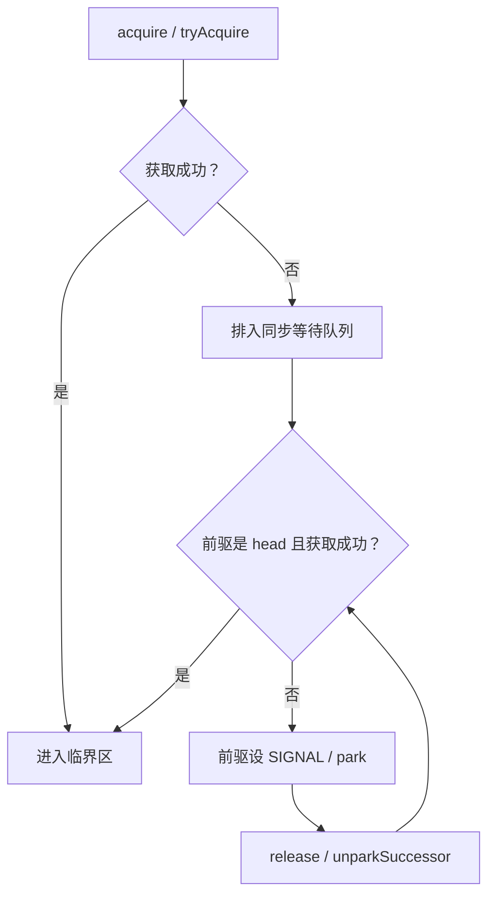

# Java 并发编程与锁机制

本章使用 OpenJDK 8u462-b08 和 HotSpot 8。先从一个容易写错的计数器说起，再看线程拿不到锁时到底发生了什么。

## 核心知识与原理

### JMM 与 happens-before

假设两个线程各执行一次 `count++`，初始值是 0。我们期待结果是 2，但两个线程可能都先读到 0，各自算出 1，最后都把 1 写回去。问题出在“读取、计算、写回”这三个动作可以交错。即使把 count 声明为 volatile，也没有把这三个动作合成一步。

volatile 适合另一种问题：一个线程修改开关，另一个线程需要读到这个修改。例如服务关闭时，将 `running` 改为 false，工作线程下一次读取它时应按 volatile 的规则观察这个状态。它还约束相关读写的顺序。发布配置时，可以先把配置对象构造完整，再把它赋给 volatile 引用；读线程读取这个引用后，才能放心使用已经写好的配置字段。

JMM，也就是 Java Memory Model，规定的正是线程之间能看到什么结果。happens-before 可以理解为一条可见性保证：如果操作 A happens-before 操作 B，那么 A 的写入对 B 可见。常见来源包括同一线程的程序顺序、同一把锁的解锁与后续加锁、volatile 写与后续读，以及 start、join。这些关系可以传递。

这里容易混淆两件事：CPU 可以调整指令的实际执行顺序，但最终被其他线程观察到的结果必须遵守 JMM。不能因为本机跑了十万次都正常，就认为一段存在数据竞争的代码是正确的。双重检查锁里的引用为什么需要 volatile，也应从“对象是否构造完整才被其他线程看到”来解释。

final 字段在正确构造时有特殊的初始化保证，不过构造函数里把 this 提前交出去会破坏使用前提。final 修饰一个 List 引用，也只表示这个引用不能重新赋值，并不阻止线程修改 List 中的元素。

### synchronized 与 CAS

synchronized 的含义很直接：同一时刻只有一个线程可以进入受同一把锁保护的代码，解锁前的写入对后续拿到这把锁的线程可见。关键是“同一把锁”。两个线程分别锁各自新建的对象，仍然可能同时修改同一个库存。

HotSpot 8 为减少加锁开销做了多种优化。没有竞争时，偏向锁可以避免重复的同步操作；轻量级锁尝试用 CAS 和线程栈上的锁记录完成加锁；竞争严重时会使用 ObjectMonitor。对象头里的 Mark Word 保存相关状态。这些路径不是每次都按一条固定阶梯逐级走完，JIT 还可能消除不逃逸对象上的锁，或者合并相邻的加锁范围。偏向锁属于这里的 JDK 8 实现，不能照搬到已经移除它的新 JDK。

CAS 的意思是：只有当前值仍等于我刚才看到的值，才把它改成新值。库存当前为 10，线程 A 想改成 9；若线程 B 已先改成 8，A 的 CAS 就会失败，必须重新读取后决定是否再试。在 x86 上，相关原子读改写通常借助带 lock 前缀的指令，如 cmpxchg；其他 CPU 的实现不同。

CAS 只比较当前值，所以看不出“10 变成 8，后来又变回 10”这段历史。这就是 ABA。若历史变化影响判断，可以把版本号和数据一起比较，例如 AtomicStampedReference。竞争越激烈，失败重试越多，CPU 和缓存同步的开销也越大，因此 CAS 并不天然比锁快。

### AQS、共享同步器与线程池

AQS 替锁类完成了排队和等待的大部分工作。它保存一个 `state`，具体含义由子类决定：ReentrantLock 用它记录持锁次数，CountDownLatch 用它表示还剩多少次 countDown，Semaphore 用它表示可用许可。

以 ReentrantLock 为例，线程先尝试把 state 从 0 改成 1。成功后记录持锁线程；如果当前持锁者就是自己，只增加次数，这就是可重入。别的线程拿不到锁，就进入 AQS 的同步队列。队列头是一个占位节点，真正等待的线程在后面。

Condition 的等待队列是另一条队列。调用 await 的线程先释放锁，再等待条件；signal 把它移回同步队列，它还要重新拿到锁才能继续。被叫醒时，条件可能已经被其他线程改变，所以应写 `while (!条件满足) await()`，而不是只判断一次。

公平锁会检查队列前面是否还有人，非公平锁允许新到线程先尝试抢锁。公平锁通常减少长时间等不到锁的风险，但可能损失吞吐。一个容易漏掉的细节是：公平 ReentrantLock 的无参数 `tryLock()` 仍会尝试直接抢锁。

AtomicInteger 把更新集中在一个数值上。LongAdder 则把高并发计数分散到多个 Cell，读取总数时再加起来；读取过程中这些 Cell 仍可能改变，所以 sum 不是某个瞬间的完整快照。统计请求数很合适，判断“余额够不够扣”则不合适。CountDownLatch 归零后不能重置；Semaphore 可以限制同时进行的操作数，获取成功后要在 finally 中归还许可。

线程池的处理顺序尤其值得记住。线程数不足 core 时先开线程；达到 core 后先把任务放进队列；队列装不下才尝试增到 maximum；仍装不下就拒绝。因此，core=8、max=64 配上无界队列，通常只会有 8 个工作线程，更多任务都在排队。

拒绝策略决定过载时业务会怎样。AbortPolicy 抛异常，调用方必须处理；CallerRunsPolicy 让提交者执行任务，可以减慢提交速度，但提交者若是 Netty EventLoop，就会连累其他连接；Discard 和 DiscardOldest 会丢任务，不适合直接处理订单或支付。设置队列大小前，先想清楚请求最多能等多久，以及每个排队任务占多少内存。

### 手工推演：释放与取消为什么不会丢队列

考虑 `head → A → B`。A 在等锁，B 已经取消等待。释放锁时，AQS 会寻找仍有效的等待者；遇到不能直接使用的后继，可能从队尾反向寻找。等待线程也会跳过已经取消的前驱并修补链接，避免一个取消节点挡住后面所有人。

A 被唤醒后并没有直接得到锁。假如新来的非公平线程先抢到了，A 还得继续尝试和等待。排查线程长期 WAITING 时，先找谁持锁、它在做什么，再判断队列是否还在前进。一张线程栈只能说明当时在等，连续几张栈更有助于区分短暂竞争和真正卡住。

类似地，shutdownNow 只是尝试中断工作线程，并不会强制停止所有代码。阻塞 IO 或忽略中断的任务仍可能运行。Future.get 超时也只是调用方不再等结果；如果任务没有被取消，或不能及时响应取消，它依然占用线程和连接。

## 源码级解析与调用链

拿锁的入口是 `AbstractQueuedSynchronizer.acquire`。它先让子类的 tryAcquire 试一次，失败才 addWaiter 入队；acquireQueued 负责后续反复尝试和等待。释放端通过 tryRelease 判断是否完全释放，再寻找后继唤醒。

线程池从 `execute` 看最容易：不足 core 时 addWorker，之后尝试 workQueue.offer，装不下才用 maximum 限制加 worker。Worker 自身继承 AQS，主要保护这个工作线程的执行状态，并没有把整个池的任务串成一条。runWorker 执行任务和钩子，worker 异常退出由 processWorkerExit 后续处理。

<!-- source:aqs -->

<!-- source:aqsqueue -->

<!-- source:pool -->

## 面试官三层追问

### 1. volatile 能替代锁吗？

查看回答与追问

不能全面替代。volatile 适合状态开关和完整配置的引用发布。`count++` 即使读写可见，两个线程仍可能各自读到同一个旧值，再写回相同结果。要把检查和修改一起保护，才应使用锁或原子操作。

**配置字段为什么也能被读到？** 构造配置时先写字段，再写 volatile 引用；另一个线程读取这个引用后，相关先前写入通过 happens-before 对它可见。AtomicInteger 的自增则走原子读改写，与普通 volatile 自增不同。

**库存怎么处理？** 如果要求库存足够才扣减，必须将条件和扣减做成一个原子动作。可用 CAS 循环，涉及持久业务时通常用数据库条件 UPDATE。单给库存字段加 volatile 还不够。

### 2. AQS 为什么先设置 SIGNAL 再 park？

查看回答与追问

等待线程先把“释放锁时请叫醒我”记录在前驱节点上，才能安心 park。这样释放方知道后面有人在等。unpark 可以提前给一个许可，所以通知比 park 早到，也不一定丢失。

**哪行代码避免刚设完 SIGNAL 就睡错？** shouldParkAfterFailedAcquire 设置前驱状态后先返回 false，外层循环会再试一次拿锁。真的等待和醒来以后，都继续检查获取条件，而不是把通知当成拿锁成功。

**线程长期 WAITING 怎么查？** 先找持锁线程的业务栈。如果它一直等慢 SQL，后面排队是结果，问题在锁内做了慢 IO。连续采样再判断谁不前进，比只看到 park 就怀疑 AQS 更可靠。

### 3. 公平锁是否一定更好？

查看回答与追问

公平锁减少新线程直接插队的机会，常能改善最长等待时间；非公平锁允许先抢一下，通常有利于吞吐。哪种更好取决于是否真的有人长期等不到，以及切换开销有多大。

**公平到什么程度？** FairSync.tryAcquire 先检查 hasQueuedPredecessors，再尝试 CAS；已经持锁的线程可以重入。无参数 tryLock 仍采用非公平尝试，所以公平实例也不承诺所有入口严格 FIFO。

**项目里如何决定？** 在同一负载下比较吞吐、p99、最长等待和 CPU。若锁里是一个 2 秒的接口调用，先缩短持锁范围，换公平锁不能让这个调用变快。

### 4. LongAdder 为什么快，何时不能用？

查看回答与追问

多个线程反复修改同一个计数器，会争抢同一处更新。LongAdder 高竞争时把写入分散到多个 Cell，最后求和，减少这种争抢。AtomicInteger 则更适合需要精确单值更新的地方。

**sum 为什么不能当快照？** Striped64.longAccumulate 根据线程 probe 选 Cell，失败后可能换槽或扩容。sum 逐个读 base 和 Cell 时，其他线程仍在修改它们，因此这些值不一定来自同一个瞬间。

**能不能用于抢票？** 请求总量统计允许短时偏差，可以用它；判断还有没有最后一张票，需要检查和扣减一起成功，不能先 sum 再减。应选精确 CAS 或数据库条件更新。

### 5. 线程池为什么没扩到 maximumPoolSize？

查看回答与追问

因为线程池到 core 之后优先入队，只有队列装不下才尝试加非核心线程。无界队列几乎不会因为容量返回失败，所以 max=64 并不意味着它一定会扩到 64。

**源码里还有什么检查？** execute 成功 offer 后重新检查池状态。若此时已关闭，会尝试移除并拒绝；若没有 worker，还要补一个线程。这里也处理提交和关闭同时发生的情况。

**线上应该怎么配？** 先确认下游能完成多少任务、允许排队多久，再用有界队列和明确拒绝。还要记录队列等待、拒绝和 Future 异常。只增加线程而数据库连接不变，常常只是增加等待者。

### 6. 如何区分死锁、锁竞争和线程饥饿？

查看回答与追问

死锁是几方相互等待、谁也不能释放对方需要的资源；锁竞争是有人等待一个仍在工作的持有者；线程饥饿可能来自没有可用线程执行后续工作。CPU 低时三者都可能出现。

**线程栈能区分什么？** Monitor 等待常见 BLOCKED，AQS park 常见 WAITING，jstack 的锁与 ownable synchronizers 信息可帮助建立等待关系。同一满线程池中父任务等子任务，也可能卡住，却没有传统 Monitor 环。

**修复要针对哪种原因？** 循环锁采用固定加锁顺序；长持锁移出慢 IO；父子任务饥饿拆开执行器或改异步组合。用多次线程栈和队列变化确认恢复，不要只把池调大。

## 模拟生产案例：队列吞噬内存

导出服务越来越慢，core=8、max=64，实际却一直只有 8 个工作线程。更多任务排在队列中，最终堆内存耗尽。这是一种模拟情境，用来区分线程配置问题和任务泄漏。

先连续记录 activeCount、queue.size、完成速率和数据库响应时间，再看工作线程的栈。若是无界队列加慢数据库，应该能看到队列持续增长，工作线程多在等查询；dump 中则能追到队列持有请求对象。这些信息一起出现，才支持这个解释。

原因是 core 满后任务优先进队列，没有触发增加非核心线程；数据库变慢又降低完成率。先暂停或限制新导出，之后改成有界队列、明确拒绝和异步导出结果查询。增加线程前核对数据库连接能力。

验证时重放相同慢依赖条件，检查内存是否稳定、拒绝是否可预期、用户能否知道任务未被接受。长期监控排队时间，处理取消与异常，避免客户端收到拒绝后立即大量重试。

## 面试回答与核心总结

### 60 秒快速回答

volatile 能让状态修改按规则被其他线程看到，但不能把 count++ 变成一个动作。锁用于保护一起完成的检查和修改，CAS 用于一个状态的原子更新。ReentrantLock 拿不到锁时由 AQS 排队，被唤醒后还要再抢。线程池要注意先 core、再队列、最后 max，所以无界队列会隐藏过载。我会先看谁持锁、谁在排队、下游完成多少，再决定改锁还是改容量。

### 2～3 分钟深入回答

我会先把可见性和原子性分开。两个线程各执行 count++，即使 count 是 volatile，也可能都读到 0、都写回 1。volatile 更适合发布一个已构造完整的配置引用；若要检查库存并扣减，就得把这两步一起保护。

ReentrantLock 用 AQS 的 state 记录获取次数，再记录谁持锁。当前线程已经持有时可以重入，别人获取失败就进入同步队列。等待前设置前驱 SIGNAL，让释放方知道需要唤醒后继。醒来后仍调用 tryAcquire，不能把一次 unpark 当成锁已交给自己。Condition 则先在另一条队列等，signal 后转回同步队列，重新拿锁再检查条件。

公平锁会考虑前面有没有等待者，非公平锁允许新到线程先试一下；但公平实例的无参数 tryLock 也可能插队。选型要看吞吐和最长等待，不是只看名字。高并发统计可用 LongAdder 分散写入，不过 sum 不是一个瞬间的快照，不能用于最后一张票的判断。

线程池我会具体看 execute：core 不足先加线程，之后先入队，队列满才试 max。无界队列下，max 调大可能没用。如果慢数据库让任务堆积，要先限制排队和回源，给拒绝明确业务处理。CallerRuns 在普通提交线程上能减速，但放到网关事件线程上可能拖累其他请求。

最后用连续线程栈、队列变化、完成率和尾延迟验证原因。锁内慢 IO、线程池父任务等子任务、真正循环死锁，需要不同改法。关闭和取消也要处理资源释放；调用方超时不代表任务已经停止。

### 高频追问、常见错误与速记

- 高频追问：Condition 为什么用 while？公平 tryLock 会不会插队？Future 里的异常谁来处理？
- 容易答错：把 volatile 说成互斥；把唤醒说成拿锁；认为 LongAdder.sum 精确；只加线程不看连接池。
- 常看的源码：`AQS.acquire/acquireQueued/release`、`ReentrantLock.Sync`、`Striped64.longAccumulate`、`ThreadPoolExecutor.execute/runWorker`。
- 阅读时分清：状态是否可见、修改是否一起完成、线程怎样等待，以及过载任务去哪了。
