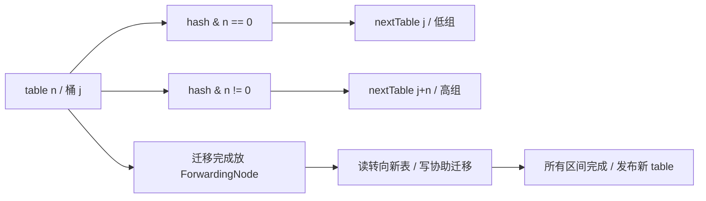
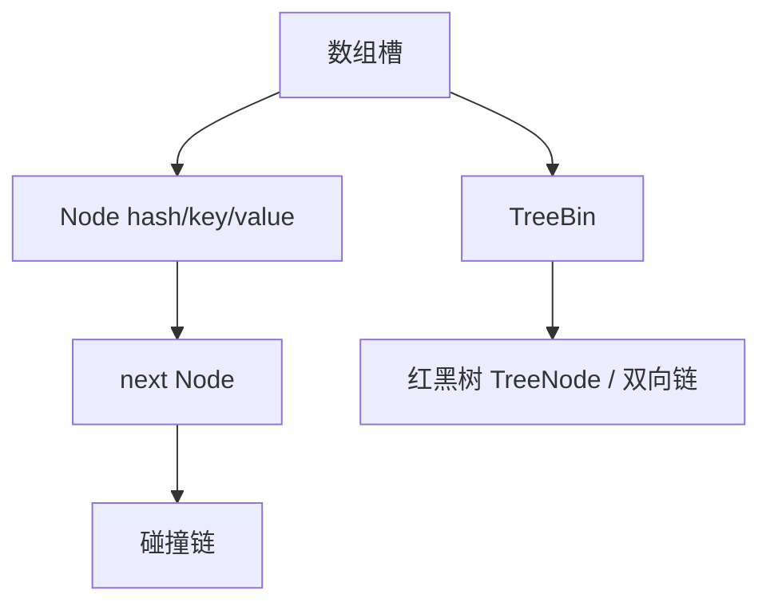

# HashMap 与 ConcurrentHashMap

本章看 OpenJDK 8u462-b08。读 Map 源码时，沿着“一个 key 放在哪里、冲突怎么办、扩容时怎么搬”这三个问题往下走，会比先背阈值更容易理解。

## 核心知识与原理

### HashMap 的桶、树与迁移

HashMap 可以先看成一个数组。每个数组位置叫一个桶，key 的 hash 决定它进哪个桶。两个 key 落到同一个桶时，用链表串起来；碰撞太多且数组容量足够大时，再把这个桶改成红黑树。

数组长度是 2 的幂，因此可以用 `(n - 1) & hash` 找下标。长度为 16 时，只用到 hash 的低 4 位。如果很多 key 的差异都在高位，它们仍会挤到少数桶里。`hash()` 先做 `h ^ (h >>> 16)`，把高位信息混入低位，就是为了缓解这类碰撞。这一步无法拯救所有糟糕的 hashCode，更不是加密。

默认负载因子是 0.75。长度 16 的表通常在元素数量超过 12 时扩容，但 table 是第一次 put 时才分配的。Node 保存 hash、key、value 和 next。key 放进去后，参与 hashCode 或 equals 的字段应保持稳定，否则再次查询可能算出另一个桶，原来的数据明明还在，却查不到。

树化涉及三个数字：链长阈值 8、退树阈值 6、最小树化容量 64。它们不是“第 8 个元素必定成树，第 6 个必定退树”的机械规则。`treeifyBin` 发现容量不足 64 时会先扩容；具体第几次插入触发调用要看 putVal 的链长计数。扩容拆树时会看分组后的数量，而普通删除还会检查树形。

JDK 7 的某些扩容交错会把链表接成环，JDK 8 改变迁移方式后解决了这一类问题。但两个线程仍可能同时写同一个桶，把对方的更新覆盖掉，size 也可能算错。所以 JDK 8 HashMap 依然不能用于没有同步保护的并发读写。fail-fast 迭代器能尽力报告修改，却不能替你保护数据。

### ConcurrentHashMap 的读写协议

JDK 8 ConcurrentHashMap 的主体也是数组和桶，不再依靠 JDK 7 那套 Segment 数组。插入时，如果目标桶是空的，就用 CAS 放入第一个节点；如果桶已有节点，就锁住桶头，修改这个桶。拿到锁后还要确认它仍是当前桶头，因为等待期间可能发生了扩容。

get 通常不需要取得桶锁。它通过带 volatile 语义的槽位读取，以及节点中的 volatile value、next，查找已经发布的节点。遇到普通链表就沿链走，遇到特殊节点就交给它的 find 方法。树桶由 TreeBin 管理，有自己的读写协调方式。

扩容时的难题是：搬到一半，其他线程仍在读写。CHM 的办法是在搬完的旧桶里放一个 ForwardingNode，它指向新数组。读线程遇到它就去新表找，写线程遇到 MOVED 时还可以帮助搬迁。

`transferIndex` 记录还有哪些区间没分配，各线程领取不同区间，减少重复搬迁。`sizeCtl` 平时用于初始化或扩容阈值，扩容时还编码了本轮扩容标识和参与者信息，不能简单理解成一个负的线程数。最后负责收尾的线程才把新表正式发布为 table。

元素数量也被分散统计：低竞争时更新 baseCount，竞争激烈时更新 CounterCell。size 把它们相加，并没有暂停全表的更新。因此没有并发修改时可以得到准确数量，修改期间应把它当作估计。mappingCount 返回 long，仍不意味着它是一份全表快照。CHM 不接受 null key 或 value，这让 get 返回 null 可以明确表示没有映射。

### 原子 API 的边界

下面的写法有竞态：先 get，发现没有，再 put。两个线程可能都发现没有，各自写入。putIfAbsent 把检查和插入放在一个操作里，只有一个线程能安装自己的值。

computeIfAbsent 进一步允许你在缺值时计算结果。不过，JDK 8 的某些路径会在桶锁内运行计算函数：若函数去访问一个很慢的远程接口，碰撞到同一个桶的其他 key 也会跟着等。空桶路径还可能使用 ReservationNode 占位。函数应短小，不要递归修改这个 Map；返回 null 或抛异常都不会成功安装映射，以后的调用还可能重算。

缓存远程数据时，可以先用短操作安装一个 Future，再在单独的线程池里执行加载。这样仍需处理加载失败、过期和容量，不能只把一个慢操作改成无界异步任务。Map 能保证自己的单次修改，却不能保证远程调用只执行一次，也不能替两个 key 的联合修改提供事务。

### 手工推演：从 16 扩容到 32

旧表长度是 16。hash=3 和 hash=19 都会进入桶 3，因为它们的低 4 位相同。扩成 32 后多用一位：`3 & 16` 是 0，所以留在桶 3；`19 & 16` 不是 0，所以移到桶 19，也就是旧下标加 16。

因此每个旧桶只拆成两组，元素不会散到任意新桶。HashMap 在拆链时保留每组的相对顺序。CHM 的细节略有不同：它可以复用 lastRun 后缀，并为前面部分建立新节点。共同点是，CHM 必须先发布新表中的两个桶，再把旧桶替换成 ForwardingNode。否则读线程顺着指引过去，却找不到已经迁移的内容。

## 源码级解析与调用链

先看 `HashMap.hash` 为什么混高位，再看 CHM 的 `putVal` 怎样分空桶、迁移桶和普通桶。`transfer` 则是搬迁主循环，它最重要的顺序是先放新桶，后放旧桶的路标。

HashMap 完整插入入口是 putVal，扩容入口是 resize，树化入口是 treeifyBin。更新已有 key 不会增加 size，新增节点才算一次结构修改。CHM 的遍历允许并发变化，通常不抛 ConcurrentModificationException，也不保证一次完整快照。

<!-- source:hashmap -->

<!-- source:chm -->

<!-- source:chmput -->

## 面试官三层追问

### 1. 为什么用 2 的幂容量和 hash 扰动？

查看回答与追问

长度为 2 的幂时，可以用位与取下标，扩容也只需看新增的一位。扰动把 hashCode 的高位混到低位，避免只看低几位时一些 key 都进同一个桶。

**扩容为什么不用重新算 hashCode？** 节点已经保存扰动后的 hash。长度翻倍时检查 hash & oldCap，就能决定留在原下标还是移到原下标加 oldCap。完整 hash 不需要重算。

**容量怎么定？** 预估元素数量和负载因子，减少峰值期间迁移。过度预分配也占内存、拖慢某些遍历。若用户 key 的 hashCode 本身很差，还要检查分布和碰撞，不能只扩容。

### 2. 树化阈值是 8，为何有时仍是链表？

查看回答与追问

桶里链表较长时会考虑树化，但表长度不足 64 时优先扩容。较小的表里碰撞多，可能只是桶太少，扩容后就分开了，没有必要立即换更重的树节点。

**8 和 6 是怎么用的？** putVal 的链长计数决定何时调用 treeifyBin，不能直接说第 8 个一定树化。扩容拆树时有数量判定，普通删除也会考虑树形；不同路径要分开读。

**树化是不是性能优化首选？** 它主要保护碰撞严重时的表现。先改善 key 的分布。不可比较的 key 在某些树查找路径也有额外代价，不应把所有情况都简化成固定 logN。

### 3. JDK 8 HashMap 没有迁移环，还安全吗？

查看回答与追问

仍不安全。JDK 8 避免了旧迁移方式产生环的一类问题，但没有给 HashMap 增加并发写保护。两个 put 仍可能覆盖，读也没有自动获得需要的发布保证。

**具体会错在哪里？** 两线程都看到空桶并分别写入，后写者可能覆盖前写者；size 的增量也不是原子操作。modCount 和 fail-fast 只是尝试发现结构变化，不会互斥地保护数据。

**只读配置能用吗？** 可以先在单线程中构建，安全发布完整引用，并确保之后不修改。动态共享更新可用 CHM，不过多个 key 一起变化的业务规则仍要另加保护。

### 4. CHM 扩容期间 get 会不会漏数据？

查看回答与追问

迁移完的旧桶会变成 ForwardingNode，告诉读线程到新表继续找。因此 get 不必等全表搬完。还没迁移的桶仍按原来的结构查询。

**发布顺序有什么讲究？** transfer 先在 nextTable 放好低、高两组，再把旧槽放成 forwarding。写线程遇到 MOVED 可协助迁移，读通过 find 转到新表。不能先给路标，再迟迟没有目的数据。

**两次 get 能保证一起吗？** 不能。每次查询正常，不代表两次之间没人修改。需要多 key 一致状态时，应保存一个整体不可变对象、用外部同步或数据库事务。容量预估只是减少迁移成本。

### 5. computeIfAbsent 能用来加载远程数据吗？

查看回答与追问

可以写，但不适合把慢远程 IO 直接放进去。JDK 8 的部分路径会在桶锁内运行函数，同桶其他 key 也会被拖慢。映射函数最好快速完成。

**会不会只执行一次外部动作？** 返回 null 或抛异常不会安装映射，后续可能重算；删除后也可能再加载。ReservationNode 与锁保护的是 Map 操作，不是远程付款等副作用。也不要在函数中递归修改 Map。

**如何改加载？** 用短操作安装 Future，加载交给有界执行器。失败清理用 remove(key, 同一个Future)，免得删掉后来新装的值。还要处理超时、过期和缓存总量。

### 6. size 能作为并发限流依据吗？

查看回答与追问

不能。两个线程都可能在 size() 小于上限时通过，然后分别插入。即使 size 读取完全准确，检查和插入之间仍会有竞态。

**为什么并发 size 还是估计？** sumCount 分别读 baseCount 和 CounterCell，其他线程并没有停下来。mappingCount 用 long 解决表达范围，不提供一份冻结的全表快照。

**限额用什么？** 用 Semaphore 或原子条件计数控制准入，并处理失败、取消和过期时的释放。若计数与 Map 插入分离，也要确保失败后两边不会永远不一致。

## 模拟生产案例：缓存加载造成桶级阻塞

画像缓存用 computeIfAbsent 调远程接口，一个接口超时后，一些不同用户的加载也突然变慢。这是模拟情境，重点检查是否误把远程调用放进了桶锁。

先比较阻塞线程的 Monitor 地址和调用栈，再检查 key 的 hash 分布。若多个不同 key 碰撞到同一桶，应该能看到一个线程在映射函数里等网络，其他线程等同一个 Node Monitor。线程池总体有余量，也不排除这种局部阻塞。

改成快速安装加载 Future，再由有界执行器做 IO。失败时只删除自己安装的那个 Future，设置超时与缓存上限。改善 hashCode 能减少碰撞，但不能代替移出慢操作。

可在测试中使用固定 hashCode 的 key 和慢加载器对照：改后不同 key 不再因为桶锁一起等，重复同 key 仍按预定方式合并。以后测试热点和碰撞，不只测试均匀随机 key。

## 面试回答与核心总结

### 60 秒快速回答

HashMap 用数组找桶，碰撞用链表，长链且容量足够时换树。扩容翻倍后只需看旧容量那一位，决定留原桶还是加旧容量。JDK 8 HashMap 仍不适合无同步并发写。CHM 空桶 CAS、有节点时锁桶，搬完的旧桶放 ForwardingNode，读去新表找、写可帮忙搬。size 是并发估计，computeIfAbsent 不适合慢 IO；单个 Map 操作正确，也不等于多个业务步骤有事务。

### 2～3 分钟深入回答

我会从一个 put 讲起。HashMap 先扰动 hash，把高位信息混到低位，再用长度减一做位与定位桶。桶空就插入，有节点就比较 key，相同则更新，否则追加。链长到触发条件时还要看容量，表不足 64 会先扩容，不是背一个 8 就结束。

扩容可以手算：旧长度 16，hash 3 和 19 都在桶 3。长度变 32 后，3 的新增位是 0，仍在 3；19 的新增位是 1，去 19。HashMap 拆链保留分组内相对顺序，解决了旧头插迁移形成环的一类问题，但没有增加并发保护，覆盖写和 size 错误仍可能发生。

CHM 的空槽用 CAS 安装，非空桶锁住头节点后重查，防止等待期间桶已经变化。读取通过带 volatile 语义的槽和链接查找。扩容先把新桶放好，再在旧桶放 ForwardingNode；读者沿它转向新表，写者还可以协助。transferIndex 分配搬迁区间，最后收尾发布新 table。

计数用 baseCount 和 CounterCell 分散更新，size 求和没有暂停其他线程，所以不能先 size 小于限额再插入。computeIfAbsent 也只负责映射操作，慢计算可能挡住同桶 key，失败还可能再次计算，不能借它保证付款只执行一次。

实际做缓存，我会检查 key 是否稳定、hash 分布、加载耗时和容量。需要多 key 一起变化时另设计同步或数据库事务；加载 IO 则与快速安装占位分开，并测试超时、失败和旧任务清理。

### 高频追问、常见错误与速记

- 高频追问：为什么 CHM 不接受 null？扩容什么时候发布新表？key 改了为什么查不到？
- 容易答错：CHM 完全无锁；负 sizeCtl 就是负线程数；HashMap 没环就线程安全；映射函数外部副作用只执行一次。
- 常看的源码：`HashMap.hash/putVal/resize/treeifyBin`、`ConcurrentHashMap.putVal/transfer/helpTransfer/addCount/sumCount/computeIfAbsent`。
- 阅读时分清：放入一个 key 的过程，与同时改变多个业务值的过程。
