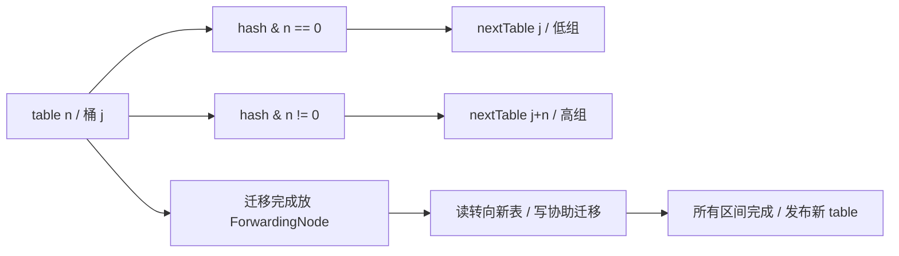
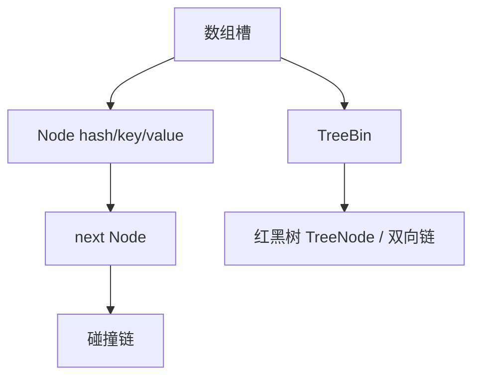

# HashMap 与 ConcurrentHashMap

版本基线：OpenJDK 8u462-b08；JDK 7 的头插迁移仅作历史对照。把桶结构、线性化点和迁移协议分开理解，才能解释容量、吞吐及错误边界。

## 核心知识与原理

### HashMap 的桶、树与迁移

HashMap table 的长度是 2 的幂。`(n-1)&hash` 定位桶，hash 将原 hashCode 高 16 位 XOR 到低位，改善低位分布，不是加密。Node 保存 hash、key、value、next；碰撞用链表，长链在容量满足条件时转红黑树。默认 loadFactor=0.75，threshold 是下一次扩容的 size 阈值；首次 put 才分配 table。可变 key 若改变参与 equals/hashCode 的字段，可能再也找不到原映射。

TREEIFY_THRESHOLD=8、UNTREEIFY_THRESHOLD=6、MIN_TREEIFY_CAPACITY=64 是实现阈值；“插入第 8 个元素就一定树化”不准确，要看 putVal 的计数逻辑和表容量。容量小于 64 时 treeifyBin 优先 resize。resize 从 n 变 2n，元素只可能留在 j 或移动至 j+n，由旧容量位 `hash & oldCap` 决定，链表低/高两组保留相对顺序。树桶拆分会根据各组大小决定退化为链表；普通 remove 的退树还可能根据树形判定，不能说所有路径都机械比较 6。

JDK 7 旧实现头插迁移在并发交错时可能形成环；JDK 8 的相对顺序迁移避免了该特定机制，但仍会丢更新、错误可见性和 size 竞争。迭代器 fail-fast 是尽力发现结构变化，不是线程安全保障。读写共享 HashMap 必须通过安全发布与外部同步，否则“只有一个写线程”也不能保证读线程安全。

### ConcurrentHashMap 的读写协议

JDK 8 不再使用 JDK 7 的 Segment 锁数组主结构。table 的节点槽通过 Unsafe volatile 访问；get 读槽后沿 next 查找，遇到负 hash 的特殊节点交给 find。空桶插入 CAS，非空桶以桶头 f 的 synchronized 保护修改，进入后验证 f 仍是当前桶头，避免锁住过期节点。树桶用 TreeBin 管理读写协调，不是给整个表加一把锁。

sizeCtl 非负时承载初始化/扩容阈值，负数可能表示初始化或编码了扩容 stamp 与参与者数量，不能笼统解释为“负数就是 -线程数”。transferIndex 把迁移区间分给线程；迁移完的旧桶放 ForwardingNode，指向 nextTable。写线程遇到 MOVED 可 helpTransfer，读线程通过 ForwardingNode.find 在新表查找；迁移最后的收尾线程发布新 table 与阈值。

size 基于 baseCount 与 CounterCell 累加，sumCount 不是冻结全表得到的快照；无并发更新时准确，并发期间只适合估计。size 返回 int，mappingCount 返回 long，但后者也不提供并发事务快照。null key/value 被禁止，get 返回 null 可以表达无映射。

### 原子 API 的边界

putIfAbsent 将“检查不存在并写入”放进一次容器原子操作，避免 get→put 的竞态。computeIfAbsent 对该 key 的计算/安装提供原子性，但映射函数不可递归更新本 Map，并应短小；空桶可能用 ReservationNode 占位，非空桶要锁桶，慢网络调用会阻塞碰撞 key。JDK 8 该路径对已有 key 也可能锁桶，不要把新版优化套回 JDK 8。映射函数返回 null 不建立映射，抛异常也不成功安装。它不是外部业务 exactly-once 执行框架。

### 手工推演：从 16 扩容到 32

旧容量 16，hash=3 与 hash=19 都定位旧桶 3；扩容后 3&16=0 留在新桶 3，19&16=16 去桶 19。HashMap 拆低/高链时连接相对顺序；CHM transfer 可复用 lastRun 后缀并为前段建立新节点，不能说两个类迁移每条链的算法完全一样。CHM 先 setTabAt(nextTab,i,ln) 与 setTabAt(nextTab,i+n,hn)，再 setTabAt(tab,i,fwd)，读看到 forwarding 才有对应新桶可查。

迁移所有权由 transferIndex 区间领取提供，sizeCtl 协调参与者和收尾。线程拿到一个区间后完成该区间，遇到已经 MOVED 的桶跳过；遇到非空桶持头锁重查。业务需要多 key 原子交换时，两个 put 各自线性化仍暴露中间状态，应整体封装不可变值、外部同步或把事务放在数据库。预先容量只减少迁移，不提供更强的一致性。

## 源码级解析与调用链

`HashMap.put → putVal → resize / treeifyBin`：先定位桶，逐节点比较 hash 以及 key identity/equals，更新已有值不会增加 size，新节点才递增 modCount 和 size。`ConcurrentHashMap.put → putVal → initTable / casTabAt / synchronized(f) → addCount → transfer`：CAS 空槽是相应插入的线性化点，链/树更新在桶锁内完成。读线程通过 volatile 链接和 value 看到发布的节点；弱一致遍历不会抛 ConcurrentModificationException，但不保证同一时刻视图。

<!-- source:hashmap -->
<!-- source:chm -->
<!-- source:chmput -->

## 面试官三层追问

### 1. 为什么用 2 的幂容量和 hash 扰动？

展开三层参考答案

**第一层：**位与替代取模，扩容时利用单个位决定迁移目的地；扰动把高位信息混到低位，减少某些 hashCode 分布的集中。

**第二层：**hash 为 h XOR (h>>>16)，resize 按 oldCap 位拆链，既不重新调用用户 hashCode，也不必对每个元素做完整重新定位。恶劣 hashCode 仍可能制造碰撞。

**第三层：**提前估算容量可减少迁移峰值，但过度预分配增加内存和遍历成本。外部输入场景要考虑碰撞攻击与 key 质量，不只盯平均 O(1)。

### 2. 树化阈值是 8，为何有时仍是链表？

展开三层参考答案

**第一层：**容量不足 64 时优先扩容，因为碰撞可能来自当前桶数太少。

**第二层：**putVal 的 binCount 从遍历位置计算，treeifyBin 的调用条件与插入前链长有关。树查找涉及 Comparable 判断和 tieBreakOrder，不能把每种 key 的所有路径都简化为严格 logN。

**第三层：**评估 key.hashCode 分布和内存成本；树节点比链节点重，树化是退化保护，不是鼓励故意制造碰撞。通过分布直方图而非仅 size 判断质量。

### 3. JDK 8 HashMap 没有迁移环，还安全吗？

展开三层参考答案

**第一层：**不安全；解决一种历史死循环原因不等于增加线程同步。

**第二层：**多个 put 可能同时认为桶空而相互覆盖，size++ 非原子，resize 与读写缺乏 happens-before。modCount 和 fail-fast 也没有互斥功能。

**第三层：**配置快照可构建 HashMap 后通过 volatile 引用发布并禁止修改；动态共享映射采用 CHM，但跨 key 不变量仍需业务锁或数据库事务。关联阅读：<a href="#c1">JMM</a>。

### 4. CHM 扩容期间 get 会不会漏数据？

展开三层参考答案

**第一层：**迁移通过旧桶 ForwardingNode 把查找引导到新表，使迁移阶段仍可读。

**第二层：**transfer 持桶锁拆低/高链，先发布新表槽，再把旧槽替换为 forwarding；空旧槽也会被标记。读线程遇到 MOVED 通过 find 继续查找，不是必须等待所有扩容完成。

**第三层：**单 key 操作有容器的并发保证，但两次 get 之间仍可发生业务修改，不能假定批量一致。容量规划避免峰值请求时频繁扩容，测 CPU、分配率和 p99。

### 5. computeIfAbsent 能用来加载远程数据吗？

展开三层参考答案

**第一层：**可以执行映射函数，但慢 IO 不宜放在其中；它会阻塞其他相同 key 或碰撞桶的更新。

**第二层：**JDK 8 使用 ReservationNode 和桶锁等机制保证安装的原子性，函数不能递归更新 Map。异常和 null 会让以后调用再次计算，不能保证外部副作用只执行一次。

**第三层：**将 Map 值设计为快速安装的 Future/加载占位，实际 IO 使用有界执行器，失败移除时使用 remove(key, sameFuture)，配合超时和容量上限；优先采用成熟缓存库的加载协议。

### 6. size 能作为并发限流依据吗？

展开三层参考答案

**第一层：**不能把 `size() < limit` 后 put 当成原子检查与修改，两线程都可通过判断。

**第二层：**sumCount 对 baseCount 和 CounterCell 求和没有锁住写线程，结果是估计。即使某次读取准确，下一次 put 前条件也可能已变化。

**第三层：**容量准入使用 Semaphore、独立原子计数的 CAS 条件操作，或把额度与插入放在同一同步协议中。失败、取消、过期必须释放额度，避免 Map 和计数不一致。

## 模拟生产案例：缓存加载造成桶级阻塞

**故障现象：**服务使用 computeIfAbsent 加载用户画像，下游超时后无关用户也出现长延迟。**排查思路：**比较多个线程栈的阻塞 Monitor 地址，采样 key hash 与 CHM 桶分布，排除全局线程池满。**原理分析：**映射函数在 JDK 8 桶锁路径内调用，碰撞 key 共享等待点。**根因与验证证据：**模拟 key 固定 hashCode，一个慢加载线程持有 Node Monitor，其他不同 key 停在 computeIfAbsent；修改 key 哈希只能减少概率，将 IO 移出锁后才消除长持锁。**解决方案：**短操作安装 Future，占位与完成分离，失败按值身份删除，设置下游超时。**长期预防：**缓存大小上限、加载并发隔离、哈希分布和尾延迟压测；热点 key 使用同 key single-flight，但不能把跨 key IO 串行化。

## 面试回答与核心总结

### 60 秒快速回答

JDK 8 HashMap 是数组、链表、红黑树，按 2 的幂定位，扩容按旧容量位拆成两组；容量不足 64 时树化会先扩容。它仍然并发不安全。CHM 空桶 CAS、非空桶锁桶，读通过 volatile 节点与 ForwardingNode 在扩容时继续查找；transferIndex 支持多线程协作。size 是并发估计，computeIfAbsent 应避免慢 IO 和递归修改，容器原子性不等于业务事务。

### 2～3 分钟深入回答

从一个 key 的 put 讲 hash 扰动、桶定位和相等判断，再手算 n=16 时 hash 的第 5 位如何决定迁移到 j 或 j+16。解释树化同时受链长和容量限制，JDK 7 环与 JDK 8 丢更新是不同风险。随后沿 CHM.putVal 讲 initTable、空槽 CAS、锁头校验、addCount 和迁移触发，说明 nextTable、transferIndex、ForwardingNode 的发布顺序。结尾用慢 computeIfAbsent 案例指出性能边界，并给出异步占位、失败清理和容量控制。

如果面试官问一致性，我会明确 CHM 的原子 API 覆盖单 key 操作，不覆盖多个 key 的业务不变量。size 只是并发估计，先检查容量再插入会竞态；映射函数也不能承担外部副作用恰好一次。生产场景中先找 key 分布、桶锁持有时间与扩容热点，慢加载用快速安装 Future 再隔离 IO，失败按值身份清理。这个方案仍要有容量和超时，避免缓存加载从锁竞争变成无界 Future 队列。

### 高频追问、常见错误与速记

高频追问：为什么不能放 null？为什么 key 必须稳定？扩容时谁发布新 table？常见错误：CHM“完全无锁”；负 sizeCtl“就是线程数”；size 与 put 组成限额；把 computeIfAbsent 当业务去重。高频源码：HashMap.hash/putVal/resize/treeifyBin，ConcurrentHashMap.putVal/transfer/helpTransfer/addCount/sumCount/computeIfAbsent。核心知识：**桶定位→发布与锁→协作迁移→单操作与业务边界**。
