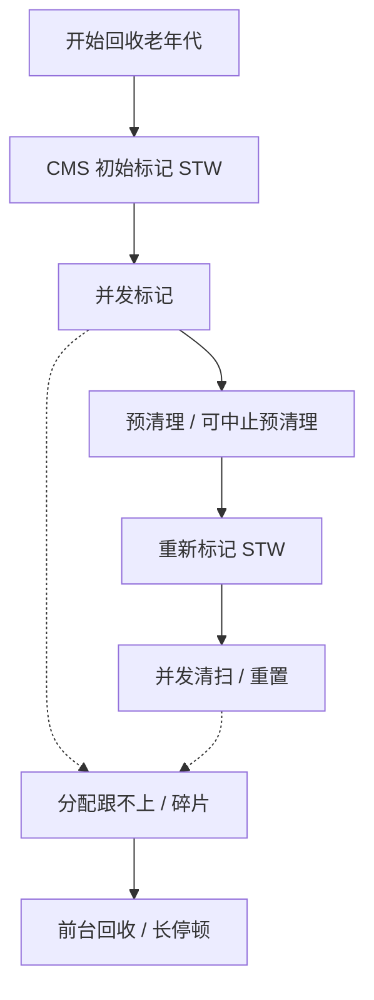
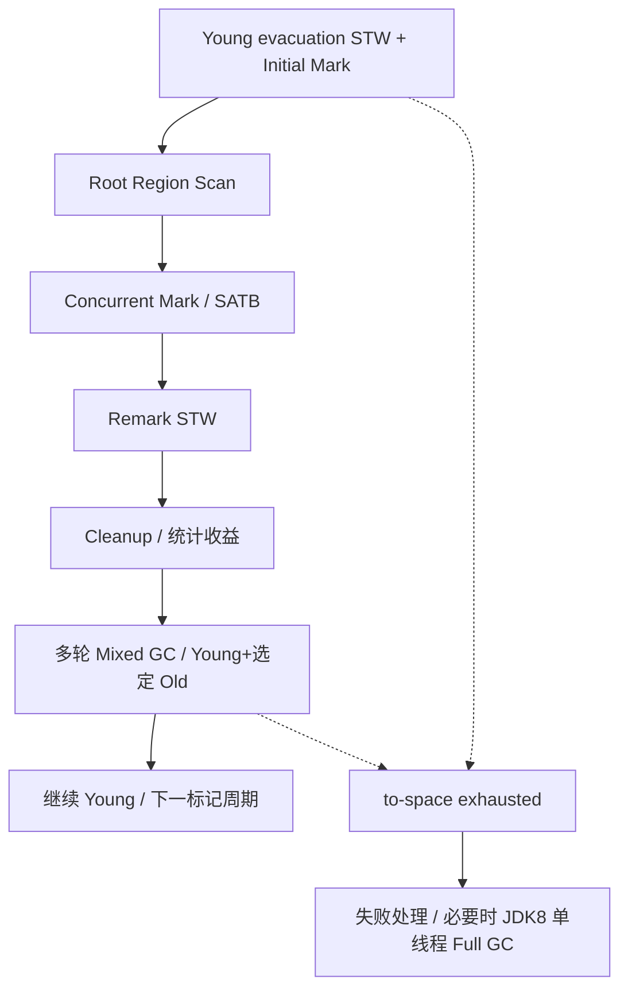

# JVM 内存管理、CMS 与 G1

本章限定 HotSpot 8u462-b08。JDK 8 服务端通常默认使用 Parallel GC；以下 CMS 和 G1 的流程，需要按实际启动参数选择。尤其注意：这里的 G1 Full GC 仍是单线程实现。

## 核心知识与原理

### 内存、对象分配与安全点

一次请求创建了很多临时对象，请求结束后却不一定立即释放内存。Java 不在对象离开方法时逐个 free，而是在 GC 时判断它们还能不能被访问到。理解这一点，就能区分“还没回收”和“始终回收不掉”。

对象主要在堆中。线程栈保存方法执行需要的局部变量、返回信息等，每个线程有自己的栈；程序计数器和本地方法栈也与线程有关。JDK 8 的类元数据主要放在本地内存中的 Metaspace，字符串对象仍在堆里。方法区是 JVM 规范中的概念，不能把它和某一块具体内存简单画等号。

普通小对象常在 Eden 分配。为了避免每个线程分配时都争抢同一个指针，JVM 会给线程一小块 TLAB，让它在里面快速分配。TLAB 仍属于堆，只是暂时由该线程负责分配；里面的对象照样可以交给其他线程。空间不够时再申请 TLAB 或走慢路径。JIT 还可能通过逃逸分析和标量替换消除某些分配。

Young GC 会把存活对象移到 Survivor，或晋升到老年代。什么时候晋升既看年龄，也看 Survivor 剩余空间和具体收集器策略，因此不能只背一个固定年龄。G1 中超过半个 Region 的对象属于 Humongous，通常需要连续 Region；大数组会带来特别的空间压力。

GC 从 Roots 开始寻找可达对象，例如线程栈中的引用、JNI handle 和活跃类相关引用。两个对象互相引用，但没有任何 Roots 能到达它们，仍可一起回收。为了准确读取线程状态，JVM 需要让线程到达安全点。一次长停顿既可能花在回收工作上，也可能花在等待线程到达安全点上，日志分析时要分清。

### CMS：并发并不意味着无停顿

CMS 主要处理老年代，年轻代通常搭配 ParNew。它希望把大部分工作与应用同时执行，减少连续暂停的时间。大致过程是：暂停做初始标记，恢复应用并发标记，预清理一部分变化，再暂停做重新标记，最后并发清扫和重置。

为什么还要重新标记？因为应用在并发标记期间继续改引用：原来没有被扫描到的对象可能变得可达，已经扫描的对象也可能连上新对象。CMS 需要借助写屏障、卡信息等补齐工作，最终在重新标记时确认哪些对象不能回收。

CMS 正常周期采用标记清扫，不把所有存活对象搬到一起。清出的空间像大小不同的空隙，可能有碎片；标记期间后来才变成垃圾的一部分对象，也要留到下一轮，这叫浮动垃圾。应用仍在分配和晋升，所以不能等老年代快满了才启动。

如果并发回收来不及提供空间，就可能出现 Concurrent Mode Failure，转入前台回收，停顿明显变长。Young GC 晋升失败的 Promotion Failed 是另一种日志现象，二者可能相关，但不是同一个名称的两种写法。排查时要同时看分配速度、CMS 周期、可用空间和碎片，而不是看到 Full GC 就改一个阈值。

### G1：Region、RSet 与 SATB

G1 把堆切成等大的 Region。同一块 Region 可以在不同阶段担任 Eden、Survivor 或 Old。Young GC 暂停应用，将选中区域里的存活对象复制出去，原区域随后可以整体复用。

只回收部分 Region 时，怎么知道外面的对象还引用着里面？RSet 保存来自其他区域的引用信息，帮助 GC 找到这些入口。Card Table 用较粗的卡片粒度标记发生引用更新的位置，后台 refinement 再整理相关信息。因此 RSet 不是一张精确的全堆引用图，维护它也需要 CPU 和内存。

G1 的并发标记使用 SATB。假设 A 原来指向 B，标记开始后应用把这个引用清掉；若 GC 还没扫描到 B，就可能错过标记开始时它仍可达的事实。写前屏障会记录被覆盖的旧引用，帮助保留这份开始时的快照。记住“旧引用”比只背三色标记更能解释这段代码。

初始标记通常搭在一次 Young 停顿里，随后进行 root region scan 和并发标记，再暂停做 remark，并做 cleanup。标记结果告诉 G1 哪些 Old Region 垃圾多、回收划算。之后的 Mixed GC 同时回收 Young 和部分 Old，分几次完成，避免一次把所有 Old 都搬完。

`MaxGCPauseMillis` 是希望达到的目标。G1 根据历史扫描、复制耗时估计本次该选多少 Region，但对象存活率、RSet 大小、CPU 配额都可能改变实际成本，所以它不能保证每次严格按时结束。to-space exhausted 表示搬迁目的空间不够，失败处理会增加工作，严重时可能进入 JDK 8 的单线程 Full GC。

### CMS 与 G1 的选择

|问题|CMS（JDK 8）|G1（JDK 8）|
|---|---|---|
|老年代怎样腾空间？|并发标记后清扫空块，正常周期不整理|标记后分批选择 Region，在暂停中复制存活对象|
|主要怕什么？|回收跟不上分配、浮动垃圾、碎片|搬迁空间不足、RSet 成本、大对象占连续区域|
|该看哪些数据？|并发周期、晋升速度、重标记与失败日志|Young/Mixed 耗时、存活字节、Humongous、标记启动时间|

已有 CMS 系统是否值得换 G1，要用相同流量和数据量测试暂停、吞吐与 CPU。换收集器不会让仍被静态集合引用的对象消失；这种问题需要去看<a href="#c4">对象是谁持有的</a>。

### 回收来得及吗？算一遍新增内存

假设 CMS 一轮并发周期要 4 秒，应用每秒向老年代新增 200MB。回收完成前，应用大约还要用掉 800MB。如果启动时只剩 300MB，就很容易来不及。这个算例不能直接算出最佳参数，但能解释为什么“使用率还没到 100%”也会退化。

G1 也要给并发标记期间的增长、后续 Mixed 和下一次对象搬迁留空间。调低暂停目标可能缩小 Young、增加回收次数，单次暂停变短，总 GC CPU 却上升。每次调整都应保留 JVM 更新号、启动参数、CPU 配额和相同负载下的日志，分别比较 Young、remark、Mixed、Full GC，而不是只比较一次最长停顿。

## 源码级解析与调用链

GC 主过程在 HotSpot 的 C++ 中。CMS 看 `CMSCollector::collect_in_background` 的状态推进，再找每个暂停阶段提交的 VM operation。G1 看 `do_collection_pause_at_safepoint`，并结合 G1CollectorPolicy 的选区预测。

下面两个片段只是入口。并发标记还要看 ConcurrentMark，SATB 屏障涉及 G1SATBCardTableModRefBS。读入口时先确认哪些工作要求安全点，再追实际标记、扫描和复制；仅看 System.gc 的 Java 调用无法解释这些阶段。

<!-- source:cms -->

<!-- source:g1 -->

## 面试官三层追问

### 1. TLAB 会不会导致线程间对象无法访问？

查看回答与追问

不会。TLAB 是堆里暂时分给线程的一块分配空间，目的是减少分配指针竞争。对象分配完后，仍然可以由其他线程引用。

**用完 TLAB 怎么办？** 线程尝试申请下一块，或走慢分配路径，必要时触发 GC。TLAB 的分配所有权和对象能否被其他线程看见是两件事，发布仍要遵守 JMM。

**性能上怎么观察？** 看分配速度、TLAB waste 和 GC 时间。如果只是跨线程传对象，不需要关 TLAB；盲目关闭反而可能增加分配竞争。

### 2. CMS 为什么重新标记，为什么产生浮动垃圾？

查看回答与追问

并发标记时应用仍在改引用，CMS 需要重新检查这期间产生的变化，所以有重新标记暂停。有些已经标记的对象随后才变成垃圾，这轮仍可能留下，形成浮动垃圾。

**CMS 与 SATB 一样吗？** CMS 通过自身写屏障、卡记录等完成补充标记；G1 的 SATB 保留旧引用快照是另一套具体机制。不能只画同一张三色图，就当两者源码相同。

**空间该留多少？** 看并发周期有多长，期间还会分配和晋升多少。重标记慢还要检查脏卡、年轻代状态和引用处理，不能只调老年代开始回收的百分比。

### 3. Concurrent Mode Failure 如何定位？

查看回答与追问

先确认日志里的 Concurrent Mode Failure，说明 CMS 并发期间没能及时提供所需空间，可能转入前台回收。它和 Young 晋升失败的 Promotion Failed 要分别看。

**哪些数据帮助区分？** 比较老年代增长、CMS 周期和启动位置，检查碎片及分配需求。总剩余空间不少却没有合适空块，也可能失败。容器 CPU 变少还会拖长并发周期。

**怎样恢复和修复？** 先限流、保留日志，减少突发分配。再根据证据考虑提前启动、增加合理余量或迁移 G1；若存活对象持续增长，仍要查持有者。重启只说明暂时腾出空间。

### 4. G1 的 RSet 和 SATB 有何区别？

查看回答与追问

RSet 帮助回收某些 Region 时找到外部指向它们的引用；SATB 帮助并发标记记住开始时还可达的对象。一个解决局部扫描，一个解决标记期间引用变化。

**屏障记录什么？** SATB 写前记录被覆盖的旧引用；卡记录和 refinement 帮助维护跨 Region 的引用信息。RSet 粒度与卡有关，并非逐对象的精确全引用图。

**耗时高怎样查？** remembered set 扫描与并发标记分开看。长寿命大容器反复指向短命对象，会提高相关工作量。先看对象布局和引用变化，再决定是否调 Region 参数。

### 5. Mixed GC 是否等于 Full GC？

查看回答与追问

不是。Mixed 只在一次暂停里回收 Young 和选中的一部分 Old，通常分多轮完成。Full GC 是全堆的另一条路径。

**为什么不一次回收全部 Old？** G1 根据标记结果、存活率和预计成本选 Region，避免一次搬太多存活对象。JDK 8 Full GC 仍是单线程，不能拿较新 JDK 的并行实现解释。

**出现 Full GC 看什么？** 看标记是否太晚、目的空间是否不足、Humongous 是否占连续区域，以及 Mixed 真正释放多少。GC 次数少不等于空间回收有效。

### 6. 如何制定 GC 的停顿目标？

查看回答与追问

从业务允许的延迟出发，再看 GC 可用的时间。例如接口还有数据库和网络等待，不应把全部 p99 目标都分给 GC。G1 的暂停参数是期望，不是硬实时保证。

**目标太小会怎样？** G1 可能缩小年轻代、增加回收频率，单次变短但总开销增大。模型还受实际存活、RSet 和 CPU 影响，过去的估计不一定适合这次。

**怎样证明更好？** 用同样负载对照暂停分位数、GC CPU、吞吐和业务尾延迟，记录 JVM 更新号和资源限制。只挑一条变短的日志不能说明调优成功。

## 模拟生产案例：大报表使 G1 退化

报表并发上升后，JDK 8 G1 日志出现 to-space exhausted，随后有很长的 Full GC。堆看起来尚有一些空闲。这是模拟情境，不代表某次真实事故记录。

检查 Region 大小、大数组尺寸、Humongous 占用、存活量和搬迁日志。若每份报表都先拼成巨大 byte[]，应该能看到数组超过半个 Region，且高并发时目的空间紧张。仅有总空闲字节不能解释是否满足这些分配。

先限制并发，改分批查询和流式输出，减少同时存活的大数组。再依据日志评估标记启动和搬迁预留，不先盲目增堆，挤占本地内存。

用相同数据量、慢客户端和并发对照，看 Humongous、Old 与目的空间失败是否下降，业务吞吐是否仍可接受。以后把大报表纳入容量测试，同时监控进程 RSS。

## 面试回答与核心总结

### 60 秒快速回答

JDK 8 对象通常在 Eden/TLAB 分配，GC 从 Roots 判断是否可达。CMS 老年代并发标记清扫，初标和重标会暂停，需防碎片与回收来不及。G1 按 Region 回收，RSet 找外部引用，SATB 记录旧引用；Young 和 Mixed 都会暂停搬对象，Mixed 只带部分 Old。暂停目标不是保证，JDK 8 G1 Full GC 单线程。调优先看分配、存活和可用空间，再比较暂停与吞吐。

### 2～3 分钟深入回答

我先看对象为什么会活到 GC。Roots 仍能到达的对象不能回收，互相引用但整体不可达的对象可以回收。小对象通常在 Eden，通过 TLAB 减少分配竞争；TLAB 还是堆，对象也可以被其他线程使用。晋升既看年龄，也看 Survivor 空间，不是永远等固定次数。

CMS 主要回收老年代。初始标记暂停，接着并发标记和预清理，重新标记暂停补齐应用改引用期间的工作，再并发清扫。清扫没有把存活对象紧凑搬到一起，所以有碎片；后来才变成垃圾的一部分对象留下本轮，也是浮动垃圾。回收周期里仍有分配和晋升，剩余空间不足就可能 Concurrent Mode Failure。

G1 用等大 Region，Young 时复制存活对象。只回收部分区域，就靠 RSet 找外面指进来的引用；并发标记的 SATB 写前记录旧引用，保持开始时的可达信息。标记完成后根据垃圾和成本，Mixed 分批回收 Young 及部分 Old。

暂停时间根据历史预测，若存活突然增多或 CPU 变少，预测就可能失准。目的空间不足会增加失败处理，严重时进入 JDK 8 单线程 Full GC。Humongous 大对象还有连续区域需求，所以总空闲不少也可能出问题。

调优时我会用一轮周期内的新增量解释余量。例如四秒周期、每秒新增两百 MB，就不能只剩三百 MB 才开始。再对照同负载的暂停分位数、GC CPU 和业务延迟。换收集器不能让被静态缓存长期引用的对象消失；有增长趋势仍要查持有代码。

### 高频追问、常见错误与速记

- 高频追问：Mixed 和 Full GC 的区别？CMS failure 与晋升失败什么关系？安全点等待算在哪段？
- 容易答错：JDK 8 默认 G1；G1 Full GC 已并行；SATB 记录新引用；RSet 是完整的对象引用图。
- 常看的源码：`CMSCollector::collect_in_background`、`G1CollectedHeap::do_collection_pause_at_safepoint`、`G1CollectorPolicy`、`ConcurrentMark`。
- 阅读时分清：怎样确认存活，怎样腾空间，以及失败时为何变成长停顿。
