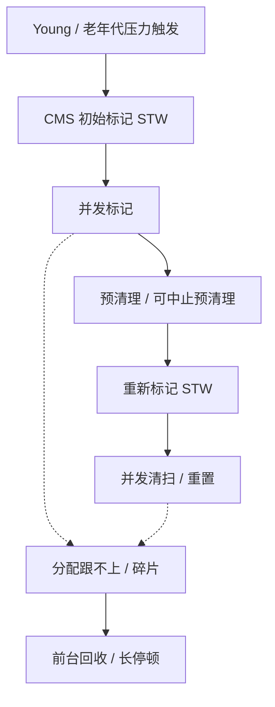
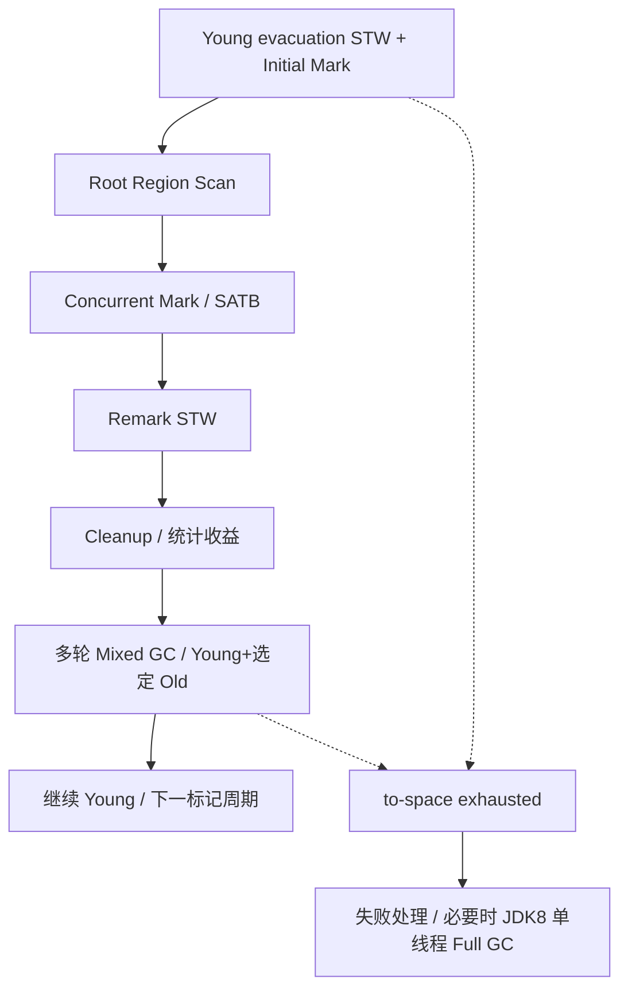

# JVM 内存管理、CMS 与 G1

版本基线：HotSpot OpenJDK 8u462-b08。JDK 8 服务端默认收集器通常为 Parallel GC，G1 需显式选择；不要把 JDK 9 的默认 G1 或更新版本的并行 Full GC 套回本章。

## 核心知识与原理

### 内存、对象分配与安全点

线程私有区域包括程序计数器、Java 虚拟机栈和本地方法栈；共享区域包括堆和方法区。JDK 8 HotSpot 用本地内存中的 Metaspace 实现类元数据存储，字符串常量池中的字符串对象在堆中；不是所有“方法区相关数据”都在 Metaspace。对象可能通过逃逸分析和标量替换消除分配，不能保证每个 new 都产生可观察的堆对象。

普通小对象优先在 Eden 分配，TLAB 为线程提供局部 bump-pointer 分配区域，减少共享指针竞争；TLAB 本身仍是堆空间，不是线程私有堆外内存。TLAB 失败可以走慢路径，在堆上分配或触发 GC。晋升受年龄、Survivor 容量、动态年龄及收集器政策影响，不一定熬到固定年龄。G1 的 Humongous 对象在超过半个 Region 时使用连续 Region，存在空间与碎片代价，不能只看总空闲字节。

可达性从 GC Roots 沿引用图遍历，Roots 包括线程栈、JNI handle 和活跃类相关引用等；对象互相引用但整体不可达仍可回收。安全点保证线程状态可被 GC 正确识别，并非在任意指令处随意停止。STW 时间还可能包含到达安全点的等待，诊断需区分进入停顿与 GC 工作时间。

### CMS：并发并不意味着无停顿

CMS 主要回收老年代，Young 通常搭配 ParNew。初始标记 STW 建立起点；并发标记跟应用同时执行；预清理减少最终重新标记工作，可中止预清理尝试避开不利时机；重新标记 STW 修正并发期间变化；并发清扫回收空闲块；重置准备下一轮。CMS 是标记清扫，正常周期不整理内存，会有碎片。并发时产生浮动垃圾，必须给应用分配和晋升留余量。

Concurrent Mode Failure 通常说明并发回收跟不上分配/晋升，或者可用块不足等，使 CMS 被迫转入前台回收路径；Promotion Failed 是 Young 搬迁晋升时失败，两个日志术语有联系但不应混为一谈。应同时看老年代占用、碎片、分配速率、CMS 起始点、CPU 和日志触发原因，而不是把所有 Full GC 都归咎于触发阈值。增加 CMS 并发线程会争抢应用 CPU，阈值降低也可能增加回收频率。

### G1：Region、RSet 与 SATB

G1 把堆划成等大小 Region，Eden、Survivor、Old 是动态角色。Card Table 用较粗的卡标识发生引用更新的区域，RSet 记录哪些其他区域可能指向当前 Region，使回收选定集合时无需扫描全堆；RSet 不是“当前 Region 引用别处”的完整精确列表。维护与 refinement 会消耗 CPU 和内存。

Young GC 是 STW evacuation，把存活对象复制到 Survivor 或 Old。并发标记使用 SATB 保留标记开始时快照的可达性：写前屏障记录被覆盖的旧引用，不是记录新引用来构造最新快照。初始标记一般搭在一次 Young 停顿上，随后 root region scan、并发标记、STW remark、cleanup；cleanup 部分工作停顿、部分并发。Mixed GC 在完成标记后选择 Young 与一部分收益高的 Old Region，不等于回收全部 Old。

G1 用历史成本估计回收集合，在 `MaxGCPauseMillis` 目标和回收收益之间选择 Region；目标不是硬实时 SLA。RSet 扫描、存活复制、巨型对象和 CPU 不足都可能使预测失准。to-space exhausted 表示 evacuation 目的空间不足，失败处理增加成本，严重情况下退化 Full GC；JDK 8 G1 Full GC 是单线程的整理路径，应避免套用较新版本并行 Full GC。部分 8u 更新对巨型对象回收等有差异，判断具体日志必须固定更新号。

### CMS 与 G1 的选择

|维度|CMS（JDK 8）|G1（JDK 8）|
|---|---|---|
|主要布局|连续分代，老年代 free-list|分区，代角色可变|
|正常老年代回收|并发标记清扫，不压缩|并发标记后 STW 分批 evacuation|
|典型风险|浮动垃圾、碎片、并发模式失败|RSet 成本、目的空间不足、Humongous|
|停顿目标|通过提前回收与并发降低停顿|预测模型选择回收集合，软目标|
|适用判断|已有成熟调优且堆/分配较稳定|较大堆、需要分批回收老年代，但仍须压测|

收集器选择要基于真实存活率和停顿预算。不能承诺“换 G1 自动解决内存泄漏”；泄漏根引用必须在<a href="#c4">OOM 排查</a>中处理。

### 调优推演：空间预算比单个阈值更重要

假设 CMS 一轮并发周期 4 秒，峰值晋升/老年代分配速率 200MB/s，至少需要考虑这段时间约 800MB 的新增压力，再留浮动垃圾和突发余量；这不是精确参数公式，而是检查“启动时还剩 300MB 为什么来不及”的容量逻辑。CPU 被容器限额压低时周期拉长，同一堆配置也会失败。G1 则同时考虑标记启动至 Mixed 释放空间期间的增长，以及下一次 evacuation 的目的空间，不能只用 Old 占比做一个阈值。

验证采用同负载、同 CPU 配额、同存活数据集对照，逐次只改有证据的参数。把 Young 停顿、remark、Mixed、Full、safepoint 等分开统计；更频繁的短停顿可能降低单次 p99 却提高总 GC CPU。调参记录应包含 JVM 命令行、更新号、Region 大小、负载分布与日志，防止版本或容器容量变化被误判为参数收益。

## 源码级解析与调用链

CMS 的 `CMSCollector::collect_in_background` 按状态推进 InitialMarking、Marking、Precleaning、AbortablePreclean、FinalMarking、Sweeping、Resizing/Resetting 等路径，并在需要 STW 的阶段交给 VM operation。G1 的 `G1CollectedHeap::do_collection_pause_at_safepoint` 负责 evacuation pause 主过程，`G1CollectorPolicy` 估计成本并选择集合，`ConcurrentMark` 维护并发标记，`G1SATBCardTableModRefBS` 关联屏障。GC 算法实际在 HotSpot C++ 层，不能只引用 Java System.gc 当源码分析。

<!-- source:cms -->
<!-- source:g1 -->

## 面试官三层追问

### 1. TLAB 会不会导致线程间对象无法访问？

展开三层参考答案

**第一层：**不会。TLAB 是线程分配区域，分配出的对象仍在共享堆中，发布后可被其他线程引用。

**第二层：**线程通过局部分配指针减少全局同步，剩余空间不足时 refill 或走慢路径。TLAB 所有权是分配机制，不是对象生命周期与可见性机制。

**第三层：**高分配场景看分配速率、TLAB waste 与 GC 成本；跨线程传递仍需 JMM 安全发布。盲目关闭 TLAB 可能增加竞争，应以压测证明。

### 2. CMS 为什么重新标记，为什么产生浮动垃圾？

展开三层参考答案

**第一层：**并发标记中应用改变引用，需要最后修正；已标记对象后来变成垃圾，本轮通常无法全部识别，所以留到下一轮。

**第二层：**CMS 利用写屏障和卡标记等补充变化，FinalMarking 停顿处理未完成的标记工作。它不使用 G1 的同一套 SATB 协议，不能机械套一个三色描述。

**第三层：**老年代不能等接近满才启动；根据晋升速率×周期时间预留空间。remark 长要看 Young 状态、脏卡和引用处理，不应只调一个起始阈值。

### 3. Concurrent Mode Failure 如何定位？

展开三层参考答案

**第一层：**并发 CMS 无法及时释放足够可用空间，应用需要分配时退化到前台回收，导致长停顿。

**第二层：**核对日志触发原因、并发周期耗时、老年代 free-list/碎片和 Young 晋升。总空闲空间足够却缺合适块，也可能出现分配问题。

**第三层：**先消除突发分配和泄漏，再评估提前触发、CPU 预算或 G1 迁移。恢复动作限流并留诊断证据，不能每次重启后宣称已修复。

### 4. G1 的 RSet 和 SATB 有何区别？

展开三层参考答案

**第一层：**RSet 帮助选定 Region 回收时查找外部入引用；SATB 保障并发标记过程中快照可达性，两者目标不同。

**第二层：**SATB 写前记录旧引用，卡屏障及 refinement 维护跨 Region 引用信息。RSet 的精度和成本受卡粒度影响，不能说它是完整对象引用图。

**第三层：**大量跨代/跨 Region 引用可能提高 remembered set 扫描成本；标记与扫描耗时应分别诊断。改变对象布局和减少长寿命容器持短命对象比随机调 Region 大小更有依据。

### 5. Mixed GC 是否等于 Full GC？

展开三层参考答案

**第一层：**不是。Mixed 分批回收 Young 和部分 Old；Full GC 扫描整理整个堆，是不同路径。

**第二层：**Mixed 根据标记结果、存活率与暂停预算选择 Old Region。JDK 8 G1 Full GC 单线程，目的空间失败等问题可能使它发生，不能拿新 JDK 的实现解释。

**第三层：**要看 Mixed 是否真正释放容量、标记是否启动过晚、Humongous 是否占据连续空间；通过存活字节和复制成本判断收益，不只数 GC 次数。

### 6. 如何制定 GC 的停顿目标？

展开三层参考答案

**第一层：**从服务端到端延迟预算减去网络、排队和依赖预算，得出可接受的 GC 停顿，而不是统一设置 10ms。

**第二层：**G1 的预测基于历史成本，过低目标可能减小 Young、增加 GC 频率和吞吐损失；并发线程也会占 CPU。Soft goal 不保证每次达标。

**第三层：**记录 p99/p999 停顿、总 GC CPU、分配率、存活率和业务尾延迟，使用真实流量模型验证。若需要严格低延迟，应评估整体架构与升级路线，但本章结论限定 JDK 8。

## 模拟生产案例：大报表使 G1 退化

**故障现象：**报表并发增大后出现 to-space exhausted，随后长 Full GC，堆总空闲看起来尚有空间。**排查思路：**收集 JDK 8 G1 日志、对象直方图与 allocation profile，检查 Region 大小和大数组尺寸。**原理分析：**大数组进入 Humongous，连续 Region 需求及高存活对象降低可迁移空间；evacuation 需要预留目的容量。**根因与验证证据：**模拟把报表全部读成 byte[]，数组尺寸超过半 Region；限制并发与流式输出后 Humongous 占用下降，目的空间失败消失。**解决方案：**限流、分批查询、流式生成，评估 reserve 与标记起点，不先粗暴增堆。**长期预防：**容量测试包含大报表和慢客户端，监控 Humongous、Old 增长及标记周期；记录进程 RSS，避免增加堆挤占本地内存。

## 面试回答与核心总结

### 60 秒快速回答

JDK 8 对象通常在 Eden/TLAB 分配，GC 按可达性回收，安全点保障扫描。CMS 老年代并发标记清扫，初标和重标停顿，存在浮动垃圾、碎片和 Concurrent Mode Failure。G1 分 Region，RSet 定位外部入引用，SATB 保持标记快照；Young 和 Mixed 都进行停顿复制，Mixed 分批带上 Old。停顿目标是软目标，JDK 8 G1 Full GC 单线程，调优必须保留分配和迁移空间。

### 2～3 分钟深入回答

从对象进入 TLAB 到 Survivor 与晋升讲分配链，再说明 GC Roots 与安全点；沿 CMS 状态机解释并发期间引用变化为何要重标、浮动垃圾为什么留待后续，以及 free-list 为什么有碎片。切换到 G1 的 Region 和卡/RSet，分别解释 evacuation 与 SATB 并发标记。最后用报表大数组说明 Humongous、连续空间和 to-space 的区别，给出限流、流式化、保留迁移余量与日志验证的调优顺序。

如果追问如何调优，我会先说明分配速率、存活率、CPU 配额和周期时间决定所需余量。CMS 一轮需要数秒，期间仍有晋升与浮动垃圾，老年代太晚启动来不及；G1 标记后还要等 Mixed 才逐步释放，另需 evacuation 空间。过低暂停目标会改变 Young 和频率，改善单次暂停可能牺牲吞吐。最终用同负载的 GC CPU、停顿分位数、业务尾延迟和存活基线验证，而不是用一次日志宣称参数最佳。

### 高频追问、常见错误与速记

高频追问：G1 为什么不是硬实时？CMS failure 与 promotion failure 是否相同？安全点时间怎么分解？常见错误：JDK8 默认 G1；G1 Full GC 并行；RSet 记录全部出引用；SATB 记录新引用；切换收集器治疗泄漏。源码：CMSCollector::collect_in_background，G1CollectedHeap::do_collection_pause_at_safepoint，G1CollectorPolicy，ConcurrentMark。核心知识：**可达性→并发标记正确性→复制/清扫→空间预算与退化**。
