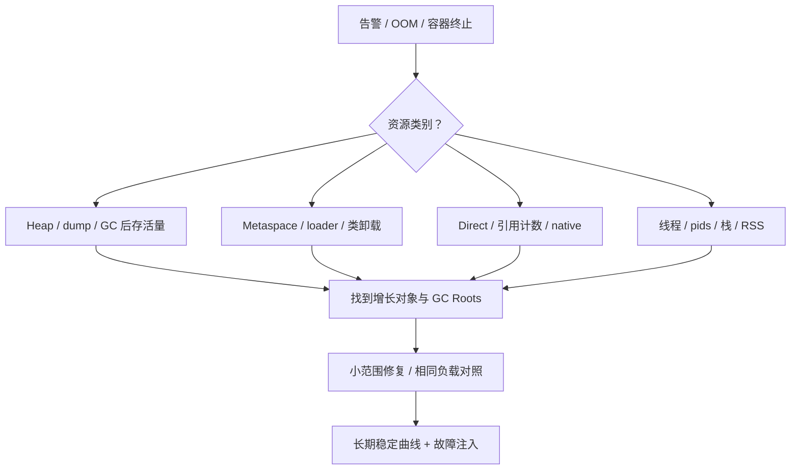

# JVM OOM 与生产故障排查

本章使用 JDK 8 和 Netty 4.1 的实现。遇到 OOM，先看完整报错，再决定取什么证据。堆、直接内存、类元数据和线程占用的是不同资源，工具也不能混用。

## 核心知识与原理

### OOM 类型与第一步证据

“内存满了”还不足以说明问题。一个服务可能 Java 堆很空，进程却被容器杀掉；也可能堆还有空间，却无法再创建线程。下面这张表用来决定第一步看哪里。

|报错或现象|先怀疑什么|先看什么|
|---|---|---|
|Java heap space|堆里存活对象太多，或单次分配太大|GC 前后占用、heap dump、对象持有者|
|GC overhead limit exceeded|部分收集器花很多时间回收，却只能腾出很少空间|实际收集器、GC 日志与存活量|
|Metaspace|动态类太多，或旧 ClassLoader 没回收|类加载/卸载数量、loader 引用链|
|Direct buffer memory|直接缓冲区容量达到限制，或没有释放|Direct 指标、Netty allocator、分配与释放代码|
|unable to create new native thread|线程过多、系统限制、本地内存不足|线程数、pids/ulimit、线程栈和 RSS|
|容器 OOMKilled|整个进程超过容器内存限制|容器退出原因、cgroup 内存记录|

堆 OOM 也不一定是泄漏。一个允许用户一次导出十亿行的接口，即使没有任何遗留引用，也可能因正常数据太大而失败。泄漏指的是业务已经不再需要的对象，却仍被引用着，导致长期无法回收。

RSS 是进程实际驻留内存，除了堆，还包含 Metaspace、线程栈、Code Cache、直接内存和 native 库等。NMT 能把 HotSpot 管理的一部分本地内存按类别列出来，但不覆盖所有第三方分配。NMT 中 reserved 是保留的虚拟地址空间，committed 是已提交空间，它们都不能直接当作 RSS。

### DirectByteBuffer、Cleaner 与 Netty

`ByteBuffer.allocateDirect()` 会在堆里创建一个 Java 包装对象，在本地内存里申请真正的数据区域。JDK 8 的 Bits 先登记容量，再分配 native memory；包装对象不再使用后，Cleaner 的 Deallocator 负责释放并扣回计数。

Bits 里有 totalCapacity 和 reservedMemory 两个容易混淆的数字。前者是申请的缓冲区容量，后者是实际保留的字节，页对齐可能让它们不同。`MaxDirectMemorySize` 的检查主要对着 totalCapacity。分配失败时会尝试引用处理、GC 和等待，但调用 System.gc 并不等于内存立即回来。

Netty ByteBuf 还多了一套引用计数。retain 加一次持有，release 减一次；降到零后才能归还资源。池化缓冲区归还给 arena 后，内存可能留在池里供后续复用，RSS 不立刻下降并不等于泄漏。

最常见的错误发生在异步转交：当前 handler 为任务 retain，任务正常执行后会 release，但线程池拒绝提交时，任务根本不会执行。那次额外的 retain 就永远留着。下面的例子特意同时处理成功和拒绝两条路。它只适用于注释里的所有权约定；如果用自动释放的 handler，不能再照抄一遍手动释放。

```java
// 业务示例：这里约定当前 handler 拥有 buf，异步任务继承所有权。
ByteBuf retained = buf.retain();
try {
    executor.execute(() -> {
        try { process(retained); }
        finally { retained.release(); }
    });
} catch (RejectedExecutionException e) {
    retained.release(); // 提交失败也必须回收新增引用
    throw e;
} finally {
    buf.release(); // 仅适用于当前 handler 应自行释放的所有权约定
}
```

Netty 某些 allocator 或 no-cleaner 路径不一定完整出现在标准 Direct BufferPool 指标里，因此最好一起看 JVM BufferPoolMXBean 和 Netty allocator metrics。

### XStream 与类加载：为什么 Metaspace 会涨

Metaspace 上涨时，先分清两种情况。一种是同一个长期存活的 ClassLoader 不断加载动态生成类；另一种是每次热部署产生新 loader，旧 loader 又被线程、ThreadLocal 或静态注册表引用，始终卸载不了。两种情况都表现为类元数据增长，改法却不同。

旧版 XStream 1.4.4 有一个具体例子：Sun14ReflectionProvider 会为对象创建序列化构造器，并把结果放在 provider 实例的 constructorCache 中。每次请求都创建新的 XStream，也就创建了新的缓存，同一种类可能反复走生成构造器的路径，增加元空间回收压力。实际是否走到它，必须检查 ReflectionProvider、JVM 厂商和运行配置。

这条序列化构造器路径不能简单套上“普通反射超过 15 次就生成访问器”的说法。复用合理配置的实例可能减少重复工作，升级也需要核对实际版本改动。这里引用 1.4.4 是解释旧问题，不建议继续把这个旧版本用于生产。

### 安全采样与根因验证

先记下故障时间，再把流量、发布、GC、RSS 和线程数量放到同一条时间线上。轻量指标能看出增长方向后，再决定是否取 dump。jmap 和某些 jcmd 操作可能产生暂停或触发 GC，dump 还需要足够磁盘空间。

```shell
# JDK 8 诊断示例；替换 PID，先用 jcmd PID help 核对可用命令。
jstat -gcutil PID 1000 10
jstack -l PID > threads.txt
jcmd PID GC.class_histogram
jcmd PID VM.native_memory summary
# NMT 需要启动前设置 -XX:NativeMemoryTracking=summary，未开启不能事后补全历史。
jcmd PID VM.native_memory baseline
jcmd PID VM.native_memory summary.diff
jmap -dump:format=b,file=heap.hprof PID
```

MAT 里先看 dominator tree：哪些对象负责让大批对象一直活着？再沿 Path to GC Roots 找到持有来源。一个 byte[] 很大，只说明它占空间；找到它属于哪个队列、缓存或请求，才开始接近代码原因。retained heap 表示释放这个持有者后可能一并释放的堆大小，比只看对象自身的 shallow heap 更有用。

JDK 8 可用 `-XX:+PrintGCDetails -XX:+PrintGCDateStamps -Xloggc:gc.log` 记录 GC。比较相近流量下，GC 后的最低占用是否不断升高。JDK 9 的 `-Xlog:gc*` 不适用于这里。NMT 则需要在启动前启用，不能在故障发生后补出过去的记录。

### 诊断推演：两个相似现象的不同根因

如果 RSS 上涨，GC 后堆占用也同步上涨，dump 里又看到大量导出请求被队列持有，就应先检查任务积压。如果堆、直接内存在用量和线程数都稳定，RSS 在池化分配后停在一个平台，则应先检查池保留和 allocator 行为。

修复的证据也要具体：相同请求下能复现，持有链能指到代码，改完后不再持续增长，业务结果还正确。ByteBuf 提前 release 后虽然不 OOM，却让另一个线程读到已经回收的缓冲区，这显然没有修好。


## 源码级解析与调用链

直接内存先看 `Bits.tryReserveMemory` 的计数，再看 DirectByteBuffer 的分配和 Deallocator。Netty 的 `AbstractReferenceCountedByteBuf.release` 则通过引用计数走 deallocate，不是同一套释放入口。

XStream 片段选的是旧版本序列化构造器缓存。它把构造器存在哪里，直接决定每次新建实例会不会失去上次的复用结果。

<!-- source:bits -->

<!-- source:xstream -->



## 三层原理问答

### 1. heap OOM 如何证明是泄漏？

<details markdown="1"><summary>查看回答与追问</summary>

先比较相似负载下，GC 后的存活占用是否长期上升。再证明这些对象已不需要，却仍被某处持有。仅看到堆用得多，不能排除合理数据量或一次大分配。

**dump 里找什么？** MAT 的 dominator 和 GC Roots 能显示无界队列、静态 Map、ThreadLocal 等持有关系。找到 byte[] 排名第一还不够，要追到它属于哪个业务对象。

**如何确认修好了？** 相同触发条件下复现，修改持有或清理代码，再验证占用稳定且结果正确。把缓存清空或增堆可能缓解症状，却没有证明原生命周期错误消失。
</details>

### 2. Direct OOM 时 heap 很空，为什么？

<details markdown="1"><summary>查看回答与追问</summary>

直接缓冲区的数据在 native memory，堆里主要是包装对象。所以 Java 堆空闲并不能说明 Direct 还有容量，也不能说明进程没超过容器限制。

**谁负责释放？** JDK 8 DirectByteBuffer 依靠 Cleaner，Bits 负责容量计数；Netty ByteBuf 还有 retain/release 协议。池化资源归还后可能仍留在 arena，一些路径也不完全显示在 JVM Direct 指标里。

**先改哪里？** 检查所有权转交，尤其异步提交失败、取消和异常。同步看 allocator、BufferPool、RSS，不要只提高 MaxDirectMemorySize，挤掉栈和其他 native 空间。
</details>

### 3. Metaspace OOM 是否都是 ClassLoader 泄漏？

<details markdown="1"><summary>查看回答与追问</summary>

不都是。可能是动态类数量本来就很大、限额太小，也可能是旧 loader 不该存活却被引用。先看类和 loader 的增长模式。

**怎么分两种情况？** 一个 loader 加载越来越多类，通常要检查代理、序列化或脚本类型生成；很多旧 loader 没卸载，则追线程、ThreadLocal、注册表等引用。类卸载与整个 loader 的可达性有关。

**怎么验证？** 限制类型组合和合理复用实例，清理线程上下文。热部署问题做多轮卸载测试。确实合理的类集超预算才扩容量，不能用扩容掩盖旧 loader 滞留。
</details>

### 4. native thread OOM 是不是增大堆能解决？

<details markdown="1"><summary>查看回答与追问</summary>

通常不行，堆变大还可能减少本地可用空间。先看线程数量、系统 pids/ulimit、线程栈和 RSS，确认创建失败受哪个条件限制。

**每条线程消耗什么？** 除了 Java Thread 对象，还有栈及 native 结构。失败可能发生在堆仍有余量的时候，heap dump 无法单独解释系统为什么拒绝创建。

**怎样控制？** 限制线程池、连接和并行任务，不每请求新建线程。降低 Xss 前检查实际调用深度，避免换成 StackOverflowError；连接数也要按下游容量控制。
</details>

### 5. NMT 与 MAT 如何配合？

<details markdown="1"><summary>查看回答与追问</summary>

MAT 看 Java 堆对象被谁引用，NMT 看 HotSpot 记录的 native 类别，两者互补。RSS 则是进程实际驻留的另一个视角。

**NMT 数字为什么不能直接和 RSS 对齐？** reserved、committed 含义不同，第三方 native 分配也未必被完整记录。MAT 的 retained heap 只针对堆引用图，不包含缓冲区真正的堆外数据。

**具体怎么用？** 启动时开 NMT，建立 baseline 后看 diff，同时采样线程、allocator 和 RSS。若差额指向 native 库，再用相应系统工具，别把未知部分直接叫 Direct 泄漏。
</details>

### 6. ThreadLocal 为什么需要 remove？

<details markdown="1"><summary>查看回答与追问</summary>

线程池会复用线程，一个请求留下的值可能被下一请求读到，或一直占内存。请求结束时在 finally remove，既是内存管理，也是避免租户、数据源状态串到下一次请求。

**key 弱引用为什么还会漏？** ThreadLocalMap 的 key 弱引用可能先被清掉，但 value 仍由 entry 强持有，清理依赖后续 map 操作等。key 活着时，业务值也可能一直存在。

**异步怎么办？** 请求上下文显式传递，并在执行边界清理；不要指望线程复用自动恢复默认值。Reactor 还需要它的 Context 机制，直接沿用 ThreadLocal 容易串请求。
</details>

## 模拟生产案例：异步日志持有 ByteBuf

服务堆占用稳定，Direct 内存却持续上升；异步日志线程池一出现拒绝，问题更明显。这是一个 ByteBuf 转交错误的模拟情境。

按 eventId 对齐拒绝时间和 allocator 指标，审查 retain 后的每个出口。若提交失败分支缺 release，应该能看到新增引用没有任务接手；泄漏检测的分配栈可辅助定位，而不是仅凭 RSS 下结论。

把提交失败时的额外 release 补齐。若日志只用几个字段，考虑复制小片段，不要长期持有整个网络缓冲。还需核对 handler 是否自动释放，避免修复后双重释放。

测试里主动让执行器拒绝、任务异常和取消，检查引用计数与业务读写。长期区分池保留量和实际在用量，避免将稳定池容量误认为泄漏。

## 知识梳理与核心总结

### 一分钟要点回顾

OOM 先按完整报错分类型。heap 查存活趋势、dump 和持有链，Metaspace 查类与 loader，Direct 查 Bits/Cleaner 与 Netty 引用计数，创建线程失败查线程数和系统限额。RSS 与堆、NMT 都不是同一个数字。根因要能指到谁持有资源，并用相同负载验证修复；重启和增内存可以止血，却不足以证明已修好。

### 深入理解与机制串联

我会先保存完整报错和时间线，而不是遇到所有内存问题都要 heap dump。Java heap space、Metaspace、Direct buffer memory 和 native thread 失败，对应资源不同；容器 OOMKilled 还可能完全没有 Java OOM。

heap 先比较相近负载下 GC 后最低占用，再用 MAT 找 dominator 和 GC Roots。占用最大的是 byte[] 只是起点，还要追到队列、缓存或请求，说明为什么不该继续持有。合法的大数据集超出容量，与已结束请求仍被引用，是不同问题。

Direct 的包装在堆，数据在 native。JDK 8 Bits 计容量，Cleaner 释放；Netty 则有额外 retain/release。异步转交时正常任务会释放，不代表提交被拒绝也会释放。池归还后 RSS 可能仍高，一些 allocator 又不完全反映在标准 Direct 指标里，必须一起看。

Metaspace 我会区分一个 loader 动态类越来越多，和很多旧 loader 无法卸载。ThreadLocal、线程 contextClassLoader、静态注册表是常见持有来源。旧 XStream 的问题还要确认实际 ReflectionProvider 和构造器缓存，不能把所有反射归因于同一个阈值。

最后看进程预算和系统限额，NMT reserved、committed 与 RSS 分开理解。取 dump 前考虑停顿和空间。修复测试覆盖拒绝、异常、取消与重复请求，证明占用不再增长，同时没有提前释放或上下文串扰。

### 延伸问题、常见误解与速记

- 高频追问：Cleaner 为什么不是马上执行？池化内存归还后 RSS 为何不降？ThreadLocal key 弱引用还要 remove 吗？
- 容易答错：NMT 等于 RSS；heap 空闲就没有内存问题；一条 Full GC 能证明泄漏；增加堆能解决线程创建失败。
- 常看的源码：`Bits.reserveMemory/tryReserveMemory`、`DirectByteBuffer.Deallocator.run`、`AbstractReferenceCountedByteBuf.release`、`ThreadLocalMap.expungeStaleEntry`。
- 排查要连起来：报错的资源、增长的对象、持有它的代码，以及修改后的对照结果。
