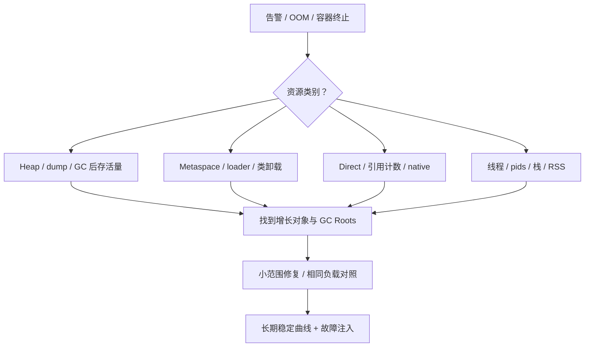

# JVM OOM 与生产故障排查

版本基线：OpenJDK 8u462-b08，Netty 4.1.108.Final；XStream 1.4.4 的反射问题只作版本明确的机制案例，不推荐生产继续使用该旧版。诊断目标是证明谁持有资源、增长是否可回收以及修复是否改变增长曲线。

## 核心知识与原理

### OOM 类型与第一步证据

|报错/现象|资源与常见原因|首要证据|
|---|---|---|
|Java heap space|存活对象太多、缓存/队列无界、单次大分配|GC 前后占用、dump dominator、分配速率|
|GC overhead limit exceeded|部分收集器长时间高 GC 成本且回收极少|GC 日志和收集器；不是所有 GC 的统一报错|
|Metaspace|类元数据、ClassLoader 泄漏、动态类生成|类加载/卸载趋势、loader 引用链、元空间 committed|
|Direct buffer memory|Bits 计数受 MaxDirectMemorySize 限制|BufferPoolMXBean、分配调用栈、释放机制|
|unable to create new native thread|线程数量、进程/用户限制、地址空间或本地内存不足|线程数、ulimit/cgroup pids、RSS 与栈配置|
|容器 OOMKilled|进程总内存超出容器限制|cgroup memory 事件和容器终止原因；可能没有 Java OOM|

heap OOM 不一定是泄漏：合法存活数据超出预算也是容量不足。RSS 不等于堆占用；包括 Java 堆、Metaspace、线程栈、Code Cache、Direct buffer、native 库及 allocator 开销等。NMT 记录 HotSpot 的内存类别与保留/提交，不承诺覆盖全部第三方 native 分配，也不能直接等同实际 RSS。

### DirectByteBuffer、Cleaner 与 Netty

JDK 8 DirectByteBuffer 分配走 Bits.reserveMemory，再通过 Unsafe 分配并注册 Cleaner；Cleaner 的 Deallocator 释放 native 地址并 unreserveMemory。Bits 同时维护 reservedMemory、totalCapacity 与 count；限制比较的是 totalCapacity，页对齐会令实际分配字节与 capacity 不同。分配失败会尝试引用处理、System.gc 和退避后抛 OOM，不能假定 System.gc 一定立即释放。

Netty ByteBuf 是独立的引用计数协议，retain 增计数，release 降计数至零才交还资源。池化内存交回 arena 未必立刻还给操作系统，因此 RSS 高但稳定不等于泄漏。ByteBuf 在 handler 间转移所有权、异步任务保留引用时最容易漏 release；SimpleChannelInboundHandler 默认 autoRelease 与手动 release 混用又可能双重释放。Netty 使用不同 allocator / no-cleaner 路径时，不保证全部出现在标准 Direct BufferPool 计数里，须同时看 allocator metrics 与 JVM 指标。

```java
// 业务示例：这里约定当前 handler 拥有 buf，异步任务继承所有权。
ByteBuf retained = buf.retain();
try {
    executor.execute(() -> {
        try { process(retained); }
        finally { retained.release(); }
    });
} catch (RejectedExecutionException e) {
    retained.release(); // 提交失败也必须回收新增引用
    throw e;
} finally {
    buf.release(); // 仅适用于当前 handler 应自行释放的所有权约定
}
```

### 类加载与 XStream 机制边界

旧版 XStream 某些反射创建对象路径缓存序列化构造器；实例反复创建可能导致构造器重复生成或关联反射访问器生成，增加类元数据压力。HotSpot 8 反射有 inflation/native 与生成访问器的分支，serialization constructor 的路径也有自身行为，不能把所有反射调用都统一说成“超过 15 次才生成”。必须核对 JVM 属性、实际 ReflectionProvider、调用栈和版本。

类元数据增多可能推高元空间高水位并触发 GC；类能否卸载取决于 ClassLoader 可达性和收集器配置。长期 ClassLoader 被 ThreadLocal、线程 contextClassLoader、静态注册表持有时，扩 MaxMetaspaceSize 只延迟 OOM。复用合理配置的 XStream 实例可能降低重复构造成本，但安全配置、线程使用方式及版本升级必须评估；不能声称“XStream 每次调用都必然泄漏 Metaspace”。

### 诊断推演：两个相似现象的不同根因

同样是 RSS 上升，情况 A 的 GC 后 heap 基线一起增长，MAT 中队列支配多数存活对象，优先处理任务积压；情况 B 的 heap、Direct 在用与线程都稳定，RSS 在池化分配后形成平台，可能是 allocator/池保留，不能凭高 RSS 就删除缓存。若 NMT 的 Class 类别随类数量增长，再进一步看 loader 与代理生成；若线程类别和 pids 同时上升，检查线程创建而不是索取 heap dump 作为唯一证据。

根因验证至少需要三件事：可复现触发条件、代码持有/分配路径、修复后资源增长停止且业务结果正确。泄漏修复若通过提前 release 使对象仍被下游使用，会从 OOM 变成 use-after-release，这不算通过验证。dump 和日志只是证据载体，不能用“MAT 第一名是 byte[]”代替解释哪个请求/缓存/缓冲区拥有它。

## 源码级解析与排查调用链

`ByteBuffer.allocateDirect → DirectByteBuffer.<init> → Bits.reserveMemory → Unsafe.allocateMemory → Cleaner.create`；释放从引用处理触发 Cleaner，再执行 Deallocator.run。Netty 的 `AbstractReferenceCountedByteBuf.release → ReferenceCountUpdater.release → deallocate` 是另一条链，JVM Cleaner 不能替应用弥补所有遗漏的 reference count。

<!-- source:bits -->
<!-- source:xstream -->



### 安全采样与根因验证

先保留时间线：流量、发布、线程、GC、RSS、限额；再做轻量采样，最后选择 dump。jmap heap dump 和部分 jcmd 操作可能停顿/触发 GC，生产需估算文件空间与影响；文件包含业务数据，按现有数据访问规则处理。MAT 看 dominator 的 retained heap 与 Path to GC Roots，不能仅按 shallow heap 排名；排除弱/软引用路径时须明确选项。

```shell
# JDK 8 诊断示例；替换 PID，先用 jcmd PID help 核对可用命令。
jstat -gcutil PID 1000 10
jstack -l PID > threads.txt
jcmd PID GC.class_histogram
jcmd PID VM.native_memory summary
# NMT 需要启动前设置 -XX:NativeMemoryTracking=summary，未开启不能事后补全历史。
jcmd PID VM.native_memory baseline
jcmd PID VM.native_memory summary.diff
jmap -dump:format=b,file=heap.hprof PID
```

JDK 8 常用 GC 启动选项：`-XX:+PrintGCDetails -XX:+PrintGCDateStamps -Xloggc:gc.log`，不是 JDK 9 的 `-Xlog:gc*`。日志关注回收前后容量、触发原因、Young/Old 趋势和停顿；“GC 后最低点长期升高”比“瞬时使用率高”更能支持存活集合增长的判断。

## 面试官三层追问

### 1. heap OOM 如何证明是泄漏？
<details markdown="1"><summary>展开三层参考答案</summary>

**第一层：**查看同等负载下 GC 后存活量是否持续增长，并找出不应该长期存活的对象及持有者。

**第二层：**MAT dominator 与 GC Roots 指出无界队列、静态集合或 ThreadLocal 的引用链；配合业务生命周期证明“本应释放”。大数组单次分配失败可能没有渐进泄漏。

**第三层：**复现相同负载，修复后验证 retained heap 平台化，检查功能正确性及错误/取消路径。只重启恢复或只增加堆不构成根因验证。
</details>

### 2. Direct OOM 时 heap 很空，为什么？
<details markdown="1"><summary>展开三层参考答案</summary>

**第一层：**直接缓冲区占 native memory，堆只持 wrapper；堆健康不能证明直接内存充足。

**第二层：**Bits 的容量限额、Cleaner 时机和 Netty allocator 的路径要分别核对。未 release 的池化 ByteBuf 可能无法回归池，部分路径不能仅靠 BufferPoolMXBean 观察。

**第三层：**建立进程内存预算，给 Direct、栈与类元数据留余量；检查所有权和异步失败分支，泄漏检测先在测试或受控流量使用高等级，注意采样成本。
</details>

### 3. Metaspace OOM 是否都是 ClassLoader 泄漏？
<details markdown="1"><summary>展开三层参考答案</summary>

**第一层：**不一定，动态生成类太多、限额太低或合理规模类集也可能超过预算。

**第二层：**比较类数量、卸载数量和 loader 数；一个长期 loader 生成大量类，与多个旧 loader 被引用滞留是不同模式。类卸载需要整个加载器生命周期满足条件。

**第三层：**限制动态类型组合、缓存/复用代理和序列化器、清理线程上下文，做多轮部署后 loader 回收测试。增元空间只在容量证据支持时使用。
</details>

### 4. native thread OOM 是不是增大堆能解决？
<details markdown="1"><summary>展开三层参考答案</summary>

**第一层：**通常不能，增堆反而挤占本地资源。先检查线程数量、系统限制与栈大小。

**第二层：**每线程需要栈和 native 结构；创建失败可能来自 pids/ulimit、地址空间或 native allocation。heap dump 不能单独回答创建失败原因。

**第三层：**限制线程池、连接和并行任务，避免每请求 new Thread；逐类建立容量预算。降低 Xss 需验证调用深度，不能引入 StackOverflowError。
</details>

### 5. NMT 与 MAT 如何配合？
<details markdown="1"><summary>展开三层参考答案</summary>

**第一层：**MAT 分析堆对象持有关系，NMT 分析 HotSpot native 类别趋势，两者视角互补。

**第二层：**NMT reserved 表示虚拟地址保留，committed 表示提交，不等于 RSS；第三方分配可能未完整记录。MAT retained heap 只含堆图可支配对象。

**第三层：**建立 NMT baseline 做差分，并同时间采集 RSS、Direct allocator 和线程。若差额主要来自 native 库，进一步用系统/allocator 工具，不能把未知差额硬说成 Direct 泄漏。
</details>

### 6. ThreadLocal 为什么需要 remove？
<details markdown="1"><summary>展开三层参考答案</summary>

**第一层：**线程池线程长期存活，ThreadLocal 的值可能跨请求残留，造成状态污染或内存滞留。

**第二层：**ThreadLocalMap entry 的 key 是弱引用，value 是强引用；key 清除后 value 不会自动同步清除，清理依赖 map 后续操作等路径。即使 key 仍活着，业务也应清理请求上下文。

**第三层：**在请求边界 finally remove，异步上下文显式传递并清理；检测线程复用下的数据源/租户串扰。关联阅读：<a href="#c5">Spring 事务上下文</a>与<a href="#c10">Reactor</a>。
</details>

## 模拟生产案例：异步日志持有 ByteBuf

**故障现象：**heap 稳定但 Direct 使用持续升高，伴随 Netty 分配失败；只在日志执行器拒绝时出现。**排查思路：**关联拒绝率、allocator usedDirectMemory 和泄漏检测栈，审计 retain/release 的每个出口。**原理分析：**为异步日志 retain 后，提交被拒绝，任务 finally 永远不会执行。**根因与验证证据：**模拟将队列设为很小并暂停消费，重复触发拒绝能稳定复现；补充提交失败的 release 后引用计数回到原值，长期负载增长停止。**解决方案：**提交失败立即释放新增引用，必要时复制少量日志字段而非持整个网络缓冲。**长期预防：**为拒绝、取消、异常、断连做所有权审查和测试，监控池化保留与实际在用，避免把保留池容量误报为泄漏。

## 面试回答与核心总结

### 60 秒快速回答

OOM 先按 heap、Metaspace、Direct、native thread 或容器限额分类，再保留流量、GC、RSS 与资源增长时间线。heap 用 MAT 看 dominator 和 Roots；Metaspace 看类与 loader；Direct 看 Bits/Cleaner 和 Netty 引用计数；线程看数量与系统限制。根因必须连接到持有代码，并用同负载修复前后曲线和失败路径复现验证，重启与扩容只算止血。

### 2～3 分钟深入回答

以 heap 空但 Direct OOM 开场，画出 wrapper 与 native 区域、Bits 限额和 Cleaner 释放链，再对比 ByteBuf 引用计数及池化保留，指出标准 JVM Direct 指标可能漏掉某些路径。随后展示拒绝分支遗漏 release 的证据链。扩大到全进程内存预算，解释 NMT reserved/committed、MAT retained heap 和 RSS 的差别，最后列出采样顺序、dump 影响、故障注入与长期告警。

对于 Metaspace，我会分大量动态类集中在一个 loader 与旧 loader 被持有两种情况，用类加载/卸载和引用链确认。旧版 XStream 还要看实际 ReflectionProvider 和序列化构造器缓存，不能把所有反射都归结为同一个 inflation 阈值。native thread 的失败则看 pids、ulimit、线程栈和总内存。恢复先限流保留证据，诊断操作考虑停顿和磁盘空间；修复后长期负载和失败路径都须验证，否则只是把一个泄漏窗口换成另一个。

### 高频追问、常见错误与速记

高频追问：Cleaner 何时执行？XStream 到底走哪种 provider？为什么 GC 后仍高 RSS？常见错误：用 JDK9 日志参数回答 JDK8；把每个 Full GC 当泄漏；NMT=RSS；认为 key 弱引用自动清掉 ThreadLocal value。源码：Bits.reserveMemory，DirectByteBuffer.Deallocator.run，AbstractReferenceCountedByteBuf.release，ThreadLocalMap.expungeStaleEntry。核心知识：**分类→趋势→持有链→代码→修复对照**。
