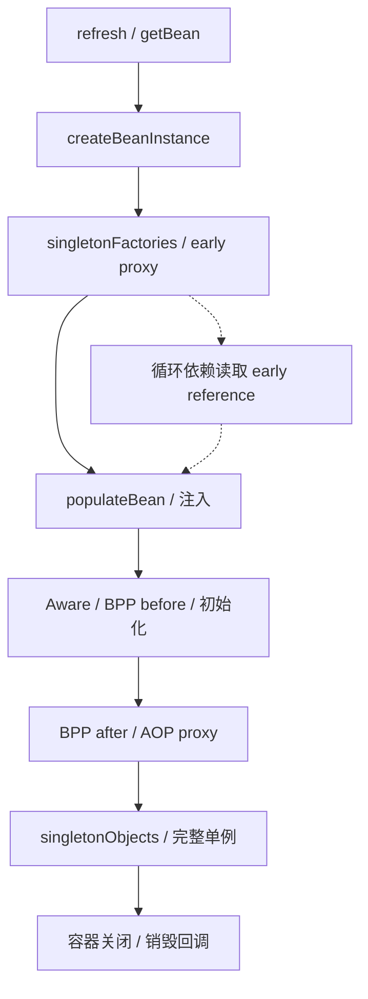

# Spring 核心原理与事务

版本基线：Spring Framework 5.3.31、Spring Boot 2.7.18。Spring 的代理、线程绑定和数据库事务是三个层次；容器能创建对象，不意味着每次调用都穿过代理。

## 核心知识与原理

### IoC、生命周期与循环依赖

BeanFactory 提供 Bean 获取与定义管理，ApplicationContext 进一步组织资源、事件、国际化以及容器启动。`AbstractApplicationContext.refresh` 依次准备容器、执行 BeanFactoryPostProcessor、注册 BeanPostProcessor、初始化非懒单例等。前者主要修改 BeanDefinition，后者介入 Bean 实例创建；把它们混淆会无法解释自动代理发生在哪一步。

`AbstractAutowireCapableBeanFactory.doCreateBean` 先实例化，必要时放置 early reference 工厂，再 populateBean 注入，最后 initializeBean 执行 aware、前置处理、初始化回调及后置处理。初始化回调通常包括 @PostConstruct、InitializingBean.afterPropertiesSet 和自定义 initMethod，具体由相关处理器和容器路径协调。销毁回调由容器管理的生命周期负责，prototype 取出后的销毁通常交给调用者，不像 singleton 一样自动统一回收。

三级缓存分别为 singletonObjects（完整单例）、earlySingletonObjects（早期引用）、singletonFactories（早期引用工厂）。工厂用于延迟调用 getEarlyBeanReference，允许自动代理处理器对早期暴露对象创建一致的代理。它解决部分 singleton setter/字段循环，并不解决构造器循环、prototype 循环，也不能保证涉及所有后处理器的复杂循环都能成功。Boot 2.7 默认禁止循环引用；框架有能力与应用默认策略必须分开说。开放配置只能作为受控遗留迁移措施，优先拆依赖或显式延迟。

### 动态代理与 AOP

JDK Proxy 基于接口，CGLIB 基于子类。Spring AOP 选择受到配置和目标类型影响，Boot 默认倾向使用类代理，不能笼统说“有接口就一定 JDK”。CGLIB 无法拦截 final 方法，也无法覆盖 private 方法。AOP 链通过拦截器组织前后增强；同类内部 this 调用没有重新经过外部代理，注解存在也可能不生效。

### 事务拦截、传播与线程上下文

`TransactionInterceptor.invoke → TransactionAspectSupport.invokeWithinTransaction` 解析 TransactionAttribute 和 PlatformTransactionManager，创建/加入事务，执行 invocation，异常时决定回滚，正常时提交，finally 恢复上下文。DataSourceTransactionManager 将 ConnectionHolder 按 DataSource 绑定到 TransactionSynchronizationManager 的 ThreadLocal 资源表；SqlSession/DAO 必须从兼容路径取得该连接，自己 new 连接可能脱离事务。

默认 RuntimeException/Error 回滚，checked exception 需要 rollbackFor 等规则。捕获异常并返回成功可能提交；内层 REQUIRED 标记 rollback-only，外层即使捕获异常，最终也可能 UnexpectedRollbackException。REQUIRED 加入当前事务，REQUIRES_NEW 挂起外层并开启新连接，外层连接仍占用，可能耗尽池；NESTED 在 JDBC 事务管理器支持 savepoint 时使用保存点，不是所有 manager 都支持。事务隔离作用于新建物理事务，加入现有事务时不能假定注解的隔离级别被重新应用。

非 public 方法在标准代理事务配置下通常不会匹配，本章以 public 方法为边界；自调用、非 Spring 管理对象、错误 manager、异常规则、异步换线程、数据库引擎不支持事务都可能让预期失败。ThreadLocal 不会自动穿过 CompletableFuture 或 Reactor 的线程切换，Reactor 事务应使用支持的 reactive manager/context，不能把 JDBC 事务当成跨线程全局状态。

### Boot 自动配置与 MVC

Boot 2.7 的 AutoConfigurationImportSelector.getCandidateConfigurations 同时加载 spring.factories 候选和 `META-INF/spring/org.springframework.boot.autoconfigure.AutoConfiguration.imports` 候选，并去重、过滤、排序。不能说 2.7 完全移除 spring.factories，也不能用 Boot 3 的行为代替。条件如 @ConditionalOnClass/@ConditionalOnMissingBean 决定配置生效；诊断用条件报告，自动配置不是“扫描所有 jar 里所有类”。

MVC `DispatcherServlet.doDispatch → getHandler → getHandlerAdapter → HandlerAdapter.handle → 参数解析/调用 → 返回值处理 → processDispatchResult`；拦截器 preHandle 在 handler 前，postHandle 在正常返回后，afterCompletion 做完成清理。过滤器属于 Servlet 链，更早处理请求。@ResponseBody 经 HttpMessageConverter 写响应，而视图返回交给 ViewResolver；异步请求有后续 dispatch，线程上下文应按边界清理。

### 事务推演：注解隔离级别为何可能被忽略

外层 REQUIRED 已开启一个 RC 事务，内层 REQUIRED 标注 RR，默认是加入既有物理事务，而不是把同一 Connection 临时变成 RR 再恢复。若启用现有事务校验，冲突设置可以被拒绝；没有校验也不意味着内层获得声明中的新隔离效果。事务超时、只读等也需看 manager 与驱动的实际执行，不把注解当数据库强制契约。

JDK 动态代理到 ReflectiveMethodInvocation，再到 TransactionInterceptor 和业务方法的链，可以用“调用是否经过代理”“manager 是否匹配”“Connection 是否来自绑定资源”“异常是否到达拦截器”“最终是否 rollback-only”五问定位。提交失败时应保留真实异常与数据库结果，不在 catch 中立即发成功消息。afterCommit 回调若仅内存执行，进程在 commit 后宕机仍会丢任务，这正是 Outbox 需要同事务持久化事件的理由。

## 源码级解析与调用链

<!-- source:beans -->
<!-- source:tx -->
<!-- source:boot -->



```java
// 业务示例：跨 Bean 调用，让入口穿过事务代理。
@Service
class OrderService {
    private final OrderWriter writer;
    OrderService(OrderWriter writer) { this.writer = writer; }
    public void create(Order order) { writer.persist(order); }
}
@Service
class OrderWriter {
    @Transactional(rollbackFor = Exception.class)
    public void persist(Order order) throws Exception {
        // 同一 DataSource 的持久化路径，异常交给代理作回滚判断。
    }
}
```

```yaml
# Boot 2.7 配置示例：保持默认禁止循环依赖，推动依赖拆分。
spring:
  main:
    allow-circular-references: false
  datasource:
    hikari:
      maximum-pool-size: 20
```

## 面试官三层追问

### 1. 为什么三级缓存而非简单提前放对象？
<details markdown="1"><summary>展开三层参考答案</summary>

**第一层：**提前放 raw 实例可能使依赖者持有未代理对象；工厂可以按需生成 early reference，协调自动代理。

**第二层：**getSingleton 先查完整单例，再在创建中查早期对象，必要时从 singletonFactories 获取并移动到 earlySingletonObjects。getEarlyBeanReference 允许 SmartInstantiationAwareBeanPostProcessor 参与。

**第三层：**循环依赖使初始化顺序不稳定，架构上应拆服务职责或引入事件/接口。Boot 2.7 默认禁止，不能为了“框架支持”就全局开启。
</details>

### 2. @Transactional 自调用为何失效？
<details markdown="1"><summary>展开三层参考答案</summary>

**第一层：**this.method 调用目标对象的方法，没有进入外部代理，也就没有执行事务拦截器。

**第二层：**代理持有目标及 interceptor chain，事务开始发生在 TransactionInterceptor 中，注解不是 JVM 指令。final/private 方法与代理形式还构成额外边界。

**第三层：**优先把事务边界抽到另一个 Bean 或使用 TransactionTemplate；避免依赖 AopContext 和隐式自注入增加配置耦合。测试通过容器拿代理调用，并验证数据库回滚。
</details>

### 3. 内层回滚，外层捕获异常为什么仍提交失败？
<details markdown="1"><summary>展开三层参考答案</summary>

**第一层：**REQUIRED 共用物理事务，内层回滚决定可能标记 rollback-only，外层捕获异常不会清掉标记。

**第二层：**事务管理器在外层 commit 检测全局 rollback-only，实际回滚并可能抛 UnexpectedRollbackException，防止调用方误以为已提交。

**第三层：**按业务原子性决定一起失败还是用独立事务记录审计；REQUIRES_NEW 可以独立提交，但不是随意避免异常的补丁，还要考虑连接池和一致性。
</details>

### 4. REQUIRES_NEW 与 NESTED 如何选？
<details markdown="1"><summary>展开三层参考答案</summary>

**第一层：**前者创建独立物理事务，后者通常在同一事务内使用保存点；外层回滚会带走 NESTED 已完成的更新。

**第二层：**DataSourceTransactionManager 在允许 nested 且驱动支持时创建 savepoint；REQUIRES_NEW 挂起资源，再拿新连接。JTA/其他管理器支持不同。

**第三层：**独立审计可用新事务但需承认主业务失败审计仍存；批次局部失败可用保存点，需限制锁和长事务。估算外层持连接且内层再借连接的极端并发。
</details>

### 5. 异步方法能继承 JDBC 事务吗？
<details markdown="1"><summary>展开三层参考答案</summary>

**第一层：**不能自动继承。JDBC 事务连接绑定在线程上下文，异步线程是另一个执行边界。

**第二层：**TransactionSynchronizationManager 使用 ThreadLocal 资源，复制变量不能安全地把同一连接并发给多个线程。Reactor Context 与 ThreadLocal 也不是同一机制。

**第三层：**把异步写入设计成独立事务/可靠消息，若必须原子则保持同一事务同步执行。关联阅读：<a href="#c9">Outbox</a>，提交后普通事件监听不等于持久可靠投递。
</details>

### 6. 自动配置不生效如何定位？
<details markdown="1"><summary>展开三层参考答案</summary>

**第一层：**检查候选是否加载、classpath、配置属性和是否已有用户 Bean，而不是马上扩大 component scan。

**第二层：**Boot 2.7 读取两类候选资源，ImportSelector 去重并运行过滤条件，缺类/已有 Bean 都可能跳过。用 condition evaluation report 查看原因。

**第三层：**自定义 starter 固定版本兼容范围，编写正反条件启动测试；排除自动配置需明确替代职责，避免跨版本复制内部类导致运行时失败。
</details>

## 模拟生产案例：新事务耗尽连接池

**故障现象：**20 个并发请求都已持外层事务连接，调用 REQUIRES_NEW 审计时全部等待，最后超时。**排查思路：**看池 active/pending、线程栈 borrowConnection、数据库是否执行 SQL。**原理分析：**挂起不等于释放外层连接，内层还需第二条连接。**根因与验证证据：**模拟池大小 20，20 个外层同时到达屏障后调用审计，全部等待新连接；降外层准入到 10 或改设计后恢复。**解决方案：**限制并发，短期增加连接仅在数据库预算允许时使用；审计可同事务或可靠 Outbox 后异步独立写。**长期预防：**连接预算覆盖事务嵌套，设置连接获取超时与事务超时，压测 rollback-only、自调用和异步边界。

## 面试回答与核心总结

### 60 秒快速回答

Spring 生命周期从实例化、早期暴露、依赖注入到初始化和后处理，三级缓存只处理部分单例循环，Boot 2.7 默认禁止。AOP 基于代理，事务在 TransactionInterceptor 中通过 manager 创建或加入，JDBC 连接在线程绑定。自调用、异常规则、异步和错误 manager 会破坏预期。REQUIRES_NEW 独立事务却占第二条连接，NESTED 通常保存点。自动配置要看候选资源和条件报告。

### 2～3 分钟深入回答

沿 refresh/doCreateBean 说明定义处理器与实例处理器，再解释 early reference 为什么需要工厂和代理协调。画出代理入口、事务属性、manager、连接绑定、业务执行和完成处理，用 REQUIRED rollback-only 与 REQUIRES_NEW 连接池耗尽比较传播机制。最后用异步订单场景说明线程事务不能跨边界复制，落到持久 Outbox 方案；自动配置和 MVC 则按明确调用链解释请求在哪层处理。

对于传播，我会用外层持连接、内层 REQUIRES_NEW 再借连接解释连接池饥饿；NESTED 在支持 savepoint 的路径里并非独立提交。默认异常规则只对 RuntimeException/Error 回滚，checked exception 和捕获后正常返回可能提交。排查按代理入口、manager、绑定连接、异常传播和 rollback-only 五步看。如果提交后要发 MQ，普通 afterCommit 内存回调仍有宕机窗口，可靠事件要进入 Outbox 或事务消息，而不是把注解范围夸大到网络。

### 高频追问、常见错误与速记

高频追问：prototype 会统一销毁吗？checked exception 默认回滚吗？Boot2.7 是否仍读 spring.factories？常见错误：三级缓存解决构造循环；有接口一定 JDK 代理；捕获异常能清除 rollback-only；把事务连接传进多线程。源码：doCreateBean/getSingleton/getEarlyBeanReference，TransactionInterceptor.invoke，TransactionAspectSupport.invokeWithinTransaction，AutoConfigurationImportSelector.getCandidateConfigurations，DispatcherServlet.doDispatch。核心知识：**对象创建→代理入口→物理事务→线程边界**。
