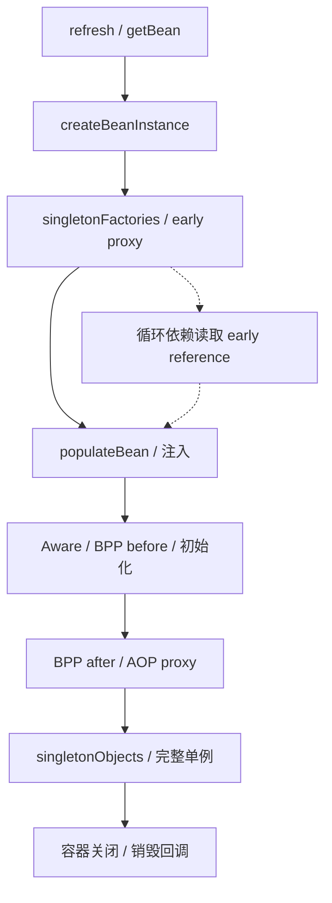

# Spring 核心原理与事务

本章使用 Spring Framework 5.3.31 和 Spring Boot 2.7.18。Spring 创建 Bean、通过代理增强方法、管理数据库事务，是相互配合的几件事。把一次调用从入口走到提交，很多“事务失效”就能解释清楚。

## 核心知识与原理

### IoC、生命周期与循环依赖

假设 OrderService 需要 OrderRepository。IoC 容器先读取 BeanDefinition，知道要创建什么类、注入哪些依赖，再创建对象并完成注入。BeanFactory 提供基础的 Bean 管理；ApplicationContext 在此之上组织启动、资源、事件和国际化等功能。

`refresh()` 会先处理 Bean 定义，再注册 BeanPostProcessor，最后创建非懒加载单例。BeanFactoryPostProcessor 改的是对象还没创建前的定义；BeanPostProcessor 处理的是已经创建的实例。自动代理主要在后者这一阶段参与，二者不能混记。

一个 Bean 大致经历实例化、依赖注入、Aware 回调、初始化前处理、初始化回调、初始化后处理。@PostConstruct、afterPropertiesSet、自定义 initMethod 属于初始化相关步骤。容器关闭时会销毁它管理的单例；prototype 对象取出去后，清理通常要由使用者负责。

循环依赖的问题可以用 A、B 说明：A 已经 new 出来，但注入 B 时发现 B 又需要 A。如果 A 是可提前暴露的单例，容器可以先把 A 的早期引用交给 B，等 B 完成后再把它注入 A。构造器循环却不同：A 连 new 都还没完成，就必须先拿到 B，因此没有现成的 A 可借出去。

三级缓存分别放完整单例、早期引用和生成早期引用的工厂。第三层的工厂允许后处理器按需生成代理，避免 B 拿到原始 A，而其他调用者后来拿到代理 A。它只能处理部分单例字段/setter 循环，也会受到其他后处理器影响。Boot 2.7 默认禁止循环引用；在新代码里拆开相互依赖，通常比打开开关容易维护。

### 动态代理与 AOP

代理相当于方法外面的一层调用入口。例如进入订单方法前开启事务，方法结束后提交；异常时回滚。这层逻辑由拦截器执行，业务类本身不需要把开始、提交散落在每个方法里。

JDK 动态代理基于接口，CGLIB 通过子类增强。具体选择还受配置影响，Boot 默认倾向类代理，不能只凭“有接口”猜代理类型。CGLIB 无法覆盖 final 和 private 方法。

最容易踩到的是自调用：对象内部写 `this.save()`，调用的是自身方法，没有重新进入外部代理。save 上有 @Transactional，也可能根本没执行事务拦截器。把事务操作放到另一个 Bean，由注入的代理对象调用，通常更清楚。

```java
// 业务示例：跨 Bean 调用，让入口穿过事务代理。
@Service
class OrderService {
    private final OrderWriter writer;
    OrderService(OrderWriter writer) { this.writer = writer; }
    public void create(Order order) { writer.persist(order); }
}
@Service
class OrderWriter {
    @Transactional(rollbackFor = Exception.class)
    public void persist(Order order) throws Exception {
        // 同一 DataSource 的持久化路径，异常交给代理作回滚判断。
    }
}
```

### 事务拦截、传播与线程上下文

事务调用进入 TransactionInterceptor 后，Spring 先读事务属性，选择 PlatformTransactionManager，再决定开启新事务还是加入已有事务。业务方法返回时提交，抛异常时按规则决定回滚，最后清理调用上下文。

使用 DataSourceTransactionManager 时，当前事务连接通过 ConnectionHolder 绑定在 TransactionSynchronizationManager 的 ThreadLocal 中。同一线程里的兼容 DAO 操作才能拿到这条连接。手动创建另一条连接，或切到异步线程，不能自动参与原事务。

默认 RuntimeException 和 Error 回滚，checked exception 需要配置 rollbackFor 等规则。异常在方法里被捕获后正常返回，拦截器可能看到的就是成功。另一种情况是内层 REQUIRED 已把共享事务标记为 rollback-only，外层虽然捕获异常，最终提交仍可能抛 UnexpectedRollbackException。

REQUIRED 加入已有物理事务；REQUIRES_NEW 挂起外层、再拿一条连接开启独立事务。外层连接并没有被释放，所以嵌套并发容易耗尽连接池。NESTED 通常使用同一连接上的保存点，外层回滚仍会撤销它；具体支持取决于事务管理器和驱动。

标准代理事务通常以 public 方法为使用范围。排查时还要检查 Bean 是否由 Spring 管理、选了哪个 manager、数据库引擎是否支持事务。Reactor 换线程后不能照搬 JDBC 的 ThreadLocal 事务，需要相应的 reactive manager 和 Context。

### Boot 自动配置与 MVC

自动配置先找候选，再按条件决定是否启用。Boot 2.7 同时读取 spring.factories 和 `AutoConfiguration.imports` 中的候选，随后去重、过滤与排序。已有用户 Bean、缺少类或配置条件不满足，都会让某个配置跳过。排查时看条件报告，比盲目扩大扫描范围有效。

MVC 请求进入 DispatcherServlet，先找 Handler，再找能执行它的 HandlerAdapter。参数解析器准备方法参数，控制器执行后，返回值处理器决定写 JSON 还是解析视图。@ResponseBody 的内容通常由 HttpMessageConverter 写出。

Servlet Filter 在 Servlet 链上，HandlerInterceptor 则在 MVC 的 handler 流程里。preHandle、postHandle、afterCompletion 发生在不同位置；异步请求还可能再次 dispatch。需要清理的租户、日志上下文，应按实际请求边界处理。

```yaml
# Boot 2.7 配置示例：保持默认禁止循环依赖，推动依赖拆分。
spring:
  main:
    allow-circular-references: false
  datasource:
    hikari:
      maximum-pool-size: 20
```

### 事务推演：注解隔离级别为何可能被忽略

外层已开启 RC 事务，内层 REQUIRED 标注 RR，内层默认仍使用外层那条连接和事务，不会凭注解把它临时切成 RR。启用现有事务属性校验时，冲突可能被拒绝。想要一个独立隔离级别，先要确认是否真的创建了新物理事务。

查事务问题可以沿五步走：调用有没有经过代理；manager 是否对应这套数据源；DAO 是否取得绑定连接；异常是否传到拦截器；事务有没有被标记 rollback-only。提交后内存回调发 MQ 也有宕机窗口，可靠投递需要<a href="#c9">同事务保存待发事件</a>。


## 源码级解析与调用链

先看单例的 `getSingleton` 如何依次检查三层缓存，再看事务代理的 `invokeWithinTransaction` 怎样包住方法。对象创建的主过程是 doCreateBean，MVC 请求主入口是 DispatcherServlet.doDispatch。

自动配置读取候选的代码很短，适合直接确认 Boot 2.7 到底还读不读 spring.factories。

<!-- source:beans -->

<!-- source:tx -->

<!-- source:boot -->



## 面试官三层追问

### 1. 为什么三级缓存而非简单提前放对象？

<details markdown="1"><summary>查看回答与追问</summary>

提前给 B 一个原始 A，后面 A 又被做成代理，B 就可能绕过增强。三级缓存中的工厂允许按需生成早期代理，并与最终引用协调。

**getSingleton 按什么顺序找？** 先找 singletonObjects；创建中再找 earlySingletonObjects；允许早期引用时调用 singletonFactories，得到结果后移入第二层并移除工厂。getEarlyBeanReference 让相关后处理器参与。

**需要靠它设计循环吗？** 不建议。它只解决部分单例注入循环，构造器和 prototype 不同。Boot 2.7 默认禁止，先拆职责或显式延迟，初始化过程更容易测试。
</details>

### 2. @Transactional 自调用为何失效？

<details markdown="1"><summary>查看回答与追问</summary>

因为 this.method 没有经过注入的代理对象。@Transactional 是让拦截器识别的配置，不是 JVM 在方法体里自动开启事务的指令。

**事务具体在哪开始？** 调用进入 TransactionInterceptor 后解析属性，交给 manager 创建或加入事务，再调用目标方法。JDK/CGLIB 形式和方法可拦截性也影响是否到这里。

**怎么改得清楚？** 把事务写操作抽到另一 Bean，从容器注入后调用；也可明确使用 TransactionTemplate。测试调用真实代理并核对数据库结果，避免只做普通对象单测。
</details>

### 3. 内层回滚，外层捕获异常为什么仍提交失败？

<details markdown="1"><summary>查看回答与追问</summary>

内外层 REQUIRED 通常共用同一个物理事务。内层标记 rollback-only 后，外层捕获异常并不能把它清除，所以最后提交仍可能失败。

**为什么抛 UnexpectedRollbackException？** 管理器发现共享事务必须回滚，就不能让外层调用者误以为提交成功。捕获 Java 异常与改变数据库事务状态是两件事。

**需要独立审计怎么办？** 可以按业务选择独立事务或可靠异步记录，但要承认审计与主业务不再一起提交。不要只为了消掉异常随意改 REQUIRES_NEW，它还占额外连接。
</details>

### 4. REQUIRES_NEW 与 NESTED 如何选？

<details markdown="1"><summary>查看回答与追问</summary>

REQUIRES_NEW 是独立物理事务，外层失败不一定撤销已提交的内层。NESTED 常是在同一事务中建立保存点，外层回滚仍会把内层结果一起撤销。

**管理器怎样支持？** DataSourceTransactionManager 在允许且驱动支持时可用 savepoint；其他 manager 不一定相同。新事务挂起外层资源后，再借连接，外层连接仍占着。

**如何选择？** 独立审计需要单独提交时可以考虑新事务；同一批工作中局部失败可考虑保存点。按极端并发检查连接需求和锁持有，不把传播选项当成无成本开关。
</details>

### 5. 异步方法能继承 JDBC 事务吗？

<details markdown="1"><summary>查看回答与追问</summary>

不能自动继承。JDBC 连接通常绑定当前线程，异步任务换了线程，不会自然取得原事务。把同一 Connection 手工塞给多个线程也不是安全替代。

**源码体现在哪里？** TransactionSynchronizationManager 保存 ThreadLocal 资源。Reactor Context 跟订阅走，两者不能等同；reactive 事务要配对应 manager。

**业务如何设计？** 真正必须一起成功的本地修改保持同一事务执行；异步动作定义独立事务，并通过 Outbox 或事务消息可靠通知。普通 afterCommit 回调仍有宕机丢任务的可能。
</details>

### 6. 自动配置不生效如何定位？

<details markdown="1"><summary>查看回答与追问</summary>

先确认候选配置有没有加载，再查 classpath、属性和现有 Bean。一个用户 Bean 已存在，可能恰好触发 MissingBean 条件不成立，不是扫描失败。

**Boot 2.7 读哪些资源？** getCandidateConfigurations 同时读取 spring.factories 和 AutoConfiguration.imports，再去重和过滤。条件报告可展示哪条条件没有满足。

**自定义 starter 怎么维护？** 固定支持版本，测试有依赖、缺依赖、用户覆盖等情况。排除自动配置时清楚接替它的职责，别复制内部类后期待跨版本一直可用。
</details>

## 模拟生产案例：新事务耗尽连接池

连接池大小 20，20 个请求都先开启外层事务，随后一起调用 REQUIRES_NEW 写审计。它们全部等新连接直到超时。这是一个可用于测试的模拟条件。

看连接池 active/pending，线程是否停在 borrowConnection，再确认外层事务仍持连接。如果数据库几乎没有执行新 SQL，不能简单认为是 SQL 慢；请求可能还没有拿到连接。

原因是挂起外层事务不等于归还连接，每个请求内层还要再借一条。先限制这类请求并发；是否增加池，要看数据库能力。审计也可按业务改同事务，或通过 Outbox 异步写，明确成功和失败时要留下什么。

测试用屏障让外层同时进入内层，检查是否可有界完成。以后把嵌套事务纳入连接需求，分别设置获取连接和事务超时，避免配置只看正常单层请求。

## 面试回答与核心总结

### 60 秒快速回答

Spring 先创建和注入 Bean，再通过后处理器做代理。三级缓存只帮助部分单例循环，Boot 2.7 默认禁止循环引用。事务必须经过代理，manager 决定创建或加入，JDBC 连接通常绑定当前线程。自调用、捕获异常和异步换线程都要检查。REQUIRES_NEW 独立提交却再占连接，NESTED 常用保存点。排查沿代理、manager、连接和异常一路看，不只确认注解在不在。

### 2～3 分钟深入回答

我会先说明对象创建和方法增强是两个过程。Spring 按 BeanDefinition 实例化、注入，再执行初始化与 BeanPostProcessor。提前暴露单例时用工厂生成早期引用，让循环中拿到的引用尽量与最终代理协调，但这不解决构造器循环，Boot 2.7 默认也禁止。

事务的真正入口是代理里的 TransactionInterceptor。它读属性、选择 manager，创建或加入事务，执行方法，最后提交或按异常规则回滚。JDBC manager 把连接绑定当前线程，所以自己新连接或另起线程，不会自动加入原事务。this 调用没有经过代理，是常见失效原因。

默认运行时异常和 Error 回滚，checked exception 需要规则。异常被业务方法吞掉，拦截器可能看到成功；内层 REQUIRED 已标 rollback-only，外层捕获又不能清掉这个标记，最后仍会失败。

传播要看物理资源。REQUIRED 共用现有事务，内层声明隔离不一定重新生效。REQUIRES_NEW 挂起外层并借新连接，外层还占一条；NESTED 在支持时用保存点，外层回滚仍撤销它。连接池要考虑嵌套并发。

排查时我会依次确认调用经过代理、manager 匹配、DAO 使用绑定连接、异常传播与最终状态。提交后通知下游，也不能只靠内存回调：宕机仍可漏消息，需要可靠待发记录。自动配置则从候选和条件报告查起，MVC 按 handler、adapter、参数和返回值处理解释请求去向。

### 高频追问、常见错误与速记

- 高频追问：checked exception 默认回滚吗？捕获异常为何仍提交失败？Boot 2.7 是否仍读 spring.factories？
- 容易答错：三级缓存解决所有循环；有接口一定 JDK 代理；挂起释放外层连接；把同一事务连接交给异步线程。
- 常看的源码：`doCreateBean/getSingleton/getEarlyBeanReference`、`TransactionInterceptor.invoke`、`invokeWithinTransaction`、`AutoConfigurationImportSelector`、`DispatcherServlet.doDispatch`。
- 理解事务时，先看这次调用实际经过哪里、使用哪条连接，再看注解配置。
