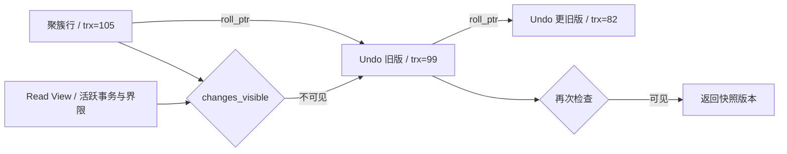

# 数据库事务、MVCC 与性能优化

版本基线：MySQL 8.0.36 InnoDB、PostgreSQL 16、Oracle Database 19c；OceanBase 按 4.x 产品机制讨论，实际兼容模式与小版本须另外核对。隔离级别名称相同不代表内部锁、快照与报错一致。

## 核心知识与原理

### ACID、日志与可见性

Atomicity 通过回滚机制撤销未成功事务，Consistency 是约束与业务协议保持有效，Isolation 控制并发观察，Durability 在承诺持久级别下保证成功提交。Redo 用于恢复已执行的物理修改，Undo 用于回滚及构造历史版本，不是备份。WAL 要求相关日志先于数据页落盘，不意味着所有数据库有相同的 Redo/Undo 文件布局。MySQL binlog 是服务层逻辑日志，redo 是 InnoDB 日志，二者通过提交协议协调；生产持久性还受 innodb_flush_log_at_trx_commit、sync_binlog 和底层存储可靠性影响。

### InnoDB Read View 与 RC/RR

聚簇记录含 DB_TRX_ID、DB_ROLL_PTR 等隐藏字段，Undo 链可重建历史版本。Read View 保存创建者、活跃读写事务 ID 集及界限：小于最小活跃 ID 的版本通常可见；大于等于下一分配界限不可见；中间区间需要查是否仍活跃；创建事务自身的修改可见。源码字段名称有历史命名歧义，按 changes_visible 的判断顺序理解，不靠 up/low 英文猜含义。

RC 通常每次一致性读建立新快照，RR 通常第一次一致性读建立并复用快照，`START TRANSACTION WITH CONSISTENT SNAPSHOT` 等路径另有创建时机。普通 SELECT 一致性读与 SELECT FOR UPDATE、UPDATE 的当前读不同，后者读较新的可锁定状态。RR 不能泛化为“任何操作都绝不看到后来插入”；快照读不看新行，锁定读通过范围锁限制某些插入，混用读类型会出现不同观察。长事务保留旧版本，使 purge 受阻，history list length 增长。

### 索引、范围锁与执行计划

InnoDB B+Tree 聚簇索引叶子保存完整行，二级索引叶子含主键值；非覆盖查询需要回表。联合索引遵循有序键比较，等值前缀后范围通常限制后续字段用于连续区间定位，但后续字段仍可能参与 Index Condition Pushdown 或过滤；不能说“范围之后索引完全失效”。覆盖索引减少读取行的次数，但宽索引增加写放大、页数和缓冲池压力。

Gap Lock 保护间隙，Next-Key Lock 组合记录锁和前间隙。RR 锁定范围查询常用 next-key 防止相应范围内插入；唯一索引完整等值命中通常只需记录锁，未命中等边界要另外推导。RC 多数搜索不使用 gap lock，但外键和重复键检查等仍有例外。锁的是访问路径扫描到的索引区间，不是仅锁最终返回的行，缺索引会放大锁范围。

EXPLAIN 看访问类型、key、估计 rows 和 Extra，再用受控环境 EXPLAIN ANALYZE（8.0.18+）比较实际行数与循环；后者真实执行，不能随意对生产重 SQL 使用。慢查询需分 CPU、IO、锁等待、网络与返回量，避免只给 SQL 加索引。死锁是循环等待，InnoDB 会选 victim；应用重试整个事务而不是只补最后一条语句，且必须幂等、有界并带退避。

### 数据库实现差异与迁移

|数据库|版本/快照|并发与恢复差异|迁移注意|
|---|---|---|---|
|MySQL InnoDB|Undo 历史版本 / Read View；默认 RR|聚簇索引、next-key，redo+binlog|字符集/排序规则、隐式转换、自增和 gap lock|
|PostgreSQL 16|表中多版本 tuple，xmin/xmax，VACUUM|默认 RC；RR 快照隔离，Serializable 使用 SSI 检测危险结构|VACUUM 长事务、序列不随事务回滚、类型与 SQL 方言|
|Oracle 19c|SCN 与 Undo 构造一致读，默认 RC|RR 不是可直接选择的同名级别；Serializable 可能 ORA-08177，Undo 不足可能 ORA-01555|空字符串视为 NULL、序列、日期/精度、执行计划|
|OceanBase 4.x|分布式多版本存储，具体看租户兼容模式|日志复制及分布式事务跨分区协调，不等同单机 InnoDB|MySQL/Oracle 模式不是完全等价，核对功能和分布式执行计划|

迁移先验证数据语义：时间区、字符排序、NULL、decimal、唯一约束，再验证事务、SQL 方言和访问路径。全量快照与 CDC 衔接要记录一致位点；按主键范围分片校验行数与字段规范化 hash，不用简单 sum(id) 证明一致。切换前等待增量追平，冻结必要写入或采用受控双写/路由协议，预设回退窗口；双写本身也会产生偏差，需要对账与修复。跨产品不能把 MySQL Read View 源码当统一 MVCC 实现。

### Read View 手工推演与写偏差

设活跃 ID 集为 {100,104}，m_up_limit_id=100，m_low_limit_id=108，创建者 ID=106。记录 trx=99 可见；100、104 仍活跃不可见；105 已提交且不在活跃集可见；108 及之后尚在快照边界之外不可见；106 的自己写入可见。版本 104 不可见时沿 Undo 找到 99，就能返回旧值。这个判断依赖快照记录的事务状态，而不是读取“当前时刻已提交列表”。

快照隔离可以避免很多读异常，却不自动保护跨行不变量：两名值班人员分别读到另一人仍在值班，各自把自己改成离线，写不同记录未直接冲突，最后无人值班。需要锁住共同约束记录、使用数据库可用的 Serializable 或显式约束/状态协议；MySQL RR、PostgreSQL RR/SSI 与 Oracle Serializable 的细节不同，不能仅按级别名字推断所有异常。事务重试需从新快照重新执行整个决策。

## 源码级解析与调用链

InnoDB 一致读沿 `row_search_mvcc → lock_clust_rec_cons_read_sees → ReadView::changes_visible`，不可见时由 `row_vers_build_for_consistent_read` 重建 Undo 旧版本，再检验可见性。源码在 storage/innobase 的 row、lock、read 和 trx 模块，不是 JDBC getTransactionIsolation 的实现。

<!-- source:mvcc -->



```sql
-- 业务示例：幂等键与条件状态转换放进同一个事务。
START TRANSACTION;
INSERT INTO processed_event(event_id) VALUES ('pay-20261008-001');
UPDATE orders SET status='PAID'
 WHERE id=1001 AND status='PENDING';
-- 调用方检查 affected rows，并区分首次成功、已处理与非法状态。
COMMIT;
-- 联合索引示例：tenant_id 等值、created_at 范围，id 用于稳定排序。
CREATE INDEX idx_order_tenant_time ON orders(tenant_id, created_at, id);
```

## 面试官三层追问

### 1. RR 快照什么时候建立？
<details markdown="1"><summary>展开三层参考答案</summary>

**第一层：**InnoDB RR 一般首次一致性读建立 Read View 后复用，不一定在 BEGIN 当下；RC 每条一致性读更新快照。

**第二层：**changes_visible 根据创建者、活跃 ID 及界限判定，不可见则沿 Undo；显式 consistent snapshot 和锁定读是不同路径。

**第三层：**长读事务影响 purge 和磁盘，报表应分批或使用明确一致快照策略。与当前读混用前定义业务到底需要哪个时点的数据。
</details>

### 2. MVCC 是否让读写完全不阻塞？
<details markdown="1"><summary>展开三层参考答案</summary>

**第一层：**普通快照读通常避免等待写锁，但锁定读、写写竞争以及元数据锁仍会阻塞。

**第二层：**历史版本重建需要 Undo；当前读必须协调索引锁。DDL 等可能与事务持有的 metadata lock 冲突，不能用 MVCC 解释所有等待。

**第三层：**诊断按行锁、MDL、IO、buffer latch 分层，长事务和在线变更要设置治理窗口。并发提升不能只提高连接池大小。
</details>

### 3. MySQL RR 能防所有幻读吗？
<details markdown="1"><summary>展开三层参考答案</summary>

**第一层：**快照读重复看到同一快照，锁定范围读依赖 next-key 限制插入；要先明确读类型和查询条件。

**第二层：**唯一完整等值、未命中、范围与缺索引对应锁区间不同。普通 SELECT 后 UPDATE 是当前读，可能操作后来出现的行，不能把它们当同一个快照过程。

**第三层：**业务唯一性用唯一索引，不依赖“查不到再插入”。库存额度用条件更新或锁定协议，跨库一致性另设计消息/补偿。
</details>

### 4. Redo、Undo、binlog 都是日志，为何不能互换？
<details markdown="1"><summary>展开三层参考答案</summary>

**第一层：**Redo 面向崩溃恢复，Undo 面向回滚和旧版本，binlog 面向复制与逻辑恢复，各有职责。

**第二层：**WAL 约束日志与数据页先后；InnoDB 和 binlog 的提交协调避免崩溃后两套日志产生不可解释分歧。durability 配置改变成功应答的持久边界。

**第三层：**RPO/RTO 设计同时考虑刷盘、副本、备份和演练。主从异步复制不能保证已应答事务在主机故障后必然保留。
</details>

### 5. 慢 SQL 有索引为什么仍慢？
<details markdown="1"><summary>展开三层参考答案</summary>

**第一层：**可能过滤性差、大量回表、排序、锁等待或返回数据过多，有索引不等于低成本。

**第二层：**比较 estimated/actual rows、循环和回表次数，检查类型转换、排序规则及统计偏差；范围后的列仍可能用于 ICP，但不一定减少主扫描区间。

**第三层：**用生产分布样本验证新索引，评估写入成本和 buffer 占用；分页可用稳定游标替代巨大 offset，限制返回列与批量大小。
</details>

### 6. 数据库迁移怎样证明一致？
<details markdown="1"><summary>展开三层参考答案</summary>

**第一层：**需要一致快照位点、CDC 衔接、分片校验和切换后的业务对账，单比行数不足。

**第二层：**规范化时区、decimal、NULL 和字符编码后逐范围 hash 或字段比较，核对删除与更新，避免 CDC 乱序或断点遗漏。

**第三层：**灰度读、写路由和回退计划先验证，跨产品隔离级别与 SQL 语义做故障测试。金融数据要用金额/状态业务不变量对账，不能只看技术 checksum。
</details>

## 模拟生产案例：长快照拖住 Undo

**故障现象：**在线更新正常，但 Undo/history list 增长，磁盘与查询延迟持续上升。**排查思路：**采样 information_schema.innodb_trx、history list、purge 和报表连接生命周期。**原理分析：**一个长 RR 一致性读保持旧快照，purge 不能删除它还可能需要的历史版本。**根因和验证证据：**模拟报表 BEGIN 后持续查询不提交，更新线程不断修改同一数据；结束报表事务后 purge 逐渐追赶，Undo 增长停止。**解决方案：**停止异常长事务，报表按明确批次读或从分析副本取得指定快照，释放连接前完成事务。**长期预防：**事务年龄告警、报表超时、连接复用边界检查，迁移/备份演练包括长快照压力。

## 面试回答与核心总结

### 60 秒快速回答

InnoDB 用 Read View 判断事务版本可见性，不可见沿 Undo；RC 每次一致读新快照，RR 通常首次快照复用，锁定读和写走当前读。B+Tree、覆盖索引和访问路径决定扫描成本及锁范围，next-key 保护范围不等于所有读都锁。Redo、Undo、binlog 职责不同，持久性受配置和复制边界影响。跨库迁移必须验证语义、位点和业务不变量。

### 2～3 分钟深入回答

给定活跃事务和一条三版本链，按 changes_visible 顺序逐个判断，再比较同一 RR 事务快照 SELECT 与 UPDATE 当前读的差别。结合联合索引推导实际扫描区间与 next-key 锁，说明为什么唯一索引比“查询再插入”可靠。随后比较 PostgreSQL tuple/VACUUM、Oracle SCN/Undo 与 InnoDB，指出 SSI、ORA 错误和 purge 的不同治理。结尾给出慢 SQL 证据链与 CDC 迁移切换/对账方案。

对于数据库选择，我不会把 Read View 当所有产品的统一实现。PostgreSQL tuple 版本与 VACUUM、Oracle SCN/Undo 和 OceanBase 分布式协调各有不同恢复成本。迁移要从时区、空字符串/NULL、decimal、排序和唯一约束验证语义，再做一致快照位点与 CDC 衔接，按主键范围及业务金额/状态对账。慢查询则看实际访问路径、回表、锁等待和返回量；加索引需要评估写放大，死锁重试应整体重新执行事务决策。

### 高频追问、常见错误与速记

高频追问：长事务为什么阻碍 purge？唯一未命中怎么锁？EXPLAIN ANALYZE 有何执行风险？常见错误：所有数据库默认 RR；PG 使用 InnoDB Undo；Oracle 可直接选择同名 RR；范围后索引全失效；副本等于备份。源码：ReadView::changes_visible，row_search_mvcc，row_vers_build_for_consistent_read，trx_assign_read_view。核心知识：**版本可见性→访问路径→锁区间→日志承诺→迁移语义**。
