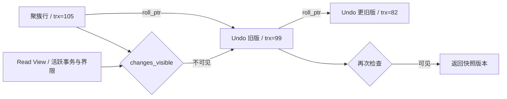

# 数据库事务、MVCC 与性能优化

主要使用 MySQL 8.0.36 InnoDB，另外对照 PostgreSQL 16、Oracle 19c 和 OceanBase 4.x。不同数据库可以都叫 MVCC，却把旧版本放在不同地方，也不一定采用相同的锁和隔离规则。

## 核心知识与原理

### ACID、日志与可见性

转账时，扣款和加款必须一起成功或一起撤销，这对应 Atomicity。金额约束、账户关系和业务规则要一直成立，这是 Consistency。并发事务能看到什么、会互相等到什么程度，由 Isolation 决定。成功提交后，按配置承诺的数据应能从故障中恢复，这是 Durability。

InnoDB 修改数据页后，不必立刻把每个页都写到磁盘。它先写 redo，崩溃后据此重做必要修改。WAL 要求相关日志先于数据页落盘。Undo 则用来撤销未成功事务，并为快照读提供旧版本。Redo 和 Undo 解决的是不同问题，都不是备份。

MySQL 的 binlog 又是另一层日志，主要服务复制和逻辑恢复。InnoDB 提交需要与 binlog 协调，持久程度还受 `innodb_flush_log_at_trx_commit`、`sync_binlog` 和存储设备影响。数据库返回成功，不等于异步副本当时一定已有这笔数据。

### InnoDB Read View 与 RC/RR

假设余额从 100 改为 80，写事务尚未提交。另一个线程做普通 SELECT，不必看到未提交的 80，也不一定要等写锁：它可以沿 Undo 找到之前的 100。MVCC 就是让不同事务按规则读到合适的版本。

InnoDB 聚簇记录含事务 ID 和 Undo 指针。Read View 保存创建者、快照时活跃的读写事务集合，以及判断区间的界限。`changes_visible()` 先判断版本是否早于活跃事务界限、是否为自己写入，再检查新事务界限和活跃集合。不可见时，就沿 Undo 找更旧的版本。

RC 下，普通一致性读通常每条语句新建快照：第一次查完后别人提交修改，第二次就可能读到新值。RR 通常在第一次一致性读建立快照，后续复用；不是写 BEGIN 的那一刻必然建立。显式 consistent snapshot 等路径另有创建时机。

这里的“普通读”很重要。SELECT FOR UPDATE 和 UPDATE 要读取可以锁定和修改的较新状态，走当前读。一个 RR 事务先普通 SELECT，再 UPDATE，不应假定两个动作都只面对同一份旧快照。长快照还会让 purge 保留它可能用到的 Undo，影响清理。

### 索引、范围锁与执行计划

InnoDB 的主键索引叶子保存整行，二级索引叶子保存索引值和主键。通过二级索引找到主键，再去取整行，叫回表。查询所需列都在索引里时可以减少回表，这就是覆盖索引，但增加宽索引也会占内存、增加写成本。

联合索引 `(tenant_id, created_at, id)` 按这几列依次排序。tenant_id 等值能缩小到某个租户，created_at 范围再缩小连续扫描区间。范围之后的列不一定继续缩小这个区间，但仍可能用于 ICP 或过滤，不能一句“范围后索引失效”就结束。

范围更新或锁定读还涉及间隙。记录锁保护已有索引记录，Gap Lock 保护记录之间的空隙，Next-Key Lock 把记录和前间隙一起保护。RR 下某些范围锁定读用它阻止插入；唯一索引完整等值命中通常只锁记录，未命中又要另看。RC 大多数搜索不使用 gap lock，但外键和重复键检查有例外。

SQL 最终只返回一行，不代表只锁一行。若访问路径扫描了很大范围，锁也可能很多。EXPLAIN 先看 key、rows、访问类型和 Extra，再在受控环境用 EXPLAIN ANALYZE 比较实际扫描量。后者会真实执行，不能随意对生产重查询使用。死锁时应有界重试整个事务，重新做决策，而不是只补最后一条 SQL。

```sql
-- 业务示例：幂等键与条件状态转换放进同一个事务。
START TRANSACTION;
INSERT INTO processed_event(event_id) VALUES ('pay-20261008-001');
UPDATE orders SET status='PAID'
 WHERE id=1001 AND status='PENDING';
-- 调用方检查 affected rows，并区分首次成功、已处理与非法状态。
COMMIT;
-- 联合索引示例：tenant_id 等值、created_at 范围，id 用于稳定排序。
CREATE INDEX idx_order_tenant_time ON orders(tenant_id, created_at, id);
```

### 数据库实现差异与迁移

|数据库|旧版本与快照怎样处理？|实践中需要留意什么？|
|---|---|---|
|MySQL InnoDB|Undo 链配合 Read View，默认 RR|next-key、聚簇主键、长事务阻碍 purge|
|PostgreSQL 16|表里保留 tuple 版本，VACUUM 清理，默认 RC|长快照影响清理；RR 是快照隔离，Serializable 用 SSI 检测危险冲突|
|Oracle 19c|使用 SCN 和 Undo 构造一致读，默认 RC|没有可直接照搬的同名 RR；可能遇到 ORA-08177 或 Undo 不足的 ORA-01555|
|OceanBase 4.x|分布式多版本存储与事务协调|MySQL/Oracle 租户模式不是完全等价实现，应核对小版本、功能与分布式计划|

迁移先检查数据含义：时区、decimal、字符排序、NULL 和空字符串。在 Oracle 中空字符串按 NULL 处理，就可能改变唯一性或筛选结果。语法能执行只是第一步，事务结果和访问成本也要测。

全量复制应对应明确快照位点，CDC 从正确位置接上增量。按主键范围比较行数和规范化后的字段内容，重要业务再对金额与状态账；只比行数，漏一行同时多一行也可能“通过”。切换前等增量追平，控制写路由，预演回退。双写会产生自己的失败和乱序问题，需要单独对账。

### Read View 手工推演与写偏差

假设快照里的活跃事务是 {100,104}，最小活跃 ID 是 100，新事务界限是 108，创建者为 106。版本 99 可见；100、104 因仍活跃不可见；105 不在活跃集合里且未超界，可以看见；108 及以后不可见；自己的 106 可见。若当前版本是 104，就沿 Undo 找到可见的旧版。

快照也不是所有业务规则的保险。两名值班人员各自看到对方在线，于是分别把自己改为离线，写的不是同一行，最后却无人值班。要保护“至少一人在线”，可以锁住共同的约束记录，或使用数据库支持的更严格方式。不同产品的 Serializable 和冲突处理不同，应测试后再选；重试时也必须重新读取、重新判断。


## 源码级解析与调用链

InnoDB 普通读会经过 `row_search_mvcc` 及相关可见性检查。`ReadView::changes_visible` 判定版本能否返回；不行则由 `row_vers_build_for_consistent_read` 重建旧版本后再判断。

下面这段判断与前面的 {100,104} 例子对应，注意 m_up_limit_id 和 m_low_limit_id 的历史命名，按代码比较方向理解，不凭英文名称猜。

<!-- source:mvcc -->



## 三层原理问答

### 1. RR 快照什么时候建立？

<details markdown="1"><summary>查看回答与追问</summary>

InnoDB RR 一般在第一次一致性读时建立快照，后续复用；BEGIN 本身不一定已经创建。RC 则通常每次一致性读更新快照。

**为什么能读旧值？** ReadView::changes_visible 判断当前版本所属事务是否可见，不可见时沿 Undo 重建旧版本。显式 consistent snapshot 和锁定读走不同流程。

**长事务会怎样？** 旧快照可能还要用历史数据，purge 不敢清理它们。报表要控制事务时长，跨批次读也要先想清楚是否接受不同时点的数据。
</details>

### 2. MVCC 是否让读写完全不阻塞？

<details markdown="1"><summary>查看回答与追问</summary>

普通快照读通常不需要等写锁，但写写冲突、SELECT FOR UPDATE 和元数据锁仍可能等待。MVCC 没有把数据库里所有等待都取消。

**等在哪层？** 快照读重建 Undo，当前读协调索引锁，DDL 还可能等待 MDL。看到查询慢，需要分清行锁、MDL、IO 与内部竞争，才能解释等待。

**怎样处理？** 找持有者及事务年龄，缩短长事务、安排变更窗口。只扩大连接池会让更多请求排队，不会解除一个仍未结束的持锁事务。
</details>

### 3. MySQL RR 能防所有幻读吗？

<details markdown="1"><summary>查看回答与追问</summary>

要先说明哪种读。快照 SELECT 重复读同一快照；锁定范围读可能使用 next-key 防止相关范围插入。把这两种机制混成一句“RR 没幻读”，无法解释实际操作。

**普通读后 UPDATE 会怎样？** UPDATE 是当前读，可能处理后来出现、符合条件的行。唯一等值命中、未命中和范围查询的锁也不同，需沿实际索引区间分析。

**唯一业务怎样保证？** 用唯一索引约束订单号或事件 ID，不靠查不到再插入。库存扣减用条件更新；跨数据库的结果还需要明确消息和补偿处理。
</details>

### 4. Redo、Undo、binlog 都是日志，为何不能互换？

<details markdown="1"><summary>查看回答与追问</summary>

它们面向不同工作。Redo 帮崩溃恢复重做修改，Undo 帮回滚和重建旧版本，binlog 主要用于复制及逻辑恢复，不能互相替代。

**提交为什么要协调？** 相关 WAL 先于数据页落盘，InnoDB 与 binlog 还要协调提交结果，避免崩溃后两层日志对成功事务产生分歧。刷盘配置决定具体的持久承诺。

**高可用够不够？** 还要看副本确认、备份、恢复速度和演练。异步副本可能落后，也会复制错误删除，所以它既不是零丢失保证，也不是完整备份。
</details>

### 5. 慢 SQL 有索引为什么仍慢？

<details markdown="1"><summary>查看回答与追问</summary>

索引存在，不代表筛掉了足够多的数据。低选择性索引、大量回表、排序、返回过多行或锁等待，都可能使查询慢。

**怎样看到真实工作量？** 比较计划中的估计与实际 rows、loops，检查类型转换、统计和排序。范围后的字段仍可能参与 ICP，但未必缩小扫描区间。EXPLAIN ANALYZE 会真实执行。

**索引以外怎么改？** 控制返回列和批量，深分页考虑稳定游标。新索引用接近生产分布的数据验证，还要看写入与缓存成本，不能只测一个很小的查询样本。
</details>

### 6. 数据库迁移怎样证明一致？

<details markdown="1"><summary>查看回答与追问</summary>

先有一致快照与增量位点，再按范围比较内容，切换后做业务对账。行数一样不代表每行一样，简单 sum(id) 也不能证明没有错漏。

**哪些内容需要规范化？** 时区、decimal、字符编码、排序规则和 NULL。CDC 还要处理更新、删除、断点与顺序，跨产品同名隔离级别不保证行为一致。

**切换怎么恢复？** 先灰度验证，增量追平后控制写路由，并预演回退。金融类数据按金额和状态核对，发现偏差有明确修复流程，而非只宣布 checksum 通过。
</details>

## 模拟生产案例：长快照拖住 Undo

更新业务看起来正常，Undo 和 history list 却持续增长，磁盘与查询压力越来越大。这是一个长 RR 报表事务影响清理的模拟情境。

先看 innodb_trx 中事务年龄、report 连接和 history list，再检查 purge 是否追得上。如果有一个报表很早建立快照却一直不提交，它可能仍需要历史版本，不能只怪更新量大。

受控结束该报表事务后，应观察 purge 是否逐渐追赶，这是检验假设的重要对照。改成明确的批次或分析读取方式，但先决定业务是否必须看到同一时点，避免拆批后结果含义变化。

长期设事务年龄告警和报表超时，检查连接复用时是否完成事务。备份、迁移的大快照同样需要评估保留历史版本的代价。

## 知识梳理与核心总结

### 一分钟要点回顾

InnoDB 普通一致性读用 Read View 判断当前版本，不可见就沿 Undo 读旧版。RC 通常每条读新快照，RR 通常首次一致读后复用；FOR UPDATE 和写操作则读当前状态。索引决定扫描和锁范围，不能只看返回行数。Redo、Undo、binlog 分别负责不同恢复工作。慢查询看实际扫描、回表和等待；迁移还要验证数据含义、CDC 位点和业务结果，不能只比行数。

### 深入理解与机制串联

我会从一个未提交余额修改讲 MVCC。别人把 100 改成 80 尚未提交，普通读可以借 Undo 看到旧 100。Read View 根据版本事务、活跃集合和界限判断可见性，必要时沿历史链回退。

RC 每次一致性读通常换快照，RR 则通常首次读后复用，不一定 BEGIN 时已经创建。SELECT FOR UPDATE、UPDATE 要看可锁定的当前状态，不能把它们和普通 SELECT 当同一快照。长事务还会保留旧版本，阻碍 purge。

索引方面，主键叶子存整行，二级索引带主键，非覆盖时要回表。联合索引先用等值前缀，再用范围，后续列可能参与过滤或 ICP。范围锁沿实际访问路径建立，缺好索引会扫描和锁更多记录；唯一完整等值命中与未命中也要分别看。

慢 SQL 先看计划、实际 rows 和 loops，再查锁等待、IO 和返回量。EXPLAIN ANALYZE 会执行，需要控制影响。死锁按整个事务有界重试，重新读和判断，不能只补最后一条。

跨库我不会把 InnoDB Undo 当所有 MVCC 的实现。PG 用 tuple 与 VACUUM，Oracle 用 SCN/Undo，OceanBase 还有分布式协调。迁移先核对时区、NULL、精度和约束，再保证全量与 CDC 位点衔接，按范围比内容和业务金额状态。切换与回退预演过，才说明方案可以恢复。

### 延伸问题、常见误解与速记

- 高频追问：RR 快照何时创建？长事务为何拖 purge？唯一未命中锁什么？范围后哪些列还有用？
- 容易答错：所有数据库默认 RR；快照读和当前读相同；PG 用 InnoDB Undo；有索引一定快；副本就是备份。
- 常看的源码：`ReadView::changes_visible`、`row_search_mvcc`、`row_vers_build_for_consistent_read`、`trx_assign_read_view`。
- 推导时把读到哪个版本、扫描哪个区间、锁住哪些位置分开。
