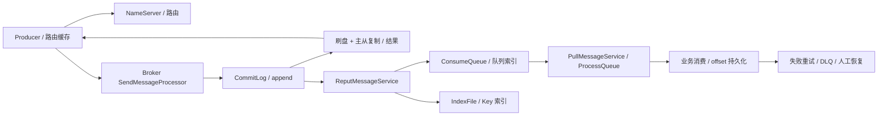
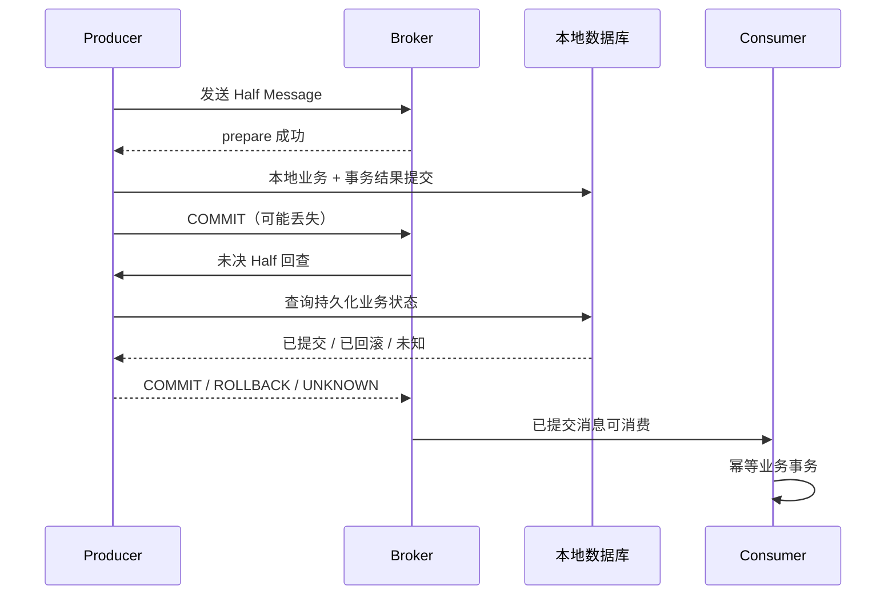

# RocketMQ 消息队列

主线版本：Apache RocketMQ 4.9.8（tag rocketmq-all-4.9.8），以经典 Java Remoting 客户端解释；5.3.4 只在明确小节比较 Proxy、POP、Controller 等能力。Broker 升级不等于客户端自动换消费协议。

## 核心知识与原理

### 路由、消息存储与发送确认

NameServer 维护 Broker 路由，Broker 注册并发送心跳；Producer/Consumer 获取并缓存路由，再直接通信 Broker。NameServer 不保存消息，也不是每次发消息都必须访问的中心协调服务。Broker 保存消息，队列是 Topic 内的并行/顺序单位，客户端负载均衡按具体消费模型执行。

CommitLog 是 Broker 消息主体顺序追加文件，ConsumeQueue 是 Topic/Queue 的逻辑索引，每条经典索引单元 20 字节：物理 offset（8）、消息 size（4）、tagsCode（8）；IndexFile 为 key 查询提供哈希索引，不是主要消费路径。ReputMessageService 从 CommitLog 解析后 dispatch 到 ConsumeQueue/IndexFile，消息持久化和索引构建是相关但不同阶段，宕机恢复会按有效 CommitLog 重建/追赶索引。

`DefaultMQProducerImpl.sendDefaultImpl → sendKernelImpl → MQClientAPIImpl.sendMessage → SendMessageProcessor → DefaultMessageStore.asyncPutMessage → CommitLog.asyncPutMessage`。appendMessage 写映射文件区域，后续刷盘/复制结果参与发送结果。同步刷盘等待到指定 offset 落盘，异步刷盘先成功应答、后台定时/进度刷盘，因此机器故障可能丢已应答但未持久化的数据。`waitStoreMsgOK`、刷盘类型、超时和 HA 配置共同决定等待，不能说只要 SYNC_FLUSH 一切可靠。

传统同步主从复制等待副本达到一定 offset，可降低主故障损失，但返回 FLUSH_SLAVE_TIMEOUT/SLAVE_NOT_AVAILABLE 等状态时业务需明确处理；发送超时可能是“Broker 已写，但响应丢了”，重试可能重复。SYNC_FLUSH + SYNC_MASTER 不等于具备共识选主的集群，传统 HA、DLedger 与 5.x Controller 有不同配置与恢复条件，不能混为一套流程。

### 消费、ACK、重试与死信

4.x PushConsumer 底层仍由客户端 PullMessageService 拉取，拉取结果进入 ProcessQueue，再交给消费执行器；Push 指使用体验，不是每条消息必须由 Broker 主动推送网络包。经典集群消费按队列分配，同一 group 内队列被分配给消费者；广播每个实例都消费，offset 管理与重试路径不同，4.x 广播不提供与集群相同的 Broker 重试保障，业务需处理失败。

并发消费返回 CONSUME_SUCCESS 后客户端更新本地 offset，并按协议持久化 Broker offset；应用层所谓 ACK 在此表示消费成功确认，不是经典模型中每条都用 5.x POP ACK。消费完成但 offset 未持久化就宕机，会重新收到，典型 at-least-once。失败进入 retry topic，超过重试限额进入 DLQ；顺序消费挂起当前队列重试的行为与并发 retry 路径不同，要按 listener 和客户端版本说明。DLQ 必须告警、分析和受控重放，不能当“系统自动解决失败”的垃圾桶。

At-most-once 允许丢失但不重复，at-least-once 允许重复且在恢复条件满足时继续交付，exactly-once 必须定义覆盖范围。RocketMQ 传输不自动保证任意数据库副作用恰好一次；用业务事件 ID 唯一约束与业务变更同事务提交，形成“重复投递，效果一次”。消息 ID、订单 ID、事件 ID 含义不同；一个订单可有多个合法事件，去重键必须包含事件语义。

### 局部顺序与积压恢复

订单事件按业务 key 路由到同一队列，使用顺序消费保证该队列的串行处理；生产者并发发送、重试、队列数量变化与不同生产者仍需业务序号/状态机约束，不能把同 key hash 到队列当完整全局顺序证明。顺序消费者把任务异步分发后立即返回成功会破坏业务执行顺序。跨队列顺序需要协调或设计为可交换事件。

积压由到达率 λ 与可持续完成率 μ 的差产生。恢复时间约为 backlog/(μ-λ)，仅当 μ>λ 才能清空。先区分 Broker IO、拉取、反序列化、线程池、数据库/外部服务瓶颈，再增 consumer；经典队列分配中消费者数量超过队列数量不会增加同 Topic 的有效并行。批量消费必须定义部分失败和事务大小，增加线程会放大下游压力。临时扩队列影响顺序 key 的映射，不能在顺序场景直接无脑调整。

### 事务消息：Half、回查与恢复

Producer 先发 Half Message，Broker 保留但不对普通消费可见；Half 成功后执行本地事务，报告 COMMIT/ROLLBACK/UNKNOWN。COMMIT 使消息进入正常可消费路径，ROLLBACK 终止；报告丢失或 UNKNOWN 由 Broker 回查 Producer。`TransactionalMessageServiceImpl.check` 扫描 Half 和操作记录，判断跳过、丢弃、回查或重新写 Half 等，回查不是无限、实时、永远有 Producer 在线的保证。

本地事务结果必须持久化并可被其他 Producer 实例按 transaction/business ID 查询，不能只存在进程内 map。回查遇到“没有记录”要分尚未执行、已回滚与记录暂时不可读，不能一律 COMMIT；应使用明确状态、超时规则及 UNKNOWN。保留期与最大回查次数都构成失败边界，最终还需要业务对账。事务消息协调数据库提交与消息可见，不包含消费者的业务数据库提交，也不保证整个业务链强一致。

### 发送结果与恢复决策表

成功响应只承诺当次配置要求的完成边界；SEND_OK 不是“所有副本永远无损”。FLUSH_DISK_TIMEOUT 和 FLUSH_SLAVE_TIMEOUT 等不能直接解释成消息不存在，网络 timeout 同样可能已追加；保持稳定业务 eventId，再通过有界重试和业务查询/对账恢复。可见消息的消费者不会因为 Producer 没收到成功就自动暂停，所以重复效果必须由消费者状态协议保护。

模拟 backlog=600 万条、λ=2000 条/秒，当前 μ=1500，队列永远无法清空；把 μ 提到 5000 后净恢复速率 3000 条/秒，估计至少 2000 秒。估计还需考虑重试、峰值和下游限额。若新增消费线程把 DB 连接 pending 拉高，μ 可能反降。顺序业务可优先修复毒消息、按业务 key 分流和优化单消息事务，不为追吞吐破坏顺序语义。

## 源码级解析与调用链

`CommitLog.asyncPutMessage` 校验消息、处理事务/延迟属性、序列化并 append，随后结合 `submitFlushRequest` 和 `submitReplicaRequest` 的 future 汇总结果。`DefaultMQProducerImpl.sendMessageInTransaction` 先 prepare 消息，再执行 TransactionListener.executeLocalTransaction，最后 endTransaction；Broker 回查调用 checkLocalTransaction。`TransactionalMessageServiceImpl.check` 读取 Half/op 队列推进回查状态，op 记录帮助跳过已经处理的 Half。

<!-- source:commitlog -->
<!-- source:mqsend -->
<!-- source:mqtx -->

### 4.x、5.x 与 Kafka/Pulsar 的必要比较

|维度|RocketMQ 4.9.8|RocketMQ 5.3.4|
|---|---|---|
|客户端/消费|经典 Remoting，Push 底层 pull，队列分配|保留兼容路径；Proxy/gRPC、POP 可采用消息级负载均衡及不可见期/ACK|
|延时|经典固定 delay level|新增时间轮等能力；使用路径取决配置和协议|
|HA|传统主从或配置 DLedger|可配置 Controller 等，不能推断默认全启用|
|存储|CommitLog/CQ/IndexFile|保留主干并增更多实现分支，升级需核对实际启用|

Kafka 以 partition 日志为主要组织与并行单位，配合 ISR、acks、幂等 producer/transaction 支持其定义范围内语义；Kafka 事务也不会自然包住任意外部数据库。Pulsar 分离 broker 与 BookKeeper 持久层，通过 ledger 与 subscription cursor 管理存储/订阅，分层扩容代价与运维模型不同。RocketMQ 的统一 CommitLog 与独立消费索引、业务事务回查和经典队列模型更贴近本网站场景，但技术选型仍要比较吞吐、延迟、运维能力和恢复演练，而非靠“谁一定更快”。

## 面试官三层追问

### 1. 数据库提交成功但发送消息失败，怎么办？

展开三层参考答案

**第一层：**不能简单捕获异常忽略，数据库已提交而下游永远不知道。采用 Transactional Outbox 或 RocketMQ 事务消息，并保留业务对账。

**第二层：**Outbox 把业务和待投递事件写进同一数据库事务，relay 有界重试，发送成功但标记失败会重复，因此消费幂等；事务消息先 Half 再本地事务，回查从持久化业务状态恢复结果。

**第三层：**本地状态留存时间要覆盖回查/重放，relay 管理租约、重试、DLQ 和积压 SLA。若已有“提交后发失败”的历史数据，需要补偿扫描，不是仅上线新方案就自动修复。

### 2. 消费者完成业务但 ACK 前宕机，怎么办？

展开三层参考答案

**第一层：**允许再次投递，在消费数据库中用事件 ID 唯一约束防止重复效果。

**第二层：**去重记录与业务更新必须同一事务，先写去重再失败应一起回滚。经典客户端 success/offset 与 POP ACK 是不同协议，二者都不能跨任意业务数据库原子提交。

**第三层：**外部支付等非事务调用需供应商幂等键及结果查询，记录状态机与对账；超时代表未知，不能马上生成新支付请求重复扣款。关联阅读：<a href="#c9">分布式一致性</a>。

### 3. 消息乱序如何解决？

展开三层参考答案

**第一层：**同业务 key 固定队列、顺序消费，并在业务记录中校验单调版本/允许状态转换。

**第二层：**多 producer 发送先后、重试与路由变更都可能影响顺序；消费者将回调工作放异步线程后提前成功，会使实际处理顺序失效。跨队列没有自动全局排序。

**第三层：**可交换事件尽量设计为幂等累积；必须有序的事件带 sequence，缺序列暂存/补拉并设上限。顺序队列的毒消息会阻塞后续，恢复流程要允许受控隔离而非默默跳过。

### 4. 消息积压如何快速恢复？

展开三层参考答案

**第一层：**先找消费变慢还是流量激增，再保证恢复完成率超过到达率，否则只是积压变慢。

**第二层：**比较 queue lag、消费耗时、重试比例、拉取和存储指标；经典模型并行度受队列数限制，线程多也受数据库连接池约束。批量消费评估事务粒度和失败重试范围。

**第三层：**先下游扩容/批处理或限流，计算预计清空时间；紧急旁路只处理语义明确的可丢弃事件。顺序业务不能临时无限分片，历史重放要降速防止再次击穿依赖。

### 5. Broker 故障如何降低消息丢失风险？

展开三层参考答案

**第一层：**根据 RPO 配置刷盘与副本确认，监控复制延迟和未确认状态，发送失败保留可重试记录。

**第二层：**异步应答可能先于磁盘/副本；同步刷盘超时是未知结果，不是必然未写。传统同步主从不自动等价于共识选主，故障切换时应检查最新可用 offset 和集群模式。

**第三层：**演练断电、主从断网、响应丢失和副本落后；配置幂等重试、备份和业务对账。即使复制也不能防止错误删除、错误重放与所有副本同时损坏。

### 6. 事务消息能实现端到端 exactly-once 吗？

展开三层参考答案

**第一层：**不能直接保证任意端到端效果一次，它协调 Producer 本地事务结果与消息可见性，不替 Consumer 提交业务事务。

**第二层：**Half/op 队列与回查有超时和次数边界；消费者仍可能重复，回查状态也需要可恢复。ACK、数据库提交和 Broker offset 不存在一个跨三者的通用原子动作。

**第三层：**定义“效果一次”的业务范围，唯一事件键、状态机、幂等外部调用、重放与对账共同实现可靠结果；对于不可幂等副作用明确人工补偿策略。

## 模拟生产案例：支付成功重复发保单

**故障现象：**支付事件消费成功，但消费者在 offset 持久化前宕机，重启后重复生成保单。**排查思路：**按 eventId 关联 Broker 队列 offset、业务提交时间和进程终止时间；确认不是两个合法支付事件。**原理分析：**at-least-once 投递与业务提交/消费确认窗口叠加，先查再插没有原子约束。**根因和验证证据：**模拟在 DB commit 后立即 kill，重放稳定生成第二张；添加 unique(payment_event_id) 并与保单/去重同事务后，第二次进入幂等成功路径。**解决方案：**上线唯一约束前清理既有重复，外部发单接口传幂等键；消费返回前必须确认事务成功。**长期预防：**宕机点故障注入、重复与乱序重放、DLQ 告警、业务账单对账；幂等记录保留期覆盖消息最大可重放窗口。

## 面试回答与核心总结

### 60 秒快速回答

RocketMQ 4.x 通过 NameServer 获取路由，Broker 追加 CommitLog，再构建 ConsumeQueue/IndexFile，可靠边界取决于刷盘、副本和发送结果。Push 底层拉取，业务成功与 offset 持久化之间可能重复，必须数据库幂等。顺序局限在队列及业务协议；积压恢复要让完成率大于到达率。事务消息先 Half 后本地事务再确认，丢失确认由持久状态回查，但消费者仍需幂等与对账。

### 2～3 分钟深入回答

按发送调用链讲路由、append、刷盘/复制和索引构建，再列成功、超时未知、机器故障三个结果。用业务 commit 后消费确认丢失说明重复与唯一事务的必要性。随后对比 Outbox 与 Half/回查，指出先数据库后发普通消息的裂缝、回查数据留存和失败边界。最后给出 key/sequence 顺序协议、lag/(μ-λ) 恢复估算和 Broker 故障演练，必要时明确经典 offset 与 5.x POP ACK 的区别。

针对五类故障，我会逐一落地：DB 提交后发失败用 Outbox/Half；业务完成确认前宕机用同事务事件唯一约束；乱序用队列局部顺序和业务版本；积压先算净完成率并看下游；Broker 故障按刷盘、复制和集群模式定义 RPO。事务回查状态必须持久且跨 Producer 可查询，UNKNOWN 不是盲目提交。经典 offset 与 POP ACK 不混讲，DLQ 和重放要有告警、速率与幂等记录保留窗口，避免恢复操作制造第二次事故。

### 高频追问、常见错误与速记

高频追问：消费成功何时保存 offset？同步复制等于自动选主吗？回查状态不可读怎么办？常见错误：Push 完全没有 pull；MQ 事务包住消费数据库；发送超时必定没写；扩消费者超过队列仍无限加速；广播失败自动和集群一样重试。源码：sendDefaultImpl/sendMessageInTransaction，CommitLog.asyncPutMessage，ReputMessageService.doReput，TransactionalMessageServiceImpl.check，ConsumeMessageConcurrentlyService.processConsumeResult。核心知识：**应答边界→重复窗口→幂等事务→顺序与恢复**。
