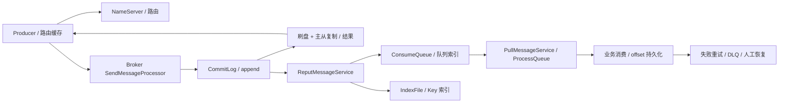
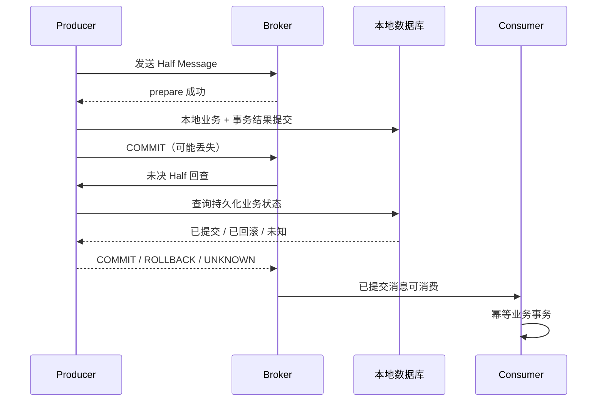

# RocketMQ 消息队列

主要看 RocketMQ 4.9.8 的经典 Java 客户端，涉及 5.x 时明确以 5.3.4 对照。这个专题围绕两个实际问题展开：消息到哪里才算发出去了，业务做到哪里才算消费成功。

## 核心知识与原理

### 路由、消息存储与发送确认

Producer 先从 NameServer 获取 Topic 的 Broker、队列等路由信息，缓存后直接向 Broker 发消息。Consumer 也根据路由找 Broker。NameServer 不保存消息，也不用参与每一条消息的收发。

Broker 把消息主体顺序追加到 CommitLog。消费按 Topic 和 Queue 进行，ConsumeQueue 保存“这条队列消息在 CommitLog 的哪个位置”，经典索引单元为 20 字节：8 字节 offset、4 字节 size、8 字节 tagsCode。IndexFile 用于按 key 查询，不是普通拉取消费的主索引。

消息追加后，ReputMessageService 继续从 CommitLog 解析，分发生成 ConsumeQueue 和 IndexFile。主体写入与消费索引生成不是同一动作，恢复时也需要追赶有效日志。

Producer 收到发送结果时，Broker 做到哪一步，取决于配置。异步刷盘可以先响应，稍后再落磁盘；机器此时故障，可能丢掉已应答但尚未落盘的数据。同步刷盘等待指定位置持久化，但还要看 waitStoreMsgOK 和超时结果。复制到副本也是另一项等待，不应把“写本机磁盘”和“副本收到”混为一谈。

发送超时尤其容易误判。Broker 可能已经写入，只是响应没到 Producer。因此重试可能产生重复，不能把超时解释为必定没发出去。传统同步主从、DLedger 和 5.x Controller 的选主与恢复方式不同；同步复制本身并不自动提供一套完整的共识选主。

### 消费、ACK、重试与死信

4.x 的 PushConsumer 是对应用隐藏了拉取调度。底层 PullMessageService 仍从 Broker 拉消息，放进 ProcessQueue，再交给消费线程执行。业务感觉是“有人回调我”，网络模型却不能概括成 Broker 每条主动推送。

经典集群消费将队列分配给同 group 的消费者。消费方法返回成功后，客户端更新消费位置，并按相应流程把 offset 持久化。假如数据库已经提交，但进程还没保存消费位置就宕机，重启后可能再次收到那条消息。这是为什么消费必须考虑重复。

并发消费失败会进入重试流程，超出限额进入 DLQ；顺序消费的挂起和重试行为不同。广播消费让每个实例都收到消息，4.x 的 offset 和失败重试保障不能照搬集群模式。DLQ 需要告警、查原因和受控重放，否则失败消息只是换了个地方积压。

At-most-once 允许丢失，at-least-once 允许重复。Exactly-once 一定要说清范围：MQ 不会自动把消费确认和任意数据库提交变成同一个事务。实际常用做法是事件 ID 唯一约束，并把处理记录与业务修改放在同一数据库事务里。第二次投递识别到同一事件，就返回已处理结果。

订单 ID 不总是合适的去重键。一个订单可能有支付、退款、撤销等多个合法事件，应该按事件身份区分，否则退款会被当作“订单已经处理过”而丢掉。这里提到的 ACK 是消费成功确认的泛称；经典 offset 模型和 5.x POP 的逐消息 ACK 是不同机制。

### 局部顺序与积压恢复

订单的创建、支付、取消需要按顺序处理时，可以按订单 key 路由到同一队列，并使用顺序消费者。回调里又把任务丢给异步线程、马上返回成功，会让实际业务重新乱序。多 Producer、发送重试和队列变更也需要考虑，因此业务记录最好再检查版本号和允许的状态转换。

积压恢复先算一个简单关系。假设积压 600 万条，新消息每秒来 2000 条，当前每秒只能处理 1500 条，扩多少“等待线程”都不会自动清空。若把实际完成率提高到 5000 条/秒，净消化速率才是 3000，理论上至少还要约 2000 秒。

再判断瓶颈在哪：Broker IO、拉取、反序列化，还是业务 SQL、外部接口？经典队列分配中，消费者实例超过队列数不会继续增加有效并行。线程增加而数据库连接不够，可能只是多了等待者。批量处理可减少开销，但必须说明一批里部分失败怎么重试。顺序业务扩队列还会改变 key 分布，不能在故障时随意改。

### 事务消息：Half、回查与恢复

普通写法先提交 DB 再发消息，中间宕机就会留下“业务已成功、下游不知道”。事务消息换了一种顺序：先发送 Half Message，Broker 保存它但不交给普通消费者；Producer 再执行本地事务，并报告提交、回滚或未知。

提交报告丢失时，Broker 回查 Producer，让它判断本地事务到底完成了没有。因此结果必须保存在数据库里，并能按 transactionId 或业务 ID 查询，最好换一台 Producer 也能回答。只存进程内 Map，重启后就无从判断。

查不到记录也不能直接返回 COMMIT。它可能还没执行、已失败，或者数据库暂时不可用。应有明确状态和 UNKNOWN 的处理方式。回查有等待、次数和记录保留的限制，不会永远替业务恢复；仍需对账检查长期没有完成的交易。

事务消息主要协调生产端本地事务与消息可见性。消费者收到后如何提交自己的数据库，是下一段问题，仍需要幂等。也可以选择<a href="#c9">Outbox</a>：把待发事件和业务写入同一数据库事务，再由后台任务发送。

### 发送结果与恢复决策表

SEND_OK 表示满足本次发送所要求的完成条件，并不是所有副本永远不会丢数据。FLUSH_DISK_TIMEOUT、FLUSH_SLAVE_TIMEOUT 以及网络超时，都不能直接说明消息不存在。保留稳定的业务事件 ID，记录待确认状态，再做有限重试、结果核查和对账。

Broker 故障时，先核对集群模式、最新副本位置和复制延迟，再按既定恢复流程切换。消费恢复也要限制速度，免得积压一次性冲垮数据库。消息保留期、去重记录保留期和允许重放的时间，应一起设计。

## 源码级解析与调用链

发送主线是 sendDefaultImpl、sendKernelImpl、Broker 的 SendMessageProcessor，再到 DefaultMessageStore 与 CommitLog。下面先看 CommitLog 怎样组合刷盘和复制结果，接着看事务生产者与 Broker 回查。

回查不是凭 Half 的存在就断定业务成功。`TransactionalMessageServiceImpl.check` 结合 Half 与操作记录，决定跳过、回查、重新写入或后续处理。生产者的 executeLocalTransaction 和 checkLocalTransaction 要能回答同一业务状态。

<!-- source:commitlog -->

<!-- source:mqsend -->

<!-- source:mqtx -->

### 4.x、5.x 与 Kafka/Pulsar 的必要比较

|维度|RocketMQ 4.9.8|RocketMQ 5.3.4|
|---|---|---|
|客户端/消费|经典 Remoting，Push 底层 pull，队列分配|保留兼容路径；Proxy/gRPC、POP 可采用消息级负载均衡及不可见期/ACK|
|延时|经典固定 delay level|新增时间轮等能力；使用路径取决配置和协议|
|HA|传统主从或配置 DLedger|可配置 Controller 等，不能推断默认全启用|
|存储|CommitLog/CQ/IndexFile|保留主干并增更多实现分支，升级需核对实际启用|

Kafka 以 partition 日志为主要组织与并行单位，配合 ISR、acks、幂等 producer/transaction 支持其定义范围内语义；Kafka 事务也不会自然包住任意外部数据库。Pulsar 分离 broker 与 BookKeeper 持久层，通过 ledger 与 subscription cursor 管理存储/订阅，分层扩容代价与运维模型不同。RocketMQ 的统一 CommitLog 与独立消费索引、业务事务回查和经典队列模型更贴近本网站场景，但技术选型仍要比较吞吐、延迟、运维能力和恢复演练，而非靠“谁一定更快”。

## 面试官三层追问

### 1. 数据库提交成功但发送消息失败，怎么办？

查看回答与追问

普通的提交后发送存在宕机间隙。新设计可以用 Outbox，把业务与待发事件同事务保存；或用事务消息先 Half，再执行本地事务，由回查补齐未知结果。

**失败怎样补回来？** Outbox 任务从持久记录继续发，发出但没标成功可能重复；事务回查根据数据库状态决定提交或回滚。两种方式都仍需要消费端识别重复。

**已经漏掉的订单呢？** 新方案不会自动补历史缺口，要按已完成业务与下游结果扫描补发。给待发事件设置重试、积压年龄告警、保留期和人工处理方式。

### 2. 消费者完成业务但 ACK 前宕机，怎么办？

查看回答与追问

消息可能再次投递，所以消费逻辑应能识别同一业务事件。事件 ID 唯一记录与业务修改放在同一数据库事务，重复投递返回此前结果。

**为什么去重也要同事务？** 如果先记处理成功，业务却回滚，下次会被挡掉；反过来业务提交后去重未落库，又会做两遍。经典 offset 和 POP ACK 都不会自然与任意 DB 原子提交。

**外部付款怎么办？** 向供应商传稳定幂等键，超时后查询同一请求结果。不能因为没收到响应就换 ID 再扣一次，必要时记录 UNKNOWN 并对账。

### 3. 消息乱序如何解决？

查看回答与追问

同一业务 key 路由到同一队列，使用顺序消费，业务再校验版本或允许的状态变化。这解决局部顺序，不提供跨所有队列的全局顺序。

**还有哪些地方会乱？** 多 Producer 的发送先后、重试、队列调整都会影响顺序。回调里异步分发后马上成功，也会让实际数据库操作重新并行。

**遇到缺一个版本怎么办？** 可以暂存未来版本或查询来源补齐，设数量和时间上限。毒消息卡住顺序队列时，需要受控修复或隔离，不能悄悄跳过关键事件。

### 4. 消息积压如何快速恢复？

查看回答与追问

先查哪里变慢，并让实际处理速度超过新消息到达速度。只增加实例数量，若仍卡在同一个数据库，积压不会因此消失。

**并行有何上限？** 经典队列分配受队列数限制；消费线程还受连接池和外部接口容量限制。批处理可能提高吞吐，但要定义部分失败与重试的范围。

**多久能恢复？** 用积压量除以完成率减到达率估算。限制历史重放速度，必要时降低新流量。顺序业务扩队列要先评估 key 映射变化，避免用乱序换吞吐。

### 5. Broker 故障如何降低消息丢失风险？

查看回答与追问

根据能接受的丢失范围，配置刷盘和副本确认，并检查发送返回状态。异步应答可能早于落盘或复制，故障后不一定保留。

**同步就万无一失吗？** 同步刷盘超时仍可能已经写入；传统同步主从与 DLedger、Controller 不是同一种选主协议。切换前要核对可用副本位置和复制延迟。

**如何验证可靠性？** 演练主故障、响应丢失和副本落后，验证稳定 eventId 的重试与对账。备份和错误删除恢复仍要单独设计，复制不能覆盖所有损坏。

### 6. 事务消息能实现端到端 exactly-once 吗？

查看回答与追问

不能直接保证端到端业务只做一次。事务消息主要把生产者本地结果与消息可见性联系起来，消费者的数据库仍要自己提交。

**Half 后还有哪些限制？** 回查有超时、次数和记录保存限制。Producer 必须从持久状态回答，消费者依然可能重复，不能用进程内 map 或永远重试代替恢复设计。

**怎样谈效果一次？** 明确业务范围，用唯一事件、同事务去重、状态检查和外部幂等键吸收重复。无法撤销的外部动作还需查询和人工补偿，而不是只承诺一个英文术语。

## 模拟生产案例：支付成功重复发保单

消费者已提交支付业务，保存消费位置前宕机，重启后同一事件再次到来，保单生成又执行一遍。这是 at-least-once 下很典型的模拟情况。

按稳定 eventId 对齐队列 offset、数据库提交和进程退出时间，先排除两个合法不同事件。若生成逻辑是查不到再插入，又无唯一约束，两次执行可能都成功。

为付款事件与保单结果建立正确的业务唯一约束，并让处理记录与业务写入同一事务。外部发单接口也使用稳定幂等键。上线约束前先检查历史重复，不让建索引失败掩盖已有错误。

在测试中将进程停在 DB commit 之后，重放同一事件，预期只留下一个合法结果。以后把这个宕机点、乱序和 DLQ 重放纳入测试；去重记录保留期要覆盖允许的重放时间。

## 面试回答与核心总结

### 60 秒快速回答

RocketMQ 先取路由，Broker 追加 CommitLog，再建立消费索引。发送成功包含哪些保障取决于刷盘与副本配置，超时可能已写入。4.x Push 底层拉取，业务提交与 offset 保存之间会重复，消费应同事务识别事件。顺序局限在队列和实际业务执行，积压要让完成率超过到达率。事务消息用 Half 与回查补生产端结果，消费者仍需幂等，对账还要覆盖长期未完成记录。

### 2～3 分钟深入回答

我先沿发送过程说明成功的含义。Producer 从 NameServer 取路由后直连 Broker，消息主体进入 CommitLog，ConsumeQueue 保存队列到主体的索引，IndexFile 用于 key 查询。同步刷盘和同步副本等待是两件事，配置和返回状态决定当次承诺。

Broker 已写入而响应丢失时，Producer 只看到超时，重试可能重复。消费端也有相似间隙：业务数据库提交了，消费位置还没保存就宕机，恢复后又收同一事件。所以事件 ID 唯一记录和业务修改要同事务；外部付款还要稳定幂等键与查询结果。

数据库成功但普通发送失败，可用 Outbox 或事务消息。Outbox 保存待发记录；事务消息先 Half，再本地事务，最后确认。确认丢失由回查读取持久业务结果，但查不到不能乱提交，也有次数与保留限制。它不包住消费者自己的事务。

顺序消息需要同 key 队列、顺序消费，还要防多 Producer、重试、队列变化和异步回调破坏实际顺序。业务版本能检查重复和缺序列，毒消息则要有受控恢复。

积压先找真正耗时点，再算净处理速度。经典消费者超过队列数不会无限增速，数据库过载时加线程可能更慢。Broker 故障则按具体 HA 模式演练刷盘、复制落后和切换，保留稳定事件重试和对账。最后明确 4.x offset 与 5.x POP ACK 不混讲，DLQ 和历史重放必须有人负责。

### 高频追问、常见错误与速记

- 高频追问：发送超时能否直接重发？消费成功后何时保存位置？回查查不到怎样答？积压多久能清空？
- 容易答错：Push 没有 Pull；事务消息包住消费者数据库；同步复制自动等于共识选主；加消费者永远能提速。
- 常看的源码：`sendDefaultImpl/sendMessageInTransaction`、`CommitLog.asyncPutMessage`、`ReputMessageService.doReput`、`TransactionalMessageServiceImpl.check`、`processConsumeResult`。
- 每次回答“成功”都说清：谁完成了什么，以及下一步之前宕机由谁恢复。
