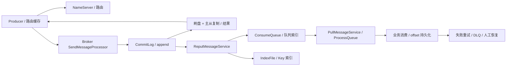
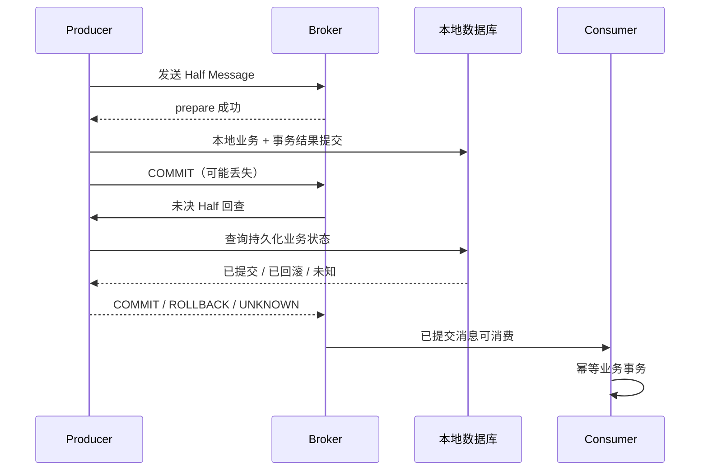
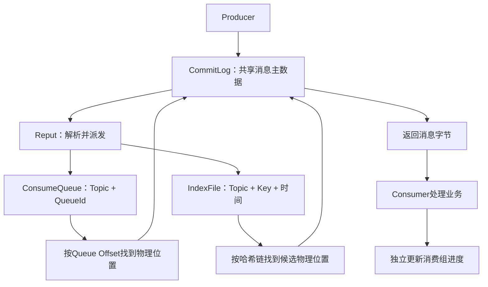
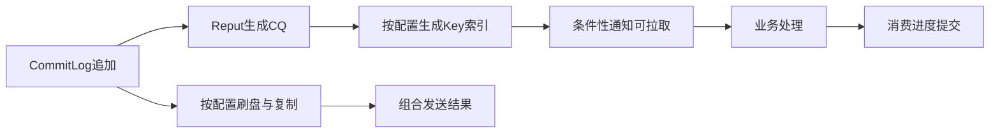

# RocketMQ 消息队列

主要看RocketMQ4.9.8的经典Java客户端与本地文件存储，涉及5.x时明确以5.3.4对照。这个专题串起消息追加、索引派发、队列读取和崩溃恢复：消息到哪里才算发出去了，什么时候能被读到，业务做到哪里才算消费成功。

## 核心知识与原理

### 路由、消息存储与发送确认

Producer 先从 NameServer 获取 Topic 的 Broker、队列等路由信息，缓存后直接向 Broker 发消息。Consumer 也根据路由找 Broker。NameServer 不保存消息，也不用参与每一条消息的收发。

Broker 把消息主体顺序追加到 CommitLog。消费按 Topic 和 Queue 进行，ConsumeQueue 保存“这条队列消息在 CommitLog 的哪个位置”，经典索引单元为 20 字节：8 字节 offset、4 字节 size、8 字节 tagsCode。IndexFile 用于按 key 查询，不是普通拉取消费的主索引。

消息追加后，ReputMessageService 继续从 CommitLog 解析，分发生成 ConsumeQueue 和 IndexFile。主体写入与消费索引生成不是同一动作，恢复时也需要追赶有效日志。

Producer 收到发送结果时，Broker 做到哪一步，取决于配置。异步刷盘可以先响应，稍后再落磁盘；机器此时故障，可能丢掉已应答但尚未落盘的数据。同步刷盘等待指定位置持久化，但还要看 waitStoreMsgOK 和超时结果。复制到副本也是另一项等待，不应把“写本机磁盘”和“副本收到”混为一谈。

发送超时尤其容易误判。Broker 可能已经写入，只是响应没到 Producer。因此重试可能产生重复，不能把超时解释为必定没发出去。传统同步主从、DLedger 和 5.x Controller 的选主与恢复方式不同；同步复制本身并不自动提供一套完整的共识选主。

### 消费、ACK、重试与死信

4.x 的 PushConsumer 是对应用隐藏了拉取调度。底层 PullMessageService 仍从 Broker 拉消息，放进 ProcessQueue，再交给消费线程执行。业务感觉是“有人回调我”，网络模型却不能概括成 Broker 每条主动推送。

经典集群消费将队列分配给同 group 的消费者。消费方法返回成功后，客户端更新消费位置，并按相应流程把 offset 持久化。假如数据库已经提交，但进程还没保存消费位置就宕机，重启后可能再次收到那条消息。这是为什么消费必须考虑重复。

并发消费失败会进入重试流程，超出限额进入 DLQ；顺序消费的挂起和重试行为不同。广播消费让每个实例都收到消息，4.x 的 offset 和失败重试保障不能照搬集群模式。DLQ 需要告警、查原因和受控重放，否则失败消息只是换了个地方积压。

At-most-once 允许丢失，at-least-once 允许重复。Exactly-once 一定要说清范围：MQ 不会自动把消费确认和任意数据库提交变成同一个事务。实际常用做法是事件 ID 唯一约束，并把处理记录与业务修改放在同一数据库事务里。第二次投递识别到同一事件，就返回已处理结果。

订单 ID 不总是合适的去重键。一个订单可能有支付、退款、撤销等多个合法事件，应该按事件身份区分，否则退款会被当作“订单已经处理过”而丢掉。这里提到的 ACK 是消费成功确认的泛称；经典 offset 模型和 5.x POP 的逐消息 ACK 是不同机制。

### 局部顺序与积压恢复

订单的创建、支付、取消需要按顺序处理时，可以按订单 key 路由到同一队列，并使用顺序消费者。回调里又把任务丢给异步线程、马上返回成功，会让实际业务重新乱序。多 Producer、发送重试和队列变更也需要考虑，因此业务记录最好再检查版本号和允许的状态转换。

积压恢复先算一个简单关系。假设积压 600 万条，新消息每秒来 2000 条，当前每秒只能处理 1500 条，扩多少“等待线程”都不会自动清空。若把实际完成率提高到 5000 条/秒，净消化速率才是 3000，理论上至少还要约 2000 秒。

再判断瓶颈在哪：Broker IO、拉取、反序列化，还是业务 SQL、外部接口？经典队列分配中，消费者实例超过队列数不会继续增加有效并行。线程增加而数据库连接不够，可能只是多了等待者。批量处理可减少开销，但必须说明一批里部分失败怎么重试。顺序业务扩队列还会改变 key 分布，不能在故障时随意改。

### 事务消息：Half、回查与恢复

普通写法先提交 DB 再发消息，中间宕机就会留下“业务已成功、下游不知道”。事务消息换了一种顺序：先发送 Half Message，Broker 保存它但不交给普通消费者；Producer 再执行本地事务，并报告提交、回滚或未知。

提交报告丢失时，Broker 回查 Producer，让它判断本地事务到底完成了没有。因此结果必须保存在数据库里，并能按 transactionId 或业务 ID 查询，最好换一台 Producer 也能回答。只存进程内 Map，重启后就无从判断。

查不到记录也不能直接返回 COMMIT。它可能还没执行、已失败，或者数据库暂时不可用。应有明确状态和 UNKNOWN 的处理方式。回查有等待、次数和记录保留的限制，不会永远替业务恢复；仍需对账检查长期没有完成的交易。

事务消息主要协调生产端本地事务与消息可见性。消费者收到后如何提交自己的数据库，是下一段问题，仍需要幂等。也可以选择<a href="#c9">Outbox</a>：把待发事件和业务写入同一数据库事务，再由后台任务发送。

### 发送结果与恢复决策表

SEND_OK 表示满足本次发送所要求的完成条件，并不是所有副本永远不会丢数据。FLUSH_DISK_TIMEOUT、FLUSH_SLAVE_TIMEOUT 以及网络超时，都不能直接说明消息不存在。保留稳定的业务事件 ID，记录待确认状态，再做有限重试、结果核查和对账。

Broker 故障时，先核对集群模式、最新副本位置和复制延迟，再按既定恢复流程切换。消费恢复也要限制速度，免得积压一次性冲垮数据库。消息保留期、去重记录保留期和允许重放的时间，应一起设计。


## 源码级解析与调用链

发送主线是 sendDefaultImpl、sendKernelImpl、Broker 的 SendMessageProcessor，再到 DefaultMessageStore 与 CommitLog。下面先看 CommitLog 怎样组合刷盘和复制结果，接着看事务生产者与 Broker 回查。

回查不是凭 Half 的存在就断定业务成功。`TransactionalMessageServiceImpl.check` 结合 Half 与操作记录，决定跳过、回查、重新写入或后续处理。生产者的 executeLocalTransaction 和 checkLocalTransaction 要能回答同一业务状态。

<!-- source:commitlog -->

<!-- source:mqsend -->

<!-- source:mqtx -->





### 4.x、5.x 与 Kafka/Pulsar 的必要比较

|维度|RocketMQ 4.9.8|RocketMQ 5.3.4|
|---|---|---|
|客户端/消费|经典 Remoting，Push 底层 pull，队列分配|保留兼容路径；Proxy/gRPC、POP 可采用消息级负载均衡及不可见期/ACK|
|延时|经典固定 delay level|新增时间轮等能力；使用路径取决配置和协议|
|HA|传统主从或配置 DLedger|可配置 Controller 等，不能推断默认全启用|
|存储|CommitLog/CQ/IndexFile|保留主干并增更多实现分支，升级需核对实际启用|

Kafka 以 partition 日志为主要组织与并行单位，配合 ISR、acks、幂等 producer/transaction 支持其定义范围内语义；Kafka 事务也不会自然包住任意外部数据库。Pulsar 分离 broker 与 BookKeeper 持久层，通过 ledger 与 subscription cursor 管理存储/订阅，分层扩容代价与运维模型不同。RocketMQ 的统一 CommitLog 与独立消费索引、业务事务回查和经典队列模型更贴近本网站场景，但技术选型仍要比较吞吐、延迟、运维能力和恢复演练，而非靠“谁一定更快”。

## 存储协作：从CommitLog追加到索引构建与崩溃恢复

**CommitLog保存消息本体，ConsumeQueue负责按队列定位，IndexFile负责按Key寻找候选消息；消费组进度由Consumer Offset独立记录。** 三个存储文件不是各存一份完整消息。下面沿同一组消息追踪各个位置的变化，源码均固定为RocketMQ4.9.8，讨论经典文件存储，不包含DLedger的独立恢复实现。

### 一份主数据、两套索引与四种offset

|组件|组织方式与保存内容|读取职责|
|---|---|---|
|CommitLog|Broker内不同Topic、Queue共享物理追加日志，保存消息体、Topic、QueueId、属性等|提供消息原始字节|
|ConsumeQueue|按Topic+QueueId分开维护，条目记录物理offset、size、tagsCode|按逻辑Queue Offset定位消息|
|IndexFile|按Topic+Key建立哈希槽和冲突链，记录物理offset与时间差|按Key、时间范围返回候选位置|
|Consumer Offset|消费组+Topic+QueueId的进度；经典集群消费由客户端更新并提交Broker|表示该组下一次从哪里消费|



图中的回读箭头表示读取消息正文，不是重新写入CommitLog。普通队列消费走ConsumeQueue→CommitLog；Key查询走IndexFile→CommitLog，不需要先通过ConsumeQueue。

|名称|单位与范围|示例|
|---|---|---|
|CommitLog Offset|整个物理日志中的字节位置|消息从1350字节开始|
|Queue Offset|某个Topic+QueueId的逻辑序号|OrderTopic/0中的第2条，序号1|
|Reput Offset|派发线程下一次解析的物理字节位置|reputFromOffset=1650|
|Consumer Offset|某消费组在某逻辑队列的下一次消费位置|groupA=1，groupB=0|

不同消费组共享ConsumeQueue，各自推进Consumer Offset。同组的经典集群消费还要经过队列分配；广播消费的进度保存在客户端，不能直接套用Broker集中保存进度的结论。Queue Offset标识消息位置，不能用它推断某个消费组已经处理完消息。

### 磁盘布局、固定单元与默认容量

以下是概念化目录，文件名以起始物理或逻辑字节offset补齐20位，不表示消息条数；IndexFile通常按创建时间命名。

```text
store/
  commitlog/00000000000000000000
  commitlog/00000000001073741824
  consumequeue/OrderTopic/0/00000000000000000000
  consumequeue/PaymentTopic/1/00000000000000000000
  index/<创建时间命名的索引文件>
  checkpoint
  abort
```

|文件|记录结构|4.9.8经典默认容量|
|---|---|---|
|CommitLog|变长消息，包含总长度、MagicCode、CRC、队列/物理offset、时间、消息体和属性等|每个文件1GiB，即1,073,741,824B|
|ConsumeQueue|8B物理offset+4B消息大小+8B tagsCode=20B|6,000,000B，容纳300,000条索引|
|IndexFile|40B头部+每槽4B的哈希槽数组+每条20B的索引数组|5,000,000槽、20,000,000索引位置，共420,000,040B，约400.54MiB|

IndexFile的索引编号0作为无效位置保留，所以配置中的20,000,000不是同等数量消息的精确承诺。一条消息的UniqKey和多个业务Key也可能占多个索引条目。容量来自[MessageStoreConfig](https://github.com/apache/rocketmq/blob/rocketmq-all-4.9.8/store/src/main/java/org/apache/rocketmq/store/config/MessageStoreConfig.java)，布局来自[IndexFile](https://github.com/apache/rocketmq/blob/rocketmq-all-4.9.8/store/src/main/java/org/apache/rocketmq/store/index/IndexFile.java)。

tagsCode也不能永远解释成Tag哈希：启用ConsumeQueueExt时，它可以保存扩展记录地址；经典延迟消息的内部调度队列还会用它承载投递时间。读取方需要按实际消息和配置解释这个8B字段。

### 用三条消息手算写入、派发与读取

以下物理位置和长度是计算示例，不是实际运行记录。假设CommitLog已经有前缀，后续追加三个普通消息：

|物理写入顺序|消息|Topic/QueueId|物理起点|大小|Queue Offset|物理结束位置|
|---|---|---|---|---|---|---|
|1|M1|OrderTopic/0|1000|200B|0|1200|
|2|M2|PaymentTopic/1|1200|150B|0|1350|
|3|M3|OrderTopic/0|1350|300B|1|1650|

OrderTopic/0的ConsumeQueue依次保存`(1000,200,TagA)`和`(1350,300,TagB)`，占逻辑字节位置0、20；PaymentTopic/1单独保存`(1200,150,TagC)`。同一物理文件中的交错写入被还原为两个逻辑队列，不需要复制消息正文。

读取OrderTopic/0的Queue Offset=1时，先计算`1×20=20`，读取那里的ConsumeQueue条目，再从CommitLog的1350处读取300B。派发线程处理M1后从1000推进到1200，处理M2后到1350，处理M3后到1650；Order队列的消费组即使尚未处理M1，也不影响这些存储位置的推进。

对于大小为F的CommitLog分片，`文件起点=floor(物理offset/F)×F`，`文件内位置=物理offset%F`。例如物理offset=1,073,742,000时，文件起点是1,073,741,824，文件内位置176。ConsumeQueue也按相同思想定位，只是先把Queue Offset乘以20，再用6,000,000B分片大小计算文件和文件内位置。

### Producer并发提交，追加锁如何保护两种顺序

简化发送链路是`SendMessageProcessor → DefaultMessageStore.asyncPutMessage → CommitLog.asyncPutMessage → MappedFile.appendMessage → DefaultAppendMessageCallback.doAppend`。Producer请求可以并发到达，经典CommitLog的追加临界区由`putMessageLock`串行协调，锁类型取决于配置。

<!-- source:mqappend -->

锁内选择或创建当前文件、重新设置存储时间戳，再追加消息。编码有部分工作在锁外完成，但队列序号和物理offset是在锁内的追加回调中写回编码缓冲区。物理起点是`fileFromOffset+byteBuffer.position()`；`topicQueueTable`按Topic-QueueId取下一逻辑序号，普通/提交消息追加成功后才递增。不同队列独立编号，因此上例两个队列的第一条消息都可以是Queue Offset=0。

<!-- source:mqqueueassign -->

文件剩余空间不足时，回调写入BLANK_MAGIC_CODE和剩余长度，返回END_OF_FILE；外层在新文件重试追加。文件尾空白不算一条业务消息，不消耗正常队列序号，Reput也必须识别它并跳到下一文件。

这保证的是Broker最终追加顺序和对应队列序号的协调，不保证多个Producer业务调用按开始时间排序。业务顺序仍需要稳定路由到同一队列，处理发送并发、重试与消费者实际执行顺序。把所有队列汇聚到CommitLog减少分散随机写和文件管理成本，代价是追加临界区的协调，以及消费时可能离散回读消息正文。

### ReputMessageService怎样把共享日志派发到正确队列

4.9.8经典Reput由单个后台服务线程沿物理offset解析。它先取可读CommitLog切片，再由`checkMessageAndReturnSize`生成DispatchRequest，其中已经包含Topic、QueueId、消息大小、物理offset、逻辑队列offset、tagsCode、Key和存储时间，不需要猜测目标队列。

<!-- source:mqreput -->

这段展示有效消息分支：`doDispatch`执行后，满足主节点、长轮询和监听器条件时通知消息到达，再把`reputFromOffset`增加记录长度。完整方法还处理零长度的文件尾标记、解析异常、duplicationEnable对应的confirmOffset边界，并在finally释放映射缓冲区。启用TransientStorePool时，还要区分写入暂存缓冲区、commit到可读映射文件和flush到磁盘三个位置；可读范围不能直接等同于所有已追加字节。

DefaultMessageStore构造器先注册`CommitLogDispatcherBuildConsumeQueue`，再注册`CommitLogDispatcherBuildIndex`；`doDispatch`按注册顺序调用。因此经典有效消息路径为“解析→构建CQ→按配置构建Key索引→条件性通知→推进派发位置”。

<!-- source:mqdispatch -->

通知发生在派发器调用之后，不表示三个文件构成原子事务，也不表示每个派发器都确认了持久化成功。CQ写入包装方法最多尝试30次，失败分支间隔1秒；最终设置`makeLogicsQueueError()`。派发器没有把这个失败作为布尔结果交还给Reput，因此不能推断“失败必定无限原地重试，修好磁盘后遗漏会自动补齐”。Index构建失败也可能只是记录错误。需要联看运行状态和错误日志。

`dispatchBehindBytes=CommitLog.getMaxOffset()-reputFromOffset`表示派发字节落后量。例如1,000,000−800,000=200,000B。它不是某消费组的积压条数，数值归零也不证明所有索引都完整、已经落盘或业务已处理。若`reputFromOffset`已经小于CommitLog最小offset，源码告警后把派发起点移到当前最小位置；被清理的原始字节无法凭CQ找回。

### ConsumeQueue如何识别重放、重复和逻辑错位

<!-- source:mqcqposition -->

这里三个坐标分别是`offset`（消息物理起点）、`offset+size`（消息物理结束位置）和`cqOffset×20`（预期逻辑字节位置）。`maxPhysicOffset`保存该队列已处理消息的最大物理结束位置，不是消息起点，也不是逻辑序号。

例如OrderTopic/0已索引到M3，则`maxPhysicOffset=1650`。重放M1时，`1000+200≤1650`成立，直接返回true，避免再次追加。即使PaymentTopic/1最后处理的位置不同，也不会影响Order队列自己的判定。

接下来比较预期逻辑位置与当前文件写入位置：

|关系|4.9.8处理|需要理解的边界|
|---|---|---|
|预期小于当前|记录重复构建告警，返回true|依赖现有索引与物理日志顺序正确|
|预期等于当前|正常追加20B|Queue Offset和文件写入位置对应|
|预期大于当前|记录`logic queue order maybe wrong`，仍继续尝试追加|日志不是自动补洞或拒绝写入的保证|

<!-- source:mqcqorder -->

完整方法对新创建队列且首个有效offset非零的情况还有`fillPreBlank`：填充到有效起点并设置minLogicOffset，用于承接保留下来的逻辑范围，不是凭空恢复已丢失消息。另一个细节是`maxPhysicOffset`在`appendMessage`返回之前赋值，不能把这个内存字段单独当作CQ成功持久化的证明。

物理重放跳过和逻辑位置检查服务于正常恢复的顺序前提。人为删除中间CQ文件、损坏历史条目或发生派发写入异常时，单靠“最大位置”可能跳过更早的缺口，必须另行核对与修复。

### 普通消费的读取链路与两阶段过滤

`PullMessageProcessor → DefaultMessageStore.getMessage → ConsumeQueue.getIndexBuffer → CommitLog.getMessage`是经典Broker读取主线。getMessage先检查请求的逻辑offset与队列min/max范围，再逐条读取20B索引；过滤不匹配、条目指向已清理数据和批次已满都有独立分支。

<!-- source:mqread -->

第一层`isMatchedByConsumeQueue`用tagsCode或CQ扩展数据尽早排除消息，减少正文读取。第二层`isMatchedByCommitLog`用于需要消息属性的精确表达式判断，例如SQL92订阅。不要把这两层理解成所有过滤类型都会在Broker对真实Tag字符串检查两遍：4.9.8的ExpressionMessageFilter在Tag分支直接通过CommitLog级过滤，经典客户端还会根据实际Tag进行过滤。参见[ExpressionMessageFilter](https://github.com/apache/rocketmq/blob/rocketmq-all-4.9.8/broker/src/main/java/org/apache/rocketmq/broker/filter/ExpressionMessageFilter.java#L118-L165)。

固定长度带来直接定位：Queue Offset=100,000对应逻辑字节位置2,000,000。但消息正文混在CommitLog中，按某队列回读不一定连续，缓存命中、PageCache与磁盘状态仍决定读取成本。

返回的`nextBeginOffset`是本次扫描之后建议继续拉取的位置，可能跨过被过滤消息，不等于业务已提交的消费进度。获取100、101、102三条后，客户端可以继续从103拉取；只有按客户端处理策略完成并更新/持久化消费位置，某组的已提交位置才会推进。业务数据库提交和offset提交之间仍有故障窗口，需要业务幂等。

### IndexFile的哈希槽、冲突链与精确Key核验

IndexService把Topic和Key组合成`OrderTopic#ORDER_123456`。IndexFile对这个字符串计算非负哈希，`slot=hash%hashSlotNum`；槽里放的是最新索引编号。每个20B条目依次是4B keyHash、8B物理offset、4B相对文件起始时间的秒差、4B前一索引编号。

<!-- source:mqindexput -->

新增条目的prevIndex保存这个槽原来的编号，再把槽指向新编号，由此形成从新到旧的冲突链。查询先按文件时间范围筛选，再沿链检查完整keyHash与时间范围，直到达到maxNum、越过起始时间或遇到无效/异常链接。

需要区分“落入同一个槽”和“完整哈希相同”：前者可由条目中的keyHash排除，后者仍可能返回错误Key的候选位置。IndexFile不保存原始Key全文。Broker回读CommitLog返回候选消息后，4.9.8经典管理客户端MQAdminImpl.queryMessage对真实Topic和业务Key逐一核对。

<!-- source:mqkeyverify -->

因此Key查询不是唯一性约束，同Key可以有多条消息；时间窗口、返回数量上限、索引开关、派发失败和原始日志清理都会影响结果。“Key没查到”不能直接判定消息没有成功发送。普通消费者不依赖IndexFile，但不能由此推断索引构建故障对整个Broker的派发耗时和运行状态永远没有影响。

### 事务与延迟消息：存在记录不等于业务队列可见

CQ派发器检查MessageSysFlag：普通消息、TRANSACTION_COMMIT_TYPE构建CQ；TRANSACTION_PREPARED_TYPE、TRANSACTION_ROLLBACK_TYPE跳过。IndexService.buildIndex的规则不同：它跳过Rollback，允许其他上述类型进入Key索引。因此不能把“CQ不建”和“任何索引都不建”混为一谈。

更容易漏掉的是4.9.8事务服务的真实Half存储流程。`TransactionalMessageBridge.parseHalfMessageInner`会把真实Topic和QueueId保存为属性，将事务标记重置为普通类型，并把消息改写到内部Half Topic的Queue0。**实际Half会有内部队列索引，方便回查；它没有成为原业务Topic上可消费的已提交消息。** “Prepared标记不建CQ”的分支表，不能直接套成“Half在任何队列都没有CQ”。

<!-- source:mqhalf -->

经典延迟消息则改写到SCHEDULE_TOPIC_XXXX，保存真实Topic/QueueId，待到期后由调度服务重新投递到业务队列。内部存储记录、内部队列可见性和最终业务队列可见性是三个不同状态。

### 崩溃恢复先区分故障时的数据状态



刷盘/复制与索引构建有独立进度，图中不存在“发送ACK必须等索引完成”的依赖。可靠性分析需要分别检查消息字节、索引有效范围和消费组提交位置。

|故障窗口|重启时可能留下的数据|恢复关注点|
|---|---|---|
|消息仅追加、尚未可靠保存|消息可能缺失或只剩部分记录，CQ甚至已经构建|校验有效日志尾部，清理指向无效消息的CQ|
|CommitLog可靠保存，CQ尚未构建|主数据存在，消费索引落后|在恢复扫描与启动派发范围内补CQ|
|CQ已构建，IndexFile不完整|普通消费索引存在，Key查询索引不可信|按IndexCheckpoint筛选文件，并在实际重放范围内补索引|
|业务已提交，消费组位置未提交|业务结果存在，旧消费位置仍在|可能再次投递，由业务幂等识别；Broker存储恢复不负责回滚业务数据库|

只有CommitLog中的有效原始消息仍在，才有重建正文索引的基础。CQ和IndexFile都不能恢复已经删除的消息体；需要副本、备份或其他原始数据来源。

### abort、checkpoint与正常/异常恢复入口

DefaultMessageStore.load用abort文件是否存在判断上次退出状态；正常运行创建标记，关闭时只有存储可写且派发落后量为0等条件满足才删除，否则保留。它是异常退出标记，不是每条消息的完成记录。

`load → IndexService.load(lastExitOK) → recover(lastExitOK)`进入恢复。recover先对各ConsumeQueue执行recover，汇总最大物理结束位置，再选择CommitLog.recoverNormally或recoverAbnormally，最后恢复topicQueueTable。

<!-- source:mqrecover -->

StoreCheckpoint记录三个时间戳，不保存消费组offset，也不是持久化的Reput Offset：

|字段|checkpoint字节位置|恢复用途|
|---|---|---|
|physicMsgTimestamp|0，占8B|物理消息存储相关检查点|
|logicsMsgTimestamp|8，占8B|逻辑队列存储相关检查点|
|indexMsgTimestamp|16，占8B|IndexFile安全检查点|

<!-- source:mqcheckpoint -->

`getMinTimestamp()`取物理与逻辑时间戳最小值再减3秒，负数按0处理；`getMinTimestampIndex()`再和索引时间戳取小值。异常恢复从后向前检查CommitLog文件首条消息时间，选出不晚于参考时间的文件；启用messageIndexEnable且messageIndexSafe时使用包含索引的参考时间，否则使用物理/逻辑参考时间，未找到则从现存首文件开始。参考时间用于挑扫描文件，不是精确到字节的提交证明。

### 找到有效CommitLog尾部，并截断多余CQ

正常恢复从最后第三个CommitLog文件附近开始校验尾部，少于三个文件就从首文件开始；异常恢复用上述时间参考选起点，并在校验有效消息时调用doDispatch。两条路径都通过checkMessageAndReturnSize核对MagicCode、长度等结构，是否验证消息体CRC取决于checkCRCOnRecover。CRC识别消息体损坏，不表示是否被消费。

假设M97～M99有效，M100只写入一部分，扫描在M100处发现无效记录，最终有效结束位置停在M99之后。恢复把flushedWhere、committedWhere调整到这个位置，并用truncateDirtyFiles收缩写入位置、清理后续脏文件。这里的“截断”是存储层有效范围调整，不应理解为必然把预分配文件的操作系统长度直接缩短。

<!-- source:mqrecovertruncate -->

如果恢复出的CQ最大物理结束位置达到或超过这个有效尾部，还调用truncateDirtyLogicFiles。CQ自身从末尾文件检查条目，删除或收缩指向有效尾部之外的部分，避免消费者拿着索引回读不存在的消息。它依赖正常记录边界，不是逐条证明任意磁盘损坏下所有索引与正文一致。

### 补建索引、恢复队列序号与启动派发

异常恢复校验有效记录时已经执行doDispatch，CQ的物理/逻辑位置检查帮助跳过已有条目。随后DefaultMessageStore.start从现有CQ最大物理结束位置计算Reput起点，以CommitLog最小位置作为下界，启动Reput并等待`dispatchBehindBytes()≤0`，再恢复topicQueueTable并继续启动其他服务。

<!-- source:mqrestart -->

如果有效日志到10,000，现有CQ最大结束位置为9,000，后续正常派发会扫描9,000～10,000。队列序号恢复则从各CQ的`getMaxOffsetInQueue()`重建下一可分配Queue Offset，避免重启后把序号重新从0开始。

但“全部CQ最大结束位置”只提供一个追赶起点，无法证明所有历史队列都没有缺口。某队列早期索引丢失、其他队列已经走到更高物理位置时，常规启动追赶未必覆盖那个缺口。派发归零也不取代错误检查。

IndexFile走另一套边界：异常启动时IndexService.load删除结束时间晚于indexMsgTimestamp的整个索引文件；恢复扫描只会重建实际扫过的消息。buildIndex以最后保留IndexFile的endPhyOffset过滤更早记录，条件是物理起点`<endPhyOffset`，不能直接套用CQ的`offset+size≤maxPhysicOffset`规则。

<!-- source:mqindexload -->

可重建性表示有原始数据时可以重新派生索引，不承诺任意人为删除都由下一次普通启动全量修复。还要核对保留日志范围、恢复起点、messageIndexSafe及索引安全时间；尤其不能删除历史IndexFile后，把“Broker能启动”作为Key查询完整性的验证。

### 成功、持久化、可见和业务完成是独立条件

|状态|已经发生什么|仍不能推断什么|
|---|---|---|
|CommitLog追加成功|主数据进入写入路径|物理落盘、所有副本确认、CQ存在|
|要求的刷盘/复制等待成功|满足本次发送配置和waitStoreMsgOK约束|索引一定追平、故障切换后永不丢失|
|业务队列CQ已生成|普通拉取消费具备定位基础|消息符合订阅、业务已执行、消费位置已提交|
|IndexFile条目已生成|Key查询具备候选定位基础|Key唯一、真实字符串一定相同|
|业务事务已提交|该次业务副作用已生效|消费组进度已提交、不会再次投递|

ASYNC_FLUSH可以在实际刷盘前返回；SYNC_FLUSH还要结合waitStoreMsgOK和等待结果。SYNC_MASTER等待副本复制进度，也不能直接解释为副本已物理刷盘。发送超时可能已经追加，消费者业务成功后进度未提交可能重复，因此存储可靠性与业务端到端一致性需要分别设计。

### 按症状区分写入瓶颈、派发滞后与消费积压

|症状|先核对|关键区别|
|---|---|---|
|Producer发送慢|追加锁耗时、文件创建、刷盘、复制延迟|是主写入与发送确认链路|
|发送成功但业务队列暂不可读|dispatchBehindBytes、CQ写入错误、事务/延迟内部Topic|是派发或可见性问题，不直接等同消费线程慢|
|队列可读但某组积压|队列最大逻辑offset−该组提交offset、消费耗时、数据库等待|是按组计量的逻辑积压，单位通常为消息位置|
|Key查询缺失|messageIndexEnable、查询时间/数量上限、IndexFile恢复与构建日志|消费能读不证明Key索引完整|
|重启后少了尾部消息|有效CommitLog尾部、刷盘模式、可用副本与切换流程|索引不能替代主数据|
|offset越界|CQ最小/最大位置、日志保留期、消费组旧进度|历史数据可能已过期清理|

重点日志包括`logic queue order maybe wrong`、`consume queue can not write`、`build index error`和派发起点小于CommitLog最小位置的告警。最后一种情况意味着可能已经缺少补索引所需的主数据，重启不会把这些字节变回来。

### 5.3.4对照与源码阅读路线

4.9.8以上链路针对经典本地文件存储。5.3.4的[DefaultMessageStore](https://github.com/apache/rocketmq/blob/rocketmq-all-5.3.4/store/src/main/java/org/apache/rocketmq/store/DefaultMessageStore.java)按enableBuildConsumeQueueConcurrently选择ConcurrentReputMessageService或经典Reput，不能把单线程解析描述当成所有配置不变的规则。[RocksDBConsumeQueueStore](https://github.com/apache/rocketmq/blob/rocketmq-all-5.3.4/store/src/main/java/org/apache/rocketmq/store/queue/RocksDBConsumeQueueStore.java)有批量索引写入和消息到达通知流程，恢复位置也由具体索引存储提供。并发优化仍需要保持派发顺序约束，不表示任意乱序构建索引。

经典文件CQ的20B结构、fillPreBlank和MappedFile恢复方法不能原样套到RocksDB实现。分级存储与不同复制模式也要沿实际启用组件核对读写、确认和清理边界。

建议按`CommitLog.asyncPutMessage / DefaultAppendMessageCallback.doAppend → ReputMessageService.doReput / doDispatch → ConsumeQueue.putMessagePositionInfo → DefaultMessageStore.getMessage → IndexFile.putKey / selectPhyOffset → DefaultMessageStore.recover / start`阅读。每一步都问清输入的坐标、更新的状态、失败返回和重启时依据什么继续，才能把存储协作串成完整机制。以上数值与宕机场景均为源码推导示例，未执行RocketMQ进程、掉电或磁盘损坏实验。

## 三层原理问答

### 1. 数据库提交成功但发送消息失败，怎么办？

<details markdown="1"><summary>查看回答与追问</summary>

普通的提交后发送存在宕机间隙。新设计可以用 Outbox，把业务与待发事件同事务保存；或用事务消息先 Half，再执行本地事务，由回查补齐未知结果。

**失败怎样补回来？** Outbox 任务从持久记录继续发，发出但没标成功可能重复；事务回查根据数据库状态决定提交或回滚。两种方式都仍需要消费端识别重复。

**已经漏掉的订单呢？** 新方案不会自动补历史缺口，要按已完成业务与下游结果扫描补发。给待发事件设置重试、积压年龄告警、保留期和人工处理方式。
</details>

### 2. 消费者完成业务但 ACK 前宕机，怎么办？

<details markdown="1"><summary>查看回答与追问</summary>

消息可能再次投递，所以消费逻辑应能识别同一业务事件。事件 ID 唯一记录与业务修改放在同一数据库事务，重复投递返回此前结果。

**为什么去重也要同事务？** 如果先记处理成功，业务却回滚，下次会被挡掉；反过来业务提交后去重未落库，又会做两遍。经典 offset 和 POP ACK 都不会自然与任意 DB 原子提交。

**外部付款怎么办？** 向供应商传稳定幂等键，超时后查询同一请求结果。不能因为没收到响应就换 ID 再扣一次，必要时记录 UNKNOWN 并对账。
</details>

### 3. 消息乱序如何解决？

<details markdown="1"><summary>查看回答与追问</summary>

同一业务 key 路由到同一队列，使用顺序消费，业务再校验版本或允许的状态变化。这解决局部顺序，不提供跨所有队列的全局顺序。

**还有哪些地方会乱？** 多 Producer 的发送先后、重试、队列调整都会影响顺序。回调里异步分发后马上成功，也会让实际数据库操作重新并行。

**遇到缺一个版本怎么办？** 可以暂存未来版本或查询来源补齐，设数量和时间上限。毒消息卡住顺序队列时，需要受控修复或隔离，不能悄悄跳过关键事件。
</details>

### 4. 消息积压如何快速恢复？

<details markdown="1"><summary>查看回答与追问</summary>

先查哪里变慢，并让实际处理速度超过新消息到达速度。只增加实例数量，若仍卡在同一个数据库，积压不会因此消失。

**并行有何上限？** 经典队列分配受队列数限制；消费线程还受连接池和外部接口容量限制。批处理可能提高吞吐，但要定义部分失败与重试的范围。

**多久能恢复？** 用积压量除以完成率减到达率估算。限制历史重放速度，必要时降低新流量。顺序业务扩队列要先评估 key 映射变化，避免用乱序换吞吐。
</details>

### 5. Broker 故障如何降低消息丢失风险？

<details markdown="1"><summary>查看回答与追问</summary>

根据能接受的丢失范围，配置刷盘和副本确认，并检查发送返回状态。异步应答可能早于落盘或复制，故障后不一定保留。

**同步就万无一失吗？** 同步刷盘超时仍可能已经写入；传统同步主从与 DLedger、Controller 不是同一种选主协议。切换前要核对可用副本位置和复制延迟。

**如何验证可靠性？** 演练主故障、响应丢失和副本落后，验证稳定 eventId 的重试与对账。备份和错误删除恢复仍要单独设计，复制不能覆盖所有损坏。
</details>

### 6. 事务消息能实现端到端 exactly-once 吗？

<details markdown="1"><summary>查看回答与追问</summary>

不能直接保证端到端业务只做一次。事务消息主要把生产者本地结果与消息可见性联系起来，消费者的数据库仍要自己提交。

**Half 后还有哪些限制？** 回查有超时、次数和记录保存限制。Producer 必须从持久状态回答，消费者依然可能重复，不能用进程内 map 或永远重试代替恢复设计。

**怎样谈效果一次？** 明确业务范围，用唯一事件、同事务去重、状态检查和外部幂等键吸收重复。无法撤销的外部动作还需查询和人工补偿，而不是只承诺一个英文术语。
</details>

## 模拟生产案例：支付成功重复发保单

消费者已提交支付业务，保存消费位置前宕机，重启后同一事件再次到来，保单生成又执行一遍。这是 at-least-once 下很典型的模拟情况。

按稳定 eventId 对齐队列 offset、数据库提交和进程退出时间，先排除两个合法不同事件。若生成逻辑是查不到再插入，又无唯一约束，两次执行可能都成功。

为付款事件与保单结果建立正确的业务唯一约束，并让处理记录与业务写入同一事务。外部发单接口也使用稳定幂等键。上线约束前先检查历史重复，不让建索引失败掩盖已有错误。

在测试中将进程停在 DB commit 之后，重放同一事件，预期只留下一个合法结果。以后把这个宕机点、乱序和 DLQ 重放纳入测试；去重记录保留期要覆盖允许的重放时间。

## 知识梳理与核心总结

### 一分钟要点回顾

RocketMQ先取路由，Broker追加CommitLog，再由Reput建立ConsumeQueue和Key索引。队列消费与Key查询分别定位索引后回读正文；Queue Offset、物理offset、派发位置和消费组进度不能混用。恢复既要补索引，也要清理指向无效日志尾部的CQ。发送成功取决于刷盘与副本配置，超时可能已写入。4.x Push底层拉取，业务提交与offset保存之间可能重复，消费应同事务识别事件。顺序局限在队列和实际业务执行，积压要让完成率超过到达率。事务消息用Half与回查补生产端结果，消费者仍需幂等和对账。

### 深入理解与机制串联

我先沿发送过程说明成功的含义。Producer 从 NameServer 取路由后直连 Broker，消息主体进入 CommitLog，ConsumeQueue 保存队列到主体的索引，IndexFile 用于 key 查询。同步刷盘和同步副本等待是两件事，配置和返回状态决定当次承诺。

Broker 已写入而响应丢失时，Producer 只看到超时，重试可能重复。消费端也有相似间隙：业务数据库提交了，消费位置还没保存就宕机，恢复后又收同一事件。所以事件 ID 唯一记录和业务修改要同事务；外部付款还要稳定幂等键与查询结果。

存储主数据和索引有独立进度。Reput依消息元数据构建队列与Key索引；CQ用物理结束位置和逻辑位置协调重放，IndexFile用哈希链找到候选，再核对真实Key。异常恢复结合检查点选择日志扫描起点，校验有效尾部并处理多余索引，启动时追赶派发。但最大位置不是任意历史缺口的完整性证明，丢失正文也不能靠索引还原。

数据库成功但普通发送失败，可用 Outbox 或事务消息。Outbox 保存待发记录；事务消息先 Half，再本地事务，最后确认。确认丢失由回查读取持久业务结果，但查不到不能乱提交，也有次数与保留限制。它不包住消费者自己的事务。

顺序消息需要同 key 队列、顺序消费，还要防多 Producer、重试、队列变化和异步回调破坏实际顺序。业务版本能检查重复和缺序列，毒消息则要有受控恢复。

积压先找真正耗时点，再算净处理速度。经典消费者超过队列数不会无限增速，数据库过载时加线程可能更慢。Broker 故障则按具体 HA 模式演练刷盘、复制落后和切换，保留稳定事件重试和对账。最后明确 4.x offset 与 5.x POP ACK 不混讲，DLQ 和历史重放必须有人负责。

### 延伸问题、常见误解与速记

- 高频追问：发送超时能否直接重发？消费成功后何时保存位置？回查查不到怎样答？积压多久能清空？
- 容易答错：Push 没有 Pull；事务消息包住消费者数据库；同步复制自动等于共识选主；加消费者永远能提速。
- 常看的源码：`sendDefaultImpl/sendMessageInTransaction`、`CommitLog.asyncPutMessage`、`ReputMessageService.doReput`、`TransactionalMessageServiceImpl.check`、`processConsumeResult`。
- 存储排查：区分派发字节落后量与消费组逻辑积压；普通消费不需要IndexFile，Key查询缺失也不证明消息未写入。
- 每次回答“成功”都说清：谁完成了什么，以及下一步之前宕机由谁恢复。
