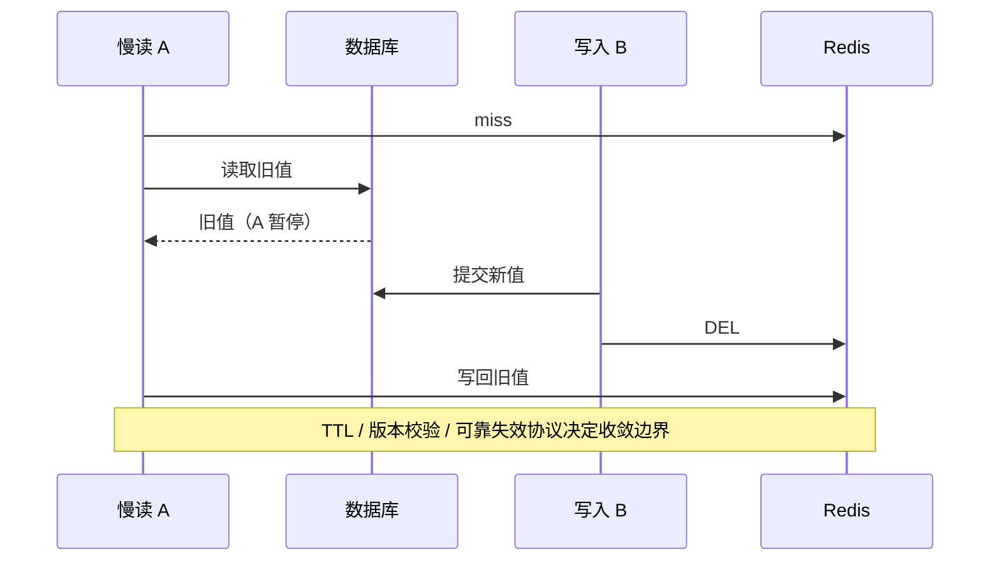

# Redis 与分布式缓存

版本基线：Redis 7.2.4；旧版编码如 ziplist 必须与版本区分。Redisson Watchdog 按公开协议说明，具体 API 和续期细节以部署的 Redisson 版本核对，不伪造一个通用续期时长。

## 核心知识与原理

### 数据结构与网络模型

Redis 对象有 type/encoding：String 可用整数、embstr、raw/SDS；Hash、ZSet、List 等根据大小和配置采用不同内部编码。Redis 7.2 小 Hash 与小 ZSet 典型使用 listpack，大 Hash 使用哈希表，大 ZSet 使用 dict+skiplist；List 使用 quicklist 结合 listpack，Set 小整数集合可用 intset，7.2 还存在 listpack 编码路径，超过条件转哈希表。渐进 rehash 用两张字典表分摊迁移，不能说大 key 的所有操作都天然 O(1)。编码升级、rehash、删除和序列化会有实际成本。

ae 事件循环处理网络就绪和时间事件，命令执行主路径通常由主线程串行进行。Redis 6+ 可配置多线程网络 IO，但不代表所有命令多线程并行；后台持久化子进程和 lazyfree 等也不属于同一主线程。一个 O(N) 大范围命令或 Lua 脚本可以阻塞其他请求，Lua 原子执行不等于没有性能风险。

### 持久化、复制与集群

RDB 保存时间点快照，fork 的 Copy-on-Write 在写多时增加内存与页复制压力；两个快照间更新可能丢失。AOF 记录写命令，appendfsync always/everysec/no 的延迟和持久边界不同，everysec 在异常情况下不是零丢失保证。Redis 7 使用 multipart AOF，重写生成 base/incr 与 manifest，不能拿旧单文件重写流程完全套回。RDB/AOF 是恢复手段，不取代异地备份和恢复演练。

复制是异步，replication backlog 与 PSYNC 支持部分重同步，缺失历史或条件不满足则全量。Sentinel 检测故障并协调提升副本，存在检测和切换窗口；Cluster 用 16384 hash slots 分片并路由/重定向，跨 slot 多 key 操作需要同 hash tag 等约束。WAIT 让客户端等待一定副本确认，可减小风险，但不把 Redis 变成线性一致共识存储，也不保证切换一定选到含该写的副本。

### 缓存故障与一致性

穿透是不存在的 key 不断落库：参数校验、短 TTL 空值和 Bloom Filter 可以减少，但 Bloom 有误判且维护需与数据变化一致。击穿是单热点过期：single-flight、互斥加载、逻辑过期和后台刷新均有时效/可用性权衡。雪崩是大量 key 同时失效或缓存集群故障：TTL 加随机、限流、依赖隔离、降级与预热组合，而不是只有随机 TTL。

Cache Aside 通常先改 DB 再删缓存，读为 miss→读库→写缓存。但慢读 A 得到旧值，写 B 提交并删除，A 随后又写旧值，仍可出现不一致。延迟双删是尽力缩短竞态窗口，延迟值没有覆盖所有 GC、网络和排队时长的可靠上界；第二次删失败也需重试。更严格场景使用版本校验、CDC/Outbox 驱动失效、TTL 收敛或直接读库，并定义最大可接受陈旧时间。

### 分布式锁与 fencing

`SET key token NX PX lease` 原子获取并设租期，token 用随机唯一值；解锁必须 Lua 比较 token 后 DEL，禁止直接删除他人的锁。锁过期后旧 owner 仍可能执行，主从异步复制切换还可能丢锁；Watchdog 自动续期依赖进程、调度和网络存活，STW/隔离可中断续期，不能保证永久排他。

正确性敏感资源需 fencing token：锁/租约服务授予单调递增序号，资源端拒绝旧序号写入。Redis 随机 token 用于所有权，不等于 fencing；独立 INCR 加锁也需要保证授予与状态协议、故障切换的一致性，不能简单拼接成强一致。库存和资金优先由数据库唯一约束/条件更新保护不变量，Redis 锁只减少竞争。

```shell
# 协议示例：真正客户端应处理网络超时和未知获取结果。
SET lock:order:1001 unique-owner-token NX PX 30000
```

```lua
-- 业务示例：仅当前 owner 删除；不能防止过期旧 owner 继续写数据库。
if redis.call('get', KEYS[1]) == ARGV[1] then
    return redis.call('del', KEYS[1])
end
return 0
```

### 热点、大 Key 与容量

热点 key 在单分片集中：本地缓存、请求合并、合理复制读及业务分片可以分担，但副本读有陈旧性。大 key 影响网络、序列化、主线程删除、迁移与复制；用 SCAN/按类型扫描受控排查，避免生产 KEYS 全扫。UNLINK 可异步回收部分内存工作，但不能消除大 key 的其他成本。关注 p99、SLOWLOG、LATENCY、used_memory、RSS、fragmentation、evictions、命中率和副本 lag；SLOWLOG 主要记录命令执行时间，不含客户端网络传输的全部延迟。

### 缓存与锁的正常、异常、恢复路径

正常读命中直接返回，miss 在受控 single-flight 中回源并带 TTL 写入；回源失败不能无限写空值掩盖系统故障，应区别确实不存在与暂时不可用。缓存集群不可用时通过准入限制回源，给非关键功能降级，恢复后分批预热，避免所有实例同时加载同一热点。TTL 的随机化降低同时过期，但对整集群宕机没有保护，故障路径必须独立设计。

正常锁持有者按 token 解锁，异常超时/断网先判断获取结果未知，不能随意执行关键动作；租期过期后旧 owner 必须由资源协议约束。恢复时对账业务结果而不是检查锁 key 是否存在。容量规划至少拆数据集、字典/对象开销、复制 backlog、客户端输出缓冲、持久化 COW 与碎片余量；used_memory 低于 maxmemory 也不保证 RSS 不超容器限额。

## 源码级解析与调用链

`processCommand → call → setCommand → setGenericCommand → setKey` 执行 SET 条件与过期设置；单命令条件在串行执行协议内完成。`dbDelete → dbSyncDelete / dbAsyncDelete` 根据路径释放键；异步删除不等于“指令返回后内存立即下降”。对象编码与命令代价需检查 t_string.c、t_hash.c、t_zset.c、dict.c 和 quicklist.c。

<!-- source:redislock -->
<!-- source:redis -->



## 面试官三层追问

### 1. Redis 是单线程为什么还能快？
<details markdown="1"><summary>展开三层参考答案</summary>

**第一层：**主要数据驻内存、事件驱动减少阻塞切换、常见结构操作成本较低，避免命令执行的锁竞争。

**第二层：**网络 IO 多线程、持久化子进程和异步释放与主线程命令执行分工不同。大集合、脚本、fork 和网络都可能成为瓶颈，不能说单线程使任何操作都快。

**第三层：**以真实命令混合、value 大小和连接数压测，先优化操作成本与热点，再考虑分片。SLOWLOG 与端到端延迟一起看，区分服务器执行和网络排队。
</details>

### 2. 延迟双删能绝对保证一致吗？
<details markdown="1"><summary>展开三层参考答案</summary>

**第一层：**不能，只减少某些读写竞态的时间窗口，可靠性受延迟选择和第二次删除成功影响。

**第二层：**慢读暂停可超过预设 delay，第二次删后仍写旧值；网络失败可能使删除未执行。Cache Aside 本身不是跨 DB/Redis 原子事务。

**第三层：**按业务陈旧预算选 TTL、版本校验和可靠失效事件；核心余额从数据库确认。不能承诺“sleep 500ms 即强一致”，需量化收敛及补偿。
</details>

### 3. Lua 解锁为什么仍不等于强一致锁？
<details markdown="1"><summary>展开三层参考答案</summary>

**第一层：**Lua 防止错删他人的锁，但不能阻止旧 owner 超租期后继续执行业务。

**第二层：**异步复制切换可能丢锁，Watchdog 续期也会被 STW/网络分区影响。随机所有权 token 不具备顺序版本，资源端不知道请求是不是过期 owner。

**第三层：**数据库条件写/唯一约束保障结果，或使用有一致授予协议的 fencing 并让资源端验序。把锁看成减少竞争工具，明确租期与故障窗口。
</details>

### 4. RDB 与 AOF 如何选？
<details markdown="1"><summary>展开三层参考答案</summary>

**第一层：**RDB 适合快照恢复但会丢快照后更新，AOF 用写日志缩短丢失窗口，常组合使用并备份。

**第二层：**fork/COW、fsync、重写和磁盘性能影响延迟；Redis7 multipart AOF 有 base/incr/manifest 协议，不是只有一个旧 AOF 文件。

**第三层：**依据缓存可重建性或主数据 RPO 配置，恢复演练验证文件与版本兼容。缓存持久化不能让数据库/消息可靠性设计消失。
</details>

### 5. Sentinel 切换为什么可能丢数据？
<details markdown="1"><summary>展开三层参考答案</summary>

**第一层：**主副本异步复制，成功写可能尚未到副本，切换后不可见。

**第二层：**检测与提升不能让过去未复制的数据自动出现；WAIT 改善确认覆盖但不是线性一致承诺，旧主隔离期间和恢复期也需处理。

**第三层：**缓存可失效重建，关键账务不能只存 Redis。配置复制约束、合理故障检测并演练 lag/分区，明确丢失容忍和降级策略。
</details>

### 6. 缓存故障为何拖垮数据库？
<details markdown="1"><summary>展开三层参考答案</summary>

**第一层：**原本由缓存承载的请求同时回源，使数据库连接、CPU 和队列超过容量。

**第二层：**超时后立即重试把同一负载放大，多线程等待连接进一步占内存。单热点 single-flight 与全局数据库准入应分层控制。

**第三层：**缓存不可用时限流与分级降级，限制回源并发和重试预算，优先关键请求。容量演练要有全缓存失效场景，不能只测试高命中率。
</details>

## 模拟生产案例：锁超期导致重复扣库存

**故障现象：**使用 SET NX PX 锁却出现两次库存扣减，日志看两请求都“获取成功”。**排查思路：**对齐锁租期、STW、网络延迟与 DB 提交时间，检查解锁 token。**原理分析：**A 获取锁后 STW 超过租期，B 获取新锁并更新，A 恢复继续执行；Lua 解锁仅防错删 B 锁。**根因与验证证据：**模拟暂停 A 40 秒、租期 30 秒可复现，数据库无事件唯一约束且写入不检验状态。**解决方案：**业务唯一事件键和库存条件更新同事务；锁用于减竞争，若采用 fencing 必须资源端拒绝旧 token。**长期预防：**超期 owner 故障注入、幂等和条件更新回归测试、监控续期失败，容量预算考虑 GC/网络停顿。

## 面试回答与核心总结

### 60 秒快速回答

Redis 用内存结构和事件循环执行命令，IO 多线程不等于命令全面并行。复制异步，RDB/AOF 与 Sentinel/Cluster 各有持久和切换窗口。Cache Aside 先 DB 后删仍有慢读写回竞态，双删只是尽力收敛。SET NX PX 加唯一 token 和 Lua 解锁防误删，但租期/切换会破坏互斥，关键写要靠数据库约束或 fencing。回源限流与热点治理比单独增加缓存容量更重要。

### 2～3 分钟深入回答

从对象 type/encoding 与命令复杂度解释事件循环的性能边界，再讲持久化的 fork/COW、fsync 和异步复制窗口。画慢读/写库/删缓存/旧值写回时序，给出 TTL、版本和可靠失效方案。用超租期旧 owner 继续写解释 Lua 和 Watchdog 的边界，最后把缓存故障连接到数据库准入、重试预算和全失效压测。

如果要求严格互斥，我会用 A 超租期暂停、B 获取新锁、A 恢复继续写的时序说明 Watchdog/Lua 的能力边界。fencing 必须有单调授予协议并由资源端拒绝旧序号，随机 token 只表达所有权。缓存一致性按允许陈旧时间决定 TTL、可靠失效事件或版本校验；金融结果由数据库约束保护。最后补充全缓存故障时要保护数据库回源，持久化与复制都留有窗口，大 key、COW 和客户端缓冲也要放入进程容量预算。

### 高频追问、常见错误与速记

高频追问：WAIT 为什么不是共识？UNLINK 后 RSS 为何不立刻降？Cluster 多 key 事务怎么约束 slot？常见错误：Redis7 小 Hash 仍一律 ziplist；Lua 解锁=业务互斥永远成立；双删强一致；SLOWLOG 包含全部网络延迟。源码：setGenericCommand，dbDelete/dbAsyncDelete，dictRehash，aeMain，replication.c。核心知识：**结构成本→持久窗口→缓存收敛→租约边界→依赖保护**。
