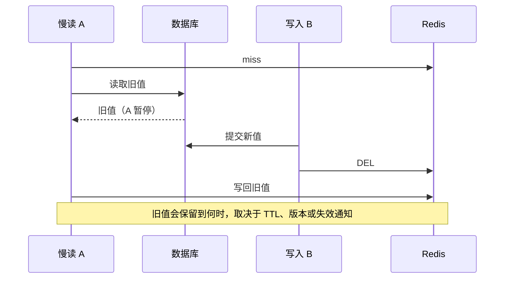

# Redis 与分布式缓存

本章主要看 Redis 7.2.4。缓存让大多数请求不用访问数据库，但也带来两个新问题：缓存里的值什么时候会过时，缓存失效后数据库能否承受请求。

## 核心知识与原理

### 数据结构与网络模型

Redis 的 String、Hash、List 是对外的数据类型，内部还会根据内容和大小选择不同编码。例如 String 可以直接存整数，也可以用 embstr 或 raw/SDS；小 Hash 常用 listpack，大 Hash 用哈希表；大 ZSet 结合 dict 和 skiplist，List 使用 quicklist 和 listpack。Set 的整数、小集合和较大集合也有不同路径，7.2 已有 listpack，不能总拿旧 ziplist 图解释。

换编码可以节省内存，却也会产生转换成本。字典扩容用渐进 rehash，把工作分到后续操作中完成；但这不表示每个命令都只做固定少量工作。一个包含几十万元素的集合，遍历、序列化、删除和迁移都可能很重。

网络通过 ae 事件循环处理就绪事件，命令执行的主要路径仍由主线程串行运行。Redis 6+ 可配置网络 IO 多线程，持久化和 lazyfree 也有后台工作，但不能据此说所有命令会并行执行。一个很慢的 Lua 脚本占着执行线程，其他请求就得等。

### 持久化、复制与集群

RDB 保存某一时点的快照，恢复后可能没有快照之后的写入。fork 后应用继续修改页面，会产生 Copy-on-Write，因此高写入时要额外留内存。AOF 记录写操作，fsync 策略决定写入延迟与可能丢失的范围。everysec 不等于任何故障下都零丢失；Redis 7 的 multipart AOF 由 base、incr 和 manifest 配合，不是旧版单文件结构。

主从复制通常是异步的。主机回复成功时，副本可能还没有收到写入。PSYNC 能在历史仍保留时做部分重同步，否则要全量同步。Sentinel 负责检测故障和协调提升副本，但无法把尚未复制的数据凭空补回来。

Cluster 把数据分到 16384 个 hash slot，并通过 MOVED 等机制引导客户端找正确节点。跨 slot 的多 key 操作要满足具体约束，同 hash tag 可以让相关 key 落在同一 slot。WAIT 可以等待副本确认、降低风险，却不能承诺故障切换一定选到包含全部确认写入的副本，也不是强一致存储的替代品。

### 缓存故障与一致性

穿透指请求的 key 不存在，却不断查数据库。可以校验非法请求、短期缓存“确实不存在”的结果，或使用 Bloom Filter；暂时查库失败不能当成不存在长期缓存。击穿指一个热点 key 过期，大量线程一起查库，常用同 key 请求合并或受控加载。雪崩则是大量 key 同时过期或整个缓存故障，需要限流、隔离与降级，随机 TTL 只能解决其中一部分。

Cache Aside 通常是写数据库后删缓存，读 miss 时查数据库再回填。顺序已经合理，仍有一个竞态：A 先读到旧数据但回填很慢；B 提交新数据并删缓存；A 最后把旧数据写回去。此时缓存又旧了。

延迟双删希望第二次删除覆盖这段时间，但 A 可能因 GC、网络或排队暂停得更久，第二次删除也可能失败。它能降低某些问题的概率，无法拿固定 sleep 保证所有读都正确。应根据允许陈旧多久，选择 TTL、版本检查、CDC/Outbox 的可靠失效通知；必须准确的结果直接确认数据库。

### 分布式锁与 fencing

`SET key token NX PX lease` 把“没有才创建”和“设置租期”放在一次命令中。token 表示谁持有锁，解锁时用 Lua 先比较 token 再删，避免删掉后来别人的锁。

```shell
# 获取锁示例：响应超时不能直接判断是否取得锁。
SET lock:order:1001 unique-owner-token NX PX 30000
```

```lua
-- 只有 token 相同才解锁；过期线程能否写数据库需另加保护。
if redis.call('get', KEYS[1]) == ARGV[1] then
    return redis.call('del', KEYS[1])
end
return 0
```

即使这样，A 持锁后暂停超过租期，B 仍能获得新锁；A 恢复后也可能继续修改数据库。Lua 只能防错删，不能阻止这个旧持有者写数据。Redisson Watchdog 会尝试续期，但进程暂停、网络隔离或调度延迟仍可能让续期失败。

若必须拒绝旧持有者，需要资源端也参与判断。例如每次获取租约拿到单调递增的 fencing token，数据库或目标资源拒绝比已接受编号更小的请求。随机 token 没有这种顺序含义，普通 INCR 再加锁也不能自动解决故障切换的一致性。库存和资金更常见的保护是数据库条件更新和唯一约束，锁帮助减少竞争。

### 热点、大 Key 与容量

单个热点 key 再热，也主要由一个分片承载。可用短期本地缓存、同 key 合并或业务拆分减压，但副本读取和本地缓存又有陈旧问题。大 key 还会占网络、影响主线程操作与复制。生产排查尽量用受控 SCAN，避免一次 KEYS 全扫；UNLINK 可把一部分释放工作放后台，却不能消除读取和迁移的成本。

SLOWLOG 主要反映命令执行时间，不包含完整网络往返。服务端看不到慢命令而客户端很慢时，还要检查连接、网络和排队。容量除了数据本身，也要算对象/字典开销、复制 backlog、客户端缓冲、COW 和碎片；used_memory 没到 maxmemory，不代表容器内存安全。

### 缓存与锁的正常、异常、恢复路径

缓存不可用时，如果把全部流量放到数据库，数据库可能随即成为第二个故障点。恢复前限制同时查库的请求，给非关键功能明确降级；缓存恢复后分批预热，避免所有实例同时加载同一热点。

锁请求超时也要区分“没拿到”和“结果没收到”。关键操作仍靠自己的业务条件判断。事后检查锁 key 存不存在，不能证明库存有没有重复扣；需要按事件 ID 和数据库结果对账。


## 源码级解析与调用链

命令从 processCommand 进入 call，SET 最后由 `setGenericCommand` 检查 NX/XX、写 key 和过期。先读这段就能确认“检查没有”和“写入”是在一次命令中完成的。

删除由 dbDelete 选择同步或异步释放路径。对象编码还需继续看 t_hash.c、t_zset.c、dict.c、quicklist.c，不能只根据对外类型名估计所有操作的成本。

<!-- source:redislock -->

<!-- source:redis -->



## 面试官三层追问

### 1. Redis 是单线程为什么还能快？

<details markdown="1"><summary>查看回答与追问</summary>

常见操作在内存里完成，结构选择合理，事件驱动减少阻塞切换，主命令线程也避免了一些锁竞争。但速度来自这些具体条件，不是“单线程”三个字。

**多线程到底在哪？** 网络 IO 可以多线程，持久化、lazyfree 也有别的进程或线程。大范围命令和慢脚本仍可能挡住命令执行，所以其他请求会跟着慢。

**性能怎么测？** 使用真实命令比例、value 大小和连接数，看热点及 p99。SLOWLOG 没慢命令时也查网络和排队，再决定优化命令、合并请求还是分片。
</details>

### 2. 延迟双删能绝对保证一致吗？

<details markdown="1"><summary>查看回答与追问</summary>

不能。它试图再删一次，覆盖读请求晚回填的情况，但延迟没有可靠覆盖所有暂停，第二次删除也可能失败。

**500ms 为什么不可靠？** 慢读可能暂停 2 秒，等第二次删除已经完成才回填旧值。GC、网络和队列都能延长这段时间，DB 和 Redis 并没有共同事务。

**需要更准确怎么办？** 先定义能接受旧值多久，再选 TTL、版本校验或可靠失效事件。核心余额从数据库确认。删除失败有重试，不把固定 sleep 当强一致证明。
</details>

### 3. Lua 解锁为什么仍不等于强一致锁？

<details markdown="1"><summary>查看回答与追问</summary>

Lua 比较 token 后删除，能防止 A 删掉 B 的锁；但 A 的租期过了以后继续写数据库，Lua 无法拦住它。

**Watchdog 能解决吗？** 它会续期，但 STW、网络或调度异常仍能让续期失败。异步复制切换还可能丢锁。随机所有权 token 也没有可供数据库比较的新旧顺序。

**关键写用什么保护？** 用数据库条件写和唯一约束，或有可靠授予方式的 fencing，并由资源端拒绝旧编号。Redis 锁可以降低竞争，但最终数据判断不能只看有没有锁。
</details>

### 4. RDB 与 AOF 如何选？

<details markdown="1"><summary>查看回答与追问</summary>

RDB 保存快照，恢复较直接但会丢快照之后的写入；AOF 记录写操作，可按 fsync 策略缩短丢失窗口。常组合使用，并安排备份。

**性能代价在哪？** fork 后写多会增加 COW 内存，fsync 和重写依赖磁盘性能。Redis 7 的 multipart AOF 有 base、incr、manifest，不是一个旧单文件的全部流程。

**怎样选择？** 若只是可重建缓存，接受窗口可能不同；若当主数据使用，先定义 RPO 并做恢复演练。开启持久化不能替代数据库和消息链的可靠设计。
</details>

### 5. Sentinel 切换为什么可能丢数据？

<details markdown="1"><summary>查看回答与追问</summary>

副本可能尚未收到主机已应答的写入。Sentinel 能协调提升，但无法恢复从未到达新主的数据。

**WAIT 是否就够了？** WAIT 能等待副本确认、降低风险，却不是线性一致承诺，也不保证每种故障切换都选到包含该写的副本。隔离和旧主恢复也需要考虑。

**业务怎么承受？** 缓存数据可失效重建，关键账务保留在数据库。测试复制 lag、断网和切换，明确什么时候降级，不把主从当零丢失承诺。
</details>

### 6. 缓存故障为何拖垮数据库？

<details markdown="1"><summary>查看回答与追问</summary>

大量原先命中的请求同时回源，数据库的连接、CPU 和等待队列会很快超过能力。超时重试又会增加请求。

**同 key 合并够吗？** 它能减少一个热点的重复加载，但整缓存故障会有很多不同 key。还需要限制总回源并发，并把慢依赖和其他功能隔离。

**恢复怎么做？** 非关键业务降级，关键请求在限额内查库，恢复后分批预热。容量测试包含全缓存失效，而不是只测正常的高命中率。
</details>

## 模拟生产案例：锁超期导致重复扣库存

库存已经使用 SET NX PX 锁，仍被重复扣减。A 持锁后暂停 40 秒，锁租期只有 30 秒，B 拿到新锁完成更新，A 恢复又继续。这是一个明确的模拟时间线。

对齐租期、GC/暂停、获得锁和 DB 写入时间，核对 token 解锁。即使 Lua 解锁正确，A 的数据库操作也没有因此被阻止。只看两条“加锁成功”日志不会发现原因。

库存修改加条件与事件唯一约束，确认重复请求只能产生一次效果。Redis 锁用来降低竞争。若采用 fencing，还需资源端拒绝旧编号，以及可靠的编号授予方式。

测试主动暂停旧持有者、触发续期失败和副本切换，观察业务结果。长期监控锁失败与业务重复，不把 Watchdog 当作永不失效的互斥保证。

## 面试回答与核心总结

### 60 秒快速回答

Redis 常见操作靠内存结构和事件循环，网络 IO 多线程不代表命令全部并行。缓存写库后删仍可能被慢读回填旧值，双删只是减少问题，不能承诺强一致。SET NX PX 加 token 和 Lua 防误删，但锁过期或切换后旧线程仍能写，关键数据用数据库条件或 fencing 保护。缓存故障还要限制回源，RDB、AOF 和异步复制都有各自恢复窗口。

### 2～3 分钟深入回答

我从 Cache Aside 的正常读写开始：读 miss 就查库并填缓存，写提交 DB 后删缓存。这个顺序常用，却仍有慢读先拿旧值、等新写完成并删后才回填的情况。TTL、版本和可靠失效事件可以按业务接受的陈旧时间选择，固定双删延迟无法覆盖所有暂停。

热点失效要合并同 key 加载，但整缓存宕机还需要全局回源限额和降级，否则数据库也会倒。恢复分批预热。大 key 的扫描、序列化、复制和删除成本要单独处理，UNLINK 只把一部分回收放后台。

锁方面 SET NX PX 原子创建并带租期，随机 token 表示 owner，Lua 比较后删防止错删。A 暂停过租期后，B 可以拿新锁，A 恢复仍可能写数据库。Watchdog 续期也可能失败，所以资源需要自己的条件约束，或验可靠的递增 fencing 编号。

持久化方面，RDB 是快照，fork 写多会有 COW；AOF fsync 决定窗口，Redis 7 是 multipart 文件组织。复制异步，Sentinel 提升不能补回未复制写入，WAIT 也不是完整强一致承诺。

最后按真实命令、value 大小和连接数测 p99，SLOWLOG 与网络排队分开看。容量不只算 used_memory，还包括复制、客户端缓冲、COW 和碎片。关键金额从数据库确认，不依赖缓存或租约独自保证。

### 高频追问、常见错误与速记

- 高频追问：WAIT 为什么不够？UNLINK 后 RSS 为何仍高？Lua 解锁能否阻止旧 owner？整缓存故障怎样保护 DB？
- 容易答错：Redis 7 小结构统一 ziplist；延迟双删必然一致；Watchdog 保证永不失锁；SLOWLOG 包含所有网络延迟。
- 常看的源码：`setGenericCommand`、`dbDelete/dbAsyncDelete`、`dictRehash`、`aeMain` 与 `replication.c`。
- 想清楚：允许缓存旧多久，失效时最多查多少库，以及租期过后谁拦住旧写。
