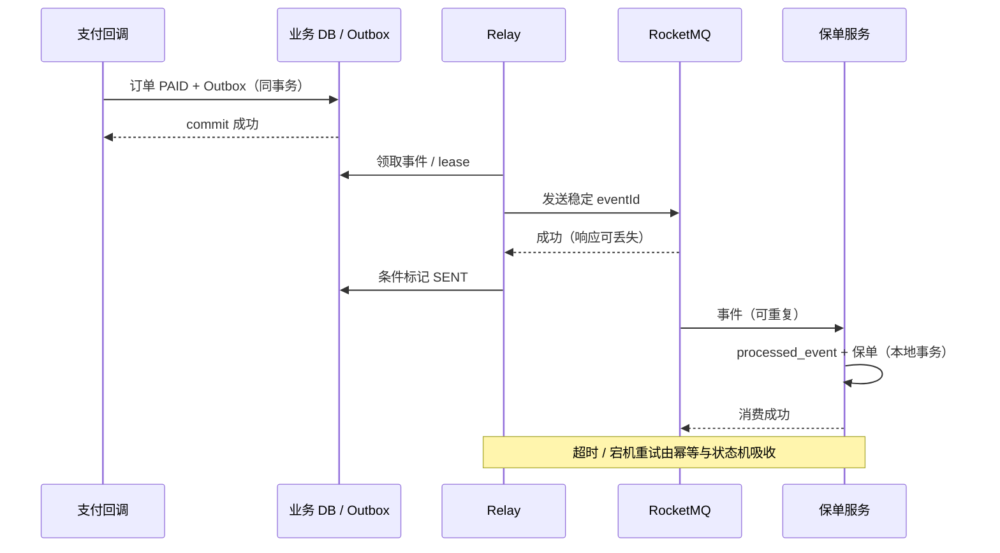
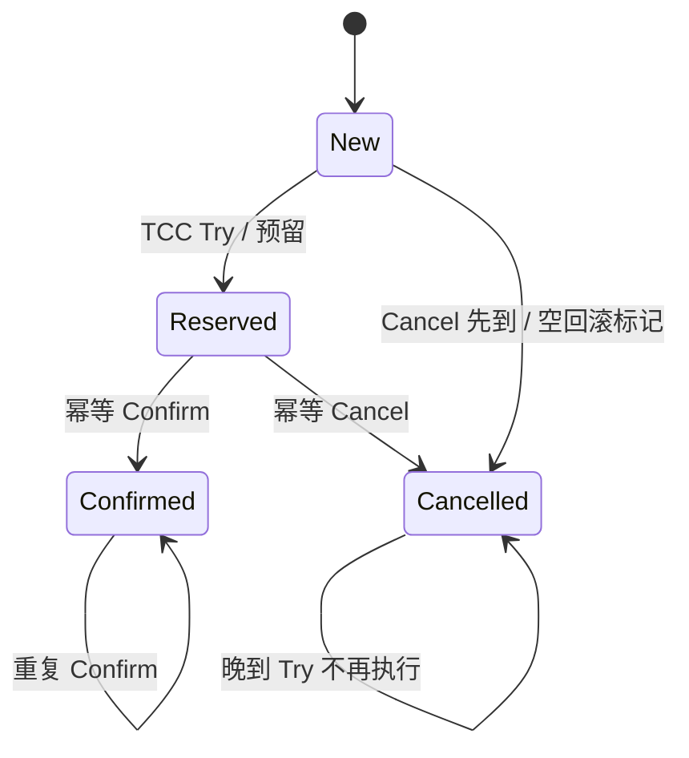

# 分布式事务与数据一致性

实现基线：Spring 5.3.31 本地事务、RocketMQ 4.9.8 事务消息、MySQL 8.0.36 业务约束。CAP 是特定模型中的理论约束，不是任意产品“任选两个特性”的采购表。

## 核心知识与原理

### CAP、BASE 与业务不变量

CAP 的 C 指原子/线性一致读写等强一致模型，A 要求未失败节点收到的操作最终完成，P 指网络分区环境。分区期间不能同时承诺此模型下的 C 与 A；正常网络并非必须主动放弃一种。工程中有延迟、部分失败和数据新鲜度等更多权衡，BASE 是面向可用与最终收敛的设计思路，不是证明任何系统迟早一致的定理。

最终一致必须有具体恢复机制：持久任务、重试、幂等、顺序约束、补偿和对账；若失败事件永久丢失、毒消息无人处理或幂等记录过早删除，系统不会自动收敛。先定义不变量，如“支付事件只能记账一次”“保单仅在支付已确认后生成”“退款不能超过实收”，再选择事务边界和恢复方案。

### 2PC、TCC、Saga 的代价与故障边界

|方案|适用条件|正常流程|异常与恢复|主要代价|
|---|---|---|---|---|
|2PC|参与者支持准备/提交协议，需原子提交|prepare 后统一 commit|协调者/参与者保留日志；prepared 状态可能阻塞，恢复需查询决定|锁/资源持有、协调可用性与性能成本|
|TCC|业务可显式预留资源且能撤销|Try 预留，Confirm 确认|Cancel 撤销；处理空回滚、悬挂、重复确认/撤销|侵入业务、资源预留、幂等状态机|
|Saga|长流程可拆本地事务，允许补偿|按步骤提交本地事务|失败按语义补偿，补偿也可失败，需要重试/人工恢复|中间态可见、补偿非物理回滚、隔离弱|
|事务消息|本地 DB + RocketMQ 可恢复回查|Half→本地事务→确认|未知回查，超限需对账|回查记录、消费幂等与异步延迟|
|Outbox|同 DB 可存业务与事件，有 relay/CDC|业务+事件同事务，异步发送|发送/标记裂缝造成重复，消费者幂等|积压管理、清理、重复与顺序治理|

2PC 不提供无代价高可用，不能因参与者全有数据库就直接宣称全链路支持 XA。TCC Try 和 Cancel 必须以事务状态协调：Cancel 先到要落下撤销标记，后到 Try 不可再预留；否则空回滚之后的悬挂会永久占资源。Saga 补偿是新业务动作，如退款不是把过去扣款“从历史删除”；邮件/短信等不可逆步骤必须提前考虑。

### Transactional Outbox 源码与业务协议

Outbox 没有一个所有框架统一的 JDK 类，它是应用数据库协议。Spring TransactionTemplate/事务代理建立本地边界，业务行和 event 行一次提交。relay 领取待发送事件，发布 MQ，再标记 SENT。发送成功但 mark SENT 前崩溃必然可能重发；不能通过先标记后发送来“去重”，那会在标记后宕机时永久丢消息。

```sql
-- 业务示例：Outbox 与订单写入同一数据库本地事务。
CREATE TABLE outbox_event (
  event_id VARCHAR(64) PRIMARY KEY,
  aggregate_id BIGINT NOT NULL,
  aggregate_version BIGINT NOT NULL,
  payload TEXT NOT NULL,
  status VARCHAR(16) NOT NULL,
  next_attempt_at TIMESTAMP NOT NULL,
  UNIQUE KEY uk_aggregate_version(aggregate_id, aggregate_version)
);
START TRANSACTION;
UPDATE orders SET status='PAID', version=version+1
 WHERE id=1001 AND status='PENDING';
-- 应用核对影响行数，并以稳定 event_id 和对应版本写入事件。
INSERT INTO outbox_event VALUES
 ('payment-confirmed-1001',1001,2,'{"orderId":1001}',
  'NEW',CURRENT_TIMESTAMP);
COMMIT;
```

relay 不能长期持有数据库锁做无限网络发送：可使用短事务领取并记录 lease/owner，提交后发消息，再按 owner 条件完成；过期 lease 重新领取会重复，但不应丢失。若使用 `FOR UPDATE SKIP LOCKED`，明确 MySQL 8 或对应数据库支持情况，并注意跳过记录可能改变顺序。每个 aggregate 的版本序列需要单独有序推进，CDC 也不能无条件跨分区承诺全局顺序。

消费者在同一数据库事务中 INSERT processed_event 与业务条件更新，unique 冲突后查询已完成状态，只有确认过去事务成功才返回幂等成功。不要将 Redis 去重写成功后再独立写 DB；DB 失败会造成事件被误认为已处理。外部副作用无法纳入同一 DB 事务时，使用稳定供应商幂等键、状态 PENDING/UNKNOWN/SUCCEEDED 和结果查询。

### 失败矩阵：恢复责任必须落到组件

业务本地事务未提交就宕机，订单与 Outbox 一起回滚；本地已提交但 relay 未发送，待发记录驱动恢复；MQ 已收但应答丢失或 SENT 未提交，重复投递由消费幂等吸收；消费业务提交但确认丢失，再次投递查询同一事件结果；外部服务结果未知，依靠稳定幂等键和查询。任何一格若只写“重试即可”，都还缺次数、超时、恢复 owner、持久状态和人工处理条件。

TCC 的状态应限定 New→Reserved→Confirmed 或 Cancelled，Cancelled 后迟到 Try 不可预留。Saga 的补偿状态要单独记录 RETRYING/FAILED，而不能把回调执行过当完成。对账从不变量出发，比如支付账与保单账按 paymentEventId 关联，“有支付无保单”“无支付有保单”“重复保单”分别修复；没有统一 eventId 的粗粒度订单号会把合法后续事件误判重复。

## 源码级解析与调用链

`TransactionAspectSupport.invokeWithinTransaction` 保证本地资源边界，不能自动纳入 MQ 网络调用。RocketMQ 的 `sendMessageInTransaction → executeLocalTransaction → endTransaction` 与 `TransactionalMessageServiceImpl.check → checkLocalTransaction` 建立提交/回查链。真正业务可靠性由“本地状态可恢复、消息重复可接受、非法状态转换被拒绝”三个不变量提供，而非单个注解。

<!-- source:mqtx -->





### 订单、支付与保单的状态机

订单创建可同步完成本地事务；支付请求使用稳定业务 requestId，超时进入 UNKNOWN 查询渠道结果，避免换 ID 重试造成重复扣款。支付确认在本地一次记账并发可靠事件；保单生成以 paymentEventId/业务唯一键幂等。业务补偿可能是退款、撤单或人工审核，已经生效保单不能简单删除行，必须遵守业务撤销流程。重试最大时长、人工处理 SLA 和对账范围属于架构设计的一部分。

## 面试官三层追问

### 1. 最终一致是否意味着可以不设计失败路径？
<details markdown="1"><summary>展开三层参考答案</summary>

**第一层：**不是，最终一致依赖失败操作被保存并最终成功或被业务补偿，不能凭时间流逝恢复。

**第二层：**Outbox/事务消息保证待完成意图可恢复，幂等状态机吸收重复，重试和对账处理未收敛记录；丢失意图或永久毒消息会破坏前提。

**第三层：**定义收敛 SLA、积压上限、告警和人工兜底；用户界面暴露处理中/失败状态，避免同步成功提示掩盖下游永久失败。
</details>

### 2. Outbox 是否无重复？
<details markdown="1"><summary>展开三层参考答案</summary>

**第一层：**不是。它消除业务提交成功却没有持久待发记录的窗口，但发送成功与标记之间仍可能重复。

**第二层：**先发后标记可重发，先标记后发会丢失，因此选择可恢复重复；消费者去重与业务同事务保证效果一次。relay lease 过期也可能重领。

**第三层：**稳定 eventId、消费者约束、顺序版本和记录保留窗口共同设计，监控 oldest unsent age 而不只队列数。清理只删除已完成且超过恢复窗口的记录。
</details>

### 3. TCC 如何处理空回滚和悬挂？
<details markdown="1"><summary>展开三层参考答案</summary>

**第一层：**Cancel 先到时即使资源尚未预留，也要记录撤销状态；后到 Try 见到撤销不能执行。

**第二层：**状态转换通过唯一 transactionId 和条件更新协调，Try/Confirm/Cancel 都幂等；并发 Cancel 与 Try 需在同一原子状态协议中决定胜者。

**第三层：**预留有过期/扫描恢复，但过期不能擅自推翻已确认业务；协调者恢复和资源服务对账都要有依据。测试乱序、重复、宕机和部分参与者不可用。
</details>

### 4. Saga 补偿为什么不是数据库回滚？
<details markdown="1"><summary>展开三层参考答案</summary>

**第一层：**每步本地事务已经提交，对其他系统可见，补偿只能执行新的逆向业务动作。

**第二层：**逆动作也可能失败，且不一定精确可逆；库存释放、退款和撤保单要按当前状态检查，避免补偿覆盖后续合法变更。

**第三层：**设计 forward/compensate 的幂等键、执行日志和人工恢复；不可逆步骤放在合适位置或预确认之后，不能承诺全链路瞬间原子。
</details>

### 5. 超时后为何不能直接认定失败？
<details markdown="1"><summary>展开三层参考答案</summary>

**第一层：**超时只说明调用方没收到结果，对端可能已经提交，这是未知状态。

**第二层：**使用稳定 requestId 重试或查询结果，对端唯一约束/幂等响应识别过去成功；每次生成新 ID 会变成新的业务请求。

**第三层：**支付 UNKNOWN 设置查询、退避、截止和人工对账，不能立即退款同时重付。取消也要与原执行竞争协调，避免双向动作都成功。
</details>

### 6. MQ 顺序如何和状态机结合？
<details markdown="1"><summary>展开三层参考答案</summary>

**第一层：**传输局部顺序降低乱序，状态机仍验证事件版本和合法转换，拒绝重复或过时变更。

**第二层：**unique(aggregate_id, version) 约束事件版本，消费者 lastVersion 条件更新；缺少版本可暂存或查询来源补齐，不能简单丢弃未来事件。

**第三层：**定义缺序列超时与暂存上限，恢复历史事件时限制速度；跨业务不可逆动作按事件语义设计，而非所有事件一律“只保留最新”。
</details>

## 模拟生产案例：Outbox 已发未标记

**故障现象：**relay 重启后同一支付事件投递两次，保单服务有重复请求。**排查思路：**关联稳定 eventId、relay lease 与 MQ 发送结果，检查本地 SENT 提交。**原理分析：**发送完成后进程宕机，NEW/CLAIMED 记录过期被重新领取，这属于预期恢复窗口。**根因和验证证据：**模拟在 send 成功后 kill，事件重新出现；消费者 unique eventId 同事务后只产生一个保单，重复返回成功。**解决方案：**保留重复投递能力并实现正确幂等，不将 mark SENT 提前；外部发单 API 使用同一幂等键。**长期预防：**逐宕机点注入、lease 到期与回收测试、积压年龄与 DLQ 告警，对账检查“已付无保单”和重复保单。

## 面试回答与核心总结

### 60 秒快速回答

先定义业务不变量和失败边界，再选事务方案。2PC 原子但有资源持有和恢复阻塞；TCC 需预留与幂等状态处理空回滚/悬挂；Saga 是新业务补偿而非物理回滚。DB 与 MQ 用同事务 Outbox 或 Half/回查，消息仍可能重复，消费去重与业务同事务。超时属于未知，用稳定 requestId 查询恢复，最终一致必须有重试、对账和人工处理 SLA。

### 2～3 分钟深入回答

以支付已提交而消息发送失败建立问题，比较 Outbox 与事务消息的意图持久化方式。画 relay 发送成功未标记的重复窗口，解释为什么必须先发后标记并在消费端吸收重复。再用订单/支付/保单状态机讲 UNKNOWN、版本、唯一约束和补偿；根据是否能预留、是否可逆、是否支持协调协议决定 TCC/Saga/2PC，而非所有跨服务都套分布式事务。

我会再列失败矩阵，说明本地未提交、已提交未投递、已发送未标记、消费已提交未确认分别由哪个持久组件恢复。对外支付超时保留 UNKNOWN，重复调用使用同 requestId，不更换 ID 重新扣费。补偿是新业务动作，已生效保单不能简单删数据库行，必须遵守撤销/退款流程。恢复有最大重试窗口、对账周期和人工兜底，衡量最老未处理事件年龄而非只看数量。这样才能说明最终一致是可验证协议，不是随时间自然发生。

### 高频追问、常见错误与速记

高频追问：回查记录保留多久？补偿失败谁接管？CDC 是否全局顺序？常见错误：CAP 随意选两个；Outbox 无重复；Redis 去重后 DB 失败也算处理成功；支付超时必定失败；Saga 没有中间状态。源码/协议入口：invokeWithinTransaction，sendMessageInTransaction，TransactionalMessageServiceImpl.check；业务 SQL 的唯一约束、条件 UPDATE 和 lease。核心知识：**意图持久化→重复吸收→状态约束→失败恢复→对账**。
