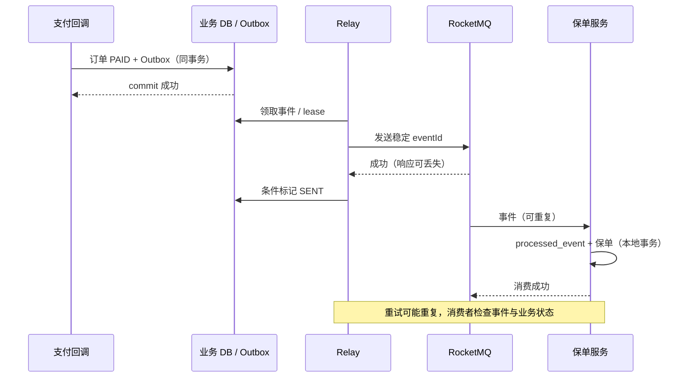
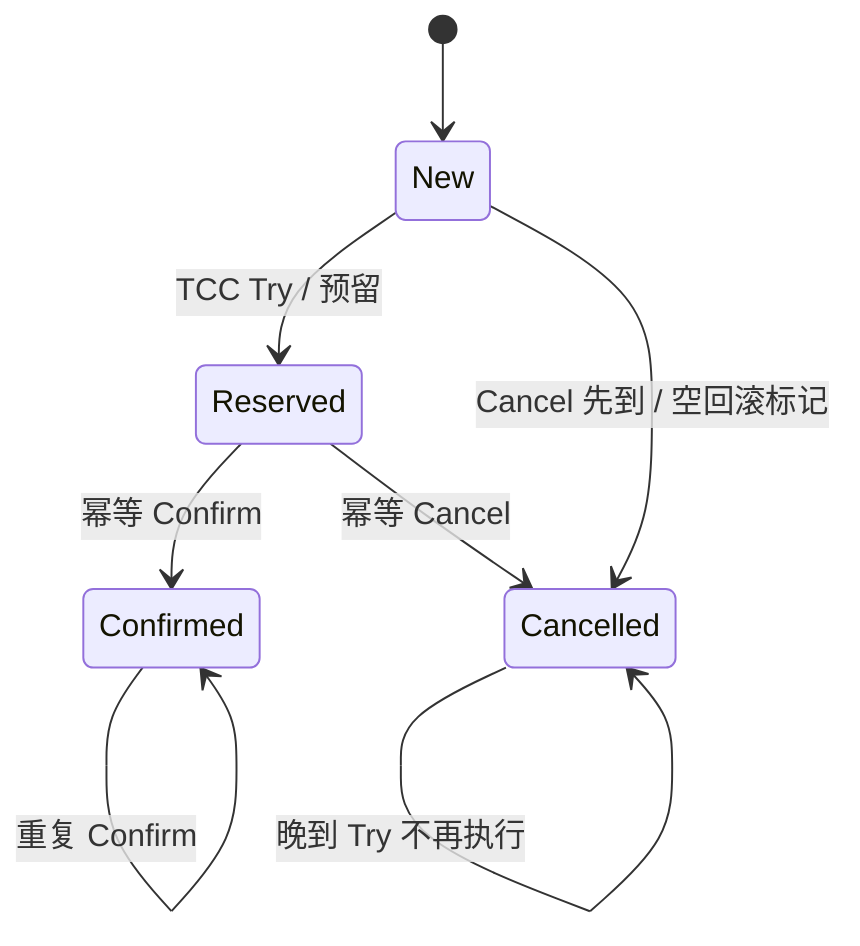

# 分布式事务与数据一致性

以订单、支付和保单为例，结合 Spring 5.3、本地 MySQL 事务与 RocketMQ 4.9.8。这里最重要的不是选一个缩写，而是把每个宕机点留下的数据，以及谁负责继续处理，说清楚。

## 核心知识与原理

### CAP、BASE：先说明业务必须满足什么

订单服务通知支付服务时超时了，支付到底成功没有？单个数据库事务不能回答另一个系统的执行结果。这种不确定性是分布式设计的日常问题，不只发生在真正断网时。

CAP 描述网络分区下的一项限制：若节点之间不能通信，就无法同时保证模型中的线性一致性和所有未失败节点都能完成请求。它不是任何时候随意“选两个”。BASE 是偏向可用和异步完成的设计思路，也不意味着数据放一会儿就自己正确了。

先写业务必须保持的条件，会更容易选方案。例如同一支付事件不能记账两次；只有已确认支付才能生成保单；退款不能超过实收。之后再讨论哪些操作必须一个事务完成，哪些可以稍后完成，失败多久要报警，最终由谁对账。

### 2PC、TCC、Saga 的代价与故障边界

2PC 先让参与者准备，再统一决定提交或回滚。它要求参与者和协调者支持相应协议，并留下恢复日志。准备好后协调者失联，参与者可能继续持有资源、等待决定，因此并非免费获得原子性和高可用。数据库都支持事务，也不代表所有接口和外部支付都能加入 XA。

TCC 把动作拆成预留、确认和取消。例如 Try 冻结库存，Confirm 真正扣减，Cancel 解除冻结。它需要业务代码提供这三个动作，还要处理重复和乱序：Cancel 先到时记录已撤销，晚来的 Try 不能再冻结资源，这解决空回滚之后的悬挂问题。

Saga 让多个本地事务逐步提交，后面失败时执行补偿。例如订单失败后退款、释放库存。补偿也是一次新的业务操作，可能失败，需要重试或人工处理；它不是数据库回滚，无法让已经发出的短信变成从未发出。

|方案|什么时候考虑？|最需要承担的工作|
|---|---|---|
|2PC|参与者支持协议，确实需要协调原子提交|资源持有、协调者故障和 prepared 恢复|
|TCC|资源能提前预留，业务能确认或撤销|实现三个动作，处理幂等、空回滚、悬挂|
|Saga|流程较长，允许中间状态，动作可补偿|记录每步结果，处理补偿失败和不可逆动作|
|事务消息|要协调本地提交与 MQ 可见性|持久回查状态、消费幂等、超限对账|
|Outbox|业务和事件能写在同一数据库|后台发送、重复投递、积压与顺序处理|

### Transactional Outbox 源码与业务协议

支付数据库提交成功，发 MQ 前进程死了，下游就永远收不到通知。Outbox 的改法是：在同一个数据库事务里，既更新订单，也写一条“还有这个事件要发送”的记录。提交失败时两者一起撤销，提交成功后发送任务即使重启也能继续。

```sql
-- 业务示例：Outbox 与订单写入同一数据库本地事务。
CREATE TABLE outbox_event (
  event_id VARCHAR(64) PRIMARY KEY,
  aggregate_id BIGINT NOT NULL,
  aggregate_version BIGINT NOT NULL,
  payload TEXT NOT NULL,
  status VARCHAR(16) NOT NULL,
  next_attempt_at TIMESTAMP NOT NULL,
  UNIQUE KEY uk_aggregate_version(aggregate_id, aggregate_version)
);
START TRANSACTION;
UPDATE orders SET status='PAID', version=version+1
 WHERE id=1001 AND status='PENDING';
-- 应用核对影响行数，并以稳定 event_id 和对应版本写入事件。
INSERT INTO outbox_event VALUES
 ('payment-confirmed-1001',1001,2,'{"orderId":1001}',
  'NEW',CURRENT_TIMESTAMP);
COMMIT;
```

后台 relay 读取待发记录，发送 MQ，成功后标记 SENT。它在发送成功后、标记前宕机，恢复后仍可能再发。这是有意选择的结果：允许重复，消费端可以识别；若先标 SENT 再发，标记后宕机就可能永久丢通知。

发送不宜长时间持有数据库行锁。可以用短事务领取任务并记录租期，提交后发送，完成时校验领取者。租期过后重新领取仍可能重复，所以消费幂等不可省略。SKIP LOCKED 等领取方式还受数据库版本影响，跳过前面的行也可能改变同一订单的事件顺序。

消费端把 processed_event 的唯一事件 ID 和业务更新放在同一事务。事务失败，处理记录也回滚，下次还能重试；重复键时核实之前确实已成功，再返回已处理。先在 Redis 写“处理过”，再写数据库，数据库失败却留下去重标记，会把正常重试挡住。

### 每个宕机点留下什么，谁接着处理

沿着同一支付事件看五个位置：本地提交前宕机，两张表一起回滚；提交后未发送，Outbox 继续发送；发出后未标 SENT，消费端识别重复；消费提交后未确认，再次投递仍得到同一结果；外部渠道结果未知，用原 requestId 查询或幂等重试。

每一步还要规定等待多久、重试多少、记录保存多久、由哪个任务扫描，以及什么时候交给人工。只写“最终一致”没有提供这些动作，就还没有一个可恢复的实现。

### 订单、支付与保单的状态机

调用支付接口超时，先把结果记为 UNKNOWN。继续使用同一个业务 requestId 查询渠道，不要马上换 ID 再扣一次。确认成功后才本地记账并产生可靠事件，保单服务以 paymentEventId 等稳定身份识别重复。

若保单已生效，补偿通常要走撤保或退款流程，不是删除一行就完成。对账可以明确查三类记录：有支付无保单、无支付有保单、同一支付重复保单。事件 ID 选择和保留期决定历史重放时还能不能识别重复。


## 源码级解析与调用链

Outbox 是业务表和后台任务的一种做法，没有一个通用 JDK 类能替你完成它。Spring 的 `invokeWithinTransaction` 只建立本地事务。RocketMQ 的 sendMessageInTransaction 和 check 处理另一段消息确认。

本章再次引用回查入口，是为了对应恢复责任：Broker 会检查待决消息，但真正本地交易状态仍由 Producer 查询。数据库中的 eventId、状态和约束必须由业务设计。

<!-- source:mqtx -->





## 面试官三层追问

### 1. 最终一致是否意味着可以不设计失败路径？

<details markdown="1"><summary>查看回答与追问</summary>

不能。失败动作必须被保存，之后有人继续处理，或按业务规则补偿。消息已经永久丢失，不会因为过了半小时就自动恢复。

**机制如何配合？** Outbox 或事务消息保存待完成工作；唯一事件和状态检查识别重复；任务重试和对账处理未完成记录。任何一步无人接手，都可能永久卡住。

**对用户怎么说明？** 定义处理中、失败和完成状态，以及多久报警、多久人工处理。下游仍在失败时，不让同步返回的“成功”掩盖尚未完成的业务。
</details>

### 2. Outbox 是否无重复？

<details markdown="1"><summary>查看回答与追问</summary>

不是。Outbox 保证本地业务成功时留下待发事件，但发送到 MQ 与标记 SENT 之间仍有宕机间隙，恢复后可能再发。

**为什么不先标 SENT？** 那会在标记后发送前宕机时漏消息。先发再标允许重复，消费端能通过同事务事件唯一记录吸收它，这是更容易恢复的选择。

**还需什么？** 稳定 eventId、领取租期、消费幂等和顺序版本，监控最老未发事件。清理要保留足够的恢复和重放时间，不能只按数量删历史。
</details>

### 3. TCC 如何处理空回滚和悬挂？

<details markdown="1"><summary>查看回答与追问</summary>

Cancel 先到时，即使没预留过资源，也记录已取消。后到的 Try 查到这个结果，就不能再预留，否则资源可能永远悬挂。

**并发怎么决定？** 同一 transactionId 的状态通过唯一记录和条件更新协调，Try、Confirm、Cancel 都要幂等。检查状态与预留若分成不受保护的两步，仍会竞态。

**超时恢复怎么做？** 扫描预留记录并查询可靠决定，不能随意撤销已经确认的交易。演练乱序、重复、宕机和部分参与者离线，验证资源最终没有残留。
</details>

### 4. Saga 补偿为什么不是数据库回滚？

<details markdown="1"><summary>查看回答与追问</summary>

因为前面本地事务已提交，别人可能已看到结果。退款是一笔新交易，不是让过去扣款从未发生；短信也无法收回。

**补偿为什么也会失败？** 它仍要访问数据库和外部系统，而且当前状态可能已有后续合法变化。需要自己的幂等键、检查和重试，不是无条件反向 UPDATE。

**流程怎么安排？** 记录每步及补偿结果，给不可逆动作合适位置，失败可进入人工处理。Saga 允许中间状态，用户与下游要能识别它，不要包装成瞬时原子操作。
</details>

### 5. 超时后为何不能直接认定失败？

<details markdown="1"><summary>查看回答与追问</summary>

超时只表示调用方没收到结果，对端可能已经成功。首先保持同一个业务请求身份，查询或幂等重试。

**换 ID 会怎样？** 对端可能把它当全新付款请求，再扣一次。稳定 requestId 和唯一约束让对端能返回过去结果；UNKNOWN 则保存尚未确认的事实。

**支付流程怎么恢复？** 有界退避查询、记录截止和对账，不同时发退款和新付款。取消也需要与原执行协调，避免原动作与取消都留下错误结果。
</details>

### 6. MQ 顺序如何和状态机结合？

<details markdown="1"><summary>查看回答与追问</summary>

传输局部顺序降低乱序，业务仍根据版本和状态判断这条事件能否执行。重复或旧事件不应把已支付订单改回待支付。

**版本如何检查？** 按 aggregate 和 version 建唯一约束，条件更新 lastVersion。未来版本先到时，可以暂存或查来源补齐；简单丢掉可能让业务永远缺一步。

**重放怎么控？** 暂存有上限和超时，历史重放限制速率。不同事件有不同含义，付款、退款不能统一用“只留最新值”的方式覆盖。
</details>

## 模拟生产案例：Outbox 已发未标记

relay 已发送支付事件，标 SENT 前宕机，重启后再次发送。这里用模拟情境说明重复为什么不应直接被当成 Outbox 设计失败。

按 eventId、领取租期和发送记录查看任务。若 MQ 已收到，Outbox 仍为待处理状态，过期重新领取就是合理恢复；没有消费幂等才会产生重复业务。

保持先发再标，不为了消除重复改成先标后发。消费端用同事务唯一事件与业务写入，外部接口传相同幂等键。检查历史重复结果，并按业务修复。

测试在每个提交和发送间隙停进程，重启后检查不漏事件、结果不重复。监控最老待发时间与失败重试，定期对账已付无保单、重复保单，保留人工处理入口。

## 面试回答与核心总结

### 60 秒快速回答

分布式事务先明确哪些业务结果必须一起成立。2PC 需要协议和恢复资源，TCC 要能预留、确认、取消，Saga 是新的补偿动作。DB 与 MQ 常用同事务 Outbox 或 Half/回查，仍允许重复，所以消费去重与业务一起提交。超时是未知，稳定 requestId 查询恢复。最终完成需要持久记录、有限重试、对账和人工处理，不会靠等待自动发生。

### 2～3 分钟深入回答

我先用支付提交后通知失败说明问题：数据库已经成功，普通发消息之前宕机，就没有下游通知。解决重点是成功时留下可恢复的待办。Outbox 把业务和事件同事务保存；事务消息先 Half，再本地事务，再报告，未知时回查持久结果。

Outbox 发送成功未标 SENT 时会重发，先标再发则可能丢失，所以应选择能识别的重复。消费记录和业务必须同事务，数据库失败时记录也撤销。外部支付不能纳入这条本地事务，则使用稳定幂等键和 UNKNOWN 查询，避免换 ID 再做一遍。

2PC 适合支持协议且确实需要协调提交的参与者，代价是 prepared 资源和故障等待。TCC 是业务预留，Cancel 先到要留取消记录，晚到 Try 不再执行；Confirm 和 Cancel 也要幂等。Saga 逐步提交，补偿是退款等新动作，补偿也可能失败，已经发出短信不能物理回滚。

订单支付保单要各有允许的状态变化和事件版本。重复支付不能重复记账，未来版本先到不能随手丢掉；已生效保单需要合规撤销流程，不是删行。每个宕机点都应明确留下什么、哪个组件继续、多久报警。

最后设置重试、记录保留和人工处理时间，对账按业务条件查有支付无保单、无支付有保单及重复结果。这样才有可检验的最终完成，而不是把“最终一致”当一句保证。

### 高频追问、常见错误与速记

- 高频追问：发送后标记前死了怎么办？空回滚如何挡迟到 Try？补偿失败谁处理？支付超时为何不能换 ID？
- 容易答错：CAP 随时任选两个；Outbox 没重复；Saga 没中间态；Redis 标去重后 DB 可独立失败；超时就是未执行。
- 常看的入口：`invokeWithinTransaction`、`sendMessageInTransaction`、`TransactionalMessageServiceImpl.check`，以及业务唯一约束、条件 UPDATE 和领取租期。
- 把每个宕机点写出剩余记录和恢复人，比先选一个框架名有用。
