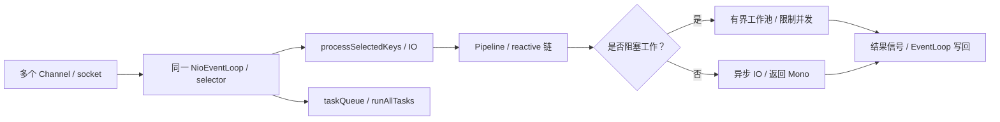
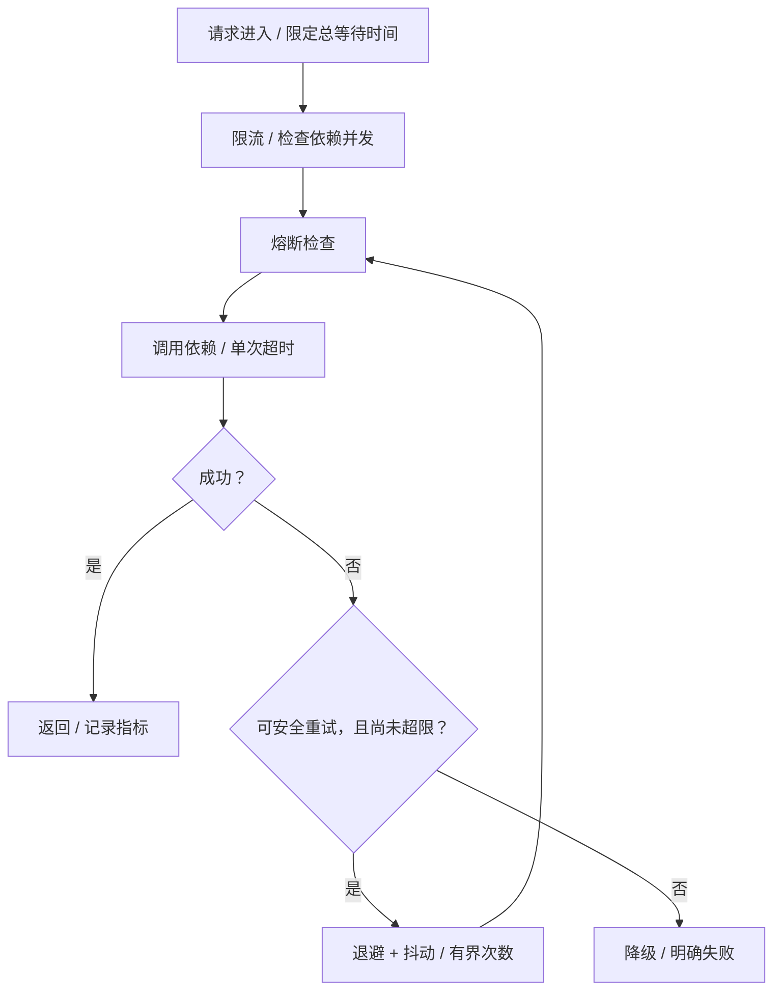

# 微服务、高并发与系统稳定性

使用 Gateway 3.1.8、Reactor 3.4.34 和 Netty 4.1.108.Final 解释 Spring Boot 2.7 时代的实现。先从一个现象讲起：认证数据库变慢，为什么网关里不需要认证的接口也跟着卡住？

## 核心知识与原理

### Gateway、Reactor 与 EventLoop

Gateway 找到匹配的 Route 后，把 GlobalFilter 与路由过滤器合并排序，沿过滤器链调用。NettyRoutingFilter 发出下游请求，响应再沿 reactive 链返回，NettyWriteResponseFilter 负责写回。Servlet Filter 与这条 WebFlux 链属于不同模型。

Netty 一个 EventLoop 通常负责多个连接，轮流处理 IO 就绪事件和任务。它不是一个连接一条线程。若认证过滤器在里面直接执行阻塞 JDBC，EventLoop 等数据库结果时，其负责的其他连接也无法及时处理。这就解释了“一个依赖慢，许多无关请求一起慢”。

返回 Mono 并不会改变已经执行的阻塞代码。Mono 表示零或一个结果，Flux 表示多个结果，它们需要订阅后才按链执行。桥接阻塞调用时，应延迟执行，并把它放到适当的工作线程中，例如下面的 fromCallable 与 subscribeOn。

```java
// 把阻塞查询放到工作线程，另设连接和语句超时。
Mono<Order> load(long id) {
    return Mono.fromCallable(() -> blockingDao.find(id))
        .subscribeOn(Schedulers.boundedElastic())
        .timeout(Duration.ofMillis(300));
    // timeout 后 SQL 可能仍在执行，不能只靠这个限制数据库压力。
}
```

subscribeOn 影响订阅和源的执行位置，publishOn 影响后续信号处理的线程。把 publishOn 写在一个已经执行的 JDBC 调用后面，不会把那次调用重新搬走。boundedElastic 也有线程和排队限制，还需要数据库连接限额和超时。过滤器内部手动 subscribe 后马上返回，会脱离请求的错误、完成与取消管理，通常应直接返回组合后的链。

```xml
<!-- 项目配置示例：版本由 Boot/Cloud BOM 管理，不能混入 Gateway MVC starter。 -->
<dependency>
  <groupId>org.springframework.cloud</groupId>
  <artifactId>spring-cloud-starter-gateway</artifactId>
</dependency>
```

### 背压的范围与取消

下游一次只能处理 10 条，就通过 request(10) 向上游声明需求，按 Reactive Streams 规则接收信号。publishOn 会用队列和预取在不同线程之间转交，消费完一定数量后再补需求。这是背压的核心，不是让所有外部系统自动按你的速度生产。

无限 onBackpressureBuffer 会把来不及处理的内容继续留在内存，仍可能 OOM。Drop 或 Latest 适合允许丢弃中间状态的场景，支付事件则不能照这样丢掉。数据库、HTTP 和 MQ 有各自的流控，要在接入处明确如何限量。

timeout 后订阅被取消，也不保证 JDBC 语句立即停止。底层驱动可能仍在等结果，继续占连接。跨 scheduler 传递租户、追踪或事务信息时，需要 Reactor Context 和相应桥接；ThreadLocal 只跟线程走，不能自动跟每个请求走。

### 限流、熔断与隔离

令牌桶允许按补充速率处理请求，并允许桶容量范围内的突发。漏桶更偏向平滑输出，来得太快就排队或拒绝。滑动窗口检查最近一段时间，比固定窗口减少某些跨边界突发，代价是更复杂的统计。分布式限流若依赖 Redis，还要决定 Redis 故障时放行还是拒绝。

超时限制等多久；熔断在持续失败或慢调用时暂时快速拒绝；降级给可接受的替代结果；舱壁则限制某个依赖占用的线程、连接或并发，避免它耗尽整个服务资源。这些措施要一起看，而不是只加一个注解。

重试会增加请求。若三个调用层每层最多尝试三次，一个原始请求最坏会触发 27 次底层调用。原调用超时却还没结束时，重试还会和它同时运行。应只对适合重试的幂等操作使用有限次数、总时间限制、退避与抖动，尽量在合适的一层重试。

### 高可用、灰度与容量规划

链路追踪先帮我们拆开等待：时间花在网关、排队、借连接、SQL，还是下游网络？再看每段的请求量、错误和耗时分位数，平均值常会掩盖少数很慢的请求。

灰度应让同一用户或租户稳定进入指定版本，并把标记传到后续调用和消息里。数据库结构先做兼容扩展，旧消费者也应能处理新事件。回滚代码不会自动恢复已经写错的数据，发布前要把数据修复和回退条件想清楚。

容量要用实际服务时间估算。稳定条件下，并发量大致是吞吐乘以耗时，再通过压测检查资源竞争和长尾。两台实例不等于能扛住一台故障：剩余实例、数据库和缓存都要留余量，故障域也不能完全重合。

压测应覆盖慢依赖、缓存故障、Broker 切换和突发。某些闭环工具在服务变慢后自己降低发送速度，让排队问题看起来没那么严重，需要补充按固定到达率施压的测试。

### 容量与雪崩的数值推演

一个依赖每秒处理 1000 个请求，平均 20ms，平均同时执行的请求约 20。耗时变成 500ms、到达率仍不变时，需求并发变成约 500。连接不够就排队，排队耗时又触发重试，于是情况继续恶化。

先限制新请求进入，给等不到资源的请求明确失败，对非关键功能降级，再逐步恢复。直接把线程数调到 500，只会让更多线程等同一批数据库连接。恢复时也要慢慢放量，避免所有实例重启后一起预热，制造第二次冲击。关联阅读：<a href="#c1">线程池</a>、<a href="#c4">Netty 内存</a>、<a href="#c8">缓存回源</a>。


## 源码级解析与调用链

Gateway 从 `FilteringWebHandler.handle` 建立过滤器链。Netty 的 `NioEventLoop.run` 轮流执行 IO 和队列任务，Reactor 的 `FluxPublishOn` 把信号放入队列，交由 scheduler 消费。

沿这三个片段，分别回答请求先过哪些过滤器、线程什么时候被占住，以及数据在哪个队列等下游。这样比看到 Mono 就断言非阻塞更具体。

<!-- source:gateway -->

<!-- source:netty -->

<!-- source:reactor -->





## 面试官三层追问

### 1. Gateway 用了 Reactor，为何还会全站卡顿？

<details markdown="1"><summary>查看回答与追问</summary>

因为 reactive 不会把同步调用自动变成非阻塞。EventLoop 内执行 JDBC，数据库慢时同一线程负责的多个连接都会等。

**怎样定位到这段代码？** 多次线程栈看到 reactor-http-nio 停在同步查询或 read，而不是继续处理 NioEventLoop 的事件。trace 再确认时间确实花在认证依赖。

**怎么修？** 采用异步客户端，必要阻塞调用放有界工作池，配独立并发与连接超时。慢依赖压测看其他路由是否受影响，不只加 Netty 线程。
</details>

### 2. publishOn 和 subscribeOn 如何区分？

<details markdown="1"><summary>查看回答与追问</summary>

subscribeOn 影响订阅和源执行的位置，publishOn 影响它之后的信号处理线程。位置决定作用，不能只背“切线程”。

**publishOn 做了什么？** 它入队、按 scheduler drain，再按消费进度补请求。阻塞源可用 fromCallable 配 subscribeOn；已经发生的阻塞不会因后面一个操作符重新搬家。

**怎么避免滥用？** 不每一步都换池，控制队列和预取，正确传 Context。涉及 JDBC 时重新确认事务在哪个线程开始，不把 ThreadLocal 当跨线程状态。
</details>

### 3. 背压是否等于不会 OOM？

<details markdown="1"><summary>查看回答与追问</summary>

不等于。协议内控制需求，但无界缓冲、外部不遵守需求的来源、业务长期持有对象，仍可能把内存用完。

**预取和取消呢？** request、prefetch、队列协调每段处理。onBackpressureBuffer 若无界，只是把压力转到内存；取消也不一定让底层 JDBC 立即停止。

**怎样保护资源？** 每个接入点明确容量、并发、超时与拒绝方式。不能对重要支付直接 Drop/Latest；需要可靠队列承接，再按下游能力处理。
</details>

### 4. 重试为什么会导致雪崩？

<details markdown="1"><summary>查看回答与追问</summary>

它把新增工作发给一个已经忙不过来的依赖，原来超时的请求还可能继续执行。多个层分别重试，又会把次数相乘。

**抖动解决什么？** 固定等待会让许多调用一起再次冲击，随机抖动把它们错开。但它不能使超载系统突然有更多能力，还需要限制总次数和总时间。

**如何配合其他措施？** 只在合适的一层做幂等、有界重试，持续失败时熔断，按依赖隔离并发，过载时限流和降级。监控重试占比，不等失败后无限补调用。
</details>

### 5. 线程池和连接池应该设多大？

<details markdown="1"><summary>查看回答与追问</summary>

先看实际到达率、执行时间和下游容量，没有对所有任务都合适的 CPU 乘数。数据库最多承受多少并行查询，比开多少等待线程更重要。

**L≈λW 怎么用？** 它描述稳定情况下的平均并发关系，可做初步估算；排队、长尾和争用要再压测。线程比连接多得多时，许多线程只是等连接。

**怎样验收容量？** 找吞吐拐点和尾延迟，控制排队和拒绝，预留一台故障后的剩余能力。不能以压测“没拒绝”为唯一目标，长时间排队也是失败。
</details>

### 6. 灰度发布如何保证可恢复？

<details markdown="1"><summary>查看回答与追问</summary>

稳定划分流量，观测新旧版本，提前规定回退条件，同时保证数据库和事件格式兼容。灰度不只是把 5% 请求随机打给新实例。

**异步链路怎么处理？** 标签需要跨调用和 MQ 传递，旧消费者仍要认识事件。schema 先兼容扩展，再迁移，否则旧代码可能已无法回退。

**数据写错了怎么办？** 代码回滚不会撤销已提交的数据。重要变更准备修复和对账，灰度比较租户结果、错误率和 p99，并演练真正的回退过程。
</details>

## 模拟生产案例：认证过滤器阻塞事件循环

认证 GlobalFilter 直接调用 JDBC，下游变慢后，多条无关路由同时超时，CPU 却不高。这是共享 EventLoop 被阻塞的模拟情境。

看 trace 里认证时间，连续线程栈看 reactor-http-nio 是否停在同步查询，再看连接池 pending 和客户端重试。若其他路由也由这些 EventLoop 处理，就能解释为什么影响扩大。

用异步客户端，或把必要阻塞操作移到有界工作池，并限制认证并发和连接等待。根据安全要求设计缓存与失败响应，不把所有失败直接放行。减少多层重复重试，逐步恢复流量。

用慢 DAO 验证无关路由能继续处理，认证则按设定时间明确失败。以后测试依赖变慢、取消后任务残留与 Context 传播，同时监控 EventLoop 延迟和总重试量。

## 面试回答与核心总结

### 60 秒快速回答

一个 Netty EventLoop 服务多个连接，阻塞 JDBC 会让其他连接一起等。Reactor 用需求和队列协调处理，subscribeOn 与 publishOn 位置不同，返回 Mono 不自动非阻塞。稳定性要限制总等待、重试与并发，持续故障时熔断和降级，按依赖隔离资源。容量用实际吞吐和耗时估算并压测，灰度还需标签传播、数据兼容和真实回退，代码回滚不会撤销已写数据。

### 2～3 分钟深入回答

我先解释线程模型：EventLoop 轮流处理多个 channel 的 IO 和任务，不是一连接一线程。Gateway 过滤器若在里面做同步 JDBC，数据库慢会让这一批连接都不能及时继续。返回 Mono 只是类型，已执行的阻塞代码不会自动改变。

阻塞源可以用 fromCallable 延迟，再用 subscribeOn 放到合适工作线程；publishOn 主要影响后续信号。队列、预取和 request 协调背压，但无限 buffer 仍能占满内存，外部来源也需单独限量。timeout 取消后 JDBC 可能仍占连接，线程上下文要正确转成订阅 Context。

当一个依赖变慢，平均并发需求约为到达率乘耗时。1000QPS 从 20ms 变 500ms，需要的平均并发从 20 变 500，池不够开始排队；再加重试就更坏。先限制准入、等待和总尝试，退避带抖动，只对可重试且幂等操作执行。持续故障用熔断，按依赖隔离线程或并发，非关键功能降级。

容量测试找吞吐拐点与业务 p99，覆盖缓存故障、慢依赖和一台实例退出。不要让闭环工具自动降到达率后误以为稳定，也不要只增加线程和连接。

发布则稳定分用户或租户，标签传到异步消息，数据库和事件先保证新旧兼容。回退条件用错误率、尾延迟和业务结果；写错数据要有修复方案。最后通过 trace、队列、连接和线程栈定位等待发生在哪一段，再决定改法。

### 高频追问、常见错误与速记

- 高频追问：timeout 会停止 SQL 吗？发布后哪些线程处理信号？MDC 怎么传？闭环压测会漏什么？
- 容易答错：一连接一线程；返回 Mono 就非阻塞；boundedElastic 无限；背压不会 OOM；多加连接一定快；代码回滚恢复数据。
- 常看的源码：`FilteringWebHandler.handle`、`DefaultGatewayFilterChain.filter`、`NioEventLoop.run/runAllTasks`、`FluxPublishOn.onNext` 和 request 处理。
- 顺着一次请求看它在哪等，资源被谁占，再决定限流、隔离还是改调用方式。
