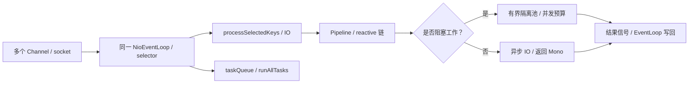
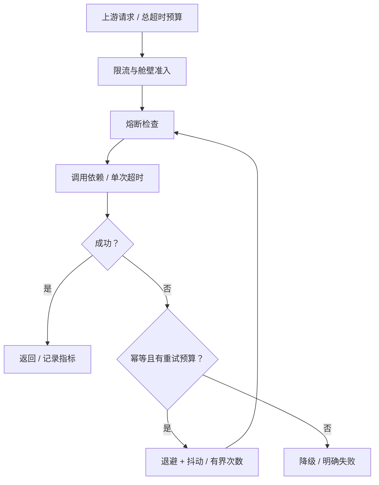

# 微服务、高并发与系统稳定性

版本基线：Spring Cloud Gateway 3.1.8、Reactor Core 3.4.34、Netty 4.1.108.Final（与 Spring Boot 2.7 时代机制相符）。版本组合只是分析基线，实际依赖树和补丁安全性应由部署项目管理。

## 核心知识与原理

### Gateway、Reactor 与 EventLoop

Gateway 基于 WebFlux 路由请求，RoutePredicateHandlerMapping 找到 Route，FilteringWebHandler 合并 GlobalFilter 与路由 GatewayFilter 并排序，DefaultGatewayFilterChain 递归调用 filter；前置逻辑依序进入，后置响应逻辑按 reactive 链完成。NettyRoutingFilter 使用 Reactor Netty 发请求，NettyWriteResponseFilter 写回响应。MVC Servlet Filter 与这条 reactive 链不能混为一套。

Netty NioEventLoop 管理一组 channel 的 selector/IO 与任务队列，某个 channel 一般注册到一个 EventLoop，串行处理其事件。不等于“一连接一线程”。run 循环选择 IO，处理 selected keys，按 ioRatio 等机制执行任务；任务里的阻塞 JDBC、文件操作、Thread.sleep 会占住共享 EventLoop，许多无关连接一起停顿。调大连接数无法弥补事件线程被阻塞。

Reactor 的 Mono 表示 0/1 个结果，Flux 表示 0..N，订阅驱动执行。`subscribeOn` 影响订阅/源执行上下文，`publishOn` 影响其后的信号处理；不是在任意位置放一个操作符就把前面所有阻塞调用安全搬走。桥接阻塞任务通常用 `Mono.fromCallable(...).subscribeOn(boundedElastic())`，但 boundedElastic 也有线程/排队限制，下游连接和超时仍需单独约束。不得在 handler 内手动 subscribe 然后马上返回，丢掉生命周期、错误传播与取消协议。

### 背压的范围与取消

Reactive Streams 的 request(n) 从 subscriber 向上游声明需求，源根据协议发 onNext，不允许以背压名义随意超发。publishOn 引入队列与预取，在下游变慢时上游按需求调节；背压不保证所有外部系统自动减速，也不代表任意缓冲无限安全。HTTP 来源、消息队列和数据库连接各有自身流控，需要边界桥接。选择 onBackpressureBuffer/Drop/Latest 时要符合业务语义，关键支付不能直接丢弃。

取消只是通知终止订阅，阻塞 native/JDBC 操作是否可及时中断由具体驱动决定；超时取消后旧任务可能仍占连接。Reactor Context 用于订阅上下文传播，不应拿 ThreadLocal 作为跨 scheduler 的租户/事务唯一来源。链路追踪和日志 MDC 必须使用兼容上下文传播桥接，确保线程复用清理。

### 限流、熔断与隔离

令牌桶以速率补充 token 并允许容量范围内突发；漏桶平滑输出但增加排队/可能拒绝；滑动窗口比固定窗口减少边界翻倍，但精度与存储成本受实现影响。分布式限流需要原子状态、时间源及失败策略，Redis Lua 常用于单次原子判定，Redis 不可用时 fail-open/fail-closed 需按业务明确。

超时是等待预算，重试是新增工作，熔断在依赖失败率/慢调用达到阈值时快速拒绝，降级给可接受替代结果，舱壁限制一个依赖耗尽全部并发。每层都独立重试会相乘：3 层各最多尝试 3 次，最坏 27 次调用；仅对可重试且幂等操作，设总尝试/总时间预算、指数退避、随机抖动和 retry budget。下游已经过载时更短超时加更多重试反而更差。

```java
// 业务示例：阻塞 DAO 显式隔离，仍需 DAO/连接池超时与并发准入。
Mono<Order> load(long id) {
    return Mono.fromCallable(() -> blockingDao.find(id))
        .subscribeOn(Schedulers.boundedElastic())
        .timeout(Duration.ofMillis(300));
    // timeout 不保证数据库语句立即停止，也不替代业务幂等和连接预算。
}
```

```xml
<!-- 项目配置示例：版本由 Boot/Cloud BOM 管理，不能混入 Gateway MVC starter。 -->
<dependency>
  <groupId>org.springframework.cloud</groupId>
  <artifactId>spring-cloud-starter-gateway</artifactId>
</dependency>
```

### 高可用、灰度与容量规划

链路追踪记录 trace/span、依赖耗时和错误，结合 RED（rate/errors/duration）与资源指标区分排队和执行；仅看平均响应时间会漏尾延迟。灰度通过租户/用户/请求标签稳定路由，流量染色在所有调用和异步消息中传播，避免写新库、读旧服务的交叉组合。发布先验证兼容 schema、可回退配置及混合版本，不让一次数据库变更消灭回退路径。

高可用不是实例数等于二：需要跨故障域、依赖冗余、容量余量、故障检测与演练。每层估算 λ、服务时间 W、并发 L≈λW，连接/线程/队列预算要符合瓶颈资源；不是把所有池调成 1000。压测包含峰值、慢依赖、缓存失效、Broker 切换和长尾，识别 closed-loop 压测在服务变慢时自动降低到达率而掩盖排队的风险；用开放到达模型和正确尾延迟统计补充。

### 容量与雪崩的数值推演

某依赖稳定吞吐 1000 请求/秒、平均执行 20ms，执行中并发平均约 20；当它变为 500ms，若到达率不变，需求并发升至约 500，超出连接池后进入排队。若上游每次超时再补两次，实际负载可迅速增加到三倍。正确动作是依据下游可持续完成率限准入、截断等待、控制重试和降级，而不是只把线程池扩到 500 以上。

排查慢接口先找 trace 的排队/连接获取/执行段，再结合 EventLoop、工作池和连接池栈。同一慢依赖若污染所有路由，要检查共享资源与舱壁；仅特定路由恶化则检查查询/热点。恢复过程中逐级开放流量并观察 p99、reject、pending 和错误率，避免重启全部实例同时预热缓存/连接形成第二次冲击。故障复盘保留时间线及已证实、待证实的假设，不能用 CPU 低直接得出“没有性能瓶颈”。

## 源码级解析与调用链

`FilteringWebHandler.handle → DefaultGatewayFilterChain.filter → GatewayFilter.filter` 建立 reactive 拦截链；Netty `NioEventLoop.run → select → processSelectedKeys → runAllTasks` 执行 IO 与队列工作。Reactor `FluxPublishOn` 在 onNext 入队，按 scheduler 与 request/consumed 信号执行 drain 并补充需求，队列容量和预取参与背压。观察 operator 类型与调用栈比“用了 Mono 所以不会阻塞”更可靠。

<!-- source:gateway -->
<!-- source:netty -->
<!-- source:reactor -->





## 面试官三层追问

### 1. Gateway 用了 Reactor，为何还会全站卡顿？
<details markdown="1"><summary>展开三层参考答案</summary>

**第一层：**reactive 容器不能把阻塞调用自动变异步，EventLoop 内阻塞会影响它负责的多个连接。

**第二层：**jstack 多次看到 reactor-http-nio 线程停在 JDBC/socket read 或 sleep，NioEventLoop.run 无法继续 selected key 与 task 处理。一个 channel 串行不代表一个线程只服务该 channel。

**第三层：**使用异步客户端或有界阻塞隔离，依赖超时和舱壁同时设置；压测慢下游，并用受控阻塞检测工具发现错误调用点。增加 Netty 线程只算暂缓。
</details>

### 2. publishOn 和 subscribeOn 如何区分？
<details markdown="1"><summary>展开三层参考答案</summary>

**第一层：**subscribeOn 改变订阅/源执行上下文，publishOn 改变后续信号处理线程。

**第二层：**publishOn 通过预取队列与 drain 转发信号，fromCallable 的阻塞源可用 subscribeOn 调度；已经执行的阻塞代码不会因后面加 publishOn 被重新迁移。

**第三层：**控制线程切换次数和队列，不能每个 operator 都换池。事务与租户通过正确 Context 协议，桥接 JDBC 时重新定义本地事务边界。
</details>

### 3. 背压是否等于不会 OOM？
<details markdown="1"><summary>展开三层参考答案</summary>

**第一层：**不是。协议内限制需求，但无界 buffer、外部推送源或业务持有对象仍可导致增长。

**第二层：**request(n)、prefetch 和队列协调每段流，onBackpressureBuffer 若选无界会把压力转为内存；取消不保证所有底层阻塞动作立即结束。

**第三层：**每个边界定义并发/容量/超时和丢弃语义，监控缓冲长度与旧任务占用。关键交易不能用 Drop/Latest 随意丢事件，需可靠队列承接。
</details>

### 4. 重试为什么会导致雪崩？
<details markdown="1"><summary>展开三层参考答案</summary>

**第一层：**失败时新增请求正好打到已过载依赖，且多层重试次数相乘。

**第二层：**超时的原请求可能仍执行，再次尝试与旧调用并行；相同退避时间产生同步峰值，抖动与全链路预算能减轻但不消除过载。

**第三层：**重试只放合适一层、限制总时间/次数，结合熔断、舱壁和幂等；设置请求级重试预算及服务级重试占比，故障时先限流而非自动无限补偿。
</details>

### 5. 线程池和连接池应该设多大？
<details markdown="1"><summary>展开三层参考答案</summary>

**第一层：**由到达率、服务时间、CPU/IO 与下游容量决定，没有统一 CPU×N 能覆盖所有场景。

**第二层：**L≈λW 是稳定条件下平均关系；排队、长尾和资源竞争会破坏简单估计。连接是数据库并发限制，线程多于连接只增加等待者。

**第三层：**建立端到端预算，压测找吞吐拐点，保留故障时剩余实例容量；限制队列等待并监控 active/pending/reject，不能以“无拒绝”为成功指标。
</details>

### 6. 灰度发布如何保证可恢复？
<details markdown="1"><summary>展开三层参考答案</summary>

**第一层：**稳定流量分组、观测新旧版本、明确自动/人工回退条件，并保障数据格式兼容。

**第二层：**header 染色跨调用和消息传播，schema 先兼容扩展再迁移，旧消费者仍能处理事件；异步链路缺标签会让灰度失控。

**第三层：**按租户不变量/错误率/尾延迟比对，预演回退和流量切换。回滚代码不自动回滚已提交的数据，危险写入要事先设计修复方案。
</details>

## 模拟生产案例：认证过滤器阻塞事件循环

**故障现象：**Gateway CPU 不高，多个无关接口同时超时，数据库短时变慢后迅速放大。**排查思路：**对齐 trace、event-loop 栈、数据库连接 pending 与客户端重试；确认是否只有认证链执行慢。**原理分析：**GlobalFilter 中同步 JDBC 查询用户，多个 channel 共用 EventLoop 被阻塞，超时重试进一步叠加。**根因和验证证据：**模拟 DAO sleep，reactor-http-nio 栈长期停在同步查询；改为有界隔离并减少每层重试后，无关路由恢复，而认证按预算明确失败。**解决方案：**使用可接受时效的认证缓存/异步客户端，必要 JDBC 有界隔离和专门准入，设置连接与调用超时。**长期预防：**慢依赖注入、线程阻塞检查、trace 上下文测试、总重试预算及事件循环延迟告警。关联阅读：<a href="#c1">线程池拒绝</a>、<a href="#c4">Netty 内存</a>、<a href="#c8">缓存失效</a>。

## 面试回答与核心总结

### 60 秒快速回答

Gateway 的 reactive filter 链运行在 Netty 事件模型上，一个 EventLoop 服务多个连接，阻塞 JDBC 会扩大故障。Reactor 用 request(n)、队列和调度实现背压，subscribeOn 与 publishOn 作用位置不同，但不能自动保护外部资源。稳定性需要总超时、单层有界重试、抖动、熔断和舱壁；容量按实际服务时间与下游能力估算，灰度必须兼容数据和异步链路并预演回退。

### 2～3 分钟深入回答

从 RoutePredicateHandlerMapping 到 FilteringWebHandler 讲路由与 filter 进入/返回顺序，再用 EventLoop 的 IO/task 循环解释同步认证为何拖慢无关接口。说明 fromCallable 的隔离与 publishOn 的预取队列，强调取消后 JDBC 可能继续占资源。随后计算三层三次尝试如何放大到 27 次，提出端到端预算、幂等和 retry budget。最后按 L≈λW、吞吐拐点与故障余量做容量设计，用流量染色和兼容 schema 保证发布可恢复。

在容量上我会给一个依赖变慢的数值例子：1000QPS、20ms 时平均执行并发 20，升到 500ms 就需要约 500，资源不足后排队，叠加重试会更坏。此时限制准入和全链路预算优于扩线程。发布侧要稳定流量分组、标签贯穿异步事件，schema 先兼容，回退代码不回滚数据。验证使用慢依赖、缓存失效和 Broker 故障压测，观察队列/连接 pending 与业务 p99，并避免闭环压测降低到达率掩盖排队。

### 高频追问、常见错误与速记

高频追问：timeout 会停止 SQL 吗？MDC 怎么跨线程？压测是否掩盖排队？常见错误：一连接一线程；返回 Mono 就非阻塞；boundedElastic 无限；背压一定不 OOM；增加连接池就提升 DB 吞吐；代码回滚自动修复数据。源码：FilteringWebHandler.handle，DefaultGatewayFilterChain.filter，NioEventLoop.run/runAllTasks，FluxPublishOn.onNext/drain，Reactor request 协议。核心知识：**事件线程→有界异步→依赖预算→恢复与发布**。
