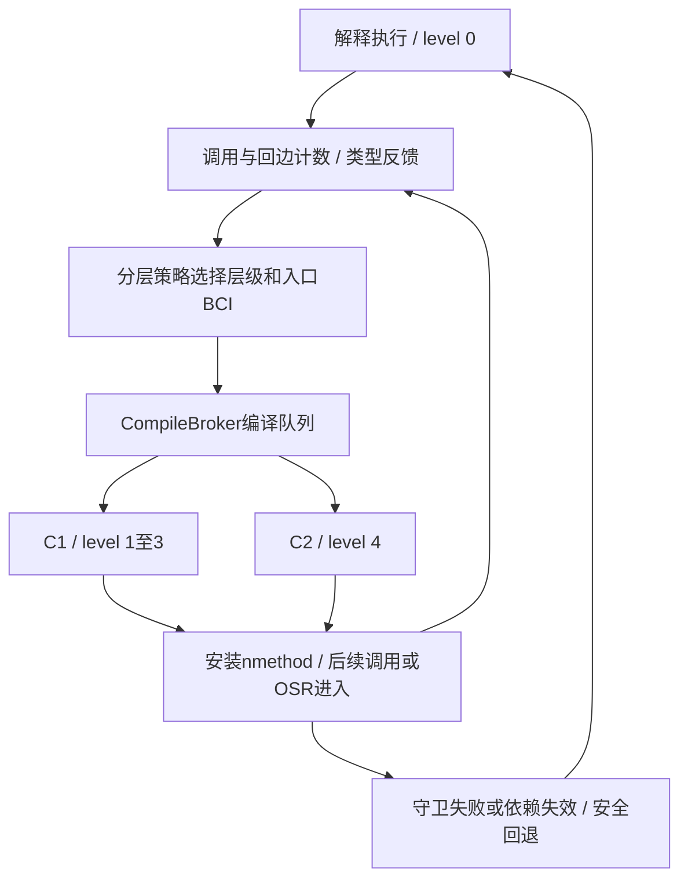
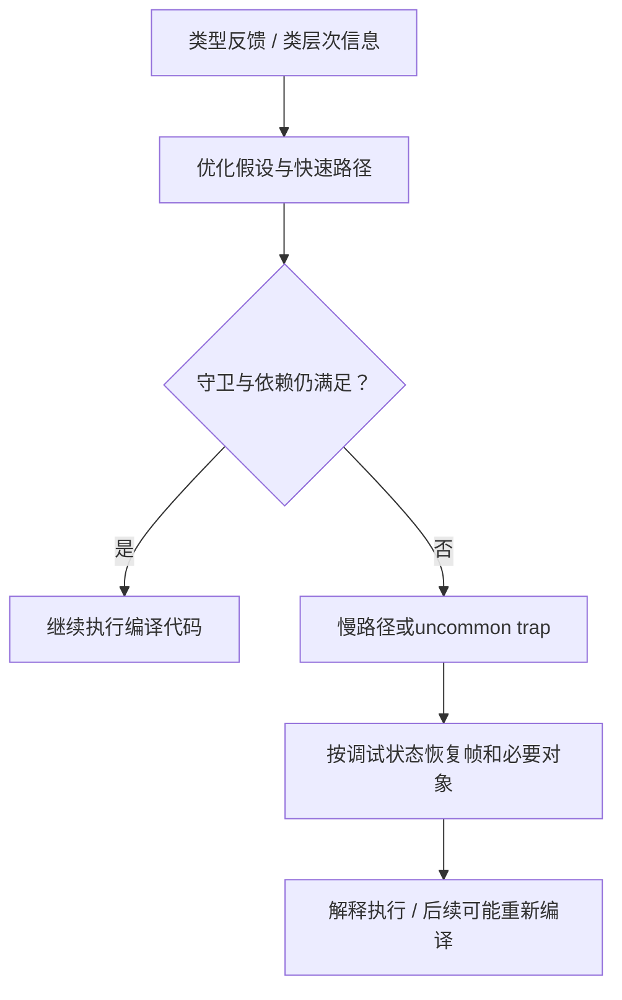
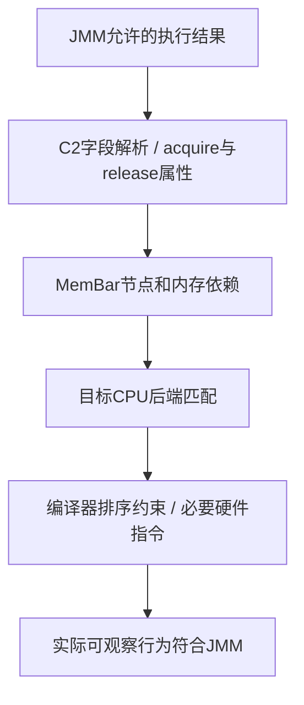

# JIT即时编译、JMM与内存屏障

JIT的本质是**利用程序运行时的反馈，把热点字节码编译成更高效的机器码**。它既要承担编译成本，也要保存优化假设失效时恢复执行的能力。JMM则规定共享内存访问允许产生哪些结果；JIT必须在这个边界内优化，但不会自动补上程序缺失的同步协议。

本章以Java SE8规范与OpenJDK8u462-b08的HotSpot实现为基线，源码提交固定为`943a5ea328fd2fc8eed0aed4ec9b1957d41f8144`。规范、源码推导和教学示意分别标注。这里的C1/C2、编译日志和x86后端不能不加核对地推广到其他JVM、JDK版本与CPU。

## 核心知识与原理

### 从字节码到机器码：编译发生在什么时候

`javac`把源代码编译为class文件；HotSpot可以先解释执行字节码，同时收集调用次数、循环回边次数和接收者类型等反馈。热点方法进入编译队列，编译线程生成机器码并安装为`nmethod`。后续方法调用可进入编译代码；正在运行的长循环还可能通过OSR切换到编译版本。

```java
static int add(int a, int b) {
    return a + b;
}
```

这一静态方法的典型字节码是`iload_0 → iload_1 → iadd → ireturn`，可以用`javap -c`核对。JIT不必为每条字节码保留一条机器指令：调用方内联它之后，参数可能已经在寄存器里；如果参数是常量，连加法也可能被折叠。机器码依赖目标架构、调用上下文和优化决策，不能把示意汇编当作固定输出。

|机制|发生时点与输入|收益和代价|
|---|---|---|
|解释执行|运行时逐步执行字节码|无需先为全部方法生成机器码，但有解释分派开销|
|JIT|运行时使用字节码及反馈|针对真实负载优化，同时消耗编译CPU、元数据与Code Cache|
|AOT|运行前生成目标机器码|减少运行时编译工作；也可以结合离线反馈优化，能力取决于实现|

因此，JIT的优势不能简单归结为“比AOT多做内联”。关键是反馈获取的时点、优化假设与回退能力。冷启动、预热阶段和稳态应分别测量；一个只执行一次的方法，编译成本未必值得付出。

### 分层编译、热点策略与OSR

在本章的HotSpot8分层编译实现中，level0表示解释执行；level1是C1无profiling，level2是C1有限profiling，level3是C1完整profiling，level4是C2。C1较快地产生代码，带反馈的层级继续积累信息；C2用这些信息进行更深入的优化。具体层级受启动参数、编译器可用性和策略影响。

这不是所有方法都必须走完的流水线。策略会综合计数、增长速率、已有MethodData、编译队列压力等决定下一层级；不同方法可能跳级或停在较低层级。阈值也不是语言规范承诺的固定次数。

OSR即On-Stack Replacement：方法还没有返回，长循环已足够热，JVM可在指定字节码位置转入编译执行。它通常编译带特定入口的**方法版本**，不能理解为单独编译一条循环指令。`PrintCompilation`里的`%`表示OSR编译，`@`后面给出入口BCI；普通入口与OSR入口可以同时存在。



### 内联、逃逸分析与推测性优化

方法内联消除部分调用成本，也把调用双方放进同一个优化范围。常量传播、死代码消除、循环优化和逃逸分析因此可能继续生效。逃逸分析本身是分析；标量替换和锁消除是它可能促成的优化，不能把两者当成同义词。

```java
static int distance(int x, int y) {
    Point p = new Point(x, y);
    return p.x + p.y;
}
static final class Point {
    final int x, y;
    Point(int x, int y) { this.x = x; this.y = y; }
}
```

若优化器证明`p`不逃逸且能标量替换，计算可能直接使用`x`和`y`，不再分配这个Point。准确的说法是“对象分配可能被消除”，而不是“所有不逃逸对象都放到栈上”。分析失败、无法内联或对象身份需要保留时，仍可能在堆上分配。

推测性优化可利用类型反馈，例如接口调用长期只有一种接收者：

```java
interface Op { int apply(int x); }
static int dispatch(Op op, int x) { return op.apply(x); }
```

JIT可能生成“若接收者是PlusOne，则执行已内联的快速路径；否则转入慢路径或uncommon trap”的代码。这是教学示意，实际策略依赖类型分布、类层次依赖和编译决策。出现第二种类型不意味着一定去优化，更不意味着全JVM重新编译。

### 去优化如何恢复程序状态

编译器删除了调用边界，甚至消除了对象分配，解释器却仍然需要局部变量、操作数栈、调用帧和对象。HotSpot因此为编译代码保留调试状态、oop位置与相关依赖；去优化时重建解释器所需的逻辑帧，必要时重新物化被标量替换的对象。它不是重新执行整个方法，也不能撤回已经发生的业务副作用。

编译代码进入`not entrant`后，不再接收相应的新入口调用；失效代码的在途执行和回收还有后续处理。日志出现`made not entrant`只能证明代码状态发生变化，可能来自更高层级替换或假设失效等原因，不能单独认定存在JIT缺陷。去优化保护优化假设下的语义，不会检测普通字段是否应该加volatile。



### 普通停止标志为什么可能读不到更新

下面是教学片段，`running`是普通共享字段。主线程的sleep只是给工作线程运行机会，不建立停止写入与循环读取之间的同步关系。

```java
static boolean running = true;
static void work() {
    while (running) { /* 不在这里打印或加锁 */ }
}
// 主线程：worker.start(); Thread.sleep(1000); running = false;
```

在没有正确同步的情况下，编译器可能复用已读到的值，从效果上类似`if (running) { while (true) {} }`。这个变换只帮助理解合法结果，不声称某次运行一定生成这种机器码。即使解释器每次都读字段，程序也没有获得所需的跨线程保证。

将停止字段声明为`static volatile boolean running = true`，读写就带有volatile语义，不能把重复读取任意消除成一直使用旧值。但它不承诺写入后几毫秒内退出，线程仍需要获得调度机会。`Thread.sleep()`、`Thread.yield()`没有为普通字段建立内存同步；在循环里加入println会改变负载并可能引入额外同步，测试现象改变不能作为原代码正确的证明。

### JMM与happens-before：优化的合法边界

JMM是一套并发执行语义，判断一次读取允许观察哪次写入，不能机械映射为CPU缓存或者一块物理“工作内存”。编译器和硬件都可以调整实现，只要可观察行为仍符合规范。单线程语义也包括异常、副作用等约束，不只是最后一个计算结果相同。

两个线程访问同一变量、至少一个是写入且没有happens-before排序，就存在数据竞争。对于正确同步的程序，JLS提供顺序一致性保证；对于未正确同步的程序，允许一些违反直觉的结果，但并非允许任意破坏类型安全和因果性。

|HB来源|建立的关系|使用前提|
|---|---|---|
|程序次序|同一线程较早动作HB较晚动作|是语义顺序，不要求每条机器指令照抄源码位置|
|volatile|写HB同步顺序中后续的同一变量读|必须是同一个volatile变量|
|monitor|unlock HB后续lock|必须是同一把锁|
|start|start调用HB被启动线程的动作|不是新线程动作HB启动方之后的全部动作|
|线程终止|线程动作HB另一线程检测到它终止|成功join是常见方式；超时返回且线程仍活着不满足|
|传递性|A HB B且B HB C，得到A HB C|用它连接普通字段写入与跨线程读取|

```java
static int data;
static volatile boolean ready;
static void writer() {
    data = 42;        // A
    ready = true;     // B
}
static int reader() {
    if (ready) {      // C
        return data;  // D
    }
    return -1;
}
```

在一次性发布、初值为false且没有其他写入者的前提下，C读到B写入的true，得到`A → B → C → D`的HB链，D必须读到42。data自身无需volatile。若之后反复重置ready、覆写data，这个简单例子不足以保证读到的是同一批次快照，需额外协议、锁或发布不可变对象引用。


### 重排序、Store Buffer与volatile全序

以下两个线程的字段初值均为0；它们的执行代码没有同步：

```java
// 线程A                     // 线程B
x = 1;                       y = 1;
r1 = y;                      r2 = x;
```

JMM允许`r1 == 0 && r2 == 0`。一种硬件解释是两个核心的写入尚在各自Store Buffer，读取另一个地址时仍看到旧值；这不需要机器指令文本已经交换顺序。它只是可能机制，单次结果不能区分JIT重排、处理器排序与具体微架构时序。

若x和y都为volatile，则同步动作的全序必须保留线程内顺序。要让A读到y的0，A读y要位于B写y之前；要让B读到x的0，B读x要位于A写x之前。结合`A写x → A读y`和`B写y → B读x`就产生顺序环，因而两个读都为0被排除。只把其中一个字段改成volatile，不足以得到这个结论。Release/Acquire是理解单次发布的基础，但不足以概括Java volatile的全部排序要求。

### volatile自增、CAS与业务不变量

```java
static volatile int count;
static void increment() { count++; }
```

volatile使单次读写符合相应语义，并没有把读、加一、写回组合成一个原子动作。两个线程都读0并分别写1，在volatile同步全序下也完全合法。用`AtomicInteger.incrementAndGet()`可提供这个数值上的原子递增；多个变量共同维护的不变量，仍需要能覆盖整个协议的互斥、条件更新或其他设计。

CAS在指定位置上比较期望值并尝试原子更新。失败时调用方根据最新状态重试，不能把一串独立CAS当作一个事务。ABA是否构成问题取决于中间历史是否影响业务；必要时将版本号纳入状态。并发工具的内存语义由相应API规定，不能把所有弱CAS或其他语言的原子访问一概当作Java volatile。

“先AtomicInteger.get判断余额足够，再addAndGet扣款”虽然每一步都是原子的，整体仍会出现竞态条件。它说明业务竞态与数据竞争不同：没有普通字段的数据竞争，也不等于检查与修改这个业务组合已经安全。

## 源码级解析与调用链

### 热点事件如何提交编译任务

`method_invocation_event → call_event → compile → submit_compile → CompileBroker::compile_method`连接调用热度与编译请求；回边事件另经`loop_event`决定OSR层级和BCI。下面是固定版本的完整submit_compile函数，`InvocationEntryBci`区分普通方法入口和OSR入口；hot_count相应使用调用计数或回边计数。

<!-- source:jitsubmit -->

### C2构图与机器码安装

CompileBroker的编译线程取出CompileTask，`invoke_compiler_on_method`选择编译器，进入C1或C2的`compile_method`。C2经Parse把字节码转成图，通过内联、图优化、匹配目标指令、寄存器分配等流程输出代码，最终安装nmethod。编译排队期间应用仍可运行原有版本；编译失败不代表Java方法不能执行。

定位入口：[CompileBroker::invoke_compiler_on_method](https://github.com/openjdk/jdk8u/blob/943a5ea328fd2fc8eed0aed4ec9b1957d41f8144/hotspot/src/share/vm/compiler/compileBroker.cpp#L1934)、[C2编译驱动compile.cpp](https://github.com/openjdk/jdk8u/blob/943a5ea328fd2fc8eed0aed4ec9b1957d41f8144/hotspot/src/share/vm/opto/compile.cpp)。下面进一步跟踪C2处理volatile字段的局部窗口，窗口不等于完整方法。

### volatile读：加载属性与Acquire节点

Parse::do_get_xxx首先检查字段是否volatile。构造加载时选择acquire内存顺序；在这个版本的后续分支中，还插入MemBarAcquire节点。图中的内存依赖限制非法重排，不能把节点数量直接换算成硬件屏障数量。

<!-- source:jitload -->

<!-- source:jitacquire -->

### volatile写：Release与额外排序约束

Parse::do_put_xxx在volatile写之前插入MemBarRelease，写节点带release属性，之后按平台能力插入MemBarVolatile，并配对记录相关屏障。这解释了为什么仅用“volatile等于Acquire/Release”描述还不完整：额外约束也参与实现volatile同步动作的要求。

<!-- source:jitrelease -->

<!-- source:jitvolatile -->

### 编译器节点与CPU屏障不是一一对应

LoadLoad、LoadStore、StoreStore、StoreLoad是对两侧内存访问排序要求的分类。编译器屏障限制代码变换，硬件排序机制约束核心之间的观察顺序。屏障不是把所有缓存清空，也不能泛称为“每次去主内存读取”。

本章固定版本的x86-64后端在MemBarAcquire与MemBarRelease匹配规则中没有输出对应的独立硬件指令；编译器仍保留排序约束。MemBarVolatile规则调用Assembler::membar(StoreLoad)，此版本x86实现使用带lock的操作。也存在带谓词的消除规则，所以不能断言每次volatile访问都会执行mfence。不同CPU后端可能需要其他指令，必须对照实际版本和反汇编。

<!-- source:jitx86 -->

### uncommon trap的恢复入口

<!-- source:jitdeopt -->

`OrderAccess`是HotSpot运行时自身同步使用的架构抽象；它可帮助理解架构差异，但不是所有Java volatile访问都调用它。Java字段的C2编译应跟踪Parse、内存节点和目标后端。上述内容是源码静态推导，本章未采集目标代码反汇编。



## 三层原理问答

### 1. JIT的价值为什么不只是翻译字节码？

<details markdown="1"><summary>查看回答与延伸分析</summary>

JIT能使用运行中的调用频率、分支和类型反馈，为真正热点生成机器码。内联除了省掉调用，也让常量传播、循环与对象分配优化跨越原本的方法边界。它仍需要付出编译成本，所以程序短暂运行时不一定得到收益。

**推测的前提怎么保护？** 优化器为类型和类层次等假设设置守卫或记录依赖。假设不成立时可以走慢路径，也可能去优化并恢复逻辑帧；不能继续拿已经不合法的假设执行。新增类型并不必然使所有代码失效。

**怎么比较性能？** 先区分冷启动、预热和稳态，记录相同负载下的吞吐、延迟及编译CPU。微基准需要防止结果未使用而被消除、常量折叠和测量代码被内联等因素，宜使用JMH并查看编译证据，而非只取一次纳秒差值。
</details>

### 2. C1、C2和OSR是不是固定的三步流程？

<details markdown="1"><summary>查看回答与延伸分析</summary>

不是。HotSpot8有解释层和不同profiling强度的C1层，C2对应更高优化层。下一层由运行反馈和编译压力等共同决定，部分方法可以跳级或长期停在较低层；这是一种实现策略，不是Java语言规定的固定路径。

**循环只进入方法一次怎么办？** 回边事件能积累热度并触发OSR，在某个BCI把当前执行切到编译版本。普通方法入口版本和OSR版本是不同编译任务，所以同一方法在日志里出现多次并不直接意味着异常。

**日志应该怎么读？** PrintCompilation中的百分号标记OSR，层级列区分C1/C2，at后的数字是入口BCI。made not entrant可能只是新版本替换旧版本。还要结合运行参数、具体JDK和LogCompilation事件，不能用一行日志推断完整原因。
</details>

### 3. 普通字段的无限循环一定是JIT错误吗？

<details markdown="1"><summary>查看回答与延伸分析</summary>

不是。普通共享停止字段没有跨线程同步，工作线程可能一直使用旧值，这是需要先检查的程序语义问题。JIT可以进行规范允许的读取复用；关闭优化后偶然退出，只能说明执行条件改变，不能证明原程序具备所需保证。

**volatile解决到哪一层？** 它为字段读写建立可见性和排序约束，使循环不能任意固定旧值。读到false后可以离开循环，但不承诺获得调度或退出的最大时间。sleep和yield没有替普通字段建立这条同步关系。

**怀疑编译器缺陷需要什么？** 固定正确同步的最小复现、完整JDK构建号和参数，对比-Xint及排除特定方法的结果，并保存编译和崩溃证据。JNI、Unsafe和时序变化同样可能影响结果，不能把时间相关性直接当根因。
</details>

### 4. volatile发布为何能让普通data字段可见？

<details markdown="1"><summary>查看回答与延伸分析</summary>

因为HB可以传递。写data先于写volatile ready；读线程读到这次发布的true，再读取data，普通字段的写入与读取就被同一变量的同步关系连接起来。保证来自完整协议，而不只是某个字段的修饰符。

**有没有适用边界？** 本例限定一次性发布、初值false且没有后续覆写。若发布方继续修改数据，读方可能读到后续状态；用同一个布尔标志标识多轮发布也缺少批次信息。需要根据不变量设计锁、版本或不可变快照。

**volatile禁止一切重排吗？** 它只限制会破坏相关语义的变换，仍允许合法内联和算术优化。底层可用缓存一致性、编译器约束和必要硬件排序完成要求，不规定每次从物理内存读取，也不规定固定数量的屏障。
</details>

### 5. volatile count++为什么还会丢失更新？

<details markdown="1"><summary>查看回答与延伸分析</summary>

两个线程可以先各自读到0，然后各写1。单次读写可见且有序，并不阻止两个读之间或读写之间的交错；volatile并没有把自增组合成一次不可分割的更新。最终只增加一次，是合法的丢失更新。

**AtomicInteger能保护什么？** incrementAndGet使一个数值的递增具有原子语义。但先get判断再addAndGet是两次操作，中间状态可能改变；CAS循环需把条件与更新放在同一协议，或使用覆盖全部相关状态的锁。

**为什么JIT不自动加锁？** 它的职责是按既定语义优化，没有义务猜测业务要求、锁范围与多个字段的不变量。锁消除则是反向证明不需要某段同步，并保留可观察语义；不能据此认为JIT会自动修复共享状态协议。
</details>

### 6. 去优化为什么需要局部变量和对象恢复信息？

<details markdown="1"><summary>查看回答与延伸分析</summary>

优化代码里可能只剩寄存器中的值，调用已经内联，对象分配也可能消失。解释器继续执行却需要Java逻辑帧、操作数栈和对象，因此编译器必须保留可恢复的状态映射；需要时重新物化对象，而不是从方法起点再跑一遍。

**它和GC信息是一回事吗？** oop位置帮助GC找到引用，去优化还需要恢复字节码位置、内联调用层次及局部状态。二者相关但用途不同。uncommon trap是触发路径之一，类层次依赖失效等也可能导致已编译代码不再可用。

**怎样判断实际发生了什么？** 新增接收者类型本身不能证明发生了特定去优化，应结合对应编译事件区分慢路径、守卫失败与依赖失效。正文的快速路径和机器指令描述属于机制示意或源码推导，不能当作实际反汇编输出。
</details>

## 模拟生产案例：预热后停止线程偶发失效

### 现象与证据边界

教学模拟：服务用普通boolean通知后台循环停止，低负载时通常成功，长时间运行后偶发停不下来；加日志后又很难重现。这种描述首先提示数据竞争与测试条件改变，不能仅因“运行久了”就认定JIT有缺陷。本章用模拟情境解释排查思路，不声称重现了真实生产事故。

### 按语义、编译事件和版本逐层检查

先列出共享字段的所有读写，画出HB关系；检查对象发布、同一把锁、停止与清理的先后顺序。然后在可控环境记录JDK完整版本、CPU架构、VM参数和编译事件，分别比较默认运行、-Xint及只排除work方法。每次对照都改变了性能和调度，差异是线索，需要结合正确性证据判断。

JDK8可使用`-XX:+PrintCompilation`观察热点编译，配合`-XX:+UnlockDiagnosticVMOptions -XX:+PrintInlining`查看内联决策；`-XX:+LogCompilation`可记录更完整的编译事件。`-Xint`用于解释模式对照，`-XX:CompileCommand=exclude,包名.类名::方法名`用于排除指定方法编译。参数需要结合实际JDK核对，诊断对照仅是定位线索。

### 修复和进一步验证

停止标志可改为volatile，复杂状态切换则按整体不变量选择锁或原子协议。验证还要覆盖取消、异常退出、资源释放和并发重复关闭。可用[OpenJDK jcstress](https://github.com/openjdk/jcstress)研究允许结果、用[OpenJDK JMH](https://github.com/openjdk/jmh)测量性能；本章不将有限次数正常运行当作并发正确性证明，也未执行jcstress、JMH或目标机器码反汇编。

## 知识梳理与核心总结

### 一分钟要点回顾

JIT在运行时使用热点与类型反馈生成机器码，通过内联、逃逸分析和循环等优化降低执行成本。HotSpot8的分层策略选择C1/C2层级，OSR让长循环不必等下次方法调用。推测路径必须有守卫或依赖保护，失效后靠状态恢复继续合法执行。

JMM规定合法共享内存行为，HB连接跨线程发布与读取。普通停止字段缺少同步，volatile修复相应读写语义，但不把count++变成原子更新。CAS或同一把锁应覆盖需要保护的协议；C2内存节点与CPU指令不是一一对应，关闭JIT后现象变化也不是编译器缺陷的单独证明。

### 深入理解与机制串联

沿两条链阅读：执行链是“热点事件 → 分层策略 → 编译队列 → C1/C2 → nmethod → 普通入口或OSR → 必要时去优化”；正确性链是“共享状态协议 → HB约束 → C2加载/存储与MemBar节点 → CPU后端 → 允许的观察结果”。两条链共同决定行为，但业务同步要求必须由程序清楚表达。

### 延伸问题、常见误解与速记

- JIT不是每条字节码执行前即时重编译；固定调用次数也不是规范阈值。
- 逃逸分析不保证对象栈上分配；标量替换可能让分配本身消失。
- 去优化不自动修复数据竞争，made not entrant不单独证明JIT缺陷。
- volatile发布靠HB链，重复发布还需要批次和快照协议。
- x/y都为volatile才可用同步全序排除双0；仅Acquire/Release表述不足以概括全部volatile语义。
- 没有硬件指令输出不等于没有编译器排序约束；MemBar节点也不等于每次执行mfence。
- 原子单步仍可能组合成业务竞态；-Xint只是可控环境中的对照工具。
