# Java 架构师面试深度学习手册

# Java 并发编程与锁机制

版本基线：OpenJDK 8u462-b08 / HotSpot 8。先建立可见性、原子性、顺序性三个不同维度，再讨论吞吐和公平性。锁的正确性来自共享状态的协议，而不是类名带有 Concurrent。

## 核心知识与原理

### JMM 与 happens-before

JMM 描述线程间允许观察到哪些读写结果。程序顺序、同一 Monitor 的 unlock→后续 lock、volatile 写→后续读、Thread.start 和 Thread.join，以及这些关系的传递闭包构成 happens-before。它不是说所有 CPU 指令按源码顺序执行，而是要求可观察结果符合约束。没有 happens-before 的数据竞争，不能靠“线程最终会读到”论证正确性。

volatile 为单次读写提供可见性和相应排序约束；`count++` 包含读、加、写，仍然不是一个原子事务。发布不可变配置时，可先构造对象，再写入 volatile 引用，读线程读取该引用后可见构造前的写。双重检查锁需要 volatile，防止观察到未安全发布的对象。final 字段有初始化安全语义，但构造中泄露 this 会破坏使用前提；final 引用也不保证引用对象永不改变。

### synchronized 与 CAS

HotSpot 8 对象 Mark Word 承载锁状态信息，偏向锁避免无竞争下的重复同步，轻量级锁使用线程栈 Lock Record 与 CAS，竞争加剧时可能膨胀到 ObjectMonitor；不是每次竞争都沿固定阶梯立即升级。偏向锁默认存在启动延迟，可批量重偏向或撤销。JIT 可消除不逃逸对象的锁、粗化连续锁区间，并采用自适应自旋。锁状态和优化属于 HotSpot 实现，不能当成 JLS 保证，也不要套用较新 JDK 的偏向锁移除行为。

CAS 比较的是值而不是历史。A→B→A 后原值比较仍成功，这就是 ABA；用 AtomicStampedReference 携带版本，但必须同步更新值和版本。x86 上原子读改写通常映射至带 lock 前缀的指令，例如 cmpxchg；其他架构实现不同。CAS 失败重试会造成缓存一致性流量，热点计数下“无锁”未必比锁快。CAS 一个字段不能自动保护多个业务不变量。

### AQS、共享同步器与线程池

AQS 的 volatile `state` 表示同步状态，双向同步队列保存等待线程，head 是已获得资格的占位节点。独占和共享获取共享排队框架，但由子类定义状态含义。Condition 使用单独的条件队列，await 完全释放独占锁；signal 仅将节点转移到同步队列，线程重新获取锁后才能返回，所以条件判断必须放在 while 中。

ReentrantLock 非公平 lock 先 CAS 抢占，失败进入 acquire；公平 tryAcquire 检查 `hasQueuedPredecessors()`。公平性会降低插队，但不能承诺操作系统调度公平；无参数 `tryLock()` 即使公平实例也采用非公平尝试。可重入依靠 owner 和 state 计数，unlock 必须由持锁线程执行。

AtomicInteger 在单一 CAS 状态上提供线性化更新。LongAdder 用 base 和 Cells 分散写竞争，sum 遍历并求和，结果不是并发期间的原子快照；适合监控计数，不适合库存扣减和精确序号。CountDownLatch 计数减到零后共享释放，不能重置；Semaphore state 表示许可数量，release 不要求是获取许可的线程，代码仍需在成功 acquire 后 finally release 防止许可泄漏。

ThreadPoolExecutor 的 ctl 将运行状态与 workerCount 打包。execute 先尝试 core worker，再 offer 入队，队列成功后重查运行状态；入队失败才尝试 maximum worker，仍失败触发拒绝。无界队列使 maximumPoolSize 通常不起扩容作用。AbortPolicy 抛异常；CallerRunsPolicy 把压力传给提交线程，但若提交者是 Netty EventLoop，会阻塞整个连接集合；Discard/DiscardOldest 会静默丢任务，不能直接用于关键业务。容量应由到达率、服务时间和等待预算决定，而非照抄 CPU×2。

### 手工推演：释放与取消为什么不会丢队列

设队列 head→A→B，A 等待锁，B 已取消。释放方不是简单唤醒 head.next 就结束：它检查后继状态，不适用时从 tail 向前寻找有效等待者。A 醒来仍要 tryAcquire；若一个非公平新线程先抢成功，A 再按协议 park。取消不是把节点置空后任它挡住队列，获取循环会跳过 waitStatus>0 的前驱并修补链接。这说明用一份线程栈看到 A 长期 WAITING，不足以证明 unpark 丢失。

线程池 shutdown 拒绝新任务但处理队列，shutdownNow 尝试中断工作线程并返回未执行任务，不保证阻塞 IO 或忽略中断的代码立即停止。中断是协作信号；捕获 InterruptedException 后应按业务中止或恢复中断状态，不能无条件吞掉。用超时 Future.get 只限制调用方等待，若未取消/任务不响应取消，工作仍占资源。并发方案必须说明获取成功、获取失败、取消及关闭各分支的资源归还。

## 源码级解析与调用链

`AbstractQueuedSynchronizer.acquire → tryAcquire → addWaiter → acquireQueued → shouldParkAfterFailedAcquire → LockSupport.park` 是独占不可中断获取链。前驱是 head 才再次尝试获取；失败先把前驱 waitStatus 设为 SIGNAL，再 park，以免丢掉释放方的唤醒。release 调用 tryRelease 成功后 unparkSuccessor；唤醒不等于转移锁所有权。取消节点需要跳过，必要时从 tail 反向找到可唤醒后继。可中断与超时入口分别走不同 acquire 方法。

`ThreadPoolExecutor.execute → addWorker / workQueue.offer → reject` 与 AQS 的关系是 Worker 本身继承 AQS，用于保护 worker 执行任务状态；线程池不是用一把 AQS 锁串行执行所有任务。runWorker 在每个任务前后调用钩子，任务异常可能导致 worker 退出，processWorkerExit 根据状态补充工作线程。


**源码原文连续节选：AbstractQueuedSynchronizer.acquire · OpenJDK 8u462-b08 · L1197–L1202**（保留逻辑，仅规范显示缩进，可能止于方法中间；[完整上下文](https://github.com/openjdk/jdk8u/blob/jdk8u462-b08/jdk/src/share/classes/java/util/concurrent/locks/AbstractQueuedSynchronizer.java#L1197-L1202)）。

```java
    public final void acquire(int arg) {
        if (!tryAcquire(arg) &&
            acquireQueued(addWaiter(Node.EXCLUSIVE), arg))
            selfInterrupt();
    }

```


**源码原文连续节选：AbstractQueuedSynchronizer.acquireQueued · OpenJDK 8u462-b08 · L857–L875**（保留逻辑，仅规范显示缩进，可能止于方法中间；[完整上下文](https://github.com/openjdk/jdk8u/blob/jdk8u462-b08/jdk/src/share/classes/java/util/concurrent/locks/AbstractQueuedSynchronizer.java#L857-L875)）。

```java
    final boolean acquireQueued(final Node node, int arg) {
        boolean failed = true;
        try {
            boolean interrupted = false;
            for (;;) {
                final Node p = node.predecessor();
                if (p == head && tryAcquire(arg)) {
                    setHead(node);
                    p.next = null; // help GC
                    failed = false;
                    return interrupted;
                }
                if (shouldParkAfterFailedAcquire(p, node) &&
                    parkAndCheckInterrupt())
                    interrupted = true;
            }
        } finally {
            if (failed)
                cancelAcquire(node);
```


**源码原文连续节选：ThreadPoolExecutor.execute · OpenJDK 8u462-b08 · L1342–L1365**（保留逻辑，仅规范显示缩进，可能止于方法中间；[完整上下文](https://github.com/openjdk/jdk8u/blob/jdk8u462-b08/jdk/src/share/classes/java/util/concurrent/ThreadPoolExecutor.java#L1342-L1365)）。

```java
    public void execute(Runnable command) {
        if (command == null)
            throw new NullPointerException();
        /*
         * Proceed in 3 steps:
         *
         * 1. If fewer than corePoolSize threads are running, try to
         * start a new thread with the given command as its first
         * task.  The call to addWorker atomically checks runState and
         * workerCount, and so prevents false alarms that would add
         * threads when it shouldn't, by returning false.
         *
         * 2. If a task can be successfully queued, then we still need
         * to double-check whether we should have added a thread
         * (because existing ones died since last checking) or that
         * the pool shut down since entry into this method. So we
         * recheck state and if necessary roll back the enqueuing if
         * stopped, or start a new thread if there are none.
         *
         * 3. If we cannot queue task, then we try to add a new
         * thread.  If it fails, we know we are shut down or saturated
         * and so reject the task.
         */
        int c = ctl.get();
```


## 面试官三层追问

### 1. volatile 能替代锁吗？

<details markdown="1"><summary>展开三层参考答案</summary>

**第一层：**volatile 解决可见性和排序约束，不解决复合操作的原子性。状态开关和不可变对象引用发布可以使用它，多字段一致性通常需要锁或整体 CAS。

**第二层：**JDK 8 AtomicInteger.incrementAndGet 走 Unsafe.getAndAddInt，而普通 volatile 自增没有读改写原子指令保证。happens-before 需要匹配读写关系，不能把一次读取当成对所有线程当前状态的全局快照。

**第三层：**配置热更新采用构造完整不可变快照后替换引用，避免逐字段更新暴露中间态。资金和库存需要数据库约束或线性化状态机，不能仅加 volatile。
</details>

### 2. AQS 为什么先设置 SIGNAL 再 park？

<details markdown="1"><summary>展开三层参考答案</summary>

**第一层：**等待线程声明需要被前驱唤醒，释放方据此发现等待者。park/unpark 提供一个许可，提前 unpark 可以让后续 park 直接返回。

**第二层：**shouldParkAfterFailedAcquire 在设置前驱 SIGNAL 后返回 false，让循环再次尝试获取，再决定 park。acquireQueued 每次醒来重新检查，不假定唤醒就是成功，能处理竞争和伪唤醒。

**第三层：**诊断大量 WAITING 时必须同时检查锁 owner、队列和业务栈。等待本身不代表死锁；若 owner 在同步调用慢数据库，应缩小锁范围并设置依赖超时，而不是增加等待线程。
</details>

### 3. 公平锁是否一定更好？

<details markdown="1"><summary>展开三层参考答案</summary>

**第一层：**公平锁倾向于按等待次序授予锁，降低饥饿风险；非公平锁允许刚到线程抢占，提高缓存局部性和吞吐。

**第二层：**FairSync.tryAcquire 在 CAS 前检查 hasQueuedPredecessors；可重入仍允许 owner 加 state。无参数 tryLock 绕开公平检查，公平并不是完全 FIFO 调度契约。

**第三层：**尾延迟敏感场景可以评估公平锁，但先确认临界区时长和竞争度。用吞吐、p99、最长等待和 CPU 四个指标压测，不以锁名称做技术选型。
</details>

### 4. LongAdder 为什么快，何时不能用？

<details markdown="1"><summary>展开三层参考答案</summary>

**第一层：**高竞争时分散更新多个 Cell，避免所有核争抢同一个缓存行。低竞争先更新 base，降低额外开销。

**第二层：**Striped64.longAccumulate 利用线程 probe 选择 Cell，失败会换槽或扩容。sum 分别读取 base 和 Cells，读取期间写线程仍继续，因此没有单一线性化快照点。

**第三层：**请求总量统计允许瞬时偏差，可以使用 LongAdder；限额、抢票和账务余额需要精确条件更新，选 AtomicLong CAS 或数据库条件扣减，并评估热点分片。
</details>

### 5. 线程池为什么没扩到 maximumPoolSize？

<details markdown="1"><summary>展开三层参考答案</summary>

**第一层：**core 满后优先入队；只有队列 offer 失败才尝试 maximum。无界 LinkedBlockingQueue 通常会持续接收任务。

**第二层：**execute 入队成功后重查 ctl，若关闭则 remove 并拒绝；workerCount 为零则补 worker。core/max/queue 三者是状态机分支，不是同时生效的三个独立上限。

**第三层：**采用有界队列、明确拒绝和端到端超时。估算排队长度约为吞吐×可接受等待时间，验证堆占用；Future 异常必须被观察，不能让丢任务变成无限等待。
</details>

### 6. 如何区分死锁、锁竞争和线程饥饿？

<details markdown="1"><summary>展开三层参考答案</summary>

**第一层：**死锁有循环等待；锁竞争是等待一个仍可能推进的 owner；线程饥饿是长期没有执行资源或资格。CPU 低不意味着系统空闲。

**第二层：**jstack 的 locked/waiting to lock 与 ownable synchronizers 可建立等待图。AQS park 的 WAITING 和 Monitor 的 BLOCKED 含义不同；父任务提交子任务到同一满池后 get，可能产生线程饥饿死锁。

**第三层：**统一锁顺序，缩短锁内 IO，分离不同依赖的线程池；按多份线程栈和队列趋势证明根因，恢复后增加队列等待与拒绝率告警。关联阅读：<a href="#c10">系统稳定性</a>。
</details>

## 模拟生产案例：队列吞噬内存

**故障现象：**导出服务请求延迟持续上升，线程池只有 8 个线程，配置 max=64 却没有扩容，最终 heap OOM。**排查思路：**连续采样 activeCount、queue.size、完成速率与数据库响应时间；用 heap dump 查看队列对请求对象的持有。**原理分析：**无界队列使 execute 不进入增加非核心线程的分支，下游每任务耗时上升导致到达率超过完成率。**根因和验证证据：**模拟压测中 LinkedBlockingQueue 成为主要 retained heap，worker 栈停在数据库读取；更换有界队列后拒绝率出现而堆不再线性增长，证明不是任务结果缓存泄漏。**解决方案：**临时限流和停止接受新导出，使用有界队列、异步导出凭证和专用连接池，拒绝返回明确可重试状态。**长期预防：**压测慢依赖、队列等待超时和取消清理；记录业务重试次数，避免拒绝后立即重试形成风暴。

## 面试回答与核心总结

### 60 秒快速回答

并发正确性先看 happens-before 和业务原子性：volatile 发布状态，锁保护不变量，CAS 实现单状态原子转换。JDK 8 ReentrantLock 用 AQS state、owner 与同步队列，park 前建立唤醒协议，醒来重新竞争。线程池先核心线程再队列再最大线程，因此必须同时设计队列容量、拒绝、超时。生产优化先找锁内慢 IO 和热点共享状态，再考虑公平性或分片计数。

### 2～3 分钟深入回答

先用配置热更新举例说明 volatile 引用与完整快照，再用库存扣减解释为何 count++ 需要原子条件更新。接着沿 acquire 调用链说明 head 前驱、SIGNAL、取消跳过、unpark 后重新竞争；区分同步队列和 Condition 条件队列，解释 await 的释放与重新获取。最后把 JMM 安全发布连接到线程池任务提交，按 execute 三段决策说明无界队列风险，提出由 Little's Law 估算队列、压测慢依赖和监控拒绝率的治理方案。被追问性能时给出度量而非“CAS 一定快”。

回答性能时，我会区分三个瓶颈：共享缓存行争用、长持锁和排队。计数热点可以用 LongAdder 分片，但必须接受 sum 不是并发快照；业务额度仍需原子条件修改。锁竞争先查 owner 是否在 IO，不先用公平锁当万能药。等待队列要看取消节点与唤醒协议，线程池则观察到达率、完成率、队列等待和拒绝率，区分是 CPU 限制还是依赖连接不足。最后补充 shutdown 和中断不是强制停止，任务异常、取消、拒绝都要有资源回收路径。

### 高频追问、常见错误与速记

高频追问：Condition 为什么用 while？tryLock 是否公平？任务内部异常由谁观察？常见错误：把 volatile 当互斥；认为公平锁绝无插队；认为 LongAdder.sum 原子；只扩大线程池而不限制数据库连接。核心知识：**发布→互斥/原子性→等待协议→容量和故障恢复**。高频源码：AbstractQueuedSynchronizer.acquire/acquireQueued/release，ReentrantLock.Sync，Striped64.longAccumulate，ThreadPoolExecutor.execute/runWorker。


## 官方资料与版本来源

联网核对日期：2026-10-08。固定版本用于解释实现，不代表最新生产推荐版本。源码摘录版权见 [source-notices.txt](./source-notices.txt)，下载记录与摘要见 [sources.json](./sources.json)。

- [AbstractQueuedSynchronizer.acquire · OpenJDK 8u462-b08](https://raw.githubusercontent.com/openjdk/jdk8u/jdk8u462-b08/jdk/src/share/classes/java/util/concurrent/locks/AbstractQueuedSynchronizer.java)
- [ReentrantLock.Sync.nonfairTryAcquire · OpenJDK 8u462-b08](https://raw.githubusercontent.com/openjdk/jdk8u/jdk8u462-b08/jdk/src/share/classes/java/util/concurrent/locks/ReentrantLock.java)
- [ThreadPoolExecutor.execute · OpenJDK 8u462-b08](https://raw.githubusercontent.com/openjdk/jdk8u/jdk8u462-b08/jdk/src/share/classes/java/util/concurrent/ThreadPoolExecutor.java)


---

# HashMap 与 ConcurrentHashMap

版本基线：OpenJDK 8u462-b08；JDK 7 的头插迁移仅作历史对照。把桶结构、线性化点和迁移协议分开理解，才能解释容量、吞吐及错误边界。

## 核心知识与原理

### HashMap 的桶、树与迁移

HashMap table 的长度是 2 的幂。`(n-1)&hash` 定位桶，hash 将原 hashCode 高 16 位 XOR 到低位，改善低位分布，不是加密。Node 保存 hash、key、value、next；碰撞用链表，长链在容量满足条件时转红黑树。默认 loadFactor=0.75，threshold 是下一次扩容的 size 阈值；首次 put 才分配 table。可变 key 若改变参与 equals/hashCode 的字段，可能再也找不到原映射。

TREEIFY_THRESHOLD=8、UNTREEIFY_THRESHOLD=6、MIN_TREEIFY_CAPACITY=64 是实现阈值；“插入第 8 个元素就一定树化”不准确，要看 putVal 的计数逻辑和表容量。容量小于 64 时 treeifyBin 优先 resize。resize 从 n 变 2n，元素只可能留在 j 或移动至 j+n，由旧容量位 `hash & oldCap` 决定，链表低/高两组保留相对顺序。树桶拆分会根据各组大小决定退化为链表；普通 remove 的退树还可能根据树形判定，不能说所有路径都机械比较 6。

JDK 7 旧实现头插迁移在并发交错时可能形成环；JDK 8 的相对顺序迁移避免了该特定机制，但仍会丢更新、错误可见性和 size 竞争。迭代器 fail-fast 是尽力发现结构变化，不是线程安全保障。读写共享 HashMap 必须通过安全发布与外部同步，否则“只有一个写线程”也不能保证读线程安全。

### ConcurrentHashMap 的读写协议

JDK 8 不再使用 JDK 7 的 Segment 锁数组主结构。table 的节点槽通过 Unsafe volatile 访问；get 读槽后沿 next 查找，遇到负 hash 的特殊节点交给 find。空桶插入 CAS，非空桶以桶头 f 的 synchronized 保护修改，进入后验证 f 仍是当前桶头，避免锁住过期节点。树桶用 TreeBin 管理读写协调，不是给整个表加一把锁。

sizeCtl 非负时承载初始化/扩容阈值，负数可能表示初始化或编码了扩容 stamp 与参与者数量，不能笼统解释为“负数就是 -线程数”。transferIndex 把迁移区间分给线程；迁移完的旧桶放 ForwardingNode，指向 nextTable。写线程遇到 MOVED 可 helpTransfer，读线程通过 ForwardingNode.find 在新表查找；迁移最后的收尾线程发布新 table 与阈值。

size 基于 baseCount 与 CounterCell 累加，sumCount 不是冻结全表得到的快照；无并发更新时准确，并发期间只适合估计。size 返回 int，mappingCount 返回 long，但后者也不提供并发事务快照。null key/value 被禁止，get 返回 null 可以表达无映射。

### 原子 API 的边界

putIfAbsent 将“检查不存在并写入”放进一次容器原子操作，避免 get→put 的竞态。computeIfAbsent 对该 key 的计算/安装提供原子性，但映射函数不可递归更新本 Map，并应短小；空桶可能用 ReservationNode 占位，非空桶要锁桶，慢网络调用会阻塞碰撞 key。JDK 8 该路径对已有 key 也可能锁桶，不要把新版优化套回 JDK 8。映射函数返回 null 不建立映射，抛异常也不成功安装。它不是外部业务 exactly-once 执行框架。

### 手工推演：从 16 扩容到 32

旧容量 16，hash=3 与 hash=19 都定位旧桶 3；扩容后 3&16=0 留在新桶 3，19&16=16 去桶 19。HashMap 拆低/高链时连接相对顺序；CHM transfer 可复用 lastRun 后缀并为前段建立新节点，不能说两个类迁移每条链的算法完全一样。CHM 先 setTabAt(nextTab,i,ln) 与 setTabAt(nextTab,i+n,hn)，再 setTabAt(tab,i,fwd)，读看到 forwarding 才有对应新桶可查。

迁移所有权由 transferIndex 区间领取提供，sizeCtl 协调参与者和收尾。线程拿到一个区间后完成该区间，遇到已经 MOVED 的桶跳过；遇到非空桶持头锁重查。业务需要多 key 原子交换时，两个 put 各自线性化仍暴露中间状态，应整体封装不可变值、外部同步或把事务放在数据库。预先容量只减少迁移，不提供更强的一致性。

## 源码级解析与调用链

`HashMap.put → putVal → resize / treeifyBin`：先定位桶，逐节点比较 hash 以及 key identity/equals，更新已有值不会增加 size，新节点才递增 modCount 和 size。`ConcurrentHashMap.put → putVal → initTable / casTabAt / synchronized(f) → addCount → transfer`：CAS 空槽是相应插入的线性化点，链/树更新在桶锁内完成。读线程通过 volatile 链接和 value 看到发布的节点；弱一致遍历不会抛 ConcurrentModificationException，但不保证同一时刻视图。


**源码原文连续节选：HashMap.hash · OpenJDK 8u462-b08 · L338–L341**（保留逻辑，仅规范显示缩进，可能止于方法中间；[完整上下文](https://github.com/openjdk/jdk8u/blob/jdk8u462-b08/jdk/src/share/classes/java/util/HashMap.java#L338-L341)）。

```java
    static final int hash(Object key) {
        int h;
        return (key == null) ? 0 : (h = key.hashCode()) ^ (h >>> 16);
    }
```


**源码原文连续节选：ConcurrentHashMap.transfer · OpenJDK 8u462-b08 · L2435–L2456**（保留逻辑，仅规范显示缩进，可能止于方法中间；[完整上下文](https://github.com/openjdk/jdk8u/blob/jdk8u462-b08/jdk/src/share/classes/java/util/concurrent/ConcurrentHashMap.java#L2435-L2456)）。

```java
                                }
                            }
                            if (runBit == 0) {
                                ln = lastRun;
                                hn = null;
                            }
                            else {
                                hn = lastRun;
                                ln = null;
                            }
                            for (Node<K,V> p = f; p != lastRun; p = p.next) {
                                int ph = p.hash; K pk = p.key; V pv = p.val;
                                if ((ph & n) == 0)
                                    ln = new Node<K,V>(ph, pk, pv, ln);
                                else
                                    hn = new Node<K,V>(ph, pk, pv, hn);
                            }
                            setTabAt(nextTab, i, ln);
                            setTabAt(nextTab, i + n, hn);
                            setTabAt(tab, i, fwd);
                            advance = true;
                        }
```


**源码原文连续节选：ConcurrentHashMap.putVal · OpenJDK 8u462-b08 · L1008–L1037**（保留逻辑，仅规范显示缩进，可能止于方法中间；[完整上下文](https://github.com/openjdk/jdk8u/blob/jdk8u462-b08/jdk/src/share/classes/java/util/concurrent/ConcurrentHashMap.java#L1008-L1037)）。

```java

    /** Implementation for put and putIfAbsent */
    final V putVal(K key, V value, boolean onlyIfAbsent) {
        if (key == null || value == null) throw new NullPointerException();
        int hash = spread(key.hashCode());
        int binCount = 0;
        for (Node<K,V>[] tab = table;;) {
            Node<K,V> f; int n, i, fh;
            if (tab == null || (n = tab.length) == 0)
                tab = initTable();
            else if ((f = tabAt(tab, i = (n - 1) & hash)) == null) {
                if (casTabAt(tab, i, null,
                             new Node<K,V>(hash, key, value, null)))
                    break;                   // no lock when adding to empty bin
            }
            else if ((fh = f.hash) == MOVED)
                tab = helpTransfer(tab, f);
            else {
                V oldVal = null;
                synchronized (f) {
                    if (tabAt(tab, i) == f) {
                        if (fh >= 0) {
                            binCount = 1;
                            for (Node<K,V> e = f;; ++binCount) {
                                K ek;
                                if (e.hash == hash &&
                                    ((ek = e.key) == key ||
                                     (ek != null && key.equals(ek)))) {
                                    oldVal = e.val;
                                    if (!onlyIfAbsent)
```


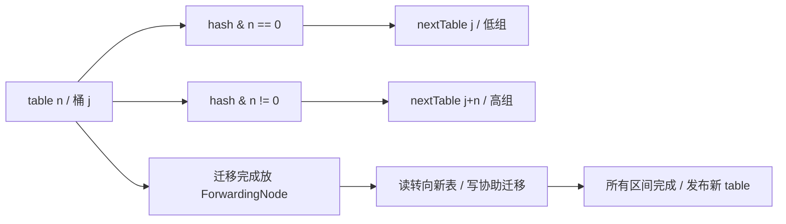

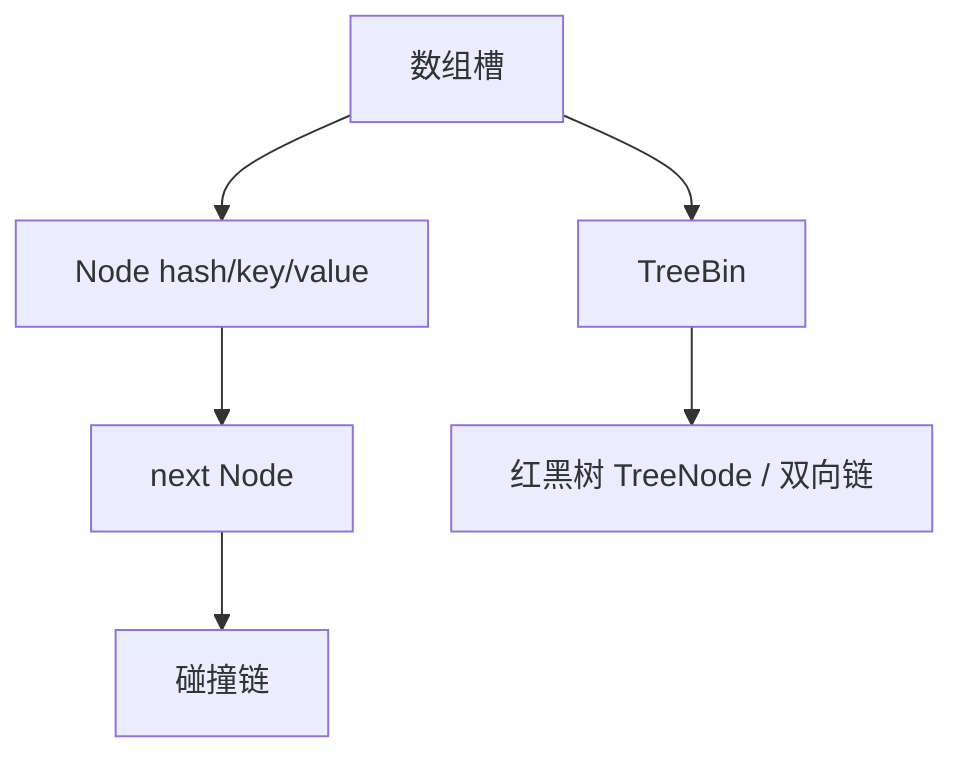

## 面试官三层追问

### 1. 为什么用 2 的幂容量和 hash 扰动？
<details markdown="1"><summary>展开三层参考答案</summary>

**第一层：**位与替代取模，扩容时利用单个位决定迁移目的地；扰动把高位信息混到低位，减少某些 hashCode 分布的集中。

**第二层：**hash 为 h XOR (h>>>16)，resize 按 oldCap 位拆链，既不重新调用用户 hashCode，也不必对每个元素做完整重新定位。恶劣 hashCode 仍可能制造碰撞。

**第三层：**提前估算容量可减少迁移峰值，但过度预分配增加内存和遍历成本。外部输入场景要考虑碰撞攻击与 key 质量，不只盯平均 O(1)。
</details>

### 2. 树化阈值是 8，为何有时仍是链表？
<details markdown="1"><summary>展开三层参考答案</summary>

**第一层：**容量不足 64 时优先扩容，因为碰撞可能来自当前桶数太少。

**第二层：**putVal 的 binCount 从遍历位置计算，treeifyBin 的调用条件与插入前链长有关。树查找涉及 Comparable 判断和 tieBreakOrder，不能把每种 key 的所有路径都简化为严格 logN。

**第三层：**评估 key.hashCode 分布和内存成本；树节点比链节点重，树化是退化保护，不是鼓励故意制造碰撞。通过分布直方图而非仅 size 判断质量。
</details>

### 3. JDK 8 HashMap 没有迁移环，还安全吗？
<details markdown="1"><summary>展开三层参考答案</summary>

**第一层：**不安全；解决一种历史死循环原因不等于增加线程同步。

**第二层：**多个 put 可能同时认为桶空而相互覆盖，size++ 非原子，resize 与读写缺乏 happens-before。modCount 和 fail-fast 也没有互斥功能。

**第三层：**配置快照可构建 HashMap 后通过 volatile 引用发布并禁止修改；动态共享映射采用 CHM，但跨 key 不变量仍需业务锁或数据库事务。关联阅读：<a href="#c1">JMM</a>。
</details>

### 4. CHM 扩容期间 get 会不会漏数据？
<details markdown="1"><summary>展开三层参考答案</summary>

**第一层：**迁移通过旧桶 ForwardingNode 把查找引导到新表，使迁移阶段仍可读。

**第二层：**transfer 持桶锁拆低/高链，先发布新表槽，再把旧槽替换为 forwarding；空旧槽也会被标记。读线程遇到 MOVED 通过 find 继续查找，不是必须等待所有扩容完成。

**第三层：**单 key 操作有容器的并发保证，但两次 get 之间仍可发生业务修改，不能假定批量一致。容量规划避免峰值请求时频繁扩容，测 CPU、分配率和 p99。
</details>

### 5. computeIfAbsent 能用来加载远程数据吗？
<details markdown="1"><summary>展开三层参考答案</summary>

**第一层：**可以执行映射函数，但慢 IO 不宜放在其中；它会阻塞其他相同 key 或碰撞桶的更新。

**第二层：**JDK 8 使用 ReservationNode 和桶锁等机制保证安装的原子性，函数不能递归更新 Map。异常和 null 会让以后调用再次计算，不能保证外部副作用只执行一次。

**第三层：**将 Map 值设计为快速安装的 Future/加载占位，实际 IO 使用有界执行器，失败移除时使用 remove(key, sameFuture)，配合超时和容量上限；优先采用成熟缓存库的加载协议。
</details>

### 6. size 能作为并发限流依据吗？
<details markdown="1"><summary>展开三层参考答案</summary>

**第一层：**不能把 `size() < limit` 后 put 当成原子检查与修改，两线程都可通过判断。

**第二层：**sumCount 对 baseCount 和 CounterCell 求和没有锁住写线程，结果是估计。即使某次读取准确，下一次 put 前条件也可能已变化。

**第三层：**容量准入使用 Semaphore、独立原子计数的 CAS 条件操作，或把额度与插入放在同一同步协议中。失败、取消、过期必须释放额度，避免 Map 和计数不一致。
</details>

## 模拟生产案例：缓存加载造成桶级阻塞

**故障现象：**服务使用 computeIfAbsent 加载用户画像，下游超时后无关用户也出现长延迟。**排查思路：**比较多个线程栈的阻塞 Monitor 地址，采样 key hash 与 CHM 桶分布，排除全局线程池满。**原理分析：**映射函数在 JDK 8 桶锁路径内调用，碰撞 key 共享等待点。**根因与验证证据：**模拟 key 固定 hashCode，一个慢加载线程持有 Node Monitor，其他不同 key 停在 computeIfAbsent；修改 key 哈希只能减少概率，将 IO 移出锁后才消除长持锁。**解决方案：**短操作安装 Future，占位与完成分离，失败按值身份删除，设置下游超时。**长期预防：**缓存大小上限、加载并发隔离、哈希分布和尾延迟压测；热点 key 使用同 key single-flight，但不能把跨 key IO 串行化。

## 面试回答与核心总结

### 60 秒快速回答

JDK 8 HashMap 是数组、链表、红黑树，按 2 的幂定位，扩容按旧容量位拆成两组；容量不足 64 时树化会先扩容。它仍然并发不安全。CHM 空桶 CAS、非空桶锁桶，读通过 volatile 节点与 ForwardingNode 在扩容时继续查找；transferIndex 支持多线程协作。size 是并发估计，computeIfAbsent 应避免慢 IO 和递归修改，容器原子性不等于业务事务。

### 2～3 分钟深入回答

从一个 key 的 put 讲 hash 扰动、桶定位和相等判断，再手算 n=16 时 hash 的第 5 位如何决定迁移到 j 或 j+16。解释树化同时受链长和容量限制，JDK 7 环与 JDK 8 丢更新是不同风险。随后沿 CHM.putVal 讲 initTable、空槽 CAS、锁头校验、addCount 和迁移触发，说明 nextTable、transferIndex、ForwardingNode 的发布顺序。结尾用慢 computeIfAbsent 案例指出性能边界，并给出异步占位、失败清理和容量控制。

如果面试官问一致性，我会明确 CHM 的原子 API 覆盖单 key 操作，不覆盖多个 key 的业务不变量。size 只是并发估计，先检查容量再插入会竞态；映射函数也不能承担外部副作用恰好一次。生产场景中先找 key 分布、桶锁持有时间与扩容热点，慢加载用快速安装 Future 再隔离 IO，失败按值身份清理。这个方案仍要有容量和超时，避免缓存加载从锁竞争变成无界 Future 队列。

### 高频追问、常见错误与速记

高频追问：为什么不能放 null？为什么 key 必须稳定？扩容时谁发布新 table？常见错误：CHM“完全无锁”；负 sizeCtl“就是线程数”；size 与 put 组成限额；把 computeIfAbsent 当业务去重。高频源码：HashMap.hash/putVal/resize/treeifyBin，ConcurrentHashMap.putVal/transfer/helpTransfer/addCount/sumCount/computeIfAbsent。核心知识：**桶定位→发布与锁→协作迁移→单操作与业务边界**。


## 官方资料与版本来源

联网核对日期：2026-10-08。固定版本用于解释实现，不代表最新生产推荐版本。源码摘录版权见 [source-notices.txt](./source-notices.txt)，下载记录与摘要见 [sources.json](./sources.json)。

- [HashMap.hash · OpenJDK 8u462-b08](https://raw.githubusercontent.com/openjdk/jdk8u/jdk8u462-b08/jdk/src/share/classes/java/util/HashMap.java)
- [ConcurrentHashMap.transfer · OpenJDK 8u462-b08](https://raw.githubusercontent.com/openjdk/jdk8u/jdk8u462-b08/jdk/src/share/classes/java/util/concurrent/ConcurrentHashMap.java)


---

# JVM 内存管理、CMS 与 G1

版本基线：HotSpot OpenJDK 8u462-b08。JDK 8 服务端默认收集器通常为 Parallel GC，G1 需显式选择；不要把 JDK 9 的默认 G1 或更新版本的并行 Full GC 套回本章。

## 核心知识与原理

### 内存、对象分配与安全点

线程私有区域包括程序计数器、Java 虚拟机栈和本地方法栈；共享区域包括堆和方法区。JDK 8 HotSpot 用本地内存中的 Metaspace 实现类元数据存储，字符串常量池中的字符串对象在堆中；不是所有“方法区相关数据”都在 Metaspace。对象可能通过逃逸分析和标量替换消除分配，不能保证每个 new 都产生可观察的堆对象。

普通小对象优先在 Eden 分配，TLAB 为线程提供局部 bump-pointer 分配区域，减少共享指针竞争；TLAB 本身仍是堆空间，不是线程私有堆外内存。TLAB 失败可以走慢路径，在堆上分配或触发 GC。晋升受年龄、Survivor 容量、动态年龄及收集器政策影响，不一定熬到固定年龄。G1 的 Humongous 对象在超过半个 Region 时使用连续 Region，存在空间与碎片代价，不能只看总空闲字节。

可达性从 GC Roots 沿引用图遍历，Roots 包括线程栈、JNI handle 和活跃类相关引用等；对象互相引用但整体不可达仍可回收。安全点保证线程状态可被 GC 正确识别，并非在任意指令处随意停止。STW 时间还可能包含到达安全点的等待，诊断需区分进入停顿与 GC 工作时间。

### CMS：并发并不意味着无停顿

CMS 主要回收老年代，Young 通常搭配 ParNew。初始标记 STW 建立起点；并发标记跟应用同时执行；预清理减少最终重新标记工作，可中止预清理尝试避开不利时机；重新标记 STW 修正并发期间变化；并发清扫回收空闲块；重置准备下一轮。CMS 是标记清扫，正常周期不整理内存，会有碎片。并发时产生浮动垃圾，必须给应用分配和晋升留余量。

Concurrent Mode Failure 通常说明并发回收跟不上分配/晋升，或者可用块不足等，使 CMS 被迫转入前台回收路径；Promotion Failed 是 Young 搬迁晋升时失败，两个日志术语有联系但不应混为一谈。应同时看老年代占用、碎片、分配速率、CMS 起始点、CPU 和日志触发原因，而不是把所有 Full GC 都归咎于触发阈值。增加 CMS 并发线程会争抢应用 CPU，阈值降低也可能增加回收频率。

### G1：Region、RSet 与 SATB

G1 把堆划成等大小 Region，Eden、Survivor、Old 是动态角色。Card Table 用较粗的卡标识发生引用更新的区域，RSet 记录哪些其他区域可能指向当前 Region，使回收选定集合时无需扫描全堆；RSet 不是“当前 Region 引用别处”的完整精确列表。维护与 refinement 会消耗 CPU 和内存。

Young GC 是 STW evacuation，把存活对象复制到 Survivor 或 Old。并发标记使用 SATB 保留标记开始时快照的可达性：写前屏障记录被覆盖的旧引用，不是记录新引用来构造最新快照。初始标记一般搭在一次 Young 停顿上，随后 root region scan、并发标记、STW remark、cleanup；cleanup 部分工作停顿、部分并发。Mixed GC 在完成标记后选择 Young 与一部分收益高的 Old Region，不等于回收全部 Old。

G1 用历史成本估计回收集合，在 `MaxGCPauseMillis` 目标和回收收益之间选择 Region；目标不是硬实时 SLA。RSet 扫描、存活复制、巨型对象和 CPU 不足都可能使预测失准。to-space exhausted 表示 evacuation 目的空间不足，失败处理增加成本，严重情况下退化 Full GC；JDK 8 G1 Full GC 是单线程的整理路径，应避免套用较新版本并行 Full GC。部分 8u 更新对巨型对象回收等有差异，判断具体日志必须固定更新号。

### CMS 与 G1 的选择

|维度|CMS（JDK 8）|G1（JDK 8）|
|---|---|---|
|主要布局|连续分代，老年代 free-list|分区，代角色可变|
|正常老年代回收|并发标记清扫，不压缩|并发标记后 STW 分批 evacuation|
|典型风险|浮动垃圾、碎片、并发模式失败|RSet 成本、目的空间不足、Humongous|
|停顿目标|通过提前回收与并发降低停顿|预测模型选择回收集合，软目标|
|适用判断|已有成熟调优且堆/分配较稳定|较大堆、需要分批回收老年代，但仍须压测|

收集器选择要基于真实存活率和停顿预算。不能承诺“换 G1 自动解决内存泄漏”；泄漏根引用必须在<a href="#c4">OOM 排查</a>中处理。

### 调优推演：空间预算比单个阈值更重要

假设 CMS 一轮并发周期 4 秒，峰值晋升/老年代分配速率 200MB/s，至少需要考虑这段时间约 800MB 的新增压力，再留浮动垃圾和突发余量；这不是精确参数公式，而是检查“启动时还剩 300MB 为什么来不及”的容量逻辑。CPU 被容器限额压低时周期拉长，同一堆配置也会失败。G1 则同时考虑标记启动至 Mixed 释放空间期间的增长，以及下一次 evacuation 的目的空间，不能只用 Old 占比做一个阈值。

验证采用同负载、同 CPU 配额、同存活数据集对照，逐次只改有证据的参数。把 Young 停顿、remark、Mixed、Full、safepoint 等分开统计；更频繁的短停顿可能降低单次 p99 却提高总 GC CPU。调参记录应包含 JVM 命令行、更新号、Region 大小、负载分布与日志，防止版本或容器容量变化被误判为参数收益。

## 源码级解析与调用链

CMS 的 `CMSCollector::collect_in_background` 按状态推进 InitialMarking、Marking、Precleaning、AbortablePreclean、FinalMarking、Sweeping、Resizing/Resetting 等路径，并在需要 STW 的阶段交给 VM operation。G1 的 `G1CollectedHeap::do_collection_pause_at_safepoint` 负责 evacuation pause 主过程，`G1CollectorPolicy` 估计成本并选择集合，`ConcurrentMark` 维护并发标记，`G1SATBCardTableModRefBS` 关联屏障。GC 算法实际在 HotSpot C++ 层，不能只引用 Java System.gc 当源码分析。


**源码原文连续节选：CMSCollector::collect_in_background · HotSpot 8u462-b08 · L2256–L2274**（保留逻辑，仅规范显示缩进，可能止于方法中间；[完整上下文](https://github.com/openjdk/jdk8u/blob/jdk8u462-b08/hotspot/src/share/vm/gc_implementation/concurrentMarkSweep/concurrentMarkSweepGeneration.cpp#L2256-L2274)）。

```cpp
void CMSCollector::collect_in_background(bool clear_all_soft_refs, GCCause::Cause cause) {
  assert(Thread::current()->is_ConcurrentGC_thread(),
    "A CMS asynchronous collection is only allowed on a CMS thread.");

  GenCollectedHeap* gch = GenCollectedHeap::heap();
  {
    bool safepoint_check = Mutex::_no_safepoint_check_flag;
    MutexLockerEx hl(Heap_lock, safepoint_check);
    FreelistLocker fll(this);
    MutexLockerEx x(CGC_lock, safepoint_check);
    if (_foregroundGCIsActive || !UseAsyncConcMarkSweepGC) {
      // The foreground collector is active or we're
      // not using asynchronous collections.  Skip this
      // background collection.
      assert(!_foregroundGCShouldWait, "Should be clear");
      return;
    } else {
      assert(_collectorState == Idling, "Should be idling before start.");
      _collectorState = InitialMarking;
```


**源码原文连续节选：G1CollectedHeap::do_collection_pause_at_safepoint · HotSpot 8u462-b08 · L3972–L3990**（保留逻辑，仅规范显示缩进，可能止于方法中间；[完整上下文](https://github.com/openjdk/jdk8u/blob/jdk8u462-b08/hotspot/src/share/vm/gc_implementation/g1/g1CollectedHeap.cpp#L3972-L3990)）。

```cpp
bool
G1CollectedHeap::do_collection_pause_at_safepoint(double target_pause_time_ms) {
  assert_at_safepoint(true /* should_be_vm_thread */);
  guarantee(!is_gc_active(), "collection is not reentrant");

  if (GC_locker::check_active_before_gc()) {
    return false;
  }

  _gc_timer_stw->register_gc_start();

  _gc_tracer_stw->report_gc_start(gc_cause(), _gc_timer_stw->gc_start());

  SvcGCMarker sgcm(SvcGCMarker::MINOR);
  ResourceMark rm;

  print_heap_before_gc();
  trace_heap_before_gc(_gc_tracer_stw);

```


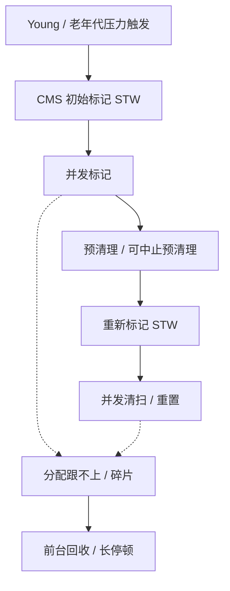

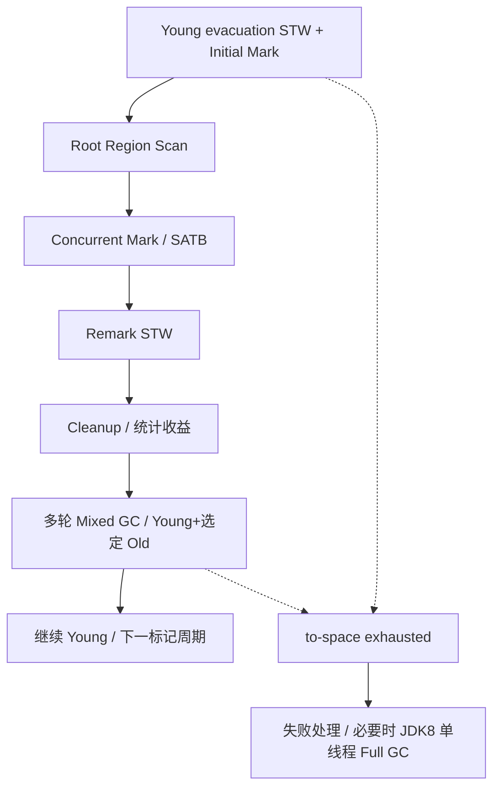

## 面试官三层追问

### 1. TLAB 会不会导致线程间对象无法访问？
<details markdown="1"><summary>展开三层参考答案</summary>

**第一层：**不会。TLAB 是线程分配区域，分配出的对象仍在共享堆中，发布后可被其他线程引用。

**第二层：**线程通过局部分配指针减少全局同步，剩余空间不足时 refill 或走慢路径。TLAB 所有权是分配机制，不是对象生命周期与可见性机制。

**第三层：**高分配场景看分配速率、TLAB waste 与 GC 成本；跨线程传递仍需 JMM 安全发布。盲目关闭 TLAB 可能增加竞争，应以压测证明。
</details>

### 2. CMS 为什么重新标记，为什么产生浮动垃圾？
<details markdown="1"><summary>展开三层参考答案</summary>

**第一层：**并发标记中应用改变引用，需要最后修正；已标记对象后来变成垃圾，本轮通常无法全部识别，所以留到下一轮。

**第二层：**CMS 利用写屏障和卡标记等补充变化，FinalMarking 停顿处理未完成的标记工作。它不使用 G1 的同一套 SATB 协议，不能机械套一个三色描述。

**第三层：**老年代不能等接近满才启动；根据晋升速率×周期时间预留空间。remark 长要看 Young 状态、脏卡和引用处理，不应只调一个起始阈值。
</details>

### 3. Concurrent Mode Failure 如何定位？
<details markdown="1"><summary>展开三层参考答案</summary>

**第一层：**并发 CMS 无法及时释放足够可用空间，应用需要分配时退化到前台回收，导致长停顿。

**第二层：**核对日志触发原因、并发周期耗时、老年代 free-list/碎片和 Young 晋升。总空闲空间足够却缺合适块，也可能出现分配问题。

**第三层：**先消除突发分配和泄漏，再评估提前触发、CPU 预算或 G1 迁移。恢复动作限流并留诊断证据，不能每次重启后宣称已修复。
</details>

### 4. G1 的 RSet 和 SATB 有何区别？
<details markdown="1"><summary>展开三层参考答案</summary>

**第一层：**RSet 帮助选定 Region 回收时查找外部入引用；SATB 保障并发标记过程中快照可达性，两者目标不同。

**第二层：**SATB 写前记录旧引用，卡屏障及 refinement 维护跨 Region 引用信息。RSet 的精度和成本受卡粒度影响，不能说它是完整对象引用图。

**第三层：**大量跨代/跨 Region 引用可能提高 remembered set 扫描成本；标记与扫描耗时应分别诊断。改变对象布局和减少长寿命容器持短命对象比随机调 Region 大小更有依据。
</details>

### 5. Mixed GC 是否等于 Full GC？
<details markdown="1"><summary>展开三层参考答案</summary>

**第一层：**不是。Mixed 分批回收 Young 和部分 Old；Full GC 扫描整理整个堆，是不同路径。

**第二层：**Mixed 根据标记结果、存活率与暂停预算选择 Old Region。JDK 8 G1 Full GC 单线程，目的空间失败等问题可能使它发生，不能拿新 JDK 的实现解释。

**第三层：**要看 Mixed 是否真正释放容量、标记是否启动过晚、Humongous 是否占据连续空间；通过存活字节和复制成本判断收益，不只数 GC 次数。
</details>

### 6. 如何制定 GC 的停顿目标？
<details markdown="1"><summary>展开三层参考答案</summary>

**第一层：**从服务端到端延迟预算减去网络、排队和依赖预算，得出可接受的 GC 停顿，而不是统一设置 10ms。

**第二层：**G1 的预测基于历史成本，过低目标可能减小 Young、增加 GC 频率和吞吐损失；并发线程也会占 CPU。Soft goal 不保证每次达标。

**第三层：**记录 p99/p999 停顿、总 GC CPU、分配率、存活率和业务尾延迟，使用真实流量模型验证。若需要严格低延迟，应评估整体架构与升级路线，但本章结论限定 JDK 8。
</details>

## 模拟生产案例：大报表使 G1 退化

**故障现象：**报表并发增大后出现 to-space exhausted，随后长 Full GC，堆总空闲看起来尚有空间。**排查思路：**收集 JDK 8 G1 日志、对象直方图与 allocation profile，检查 Region 大小和大数组尺寸。**原理分析：**大数组进入 Humongous，连续 Region 需求及高存活对象降低可迁移空间；evacuation 需要预留目的容量。**根因与验证证据：**模拟把报表全部读成 byte[]，数组尺寸超过半 Region；限制并发与流式输出后 Humongous 占用下降，目的空间失败消失。**解决方案：**限流、分批查询、流式生成，评估 reserve 与标记起点，不先粗暴增堆。**长期预防：**容量测试包含大报表和慢客户端，监控 Humongous、Old 增长及标记周期；记录进程 RSS，避免增加堆挤占本地内存。

## 面试回答与核心总结

### 60 秒快速回答

JDK 8 对象通常在 Eden/TLAB 分配，GC 按可达性回收，安全点保障扫描。CMS 老年代并发标记清扫，初标和重标停顿，存在浮动垃圾、碎片和 Concurrent Mode Failure。G1 分 Region，RSet 定位外部入引用，SATB 保持标记快照；Young 和 Mixed 都进行停顿复制，Mixed 分批带上 Old。停顿目标是软目标，JDK 8 G1 Full GC 单线程，调优必须保留分配和迁移空间。

### 2～3 分钟深入回答

从对象进入 TLAB 到 Survivor 与晋升讲分配链，再说明 GC Roots 与安全点；沿 CMS 状态机解释并发期间引用变化为何要重标、浮动垃圾为什么留待后续，以及 free-list 为什么有碎片。切换到 G1 的 Region 和卡/RSet，分别解释 evacuation 与 SATB 并发标记。最后用报表大数组说明 Humongous、连续空间和 to-space 的区别，给出限流、流式化、保留迁移余量与日志验证的调优顺序。

如果追问如何调优，我会先说明分配速率、存活率、CPU 配额和周期时间决定所需余量。CMS 一轮需要数秒，期间仍有晋升与浮动垃圾，老年代太晚启动来不及；G1 标记后还要等 Mixed 才逐步释放，另需 evacuation 空间。过低暂停目标会改变 Young 和频率，改善单次暂停可能牺牲吞吐。最终用同负载的 GC CPU、停顿分位数、业务尾延迟和存活基线验证，而不是用一次日志宣称参数最佳。

### 高频追问、常见错误与速记

高频追问：G1 为什么不是硬实时？CMS failure 与 promotion failure 是否相同？安全点时间怎么分解？常见错误：JDK8 默认 G1；G1 Full GC 并行；RSet 记录全部出引用；SATB 记录新引用；切换收集器治疗泄漏。源码：CMSCollector::collect_in_background，G1CollectedHeap::do_collection_pause_at_safepoint，G1CollectorPolicy，ConcurrentMark。核心知识：**可达性→并发标记正确性→复制/清扫→空间预算与退化**。


## 官方资料与版本来源

联网核对日期：2026-10-08。固定版本用于解释实现，不代表最新生产推荐版本。源码摘录版权见 [source-notices.txt](./source-notices.txt)，下载记录与摘要见 [sources.json](./sources.json)。

- [CMSCollector::collect_in_background · HotSpot 8u462-b08](https://raw.githubusercontent.com/openjdk/jdk8u/jdk8u462-b08/hotspot/src/share/vm/gc_implementation/concurrentMarkSweep/concurrentMarkSweepGeneration.cpp)
- [G1CollectedHeap::do_collection_pause_at_safepoint · HotSpot 8u462-b08](https://raw.githubusercontent.com/openjdk/jdk8u/jdk8u462-b08/hotspot/src/share/vm/gc_implementation/g1/g1CollectedHeap.cpp)
- [Oracle JDK8 GC Tuning Guide](https://docs.oracle.com/javase/8/docs/technotes/guides/vm/gctuning/)


---

# JVM OOM 与生产故障排查

版本基线：OpenJDK 8u462-b08，Netty 4.1.108.Final；XStream 1.4.4 的反射问题只作版本明确的机制案例，不推荐生产继续使用该旧版。诊断目标是证明谁持有资源、增长是否可回收以及修复是否改变增长曲线。

## 核心知识与原理

### OOM 类型与第一步证据

|报错/现象|资源与常见原因|首要证据|
|---|---|---|
|Java heap space|存活对象太多、缓存/队列无界、单次大分配|GC 前后占用、dump dominator、分配速率|
|GC overhead limit exceeded|部分收集器长时间高 GC 成本且回收极少|GC 日志和收集器；不是所有 GC 的统一报错|
|Metaspace|类元数据、ClassLoader 泄漏、动态类生成|类加载/卸载趋势、loader 引用链、元空间 committed|
|Direct buffer memory|Bits 计数受 MaxDirectMemorySize 限制|BufferPoolMXBean、分配调用栈、释放机制|
|unable to create new native thread|线程数量、进程/用户限制、地址空间或本地内存不足|线程数、ulimit/cgroup pids、RSS 与栈配置|
|容器 OOMKilled|进程总内存超出容器限制|cgroup memory 事件和容器终止原因；可能没有 Java OOM|

heap OOM 不一定是泄漏：合法存活数据超出预算也是容量不足。RSS 不等于堆占用；包括 Java 堆、Metaspace、线程栈、Code Cache、Direct buffer、native 库及 allocator 开销等。NMT 记录 HotSpot 的内存类别与保留/提交，不承诺覆盖全部第三方 native 分配，也不能直接等同实际 RSS。

### DirectByteBuffer、Cleaner 与 Netty

JDK 8 DirectByteBuffer 分配走 Bits.reserveMemory，再通过 Unsafe 分配并注册 Cleaner；Cleaner 的 Deallocator 释放 native 地址并 unreserveMemory。Bits 同时维护 reservedMemory、totalCapacity 与 count；限制比较的是 totalCapacity，页对齐会令实际分配字节与 capacity 不同。分配失败会尝试引用处理、System.gc 和退避后抛 OOM，不能假定 System.gc 一定立即释放。

Netty ByteBuf 是独立的引用计数协议，retain 增计数，release 降计数至零才交还资源。池化内存交回 arena 未必立刻还给操作系统，因此 RSS 高但稳定不等于泄漏。ByteBuf 在 handler 间转移所有权、异步任务保留引用时最容易漏 release；SimpleChannelInboundHandler 默认 autoRelease 与手动 release 混用又可能双重释放。Netty 使用不同 allocator / no-cleaner 路径时，不保证全部出现在标准 Direct BufferPool 计数里，须同时看 allocator metrics 与 JVM 指标。

```java
// 业务示例：这里约定当前 handler 拥有 buf，异步任务继承所有权。
ByteBuf retained = buf.retain();
try {
    executor.execute(() -> {
        try { process(retained); }
        finally { retained.release(); }
    });
} catch (RejectedExecutionException e) {
    retained.release(); // 提交失败也必须回收新增引用
    throw e;
} finally {
    buf.release(); // 仅适用于当前 handler 应自行释放的所有权约定
}
```

### 类加载与 XStream 机制边界

旧版 XStream 某些反射创建对象路径缓存序列化构造器；实例反复创建可能导致构造器重复生成或关联反射访问器生成，增加类元数据压力。HotSpot 8 反射有 inflation/native 与生成访问器的分支，serialization constructor 的路径也有自身行为，不能把所有反射调用都统一说成“超过 15 次才生成”。必须核对 JVM 属性、实际 ReflectionProvider、调用栈和版本。

类元数据增多可能推高元空间高水位并触发 GC；类能否卸载取决于 ClassLoader 可达性和收集器配置。长期 ClassLoader 被 ThreadLocal、线程 contextClassLoader、静态注册表持有时，扩 MaxMetaspaceSize 只延迟 OOM。复用合理配置的 XStream 实例可能降低重复构造成本，但安全配置、线程使用方式及版本升级必须评估；不能声称“XStream 每次调用都必然泄漏 Metaspace”。

### 诊断推演：两个相似现象的不同根因

同样是 RSS 上升，情况 A 的 GC 后 heap 基线一起增长，MAT 中队列支配多数存活对象，优先处理任务积压；情况 B 的 heap、Direct 在用与线程都稳定，RSS 在池化分配后形成平台，可能是 allocator/池保留，不能凭高 RSS 就删除缓存。若 NMT 的 Class 类别随类数量增长，再进一步看 loader 与代理生成；若线程类别和 pids 同时上升，检查线程创建而不是索取 heap dump 作为唯一证据。

根因验证至少需要三件事：可复现触发条件、代码持有/分配路径、修复后资源增长停止且业务结果正确。泄漏修复若通过提前 release 使对象仍被下游使用，会从 OOM 变成 use-after-release，这不算通过验证。dump 和日志只是证据载体，不能用“MAT 第一名是 byte[]”代替解释哪个请求/缓存/缓冲区拥有它。

## 源码级解析与排查调用链

`ByteBuffer.allocateDirect → DirectByteBuffer.<init> → Bits.reserveMemory → Unsafe.allocateMemory → Cleaner.create`；释放从引用处理触发 Cleaner，再执行 Deallocator.run。Netty 的 `AbstractReferenceCountedByteBuf.release → ReferenceCountUpdater.release → deallocate` 是另一条链，JVM Cleaner 不能替应用弥补所有遗漏的 reference count。


**源码原文连续节选：Bits.tryReserveMemory · OpenJDK 8u462-b08 · L705–L718**（保留逻辑，仅规范显示缩进，可能止于方法中间；[完整上下文](https://github.com/openjdk/jdk8u/blob/jdk8u462-b08/jdk/src/share/classes/java/nio/Bits.java#L705-L718)）。

```java
    private static boolean tryReserveMemory(long size, int cap) {

        // -XX:MaxDirectMemorySize limits the total capacity rather than the
        // actual memory usage, which will differ when buffers are page
        // aligned.
        long totalCap;
        while (cap <= maxMemory - (totalCap = totalCapacity.get())) {
            if (totalCapacity.compareAndSet(totalCap, totalCap + cap)) {
                reservedMemory.addAndGet(size);
                count.incrementAndGet();
                return true;
            }
        }

```


**源码原文连续节选：Sun14ReflectionProvider.getMungedConstructor · XStream 1.4.4 / c4c7122 · L91–L101**（保留逻辑，仅规范显示缩进，可能止于方法中间；[完整上下文](https://github.com/x-stream/xstream/blob/c4c71226515fa42809a48d9ae702756e2831f379/xstream/src/java/com/thoughtworks/xstream/converters/reflection/Sun14ReflectionProvider.java#L91-L101)）。

```java
    private Constructor getMungedConstructor(Class type) throws NoSuchMethodException {
        synchronized (constructorCache) {
            Constructor ctor = (Constructor)constructorCache.get(type);
            if (ctor == null) {
                ctor = reflectionFactory.newConstructorForSerialization(type, Object.class.getDeclaredConstructor(new Class[0]));
                constructorCache.put(type, ctor);
            }
            return ctor;
        }
    }

```


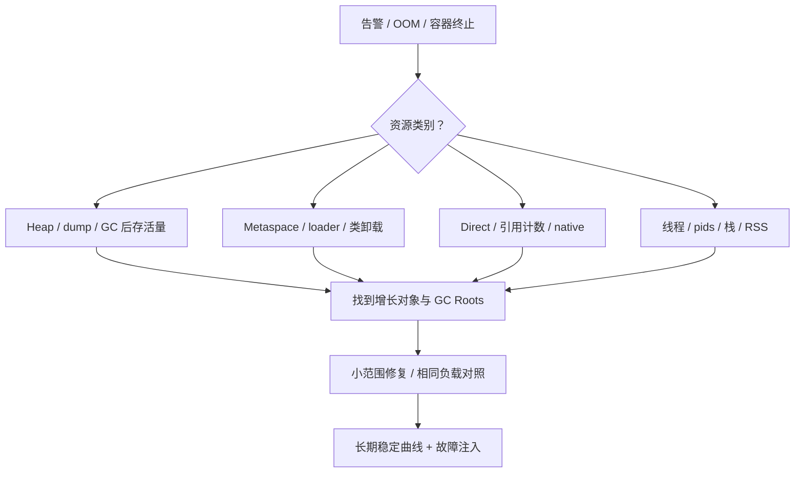

### 安全采样与根因验证

先保留时间线：流量、发布、线程、GC、RSS、限额；再做轻量采样，最后选择 dump。jmap heap dump 和部分 jcmd 操作可能停顿/触发 GC，生产需估算文件空间与影响；文件包含业务数据，按现有数据访问规则处理。MAT 看 dominator 的 retained heap 与 Path to GC Roots，不能仅按 shallow heap 排名；排除弱/软引用路径时须明确选项。

```shell
# JDK 8 诊断示例；替换 PID，先用 jcmd PID help 核对可用命令。
jstat -gcutil PID 1000 10
jstack -l PID > threads.txt
jcmd PID GC.class_histogram
jcmd PID VM.native_memory summary
# NMT 需要启动前设置 -XX:NativeMemoryTracking=summary，未开启不能事后补全历史。
jcmd PID VM.native_memory baseline
jcmd PID VM.native_memory summary.diff
jmap -dump:format=b,file=heap.hprof PID
```

JDK 8 常用 GC 启动选项：`-XX:+PrintGCDetails -XX:+PrintGCDateStamps -Xloggc:gc.log`，不是 JDK 9 的 `-Xlog:gc*`。日志关注回收前后容量、触发原因、Young/Old 趋势和停顿；“GC 后最低点长期升高”比“瞬时使用率高”更能支持存活集合增长的判断。

## 面试官三层追问

### 1. heap OOM 如何证明是泄漏？
<details markdown="1"><summary>展开三层参考答案</summary>

**第一层：**查看同等负载下 GC 后存活量是否持续增长，并找出不应该长期存活的对象及持有者。

**第二层：**MAT dominator 与 GC Roots 指出无界队列、静态集合或 ThreadLocal 的引用链；配合业务生命周期证明“本应释放”。大数组单次分配失败可能没有渐进泄漏。

**第三层：**复现相同负载，修复后验证 retained heap 平台化，检查功能正确性及错误/取消路径。只重启恢复或只增加堆不构成根因验证。
</details>

### 2. Direct OOM 时 heap 很空，为什么？
<details markdown="1"><summary>展开三层参考答案</summary>

**第一层：**直接缓冲区占 native memory，堆只持 wrapper；堆健康不能证明直接内存充足。

**第二层：**Bits 的容量限额、Cleaner 时机和 Netty allocator 的路径要分别核对。未 release 的池化 ByteBuf 可能无法回归池，部分路径不能仅靠 BufferPoolMXBean 观察。

**第三层：**建立进程内存预算，给 Direct、栈与类元数据留余量；检查所有权和异步失败分支，泄漏检测先在测试或受控流量使用高等级，注意采样成本。
</details>

### 3. Metaspace OOM 是否都是 ClassLoader 泄漏？
<details markdown="1"><summary>展开三层参考答案</summary>

**第一层：**不一定，动态生成类太多、限额太低或合理规模类集也可能超过预算。

**第二层：**比较类数量、卸载数量和 loader 数；一个长期 loader 生成大量类，与多个旧 loader 被引用滞留是不同模式。类卸载需要整个加载器生命周期满足条件。

**第三层：**限制动态类型组合、缓存/复用代理和序列化器、清理线程上下文，做多轮部署后 loader 回收测试。增元空间只在容量证据支持时使用。
</details>

### 4. native thread OOM 是不是增大堆能解决？
<details markdown="1"><summary>展开三层参考答案</summary>

**第一层：**通常不能，增堆反而挤占本地资源。先检查线程数量、系统限制与栈大小。

**第二层：**每线程需要栈和 native 结构；创建失败可能来自 pids/ulimit、地址空间或 native allocation。heap dump 不能单独回答创建失败原因。

**第三层：**限制线程池、连接和并行任务，避免每请求 new Thread；逐类建立容量预算。降低 Xss 需验证调用深度，不能引入 StackOverflowError。
</details>

### 5. NMT 与 MAT 如何配合？
<details markdown="1"><summary>展开三层参考答案</summary>

**第一层：**MAT 分析堆对象持有关系，NMT 分析 HotSpot native 类别趋势，两者视角互补。

**第二层：**NMT reserved 表示虚拟地址保留，committed 表示提交，不等于 RSS；第三方分配可能未完整记录。MAT retained heap 只含堆图可支配对象。

**第三层：**建立 NMT baseline 做差分，并同时间采集 RSS、Direct allocator 和线程。若差额主要来自 native 库，进一步用系统/allocator 工具，不能把未知差额硬说成 Direct 泄漏。
</details>

### 6. ThreadLocal 为什么需要 remove？
<details markdown="1"><summary>展开三层参考答案</summary>

**第一层：**线程池线程长期存活，ThreadLocal 的值可能跨请求残留，造成状态污染或内存滞留。

**第二层：**ThreadLocalMap entry 的 key 是弱引用，value 是强引用；key 清除后 value 不会自动同步清除，清理依赖 map 后续操作等路径。即使 key 仍活着，业务也应清理请求上下文。

**第三层：**在请求边界 finally remove，异步上下文显式传递并清理；检测线程复用下的数据源/租户串扰。关联阅读：<a href="#c5">Spring 事务上下文</a>与<a href="#c10">Reactor</a>。
</details>

## 模拟生产案例：异步日志持有 ByteBuf

**故障现象：**heap 稳定但 Direct 使用持续升高，伴随 Netty 分配失败；只在日志执行器拒绝时出现。**排查思路：**关联拒绝率、allocator usedDirectMemory 和泄漏检测栈，审计 retain/release 的每个出口。**原理分析：**为异步日志 retain 后，提交被拒绝，任务 finally 永远不会执行。**根因与验证证据：**模拟将队列设为很小并暂停消费，重复触发拒绝能稳定复现；补充提交失败的 release 后引用计数回到原值，长期负载增长停止。**解决方案：**提交失败立即释放新增引用，必要时复制少量日志字段而非持整个网络缓冲。**长期预防：**为拒绝、取消、异常、断连做所有权审查和测试，监控池化保留与实际在用，避免把保留池容量误报为泄漏。

## 面试回答与核心总结

### 60 秒快速回答

OOM 先按 heap、Metaspace、Direct、native thread 或容器限额分类，再保留流量、GC、RSS 与资源增长时间线。heap 用 MAT 看 dominator 和 Roots；Metaspace 看类与 loader；Direct 看 Bits/Cleaner 和 Netty 引用计数；线程看数量与系统限制。根因必须连接到持有代码，并用同负载修复前后曲线和失败路径复现验证，重启与扩容只算止血。

### 2～3 分钟深入回答

以 heap 空但 Direct OOM 开场，画出 wrapper 与 native 区域、Bits 限额和 Cleaner 释放链，再对比 ByteBuf 引用计数及池化保留，指出标准 JVM Direct 指标可能漏掉某些路径。随后展示拒绝分支遗漏 release 的证据链。扩大到全进程内存预算，解释 NMT reserved/committed、MAT retained heap 和 RSS 的差别，最后列出采样顺序、dump 影响、故障注入与长期告警。

对于 Metaspace，我会分大量动态类集中在一个 loader 与旧 loader 被持有两种情况，用类加载/卸载和引用链确认。旧版 XStream 还要看实际 ReflectionProvider 和序列化构造器缓存，不能把所有反射都归结为同一个 inflation 阈值。native thread 的失败则看 pids、ulimit、线程栈和总内存。恢复先限流保留证据，诊断操作考虑停顿和磁盘空间；修复后长期负载和失败路径都须验证，否则只是把一个泄漏窗口换成另一个。

### 高频追问、常见错误与速记

高频追问：Cleaner 何时执行？XStream 到底走哪种 provider？为什么 GC 后仍高 RSS？常见错误：用 JDK9 日志参数回答 JDK8；把每个 Full GC 当泄漏；NMT=RSS；认为 key 弱引用自动清掉 ThreadLocal value。源码：Bits.reserveMemory，DirectByteBuffer.Deallocator.run，AbstractReferenceCountedByteBuf.release，ThreadLocalMap.expungeStaleEntry。核心知识：**分类→趋势→持有链→代码→修复对照**。


## 官方资料与版本来源

联网核对日期：2026-10-08。固定版本用于解释实现，不代表最新生产推荐版本。源码摘录版权见 [source-notices.txt](./source-notices.txt)，下载记录与摘要见 [sources.json](./sources.json)。

- [Bits.tryReserveMemory · OpenJDK 8u462-b08](https://raw.githubusercontent.com/openjdk/jdk8u/jdk8u462-b08/jdk/src/share/classes/java/nio/Bits.java)
- [Sun14ReflectionProvider.getMungedConstructor · XStream 1.4.4 / c4c7122](https://raw.githubusercontent.com/x-stream/xstream/c4c71226515fa42809a48d9ae702756e2831f379/xstream/src/java/com/thoughtworks/xstream/converters/reflection/Sun14ReflectionProvider.java)
- [Netty 引用计数指南](https://netty.io/wiki/reference-counted-objects.html)


---

# Spring 核心原理与事务

版本基线：Spring Framework 5.3.31、Spring Boot 2.7.18。Spring 的代理、线程绑定和数据库事务是三个层次；容器能创建对象，不意味着每次调用都穿过代理。

## 核心知识与原理

### IoC、生命周期与循环依赖

BeanFactory 提供 Bean 获取与定义管理，ApplicationContext 进一步组织资源、事件、国际化以及容器启动。`AbstractApplicationContext.refresh` 依次准备容器、执行 BeanFactoryPostProcessor、注册 BeanPostProcessor、初始化非懒单例等。前者主要修改 BeanDefinition，后者介入 Bean 实例创建；把它们混淆会无法解释自动代理发生在哪一步。

`AbstractAutowireCapableBeanFactory.doCreateBean` 先实例化，必要时放置 early reference 工厂，再 populateBean 注入，最后 initializeBean 执行 aware、前置处理、初始化回调及后置处理。初始化回调通常包括 @PostConstruct、InitializingBean.afterPropertiesSet 和自定义 initMethod，具体由相关处理器和容器路径协调。销毁回调由容器管理的生命周期负责，prototype 取出后的销毁通常交给调用者，不像 singleton 一样自动统一回收。

三级缓存分别为 singletonObjects（完整单例）、earlySingletonObjects（早期引用）、singletonFactories（早期引用工厂）。工厂用于延迟调用 getEarlyBeanReference，允许自动代理处理器对早期暴露对象创建一致的代理。它解决部分 singleton setter/字段循环，并不解决构造器循环、prototype 循环，也不能保证涉及所有后处理器的复杂循环都能成功。Boot 2.7 默认禁止循环引用；框架有能力与应用默认策略必须分开说。开放配置只能作为受控遗留迁移措施，优先拆依赖或显式延迟。

### 动态代理与 AOP

JDK Proxy 基于接口，CGLIB 基于子类。Spring AOP 选择受到配置和目标类型影响，Boot 默认倾向使用类代理，不能笼统说“有接口就一定 JDK”。CGLIB 无法拦截 final 方法，也无法覆盖 private 方法。AOP 链通过拦截器组织前后增强；同类内部 this 调用没有重新经过外部代理，注解存在也可能不生效。

### 事务拦截、传播与线程上下文

`TransactionInterceptor.invoke → TransactionAspectSupport.invokeWithinTransaction` 解析 TransactionAttribute 和 PlatformTransactionManager，创建/加入事务，执行 invocation，异常时决定回滚，正常时提交，finally 恢复上下文。DataSourceTransactionManager 将 ConnectionHolder 按 DataSource 绑定到 TransactionSynchronizationManager 的 ThreadLocal 资源表；SqlSession/DAO 必须从兼容路径取得该连接，自己 new 连接可能脱离事务。

默认 RuntimeException/Error 回滚，checked exception 需要 rollbackFor 等规则。捕获异常并返回成功可能提交；内层 REQUIRED 标记 rollback-only，外层即使捕获异常，最终也可能 UnexpectedRollbackException。REQUIRED 加入当前事务，REQUIRES_NEW 挂起外层并开启新连接，外层连接仍占用，可能耗尽池；NESTED 在 JDBC 事务管理器支持 savepoint 时使用保存点，不是所有 manager 都支持。事务隔离作用于新建物理事务，加入现有事务时不能假定注解的隔离级别被重新应用。

非 public 方法在标准代理事务配置下通常不会匹配，本章以 public 方法为边界；自调用、非 Spring 管理对象、错误 manager、异常规则、异步换线程、数据库引擎不支持事务都可能让预期失败。ThreadLocal 不会自动穿过 CompletableFuture 或 Reactor 的线程切换，Reactor 事务应使用支持的 reactive manager/context，不能把 JDBC 事务当成跨线程全局状态。

### Boot 自动配置与 MVC

Boot 2.7 的 AutoConfigurationImportSelector.getCandidateConfigurations 同时加载 spring.factories 候选和 `META-INF/spring/org.springframework.boot.autoconfigure.AutoConfiguration.imports` 候选，并去重、过滤、排序。不能说 2.7 完全移除 spring.factories，也不能用 Boot 3 的行为代替。条件如 @ConditionalOnClass/@ConditionalOnMissingBean 决定配置生效；诊断用条件报告，自动配置不是“扫描所有 jar 里所有类”。

MVC `DispatcherServlet.doDispatch → getHandler → getHandlerAdapter → HandlerAdapter.handle → 参数解析/调用 → 返回值处理 → processDispatchResult`；拦截器 preHandle 在 handler 前，postHandle 在正常返回后，afterCompletion 做完成清理。过滤器属于 Servlet 链，更早处理请求。@ResponseBody 经 HttpMessageConverter 写响应，而视图返回交给 ViewResolver；异步请求有后续 dispatch，线程上下文应按边界清理。

### 事务推演：注解隔离级别为何可能被忽略

外层 REQUIRED 已开启一个 RC 事务，内层 REQUIRED 标注 RR，默认是加入既有物理事务，而不是把同一 Connection 临时变成 RR 再恢复。若启用现有事务校验，冲突设置可以被拒绝；没有校验也不意味着内层获得声明中的新隔离效果。事务超时、只读等也需看 manager 与驱动的实际执行，不把注解当数据库强制契约。

JDK 动态代理到 ReflectiveMethodInvocation，再到 TransactionInterceptor 和业务方法的链，可以用“调用是否经过代理”“manager 是否匹配”“Connection 是否来自绑定资源”“异常是否到达拦截器”“最终是否 rollback-only”五问定位。提交失败时应保留真实异常与数据库结果，不在 catch 中立即发成功消息。afterCommit 回调若仅内存执行，进程在 commit 后宕机仍会丢任务，这正是 Outbox 需要同事务持久化事件的理由。

## 源码级解析与调用链


**源码原文连续节选：DefaultSingletonBeanRegistry.getSingleton · Spring Framework 5.3.31 · L180–L204**（保留逻辑，仅规范显示缩进，可能止于方法中间；[完整上下文](https://github.com/spring-projects/spring-framework/blob/v5.3.31/spring-beans/src/main/java/org/springframework/beans/factory/support/DefaultSingletonBeanRegistry.java#L180-L204)）。

```java
	protected Object getSingleton(String beanName, boolean allowEarlyReference) {
		// Quick check for existing instance without full singleton lock
		Object singletonObject = this.singletonObjects.get(beanName);
		if (singletonObject == null && isSingletonCurrentlyInCreation(beanName)) {
			singletonObject = this.earlySingletonObjects.get(beanName);
			if (singletonObject == null && allowEarlyReference) {
				synchronized (this.singletonObjects) {
					// Consistent creation of early reference within full singleton lock
					singletonObject = this.singletonObjects.get(beanName);
					if (singletonObject == null) {
						singletonObject = this.earlySingletonObjects.get(beanName);
						if (singletonObject == null) {
							ObjectFactory<?> singletonFactory = this.singletonFactories.get(beanName);
							if (singletonFactory != null) {
								singletonObject = singletonFactory.getObject();
								this.earlySingletonObjects.put(beanName, singletonObject);
								this.singletonFactories.remove(beanName);
							}
						}
					}
				}
			}
		}
		return singletonObject;
	}
```


**源码原文连续节选：TransactionAspectSupport.invokeWithinTransaction · Spring Framework 5.3.31 · L378–L407**（保留逻辑，仅规范显示缩进，可能止于方法中间；[完整上下文](https://github.com/spring-projects/spring-framework/blob/v5.3.31/spring-tx/src/main/java/org/springframework/transaction/interceptor/TransactionAspectSupport.java#L378-L407)）。

```java
		final String joinpointIdentification = methodIdentification(method, targetClass, txAttr);

		if (txAttr == null || !(ptm instanceof CallbackPreferringPlatformTransactionManager)) {
			// Standard transaction demarcation with getTransaction and commit/rollback calls.
			TransactionInfo txInfo = createTransactionIfNecessary(ptm, txAttr, joinpointIdentification);

			Object retVal;
			try {
				// This is an around advice: Invoke the next interceptor in the chain.
				// This will normally result in a target object being invoked.
				retVal = invocation.proceedWithInvocation();
			}
			catch (Throwable ex) {
				// target invocation exception
				completeTransactionAfterThrowing(txInfo, ex);
				throw ex;
			}
			finally {
				cleanupTransactionInfo(txInfo);
			}

			if (retVal != null && vavrPresent && VavrDelegate.isVavrTry(retVal)) {
				// Set rollback-only in case of Vavr failure matching our rollback rules...
				TransactionStatus status = txInfo.getTransactionStatus();
				if (status != null && txAttr != null) {
					retVal = VavrDelegate.evaluateTryFailure(retVal, txAttr, status);
				}
			}

			commitTransactionAfterReturning(txInfo);
```


**源码原文连续节选：AutoConfigurationImportSelector.getCandidateConfigurations · Spring Boot 2.7.18 · L181–L189**（保留逻辑，仅规范显示缩进，可能止于方法中间；[完整上下文](https://github.com/spring-projects/spring-boot/blob/v2.7.18/spring-boot-project/spring-boot-autoconfigure/src/main/java/org/springframework/boot/autoconfigure/AutoConfigurationImportSelector.java#L181-L189)）。

```java
	protected List<String> getCandidateConfigurations(AnnotationMetadata metadata, AnnotationAttributes attributes) {
		List<String> configurations = new ArrayList<>(
				SpringFactoriesLoader.loadFactoryNames(getSpringFactoriesLoaderFactoryClass(), getBeanClassLoader()));
		ImportCandidates.load(AutoConfiguration.class, getBeanClassLoader()).forEach(configurations::add);
		Assert.notEmpty(configurations,
				"No auto configuration classes found in META-INF/spring.factories nor in META-INF/spring/org.springframework.boot.autoconfigure.AutoConfiguration.imports. If you "
						+ "are using a custom packaging, make sure that file is correct.");
		return configurations;
	}
```


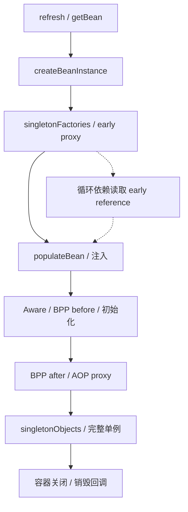

```java
// 业务示例：跨 Bean 调用，让入口穿过事务代理。
@Service
class OrderService {
    private final OrderWriter writer;
    OrderService(OrderWriter writer) { this.writer = writer; }
    public void create(Order order) { writer.persist(order); }
}
@Service
class OrderWriter {
    @Transactional(rollbackFor = Exception.class)
    public void persist(Order order) throws Exception {
        // 同一 DataSource 的持久化路径，异常交给代理作回滚判断。
    }
}
```

```yaml
# Boot 2.7 配置示例：保持默认禁止循环依赖，推动依赖拆分。
spring:
  main:
    allow-circular-references: false
  datasource:
    hikari:
      maximum-pool-size: 20
```

## 面试官三层追问

### 1. 为什么三级缓存而非简单提前放对象？
<details markdown="1"><summary>展开三层参考答案</summary>

**第一层：**提前放 raw 实例可能使依赖者持有未代理对象；工厂可以按需生成 early reference，协调自动代理。

**第二层：**getSingleton 先查完整单例，再在创建中查早期对象，必要时从 singletonFactories 获取并移动到 earlySingletonObjects。getEarlyBeanReference 允许 SmartInstantiationAwareBeanPostProcessor 参与。

**第三层：**循环依赖使初始化顺序不稳定，架构上应拆服务职责或引入事件/接口。Boot 2.7 默认禁止，不能为了“框架支持”就全局开启。
</details>

### 2. @Transactional 自调用为何失效？
<details markdown="1"><summary>展开三层参考答案</summary>

**第一层：**this.method 调用目标对象的方法，没有进入外部代理，也就没有执行事务拦截器。

**第二层：**代理持有目标及 interceptor chain，事务开始发生在 TransactionInterceptor 中，注解不是 JVM 指令。final/private 方法与代理形式还构成额外边界。

**第三层：**优先把事务边界抽到另一个 Bean 或使用 TransactionTemplate；避免依赖 AopContext 和隐式自注入增加配置耦合。测试通过容器拿代理调用，并验证数据库回滚。
</details>

### 3. 内层回滚，外层捕获异常为什么仍提交失败？
<details markdown="1"><summary>展开三层参考答案</summary>

**第一层：**REQUIRED 共用物理事务，内层回滚决定可能标记 rollback-only，外层捕获异常不会清掉标记。

**第二层：**事务管理器在外层 commit 检测全局 rollback-only，实际回滚并可能抛 UnexpectedRollbackException，防止调用方误以为已提交。

**第三层：**按业务原子性决定一起失败还是用独立事务记录审计；REQUIRES_NEW 可以独立提交，但不是随意避免异常的补丁，还要考虑连接池和一致性。
</details>

### 4. REQUIRES_NEW 与 NESTED 如何选？
<details markdown="1"><summary>展开三层参考答案</summary>

**第一层：**前者创建独立物理事务，后者通常在同一事务内使用保存点；外层回滚会带走 NESTED 已完成的更新。

**第二层：**DataSourceTransactionManager 在允许 nested 且驱动支持时创建 savepoint；REQUIRES_NEW 挂起资源，再拿新连接。JTA/其他管理器支持不同。

**第三层：**独立审计可用新事务但需承认主业务失败审计仍存；批次局部失败可用保存点，需限制锁和长事务。估算外层持连接且内层再借连接的极端并发。
</details>

### 5. 异步方法能继承 JDBC 事务吗？
<details markdown="1"><summary>展开三层参考答案</summary>

**第一层：**不能自动继承。JDBC 事务连接绑定在线程上下文，异步线程是另一个执行边界。

**第二层：**TransactionSynchronizationManager 使用 ThreadLocal 资源，复制变量不能安全地把同一连接并发给多个线程。Reactor Context 与 ThreadLocal 也不是同一机制。

**第三层：**把异步写入设计成独立事务/可靠消息，若必须原子则保持同一事务同步执行。关联阅读：<a href="#c9">Outbox</a>，提交后普通事件监听不等于持久可靠投递。
</details>

### 6. 自动配置不生效如何定位？
<details markdown="1"><summary>展开三层参考答案</summary>

**第一层：**检查候选是否加载、classpath、配置属性和是否已有用户 Bean，而不是马上扩大 component scan。

**第二层：**Boot 2.7 读取两类候选资源，ImportSelector 去重并运行过滤条件，缺类/已有 Bean 都可能跳过。用 condition evaluation report 查看原因。

**第三层：**自定义 starter 固定版本兼容范围，编写正反条件启动测试；排除自动配置需明确替代职责，避免跨版本复制内部类导致运行时失败。
</details>

## 模拟生产案例：新事务耗尽连接池

**故障现象：**20 个并发请求都已持外层事务连接，调用 REQUIRES_NEW 审计时全部等待，最后超时。**排查思路：**看池 active/pending、线程栈 borrowConnection、数据库是否执行 SQL。**原理分析：**挂起不等于释放外层连接，内层还需第二条连接。**根因与验证证据：**模拟池大小 20，20 个外层同时到达屏障后调用审计，全部等待新连接；降外层准入到 10 或改设计后恢复。**解决方案：**限制并发，短期增加连接仅在数据库预算允许时使用；审计可同事务或可靠 Outbox 后异步独立写。**长期预防：**连接预算覆盖事务嵌套，设置连接获取超时与事务超时，压测 rollback-only、自调用和异步边界。

## 面试回答与核心总结

### 60 秒快速回答

Spring 生命周期从实例化、早期暴露、依赖注入到初始化和后处理，三级缓存只处理部分单例循环，Boot 2.7 默认禁止。AOP 基于代理，事务在 TransactionInterceptor 中通过 manager 创建或加入，JDBC 连接在线程绑定。自调用、异常规则、异步和错误 manager 会破坏预期。REQUIRES_NEW 独立事务却占第二条连接，NESTED 通常保存点。自动配置要看候选资源和条件报告。

### 2～3 分钟深入回答

沿 refresh/doCreateBean 说明定义处理器与实例处理器，再解释 early reference 为什么需要工厂和代理协调。画出代理入口、事务属性、manager、连接绑定、业务执行和完成处理，用 REQUIRED rollback-only 与 REQUIRES_NEW 连接池耗尽比较传播机制。最后用异步订单场景说明线程事务不能跨边界复制，落到持久 Outbox 方案；自动配置和 MVC 则按明确调用链解释请求在哪层处理。

对于传播，我会用外层持连接、内层 REQUIRES_NEW 再借连接解释连接池饥饿；NESTED 在支持 savepoint 的路径里并非独立提交。默认异常规则只对 RuntimeException/Error 回滚，checked exception 和捕获后正常返回可能提交。排查按代理入口、manager、绑定连接、异常传播和 rollback-only 五步看。如果提交后要发 MQ，普通 afterCommit 内存回调仍有宕机窗口，可靠事件要进入 Outbox 或事务消息，而不是把注解范围夸大到网络。

### 高频追问、常见错误与速记

高频追问：prototype 会统一销毁吗？checked exception 默认回滚吗？Boot2.7 是否仍读 spring.factories？常见错误：三级缓存解决构造循环；有接口一定 JDK 代理；捕获异常能清除 rollback-only；把事务连接传进多线程。源码：doCreateBean/getSingleton/getEarlyBeanReference，TransactionInterceptor.invoke，TransactionAspectSupport.invokeWithinTransaction，AutoConfigurationImportSelector.getCandidateConfigurations，DispatcherServlet.doDispatch。核心知识：**对象创建→代理入口→物理事务→线程边界**。


## 官方资料与版本来源

联网核对日期：2026-10-08。固定版本用于解释实现，不代表最新生产推荐版本。源码摘录版权见 [source-notices.txt](./source-notices.txt)，下载记录与摘要见 [sources.json](./sources.json)。

- [DefaultSingletonBeanRegistry.getSingleton · Spring Framework 5.3.31](https://raw.githubusercontent.com/spring-projects/spring-framework/v5.3.31/spring-beans/src/main/java/org/springframework/beans/factory/support/DefaultSingletonBeanRegistry.java)
- [TransactionAspectSupport.invokeWithinTransaction · Spring Framework 5.3.31](https://raw.githubusercontent.com/spring-projects/spring-framework/v5.3.31/spring-tx/src/main/java/org/springframework/transaction/interceptor/TransactionAspectSupport.java)
- [AutoConfigurationImportSelector.getCandidateConfigurations · Spring Boot 2.7.18](https://raw.githubusercontent.com/spring-projects/spring-boot/v2.7.18/spring-boot-project/spring-boot-autoconfigure/src/main/java/org/springframework/boot/autoconfigure/AutoConfigurationImportSelector.java)


---

# 数据库事务、MVCC 与性能优化

版本基线：MySQL 8.0.36 InnoDB、PostgreSQL 16、Oracle Database 19c；OceanBase 按 4.x 产品机制讨论，实际兼容模式与小版本须另外核对。隔离级别名称相同不代表内部锁、快照与报错一致。

## 核心知识与原理

### ACID、日志与可见性

Atomicity 通过回滚机制撤销未成功事务，Consistency 是约束与业务协议保持有效，Isolation 控制并发观察，Durability 在承诺持久级别下保证成功提交。Redo 用于恢复已执行的物理修改，Undo 用于回滚及构造历史版本，不是备份。WAL 要求相关日志先于数据页落盘，不意味着所有数据库有相同的 Redo/Undo 文件布局。MySQL binlog 是服务层逻辑日志，redo 是 InnoDB 日志，二者通过提交协议协调；生产持久性还受 innodb_flush_log_at_trx_commit、sync_binlog 和底层存储可靠性影响。

### InnoDB Read View 与 RC/RR

聚簇记录含 DB_TRX_ID、DB_ROLL_PTR 等隐藏字段，Undo 链可重建历史版本。Read View 保存创建者、活跃读写事务 ID 集及界限：小于最小活跃 ID 的版本通常可见；大于等于下一分配界限不可见；中间区间需要查是否仍活跃；创建事务自身的修改可见。源码字段名称有历史命名歧义，按 changes_visible 的判断顺序理解，不靠 up/low 英文猜含义。

RC 通常每次一致性读建立新快照，RR 通常第一次一致性读建立并复用快照，`START TRANSACTION WITH CONSISTENT SNAPSHOT` 等路径另有创建时机。普通 SELECT 一致性读与 SELECT FOR UPDATE、UPDATE 的当前读不同，后者读较新的可锁定状态。RR 不能泛化为“任何操作都绝不看到后来插入”；快照读不看新行，锁定读通过范围锁限制某些插入，混用读类型会出现不同观察。长事务保留旧版本，使 purge 受阻，history list length 增长。

### 索引、范围锁与执行计划

InnoDB B+Tree 聚簇索引叶子保存完整行，二级索引叶子含主键值；非覆盖查询需要回表。联合索引遵循有序键比较，等值前缀后范围通常限制后续字段用于连续区间定位，但后续字段仍可能参与 Index Condition Pushdown 或过滤；不能说“范围之后索引完全失效”。覆盖索引减少读取行的次数，但宽索引增加写放大、页数和缓冲池压力。

Gap Lock 保护间隙，Next-Key Lock 组合记录锁和前间隙。RR 锁定范围查询常用 next-key 防止相应范围内插入；唯一索引完整等值命中通常只需记录锁，未命中等边界要另外推导。RC 多数搜索不使用 gap lock，但外键和重复键检查等仍有例外。锁的是访问路径扫描到的索引区间，不是仅锁最终返回的行，缺索引会放大锁范围。

EXPLAIN 看访问类型、key、估计 rows 和 Extra，再用受控环境 EXPLAIN ANALYZE（8.0.18+）比较实际行数与循环；后者真实执行，不能随意对生产重 SQL 使用。慢查询需分 CPU、IO、锁等待、网络与返回量，避免只给 SQL 加索引。死锁是循环等待，InnoDB 会选 victim；应用重试整个事务而不是只补最后一条语句，且必须幂等、有界并带退避。

### 数据库实现差异与迁移

|数据库|版本/快照|并发与恢复差异|迁移注意|
|---|---|---|---|
|MySQL InnoDB|Undo 历史版本 / Read View；默认 RR|聚簇索引、next-key，redo+binlog|字符集/排序规则、隐式转换、自增和 gap lock|
|PostgreSQL 16|表中多版本 tuple，xmin/xmax，VACUUM|默认 RC；RR 快照隔离，Serializable 使用 SSI 检测危险结构|VACUUM 长事务、序列不随事务回滚、类型与 SQL 方言|
|Oracle 19c|SCN 与 Undo 构造一致读，默认 RC|RR 不是可直接选择的同名级别；Serializable 可能 ORA-08177，Undo 不足可能 ORA-01555|空字符串视为 NULL、序列、日期/精度、执行计划|
|OceanBase 4.x|分布式多版本存储，具体看租户兼容模式|日志复制及分布式事务跨分区协调，不等同单机 InnoDB|MySQL/Oracle 模式不是完全等价，核对功能和分布式执行计划|

迁移先验证数据语义：时间区、字符排序、NULL、decimal、唯一约束，再验证事务、SQL 方言和访问路径。全量快照与 CDC 衔接要记录一致位点；按主键范围分片校验行数与字段规范化 hash，不用简单 sum(id) 证明一致。切换前等待增量追平，冻结必要写入或采用受控双写/路由协议，预设回退窗口；双写本身也会产生偏差，需要对账与修复。跨产品不能把 MySQL Read View 源码当统一 MVCC 实现。

### Read View 手工推演与写偏差

设活跃 ID 集为 {100,104}，m_up_limit_id=100，m_low_limit_id=108，创建者 ID=106。记录 trx=99 可见；100、104 仍活跃不可见；105 已提交且不在活跃集可见；108 及之后尚在快照边界之外不可见；106 的自己写入可见。版本 104 不可见时沿 Undo 找到 99，就能返回旧值。这个判断依赖快照记录的事务状态，而不是读取“当前时刻已提交列表”。

快照隔离可以避免很多读异常，却不自动保护跨行不变量：两名值班人员分别读到另一人仍在值班，各自把自己改成离线，写不同记录未直接冲突，最后无人值班。需要锁住共同约束记录、使用数据库可用的 Serializable 或显式约束/状态协议；MySQL RR、PostgreSQL RR/SSI 与 Oracle Serializable 的细节不同，不能仅按级别名字推断所有异常。事务重试需从新快照重新执行整个决策。

## 源码级解析与调用链

InnoDB 一致读沿 `row_search_mvcc → lock_clust_rec_cons_read_sees → ReadView::changes_visible`，不可见时由 `row_vers_build_for_consistent_read` 重建 Undo 旧版本，再检验可见性。源码在 storage/innobase 的 row、lock、read 和 trx 模块，不是 JDBC getTransactionIsolation 的实现。


**源码原文连续节选：ReadView::changes_visible · MySQL 8.0.36 · L162–L181**（保留逻辑，仅规范显示缩进，可能止于方法中间；[完整上下文](https://github.com/mysql/mysql-server/blob/mysql-8.0.36/storage/innobase/include/read0types.h#L162-L181)）。

```cpp
  [[nodiscard]] bool changes_visible(trx_id_t id,
                                     const table_name_t &name) const {
    ut_ad(id > 0);

    if (id < m_up_limit_id || id == m_creator_trx_id) {
      return (true);
    }

    check_trx_id_sanity(id, name);

    if (id >= m_low_limit_id) {
      return (false);

    } else if (m_ids.empty()) {
      return (true);
    }

    const ids_t::value_type *p = m_ids.data();

    return (!std::binary_search(p, p + m_ids.size(), id));
```


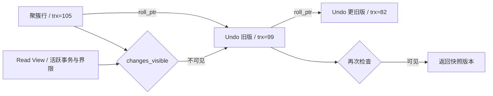

```sql
-- 业务示例：幂等键与条件状态转换放进同一个事务。
START TRANSACTION;
INSERT INTO processed_event(event_id) VALUES ('pay-20261008-001');
UPDATE orders SET status='PAID'
 WHERE id=1001 AND status='PENDING';
-- 调用方检查 affected rows，并区分首次成功、已处理与非法状态。
COMMIT;
-- 联合索引示例：tenant_id 等值、created_at 范围，id 用于稳定排序。
CREATE INDEX idx_order_tenant_time ON orders(tenant_id, created_at, id);
```

## 面试官三层追问

### 1. RR 快照什么时候建立？
<details markdown="1"><summary>展开三层参考答案</summary>

**第一层：**InnoDB RR 一般首次一致性读建立 Read View 后复用，不一定在 BEGIN 当下；RC 每条一致性读更新快照。

**第二层：**changes_visible 根据创建者、活跃 ID 及界限判定，不可见则沿 Undo；显式 consistent snapshot 和锁定读是不同路径。

**第三层：**长读事务影响 purge 和磁盘，报表应分批或使用明确一致快照策略。与当前读混用前定义业务到底需要哪个时点的数据。
</details>

### 2. MVCC 是否让读写完全不阻塞？
<details markdown="1"><summary>展开三层参考答案</summary>

**第一层：**普通快照读通常避免等待写锁，但锁定读、写写竞争以及元数据锁仍会阻塞。

**第二层：**历史版本重建需要 Undo；当前读必须协调索引锁。DDL 等可能与事务持有的 metadata lock 冲突，不能用 MVCC 解释所有等待。

**第三层：**诊断按行锁、MDL、IO、buffer latch 分层，长事务和在线变更要设置治理窗口。并发提升不能只提高连接池大小。
</details>

### 3. MySQL RR 能防所有幻读吗？
<details markdown="1"><summary>展开三层参考答案</summary>

**第一层：**快照读重复看到同一快照，锁定范围读依赖 next-key 限制插入；要先明确读类型和查询条件。

**第二层：**唯一完整等值、未命中、范围与缺索引对应锁区间不同。普通 SELECT 后 UPDATE 是当前读，可能操作后来出现的行，不能把它们当同一个快照过程。

**第三层：**业务唯一性用唯一索引，不依赖“查不到再插入”。库存额度用条件更新或锁定协议，跨库一致性另设计消息/补偿。
</details>

### 4. Redo、Undo、binlog 都是日志，为何不能互换？
<details markdown="1"><summary>展开三层参考答案</summary>

**第一层：**Redo 面向崩溃恢复，Undo 面向回滚和旧版本，binlog 面向复制与逻辑恢复，各有职责。

**第二层：**WAL 约束日志与数据页先后；InnoDB 和 binlog 的提交协调避免崩溃后两套日志产生不可解释分歧。durability 配置改变成功应答的持久边界。

**第三层：**RPO/RTO 设计同时考虑刷盘、副本、备份和演练。主从异步复制不能保证已应答事务在主机故障后必然保留。
</details>

### 5. 慢 SQL 有索引为什么仍慢？
<details markdown="1"><summary>展开三层参考答案</summary>

**第一层：**可能过滤性差、大量回表、排序、锁等待或返回数据过多，有索引不等于低成本。

**第二层：**比较 estimated/actual rows、循环和回表次数，检查类型转换、排序规则及统计偏差；范围后的列仍可能用于 ICP，但不一定减少主扫描区间。

**第三层：**用生产分布样本验证新索引，评估写入成本和 buffer 占用；分页可用稳定游标替代巨大 offset，限制返回列与批量大小。
</details>

### 6. 数据库迁移怎样证明一致？
<details markdown="1"><summary>展开三层参考答案</summary>

**第一层：**需要一致快照位点、CDC 衔接、分片校验和切换后的业务对账，单比行数不足。

**第二层：**规范化时区、decimal、NULL 和字符编码后逐范围 hash 或字段比较，核对删除与更新，避免 CDC 乱序或断点遗漏。

**第三层：**灰度读、写路由和回退计划先验证，跨产品隔离级别与 SQL 语义做故障测试。金融数据要用金额/状态业务不变量对账，不能只看技术 checksum。
</details>

## 模拟生产案例：长快照拖住 Undo

**故障现象：**在线更新正常，但 Undo/history list 增长，磁盘与查询延迟持续上升。**排查思路：**采样 information_schema.innodb_trx、history list、purge 和报表连接生命周期。**原理分析：**一个长 RR 一致性读保持旧快照，purge 不能删除它还可能需要的历史版本。**根因和验证证据：**模拟报表 BEGIN 后持续查询不提交，更新线程不断修改同一数据；结束报表事务后 purge 逐渐追赶，Undo 增长停止。**解决方案：**停止异常长事务，报表按明确批次读或从分析副本取得指定快照，释放连接前完成事务。**长期预防：**事务年龄告警、报表超时、连接复用边界检查，迁移/备份演练包括长快照压力。

## 面试回答与核心总结

### 60 秒快速回答

InnoDB 用 Read View 判断事务版本可见性，不可见沿 Undo；RC 每次一致读新快照，RR 通常首次快照复用，锁定读和写走当前读。B+Tree、覆盖索引和访问路径决定扫描成本及锁范围，next-key 保护范围不等于所有读都锁。Redo、Undo、binlog 职责不同，持久性受配置和复制边界影响。跨库迁移必须验证语义、位点和业务不变量。

### 2～3 分钟深入回答

给定活跃事务和一条三版本链，按 changes_visible 顺序逐个判断，再比较同一 RR 事务快照 SELECT 与 UPDATE 当前读的差别。结合联合索引推导实际扫描区间与 next-key 锁，说明为什么唯一索引比“查询再插入”可靠。随后比较 PostgreSQL tuple/VACUUM、Oracle SCN/Undo 与 InnoDB，指出 SSI、ORA 错误和 purge 的不同治理。结尾给出慢 SQL 证据链与 CDC 迁移切换/对账方案。

对于数据库选择，我不会把 Read View 当所有产品的统一实现。PostgreSQL tuple 版本与 VACUUM、Oracle SCN/Undo 和 OceanBase 分布式协调各有不同恢复成本。迁移要从时区、空字符串/NULL、decimal、排序和唯一约束验证语义，再做一致快照位点与 CDC 衔接，按主键范围及业务金额/状态对账。慢查询则看实际访问路径、回表、锁等待和返回量；加索引需要评估写放大，死锁重试应整体重新执行事务决策。

### 高频追问、常见错误与速记

高频追问：长事务为什么阻碍 purge？唯一未命中怎么锁？EXPLAIN ANALYZE 有何执行风险？常见错误：所有数据库默认 RR；PG 使用 InnoDB Undo；Oracle 可直接选择同名 RR；范围后索引全失效；副本等于备份。源码：ReadView::changes_visible，row_search_mvcc，row_vers_build_for_consistent_read，trx_assign_read_view。核心知识：**版本可见性→访问路径→锁区间→日志承诺→迁移语义**。


## 官方资料与版本来源

联网核对日期：2026-10-08。固定版本用于解释实现，不代表最新生产推荐版本。源码摘录版权见 [source-notices.txt](./source-notices.txt)，下载记录与摘要见 [sources.json](./sources.json)。

- [ReadView::changes_visible · MySQL 8.0.36](https://raw.githubusercontent.com/mysql/mysql-server/mysql-8.0.36/storage/innobase/include/read0types.h)
- [PostgreSQL16 隔离级别](https://www.postgresql.org/docs/16/transaction-iso.html)
- [Oracle19c 并发与一致性](https://docs.oracle.com/en/database/oracle/oracle-database/19/cncpt/data-concurrency-and-consistency.html)
- [MySQL 一致性读](https://dev.mysql.com/doc/refman/8.0/en/innodb-consistent-read.html)
- [OceanBase 官方文档（须选择实际租户版本）](https://en.oceanbase.com/docs)


---

# RocketMQ 消息队列

主线版本：Apache RocketMQ 4.9.8（tag rocketmq-all-4.9.8），以经典 Java Remoting 客户端解释；5.3.4 只在明确小节比较 Proxy、POP、Controller 等能力。Broker 升级不等于客户端自动换消费协议。

## 核心知识与原理

### 路由、消息存储与发送确认

NameServer 维护 Broker 路由，Broker 注册并发送心跳；Producer/Consumer 获取并缓存路由，再直接通信 Broker。NameServer 不保存消息，也不是每次发消息都必须访问的中心协调服务。Broker 保存消息，队列是 Topic 内的并行/顺序单位，客户端负载均衡按具体消费模型执行。

CommitLog 是 Broker 消息主体顺序追加文件，ConsumeQueue 是 Topic/Queue 的逻辑索引，每条经典索引单元 20 字节：物理 offset（8）、消息 size（4）、tagsCode（8）；IndexFile 为 key 查询提供哈希索引，不是主要消费路径。ReputMessageService 从 CommitLog 解析后 dispatch 到 ConsumeQueue/IndexFile，消息持久化和索引构建是相关但不同阶段，宕机恢复会按有效 CommitLog 重建/追赶索引。

`DefaultMQProducerImpl.sendDefaultImpl → sendKernelImpl → MQClientAPIImpl.sendMessage → SendMessageProcessor → DefaultMessageStore.asyncPutMessage → CommitLog.asyncPutMessage`。appendMessage 写映射文件区域，后续刷盘/复制结果参与发送结果。同步刷盘等待到指定 offset 落盘，异步刷盘先成功应答、后台定时/进度刷盘，因此机器故障可能丢已应答但未持久化的数据。`waitStoreMsgOK`、刷盘类型、超时和 HA 配置共同决定等待，不能说只要 SYNC_FLUSH 一切可靠。

传统同步主从复制等待副本达到一定 offset，可降低主故障损失，但返回 FLUSH_SLAVE_TIMEOUT/SLAVE_NOT_AVAILABLE 等状态时业务需明确处理；发送超时可能是“Broker 已写，但响应丢了”，重试可能重复。SYNC_FLUSH + SYNC_MASTER 不等于具备共识选主的集群，传统 HA、DLedger 与 5.x Controller 有不同配置与恢复条件，不能混为一套流程。

### 消费、ACK、重试与死信

4.x PushConsumer 底层仍由客户端 PullMessageService 拉取，拉取结果进入 ProcessQueue，再交给消费执行器；Push 指使用体验，不是每条消息必须由 Broker 主动推送网络包。经典集群消费按队列分配，同一 group 内队列被分配给消费者；广播每个实例都消费，offset 管理与重试路径不同，4.x 广播不提供与集群相同的 Broker 重试保障，业务需处理失败。

并发消费返回 CONSUME_SUCCESS 后客户端更新本地 offset，并按协议持久化 Broker offset；应用层所谓 ACK 在此表示消费成功确认，不是经典模型中每条都用 5.x POP ACK。消费完成但 offset 未持久化就宕机，会重新收到，典型 at-least-once。失败进入 retry topic，超过重试限额进入 DLQ；顺序消费挂起当前队列重试的行为与并发 retry 路径不同，要按 listener 和客户端版本说明。DLQ 必须告警、分析和受控重放，不能当“系统自动解决失败”的垃圾桶。

At-most-once 允许丢失但不重复，at-least-once 允许重复且在恢复条件满足时继续交付，exactly-once 必须定义覆盖范围。RocketMQ 传输不自动保证任意数据库副作用恰好一次；用业务事件 ID 唯一约束与业务变更同事务提交，形成“重复投递，效果一次”。消息 ID、订单 ID、事件 ID 含义不同；一个订单可有多个合法事件，去重键必须包含事件语义。

### 局部顺序与积压恢复

订单事件按业务 key 路由到同一队列，使用顺序消费保证该队列的串行处理；生产者并发发送、重试、队列数量变化与不同生产者仍需业务序号/状态机约束，不能把同 key hash 到队列当完整全局顺序证明。顺序消费者把任务异步分发后立即返回成功会破坏业务执行顺序。跨队列顺序需要协调或设计为可交换事件。

积压由到达率 λ 与可持续完成率 μ 的差产生。恢复时间约为 backlog/(μ-λ)，仅当 μ>λ 才能清空。先区分 Broker IO、拉取、反序列化、线程池、数据库/外部服务瓶颈，再增 consumer；经典队列分配中消费者数量超过队列数量不会增加同 Topic 的有效并行。批量消费必须定义部分失败和事务大小，增加线程会放大下游压力。临时扩队列影响顺序 key 的映射，不能在顺序场景直接无脑调整。

### 事务消息：Half、回查与恢复

Producer 先发 Half Message，Broker 保留但不对普通消费可见；Half 成功后执行本地事务，报告 COMMIT/ROLLBACK/UNKNOWN。COMMIT 使消息进入正常可消费路径，ROLLBACK 终止；报告丢失或 UNKNOWN 由 Broker 回查 Producer。`TransactionalMessageServiceImpl.check` 扫描 Half 和操作记录，判断跳过、丢弃、回查或重新写 Half 等，回查不是无限、实时、永远有 Producer 在线的保证。

本地事务结果必须持久化并可被其他 Producer 实例按 transaction/business ID 查询，不能只存在进程内 map。回查遇到“没有记录”要分尚未执行、已回滚与记录暂时不可读，不能一律 COMMIT；应使用明确状态、超时规则及 UNKNOWN。保留期与最大回查次数都构成失败边界，最终还需要业务对账。事务消息协调数据库提交与消息可见，不包含消费者的业务数据库提交，也不保证整个业务链强一致。

### 发送结果与恢复决策表

成功响应只承诺当次配置要求的完成边界；SEND_OK 不是“所有副本永远无损”。FLUSH_DISK_TIMEOUT 和 FLUSH_SLAVE_TIMEOUT 等不能直接解释成消息不存在，网络 timeout 同样可能已追加；保持稳定业务 eventId，再通过有界重试和业务查询/对账恢复。可见消息的消费者不会因为 Producer 没收到成功就自动暂停，所以重复效果必须由消费者状态协议保护。

模拟 backlog=600 万条、λ=2000 条/秒，当前 μ=1500，队列永远无法清空；把 μ 提到 5000 后净恢复速率 3000 条/秒，估计至少 2000 秒。估计还需考虑重试、峰值和下游限额。若新增消费线程把 DB 连接 pending 拉高，μ 可能反降。顺序业务可优先修复毒消息、按业务 key 分流和优化单消息事务，不为追吞吐破坏顺序语义。

## 源码级解析与调用链

`CommitLog.asyncPutMessage` 校验消息、处理事务/延迟属性、序列化并 append，随后结合 `submitFlushRequest` 和 `submitReplicaRequest` 的 future 汇总结果。`DefaultMQProducerImpl.sendMessageInTransaction` 先 prepare 消息，再执行 TransactionListener.executeLocalTransaction，最后 endTransaction；Broker 回查调用 checkLocalTransaction。`TransactionalMessageServiceImpl.check` 读取 Half/op 队列推进回查状态，op 记录帮助跳过已经处理的 Half。


**源码原文连续节选：CommitLog.asyncPutMessage · RocketMQ 4.9.8 · L738–L752**（保留逻辑，仅规范显示缩进，可能止于方法中间；[完整上下文](https://github.com/apache/rocketmq/blob/rocketmq-all-4.9.8/store/src/main/java/org/apache/rocketmq/store/CommitLog.java#L738-L752)）。

```java
        CompletableFuture<PutMessageStatus> flushResultFuture = submitFlushRequest(result, msg);
        CompletableFuture<PutMessageStatus> replicaResultFuture = submitReplicaRequest(result, msg);
        return flushResultFuture.thenCombine(replicaResultFuture, (flushStatus, replicaStatus) -> {
            if (flushStatus != PutMessageStatus.PUT_OK) {
                putMessageResult.setPutMessageStatus(flushStatus);
            }
            if (replicaStatus != PutMessageStatus.PUT_OK) {
                putMessageResult.setPutMessageStatus(replicaStatus);
            }
            return putMessageResult;
        });
    }

    public CompletableFuture<PutMessageResult> asyncPutMessages(final MessageExtBatch messageExtBatch) {
        messageExtBatch.setStoreTimestamp(System.currentTimeMillis());
```


**源码原文连续节选：DefaultMQProducerImpl.sendMessageInTransaction · RocketMQ 4.9.8 · L1222–L1240**（保留逻辑，仅规范显示缩进，可能止于方法中间；[完整上下文](https://github.com/apache/rocketmq/blob/rocketmq-all-4.9.8/client/src/main/java/org/apache/rocketmq/client/impl/producer/DefaultMQProducerImpl.java#L1222-L1240)）。

```java
    public TransactionSendResult sendMessageInTransaction(final Message msg,
        final LocalTransactionExecuter localTransactionExecuter, final Object arg)
        throws MQClientException {
        TransactionListener transactionListener = getCheckListener();
        if (null == localTransactionExecuter && null == transactionListener) {
            throw new MQClientException("tranExecutor is null", null);
        }

        // ignore DelayTimeLevel parameter
        if (msg.getDelayTimeLevel() != 0) {
            MessageAccessor.clearProperty(msg, MessageConst.PROPERTY_DELAY_TIME_LEVEL);
        }

        Validators.checkMessage(msg, this.defaultMQProducer);

        SendResult sendResult = null;
        MessageAccessor.putProperty(msg, MessageConst.PROPERTY_TRANSACTION_PREPARED, "true");
        MessageAccessor.putProperty(msg, MessageConst.PROPERTY_PRODUCER_GROUP, this.defaultMQProducer.getProducerGroup());
        try {
```


**源码原文连续节选：TransactionalMessageServiceImpl.check · RocketMQ 4.9.8 · L127–L143**（保留逻辑，仅规范显示缩进，可能止于方法中间；[完整上下文](https://github.com/apache/rocketmq/blob/rocketmq-all-4.9.8/broker/src/main/java/org/apache/rocketmq/broker/transaction/queue/TransactionalMessageServiceImpl.java#L127-L143)）。

```java
    public void check(long transactionTimeout, int transactionCheckMax,
        AbstractTransactionalMessageCheckListener listener) {
        try {
            String topic = TopicValidator.RMQ_SYS_TRANS_HALF_TOPIC;
            Set<MessageQueue> msgQueues = transactionalMessageBridge.fetchMessageQueues(topic);
            if (msgQueues == null || msgQueues.size() == 0) {
                log.warn("The queue of topic is empty :" + topic);
                return;
            }
            log.debug("Check topic={}, queues={}", topic, msgQueues);
            for (MessageQueue messageQueue : msgQueues) {
                long startTime = System.currentTimeMillis();
                MessageQueue opQueue = getOpQueue(messageQueue);
                long halfOffset = transactionalMessageBridge.fetchConsumeOffset(messageQueue);
                long opOffset = transactionalMessageBridge.fetchConsumeOffset(opQueue);
                log.info("Before check, the queue={} msgOffset={} opOffset={}", messageQueue, halfOffset, opOffset);
                if (halfOffset < 0 || opOffset < 0) {
```


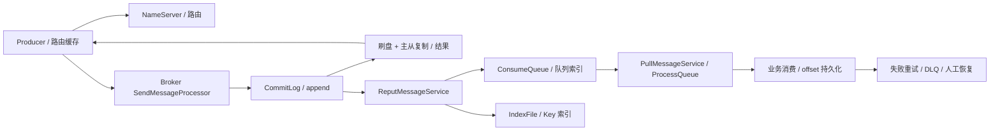

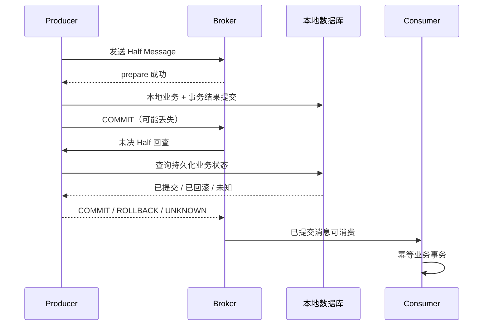

### 4.x、5.x 与 Kafka/Pulsar 的必要比较

|维度|RocketMQ 4.9.8|RocketMQ 5.3.4|
|---|---|---|
|客户端/消费|经典 Remoting，Push 底层 pull，队列分配|保留兼容路径；Proxy/gRPC、POP 可采用消息级负载均衡及不可见期/ACK|
|延时|经典固定 delay level|新增时间轮等能力；使用路径取决配置和协议|
|HA|传统主从或配置 DLedger|可配置 Controller 等，不能推断默认全启用|
|存储|CommitLog/CQ/IndexFile|保留主干并增更多实现分支，升级需核对实际启用|

Kafka 以 partition 日志为主要组织与并行单位，配合 ISR、acks、幂等 producer/transaction 支持其定义范围内语义；Kafka 事务也不会自然包住任意外部数据库。Pulsar 分离 broker 与 BookKeeper 持久层，通过 ledger 与 subscription cursor 管理存储/订阅，分层扩容代价与运维模型不同。RocketMQ 的统一 CommitLog 与独立消费索引、业务事务回查和经典队列模型更贴近本网站场景，但技术选型仍要比较吞吐、延迟、运维能力和恢复演练，而非靠“谁一定更快”。

## 面试官三层追问

### 1. 数据库提交成功但发送消息失败，怎么办？
<details markdown="1"><summary>展开三层参考答案</summary>

**第一层：**不能简单捕获异常忽略，数据库已提交而下游永远不知道。采用 Transactional Outbox 或 RocketMQ 事务消息，并保留业务对账。

**第二层：**Outbox 把业务和待投递事件写进同一数据库事务，relay 有界重试，发送成功但标记失败会重复，因此消费幂等；事务消息先 Half 再本地事务，回查从持久化业务状态恢复结果。

**第三层：**本地状态留存时间要覆盖回查/重放，relay 管理租约、重试、DLQ 和积压 SLA。若已有“提交后发失败”的历史数据，需要补偿扫描，不是仅上线新方案就自动修复。
</details>

### 2. 消费者完成业务但 ACK 前宕机，怎么办？
<details markdown="1"><summary>展开三层参考答案</summary>

**第一层：**允许再次投递，在消费数据库中用事件 ID 唯一约束防止重复效果。

**第二层：**去重记录与业务更新必须同一事务，先写去重再失败应一起回滚。经典客户端 success/offset 与 POP ACK 是不同协议，二者都不能跨任意业务数据库原子提交。

**第三层：**外部支付等非事务调用需供应商幂等键及结果查询，记录状态机与对账；超时代表未知，不能马上生成新支付请求重复扣款。关联阅读：<a href="#c9">分布式一致性</a>。
</details>

### 3. 消息乱序如何解决？
<details markdown="1"><summary>展开三层参考答案</summary>

**第一层：**同业务 key 固定队列、顺序消费，并在业务记录中校验单调版本/允许状态转换。

**第二层：**多 producer 发送先后、重试与路由变更都可能影响顺序；消费者将回调工作放异步线程后提前成功，会使实际处理顺序失效。跨队列没有自动全局排序。

**第三层：**可交换事件尽量设计为幂等累积；必须有序的事件带 sequence，缺序列暂存/补拉并设上限。顺序队列的毒消息会阻塞后续，恢复流程要允许受控隔离而非默默跳过。
</details>

### 4. 消息积压如何快速恢复？
<details markdown="1"><summary>展开三层参考答案</summary>

**第一层：**先找消费变慢还是流量激增，再保证恢复完成率超过到达率，否则只是积压变慢。

**第二层：**比较 queue lag、消费耗时、重试比例、拉取和存储指标；经典模型并行度受队列数限制，线程多也受数据库连接池约束。批量消费评估事务粒度和失败重试范围。

**第三层：**先下游扩容/批处理或限流，计算预计清空时间；紧急旁路只处理语义明确的可丢弃事件。顺序业务不能临时无限分片，历史重放要降速防止再次击穿依赖。
</details>

### 5. Broker 故障如何降低消息丢失风险？
<details markdown="1"><summary>展开三层参考答案</summary>

**第一层：**根据 RPO 配置刷盘与副本确认，监控复制延迟和未确认状态，发送失败保留可重试记录。

**第二层：**异步应答可能先于磁盘/副本；同步刷盘超时是未知结果，不是必然未写。传统同步主从不自动等价于共识选主，故障切换时应检查最新可用 offset 和集群模式。

**第三层：**演练断电、主从断网、响应丢失和副本落后；配置幂等重试、备份和业务对账。即使复制也不能防止错误删除、错误重放与所有副本同时损坏。
</details>

### 6. 事务消息能实现端到端 exactly-once 吗？
<details markdown="1"><summary>展开三层参考答案</summary>

**第一层：**不能直接保证任意端到端效果一次，它协调 Producer 本地事务结果与消息可见性，不替 Consumer 提交业务事务。

**第二层：**Half/op 队列与回查有超时和次数边界；消费者仍可能重复，回查状态也需要可恢复。ACK、数据库提交和 Broker offset 不存在一个跨三者的通用原子动作。

**第三层：**定义“效果一次”的业务范围，唯一事件键、状态机、幂等外部调用、重放与对账共同实现可靠结果；对于不可幂等副作用明确人工补偿策略。
</details>

## 模拟生产案例：支付成功重复发保单

**故障现象：**支付事件消费成功，但消费者在 offset 持久化前宕机，重启后重复生成保单。**排查思路：**按 eventId 关联 Broker 队列 offset、业务提交时间和进程终止时间；确认不是两个合法支付事件。**原理分析：**at-least-once 投递与业务提交/消费确认窗口叠加，先查再插没有原子约束。**根因和验证证据：**模拟在 DB commit 后立即 kill，重放稳定生成第二张；添加 unique(payment_event_id) 并与保单/去重同事务后，第二次进入幂等成功路径。**解决方案：**上线唯一约束前清理既有重复，外部发单接口传幂等键；消费返回前必须确认事务成功。**长期预防：**宕机点故障注入、重复与乱序重放、DLQ 告警、业务账单对账；幂等记录保留期覆盖消息最大可重放窗口。

## 面试回答与核心总结

### 60 秒快速回答

RocketMQ 4.x 通过 NameServer 获取路由，Broker 追加 CommitLog，再构建 ConsumeQueue/IndexFile，可靠边界取决于刷盘、副本和发送结果。Push 底层拉取，业务成功与 offset 持久化之间可能重复，必须数据库幂等。顺序局限在队列及业务协议；积压恢复要让完成率大于到达率。事务消息先 Half 后本地事务再确认，丢失确认由持久状态回查，但消费者仍需幂等与对账。

### 2～3 分钟深入回答

按发送调用链讲路由、append、刷盘/复制和索引构建，再列成功、超时未知、机器故障三个结果。用业务 commit 后消费确认丢失说明重复与唯一事务的必要性。随后对比 Outbox 与 Half/回查，指出先数据库后发普通消息的裂缝、回查数据留存和失败边界。最后给出 key/sequence 顺序协议、lag/(μ-λ) 恢复估算和 Broker 故障演练，必要时明确经典 offset 与 5.x POP ACK 的区别。

针对五类故障，我会逐一落地：DB 提交后发失败用 Outbox/Half；业务完成确认前宕机用同事务事件唯一约束；乱序用队列局部顺序和业务版本；积压先算净完成率并看下游；Broker 故障按刷盘、复制和集群模式定义 RPO。事务回查状态必须持久且跨 Producer 可查询，UNKNOWN 不是盲目提交。经典 offset 与 POP ACK 不混讲，DLQ 和重放要有告警、速率与幂等记录保留窗口，避免恢复操作制造第二次事故。

### 高频追问、常见错误与速记

高频追问：消费成功何时保存 offset？同步复制等于自动选主吗？回查状态不可读怎么办？常见错误：Push 完全没有 pull；MQ 事务包住消费数据库；发送超时必定没写；扩消费者超过队列仍无限加速；广播失败自动和集群一样重试。源码：sendDefaultImpl/sendMessageInTransaction，CommitLog.asyncPutMessage，ReputMessageService.doReput，TransactionalMessageServiceImpl.check，ConsumeMessageConcurrentlyService.processConsumeResult。核心知识：**应答边界→重复窗口→幂等事务→顺序与恢复**。


## 官方资料与版本来源

联网核对日期：2026-10-08。固定版本用于解释实现，不代表最新生产推荐版本。源码摘录版权见 [source-notices.txt](./source-notices.txt)，下载记录与摘要见 [sources.json](./sources.json)。

- [CommitLog.asyncPutMessage · RocketMQ 4.9.8](https://raw.githubusercontent.com/apache/rocketmq/rocketmq-all-4.9.8/store/src/main/java/org/apache/rocketmq/store/CommitLog.java)
- [DefaultMQProducerImpl.sendMessageInTransaction · RocketMQ 4.9.8](https://raw.githubusercontent.com/apache/rocketmq/rocketmq-all-4.9.8/client/src/main/java/org/apache/rocketmq/client/impl/producer/DefaultMQProducerImpl.java)
- [TransactionalMessageServiceImpl.check · RocketMQ 4.9.8](https://raw.githubusercontent.com/apache/rocketmq/rocketmq-all-4.9.8/broker/src/main/java/org/apache/rocketmq/broker/transaction/queue/TransactionalMessageServiceImpl.java)
- [RocketMQ 5.x 事务消息与版本边界](https://rocketmq.apache.org/docs/featureBehavior/04transactionmessage/)
- [RocketMQ 5.3.4 源码对照](https://github.com/apache/rocketmq/tree/rocketmq-all-5.3.4)


---

# Redis 与分布式缓存

版本基线：Redis 7.2.4；旧版编码如 ziplist 必须与版本区分。Redisson Watchdog 按公开协议说明，具体 API 和续期细节以部署的 Redisson 版本核对，不伪造一个通用续期时长。

## 核心知识与原理

### 数据结构与网络模型

Redis 对象有 type/encoding：String 可用整数、embstr、raw/SDS；Hash、ZSet、List 等根据大小和配置采用不同内部编码。Redis 7.2 小 Hash 与小 ZSet 典型使用 listpack，大 Hash 使用哈希表，大 ZSet 使用 dict+skiplist；List 使用 quicklist 结合 listpack，Set 小整数集合可用 intset，7.2 还存在 listpack 编码路径，超过条件转哈希表。渐进 rehash 用两张字典表分摊迁移，不能说大 key 的所有操作都天然 O(1)。编码升级、rehash、删除和序列化会有实际成本。

ae 事件循环处理网络就绪和时间事件，命令执行主路径通常由主线程串行进行。Redis 6+ 可配置多线程网络 IO，但不代表所有命令多线程并行；后台持久化子进程和 lazyfree 等也不属于同一主线程。一个 O(N) 大范围命令或 Lua 脚本可以阻塞其他请求，Lua 原子执行不等于没有性能风险。

### 持久化、复制与集群

RDB 保存时间点快照，fork 的 Copy-on-Write 在写多时增加内存与页复制压力；两个快照间更新可能丢失。AOF 记录写命令，appendfsync always/everysec/no 的延迟和持久边界不同，everysec 在异常情况下不是零丢失保证。Redis 7 使用 multipart AOF，重写生成 base/incr 与 manifest，不能拿旧单文件重写流程完全套回。RDB/AOF 是恢复手段，不取代异地备份和恢复演练。

复制是异步，replication backlog 与 PSYNC 支持部分重同步，缺失历史或条件不满足则全量。Sentinel 检测故障并协调提升副本，存在检测和切换窗口；Cluster 用 16384 hash slots 分片并路由/重定向，跨 slot 多 key 操作需要同 hash tag 等约束。WAIT 让客户端等待一定副本确认，可减小风险，但不把 Redis 变成线性一致共识存储，也不保证切换一定选到含该写的副本。

### 缓存故障与一致性

穿透是不存在的 key 不断落库：参数校验、短 TTL 空值和 Bloom Filter 可以减少，但 Bloom 有误判且维护需与数据变化一致。击穿是单热点过期：single-flight、互斥加载、逻辑过期和后台刷新均有时效/可用性权衡。雪崩是大量 key 同时失效或缓存集群故障：TTL 加随机、限流、依赖隔离、降级与预热组合，而不是只有随机 TTL。

Cache Aside 通常先改 DB 再删缓存，读为 miss→读库→写缓存。但慢读 A 得到旧值，写 B 提交并删除，A 随后又写旧值，仍可出现不一致。延迟双删是尽力缩短竞态窗口，延迟值没有覆盖所有 GC、网络和排队时长的可靠上界；第二次删失败也需重试。更严格场景使用版本校验、CDC/Outbox 驱动失效、TTL 收敛或直接读库，并定义最大可接受陈旧时间。

### 分布式锁与 fencing

`SET key token NX PX lease` 原子获取并设租期，token 用随机唯一值；解锁必须 Lua 比较 token 后 DEL，禁止直接删除他人的锁。锁过期后旧 owner 仍可能执行，主从异步复制切换还可能丢锁；Watchdog 自动续期依赖进程、调度和网络存活，STW/隔离可中断续期，不能保证永久排他。

正确性敏感资源需 fencing token：锁/租约服务授予单调递增序号，资源端拒绝旧序号写入。Redis 随机 token 用于所有权，不等于 fencing；独立 INCR 加锁也需要保证授予与状态协议、故障切换的一致性，不能简单拼接成强一致。库存和资金优先由数据库唯一约束/条件更新保护不变量，Redis 锁只减少竞争。

```shell
# 协议示例：真正客户端应处理网络超时和未知获取结果。
SET lock:order:1001 unique-owner-token NX PX 30000
```

```lua
-- 业务示例：仅当前 owner 删除；不能防止过期旧 owner 继续写数据库。
if redis.call('get', KEYS[1]) == ARGV[1] then
    return redis.call('del', KEYS[1])
end
return 0
```

### 热点、大 Key 与容量

热点 key 在单分片集中：本地缓存、请求合并、合理复制读及业务分片可以分担，但副本读有陈旧性。大 key 影响网络、序列化、主线程删除、迁移与复制；用 SCAN/按类型扫描受控排查，避免生产 KEYS 全扫。UNLINK 可异步回收部分内存工作，但不能消除大 key 的其他成本。关注 p99、SLOWLOG、LATENCY、used_memory、RSS、fragmentation、evictions、命中率和副本 lag；SLOWLOG 主要记录命令执行时间，不含客户端网络传输的全部延迟。

### 缓存与锁的正常、异常、恢复路径

正常读命中直接返回，miss 在受控 single-flight 中回源并带 TTL 写入；回源失败不能无限写空值掩盖系统故障，应区别确实不存在与暂时不可用。缓存集群不可用时通过准入限制回源，给非关键功能降级，恢复后分批预热，避免所有实例同时加载同一热点。TTL 的随机化降低同时过期，但对整集群宕机没有保护，故障路径必须独立设计。

正常锁持有者按 token 解锁，异常超时/断网先判断获取结果未知，不能随意执行关键动作；租期过期后旧 owner 必须由资源协议约束。恢复时对账业务结果而不是检查锁 key 是否存在。容量规划至少拆数据集、字典/对象开销、复制 backlog、客户端输出缓冲、持久化 COW 与碎片余量；used_memory 低于 maxmemory 也不保证 RSS 不超容器限额。

## 源码级解析与调用链

`processCommand → call → setCommand → setGenericCommand → setKey` 执行 SET 条件与过期设置；单命令条件在串行执行协议内完成。`dbDelete → dbSyncDelete / dbAsyncDelete` 根据路径释放键；异步删除不等于“指令返回后内存立即下降”。对象编码与命令代价需检查 t_string.c、t_hash.c、t_zset.c、dict.c 和 quicklist.c。


**源码原文连续节选：setGenericCommand · Redis 7.2.4 · L84–L103**（保留逻辑，仅规范显示缩进，可能止于方法中间；[完整上下文](https://github.com/redis/redis/blob/7.2.4/src/t_string.c#L84-L103)）。

```c
void setGenericCommand(client *c, int flags, robj *key, robj *val, robj *expire, int unit, robj *ok_reply, robj *abort_reply) {
    long long milliseconds = 0; /* initialized to avoid any harmness warning */
    int found = 0;
    int setkey_flags = 0;

    if (expire && getExpireMillisecondsOrReply(c, expire, flags, unit, &milliseconds) != C_OK) {
        return;
    }

    if (flags & OBJ_SET_GET) {
        if (getGenericCommand(c) == C_ERR) return;
    }

    found = (lookupKeyWrite(c->db,key) != NULL);

    if ((flags & OBJ_SET_NX && found) ||
        (flags & OBJ_SET_XX && !found))
    {
        if (!(flags & OBJ_SET_GET)) {
            addReply(c, abort_reply ? abort_reply : shared.null[c->resp]);
```


**源码原文连续节选：dbDelete · Redis 7.2.4 · L403–L408**（保留逻辑，仅规范显示缩进，可能止于方法中间；[完整上下文](https://github.com/redis/redis/blob/7.2.4/src/db.c#L403-L408)）。

```c
int dbDelete(redisDb *db, robj *key) {
    return dbGenericDelete(db, key, server.lazyfree_lazy_server_del, DB_FLAG_KEY_DELETED);
}

/* Prepare the string object stored at 'key' to be modified destructively
 * to implement commands like SETBIT or APPEND.
```


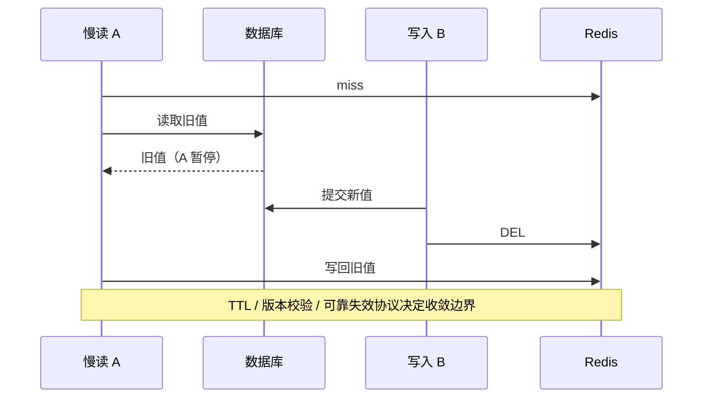

## 面试官三层追问

### 1. Redis 是单线程为什么还能快？
<details markdown="1"><summary>展开三层参考答案</summary>

**第一层：**主要数据驻内存、事件驱动减少阻塞切换、常见结构操作成本较低，避免命令执行的锁竞争。

**第二层：**网络 IO 多线程、持久化子进程和异步释放与主线程命令执行分工不同。大集合、脚本、fork 和网络都可能成为瓶颈，不能说单线程使任何操作都快。

**第三层：**以真实命令混合、value 大小和连接数压测，先优化操作成本与热点，再考虑分片。SLOWLOG 与端到端延迟一起看，区分服务器执行和网络排队。
</details>

### 2. 延迟双删能绝对保证一致吗？
<details markdown="1"><summary>展开三层参考答案</summary>

**第一层：**不能，只减少某些读写竞态的时间窗口，可靠性受延迟选择和第二次删除成功影响。

**第二层：**慢读暂停可超过预设 delay，第二次删后仍写旧值；网络失败可能使删除未执行。Cache Aside 本身不是跨 DB/Redis 原子事务。

**第三层：**按业务陈旧预算选 TTL、版本校验和可靠失效事件；核心余额从数据库确认。不能承诺“sleep 500ms 即强一致”，需量化收敛及补偿。
</details>

### 3. Lua 解锁为什么仍不等于强一致锁？
<details markdown="1"><summary>展开三层参考答案</summary>

**第一层：**Lua 防止错删他人的锁，但不能阻止旧 owner 超租期后继续执行业务。

**第二层：**异步复制切换可能丢锁，Watchdog 续期也会被 STW/网络分区影响。随机所有权 token 不具备顺序版本，资源端不知道请求是不是过期 owner。

**第三层：**数据库条件写/唯一约束保障结果，或使用有一致授予协议的 fencing 并让资源端验序。把锁看成减少竞争工具，明确租期与故障窗口。
</details>

### 4. RDB 与 AOF 如何选？
<details markdown="1"><summary>展开三层参考答案</summary>

**第一层：**RDB 适合快照恢复但会丢快照后更新，AOF 用写日志缩短丢失窗口，常组合使用并备份。

**第二层：**fork/COW、fsync、重写和磁盘性能影响延迟；Redis7 multipart AOF 有 base/incr/manifest 协议，不是只有一个旧 AOF 文件。

**第三层：**依据缓存可重建性或主数据 RPO 配置，恢复演练验证文件与版本兼容。缓存持久化不能让数据库/消息可靠性设计消失。
</details>

### 5. Sentinel 切换为什么可能丢数据？
<details markdown="1"><summary>展开三层参考答案</summary>

**第一层：**主副本异步复制，成功写可能尚未到副本，切换后不可见。

**第二层：**检测与提升不能让过去未复制的数据自动出现；WAIT 改善确认覆盖但不是线性一致承诺，旧主隔离期间和恢复期也需处理。

**第三层：**缓存可失效重建，关键账务不能只存 Redis。配置复制约束、合理故障检测并演练 lag/分区，明确丢失容忍和降级策略。
</details>

### 6. 缓存故障为何拖垮数据库？
<details markdown="1"><summary>展开三层参考答案</summary>

**第一层：**原本由缓存承载的请求同时回源，使数据库连接、CPU 和队列超过容量。

**第二层：**超时后立即重试把同一负载放大，多线程等待连接进一步占内存。单热点 single-flight 与全局数据库准入应分层控制。

**第三层：**缓存不可用时限流与分级降级，限制回源并发和重试预算，优先关键请求。容量演练要有全缓存失效场景，不能只测试高命中率。
</details>

## 模拟生产案例：锁超期导致重复扣库存

**故障现象：**使用 SET NX PX 锁却出现两次库存扣减，日志看两请求都“获取成功”。**排查思路：**对齐锁租期、STW、网络延迟与 DB 提交时间，检查解锁 token。**原理分析：**A 获取锁后 STW 超过租期，B 获取新锁并更新，A 恢复继续执行；Lua 解锁仅防错删 B 锁。**根因与验证证据：**模拟暂停 A 40 秒、租期 30 秒可复现，数据库无事件唯一约束且写入不检验状态。**解决方案：**业务唯一事件键和库存条件更新同事务；锁用于减竞争，若采用 fencing 必须资源端拒绝旧 token。**长期预防：**超期 owner 故障注入、幂等和条件更新回归测试、监控续期失败，容量预算考虑 GC/网络停顿。

## 面试回答与核心总结

### 60 秒快速回答

Redis 用内存结构和事件循环执行命令，IO 多线程不等于命令全面并行。复制异步，RDB/AOF 与 Sentinel/Cluster 各有持久和切换窗口。Cache Aside 先 DB 后删仍有慢读写回竞态，双删只是尽力收敛。SET NX PX 加唯一 token 和 Lua 解锁防误删，但租期/切换会破坏互斥，关键写要靠数据库约束或 fencing。回源限流与热点治理比单独增加缓存容量更重要。

### 2～3 分钟深入回答

从对象 type/encoding 与命令复杂度解释事件循环的性能边界，再讲持久化的 fork/COW、fsync 和异步复制窗口。画慢读/写库/删缓存/旧值写回时序，给出 TTL、版本和可靠失效方案。用超租期旧 owner 继续写解释 Lua 和 Watchdog 的边界，最后把缓存故障连接到数据库准入、重试预算和全失效压测。

如果要求严格互斥，我会用 A 超租期暂停、B 获取新锁、A 恢复继续写的时序说明 Watchdog/Lua 的能力边界。fencing 必须有单调授予协议并由资源端拒绝旧序号，随机 token 只表达所有权。缓存一致性按允许陈旧时间决定 TTL、可靠失效事件或版本校验；金融结果由数据库约束保护。最后补充全缓存故障时要保护数据库回源，持久化与复制都留有窗口，大 key、COW 和客户端缓冲也要放入进程容量预算。

### 高频追问、常见错误与速记

高频追问：WAIT 为什么不是共识？UNLINK 后 RSS 为何不立刻降？Cluster 多 key 事务怎么约束 slot？常见错误：Redis7 小 Hash 仍一律 ziplist；Lua 解锁=业务互斥永远成立；双删强一致；SLOWLOG 包含全部网络延迟。源码：setGenericCommand，dbDelete/dbAsyncDelete，dictRehash，aeMain，replication.c。核心知识：**结构成本→持久窗口→缓存收敛→租约边界→依赖保护**。


## 官方资料与版本来源

联网核对日期：2026-10-08。固定版本用于解释实现，不代表最新生产推荐版本。源码摘录版权见 [source-notices.txt](./source-notices.txt)，下载记录与摘要见 [sources.json](./sources.json)。

- [dbDelete · Redis 7.2.4](https://raw.githubusercontent.com/redis/redis/7.2.4/src/db.c)
- [setGenericCommand · Redis 7.2.4](https://raw.githubusercontent.com/redis/redis/7.2.4/src/t_string.c)
- [Redis 分布式锁边界](https://redis.io/docs/latest/develop/use/patterns/distributed-locks/)
- [Redisson 锁与 Watchdog](https://redisson.pro/docs/data-and-services/locks-and-synchronizers/)


---

# 分布式事务与数据一致性

实现基线：Spring 5.3.31 本地事务、RocketMQ 4.9.8 事务消息、MySQL 8.0.36 业务约束。CAP 是特定模型中的理论约束，不是任意产品“任选两个特性”的采购表。

## 核心知识与原理

### CAP、BASE 与业务不变量

CAP 的 C 指原子/线性一致读写等强一致模型，A 要求未失败节点收到的操作最终完成，P 指网络分区环境。分区期间不能同时承诺此模型下的 C 与 A；正常网络并非必须主动放弃一种。工程中有延迟、部分失败和数据新鲜度等更多权衡，BASE 是面向可用与最终收敛的设计思路，不是证明任何系统迟早一致的定理。

最终一致必须有具体恢复机制：持久任务、重试、幂等、顺序约束、补偿和对账；若失败事件永久丢失、毒消息无人处理或幂等记录过早删除，系统不会自动收敛。先定义不变量，如“支付事件只能记账一次”“保单仅在支付已确认后生成”“退款不能超过实收”，再选择事务边界和恢复方案。

### 2PC、TCC、Saga 的代价与故障边界

|方案|适用条件|正常流程|异常与恢复|主要代价|
|---|---|---|---|---|
|2PC|参与者支持准备/提交协议，需原子提交|prepare 后统一 commit|协调者/参与者保留日志；prepared 状态可能阻塞，恢复需查询决定|锁/资源持有、协调可用性与性能成本|
|TCC|业务可显式预留资源且能撤销|Try 预留，Confirm 确认|Cancel 撤销；处理空回滚、悬挂、重复确认/撤销|侵入业务、资源预留、幂等状态机|
|Saga|长流程可拆本地事务，允许补偿|按步骤提交本地事务|失败按语义补偿，补偿也可失败，需要重试/人工恢复|中间态可见、补偿非物理回滚、隔离弱|
|事务消息|本地 DB + RocketMQ 可恢复回查|Half→本地事务→确认|未知回查，超限需对账|回查记录、消费幂等与异步延迟|
|Outbox|同 DB 可存业务与事件，有 relay/CDC|业务+事件同事务，异步发送|发送/标记裂缝造成重复，消费者幂等|积压管理、清理、重复与顺序治理|

2PC 不提供无代价高可用，不能因参与者全有数据库就直接宣称全链路支持 XA。TCC Try 和 Cancel 必须以事务状态协调：Cancel 先到要落下撤销标记，后到 Try 不可再预留；否则空回滚之后的悬挂会永久占资源。Saga 补偿是新业务动作，如退款不是把过去扣款“从历史删除”；邮件/短信等不可逆步骤必须提前考虑。

### Transactional Outbox 源码与业务协议

Outbox 没有一个所有框架统一的 JDK 类，它是应用数据库协议。Spring TransactionTemplate/事务代理建立本地边界，业务行和 event 行一次提交。relay 领取待发送事件，发布 MQ，再标记 SENT。发送成功但 mark SENT 前崩溃必然可能重发；不能通过先标记后发送来“去重”，那会在标记后宕机时永久丢消息。

```sql
-- 业务示例：Outbox 与订单写入同一数据库本地事务。
CREATE TABLE outbox_event (
  event_id VARCHAR(64) PRIMARY KEY,
  aggregate_id BIGINT NOT NULL,
  aggregate_version BIGINT NOT NULL,
  payload TEXT NOT NULL,
  status VARCHAR(16) NOT NULL,
  next_attempt_at TIMESTAMP NOT NULL,
  UNIQUE KEY uk_aggregate_version(aggregate_id, aggregate_version)
);
START TRANSACTION;
UPDATE orders SET status='PAID', version=version+1
 WHERE id=1001 AND status='PENDING';
-- 应用核对影响行数，并以稳定 event_id 和对应版本写入事件。
INSERT INTO outbox_event VALUES
 ('payment-confirmed-1001',1001,2,'{"orderId":1001}',
  'NEW',CURRENT_TIMESTAMP);
COMMIT;
```

relay 不能长期持有数据库锁做无限网络发送：可使用短事务领取并记录 lease/owner，提交后发消息，再按 owner 条件完成；过期 lease 重新领取会重复，但不应丢失。若使用 `FOR UPDATE SKIP LOCKED`，明确 MySQL 8 或对应数据库支持情况，并注意跳过记录可能改变顺序。每个 aggregate 的版本序列需要单独有序推进，CDC 也不能无条件跨分区承诺全局顺序。

消费者在同一数据库事务中 INSERT processed_event 与业务条件更新，unique 冲突后查询已完成状态，只有确认过去事务成功才返回幂等成功。不要将 Redis 去重写成功后再独立写 DB；DB 失败会造成事件被误认为已处理。外部副作用无法纳入同一 DB 事务时，使用稳定供应商幂等键、状态 PENDING/UNKNOWN/SUCCEEDED 和结果查询。

### 失败矩阵：恢复责任必须落到组件

业务本地事务未提交就宕机，订单与 Outbox 一起回滚；本地已提交但 relay 未发送，待发记录驱动恢复；MQ 已收但应答丢失或 SENT 未提交，重复投递由消费幂等吸收；消费业务提交但确认丢失，再次投递查询同一事件结果；外部服务结果未知，依靠稳定幂等键和查询。任何一格若只写“重试即可”，都还缺次数、超时、恢复 owner、持久状态和人工处理条件。

TCC 的状态应限定 New→Reserved→Confirmed 或 Cancelled，Cancelled 后迟到 Try 不可预留。Saga 的补偿状态要单独记录 RETRYING/FAILED，而不能把回调执行过当完成。对账从不变量出发，比如支付账与保单账按 paymentEventId 关联，“有支付无保单”“无支付有保单”“重复保单”分别修复；没有统一 eventId 的粗粒度订单号会把合法后续事件误判重复。

## 源码级解析与调用链

`TransactionAspectSupport.invokeWithinTransaction` 保证本地资源边界，不能自动纳入 MQ 网络调用。RocketMQ 的 `sendMessageInTransaction → executeLocalTransaction → endTransaction` 与 `TransactionalMessageServiceImpl.check → checkLocalTransaction` 建立提交/回查链。真正业务可靠性由“本地状态可恢复、消息重复可接受、非法状态转换被拒绝”三个不变量提供，而非单个注解。


**源码原文连续节选：TransactionalMessageServiceImpl.check · RocketMQ 4.9.8 · L127–L143**（保留逻辑，仅规范显示缩进，可能止于方法中间；[完整上下文](https://github.com/apache/rocketmq/blob/rocketmq-all-4.9.8/broker/src/main/java/org/apache/rocketmq/broker/transaction/queue/TransactionalMessageServiceImpl.java#L127-L143)）。

```java
    public void check(long transactionTimeout, int transactionCheckMax,
        AbstractTransactionalMessageCheckListener listener) {
        try {
            String topic = TopicValidator.RMQ_SYS_TRANS_HALF_TOPIC;
            Set<MessageQueue> msgQueues = transactionalMessageBridge.fetchMessageQueues(topic);
            if (msgQueues == null || msgQueues.size() == 0) {
                log.warn("The queue of topic is empty :" + topic);
                return;
            }
            log.debug("Check topic={}, queues={}", topic, msgQueues);
            for (MessageQueue messageQueue : msgQueues) {
                long startTime = System.currentTimeMillis();
                MessageQueue opQueue = getOpQueue(messageQueue);
                long halfOffset = transactionalMessageBridge.fetchConsumeOffset(messageQueue);
                long opOffset = transactionalMessageBridge.fetchConsumeOffset(opQueue);
                log.info("Before check, the queue={} msgOffset={} opOffset={}", messageQueue, halfOffset, opOffset);
                if (halfOffset < 0 || opOffset < 0) {
```


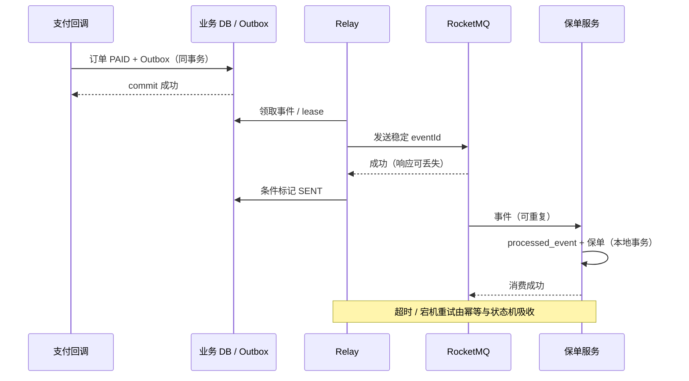

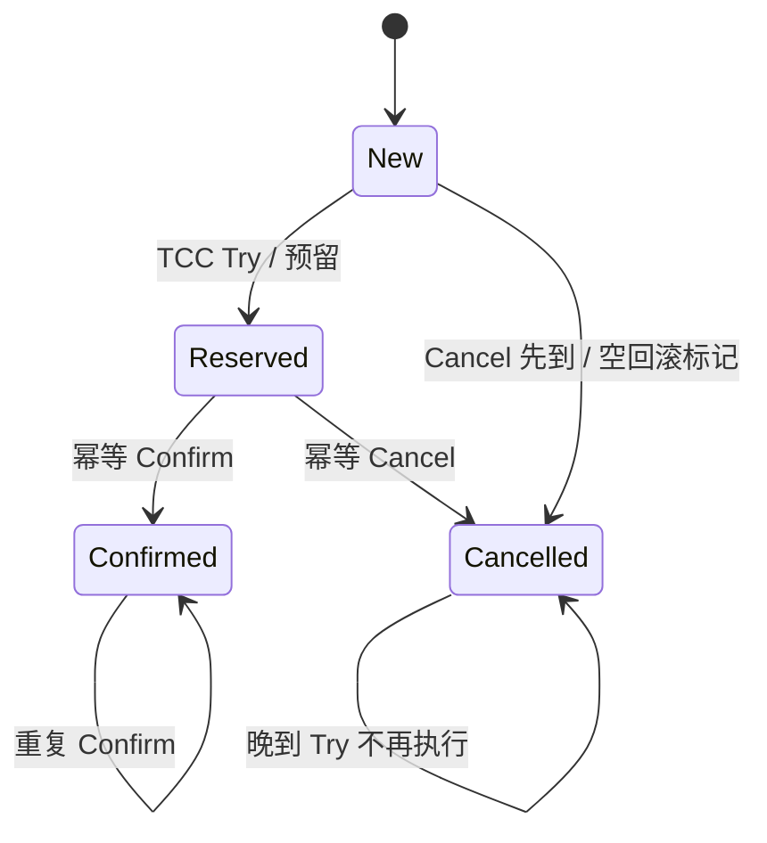

### 订单、支付与保单的状态机

订单创建可同步完成本地事务；支付请求使用稳定业务 requestId，超时进入 UNKNOWN 查询渠道结果，避免换 ID 重试造成重复扣款。支付确认在本地一次记账并发可靠事件；保单生成以 paymentEventId/业务唯一键幂等。业务补偿可能是退款、撤单或人工审核，已经生效保单不能简单删除行，必须遵守业务撤销流程。重试最大时长、人工处理 SLA 和对账范围属于架构设计的一部分。

## 面试官三层追问

### 1. 最终一致是否意味着可以不设计失败路径？
<details markdown="1"><summary>展开三层参考答案</summary>

**第一层：**不是，最终一致依赖失败操作被保存并最终成功或被业务补偿，不能凭时间流逝恢复。

**第二层：**Outbox/事务消息保证待完成意图可恢复，幂等状态机吸收重复，重试和对账处理未收敛记录；丢失意图或永久毒消息会破坏前提。

**第三层：**定义收敛 SLA、积压上限、告警和人工兜底；用户界面暴露处理中/失败状态，避免同步成功提示掩盖下游永久失败。
</details>

### 2. Outbox 是否无重复？
<details markdown="1"><summary>展开三层参考答案</summary>

**第一层：**不是。它消除业务提交成功却没有持久待发记录的窗口，但发送成功与标记之间仍可能重复。

**第二层：**先发后标记可重发，先标记后发会丢失，因此选择可恢复重复；消费者去重与业务同事务保证效果一次。relay lease 过期也可能重领。

**第三层：**稳定 eventId、消费者约束、顺序版本和记录保留窗口共同设计，监控 oldest unsent age 而不只队列数。清理只删除已完成且超过恢复窗口的记录。
</details>

### 3. TCC 如何处理空回滚和悬挂？
<details markdown="1"><summary>展开三层参考答案</summary>

**第一层：**Cancel 先到时即使资源尚未预留，也要记录撤销状态；后到 Try 见到撤销不能执行。

**第二层：**状态转换通过唯一 transactionId 和条件更新协调，Try/Confirm/Cancel 都幂等；并发 Cancel 与 Try 需在同一原子状态协议中决定胜者。

**第三层：**预留有过期/扫描恢复，但过期不能擅自推翻已确认业务；协调者恢复和资源服务对账都要有依据。测试乱序、重复、宕机和部分参与者不可用。
</details>

### 4. Saga 补偿为什么不是数据库回滚？
<details markdown="1"><summary>展开三层参考答案</summary>

**第一层：**每步本地事务已经提交，对其他系统可见，补偿只能执行新的逆向业务动作。

**第二层：**逆动作也可能失败，且不一定精确可逆；库存释放、退款和撤保单要按当前状态检查，避免补偿覆盖后续合法变更。

**第三层：**设计 forward/compensate 的幂等键、执行日志和人工恢复；不可逆步骤放在合适位置或预确认之后，不能承诺全链路瞬间原子。
</details>

### 5. 超时后为何不能直接认定失败？
<details markdown="1"><summary>展开三层参考答案</summary>

**第一层：**超时只说明调用方没收到结果，对端可能已经提交，这是未知状态。

**第二层：**使用稳定 requestId 重试或查询结果，对端唯一约束/幂等响应识别过去成功；每次生成新 ID 会变成新的业务请求。

**第三层：**支付 UNKNOWN 设置查询、退避、截止和人工对账，不能立即退款同时重付。取消也要与原执行竞争协调，避免双向动作都成功。
</details>

### 6. MQ 顺序如何和状态机结合？
<details markdown="1"><summary>展开三层参考答案</summary>

**第一层：**传输局部顺序降低乱序，状态机仍验证事件版本和合法转换，拒绝重复或过时变更。

**第二层：**unique(aggregate_id, version) 约束事件版本，消费者 lastVersion 条件更新；缺少版本可暂存或查询来源补齐，不能简单丢弃未来事件。

**第三层：**定义缺序列超时与暂存上限，恢复历史事件时限制速度；跨业务不可逆动作按事件语义设计，而非所有事件一律“只保留最新”。
</details>

## 模拟生产案例：Outbox 已发未标记

**故障现象：**relay 重启后同一支付事件投递两次，保单服务有重复请求。**排查思路：**关联稳定 eventId、relay lease 与 MQ 发送结果，检查本地 SENT 提交。**原理分析：**发送完成后进程宕机，NEW/CLAIMED 记录过期被重新领取，这属于预期恢复窗口。**根因和验证证据：**模拟在 send 成功后 kill，事件重新出现；消费者 unique eventId 同事务后只产生一个保单，重复返回成功。**解决方案：**保留重复投递能力并实现正确幂等，不将 mark SENT 提前；外部发单 API 使用同一幂等键。**长期预防：**逐宕机点注入、lease 到期与回收测试、积压年龄与 DLQ 告警，对账检查“已付无保单”和重复保单。

## 面试回答与核心总结

### 60 秒快速回答

先定义业务不变量和失败边界，再选事务方案。2PC 原子但有资源持有和恢复阻塞；TCC 需预留与幂等状态处理空回滚/悬挂；Saga 是新业务补偿而非物理回滚。DB 与 MQ 用同事务 Outbox 或 Half/回查，消息仍可能重复，消费去重与业务同事务。超时属于未知，用稳定 requestId 查询恢复，最终一致必须有重试、对账和人工处理 SLA。

### 2～3 分钟深入回答

以支付已提交而消息发送失败建立问题，比较 Outbox 与事务消息的意图持久化方式。画 relay 发送成功未标记的重复窗口，解释为什么必须先发后标记并在消费端吸收重复。再用订单/支付/保单状态机讲 UNKNOWN、版本、唯一约束和补偿；根据是否能预留、是否可逆、是否支持协调协议决定 TCC/Saga/2PC，而非所有跨服务都套分布式事务。

我会再列失败矩阵，说明本地未提交、已提交未投递、已发送未标记、消费已提交未确认分别由哪个持久组件恢复。对外支付超时保留 UNKNOWN，重复调用使用同 requestId，不更换 ID 重新扣费。补偿是新业务动作，已生效保单不能简单删数据库行，必须遵守撤销/退款流程。恢复有最大重试窗口、对账周期和人工兜底，衡量最老未处理事件年龄而非只看数量。这样才能说明最终一致是可验证协议，不是随时间自然发生。

### 高频追问、常见错误与速记

高频追问：回查记录保留多久？补偿失败谁接管？CDC 是否全局顺序？常见错误：CAP 随意选两个；Outbox 无重复；Redis 去重后 DB 失败也算处理成功；支付超时必定失败；Saga 没有中间状态。源码/协议入口：invokeWithinTransaction，sendMessageInTransaction，TransactionalMessageServiceImpl.check；业务 SQL 的唯一约束、条件 UPDATE 和 lease。核心知识：**意图持久化→重复吸收→状态约束→失败恢复→对账**。


## 官方资料与版本来源

联网核对日期：2026-10-08。固定版本用于解释实现，不代表最新生产推荐版本。源码摘录版权见 [source-notices.txt](./source-notices.txt)，下载记录与摘要见 [sources.json](./sources.json)。

- [TransactionAspectSupport.invokeWithinTransaction · Spring Framework 5.3.31](https://raw.githubusercontent.com/spring-projects/spring-framework/v5.3.31/spring-tx/src/main/java/org/springframework/transaction/interceptor/TransactionAspectSupport.java)
- [TransactionalMessageServiceImpl.check · RocketMQ 4.9.8](https://raw.githubusercontent.com/apache/rocketmq/rocketmq-all-4.9.8/broker/src/main/java/org/apache/rocketmq/broker/transaction/queue/TransactionalMessageServiceImpl.java)
- [CAP 原论文 Gilbert/Lynch](https://groups.csail.mit.edu/tds/papers/Gilbert/Brewer2.pdf)


---

# 微服务、高并发与系统稳定性

版本基线：Spring Cloud Gateway 3.1.8、Reactor Core 3.4.34、Netty 4.1.108.Final（与 Spring Boot 2.7 时代机制相符）。版本组合只是分析基线，实际依赖树和补丁安全性应由部署项目管理。

## 核心知识与原理

### Gateway、Reactor 与 EventLoop

Gateway 基于 WebFlux 路由请求，RoutePredicateHandlerMapping 找到 Route，FilteringWebHandler 合并 GlobalFilter 与路由 GatewayFilter 并排序，DefaultGatewayFilterChain 递归调用 filter；前置逻辑依序进入，后置响应逻辑按 reactive 链完成。NettyRoutingFilter 使用 Reactor Netty 发请求，NettyWriteResponseFilter 写回响应。MVC Servlet Filter 与这条 reactive 链不能混为一套。

Netty NioEventLoop 管理一组 channel 的 selector/IO 与任务队列，某个 channel 一般注册到一个 EventLoop，串行处理其事件。不等于“一连接一线程”。run 循环选择 IO，处理 selected keys，按 ioRatio 等机制执行任务；任务里的阻塞 JDBC、文件操作、Thread.sleep 会占住共享 EventLoop，许多无关连接一起停顿。调大连接数无法弥补事件线程被阻塞。

Reactor 的 Mono 表示 0/1 个结果，Flux 表示 0..N，订阅驱动执行。`subscribeOn` 影响订阅/源执行上下文，`publishOn` 影响其后的信号处理；不是在任意位置放一个操作符就把前面所有阻塞调用安全搬走。桥接阻塞任务通常用 `Mono.fromCallable(...).subscribeOn(boundedElastic())`，但 boundedElastic 也有线程/排队限制，下游连接和超时仍需单独约束。不得在 handler 内手动 subscribe 然后马上返回，丢掉生命周期、错误传播与取消协议。

### 背压的范围与取消

Reactive Streams 的 request(n) 从 subscriber 向上游声明需求，源根据协议发 onNext，不允许以背压名义随意超发。publishOn 引入队列与预取，在下游变慢时上游按需求调节；背压不保证所有外部系统自动减速，也不代表任意缓冲无限安全。HTTP 来源、消息队列和数据库连接各有自身流控，需要边界桥接。选择 onBackpressureBuffer/Drop/Latest 时要符合业务语义，关键支付不能直接丢弃。

取消只是通知终止订阅，阻塞 native/JDBC 操作是否可及时中断由具体驱动决定；超时取消后旧任务可能仍占连接。Reactor Context 用于订阅上下文传播，不应拿 ThreadLocal 作为跨 scheduler 的租户/事务唯一来源。链路追踪和日志 MDC 必须使用兼容上下文传播桥接，确保线程复用清理。

### 限流、熔断与隔离

令牌桶以速率补充 token 并允许容量范围内突发；漏桶平滑输出但增加排队/可能拒绝；滑动窗口比固定窗口减少边界翻倍，但精度与存储成本受实现影响。分布式限流需要原子状态、时间源及失败策略，Redis Lua 常用于单次原子判定，Redis 不可用时 fail-open/fail-closed 需按业务明确。

超时是等待预算，重试是新增工作，熔断在依赖失败率/慢调用达到阈值时快速拒绝，降级给可接受替代结果，舱壁限制一个依赖耗尽全部并发。每层都独立重试会相乘：3 层各最多尝试 3 次，最坏 27 次调用；仅对可重试且幂等操作，设总尝试/总时间预算、指数退避、随机抖动和 retry budget。下游已经过载时更短超时加更多重试反而更差。

```java
// 业务示例：阻塞 DAO 显式隔离，仍需 DAO/连接池超时与并发准入。
Mono<Order> load(long id) {
    return Mono.fromCallable(() -> blockingDao.find(id))
        .subscribeOn(Schedulers.boundedElastic())
        .timeout(Duration.ofMillis(300));
    // timeout 不保证数据库语句立即停止，也不替代业务幂等和连接预算。
}
```

```xml
<!-- 项目配置示例：版本由 Boot/Cloud BOM 管理，不能混入 Gateway MVC starter。 -->
<dependency>
  <groupId>org.springframework.cloud</groupId>
  <artifactId>spring-cloud-starter-gateway</artifactId>
</dependency>
```

### 高可用、灰度与容量规划

链路追踪记录 trace/span、依赖耗时和错误，结合 RED（rate/errors/duration）与资源指标区分排队和执行；仅看平均响应时间会漏尾延迟。灰度通过租户/用户/请求标签稳定路由，流量染色在所有调用和异步消息中传播，避免写新库、读旧服务的交叉组合。发布先验证兼容 schema、可回退配置及混合版本，不让一次数据库变更消灭回退路径。

高可用不是实例数等于二：需要跨故障域、依赖冗余、容量余量、故障检测与演练。每层估算 λ、服务时间 W、并发 L≈λW，连接/线程/队列预算要符合瓶颈资源；不是把所有池调成 1000。压测包含峰值、慢依赖、缓存失效、Broker 切换和长尾，识别 closed-loop 压测在服务变慢时自动降低到达率而掩盖排队的风险；用开放到达模型和正确尾延迟统计补充。

### 容量与雪崩的数值推演

某依赖稳定吞吐 1000 请求/秒、平均执行 20ms，执行中并发平均约 20；当它变为 500ms，若到达率不变，需求并发升至约 500，超出连接池后进入排队。若上游每次超时再补两次，实际负载可迅速增加到三倍。正确动作是依据下游可持续完成率限准入、截断等待、控制重试和降级，而不是只把线程池扩到 500 以上。

排查慢接口先找 trace 的排队/连接获取/执行段，再结合 EventLoop、工作池和连接池栈。同一慢依赖若污染所有路由，要检查共享资源与舱壁；仅特定路由恶化则检查查询/热点。恢复过程中逐级开放流量并观察 p99、reject、pending 和错误率，避免重启全部实例同时预热缓存/连接形成第二次冲击。故障复盘保留时间线及已证实、待证实的假设，不能用 CPU 低直接得出“没有性能瓶颈”。

## 源码级解析与调用链

`FilteringWebHandler.handle → DefaultGatewayFilterChain.filter → GatewayFilter.filter` 建立 reactive 拦截链；Netty `NioEventLoop.run → select → processSelectedKeys → runAllTasks` 执行 IO 与队列工作。Reactor `FluxPublishOn` 在 onNext 入队，按 scheduler 与 request/consumed 信号执行 drain 并补充需求，队列容量和预取参与背压。观察 operator 类型与调用栈比“用了 Mono 所以不会阻塞”更可靠。


**源码原文连续节选：FilteringWebHandler.handle · Spring Cloud Gateway 3.1.8 · L75–L86**（保留逻辑，仅规范显示缩进，可能止于方法中间；[完整上下文](https://github.com/spring-cloud/spring-cloud-gateway/blob/v3.1.8/spring-cloud-gateway-server/src/main/java/org/springframework/cloud/gateway/handler/FilteringWebHandler.java#L75-L86)）。

```java
	public Mono<Void> handle(ServerWebExchange exchange) {
		Route route = exchange.getRequiredAttribute(GATEWAY_ROUTE_ATTR);
		List<GatewayFilter> gatewayFilters = route.getFilters();

		List<GatewayFilter> combined = new ArrayList<>(this.globalFilters);
		combined.addAll(gatewayFilters);
		// TODO: needed or cached?
		AnnotationAwareOrderComparator.sort(combined);

		if (logger.isDebugEnabled()) {
			logger.debug("Sorted gatewayFilterFactories: " + combined);
		}
```


**源码原文连续节选：NioEventLoop.run · Netty 4.1.108.Final · L552–L569**（保留逻辑，仅规范显示缩进，可能止于方法中间；[完整上下文](https://github.com/netty/netty/blob/netty-4.1.108.Final/transport/src/main/java/io/netty/channel/nio/NioEventLoop.java#L552-L569)）。

```java
                        if (strategy > 0) {
                            processSelectedKeys();
                        }
                    } finally {
                        // Ensure we always run tasks.
                        ranTasks = runAllTasks();
                    }
                } else if (strategy > 0) {
                    final long ioStartTime = System.nanoTime();
                    try {
                        processSelectedKeys();
                    } finally {
                        // Ensure we always run tasks.
                        final long ioTime = System.nanoTime() - ioStartTime;
                        ranTasks = runAllTasks(ioTime * (100 - ioRatio) / ioRatio);
                    }
                } else {
                    ranTasks = runAllTasks(0); // This will run the minimum number of tasks
```


**源码原文连续节选：FluxPublishOn.onNext · Reactor 3.4.34 · L214–L231**（保留逻辑，仅规范显示缩进，可能止于方法中间；[完整上下文](https://github.com/reactor/reactor-core/blob/v3.4.34/reactor-core/src/main/java/reactor/core/publisher/FluxPublishOn.java#L214-L231)）。

```java
		public void onNext(T t) {
			if (sourceMode == ASYNC) {
				trySchedule(this, null, null /* t always null */);
				return;
			}

			if (done) {
				Operators.onNextDropped(t, actual.currentContext());
				return;
			}

			if (cancelled) {
				Operators.onDiscard(t, actual.currentContext());
				return;
			}

			if (!queue.offer(t)) {
				Operators.onDiscard(t, actual.currentContext());
```


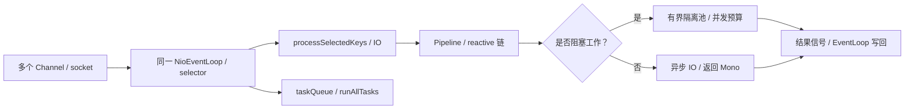

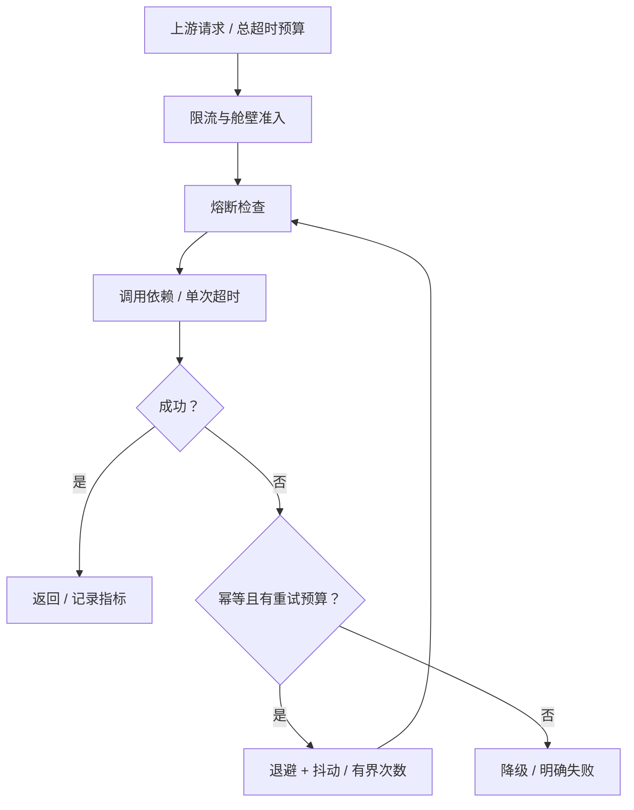

## 面试官三层追问

### 1. Gateway 用了 Reactor，为何还会全站卡顿？
<details markdown="1"><summary>展开三层参考答案</summary>

**第一层：**reactive 容器不能把阻塞调用自动变异步，EventLoop 内阻塞会影响它负责的多个连接。

**第二层：**jstack 多次看到 reactor-http-nio 线程停在 JDBC/socket read 或 sleep，NioEventLoop.run 无法继续 selected key 与 task 处理。一个 channel 串行不代表一个线程只服务该 channel。

**第三层：**使用异步客户端或有界阻塞隔离，依赖超时和舱壁同时设置；压测慢下游，并用受控阻塞检测工具发现错误调用点。增加 Netty 线程只算暂缓。
</details>

### 2. publishOn 和 subscribeOn 如何区分？
<details markdown="1"><summary>展开三层参考答案</summary>

**第一层：**subscribeOn 改变订阅/源执行上下文，publishOn 改变后续信号处理线程。

**第二层：**publishOn 通过预取队列与 drain 转发信号，fromCallable 的阻塞源可用 subscribeOn 调度；已经执行的阻塞代码不会因后面加 publishOn 被重新迁移。

**第三层：**控制线程切换次数和队列，不能每个 operator 都换池。事务与租户通过正确 Context 协议，桥接 JDBC 时重新定义本地事务边界。
</details>

### 3. 背压是否等于不会 OOM？
<details markdown="1"><summary>展开三层参考答案</summary>

**第一层：**不是。协议内限制需求，但无界 buffer、外部推送源或业务持有对象仍可导致增长。

**第二层：**request(n)、prefetch 和队列协调每段流，onBackpressureBuffer 若选无界会把压力转为内存；取消不保证所有底层阻塞动作立即结束。

**第三层：**每个边界定义并发/容量/超时和丢弃语义，监控缓冲长度与旧任务占用。关键交易不能用 Drop/Latest 随意丢事件，需可靠队列承接。
</details>

### 4. 重试为什么会导致雪崩？
<details markdown="1"><summary>展开三层参考答案</summary>

**第一层：**失败时新增请求正好打到已过载依赖，且多层重试次数相乘。

**第二层：**超时的原请求可能仍执行，再次尝试与旧调用并行；相同退避时间产生同步峰值，抖动与全链路预算能减轻但不消除过载。

**第三层：**重试只放合适一层、限制总时间/次数，结合熔断、舱壁和幂等；设置请求级重试预算及服务级重试占比，故障时先限流而非自动无限补偿。
</details>

### 5. 线程池和连接池应该设多大？
<details markdown="1"><summary>展开三层参考答案</summary>

**第一层：**由到达率、服务时间、CPU/IO 与下游容量决定，没有统一 CPU×N 能覆盖所有场景。

**第二层：**L≈λW 是稳定条件下平均关系；排队、长尾和资源竞争会破坏简单估计。连接是数据库并发限制，线程多于连接只增加等待者。

**第三层：**建立端到端预算，压测找吞吐拐点，保留故障时剩余实例容量；限制队列等待并监控 active/pending/reject，不能以“无拒绝”为成功指标。
</details>

### 6. 灰度发布如何保证可恢复？
<details markdown="1"><summary>展开三层参考答案</summary>

**第一层：**稳定流量分组、观测新旧版本、明确自动/人工回退条件，并保障数据格式兼容。

**第二层：**header 染色跨调用和消息传播，schema 先兼容扩展再迁移，旧消费者仍能处理事件；异步链路缺标签会让灰度失控。

**第三层：**按租户不变量/错误率/尾延迟比对，预演回退和流量切换。回滚代码不自动回滚已提交的数据，危险写入要事先设计修复方案。
</details>

## 模拟生产案例：认证过滤器阻塞事件循环

**故障现象：**Gateway CPU 不高，多个无关接口同时超时，数据库短时变慢后迅速放大。**排查思路：**对齐 trace、event-loop 栈、数据库连接 pending 与客户端重试；确认是否只有认证链执行慢。**原理分析：**GlobalFilter 中同步 JDBC 查询用户，多个 channel 共用 EventLoop 被阻塞，超时重试进一步叠加。**根因和验证证据：**模拟 DAO sleep，reactor-http-nio 栈长期停在同步查询；改为有界隔离并减少每层重试后，无关路由恢复，而认证按预算明确失败。**解决方案：**使用可接受时效的认证缓存/异步客户端，必要 JDBC 有界隔离和专门准入，设置连接与调用超时。**长期预防：**慢依赖注入、线程阻塞检查、trace 上下文测试、总重试预算及事件循环延迟告警。关联阅读：<a href="#c1">线程池拒绝</a>、<a href="#c4">Netty 内存</a>、<a href="#c8">缓存失效</a>。

## 面试回答与核心总结

### 60 秒快速回答

Gateway 的 reactive filter 链运行在 Netty 事件模型上，一个 EventLoop 服务多个连接，阻塞 JDBC 会扩大故障。Reactor 用 request(n)、队列和调度实现背压，subscribeOn 与 publishOn 作用位置不同，但不能自动保护外部资源。稳定性需要总超时、单层有界重试、抖动、熔断和舱壁；容量按实际服务时间与下游能力估算，灰度必须兼容数据和异步链路并预演回退。

### 2～3 分钟深入回答

从 RoutePredicateHandlerMapping 到 FilteringWebHandler 讲路由与 filter 进入/返回顺序，再用 EventLoop 的 IO/task 循环解释同步认证为何拖慢无关接口。说明 fromCallable 的隔离与 publishOn 的预取队列，强调取消后 JDBC 可能继续占资源。随后计算三层三次尝试如何放大到 27 次，提出端到端预算、幂等和 retry budget。最后按 L≈λW、吞吐拐点与故障余量做容量设计，用流量染色和兼容 schema 保证发布可恢复。

在容量上我会给一个依赖变慢的数值例子：1000QPS、20ms 时平均执行并发 20，升到 500ms 就需要约 500，资源不足后排队，叠加重试会更坏。此时限制准入和全链路预算优于扩线程。发布侧要稳定流量分组、标签贯穿异步事件，schema 先兼容，回退代码不回滚数据。验证使用慢依赖、缓存失效和 Broker 故障压测，观察队列/连接 pending 与业务 p99，并避免闭环压测降低到达率掩盖排队。

### 高频追问、常见错误与速记

高频追问：timeout 会停止 SQL 吗？MDC 怎么跨线程？压测是否掩盖排队？常见错误：一连接一线程；返回 Mono 就非阻塞；boundedElastic 无限；背压一定不 OOM；增加连接池就提升 DB 吞吐；代码回滚自动修复数据。源码：FilteringWebHandler.handle，DefaultGatewayFilterChain.filter，NioEventLoop.run/runAllTasks，FluxPublishOn.onNext/drain，Reactor request 协议。核心知识：**事件线程→有界异步→依赖预算→恢复与发布**。


## 官方资料与版本来源

联网核对日期：2026-10-08。固定版本用于解释实现，不代表最新生产推荐版本。源码摘录版权见 [source-notices.txt](./source-notices.txt)，下载记录与摘要见 [sources.json](./sources.json)。

- [NioEventLoop.run · Netty 4.1.108.Final](https://raw.githubusercontent.com/netty/netty/netty-4.1.108.Final/transport/src/main/java/io/netty/channel/nio/NioEventLoop.java)
- [FluxPublishOn.onNext · Reactor 3.4.34](https://raw.githubusercontent.com/reactor/reactor-core/v3.4.34/reactor-core/src/main/java/reactor/core/publisher/FluxPublishOn.java)
- [FilteringWebHandler.handle · Spring Cloud Gateway 3.1.8](https://raw.githubusercontent.com/spring-cloud/spring-cloud-gateway/v3.1.8/spring-cloud-gateway-server/src/main/java/org/springframework/cloud/gateway/handler/FilteringWebHandler.java)
- [Reactor 3.4.34 Reference](https://projectreactor.io/docs/core/3.4.34/reference/)
