# Java核心技术与架构实践学习手册

# Java 并发编程与锁机制

本章使用 OpenJDK 8u462-b08 和 HotSpot 8。先从一个容易写错的计数器说起，再看线程拿不到锁时到底发生了什么。

## 核心知识与原理

### JMM 与 happens-before

假设两个线程各执行一次 `count++`，初始值是 0。我们期待结果是 2，但两个线程可能都先读到 0，各自算出 1，最后都把 1 写回去。问题出在“读取、计算、写回”这三个动作可以交错。即使把 count 声明为 volatile，也没有把这三个动作合成一步。

volatile 适合另一种问题：一个线程修改开关，另一个线程需要读到这个修改。例如服务关闭时，将 `running` 改为 false，工作线程下一次读取它时应按 volatile 的规则观察这个状态。它还约束相关读写的顺序。发布配置时，可以先把配置对象构造完整，再把它赋给 volatile 引用；读线程读取这个引用后，才能放心使用已经写好的配置字段。

JMM，也就是 Java Memory Model，规定的正是线程之间能看到什么结果。happens-before 可以理解为一条可见性保证：如果操作 A happens-before 操作 B，那么 A 的写入对 B 可见。常见来源包括同一线程的程序顺序、同一把锁的解锁与后续加锁、volatile 写与后续读，以及 start、join。这些关系可以传递。

这里容易混淆两件事：CPU 可以调整指令的实际执行顺序，但最终被其他线程观察到的结果必须遵守 JMM。不能因为本机跑了十万次都正常，就认为一段存在数据竞争的代码是正确的。双重检查锁里的引用为什么需要 volatile，也应从“对象是否构造完整才被其他线程看到”来解释。

final 字段在正确构造时有特殊的初始化保证，不过构造函数里把 this 提前交出去会破坏使用前提。final 修饰一个 List 引用，也只表示这个引用不能重新赋值，并不阻止线程修改 List 中的元素。

### synchronized 与 CAS

synchronized 的含义很直接：同一时刻只有一个线程可以进入受同一把锁保护的代码，解锁前的写入对后续拿到这把锁的线程可见。关键是“同一把锁”。两个线程分别锁各自新建的对象，仍然可能同时修改同一个库存。

HotSpot 8 为减少加锁开销做了多种优化。没有竞争时，偏向锁可以避免重复的同步操作；轻量级锁尝试用 CAS 和线程栈上的锁记录完成加锁；竞争严重时会使用 ObjectMonitor。对象头里的 Mark Word 保存相关状态。这些路径不是每次都按一条固定阶梯逐级走完，JIT 还可能消除不逃逸对象上的锁，或者合并相邻的加锁范围。偏向锁属于这里的 JDK 8 实现，不能照搬到已经移除它的新 JDK。

CAS 的意思是：只有当前值仍等于我刚才看到的值，才把它改成新值。库存当前为 10，线程 A 想改成 9；若线程 B 已先改成 8，A 的 CAS 就会失败，必须重新读取后决定是否再试。在 x86 上，相关原子读改写通常借助带 lock 前缀的指令，如 cmpxchg；其他 CPU 的实现不同。

CAS 只比较当前值，所以看不出“10 变成 8，后来又变回 10”这段历史。这就是 ABA。若历史变化影响判断，可以把版本号和数据一起比较，例如 AtomicStampedReference。竞争越激烈，失败重试越多，CPU 和缓存同步的开销也越大，因此 CAS 并不天然比锁快。

### AQS、共享同步器与线程池

AQS 替锁类完成了排队和等待的大部分工作。它保存一个 `state`，具体含义由子类决定：ReentrantLock 用它记录持锁次数，CountDownLatch 用它表示还剩多少次 countDown，Semaphore 用它表示可用许可。

以 ReentrantLock 为例，线程先尝试把 state 从 0 改成 1。成功后记录持锁线程；如果当前持锁者就是自己，只增加次数，这就是可重入。别的线程拿不到锁，就进入 AQS 的同步队列。队列头是一个占位节点，真正等待的线程在后面。

Condition 的等待队列是另一条队列。调用 await 的线程先释放锁，再等待条件；signal 把它移回同步队列，它还要重新拿到锁才能继续。被叫醒时，条件可能已经被其他线程改变，所以应写 `while (!条件满足) await()`，而不是只判断一次。

公平锁会检查队列前面是否还有人，非公平锁允许新到线程先尝试抢锁。公平锁通常减少长时间等不到锁的风险，但可能损失吞吐。一个容易漏掉的细节是：公平 ReentrantLock 的无参数 `tryLock()` 仍会尝试直接抢锁。

AtomicInteger 把更新集中在一个数值上。LongAdder 则把高并发计数分散到多个 Cell，读取总数时再加起来；读取过程中这些 Cell 仍可能改变，所以 sum 不是某个瞬间的完整快照。统计请求数很合适，判断“余额够不够扣”则不合适。CountDownLatch 归零后不能重置；Semaphore 可以限制同时进行的操作数，获取成功后要在 finally 中归还许可。

线程池的处理顺序尤其值得记住。线程数不足 core 时先开线程；达到 core 后先把任务放进队列；队列装不下才尝试增到 maximum；仍装不下就拒绝。因此，core=8、max=64 配上无界队列，通常只会有 8 个工作线程，更多任务都在排队。

拒绝策略决定过载时业务会怎样。AbortPolicy 抛异常，调用方必须处理；CallerRunsPolicy 让提交者执行任务，可以减慢提交速度，但提交者若是 Netty EventLoop，就会连累其他连接；Discard 和 DiscardOldest 会丢任务，不适合直接处理订单或支付。设置队列大小前，先想清楚请求最多能等多久，以及每个排队任务占多少内存。

### 手工推演：释放与取消为什么不会丢队列

考虑 `head → A → B`。A 在等锁，B 已经取消等待。释放锁时，AQS 会寻找仍有效的等待者；遇到不能直接使用的后继，可能从队尾反向寻找。等待线程也会跳过已经取消的前驱并修补链接，避免一个取消节点挡住后面所有人。

A 被唤醒后并没有直接得到锁。假如新来的非公平线程先抢到了，A 还得继续尝试和等待。排查线程长期 WAITING 时，先找谁持锁、它在做什么，再判断队列是否还在前进。一张线程栈只能说明当时在等，连续几张栈更有助于区分短暂竞争和真正卡住。

类似地，shutdownNow 只是尝试中断工作线程，并不会强制停止所有代码。阻塞 IO 或忽略中断的任务仍可能运行。Future.get 超时也只是调用方不再等结果；如果任务没有被取消，或不能及时响应取消，它依然占用线程和连接。


## 源码级解析与调用链

拿锁的入口是 `AbstractQueuedSynchronizer.acquire`。它先让子类的 tryAcquire 试一次，失败才 addWaiter 入队；acquireQueued 负责后续反复尝试和等待。释放端通过 tryRelease 判断是否完全释放，再寻找后继唤醒。

线程池从 `execute` 看最容易：不足 core 时 addWorker，之后尝试 workQueue.offer，装不下才用 maximum 限制加 worker。Worker 自身继承 AQS，主要保护这个工作线程的执行状态，并没有把整个池的任务串成一条。runWorker 执行任务和钩子，worker 异常退出由 processWorkerExit 后续处理。


<div class="source-caption"><code>AbstractQueuedSynchronizer.acquire</code><span>OpenJDK 8u462-b08 · L1197–L1202 · <a href="https://github.com/openjdk/jdk8u/blob/jdk8u462-b08/jdk/src/share/classes/java/util/concurrent/locks/AbstractQueuedSynchronizer.java#L1197-L1202">完整源码</a></span></div>

```java
    public final void acquire(int arg) {
        if (!tryAcquire(arg) &&
            acquireQueued(addWaiter(Node.EXCLUSIVE), arg))
            selfInterrupt();
    }

```

读这 6 行时先看短路条件：tryAcquire 成功后，后面的入队不会执行。失败才把当前线程包装为独占节点，再交给 acquireQueued。selfInterrupt 用于恢复等待期间记录到的中断状态，这个入口本身不是可中断获取。


<div class="source-caption"><code>AbstractQueuedSynchronizer.acquireQueued</code><span>OpenJDK 8u462-b08 · L857–L875 · <a href="https://github.com/openjdk/jdk8u/blob/jdk8u462-b08/jdk/src/share/classes/java/util/concurrent/locks/AbstractQueuedSynchronizer.java#L857-L875">完整源码</a></span></div>

```java
    final boolean acquireQueued(final Node node, int arg) {
        boolean failed = true;
        try {
            boolean interrupted = false;
            for (;;) {
                final Node p = node.predecessor();
                if (p == head && tryAcquire(arg)) {
                    setHead(node);
                    p.next = null; // help GC
                    failed = false;
                    return interrupted;
                }
                if (shouldParkAfterFailedAcquire(p, node) &&
                    parkAndCheckInterrupt())
                    interrupted = true;
            }
        } finally {
            if (failed)
                cancelAcquire(node);
```

循环里的 p 是当前节点的前驱。只有前驱已成为 head，当前线程才尝试获取。成功后把自己设为新 head；失败才判断是否 park。唤醒后继续这个循环，所以唤醒与锁所有权是两件事。


<div class="source-caption"><code>ThreadPoolExecutor.execute</code><span>OpenJDK 8u462-b08 · L1342–L1365 · <a href="https://github.com/openjdk/jdk8u/blob/jdk8u462-b08/jdk/src/share/classes/java/util/concurrent/ThreadPoolExecutor.java#L1342-L1365">完整源码</a></span></div>

```java
    public void execute(Runnable command) {
        if (command == null)
            throw new NullPointerException();
        /*
         * Proceed in 3 steps:
         *
         * 1. If fewer than corePoolSize threads are running, try to
         * start a new thread with the given command as its first
         * task.  The call to addWorker atomically checks runState and
         * workerCount, and so prevents false alarms that would add
         * threads when it shouldn't, by returning false.
         *
         * 2. If a task can be successfully queued, then we still need
         * to double-check whether we should have added a thread
         * (because existing ones died since last checking) or that
         * the pool shut down since entry into this method. So we
         * recheck state and if necessary roll back the enqueuing if
         * stopped, or start a new thread if there are none.
         *
         * 3. If we cannot queue task, then we try to add a new
         * thread.  If it fails, we know we are shut down or saturated
         * and so reject the task.
         */
        int c = ctl.get();
```

这里的顺序就是 core、queue、maximum。offer 成功后还有 recheck，这是为了处理任务入队与线程池关闭同时发生；它不是只要入队就不再检查。


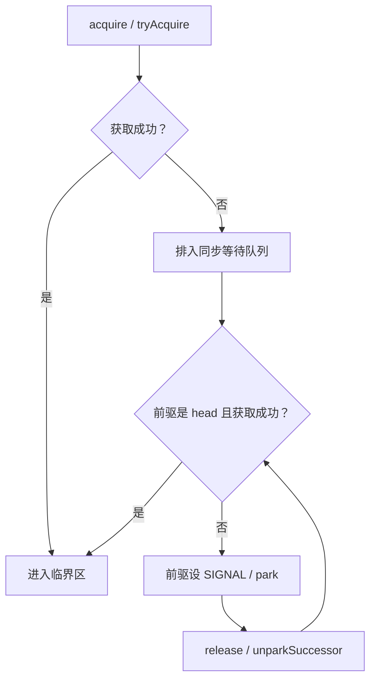

## 三层原理问答

### 1. volatile 能替代锁吗？

<details markdown="1"><summary>查看回答与追问</summary>

不能全面替代。volatile 适合状态开关和完整配置的引用发布。`count++` 即使读写可见，两个线程仍可能各自读到同一个旧值，再写回相同结果。要把检查和修改一起保护，才应使用锁或原子操作。

**配置字段为什么也能被读到？** 构造配置时先写字段，再写 volatile 引用；另一个线程读取这个引用后，相关先前写入通过 happens-before 对它可见。AtomicInteger 的自增则走原子读改写，与普通 volatile 自增不同。

**库存怎么处理？** 如果要求库存足够才扣减，必须将条件和扣减做成一个原子动作。可用 CAS 循环，涉及持久业务时通常用数据库条件 UPDATE。单给库存字段加 volatile 还不够。
</details>

### 2. AQS 为什么先设置 SIGNAL 再 park？

<details markdown="1"><summary>查看回答与追问</summary>

等待线程先把“释放锁时请叫醒我”记录在前驱节点上，才能安心 park。这样释放方知道后面有人在等。unpark 可以提前给一个许可，所以通知比 park 早到，也不一定丢失。

**哪行代码避免刚设完 SIGNAL 就睡错？** shouldParkAfterFailedAcquire 设置前驱状态后先返回 false，外层循环会再试一次拿锁。真的等待和醒来以后，都继续检查获取条件，而不是把通知当成拿锁成功。

**线程长期 WAITING 怎么查？** 先找持锁线程的业务栈。如果它一直等慢 SQL，后面排队是结果，问题在锁内做了慢 IO。连续采样再判断谁不前进，比只看到 park 就怀疑 AQS 更可靠。
</details>

### 3. 公平锁是否一定更好？

<details markdown="1"><summary>查看回答与追问</summary>

公平锁减少新线程直接插队的机会，常能改善最长等待时间；非公平锁允许先抢一下，通常有利于吞吐。哪种更好取决于是否真的有人长期等不到，以及切换开销有多大。

**公平到什么程度？** FairSync.tryAcquire 先检查 hasQueuedPredecessors，再尝试 CAS；已经持锁的线程可以重入。无参数 tryLock 仍采用非公平尝试，所以公平实例也不承诺所有入口严格 FIFO。

**项目里如何决定？** 在同一负载下比较吞吐、p99、最长等待和 CPU。若锁里是一个 2 秒的接口调用，先缩短持锁范围，换公平锁不能让这个调用变快。
</details>

### 4. LongAdder 为什么快，何时不能用？

<details markdown="1"><summary>查看回答与追问</summary>

多个线程反复修改同一个计数器，会争抢同一处更新。LongAdder 高竞争时把写入分散到多个 Cell，最后求和，减少这种争抢。AtomicInteger 则更适合需要精确单值更新的地方。

**sum 为什么不能当快照？** Striped64.longAccumulate 根据线程 probe 选 Cell，失败后可能换槽或扩容。sum 逐个读 base 和 Cell 时，其他线程仍在修改它们，因此这些值不一定来自同一个瞬间。

**能不能用于抢票？** 请求总量统计允许短时偏差，可以用它；判断还有没有最后一张票，需要检查和扣减一起成功，不能先 sum 再减。应选精确 CAS 或数据库条件更新。
</details>

### 5. 线程池为什么没扩到 maximumPoolSize？

<details markdown="1"><summary>查看回答与追问</summary>

因为线程池到 core 之后优先入队，只有队列装不下才尝试加非核心线程。无界队列几乎不会因为容量返回失败，所以 max=64 并不意味着它一定会扩到 64。

**源码里还有什么检查？** execute 成功 offer 后重新检查池状态。若此时已关闭，会尝试移除并拒绝；若没有 worker，还要补一个线程。这里也处理提交和关闭同时发生的情况。

**线上应该怎么配？** 先确认下游能完成多少任务、允许排队多久，再用有界队列和明确拒绝。还要记录队列等待、拒绝和 Future 异常。只增加线程而数据库连接不变，常常只是增加等待者。
</details>

### 6. 如何区分死锁、锁竞争和线程饥饿？

<details markdown="1"><summary>查看回答与追问</summary>

死锁是几方相互等待、谁也不能释放对方需要的资源；锁竞争是有人等待一个仍在工作的持有者；线程饥饿可能来自没有可用线程执行后续工作。CPU 低时三者都可能出现。

**线程栈能区分什么？** Monitor 等待常见 BLOCKED，AQS park 常见 WAITING，jstack 的锁与 ownable synchronizers 信息可帮助建立等待关系。同一满线程池中父任务等子任务，也可能卡住，却没有传统 Monitor 环。

**修复要针对哪种原因？** 循环锁采用固定加锁顺序；长持锁移出慢 IO；父子任务饥饿拆开执行器或改异步组合。用多次线程栈和队列变化确认恢复，不要只把池调大。
</details>

## 模拟生产案例：队列吞噬内存

导出服务越来越慢，core=8、max=64，实际却一直只有 8 个工作线程。更多任务排在队列中，最终堆内存耗尽。这是一种模拟情境，用来区分线程配置问题和任务泄漏。

先连续记录 activeCount、queue.size、完成速率和数据库响应时间，再看工作线程的栈。若是无界队列加慢数据库，应该能看到队列持续增长，工作线程多在等查询；dump 中则能追到队列持有请求对象。这些信息一起出现，才支持这个解释。

原因是 core 满后任务优先进队列，没有触发增加非核心线程；数据库变慢又降低完成率。先暂停或限制新导出，之后改成有界队列、明确拒绝和异步导出结果查询。增加线程前核对数据库连接能力。

验证时重放相同慢依赖条件，检查内存是否稳定、拒绝是否可预期、用户能否知道任务未被接受。长期监控排队时间，处理取消与异常，避免客户端收到拒绝后立即大量重试。

## 知识梳理与核心总结

### 一分钟要点回顾

volatile 能让状态修改按规则被其他线程看到，但不能把 count++ 变成一个动作。锁用于保护一起完成的检查和修改，CAS 用于一个状态的原子更新。ReentrantLock 拿不到锁时由 AQS 排队，被唤醒后还要再抢。线程池要注意先 core、再队列、最后 max，所以无界队列会隐藏过载。我会先看谁持锁、谁在排队、下游完成多少，再决定改锁还是改容量。

### 深入理解与机制串联

我会先把可见性和原子性分开。两个线程各执行 count++，即使 count 是 volatile，也可能都读到 0、都写回 1。volatile 更适合发布一个已构造完整的配置引用；若要检查库存并扣减，就得把这两步一起保护。

ReentrantLock 用 AQS 的 state 记录获取次数，再记录谁持锁。当前线程已经持有时可以重入，别人获取失败就进入同步队列。等待前设置前驱 SIGNAL，让释放方知道需要唤醒后继。醒来后仍调用 tryAcquire，不能把一次 unpark 当成锁已交给自己。Condition 则先在另一条队列等，signal 后转回同步队列，重新拿锁再检查条件。

公平锁会考虑前面有没有等待者，非公平锁允许新到线程先试一下；但公平实例的无参数 tryLock 也可能插队。选型要看吞吐和最长等待，不是只看名字。高并发统计可用 LongAdder 分散写入，不过 sum 不是一个瞬间的快照，不能用于最后一张票的判断。

线程池我会具体看 execute：core 不足先加线程，之后先入队，队列满才试 max。无界队列下，max 调大可能没用。如果慢数据库让任务堆积，要先限制排队和回源，给拒绝明确业务处理。CallerRuns 在普通提交线程上能减速，但放到网关事件线程上可能拖累其他请求。

最后用连续线程栈、队列变化、完成率和尾延迟验证原因。锁内慢 IO、线程池父任务等子任务、真正循环死锁，需要不同改法。关闭和取消也要处理资源释放；调用方超时不代表任务已经停止。

### 延伸问题、常见误解与速记

- 高频追问：Condition 为什么用 while？公平 tryLock 会不会插队？Future 里的异常谁来处理？
- 容易答错：把 volatile 说成互斥；把唤醒说成拿锁；认为 LongAdder.sum 精确；只加线程不看连接池。
- 常看的源码：`AQS.acquire/acquireQueued/release`、`ReentrantLock.Sync`、`Striped64.longAccumulate`、`ThreadPoolExecutor.execute/runWorker`。
- 阅读时分清：状态是否可见、修改是否一起完成、线程怎样等待，以及过载任务去哪了。


## 官方资料与版本来源

本文按上述版本阅读官方源码，节选可能省略方法的其他分支。版权见 [source-notices.txt](./source-notices.txt)，下载记录见 [sources.json](./sources.json)。

- [AbstractQueuedSynchronizer.acquire · OpenJDK 8u462-b08](https://raw.githubusercontent.com/openjdk/jdk8u/jdk8u462-b08/jdk/src/share/classes/java/util/concurrent/locks/AbstractQueuedSynchronizer.java)
- [ReentrantLock.Sync.nonfairTryAcquire · OpenJDK 8u462-b08](https://raw.githubusercontent.com/openjdk/jdk8u/jdk8u462-b08/jdk/src/share/classes/java/util/concurrent/locks/ReentrantLock.java)
- [ThreadPoolExecutor.execute · OpenJDK 8u462-b08](https://raw.githubusercontent.com/openjdk/jdk8u/jdk8u462-b08/jdk/src/share/classes/java/util/concurrent/ThreadPoolExecutor.java)


---

# HashMap 与 ConcurrentHashMap

本章看 OpenJDK 8u462-b08。读 Map 源码时，沿着“一个 key 放在哪里、冲突怎么办、扩容时怎么搬”这三个问题往下走，会比先背阈值更容易理解。

## 核心知识与原理

### HashMap 的桶、树与迁移

HashMap 可以先看成一个数组。每个数组位置叫一个桶，key 的 hash 决定它进哪个桶。两个 key 落到同一个桶时，用链表串起来；碰撞太多且数组容量足够大时，再把这个桶改成红黑树。

数组长度是 2 的幂，因此可以用 `(n - 1) & hash` 找下标。长度为 16 时，只用到 hash 的低 4 位。如果很多 key 的差异都在高位，它们仍会挤到少数桶里。`hash()` 先做 `h ^ (h >>> 16)`，把高位信息混入低位，就是为了缓解这类碰撞。这一步无法拯救所有糟糕的 hashCode，更不是加密。

默认负载因子是 0.75。长度 16 的表通常在元素数量超过 12 时扩容，但 table 是第一次 put 时才分配的。Node 保存 hash、key、value 和 next。key 放进去后，参与 hashCode 或 equals 的字段应保持稳定，否则再次查询可能算出另一个桶，原来的数据明明还在，却查不到。

树化涉及三个数字：链长阈值 8、退树阈值 6、最小树化容量 64。它们不是“第 8 个元素必定成树，第 6 个必定退树”的机械规则。`treeifyBin` 发现容量不足 64 时会先扩容；具体第几次插入触发调用要看 putVal 的链长计数。扩容拆树时会看分组后的数量，而普通删除还会检查树形。

JDK 7 的某些扩容交错会把链表接成环，JDK 8 改变迁移方式后解决了这一类问题。但两个线程仍可能同时写同一个桶，把对方的更新覆盖掉，size 也可能算错。所以 JDK 8 HashMap 依然不能用于没有同步保护的并发读写。fail-fast 迭代器能尽力报告修改，却不能替你保护数据。

### ConcurrentHashMap 的读写协议

JDK 8 ConcurrentHashMap 的主体也是数组和桶，不再依靠 JDK 7 那套 Segment 数组。插入时，如果目标桶是空的，就用 CAS 放入第一个节点；如果桶已有节点，就锁住桶头，修改这个桶。拿到锁后还要确认它仍是当前桶头，因为等待期间可能发生了扩容。

get 通常不需要取得桶锁。它通过带 volatile 语义的槽位读取，以及节点中的 volatile value、next，查找已经发布的节点。遇到普通链表就沿链走，遇到特殊节点就交给它的 find 方法。树桶由 TreeBin 管理，有自己的读写协调方式。

扩容时的难题是：搬到一半，其他线程仍在读写。CHM 的办法是在搬完的旧桶里放一个 ForwardingNode，它指向新数组。读线程遇到它就去新表找，写线程遇到 MOVED 时还可以帮助搬迁。

`transferIndex` 记录还有哪些区间没分配，各线程领取不同区间，减少重复搬迁。`sizeCtl` 平时用于初始化或扩容阈值，扩容时还编码了本轮扩容标识和参与者信息，不能简单理解成一个负的线程数。最后负责收尾的线程才把新表正式发布为 table。

元素数量也被分散统计：低竞争时更新 baseCount，竞争激烈时更新 CounterCell。size 把它们相加，并没有暂停全表的更新。因此没有并发修改时可以得到准确数量，修改期间应把它当作估计。mappingCount 返回 long，仍不意味着它是一份全表快照。CHM 不接受 null key 或 value，这让 get 返回 null 可以明确表示没有映射。

### 原子 API 的边界

下面的写法有竞态：先 get，发现没有，再 put。两个线程可能都发现没有，各自写入。putIfAbsent 把检查和插入放在一个操作里，只有一个线程能安装自己的值。

computeIfAbsent 进一步允许你在缺值时计算结果。不过，JDK 8 的某些路径会在桶锁内运行计算函数：若函数去访问一个很慢的远程接口，碰撞到同一个桶的其他 key 也会跟着等。空桶路径还可能使用 ReservationNode 占位。函数应短小，不要递归修改这个 Map；返回 null 或抛异常都不会成功安装映射，以后的调用还可能重算。

缓存远程数据时，可以先用短操作安装一个 Future，再在单独的线程池里执行加载。这样仍需处理加载失败、过期和容量，不能只把一个慢操作改成无界异步任务。Map 能保证自己的单次修改，却不能保证远程调用只执行一次，也不能替两个 key 的联合修改提供事务。

### 手工推演：从 16 扩容到 32

旧表长度是 16。hash=3 和 hash=19 都会进入桶 3，因为它们的低 4 位相同。扩成 32 后多用一位：`3 & 16` 是 0，所以留在桶 3；`19 & 16` 不是 0，所以移到桶 19，也就是旧下标加 16。

因此每个旧桶只拆成两组，元素不会散到任意新桶。HashMap 在拆链时保留每组的相对顺序。CHM 的细节略有不同：它可以复用 lastRun 后缀，并为前面部分建立新节点。共同点是，CHM 必须先发布新表中的两个桶，再把旧桶替换成 ForwardingNode。否则读线程顺着指引过去，却找不到已经迁移的内容。


## 源码级解析与调用链

先看 `HashMap.hash` 为什么混高位，再看 CHM 的 `putVal` 怎样分空桶、迁移桶和普通桶。`transfer` 则是搬迁主循环，它最重要的顺序是先放新桶，后放旧桶的路标。

HashMap 完整插入入口是 putVal，扩容入口是 resize，树化入口是 treeifyBin。更新已有 key 不会增加 size，新增节点才算一次结构修改。CHM 的遍历允许并发变化，通常不抛 ConcurrentModificationException，也不保证一次完整快照。


<div class="source-caption"><code>HashMap.hash</code><span>OpenJDK 8u462-b08 · L338–L341 · <a href="https://github.com/openjdk/jdk8u/blob/jdk8u462-b08/jdk/src/share/classes/java/util/HashMap.java#L338-L341">完整源码</a></span></div>

```java
    static final int hash(Object key) {
        int h;
        return (key == null) ? 0 : (h = key.hashCode()) ^ (h >>> 16);
    }
```

null key 的 hash 是 0。其余 key 先保存 hashCode，再把高 16 位右移与原值异或。最后桶下标仍由 table 长度决定。


<div class="source-caption"><code>ConcurrentHashMap.transfer</code><span>OpenJDK 8u462-b08 · L2435–L2456 · <a href="https://github.com/openjdk/jdk8u/blob/jdk8u462-b08/jdk/src/share/classes/java/util/concurrent/ConcurrentHashMap.java#L2435-L2456">完整源码</a></span></div>

```java
                                }
                            }
                            if (runBit == 0) {
                                ln = lastRun;
                                hn = null;
                            }
                            else {
                                hn = lastRun;
                                ln = null;
                            }
                            for (Node<K,V> p = f; p != lastRun; p = p.next) {
                                int ph = p.hash; K pk = p.key; V pv = p.val;
                                if ((ph & n) == 0)
                                    ln = new Node<K,V>(ph, pk, pv, ln);
                                else
                                    hn = new Node<K,V>(ph, pk, pv, hn);
                            }
                            setTabAt(nextTab, i, ln);
                            setTabAt(nextTab, i + n, hn);
                            setTabAt(tab, i, fwd);
                            advance = true;
                        }
```

ln 和 hn 是拆出的两组。最后三次 setTabAt 先写新表两槽，后写旧槽 fwd；这就是读线程能安全跟着 ForwardingNode 去找新桶的原因。前面的 lastRun 用于复用可用的链表后缀。


<div class="source-caption"><code>ConcurrentHashMap.putVal</code><span>OpenJDK 8u462-b08 · L1008–L1037 · <a href="https://github.com/openjdk/jdk8u/blob/jdk8u462-b08/jdk/src/share/classes/java/util/concurrent/ConcurrentHashMap.java#L1008-L1037">完整源码</a></span></div>

```java

    /** Implementation for put and putIfAbsent */
    final V putVal(K key, V value, boolean onlyIfAbsent) {
        if (key == null || value == null) throw new NullPointerException();
        int hash = spread(key.hashCode());
        int binCount = 0;
        for (Node<K,V>[] tab = table;;) {
            Node<K,V> f; int n, i, fh;
            if (tab == null || (n = tab.length) == 0)
                tab = initTable();
            else if ((f = tabAt(tab, i = (n - 1) & hash)) == null) {
                if (casTabAt(tab, i, null,
                             new Node<K,V>(hash, key, value, null)))
                    break;                   // no lock when adding to empty bin
            }
            else if ((fh = f.hash) == MOVED)
                tab = helpTransfer(tab, f);
            else {
                V oldVal = null;
                synchronized (f) {
                    if (tabAt(tab, i) == f) {
                        if (fh >= 0) {
                            binCount = 1;
                            for (Node<K,V> e = f;; ++binCount) {
                                K ek;
                                if (e.hash == hash &&
                                    ((ek = e.key) == key ||
                                     (ek != null && key.equals(ek)))) {
                                    oldVal = e.val;
                                    if (!onlyIfAbsent)
```

桶空时 casTabAt 安装第一个 Node；看到 MOVED 时帮扩容；其他情况才 synchronized(f)。进入锁后重新比较当前槽和 f，避免用过时桶头修改。


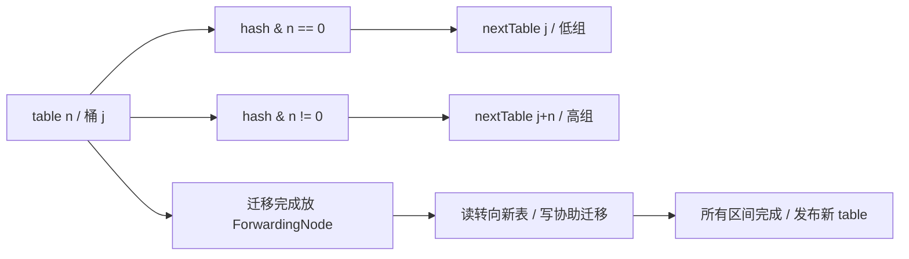

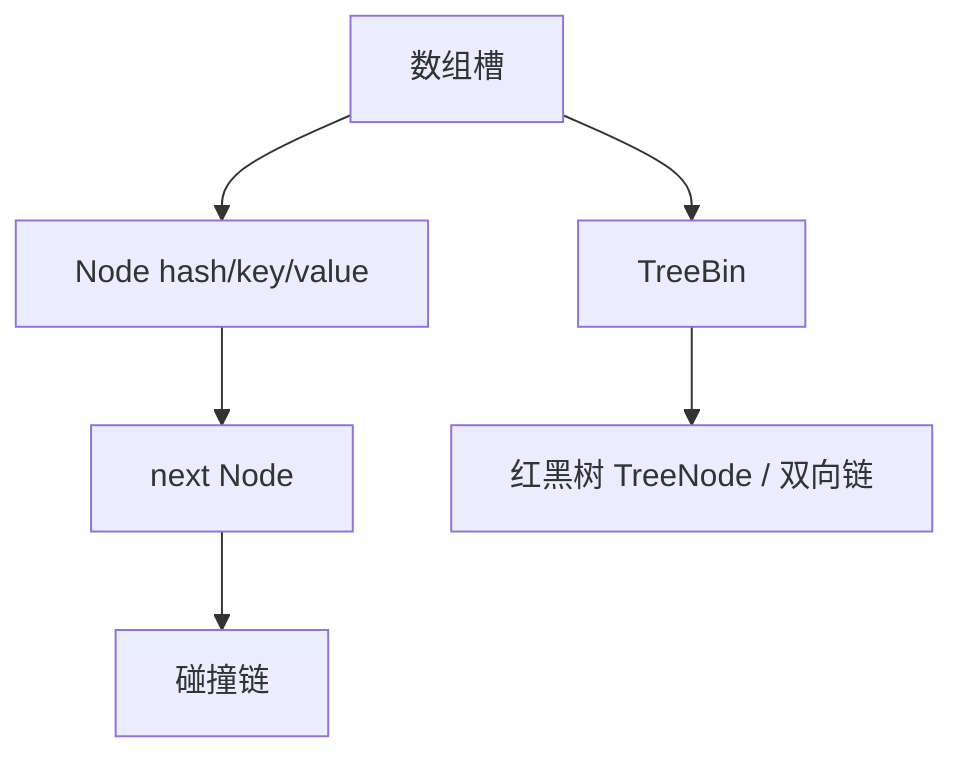

## 三层原理问答

### 1. 为什么用 2 的幂容量和 hash 扰动？

<details markdown="1"><summary>查看回答与追问</summary>

长度为 2 的幂时，可以用位与取下标，扩容也只需看新增的一位。扰动把 hashCode 的高位混到低位，避免只看低几位时一些 key 都进同一个桶。

**扩容为什么不用重新算 hashCode？** 节点已经保存扰动后的 hash。长度翻倍时检查 hash & oldCap，就能决定留在原下标还是移到原下标加 oldCap。完整 hash 不需要重算。

**容量怎么定？** 预估元素数量和负载因子，减少峰值期间迁移。过度预分配也占内存、拖慢某些遍历。若用户 key 的 hashCode 本身很差，还要检查分布和碰撞，不能只扩容。
</details>

### 2. 树化阈值是 8，为何有时仍是链表？

<details markdown="1"><summary>查看回答与追问</summary>

桶里链表较长时会考虑树化，但表长度不足 64 时优先扩容。较小的表里碰撞多，可能只是桶太少，扩容后就分开了，没有必要立即换更重的树节点。

**8 和 6 是怎么用的？** putVal 的链长计数决定何时调用 treeifyBin，不能直接说第 8 个一定树化。扩容拆树时有数量判定，普通删除也会考虑树形；不同路径要分开读。

**树化是不是性能优化首选？** 它主要保护碰撞严重时的表现。先改善 key 的分布。不可比较的 key 在某些树查找路径也有额外代价，不应把所有情况都简化成固定 logN。
</details>

### 3. JDK 8 HashMap 没有迁移环，还安全吗？

<details markdown="1"><summary>查看回答与追问</summary>

仍不安全。JDK 8 避免了旧迁移方式产生环的一类问题，但没有给 HashMap 增加并发写保护。两个 put 仍可能覆盖，读也没有自动获得需要的发布保证。

**具体会错在哪里？** 两线程都看到空桶并分别写入，后写者可能覆盖前写者；size 的增量也不是原子操作。modCount 和 fail-fast 只是尝试发现结构变化，不会互斥地保护数据。

**只读配置能用吗？** 可以先在单线程中构建，安全发布完整引用，并确保之后不修改。动态共享更新可用 CHM，不过多个 key 一起变化的业务规则仍要另加保护。
</details>

### 4. CHM 扩容期间 get 会不会漏数据？

<details markdown="1"><summary>查看回答与追问</summary>

迁移完的旧桶会变成 ForwardingNode，告诉读线程到新表继续找。因此 get 不必等全表搬完。还没迁移的桶仍按原来的结构查询。

**发布顺序有什么讲究？** transfer 先在 nextTable 放好低、高两组，再把旧槽放成 forwarding。写线程遇到 MOVED 可协助迁移，读通过 find 转到新表。不能先给路标，再迟迟没有目的数据。

**两次 get 能保证一起吗？** 不能。每次查询正常，不代表两次之间没人修改。需要多 key 一致状态时，应保存一个整体不可变对象、用外部同步或数据库事务。容量预估只是减少迁移成本。
</details>

### 5. computeIfAbsent 能用来加载远程数据吗？

<details markdown="1"><summary>查看回答与追问</summary>

可以写，但不适合把慢远程 IO 直接放进去。JDK 8 的部分路径会在桶锁内运行函数，同桶其他 key 也会被拖慢。映射函数最好快速完成。

**会不会只执行一次外部动作？** 返回 null 或抛异常不会安装映射，后续可能重算；删除后也可能再加载。ReservationNode 与锁保护的是 Map 操作，不是远程付款等副作用。也不要在函数中递归修改 Map。

**如何改加载？** 用短操作安装 Future，加载交给有界执行器。失败清理用 remove(key, 同一个Future)，免得删掉后来新装的值。还要处理超时、过期和缓存总量。
</details>

### 6. size 能作为并发限流依据吗？

<details markdown="1"><summary>查看回答与追问</summary>

不能。两个线程都可能在 size() 小于上限时通过，然后分别插入。即使 size 读取完全准确，检查和插入之间仍会有竞态。

**为什么并发 size 还是估计？** sumCount 分别读 baseCount 和 CounterCell，其他线程并没有停下来。mappingCount 用 long 解决表达范围，不提供一份冻结的全表快照。

**限额用什么？** 用 Semaphore 或原子条件计数控制准入，并处理失败、取消和过期时的释放。若计数与 Map 插入分离，也要确保失败后两边不会永远不一致。
</details>

## 模拟生产案例：缓存加载造成桶级阻塞

画像缓存用 computeIfAbsent 调远程接口，一个接口超时后，一些不同用户的加载也突然变慢。这是模拟情境，重点检查是否误把远程调用放进了桶锁。

先比较阻塞线程的 Monitor 地址和调用栈，再检查 key 的 hash 分布。若多个不同 key 碰撞到同一桶，应该能看到一个线程在映射函数里等网络，其他线程等同一个 Node Monitor。线程池总体有余量，也不排除这种局部阻塞。

改成快速安装加载 Future，再由有界执行器做 IO。失败时只删除自己安装的那个 Future，设置超时与缓存上限。改善 hashCode 能减少碰撞，但不能代替移出慢操作。

可在测试中使用固定 hashCode 的 key 和慢加载器对照：改后不同 key 不再因为桶锁一起等，重复同 key 仍按预定方式合并。以后测试热点和碰撞，不只测试均匀随机 key。

## 知识梳理与核心总结

### 一分钟要点回顾

HashMap 用数组找桶，碰撞用链表，长链且容量足够时换树。扩容翻倍后只需看旧容量那一位，决定留原桶还是加旧容量。JDK 8 HashMap 仍不适合无同步并发写。CHM 空桶 CAS、有节点时锁桶，搬完的旧桶放 ForwardingNode，读去新表找、写可帮忙搬。size 是并发估计，computeIfAbsent 不适合慢 IO；单个 Map 操作正确，也不等于多个业务步骤有事务。

### 深入理解与机制串联

我会从一个 put 讲起。HashMap 先扰动 hash，把高位信息混到低位，再用长度减一做位与定位桶。桶空就插入，有节点就比较 key，相同则更新，否则追加。链长到触发条件时还要看容量，表不足 64 会先扩容，不是背一个 8 就结束。

扩容可以手算：旧长度 16，hash 3 和 19 都在桶 3。长度变 32 后，3 的新增位是 0，仍在 3；19 的新增位是 1，去 19。HashMap 拆链保留分组内相对顺序，解决了旧头插迁移形成环的一类问题，但没有增加并发保护，覆盖写和 size 错误仍可能发生。

CHM 的空槽用 CAS 安装，非空桶锁住头节点后重查，防止等待期间桶已经变化。读取通过带 volatile 语义的槽和链接查找。扩容先把新桶放好，再在旧桶放 ForwardingNode；读者沿它转向新表，写者还可以协助。transferIndex 分配搬迁区间，最后收尾发布新 table。

计数用 baseCount 和 CounterCell 分散更新，size 求和没有暂停其他线程，所以不能先 size 小于限额再插入。computeIfAbsent 也只负责映射操作，慢计算可能挡住同桶 key，失败还可能再次计算，不能借它保证付款只执行一次。

实际做缓存，我会检查 key 是否稳定、hash 分布、加载耗时和容量。需要多 key 一起变化时另设计同步或数据库事务；加载 IO 则与快速安装占位分开，并测试超时、失败和旧任务清理。

### 延伸问题、常见误解与速记

- 高频追问：为什么 CHM 不接受 null？扩容什么时候发布新表？key 改了为什么查不到？
- 容易答错：CHM 完全无锁；负 sizeCtl 就是负线程数；HashMap 没环就线程安全；映射函数外部副作用只执行一次。
- 常看的源码：`HashMap.hash/putVal/resize/treeifyBin`、`ConcurrentHashMap.putVal/transfer/helpTransfer/addCount/sumCount/computeIfAbsent`。
- 阅读时分清：放入一个 key 的过程，与同时改变多个业务值的过程。


## 官方资料与版本来源

本文按上述版本阅读官方源码，节选可能省略方法的其他分支。版权见 [source-notices.txt](./source-notices.txt)，下载记录见 [sources.json](./sources.json)。

- [HashMap.hash · OpenJDK 8u462-b08](https://raw.githubusercontent.com/openjdk/jdk8u/jdk8u462-b08/jdk/src/share/classes/java/util/HashMap.java)
- [ConcurrentHashMap.transfer · OpenJDK 8u462-b08](https://raw.githubusercontent.com/openjdk/jdk8u/jdk8u462-b08/jdk/src/share/classes/java/util/concurrent/ConcurrentHashMap.java)


---

# JVM 内存管理、CMS 与 G1

本章限定 HotSpot 8u462-b08。JDK 8 服务端通常默认使用 Parallel GC；以下 CMS 和 G1 的流程，需要按实际启动参数选择。尤其注意：这里的 G1 Full GC 仍是单线程实现。

## 核心知识与原理

### 内存、对象分配与安全点

一次请求创建了很多临时对象，请求结束后却不一定立即释放内存。Java 不在对象离开方法时逐个 free，而是在 GC 时判断它们还能不能被访问到。理解这一点，就能区分“还没回收”和“始终回收不掉”。

对象主要在堆中。线程栈保存方法执行需要的局部变量、返回信息等，每个线程有自己的栈；程序计数器和本地方法栈也与线程有关。JDK 8 的类元数据主要放在本地内存中的 Metaspace，字符串对象仍在堆里。方法区是 JVM 规范中的概念，不能把它和某一块具体内存简单画等号。

普通小对象常在 Eden 分配。为了避免每个线程分配时都争抢同一个指针，JVM 会给线程一小块 TLAB，让它在里面快速分配。TLAB 仍属于堆，只是暂时由该线程负责分配；里面的对象照样可以交给其他线程。空间不够时再申请 TLAB 或走慢路径。JIT 还可能通过逃逸分析和标量替换消除某些分配。

Young GC 会把存活对象移到 Survivor，或晋升到老年代。什么时候晋升既看年龄，也看 Survivor 剩余空间和具体收集器策略，因此不能只背一个固定年龄。G1 中超过半个 Region 的对象属于 Humongous，通常需要连续 Region；大数组会带来特别的空间压力。

GC 从 Roots 开始寻找可达对象，例如线程栈中的引用、JNI handle 和活跃类相关引用。两个对象互相引用，但没有任何 Roots 能到达它们，仍可一起回收。为了准确读取线程状态，JVM 需要让线程到达安全点。一次长停顿既可能花在回收工作上，也可能花在等待线程到达安全点上，日志分析时要分清。

### CMS：并发并不意味着无停顿

CMS 主要处理老年代，年轻代通常搭配 ParNew。它希望把大部分工作与应用同时执行，减少连续暂停的时间。大致过程是：暂停做初始标记，恢复应用并发标记，预清理一部分变化，再暂停做重新标记，最后并发清扫和重置。

为什么还要重新标记？因为应用在并发标记期间继续改引用：原来没有被扫描到的对象可能变得可达，已经扫描的对象也可能连上新对象。CMS 需要借助写屏障、卡信息等补齐工作，最终在重新标记时确认哪些对象不能回收。

CMS 正常周期采用标记清扫，不把所有存活对象搬到一起。清出的空间像大小不同的空隙，可能有碎片；标记期间后来才变成垃圾的一部分对象，也要留到下一轮，这叫浮动垃圾。应用仍在分配和晋升，所以不能等老年代快满了才启动。

如果并发回收来不及提供空间，就可能出现 Concurrent Mode Failure，转入前台回收，停顿明显变长。Young GC 晋升失败的 Promotion Failed 是另一种日志现象，二者可能相关，但不是同一个名称的两种写法。排查时要同时看分配速度、CMS 周期、可用空间和碎片，而不是看到 Full GC 就改一个阈值。

### G1：Region、RSet 与 SATB

G1 把堆切成等大的 Region。同一块 Region 可以在不同阶段担任 Eden、Survivor 或 Old。Young GC 暂停应用，将选中区域里的存活对象复制出去，原区域随后可以整体复用。

只回收部分 Region 时，怎么知道外面的对象还引用着里面？RSet 保存来自其他区域的引用信息，帮助 GC 找到这些入口。Card Table 用较粗的卡片粒度标记发生引用更新的位置，后台 refinement 再整理相关信息。因此 RSet 不是一张精确的全堆引用图，维护它也需要 CPU 和内存。

G1 的并发标记使用 SATB。假设 A 原来指向 B，标记开始后应用把这个引用清掉；若 GC 还没扫描到 B，就可能错过标记开始时它仍可达的事实。写前屏障会记录被覆盖的旧引用，帮助保留这份开始时的快照。记住“旧引用”比只背三色标记更能解释这段代码。

初始标记通常搭在一次 Young 停顿里，随后进行 root region scan 和并发标记，再暂停做 remark，并做 cleanup。标记结果告诉 G1 哪些 Old Region 垃圾多、回收划算。之后的 Mixed GC 同时回收 Young 和部分 Old，分几次完成，避免一次把所有 Old 都搬完。

`MaxGCPauseMillis` 是希望达到的目标。G1 根据历史扫描、复制耗时估计本次该选多少 Region，但对象存活率、RSet 大小、CPU 配额都可能改变实际成本，所以它不能保证每次严格按时结束。to-space exhausted 表示搬迁目的空间不够，失败处理会增加工作，严重时可能进入 JDK 8 的单线程 Full GC。

### CMS 与 G1 的选择

|问题|CMS（JDK 8）|G1（JDK 8）|
|---|---|---|
|老年代怎样腾空间？|并发标记后清扫空块，正常周期不整理|标记后分批选择 Region，在暂停中复制存活对象|
|主要怕什么？|回收跟不上分配、浮动垃圾、碎片|搬迁空间不足、RSet 成本、大对象占连续区域|
|该看哪些数据？|并发周期、晋升速度、重标记与失败日志|Young/Mixed 耗时、存活字节、Humongous、标记启动时间|

已有 CMS 系统是否值得换 G1，要用相同流量和数据量测试暂停、吞吐与 CPU。换收集器不会让仍被静态集合引用的对象消失；这种问题需要去看<a href="#c4">对象是谁持有的</a>。

### 回收来得及吗？算一遍新增内存

假设 CMS 一轮并发周期要 4 秒，应用每秒向老年代新增 200MB。回收完成前，应用大约还要用掉 800MB。如果启动时只剩 300MB，就很容易来不及。这个算例不能直接算出最佳参数，但能解释为什么“使用率还没到 100%”也会退化。

G1 也要给并发标记期间的增长、后续 Mixed 和下一次对象搬迁留空间。调低暂停目标可能缩小 Young、增加回收次数，单次暂停变短，总 GC CPU 却上升。每次调整都应保留 JVM 更新号、启动参数、CPU 配额和相同负载下的日志，分别比较 Young、remark、Mixed、Full GC，而不是只比较一次最长停顿。


## 源码级解析与调用链

GC 主过程在 HotSpot 的 C++ 中。CMS 看 `CMSCollector::collect_in_background` 的状态推进，再找每个暂停阶段提交的 VM operation。G1 看 `do_collection_pause_at_safepoint`，并结合 G1CollectorPolicy 的选区预测。

下面两个片段只是入口。并发标记还要看 ConcurrentMark，SATB 屏障涉及 G1SATBCardTableModRefBS。读入口时先确认哪些工作要求安全点，再追实际标记、扫描和复制；仅看 System.gc 的 Java 调用无法解释这些阶段。


<div class="source-caption"><code>CMSCollector::collect_in_background</code><span>HotSpot 8u462-b08 · L2256–L2274 · <a href="https://github.com/openjdk/jdk8u/blob/jdk8u462-b08/hotspot/src/share/vm/gc_implementation/concurrentMarkSweep/concurrentMarkSweepGeneration.cpp#L2256-L2274">完整源码</a></span></div>

```cpp
void CMSCollector::collect_in_background(bool clear_all_soft_refs, GCCause::Cause cause) {
  assert(Thread::current()->is_ConcurrentGC_thread(),
    "A CMS asynchronous collection is only allowed on a CMS thread.");

  GenCollectedHeap* gch = GenCollectedHeap::heap();
  {
    bool safepoint_check = Mutex::_no_safepoint_check_flag;
    MutexLockerEx hl(Heap_lock, safepoint_check);
    FreelistLocker fll(this);
    MutexLockerEx x(CGC_lock, safepoint_check);
    if (_foregroundGCIsActive || !UseAsyncConcMarkSweepGC) {
      // The foreground collector is active or we're
      // not using asynchronous collections.  Skip this
      // background collection.
      assert(!_foregroundGCShouldWait, "Should be clear");
      return;
    } else {
      assert(_collectorState == Idling, "Should be idling before start.");
      _collectorState = InitialMarking;
```

入口先串行协调一次 CMS 周期，并准备老年代相关状态。真正分阶段的工作在后续状态循环中；这个片段不能单独证明所有阶段都没有停顿，要继续读 InitialMarking 和 FinalMarking 的 VM 操作。


<div class="source-caption"><code>G1CollectedHeap::do_collection_pause_at_safepoint</code><span>HotSpot 8u462-b08 · L3972–L3990 · <a href="https://github.com/openjdk/jdk8u/blob/jdk8u462-b08/hotspot/src/share/vm/gc_implementation/g1/g1CollectedHeap.cpp#L3972-L3990">完整源码</a></span></div>

```cpp
bool
G1CollectedHeap::do_collection_pause_at_safepoint(double target_pause_time_ms) {
  assert_at_safepoint(true /* should_be_vm_thread */);
  guarantee(!is_gc_active(), "collection is not reentrant");

  if (GC_locker::check_active_before_gc()) {
    return false;
  }

  _gc_timer_stw->register_gc_start();

  _gc_tracer_stw->report_gc_start(gc_cause(), _gc_timer_stw->gc_start());

  SvcGCMarker sgcm(SvcGCMarker::MINOR);
  ResourceMark rm;

  print_heap_before_gc();
  trace_heap_before_gc(_gc_tracer_stw);

```

方法直接要求当前处于安全点，并禁止 GC 重入。这里就是一次暂停的入口，后面计时和扫描才开始；不能把 G1 的整个过程都称作后台执行。


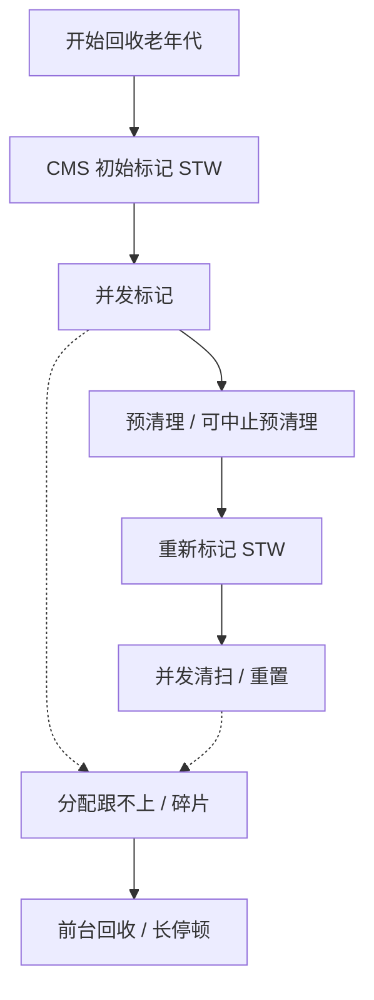

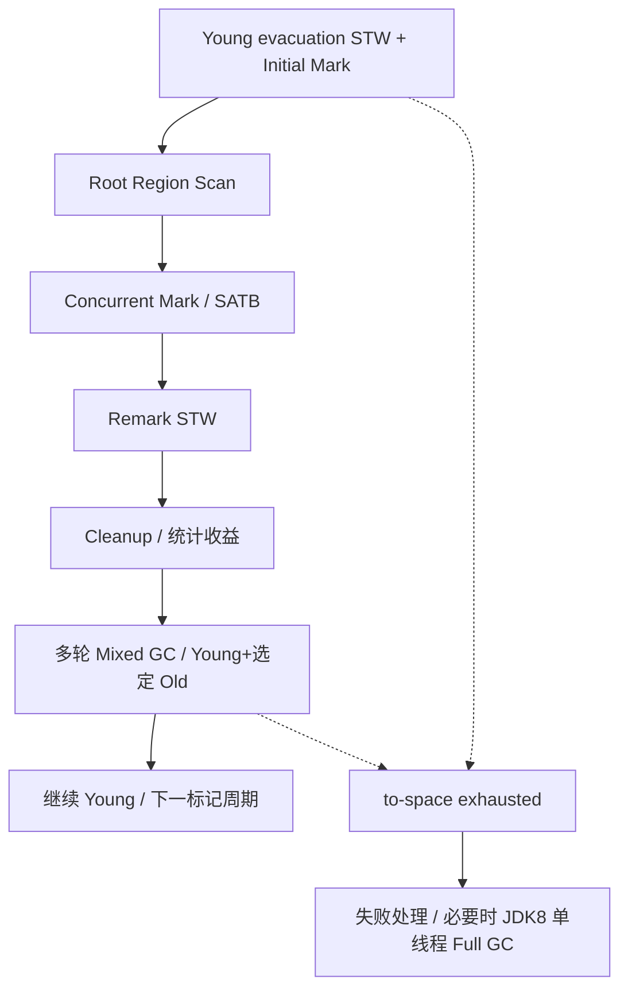

## 三层原理问答

### 1. TLAB 会不会导致线程间对象无法访问？

<details markdown="1"><summary>查看回答与追问</summary>

不会。TLAB 是堆里暂时分给线程的一块分配空间，目的是减少分配指针竞争。对象分配完后，仍然可以由其他线程引用。

**用完 TLAB 怎么办？** 线程尝试申请下一块，或走慢分配路径，必要时触发 GC。TLAB 的分配所有权和对象能否被其他线程看见是两件事，发布仍要遵守 JMM。

**性能上怎么观察？** 看分配速度、TLAB waste 和 GC 时间。如果只是跨线程传对象，不需要关 TLAB；盲目关闭反而可能增加分配竞争。
</details>

### 2. CMS 为什么重新标记，为什么产生浮动垃圾？

<details markdown="1"><summary>查看回答与追问</summary>

并发标记时应用仍在改引用，CMS 需要重新检查这期间产生的变化，所以有重新标记暂停。有些已经标记的对象随后才变成垃圾，这轮仍可能留下，形成浮动垃圾。

**CMS 与 SATB 一样吗？** CMS 通过自身写屏障、卡记录等完成补充标记；G1 的 SATB 保留旧引用快照是另一套具体机制。不能只画同一张三色图，就当两者源码相同。

**空间该留多少？** 看并发周期有多长，期间还会分配和晋升多少。重标记慢还要检查脏卡、年轻代状态和引用处理，不能只调老年代开始回收的百分比。
</details>

### 3. Concurrent Mode Failure 如何定位？

<details markdown="1"><summary>查看回答与追问</summary>

先确认日志里的 Concurrent Mode Failure，说明 CMS 并发期间没能及时提供所需空间，可能转入前台回收。它和 Young 晋升失败的 Promotion Failed 要分别看。

**哪些数据帮助区分？** 比较老年代增长、CMS 周期和启动位置，检查碎片及分配需求。总剩余空间不少却没有合适空块，也可能失败。容器 CPU 变少还会拖长并发周期。

**怎样恢复和修复？** 先限流、保留日志，减少突发分配。再根据证据考虑提前启动、增加合理余量或迁移 G1；若存活对象持续增长，仍要查持有者。重启只说明暂时腾出空间。
</details>

### 4. G1 的 RSet 和 SATB 有何区别？

<details markdown="1"><summary>查看回答与追问</summary>

RSet 帮助回收某些 Region 时找到外部指向它们的引用；SATB 帮助并发标记记住开始时还可达的对象。一个解决局部扫描，一个解决标记期间引用变化。

**屏障记录什么？** SATB 写前记录被覆盖的旧引用；卡记录和 refinement 帮助维护跨 Region 的引用信息。RSet 粒度与卡有关，并非逐对象的精确全引用图。

**耗时高怎样查？** remembered set 扫描与并发标记分开看。长寿命大容器反复指向短命对象，会提高相关工作量。先看对象布局和引用变化，再决定是否调 Region 参数。
</details>

### 5. Mixed GC 是否等于 Full GC？

<details markdown="1"><summary>查看回答与追问</summary>

不是。Mixed 只在一次暂停里回收 Young 和选中的一部分 Old，通常分多轮完成。Full GC 是全堆的另一条路径。

**为什么不一次回收全部 Old？** G1 根据标记结果、存活率和预计成本选 Region，避免一次搬太多存活对象。JDK 8 Full GC 仍是单线程，不能拿较新 JDK 的并行实现解释。

**出现 Full GC 看什么？** 看标记是否太晚、目的空间是否不足、Humongous 是否占连续区域，以及 Mixed 真正释放多少。GC 次数少不等于空间回收有效。
</details>

### 6. 如何制定 GC 的停顿目标？

<details markdown="1"><summary>查看回答与追问</summary>

从业务允许的延迟出发，再看 GC 可用的时间。例如接口还有数据库和网络等待，不应把全部 p99 目标都分给 GC。G1 的暂停参数是期望，不是硬实时保证。

**目标太小会怎样？** G1 可能缩小年轻代、增加回收频率，单次变短但总开销增大。模型还受实际存活、RSet 和 CPU 影响，过去的估计不一定适合这次。

**怎样证明更好？** 用同样负载对照暂停分位数、GC CPU、吞吐和业务尾延迟，记录 JVM 更新号和资源限制。只挑一条变短的日志不能说明调优成功。
</details>

## 模拟生产案例：大报表使 G1 退化

报表并发上升后，JDK 8 G1 日志出现 to-space exhausted，随后有很长的 Full GC。堆看起来尚有一些空闲。这是模拟情境，不代表某次真实事故记录。

检查 Region 大小、大数组尺寸、Humongous 占用、存活量和搬迁日志。若每份报表都先拼成巨大 byte[]，应该能看到数组超过半个 Region，且高并发时目的空间紧张。仅有总空闲字节不能解释是否满足这些分配。

先限制并发，改分批查询和流式输出，减少同时存活的大数组。再依据日志评估标记启动和搬迁预留，不先盲目增堆，挤占本地内存。

用相同数据量、慢客户端和并发对照，看 Humongous、Old 与目的空间失败是否下降，业务吞吐是否仍可接受。以后把大报表纳入容量测试，同时监控进程 RSS。

## 知识梳理与核心总结

### 一分钟要点回顾

JDK 8 对象通常在 Eden/TLAB 分配，GC 从 Roots 判断是否可达。CMS 老年代并发标记清扫，初标和重标会暂停，需防碎片与回收来不及。G1 按 Region 回收，RSet 找外部引用，SATB 记录旧引用；Young 和 Mixed 都会暂停搬对象，Mixed 只带部分 Old。暂停目标不是保证，JDK 8 G1 Full GC 单线程。调优先看分配、存活和可用空间，再比较暂停与吞吐。

### 深入理解与机制串联

我先看对象为什么会活到 GC。Roots 仍能到达的对象不能回收，互相引用但整体不可达的对象可以回收。小对象通常在 Eden，通过 TLAB 减少分配竞争；TLAB 还是堆，对象也可以被其他线程使用。晋升既看年龄，也看 Survivor 空间，不是永远等固定次数。

CMS 主要回收老年代。初始标记暂停，接着并发标记和预清理，重新标记暂停补齐应用改引用期间的工作，再并发清扫。清扫没有把存活对象紧凑搬到一起，所以有碎片；后来才变成垃圾的一部分对象留下本轮，也是浮动垃圾。回收周期里仍有分配和晋升，剩余空间不足就可能 Concurrent Mode Failure。

G1 用等大 Region，Young 时复制存活对象。只回收部分区域，就靠 RSet 找外面指进来的引用；并发标记的 SATB 写前记录旧引用，保持开始时的可达信息。标记完成后根据垃圾和成本，Mixed 分批回收 Young 及部分 Old。

暂停时间根据历史预测，若存活突然增多或 CPU 变少，预测就可能失准。目的空间不足会增加失败处理，严重时进入 JDK 8 单线程 Full GC。Humongous 大对象还有连续区域需求，所以总空闲不少也可能出问题。

调优时我会用一轮周期内的新增量解释余量。例如四秒周期、每秒新增两百 MB，就不能只剩三百 MB 才开始。再对照同负载的暂停分位数、GC CPU 和业务延迟。换收集器不能让被静态缓存长期引用的对象消失；有增长趋势仍要查持有代码。

### 延伸问题、常见误解与速记

- 高频追问：Mixed 和 Full GC 的区别？CMS failure 与晋升失败什么关系？安全点等待算在哪段？
- 容易答错：JDK 8 默认 G1；G1 Full GC 已并行；SATB 记录新引用；RSet 是完整的对象引用图。
- 常看的源码：`CMSCollector::collect_in_background`、`G1CollectedHeap::do_collection_pause_at_safepoint`、`G1CollectorPolicy`、`ConcurrentMark`。
- 阅读时分清：怎样确认存活，怎样腾空间，以及失败时为何变成长停顿。


## 官方资料与版本来源

本文按上述版本阅读官方源码，节选可能省略方法的其他分支。版权见 [source-notices.txt](./source-notices.txt)，下载记录见 [sources.json](./sources.json)。

- [CMSCollector::collect_in_background · HotSpot 8u462-b08](https://raw.githubusercontent.com/openjdk/jdk8u/jdk8u462-b08/hotspot/src/share/vm/gc_implementation/concurrentMarkSweep/concurrentMarkSweepGeneration.cpp)
- [G1CollectedHeap::do_collection_pause_at_safepoint · HotSpot 8u462-b08](https://raw.githubusercontent.com/openjdk/jdk8u/jdk8u462-b08/hotspot/src/share/vm/gc_implementation/g1/g1CollectedHeap.cpp)
- [Oracle JDK8 GC Tuning Guide](https://docs.oracle.com/javase/8/docs/technotes/guides/vm/gctuning/)


---

# JVM OOM 与生产故障排查

本章使用 JDK 8 和 Netty 4.1 的实现。遇到 OOM，先看完整报错，再决定取什么证据。堆、直接内存、类元数据和线程占用的是不同资源，工具也不能混用。

## 核心知识与原理

### OOM 类型与第一步证据

“内存满了”还不足以说明问题。一个服务可能 Java 堆很空，进程却被容器杀掉；也可能堆还有空间，却无法再创建线程。下面这张表用来决定第一步看哪里。

|报错或现象|先怀疑什么|先看什么|
|---|---|---|
|Java heap space|堆里存活对象太多，或单次分配太大|GC 前后占用、heap dump、对象持有者|
|GC overhead limit exceeded|部分收集器花很多时间回收，却只能腾出很少空间|实际收集器、GC 日志与存活量|
|Metaspace|动态类太多，或旧 ClassLoader 没回收|类加载/卸载数量、loader 引用链|
|Direct buffer memory|直接缓冲区容量达到限制，或没有释放|Direct 指标、Netty allocator、分配与释放代码|
|unable to create new native thread|线程过多、系统限制、本地内存不足|线程数、pids/ulimit、线程栈和 RSS|
|容器 OOMKilled|整个进程超过容器内存限制|容器退出原因、cgroup 内存记录|

堆 OOM 也不一定是泄漏。一个允许用户一次导出十亿行的接口，即使没有任何遗留引用，也可能因正常数据太大而失败。泄漏指的是业务已经不再需要的对象，却仍被引用着，导致长期无法回收。

RSS 是进程实际驻留内存，除了堆，还包含 Metaspace、线程栈、Code Cache、直接内存和 native 库等。NMT 能把 HotSpot 管理的一部分本地内存按类别列出来，但不覆盖所有第三方分配。NMT 中 reserved 是保留的虚拟地址空间，committed 是已提交空间，它们都不能直接当作 RSS。

### DirectByteBuffer、Cleaner 与 Netty

`ByteBuffer.allocateDirect()` 会在堆里创建一个 Java 包装对象，在本地内存里申请真正的数据区域。JDK 8 的 Bits 先登记容量，再分配 native memory；包装对象不再使用后，Cleaner 的 Deallocator 负责释放并扣回计数。

Bits 里有 totalCapacity 和 reservedMemory 两个容易混淆的数字。前者是申请的缓冲区容量，后者是实际保留的字节，页对齐可能让它们不同。`MaxDirectMemorySize` 的检查主要对着 totalCapacity。分配失败时会尝试引用处理、GC 和等待，但调用 System.gc 并不等于内存立即回来。

Netty ByteBuf 还多了一套引用计数。retain 加一次持有，release 减一次；降到零后才能归还资源。池化缓冲区归还给 arena 后，内存可能留在池里供后续复用，RSS 不立刻下降并不等于泄漏。

最常见的错误发生在异步转交：当前 handler 为任务 retain，任务正常执行后会 release，但线程池拒绝提交时，任务根本不会执行。那次额外的 retain 就永远留着。下面的例子特意同时处理成功和拒绝两条路。它只适用于注释里的所有权约定；如果用自动释放的 handler，不能再照抄一遍手动释放。

```java
// 业务示例：这里约定当前 handler 拥有 buf，异步任务继承所有权。
ByteBuf retained = buf.retain();
try {
    executor.execute(() -> {
        try { process(retained); }
        finally { retained.release(); }
    });
} catch (RejectedExecutionException e) {
    retained.release(); // 提交失败也必须回收新增引用
    throw e;
} finally {
    buf.release(); // 仅适用于当前 handler 应自行释放的所有权约定
}
```

Netty 某些 allocator 或 no-cleaner 路径不一定完整出现在标准 Direct BufferPool 指标里，因此最好一起看 JVM BufferPoolMXBean 和 Netty allocator metrics。

### XStream 与类加载：为什么 Metaspace 会涨

Metaspace 上涨时，先分清两种情况。一种是同一个长期存活的 ClassLoader 不断加载动态生成类；另一种是每次热部署产生新 loader，旧 loader 又被线程、ThreadLocal 或静态注册表引用，始终卸载不了。两种情况都表现为类元数据增长，改法却不同。

旧版 XStream 1.4.4 有一个具体例子：Sun14ReflectionProvider 会为对象创建序列化构造器，并把结果放在 provider 实例的 constructorCache 中。每次请求都创建新的 XStream，也就创建了新的缓存，同一种类可能反复走生成构造器的路径，增加元空间回收压力。实际是否走到它，必须检查 ReflectionProvider、JVM 厂商和运行配置。

这条序列化构造器路径不能简单套上“普通反射超过 15 次就生成访问器”的说法。复用合理配置的实例可能减少重复工作，升级也需要核对实际版本改动。这里引用 1.4.4 是解释旧问题，不建议继续把这个旧版本用于生产。

### 安全采样与根因验证

先记下故障时间，再把流量、发布、GC、RSS 和线程数量放到同一条时间线上。轻量指标能看出增长方向后，再决定是否取 dump。jmap 和某些 jcmd 操作可能产生暂停或触发 GC，dump 还需要足够磁盘空间。

```shell
# JDK 8 诊断示例；替换 PID，先用 jcmd PID help 核对可用命令。
jstat -gcutil PID 1000 10
jstack -l PID > threads.txt
jcmd PID GC.class_histogram
jcmd PID VM.native_memory summary
# NMT 需要启动前设置 -XX:NativeMemoryTracking=summary，未开启不能事后补全历史。
jcmd PID VM.native_memory baseline
jcmd PID VM.native_memory summary.diff
jmap -dump:format=b,file=heap.hprof PID
```

MAT 里先看 dominator tree：哪些对象负责让大批对象一直活着？再沿 Path to GC Roots 找到持有来源。一个 byte[] 很大，只说明它占空间；找到它属于哪个队列、缓存或请求，才开始接近代码原因。retained heap 表示释放这个持有者后可能一并释放的堆大小，比只看对象自身的 shallow heap 更有用。

JDK 8 可用 `-XX:+PrintGCDetails -XX:+PrintGCDateStamps -Xloggc:gc.log` 记录 GC。比较相近流量下，GC 后的最低占用是否不断升高。JDK 9 的 `-Xlog:gc*` 不适用于这里。NMT 则需要在启动前启用，不能在故障发生后补出过去的记录。

### 诊断推演：两个相似现象的不同根因

如果 RSS 上涨，GC 后堆占用也同步上涨，dump 里又看到大量导出请求被队列持有，就应先检查任务积压。如果堆、直接内存在用量和线程数都稳定，RSS 在池化分配后停在一个平台，则应先检查池保留和 allocator 行为。

修复的证据也要具体：相同请求下能复现，持有链能指到代码，改完后不再持续增长，业务结果还正确。ByteBuf 提前 release 后虽然不 OOM，却让另一个线程读到已经回收的缓冲区，这显然没有修好。


## 源码级解析与调用链

直接内存先看 `Bits.tryReserveMemory` 的计数，再看 DirectByteBuffer 的分配和 Deallocator。Netty 的 `AbstractReferenceCountedByteBuf.release` 则通过引用计数走 deallocate，不是同一套释放入口。

XStream 片段选的是旧版本序列化构造器缓存。它把构造器存在哪里，直接决定每次新建实例会不会失去上次的复用结果。


<div class="source-caption"><code>Bits.tryReserveMemory</code><span>OpenJDK 8u462-b08 · L705–L718 · <a href="https://github.com/openjdk/jdk8u/blob/jdk8u462-b08/jdk/src/share/classes/java/nio/Bits.java#L705-L718">完整源码</a></span></div>

```java
    private static boolean tryReserveMemory(long size, int cap) {

        // -XX:MaxDirectMemorySize limits the total capacity rather than the
        // actual memory usage, which will differ when buffers are page
        // aligned.
        long totalCap;
        while (cap <= maxMemory - (totalCap = totalCapacity.get())) {
            if (totalCapacity.compareAndSet(totalCap, totalCap + cap)) {
                reservedMemory.addAndGet(size);
                count.incrementAndGet();
                return true;
            }
        }

```

while 比较的是 totalCapacity。CAS 成功后才加 reservedMemory 和 count，三个数字各有用途。没有容量就返回 false，由 reserveMemory 的外层尝试引用处理、GC 和等待。


<div class="source-caption"><code>Sun14ReflectionProvider.getMungedConstructor</code><span>XStream 1.4.4 / c4c7122 · L91–L101 · <a href="https://github.com/x-stream/xstream/blob/c4c71226515fa42809a48d9ae702756e2831f379/xstream/src/java/com/thoughtworks/xstream/converters/reflection/Sun14ReflectionProvider.java#L91-L101">完整源码</a></span></div>

```java
    private Constructor getMungedConstructor(Class type) throws NoSuchMethodException {
        synchronized (constructorCache) {
            Constructor ctor = (Constructor)constructorCache.get(type);
            if (ctor == null) {
                ctor = reflectionFactory.newConstructorForSerialization(type, Object.class.getDeclaredConstructor(new Class[0]));
                constructorCache.put(type, ctor);
            }
            return ctor;
        }
    }

```

constructorCache 是当前 provider 的缓存。没找到 type 时才调用 newConstructorForSerialization，然后保存。反复创建新 provider 会失去这份缓存，这是本例需要核对的代码位置。


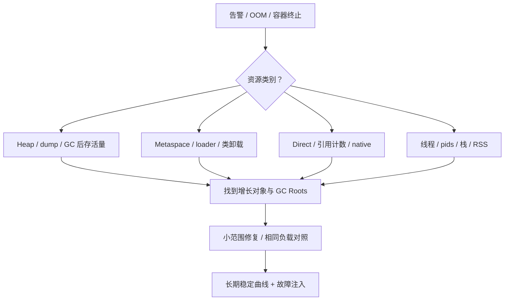

## 三层原理问答

### 1. heap OOM 如何证明是泄漏？

<details markdown="1"><summary>查看回答与追问</summary>

先比较相似负载下，GC 后的存活占用是否长期上升。再证明这些对象已不需要，却仍被某处持有。仅看到堆用得多，不能排除合理数据量或一次大分配。

**dump 里找什么？** MAT 的 dominator 和 GC Roots 能显示无界队列、静态 Map、ThreadLocal 等持有关系。找到 byte[] 排名第一还不够，要追到它属于哪个业务对象。

**如何确认修好了？** 相同触发条件下复现，修改持有或清理代码，再验证占用稳定且结果正确。把缓存清空或增堆可能缓解症状，却没有证明原生命周期错误消失。
</details>

### 2. Direct OOM 时 heap 很空，为什么？

<details markdown="1"><summary>查看回答与追问</summary>

直接缓冲区的数据在 native memory，堆里主要是包装对象。所以 Java 堆空闲并不能说明 Direct 还有容量，也不能说明进程没超过容器限制。

**谁负责释放？** JDK 8 DirectByteBuffer 依靠 Cleaner，Bits 负责容量计数；Netty ByteBuf 还有 retain/release 协议。池化资源归还后可能仍留在 arena，一些路径也不完全显示在 JVM Direct 指标里。

**先改哪里？** 检查所有权转交，尤其异步提交失败、取消和异常。同步看 allocator、BufferPool、RSS，不要只提高 MaxDirectMemorySize，挤掉栈和其他 native 空间。
</details>

### 3. Metaspace OOM 是否都是 ClassLoader 泄漏？

<details markdown="1"><summary>查看回答与追问</summary>

不都是。可能是动态类数量本来就很大、限额太小，也可能是旧 loader 不该存活却被引用。先看类和 loader 的增长模式。

**怎么分两种情况？** 一个 loader 加载越来越多类，通常要检查代理、序列化或脚本类型生成；很多旧 loader 没卸载，则追线程、ThreadLocal、注册表等引用。类卸载与整个 loader 的可达性有关。

**怎么验证？** 限制类型组合和合理复用实例，清理线程上下文。热部署问题做多轮卸载测试。确实合理的类集超预算才扩容量，不能用扩容掩盖旧 loader 滞留。
</details>

### 4. native thread OOM 是不是增大堆能解决？

<details markdown="1"><summary>查看回答与追问</summary>

通常不行，堆变大还可能减少本地可用空间。先看线程数量、系统 pids/ulimit、线程栈和 RSS，确认创建失败受哪个条件限制。

**每条线程消耗什么？** 除了 Java Thread 对象，还有栈及 native 结构。失败可能发生在堆仍有余量的时候，heap dump 无法单独解释系统为什么拒绝创建。

**怎样控制？** 限制线程池、连接和并行任务，不每请求新建线程。降低 Xss 前检查实际调用深度，避免换成 StackOverflowError；连接数也要按下游容量控制。
</details>

### 5. NMT 与 MAT 如何配合？

<details markdown="1"><summary>查看回答与追问</summary>

MAT 看 Java 堆对象被谁引用，NMT 看 HotSpot 记录的 native 类别，两者互补。RSS 则是进程实际驻留的另一个视角。

**NMT 数字为什么不能直接和 RSS 对齐？** reserved、committed 含义不同，第三方 native 分配也未必被完整记录。MAT 的 retained heap 只针对堆引用图，不包含缓冲区真正的堆外数据。

**具体怎么用？** 启动时开 NMT，建立 baseline 后看 diff，同时采样线程、allocator 和 RSS。若差额指向 native 库，再用相应系统工具，别把未知部分直接叫 Direct 泄漏。
</details>

### 6. ThreadLocal 为什么需要 remove？

<details markdown="1"><summary>查看回答与追问</summary>

线程池会复用线程，一个请求留下的值可能被下一请求读到，或一直占内存。请求结束时在 finally remove，既是内存管理，也是避免租户、数据源状态串到下一次请求。

**key 弱引用为什么还会漏？** ThreadLocalMap 的 key 弱引用可能先被清掉，但 value 仍由 entry 强持有，清理依赖后续 map 操作等。key 活着时，业务值也可能一直存在。

**异步怎么办？** 请求上下文显式传递，并在执行边界清理；不要指望线程复用自动恢复默认值。Reactor 还需要它的 Context 机制，直接沿用 ThreadLocal 容易串请求。
</details>

## 模拟生产案例：异步日志持有 ByteBuf

服务堆占用稳定，Direct 内存却持续上升；异步日志线程池一出现拒绝，问题更明显。这是一个 ByteBuf 转交错误的模拟情境。

按 eventId 对齐拒绝时间和 allocator 指标，审查 retain 后的每个出口。若提交失败分支缺 release，应该能看到新增引用没有任务接手；泄漏检测的分配栈可辅助定位，而不是仅凭 RSS 下结论。

把提交失败时的额外 release 补齐。若日志只用几个字段，考虑复制小片段，不要长期持有整个网络缓冲。还需核对 handler 是否自动释放，避免修复后双重释放。

测试里主动让执行器拒绝、任务异常和取消，检查引用计数与业务读写。长期区分池保留量和实际在用量，避免将稳定池容量误认为泄漏。

## 知识梳理与核心总结

### 一分钟要点回顾

OOM 先按完整报错分类型。heap 查存活趋势、dump 和持有链，Metaspace 查类与 loader，Direct 查 Bits/Cleaner 与 Netty 引用计数，创建线程失败查线程数和系统限额。RSS 与堆、NMT 都不是同一个数字。根因要能指到谁持有资源，并用相同负载验证修复；重启和增内存可以止血，却不足以证明已修好。

### 深入理解与机制串联

我会先保存完整报错和时间线，而不是遇到所有内存问题都要 heap dump。Java heap space、Metaspace、Direct buffer memory 和 native thread 失败，对应资源不同；容器 OOMKilled 还可能完全没有 Java OOM。

heap 先比较相近负载下 GC 后最低占用，再用 MAT 找 dominator 和 GC Roots。占用最大的是 byte[] 只是起点，还要追到队列、缓存或请求，说明为什么不该继续持有。合法的大数据集超出容量，与已结束请求仍被引用，是不同问题。

Direct 的包装在堆，数据在 native。JDK 8 Bits 计容量，Cleaner 释放；Netty 则有额外 retain/release。异步转交时正常任务会释放，不代表提交被拒绝也会释放。池归还后 RSS 可能仍高，一些 allocator 又不完全反映在标准 Direct 指标里，必须一起看。

Metaspace 我会区分一个 loader 动态类越来越多，和很多旧 loader 无法卸载。ThreadLocal、线程 contextClassLoader、静态注册表是常见持有来源。旧 XStream 的问题还要确认实际 ReflectionProvider 和构造器缓存，不能把所有反射归因于同一个阈值。

最后看进程预算和系统限额，NMT reserved、committed 与 RSS 分开理解。取 dump 前考虑停顿和空间。修复测试覆盖拒绝、异常、取消与重复请求，证明占用不再增长，同时没有提前释放或上下文串扰。

### 延伸问题、常见误解与速记

- 高频追问：Cleaner 为什么不是马上执行？池化内存归还后 RSS 为何不降？ThreadLocal key 弱引用还要 remove 吗？
- 容易答错：NMT 等于 RSS；heap 空闲就没有内存问题；一条 Full GC 能证明泄漏；增加堆能解决线程创建失败。
- 常看的源码：`Bits.reserveMemory/tryReserveMemory`、`DirectByteBuffer.Deallocator.run`、`AbstractReferenceCountedByteBuf.release`、`ThreadLocalMap.expungeStaleEntry`。
- 排查要连起来：报错的资源、增长的对象、持有它的代码，以及修改后的对照结果。


## 官方资料与版本来源

本文按上述版本阅读官方源码，节选可能省略方法的其他分支。版权见 [source-notices.txt](./source-notices.txt)，下载记录见 [sources.json](./sources.json)。

- [Bits.tryReserveMemory · OpenJDK 8u462-b08](https://raw.githubusercontent.com/openjdk/jdk8u/jdk8u462-b08/jdk/src/share/classes/java/nio/Bits.java)
- [Sun14ReflectionProvider.getMungedConstructor · XStream 1.4.4 / c4c7122](https://raw.githubusercontent.com/x-stream/xstream/c4c71226515fa42809a48d9ae702756e2831f379/xstream/src/java/com/thoughtworks/xstream/converters/reflection/Sun14ReflectionProvider.java)
- [Netty 引用计数指南](https://netty.io/wiki/reference-counted-objects.html)


---

# Spring 核心原理与事务

本章使用 Spring Framework 5.3.31 和 Spring Boot 2.7.18。Spring 创建 Bean、通过代理增强方法、管理数据库事务，是相互配合的几件事。把一次调用从入口走到提交，很多“事务失效”就能解释清楚。

## 核心知识与原理

### IoC、生命周期与循环依赖

假设 OrderService 需要 OrderRepository。IoC 容器先读取 BeanDefinition，知道要创建什么类、注入哪些依赖，再创建对象并完成注入。BeanFactory 提供基础的 Bean 管理；ApplicationContext 在此之上组织启动、资源、事件和国际化等功能。

`refresh()` 会先处理 Bean 定义，再注册 BeanPostProcessor，最后创建非懒加载单例。BeanFactoryPostProcessor 改的是对象还没创建前的定义；BeanPostProcessor 处理的是已经创建的实例。自动代理主要在后者这一阶段参与，二者不能混记。

一个 Bean 大致经历实例化、依赖注入、Aware 回调、初始化前处理、初始化回调、初始化后处理。@PostConstruct、afterPropertiesSet、自定义 initMethod 属于初始化相关步骤。容器关闭时会销毁它管理的单例；prototype 对象取出去后，清理通常要由使用者负责。

循环依赖的问题可以用 A、B 说明：A 已经 new 出来，但注入 B 时发现 B 又需要 A。如果 A 是可提前暴露的单例，容器可以先把 A 的早期引用交给 B，等 B 完成后再把它注入 A。构造器循环却不同：A 连 new 都还没完成，就必须先拿到 B，因此没有现成的 A 可借出去。

三级缓存分别放完整单例、早期引用和生成早期引用的工厂。第三层的工厂允许后处理器按需生成代理，避免 B 拿到原始 A，而其他调用者后来拿到代理 A。它只能处理部分单例字段/setter 循环，也会受到其他后处理器影响。Boot 2.7 默认禁止循环引用；在新代码里拆开相互依赖，通常比打开开关容易维护。

### 动态代理与 AOP

代理相当于方法外面的一层调用入口。例如进入订单方法前开启事务，方法结束后提交；异常时回滚。这层逻辑由拦截器执行，业务类本身不需要把开始、提交散落在每个方法里。

JDK 动态代理基于接口，CGLIB 通过子类增强。具体选择还受配置影响，Boot 默认倾向类代理，不能只凭“有接口”猜代理类型。CGLIB 无法覆盖 final 和 private 方法。

最容易踩到的是自调用：对象内部写 `this.save()`，调用的是自身方法，没有重新进入外部代理。save 上有 @Transactional，也可能根本没执行事务拦截器。把事务操作放到另一个 Bean，由注入的代理对象调用，通常更清楚。

```java
// 业务示例：跨 Bean 调用，让入口穿过事务代理。
@Service
class OrderService {
    private final OrderWriter writer;
    OrderService(OrderWriter writer) { this.writer = writer; }
    public void create(Order order) { writer.persist(order); }
}
@Service
class OrderWriter {
    @Transactional(rollbackFor = Exception.class)
    public void persist(Order order) throws Exception {
        // 同一 DataSource 的持久化路径，异常交给代理作回滚判断。
    }
}
```

### 事务拦截、传播与线程上下文

事务调用进入 TransactionInterceptor 后，Spring 先读事务属性，选择 PlatformTransactionManager，再决定开启新事务还是加入已有事务。业务方法返回时提交，抛异常时按规则决定回滚，最后清理调用上下文。

使用 DataSourceTransactionManager 时，当前事务连接通过 ConnectionHolder 绑定在 TransactionSynchronizationManager 的 ThreadLocal 中。同一线程里的兼容 DAO 操作才能拿到这条连接。手动创建另一条连接，或切到异步线程，不能自动参与原事务。

默认 RuntimeException 和 Error 回滚，checked exception 需要配置 rollbackFor 等规则。异常在方法里被捕获后正常返回，拦截器可能看到的就是成功。另一种情况是内层 REQUIRED 已把共享事务标记为 rollback-only，外层虽然捕获异常，最终提交仍可能抛 UnexpectedRollbackException。

REQUIRED 加入已有物理事务；REQUIRES_NEW 挂起外层、再拿一条连接开启独立事务。外层连接并没有被释放，所以嵌套并发容易耗尽连接池。NESTED 通常使用同一连接上的保存点，外层回滚仍会撤销它；具体支持取决于事务管理器和驱动。

标准代理事务通常以 public 方法为使用范围。排查时还要检查 Bean 是否由 Spring 管理、选了哪个 manager、数据库引擎是否支持事务。Reactor 换线程后不能照搬 JDBC 的 ThreadLocal 事务，需要相应的 reactive manager 和 Context。

### Boot 自动配置与 MVC

自动配置先找候选，再按条件决定是否启用。Boot 2.7 同时读取 spring.factories 和 `AutoConfiguration.imports` 中的候选，随后去重、过滤与排序。已有用户 Bean、缺少类或配置条件不满足，都会让某个配置跳过。排查时看条件报告，比盲目扩大扫描范围有效。

MVC 请求进入 DispatcherServlet，先找 Handler，再找能执行它的 HandlerAdapter。参数解析器准备方法参数，控制器执行后，返回值处理器决定写 JSON 还是解析视图。@ResponseBody 的内容通常由 HttpMessageConverter 写出。

Servlet Filter 在 Servlet 链上，HandlerInterceptor 则在 MVC 的 handler 流程里。preHandle、postHandle、afterCompletion 发生在不同位置；异步请求还可能再次 dispatch。需要清理的租户、日志上下文，应按实际请求边界处理。

```yaml
# Boot 2.7 配置示例：保持默认禁止循环依赖，推动依赖拆分。
spring:
  main:
    allow-circular-references: false
  datasource:
    hikari:
      maximum-pool-size: 20
```

### 事务推演：注解隔离级别为何可能被忽略

外层已开启 RC 事务，内层 REQUIRED 标注 RR，内层默认仍使用外层那条连接和事务，不会凭注解把它临时切成 RR。启用现有事务属性校验时，冲突可能被拒绝。想要一个独立隔离级别，先要确认是否真的创建了新物理事务。

查事务问题可以沿五步走：调用有没有经过代理；manager 是否对应这套数据源；DAO 是否取得绑定连接；异常是否传到拦截器；事务有没有被标记 rollback-only。提交后内存回调发 MQ 也有宕机窗口，可靠投递需要<a href="#c9">同事务保存待发事件</a>。


## 源码级解析与调用链

先看单例的 `getSingleton` 如何依次检查三层缓存，再看事务代理的 `invokeWithinTransaction` 怎样包住方法。对象创建的主过程是 doCreateBean，MVC 请求主入口是 DispatcherServlet.doDispatch。

自动配置读取候选的代码很短，适合直接确认 Boot 2.7 到底还读不读 spring.factories。


<div class="source-caption"><code>DefaultSingletonBeanRegistry.getSingleton</code><span>Spring Framework 5.3.31 · L180–L204 · <a href="https://github.com/spring-projects/spring-framework/blob/v5.3.31/spring-beans/src/main/java/org/springframework/beans/factory/support/DefaultSingletonBeanRegistry.java#L180-L204">完整源码</a></span></div>

```java
	protected Object getSingleton(String beanName, boolean allowEarlyReference) {
		// Quick check for existing instance without full singleton lock
		Object singletonObject = this.singletonObjects.get(beanName);
		if (singletonObject == null && isSingletonCurrentlyInCreation(beanName)) {
			singletonObject = this.earlySingletonObjects.get(beanName);
			if (singletonObject == null && allowEarlyReference) {
				synchronized (this.singletonObjects) {
					// Consistent creation of early reference within full singleton lock
					singletonObject = this.singletonObjects.get(beanName);
					if (singletonObject == null) {
						singletonObject = this.earlySingletonObjects.get(beanName);
						if (singletonObject == null) {
							ObjectFactory<?> singletonFactory = this.singletonFactories.get(beanName);
							if (singletonFactory != null) {
								singletonObject = singletonFactory.getObject();
								this.earlySingletonObjects.put(beanName, singletonObject);
								this.singletonFactories.remove(beanName);
							}
						}
					}
				}
			}
		}
		return singletonObject;
	}
```

早期引用只有在 Bean 正在创建时才有意义。工厂成功生成引用后，将它放入 earlySingletonObjects 并移除工厂；完整单例则仍优先从 singletonObjects 读取。


<div class="source-caption"><code>TransactionAspectSupport.invokeWithinTransaction</code><span>Spring Framework 5.3.31 · L378–L407 · <a href="https://github.com/spring-projects/spring-framework/blob/v5.3.31/spring-tx/src/main/java/org/springframework/transaction/interceptor/TransactionAspectSupport.java#L378-L407">完整源码</a></span></div>

```java
		final String joinpointIdentification = methodIdentification(method, targetClass, txAttr);

		if (txAttr == null || !(ptm instanceof CallbackPreferringPlatformTransactionManager)) {
			// Standard transaction demarcation with getTransaction and commit/rollback calls.
			TransactionInfo txInfo = createTransactionIfNecessary(ptm, txAttr, joinpointIdentification);

			Object retVal;
			try {
				// This is an around advice: Invoke the next interceptor in the chain.
				// This will normally result in a target object being invoked.
				retVal = invocation.proceedWithInvocation();
			}
			catch (Throwable ex) {
				// target invocation exception
				completeTransactionAfterThrowing(txInfo, ex);
				throw ex;
			}
			finally {
				cleanupTransactionInfo(txInfo);
			}

			if (retVal != null && vavrPresent && VavrDelegate.isVavrTry(retVal)) {
				// Set rollback-only in case of Vavr failure matching our rollback rules...
				TransactionStatus status = txInfo.getTransactionStatus();
				if (status != null && txAttr != null) {
					retVal = VavrDelegate.evaluateTryFailure(retVal, txAttr, status);
				}
			}

			commitTransactionAfterReturning(txInfo);
```

真正业务调用在 proceedWithInvocation。抛异常时 completeTransactionAfterThrowing 判断回滚规则；finally 恢复事务调用上下文；正常返回才走 commitTransactionAfterReturning。上下文清理本身不等于数据库已经提交。


<div class="source-caption"><code>AutoConfigurationImportSelector.getCandidateConfigurations</code><span>Spring Boot 2.7.18 · L181–L189 · <a href="https://github.com/spring-projects/spring-boot/blob/v2.7.18/spring-boot-project/spring-boot-autoconfigure/src/main/java/org/springframework/boot/autoconfigure/AutoConfigurationImportSelector.java#L181-L189">完整源码</a></span></div>

```java
	protected List<String> getCandidateConfigurations(AnnotationMetadata metadata, AnnotationAttributes attributes) {
		List<String> configurations = new ArrayList<>(
				SpringFactoriesLoader.loadFactoryNames(getSpringFactoriesLoaderFactoryClass(), getBeanClassLoader()));
		ImportCandidates.load(AutoConfiguration.class, getBeanClassLoader()).forEach(configurations::add);
		Assert.notEmpty(configurations,
				"No auto configuration classes found in META-INF/spring.factories nor in META-INF/spring/org.springframework.boot.autoconfigure.AutoConfiguration.imports. If you "
						+ "are using a custom packaging, make sure that file is correct.");
		return configurations;
	}
```

两行加载来源分别是 SpringFactoriesLoader 与 ImportCandidates。它们一起加入候选列表，后续再过滤；这能直接回答 Boot 2.7 是否已经完全不用 spring.factories。


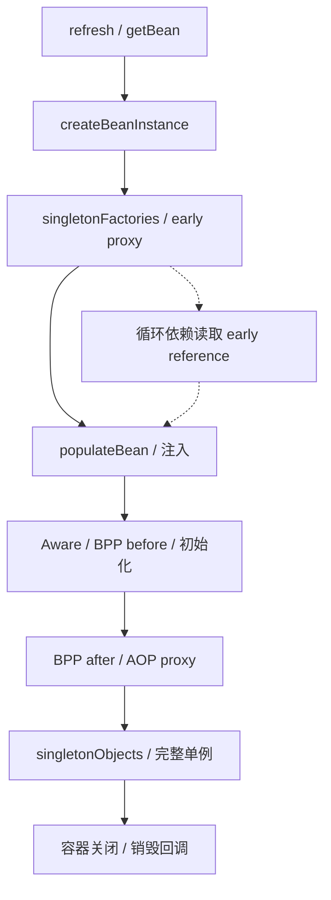

## 三层原理问答

### 1. 为什么三级缓存而非简单提前放对象？

<details markdown="1"><summary>查看回答与追问</summary>

提前给 B 一个原始 A，后面 A 又被做成代理，B 就可能绕过增强。三级缓存中的工厂允许按需生成早期代理，并与最终引用协调。

**getSingleton 按什么顺序找？** 先找 singletonObjects；创建中再找 earlySingletonObjects；允许早期引用时调用 singletonFactories，得到结果后移入第二层并移除工厂。getEarlyBeanReference 让相关后处理器参与。

**需要靠它设计循环吗？** 不建议。它只解决部分单例注入循环，构造器和 prototype 不同。Boot 2.7 默认禁止，先拆职责或显式延迟，初始化过程更容易测试。
</details>

### 2. @Transactional 自调用为何失效？

<details markdown="1"><summary>查看回答与追问</summary>

因为 this.method 没有经过注入的代理对象。@Transactional 是让拦截器识别的配置，不是 JVM 在方法体里自动开启事务的指令。

**事务具体在哪开始？** 调用进入 TransactionInterceptor 后解析属性，交给 manager 创建或加入事务，再调用目标方法。JDK/CGLIB 形式和方法可拦截性也影响是否到这里。

**怎么改得清楚？** 把事务写操作抽到另一 Bean，从容器注入后调用；也可明确使用 TransactionTemplate。测试调用真实代理并核对数据库结果，避免只做普通对象单测。
</details>

### 3. 内层回滚，外层捕获异常为什么仍提交失败？

<details markdown="1"><summary>查看回答与追问</summary>

内外层 REQUIRED 通常共用同一个物理事务。内层标记 rollback-only 后，外层捕获异常并不能把它清除，所以最后提交仍可能失败。

**为什么抛 UnexpectedRollbackException？** 管理器发现共享事务必须回滚，就不能让外层调用者误以为提交成功。捕获 Java 异常与改变数据库事务状态是两件事。

**需要独立审计怎么办？** 可以按业务选择独立事务或可靠异步记录，但要承认审计与主业务不再一起提交。不要只为了消掉异常随意改 REQUIRES_NEW，它还占额外连接。
</details>

### 4. REQUIRES_NEW 与 NESTED 如何选？

<details markdown="1"><summary>查看回答与追问</summary>

REQUIRES_NEW 是独立物理事务，外层失败不一定撤销已提交的内层。NESTED 常是在同一事务中建立保存点，外层回滚仍会把内层结果一起撤销。

**管理器怎样支持？** DataSourceTransactionManager 在允许且驱动支持时可用 savepoint；其他 manager 不一定相同。新事务挂起外层资源后，再借连接，外层连接仍占着。

**如何选择？** 独立审计需要单独提交时可以考虑新事务；同一批工作中局部失败可考虑保存点。按极端并发检查连接需求和锁持有，不把传播选项当成无成本开关。
</details>

### 5. 异步方法能继承 JDBC 事务吗？

<details markdown="1"><summary>查看回答与追问</summary>

不能自动继承。JDBC 连接通常绑定当前线程，异步任务换了线程，不会自然取得原事务。把同一 Connection 手工塞给多个线程也不是安全替代。

**源码体现在哪里？** TransactionSynchronizationManager 保存 ThreadLocal 资源。Reactor Context 跟订阅走，两者不能等同；reactive 事务要配对应 manager。

**业务如何设计？** 真正必须一起成功的本地修改保持同一事务执行；异步动作定义独立事务，并通过 Outbox 或事务消息可靠通知。普通 afterCommit 回调仍有宕机丢任务的可能。
</details>

### 6. 自动配置不生效如何定位？

<details markdown="1"><summary>查看回答与追问</summary>

先确认候选配置有没有加载，再查 classpath、属性和现有 Bean。一个用户 Bean 已存在，可能恰好触发 MissingBean 条件不成立，不是扫描失败。

**Boot 2.7 读哪些资源？** getCandidateConfigurations 同时读取 spring.factories 和 AutoConfiguration.imports，再去重和过滤。条件报告可展示哪条条件没有满足。

**自定义 starter 怎么维护？** 固定支持版本，测试有依赖、缺依赖、用户覆盖等情况。排除自动配置时清楚接替它的职责，别复制内部类后期待跨版本一直可用。
</details>

## 模拟生产案例：新事务耗尽连接池

连接池大小 20，20 个请求都先开启外层事务，随后一起调用 REQUIRES_NEW 写审计。它们全部等新连接直到超时。这是一个可用于测试的模拟条件。

看连接池 active/pending，线程是否停在 borrowConnection，再确认外层事务仍持连接。如果数据库几乎没有执行新 SQL，不能简单认为是 SQL 慢；请求可能还没有拿到连接。

原因是挂起外层事务不等于归还连接，每个请求内层还要再借一条。先限制这类请求并发；是否增加池，要看数据库能力。审计也可按业务改同事务，或通过 Outbox 异步写，明确成功和失败时要留下什么。

测试用屏障让外层同时进入内层，检查是否可有界完成。以后把嵌套事务纳入连接需求，分别设置获取连接和事务超时，避免配置只看正常单层请求。

## 知识梳理与核心总结

### 一分钟要点回顾

Spring 先创建和注入 Bean，再通过后处理器做代理。三级缓存只帮助部分单例循环，Boot 2.7 默认禁止循环引用。事务必须经过代理，manager 决定创建或加入，JDBC 连接通常绑定当前线程。自调用、捕获异常和异步换线程都要检查。REQUIRES_NEW 独立提交却再占连接，NESTED 常用保存点。排查沿代理、manager、连接和异常一路看，不只确认注解在不在。

### 深入理解与机制串联

我会先说明对象创建和方法增强是两个过程。Spring 按 BeanDefinition 实例化、注入，再执行初始化与 BeanPostProcessor。提前暴露单例时用工厂生成早期引用，让循环中拿到的引用尽量与最终代理协调，但这不解决构造器循环，Boot 2.7 默认也禁止。

事务的真正入口是代理里的 TransactionInterceptor。它读属性、选择 manager，创建或加入事务，执行方法，最后提交或按异常规则回滚。JDBC manager 把连接绑定当前线程，所以自己新连接或另起线程，不会自动加入原事务。this 调用没有经过代理，是常见失效原因。

默认运行时异常和 Error 回滚，checked exception 需要规则。异常被业务方法吞掉，拦截器可能看到成功；内层 REQUIRED 已标 rollback-only，外层捕获又不能清掉这个标记，最后仍会失败。

传播要看物理资源。REQUIRED 共用现有事务，内层声明隔离不一定重新生效。REQUIRES_NEW 挂起外层并借新连接，外层还占一条；NESTED 在支持时用保存点，外层回滚仍撤销它。连接池要考虑嵌套并发。

排查时我会依次确认调用经过代理、manager 匹配、DAO 使用绑定连接、异常传播与最终状态。提交后通知下游，也不能只靠内存回调：宕机仍可漏消息，需要可靠待发记录。自动配置则从候选和条件报告查起，MVC 按 handler、adapter、参数和返回值处理解释请求去向。

### 延伸问题、常见误解与速记

- 高频追问：checked exception 默认回滚吗？捕获异常为何仍提交失败？Boot 2.7 是否仍读 spring.factories？
- 容易答错：三级缓存解决所有循环；有接口一定 JDK 代理；挂起释放外层连接；把同一事务连接交给异步线程。
- 常看的源码：`doCreateBean/getSingleton/getEarlyBeanReference`、`TransactionInterceptor.invoke`、`invokeWithinTransaction`、`AutoConfigurationImportSelector`、`DispatcherServlet.doDispatch`。
- 理解事务时，先看这次调用实际经过哪里、使用哪条连接，再看注解配置。


## 官方资料与版本来源

本文按上述版本阅读官方源码，节选可能省略方法的其他分支。版权见 [source-notices.txt](./source-notices.txt)，下载记录见 [sources.json](./sources.json)。

- [DefaultSingletonBeanRegistry.getSingleton · Spring Framework 5.3.31](https://raw.githubusercontent.com/spring-projects/spring-framework/v5.3.31/spring-beans/src/main/java/org/springframework/beans/factory/support/DefaultSingletonBeanRegistry.java)
- [TransactionAspectSupport.invokeWithinTransaction · Spring Framework 5.3.31](https://raw.githubusercontent.com/spring-projects/spring-framework/v5.3.31/spring-tx/src/main/java/org/springframework/transaction/interceptor/TransactionAspectSupport.java)
- [AutoConfigurationImportSelector.getCandidateConfigurations · Spring Boot 2.7.18](https://raw.githubusercontent.com/spring-projects/spring-boot/v2.7.18/spring-boot-project/spring-boot-autoconfigure/src/main/java/org/springframework/boot/autoconfigure/AutoConfigurationImportSelector.java)


---

# 数据库事务、MVCC 与性能优化

主要使用 MySQL 8.0.36 InnoDB，另外对照 PostgreSQL 16、Oracle 19c 和 OceanBase 4.x。不同数据库可以都叫 MVCC，却把旧版本放在不同地方，也不一定采用相同的锁和隔离规则。

## 核心知识与原理

### ACID、日志与可见性

转账时，扣款和加款必须一起成功或一起撤销，这对应 Atomicity。金额约束、账户关系和业务规则要一直成立，这是 Consistency。并发事务能看到什么、会互相等到什么程度，由 Isolation 决定。成功提交后，按配置承诺的数据应能从故障中恢复，这是 Durability。

InnoDB 修改数据页后，不必立刻把每个页都写到磁盘。它先写 redo，崩溃后据此重做必要修改。WAL 要求相关日志先于数据页落盘。Undo 则用来撤销未成功事务，并为快照读提供旧版本。Redo 和 Undo 解决的是不同问题，都不是备份。

MySQL 的 binlog 又是另一层日志，主要服务复制和逻辑恢复。InnoDB 提交需要与 binlog 协调，持久程度还受 `innodb_flush_log_at_trx_commit`、`sync_binlog` 和存储设备影响。数据库返回成功，不等于异步副本当时一定已有这笔数据。

### InnoDB Read View 与 RC/RR

假设余额从 100 改为 80，写事务尚未提交。另一个线程做普通 SELECT，不必看到未提交的 80，也不一定要等写锁：它可以沿 Undo 找到之前的 100。MVCC 就是让不同事务按规则读到合适的版本。

InnoDB 聚簇记录含事务 ID 和 Undo 指针。Read View 保存创建者、快照时活跃的读写事务集合，以及判断区间的界限。`changes_visible()` 先判断版本是否早于活跃事务界限、是否为自己写入，再检查新事务界限和活跃集合。不可见时，就沿 Undo 找更旧的版本。

RC 下，普通一致性读通常每条语句新建快照：第一次查完后别人提交修改，第二次就可能读到新值。RR 通常在第一次一致性读建立快照，后续复用；不是写 BEGIN 的那一刻必然建立。显式 consistent snapshot 等路径另有创建时机。

这里的“普通读”很重要。SELECT FOR UPDATE 和 UPDATE 要读取可以锁定和修改的较新状态，走当前读。一个 RR 事务先普通 SELECT，再 UPDATE，不应假定两个动作都只面对同一份旧快照。长快照还会让 purge 保留它可能用到的 Undo，影响清理。

### 索引、范围锁与执行计划

InnoDB 的主键索引叶子保存整行，二级索引叶子保存索引值和主键。通过二级索引找到主键，再去取整行，叫回表。查询所需列都在索引里时可以减少回表，这就是覆盖索引，但增加宽索引也会占内存、增加写成本。

联合索引 `(tenant_id, created_at, id)` 按这几列依次排序。tenant_id 等值能缩小到某个租户，created_at 范围再缩小连续扫描区间。范围之后的列不一定继续缩小这个区间，但仍可能用于 ICP 或过滤，不能一句“范围后索引失效”就结束。

范围更新或锁定读还涉及间隙。记录锁保护已有索引记录，Gap Lock 保护记录之间的空隙，Next-Key Lock 把记录和前间隙一起保护。RR 下某些范围锁定读用它阻止插入；唯一索引完整等值命中通常只锁记录，未命中又要另看。RC 大多数搜索不使用 gap lock，但外键和重复键检查有例外。

SQL 最终只返回一行，不代表只锁一行。若访问路径扫描了很大范围，锁也可能很多。EXPLAIN 先看 key、rows、访问类型和 Extra，再在受控环境用 EXPLAIN ANALYZE 比较实际扫描量。后者会真实执行，不能随意对生产重查询使用。死锁时应有界重试整个事务，重新做决策，而不是只补最后一条 SQL。

```sql
-- 业务示例：幂等键与条件状态转换放进同一个事务。
START TRANSACTION;
INSERT INTO processed_event(event_id) VALUES ('pay-20261008-001');
UPDATE orders SET status='PAID'
 WHERE id=1001 AND status='PENDING';
-- 调用方检查 affected rows，并区分首次成功、已处理与非法状态。
COMMIT;
-- 联合索引示例：tenant_id 等值、created_at 范围，id 用于稳定排序。
CREATE INDEX idx_order_tenant_time ON orders(tenant_id, created_at, id);
```

### 数据库实现差异与迁移

|数据库|旧版本与快照怎样处理？|实践中需要留意什么？|
|---|---|---|
|MySQL InnoDB|Undo 链配合 Read View，默认 RR|next-key、聚簇主键、长事务阻碍 purge|
|PostgreSQL 16|表里保留 tuple 版本，VACUUM 清理，默认 RC|长快照影响清理；RR 是快照隔离，Serializable 用 SSI 检测危险冲突|
|Oracle 19c|使用 SCN 和 Undo 构造一致读，默认 RC|没有可直接照搬的同名 RR；可能遇到 ORA-08177 或 Undo 不足的 ORA-01555|
|OceanBase 4.x|分布式多版本存储与事务协调|MySQL/Oracle 租户模式不是完全等价实现，应核对小版本、功能与分布式计划|

迁移先检查数据含义：时区、decimal、字符排序、NULL 和空字符串。在 Oracle 中空字符串按 NULL 处理，就可能改变唯一性或筛选结果。语法能执行只是第一步，事务结果和访问成本也要测。

全量复制应对应明确快照位点，CDC 从正确位置接上增量。按主键范围比较行数和规范化后的字段内容，重要业务再对金额与状态账；只比行数，漏一行同时多一行也可能“通过”。切换前等增量追平，控制写路由，预演回退。双写会产生自己的失败和乱序问题，需要单独对账。

### Read View 手工推演与写偏差

假设快照里的活跃事务是 {100,104}，最小活跃 ID 是 100，新事务界限是 108，创建者为 106。版本 99 可见；100、104 因仍活跃不可见；105 不在活跃集合里且未超界，可以看见；108 及以后不可见；自己的 106 可见。若当前版本是 104，就沿 Undo 找到可见的旧版。

快照也不是所有业务规则的保险。两名值班人员各自看到对方在线，于是分别把自己改为离线，写的不是同一行，最后却无人值班。要保护“至少一人在线”，可以锁住共同的约束记录，或使用数据库支持的更严格方式。不同产品的 Serializable 和冲突处理不同，应测试后再选；重试时也必须重新读取、重新判断。


## 源码级解析与调用链

InnoDB 普通读会经过 `row_search_mvcc` 及相关可见性检查。`ReadView::changes_visible` 判定版本能否返回；不行则由 `row_vers_build_for_consistent_read` 重建旧版本后再判断。

下面这段判断与前面的 {100,104} 例子对应，注意 m_up_limit_id 和 m_low_limit_id 的历史命名，按代码比较方向理解，不凭英文名称猜。


<div class="source-caption"><code>ReadView::changes_visible</code><span>MySQL 8.0.36 · L162–L181 · <a href="https://github.com/mysql/mysql-server/blob/mysql-8.0.36/storage/innobase/include/read0types.h#L162-L181">完整源码</a></span></div>

```cpp
  [[nodiscard]] bool changes_visible(trx_id_t id,
                                     const table_name_t &name) const {
    ut_ad(id > 0);

    if (id < m_up_limit_id || id == m_creator_trx_id) {
      return (true);
    }

    check_trx_id_sanity(id, name);

    if (id >= m_low_limit_id) {
      return (false);

    } else if (m_ids.empty()) {
      return (true);
    }

    const ids_t::value_type *p = m_ids.data();

    return (!std::binary_search(p, p + m_ids.size(), id));
```

先允许较早版本和自己的版本，再拒绝超出新事务界限的版本，最后在活跃事务集合里查找。binary_search 找不到，才表示这个中间区间的事务版本可见。


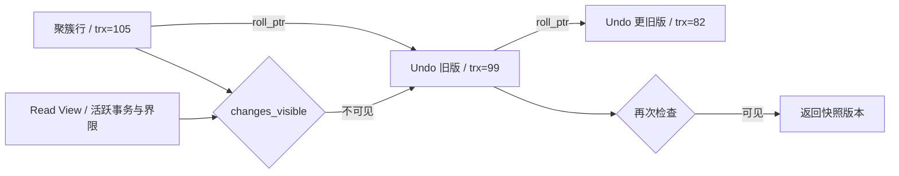

## 三层原理问答

### 1. RR 快照什么时候建立？

<details markdown="1"><summary>查看回答与追问</summary>

InnoDB RR 一般在第一次一致性读时建立快照，后续复用；BEGIN 本身不一定已经创建。RC 则通常每次一致性读更新快照。

**为什么能读旧值？** ReadView::changes_visible 判断当前版本所属事务是否可见，不可见时沿 Undo 重建旧版本。显式 consistent snapshot 和锁定读走不同流程。

**长事务会怎样？** 旧快照可能还要用历史数据，purge 不敢清理它们。报表要控制事务时长，跨批次读也要先想清楚是否接受不同时点的数据。
</details>

### 2. MVCC 是否让读写完全不阻塞？

<details markdown="1"><summary>查看回答与追问</summary>

普通快照读通常不需要等写锁，但写写冲突、SELECT FOR UPDATE 和元数据锁仍可能等待。MVCC 没有把数据库里所有等待都取消。

**等在哪层？** 快照读重建 Undo，当前读协调索引锁，DDL 还可能等待 MDL。看到查询慢，需要分清行锁、MDL、IO 与内部竞争，才能解释等待。

**怎样处理？** 找持有者及事务年龄，缩短长事务、安排变更窗口。只扩大连接池会让更多请求排队，不会解除一个仍未结束的持锁事务。
</details>

### 3. MySQL RR 能防所有幻读吗？

<details markdown="1"><summary>查看回答与追问</summary>

要先说明哪种读。快照 SELECT 重复读同一快照；锁定范围读可能使用 next-key 防止相关范围插入。把这两种机制混成一句“RR 没幻读”，无法解释实际操作。

**普通读后 UPDATE 会怎样？** UPDATE 是当前读，可能处理后来出现、符合条件的行。唯一等值命中、未命中和范围查询的锁也不同，需沿实际索引区间分析。

**唯一业务怎样保证？** 用唯一索引约束订单号或事件 ID，不靠查不到再插入。库存扣减用条件更新；跨数据库的结果还需要明确消息和补偿处理。
</details>

### 4. Redo、Undo、binlog 都是日志，为何不能互换？

<details markdown="1"><summary>查看回答与追问</summary>

它们面向不同工作。Redo 帮崩溃恢复重做修改，Undo 帮回滚和重建旧版本，binlog 主要用于复制及逻辑恢复，不能互相替代。

**提交为什么要协调？** 相关 WAL 先于数据页落盘，InnoDB 与 binlog 还要协调提交结果，避免崩溃后两层日志对成功事务产生分歧。刷盘配置决定具体的持久承诺。

**高可用够不够？** 还要看副本确认、备份、恢复速度和演练。异步副本可能落后，也会复制错误删除，所以它既不是零丢失保证，也不是完整备份。
</details>

### 5. 慢 SQL 有索引为什么仍慢？

<details markdown="1"><summary>查看回答与追问</summary>

索引存在，不代表筛掉了足够多的数据。低选择性索引、大量回表、排序、返回过多行或锁等待，都可能使查询慢。

**怎样看到真实工作量？** 比较计划中的估计与实际 rows、loops，检查类型转换、统计和排序。范围后的字段仍可能参与 ICP，但未必缩小扫描区间。EXPLAIN ANALYZE 会真实执行。

**索引以外怎么改？** 控制返回列和批量，深分页考虑稳定游标。新索引用接近生产分布的数据验证，还要看写入与缓存成本，不能只测一个很小的查询样本。
</details>

### 6. 数据库迁移怎样证明一致？

<details markdown="1"><summary>查看回答与追问</summary>

先有一致快照与增量位点，再按范围比较内容，切换后做业务对账。行数一样不代表每行一样，简单 sum(id) 也不能证明没有错漏。

**哪些内容需要规范化？** 时区、decimal、字符编码、排序规则和 NULL。CDC 还要处理更新、删除、断点与顺序，跨产品同名隔离级别不保证行为一致。

**切换怎么恢复？** 先灰度验证，增量追平后控制写路由，并预演回退。金融类数据按金额和状态核对，发现偏差有明确修复流程，而非只宣布 checksum 通过。
</details>

## 模拟生产案例：长快照拖住 Undo

更新业务看起来正常，Undo 和 history list 却持续增长，磁盘与查询压力越来越大。这是一个长 RR 报表事务影响清理的模拟情境。

先看 innodb_trx 中事务年龄、report 连接和 history list，再检查 purge 是否追得上。如果有一个报表很早建立快照却一直不提交，它可能仍需要历史版本，不能只怪更新量大。

受控结束该报表事务后，应观察 purge 是否逐渐追赶，这是检验假设的重要对照。改成明确的批次或分析读取方式，但先决定业务是否必须看到同一时点，避免拆批后结果含义变化。

长期设事务年龄告警和报表超时，检查连接复用时是否完成事务。备份、迁移的大快照同样需要评估保留历史版本的代价。

## 知识梳理与核心总结

### 一分钟要点回顾

InnoDB 普通一致性读用 Read View 判断当前版本，不可见就沿 Undo 读旧版。RC 通常每条读新快照，RR 通常首次一致读后复用；FOR UPDATE 和写操作则读当前状态。索引决定扫描和锁范围，不能只看返回行数。Redo、Undo、binlog 分别负责不同恢复工作。慢查询看实际扫描、回表和等待；迁移还要验证数据含义、CDC 位点和业务结果，不能只比行数。

### 深入理解与机制串联

我会从一个未提交余额修改讲 MVCC。别人把 100 改成 80 尚未提交，普通读可以借 Undo 看到旧 100。Read View 根据版本事务、活跃集合和界限判断可见性，必要时沿历史链回退。

RC 每次一致性读通常换快照，RR 则通常首次读后复用，不一定 BEGIN 时已经创建。SELECT FOR UPDATE、UPDATE 要看可锁定的当前状态，不能把它们和普通 SELECT 当同一快照。长事务还会保留旧版本，阻碍 purge。

索引方面，主键叶子存整行，二级索引带主键，非覆盖时要回表。联合索引先用等值前缀，再用范围，后续列可能参与过滤或 ICP。范围锁沿实际访问路径建立，缺好索引会扫描和锁更多记录；唯一完整等值命中与未命中也要分别看。

慢 SQL 先看计划、实际 rows 和 loops，再查锁等待、IO 和返回量。EXPLAIN ANALYZE 会执行，需要控制影响。死锁按整个事务有界重试，重新读和判断，不能只补最后一条。

跨库我不会把 InnoDB Undo 当所有 MVCC 的实现。PG 用 tuple 与 VACUUM，Oracle 用 SCN/Undo，OceanBase 还有分布式协调。迁移先核对时区、NULL、精度和约束，再保证全量与 CDC 位点衔接，按范围比内容和业务金额状态。切换与回退预演过，才说明方案可以恢复。

### 延伸问题、常见误解与速记

- 高频追问：RR 快照何时创建？长事务为何拖 purge？唯一未命中锁什么？范围后哪些列还有用？
- 容易答错：所有数据库默认 RR；快照读和当前读相同；PG 用 InnoDB Undo；有索引一定快；副本就是备份。
- 常看的源码：`ReadView::changes_visible`、`row_search_mvcc`、`row_vers_build_for_consistent_read`、`trx_assign_read_view`。
- 推导时把读到哪个版本、扫描哪个区间、锁住哪些位置分开。


## 官方资料与版本来源

本文按上述版本阅读官方源码，节选可能省略方法的其他分支。版权见 [source-notices.txt](./source-notices.txt)，下载记录见 [sources.json](./sources.json)。

- [ReadView::changes_visible · MySQL 8.0.36](https://raw.githubusercontent.com/mysql/mysql-server/mysql-8.0.36/storage/innobase/include/read0types.h)
- [PostgreSQL16 隔离级别](https://www.postgresql.org/docs/16/transaction-iso.html)
- [Oracle19c 并发与一致性](https://docs.oracle.com/en/database/oracle/oracle-database/19/cncpt/data-concurrency-and-consistency.html)
- [MySQL 一致性读](https://dev.mysql.com/doc/refman/8.0/en/innodb-consistent-read.html)
- [OceanBase 官方文档（须选择实际租户版本）](https://en.oceanbase.com/docs)


---

# RocketMQ 消息队列

主要看RocketMQ4.9.8的经典Java客户端与本地文件存储，涉及5.x时明确以5.3.4对照。这个专题串起消息追加、索引派发、队列读取和崩溃恢复：消息到哪里才算发出去了，什么时候能被读到，业务做到哪里才算消费成功。

## 核心知识与原理

### 路由、消息存储与发送确认

Producer 先从 NameServer 获取 Topic 的 Broker、队列等路由信息，缓存后直接向 Broker 发消息。Consumer 也根据路由找 Broker。NameServer 不保存消息，也不用参与每一条消息的收发。

Broker 把消息主体顺序追加到 CommitLog。消费按 Topic 和 Queue 进行，ConsumeQueue 保存“这条队列消息在 CommitLog 的哪个位置”，经典索引单元为 20 字节：8 字节 offset、4 字节 size、8 字节 tagsCode。IndexFile 用于按 key 查询，不是普通拉取消费的主索引。

消息追加后，ReputMessageService 继续从 CommitLog 解析，分发生成 ConsumeQueue 和 IndexFile。主体写入与消费索引生成不是同一动作，恢复时也需要追赶有效日志。

Producer 收到发送结果时，Broker 做到哪一步，取决于配置。异步刷盘可以先响应，稍后再落磁盘；机器此时故障，可能丢掉已应答但尚未落盘的数据。同步刷盘等待指定位置持久化，但还要看 waitStoreMsgOK 和超时结果。复制到副本也是另一项等待，不应把“写本机磁盘”和“副本收到”混为一谈。

发送超时尤其容易误判。Broker 可能已经写入，只是响应没到 Producer。因此重试可能产生重复，不能把超时解释为必定没发出去。传统同步主从、DLedger 和 5.x Controller 的选主与恢复方式不同；同步复制本身并不自动提供一套完整的共识选主。

### 消费、ACK、重试与死信

4.x 的 PushConsumer 是对应用隐藏了拉取调度。底层 PullMessageService 仍从 Broker 拉消息，放进 ProcessQueue，再交给消费线程执行。业务感觉是“有人回调我”，网络模型却不能概括成 Broker 每条主动推送。

经典集群消费将队列分配给同 group 的消费者。消费方法返回成功后，客户端更新消费位置，并按相应流程把 offset 持久化。假如数据库已经提交，但进程还没保存消费位置就宕机，重启后可能再次收到那条消息。这是为什么消费必须考虑重复。

并发消费失败会进入重试流程，超出限额进入 DLQ；顺序消费的挂起和重试行为不同。广播消费让每个实例都收到消息，4.x 的 offset 和失败重试保障不能照搬集群模式。DLQ 需要告警、查原因和受控重放，否则失败消息只是换了个地方积压。

At-most-once 允许丢失，at-least-once 允许重复。Exactly-once 一定要说清范围：MQ 不会自动把消费确认和任意数据库提交变成同一个事务。实际常用做法是事件 ID 唯一约束，并把处理记录与业务修改放在同一数据库事务里。第二次投递识别到同一事件，就返回已处理结果。

订单 ID 不总是合适的去重键。一个订单可能有支付、退款、撤销等多个合法事件，应该按事件身份区分，否则退款会被当作“订单已经处理过”而丢掉。这里提到的 ACK 是消费成功确认的泛称；经典 offset 模型和 5.x POP 的逐消息 ACK 是不同机制。

### 局部顺序与积压恢复

订单的创建、支付、取消需要按顺序处理时，可以按订单 key 路由到同一队列，并使用顺序消费者。回调里又把任务丢给异步线程、马上返回成功，会让实际业务重新乱序。多 Producer、发送重试和队列变更也需要考虑，因此业务记录最好再检查版本号和允许的状态转换。

积压恢复先算一个简单关系。假设积压 600 万条，新消息每秒来 2000 条，当前每秒只能处理 1500 条，扩多少“等待线程”都不会自动清空。若把实际完成率提高到 5000 条/秒，净消化速率才是 3000，理论上至少还要约 2000 秒。

再判断瓶颈在哪：Broker IO、拉取、反序列化，还是业务 SQL、外部接口？经典队列分配中，消费者实例超过队列数不会继续增加有效并行。线程增加而数据库连接不够，可能只是多了等待者。批量处理可减少开销，但必须说明一批里部分失败怎么重试。顺序业务扩队列还会改变 key 分布，不能在故障时随意改。

### 事务消息：Half、回查与恢复

普通写法先提交 DB 再发消息，中间宕机就会留下“业务已成功、下游不知道”。事务消息换了一种顺序：先发送 Half Message，Broker 保存它但不交给普通消费者；Producer 再执行本地事务，并报告提交、回滚或未知。

提交报告丢失时，Broker 回查 Producer，让它判断本地事务到底完成了没有。因此结果必须保存在数据库里，并能按 transactionId 或业务 ID 查询，最好换一台 Producer 也能回答。只存进程内 Map，重启后就无从判断。

查不到记录也不能直接返回 COMMIT。它可能还没执行、已失败，或者数据库暂时不可用。应有明确状态和 UNKNOWN 的处理方式。回查有等待、次数和记录保留的限制，不会永远替业务恢复；仍需对账检查长期没有完成的交易。

事务消息主要协调生产端本地事务与消息可见性。消费者收到后如何提交自己的数据库，是下一段问题，仍需要幂等。也可以选择<a href="#c9">Outbox</a>：把待发事件和业务写入同一数据库事务，再由后台任务发送。

### 发送结果与恢复决策表

SEND_OK 表示满足本次发送所要求的完成条件，并不是所有副本永远不会丢数据。FLUSH_DISK_TIMEOUT、FLUSH_SLAVE_TIMEOUT 以及网络超时，都不能直接说明消息不存在。保留稳定的业务事件 ID，记录待确认状态，再做有限重试、结果核查和对账。

Broker 故障时，先核对集群模式、最新副本位置和复制延迟，再按既定恢复流程切换。消费恢复也要限制速度，免得积压一次性冲垮数据库。消息保留期、去重记录保留期和允许重放的时间，应一起设计。


## 源码级解析与调用链

发送主线是 sendDefaultImpl、sendKernelImpl、Broker 的 SendMessageProcessor，再到 DefaultMessageStore 与 CommitLog。下面先看 CommitLog 怎样组合刷盘和复制结果，接着看事务生产者与 Broker 回查。

回查不是凭 Half 的存在就断定业务成功。`TransactionalMessageServiceImpl.check` 结合 Half 与操作记录，决定跳过、回查、重新写入或后续处理。生产者的 executeLocalTransaction 和 checkLocalTransaction 要能回答同一业务状态。


<div class="source-caption"><code>CommitLog.asyncPutMessage</code><span>RocketMQ 4.9.8 · L738–L752 · <a href="https://github.com/apache/rocketmq/blob/rocketmq-all-4.9.8/store/src/main/java/org/apache/rocketmq/store/CommitLog.java#L738-L752">完整源码</a></span></div>

```java
        CompletableFuture<PutMessageStatus> flushResultFuture = submitFlushRequest(result, msg);
        CompletableFuture<PutMessageStatus> replicaResultFuture = submitReplicaRequest(result, msg);
        return flushResultFuture.thenCombine(replicaResultFuture, (flushStatus, replicaStatus) -> {
            if (flushStatus != PutMessageStatus.PUT_OK) {
                putMessageResult.setPutMessageStatus(flushStatus);
            }
            if (replicaStatus != PutMessageStatus.PUT_OK) {
                putMessageResult.setPutMessageStatus(replicaStatus);
            }
            return putMessageResult;
        });
    }

    public CompletableFuture<PutMessageResult> asyncPutMessages(final MessageExtBatch messageExtBatch) {
        messageExtBatch.setStoreTimestamp(System.currentTimeMillis());
```

flushResultFuture 和 replicaResultFuture 分别代表刷盘、复制。组合回调会把失败状态带进 PutMessageResult，业务应检查结果，而不是仅认为方法没有抛异常就可靠成功。


<div class="source-caption"><code>DefaultMQProducerImpl.sendMessageInTransaction</code><span>RocketMQ 4.9.8 · L1222–L1240 · <a href="https://github.com/apache/rocketmq/blob/rocketmq-all-4.9.8/client/src/main/java/org/apache/rocketmq/client/impl/producer/DefaultMQProducerImpl.java#L1222-L1240">完整源码</a></span></div>

```java
    public TransactionSendResult sendMessageInTransaction(final Message msg,
        final LocalTransactionExecuter localTransactionExecuter, final Object arg)
        throws MQClientException {
        TransactionListener transactionListener = getCheckListener();
        if (null == localTransactionExecuter && null == transactionListener) {
            throw new MQClientException("tranExecutor is null", null);
        }

        // ignore DelayTimeLevel parameter
        if (msg.getDelayTimeLevel() != 0) {
            MessageAccessor.clearProperty(msg, MessageConst.PROPERTY_DELAY_TIME_LEVEL);
        }

        Validators.checkMessage(msg, this.defaultMQProducer);

        SendResult sendResult = null;
        MessageAccessor.putProperty(msg, MessageConst.PROPERTY_TRANSACTION_PREPARED, "true");
        MessageAccessor.putProperty(msg, MessageConst.PROPERTY_PRODUCER_GROUP, this.defaultMQProducer.getProducerGroup());
        try {
```

事务发送先检查本地事务监听器，再处理 Half 准备消息。后面才执行本地事务和 endTransaction。监听器的返回与持久状态必须一致，不能只靠进程还活着。


<div class="source-caption"><code>TransactionalMessageServiceImpl.check</code><span>RocketMQ 4.9.8 · L127–L143 · <a href="https://github.com/apache/rocketmq/blob/rocketmq-all-4.9.8/broker/src/main/java/org/apache/rocketmq/broker/transaction/queue/TransactionalMessageServiceImpl.java#L127-L143">完整源码</a></span></div>

```java
    public void check(long transactionTimeout, int transactionCheckMax,
        AbstractTransactionalMessageCheckListener listener) {
        try {
            String topic = TopicValidator.RMQ_SYS_TRANS_HALF_TOPIC;
            Set<MessageQueue> msgQueues = transactionalMessageBridge.fetchMessageQueues(topic);
            if (msgQueues == null || msgQueues.size() == 0) {
                log.warn("The queue of topic is empty :" + topic);
                return;
            }
            log.debug("Check topic={}, queues={}", topic, msgQueues);
            for (MessageQueue messageQueue : msgQueues) {
                long startTime = System.currentTimeMillis();
                MessageQueue opQueue = getOpQueue(messageQueue);
                long halfOffset = transactionalMessageBridge.fetchConsumeOffset(messageQueue);
                long opOffset = transactionalMessageBridge.fetchConsumeOffset(opQueue);
                log.info("Before check, the queue={} msgOffset={} opOffset={}", messageQueue, halfOffset, opOffset);
                if (halfOffset < 0 || opOffset < 0) {
```

check 从 Half 相关 Topic 的队列开始遍历；后续还要对照操作队列和检查次数。回查本身并不替 Producer 做数据库提交，Producer 要实现持久状态查询。


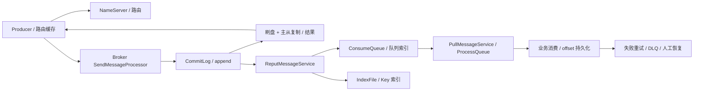

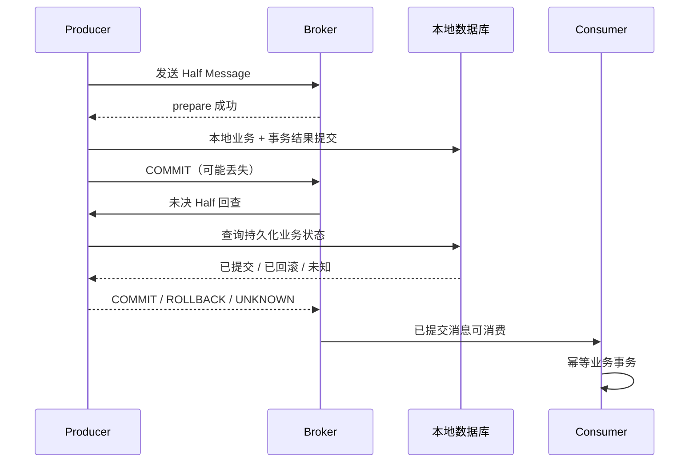

### 4.x、5.x 与 Kafka/Pulsar 的必要比较

|维度|RocketMQ 4.9.8|RocketMQ 5.3.4|
|---|---|---|
|客户端/消费|经典 Remoting，Push 底层 pull，队列分配|保留兼容路径；Proxy/gRPC、POP 可采用消息级负载均衡及不可见期/ACK|
|延时|经典固定 delay level|新增时间轮等能力；使用路径取决配置和协议|
|HA|传统主从或配置 DLedger|可配置 Controller 等，不能推断默认全启用|
|存储|CommitLog/CQ/IndexFile|保留主干并增更多实现分支，升级需核对实际启用|

Kafka 以 partition 日志为主要组织与并行单位，配合 ISR、acks、幂等 producer/transaction 支持其定义范围内语义；Kafka 事务也不会自然包住任意外部数据库。Pulsar 分离 broker 与 BookKeeper 持久层，通过 ledger 与 subscription cursor 管理存储/订阅，分层扩容代价与运维模型不同。RocketMQ 的统一 CommitLog 与独立消费索引、业务事务回查和经典队列模型更贴近本网站场景，但技术选型仍要比较吞吐、延迟、运维能力和恢复演练，而非靠“谁一定更快”。

## 存储协作：从CommitLog追加到索引构建与崩溃恢复

**CommitLog保存消息本体，ConsumeQueue负责按队列定位，IndexFile负责按Key寻找候选消息；消费组进度由Consumer Offset独立记录。** 三个存储文件不是各存一份完整消息。下面沿同一组消息追踪各个位置的变化，源码均固定为RocketMQ4.9.8，讨论经典文件存储，不包含DLedger的独立恢复实现。

### 一份主数据、两套索引与四种offset

|组件|组织方式与保存内容|读取职责|
|---|---|---|
|CommitLog|Broker内不同Topic、Queue共享物理追加日志，保存消息体、Topic、QueueId、属性等|提供消息原始字节|
|ConsumeQueue|按Topic+QueueId分开维护，条目记录物理offset、size、tagsCode|按逻辑Queue Offset定位消息|
|IndexFile|按Topic+Key建立哈希槽和冲突链，记录物理offset与时间差|按Key、时间范围返回候选位置|
|Consumer Offset|消费组+Topic+QueueId的进度；经典集群消费由客户端更新并提交Broker|表示该组下一次从哪里消费|

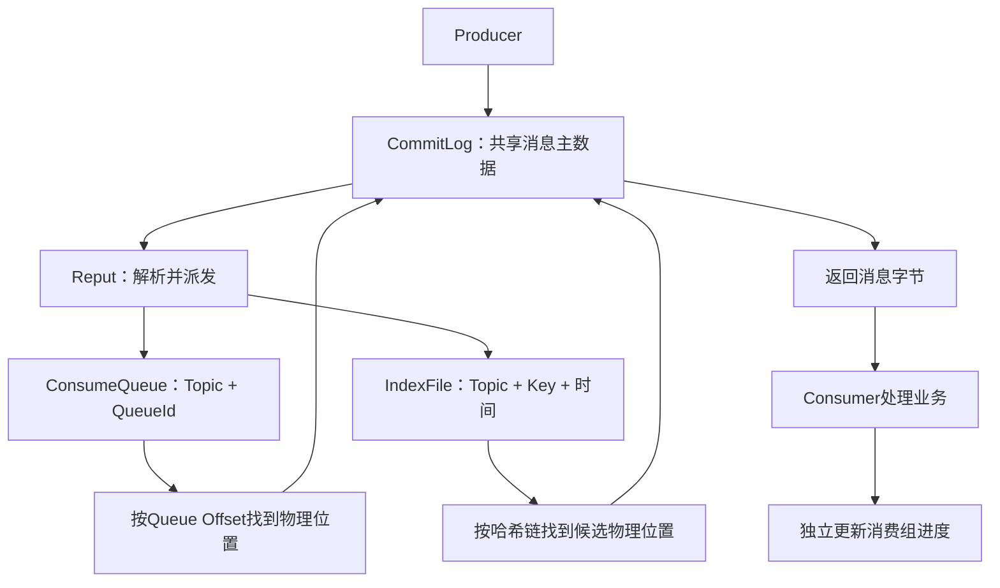

图中的回读箭头表示读取消息正文，不是重新写入CommitLog。普通队列消费走ConsumeQueue→CommitLog；Key查询走IndexFile→CommitLog，不需要先通过ConsumeQueue。

|名称|单位与范围|示例|
|---|---|---|
|CommitLog Offset|整个物理日志中的字节位置|消息从1350字节开始|
|Queue Offset|某个Topic+QueueId的逻辑序号|OrderTopic/0中的第2条，序号1|
|Reput Offset|派发线程下一次解析的物理字节位置|reputFromOffset=1650|
|Consumer Offset|某消费组在某逻辑队列的下一次消费位置|groupA=1，groupB=0|

不同消费组共享ConsumeQueue，各自推进Consumer Offset。同组的经典集群消费还要经过队列分配；广播消费的进度保存在客户端，不能直接套用Broker集中保存进度的结论。Queue Offset标识消息位置，不能用它推断某个消费组已经处理完消息。

### 磁盘布局、固定单元与默认容量

以下是概念化目录，文件名以起始物理或逻辑字节offset补齐20位，不表示消息条数；IndexFile通常按创建时间命名。

```text
store/
  commitlog/00000000000000000000
  commitlog/00000000001073741824
  consumequeue/OrderTopic/0/00000000000000000000
  consumequeue/PaymentTopic/1/00000000000000000000
  index/<创建时间命名的索引文件>
  checkpoint
  abort
```

|文件|记录结构|4.9.8经典默认容量|
|---|---|---|
|CommitLog|变长消息，包含总长度、MagicCode、CRC、队列/物理offset、时间、消息体和属性等|每个文件1GiB，即1,073,741,824B|
|ConsumeQueue|8B物理offset+4B消息大小+8B tagsCode=20B|6,000,000B，容纳300,000条索引|
|IndexFile|40B头部+每槽4B的哈希槽数组+每条20B的索引数组|5,000,000槽、20,000,000索引位置，共420,000,040B，约400.54MiB|

IndexFile的索引编号0作为无效位置保留，所以配置中的20,000,000不是同等数量消息的精确承诺。一条消息的UniqKey和多个业务Key也可能占多个索引条目。容量来自[MessageStoreConfig](https://github.com/apache/rocketmq/blob/rocketmq-all-4.9.8/store/src/main/java/org/apache/rocketmq/store/config/MessageStoreConfig.java)，布局来自[IndexFile](https://github.com/apache/rocketmq/blob/rocketmq-all-4.9.8/store/src/main/java/org/apache/rocketmq/store/index/IndexFile.java)。

tagsCode也不能永远解释成Tag哈希：启用ConsumeQueueExt时，它可以保存扩展记录地址；经典延迟消息的内部调度队列还会用它承载投递时间。读取方需要按实际消息和配置解释这个8B字段。

### 用三条消息手算写入、派发与读取

以下物理位置和长度是计算示例，不是实际运行记录。假设CommitLog已经有前缀，后续追加三个普通消息：

|物理写入顺序|消息|Topic/QueueId|物理起点|大小|Queue Offset|物理结束位置|
|---|---|---|---|---|---|---|
|1|M1|OrderTopic/0|1000|200B|0|1200|
|2|M2|PaymentTopic/1|1200|150B|0|1350|
|3|M3|OrderTopic/0|1350|300B|1|1650|

OrderTopic/0的ConsumeQueue依次保存`(1000,200,TagA)`和`(1350,300,TagB)`，占逻辑字节位置0、20；PaymentTopic/1单独保存`(1200,150,TagC)`。同一物理文件中的交错写入被还原为两个逻辑队列，不需要复制消息正文。

读取OrderTopic/0的Queue Offset=1时，先计算`1×20=20`，读取那里的ConsumeQueue条目，再从CommitLog的1350处读取300B。派发线程处理M1后从1000推进到1200，处理M2后到1350，处理M3后到1650；Order队列的消费组即使尚未处理M1，也不影响这些存储位置的推进。

对于大小为F的CommitLog分片，`文件起点=floor(物理offset/F)×F`，`文件内位置=物理offset%F`。例如物理offset=1,073,742,000时，文件起点是1,073,741,824，文件内位置176。ConsumeQueue也按相同思想定位，只是先把Queue Offset乘以20，再用6,000,000B分片大小计算文件和文件内位置。

### Producer并发提交，追加锁如何保护两种顺序

简化发送链路是`SendMessageProcessor → DefaultMessageStore.asyncPutMessage → CommitLog.asyncPutMessage → MappedFile.appendMessage → DefaultAppendMessageCallback.doAppend`。Producer请求可以并发到达，经典CommitLog的追加临界区由`putMessageLock`串行协调，锁类型取决于配置。


<div class="source-caption"><code>CommitLog.asyncPutMessage</code><span>RocketMQ 4.9.8 · L676–L694 · <a href="https://github.com/apache/rocketmq/blob/rocketmq-all-4.9.8/store/src/main/java/org/apache/rocketmq/store/CommitLog.java#L676-L694">完整源码</a></span></div>

```java
        putMessageLock.lock(); //spin or ReentrantLock ,depending on store config
        try {
            MappedFile mappedFile = this.mappedFileQueue.getLastMappedFile();
            long beginLockTimestamp = this.defaultMessageStore.getSystemClock().now();
            this.beginTimeInLock = beginLockTimestamp;

            // Here settings are stored timestamp, in order to ensure an orderly
            // global
            msg.setStoreTimestamp(beginLockTimestamp);

            if (null == mappedFile || mappedFile.isFull()) {
                mappedFile = this.mappedFileQueue.getLastMappedFile(0); // Mark: NewFile may be cause noise
            }
            if (null == mappedFile) {
                log.error("create mapped file1 error, topic: " + msg.getTopic() + " clientAddr: " + msg.getBornHostString());
                return CompletableFuture.completedFuture(new PutMessageResult(PutMessageStatus.CREATE_MAPEDFILE_FAILED, null));
            }

            result = mappedFile.appendMessage(msg, this.appendMessageCallback, putMessageContext);

```

节选追加锁与首次append分支。END_OF_FILE的新文件重试、finally解锁、刷盘和复制future组合在完整方法的后续分支；源码不是三个文件同步提交。


锁内选择或创建当前文件、重新设置存储时间戳，再追加消息。编码有部分工作在锁外完成，但队列序号和物理offset是在锁内的追加回调中写回编码缓冲区。物理起点是`fileFromOffset+byteBuffer.position()`；`topicQueueTable`按Topic-QueueId取下一逻辑序号，普通/提交消息追加成功后才递增。不同队列独立编号，因此上例两个队列的第一条消息都可以是Queue Offset=0。


<div class="source-caption"><code>CommitLog.DefaultAppendMessageCallback.doAppend</code><span>RocketMQ 4.9.8 · L1374–L1409 · <a href="https://github.com/apache/rocketmq/blob/rocketmq-all-4.9.8/store/src/main/java/org/apache/rocketmq/store/CommitLog.java#L1374-L1409">完整源码</a></span></div>

```java
            int pos = 4 + 4 + 4 + 4 + 4;
            // 6 QUEUEOFFSET
            preEncodeBuffer.putLong(pos, queueOffset);
            pos += 8;
            // 7 PHYSICALOFFSET
            preEncodeBuffer.putLong(pos, fileFromOffset + byteBuffer.position());
            int ipLen = (msgInner.getSysFlag() & MessageSysFlag.BORNHOST_V6_FLAG) == 0 ? 4 + 4 : 16 + 4;
            // 8 SYSFLAG, 9 BORNTIMESTAMP, 10 BORNHOST, 11 STORETIMESTAMP
            pos += 8 + 4 + 8 + ipLen;
            // refresh store time stamp in lock
            preEncodeBuffer.putLong(pos, msgInner.getStoreTimestamp());


            final long beginTimeMills = CommitLog.this.defaultMessageStore.now();
            // Write messages to the queue buffer
            byteBuffer.put(preEncodeBuffer);
            msgInner.setEncodedBuff(null);
            AppendMessageResult result = new AppendMessageResult(AppendMessageStatus.PUT_OK, wroteOffset, msgLen, msgIdSupplier,
                msgInner.getStoreTimestamp(), queueOffset, CommitLog.this.defaultMessageStore.now() - beginTimeMills);

            switch (tranType) {
                case MessageSysFlag.TRANSACTION_PREPARED_TYPE:
                case MessageSysFlag.TRANSACTION_ROLLBACK_TYPE:
                    break;
                case MessageSysFlag.TRANSACTION_NOT_TYPE:
                case MessageSysFlag.TRANSACTION_COMMIT_TYPE:
                    // The next update ConsumeQueue information
                    CommitLog.this.topicQueueTable.put(key, ++queueOffset);
                    CommitLog.this.multiDispatch.updateMultiQueueOffset(msgInner);
                    break;
                default:
                    break;
            }
            return result;
        }


```

节选锁内编码缓冲区的offset写回、实际追加和成功后的队列序号递增。文件尾空间不足分支在前文，Prepared/Rollback不增加正常队列序号。


文件剩余空间不足时，回调写入BLANK_MAGIC_CODE和剩余长度，返回END_OF_FILE；外层在新文件重试追加。文件尾空白不算一条业务消息，不消耗正常队列序号，Reput也必须识别它并跳到下一文件。

这保证的是Broker最终追加顺序和对应队列序号的协调，不保证多个Producer业务调用按开始时间排序。业务顺序仍需要稳定路由到同一队列，处理发送并发、重试与消费者实际执行顺序。把所有队列汇聚到CommitLog减少分散随机写和文件管理成本，代价是追加临界区的协调，以及消费时可能离散回读消息正文。

### ReputMessageService怎样把共享日志派发到正确队列

4.9.8经典Reput由单个后台服务线程沿物理offset解析。它先取可读CommitLog切片，再由`checkMessageAndReturnSize`生成DispatchRequest，其中已经包含Topic、QueueId、消息大小、物理offset、逻辑队列offset、tagsCode、Key和存储时间，不需要猜测目标队列。


<div class="source-caption"><code>DefaultMessageStore.ReputMessageService.doReput</code><span>RocketMQ 4.9.8 · L2028–L2047 · <a href="https://github.com/apache/rocketmq/blob/rocketmq-all-4.9.8/store/src/main/java/org/apache/rocketmq/store/DefaultMessageStore.java#L2028-L2047">完整源码</a></span></div>

```java
                            DispatchRequest dispatchRequest =
                                DefaultMessageStore.this.commitLog.checkMessageAndReturnSize(result.getByteBuffer(), false, false);
                            int size = dispatchRequest.getBufferSize() == -1 ? dispatchRequest.getMsgSize() : dispatchRequest.getBufferSize();

                            if (dispatchRequest.isSuccess()) {
                                if (size > 0) {
                                    DefaultMessageStore.this.doDispatch(dispatchRequest);

                                    if (BrokerRole.SLAVE != DefaultMessageStore.this.getMessageStoreConfig().getBrokerRole()
                                            && DefaultMessageStore.this.brokerConfig.isLongPollingEnable()
                                            && DefaultMessageStore.this.messageArrivingListener != null) {
                                        DefaultMessageStore.this.messageArrivingListener.arriving(dispatchRequest.getTopic(),
                                            dispatchRequest.getQueueId(), dispatchRequest.getConsumeQueueOffset() + 1,
                                            dispatchRequest.getTagsCode(), dispatchRequest.getStoreTimestamp(),
                                            dispatchRequest.getBitMap(), dispatchRequest.getPropertiesMap());
                                        notifyMessageArrive4MultiQueue(dispatchRequest);
                                    }

                                    this.reputFromOffset += size;
                                    readSize += size;

```

节选有效记录的派发、条件性通知与物理位置推进。外层还处理可读范围、文件尾、confirmOffset、解析失败与缓冲区释放；通知不证明索引已持久化。


这段展示有效消息分支：`doDispatch`执行后，满足主节点、长轮询和监听器条件时通知消息到达，再把`reputFromOffset`增加记录长度。完整方法还处理零长度的文件尾标记、解析异常、duplicationEnable对应的confirmOffset边界，并在finally释放映射缓冲区。启用TransientStorePool时，还要区分写入暂存缓冲区、commit到可读映射文件和flush到磁盘三个位置；可读范围不能直接等同于所有已追加字节。

DefaultMessageStore构造器先注册`CommitLogDispatcherBuildConsumeQueue`，再注册`CommitLogDispatcherBuildIndex`；`doDispatch`按注册顺序调用。因此经典有效消息路径为“解析→构建CQ→按配置构建Key索引→条件性通知→推进派发位置”。


<div class="source-caption"><code>DefaultMessageStore.doDispatch</code><span>RocketMQ 4.9.8 · L1519–L1523 · <a href="https://github.com/apache/rocketmq/blob/rocketmq-all-4.9.8/store/src/main/java/org/apache/rocketmq/store/DefaultMessageStore.java#L1519-L1523">完整源码</a></span></div>

```java
    public void doDispatch(DispatchRequest req) {
        for (CommitLogDispatcher dispatcher : this.dispatcherList) {
            dispatcher.dispatch(req);
        }
    }

```

完整doDispatch循环。构造器先注册CQ派发器再注册Index派发器，此方法本身没有返回各派发器的成功确认。


通知发生在派发器调用之后，不表示三个文件构成原子事务，也不表示每个派发器都确认了持久化成功。CQ写入包装方法最多尝试30次，失败分支间隔1秒；最终设置`makeLogicsQueueError()`。派发器没有把这个失败作为布尔结果交还给Reput，因此不能推断“失败必定无限原地重试，修好磁盘后遗漏会自动补齐”。Index构建失败也可能只是记录错误。需要联看运行状态和错误日志。

`dispatchBehindBytes=CommitLog.getMaxOffset()-reputFromOffset`表示派发字节落后量。例如1,000,000−800,000=200,000B。它不是某消费组的积压条数，数值归零也不证明所有索引都完整、已经落盘或业务已处理。若`reputFromOffset`已经小于CommitLog最小offset，源码告警后把派发起点移到当前最小位置；被清理的原始字节无法凭CQ找回。

### ConsumeQueue如何识别重放、重复和逻辑错位


<div class="source-caption"><code>ConsumeQueue.putMessagePositionInfo</code><span>RocketMQ 4.9.8 · L478–L493 · <a href="https://github.com/apache/rocketmq/blob/rocketmq-all-4.9.8/store/src/main/java/org/apache/rocketmq/store/ConsumeQueue.java#L478-L493">完整源码</a></span></div>

```java
    private boolean putMessagePositionInfo(final long offset, final int size, final long tagsCode,
        final long cqOffset) {

        if (offset + size <= this.maxPhysicOffset) {
            log.warn("Maybe try to build consume queue repeatedly maxPhysicOffset={} phyOffset={}", maxPhysicOffset, offset);
            return true;
        }

        this.byteBufferIndex.flip();
        this.byteBufferIndex.limit(CQ_STORE_UNIT_SIZE);
        this.byteBufferIndex.putLong(offset);
        this.byteBufferIndex.putInt(size);
        this.byteBufferIndex.putLong(tagsCode);

        final long expectLogicOffset = cqOffset * CQ_STORE_UNIT_SIZE;


```

节选物理结束位置去重与20B索引编码。cqOffset乘以20换算逻辑字节位置；后文展示逻辑位置检查，完整方法还处理首文件有效起点。


这里三个坐标分别是`offset`（消息物理起点）、`offset+size`（消息物理结束位置）和`cqOffset×20`（预期逻辑字节位置）。`maxPhysicOffset`保存该队列已处理消息的最大物理结束位置，不是消息起点，也不是逻辑序号。

例如OrderTopic/0已索引到M3，则`maxPhysicOffset=1650`。重放M1时，`1000+200≤1650`成立，直接返回true，避免再次追加。即使PaymentTopic/1最后处理的位置不同，也不会影响Order队列自己的判定。

接下来比较预期逻辑位置与当前文件写入位置：

|关系|4.9.8处理|需要理解的边界|
|---|---|---|
|预期小于当前|记录重复构建告警，返回true|依赖现有索引与物理日志顺序正确|
|预期等于当前|正常追加20B|Queue Offset和文件写入位置对应|
|预期大于当前|记录`logic queue order maybe wrong`，仍继续尝试追加|日志不是自动补洞或拒绝写入的保证|


<div class="source-caption"><code>ConsumeQueue.putMessagePositionInfo</code><span>RocketMQ 4.9.8 · L506–L528 · <a href="https://github.com/apache/rocketmq/blob/rocketmq-all-4.9.8/store/src/main/java/org/apache/rocketmq/store/ConsumeQueue.java#L506-L528">完整源码</a></span></div>

```java
            if (cqOffset != 0) {
                long currentLogicOffset = mappedFile.getWrotePosition() + mappedFile.getFileFromOffset();

                if (expectLogicOffset < currentLogicOffset) {
                    log.warn("Build  consume queue repeatedly, expectLogicOffset: {} currentLogicOffset: {} Topic: {} QID: {} Diff: {}",
                        expectLogicOffset, currentLogicOffset, this.topic, this.queueId, expectLogicOffset - currentLogicOffset);
                    return true;
                }

                if (expectLogicOffset != currentLogicOffset) {
                    LOG_ERROR.warn(
                        "[BUG]logic queue order maybe wrong, expectLogicOffset: {} currentLogicOffset: {} Topic: {} QID: {} Diff: {}",
                        expectLogicOffset,
                        currentLogicOffset,
                        this.topic,
                        this.queueId,
                        expectLogicOffset - currentLogicOffset
                    );
                }
            }
            this.maxPhysicOffset = offset + size;
            return mappedFile.appendMessage(this.byteBufferIndex.array());
        }

```

节选逻辑位置检查和最终append。预期位置落后直接返回，超前只告警而继续；maxPhysicOffset在append返回前赋值，不能单独证明持久化成功。


完整方法对新创建队列且首个有效offset非零的情况还有`fillPreBlank`：填充到有效起点并设置minLogicOffset，用于承接保留下来的逻辑范围，不是凭空恢复已丢失消息。另一个细节是`maxPhysicOffset`在`appendMessage`返回之前赋值，不能把这个内存字段单独当作CQ成功持久化的证明。

物理重放跳过和逻辑位置检查服务于正常恢复的顺序前提。人为删除中间CQ文件、损坏历史条目或发生派发写入异常时，单靠“最大位置”可能跳过更早的缺口，必须另行核对与修复。

### 普通消费的读取链路与两阶段过滤

`PullMessageProcessor → DefaultMessageStore.getMessage → ConsumeQueue.getIndexBuffer → CommitLog.getMessage`是经典Broker读取主线。getMessage先检查请求的逻辑offset与队列min/max范围，再逐条读取20B索引；过滤不匹配、条目指向已清理数据和批次已满都有独立分支。


<div class="source-caption"><code>DefaultMessageStore.getMessage</code><span>RocketMQ 4.9.8 · L655–L686 · <a href="https://github.com/apache/rocketmq/blob/rocketmq-all-4.9.8/store/src/main/java/org/apache/rocketmq/store/DefaultMessageStore.java#L655-L686">完整源码</a></span></div>

```java
                            if (messageFilter != null
                                && !messageFilter.isMatchedByConsumeQueue(isTagsCodeLegal ? tagsCode : null, extRet ? cqExtUnit : null)) {
                                if (getResult.getBufferTotalSize() == 0) {
                                    status = GetMessageStatus.NO_MATCHED_MESSAGE;
                                }

                                continue;
                            }

                            SelectMappedBufferResult selectResult = this.commitLog.getMessage(offsetPy, sizePy);
                            if (null == selectResult) {
                                if (getResult.getBufferTotalSize() == 0) {
                                    status = GetMessageStatus.MESSAGE_WAS_REMOVING;
                                }

                                nextPhyFileStartOffset = this.commitLog.rollNextFile(offsetPy);
                                continue;
                            }

                            if (messageFilter != null
                                && !messageFilter.isMatchedByCommitLog(selectResult.getByteBuffer().slice(), null)) {
                                if (getResult.getBufferTotalSize() == 0) {
                                    status = GetMessageStatus.NO_MATCHED_MESSAGE;
                                }
                                // release...
                                selectResult.release();
                                continue;
                            }

                            this.storeStatsService.getGetMessageTransferedMsgCount().add(1);
                            getResult.addMessage(selectResult);
                            status = GetMessageStatus.FOUND;

```

节选CQ过滤、CommitLog回读与属性过滤。前文还有offset范围检查和CQ解码；完整方法处理读取批次、nextBeginOffset与资源释放。Tag与SQL92的精确过滤位置不同。


第一层`isMatchedByConsumeQueue`用tagsCode或CQ扩展数据尽早排除消息，减少正文读取。第二层`isMatchedByCommitLog`用于需要消息属性的精确表达式判断，例如SQL92订阅。不要把这两层理解成所有过滤类型都会在Broker对真实Tag字符串检查两遍：4.9.8的ExpressionMessageFilter在Tag分支直接通过CommitLog级过滤，经典客户端还会根据实际Tag进行过滤。参见[ExpressionMessageFilter](https://github.com/apache/rocketmq/blob/rocketmq-all-4.9.8/broker/src/main/java/org/apache/rocketmq/broker/filter/ExpressionMessageFilter.java#L118-L165)。

固定长度带来直接定位：Queue Offset=100,000对应逻辑字节位置2,000,000。但消息正文混在CommitLog中，按某队列回读不一定连续，缓存命中、PageCache与磁盘状态仍决定读取成本。

返回的`nextBeginOffset`是本次扫描之后建议继续拉取的位置，可能跨过被过滤消息，不等于业务已提交的消费进度。获取100、101、102三条后，客户端可以继续从103拉取；只有按客户端处理策略完成并更新/持久化消费位置，某组的已提交位置才会推进。业务数据库提交和offset提交之间仍有故障窗口，需要业务幂等。

### IndexFile的哈希槽、冲突链与精确Key核验

IndexService把Topic和Key组合成`OrderTopic#ORDER_123456`。IndexFile对这个字符串计算非负哈希，`slot=hash%hashSlotNum`；槽里放的是最新索引编号。每个20B条目依次是4B keyHash、8B物理offset、4B相对文件起始时间的秒差、4B前一索引编号。


<div class="source-caption"><code>IndexFile.putKey</code><span>RocketMQ 4.9.8 · L113–L134 · <a href="https://github.com/apache/rocketmq/blob/rocketmq-all-4.9.8/store/src/main/java/org/apache/rocketmq/store/index/IndexFile.java#L113-L134">完整源码</a></span></div>

```java
                int absIndexPos =
                    IndexHeader.INDEX_HEADER_SIZE + this.hashSlotNum * hashSlotSize
                        + this.indexHeader.getIndexCount() * indexSize;

                this.mappedByteBuffer.putInt(absIndexPos, keyHash);
                this.mappedByteBuffer.putLong(absIndexPos + 4, phyOffset);
                this.mappedByteBuffer.putInt(absIndexPos + 4 + 8, (int) timeDiff);
                this.mappedByteBuffer.putInt(absIndexPos + 4 + 8 + 4, slotValue);

                this.mappedByteBuffer.putInt(absSlotPos, this.indexHeader.getIndexCount());

                if (this.indexHeader.getIndexCount() <= 1) {
                    this.indexHeader.setBeginPhyOffset(phyOffset);
                    this.indexHeader.setBeginTimestamp(storeTimestamp);
                }

                if (invalidIndex == slotValue) {
                    this.indexHeader.incHashSlotCount();
                }
                this.indexHeader.incIndexCount();
                this.indexHeader.setEndPhyOffset(phyOffset);
                this.indexHeader.setEndTimestamp(storeTimestamp);

```

节选20B哈希条目的字段写入及槽指针更新。slotValue是旧槽指向的索引编号，存入新条目的prevIndex，形成冲突链；完整方法还更新文件头和处理容量/异常。


新增条目的prevIndex保存这个槽原来的编号，再把槽指向新编号，由此形成从新到旧的冲突链。查询先按文件时间范围筛选，再沿链检查完整keyHash与时间范围，直到达到maxNum、越过起始时间或遇到无效/异常链接。

需要区分“落入同一个槽”和“完整哈希相同”：前者可由条目中的keyHash排除，后者仍可能返回错误Key的候选位置。IndexFile不保存原始Key全文。Broker回读CommitLog返回候选消息后，4.9.8经典管理客户端MQAdminImpl.queryMessage对真实Topic和业务Key逐一核对。


<div class="source-caption"><code>MQAdminImpl.queryMessage</code><span>RocketMQ 4.9.8 · L407–L429 · <a href="https://github.com/apache/rocketmq/blob/rocketmq-all-4.9.8/client/src/main/java/org/apache/rocketmq/client/impl/MQAdminImpl.java#L407-L429">完整源码</a></span></div>

```java
                        } else {
                            String keys = msgExt.getKeys();
                            String msgTopic = msgExt.getTopic();
                            if (keys != null) {
                                boolean matched = false;
                                String[] keyArray = keys.split(MessageConst.KEY_SEPARATOR);
                                if (keyArray != null) {
                                    for (String k : keyArray) {
                                        // both topic and key must be equal at the same time
                                        if (Objects.equals(key, k) && Objects.equals(topic, msgTopic)) {
                                            matched = true;
                                            break;
                                        }
                                    }
                                }

                                if (matched) {
                                    messageList.add(msgExt);
                                } else {
                                    log.warn("queryMessage, find message key not matched, maybe hash duplicate {}", msgExt.toString());
                                }
                            }
                        }

```

节选经典管理客户端对候选消息的业务Key与Topic精确核验。UniqKey走前面的独立分支；IndexFile的哈希匹配不是字符串唯一性保证。


因此Key查询不是唯一性约束，同Key可以有多条消息；时间窗口、返回数量上限、索引开关、派发失败和原始日志清理都会影响结果。“Key没查到”不能直接判定消息没有成功发送。普通消费者不依赖IndexFile，但不能由此推断索引构建故障对整个Broker的派发耗时和运行状态永远没有影响。

### 事务与延迟消息：存在记录不等于业务队列可见

CQ派发器检查MessageSysFlag：普通消息、TRANSACTION_COMMIT_TYPE构建CQ；TRANSACTION_PREPARED_TYPE、TRANSACTION_ROLLBACK_TYPE跳过。IndexService.buildIndex的规则不同：它跳过Rollback，允许其他上述类型进入Key索引。因此不能把“CQ不建”和“任何索引都不建”混为一谈。

更容易漏掉的是4.9.8事务服务的真实Half存储流程。`TransactionalMessageBridge.parseHalfMessageInner`会把真实Topic和QueueId保存为属性，将事务标记重置为普通类型，并把消息改写到内部Half Topic的Queue0。**实际Half会有内部队列索引，方便回查；它没有成为原业务Topic上可消费的已提交消息。** “Prepared标记不建CQ”的分支表，不能直接套成“Half在任何队列都没有CQ”。


<div class="source-caption"><code>TransactionalMessageBridge.parseHalfMessageInner</code><span>RocketMQ 4.9.8 · L203–L213 · <a href="https://github.com/apache/rocketmq/blob/rocketmq-all-4.9.8/broker/src/main/java/org/apache/rocketmq/broker/transaction/queue/TransactionalMessageBridge.java#L203-L213">完整源码</a></span></div>

```java
    private MessageExtBrokerInner parseHalfMessageInner(MessageExtBrokerInner msgInner) {
        MessageAccessor.putProperty(msgInner, MessageConst.PROPERTY_REAL_TOPIC, msgInner.getTopic());
        MessageAccessor.putProperty(msgInner, MessageConst.PROPERTY_REAL_QUEUE_ID,
            String.valueOf(msgInner.getQueueId()));
        msgInner.setSysFlag(
            MessageSysFlag.resetTransactionValue(msgInner.getSysFlag(), MessageSysFlag.TRANSACTION_NOT_TYPE));
        msgInner.setTopic(TransactionalMessageUtil.buildHalfTopic());
        msgInner.setQueueId(0);
        msgInner.setPropertiesString(MessageDecoder.messageProperties2String(msgInner.getProperties()));
        return msgInner;
    }

```

完整Half改写方法。真实Topic/QueueId存为属性，事务标记重置为普通类型，随后存入内部Half Topic/Queue0，因此会有内部CQ而不进入原业务队列。


经典延迟消息则改写到SCHEDULE_TOPIC_XXXX，保存真实Topic/QueueId，待到期后由调度服务重新投递到业务队列。内部存储记录、内部队列可见性和最终业务队列可见性是三个不同状态。

### 崩溃恢复先区分故障时的数据状态

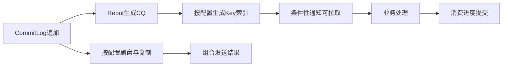

刷盘/复制与索引构建有独立进度，图中不存在“发送ACK必须等索引完成”的依赖。可靠性分析需要分别检查消息字节、索引有效范围和消费组提交位置。

|故障窗口|重启时可能留下的数据|恢复关注点|
|---|---|---|
|消息仅追加、尚未可靠保存|消息可能缺失或只剩部分记录，CQ甚至已经构建|校验有效日志尾部，清理指向无效消息的CQ|
|CommitLog可靠保存，CQ尚未构建|主数据存在，消费索引落后|在恢复扫描与启动派发范围内补CQ|
|CQ已构建，IndexFile不完整|普通消费索引存在，Key查询索引不可信|按IndexCheckpoint筛选文件，并在实际重放范围内补索引|
|业务已提交，消费组位置未提交|业务结果存在，旧消费位置仍在|可能再次投递，由业务幂等识别；Broker存储恢复不负责回滚业务数据库|

只有CommitLog中的有效原始消息仍在，才有重建正文索引的基础。CQ和IndexFile都不能恢复已经删除的消息体；需要副本、备份或其他原始数据来源。

### abort、checkpoint与正常/异常恢复入口

DefaultMessageStore.load用abort文件是否存在判断上次退出状态；正常运行创建标记，关闭时只有存储可写且派发落后量为0等条件满足才删除，否则保留。它是异常退出标记，不是每条消息的完成记录。

`load → IndexService.load(lastExitOK) → recover(lastExitOK)`进入恢复。recover先对各ConsumeQueue执行recover，汇总最大物理结束位置，再选择CommitLog.recoverNormally或recoverAbnormally，最后恢复topicQueueTable。


<div class="source-caption"><code>DefaultMessageStore.recover</code><span>RocketMQ 4.9.8 · L1424–L1434 · <a href="https://github.com/apache/rocketmq/blob/rocketmq-all-4.9.8/store/src/main/java/org/apache/rocketmq/store/DefaultMessageStore.java#L1424-L1434">完整源码</a></span></div>

```java
    private void recover(final boolean lastExitOK) {
        long maxPhyOffsetOfConsumeQueue = this.recoverConsumeQueue();

        if (lastExitOK) {
            this.commitLog.recoverNormally(maxPhyOffsetOfConsumeQueue);
        } else {
            this.commitLog.recoverAbnormally(maxPhyOffsetOfConsumeQueue);
        }

        this.recoverTopicQueueTable();
    }

```

完整恢复分流入口：先恢复CQ，再依据退出状态恢复CommitLog，最后恢复下一队列序号。IndexService.load和启动Reput位于其他方法。


StoreCheckpoint记录三个时间戳，不保存消费组offset，也不是持久化的Reput Offset：

|字段|checkpoint字节位置|恢复用途|
|---|---|---|
|physicMsgTimestamp|0，占8B|物理消息存储相关检查点|
|logicsMsgTimestamp|8，占8B|逻辑队列存储相关检查点|
|indexMsgTimestamp|16，占8B|IndexFile安全检查点|


<div class="source-caption"><code>StoreCheckpoint.flush</code><span>RocketMQ 4.9.8 · L78–L83 · <a href="https://github.com/apache/rocketmq/blob/rocketmq-all-4.9.8/store/src/main/java/org/apache/rocketmq/store/StoreCheckpoint.java#L78-L83">完整源码</a></span></div>

```java
    public void flush() {
        this.mappedByteBuffer.putLong(0, this.physicMsgTimestamp);
        this.mappedByteBuffer.putLong(8, this.logicsMsgTimestamp);
        this.mappedByteBuffer.putLong(16, this.indexMsgTimestamp);
        this.mappedByteBuffer.force();
    }

```

完整检查点写入方法。0、8、16处分别写物理、逻辑与索引时间戳并force；这里没有消费组offset或Reput Offset。


`getMinTimestamp()`取物理与逻辑时间戳最小值再减3秒，负数按0处理；`getMinTimestampIndex()`再和索引时间戳取小值。异常恢复从后向前检查CommitLog文件首条消息时间，选出不晚于参考时间的文件；启用messageIndexEnable且messageIndexSafe时使用包含索引的参考时间，否则使用物理/逻辑参考时间，未找到则从现存首文件开始。参考时间用于挑扫描文件，不是精确到字节的提交证明。

### 找到有效CommitLog尾部，并截断多余CQ

正常恢复从最后第三个CommitLog文件附近开始校验尾部，少于三个文件就从首文件开始；异常恢复用上述时间参考选起点，并在校验有效消息时调用doDispatch。两条路径都通过checkMessageAndReturnSize核对MagicCode、长度等结构，是否验证消息体CRC取决于checkCRCOnRecover。CRC识别消息体损坏，不表示是否被消费。

假设M97～M99有效，M100只写入一部分，扫描在M100处发现无效记录，最终有效结束位置停在M99之后。恢复把flushedWhere、committedWhere调整到这个位置，并用truncateDirtyFiles收缩写入位置、清理后续脏文件。这里的“截断”是存储层有效范围调整，不应理解为必然把预分配文件的操作系统长度直接缩短。


<div class="source-caption"><code>CommitLog.recoverAbnormally</code><span>RocketMQ 4.9.8 · L531–L542 · <a href="https://github.com/apache/rocketmq/blob/rocketmq-all-4.9.8/store/src/main/java/org/apache/rocketmq/store/CommitLog.java#L531-L542">完整源码</a></span></div>

```java

            processOffset += mappedFileOffset;
            this.mappedFileQueue.setFlushedWhere(processOffset);
            this.mappedFileQueue.setCommittedWhere(processOffset);
            this.mappedFileQueue.truncateDirtyFiles(processOffset);

            // Clear ConsumeQueue redundant data
            if (maxPhyOffsetOfConsumeQueue >= processOffset) {
                log.warn("maxPhyOffsetOfConsumeQueue({}) >= processOffset({}), truncate dirty logic files", maxPhyOffsetOfConsumeQueue, processOffset);
                this.defaultMessageStore.truncateDirtyLogicFiles(processOffset);
            }
        }

```

节选异常恢复末尾的有效位置调整与条件性CQ截断。processOffset由前面的记录扫描计算；恢复不仅补索引，还需清理无效尾部的引用。


如果恢复出的CQ最大物理结束位置达到或超过这个有效尾部，还调用truncateDirtyLogicFiles。CQ自身从末尾文件检查条目，删除或收缩指向有效尾部之外的部分，避免消费者拿着索引回读不存在的消息。它依赖正常记录边界，不是逐条证明任意磁盘损坏下所有索引与正文一致。

### 补建索引、恢复队列序号与启动派发

异常恢复校验有效记录时已经执行doDispatch，CQ的物理/逻辑位置检查帮助跳过已有条目。随后DefaultMessageStore.start从现有CQ最大物理结束位置计算Reput起点，以CommitLog最小位置作为下界，启动Reput并等待`dispatchBehindBytes()≤0`，再恢复topicQueueTable并继续启动其他服务。


<div class="source-caption"><code>DefaultMessageStore.start</code><span>RocketMQ 4.9.8 · L275–L292 · <a href="https://github.com/apache/rocketmq/blob/rocketmq-all-4.9.8/store/src/main/java/org/apache/rocketmq/store/DefaultMessageStore.java#L275-L292">完整源码</a></span></div>

```java
            log.info("[SetReputOffset] maxPhysicalPosInLogicQueue={} clMinOffset={} clMaxOffset={} clConfirmedOffset={}",
                maxPhysicalPosInLogicQueue, this.commitLog.getMinOffset(), this.commitLog.getMaxOffset(), this.commitLog.getConfirmOffset());
            this.reputMessageService.setReputFromOffset(maxPhysicalPosInLogicQueue);
            this.reputMessageService.start();

            /**
             *  1. Finish dispatching the messages fall behind, then to start other services.
             *  2. DLedger committedPos may be missing, so here just require dispatchBehindBytes <= 0
             */
            while (true) {
                if (dispatchBehindBytes() <= 0) {
                    break;
                }
                Thread.sleep(1000);
                log.info("Try to finish doing reput the messages fall behind during the starting, reputOffset={} maxOffset={} behind={}", this.reputMessageService.getReputFromOffset(), this.getMaxPhyOffset(), this.dispatchBehindBytes());
            }
            this.recoverTopicQueueTable();
        }

```

节选启动Reput、等待派发追赶、再恢复队列序号。起点由前面的各CQ最大物理结束位置计算，并受CommitLog最小位置约束，不是加载持久化Reput字段。


如果有效日志到10,000，现有CQ最大结束位置为9,000，后续正常派发会扫描9,000～10,000。队列序号恢复则从各CQ的`getMaxOffsetInQueue()`重建下一可分配Queue Offset，避免重启后把序号重新从0开始。

但“全部CQ最大结束位置”只提供一个追赶起点，无法证明所有历史队列都没有缺口。某队列早期索引丢失、其他队列已经走到更高物理位置时，常规启动追赶未必覆盖那个缺口。派发归零也不取代错误检查。

IndexFile走另一套边界：异常启动时IndexService.load删除结束时间晚于indexMsgTimestamp的整个索引文件；恢复扫描只会重建实际扫过的消息。buildIndex以最后保留IndexFile的endPhyOffset过滤更早记录，条件是物理起点`<endPhyOffset`，不能直接套用CQ的`offset+size≤maxPhysicOffset`规则。


<div class="source-caption"><code>IndexService.load</code><span>RocketMQ 4.9.8 · L68–L75 · <a href="https://github.com/apache/rocketmq/blob/rocketmq-all-4.9.8/store/src/main/java/org/apache/rocketmq/store/index/IndexService.java#L68-L75">完整源码</a></span></div>

```java
                    if (!lastExitOK) {
                        if (f.getEndTimestamp() > this.defaultMessageStore.getStoreCheckpoint()
                            .getIndexMsgTimestamp()) {
                            f.destroy(0);
                            continue;
                        }
                    }


```

节选异常退出后删除超过索引安全检查点的整个文件。删除之后是否完整重建取决于实际保留日志与重放范围，不能推断历史索引任意丢失都会自动修好。


可重建性表示有原始数据时可以重新派生索引，不承诺任意人为删除都由下一次普通启动全量修复。还要核对保留日志范围、恢复起点、messageIndexSafe及索引安全时间；尤其不能删除历史IndexFile后，把“Broker能启动”作为Key查询完整性的验证。

### 成功、持久化、可见和业务完成是独立条件

|状态|已经发生什么|仍不能推断什么|
|---|---|---|
|CommitLog追加成功|主数据进入写入路径|物理落盘、所有副本确认、CQ存在|
|要求的刷盘/复制等待成功|满足本次发送配置和waitStoreMsgOK约束|索引一定追平、故障切换后永不丢失|
|业务队列CQ已生成|普通拉取消费具备定位基础|消息符合订阅、业务已执行、消费位置已提交|
|IndexFile条目已生成|Key查询具备候选定位基础|Key唯一、真实字符串一定相同|
|业务事务已提交|该次业务副作用已生效|消费组进度已提交、不会再次投递|

ASYNC_FLUSH可以在实际刷盘前返回；SYNC_FLUSH还要结合waitStoreMsgOK和等待结果。SYNC_MASTER等待副本复制进度，也不能直接解释为副本已物理刷盘。发送超时可能已经追加，消费者业务成功后进度未提交可能重复，因此存储可靠性与业务端到端一致性需要分别设计。

### 按症状区分写入瓶颈、派发滞后与消费积压

|症状|先核对|关键区别|
|---|---|---|
|Producer发送慢|追加锁耗时、文件创建、刷盘、复制延迟|是主写入与发送确认链路|
|发送成功但业务队列暂不可读|dispatchBehindBytes、CQ写入错误、事务/延迟内部Topic|是派发或可见性问题，不直接等同消费线程慢|
|队列可读但某组积压|队列最大逻辑offset−该组提交offset、消费耗时、数据库等待|是按组计量的逻辑积压，单位通常为消息位置|
|Key查询缺失|messageIndexEnable、查询时间/数量上限、IndexFile恢复与构建日志|消费能读不证明Key索引完整|
|重启后少了尾部消息|有效CommitLog尾部、刷盘模式、可用副本与切换流程|索引不能替代主数据|
|offset越界|CQ最小/最大位置、日志保留期、消费组旧进度|历史数据可能已过期清理|

重点日志包括`logic queue order maybe wrong`、`consume queue can not write`、`build index error`和派发起点小于CommitLog最小位置的告警。最后一种情况意味着可能已经缺少补索引所需的主数据，重启不会把这些字节变回来。

### 5.3.4对照与源码阅读路线

4.9.8以上链路针对经典本地文件存储。5.3.4的[DefaultMessageStore](https://github.com/apache/rocketmq/blob/rocketmq-all-5.3.4/store/src/main/java/org/apache/rocketmq/store/DefaultMessageStore.java)按enableBuildConsumeQueueConcurrently选择ConcurrentReputMessageService或经典Reput，不能把单线程解析描述当成所有配置不变的规则。[RocksDBConsumeQueueStore](https://github.com/apache/rocketmq/blob/rocketmq-all-5.3.4/store/src/main/java/org/apache/rocketmq/store/queue/RocksDBConsumeQueueStore.java)有批量索引写入和消息到达通知流程，恢复位置也由具体索引存储提供。并发优化仍需要保持派发顺序约束，不表示任意乱序构建索引。

经典文件CQ的20B结构、fillPreBlank和MappedFile恢复方法不能原样套到RocksDB实现。分级存储与不同复制模式也要沿实际启用组件核对读写、确认和清理边界。

建议按`CommitLog.asyncPutMessage / DefaultAppendMessageCallback.doAppend → ReputMessageService.doReput / doDispatch → ConsumeQueue.putMessagePositionInfo → DefaultMessageStore.getMessage → IndexFile.putKey / selectPhyOffset → DefaultMessageStore.recover / start`阅读。每一步都问清输入的坐标、更新的状态、失败返回和重启时依据什么继续，才能把存储协作串成完整机制。以上数值与宕机场景均为源码推导示例，未执行RocketMQ进程、掉电或磁盘损坏实验。

## 三层原理问答

### 1. 数据库提交成功但发送消息失败，怎么办？

<details markdown="1"><summary>查看回答与追问</summary>

普通的提交后发送存在宕机间隙。新设计可以用 Outbox，把业务与待发事件同事务保存；或用事务消息先 Half，再执行本地事务，由回查补齐未知结果。

**失败怎样补回来？** Outbox 任务从持久记录继续发，发出但没标成功可能重复；事务回查根据数据库状态决定提交或回滚。两种方式都仍需要消费端识别重复。

**已经漏掉的订单呢？** 新方案不会自动补历史缺口，要按已完成业务与下游结果扫描补发。给待发事件设置重试、积压年龄告警、保留期和人工处理方式。
</details>

### 2. 消费者完成业务但 ACK 前宕机，怎么办？

<details markdown="1"><summary>查看回答与追问</summary>

消息可能再次投递，所以消费逻辑应能识别同一业务事件。事件 ID 唯一记录与业务修改放在同一数据库事务，重复投递返回此前结果。

**为什么去重也要同事务？** 如果先记处理成功，业务却回滚，下次会被挡掉；反过来业务提交后去重未落库，又会做两遍。经典 offset 和 POP ACK 都不会自然与任意 DB 原子提交。

**外部付款怎么办？** 向供应商传稳定幂等键，超时后查询同一请求结果。不能因为没收到响应就换 ID 再扣一次，必要时记录 UNKNOWN 并对账。
</details>

### 3. 消息乱序如何解决？

<details markdown="1"><summary>查看回答与追问</summary>

同一业务 key 路由到同一队列，使用顺序消费，业务再校验版本或允许的状态变化。这解决局部顺序，不提供跨所有队列的全局顺序。

**还有哪些地方会乱？** 多 Producer 的发送先后、重试、队列调整都会影响顺序。回调里异步分发后马上成功，也会让实际数据库操作重新并行。

**遇到缺一个版本怎么办？** 可以暂存未来版本或查询来源补齐，设数量和时间上限。毒消息卡住顺序队列时，需要受控修复或隔离，不能悄悄跳过关键事件。
</details>

### 4. 消息积压如何快速恢复？

<details markdown="1"><summary>查看回答与追问</summary>

先查哪里变慢，并让实际处理速度超过新消息到达速度。只增加实例数量，若仍卡在同一个数据库，积压不会因此消失。

**并行有何上限？** 经典队列分配受队列数限制；消费线程还受连接池和外部接口容量限制。批处理可能提高吞吐，但要定义部分失败与重试的范围。

**多久能恢复？** 用积压量除以完成率减到达率估算。限制历史重放速度，必要时降低新流量。顺序业务扩队列要先评估 key 映射变化，避免用乱序换吞吐。
</details>

### 5. Broker 故障如何降低消息丢失风险？

<details markdown="1"><summary>查看回答与追问</summary>

根据能接受的丢失范围，配置刷盘和副本确认，并检查发送返回状态。异步应答可能早于落盘或复制，故障后不一定保留。

**同步就万无一失吗？** 同步刷盘超时仍可能已经写入；传统同步主从与 DLedger、Controller 不是同一种选主协议。切换前要核对可用副本位置和复制延迟。

**如何验证可靠性？** 演练主故障、响应丢失和副本落后，验证稳定 eventId 的重试与对账。备份和错误删除恢复仍要单独设计，复制不能覆盖所有损坏。
</details>

### 6. 事务消息能实现端到端 exactly-once 吗？

<details markdown="1"><summary>查看回答与追问</summary>

不能直接保证端到端业务只做一次。事务消息主要把生产者本地结果与消息可见性联系起来，消费者的数据库仍要自己提交。

**Half 后还有哪些限制？** 回查有超时、次数和记录保存限制。Producer 必须从持久状态回答，消费者依然可能重复，不能用进程内 map 或永远重试代替恢复设计。

**怎样谈效果一次？** 明确业务范围，用唯一事件、同事务去重、状态检查和外部幂等键吸收重复。无法撤销的外部动作还需查询和人工补偿，而不是只承诺一个英文术语。
</details>

## 模拟生产案例：支付成功重复发保单

消费者已提交支付业务，保存消费位置前宕机，重启后同一事件再次到来，保单生成又执行一遍。这是 at-least-once 下很典型的模拟情况。

按稳定 eventId 对齐队列 offset、数据库提交和进程退出时间，先排除两个合法不同事件。若生成逻辑是查不到再插入，又无唯一约束，两次执行可能都成功。

为付款事件与保单结果建立正确的业务唯一约束，并让处理记录与业务写入同一事务。外部发单接口也使用稳定幂等键。上线约束前先检查历史重复，不让建索引失败掩盖已有错误。

在测试中将进程停在 DB commit 之后，重放同一事件，预期只留下一个合法结果。以后把这个宕机点、乱序和 DLQ 重放纳入测试；去重记录保留期要覆盖允许的重放时间。

## 知识梳理与核心总结

### 一分钟要点回顾

RocketMQ先取路由，Broker追加CommitLog，再由Reput建立ConsumeQueue和Key索引。队列消费与Key查询分别定位索引后回读正文；Queue Offset、物理offset、派发位置和消费组进度不能混用。恢复既要补索引，也要清理指向无效日志尾部的CQ。发送成功取决于刷盘与副本配置，超时可能已写入。4.x Push底层拉取，业务提交与offset保存之间可能重复，消费应同事务识别事件。顺序局限在队列和实际业务执行，积压要让完成率超过到达率。事务消息用Half与回查补生产端结果，消费者仍需幂等和对账。

### 深入理解与机制串联

我先沿发送过程说明成功的含义。Producer 从 NameServer 取路由后直连 Broker，消息主体进入 CommitLog，ConsumeQueue 保存队列到主体的索引，IndexFile 用于 key 查询。同步刷盘和同步副本等待是两件事，配置和返回状态决定当次承诺。

Broker 已写入而响应丢失时，Producer 只看到超时，重试可能重复。消费端也有相似间隙：业务数据库提交了，消费位置还没保存就宕机，恢复后又收同一事件。所以事件 ID 唯一记录和业务修改要同事务；外部付款还要稳定幂等键与查询结果。

存储主数据和索引有独立进度。Reput依消息元数据构建队列与Key索引；CQ用物理结束位置和逻辑位置协调重放，IndexFile用哈希链找到候选，再核对真实Key。异常恢复结合检查点选择日志扫描起点，校验有效尾部并处理多余索引，启动时追赶派发。但最大位置不是任意历史缺口的完整性证明，丢失正文也不能靠索引还原。

数据库成功但普通发送失败，可用 Outbox 或事务消息。Outbox 保存待发记录；事务消息先 Half，再本地事务，最后确认。确认丢失由回查读取持久业务结果，但查不到不能乱提交，也有次数与保留限制。它不包住消费者自己的事务。

顺序消息需要同 key 队列、顺序消费，还要防多 Producer、重试、队列变化和异步回调破坏实际顺序。业务版本能检查重复和缺序列，毒消息则要有受控恢复。

积压先找真正耗时点，再算净处理速度。经典消费者超过队列数不会无限增速，数据库过载时加线程可能更慢。Broker 故障则按具体 HA 模式演练刷盘、复制落后和切换，保留稳定事件重试和对账。最后明确 4.x offset 与 5.x POP ACK 不混讲，DLQ 和历史重放必须有人负责。

### 延伸问题、常见误解与速记

- 高频追问：发送超时能否直接重发？消费成功后何时保存位置？回查查不到怎样答？积压多久能清空？
- 容易答错：Push 没有 Pull；事务消息包住消费者数据库；同步复制自动等于共识选主；加消费者永远能提速。
- 常看的源码：`sendDefaultImpl/sendMessageInTransaction`、`CommitLog.asyncPutMessage`、`ReputMessageService.doReput`、`TransactionalMessageServiceImpl.check`、`processConsumeResult`。
- 存储排查：区分派发字节落后量与消费组逻辑积压；普通消费不需要IndexFile，Key查询缺失也不证明消息未写入。
- 每次回答“成功”都说清：谁完成了什么，以及下一步之前宕机由谁恢复。


## 官方资料与版本来源

本文按上述版本阅读官方源码，节选可能省略方法的其他分支。版权见 [source-notices.txt](./source-notices.txt)，下载记录见 [sources.json](./sources.json)。

- [CommitLog.asyncPutMessage · RocketMQ 4.9.8](https://raw.githubusercontent.com/apache/rocketmq/rocketmq-all-4.9.8/store/src/main/java/org/apache/rocketmq/store/CommitLog.java)
- [DefaultMQProducerImpl.sendMessageInTransaction · RocketMQ 4.9.8](https://raw.githubusercontent.com/apache/rocketmq/rocketmq-all-4.9.8/client/src/main/java/org/apache/rocketmq/client/impl/producer/DefaultMQProducerImpl.java)
- [TransactionalMessageServiceImpl.check · RocketMQ 4.9.8](https://raw.githubusercontent.com/apache/rocketmq/rocketmq-all-4.9.8/broker/src/main/java/org/apache/rocketmq/broker/transaction/queue/TransactionalMessageServiceImpl.java)
- [CommitLog.asyncPutMessage · RocketMQ 4.9.8](https://raw.githubusercontent.com/apache/rocketmq/rocketmq-all-4.9.8/store/src/main/java/org/apache/rocketmq/store/CommitLog.java)
- [CommitLog.DefaultAppendMessageCallback.doAppend · RocketMQ 4.9.8](https://raw.githubusercontent.com/apache/rocketmq/rocketmq-all-4.9.8/store/src/main/java/org/apache/rocketmq/store/CommitLog.java)
- [DefaultMessageStore.ReputMessageService.doReput · RocketMQ 4.9.8](https://raw.githubusercontent.com/apache/rocketmq/rocketmq-all-4.9.8/store/src/main/java/org/apache/rocketmq/store/DefaultMessageStore.java)
- [DefaultMessageStore.doDispatch · RocketMQ 4.9.8](https://raw.githubusercontent.com/apache/rocketmq/rocketmq-all-4.9.8/store/src/main/java/org/apache/rocketmq/store/DefaultMessageStore.java)
- [ConsumeQueue.putMessagePositionInfo · RocketMQ 4.9.8](https://raw.githubusercontent.com/apache/rocketmq/rocketmq-all-4.9.8/store/src/main/java/org/apache/rocketmq/store/ConsumeQueue.java)
- [ConsumeQueue.putMessagePositionInfo · RocketMQ 4.9.8](https://raw.githubusercontent.com/apache/rocketmq/rocketmq-all-4.9.8/store/src/main/java/org/apache/rocketmq/store/ConsumeQueue.java)
- [DefaultMessageStore.getMessage · RocketMQ 4.9.8](https://raw.githubusercontent.com/apache/rocketmq/rocketmq-all-4.9.8/store/src/main/java/org/apache/rocketmq/store/DefaultMessageStore.java)
- [IndexFile.putKey · RocketMQ 4.9.8](https://raw.githubusercontent.com/apache/rocketmq/rocketmq-all-4.9.8/store/src/main/java/org/apache/rocketmq/store/index/IndexFile.java)
- [MQAdminImpl.queryMessage · RocketMQ 4.9.8](https://raw.githubusercontent.com/apache/rocketmq/rocketmq-all-4.9.8/client/src/main/java/org/apache/rocketmq/client/impl/MQAdminImpl.java)
- [TransactionalMessageBridge.parseHalfMessageInner · RocketMQ 4.9.8](https://raw.githubusercontent.com/apache/rocketmq/rocketmq-all-4.9.8/broker/src/main/java/org/apache/rocketmq/broker/transaction/queue/TransactionalMessageBridge.java)
- [DefaultMessageStore.recover · RocketMQ 4.9.8](https://raw.githubusercontent.com/apache/rocketmq/rocketmq-all-4.9.8/store/src/main/java/org/apache/rocketmq/store/DefaultMessageStore.java)
- [StoreCheckpoint.flush · RocketMQ 4.9.8](https://raw.githubusercontent.com/apache/rocketmq/rocketmq-all-4.9.8/store/src/main/java/org/apache/rocketmq/store/StoreCheckpoint.java)
- [CommitLog.recoverAbnormally · RocketMQ 4.9.8](https://raw.githubusercontent.com/apache/rocketmq/rocketmq-all-4.9.8/store/src/main/java/org/apache/rocketmq/store/CommitLog.java)
- [DefaultMessageStore.start · RocketMQ 4.9.8](https://raw.githubusercontent.com/apache/rocketmq/rocketmq-all-4.9.8/store/src/main/java/org/apache/rocketmq/store/DefaultMessageStore.java)
- [IndexService.load · RocketMQ 4.9.8](https://raw.githubusercontent.com/apache/rocketmq/rocketmq-all-4.9.8/store/src/main/java/org/apache/rocketmq/store/index/IndexService.java)
- [RocketMQ 5.x 事务消息与版本边界](https://rocketmq.apache.org/docs/featureBehavior/04transactionmessage/)
- [RocketMQ 5.3.4 源码对照](https://github.com/apache/rocketmq/tree/rocketmq-all-5.3.4)


---

# Redis 与分布式缓存

本章主要看 Redis 7.2.4。缓存让大多数请求不用访问数据库，但也带来两个新问题：缓存里的值什么时候会过时，缓存失效后数据库能否承受请求。

## 核心知识与原理

### 数据结构与网络模型

Redis 的 String、Hash、List 是对外的数据类型，内部还会根据内容和大小选择不同编码。例如 String 可以直接存整数，也可以用 embstr 或 raw/SDS；小 Hash 常用 listpack，大 Hash 用哈希表；大 ZSet 结合 dict 和 skiplist，List 使用 quicklist 和 listpack。Set 的整数、小集合和较大集合也有不同路径，7.2 已有 listpack，不能总拿旧 ziplist 图解释。

换编码可以节省内存，却也会产生转换成本。字典扩容用渐进 rehash，把工作分到后续操作中完成；但这不表示每个命令都只做固定少量工作。一个包含几十万元素的集合，遍历、序列化、删除和迁移都可能很重。

网络通过 ae 事件循环处理就绪事件，命令执行的主要路径仍由主线程串行运行。Redis 6+ 可配置网络 IO 多线程，持久化和 lazyfree 也有后台工作，但不能据此说所有命令会并行执行。一个很慢的 Lua 脚本占着执行线程，其他请求就得等。

### 持久化、复制与集群

RDB 保存某一时点的快照，恢复后可能没有快照之后的写入。fork 后应用继续修改页面，会产生 Copy-on-Write，因此高写入时要额外留内存。AOF 记录写操作，fsync 策略决定写入延迟与可能丢失的范围。everysec 不等于任何故障下都零丢失；Redis 7 的 multipart AOF 由 base、incr 和 manifest 配合，不是旧版单文件结构。

主从复制通常是异步的。主机回复成功时，副本可能还没有收到写入。PSYNC 能在历史仍保留时做部分重同步，否则要全量同步。Sentinel 负责检测故障和协调提升副本，但无法把尚未复制的数据凭空补回来。

Cluster 把数据分到 16384 个 hash slot，并通过 MOVED 等机制引导客户端找正确节点。跨 slot 的多 key 操作要满足具体约束，同 hash tag 可以让相关 key 落在同一 slot。WAIT 可以等待副本确认、降低风险，却不能承诺故障切换一定选到包含全部确认写入的副本，也不是强一致存储的替代品。

### 缓存故障与一致性

穿透指请求的 key 不存在，却不断查数据库。可以校验非法请求、短期缓存“确实不存在”的结果，或使用 Bloom Filter；暂时查库失败不能当成不存在长期缓存。击穿指一个热点 key 过期，大量线程一起查库，常用同 key 请求合并或受控加载。雪崩则是大量 key 同时过期或整个缓存故障，需要限流、隔离与降级，随机 TTL 只能解决其中一部分。

Cache Aside 通常是写数据库后删缓存，读 miss 时查数据库再回填。顺序已经合理，仍有一个竞态：A 先读到旧数据但回填很慢；B 提交新数据并删缓存；A 最后把旧数据写回去。此时缓存又旧了。

延迟双删希望第二次删除覆盖这段时间，但 A 可能因 GC、网络或排队暂停得更久，第二次删除也可能失败。它能降低某些问题的概率，无法拿固定 sleep 保证所有读都正确。应根据允许陈旧多久，选择 TTL、版本检查、CDC/Outbox 的可靠失效通知；必须准确的结果直接确认数据库。

### 分布式锁与 fencing

`SET key token NX PX lease` 把“没有才创建”和“设置租期”放在一次命令中。token 表示谁持有锁，解锁时用 Lua 先比较 token 再删，避免删掉后来别人的锁。

```shell
# 获取锁示例：响应超时不能直接判断是否取得锁。
SET lock:order:1001 unique-owner-token NX PX 30000
```

```lua
-- 只有 token 相同才解锁；过期线程能否写数据库需另加保护。
if redis.call('get', KEYS[1]) == ARGV[1] then
    return redis.call('del', KEYS[1])
end
return 0
```

即使这样，A 持锁后暂停超过租期，B 仍能获得新锁；A 恢复后也可能继续修改数据库。Lua 只能防错删，不能阻止这个旧持有者写数据。Redisson Watchdog 会尝试续期，但进程暂停、网络隔离或调度延迟仍可能让续期失败。

若必须拒绝旧持有者，需要资源端也参与判断。例如每次获取租约拿到单调递增的 fencing token，数据库或目标资源拒绝比已接受编号更小的请求。随机 token 没有这种顺序含义，普通 INCR 再加锁也不能自动解决故障切换的一致性。库存和资金更常见的保护是数据库条件更新和唯一约束，锁帮助减少竞争。

### 热点、大 Key 与容量

单个热点 key 再热，也主要由一个分片承载。可用短期本地缓存、同 key 合并或业务拆分减压，但副本读取和本地缓存又有陈旧问题。大 key 还会占网络、影响主线程操作与复制。生产排查尽量用受控 SCAN，避免一次 KEYS 全扫；UNLINK 可把一部分释放工作放后台，却不能消除读取和迁移的成本。

SLOWLOG 主要反映命令执行时间，不包含完整网络往返。服务端看不到慢命令而客户端很慢时，还要检查连接、网络和排队。容量除了数据本身，也要算对象/字典开销、复制 backlog、客户端缓冲、COW 和碎片；used_memory 没到 maxmemory，不代表容器内存安全。

### 缓存与锁的正常、异常、恢复路径

缓存不可用时，如果把全部流量放到数据库，数据库可能随即成为第二个故障点。恢复前限制同时查库的请求，给非关键功能明确降级；缓存恢复后分批预热，避免所有实例同时加载同一热点。

锁请求超时也要区分“没拿到”和“结果没收到”。关键操作仍靠自己的业务条件判断。事后检查锁 key 存不存在，不能证明库存有没有重复扣；需要按事件 ID 和数据库结果对账。


## 源码级解析与调用链

命令从 processCommand 进入 call，SET 最后由 `setGenericCommand` 检查 NX/XX、写 key 和过期。先读这段就能确认“检查没有”和“写入”是在一次命令中完成的。

删除由 dbDelete 选择同步或异步释放路径。对象编码还需继续看 t_hash.c、t_zset.c、dict.c、quicklist.c，不能只根据对外类型名估计所有操作的成本。


<div class="source-caption"><code>setGenericCommand</code><span>Redis 7.2.4 · L84–L103 · <a href="https://github.com/redis/redis/blob/7.2.4/src/t_string.c#L84-L103">完整源码</a></span></div>

```c
void setGenericCommand(client *c, int flags, robj *key, robj *val, robj *expire, int unit, robj *ok_reply, robj *abort_reply) {
    long long milliseconds = 0; /* initialized to avoid any harmness warning */
    int found = 0;
    int setkey_flags = 0;

    if (expire && getExpireMillisecondsOrReply(c, expire, flags, unit, &milliseconds) != C_OK) {
        return;
    }

    if (flags & OBJ_SET_GET) {
        if (getGenericCommand(c) == C_ERR) return;
    }

    found = (lookupKeyWrite(c->db,key) != NULL);

    if ((flags & OBJ_SET_NX && found) ||
        (flags & OBJ_SET_XX && !found))
    {
        if (!(flags & OBJ_SET_GET)) {
            addReply(c, abort_reply ? abort_reply : shared.null[c->resp]);
```

lookupKeyWrite 之后直接检查 NX/XX 是否满足，不满足就回复并返回。条件判定和后续写入处在同一次命令执行中，不需要客户端先 GET 再决定 SET。


<div class="source-caption"><code>dbDelete</code><span>Redis 7.2.4 · L403–L408 · <a href="https://github.com/redis/redis/blob/7.2.4/src/db.c#L403-L408">完整源码</a></span></div>

```c
int dbDelete(redisDb *db, robj *key) {
    return dbGenericDelete(db, key, server.lazyfree_lazy_server_del, DB_FLAG_KEY_DELETED);
}

/* Prepare the string object stored at 'key' to be modified destructively
 * to implement commands like SETBIT or APPEND.
```

dbDelete 根据 lazyfree 配置选择 dbAsyncDelete 或 dbSyncDelete。异步路径允许先移除 key，再由后台处理部分内存释放，所以命令成功与 RSS 下降不一定同时发生。


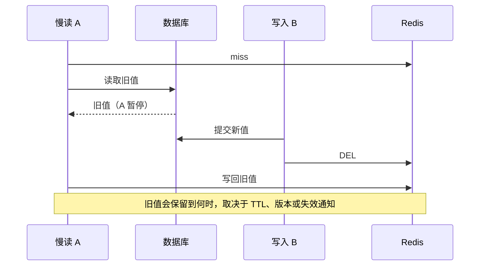

## 三层原理问答

### 1. Redis 是单线程为什么还能快？

<details markdown="1"><summary>查看回答与追问</summary>

常见操作在内存里完成，结构选择合理，事件驱动减少阻塞切换，主命令线程也避免了一些锁竞争。但速度来自这些具体条件，不是“单线程”三个字。

**多线程到底在哪？** 网络 IO 可以多线程，持久化、lazyfree 也有别的进程或线程。大范围命令和慢脚本仍可能挡住命令执行，所以其他请求会跟着慢。

**性能怎么测？** 使用真实命令比例、value 大小和连接数，看热点及 p99。SLOWLOG 没慢命令时也查网络和排队，再决定优化命令、合并请求还是分片。
</details>

### 2. 延迟双删能绝对保证一致吗？

<details markdown="1"><summary>查看回答与追问</summary>

不能。它试图再删一次，覆盖读请求晚回填的情况，但延迟没有可靠覆盖所有暂停，第二次删除也可能失败。

**500ms 为什么不可靠？** 慢读可能暂停 2 秒，等第二次删除已经完成才回填旧值。GC、网络和队列都能延长这段时间，DB 和 Redis 并没有共同事务。

**需要更准确怎么办？** 先定义能接受旧值多久，再选 TTL、版本校验或可靠失效事件。核心余额从数据库确认。删除失败有重试，不把固定 sleep 当强一致证明。
</details>

### 3. Lua 解锁为什么仍不等于强一致锁？

<details markdown="1"><summary>查看回答与追问</summary>

Lua 比较 token 后删除，能防止 A 删掉 B 的锁；但 A 的租期过了以后继续写数据库，Lua 无法拦住它。

**Watchdog 能解决吗？** 它会续期，但 STW、网络或调度异常仍能让续期失败。异步复制切换还可能丢锁。随机所有权 token 也没有可供数据库比较的新旧顺序。

**关键写用什么保护？** 用数据库条件写和唯一约束，或有可靠授予方式的 fencing，并由资源端拒绝旧编号。Redis 锁可以降低竞争，但最终数据判断不能只看有没有锁。
</details>

### 4. RDB 与 AOF 如何选？

<details markdown="1"><summary>查看回答与追问</summary>

RDB 保存快照，恢复较直接但会丢快照之后的写入；AOF 记录写操作，可按 fsync 策略缩短丢失窗口。常组合使用，并安排备份。

**性能代价在哪？** fork 后写多会增加 COW 内存，fsync 和重写依赖磁盘性能。Redis 7 的 multipart AOF 有 base、incr、manifest，不是一个旧单文件的全部流程。

**怎样选择？** 若只是可重建缓存，接受窗口可能不同；若当主数据使用，先定义 RPO 并做恢复演练。开启持久化不能替代数据库和消息链的可靠设计。
</details>

### 5. Sentinel 切换为什么可能丢数据？

<details markdown="1"><summary>查看回答与追问</summary>

副本可能尚未收到主机已应答的写入。Sentinel 能协调提升，但无法恢复从未到达新主的数据。

**WAIT 是否就够了？** WAIT 能等待副本确认、降低风险，却不是线性一致承诺，也不保证每种故障切换都选到包含该写的副本。隔离和旧主恢复也需要考虑。

**业务怎么承受？** 缓存数据可失效重建，关键账务保留在数据库。测试复制 lag、断网和切换，明确什么时候降级，不把主从当零丢失承诺。
</details>

### 6. 缓存故障为何拖垮数据库？

<details markdown="1"><summary>查看回答与追问</summary>

大量原先命中的请求同时回源，数据库的连接、CPU 和等待队列会很快超过能力。超时重试又会增加请求。

**同 key 合并够吗？** 它能减少一个热点的重复加载，但整缓存故障会有很多不同 key。还需要限制总回源并发，并把慢依赖和其他功能隔离。

**恢复怎么做？** 非关键业务降级，关键请求在限额内查库，恢复后分批预热。容量测试包含全缓存失效，而不是只测正常的高命中率。
</details>

## 模拟生产案例：锁超期导致重复扣库存

库存已经使用 SET NX PX 锁，仍被重复扣减。A 持锁后暂停 40 秒，锁租期只有 30 秒，B 拿到新锁完成更新，A 恢复又继续。这是一个明确的模拟时间线。

对齐租期、GC/暂停、获得锁和 DB 写入时间，核对 token 解锁。即使 Lua 解锁正确，A 的数据库操作也没有因此被阻止。只看两条“加锁成功”日志不会发现原因。

库存修改加条件与事件唯一约束，确认重复请求只能产生一次效果。Redis 锁用来降低竞争。若采用 fencing，还需资源端拒绝旧编号，以及可靠的编号授予方式。

测试主动暂停旧持有者、触发续期失败和副本切换，观察业务结果。长期监控锁失败与业务重复，不把 Watchdog 当作永不失效的互斥保证。

## 知识梳理与核心总结

### 一分钟要点回顾

Redis 常见操作靠内存结构和事件循环，网络 IO 多线程不代表命令全部并行。缓存写库后删仍可能被慢读回填旧值，双删只是减少问题，不能承诺强一致。SET NX PX 加 token 和 Lua 防误删，但锁过期或切换后旧线程仍能写，关键数据用数据库条件或 fencing 保护。缓存故障还要限制回源，RDB、AOF 和异步复制都有各自恢复窗口。

### 深入理解与机制串联

我从 Cache Aside 的正常读写开始：读 miss 就查库并填缓存，写提交 DB 后删缓存。这个顺序常用，却仍有慢读先拿旧值、等新写完成并删后才回填的情况。TTL、版本和可靠失效事件可以按业务接受的陈旧时间选择，固定双删延迟无法覆盖所有暂停。

热点失效要合并同 key 加载，但整缓存宕机还需要全局回源限额和降级，否则数据库也会倒。恢复分批预热。大 key 的扫描、序列化、复制和删除成本要单独处理，UNLINK 只把一部分回收放后台。

锁方面 SET NX PX 原子创建并带租期，随机 token 表示 owner，Lua 比较后删防止错删。A 暂停过租期后，B 可以拿新锁，A 恢复仍可能写数据库。Watchdog 续期也可能失败，所以资源需要自己的条件约束，或验可靠的递增 fencing 编号。

持久化方面，RDB 是快照，fork 写多会有 COW；AOF fsync 决定窗口，Redis 7 是 multipart 文件组织。复制异步，Sentinel 提升不能补回未复制写入，WAIT 也不是完整强一致承诺。

最后按真实命令、value 大小和连接数测 p99，SLOWLOG 与网络排队分开看。容量不只算 used_memory，还包括复制、客户端缓冲、COW 和碎片。关键金额从数据库确认，不依赖缓存或租约独自保证。

### 延伸问题、常见误解与速记

- 高频追问：WAIT 为什么不够？UNLINK 后 RSS 为何仍高？Lua 解锁能否阻止旧 owner？整缓存故障怎样保护 DB？
- 容易答错：Redis 7 小结构统一 ziplist；延迟双删必然一致；Watchdog 保证永不失锁；SLOWLOG 包含所有网络延迟。
- 常看的源码：`setGenericCommand`、`dbDelete/dbAsyncDelete`、`dictRehash`、`aeMain` 与 `replication.c`。
- 想清楚：允许缓存旧多久，失效时最多查多少库，以及租期过后谁拦住旧写。


## 官方资料与版本来源

本文按上述版本阅读官方源码，节选可能省略方法的其他分支。版权见 [source-notices.txt](./source-notices.txt)，下载记录见 [sources.json](./sources.json)。

- [dbDelete · Redis 7.2.4](https://raw.githubusercontent.com/redis/redis/7.2.4/src/db.c)
- [setGenericCommand · Redis 7.2.4](https://raw.githubusercontent.com/redis/redis/7.2.4/src/t_string.c)
- [Redis 分布式锁边界](https://redis.io/docs/latest/develop/use/patterns/distributed-locks/)
- [Redisson 锁与 Watchdog](https://redisson.pro/docs/data-and-services/locks-and-synchronizers/)


---

# 分布式事务与数据一致性

以订单、支付和保单为例，结合 Spring 5.3、本地 MySQL 事务与 RocketMQ 4.9.8。这里最重要的不是选一个缩写，而是把每个宕机点留下的数据，以及谁负责继续处理，说清楚。

## 核心知识与原理

### CAP、BASE：先说明业务必须满足什么

订单服务通知支付服务时超时了，支付到底成功没有？单个数据库事务不能回答另一个系统的执行结果。这种不确定性是分布式设计的日常问题，不只发生在真正断网时。

CAP 描述网络分区下的一项限制：若节点之间不能通信，就无法同时保证模型中的线性一致性和所有未失败节点都能完成请求。它不是任何时候随意“选两个”。BASE 是偏向可用和异步完成的设计思路，也不意味着数据放一会儿就自己正确了。

先写业务必须保持的条件，会更容易选方案。例如同一支付事件不能记账两次；只有已确认支付才能生成保单；退款不能超过实收。之后再讨论哪些操作必须一个事务完成，哪些可以稍后完成，失败多久要报警，最终由谁对账。

### 2PC、TCC、Saga 的代价与故障边界

2PC 先让参与者准备，再统一决定提交或回滚。它要求参与者和协调者支持相应协议，并留下恢复日志。准备好后协调者失联，参与者可能继续持有资源、等待决定，因此并非免费获得原子性和高可用。数据库都支持事务，也不代表所有接口和外部支付都能加入 XA。

TCC 把动作拆成预留、确认和取消。例如 Try 冻结库存，Confirm 真正扣减，Cancel 解除冻结。它需要业务代码提供这三个动作，还要处理重复和乱序：Cancel 先到时记录已撤销，晚来的 Try 不能再冻结资源，这解决空回滚之后的悬挂问题。

Saga 让多个本地事务逐步提交，后面失败时执行补偿。例如订单失败后退款、释放库存。补偿也是一次新的业务操作，可能失败，需要重试或人工处理；它不是数据库回滚，无法让已经发出的短信变成从未发出。

|方案|什么时候考虑？|最需要承担的工作|
|---|---|---|
|2PC|参与者支持协议，确实需要协调原子提交|资源持有、协调者故障和 prepared 恢复|
|TCC|资源能提前预留，业务能确认或撤销|实现三个动作，处理幂等、空回滚、悬挂|
|Saga|流程较长，允许中间状态，动作可补偿|记录每步结果，处理补偿失败和不可逆动作|
|事务消息|要协调本地提交与 MQ 可见性|持久回查状态、消费幂等、超限对账|
|Outbox|业务和事件能写在同一数据库|后台发送、重复投递、积压与顺序处理|

### Transactional Outbox 源码与业务协议

支付数据库提交成功，发 MQ 前进程死了，下游就永远收不到通知。Outbox 的改法是：在同一个数据库事务里，既更新订单，也写一条“还有这个事件要发送”的记录。提交失败时两者一起撤销，提交成功后发送任务即使重启也能继续。

```sql
-- 业务示例：Outbox 与订单写入同一数据库本地事务。
CREATE TABLE outbox_event (
  event_id VARCHAR(64) PRIMARY KEY,
  aggregate_id BIGINT NOT NULL,
  aggregate_version BIGINT NOT NULL,
  payload TEXT NOT NULL,
  status VARCHAR(16) NOT NULL,
  next_attempt_at TIMESTAMP NOT NULL,
  UNIQUE KEY uk_aggregate_version(aggregate_id, aggregate_version)
);
START TRANSACTION;
UPDATE orders SET status='PAID', version=version+1
 WHERE id=1001 AND status='PENDING';
-- 应用核对影响行数，并以稳定 event_id 和对应版本写入事件。
INSERT INTO outbox_event VALUES
 ('payment-confirmed-1001',1001,2,'{"orderId":1001}',
  'NEW',CURRENT_TIMESTAMP);
COMMIT;
```

后台 relay 读取待发记录，发送 MQ，成功后标记 SENT。它在发送成功后、标记前宕机，恢复后仍可能再发。这是有意选择的结果：允许重复，消费端可以识别；若先标 SENT 再发，标记后宕机就可能永久丢通知。

发送不宜长时间持有数据库行锁。可以用短事务领取任务并记录租期，提交后发送，完成时校验领取者。租期过后重新领取仍可能重复，所以消费幂等不可省略。SKIP LOCKED 等领取方式还受数据库版本影响，跳过前面的行也可能改变同一订单的事件顺序。

消费端把 processed_event 的唯一事件 ID 和业务更新放在同一事务。事务失败，处理记录也回滚，下次还能重试；重复键时核实之前确实已成功，再返回已处理。先在 Redis 写“处理过”，再写数据库，数据库失败却留下去重标记，会把正常重试挡住。

### 每个宕机点留下什么，谁接着处理

沿着同一支付事件看五个位置：本地提交前宕机，两张表一起回滚；提交后未发送，Outbox 继续发送；发出后未标 SENT，消费端识别重复；消费提交后未确认，再次投递仍得到同一结果；外部渠道结果未知，用原 requestId 查询或幂等重试。

每一步还要规定等待多久、重试多少、记录保存多久、由哪个任务扫描，以及什么时候交给人工。只写“最终一致”没有提供这些动作，就还没有一个可恢复的实现。

### 订单、支付与保单的状态机

调用支付接口超时，先把结果记为 UNKNOWN。继续使用同一个业务 requestId 查询渠道，不要马上换 ID 再扣一次。确认成功后才本地记账并产生可靠事件，保单服务以 paymentEventId 等稳定身份识别重复。

若保单已生效，补偿通常要走撤保或退款流程，不是删除一行就完成。对账可以明确查三类记录：有支付无保单、无支付有保单、同一支付重复保单。事件 ID 选择和保留期决定历史重放时还能不能识别重复。


## 源码级解析与调用链

Outbox 是业务表和后台任务的一种做法，没有一个通用 JDK 类能替你完成它。Spring 的 `invokeWithinTransaction` 只建立本地事务。RocketMQ 的 sendMessageInTransaction 和 check 处理另一段消息确认。

本章再次引用回查入口，是为了对应恢复责任：Broker 会检查待决消息，但真正本地交易状态仍由 Producer 查询。数据库中的 eventId、状态和约束必须由业务设计。


<div class="source-caption"><code>TransactionalMessageServiceImpl.check</code><span>RocketMQ 4.9.8 · L127–L143 · <a href="https://github.com/apache/rocketmq/blob/rocketmq-all-4.9.8/broker/src/main/java/org/apache/rocketmq/broker/transaction/queue/TransactionalMessageServiceImpl.java#L127-L143">完整源码</a></span></div>

```java
    public void check(long transactionTimeout, int transactionCheckMax,
        AbstractTransactionalMessageCheckListener listener) {
        try {
            String topic = TopicValidator.RMQ_SYS_TRANS_HALF_TOPIC;
            Set<MessageQueue> msgQueues = transactionalMessageBridge.fetchMessageQueues(topic);
            if (msgQueues == null || msgQueues.size() == 0) {
                log.warn("The queue of topic is empty :" + topic);
                return;
            }
            log.debug("Check topic={}, queues={}", topic, msgQueues);
            for (MessageQueue messageQueue : msgQueues) {
                long startTime = System.currentTimeMillis();
                MessageQueue opQueue = getOpQueue(messageQueue);
                long halfOffset = transactionalMessageBridge.fetchConsumeOffset(messageQueue);
                long opOffset = transactionalMessageBridge.fetchConsumeOffset(opQueue);
                log.info("Before check, the queue={} msgOffset={} opOffset={}", messageQueue, halfOffset, opOffset);
                if (halfOffset < 0 || opOffset < 0) {
```

check 从 Half 相关 Topic 的队列开始遍历；后续还要对照操作队列和检查次数。回查本身并不替 Producer 做数据库提交，Producer 要实现持久状态查询。


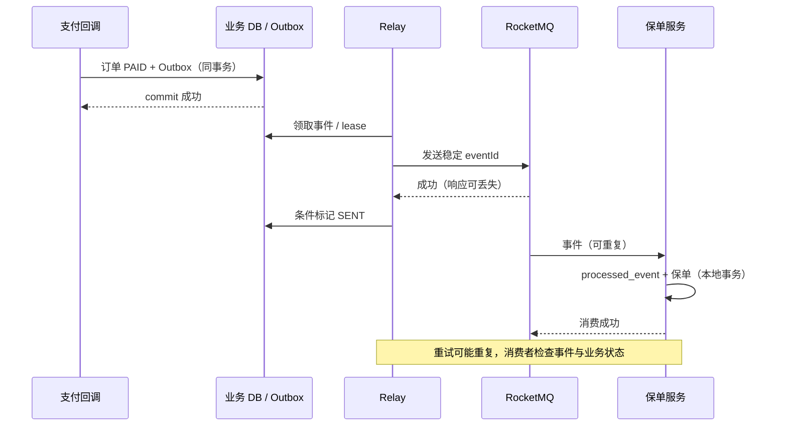

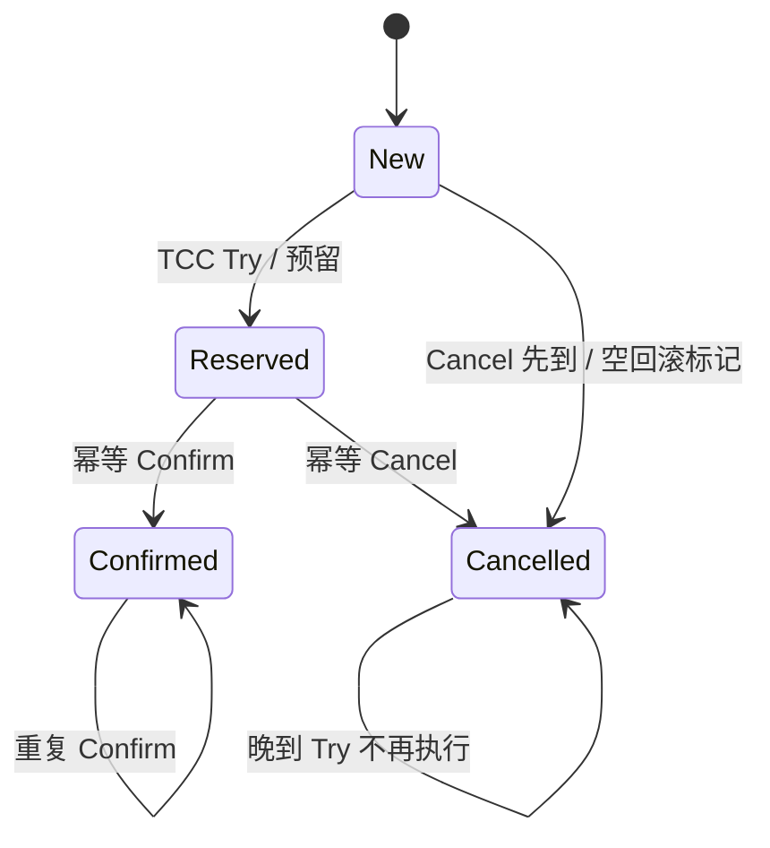

## 三层原理问答

### 1. 最终一致是否意味着可以不设计失败路径？

<details markdown="1"><summary>查看回答与追问</summary>

不能。失败动作必须被保存，之后有人继续处理，或按业务规则补偿。消息已经永久丢失，不会因为过了半小时就自动恢复。

**机制如何配合？** Outbox 或事务消息保存待完成工作；唯一事件和状态检查识别重复；任务重试和对账处理未完成记录。任何一步无人接手，都可能永久卡住。

**对用户怎么说明？** 定义处理中、失败和完成状态，以及多久报警、多久人工处理。下游仍在失败时，不让同步返回的“成功”掩盖尚未完成的业务。
</details>

### 2. Outbox 是否无重复？

<details markdown="1"><summary>查看回答与追问</summary>

不是。Outbox 保证本地业务成功时留下待发事件，但发送到 MQ 与标记 SENT 之间仍有宕机间隙，恢复后可能再发。

**为什么不先标 SENT？** 那会在标记后发送前宕机时漏消息。先发再标允许重复，消费端能通过同事务事件唯一记录吸收它，这是更容易恢复的选择。

**还需什么？** 稳定 eventId、领取租期、消费幂等和顺序版本，监控最老未发事件。清理要保留足够的恢复和重放时间，不能只按数量删历史。
</details>

### 3. TCC 如何处理空回滚和悬挂？

<details markdown="1"><summary>查看回答与追问</summary>

Cancel 先到时，即使没预留过资源，也记录已取消。后到的 Try 查到这个结果，就不能再预留，否则资源可能永远悬挂。

**并发怎么决定？** 同一 transactionId 的状态通过唯一记录和条件更新协调，Try、Confirm、Cancel 都要幂等。检查状态与预留若分成不受保护的两步，仍会竞态。

**超时恢复怎么做？** 扫描预留记录并查询可靠决定，不能随意撤销已经确认的交易。演练乱序、重复、宕机和部分参与者离线，验证资源最终没有残留。
</details>

### 4. Saga 补偿为什么不是数据库回滚？

<details markdown="1"><summary>查看回答与追问</summary>

因为前面本地事务已提交，别人可能已看到结果。退款是一笔新交易，不是让过去扣款从未发生；短信也无法收回。

**补偿为什么也会失败？** 它仍要访问数据库和外部系统，而且当前状态可能已有后续合法变化。需要自己的幂等键、检查和重试，不是无条件反向 UPDATE。

**流程怎么安排？** 记录每步及补偿结果，给不可逆动作合适位置，失败可进入人工处理。Saga 允许中间状态，用户与下游要能识别它，不要包装成瞬时原子操作。
</details>

### 5. 超时后为何不能直接认定失败？

<details markdown="1"><summary>查看回答与追问</summary>

超时只表示调用方没收到结果，对端可能已经成功。首先保持同一个业务请求身份，查询或幂等重试。

**换 ID 会怎样？** 对端可能把它当全新付款请求，再扣一次。稳定 requestId 和唯一约束让对端能返回过去结果；UNKNOWN 则保存尚未确认的事实。

**支付流程怎么恢复？** 有界退避查询、记录截止和对账，不同时发退款和新付款。取消也需要与原执行协调，避免原动作与取消都留下错误结果。
</details>

### 6. MQ 顺序如何和状态机结合？

<details markdown="1"><summary>查看回答与追问</summary>

传输局部顺序降低乱序，业务仍根据版本和状态判断这条事件能否执行。重复或旧事件不应把已支付订单改回待支付。

**版本如何检查？** 按 aggregate 和 version 建唯一约束，条件更新 lastVersion。未来版本先到时，可以暂存或查来源补齐；简单丢掉可能让业务永远缺一步。

**重放怎么控？** 暂存有上限和超时，历史重放限制速率。不同事件有不同含义，付款、退款不能统一用“只留最新值”的方式覆盖。
</details>

## 模拟生产案例：Outbox 已发未标记

relay 已发送支付事件，标 SENT 前宕机，重启后再次发送。这里用模拟情境说明重复为什么不应直接被当成 Outbox 设计失败。

按 eventId、领取租期和发送记录查看任务。若 MQ 已收到，Outbox 仍为待处理状态，过期重新领取就是合理恢复；没有消费幂等才会产生重复业务。

保持先发再标，不为了消除重复改成先标后发。消费端用同事务唯一事件与业务写入，外部接口传相同幂等键。检查历史重复结果，并按业务修复。

测试在每个提交和发送间隙停进程，重启后检查不漏事件、结果不重复。监控最老待发时间与失败重试，定期对账已付无保单、重复保单，保留人工处理入口。

## 知识梳理与核心总结

### 一分钟要点回顾

分布式事务先明确哪些业务结果必须一起成立。2PC 需要协议和恢复资源，TCC 要能预留、确认、取消，Saga 是新的补偿动作。DB 与 MQ 常用同事务 Outbox 或 Half/回查，仍允许重复，所以消费去重与业务一起提交。超时是未知，稳定 requestId 查询恢复。最终完成需要持久记录、有限重试、对账和人工处理，不会靠等待自动发生。

### 深入理解与机制串联

我先用支付提交后通知失败说明问题：数据库已经成功，普通发消息之前宕机，就没有下游通知。解决重点是成功时留下可恢复的待办。Outbox 把业务和事件同事务保存；事务消息先 Half，再本地事务，再报告，未知时回查持久结果。

Outbox 发送成功未标 SENT 时会重发，先标再发则可能丢失，所以应选择能识别的重复。消费记录和业务必须同事务，数据库失败时记录也撤销。外部支付不能纳入这条本地事务，则使用稳定幂等键和 UNKNOWN 查询，避免换 ID 再做一遍。

2PC 适合支持协议且确实需要协调提交的参与者，代价是 prepared 资源和故障等待。TCC 是业务预留，Cancel 先到要留取消记录，晚到 Try 不再执行；Confirm 和 Cancel 也要幂等。Saga 逐步提交，补偿是退款等新动作，补偿也可能失败，已经发出短信不能物理回滚。

订单支付保单要各有允许的状态变化和事件版本。重复支付不能重复记账，未来版本先到不能随手丢掉；已生效保单需要合规撤销流程，不是删行。每个宕机点都应明确留下什么、哪个组件继续、多久报警。

最后设置重试、记录保留和人工处理时间，对账按业务条件查有支付无保单、无支付有保单及重复结果。这样才有可检验的最终完成，而不是把“最终一致”当一句保证。

### 延伸问题、常见误解与速记

- 高频追问：发送后标记前死了怎么办？空回滚如何挡迟到 Try？补偿失败谁处理？支付超时为何不能换 ID？
- 容易答错：CAP 随时任选两个；Outbox 没重复；Saga 没中间态；Redis 标去重后 DB 可独立失败；超时就是未执行。
- 常看的入口：`invokeWithinTransaction`、`sendMessageInTransaction`、`TransactionalMessageServiceImpl.check`，以及业务唯一约束、条件 UPDATE 和领取租期。
- 把每个宕机点写出剩余记录和恢复人，比先选一个框架名有用。


## 官方资料与版本来源

本文按上述版本阅读官方源码，节选可能省略方法的其他分支。版权见 [source-notices.txt](./source-notices.txt)，下载记录见 [sources.json](./sources.json)。

- [TransactionAspectSupport.invokeWithinTransaction · Spring Framework 5.3.31](https://raw.githubusercontent.com/spring-projects/spring-framework/v5.3.31/spring-tx/src/main/java/org/springframework/transaction/interceptor/TransactionAspectSupport.java)
- [TransactionalMessageServiceImpl.check · RocketMQ 4.9.8](https://raw.githubusercontent.com/apache/rocketmq/rocketmq-all-4.9.8/broker/src/main/java/org/apache/rocketmq/broker/transaction/queue/TransactionalMessageServiceImpl.java)
- [CAP 原论文 Gilbert/Lynch](https://groups.csail.mit.edu/tds/papers/Gilbert/Brewer2.pdf)


---

# 微服务、高并发与系统稳定性

使用 Gateway 3.1.8、Reactor 3.4.34 和 Netty 4.1.108.Final 解释 Spring Boot 2.7 时代的实现。先从一个现象讲起：认证数据库变慢，为什么网关里不需要认证的接口也跟着卡住？

## 核心知识与原理

### Gateway、Reactor 与 EventLoop

Gateway 找到匹配的 Route 后，把 GlobalFilter 与路由过滤器合并排序，沿过滤器链调用。NettyRoutingFilter 发出下游请求，响应再沿 reactive 链返回，NettyWriteResponseFilter 负责写回。Servlet Filter 与这条 WebFlux 链属于不同模型。

Netty 一个 EventLoop 通常负责多个连接，轮流处理 IO 就绪事件和任务。它不是一个连接一条线程。若认证过滤器在里面直接执行阻塞 JDBC，EventLoop 等数据库结果时，其负责的其他连接也无法及时处理。这就解释了“一个依赖慢，许多无关请求一起慢”。

返回 Mono 并不会改变已经执行的阻塞代码。Mono 表示零或一个结果，Flux 表示多个结果，它们需要订阅后才按链执行。桥接阻塞调用时，应延迟执行，并把它放到适当的工作线程中，例如下面的 fromCallable 与 subscribeOn。

```java
// 把阻塞查询放到工作线程，另设连接和语句超时。
Mono<Order> load(long id) {
    return Mono.fromCallable(() -> blockingDao.find(id))
        .subscribeOn(Schedulers.boundedElastic())
        .timeout(Duration.ofMillis(300));
    // timeout 后 SQL 可能仍在执行，不能只靠这个限制数据库压力。
}
```

subscribeOn 影响订阅和源的执行位置，publishOn 影响后续信号处理的线程。把 publishOn 写在一个已经执行的 JDBC 调用后面，不会把那次调用重新搬走。boundedElastic 也有线程和排队限制，还需要数据库连接限额和超时。过滤器内部手动 subscribe 后马上返回，会脱离请求的错误、完成与取消管理，通常应直接返回组合后的链。

```xml
<!-- 项目配置示例：版本由 Boot/Cloud BOM 管理，不能混入 Gateway MVC starter。 -->
<dependency>
  <groupId>org.springframework.cloud</groupId>
  <artifactId>spring-cloud-starter-gateway</artifactId>
</dependency>
```

### 背压的范围与取消

下游一次只能处理 10 条，就通过 request(10) 向上游声明需求，按 Reactive Streams 规则接收信号。publishOn 会用队列和预取在不同线程之间转交，消费完一定数量后再补需求。这是背压的核心，不是让所有外部系统自动按你的速度生产。

无限 onBackpressureBuffer 会把来不及处理的内容继续留在内存，仍可能 OOM。Drop 或 Latest 适合允许丢弃中间状态的场景，支付事件则不能照这样丢掉。数据库、HTTP 和 MQ 有各自的流控，要在接入处明确如何限量。

timeout 后订阅被取消，也不保证 JDBC 语句立即停止。底层驱动可能仍在等结果，继续占连接。跨 scheduler 传递租户、追踪或事务信息时，需要 Reactor Context 和相应桥接；ThreadLocal 只跟线程走，不能自动跟每个请求走。

### 限流、熔断与隔离

令牌桶允许按补充速率处理请求，并允许桶容量范围内的突发。漏桶更偏向平滑输出，来得太快就排队或拒绝。滑动窗口检查最近一段时间，比固定窗口减少某些跨边界突发，代价是更复杂的统计。分布式限流若依赖 Redis，还要决定 Redis 故障时放行还是拒绝。

超时限制等多久；熔断在持续失败或慢调用时暂时快速拒绝；降级给可接受的替代结果；舱壁则限制某个依赖占用的线程、连接或并发，避免它耗尽整个服务资源。这些措施要一起看，而不是只加一个注解。

重试会增加请求。若三个调用层每层最多尝试三次，一个原始请求最坏会触发 27 次底层调用。原调用超时却还没结束时，重试还会和它同时运行。应只对适合重试的幂等操作使用有限次数、总时间限制、退避与抖动，尽量在合适的一层重试。

### 高可用、灰度与容量规划

链路追踪先帮我们拆开等待：时间花在网关、排队、借连接、SQL，还是下游网络？再看每段的请求量、错误和耗时分位数，平均值常会掩盖少数很慢的请求。

灰度应让同一用户或租户稳定进入指定版本，并把标记传到后续调用和消息里。数据库结构先做兼容扩展，旧消费者也应能处理新事件。回滚代码不会自动恢复已经写错的数据，发布前要把数据修复和回退条件想清楚。

容量要用实际服务时间估算。稳定条件下，并发量大致是吞吐乘以耗时，再通过压测检查资源竞争和长尾。两台实例不等于能扛住一台故障：剩余实例、数据库和缓存都要留余量，故障域也不能完全重合。

压测应覆盖慢依赖、缓存故障、Broker 切换和突发。某些闭环工具在服务变慢后自己降低发送速度，让排队问题看起来没那么严重，需要补充按固定到达率施压的测试。

### 容量与雪崩的数值推演

一个依赖每秒处理 1000 个请求，平均 20ms，平均同时执行的请求约 20。耗时变成 500ms、到达率仍不变时，需求并发变成约 500。连接不够就排队，排队耗时又触发重试，于是情况继续恶化。

先限制新请求进入，给等不到资源的请求明确失败，对非关键功能降级，再逐步恢复。直接把线程数调到 500，只会让更多线程等同一批数据库连接。恢复时也要慢慢放量，避免所有实例重启后一起预热，制造第二次冲击。关联阅读：<a href="#c1">线程池</a>、<a href="#c4">Netty 内存</a>、<a href="#c8">缓存回源</a>。


## 源码级解析与调用链

Gateway 从 `FilteringWebHandler.handle` 建立过滤器链。Netty 的 `NioEventLoop.run` 轮流执行 IO 和队列任务，Reactor 的 `FluxPublishOn` 把信号放入队列，交由 scheduler 消费。

沿这三个片段，分别回答请求先过哪些过滤器、线程什么时候被占住，以及数据在哪个队列等下游。这样比看到 Mono 就断言非阻塞更具体。


<div class="source-caption"><code>FilteringWebHandler.handle</code><span>Spring Cloud Gateway 3.1.8 · L75–L86 · <a href="https://github.com/spring-cloud/spring-cloud-gateway/blob/v3.1.8/spring-cloud-gateway-server/src/main/java/org/springframework/cloud/gateway/handler/FilteringWebHandler.java#L75-L86">完整源码</a></span></div>

```java
	public Mono<Void> handle(ServerWebExchange exchange) {
		Route route = exchange.getRequiredAttribute(GATEWAY_ROUTE_ATTR);
		List<GatewayFilter> gatewayFilters = route.getFilters();

		List<GatewayFilter> combined = new ArrayList<>(this.globalFilters);
		combined.addAll(gatewayFilters);
		// TODO: needed or cached?
		AnnotationAwareOrderComparator.sort(combined);

		if (logger.isDebugEnabled()) {
			logger.debug("Sorted gatewayFilterFactories: " + combined);
		}
```

过滤器链把全局过滤器与路由过滤器放在一起排序，再继续执行。调用顺序由 order 决定，不能只根据 Bean 注册顺序判断。


<div class="source-caption"><code>NioEventLoop.run</code><span>Netty 4.1.108.Final · L552–L569 · <a href="https://github.com/netty/netty/blob/netty-4.1.108.Final/transport/src/main/java/io/netty/channel/nio/NioEventLoop.java#L552-L569">完整源码</a></span></div>

```java
                        if (strategy > 0) {
                            processSelectedKeys();
                        }
                    } finally {
                        // Ensure we always run tasks.
                        ranTasks = runAllTasks();
                    }
                } else if (strategy > 0) {
                    final long ioStartTime = System.nanoTime();
                    try {
                        processSelectedKeys();
                    } finally {
                        // Ensure we always run tasks.
                        final long ioTime = System.nanoTime() - ioStartTime;
                        ranTasks = runAllTasks(ioTime * (100 - ioRatio) / ioRatio);
                    }
                } else {
                    ranTasks = runAllTasks(0); // This will run the minimum number of tasks
```

ioRatio 为 100 时处理 IO 后运行任务；其他情况下按 IO 用时为任务分配时间。一个任务自己阻塞很久，这种时间分配也无法让它凭空变成可中断的异步调用。


<div class="source-caption"><code>FluxPublishOn.onNext</code><span>Reactor 3.4.34 · L214–L231 · <a href="https://github.com/reactor/reactor-core/blob/v3.4.34/reactor-core/src/main/java/reactor/core/publisher/FluxPublishOn.java#L214-L231">完整源码</a></span></div>

```java
		public void onNext(T t) {
			if (sourceMode == ASYNC) {
				trySchedule(this, null, null /* t always null */);
				return;
			}

			if (done) {
				Operators.onNextDropped(t, actual.currentContext());
				return;
			}

			if (cancelled) {
				Operators.onDiscard(t, actual.currentContext());
				return;
			}

			if (!queue.offer(t)) {
				Operators.onDiscard(t, actual.currentContext());
```

onNext 先把值交给队列，再触发调度。队列满等异常会沿错误处理传递。后续 drain 与 request 配合，才构成跨线程处理和需求补充。


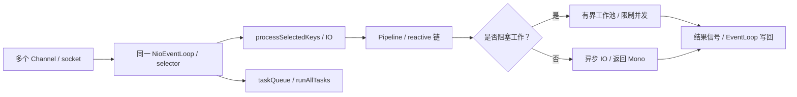

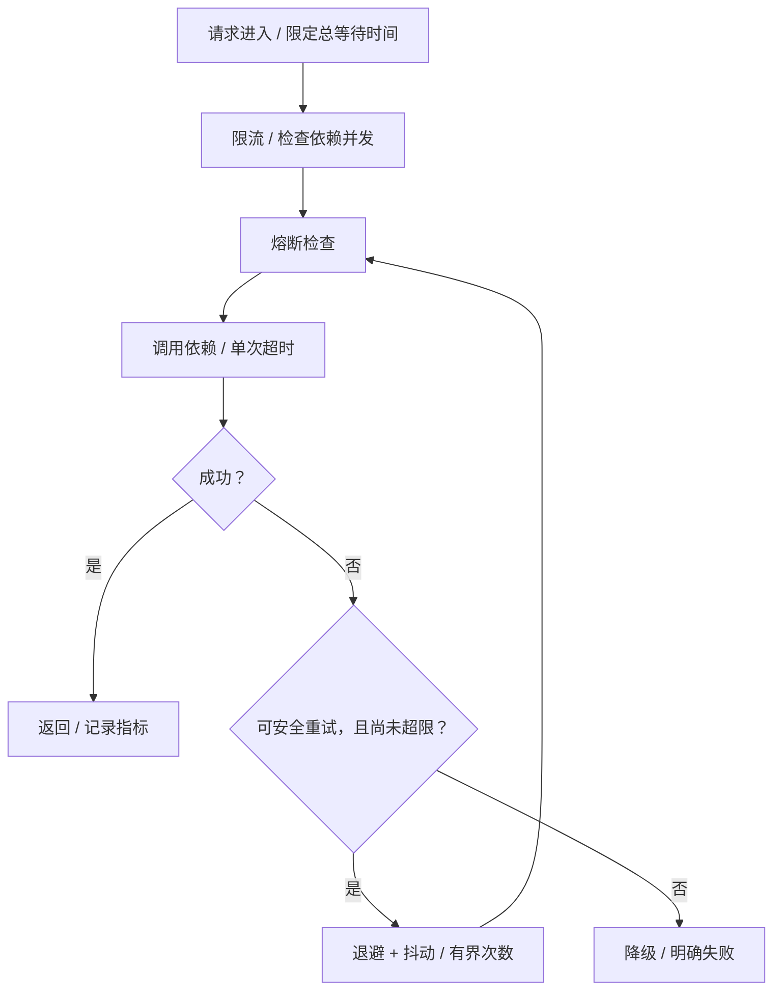

## 三层原理问答

### 1. Gateway 用了 Reactor，为何还会全站卡顿？

<details markdown="1"><summary>查看回答与追问</summary>

因为 reactive 不会把同步调用自动变成非阻塞。EventLoop 内执行 JDBC，数据库慢时同一线程负责的多个连接都会等。

**怎样定位到这段代码？** 多次线程栈看到 reactor-http-nio 停在同步查询或 read，而不是继续处理 NioEventLoop 的事件。trace 再确认时间确实花在认证依赖。

**怎么修？** 采用异步客户端，必要阻塞调用放有界工作池，配独立并发与连接超时。慢依赖压测看其他路由是否受影响，不只加 Netty 线程。
</details>

### 2. publishOn 和 subscribeOn 如何区分？

<details markdown="1"><summary>查看回答与追问</summary>

subscribeOn 影响订阅和源执行的位置，publishOn 影响它之后的信号处理线程。位置决定作用，不能只背“切线程”。

**publishOn 做了什么？** 它入队、按 scheduler drain，再按消费进度补请求。阻塞源可用 fromCallable 配 subscribeOn；已经发生的阻塞不会因后面一个操作符重新搬家。

**怎么避免滥用？** 不每一步都换池，控制队列和预取，正确传 Context。涉及 JDBC 时重新确认事务在哪个线程开始，不把 ThreadLocal 当跨线程状态。
</details>

### 3. 背压是否等于不会 OOM？

<details markdown="1"><summary>查看回答与追问</summary>

不等于。协议内控制需求，但无界缓冲、外部不遵守需求的来源、业务长期持有对象，仍可能把内存用完。

**预取和取消呢？** request、prefetch、队列协调每段处理。onBackpressureBuffer 若无界，只是把压力转到内存；取消也不一定让底层 JDBC 立即停止。

**怎样保护资源？** 每个接入点明确容量、并发、超时与拒绝方式。不能对重要支付直接 Drop/Latest；需要可靠队列承接，再按下游能力处理。
</details>

### 4. 重试为什么会导致雪崩？

<details markdown="1"><summary>查看回答与追问</summary>

它把新增工作发给一个已经忙不过来的依赖，原来超时的请求还可能继续执行。多个层分别重试，又会把次数相乘。

**抖动解决什么？** 固定等待会让许多调用一起再次冲击，随机抖动把它们错开。但它不能使超载系统突然有更多能力，还需要限制总次数和总时间。

**如何配合其他措施？** 只在合适的一层做幂等、有界重试，持续失败时熔断，按依赖隔离并发，过载时限流和降级。监控重试占比，不等失败后无限补调用。
</details>

### 5. 线程池和连接池应该设多大？

<details markdown="1"><summary>查看回答与追问</summary>

先看实际到达率、执行时间和下游容量，没有对所有任务都合适的 CPU 乘数。数据库最多承受多少并行查询，比开多少等待线程更重要。

**L≈λW 怎么用？** 它描述稳定情况下的平均并发关系，可做初步估算；排队、长尾和争用要再压测。线程比连接多得多时，许多线程只是等连接。

**怎样验收容量？** 找吞吐拐点和尾延迟，控制排队和拒绝，预留一台故障后的剩余能力。不能以压测“没拒绝”为唯一目标，长时间排队也是失败。
</details>

### 6. 灰度发布如何保证可恢复？

<details markdown="1"><summary>查看回答与追问</summary>

稳定划分流量，观测新旧版本，提前规定回退条件，同时保证数据库和事件格式兼容。灰度不只是把 5% 请求随机打给新实例。

**异步链路怎么处理？** 标签需要跨调用和 MQ 传递，旧消费者仍要认识事件。schema 先兼容扩展，再迁移，否则旧代码可能已无法回退。

**数据写错了怎么办？** 代码回滚不会撤销已提交的数据。重要变更准备修复和对账，灰度比较租户结果、错误率和 p99，并演练真正的回退过程。
</details>

## 模拟生产案例：认证过滤器阻塞事件循环

认证 GlobalFilter 直接调用 JDBC，下游变慢后，多条无关路由同时超时，CPU 却不高。这是共享 EventLoop 被阻塞的模拟情境。

看 trace 里认证时间，连续线程栈看 reactor-http-nio 是否停在同步查询，再看连接池 pending 和客户端重试。若其他路由也由这些 EventLoop 处理，就能解释为什么影响扩大。

用异步客户端，或把必要阻塞操作移到有界工作池，并限制认证并发和连接等待。根据安全要求设计缓存与失败响应，不把所有失败直接放行。减少多层重复重试，逐步恢复流量。

用慢 DAO 验证无关路由能继续处理，认证则按设定时间明确失败。以后测试依赖变慢、取消后任务残留与 Context 传播，同时监控 EventLoop 延迟和总重试量。

## 知识梳理与核心总结

### 一分钟要点回顾

一个 Netty EventLoop 服务多个连接，阻塞 JDBC 会让其他连接一起等。Reactor 用需求和队列协调处理，subscribeOn 与 publishOn 位置不同，返回 Mono 不自动非阻塞。稳定性要限制总等待、重试与并发，持续故障时熔断和降级，按依赖隔离资源。容量用实际吞吐和耗时估算并压测，灰度还需标签传播、数据兼容和真实回退，代码回滚不会撤销已写数据。

### 深入理解与机制串联

我先解释线程模型：EventLoop 轮流处理多个 channel 的 IO 和任务，不是一连接一线程。Gateway 过滤器若在里面做同步 JDBC，数据库慢会让这一批连接都不能及时继续。返回 Mono 只是类型，已执行的阻塞代码不会自动改变。

阻塞源可以用 fromCallable 延迟，再用 subscribeOn 放到合适工作线程；publishOn 主要影响后续信号。队列、预取和 request 协调背压，但无限 buffer 仍能占满内存，外部来源也需单独限量。timeout 取消后 JDBC 可能仍占连接，线程上下文要正确转成订阅 Context。

当一个依赖变慢，平均并发需求约为到达率乘耗时。1000QPS 从 20ms 变 500ms，需要的平均并发从 20 变 500，池不够开始排队；再加重试就更坏。先限制准入、等待和总尝试，退避带抖动，只对可重试且幂等操作执行。持续故障用熔断，按依赖隔离线程或并发，非关键功能降级。

容量测试找吞吐拐点与业务 p99，覆盖缓存故障、慢依赖和一台实例退出。不要让闭环工具自动降到达率后误以为稳定，也不要只增加线程和连接。

发布则稳定分用户或租户，标签传到异步消息，数据库和事件先保证新旧兼容。回退条件用错误率、尾延迟和业务结果；写错数据要有修复方案。最后通过 trace、队列、连接和线程栈定位等待发生在哪一段，再决定改法。

### 延伸问题、常见误解与速记

- 高频追问：timeout 会停止 SQL 吗？发布后哪些线程处理信号？MDC 怎么传？闭环压测会漏什么？
- 容易答错：一连接一线程；返回 Mono 就非阻塞；boundedElastic 无限；背压不会 OOM；多加连接一定快；代码回滚恢复数据。
- 常看的源码：`FilteringWebHandler.handle`、`DefaultGatewayFilterChain.filter`、`NioEventLoop.run/runAllTasks`、`FluxPublishOn.onNext` 和 request 处理。
- 顺着一次请求看它在哪等，资源被谁占，再决定限流、隔离还是改调用方式。


## 官方资料与版本来源

本文按上述版本阅读官方源码，节选可能省略方法的其他分支。版权见 [source-notices.txt](./source-notices.txt)，下载记录见 [sources.json](./sources.json)。

- [NioEventLoop.run · Netty 4.1.108.Final](https://raw.githubusercontent.com/netty/netty/netty-4.1.108.Final/transport/src/main/java/io/netty/channel/nio/NioEventLoop.java)
- [FluxPublishOn.onNext · Reactor 3.4.34](https://raw.githubusercontent.com/reactor/reactor-core/v3.4.34/reactor-core/src/main/java/reactor/core/publisher/FluxPublishOn.java)
- [FilteringWebHandler.handle · Spring Cloud Gateway 3.1.8](https://raw.githubusercontent.com/spring-cloud/spring-cloud-gateway/v3.1.8/spring-cloud-gateway-server/src/main/java/org/springframework/cloud/gateway/handler/FilteringWebHandler.java)
- [Reactor 3.4.34 Reference](https://projectreactor.io/docs/core/3.4.34/reference/)


---

# JIT即时编译、JMM与内存屏障

JIT的本质是**利用程序运行时的反馈，把热点字节码编译成更高效的机器码**。它既要承担编译成本，也要保存优化假设失效时恢复执行的能力。JMM则规定共享内存访问允许产生哪些结果；JIT必须在这个边界内优化，但不会自动补上程序缺失的同步协议。

本章以Java SE8规范与OpenJDK8u462-b08的HotSpot实现为基线，源码提交固定为`943a5ea328fd2fc8eed0aed4ec9b1957d41f8144`。规范、源码推导、教学伪代码和本机实验分别标注。这里的C1/C2、编译日志和x86后端不能不加核对地推广到其他JVM、JDK版本与CPU。

## 核心知识与原理

### 从字节码到机器码：编译发生在什么时候

`javac`把源代码编译为class文件；HotSpot可以先解释执行字节码，同时收集调用次数、循环回边次数和接收者类型等反馈。热点方法进入编译队列，编译线程生成机器码并安装为`nmethod`。后续方法调用可进入编译代码；正在运行的长循环还可能通过OSR切换到编译版本。

```java
static int add(int a, int b) {
    return a + b;
}
```

这一静态方法的典型字节码是`iload_0 → iload_1 → iadd → ireturn`，可以用`javap -c`核对。JIT不必为每条字节码保留一条机器指令：调用方内联它之后，参数可能已经在寄存器里；如果参数是常量，连加法也可能被折叠。机器码依赖目标架构、调用上下文和优化决策，不能把示意汇编当作固定输出。

|机制|发生时点与输入|收益和代价|
|---|---|---|
|解释执行|运行时逐步执行字节码|无需先为全部方法生成机器码，但有解释分派开销|
|JIT|运行时使用字节码及反馈|针对真实负载优化，同时消耗编译CPU、元数据与Code Cache|
|AOT|运行前生成目标机器码|减少运行时编译工作；也可以结合离线反馈优化，能力取决于实现|

因此，JIT的优势不能简单归结为“比AOT多做内联”。关键是反馈获取的时点、优化假设与回退能力。冷启动、预热阶段和稳态应分别测量；一个只执行一次的方法，编译成本未必值得付出。

### 分层编译、热点策略与OSR

在本章的HotSpot8分层编译实现中，level0表示解释执行；level1是C1无profiling，level2是C1有限profiling，level3是C1完整profiling，level4是C2。C1较快地产生代码，带反馈的层级继续积累信息；C2用这些信息进行更深入的优化。具体层级受启动参数、编译器可用性和策略影响。

这不是所有方法都必须走完的流水线。策略会综合计数、增长速率、已有MethodData、编译队列压力等决定下一层级；不同方法可能跳级或停在较低层级。阈值也不是语言规范承诺的固定次数。

OSR即On-Stack Replacement：方法还没有返回，长循环已足够热，JVM可在指定字节码位置转入编译执行。它通常编译带特定入口的**方法版本**，不能理解为单独编译一条循环指令。`PrintCompilation`里的`%`表示OSR编译，`@`后面给出入口BCI；普通入口与OSR入口可以同时存在。

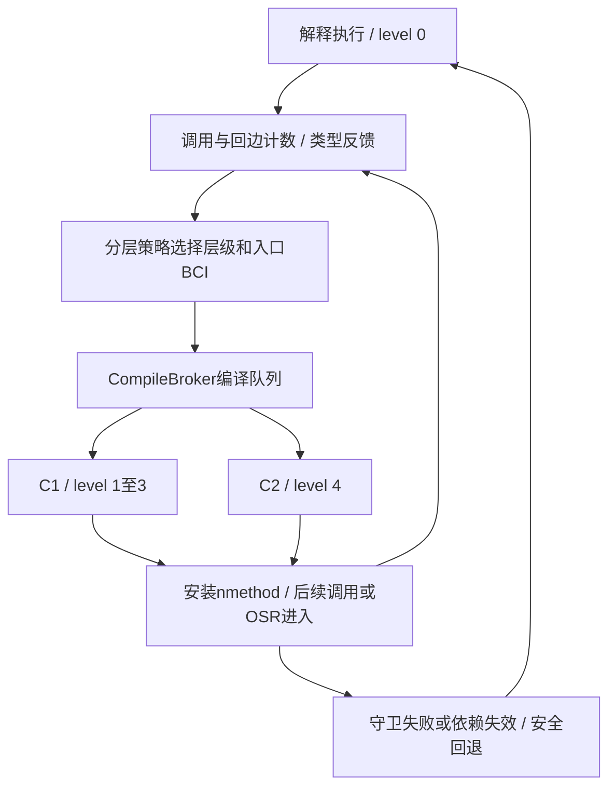

### 内联、逃逸分析与推测性优化

方法内联消除部分调用成本，也把调用双方放进同一个优化范围。常量传播、死代码消除、循环优化和逃逸分析因此可能继续生效。逃逸分析本身是分析；标量替换和锁消除是它可能促成的优化，不能把两者当成同义词。

```java
static int distance(int x, int y) {
    Point p = new Point(x, y);
    return p.x + p.y;
}
static final class Point {
    final int x, y;
    Point(int x, int y) { this.x = x; this.y = y; }
}
```

若优化器证明`p`不逃逸且能标量替换，计算可能直接使用`x`和`y`，不再分配这个Point。准确的说法是“对象分配可能被消除”，而不是“所有不逃逸对象都放到栈上”。分析失败、无法内联或对象身份需要保留时，仍可能在堆上分配。

推测性优化可利用类型反馈，例如接口调用长期只有一种接收者：

```java
interface Op { int apply(int x); }
static int dispatch(Op op, int x) { return op.apply(x); }
```

JIT可能生成“若接收者是PlusOne，则执行已内联的快速路径；否则转入慢路径或uncommon trap”的代码。这是教学示意，实际策略依赖类型分布、类层次依赖和编译决策。出现第二种类型不意味着一定去优化，更不意味着全JVM重新编译。

### 去优化如何恢复程序状态

编译器删除了调用边界，甚至消除了对象分配，解释器却仍然需要局部变量、操作数栈、调用帧和对象。HotSpot因此为编译代码保留调试状态、oop位置与相关依赖；去优化时重建解释器所需的逻辑帧，必要时重新物化被标量替换的对象。它不是重新执行整个方法，也不能撤回已经发生的业务副作用。

编译代码进入`not entrant`后，不再接收相应的新入口调用；失效代码的在途执行和回收还有后续处理。日志出现`made not entrant`只能证明代码状态发生变化，可能来自更高层级替换或假设失效等原因，不能单独认定存在JIT缺陷。去优化保护优化假设下的语义，不会检测普通字段是否应该加volatile。

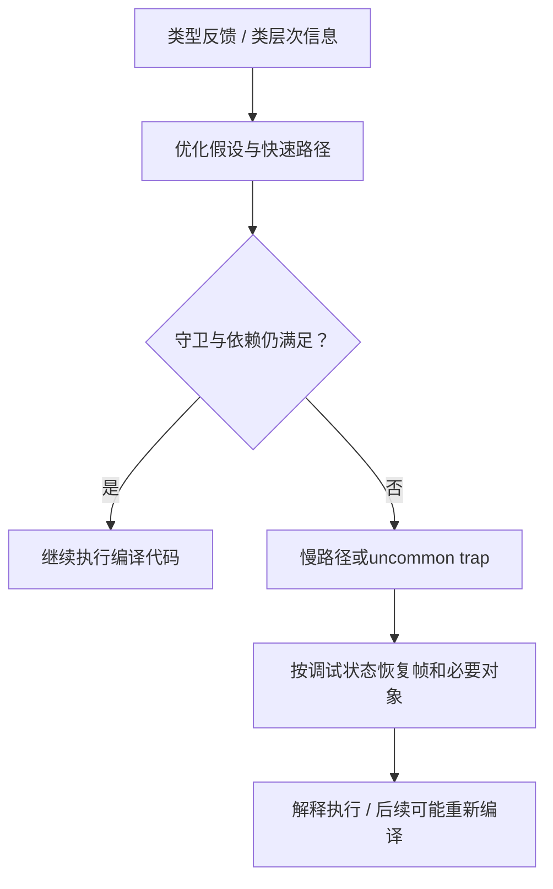

### 普通停止标志为什么可能读不到更新

下面是教学片段，`running`是普通共享字段。主线程的sleep只是给工作线程运行机会，不建立停止写入与循环读取之间的同步关系。

```java
static boolean running = true;
static void work() {
    while (running) { /* 不在这里打印或加锁 */ }
}
// 主线程：worker.start(); Thread.sleep(1000); running = false;
```

在没有正确同步的情况下，编译器可能复用已读到的值，从效果上类似`if (running) { while (true) {} }`。这个变换只帮助理解合法结果，不声称某次运行一定生成这种机器码。即使解释器每次都读字段，程序也没有获得所需的跨线程保证。

将停止字段声明为`static volatile boolean running = true`，读写就带有volatile语义，不能把重复读取任意消除成一直使用旧值。但它不承诺写入后几毫秒内退出，线程仍需要获得调度机会。`Thread.sleep()`、`Thread.yield()`没有为普通字段建立内存同步；在循环里加入println会改变负载并可能引入额外同步，测试现象改变不能作为原代码正确的证明。

### JMM与happens-before：优化的合法边界

JMM是一套并发执行语义，判断一次读取允许观察哪次写入，不能机械映射为CPU缓存或者一块物理“工作内存”。编译器和硬件都可以调整实现，只要可观察行为仍符合规范。单线程语义也包括异常、副作用等约束，不只是最后一个计算结果相同。

两个线程访问同一变量、至少一个是写入且没有happens-before排序，就存在数据竞争。对于正确同步的程序，JLS提供顺序一致性保证；对于未正确同步的程序，允许一些违反直觉的结果，但并非允许任意破坏类型安全和因果性。

|HB来源|建立的关系|使用前提|
|---|---|---|
|程序次序|同一线程较早动作HB较晚动作|是语义顺序，不要求每条机器指令照抄源码位置|
|volatile|写HB同步顺序中后续的同一变量读|必须是同一个volatile变量|
|monitor|unlock HB后续lock|必须是同一把锁|
|start|start调用HB被启动线程的动作|不是新线程动作HB启动方之后的全部动作|
|线程终止|线程动作HB另一线程检测到它终止|成功join是常见方式；超时返回且线程仍活着不满足|
|传递性|A HB B且B HB C，得到A HB C|用它连接普通字段写入与跨线程读取|

```java
static int data;
static volatile boolean ready;
static void writer() {
    data = 42;        // A
    ready = true;     // B
}
static int reader() {
    if (ready) {      // C
        return data;  // D
    }
    return -1;
}
```

在一次性发布、初值为false且没有其他写入者的前提下，C读到B写入的true，得到`A → B → C → D`的HB链，D必须读到42。data自身无需volatile。若之后反复重置ready、覆写data，这个简单例子不足以保证读到的是同一批次快照，需额外协议、锁或发布不可变对象引用。

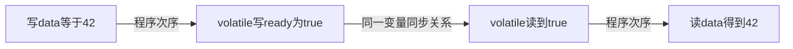

### 重排序、Store Buffer与volatile全序

以下两个线程的字段初值均为0；它们的执行代码没有同步：

```java
// 线程A                     // 线程B
x = 1;                       y = 1;
r1 = y;                      r2 = x;
```

JMM允许`r1 == 0 && r2 == 0`。一种硬件解释是两个核心的写入尚在各自Store Buffer，读取另一个地址时仍看到旧值；这不需要机器指令文本已经交换顺序。它只是可能机制，单次结果不能区分JIT重排、处理器排序与具体微架构时序。

若x和y都为volatile，则同步动作的全序必须保留线程内顺序。要让A读到y的0，A读y要位于B写y之前；要让B读到x的0，B读x要位于A写x之前。结合`A写x → A读y`和`B写y → B读x`就产生顺序环，因而两个读都为0被排除。只把其中一个字段改成volatile，不足以得到这个结论。Release/Acquire是理解单次发布的基础，但不足以概括Java volatile的全部排序要求。

### volatile自增、CAS与业务不变量

```java
static volatile int count;
static void increment() { count++; }
```

volatile使单次读写符合相应语义，并没有把读、加一、写回组合成一个原子动作。两个线程都读0并分别写1，在volatile同步全序下也完全合法。用`AtomicInteger.incrementAndGet()`可提供这个数值上的原子递增；多个变量共同维护的不变量，仍需要能覆盖整个协议的互斥、条件更新或其他设计。

CAS在指定位置上比较期望值并尝试原子更新。失败时调用方根据最新状态重试，不能把一串独立CAS当作一个事务。ABA是否构成问题取决于中间历史是否影响业务；必要时将版本号纳入状态。并发工具的内存语义由相应API规定，不能把所有弱CAS或其他语言的原子访问一概当作Java volatile。

“先AtomicInteger.get判断余额足够，再addAndGet扣款”虽然每一步都是原子的，整体仍会出现竞态条件。它说明业务竞态与数据竞争不同：没有普通字段的数据竞争，也不等于检查与修改这个业务组合已经安全。

## 源码级解析与调用链

### 热点事件如何提交编译任务

`method_invocation_event → call_event → compile → submit_compile → CompileBroker::compile_method`连接调用热度与编译请求；回边事件另经`loop_event`决定OSR层级和BCI。下面是固定版本的完整submit_compile函数，`InvocationEntryBci`区分普通方法入口和OSR入口；hot_count相应使用调用计数或回边计数。


<div class="source-caption"><code>AdvancedThresholdPolicy::submit_compile</code><span>HotSpot 8u462-b08 · L453–L458 · <a href="https://github.com/openjdk/jdk8u/blob/943a5ea328fd2fc8eed0aed4ec9b1957d41f8144/hotspot/src/share/vm/runtime/advancedThresholdPolicy.cpp#L453-L458">完整源码</a></span></div>

```cpp
void AdvancedThresholdPolicy::submit_compile(methodHandle mh, int bci, CompLevel level, JavaThread* thread) {
  int hot_count = (bci == InvocationEntryBci) ? mh->invocation_count() : mh->backedge_count();
  update_rate(os::javaTimeMillis(), mh());
  CompileBroker::compile_method(mh, bci, level, mh, hot_count, "tiered", thread);
}


```

完整函数：以入口BCI选择调用或回边计数，更新速率后向CompileBroker提交请求；它不直接生成机器码。


### C2构图与机器码安装

CompileBroker的编译线程取出CompileTask，`invoke_compiler_on_method`选择编译器，进入C1或C2的`compile_method`。C2经Parse把字节码转成图，通过内联、图优化、匹配目标指令、寄存器分配等流程输出代码，最终安装nmethod。编译排队期间应用仍可运行原有版本；编译失败不代表Java方法不能执行。

定位入口：[CompileBroker::invoke_compiler_on_method](https://github.com/openjdk/jdk8u/blob/943a5ea328fd2fc8eed0aed4ec9b1957d41f8144/hotspot/src/share/vm/compiler/compileBroker.cpp#L1934)、[C2编译驱动compile.cpp](https://github.com/openjdk/jdk8u/blob/943a5ea328fd2fc8eed0aed4ec9b1957d41f8144/hotspot/src/share/vm/opto/compile.cpp)。下面进一步跟踪C2处理volatile字段的局部窗口，窗口不等于完整方法。

### volatile读：加载属性与Acquire节点

Parse::do_get_xxx首先检查字段是否volatile。构造加载时选择acquire内存顺序；在这个版本的后续分支中，还插入MemBarAcquire节点。图中的内存依赖限制非法重排，不能把节点数量直接换算成硬件屏障数量。


<div class="source-caption"><code>Parse::do_get_xxx / load</code><span>HotSpot 8u462-b08 · L231–L238 · <a href="https://github.com/openjdk/jdk8u/blob/943a5ea328fd2fc8eed0aed4ec9b1957d41f8144/hotspot/src/share/vm/opto/parse3.cpp#L231-L238">完整源码</a></span></div>

```cpp
  if (support_IRIW_for_not_multiple_copy_atomic_cpu && field->is_volatile()) {
    leading_membar = insert_mem_bar(Op_MemBarVolatile);   // StoreLoad barrier
  }
  // Build the load.
  //
  MemNode::MemOrd mo = is_vol ? MemNode::acquire : MemNode::unordered;
  Node* ld = make_load(NULL, adr, type, bt, adr_type, mo, LoadNode::DependsOnlyOnTest, is_vol);


```

连续局部窗口：特殊平台可能先放置额外屏障；volatile加载带acquire属性和is_vol标记。ld后续还用于Acquire节点。


<div class="source-caption"><code>Parse::do_get_xxx / acquire</code><span>HotSpot 8u462-b08 · L271–L279 · <a href="https://github.com/openjdk/jdk8u/blob/943a5ea328fd2fc8eed0aed4ec9b1957d41f8144/hotspot/src/share/vm/opto/parse3.cpp#L271-L279">完整源码</a></span></div>

```cpp
  // If reference is volatile, prevent following memory ops from
  // floating up past the volatile read.  Also prevents commoning
  // another volatile read.
  if (field->is_volatile()) {
    // Memory barrier includes bogus read of value to force load BEFORE membar
    assert(leading_membar == NULL || support_IRIW_for_not_multiple_copy_atomic_cpu, "no leading membar expected");
    Node* mb = insert_mem_bar(Op_MemBarAcquire, ld);
    mb->as_MemBar()->set_trailing_load();
  }

```

连续局部窗口：volatile读取之后创建MemBarAcquire，并关联ld，防止后续相关内存操作越过读取。


### volatile写：Release与额外排序约束

Parse::do_put_xxx在volatile写之前插入MemBarRelease，写节点带release属性，之后按平台能力插入MemBarVolatile，并配对记录相关屏障。这解释了为什么仅用“volatile等于Acquire/Release”描述还不完整：额外约束也参与实现volatile同步动作的要求。


<div class="source-caption"><code>Parse::do_put_xxx / release</code><span>HotSpot 8u462-b08 · L283–L290 · <a href="https://github.com/openjdk/jdk8u/blob/943a5ea328fd2fc8eed0aed4ec9b1957d41f8144/hotspot/src/share/vm/opto/parse3.cpp#L283-L290">完整源码</a></span></div>

```cpp
  Node* leading_membar = NULL;
  bool is_vol = field->is_volatile();
  // If reference is volatile, prevent following memory ops from
  // floating down past the volatile write.  Also prevents commoning
  // another volatile read.
  if (is_vol) {
    leading_membar = insert_mem_bar(Op_MemBarRelease);
  }

```

方法开头的连续窗口：判断volatile属性，在字段存储前插入Release节点；余下存储构造未在此节选展示。


<div class="source-caption"><code>Parse::do_put_xxx / volatile</code><span>HotSpot 8u462-b08 · L326–L340 · <a href="https://github.com/openjdk/jdk8u/blob/943a5ea328fd2fc8eed0aed4ec9b1957d41f8144/hotspot/src/share/vm/opto/parse3.cpp#L326-L340">完整源码</a></span></div>

```cpp
  // If reference is volatile, prevent following volatiles ops from
  // floating up before the volatile write.
  if (is_vol) {
    // If not multiple copy atomic, we do the MemBarVolatile before the load.
    if (!support_IRIW_for_not_multiple_copy_atomic_cpu) {
      Node* mb = insert_mem_bar(Op_MemBarVolatile, store); // Use fat membar
      MemBarNode::set_store_pair(leading_membar->as_MemBar(), mb->as_MemBar());
    }
    // Remember we wrote a volatile field.
    // For not multiple copy atomic cpu (ppc64) a barrier should be issued
    // in constructors which have such stores. See do_exits() in parse1.cpp.
    if (is_field) {
      set_wrote_volatile(true);
    }
  }

```

连续完整分支：按平台能力选择尾随MemBarVolatile，建立store_pair，并记录方法包含volatile写。


### 编译器节点与CPU屏障不是一一对应

LoadLoad、LoadStore、StoreStore、StoreLoad是对两侧内存访问排序要求的分类。编译器屏障限制代码变换，硬件排序机制约束核心之间的观察顺序。屏障不是把所有缓存清空，也不能泛称为“每次去主内存读取”。

本章固定版本的x86-64后端在MemBarAcquire与MemBarRelease匹配规则中没有输出对应的独立硬件指令；编译器仍保留排序约束。MemBarVolatile规则调用Assembler::membar(StoreLoad)，此版本x86实现使用带lock的操作。也存在带谓词的消除规则，所以不能断言每次volatile访问都会执行mfence。不同CPU后端可能需要其他指令，必须对照实际版本和反汇编。


<div class="source-caption"><code>membar_volatile</code><span>HotSpot 8u462-b08 · L6329–L6346 · <a href="https://github.com/openjdk/jdk8u/blob/943a5ea328fd2fc8eed0aed4ec9b1957d41f8144/hotspot/src/cpu/x86/vm/x86_64.ad#L6329-L6346">完整源码</a></span></div>

```cpp
instruct membar_volatile(rFlagsReg cr) %{
  match(MemBarVolatile);
  effect(KILL cr);
  ins_cost(400);

  format %{
    $$template
    if (os::is_MP()) {
      $$emit$$"lock addl [rsp + #0], 0\t! membar_volatile"
    } else {
      $$emit$$"MEMBAR-volatile ! (empty encoding)"
    }
  %}
  ins_encode %{
    __ membar(Assembler::StoreLoad);
  %}
  ins_pipe(pipe_slow);
%}

```

完整匹配规则：调用Assembler::membar(StoreLoad)。同文件Acquire/Release规则为empty encoding；这里不把AD规则当作本机反汇编。


### uncommon trap的恢复入口


<div class="source-caption"><code>Deoptimization::uncommon_trap</code><span>HotSpot 8u462-b08 · L1794–L1802 · <a href="https://github.com/openjdk/jdk8u/blob/943a5ea328fd2fc8eed0aed4ec9b1957d41f8144/hotspot/src/share/vm/runtime/deoptimization.cpp#L1794-L1802">完整源码</a></span></div>

```cpp
Deoptimization::UnrollBlock* Deoptimization::uncommon_trap(JavaThread* thread, jint trap_request) {

  // Still in Java no safepoints
  {
    // This enters VM and may safepoint
    uncommon_trap_inner(thread, trap_request);
  }
  return fetch_unroll_info_helper(thread);
}

```

完整函数：先进入uncommon_trap_inner处理，再返回fetch_unroll_info_helper构建的展开信息。帧恢复、对象重建还应继续追踪本文件其他函数。


`OrderAccess`是HotSpot运行时自身同步使用的架构抽象；它可帮助理解架构差异，但不是所有Java volatile访问都调用它。Java字段的C2编译应跟踪Parse、内存节点和目标后端。上述内容是源码静态推导，本章未采集目标代码反汇编。

```mermaid
flowchart TD
 A["JMM允许的执行结果"] --> B["C2字段解析 / acquire与release属性"]
 B --> C["MemBar节点和内存依赖"]
 C --> D["目标CPU后端匹配"]
 D --> E["编译器排序约束 / 必要硬件指令"]
 E --> F["实际可观察行为符合JMM"]
```

## 三层原理问答

### 1. JIT的价值为什么不只是翻译字节码？

<details markdown="1"><summary>查看回答与延伸分析</summary>

JIT能使用运行中的调用频率、分支和类型反馈，为真正热点生成机器码。内联除了省掉调用，也让常量传播、循环与对象分配优化跨越原本的方法边界。它仍需要付出编译成本，所以程序短暂运行时不一定得到收益。

**推测的前提怎么保护？** 优化器为类型和类层次等假设设置守卫或记录依赖。假设不成立时可以走慢路径，也可能去优化并恢复逻辑帧；不能继续拿已经不合法的假设执行。新增类型并不必然使所有代码失效。

**怎么比较性能？** 先区分冷启动、预热和稳态，记录相同负载下的吞吐、延迟及编译CPU。微基准需要防止结果未使用而被消除、常量折叠和测量代码被内联等因素，宜使用JMH并查看编译证据，而非只取一次纳秒差值。
</details>

### 2. C1、C2和OSR是不是固定的三步流程？

<details markdown="1"><summary>查看回答与延伸分析</summary>

不是。HotSpot8有解释层和不同profiling强度的C1层，C2对应更高优化层。下一层由运行反馈和编译压力等共同决定，部分方法可以跳级或长期停在较低层；这是一种实现策略，不是Java语言规定的固定路径。

**循环只进入方法一次怎么办？** 回边事件能积累热度并触发OSR，在某个BCI把当前执行切到编译版本。普通方法入口版本和OSR版本是不同编译任务，所以同一方法在日志里出现多次并不直接意味着异常。

**日志应该怎么读？** PrintCompilation中的百分号标记OSR，层级列区分C1/C2，at后的数字是入口BCI。made not entrant可能只是新版本替换旧版本。还要结合运行参数、具体JDK和LogCompilation事件，不能用一行日志推断完整原因。
</details>

### 3. 普通字段的无限循环一定是JIT错误吗？

<details markdown="1"><summary>查看回答与延伸分析</summary>

不是。普通共享停止字段没有跨线程同步，工作线程可能一直使用旧值，这是需要先检查的程序语义问题。JIT可以进行规范允许的读取复用；关闭优化后偶然退出，只能说明执行条件改变，不能证明原程序具备所需保证。

**volatile解决到哪一层？** 它为字段读写建立可见性和排序约束，使循环不能任意固定旧值。读到false后可以离开循环，但不承诺获得调度或退出的最大时间。sleep和yield没有替普通字段建立这条同步关系。

**怀疑编译器缺陷需要什么？** 固定正确同步的最小复现、完整JDK构建号和参数，对比-Xint及排除特定方法的结果，并保存编译和崩溃证据。JNI、Unsafe和时序变化同样可能影响结果，不能把时间相关性直接当根因。
</details>

### 4. volatile发布为何能让普通data字段可见？

<details markdown="1"><summary>查看回答与延伸分析</summary>

因为HB可以传递。写data先于写volatile ready；读线程读到这次发布的true，再读取data，普通字段的写入与读取就被同一变量的同步关系连接起来。保证来自完整协议，而不只是某个字段的修饰符。

**有没有适用边界？** 本例限定一次性发布、初值false且没有后续覆写。若发布方继续修改数据，读方可能读到后续状态；用同一个布尔标志标识多轮发布也缺少批次信息。需要根据不变量设计锁、版本或不可变快照。

**volatile禁止一切重排吗？** 它只限制会破坏相关语义的变换，仍允许合法内联和算术优化。底层可用缓存一致性、编译器约束和必要硬件排序完成要求，不规定每次从物理内存读取，也不规定固定数量的屏障。
</details>

### 5. volatile count++为什么还会丢失更新？

<details markdown="1"><summary>查看回答与延伸分析</summary>

两个线程可以先各自读到0，然后各写1。单次读写可见且有序，并不阻止两个读之间或读写之间的交错；volatile并没有把自增组合成一次不可分割的更新。最终只增加一次，是合法的丢失更新。

**AtomicInteger能保护什么？** incrementAndGet使一个数值的递增具有原子语义。但先get判断再addAndGet是两次操作，中间状态可能改变；CAS循环需把条件与更新放在同一协议，或使用覆盖全部相关状态的锁。

**为什么JIT不自动加锁？** 它的职责是按既定语义优化，没有义务猜测业务要求、锁范围与多个字段的不变量。锁消除则是反向证明不需要某段同步，并保留可观察语义；不能据此认为JIT会自动修复共享状态协议。
</details>

### 6. 去优化为什么需要局部变量和对象恢复信息？

<details markdown="1"><summary>查看回答与延伸分析</summary>

优化代码里可能只剩寄存器中的值，调用已经内联，对象分配也可能消失。解释器继续执行却需要Java逻辑帧、操作数栈和对象，因此编译器必须保留可恢复的状态映射；需要时重新物化对象，而不是从方法起点再跑一遍。

**它和GC信息是一回事吗？** oop位置帮助GC找到引用，去优化还需要恢复字节码位置、内联调用层次及局部状态。二者相关但用途不同。uncommon trap是触发路径之一，类层次依赖失效等也可能导致已编译代码不再可用。

**怎样避免夸大实验？** 混入第二种类型后结果仍正确，说明这个样例保持正确性，不单独证明发生了特定去优化。必须结合对应编译事件解释。没有采集反汇编，就应明确说机器指令只是源码推导而非本机实测。
</details>

## 模拟生产案例：预热后停止线程偶发失效

### 现象与证据边界

教学模拟：服务用普通boolean通知后台循环停止，低负载时通常成功，长时间运行后偶发停不下来；加日志后又很难重现。这种描述首先提示数据竞争与测试条件改变，不能仅因“运行久了”就认定JIT有缺陷。本章附带本地样例，不声称重现了真实生产事故。

### 按语义、编译事件和版本逐层检查

先列出共享字段的所有读写，画出HB关系；检查对象发布、同一把锁、停止与清理的先后顺序。然后在可控环境记录JDK完整版本、CPU架构、VM参数和编译事件，分别比较默认运行、-Xint及只排除work方法。每次对照都改变了性能和调度，差异是线索，需要结合正确性证据判断。

```bash
javac -d /tmp/jit-lab examples/JitLab.java
java -XX:+PrintCompilation -XX:+UnlockDiagnosticVMOptions -XX:+PrintInlining \
  -cp /tmp/jit-lab JitLab hot
java -XX:+UnlockDiagnosticVMOptions -XX:+LogCompilation \
  -XX:LogFile=/tmp/jit-lab/hot.xml -cp /tmp/jit-lab JitLab hot
java -cp /tmp/jit-lab JitLab plain-stop
java -Xint -cp /tmp/jit-lab JitLab plain-stop
java '-XX:CompileCommand=exclude,JitLab::plainWork' \
  -cp /tmp/jit-lab JitLab plain-stop
java -cp /tmp/jit-lab JitLab volatile-stop
java -cp /tmp/jit-lab JitLab counter
java -cp /tmp/jit-lab JitLab publish
```

以上命令在本目录执行，java和javac须来自同一待测JDK。plain-stop使用daemon线程与有限join，超时后进程能退出；超时只记录观察现象。hot保留可校验结果，counter用栅栏刻意构造丢失更新，publish检验一次性发布。完整源码见[JitLab.java](./examples/JitLab.java)，具体已执行结果与限制见[JIT-VERIFICATION.md](./JIT-VERIFICATION.md)。

### 修复和进一步验证

停止标志可改为volatile，复杂状态切换则按整体不变量选择锁或原子协议。验证还要覆盖取消、异常退出、资源释放和并发重复关闭。可用[OpenJDK jcstress](https://github.com/openjdk/jcstress)研究允许结果、用[OpenJDK JMH](https://github.com/openjdk/jmh)测量性能；本章不将有限次数正常运行当作并发正确性证明，也未执行jcstress、JMH或目标机器码反汇编。

## 知识梳理与核心总结

### 一分钟要点回顾

JIT在运行时使用热点与类型反馈生成机器码，通过内联、逃逸分析和循环等优化降低执行成本。HotSpot8的分层策略选择C1/C2层级，OSR让长循环不必等下次方法调用。推测路径必须有守卫或依赖保护，失效后靠状态恢复继续合法执行。

JMM规定合法共享内存行为，HB连接跨线程发布与读取。普通停止字段缺少同步，volatile修复相应读写语义，但不把count++变成原子更新。CAS或同一把锁应覆盖需要保护的协议；C2内存节点与CPU指令不是一一对应，关闭JIT后现象变化也不是编译器缺陷的单独证明。

### 深入理解与机制串联

沿两条链阅读：执行链是“热点事件 → 分层策略 → 编译队列 → C1/C2 → nmethod → 普通入口或OSR → 必要时去优化”；正确性链是“共享状态协议 → HB约束 → C2加载/存储与MemBar节点 → CPU后端 → 允许的观察结果”。两条链共同决定行为，但业务同步要求必须由程序清楚表达。

### 延伸问题、常见误解与速记

- JIT不是每条字节码执行前即时重编译；固定调用次数也不是规范阈值。
- 逃逸分析不保证对象栈上分配；标量替换可能让分配本身消失。
- 去优化不自动修复数据竞争，made not entrant不单独证明JIT缺陷。
- volatile发布靠HB链，重复发布还需要批次和快照协议。
- x/y都为volatile才可用同步全序排除双0；仅Acquire/Release表述不足以概括全部volatile语义。
- 没有硬件指令输出不等于没有编译器排序约束；MemBar节点也不等于每次执行mfence。
- 原子单步仍可能组合成业务竞态；-Xint只是可控环境中的对照工具。


## 官方资料与版本来源

本文按上述版本阅读官方源码，节选可能省略方法的其他分支。版权见 [source-notices.txt](./source-notices.txt)，下载记录见 [sources.json](./sources.json)。

- [AdvancedThresholdPolicy::submit_compile · HotSpot 8u462-b08](https://raw.githubusercontent.com/openjdk/jdk8u/943a5ea328fd2fc8eed0aed4ec9b1957d41f8144/hotspot/src/share/vm/runtime/advancedThresholdPolicy.cpp)
- [Parse::do_get_xxx / load · HotSpot 8u462-b08](https://raw.githubusercontent.com/openjdk/jdk8u/943a5ea328fd2fc8eed0aed4ec9b1957d41f8144/hotspot/src/share/vm/opto/parse3.cpp)
- [Parse::do_get_xxx / acquire · HotSpot 8u462-b08](https://raw.githubusercontent.com/openjdk/jdk8u/943a5ea328fd2fc8eed0aed4ec9b1957d41f8144/hotspot/src/share/vm/opto/parse3.cpp)
- [Parse::do_put_xxx / release · HotSpot 8u462-b08](https://raw.githubusercontent.com/openjdk/jdk8u/943a5ea328fd2fc8eed0aed4ec9b1957d41f8144/hotspot/src/share/vm/opto/parse3.cpp)
- [Parse::do_put_xxx / volatile · HotSpot 8u462-b08](https://raw.githubusercontent.com/openjdk/jdk8u/943a5ea328fd2fc8eed0aed4ec9b1957d41f8144/hotspot/src/share/vm/opto/parse3.cpp)
- [membar_volatile · HotSpot 8u462-b08](https://raw.githubusercontent.com/openjdk/jdk8u/943a5ea328fd2fc8eed0aed4ec9b1957d41f8144/hotspot/src/cpu/x86/vm/x86_64.ad)
- [Deoptimization::uncommon_trap · HotSpot 8u462-b08](https://raw.githubusercontent.com/openjdk/jdk8u/943a5ea328fd2fc8eed0aed4ec9b1957d41f8144/hotspot/src/share/vm/runtime/deoptimization.cpp)
- [JLS8 §17.3 / sleep与yield](https://docs.oracle.com/javase/specs/jls/se8/html/jls-17.html#jls-17.3)
- [JLS8 §17.4 / 内存模型与HB](https://docs.oracle.com/javase/specs/jls/se8/html/jls-17.html#jls-17.4)
- [Oracle HotSpot分层编译与逃逸分析](https://docs.oracle.com/javase/8/docs/technotes/guides/vm/performance-enhancements-7.html)
- [Oracle JDK8 java命令与诊断参数](https://docs.oracle.com/javase/8/docs/technotes/tools/unix/java.html)
