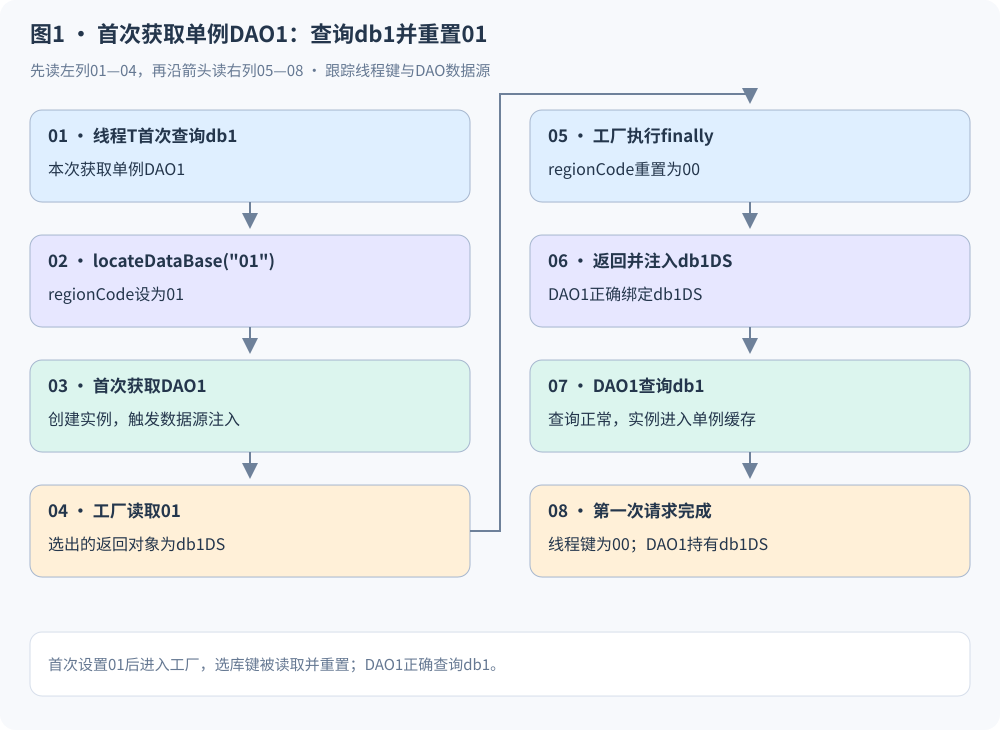
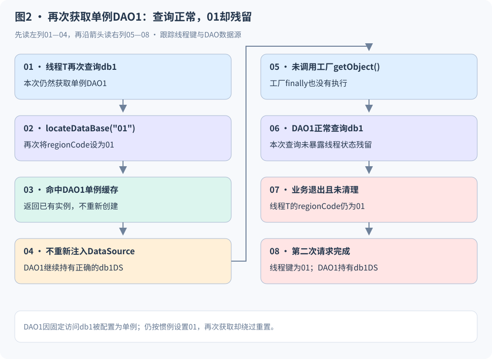
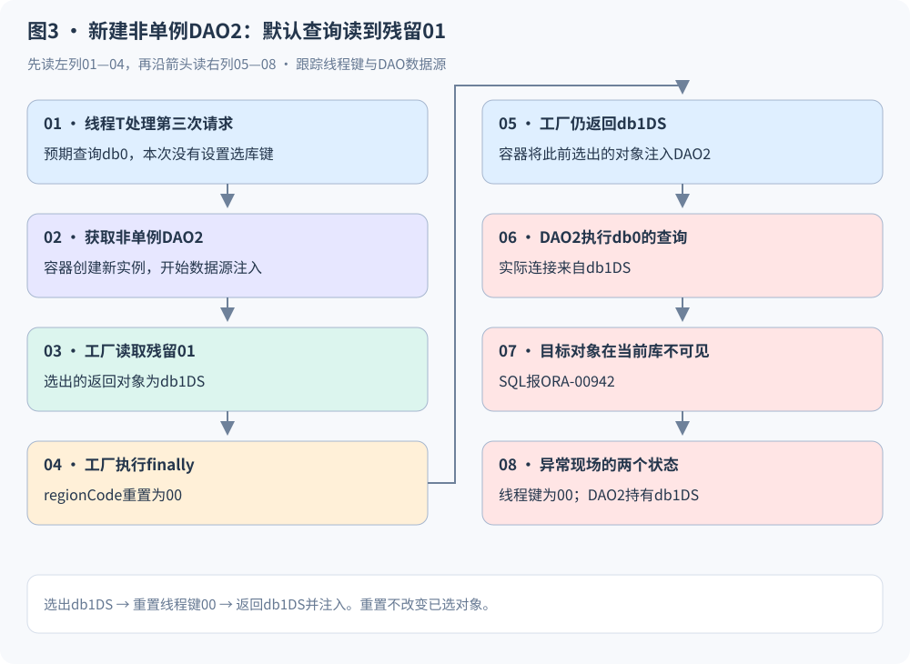
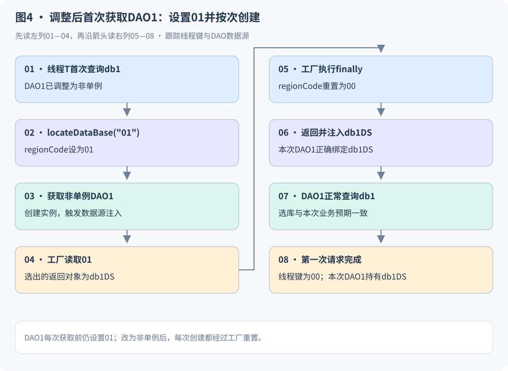
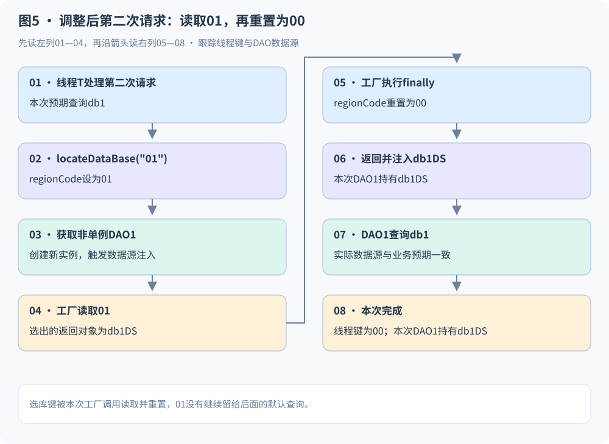
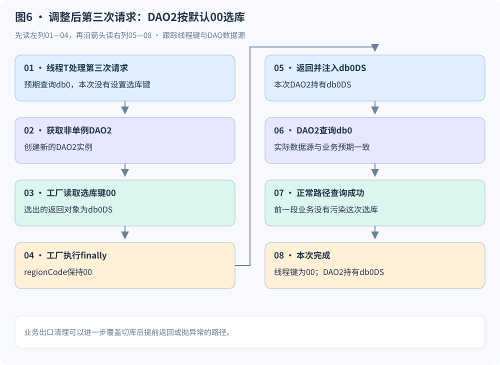

# 一次偶发SQL异常的排查：两个DAO之间的ThreadLocal状态残留

某业务系统线上偶尔出现ORA-00942“表或视图不存在”。报错的是一个默认查询db0的非单例DAO：目标表在db0中存在，本次业务也没有调用切库方法，但查询仍然失败。

这次排查需要解释的，是**一个没有主动切库的查询，为什么会使用db1的数据源**。沿着DAO创建和数据源注入过程往前分析，可以串起一条跨业务的状态链：前面的业务设置了01，随后获取已有的单例DAO，没有经过工厂重置选库状态；后面的业务在同一线程上创建非单例DAO，读到了残留01。

项目中大部分DAO都配置为多例，获取前一般会调用`locateDataBase()`设置目标库，随后通过DAO创建完成选库与重置。`biz.staffDAO`的业务只访问db1，实现时考虑到它不需要在数据库之间切换，便将它配置为单例；获取前设置01的调用方式仍然保留。

这一差异不会立即影响它自己的db1查询，却改变了线程状态的重置路径。下面先介绍正常调用约定，再用两个DAO和三次请求说明问题。数据库、包名和业务标识均采用通用名称。

## 一、先把场景摆清楚：两个DAO、一个工厂、一个线程中的选库键

### 1.1 大部分DAO为多例，固定访问db1的DAO被配置为单例

项目的常见调用方式是：获取DAO前先调用`locateDataBase()`，无论DAO是单例还是多例，都沿用这一步。对于多例DAO，后续创建过程会进入工厂，读取刚设置的键，并在退出时恢复00。

`biz.staffDAO`只访问db1，因此实现时选择复用一个单例实例。这个选择关注的是“DAO需要访问哪个库”，而工厂里的线程状态重置还依赖“每次获取DAO是否会重新创建实例”。

为观察这两种调用路径，取以下两个DAO作为例子，它们都通过`dsFactory`注入DataSource：

|对象|Bean名称|作用域|目标库与调用方式|
|---|---|---|---|
|DAO1：StaffDAO|`biz.staffDAO`|单例|始终访问db1，每次获取前都调用`locateDataBase("01")`|
|DAO2：PagedQueryDAO|`biz.pagedQueryDAO`|非单例（多例）|本例取默认查询db0的分支，获取前省略选库设置|

```xml
<!-- DAO1：单例。 -->
<bean id="biz.staffDAO"
      class="com.example.persistence.StaffDAOImpl"
      singleton="true" lazy-init="true">
    <property name="dataSource" ref="dsFactory" />
    <property name="sqlMapClient" ref="sqlMapClient" />
</bean>

<!-- DAO2：非单例。 -->
<bean id="biz.pagedQueryDAO"
      class="com.example.persistence.PagedQueryDAOImpl"
      singleton="false">
    <property name="dataSource" ref="dsFactory" />
    <property name="sqlMapClient" ref="sqlMapClient" />
</bean>
```

DAO1的查询始终属于db1，第一次、第二次及后续每次获取它之前，业务都会先设置01。

DAO2在这里代表一种依赖默认库的调用分支：业务要查db0，认为工厂会采用默认00，所以没有显式调用`locateDataBase("00")`。这是触发本次异常的分支；多数遵循获取前设置选库键的调用，不会直接沿用旧键。

示例将DAO1延迟到首次获取时创建，以观察初始化过程。这是两个不同的Bean，它们分别对应两段业务；两段业务可以属于不同接口，也可以在同一次请求中先后执行。

### 1.2 数据源映射统一为00与01

```xml
<bean id="dsFactory"
      class="com.example.framework.DataSourceFactoryBean">
    <property name="defaultDSKey" value="00" />
    <property name="dataSources">
        <map>
            <entry key="00" value-ref="db0DS" />
            <entry key="01" value-ref="db1DS" />
        </map>
    </property>
</bean>
```

|数据源键|DataSource|对应数据库|
|---|---|---|
|00，默认键|`db0DS`|db0|
|01|`db1DS`|db1|

工厂本身保持共享，连接池也是已有对象。工厂做的是从映射中选择一个DataSource引用，而不是每次创建连接池。

### 1.3 需要分开跟踪两个状态

理解这个问题，最重要的是不要把“线程中的选库键”与“DAO持有的数据源”当成同一个状态。

|状态|存放位置|什么时候变化|
|---|---|---|
|`regionCode`选库键|当前工作线程的ThreadLocal中|调用`locateDataBase()`时设置；工厂`getObject()`退出时重置|
|DAO的`dataSource`引用|已经创建的DAO实例中|DAO创建并完成属性注入时确定|

例如，DAO1已经持有`db1DS`，后续获取前再把`regionCode`设成01，DAO1仍然使用原来的db1DS。查询可以正常执行，但线程中的01还需要由工厂调用或业务出口重置。

两个DAO之间传递的也不是DataSource引用，而是同一线程中尚未重置的`regionCode`。

## 二、这套选库机制怎样工作

### 2.1 切库方法只设置ThreadLocal

业务切库方法的相关逻辑如下：

```java
protected void locateDataBase(String dataSourceKey) {
    DataSourceFactoryBean factory =
            (DataSourceFactoryBean) context.getBean("&dsFactory");
    factory.pickDataSource(dataSourceKey);
}
```

其中，`pickDataSource()`只是设置当前线程的值：

```java
public void pickDataSource(String region) {
    regionCode.set(region);
}
```

因此，调用`locateDataBase("01")`的含义是：**让接下来进入工厂的数据源选择过程读取01。**它不会直接修改已有DAO，也不会直接更换已有连接。

### 2.2 工厂读取选库键，选择数据源，再重置线程值

以下是与本问题有关的逻辑节选，省略其他分支、接口方法和配置访问器：

```java
private Map dataSources;
private String defaultDSKey = "00";
private ThreadLocal regionCode = new ThreadLocal();

public Object getObject() {
    try {
        String region = (String) regionCode.get();
        if (region == null) {
            region = defaultDSKey;
        }

        DataSource selected = (DataSource) dataSources.get(region);
        if (selected == null) {
            throw new IllegalStateException("DataSource key is not configured");
        }
        return selected;
    } finally {
        regionCode.set(defaultDSKey);
    }
}
```

这里有两个决定后续行为的规则：

- **只有`regionCode`为`null`时，才使用默认键00。**线程中只要已有01，本次即使没有调用切库方法，也会选择01。
- **只有进入`getObject()`，才会执行这里的`finally`。**获取已有的单例DAO不需要重新注入属性，因此不会触发这段重置。

`return selected`会先确定返回对象，再执行`finally`，然后将这个对象返回给调用方。假如选出的是`db1DS`，`finally`把线程值改回00之后，返回的仍然是`db1DS`；容器随后把它注入DAO。

### 2.3 选库发生在DAO创建时

对于这里讨论的工厂实现，新DAO的数据源注入路径可以概括为：

```text
创建DAO
→ 为dataSource属性获取工厂产品
→ getObject()读取当前线程的regionCode
→ 选出db0DS或db1DS
→ finally将regionCode重置为00
→ 返回已选出的DataSource，注入DAO
→ DAO使用该DataSource执行SQL
```

`ref="dsFactory"`获取的是工厂提供的DataSource；`getBean("&dsFactory")`获取的是工厂本身，用来设置选库键。[Spring FactoryBean说明](https://spring.io/blog/2011/08/09/what-s-a-factorybean/)

常见的多例DAO调用顺序是：

```text
locateDataBase(目标键)
→ getBean()创建多例DAO
→ getObject()读取目标键并选出DataSource
→ finally重置00
→ DAO使用本次选出的DataSource查询
```

因此，大部分业务都能按预期选库并恢复线程状态。

单例DAO初始化完成后，再次`getBean()`只返回已有实例，不走创建和属性注入流程。获取前虽然仍然设置了选库键，后面却不再有对应的工厂重置。**只访问一个库，可以解释为什么DAO自身查询正常；但设置选库键之后，仍需要执行重置。**

> 版本范围：本文分析“DAO创建时通过工厂重新选库”的调用路径。Spring1.2.9获取FactoryBean产品时直接调用`getObject()`，可以对应这条路径；采用产品缓存的其他版本，需要结合实际依赖核对产品获取方式。工厂实例的作用域与工厂产品的缓存语义分别管理。[Spring1.2.9源码包](https://repo.maven.apache.org/maven2/org/springframework/spring/1.2.9/spring-1.2.9-sources.jar)

## 三、三次请求：01如何留下，又被另一个DAO读到

为展示完整过程，假设三次请求依次由工作线程T处理，业务出口没有清理ThreadLocal，中间也没有其他操作覆盖选库键。单例DAO1最初尚未创建。

实际系统中，DAO1也可以在容器启动时完成初始化。这里把初始化放在第一次请求，是为了把实例绑定与线程状态变化放在同一条时间线上。

### 3.1 第一次请求：先设置01，再创建单例DAO1

第一次请求通过DAO1查询db1。在获取DAO1前，业务先调用`locateDataBase("01")`：

```java
locateDataBase("01");
StaffDAO dao1 = (StaffDAO) context.getBean("biz.staffDAO");
return dao1.findByNo(staffNo);
```

此时DAO1尚未创建，容器创建实例并注入DataSource。工厂读取到线程T中的01，选择`db1DS`，在`finally`中把选库键恢复为00，再返回db1DS供容器注入DAO1。

DAO1使用db1DS查询db1，数据源符合业务预期。第一次请求结束时：

```text
DAO1实例持有的DataSource = db1DS  ← 正确绑定db1
线程T中的regionCode      = 00     ← 工厂已重置
```

单例DAO1初始化完成后由容器缓存，后续`getBean()`返回这个实例。[Spring Bean作用域说明](https://docs.spring.io/spring-framework/reference/core/beans/factory-scopes.html)



### 3.2 第二次请求：同样设置01，单例缓存却绕过重置

第二次请求仍然通过DAO1查询db1，执行与第一次相同的代码：

```java
locateDataBase("01");
StaffDAO dao1 = (StaffDAO) context.getBean("biz.staffDAO");
return dao1.findByNo(staffNo);
```

`locateDataBase("01")`再次把线程T中的`regionCode`设成01。但这次DAO1已经在单例缓存中，`getBean()`直接返回已有实例，不重新创建，也不重新注入DataSource。

因此，工厂的`getObject()`没有执行，其中的`finally`也没有执行。**第一次是“设置01→进入工厂→重置00”；第二次则是“设置01→命中单例缓存→没有经过重置”。**

DAO1仍然持有第一次正确绑定的db1DS，所以它照常查询db1，正常路径下不会暴露这次状态残留。第二次请求结束时：

```text
DAO1仍然持有的DataSource = db1DS  ← 本次查询仍然正确
线程T中的regionCode      = 01     ← 已设置，却没有被重置
```

**问题不在于DAO1第二次查询用了错误的库，而在于它查询正常结束后，把01留给了后面的业务。**若业务出口也没有清理，该值便会继续保留在线程T中。



### 3.3 第三次请求：创建非单例DAO2，默认查询却选到了01

第三次请求通过DAO2查询db0。它按照默认库调用，不设置选库键：

```java
// 业务预期访问默认库db0，本次没有调用locateDataBase()。
PagedQueryDAO dao2 =
        (PagedQueryDAO) context.getBean("biz.pagedQueryDAO");
DataGrid grid = dao2.query("biz.query.fetchSummary", queryDTO, true);
```

DAO2是非单例，容器创建新实例并通过工厂注入DataSource。这时读取的`regionCode`不是“本次请求设置了什么”，而是“线程T目前保存着什么”。它读到的是上一次留下的01。

接下来按代码顺序发生四件事：

1. 工厂读取01，选出`db1DS`。
2. 工厂的`finally`将线程T中的`regionCode`重置为00。
3. 工厂返回此前选出的`db1DS`，容器将它注入新DAO2。
4. DAO2通过db1DS执行原本用于db0的查询；目标对象在当前连接下不可见时，报ORA-00942。

**“本次没有切库”只能说明本次没有写入01，不能说明线程中没有01。**默认00也不是每次请求自动应用的初始化值，它只在线程值为空时作为回退值使用。

到SQL报错时：

```text
DAO2实例持有的DataSource = db1DS  ← 已经绑定错误
线程T中的regionCode      = 00     ← 工厂已经重置
```

这两个状态并不矛盾：线程值已恢复正常，不会追溯修改DAO2已经拿到的数据源。



### 3.4 把两个状态放在同一张表里

|时点|正在操作的DAO|线程T中的regionCode|DAO持有的DataSource|
|---|---|---|---|
|第一次请求完成|单例DAO1，首次创建|00，工厂已重置|DAO1持有db1DS，查询db1正常|
|第二次设置选库键后|单例DAO1，已有实例|01|DAO1仍持有db1DS|
|第二次请求完成|单例DAO1，复用结束|01，未重置|DAO1仍持有db1DS，查询db1正常|
|第三次工厂选出数据源时|非单例DAO2，正在创建|01|工厂选出了db1DS，尚未注入|
|第三次工厂退出时|非单例DAO2，正在创建|00，已重置|工厂返回的对象仍是db1DS|
|第三次SQL执行时|非单例DAO2，注入完成|00|DAO2持有db1DS|

这条链的核心是：**单例DAO1的获取路径留下线程状态，非单例DAO2的创建路径读取该状态。**DAO2拿到的db1DS由工厂选择，并非DAO1直接传给它。

## 四、为什么偶发，也为什么难查

### 4.1 少量单例路径留下状态，后续调用多数会覆盖它

偶发性首先来自项目中两种路径的分布。大部分DAO为多例，获取前一般设置目标键，创建时又会经过工厂重置，因此正常调用不容易留下01。只有像DAO1这样保留选库设置、却复用已有实例的单例路径，才会绕过这次重置。

即使01已经留在线程上，后续调用也不一定出错。若下一段业务按照惯例先设置自己的目标键，就会覆盖残留值。例如默认查询先调用`locateDataBase("00")`，多例DAO仍会正确绑定db0DS。

本次故障需要两段路径恰好接在一起：**前面是留下01的单例DAO调用，后面是依赖默认00、没有显式设置选库键的多例DAO调用。**还要由同一工作线程处理，中间没有清理或覆盖状态。

|后续默认查询的调用条件|DAO2选择的数据源|
|---|---|
|获取前显式设置00，覆盖之前的线程值|db0DS，按预期查询|
|不显式设置，但所在工作线程为空或为00|db0DS，按预期查询|
|不显式设置，且同一工作线程仍保留DAO1留下的01|db1DS，目标库不符|

线程池调度又让这两段业务不总是落到同一个线程。因此，不是每次DAO1查询后都报错，也不是每次DAO2默认查询都报错，而是这组条件相遇时才会触发。固定同一线程与上述调用顺序后，就可以针对这条路径重现。

DAO1自身第一次已正确绑定db1DS，后续查询目标仍是db1，所以查询可以始终正常；最终异常暴露在后面的DAO2上。这使“前面的业务正常、后面的默认查询偶发失败”更难通过单次请求堆栈解释。

### 4.2 异常位置看不到前面的状态设置

错误日志指向的是DAO2执行的SQL：

```text
--- Check the biz.query.fetchSummary-InlineParameterMap.
--- Cause: java.sql.SQLSyntaxErrorException: ORA-00942: 表或视图不存在
```

目标表在预期库db0中存在，DAO2是非单例，当前业务没有调用切库方法。只检查这一段代码，容易认为它应该使用默认00。

真正设置01的却是前面的另一段业务。两段业务可能不在同一个异常堆栈里，甚至不属于同一个用户请求。排查需要把同一工作线程前后的操作关联起来。

### 4.3 报错时，ThreadLocal可能看起来正常

第三次工厂调用已将`regionCode`恢复00，随后SQL才报错。如果只在异常处查看线程值，会看到00；如果同时查看DAO2绑定的DataSource，才会发现它持有db1DS。

因此，关键证据要记录在**工厂读取选库键、选出DataSource，以及DAO完成注入**的时刻。仅观察SQL报错后的ThreadLocal，可能漏掉已经发生的错误绑定。

### 4.4 请求结束不会自动清空ThreadLocal

ThreadLocal保存的是线程自己的变量副本。线程池中的线程在请求结束后继续存活，下一次处理任务时仍可能读取尚未清理的值。[Java 8 ThreadLocal API](https://docs.oracle.com/javase/8/docs/api/java/lang/ThreadLocal.html)

所以，前后两个请求不必来自同一用户。这里的关联条件是同一工作线程，以及中间没有覆盖或清理状态。

## 五、怎么修复：让设置与重置配对

### 5.1 将动态选库的DAO1改为非单例

对这套创建时选库的实现，将DAO1配置为非单例，让切库后获取DAO的操作重新走数据源注入路径：

```xml
<bean id="biz.staffDAO"
      class="com.example.persistence.StaffDAOImpl"
      singleton="false">
    <property name="dataSource" ref="dsFactory" />
    <property name="sqlMapClient" ref="sqlMapClient" />
</bean>
```

DAO2本来就是非单例，无须改变作用域。工厂与db0DS、db1DS连接池也继续共享。变化的是：DAO1每次通过容器获取时创建新实例，读取当前选库键，并执行工厂中的重置逻辑。

这里的“按次创建”与每次业务调用的获取方式配套。如果将一个非单例DAO在单例Service初始化时直接注入，后续只使用那个已经注入的实例，便没有发生新的DAO获取。

### 5.2 再看同样的三次请求

第一次请求仍然先设置01，再获取DAO1的新实例。工厂读取01、选择db1DS，并在退出时把选库键恢复00：



第二次请求设置01，再获取DAO1的新实例。这次进入工厂，选择db1DS，工厂退出时把线程值恢复00，再将db1DS注入本次DAO1实例。它可以按预期查询db1，同时不会留下01给后面的业务：



第三次请求仍然不显式切库，创建DAO2时读取到00，返回db0DS并完成注入。默认库查询因此按预期执行：



### 5.3 在业务出口清理，覆盖提前返回与异常

按次创建DAO让正常查询路径中的设置与重置配对。对于“设置01后，没有走到DAO获取就提前返回或抛异常”的路径，还可以在业务出口明确释放选库状态：

```java
public void clearDataSourceContext() {
    regionCode.remove();
}
```

```java
DataSourceFactoryBean factory =
        (DataSourceFactoryBean) context.getBean("&dsFactory");
try {
    locateDataBase("01");
    StaffDAO dao1 = (StaffDAO) context.getBean("biz.staffDAO");
    return dao1.findByNo(staffNo);
} finally {
    factory.clearDataSourceContext();
}
```

清理解决的是状态进入后续业务的问题；DAO按次创建解决的是本次选择能否用于数据源注入的问题。两者分别对应故障链的不同环节。

如果存在嵌套切库，内层退出时恢复外层上下文，最外层退出时再统一清理。也可以在请求边界通过Filter或拦截器统一管理生命周期。

### 5.4 固定数据源也是一种设计选择

若一个DAO的职责固定属于某个数据库，可以直接绑定对应DataSource，分别定义访问db0与db1的DAO。这样数据源由依赖配置确定，调用过程无需借助ThreadLocal选库。

若业务需要统一动态路由，则可以将选库放在获取连接的阶段，并与事务边界协调。那属于另一种数据访问设计，本文的处理针对的是创建DAO时选库的实现。

## 六、排查与验证：沿同一线程还原时间线

定位这类问题，可以按下面的顺序收集信息：

1. 从失败SQL确认业务预期库，以及实际连接的数据库、用户和Schema。ORA-00942还可能与对象可见性、权限及同义词有关，结合实际连接区分。[Oracle错误说明](https://docs.oracle.com/en/error-help/db/ora-00942/)
2. 检查报错DAO的作用域和实际获取方式，定位DataSource注入过程。
3. 在工厂入口记录线程标识、读取到的选库键及选出的数据源键。
4. 沿同一线程向前查找最近一次`locateDataBase("01")`，观察它后面获取的是新DAO还是已有单例DAO。
5. 对照工厂重置和业务出口清理，找到设置与重置没有配对的路径。

重现时，可以用同一线程固定执行以下顺序，作为验证步骤：

```java
// 1. DAO1尚未创建；首次获取前设置01。
locateDataBase("01");
context.getBean("biz.staffDAO");        // 创建单例DAO1，绑定db1DS，键恢复00。

// 2. 设置01，随后复用已有单例DAO1。
locateDataBase("01");
context.getBean("biz.staffDAO");        // 不进入工厂，01留在线程中。

// 3. 不设置选库键，创建非单例DAO2。
context.getBean("biz.pagedQueryDAO");   // 工厂读取01，返回db1DS，键恢复00。
```

重点核对最后一个DAO的实际DataSource，而不是只查看最后的`regionCode`。对照实验可在第二、三步之间清理状态，或将DAO1改为非单例后重新执行该顺序，再观察DAO2是否绑定db0DS。

以上是复现与回归步骤；实际验证应结合项目依赖、SQL执行器和运行日志进行。

## 七、复盘结论

**DAO1始终查询db1，每次获取前都设置01。第一次创建会进入工厂并重置00，后续命中单例缓存则绕过重置，查询虽然正常，01却留在线程中。默认访问db0的DAO2随后在同一线程上创建，读到这个01，才绑定了错误的数据源。**

项目中多数多例DAO沿着“设置目标键→创建实例→工厂重置”的路径正常工作；固定访问db1的单例DAO保留了设置步骤，却跳过了重置步骤。后续多数显式选库调用又会覆盖残留值，使问题只在依赖默认库的特定调用顺序下暴露。

两个DAO通过同一线程中的ThreadLocal状态发生了关联，错误最终出现在后面的默认查询上。

这次排查需要跨过三个时间点：01被设置、DataSource被选出、SQL最终报错。它们可能出现在不同业务中，而工厂在返回数据源前已经重置线程值，更让异常现场看起来正常。

把线程状态与DAO绑定分别记录，再沿同一线程还原前后调用顺序，才能解释“为什么默认查询偶尔落到另一套数据库”，并让修复覆盖本次选库与后续状态清理。
