<a id="handbook-title"></a>
# JDK源码速读：从数据结构到并发状态机

> 面向纯阅读的OpenJDK8u图解手册。按同一类或完整框架归章，章内从字段、不变量和调用流程进入源码，配真实连续节选与手工推演。无需编译Java、运行实验或搭建环境。

**固定源码基线：**OpenJDK8u，tag为jdk8u462-b08，commit为943a5ea328fd2fc8eed0aed4ec9b1957d41f8144。这是一份特定实现的导读，不能把内部字段、阈值与CAS布局直接当成所有JDK的永久规范。

**阅读资源：**[上一期JVM图解](../jvm/)、[Markdown正文](./handbook.md)、[离线阅读包](./jdk-source-offline.zip)、[本期引用的原始源码包](./openjdk-source.zip)、[源码版权声明](./source-notices.txt)、[OpenJDK许可证](./openjdk-license.txt)。

源码摘录来自[OpenJDK公开仓库](https://github.com/openjdk/jdk8u/tree/943a5ea328fd2fc8eed0aed4ec9b1957d41f8144)，版权及GPLv2与Classpath exception声明保留在原始源码包和声明文件中。解释、推演与示意图为本手册整理内容；图示省略了部分异常与优化分支，不能替代完整实现。这里的“源码原文”指Java实现或明确标记的构建模板，不把讲解伪代码混入原文。

<a id="chapter-0"></a>
# 0. 阅读路线：先读主干，再读并发协议

源码速读的目标是看到关键字段时能说清“谁维护它、何时变、受谁保护、失败怎么办”。无需逐行背完几千行注释。每段节选给出准确行号，可离线看解释，也可联网跳到固定版本完整上下文。

|路线|建议顺序|读完应能解释|
|---|---|---|
|基础结构|String→ArrayList→LinkedList→HashMap→树与堆|容量、引用、碰撞、搬移、排序约束|
|并发容器|CHM→COW→CLQ→ThreadLocal|发布、读写协调、快照、弱引用与清理|
|同步框架|原子类→LockSupport→AQS→锁→Condition→共享同步器|线性化点、排队、park、唤醒和重新竞争|
|任务框架|阻塞队列→线程池→Future→CompletableFuture→定时任务|提交、执行、结果发布、拒绝与关闭|
|边界延伸|Thread→NIO→Stream→ForkJoin→代理与类加载|Java层能证明的事实与native/生成代码边界|


## 三层证据要分清

- **API契约：**返回值、异常、可中断性、迭代语义等，对使用者有意义。
- **固定版本实现：**数组增长比例、state位分配、桶头monitor、计数分片等，以本基线代码为准。
- **平台执行：**native、VM intrinsic、汇编和操作系统调度，看到Java入口后不能凭想象补全。

本书讲的线程安全通常指组件的操作按其契约协调；由多个调用组成的业务动作是否原子，需要另行证明。线性化点是并发操作可视为瞬间生效的位置；有些聚合观测，如并发size或LongAdder.sum，不提供相同的快照语义。

## 读每个方法时只追六个问题

|问题|例子|
|---|---|
|数据放在哪|ArrayList.elementData、Thread.threadLocals|
|什么状态合法|Buffer.position≤limit≤capacity|
|谁能改这个字段|写锁持有者、CAS成功者、当前线程|
|成功在何处成立|CLQ链接next、FutureTask发布终态|
|失败如何推进|重试、扩容、入队、park、异常|
|引用和资源何时解除|数组槽置null、Map删除、Cleaner释放|

阅读并发源码时，建议在脑中维护三列：共享字段值、线程甲所见、线程乙所见。只按单线程顺序读源码，容易漏掉“读完后别人已经改了”的窗口。


## 这一版怎样阅读

同一类的初始化、核心操作、竞争路径与清理维护在一章内连读。HashMap、CHM、ThreadLocal、AQS和线程池不再分散成多个大章。每章先有本章目录，基础源码路径在前，逐字段追问与分支推演在后；可先建立整体路线，再深入具体小节。

<a id="chapter-1"></a>
# 1. String：表示、不可变、复制与相等

**本章阅读顺序**

- [String：不可变对象到底保护了什么](#topic-1-1)
- [equals的两条快速路径与内容路径](#topic-1-2)

<a id="topic-1-1"></a>
## 1.1 String：不可变对象到底保护了什么

从字段开始看，而不是先背“字符串在常量池”。JDK8的String保存char数组；不可变性的关键是对象不暴露可写内部数组，公开操作不会把已有String的字符改掉。final限制字段引用重新赋值，并不会自动使数组元素不可变。

### 字段关系与主干流程

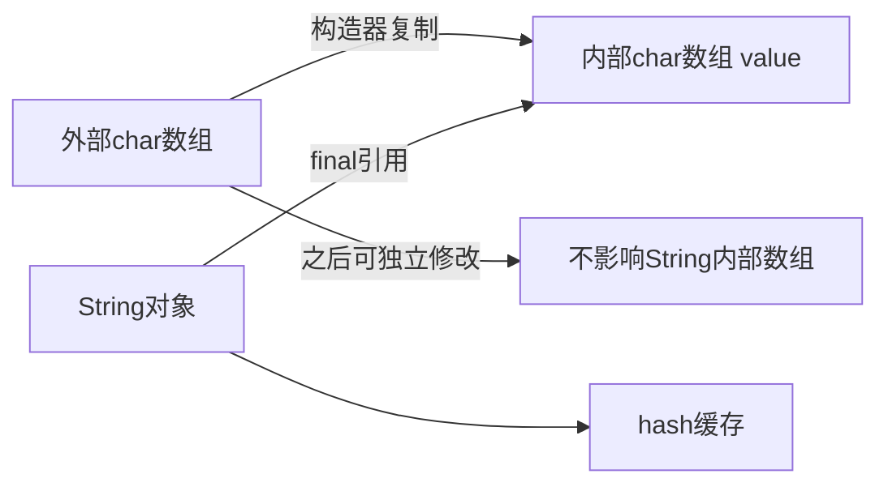

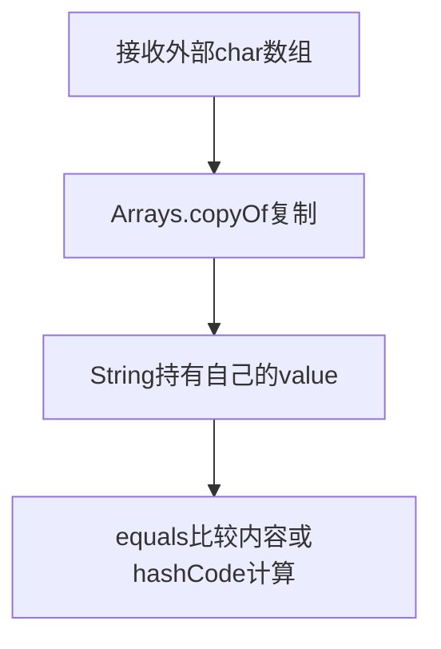

### 源码路径与解释

#### 源码1：private final char value[];


**String·[L114–L120](https://github.com/openjdk/jdk8u/blob/943a5ea328fd2fc8eed0aed4ec9b1957d41f8144/jdk/src/share/classes/java/lang/String.java#L114-L120)**

> 连续节选；窗口可能止于方法中间，完整实现请看链接。未省改算法，缩进作了统一处理。

```java
private final char value[];

/** Cache the hash code for the string */
private int hash; // Default to 0

/** use serialVersionUID from JDK 1.0.2 for interoperability */
private static final long serialVersionUID = -6849794470754667710L;
```

value是内部表示，hash是缓存，不是字符串的逻辑内容。一个Unicode字符可能需要两个char表示，因此length统计UTF-16代码单元。不要把char[]说成按字符编码后的byte数组。


#### 源码2：public String(char value[])


**String·[L156–L167](https://github.com/openjdk/jdk8u/blob/943a5ea328fd2fc8eed0aed4ec9b1957d41f8144/jdk/src/share/classes/java/lang/String.java#L156-L167)**

> 连续节选；窗口可能止于方法中间，完整实现请看链接。未省改算法，缩进作了统一处理。

```java
/**
 * Allocates a new {@code String} so that it represents the sequence of
 * characters currently contained in the character array argument. The
 * contents of the character array are copied; subsequent modification of
 * the character array does not affect the newly created string.
 *
 * @param  value
 *         The initial value of the string
 */
public String(char value[]) {
    this.value = Arrays.copyOf(value, value.length);
}
```

这个构造器复制外部数组。即使调用者后来修改原数组，已经构造的字符串也不改变。对比String(String)共享value：两个String都不提供修改该数组的公共接口，共享仍安全。


#### 源码3：public int hashCode()


**String·[L1452–L1476](https://github.com/openjdk/jdk8u/blob/943a5ea328fd2fc8eed0aed4ec9b1957d41f8144/jdk/src/share/classes/java/lang/String.java#L1452-L1476)**

> 连续节选；窗口可能止于方法中间，完整实现请看链接。未省改算法，缩进作了统一处理。

```java
/**
 * Returns a hash code for this string. The hash code for a
 * {@code String} object is computed as
 * <blockquote><pre>
 * s[0]*31^(n-1) + s[1]*31^(n-2) + ... + s[n-1]
 * </pre></blockquote>
 * using {@code int} arithmetic, where {@code s[i]} is the
 * <i>i</i>th character of the string, {@code n} is the length of
 * the string, and {@code ^} indicates exponentiation.
 * (The hash value of the empty string is zero.)
 *
 * @return  a hash code value for this object.
 */
public int hashCode() {
    int h = hash;
    if (h == 0 && value.length > 0) {
        char val[] = value;

        for (int i = 0; i < value.length; i++) {
            h = 31 * h + val[i];
        }
        hash = h;
    }
    return h;
}
```

逐个char累积h=31*h+字符。整数溢出是算法的一部分，不抛溢出异常；hash为0既可能是尚未计算，也可能是真实结果为0，后者可能再次计算。equals成立必须hash一致，hash相同不能推出equals。


### 手工推演与使用边界

把外部数组想象成[A,B,C]。构造String后得到第二份[A,B,C]；原数组改成[X,B,C]，String仍是ABC。再想象两个不同字符串的hash碰巧相同：HashMap仍会用equals区分，不能以hash替代内容。

- JDK9以后的Compact Strings内部表示不要套到JDK8。
- substring在本基线中通过构造器复制所需区间；不要沿用早期JDK共享大数组的旧结论。
- intern是native边界；这里的Java字段不能证明某个字符串何时、在哪里分配。

String的不可变性来自封装与实现约束，char数组构造器做防御性复制；hash只是缓存。先讲表示，再讲复制和比较，最后才连接字符串池。

<a id="topic-1-2"></a>
## 1.2 equals的两条快速路径与内容路径

equals先看是不是同一个对象，再看类型，最后比长度和char数组内容。两个String实例不同不表示内容不同；引用相同则不必扫描全部内容。hashCode缓存不参与这段equals的内容判定，别把hash相等当作字符串相等的充分条件。

构造String(String original)可以共享不可变的value；从外部char数组构造则复制。共享安全与否取决于数组是否能通过公开路径被修改，而不是“只要用了数组共享就一定不安全”。字符串不可变也不意味着所有使用它的复合业务代码都自动线程安全。


**String·[L961–L996](https://github.com/openjdk/jdk8u/blob/943a5ea328fd2fc8eed0aed4ec9b1957d41f8144/jdk/src/share/classes/java/lang/String.java#L961-L996)**

> 连续节选；窗口可能止于方法中间，完整实现请看链接。未省改算法，缩进作了统一处理。

```java
/**
 * Compares this string to the specified object.  The result is {@code
 * true} if and only if the argument is not {@code null} and is a {@code
 * String} object that represents the same sequence of characters as this
 * object.
 *
 * @param  anObject
 *         The object to compare this {@code String} against
 *
 * @return  {@code true} if the given object represents a {@code String}
 *          equivalent to this string, {@code false} otherwise
 *
 * @see  #compareTo(String)
 * @see  #equalsIgnoreCase(String)
 */
public boolean equals(Object anObject) {
    if (this == anObject) {
        return true;
    }
    if (anObject instanceof String) {
        String anotherString = (String)anObject;
        int n = value.length;
        if (n == anotherString.value.length) {
            char v1[] = value;
            char v2[] = anotherString.value;
            int i = 0;
            while (n-- != 0) {
                if (v1[i] != v2[i])
                    return false;
                i++;
            }
            return true;
        }
    }
    return false;
}
```

引用相同快速返回；String类型且长度相同才按char逐个比较。源码没有因为hash相等就返回true。


<a id="chapter-2"></a>
# 2. StringBuilder：有效长度、容量增长与结果复制

**本章阅读顺序**

- [StringBuilder：可变数组如何减少复制](#topic-2-1)
- [Builder变成String时发生了什么](#topic-2-2)

<a id="topic-2-1"></a>
## 2.1 StringBuilder：可变数组如何减少复制

StringBuilder的核心在AbstractStringBuilder：value是可增长char数组，count是有效长度。容量和长度是两件事。连续append复用数组，只有容量不足才分配与复制；这解释了为什么循环累积文本通常比反复创建String更合适。

### 字段关系与主干流程

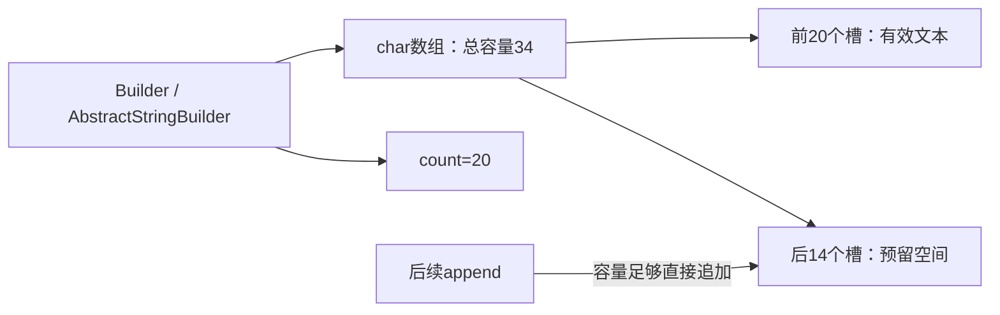

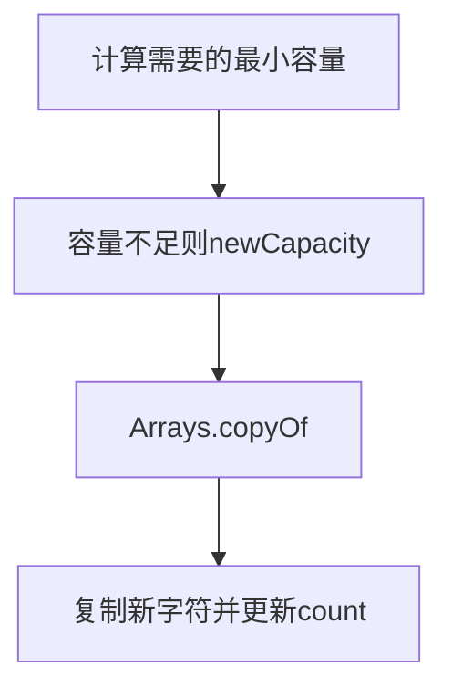

### 源码路径与解释

#### 源码1：private void ensureCapacityInternal(


**AbstractStringBuilder·[L114–L127](https://github.com/openjdk/jdk8u/blob/943a5ea328fd2fc8eed0aed4ec9b1957d41f8144/jdk/src/share/classes/java/lang/AbstractStringBuilder.java#L114-L127)**

> 连续节选；窗口可能止于方法中间，完整实现请看链接。未省改算法，缩进作了统一处理。

```java
/**
 * For positive values of {@code minimumCapacity}, this method
 * behaves like {@code ensureCapacity}, however it is never
 * synchronized.
 * If {@code minimumCapacity} is non positive due to numeric
 * overflow, this method throws {@code OutOfMemoryError}.
 */
private void ensureCapacityInternal(int minimumCapacity) {
    // overflow-conscious code
    if (minimumCapacity - value.length > 0) {
        value = Arrays.copyOf(value,
                newCapacity(minimumCapacity));
    }
}
```

用minimumCapacity-value.length判断是否需要增长。这里没有锁；不能因为内部数组复制就把StringBuilder当线程安全容器。


#### 源码2：private int newCapacity(


**AbstractStringBuilder·[L137–L157](https://github.com/openjdk/jdk8u/blob/943a5ea328fd2fc8eed0aed4ec9b1957d41f8144/jdk/src/share/classes/java/lang/AbstractStringBuilder.java#L137-L157)**

> 连续节选；窗口可能止于方法中间，完整实现请看链接。未省改算法，缩进作了统一处理。

```java
/**
 * Returns a capacity at least as large as the given minimum capacity.
 * Returns the current capacity increased by the same amount + 2 if
 * that suffices.
 * Will not return a capacity greater than {@code MAX_ARRAY_SIZE}
 * unless the given minimum capacity is greater than that.
 *
 * @param  minCapacity the desired minimum capacity
 * @throws OutOfMemoryError if minCapacity is less than zero or
 *         greater than Integer.MAX_VALUE
 */
private int newCapacity(int minCapacity) {
    // overflow-conscious code
    int newCapacity = (value.length << 1) + 2;
    if (newCapacity - minCapacity < 0) {
        newCapacity = minCapacity;
    }
    return (newCapacity <= 0 || MAX_ARRAY_SIZE - newCapacity < 0)
        ? hugeCapacity(minCapacity)
        : newCapacity;
}
```

常规候选容量是旧容量的两倍加2；若仍不足，使用minCapacity。巨大容量与溢出另有分支，所以“永远严格翻倍”不准确。


#### 源码3：public AbstractStringBuilder append(String str)


**AbstractStringBuilder·[L426–L452](https://github.com/openjdk/jdk8u/blob/943a5ea328fd2fc8eed0aed4ec9b1957d41f8144/jdk/src/share/classes/java/lang/AbstractStringBuilder.java#L426-L452)**

> 连续节选；窗口可能止于方法中间，完整实现请看链接。未省改算法，缩进作了统一处理。

```java
/**
 * Appends the specified string to this character sequence.
 * <p>
 * The characters of the {@code String} argument are appended, in
 * order, increasing the length of this sequence by the length of the
 * argument. If {@code str} is {@code null}, then the four
 * characters {@code "null"} are appended.
 * <p>
 * Let <i>n</i> be the length of this character sequence just prior to
 * execution of the {@code append} method. Then the character at
 * index <i>k</i> in the new character sequence is equal to the character
 * at index <i>k</i> in the old character sequence, if <i>k</i> is less
 * than <i>n</i>; otherwise, it is equal to the character at index
 * <i>k-n</i> in the argument {@code str}.
 *
 * @param   str   a string.
 * @return  a reference to this object.
 */
public AbstractStringBuilder append(String str) {
    if (str == null)
        return appendNull();
    int len = str.length();
    ensureCapacityInternal(count + len);
    str.getChars(0, len, value, count);
    count += len;
    return this;
}
```

先处理null，再取长度、扩容、把字符复制到count之后，最后推进count。append(null String)追加的是字符串null，而不是跳过。


### 手工推演与使用边界

容量16、count15，追加长度5，需要容量20，常规扩到34，之后count20。下一次追加短文本可直接使用剩余空间。扩容时复制旧数组，其他普通追加只搬新字符。

- StringBuilder不适合多个线程无同步共同修改。
- StringBuffer有同步，但跨多次方法调用的业务事务仍需单独分析。
- JDK8编译器常把普通字符串连接降为StringBuilder链，其他JDK的编译策略可能不同。

可变缓冲区把重复分配变成按需扩容。看count与value.length的区别，再看ensureCapacityInternal和append的写入顺序。

<a id="topic-2-2"></a>
## 2.2 Builder变成String时发生了什么

最终String需要获得不再被Builder后续修改影响的字符内容。本基线String(StringBuilder)复制其有效区域；另一条常用toString路径也会构造独立的字符串内容。Builder的capacity可以明显大于count，String只需要当前有效文本。

频繁在循环内toString会产生新的结果字符串，不能因为用了Builder就认定整段循环绝无分配。还应区分单条表达式的编译转换与跨多次循环累积，后者反复String连接可能重复复制已有前缀。


**String·[L584–L601](https://github.com/openjdk/jdk8u/blob/943a5ea328fd2fc8eed0aed4ec9b1957d41f8144/jdk/src/share/classes/java/lang/String.java#L584-L601)**

> 连续节选；窗口可能止于方法中间，完整实现请看链接。未省改算法，缩进作了统一处理。

```java
/**
 * Allocates a new string that contains the sequence of characters
 * currently contained in the string builder argument. The contents of the
 * string builder are copied; subsequent modification of the string builder
 * does not affect the newly created string.
 *
 * <p> This constructor is provided to ease migration to {@code
 * StringBuilder}. Obtaining a string from a string builder via the {@code
 * toString} method is likely to run faster and is generally preferred.
 *
 * @param   builder
 *          A {@code StringBuilder}
 *
 * @since  1.5
 */
public String(StringBuilder builder) {
    this.value = Arrays.copyOf(builder.getValue(), builder.length());
}
```

这里复制builder.getValue的count长度区域，之后Builder再append不改已有String。


<a id="chapter-3"></a>
# 3. Integer：包装、缓存、身份与数值

**本章阅读顺序**

- [Integer：缓存、装箱与身份比较](#topic-3-1)
- [三个相等关系与null拆箱](#topic-3-2)

<a id="topic-3-1"></a>
## 3.1 Integer：缓存、装箱与身份比较

Integer包装一个final int。valueOf先查缓存再新建，自动装箱通常走这个工厂。缓存优化的是对象复用，不改变整数的数学值；对象身份、值相等和拆箱是三条不同的比较路径。

### 字段关系与主干流程

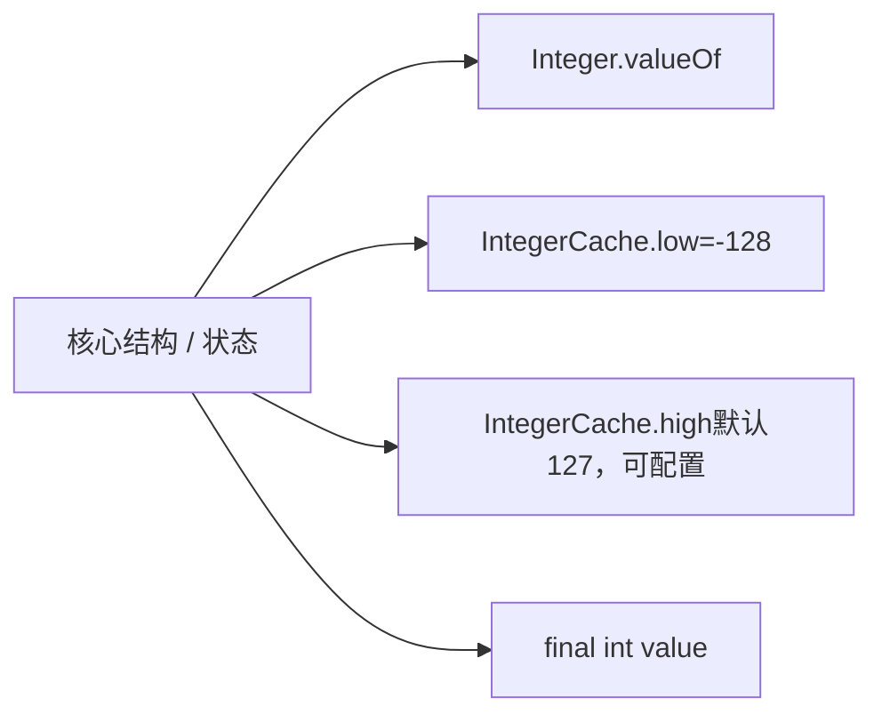

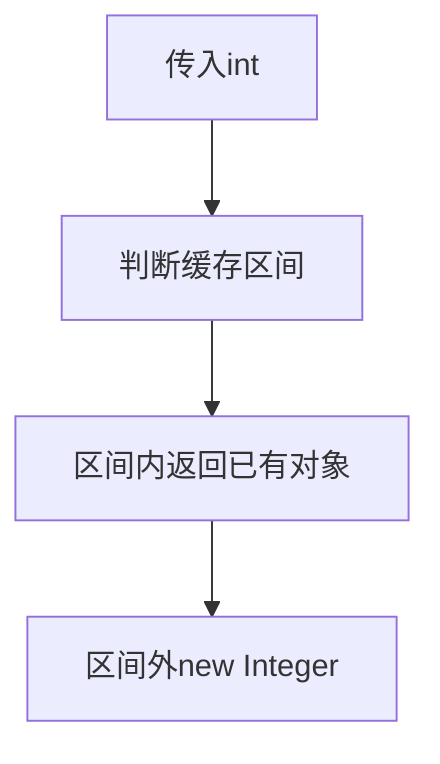

### 源码路径与解释

#### 源码1：private static class IntegerCache


**Integer·[L780–L803](https://github.com/openjdk/jdk8u/blob/943a5ea328fd2fc8eed0aed4ec9b1957d41f8144/jdk/src/share/classes/java/lang/Integer.java#L780-L803)**

> 连续节选；窗口可能止于方法中间，完整实现请看链接。未省改算法，缩进作了统一处理。

```java
private static class IntegerCache {
    static final int low = -128;
    static final int high;
    static final Integer cache[];

    static {
        // high value may be configured by property
        int h = 127;
        String integerCacheHighPropValue =
            sun.misc.VM.getSavedProperty("java.lang.Integer.IntegerCache.high");
        if (integerCacheHighPropValue != null) {
            try {
                int i = parseInt(integerCacheHighPropValue);
                i = Math.max(i, 127);
                // Maximum array size is Integer.MAX_VALUE
                h = Math.min(i, Integer.MAX_VALUE - (-low) -1);
            } catch( NumberFormatException nfe) {
                // If the property cannot be parsed into an int, ignore it.
            }
        }
        high = h;

        cache = new Integer[(high - low) + 1];
        int j = low;
```

默认上界127，下界-128；本实现允许通过保存的属性提高上界。不要把大于127一律“不可能缓存”当规范。


#### 源码2：public static Integer valueOf(int i)


**Integer·[L814–L833](https://github.com/openjdk/jdk8u/blob/943a5ea328fd2fc8eed0aed4ec9b1957d41f8144/jdk/src/share/classes/java/lang/Integer.java#L814-L833)**

> 连续节选；窗口可能止于方法中间，完整实现请看链接。未省改算法，缩进作了统一处理。

```java
/**
 * Returns an {@code Integer} instance representing the specified
 * {@code int} value.  If a new {@code Integer} instance is not
 * required, this method should generally be used in preference to
 * the constructor {@link #Integer(int)}, as this method is likely
 * to yield significantly better space and time performance by
 * caching frequently requested values.
 *
 * This method will always cache values in the range -128 to 127,
 * inclusive, and may cache other values outside of this range.
 *
 * @param  i an {@code int} value.
 * @return an {@code Integer} instance representing {@code i}.
 * @since  1.5
 */
public static Integer valueOf(int i) {
    if (i >= IntegerCache.low && i <= IntegerCache.high)
        return IntegerCache.cache[i + (-IntegerCache.low)];
    return new Integer(i);
}
```

这里直接决定是否返回同一个缓存对象。new Integer走构造器，不经过valueOf缓存分支。


#### 源码3：public boolean equals(Object obj)


**Integer·[L963–L978](https://github.com/openjdk/jdk8u/blob/943a5ea328fd2fc8eed0aed4ec9b1957d41f8144/jdk/src/share/classes/java/lang/Integer.java#L963-L978)**

> 连续节选；窗口可能止于方法中间，完整实现请看链接。未省改算法，缩进作了统一处理。

```java
/**
 * Compares this object to the specified object.  The result is
 * {@code true} if and only if the argument is not
 * {@code null} and is an {@code Integer} object that
 * contains the same {@code int} value as this object.
 *
 * @param   obj   the object to compare with.
 * @return  {@code true} if the objects are the same;
 *          {@code false} otherwise.
 */
public boolean equals(Object obj) {
    if (obj instanceof Integer) {
        return value == ((Integer)obj).intValue();
    }
    return false;
}
```

equals先检查对象类型，然后比较int值。Integer与Long即使数值相同也不会因此equals；拆箱null则是另一条路径，会抛NullPointerException。


### 手工推演与使用边界

两个通过valueOf取得的100通常指向同一缓存对象，因此==为真；两个显式新建的100是不同对象，但equals为真。200是否被缓存要看本实现的缓存上界，不能把对象身份写进业务判断。

- 规范对特定常量表达式装箱有身份保证；不要扩大为所有数值、所有包装类、所有构造路径。
- 整数业务比较先明确是否拆箱、是否可能null。
- 缓存区间是实现与配置知识，不能取代equals语义。

缓存影响身份而非值。用equals表达包装值相等，用明确的基本类型比较表达数学关系；不要依赖偶然的==结果。

<a id="topic-3-2"></a>
## 3.2 三个相等关系与null拆箱

|表达需求|应该分析什么|常见误读|
|---|---|---|
|两个包装对象身份相同|是否同一个引用、是否走缓存工厂|把缓存结果当所有数值的保证|
|包装值相同|equals及类型检查|Integer与Long数值一样就equals|
|数值大小关系|是否拆箱、是否可能null|忽略null导致拆箱异常|

valueOf(int)有缓存分支；new Integer(int)直接构造对象。自动装箱转换常用valueOf，但JLS的身份保证与实现缓存范围应分开讲。对可能为空的包装值，先明确业务如何处理空，再进入数值比较。

<a id="chapter-4"></a>
# 4. ArrayList：增删改查、扩容、迭代器与subList

**本章阅读顺序**

- [数组与增删容量维护](#topic-4-1)
- [迭代器状态与subList共享视图](#topic-4-2)
- [把size、容量、modCount放在同一张表](#topic-4-3)

<a id="topic-4-1"></a>
## 4.1 数组与增删容量维护

ArrayList让逻辑上可变长度的List建立在固定长度数组上。size是已使用元素数；elementData.length是容量。追加通常只写一个槽，偶尔扩容复制整个数组，所以单次最坏O(n)，一串追加的摊还成本通常O(1)。

### 字段关系与主干流程

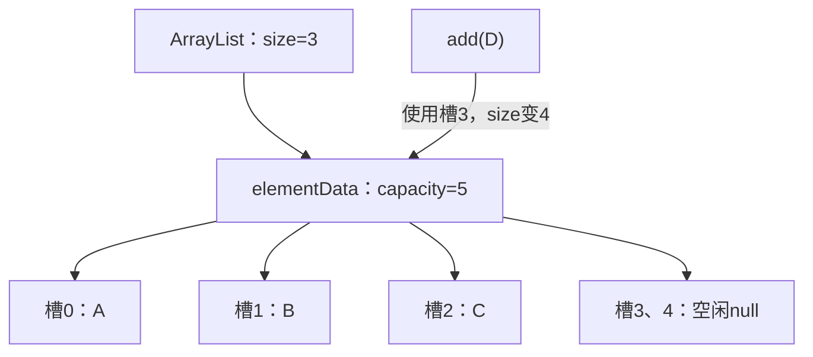

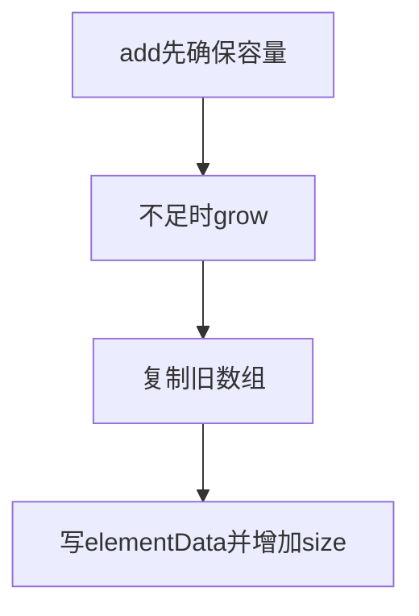

### 源码路径与解释

#### 源码1：public boolean add(E e)


**ArrayList·[L457–L467](https://github.com/openjdk/jdk8u/blob/943a5ea328fd2fc8eed0aed4ec9b1957d41f8144/jdk/src/share/classes/java/util/ArrayList.java#L457-L467)**

> 连续节选；窗口可能止于方法中间，完整实现请看链接。未省改算法，缩进作了统一处理。

```java
/**
 * Appends the specified element to the end of this list.
 *
 * @param e element to be appended to this list
 * @return <tt>true</tt> (as specified by {@link Collection#add})
 */
public boolean add(E e) {
    ensureCapacityInternal(size + 1);  // Increments modCount!!
    elementData[size++] = e;
    return true;
}
```

ensureCapacityInternal(size+1)确保下一格存在，然后数组赋值并后置增加size。默认构造的空标记数组在第一次添加时通常扩到默认容量10。


#### 源码2：private void grow(int minCapacity)


**ArrayList·[L252–L268](https://github.com/openjdk/jdk8u/blob/943a5ea328fd2fc8eed0aed4ec9b1957d41f8144/jdk/src/share/classes/java/util/ArrayList.java#L252-L268)**

> 连续节选；窗口可能止于方法中间，完整实现请看链接。未省改算法，缩进作了统一处理。

```java
/**
 * Increases the capacity to ensure that it can hold at least the
 * number of elements specified by the minimum capacity argument.
 *
 * @param minCapacity the desired minimum capacity
 */
private void grow(int minCapacity) {
    // overflow-conscious code
    int oldCapacity = elementData.length;
    int newCapacity = oldCapacity + (oldCapacity >> 1);
    if (newCapacity - minCapacity < 0)
        newCapacity = minCapacity;
    if (newCapacity - MAX_ARRAY_SIZE > 0)
        newCapacity = hugeCapacity(minCapacity);
    // minCapacity is usually close to size, so this is a win:
    elementData = Arrays.copyOf(elementData, newCapacity);
}
```

常规候选容量为oldCapacity+(oldCapacity>>1)，约1.5倍；若候选不足则使用所需最小容量。超过数组上限还要走hugeCapacity，所以并非任意情况下恰好1.5倍。


#### 源码3：public E remove(int index)


**ArrayList·[L488–L510](https://github.com/openjdk/jdk8u/blob/943a5ea328fd2fc8eed0aed4ec9b1957d41f8144/jdk/src/share/classes/java/util/ArrayList.java#L488-L510)**

> 连续节选；窗口可能止于方法中间，完整实现请看链接。未省改算法，缩进作了统一处理。

```java
/**
 * Removes the element at the specified position in this list.
 * Shifts any subsequent elements to the left (subtracts one from their
 * indices).
 *
 * @param index the index of the element to be removed
 * @return the element that was removed from the list
 * @throws IndexOutOfBoundsException {@inheritDoc}
 */
public E remove(int index) {
    rangeCheck(index);

    modCount++;
    E oldValue = elementData(index);

    int numMoved = size - index - 1;
    if (numMoved > 0)
        System.arraycopy(elementData, index+1, elementData, index,
                         numMoved);
    elementData[--size] = null; // clear to let GC do its work

    return oldValue;
}
```

检查下标后移动后续元素，size减少，最后把多余槽置null，避免容器继续保留已删除对象的强引用。删除中间元素的成本来自搬移。


### 手工推演与使用边界

容量10、size10时再add一次：新数组常规容量15，复制10个旧引用，放入新引用，size11。删除索引2：索引3到10整体左移，最后一个旧槽清空。

- ArrayList是线程不安全的；modCount不是同步机制。
- 构造容量不等于构造size，new ArrayList(100)仍为空。
- remove(int)按下标，remove(Object)按值；Integer列表尤其容易看错重载。

随机索引快、尾部追加摊还快、头部与中间插删要搬移。源码里size与容量分离，扩容复制引用，删除清空尾槽。

<a id="topic-4-2"></a>
## 4.2 迭代器状态与subList共享视图

迭代器保存expectedModCount，容器保存modCount；二者不一致时提供尽力而为的fail-fast检查。subList是视图，持有父列表及偏移与范围，并非独立副本。要理解行为，先问“数据是否共享”和“结构修改计数由谁维护”。

### 字段关系与主干流程

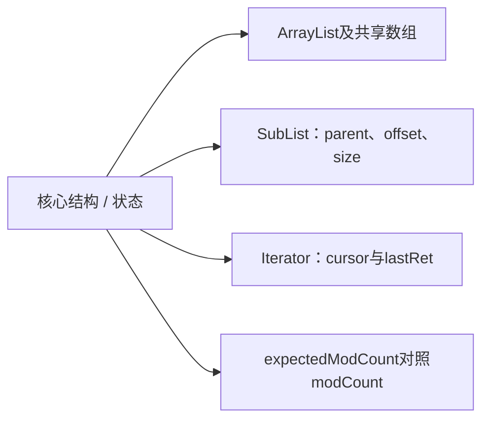

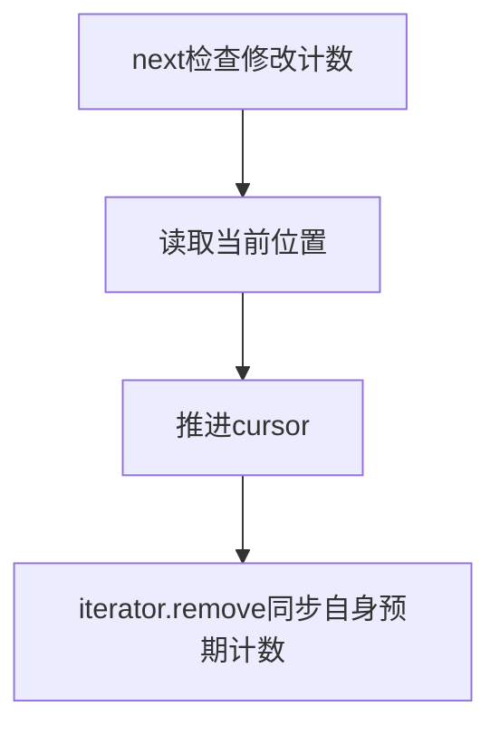

### 源码路径与解释

#### 源码1：public E next()


**ArrayList·[L859–L870](https://github.com/openjdk/jdk8u/blob/943a5ea328fd2fc8eed0aed4ec9b1957d41f8144/jdk/src/share/classes/java/util/ArrayList.java#L859-L870)**

> 连续节选；窗口可能止于方法中间，完整实现请看链接。未省改算法，缩进作了统一处理。

```java
@SuppressWarnings("unchecked")
public E next() {
    checkForComodification();
    int i = cursor;
    if (i >= size)
        throw new NoSuchElementException();
    Object[] elementData = ArrayList.this.elementData;
    if (i >= elementData.length)
        throw new ConcurrentModificationException();
    cursor = i + 1;
    return (E) elementData[lastRet = i];
}
```

先检查并发修改，再检查下标和当前数组边界。检查只能帮助尽早发现错误，不能把数据竞争变成可靠异常。


#### 源码2：final void checkForComodification()


**ArrayList·[L909–L912](https://github.com/openjdk/jdk8u/blob/943a5ea328fd2fc8eed0aed4ec9b1957d41f8144/jdk/src/share/classes/java/util/ArrayList.java#L909-L912)**

> 连续节选；窗口可能止于方法中间，完整实现请看链接。未省改算法，缩进作了统一处理。

```java
final void checkForComodification() {
    if (modCount != expectedModCount)
        throw new ConcurrentModificationException();
}
```

expectedModCount不同就抛异常。不要把ConcurrentModificationException理解成“只有多线程才触发”；同一线程绕过迭代器改列表也可能触发。


#### 源码3：SubList(AbstractList<E> parent,


**ArrayList·[L1026–L1033](https://github.com/openjdk/jdk8u/blob/943a5ea328fd2fc8eed0aed4ec9b1957d41f8144/jdk/src/share/classes/java/util/ArrayList.java#L1026-L1033)**

> 连续节选；窗口可能止于方法中间，完整实现请看链接。未省改算法，缩进作了统一处理。

```java
SubList(AbstractList<E> parent,
        int offset, int fromIndex, int toIndex) {
    this.parent = parent;
    this.parentOffset = fromIndex;
    this.offset = offset + fromIndex;
    this.size = toIndex - fromIndex;
    this.modCount = ArrayList.this.modCount;
}
```

子视图保存父列表、偏移和创建时modCount。对视图做结构修改会经其实现更新相关状态，直接改父列表结构会让旧视图失效。


### 手工推演与使用边界

遍历[a,b,c]时，迭代器预期计数为3。直接调用list.add(d)使modCount变4，之后next可能报错。若使用该迭代器自己的remove，它会更新expectedModCount，继续遍历有明确路径。subList(1,3)对应[b,c]，set修改会反映到父列表。

- fail-fast没有保证一定检测所有并发修改。
- subList保留父容器联系，长期持有小视图也可能保留整个大列表。
- 修改元素值和结构修改不同；ArrayList.set一般不增加modCount。

迭代器不是副本，subList也是共享视图。fail-fast用计数发现结构变化，不能替代锁或并发容器。

<a id="topic-4-3"></a>
## 4.3 把size、容量、modCount放在同一张表

|操作|size|容量|modCount的典型变化|
|---|---|---|---|
|尾部add|加1|不足时增长|结构维护路径增加|
|set已有位置|不变|不变|通常不增加|
|按下标remove|减1|通常不缩容|增加|
|clear|变0|通常保留底层数组|增加|
|subList.set|影响父列表对应元素|共享原存储|一般不构成结构新增|

这张表只描述这些常见操作，不能推广成modCount永远等于成功插删次数。ensureCapacity等容量维护也可能改变计数。clear把有效范围内的引用置null，却不会自动把capacity缩成0；这既允许复用容量，也可能让大数组继续占内存。

**视图偏移推演：**父列表[A,B,C,D,E]，subList(1,4)对应[B,C,D]。子视图set(0,X)改的是父列表索引1。子视图持有父结构，长期保留它可能继续保留父列表及大数组。需要独立数据时，必须明确创建副本，不能只截一个视图。


**ArrayList·[L555–L567](https://github.com/openjdk/jdk8u/blob/943a5ea328fd2fc8eed0aed4ec9b1957d41f8144/jdk/src/share/classes/java/util/ArrayList.java#L555-L567)**

> 连续节选；窗口可能止于方法中间，完整实现请看链接。未省改算法，缩进作了统一处理。

```java
/**
 * Removes all of the elements from this list.  The list will
 * be empty after this call returns.
 */
public void clear() {
    modCount++;

    // clear to let GC do its work
    for (int i = 0; i < size; i++)
        elementData[i] = null;

    size = 0;
}
```

有效元素槽清空，size置0；没有在这里重新分配长度0数组。


<a id="chapter-5"></a>
# 5. LinkedList：双向链、两端API与定位成本

**本章阅读顺序**

- [LinkedList：有了节点为什么索引访问仍慢](#topic-5-1)
- [两端API与索引API的成本来源](#topic-5-2)

<a id="topic-5-1"></a>
## 5.1 LinkedList：有了节点为什么索引访问仍慢

LinkedList是双向链表，first与last保存两端。节点连接起来后，改指针可以O(1)，但先定位第i个节点仍要走链。Java的List API传的是索引，没有直接把内部Node交给调用者，所以不能把所有插删笼统说成O(1)。

### 字段关系与主干流程

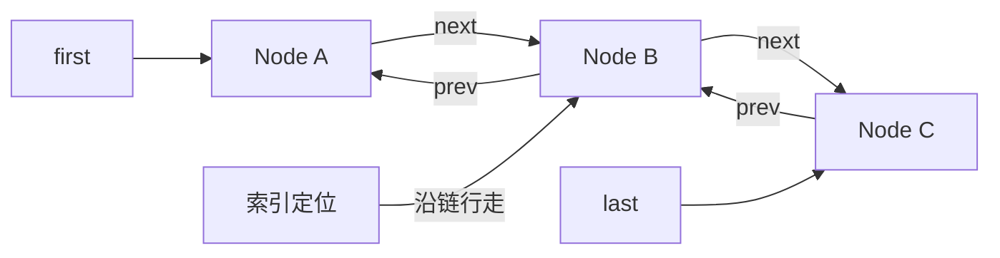

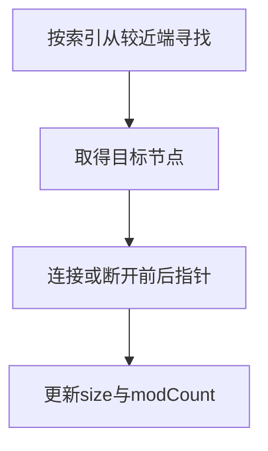

### 源码路径与解释

#### 源码1：void linkLast(E e)


**LinkedList·[L137–L150](https://github.com/openjdk/jdk8u/blob/943a5ea328fd2fc8eed0aed4ec9b1957d41f8144/jdk/src/share/classes/java/util/LinkedList.java#L137-L150)**

> 连续节选；窗口可能止于方法中间，完整实现请看链接。未省改算法，缩进作了统一处理。

```java
/**
 * Links e as last element.
 */
void linkLast(E e) {
    final Node<E> l = last;
    final Node<E> newNode = new Node<>(l, e, null);
    last = newNode;
    if (l == null)
        first = newNode;
    else
        l.next = newNode;
    size++;
    modCount++;
}
```

创建新尾节点，处理空链表与非空链表两种连接方式。追加尾部可直接用last，无需遍历。


#### 源码2：Node<E> node(int index)


**LinkedList·[L563–L580](https://github.com/openjdk/jdk8u/blob/943a5ea328fd2fc8eed0aed4ec9b1957d41f8144/jdk/src/share/classes/java/util/LinkedList.java#L563-L580)**

> 连续节选；窗口可能止于方法中间，完整实现请看链接。未省改算法，缩进作了统一处理。

```java
/**
 * Returns the (non-null) Node at the specified element index.
 */
Node<E> node(int index) {
    // assert isElementIndex(index);

    if (index < (size >> 1)) {
        Node<E> x = first;
        for (int i = 0; i < index; i++)
            x = x.next;
        return x;
    } else {
        Node<E> x = last;
        for (int i = size - 1; i > index; i--)
            x = x.prev;
        return x;
    }
}
```

index<size/2时从first向后，否则从last向前。双向链降低常数，但数量级仍为O(n)。


#### 源码3：E unlink(Node<E> x)


**LinkedList·[L206–L233](https://github.com/openjdk/jdk8u/blob/943a5ea328fd2fc8eed0aed4ec9b1957d41f8144/jdk/src/share/classes/java/util/LinkedList.java#L206-L233)**

> 连续节选；窗口可能止于方法中间，完整实现请看链接。未省改算法，缩进作了统一处理。

```java
/**
 * Unlinks non-null node x.
 */
E unlink(Node<E> x) {
    // assert x != null;
    final E element = x.item;
    final Node<E> next = x.next;
    final Node<E> prev = x.prev;

    if (prev == null) {
        first = next;
    } else {
        prev.next = next;
        x.prev = null;
    }

    if (next == null) {
        last = prev;
    } else {
        next.prev = prev;
        x.next = null;
    }

    x.item = null;
    size--;
    modCount++;
    return element;
}
```

分别修补前驱和后继；首尾需要额外更新first/last。清除item和断开的引用，让已删除节点不继续保留旧结构。


### 手工推演与使用边界

长度100的列表访问索引98，从尾走一步即可；访问索引50仍要走约49步。iterator已定位某个节点时，其remove可以就地调整链接，但反复get(i)遍历整个链表可能累计O(n²)。

- 链表对象多、引用多，缓存局部性通常比连续数组差。
- LinkedList允许null，poll返回null未必表示原队列一定没有null元素。
- 线程安全与是否链表无关，LinkedList无内建并发保证。

链表优势来自已知节点或两端操作；按索引定位仍线性。比较容器时把“寻找位置”和“改变连接”分开。

<a id="topic-5-2"></a>
## 5.2 两端API与索引API的成本来源

尾加使用last，头取使用first，节点定位完成后断链可为常数工作。但add(index,e)首先要node(index)，所以中间插入仍有线性定位成本。拿着ListIterator不断next是沿链推进，反复get(i)则每次重新定位，两种“遍历列表”会产生不同总成本。

LinkedList既实现List也实现Deque。getFirst/removeFirst在空队列抛异常，peekFirst/pollFirst用null表达空；因为LinkedList允许null元素，调用者需要自己避免语义歧义。


**LinkedList·[L750–L761](https://github.com/openjdk/jdk8u/blob/943a5ea328fd2fc8eed0aed4ec9b1957d41f8144/jdk/src/share/classes/java/util/LinkedList.java#L750-L761)**

> 连续节选；窗口可能止于方法中间，完整实现请看链接。未省改算法，缩进作了统一处理。

```java
/**
 * Retrieves and removes the first element of this list,
 * or returns {@code null} if this list is empty.
 *
 * @return the first element of this list, or {@code null} if
 *     this list is empty
 * @since 1.6
 */
public E pollFirst() {
    final Node<E> f = first;
    return (f == null) ? null : unlinkFirst(f);
}
```

两端非抛异常API检查first是否null，再委托unlinkFirst。


<a id="chapter-6"></a>
# 6. HashMap：构造、读写、扩容、树化与删除全流程

**本章阅读顺序**

- [threshold的两种身份与初始化全过程](#topic-6-1)
- [数据组织、散列定位与put路径](#topic-6-2)
- [putVal逐分支解释，尤其看e和p](#topic-6-3)
- [get、containsKey与null的歧义](#topic-6-4)
- [容量增长与低高位拆分](#topic-6-5)
- [扩容的位运算，按二进制亲手推](#topic-6-6)
- [树化、树桶结构与退化路径](#topic-6-7)
- [把树化触发的计数器数明白](#topic-6-8)
- [树桶如何比较，为什么还保留next](#topic-6-9)
- [remove如何断链，退化为什么不只看6](#topic-6-10)
- [可变key、modCount与容量估算](#topic-6-11)
- [完整生命周期复述](#topic-6-12)

<a id="topic-6-1"></a>
## 6.1 threshold的两种身份与初始化全过程

构造器执行完后，HashMap未必已经有数组。显式初始容量先被调整为2的幂，放在threshold里作“将来要分配多大”的提示；第一次resize真正创建table后，threshold才变成容量乘负载因子的扩容阈值。同一个字段在两个阶段承担不同含义。

|时点|table|threshold含义|size|
|---|---|---|---|
|默认构造后|null|通常为0|0|
|显式容量构造后|null|调整后的目标初始容量|0|
|首次put后|已分配数组|下一次扩容的条目数阈值|1|
|后续新增后|现有数组|超过该值触发维护|随新增改变|

初始参数17通常先调整为32。第一次分配后，默认负载因子0.75使阈值为24。不要把构造完成时threshold=32理解成“可以存32项再扩容”。


**HashMap·[L439–L459](https://github.com/openjdk/jdk8u/blob/943a5ea328fd2fc8eed0aed4ec9b1957d41f8144/jdk/src/share/classes/java/util/HashMap.java#L439-L459)**

> 连续节选；窗口可能止于方法中间，完整实现请看链接。未省改算法，缩进作了统一处理。

```java
/**
 * Constructs an empty <tt>HashMap</tt> with the specified initial
 * capacity and load factor.
 *
 * @param  initialCapacity the initial capacity
 * @param  loadFactor      the load factor
 * @throws IllegalArgumentException if the initial capacity is negative
 *         or the load factor is nonpositive
 */
public HashMap(int initialCapacity, float loadFactor) {
    if (initialCapacity < 0)
        throw new IllegalArgumentException("Illegal initial capacity: " +
                                           initialCapacity);
    if (initialCapacity > MAXIMUM_CAPACITY)
        initialCapacity = MAXIMUM_CAPACITY;
    if (loadFactor <= 0 || Float.isNaN(loadFactor))
        throw new IllegalArgumentException("Illegal load factor: " +
                                           loadFactor);
    this.loadFactor = loadFactor;
    this.threshold = tableSizeFor(initialCapacity);
}
```

构造器只验证参数、保存loadFactor与threshold，没有new Node数组。


**HashMap·[L376–L387](https://github.com/openjdk/jdk8u/blob/943a5ea328fd2fc8eed0aed4ec9b1957d41f8144/jdk/src/share/classes/java/util/HashMap.java#L376-L387)**

> 连续节选；窗口可能止于方法中间，完整实现请看链接。未省改算法，缩进作了统一处理。

```java
/**
 * Returns a power of two size for the given target capacity.
 */
static final int tableSizeFor(int cap) {
    int n = cap - 1;
    n |= n >>> 1;
    n |= n >>> 2;
    n |= n >>> 4;
    n |= n >>> 8;
    n |= n >>> 16;
    return (n < 0) ? 1 : (n >= MAXIMUM_CAPACITY) ? MAXIMUM_CAPACITY : n + 1;
}
```

cap-1以后逐步把最高有效位右侧填成1，最后加1得到不小于cap的2的幂。边界值还受MAXIMUM_CAPACITY限制。


<a id="topic-6-2"></a>
## 6.2 数据组织、散列定位与put路径

HashMap先把key.hashCode的高位扰动到低位，再用长度减一与hash按位与定位桶。长度维持为2的幂，让取模可用掩码完成。碰撞是不同key进入同一桶；最终仍用equals确认键身份。

### 为什么容量取2的幂，为什么还要扰动hash？

这两个设计需要连起来理解：**容量取2的幂，让桶定位可以使用位掩码，也让翻倍扩容只需检查新增的一位；但桶定位只取hash的低位，所以先通过扰动，让高位信息也有机会参与桶的选择。**下面讨论的是本手册固定版本的JDK8 HashMap实现。

#### 1.容量取2的幂：让低位掩码覆盖全部桶

`putVal`和`getNode`使用的桶定位公式是：

```java
index = (n - 1) & hash; // n为已分配的table长度，hash为扰动后的值
```

假设容量n=16：

```text
n     = 10000（二进制）
n - 1 = 01111（二进制）
```

与01111按位与，就是保留hash的低4位、清零其余位，结果一定在0～15之间。对于非负hash，它等价于`hash % 16`，而实现使用简单的按位与完成定位。关键是：**2的幂减1，二进制的低位恰好全部为1，中间没有缺口。**

不能把它直接套用于任意容量。例如容量n=12：

```text
n     = 1100（二进制）
n - 1 = 1011（二进制）
```

掩码中间有一个0，hash对应的那一位无论是什么都会被清零。`hash & 11`只能得到0、1、2、3、8、9、10、11，桶4～7根本用不到。这既浪费数组空间，也把节点挤进更少的桶，增加碰撞。

因此，**不是所有哈希表都必须使用2的幂，而是HashMap选择了2的幂容量，配合`(n-1)&hash`这套定位方式。**其他哈希表可以使用不同容量和定位算法。这里的容量指table的桶数，不是已存入的键值对数量size，也不是扩容阈值threshold。

还有一个边界：Java的hash可以为负，`hash & (n-1)`仍会得到合法的非负桶下标；Java的`%`则可能得到负数。因此不能不加条件地说二者对所有int都相等，也不需要先对hash取绝对值。

#### 2.翻倍扩容：只检查新增的一位

容量从16翻倍到32时：

```text
旧掩码：01111
新掩码：11111
          ↑只多检查这一位，其位权是旧容量16
```

旧桶下标已经由低4位确定。新下标再看位权16的这一位，就只有两个去向：

```java
(hash & oldCap) == 0  // 留在原下标j
(hash & oldCap) != 0  // 移到j + oldCap
```

例如两个节点保存的扰动hash分别为5和21：

|扰动hash|二进制低5位|容量16：与01111|容量32：与11111|扩容去向|
|---|---|---|---|---|
|5|00101|5|5|留在桶5|
|21|10101|5|21|移到桶5+16=21|

二者扩容前在同一个桶，扩容后可以分开。`resize`按`e.hash & oldCap`把普通链表拆成低位链和高位链，并保持各自的相对顺序；树桶也按同一位拆分，细节见6.4和6.5。**扩容仍要遍历并搬移节点，但无需重新调用已有key的hashCode，也无需重新扰动其hash。**

#### 3.扰动hash：把高位差异混入低位

容量16时，桶定位只看hash的低4位；容量32时只看低5位。如果原始hashCode的高位分布很好、低位却相同，这些高位差异就无法参与当前桶的选择。

假设两个不同key的原始hashCode分别为：

```text
A：0x00010000
B：0x00020000
```

它们高位不同，低16位却都是0。如果直接对原始hashCode执行`&15`，两者都会进入桶0。JDK8先执行下面的扰动，再定位桶：

```java
h ^ (h >>> 16)
```

`>>>16`把原始hash的高16位无符号右移到低16位；`^`再把它与原始低16位异或。异或的规则是相同为0、不同为1，所以高位的差异有机会改变最终的低位：

|key|原始hashCode|h>>>16|扰动后的hash|容量16时的桶下标|
|---|---|---|---|---|
|A|0x00010000|0x00000001|0x00010001|1|
|B|0x00020000|0x00000002|0x00020002|2|

这次原本都进入桶0的两个key分别进入桶1和桶2。这里的十六进制只是方便观察高低位；桶下标仍按`(n-1)&hash`计算。

更精确地说：扰动后的高16位保持不变，低16位变为“原低16位异或原高16位”。它是一次成本较低的混合，不是把所有32位充分随机化；容量16时，实际参与索引的是原始bit0～3与bit16～19的异或结果，并非所有高位都参与这一次索引。

#### 4.扰动的能力边界，以及查询时谁计算hash

扰动改善的是一些低位分布不佳的hashCode在桶中的分布，**不能保证每组key都减少碰撞，也不能消除碰撞。**如果两个key的原始hashCode完全相同，扰动后的hash必然相同；原始hash不同的key，扰动后也仍可能因为掩码只取部分位而进入同一个桶。

同一个桶不代表同一个key。源码先比较节点保存的完整扰动hash，再比较key引用或`equals`；只有确认键相等，put才覆盖旧值。完全相同或分布很差的hashCode仍需要链表、红黑树等碰撞处理机制，扰动也不是密码学散列。

Node保存扰动后的hash，是为了让扩容、节点比较等操作复用已有结果；普通`get(key)`和`put(key,value)`仍会对本次传入的key调用`hash(key)`。因此“节点保存hash”不能理解为“后续查询不再调用hashCode”。

> 面试复述：HashMap保持2的幂容量，用`(n-1)&hash`取低位定位桶，翻倍扩容时只需检查新增的一位，节点留在原桶或移到原下标加旧容量。因为这种定位依赖低位，JDK8先用`h^(h>>>16)`把高位信息混入低位，改善桶分布；它不能消除碰撞，键身份最终仍靠引用或equals确认。

### 字段关系与主干流程

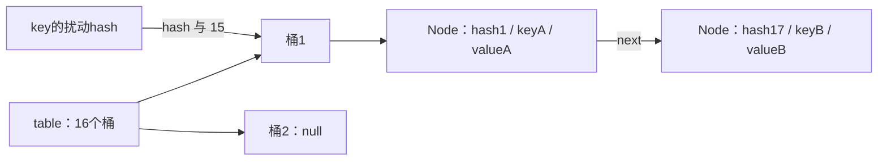

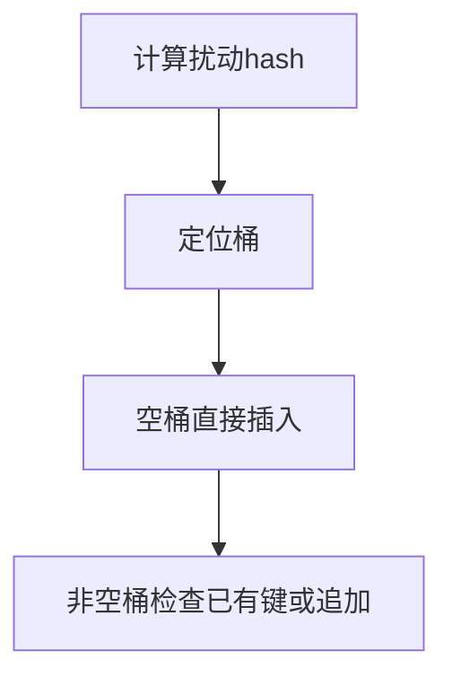

### 源码路径与解释

#### 源码1：static final int hash(Object key)


**HashMap·[L322–L341](https://github.com/openjdk/jdk8u/blob/943a5ea328fd2fc8eed0aed4ec9b1957d41f8144/jdk/src/share/classes/java/util/HashMap.java#L322-L341)**

> 连续节选；窗口可能止于方法中间，完整实现请看链接。未省改算法，缩进作了统一处理。

```java
/**
 * Computes key.hashCode() and spreads (XORs) higher bits of hash
 * to lower.  Because the table uses power-of-two masking, sets of
 * hashes that vary only in bits above the current mask will
 * always collide. (Among known examples are sets of Float keys
 * holding consecutive whole numbers in small tables.)  So we
 * apply a transform that spreads the impact of higher bits
 * downward. There is a tradeoff between speed, utility, and
 * quality of bit-spreading. Because many common sets of hashes
 * are already reasonably distributed (so don't benefit from
 * spreading), and because we use trees to handle large sets of
 * collisions in bins, we just XOR some shifted bits in the
 * cheapest possible way to reduce systematic lossage, as well as
 * to incorporate impact of the highest bits that would otherwise
 * never be used in index calculations because of table bounds.
 */
static final int hash(Object key) {
    int h;
    return (key == null) ? 0 : (h = key.hashCode()) ^ (h >>> 16);
}
```

null键的hash为0；非null键使用h^(h>>>16)。Node的hash字段记录扰动后的结果，供扩容和节点比较复用；普通get和put仍会计算本次传入key的hash。


#### 源码2：final V putVal(int hash, K key, V value, boolean onlyIfAbsent,


**HashMap·[L616–L659](https://github.com/openjdk/jdk8u/blob/943a5ea328fd2fc8eed0aed4ec9b1957d41f8144/jdk/src/share/classes/java/util/HashMap.java#L616-L659)**

> 连续节选；窗口可能止于方法中间，完整实现请看链接。未省改算法，缩进作了统一处理。

```java
/**
 * Implements Map.put and related methods.
 *
 * @param hash hash for key
 * @param key the key
 * @param value the value to put
 * @param onlyIfAbsent if true, don't change existing value
 * @param evict if false, the table is in creation mode.
 * @return previous value, or null if none
 */
final V putVal(int hash, K key, V value, boolean onlyIfAbsent,
               boolean evict) {
    Node<K,V>[] tab; Node<K,V> p; int n, i;
    if ((tab = table) == null || (n = tab.length) == 0)
        n = (tab = resize()).length;
    if ((p = tab[i = (n - 1) & hash]) == null)
        tab[i] = newNode(hash, key, value, null);
    else {
        Node<K,V> e; K k;
        if (p.hash == hash &&
            ((k = p.key) == key || (key != null && key.equals(k))))
            e = p;
        else if (p instanceof TreeNode)
            e = ((TreeNode<K,V>)p).putTreeVal(this, tab, hash, key, value);
        else {
            for (int binCount = 0; ; ++binCount) {
                if ((e = p.next) == null) {
                    p.next = newNode(hash, key, value, null);
                    if (binCount >= TREEIFY_THRESHOLD - 1) // -1 for 1st
                        treeifyBin(tab, hash);
                    break;
                }
                if (e.hash == hash &&
                    ((k = e.key) == key || (key != null && key.equals(k))))
                    break;
                p = e;
            }
        }
        if (e != null) { // existing mapping for key
            V oldValue = e.value;
            if (!onlyIfAbsent || oldValue == null)
                e.value = value;
            afterNodeAccess(e);
            return oldValue;
```

先确保table存在，然后处理空桶、首节点相等、树节点和普通链表。相等判断是hash相等且引用相同或equals成立。


#### 源码3：if (++size > threshold)


**HashMap·[L663–L666](https://github.com/openjdk/jdk8u/blob/943a5ea328fd2fc8eed0aed4ec9b1957d41f8144/jdk/src/share/classes/java/util/HashMap.java#L663-L666)**

> 连续节选；窗口可能止于方法中间，完整实现请看链接。未省改算法，缩进作了统一处理。

```java
if (++size > threshold)
    resize();
afterNodeInsertion(evict);
return null;
```

只有新增条目才走size增加，替换已有键的value不增加条目数。先插入再判断是否超过threshold；loadFactor不是“桶里能容纳几个节点”。


### 手工推演与使用边界

容量16时hash17与hash1都映射到桶1，因为17&15=1。若两个key不equals，链表保留两个条目；若相等则更新原条目value。null键也占一个真实条目。

- 平均O(1)依赖合理散列，不能当所有输入的严格最坏保证。
- 可变key若修改了参与hashCode/equals的字段，原条目可能无法按新键状态定位。
- HashMap无并发安全保证；JDK8避免了某些旧扩容机制问题，不等于可并发写。

put分成定位、匹配、插入、维护四步。hash缩小候选范围，equals确定逻辑键，threshold决定整体扩容。

<a id="topic-6-3"></a>
## 6.3 putVal逐分支解释，尤其看e和p

这段方法有两种结果：找到旧Entry，返回旧value；确实新增Entry，增加size并可能扩容。局部变量p主要导航当前节点，e在已有键路径中指向命中的节点。到链尾时e为null，追加新节点后走新增维护，所以“e是否非null”就是很重要的分流证据。

|代码段|读取或改变什么|为什么要这样|
|---|---|---|
|table为null或长度0|调用resize获得table|延迟分配|
|tab[i]为null|发布一个Node到桶槽|无碰撞快速路径|
|首节点hash与键匹配|e指向首节点|避免不必要遍历|
|p为TreeNode|委托putTreeVal|树桶有自己的查找与插入规则|
|链表中找到相等键|e指向旧节点|替换不能误算新增|
|p.next为null|在尾部接新Node|保留旧节点相对链序|
|e非null|可能改value，调用afterNodeAccess并返回|LinkedHashMap可通过钩子维护访问顺序|
|走到方法末尾|modCount和size增加|这是新增条目路径|

onlyIfAbsent不是“只要有Entry就永远不能改”：旧value为null时仍可写新value。evict传递给afterNodeInsertion，主要为继承结构维护提供上下文，不是HashMap自身内置LRU。


**HashMap·[L616–L667](https://github.com/openjdk/jdk8u/blob/943a5ea328fd2fc8eed0aed4ec9b1957d41f8144/jdk/src/share/classes/java/util/HashMap.java#L616-L667)**

> 连续节选；窗口可能止于方法中间，完整实现请看链接。未省改算法，缩进作了统一处理。

```java
/**
 * Implements Map.put and related methods.
 *
 * @param hash hash for key
 * @param key the key
 * @param value the value to put
 * @param onlyIfAbsent if true, don't change existing value
 * @param evict if false, the table is in creation mode.
 * @return previous value, or null if none
 */
final V putVal(int hash, K key, V value, boolean onlyIfAbsent,
               boolean evict) {
    Node<K,V>[] tab; Node<K,V> p; int n, i;
    if ((tab = table) == null || (n = tab.length) == 0)
        n = (tab = resize()).length;
    if ((p = tab[i = (n - 1) & hash]) == null)
        tab[i] = newNode(hash, key, value, null);
    else {
        Node<K,V> e; K k;
        if (p.hash == hash &&
            ((k = p.key) == key || (key != null && key.equals(k))))
            e = p;
        else if (p instanceof TreeNode)
            e = ((TreeNode<K,V>)p).putTreeVal(this, tab, hash, key, value);
        else {
            for (int binCount = 0; ; ++binCount) {
                if ((e = p.next) == null) {
                    p.next = newNode(hash, key, value, null);
                    if (binCount >= TREEIFY_THRESHOLD - 1) // -1 for 1st
                        treeifyBin(tab, hash);
                    break;
                }
                if (e.hash == hash &&
                    ((k = e.key) == key || (key != null && key.equals(k))))
                    break;
                p = e;
            }
        }
        if (e != null) { // existing mapping for key
            V oldValue = e.value;
            if (!onlyIfAbsent || oldValue == null)
                e.value = value;
            afterNodeAccess(e);
            return oldValue;
        }
    }
    ++modCount;
    if (++size > threshold)
        resize();
    afterNodeInsertion(evict);
    return null;
}
```

请把return oldValue与方法最后return null画成两个出口。第一条不增加size；第二条表示新增，但null返回也不能单独证明过去没有映射，因为旧值本来就可能为null。


<a id="topic-6-4"></a>
## 6.4 get、containsKey与null的歧义

HashMap允许null键和null值。get返回null有两种解释：没有该键；有该键但value就是null。containsKey通过是否存在Node判断，因此能区分。containsValue则不是按键散列定位，要检查条目内容。

查找先检查桶首，再分树桶和普通链。getNode依赖的是查询时重新计算的hash，节点保存的是插入时的hash。这个时间差解释了可变键的问题。


**HashMap·[L561–L586](https://github.com/openjdk/jdk8u/blob/943a5ea328fd2fc8eed0aed4ec9b1957d41f8144/jdk/src/share/classes/java/util/HashMap.java#L561-L586)**

> 连续节选；窗口可能止于方法中间，完整实现请看链接。未省改算法，缩进作了统一处理。

```java
/**
 * Implements Map.get and related methods.
 *
 * @param hash hash for key
 * @param key the key
 * @return the node, or null if none
 */
final Node<K,V> getNode(int hash, Object key) {
    Node<K,V>[] tab; Node<K,V> first, e; int n; K k;
    if ((tab = table) != null && (n = tab.length) > 0 &&
        (first = tab[(n - 1) & hash]) != null) {
        if (first.hash == hash && // always check first node
            ((k = first.key) == key || (key != null && key.equals(k))))
            return first;
        if ((e = first.next) != null) {
            if (first instanceof TreeNode)
                return ((TreeNode<K,V>)first).getTreeNode(hash, key);
            do {
                if (e.hash == hash &&
                    ((k = e.key) == key || (key != null && key.equals(k))))
                    return e;
            } while ((e = e.next) != null);
        }
    }
    return null;
}
```

首先校验首节点hash与键，树桶委托getTreeNode，普通链逐个检查。桶索引相同也只是候选范围相同，仍必须比较hash与键。

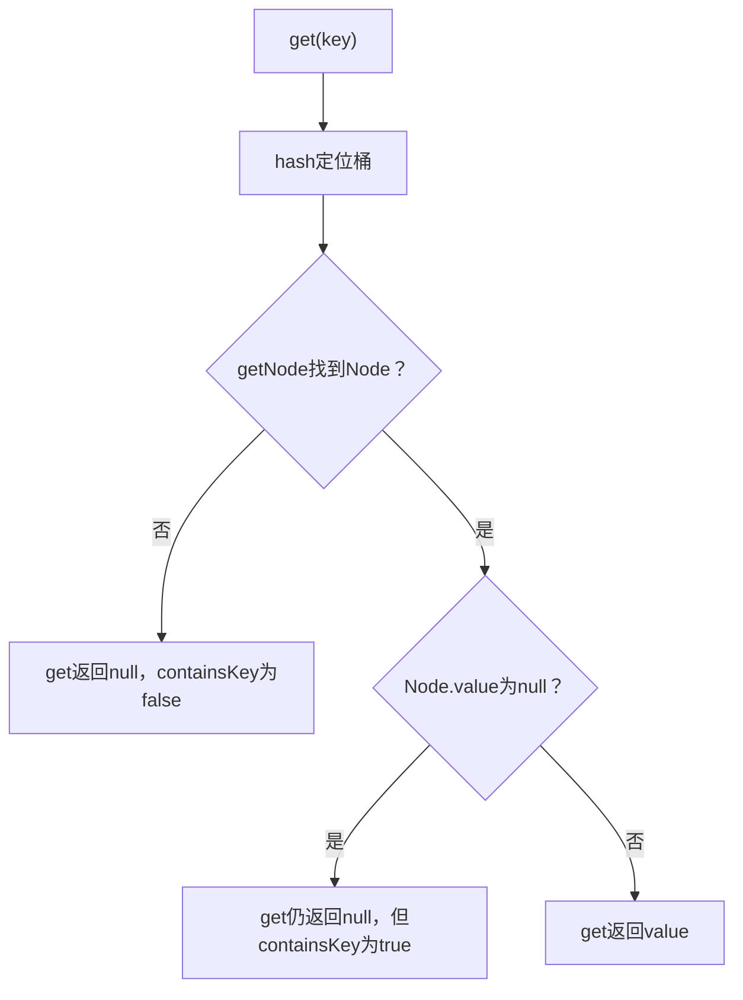

<a id="topic-6-5"></a>
## 6.5 容量增长与低高位拆分

扩容从n到2n，掩码只多了一个二进制位。已有节点保存了hash，只需检查hash&oldCap：零留在原桶，非零移到j+oldCap。这是位运算分流，不是重新调用key.hashCode。

### 字段关系与主干流程

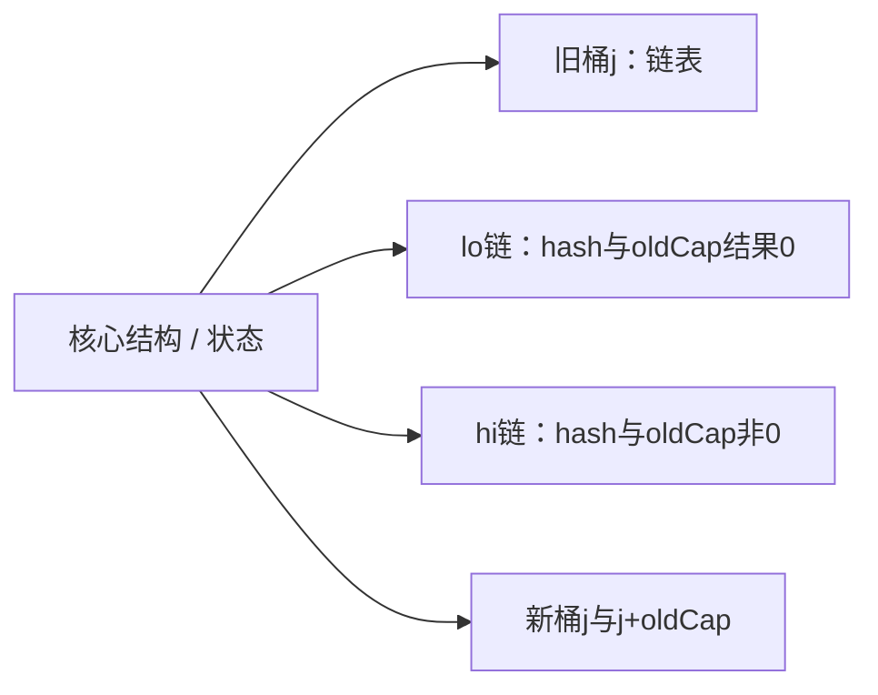

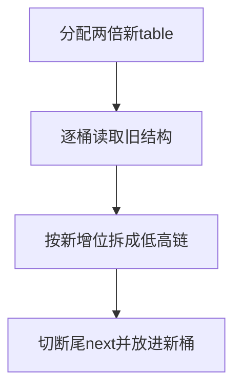

### 源码路径与解释

#### 源码1：final Node<K,V>[] resize()


**HashMap·[L669–L706](https://github.com/openjdk/jdk8u/blob/943a5ea328fd2fc8eed0aed4ec9b1957d41f8144/jdk/src/share/classes/java/util/HashMap.java#L669-L706)**

> 连续节选；窗口可能止于方法中间，完整实现请看链接。未省改算法，缩进作了统一处理。

```java
/**
 * Initializes or doubles table size.  If null, allocates in
 * accord with initial capacity target held in field threshold.
 * Otherwise, because we are using power-of-two expansion, the
 * elements from each bin must either stay at same index, or move
 * with a power of two offset in the new table.
 *
 * @return the table
 */
final Node<K,V>[] resize() {
    Node<K,V>[] oldTab = table;
    int oldCap = (oldTab == null) ? 0 : oldTab.length;
    int oldThr = threshold;
    int newCap, newThr = 0;
    if (oldCap > 0) {
        if (oldCap >= MAXIMUM_CAPACITY) {
            threshold = Integer.MAX_VALUE;
            return oldTab;
        }
        else if ((newCap = oldCap << 1) < MAXIMUM_CAPACITY &&
                 oldCap >= DEFAULT_INITIAL_CAPACITY)
            newThr = oldThr << 1; // double threshold
    }
    else if (oldThr > 0) // initial capacity was placed in threshold
        newCap = oldThr;
    else {               // zero initial threshold signifies using defaults
        newCap = DEFAULT_INITIAL_CAPACITY;
        newThr = (int)(DEFAULT_LOAD_FACTOR * DEFAULT_INITIAL_CAPACITY);
    }
    if (newThr == 0) {
        float ft = (float)newCap * loadFactor;
        newThr = (newCap < MAXIMUM_CAPACITY && ft < (float)MAXIMUM_CAPACITY ?
                  (int)ft : Integer.MAX_VALUE);
    }
    threshold = newThr;
    @SuppressWarnings({"rawtypes","unchecked"})
    Node<K,V>[] newTab = (Node<K,V>[])new Node[newCap];
    table = newTab;
```

读取旧容量与阈值，区分已存在table、预设threshold与默认初始化。达到最大容量时不能继续常规翻倍。


#### 源码2：Node<K,V> loHead = null, loTail = null;


**HashMap·[L717–L746](https://github.com/openjdk/jdk8u/blob/943a5ea328fd2fc8eed0aed4ec9b1957d41f8144/jdk/src/share/classes/java/util/HashMap.java#L717-L746)**

> 连续节选；窗口可能止于方法中间，完整实现请看链接。未省改算法，缩进作了统一处理。

```java
        Node<K,V> loHead = null, loTail = null;
        Node<K,V> hiHead = null, hiTail = null;
        Node<K,V> next;
        do {
            next = e.next;
            if ((e.hash & oldCap) == 0) {
                if (loTail == null)
                    loHead = e;
                else
                    loTail.next = e;
                loTail = e;
            }
            else {
                if (hiTail == null)
                    hiHead = e;
                else
                    hiTail.next = e;
                hiTail = e;
            }
        } while ((e = next) != null);
        if (loTail != null) {
            loTail.next = null;
            newTab[j] = loHead;
        }
        if (hiTail != null) {
            hiTail.next = null;
            newTab[j + oldCap] = hiHead;
        }
    }
}
```

遍历链时按hash&oldCap拆分，同时维持每条子链的原相对顺序。两个tail只在尾部追加。


#### 源码3：if (loTail != null)


**HashMap·[L737–L746](https://github.com/openjdk/jdk8u/blob/943a5ea328fd2fc8eed0aed4ec9b1957d41f8144/jdk/src/share/classes/java/util/HashMap.java#L737-L746)**

> 连续节选；窗口可能止于方法中间，完整实现请看链接。未省改算法，缩进作了统一处理。

```java
        if (loTail != null) {
            loTail.next = null;
            newTab[j] = loHead;
        }
        if (hiTail != null) {
            hiTail.next = null;
            newTab[j + oldCap] = hiHead;
        }
    }
}
```

尾节点next必须置null，避免低链与高链残留旧链接。新位置一条在j，一条在j+oldCap。树桶的split另走树结构逻辑。


### 手工推演与使用边界

旧容量16，旧桶1里hash值1、17、33、49。扩到32：1和33满足hash&16=0，仍在桶1；17和49移到桶17。两个子链内部顺序分别保持1→33与17→49。

- “rehash”常被口语化使用；本实现链表迁移不重新调用用户hashCode。
- 扩容复制数组并迁移结构，有成本，不是免费增长。
- 初始容量参数经2的幂调整，第一次分配与后续resize的条件不同。

容量翻倍只新增一个索引位，按该位把旧桶分成两条链，位置是j和j+oldCap；这是HashMap源码最值得手推的一段。

<a id="topic-6-6"></a>
## 6.6 扩容的位运算，按二进制亲手推

容量16的索引掩码是0000 1111，容量32的掩码是0001 1111，多看了值为16的那一位。原来落在同一桶的节点，只可能根据这一位分到两处。

|已保存的hash|低位二进制|旧索引hash&15|hash&16|新索引hash&31|
|---|---|---:|---:|---:|
|1|0000 0001|1|0|1|
|17|0001 0001|1|16|17|
|33|0010 0001|1|0|1|
|49|0011 0001|1|16|17|

旧链1→17→33→49，拆成低链1→33、高链17→49。loTail和hiTail各自尾插保留子链相对顺序，最后清next结束链。不是把每个节点用头插塞进新桶，也不是重新调用用户hashCode。

扩容时如果某个旧桶只有一个节点，可以直接按新掩码定位；链桶做低高分流；树桶调用split。因此不能把链桶迁移循环当作所有桶形态唯一处理过程。
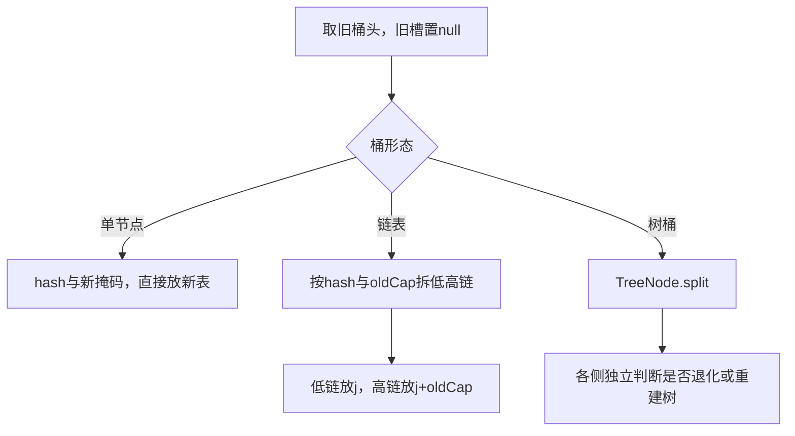

<a id="topic-6-7"></a>
## 6.7 树化、树桶结构与退化路径

树化要同时读三个地方：putVal的binCount、TREEIFY_THRESHOLD，以及treeifyBin中的MIN_TREEIFY_CAPACITY。常量8并不等于任意桶第8个元素一插入就树化；小table优先扩容。树结构还保留链式next，便于遍历和迁移。

### 字段关系与主干流程

```mermaid
flowchart LR
  R["核心结构 / 状态"]
  R --> M0["TREEIFY_THRESHOLD=8"]
  R --> M1["MIN_TREEIFY_CAPACITY=64"]
  R --> M2["TreeNode：树指针与链指针"]
  R --> M3["UNTREEIFY_THRESHOLD=6用于拆分判断"]
```

```mermaid
flowchart TD
  N0["链表追加新节点"]
  N1["检查binCount"]
  N2["容量小于64先resize"]
  N3["容量足够才转TreeNode并平衡"]
  N0 --> N1
  N1 --> N2
  N2 --> N3
```

### 源码路径与解释

#### 源码1：if (binCount >= TREEIFY_THRESHOLD - 1)


**HashMap·[L644–L648](https://github.com/openjdk/jdk8u/blob/943a5ea328fd2fc8eed0aed4ec9b1957d41f8144/jdk/src/share/classes/java/util/HashMap.java#L644-L648)**

> 连续节选；窗口可能止于方法中间，完整实现请看链接。未省改算法，缩进作了统一处理。

```java
    if (binCount >= TREEIFY_THRESHOLD - 1) // -1 for 1st
        treeifyBin(tab, hash);
    break;
}
if (e.hash == hash &&
```

binCount从桶首开始计数，遇到链尾并追加后才判断。普通put逐个累积到原已有8个节点时，再加入第9个节点触发这个分支。


#### 源码2：final void treeifyBin(Node<K,V>[] tab, int hash)


**HashMap·[L752–L775](https://github.com/openjdk/jdk8u/blob/943a5ea328fd2fc8eed0aed4ec9b1957d41f8144/jdk/src/share/classes/java/util/HashMap.java#L752-L775)**

> 连续节选；窗口可能止于方法中间，完整实现请看链接。未省改算法，缩进作了统一处理。

```java
/**
 * Replaces all linked nodes in bin at index for given hash unless
 * table is too small, in which case resizes instead.
 */
final void treeifyBin(Node<K,V>[] tab, int hash) {
    int n, index; Node<K,V> e;
    if (tab == null || (n = tab.length) < MIN_TREEIFY_CAPACITY)
        resize();
    else if ((e = tab[index = (n - 1) & hash]) != null) {
        TreeNode<K,V> hd = null, tl = null;
        do {
            TreeNode<K,V> p = replacementTreeNode(e, null);
            if (tl == null)
                hd = p;
            else {
                p.prev = tl;
                tl.next = p;
            }
            tl = p;
        } while ((e = e.next) != null);
        if ((tab[index] = hd) != null)
            hd.treeify(tab);
    }
}
```

容量不足64就resize；否则把Node换成TreeNode并连接prev/next，随后建红黑树。一次调用treeifyBin未必真正树化。


#### 源码3：final void split(HashMap<K,V> map, Node<K,V>[] tab, int index, int bit)


**HashMap·[L2152–L2207](https://github.com/openjdk/jdk8u/blob/943a5ea328fd2fc8eed0aed4ec9b1957d41f8144/jdk/src/share/classes/java/util/HashMap.java#L2152-L2207)**

> 连续节选；窗口可能止于方法中间，完整实现请看链接。未省改算法，缩进作了统一处理。

```java
/**
 * Splits nodes in a tree bin into lower and upper tree bins,
 * or untreeifies if now too small. Called only from resize;
 * see above discussion about split bits and indices.
 *
 * @param map the map
 * @param tab the table for recording bin heads
 * @param index the index of the table being split
 * @param bit the bit of hash to split on
 */
final void split(HashMap<K,V> map, Node<K,V>[] tab, int index, int bit) {
    TreeNode<K,V> b = this;
    // Relink into lo and hi lists, preserving order
    TreeNode<K,V> loHead = null, loTail = null;
    TreeNode<K,V> hiHead = null, hiTail = null;
    int lc = 0, hc = 0;
    for (TreeNode<K,V> e = b, next; e != null; e = next) {
        next = (TreeNode<K,V>)e.next;
        e.next = null;
        if ((e.hash & bit) == 0) {
            if ((e.prev = loTail) == null)
                loHead = e;
            else
                loTail.next = e;
            loTail = e;
            ++lc;
        }
        else {
            if ((e.prev = hiTail) == null)
                hiHead = e;
            else
                hiTail.next = e;
            hiTail = e;
            ++hc;
        }
    }

    if (loHead != null) {
        if (lc <= UNTREEIFY_THRESHOLD)
            tab[index] = loHead.untreeify(map);
        else {
            tab[index] = loHead;
            if (hiHead != null) // (else is already treeified)
                loHead.treeify(tab);
        }
    }
    if (hiHead != null) {
        if (hc <= UNTREEIFY_THRESHOLD)
            tab[index + bit] = hiHead.untreeify(map);
        else {
            tab[index + bit] = hiHead;
            if (loHead != null)
                hiHead.treeify(tab);
        }
    }
}
```

树桶扩容也按新增位拆成两组，统计每组数量，足够小时退化为链。普通删除的退化判断还涉及树形条件，不是所有路径都仅看数字6。


### 手工推演与使用边界

table容量64，连续放入hash相同且不equals的key：第8个放入后仍可为链表，第9个普通put触发树化。table容量16时同样的长链先促使扩容，不能从节点数量单独推断桶类型。

- “8树化、6退化”只是速记，必须附容量和具体路径。
- 无法合理比较的同hash键可能触发额外搜索，不能保证每种树桶查找都严格O(log n)。
- HashMap用instanceof TreeNode；CHM用TreeBin封装，二者结构不同。

说树化时给出操作路径：普通put追加、容量至少64、原链已有8个节点。再讲树桶迁移时的计数退化，避免只背常量。

<a id="topic-6-8"></a>
## 6.8 把树化触发的计数器数明白

binCount初始0。从原桶首走到已有链尾时，它等于“已有节点数减1”；随后接入新节点，再用binCount≥7判断是否请求treeifyBin。

|插入前已有节点|到原链尾时binCount|插入后节点数|是否请求treeifyBin|
|---:|---:|---:|---|
|6|5|7|否|
|7|6|8|否|
|8|7|9|是|
|9|8|10|若仍是链，则会再次请求|

请求树化还要看table长度。小于64先resize；只有容量足够才真正转换节点。所有键必须确实不相等；更新同一键不会让链长增长。这里说的是普通put的这条路径，不能把其他API的控制流程混为一谈。

再对比从默认构造开始的普通put路径：假设所有键的扰动hash相同、彼此不equals，且没有其他操作干扰，第1次初始化容量16；第9次请求树化但容量不足，扩到32；第10次再次请求并扩到64；第11次才真正树化。这是按源码分支手工推演，不能与“初始容量已为64时，第9次树化”混在一起。

|起始情况|第9次碰撞追加|第10次|第11次|
|---|---|---|---|
|默认构造，首次分配16|resize到32|resize到64|树化|
|初始目标容量64|树化|在树桶操作|在树桶操作|

红黑树需要保证根黑、红节点没有红孩子、到叶端的黑节点数一致等性质，通过染色与旋转控制树高。但这并不意味着HashMap为所有极端键提供严格O(log n)查找。

<a id="topic-6-9"></a>
## 6.9 树桶如何比较，为什么还保留next

TreeNode同时含parent/left/right/red等树字段，以及继承的next与自己的prev链字段。树用于定位，链仍用于遍历和拆分；把桶头挪成根时也要修补桶链。

hash不同可以直接决定向左或向右；hash相同且equals匹配就返回。若键有可用的Comparable顺序，按该顺序分支；如果无法区分方向，find可能递归搜索一侧，再查另一侧。插入时tieBreakOrder帮助安排结构，不能用身份hash直接替代业务equals查询。


**HashMap·[L1877–L1907](https://github.com/openjdk/jdk8u/blob/943a5ea328fd2fc8eed0aed4ec9b1957d41f8144/jdk/src/share/classes/java/util/HashMap.java#L1877-L1907)**

> 连续节选；窗口可能止于方法中间，完整实现请看链接。未省改算法，缩进作了统一处理。

```java
/**
 * Finds the node starting at root p with the given hash and key.
 * The kc argument caches comparableClassFor(key) upon first use
 * comparing keys.
 */
final TreeNode<K,V> find(int h, Object k, Class<?> kc) {
    TreeNode<K,V> p = this;
    do {
        int ph, dir; K pk;
        TreeNode<K,V> pl = p.left, pr = p.right, q;
        if ((ph = p.hash) > h)
            p = pl;
        else if (ph < h)
            p = pr;
        else if ((pk = p.key) == k || (k != null && k.equals(pk)))
            return p;
        else if (pl == null)
            p = pr;
        else if (pr == null)
            p = pl;
        else if ((kc != null ||
                  (kc = comparableClassFor(k)) != null) &&
                 (dir = compareComparables(kc, k, pk)) != 0)
            p = (dir < 0) ? pl : pr;
        else if ((q = pr.find(h, k, kc)) != null)
            return q;
        else
            p = pl;
    } while (p != null);
    return null;
}
```

最后两个搜索分支说明：同hash且没有可用比较方向时，查找不能始终只走单一路径。树平衡与查找可判向是不同条件。


**HashMap·[L1916–L1931](https://github.com/openjdk/jdk8u/blob/943a5ea328fd2fc8eed0aed4ec9b1957d41f8144/jdk/src/share/classes/java/util/HashMap.java#L1916-L1931)**

> 连续节选；窗口可能止于方法中间，完整实现请看链接。未省改算法，缩进作了统一处理。

```java
/**
 * Tie-breaking utility for ordering insertions when equal
 * hashCodes and non-comparable. We don't require a total
 * order, just a consistent insertion rule to maintain
 * equivalence across rebalancings. Tie-breaking further than
 * necessary simplifies testing a bit.
 */
static int tieBreakOrder(Object a, Object b) {
    int d;
    if (a == null || b == null ||
        (d = a.getClass().getName().
         compareTo(b.getClass().getName())) == 0)
        d = (System.identityHashCode(a) <= System.identityHashCode(b) ?
             -1 : 1);
    return d;
}
```

先看类名，再用identityHashCode辅助打破插入方向的平局。这是结构安排工具，不是Map逻辑键相等规则。

```mermaid
flowchart LR
 T["TreeNode"] --> P["parent / left / right / red：树定位"]
 T --> L["prev / next：桶内双向连接"]
 P --> F["查找与平衡"]
 L --> I["遍历与扩容拆分"]
 K["hash同且无法比较"] --> R["find可能搜索两侧"]
```

<a id="topic-6-10"></a>
## 6.10 remove如何断链，退化为什么不只看6

removeNode先像查找一样定位目标。删除普通桶首要改table[index]；删除中间节点要改前驱p.next。删除树节点需要同时维护桶链和树平衡。只有确实删掉条目才减少size与增加modCount。

matchValue=true的路径还要核对旧value，用于remove(key,value)；普通remove(key)无需匹配value。movable=false可让迭代器删除避免某些结构移动，影响树桶删除维护分支。


**HashMap·[L804–L853](https://github.com/openjdk/jdk8u/blob/943a5ea328fd2fc8eed0aed4ec9b1957d41f8144/jdk/src/share/classes/java/util/HashMap.java#L804-L853)**

> 连续节选；窗口可能止于方法中间，完整实现请看链接。未省改算法，缩进作了统一处理。

```java
/**
 * Implements Map.remove and related methods.
 *
 * @param hash hash for key
 * @param key the key
 * @param value the value to match if matchValue, else ignored
 * @param matchValue if true only remove if value is equal
 * @param movable if false do not move other nodes while removing
 * @return the node, or null if none
 */
final Node<K,V> removeNode(int hash, Object key, Object value,
                           boolean matchValue, boolean movable) {
    Node<K,V>[] tab; Node<K,V> p; int n, index;
    if ((tab = table) != null && (n = tab.length) > 0 &&
        (p = tab[index = (n - 1) & hash]) != null) {
        Node<K,V> node = null, e; K k; V v;
        if (p.hash == hash &&
            ((k = p.key) == key || (key != null && key.equals(k))))
            node = p;
        else if ((e = p.next) != null) {
            if (p instanceof TreeNode)
                node = ((TreeNode<K,V>)p).getTreeNode(hash, key);
            else {
                do {
                    if (e.hash == hash &&
                        ((k = e.key) == key ||
                         (key != null && key.equals(k)))) {
                        node = e;
                        break;
                    }
                    p = e;
                } while ((e = e.next) != null);
            }
        }
        if (node != null && (!matchValue || (v = node.value) == value ||
                             (value != null && value.equals(v)))) {
            if (node instanceof TreeNode)
                ((TreeNode<K,V>)node).removeTreeNode(this, tab, movable);
            else if (node == p)
                tab[index] = node.next;
            else
                p.next = node.next;
            ++modCount;
            --size;
            afterNodeRemoval(node);
            return node;
        }
    }
    return null;
}
```

node定位目标，p在普通链中保留前驱。删除分支区分树节点、桶首和链中节点，并调用afterNodeRemoval给LinkedHashMap等继承者清理顺序链。


**HashMap·[L2044–L2079](https://github.com/openjdk/jdk8u/blob/943a5ea328fd2fc8eed0aed4ec9b1957d41f8144/jdk/src/share/classes/java/util/HashMap.java#L2044-L2079)**

> 连续节选；窗口可能止于方法中间，完整实现请看链接。未省改算法，缩进作了统一处理。

```java
/**
 * Removes the given node, that must be present before this call.
 * This is messier than typical red-black deletion code because we
 * cannot swap the contents of an interior node with a leaf
 * successor that is pinned by "next" pointers that are accessible
 * independently during traversal. So instead we swap the tree
 * linkages. If the current tree appears to have too few nodes,
 * the bin is converted back to a plain bin. (The test triggers
 * somewhere between 2 and 6 nodes, depending on tree structure).
 */
final void removeTreeNode(HashMap<K,V> map, Node<K,V>[] tab,
                          boolean movable) {
    int n;
    if (tab == null || (n = tab.length) == 0)
        return;
    int index = (n - 1) & hash;
    TreeNode<K,V> first = (TreeNode<K,V>)tab[index], root = first, rl;
    TreeNode<K,V> succ = (TreeNode<K,V>)next, pred = prev;
    if (pred == null)
        tab[index] = first = succ;
    else
        pred.next = succ;
    if (succ != null)
        succ.prev = pred;
    if (first == null)
        return;
    if (root.parent != null)
        root = root.root();
    if (root == null
        || (movable
            && (root.right == null
                || (rl = root.left) == null
                || rl.left == null))) {
        tab[index] = first.untreeify(map);  // too small
        return;
    }
```

这里的退化条件检查root.right、root.left与其left等树形信息，同时受movable控制；不是简单数节点后统一判断≤6。扩容split才明确使用UNTREEIFY_THRESHOLD进行各侧数量判断。

```mermaid
flowchart TD
 A["找到待删除Node"] --> B{"是否树节点？"}
 B -- 是 --> T["修补桶链与红黑树，按路径考虑退化"]
 B -- 否 --> C{"是否桶首？"}
 C -- 是 --> H["table[index]=node.next"]
 C -- 否 --> P["前驱.next=node.next"]
 T --> E["size减1，modCount加1，删除钩子"]
 H --> E
 P --> E
```

<a id="topic-6-11"></a>
## 6.11 可变key、modCount与容量估算

**可变key推演：**键插入时hash为1，Node保存在桶1。修改参与hashCode的字段后，查询得到hash2，查找桶2，原Entry仍存在却查不到。即便偶然新旧hash落在同一桶，节点hash匹配仍可能失败。这不是HashMap丢弃了数据，而是键契约被破坏。

**modCount推演：**已有键替换value通常不算结构新增，不走新增的modCount增加；插入新键或成功删除改变结构。迭代器的expectedModCount不一致可触发fail-fast，但它不建立线程安全或稳定快照。

**容量估算：**希望放入N个键且默认负载因子0.75下不发生一般条目数触发扩容，可以从ceil(N/0.75)估计初始容量，再由实现调成2的幂。N=100时估计134，实际目标长度256、阈值192。碰撞过多触发的扩容、最大容量与数值边界还要单独考虑，不能把这个估算当绝对承诺。

**遍历成本：**HashMap遍历通常需要扫桶数组与节点，约与capacity+size有关。把初始容量设置得极大即使少扩容，也会增加稀疏桶扫描与数组内存。选择容量是在增长成本与常驻成本之间权衡。


**HashMap·[L1445–L1467](https://github.com/openjdk/jdk8u/blob/943a5ea328fd2fc8eed0aed4ec9b1957d41f8144/jdk/src/share/classes/java/util/HashMap.java#L1445-L1467)**

> 连续节选；窗口可能止于方法中间，完整实现请看链接。未省改算法，缩进作了统一处理。

```java
abstract class HashIterator {
    Node<K,V> next;        // next entry to return
    Node<K,V> current;     // current entry
    int expectedModCount;  // for fast-fail
    int index;             // current slot

    HashIterator() {
        expectedModCount = modCount;
        Node<K,V>[] t = table;
        current = next = null;
        index = 0;
        if (t != null && size > 0) { // advance to first entry
            do {} while (index < t.length && (next = t[index++]) == null);
        }
    }

    public final boolean hasNext() {
        return next != null;
    }

    final Node<K,V> nextNode() {
        Node<K,V>[] t;
        Node<K,V> e = next;
```

迭代器保存expectedModCount与当前桶索引，通过table逐桶寻找next。读这段可以直接看到为什么稀疏的大table仍影响遍历。


<a id="topic-6-12"></a>
## 6.12 完整生命周期复述

默认构造暂不分配table；首次put计算hash并初始化，找到桶后匹配或插入；新增维护size和modCount，按数量或碰撞路径维护容量与桶形态；get按当前hash重新定位并用键相等确认；remove定位后断链或维护树；迭代器扫描桶并检查结构修改计数。

记忆时把hash、桶索引、键相等三件事拆开，把数量扩容与碰撞树化两套触发条件拆开，把树桶拆分退化与普通树删除退化两条路径拆开。这样面对追问就能回到具体代码，而不是继续补速记口号。

<a id="chapter-7"></a>
# 7. HashSet：复用HashMap完成去重

**本章阅读顺序**

- [HashSet：用键实现去重](#topic-7-1)
- [返回值为何依赖PRESENT哨兵](#topic-7-2)

<a id="topic-7-1"></a>
## 7.1 HashSet：用键实现去重

HashSet把元素当HashMap键，用统一的PRESENT对象作值。数据结构与去重判断来自底层Map。

### 字段关系与主干流程

```mermaid
flowchart LR
  R["核心结构 / 状态"]
  R --> M0["HashSet"]
  R --> M1["HashMap：元素作key"]
  R --> M2["PRESENT：统一非null value"]
```

```mermaid
flowchart TD
  N0["add调用map.put"]
  N1["根据旧value判断此前是否存在"]
  N2["返回是否新增"]
  N0 --> N1
  N1 --> N2
```

### 源码路径与解释

#### 源码1：public boolean add(E e)


**HashSet·[L207–L221](https://github.com/openjdk/jdk8u/blob/943a5ea328fd2fc8eed0aed4ec9b1957d41f8144/jdk/src/share/classes/java/util/HashSet.java#L207-L221)**

> 连续节选；窗口可能止于方法中间，完整实现请看链接。未省改算法，缩进作了统一处理。

```java
/**
 * Adds the specified element to this set if it is not already present.
 * More formally, adds the specified element <tt>e</tt> to this set if
 * this set contains no element <tt>e2</tt> such that
 * <tt>(e==null&nbsp;?&nbsp;e2==null&nbsp;:&nbsp;e.equals(e2))</tt>.
 * If this set already contains the element, the call leaves the set
 * unchanged and returns <tt>false</tt>.
 *
 * @param e element to be added to this set
 * @return <tt>true</tt> if this set did not already contain the specified
 * element
 */
public boolean add(E e) {
    return map.put(e, PRESENT)==null;
}
```

put返回null表示此前没有此键，add才返回true。所有键对应同一个PRESENT，HashSet无需再维护另一份value语义。


### 手工推演与使用边界

先add(A)返回true，再add与A相等的B返回false，逻辑元素数不增加。决定相等的是键契约，而不是两个引用是否指向同一对象。

- 元素的hashCode与equals应稳定一致。
- 不保证顺序，且没有内建并发安全保证。

HashSet是键去重的组合复用，先理解HashMap再读Set会更快。

<a id="topic-7-2"></a>
## 7.2 返回值为何依赖PRESENT哨兵

HashSet不需要存一份与元素不同的业务value，所以所有键都映射到同一个非null PRESENT对象。map.put返回null说明以前没有该键，add返回true；若旧值就是PRESENT，则元素已存在，返回false。

允许null元素，因为底层HashMap支持null键。Set不保证插入顺序；若键对象后来改变hashCode/equals，contains/remove可能遇到与HashMap相同的问题。集合去重必须建立在稳定、相互一致的键契约上。


**HashSet·[L223–L237](https://github.com/openjdk/jdk8u/blob/943a5ea328fd2fc8eed0aed4ec9b1957d41f8144/jdk/src/share/classes/java/util/HashSet.java#L223-L237)**

> 连续节选；窗口可能止于方法中间，完整实现请看链接。未省改算法，缩进作了统一处理。

```java
/**
 * Removes the specified element from this set if it is present.
 * More formally, removes an element <tt>e</tt> such that
 * <tt>(o==null&nbsp;?&nbsp;e==null&nbsp;:&nbsp;o.equals(e))</tt>,
 * if this set contains such an element.  Returns <tt>true</tt> if
 * this set contained the element (or equivalently, if this set
 * changed as a result of the call).  (This set will not contain the
 * element once the call returns.)
 *
 * @param o object to be removed from this set, if present
 * @return <tt>true</tt> if the set contained the specified element
 */
public boolean remove(Object o) {
    return map.remove(o)==PRESENT;
}
```

remove通过返回值是否为PRESENT判断删除是否确实发生，复用底层Map的查找与断链。


<a id="chapter-8"></a>
# 8. LinkedHashMap：散列定位、顺序维护与LRU钩子

**本章阅读顺序**

- [LinkedHashMap：桶索引与顺序链同时维护](#topic-8-1)
- [一份Entry同时属于两个索引结构](#topic-8-2)

<a id="topic-8-1"></a>
## 8.1 LinkedHashMap：桶索引与顺序链同时维护

LinkedHashMap保留HashMap定位能力，并增加before/after全局双向链，维护插入或访问顺序。

### 字段关系与主干流程

```mermaid
flowchart LR
  R["核心结构 / 状态"]
  R --> M0["散列桶"]
  R --> M1["Entry.before与after"]
  R --> M2["head与tail"]
  R --> M3["accessOrder"]
```

```mermaid
flowchart TD
  N0["散列定位条目"]
  N1["访问顺序模式按需移到tail"]
  N2["新增后检查淘汰钩子"]
  N0 --> N1
  N1 --> N2
```

### 源码路径与解释

#### 源码1：void afterNodeAccess(Node<K,V> e)


**LinkedHashMap·[L305–L328](https://github.com/openjdk/jdk8u/blob/943a5ea328fd2fc8eed0aed4ec9b1957d41f8144/jdk/src/share/classes/java/util/LinkedHashMap.java#L305-L328)**

> 连续节选；窗口可能止于方法中间，完整实现请看链接。未省改算法，缩进作了统一处理。

```java
void afterNodeAccess(Node<K,V> e) { // move node to last
    LinkedHashMap.Entry<K,V> last;
    if (accessOrder && (last = tail) != e) {
        LinkedHashMap.Entry<K,V> p =
            (LinkedHashMap.Entry<K,V>)e, b = p.before, a = p.after;
        p.after = null;
        if (b == null)
            head = a;
        else
            b.after = a;
        if (a != null)
            a.before = b;
        else
            last = b;
        if (last == null)
            head = p;
        else {
            p.before = last;
            last.after = p;
        }
        tail = p;
        ++modCount;
    }
}
```

accessOrder打开时，把访问节点从原位置摘下移到tail，并更新modCount。因此访问顺序模式的get也可能是结构修改。


#### 源码2：void afterNodeInsertion(boolean evict)


**LinkedHashMap·[L297–L303](https://github.com/openjdk/jdk8u/blob/943a5ea328fd2fc8eed0aed4ec9b1957d41f8144/jdk/src/share/classes/java/util/LinkedHashMap.java#L297-L303)**

> 连续节选；窗口可能止于方法中间，完整实现请看链接。未省改算法，缩进作了统一处理。

```java
void afterNodeInsertion(boolean evict) { // possibly remove eldest
    LinkedHashMap.Entry<K,V> first;
    if (evict && (first = head) != null && removeEldestEntry(first)) {
        K key = first.key;
        removeNode(hash(key), key, null, false, true);
    }
}
```

新节点插入后检查removeEldestEntry。默认返回false；继承并覆盖该方法可做简单容量淘汰，但完整缓存还需考虑同步和过期策略。


### 手工推演与使用边界

访问顺序A→B→C，get(A)后B→C→A；容量限制3，再插D可淘汰B。插入顺序模式get不自动挪动。

- 访问顺序get可能是结构修改。
- LRU钩子不自动提供线程安全与过期管理。

一份Entry属于桶和全局链两种结构，定位与迭代顺序分开维护。

<a id="topic-8-2"></a>
## 8.2 一份Entry同时属于两个索引结构

散列桶按hash定位，before/after全局链按迭代顺序连接。同一条目不是复制成两份数据，而是在继承节点上增加额外链接。删除时既要从桶中去掉，也要在afterNodeRemoval钩子修补顺序链；扩容改变桶分布，不需要因此打乱全局访问或插入顺序。

访问顺序模式中get命中可能把条目移到tail，若它本来就在tail则无需移动。get未命中不会创建条目。以size>容量覆盖removeEldestEntry可做简单LRU，但与其他线程并发读写、按时间过期、加载失败处理都不在这个钩子的基本保证中。


**LinkedHashMap·[L283–L295](https://github.com/openjdk/jdk8u/blob/943a5ea328fd2fc8eed0aed4ec9b1957d41f8144/jdk/src/share/classes/java/util/LinkedHashMap.java#L283-L295)**

> 连续节选；窗口可能止于方法中间，完整实现请看链接。未省改算法，缩进作了统一处理。

```java
void afterNodeRemoval(Node<K,V> e) { // unlink
    LinkedHashMap.Entry<K,V> p =
        (LinkedHashMap.Entry<K,V>)e, b = p.before, a = p.after;
    p.before = p.after = null;
    if (b == null)
        head = a;
    else
        b.after = a;
    if (a == null)
        tail = b;
    else
        a.before = b;
}
```

从before/after两侧修补，遇首尾则更新head/tail；这与HashMap删除桶节点是两套维护。


<a id="chapter-9"></a>
# 9. TreeMap：键比较与红黑树平衡

**本章阅读顺序**

- [TreeMap：比较关系与红黑树](#topic-9-1)
- [compare为0定义键等价，红黑树控制高度](#topic-9-2)

<a id="topic-9-1"></a>
## 9.1 TreeMap：比较关系与红黑树

TreeMap按Comparator或自然顺序定位键。红黑树的平衡约束控制高度，比较结果为0意味着键等价。

### 字段关系与主干流程

```mermaid
flowchart LR
  R["核心结构 / 状态"]
  R --> M0["root"]
  R --> M1["Entry.left与right"]
  R --> M2["Entry.parent与color"]
  R --> M3["Comparator或Comparable"]
```

```mermaid
flowchart TD
  N0["沿比较结果定位"]
  N1["相等则替换value"]
  N2["新键插入节点"]
  N3["fixAfterInsertion修复"]
  N0 --> N1
  N1 --> N2
  N2 --> N3
```

### 源码路径与解释

#### 源码1：public V put(K key, V value)


**TreeMap·[L517–L568](https://github.com/openjdk/jdk8u/blob/943a5ea328fd2fc8eed0aed4ec9b1957d41f8144/jdk/src/share/classes/java/util/TreeMap.java#L517-L568)**

> 连续节选；窗口可能止于方法中间，完整实现请看链接。未省改算法，缩进作了统一处理。

```java
/**
 * Associates the specified value with the specified key in this map.
 * If the map previously contained a mapping for the key, the old
 * value is replaced.
 *
 * @param key key with which the specified value is to be associated
 * @param value value to be associated with the specified key
 *
 * @return the previous value associated with {@code key}, or
 *         {@code null} if there was no mapping for {@code key}.
 *         (A {@code null} return can also indicate that the map
 *         previously associated {@code null} with {@code key}.)
 * @throws ClassCastException if the specified key cannot be compared
 *         with the keys currently in the map
 * @throws NullPointerException if the specified key is null
 *         and this map uses natural ordering, or its comparator
 *         does not permit null keys
 */
public V put(K key, V value) {
    Entry<K,V> t = root;
    if (t == null) {
        compare(key, key); // type (and possibly null) check

        root = new Entry<>(key, value, null);
        size = 1;
        modCount++;
        return null;
    }
    int cmp;
    Entry<K,V> parent;
    // split comparator and comparable paths
    Comparator<? super K> cpr = comparator;
    if (cpr != null) {
        do {
            parent = t;
            cmp = cpr.compare(key, t.key);
            if (cmp < 0)
                t = t.left;
            else if (cmp > 0)
                t = t.right;
            else
                return t.setValue(value);
        } while (t != null);
    }
    else {
        if (key == null)
            throw new NullPointerException();
        @SuppressWarnings("unchecked")
            Comparable<? super K> k = (Comparable<? super K>) key;
        do {
            parent = t;
            cmp = k.compareTo(t.key);
```

比较结果为0时替换原value，不再新增键。TreeMap键身份取决于比较关系，与HashMap的hash/equals路径不同。


### 手工推演与使用边界

比较器只看年龄：同年龄的不同姓名对象可能视为同一键。先检查比较契约，再推断Map能保存几项。

- 自然排序不支持null键；自定义比较器另行判断。
- 比较顺序应与equals一致。

TreeMap用比较关系组织键，用染色与旋转维持红黑树约束。

<a id="topic-9-2"></a>
## 9.2 compare为0定义键等价，红黑树控制高度

TreeMap查找与插入都沿Comparator或Comparable结果走左右子树，比较为0就定位已有键。HashMap先hash再equals，两种Map的键契约不能互换。比较器若仅比较年龄，两个姓名不同但年龄相同的对象可能只保留一个映射。

红黑树维护颜色与黑高度约束。插入新节点时可能把父与叔重新染色，也可能围绕祖父旋转；目的是修复红父红子等违例，而不是每次插入都重建整棵树。能讲清触发条件和不变量即可，旋转细节可继续读fixAfterInsertion。


**TreeMap·[L2256–L2291](https://github.com/openjdk/jdk8u/blob/943a5ea328fd2fc8eed0aed4ec9b1957d41f8144/jdk/src/share/classes/java/util/TreeMap.java#L2256-L2291)**

> 连续节选；窗口可能止于方法中间，完整实现请看链接。未省改算法，缩进作了统一处理。

```java
/** From CLR */
private void fixAfterInsertion(Entry<K,V> x) {
    x.color = RED;

    while (x != null && x != root && x.parent.color == RED) {
        if (parentOf(x) == leftOf(parentOf(parentOf(x)))) {
            Entry<K,V> y = rightOf(parentOf(parentOf(x)));
            if (colorOf(y) == RED) {
                setColor(parentOf(x), BLACK);
                setColor(y, BLACK);
                setColor(parentOf(parentOf(x)), RED);
                x = parentOf(parentOf(x));
            } else {
                if (x == rightOf(parentOf(x))) {
                    x = parentOf(x);
                    rotateLeft(x);
                }
                setColor(parentOf(x), BLACK);
                setColor(parentOf(parentOf(x)), RED);
                rotateRight(parentOf(parentOf(x)));
            }
        } else {
            Entry<K,V> y = leftOf(parentOf(parentOf(x)));
            if (colorOf(y) == RED) {
                setColor(parentOf(x), BLACK);
                setColor(y, BLACK);
                setColor(parentOf(parentOf(x)), RED);
                x = parentOf(parentOf(x));
            } else {
                if (x == leftOf(parentOf(x))) {
                    x = parentOf(x);
                    rotateRight(x);
                }
                setColor(parentOf(x), BLACK);
                setColor(parentOf(parentOf(x)), RED);
                rotateLeft(parentOf(parentOf(x)));
```

新节点先染红；父为红才进入修复。叔红时改变颜色并上推，其他分支通过旋转调整局部结构。


<a id="chapter-10"></a>
# 10. PriorityQueue：数组堆、上浮与下沉

**本章阅读顺序**

- [PriorityQueue：数组堆只维护局部优先关系](#topic-10-1)
- [上浮与下沉的数组下标推演](#topic-10-2)

<a id="topic-10-1"></a>
## 10.1 PriorityQueue：数组堆只维护局部优先关系

PriorityQueue用数组表示二叉堆。根为最高优先级，数组其他位置不保证完整有序。

### 字段关系与主干流程

```mermaid
flowchart LR
  R["核心结构 / 状态"]
  R --> M0["Object[] queue"]
  R --> M1["size"]
  R --> M2["父索引与孩子索引"]
  R --> M3["Comparator或Comparable"]
```

```mermaid
flowchart TD
  N0["offer尾部插入上浮"]
  N1["peek读取根"]
  N2["poll移根并补尾元素"]
  N3["siftDown恢复堆约束"]
  N0 --> N1
  N1 --> N2
  N2 --> N3
```

### 源码路径与解释

#### 源码1：private void siftUpComparable(int k, E x)


**PriorityQueue·[L650–L662](https://github.com/openjdk/jdk8u/blob/943a5ea328fd2fc8eed0aed4ec9b1957d41f8144/jdk/src/share/classes/java/util/PriorityQueue.java#L650-L662)**

> 连续节选；窗口可能止于方法中间，完整实现请看链接。未省改算法，缩进作了统一处理。

```java
@SuppressWarnings("unchecked")
private void siftUpComparable(int k, E x) {
    Comparable<? super E> key = (Comparable<? super E>) x;
    while (k > 0) {
        int parent = (k - 1) >>> 1;
        Object e = queue[parent];
        if (key.compareTo((E) e) >= 0)
            break;
        queue[k] = e;
        k = parent;
    }
    queue[k] = key;
}
```

父索引是(k-1)>>>1。小根堆中只要x比父小就把父搬下来，直到找到合适位置。


#### 源码2：public E poll()


**PriorityQueue·[L585–L597](https://github.com/openjdk/jdk8u/blob/943a5ea328fd2fc8eed0aed4ec9b1957d41f8144/jdk/src/share/classes/java/util/PriorityQueue.java#L585-L597)**

> 连续节选；窗口可能止于方法中间，完整实现请看链接。未省改算法，缩进作了统一处理。

```java
@SuppressWarnings("unchecked")
public E poll() {
    if (size == 0)
        return null;
    int s = --size;
    modCount++;
    E result = (E) queue[0];
    E x = (E) queue[s];
    queue[s] = null;
    if (s != 0)
        siftDown(0, x);
    return result;
}
```

移走根，尾元素补位后siftDown。堆操作O(log n)，peek看根O(1)，遍历底层数组不能得到全排序结果。


### 手工推演与使用边界

数组[1,3,2,7,4]是合法小根堆，但不是全排序。要看有序出队结果，应理解反复poll的堆维护过程。

- 不支持null。
- 同优先级不保证稳定顺序，迭代不是排序结果。

堆只约束父子关系，入队上浮、出队下沉，常规offer/poll为对数级。

<a id="topic-10-2"></a>
## 10.2 上浮与下沉的数组下标推演

数组中父位置为(i-1)/2，子位置为2i+1和2i+2。offer先在逻辑尾部放新元素，再让它沿父链上浮；poll删根，用原尾元素补根，再与较小孩子交换式搬移直到局部约束恢复。

|数组|局部堆约束|是不是全排序|
|---|---|---|
|[1,3,2,7,4]|每个父不大于孩子|不是，3仍在2前|
|poll后从[4,3,2,7]开始修复|根4应与较小孩子2调整|最后仍只保证堆约束|

迭代器走数组位置不是连续poll，因此遍历结果并非优先级顺序。remove(Object)还要先定位元素，不能只看堆修复就宣称任意删除都是O(log n)。


**PriorityQueue·[L692–L709](https://github.com/openjdk/jdk8u/blob/943a5ea328fd2fc8eed0aed4ec9b1957d41f8144/jdk/src/share/classes/java/util/PriorityQueue.java#L692-L709)**

> 连续节选；窗口可能止于方法中间，完整实现请看链接。未省改算法，缩进作了统一处理。

```java
@SuppressWarnings("unchecked")
private void siftDownComparable(int k, E x) {
    Comparable<? super E> key = (Comparable<? super E>)x;
    int half = size >>> 1;        // loop while a non-leaf
    while (k < half) {
        int child = (k << 1) + 1; // assume left child is least
        Object c = queue[child];
        int right = child + 1;
        if (right < size &&
            ((Comparable<? super E>) c).compareTo((E) queue[right]) > 0)
            c = queue[child = right];
        if (key.compareTo((E) c) <= 0)
            break;
        queue[k] = c;
        k = child;
    }
    queue[k] = key;
}
```

先选较小孩子，再比较x是否已不大于该孩子；只沿一条高度为对数级的路径下沉。


<a id="chapter-11"></a>
# 11. ConcurrentHashMap：读写、协作扩容、计数与计算

**本章阅读顺序**

- [初始化竞争、负hash节点和sizeCtl](#topic-11-1)
- [普通读写与桶头协调](#topic-11-2)
- [锁桶前后的两个世界](#topic-11-3)
- [ForwardingNode与协作迁移](#topic-11-4)
- [迁移完成不是只改table引用](#topic-11-5)
- [分散计数与compute边界](#topic-11-6)
- [computeIfAbsent与缓存值的生命周期](#topic-11-7)

- [11.8 初始化权的CAS与table发布：不用全局锁初始化所有写入](#topic-11-8)
- [11.9 TreeBin的读协调：get不锁桶头，不等于没有任何同步](#topic-11-9)
- [11.10 线程安全覆盖到哪里：组合操作、值对象与GC引用链](#topic-11-10)

<a id="topic-11-1"></a>
## 11.1 初始化竞争、负hash节点和sizeCtl

CHM初始化也是延迟分配，但多个线程会竞争初始化权。sizeCtl为-1表示某线程取得初始化职责；失败者重新检查并yield。取得职责后仍要复查table，因为锁前的观察可能已过时。finally恢复控制值，避免异常让后继线程永久认为有人初始化。

|标记|本实现的主要作用|读到后不能怎样理解|
|---|---|---|
|MOVED=-1|ForwardingNode，已迁移转发|不是普通key散列值|
|TREEBIN=-2|TreeBin封装树桶|不是HashMap的TreeNode桶头|
|RESERVED=-3|某些计算操作的占位|不是用户可以存入的空value|
|sizeCtl=-1|初始化竞争控制|不能一律解释成正在扩容|
|扩容时负sizeCtl|stamp及协作者控制编码|不能当普通条目阈值比较|
|非扩容时正sizeCtl|初始目标容量或扩容阈值|含义要结合table阶段|

普通节点hash被限制为非负，从而为负值保留协议空间。读get时看到eh<0，应继续追Node.find的具体实现，不要误认为遇到负值就一定没有条目。


**ConcurrentHashMap·[L2220–L2244](https://github.com/openjdk/jdk8u/blob/943a5ea328fd2fc8eed0aed4ec9b1957d41f8144/jdk/src/share/classes/java/util/concurrent/ConcurrentHashMap.java#L2220-L2244)**

> 连续节选；窗口可能止于方法中间，完整实现请看链接。未省改算法，缩进作了统一处理。

```java
/**
 * Initializes table, using the size recorded in sizeCtl.
 */
private final Node<K,V>[] initTable() {
    Node<K,V>[] tab; int sc;
    while ((tab = table) == null || tab.length == 0) {
        if ((sc = sizeCtl) < 0)
            Thread.yield(); // lost initialization race; just spin
        else if (U.compareAndSwapInt(this, SIZECTL, sc, -1)) {
            try {
                if ((tab = table) == null || tab.length == 0) {
                    int n = (sc > 0) ? sc : DEFAULT_CAPACITY;
                    @SuppressWarnings("unchecked")
                    Node<K,V>[] nt = (Node<K,V>[])new Node<?,?>[n];
                    table = tab = nt;
                    sc = n - (n >>> 2);
                }
            } finally {
                sizeCtl = sc;
            }
            break;
        }
    }
    return tab;
}
```

先CAS sizeCtl取得初始化权，内层再次检查table，发布新数组后计算约0.75容量的阈值，finally恢复sizeCtl。


**ConcurrentHashMap·[L594–L597](https://github.com/openjdk/jdk8u/blob/943a5ea328fd2fc8eed0aed4ec9b1957d41f8144/jdk/src/share/classes/java/util/concurrent/ConcurrentHashMap.java#L594-L597)**

> 连续节选；窗口可能止于方法中间，完整实现请看链接。未省改算法，缩进作了统一处理。

```java
static final int MOVED     = -1; // hash for forwarding nodes
static final int TREEBIN   = -2; // hash for roots of trees
static final int RESERVED  = -3; // hash for transient reservations
static final int HASH_BITS = 0x7fffffff; // usable bits of normal node hash
```

这些负值区分控制节点。HASH_BITS保证普通hash留在非负范围。


<a id="topic-11-2"></a>
## 11.2 普通读写与桶头协调

JDK8的CHM正常数据路径不再采用JDK7的Segment数组锁。table是Node数组；空桶CAS发布首节点，非空桶写入常用synchronized锁当前桶头，拿锁后还要确认桶头没有变化。get使用可见性读取与节点字段，不走这些常规写锁。

### 字段关系与主干流程

```mermaid
flowchart TD
 T["volatile table引用"] --> E["空桶：null"]
 T --> N["普通桶：Node"]
 T --> F["迁移桶：ForwardingNode"]
 T --> R["树桶：TreeBin"]
 E -->|"casTabAt"| NN["发布新首Node"]
 N -->|"synchronized桶头 + 复查"| U["普通桶写入"]
 F --> NT["nextTable"]
 R --> TR["TreeNode树与链"]
```

```mermaid
flowchart TD
  N0["读取table与桶头"]
  N1["空桶casTabAt"]
  N2["迁移桶帮助扩容"]
  N3["普通桶锁头并重新校验"]
  N0 --> N1
  N1 --> N2
  N2 --> N3
```

### 源码路径与解释

#### 源码1：static final <K,V> Node<K,V> tabAt(


**ConcurrentHashMap·[L737–L756](https://github.com/openjdk/jdk8u/blob/943a5ea328fd2fc8eed0aed4ec9b1957d41f8144/jdk/src/share/classes/java/util/concurrent/ConcurrentHashMap.java#L737-L756)**

> 连续节选；窗口可能止于方法中间，完整实现请看链接。未省改算法，缩进作了统一处理。

```java
/*
 * Volatile access methods are used for table elements as well as
 * elements of in-progress next table while resizing.  All uses of
 * the tab arguments must be null checked by callers.  All callers
 * also paranoically precheck that tab's length is not zero (or an
 * equivalent check), thus ensuring that any index argument taking
 * the form of a hash value anded with (length - 1) is a valid
 * index.  Note that, to be correct wrt arbitrary concurrency
 * errors by users, these checks must operate on local variables,
 * which accounts for some odd-looking inline assignments below.
 * Note that calls to setTabAt always occur within locked regions,
 * and so in principle require only release ordering, not
 * full volatile semantics, but are currently coded as volatile
 * writes to be conservative.
 */

@SuppressWarnings("unchecked")
static final <K,V> Node<K,V> tabAt(Node<K,V>[] tab, int i) {
    return (Node<K,V>)U.getObjectVolatile(tab, ((long)i << ASHIFT) + ABASE);
}
```

tabAt与casTabAt通过Unsafe访问数组槽位，提供相应的内存语义。数组引用是volatile不意味着每个普通数组元素访问自动volatile。


#### 源码2：final V putVal(K key, V value, boolean onlyIfAbsent)


**ConcurrentHashMap·[L1009–L1072](https://github.com/openjdk/jdk8u/blob/943a5ea328fd2fc8eed0aed4ec9b1957d41f8144/jdk/src/share/classes/java/util/concurrent/ConcurrentHashMap.java#L1009-L1072)**

> 连续节选；窗口可能止于方法中间，完整实现请看链接。未省改算法，缩进作了统一处理。

```java
/** Implementation for put and putIfAbsent */
final V putVal(K key, V value, boolean onlyIfAbsent) {
    if (key == null || value == null) throw new NullPointerException();
    int hash = spread(key.hashCode());
    int binCount = 0;
    for (Node<K,V>[] tab = table;;) {
        Node<K,V> f; int n, i, fh;
        if (tab == null || (n = tab.length) == 0)
            tab = initTable();
        else if ((f = tabAt(tab, i = (n - 1) & hash)) == null) {
            if (casTabAt(tab, i, null,
                         new Node<K,V>(hash, key, value, null)))
                break;                   // no lock when adding to empty bin
        }
        else if ((fh = f.hash) == MOVED)
            tab = helpTransfer(tab, f);
        else {
            V oldVal = null;
            synchronized (f) {
                if (tabAt(tab, i) == f) {
                    if (fh >= 0) {
                        binCount = 1;
                        for (Node<K,V> e = f;; ++binCount) {
                            K ek;
                            if (e.hash == hash &&
                                ((ek = e.key) == key ||
                                 (ek != null && key.equals(ek)))) {
                                oldVal = e.val;
                                if (!onlyIfAbsent)
                                    e.val = value;
                                break;
                            }
                            Node<K,V> pred = e;
                            if ((e = e.next) == null) {
                                pred.next = new Node<K,V>(hash, key,
                                                          value, null);
                                break;
                            }
                        }
                    }
                    else if (f instanceof TreeBin) {
                        Node<K,V> p;
                        binCount = 2;
                        if ((p = ((TreeBin<K,V>)f).putTreeVal(hash, key,
                                                       value)) != null) {
                            oldVal = p.val;
                            if (!onlyIfAbsent)
                                p.val = value;
                        }
                    }
                }
            }
            if (binCount != 0) {
                if (binCount >= TREEIFY_THRESHOLD)
                    treeifyBin(tab, i);
                if (oldVal != null)
                    return oldVal;
                break;
            }
        }
    }
    addCount(1L, binCount);
    return null;
}
```

拒绝null键与null值；空桶CAS，遇MOVED调用helpTransfer，非空桶在同步块内检查tabAt仍为原f。这个复查处理了拿锁前的结构变化。


#### 源码3：public V get(Object key)


**ConcurrentHashMap·[L923–L952](https://github.com/openjdk/jdk8u/blob/943a5ea328fd2fc8eed0aed4ec9b1957d41f8144/jdk/src/share/classes/java/util/concurrent/ConcurrentHashMap.java#L923-L952)**

> 连续节选；窗口可能止于方法中间，完整实现请看链接。未省改算法，缩进作了统一处理。

```java
/**
 * Returns the value to which the specified key is mapped,
 * or {@code null} if this map contains no mapping for the key.
 *
 * <p>More formally, if this map contains a mapping from a key
 * {@code k} to a value {@code v} such that {@code key.equals(k)},
 * then this method returns {@code v}; otherwise it returns
 * {@code null}.  (There can be at most one such mapping.)
 *
 * @throws NullPointerException if the specified key is null
 */
public V get(Object key) {
    Node<K,V>[] tab; Node<K,V> e, p; int n, eh; K ek;
    int h = spread(key.hashCode());
    if ((tab = table) != null && (n = tab.length) > 0 &&
        (e = tabAt(tab, (n - 1) & h)) != null) {
        if ((eh = e.hash) == h) {
            if ((ek = e.key) == key || (ek != null && key.equals(ek)))
                return e.val;
        }
        else if (eh < 0)
            return (p = e.find(h, key)) != null ? p.val : null;
        while ((e = e.next) != null) {
            if (e.hash == h &&
                ((ek = e.key) == key || (ek != null && key.equals(ek))))
                return e.val;
        }
    }
    return null;
}
```

先看首节点，再处理负hash特殊节点或顺链查找。get不获取普通桶头monitor，但仍有volatile读取和特殊树节点的协调，不能简化成“完全不需任何内存同步”。


### 手工推演与使用边界

两个线程同时插空桶，只有一个CAS成功；失败者重新读取桶头后走后续分支。两个不同桶的写入通常可以并行，同桶写入则需要协调。扩容后原桶可能变ForwardingNode，因此锁前看到的节点要重新核验。

- null被禁用，让null结果可以表达未找到；HashMap允许null，二者不同。
- 线程安全操作不自动让get后put这样的组合原子。
- JDK8源码保留Segment兼容性内容，不表示正常put仍按Segment分段锁工作。

CHM把空桶发布交给CAS，把普通非空桶写交给桶头monitor，把迁移交给ForwardingNode；get靠可见性和相应节点查找路径。

<a id="topic-11-3"></a>
## 11.3 锁桶前后的两个世界

线程甲先读到桶头f，尚未拿到monitor；线程乙可能迁移这个桶，旧槽变ForwardingNode。甲后来即便拿到f的monitor，也不能据此认为f还属于当前table，必须验证tabAt(tab,i)==f。锁对象没变，不代表结构归属没变。

空桶CAS失败也不是错误结束，而是重读进入下一轮。迁移中的写者看到MOVED后helpTransfer，再返回新表继续定位。普通put不是“拿一把全表锁后做所有事情”。
```mermaid
sequenceDiagram
 participant A as 线程甲
 participant T as table槽位
 participant B as 线程乙
 A->>T: 读桶头f
 B->>T: 迁移桶，旧槽装ForwardingNode
 A->>A: 后来获得f的monitor
 A->>T: 复查tabAt是否仍为f
 T-->>A: 已不是f
 A->>A: 不在旧结构写，重新循环
```


**ConcurrentHashMap·[L2163–L2195](https://github.com/openjdk/jdk8u/blob/943a5ea328fd2fc8eed0aed4ec9b1957d41f8144/jdk/src/share/classes/java/util/concurrent/ConcurrentHashMap.java#L2163-L2195)**

> 连续节选；窗口可能止于方法中间，完整实现请看链接。未省改算法，缩进作了统一处理。

```java
static final class ForwardingNode<K,V> extends Node<K,V> {
    final Node<K,V>[] nextTable;
    ForwardingNode(Node<K,V>[] tab) {
        super(MOVED, null, null, null);
        this.nextTable = tab;
    }

    Node<K,V> find(int h, Object k) {
        // loop to avoid arbitrarily deep recursion on forwarding nodes
        outer: for (Node<K,V>[] tab = nextTable;;) {
            Node<K,V> e; int n;
            if (k == null || tab == null || (n = tab.length) == 0 ||
                (e = tabAt(tab, (n - 1) & h)) == null)
                return null;
            for (;;) {
                int eh; K ek;
                if ((eh = e.hash) == h &&
                    ((ek = e.key) == k || (ek != null && k.equals(ek))))
                    return e;
                if (eh < 0) {
                    if (e instanceof ForwardingNode) {
                        tab = ((ForwardingNode<K,V>)e).nextTable;
                        continue outer;
                    }
                    else
                        return e.find(h, k);
                }
                if ((e = e.next) == null)
                    return null;
            }
        }
    }
}
```

转发节点保存nextTable；find可以沿新表继续处理后续转发，支持读者在表切换期间查找。


<a id="topic-11-4"></a>
## 11.4 ForwardingNode与协作迁移

CHM迁移允许多个线程分区搬桶。nextTable保存新表，transferIndex分配尚未领取的区间，旧桶完成迁移后安装ForwardingNode。读者遇转发节点去新表继续查；写者可能帮助迁移。整个机制是“迁移中仍可访问”。

### 字段关系与主干流程

```mermaid
flowchart LR
 O["旧table"] --> P["未迁移桶"]
 O --> F["已迁移桶：ForwardingNode"]
 F -->|"nextTable引用"| N["新table"]
 P -->|"按旧容量位拆分"| L["新桶j"]
 P -->|"按旧容量位拆分"| H["新桶j+旧容量"]
 N --> L
 N --> H
 I["transferIndex"] -->|"分配工作区间"| W["多个迁移线程"]
```

```mermaid
flowchart TD
  N0["领取一段旧桶区间"]
  N1["锁定或CAS处理桶"]
  N2["把低高两组放入新表"]
  N3["旧桶装MOVED并最后提交新表"]
  N0 --> N1
  N1 --> N2
  N2 --> N3
```

### 源码路径与解释

#### 源码1：private final void transfer(Node<K,V>[] tab, Node<K,V>[] nextTab)


**ConcurrentHashMap·[L2361–L2394](https://github.com/openjdk/jdk8u/blob/943a5ea328fd2fc8eed0aed4ec9b1957d41f8144/jdk/src/share/classes/java/util/concurrent/ConcurrentHashMap.java#L2361-L2394)**

> 连续节选；窗口可能止于方法中间，完整实现请看链接。未省改算法，缩进作了统一处理。

```java
/**
 * Moves and/or copies the nodes in each bin to new table. See
 * above for explanation.
 */
private final void transfer(Node<K,V>[] tab, Node<K,V>[] nextTab) {
    int n = tab.length, stride;
    if ((stride = (NCPU > 1) ? (n >>> 3) / NCPU : n) < MIN_TRANSFER_STRIDE)
        stride = MIN_TRANSFER_STRIDE; // subdivide range
    if (nextTab == null) {            // initiating
        try {
            @SuppressWarnings("unchecked")
            Node<K,V>[] nt = (Node<K,V>[])new Node<?,?>[n << 1];
            nextTab = nt;
        } catch (Throwable ex) {      // try to cope with OOME
            sizeCtl = Integer.MAX_VALUE;
            return;
        }
        nextTable = nextTab;
        transferIndex = n;
    }
    int nextn = nextTab.length;
    ForwardingNode<K,V> fwd = new ForwardingNode<K,V>(nextTab);
    boolean advance = true;
    boolean finishing = false; // to ensure sweep before committing nextTab
    for (int i = 0, bound = 0;;) {
        Node<K,V> f; int fh;
        while (advance) {
            int nextIndex, nextBound;
            if (--i >= bound || finishing)
                advance = false;
            else if ((nextIndex = transferIndex) <= 0) {
                i = -1;
                advance = false;
            }
```

首次分配新表，计算迁移步长。每个线程不是盲目遍历所有桶，而是领取区间；分配失败有退出保护。


#### 源码2：else if ((f = tabAt(tab, i)) == null)


**ConcurrentHashMap·[L2419–L2436](https://github.com/openjdk/jdk8u/blob/943a5ea328fd2fc8eed0aed4ec9b1957d41f8144/jdk/src/share/classes/java/util/concurrent/ConcurrentHashMap.java#L2419-L2436)**

> 连续节选；窗口可能止于方法中间，完整实现请看链接。未省改算法，缩进作了统一处理。

```java
else if ((f = tabAt(tab, i)) == null)
    advance = casTabAt(tab, i, null, fwd);
else if ((fh = f.hash) == MOVED)
    advance = true; // already processed
else {
    synchronized (f) {
        if (tabAt(tab, i) == f) {
            Node<K,V> ln, hn;
            if (fh >= 0) {
                int runBit = fh & n;
                Node<K,V> lastRun = f;
                for (Node<K,V> p = f.next; p != null; p = p.next) {
                    int b = p.hash & n;
                    if (b != runBit) {
                        runBit = b;
                        lastRun = p;
                    }
                }
```

空桶也要CAS装上转发节点，建立已迁移标记；已有MOVED可跳过；非空桶进入同步与桶头复查。


#### 源码3：final Node<K,V>[] helpTransfer(Node<K,V>[] tab, Node<K,V> f)


**ConcurrentHashMap·[L2292–L2313](https://github.com/openjdk/jdk8u/blob/943a5ea328fd2fc8eed0aed4ec9b1957d41f8144/jdk/src/share/classes/java/util/concurrent/ConcurrentHashMap.java#L2292-L2313)**

> 连续节选；窗口可能止于方法中间，完整实现请看链接。未省改算法，缩进作了统一处理。

```java
/**
 * Helps transfer if a resize is in progress.
 */
final Node<K,V>[] helpTransfer(Node<K,V>[] tab, Node<K,V> f) {
    Node<K,V>[] nextTab; int sc;
    if (tab != null && (f instanceof ForwardingNode) &&
        (nextTab = ((ForwardingNode<K,V>)f).nextTable) != null) {
        int rs = resizeStamp(tab.length) << RESIZE_STAMP_SHIFT;
        while (nextTab == nextTable && table == tab &&
               (sc = sizeCtl) < 0) {
            if (sc == rs + MAX_RESIZERS || sc == rs + 1 ||
                transferIndex <= 0)
                break;
            if (U.compareAndSwapInt(this, SIZECTL, sc, sc + 1)) {
                transfer(tab, nextTab);
                break;
            }
        }
        return nextTab;
    }
    return table;
}
```

发现ForwardingNode后检查正在迁移的是同一张表及参与条件，再CAS增加协作者并调用transfer。不是每次看到MOVED都无限制加入。


### 手工推演与使用边界

旧表长度16扩到32。线程甲领较高桶区间，乙领另一个区间。桶5完成后旧槽5指向ForwardingNode；新读者即便拿着旧table，仍可从该节点找到新table中的条目。

- table切换不是在迁移开始时瞬间完成。
- sizeCtl在正数时通常表达初始化/阈值信息，负数有初始化或扩容控制编码；不能只把它叫“扩容阈值”。
- 这些状态编码属于固定8u实现细节，移植其他版本须重读源码。

分区迁移、转发节点和完成协议共同保证迁移期间可访问。理解旧桶何时装MOVED，比背sizeCtl位布局更有用。

<a id="topic-11-5"></a>
## 11.5 迁移完成不是只改table引用

多个迁移线程通过transferIndex领取工作。搬完一段不能马上切换table，因为其他线程可能仍在处理别的区间。最终协作者还会进入finishing检查，确认旧桶均处理后，清nextTable、提交table并设定新阈值。

每个迁移桶先在新表建立相应结构，再把旧槽变转发节点。这个顺序让旧表读者遇到标记时已有可用目标。transfer中的lastRun优化可以复用部分原链节点，其他部分建立新节点；不能概括为每个Node都原地移动或全部复制。


**ConcurrentHashMap·[L2406–L2413](https://github.com/openjdk/jdk8u/blob/943a5ea328fd2fc8eed0aed4ec9b1957d41f8144/jdk/src/share/classes/java/util/concurrent/ConcurrentHashMap.java#L2406-L2413)**

> 连续节选；窗口可能止于方法中间，完整实现请看链接。未省改算法，缩进作了统一处理。

```java
if (finishing) {
    nextTable = null;
    table = nextTab;
    sizeCtl = (n << 1) - (n >>> 1);
    return;
}
if (U.compareAndSwapInt(this, SIZECTL, sc = sizeCtl, sc - 1)) {
    if ((sc - 2) != resizeStamp(n) << RESIZE_STAMP_SHIFT)
```

这一窗口显示最终提交的几项字段变化。它只能由满足完成协议的路径执行，其他搬完自身区间的线程不能直接提交全表。


<a id="topic-11-6"></a>
## 11.6 分散计数与compute边界

CHM的数量统计采用baseCount与CounterCell分散竞争；单次计数合并不等价于冻结整个Map快照。compute等复合操作能围绕指定键协调更新，但用户函数进入框架关键路径后，应短小且避免递归更新等危险依赖。

### 字段关系与主干流程

```mermaid
flowchart LR
  R["核心结构 / 状态"]
  R --> M0["baseCount：低竞争计数"]
  R --> M1["CounterCell[]：分散竞争"]
  R --> M2["sumCount：汇总"]
  R --> M3["ReservationNode：计算占位"]
```

```mermaid
flowchart TD
 A["addCount"] --> B{"baseCount低竞争CAS成功？"}
 B -- 是 --> C["按条件检查扩容"]
 B -- 否 --> D["CounterCell路径"]
 D --> C
 S["sumCount"] --> R["汇总baseCount与各Cell"]
 F["computeIfAbsent"] --> G{"键已存在？"}
 G -- 是 --> H["返回已有value"]
 G -- 否 --> I["按桶状态协调计算并发布"]
 I --> J["新增映射时维护计数"]
```

### 源码路径与解释

#### 源码1：final long sumCount()


**ConcurrentHashMap·[L2509–L2519](https://github.com/openjdk/jdk8u/blob/943a5ea328fd2fc8eed0aed4ec9b1957d41f8144/jdk/src/share/classes/java/util/concurrent/ConcurrentHashMap.java#L2509-L2519)**

> 连续节选；窗口可能止于方法中间，完整实现请看链接。未省改算法，缩进作了统一处理。

```java
final long sumCount() {
    CounterCell[] as = counterCells; CounterCell a;
    long sum = baseCount;
    if (as != null) {
        for (int i = 0; i < as.length; ++i) {
            if ((a = as[i]) != null)
                sum += a.value;
        }
    }
    return sum;
}
```

把baseCount和所有cell求和。并发变化中这些读取不是一个瞬时全局快照，不能拿size判断后立刻假设其他线程未改变Map。


#### 源码2：public V computeIfAbsent(K key, Function<? super K, ? extends V> mappingFunction)


**ConcurrentHashMap·[L1621–L1675](https://github.com/openjdk/jdk8u/blob/943a5ea328fd2fc8eed0aed4ec9b1957d41f8144/jdk/src/share/classes/java/util/concurrent/ConcurrentHashMap.java#L1621-L1675)**

> 连续节选；窗口可能止于方法中间，完整实现请看链接。未省改算法，缩进作了统一处理。

```java
/**
 * If the specified key is not already associated with a value,
 * attempts to compute its value using the given mapping function
 * and enters it into this map unless {@code null}.  The entire
 * method invocation is performed atomically, so the function is
 * applied at most once per key.  Some attempted update operations
 * on this map by other threads may be blocked while computation
 * is in progress, so the computation should be short and simple,
 * and must not attempt to update any other mappings of this map.
 *
 * @param key key with which the specified value is to be associated
 * @param mappingFunction the function to compute a value
 * @return the current (existing or computed) value associated with
 *         the specified key, or null if the computed value is null
 * @throws NullPointerException if the specified key or mappingFunction
 *         is null
 * @throws IllegalStateException if the computation detectably
 *         attempts a recursive update to this map that would
 *         otherwise never complete
 * @throws RuntimeException or Error if the mappingFunction does so,
 *         in which case the mapping is left unestablished
 */
public V computeIfAbsent(K key, Function<? super K, ? extends V> mappingFunction) {
    if (key == null || mappingFunction == null)
        throw new NullPointerException();
    int h = spread(key.hashCode());
    V val = null;
    int binCount = 0;
    for (Node<K,V>[] tab = table;;) {
        Node<K,V> f; int n, i, fh;
        if (tab == null || (n = tab.length) == 0)
            tab = initTable();
        else if ((f = tabAt(tab, i = (n - 1) & h)) == null) {
            Node<K,V> r = new ReservationNode<K,V>();
            synchronized (r) {
                if (casTabAt(tab, i, null, r)) {
                    binCount = 1;
                    Node<K,V> node = null;
                    try {
                        if ((val = mappingFunction.apply(key)) != null)
                            node = new Node<K,V>(h, key, val, null);
                    } finally {
                        setTabAt(tab, i, node);
                    }
                }
            }
            if (binCount != 0)
                break;
        }
        else if ((fh = f.hash) == MOVED)
            tab = helpTransfer(tab, f);
        else {
            boolean added = false;
            synchronized (f) {
                if (tabAt(tab, i) == f) {
```

空桶路径放ReservationNode并在同步区域执行映射函数，finally发布计算得到的节点或空结果。异常也要解除占位。


#### 源码3：private final void addCount(long x, int check)


**ConcurrentHashMap·[L2246–L2282](https://github.com/openjdk/jdk8u/blob/943a5ea328fd2fc8eed0aed4ec9b1957d41f8144/jdk/src/share/classes/java/util/concurrent/ConcurrentHashMap.java#L2246-L2282)**

> 连续节选；窗口可能止于方法中间，完整实现请看链接。未省改算法，缩进作了统一处理。

```java
/**
 * Adds to count, and if table is too small and not already
 * resizing, initiates transfer. If already resizing, helps
 * perform transfer if work is available.  Rechecks occupancy
 * after a transfer to see if another resize is already needed
 * because resizings are lagging additions.
 *
 * @param x the count to add
 * @param check if <0, don't check resize, if <= 1 only check if uncontended
 */
private final void addCount(long x, int check) {
    CounterCell[] as; long b, s;
    if ((as = counterCells) != null ||
        !U.compareAndSwapLong(this, BASECOUNT, b = baseCount, s = b + x)) {
        CounterCell a; long v; int m;
        boolean uncontended = true;
        if (as == null || (m = as.length - 1) < 0 ||
            (a = as[ThreadLocalRandom.getProbe() & m]) == null ||
            !(uncontended =
              U.compareAndSwapLong(a, CELLVALUE, v = a.value, v + x))) {
            fullAddCount(x, uncontended);
            return;
        }
        if (check <= 1)
            return;
        s = sumCount();
    }
    if (check >= 0) {
        Node<K,V>[] tab, nt; int n, sc;
        while (s >= (long)(sc = sizeCtl) && (tab = table) != null &&
               (n = tab.length) < MAXIMUM_CAPACITY) {
            int rs = resizeStamp(n) << RESIZE_STAMP_SHIFT;
            if (sc < 0) {
                if (sc == rs + MAX_RESIZERS || sc == rs + 1 ||
                    (nt = nextTable) == null || transferIndex <= 0)
                    break;
                if (U.compareAndSwapInt(this, SIZECTL, sc, sc + 1))
```

低竞争先尝试baseCount，失败进入计数单元路径；是否检查扩容还受check影响。容器逻辑正确性不能依赖计数一直精确呈现每一步。


### 手工推演与使用边界

“若不存在就创建对象”写成get、判断、put会让两个线程各自创建。computeIfAbsent把指定键的计算与建立联系起来；但若函数等待另一个持有相关资源的计算，仍可能造成严重阻塞。映射函数返回null则不建立映射。

- computeIfAbsent不是全表事务，也不承诺业务外部副作用只发生一次直到永远。
- 计算期间其他更新可能阻塞，函数应短小，避免递归更新。
- CHM遍历是弱一致；size、isEmpty等更适合估计与监控，不能当并发流程控制锁。

单个原子API与全局快照是不同需求。compute解决按键复合更新，分散计数降低热点，但不提供冻结式全表观测。

<a id="topic-11-7"></a>
## 11.7 computeIfAbsent与缓存值的生命周期

已存在非null值时返回它，函数不会因为每次get都重新执行。若函数返回null，则不建立映射，后续调用可以再次计算；若函数抛异常，异常向调用者传播，并解除这次占位；映射删除后也可再次计算。因此“同一键的函数全生命周期只执行一次”是错的。

函数内部若递归更新同一Map，可能触发递归更新检测或形成不合适的依赖；设计时避免这样的操作。需要做耗时远程加载时，要额外设计超时、失败缓存和副作用去重，Map的键级协调并不覆盖外部系统事务。

<a id="topic-11-8"></a>
## 11.8 初始化权的CAS与table发布：不用全局锁初始化所有写入

sizeCtl在未分配table时可以保存目标容量提示。线程用CAS把它改为-1取得本轮初始化权，进入try后还要检查一次table；finally恢复控制值。失败者重新观察状态，Thread.yield只是调度提示，不代表保证公平或立即让其他线程完成。

**ConcurrentHashMap·[L2220–L2244](https://github.com/openjdk/jdk8u/blob/943a5ea328fd2fc8eed0aed4ec9b1957d41f8144/jdk/src/share/classes/java/util/concurrent/ConcurrentHashMap.java#L2220-L2244)**

> 连续原文窗口；仅统一展示缩进，完整函数及调用方见固定链接。

```java
/**
 * Initializes table, using the size recorded in sizeCtl.
 */
private final Node<K,V>[] initTable() {
    Node<K,V>[] tab; int sc;
    while ((tab = table) == null || tab.length == 0) {
        if ((sc = sizeCtl) < 0)
            Thread.yield(); // lost initialization race; just spin
        else if (U.compareAndSwapInt(this, SIZECTL, sc, -1)) {
            try {
                if ((tab = table) == null || tab.length == 0) {
                    int n = (sc > 0) ? sc : DEFAULT_CAPACITY;
                    @SuppressWarnings("unchecked")
                    Node<K,V>[] nt = (Node<K,V>[])new Node<?,?>[n];
                    table = tab = nt;
                    sc = n - (n >>> 2);
                }
            } finally {
                sizeCtl = sc;
            }
            break;
        }
    }
    return tab;
}
```

table是volatile字段；数组槽位通过tabAt/casTabAt/setTabAt等Unsafe访问形成读写协调。不能因为table引用是volatile就推断普通数组元素读写也自动具有相同发布语义。普通Node的val与next也有相应volatile声明，组合这些路径理解get的可见性。

```mermaid
flowchart TD
 N0["线程尝试CAS：sizeCtl由容量提示改为-1"]
 N1["获胜后复查table，建立并发布数组"]
 N2["finally恢复扩容阈值；其他线程重新检查"]
 N3["后续不同桶的写无需共享这一把初始化锁"]
 N0 --> N1
 N1 --> N2
 N2 --> N3
```


<a id="topic-11-9"></a>
## 11.9 TreeBin的读协调：get不锁桶头，不等于没有任何同步

HashMap树桶头是TreeNode；CHM用TreeBin包装树桶，同时保存root与first链。put等结构修改先按桶协调，树旋转还涉及TreeBin自己的lockState。普通get不会通过synchronized等待桶头，但树查询有自己的读者计数CAS与回退策略，不能笼统说整条get路径“没有同步”。

```mermaid
flowchart TD
 A["get遇TREEBIN，进入TreeBin.find"] --> Q{"有WRITER或WAITER？"}
 Q -->|是| L["沿first / next链查找并返回"]
 Q -->|否| C{"CAS增加READER成功？"}
 C -->|否| Q
 C -->|是| R["从root查树"]
 R --> F["finally减少READER，必要时唤醒写者"]
 F --> E["返回匹配节点或null"]
```

图中两条查询方式是条件分支，不是每次依次执行。读者在树写者协调期间可以退回链表查找；这也解释了树桶为什么仍维护链表。CAS重试和树桶协议不能当成API永久承诺，本文限定固定8u实现。

**ConcurrentHashMap·[L2829–L2861](https://github.com/openjdk/jdk8u/blob/943a5ea328fd2fc8eed0aed4ec9b1957d41f8144/jdk/src/share/classes/java/util/concurrent/ConcurrentHashMap.java#L2829-L2861)**

```java
/**
 * Returns matching node or null if none. Tries to search
 * using tree comparisons from root, but continues linear
 * search when lock not available.
 */
final Node<K,V> find(int h, Object k) {
    if (k != null) {
        for (Node<K,V> e = first; e != null; ) {
            int s; K ek;
            if (((s = lockState) & (WAITER|WRITER)) != 0) {
                if (e.hash == h &&
                    ((ek = e.key) == k || (ek != null && k.equals(ek))))
                    return e;
                e = e.next;
            }
            else if (U.compareAndSwapInt(this, LOCKSTATE, s,
                                         s + READER)) {
                TreeNode<K,V> r, p;
                try {
                    p = ((r = root) == null ? null :
                         r.findTreeNode(h, k, null));
                } finally {
                    Thread w;
                    if (U.getAndAddInt(this, LOCKSTATE, -READER) ==
                        (READER|WAITER) && (w = waiter) != null)
                        LockSupport.unpark(w);
                }
                return p;
            }
        }
    }
    return null;
}
```


<a id="topic-11-10"></a>
## 11.10 线程安全覆盖到哪里：组合操作、值对象与GC引用链

|问题|准确边界|
|---|---|
|get→判断→put|分开的调用不是整体原子动作，按需求用putIfAbsent/compute等|
|返回可变value后直接修改|CHM管理映射的协调，不自动保护value内部字段|
|并发size或遍历|聚合结果不是全表事务快照，迭代是弱一致，不承诺fail-fast|
|remove与GC|移除映射不等于值立即回收，还要看线程栈、调用者及其他对象引用|
|计算回调|可能在桶协调范围内执行，应简短；同map递归更新有约束，不把长I/O塞入回调|

从JVM视角读CHM，应先找发布关系和保留链：table、节点val/next、槽位Unsafe操作共同支撑可见性；计数器与弱一致遍历又不提供同一时刻全局快照。锁粒度小只减少部分竞争，不能让一个热点桶或长计算回调没有等待。

口述答案：8u普通写按桶状态分支：空桶CAS，非空桶锁头后复查身份，迁移桶协作transfer，树桶走TreeBin协议。get通过发布与特殊节点find找数据；扩容用ForwardingNode导向新表，baseCount/CounterCell分散计数。映射操作的线程安全不等于组合业务事务或value对象自动安全。


<a id="chapter-12"></a>
# 12. CopyOnWriteArrayList：写时复制、发布与快照

**本章阅读顺序**

- [CopyOnWriteArrayList：读者为什么不怕写者改数组](#topic-12-1)
- [安全发布与快照保留成本](#topic-12-2)

<a id="topic-12-1"></a>
## 12.1 CopyOnWriteArrayList：读者为什么不怕写者改数组

COW把写入变成锁内复制并发布新数组，读者使用当时拿到的数组引用。旧数组仍被旧迭代器持有，因此遍历得到固定快照。读写互不改同一数组的有效内容，代价是每次写复制、额外内存与旧快照延迟释放。

### 字段关系与主干流程

```mermaid
flowchart LR
 I["旧迭代器.snapshot"] --> A["旧数组：A、B"]
 C["COW List.array"] --> B["新数组：A、B、C"]
 A -->|"锁内复制后追加C"| B
 A -.-> X["同一个元素A对象"]
 B -.-> X
 N["新迭代器"] --> B
```

```mermaid
flowchart TD
  N0["写者获取锁"]
  N1["复制当前数组"]
  N2["写入新数组"]
  N3["setArray发布新版本"]
  N0 --> N1
  N1 --> N2
  N2 --> N3
```

### 源码路径与解释

#### 源码1：public boolean add(E e)


**CopyOnWriteArrayList·[L428–L447](https://github.com/openjdk/jdk8u/blob/943a5ea328fd2fc8eed0aed4ec9b1957d41f8144/jdk/src/share/classes/java/util/concurrent/CopyOnWriteArrayList.java#L428-L447)**

> 连续节选；窗口可能止于方法中间，完整实现请看链接。未省改算法，缩进作了统一处理。

```java
/**
 * Appends the specified element to the end of this list.
 *
 * @param e element to be appended to this list
 * @return {@code true} (as specified by {@link Collection#add})
 */
public boolean add(E e) {
    final ReentrantLock lock = this.lock;
    lock.lock();
    try {
        Object[] elements = getArray();
        int len = elements.length;
        Object[] newElements = Arrays.copyOf(elements, len + 1);
        newElements[len] = e;
        setArray(newElements);
        return true;
    } finally {
        lock.unlock();
    }
}
```

锁内获取旧数组、copyOf到len+1、写最后一格、发布新数组，finally释放锁。多个写者仍串行协调。


#### 源码2：public Iterator<E> iterator()


**CopyOnWriteArrayList·[L1071–L1083](https://github.com/openjdk/jdk8u/blob/943a5ea328fd2fc8eed0aed4ec9b1957d41f8144/jdk/src/share/classes/java/util/concurrent/CopyOnWriteArrayList.java#L1071-L1083)**

> 连续节选；窗口可能止于方法中间，完整实现请看链接。未省改算法，缩进作了统一处理。

```java
/**
 * Returns an iterator over the elements in this list in proper sequence.
 *
 * <p>The returned iterator provides a snapshot of the state of the list
 * when the iterator was constructed. No synchronization is needed while
 * traversing the iterator. The iterator does <em>NOT</em> support the
 * {@code remove} method.
 *
 * @return an iterator over the elements in this list in proper sequence
 */
public Iterator<E> iterator() {
    return new COWIterator<E>(getArray(), 0);
}
```

构造迭代器时捕获数组，后续遍历不会跟着容器字段切换版本。


#### 源码3：static final class COWIterator<E>


**CopyOnWriteArrayList·[L1135–L1155](https://github.com/openjdk/jdk8u/blob/943a5ea328fd2fc8eed0aed4ec9b1957d41f8144/jdk/src/share/classes/java/util/concurrent/CopyOnWriteArrayList.java#L1135-L1155)**

> 连续节选；窗口可能止于方法中间，完整实现请看链接。未省改算法，缩进作了统一处理。

```java
static final class COWIterator<E> implements ListIterator<E> {
    /** Snapshot of the array */
    private final Object[] snapshot;
    /** Index of element to be returned by subsequent call to next.  */
    private int cursor;

    private COWIterator(Object[] elements, int initialCursor) {
        cursor = initialCursor;
        snapshot = elements;
    }

    public boolean hasNext() {
        return cursor < snapshot.length;
    }

    public boolean hasPrevious() {
        return cursor > 0;
    }

    @SuppressWarnings("unchecked")
    public E next() {
```

snapshot为final数组引用，cursor只在这个快照中移动。它不靠ArrayList那种modCount失败检查维护视图。


### 手工推演与使用边界

迭代器先捕获[A,B]，写者add(C)发布[A,B,C]。旧迭代器仍只看到A、B；后来建立的迭代器看到三项。若A对象本身可变，两份数组都指向同一个A，快照并未深复制元素。

- 复制的是引用数组，不是所有元素对象。
- 快照迭代器不支持remove、set、add。
- 适合读多写少、规模受控的列表；写多或列表巨大时复制成本明显。

COW快照冻结的是数组版本，不是元素内部状态。写时复制换取遍历稳定，读取不必获取写锁。

<a id="topic-12-2"></a>
## 12.2 安全发布与快照保留成本

写者不能在旧array上原地追加再说“读者不加锁也安全”。它必须复制、完成新数组内容，再通过volatile array发布；读者拿到已发布的数组版本。旧迭代器继续持有旧数组，因此写后旧数组不会必然立即回收。

元素引用被共享：若数组里的对象本身发生无同步修改，COW没有替这些对象建立完整并发协议。快照解决的是容器结构版本，而非整个对象图不可变。

addIfAbsent也不能只做一次无锁contains然后add：另一个写者可能在两者间插入。实现会在写锁内重新核对当前数组与先前快照差异。


**CopyOnWriteArrayList·[L606–L616](https://github.com/openjdk/jdk8u/blob/943a5ea328fd2fc8eed0aed4ec9b1957d41f8144/jdk/src/share/classes/java/util/concurrent/CopyOnWriteArrayList.java#L606-L616)**

> 连续节选；窗口可能止于方法中间，完整实现请看链接。未省改算法，缩进作了统一处理。

```java
/**
 * Appends the element, if not present.
 *
 * @param e element to be added to this list, if absent
 * @return {@code true} if the element was added
 */
public boolean addIfAbsent(E e) {
    Object[] snapshot = getArray();
    return indexOf(e, snapshot, 0, snapshot.length) >= 0 ? false :
        addIfAbsent(e, snapshot);
}
```

先拿快照查找，再在未找到时进入带快照参数的内部方法；原子性依赖后续锁内复查，不是这5行独自实现。


<a id="chapter-13"></a>
# 13. ConcurrentLinkedQueue：CAS交接、逻辑删除与指针修正

**本章阅读顺序**

- [ConcurrentLinkedQueue：无锁队列如何逻辑删除](#topic-13-1)
- [为什么逻辑删除后仍要导航与帮忙](#topic-13-2)

<a id="topic-13-1"></a>
## 13.1 ConcurrentLinkedQueue：无锁队列如何逻辑删除

CLQ使用单向链与CAS推进。head/tail可以滞后，算法通过遍历和帮助修正找到真实可操作位置。出队先把节点item从非null CAS为null，完成逻辑删除，然后再尝试调整head。这解释了为什么“头指针移动”不是唯一关键。

### 字段关系与主干流程

```mermaid
flowchart LR
  R["核心结构 / 状态"]
  R --> M0["head：可滞后的起点"]
  R --> M1["tail：可滞后的尾提示"]
  R --> M2["Node.item：null表示已取走"]
  R --> M3["Node.next：链接与脱离标记"]
```

```mermaid
flowchart TD
  N0["offer寻找末尾next为空"]
  N1["CAS链接新节点"]
  N2["尝试推进tail"]
  N3["poll以item CAS取得唯一所有权"]
  N0 --> N1
  N1 --> N2
  N2 --> N3
```

### 源码路径与解释

#### 源码1：public boolean offer(E e)


**ConcurrentLinkedQueue·[L319–L353](https://github.com/openjdk/jdk8u/blob/943a5ea328fd2fc8eed0aed4ec9b1957d41f8144/jdk/src/share/classes/java/util/concurrent/ConcurrentLinkedQueue.java#L319-L353)**

> 连续节选；窗口可能止于方法中间，完整实现请看链接。未省改算法，缩进作了统一处理。

```java
/**
 * Inserts the specified element at the tail of this queue.
 * As the queue is unbounded, this method will never return {@code false}.
 *
 * @return {@code true} (as specified by {@link Queue#offer})
 * @throws NullPointerException if the specified element is null
 */
public boolean offer(E e) {
    checkNotNull(e);
    final Node<E> newNode = new Node<E>(e);

    for (Node<E> t = tail, p = t;;) {
        Node<E> q = p.next;
        if (q == null) {
            // p is last node
            if (p.casNext(null, newNode)) {
                // Successful CAS is the linearization point
                // for e to become an element of this queue,
                // and for newNode to become "live".
                if (p != t) // hop two nodes at a time
                    casTail(t, newNode);  // Failure is OK.
                return true;
            }
            // Lost CAS race to another thread; re-read next
        }
        else if (p == q)
            // We have fallen off list.  If tail is unchanged, it
            // will also be off-list, in which case we need to
            // jump to head, from which all live nodes are always
            // reachable.  Else the new tail is a better bet.
            p = (t != (t = tail)) ? t : head;
        else
            // Check for tail updates after two hops.
            p = (p != t && t != (t = tail)) ? t : q;
    }
```

拒绝null，遍历遇不同状态修正位置。成功把新节点链接到某个末尾节点next时入队成立，tail更新失败不意味着入队失败。


#### 源码2：public E poll()


**ConcurrentLinkedQueue·[L356–L379](https://github.com/openjdk/jdk8u/blob/943a5ea328fd2fc8eed0aed4ec9b1957d41f8144/jdk/src/share/classes/java/util/concurrent/ConcurrentLinkedQueue.java#L356-L379)**

> 连续节选；窗口可能止于方法中间，完整实现请看链接。未省改算法，缩进作了统一处理。

```java
public E poll() {
    restartFromHead:
    for (;;) {
        for (Node<E> h = head, p = h, q;;) {
            E item = p.item;

            if (item != null && p.casItem(item, null)) {
                // Successful CAS is the linearization point
                // for item to be removed from this queue.
                if (p != h) // hop two nodes at a time
                    updateHead(h, ((q = p.next) != null) ? q : p);
                return item;
            }
            else if ((q = p.next) == null) {
                updateHead(h, p);
                return null;
            }
            else if (p == q)
                continue restartFromHead;
            else
                p = q;
        }
    }
}
```

item非null且CAS成null的线程取得元素；head更新可稍后完成。多个poll不会成功取走同一个非null item。


#### 源码3：final void updateHead(Node<E> h, Node<E> p)


**ConcurrentLinkedQueue·[L300–L307](https://github.com/openjdk/jdk8u/blob/943a5ea328fd2fc8eed0aed4ec9b1957d41f8144/jdk/src/share/classes/java/util/concurrent/ConcurrentLinkedQueue.java#L300-L307)**

> 连续节选；窗口可能止于方法中间，完整实现请看链接。未省改算法，缩进作了统一处理。

```java
/**
 * Tries to CAS head to p. If successful, repoint old head to itself
 * as sentinel for succ(), below.
 */
final void updateHead(Node<E> h, Node<E> p) {
    if (h != p && casHead(h, p))
        h.lazySetNext(h);
}
```

CAS更新head成功后把旧head的next指向自己，帮助脱离与后续遍历恢复。自链接不是普通有效队列环。


### 手工推演与使用边界

甲乙同时看到头后节点item=A。甲CAS成null成功拿到A，乙失败，继续寻找下一个有效节点。tail还指向更早节点时，offer沿next继续走仍能找到真实尾部。

- 无锁不等于每个线程都无等待上界；CAS失败可能持续重试。
- size需要遍历并在并发期间不提供稳定快照。
- CLQ是非阻塞队列，不能因队列为空自动park等待元素。

线性化关键是next链接CAS和item清空CAS，head/tail是可修正的导航指针。逻辑删除先于物理脱离。

<a id="topic-13-2"></a>
## 13.2 为什么逻辑删除后仍要导航与帮忙

poll成功清item标记元素已被唯一取走，其他线程仍可能沿旧head进入链。updateHead推进起点并让旧head自链接，帮助旧遍历识别已脱离位置并回到当前head。物理清理减少无效节点滞留，但不替代item CAS的唯一取得权。

offer成功的关键是末尾next从null变成新节点。tail更新只是导航优化，可以暂时落后。把head/tail当每一步都精确指向第一有效节点和最后节点，会误解许多自修复分支。

这类无锁算法提供整体前进性质，不能承诺每个线程每次操作都在固定步数内完成；持续竞争可能让某线程多次重试。
```mermaid
sequenceDiagram
 participant A as poll甲
 participant N as 同一节点item
 participant B as poll乙
 A->>N: 读item=A
 B->>N: 读item=A
 A->>N: CAS A到null成功
 B->>N: CAS A到null失败
 A->>A: 返回A，尝试推进head
 B->>B: 继续找下一个有效节点
```

<a id="chapter-14"></a>
# 14. ThreadLocal：线程归属、开放寻址、初始化与清理

**本章阅读顺序**

- [线程归属、弱键强值与初始化](#topic-14-1)
- [缺项初始化与set(null)的字段级推演](#topic-14-2)
- [开放寻址、陈旧项与探测链修复](#topic-14-3)
- [清理是探测链维护，不是一个GC魔法](#topic-14-4)

- [14.5 set不是简单赋值：碰撞、陈旧项与维护阈值](#topic-14-5)
- [14.6 replaceStaleEntry为什么先向后检查再交换位置](#topic-14-6)
- [14.7 rehash先清理再判断扩容，扩容也会过滤stale](#topic-14-7)
- [14.8 线程池中的两种保留链与正确清理位置](#topic-14-8)

<a id="topic-14-1"></a>
## 14.1 线程归属、弱键强值与初始化

ThreadLocal不是把数据存到ThreadLocal对象的某个普通value字段。当前Thread持有threadLocals，ThreadLocal实例作为Map的键。ThreadLocalMap用开放寻址数组；Entry弱引用键但强引用value，键被回收后value不会自动同时消失。

### 字段关系与主干流程

```mermaid
flowchart TD
 A["Thread甲"] --> M["甲的threadLocals"]
 B["Thread乙"] --> N["乙的threadLocals"]
 M --> E["Entry甲"]
 N --> F["Entry乙"]
 E -.->|"弱引用key"| K["同一ThreadLocal实例"]
 F -.->|"弱引用key"| K
 E -->|"强引用value"| V["甲的value A"]
 F -->|"强引用value"| W["乙的value B"]
```

```mermaid
flowchart TD
  N0["get当前Thread"]
  N1["按threadLocalHashCode定位"]
  N2["命中则返回value"]
  N3["未命中则initialValue并放入Map"]
  N0 --> N1
  N1 --> N2
  N2 --> N3
```

### 源码路径与解释

#### 源码1：public T get()


**ThreadLocal·[L153–L173](https://github.com/openjdk/jdk8u/blob/943a5ea328fd2fc8eed0aed4ec9b1957d41f8144/jdk/src/share/classes/java/lang/ThreadLocal.java#L153-L173)**

> 连续节选；窗口可能止于方法中间，完整实现请看链接。未省改算法，缩进作了统一处理。

```java
/**
 * Returns the value in the current thread's copy of this
 * thread-local variable.  If the variable has no value for the
 * current thread, it is first initialized to the value returned
 * by an invocation of the {@link #initialValue} method.
 *
 * @return the current thread's value of this thread-local
 */
public T get() {
    Thread t = Thread.currentThread();
    ThreadLocalMap map = getMap(t);
    if (map != null) {
        ThreadLocalMap.Entry e = map.getEntry(this);
        if (e != null) {
            @SuppressWarnings("unchecked")
            T result = (T)e.value;
            return result;
        }
    }
    return setInitialValue();
}
```

先取当前线程的Map，再查对应Entry；Entry存在即返回value，包括value为null的情况。找不到才setInitialValue。


#### 源码2：static class Entry extends WeakReference<ThreadLocal<?>>


**ThreadLocal·[L329–L337](https://github.com/openjdk/jdk8u/blob/943a5ea328fd2fc8eed0aed4ec9b1957d41f8144/jdk/src/share/classes/java/lang/ThreadLocal.java#L329-L337)**

> 连续节选；窗口可能止于方法中间，完整实现请看链接。未省改算法，缩进作了统一处理。

```java
static class Entry extends WeakReference<ThreadLocal<?>> {
    /** The value associated with this ThreadLocal. */
    Object value;

    Entry(ThreadLocal<?> k, Object v) {
        super(k);
        value = v;
    }
}
```

继承WeakReference只削弱key引用；value仍是普通Object字段。Thread活着、Map活着、Entry未清理时value仍可被保留。


#### 源码3：public void remove()


**ThreadLocal·[L228–L244](https://github.com/openjdk/jdk8u/blob/943a5ea328fd2fc8eed0aed4ec9b1957d41f8144/jdk/src/share/classes/java/lang/ThreadLocal.java#L228-L244)**

> 连续节选；窗口可能止于方法中间，完整实现请看链接。未省改算法，缩进作了统一处理。

```java
/**
 * Removes the current thread's value for this thread-local
 * variable.  If this thread-local variable is subsequently
 * {@linkplain #get read} by the current thread, its value will be
 * reinitialized by invoking its {@link #initialValue} method,
 * unless its value is {@linkplain #set set} by the current thread
 * in the interim.  This may result in multiple invocations of the
 * {@code initialValue} method in the current thread.
 *
 * @since 1.5
 */
 public void remove() {
     ThreadLocalMap m = getMap(Thread.currentThread());
     if (m != null) {
         m.remove(this);
     }
 }
```

remove委托当前线程Map删除该键。在线程池里一个线程连续处理多次业务，结束一次使用后清理尤其重要。


### 手工推演与使用边界

同一个ThreadLocal，线程甲存A、乙存B，两个不同Thread里的Map分别有一项。甲set(null)后get返回null，不触发initialValue；甲remove后再次get才重新初始化。线程乙的数据不受影响。

- 弱键不等于value自动回收，也不保证及时清理。
- 普通ThreadLocal不自动向其他线程传播。
- remove必须在持有数据的线程执行，在线程甲调用不能清理乙的Map。

线程持有Map，ThreadLocal是弱键，value是强值。用线程复用场景解释数据残留，再讲remove与set(null)的根本不同。

<a id="topic-14-2"></a>
## 14.2 缺项初始化与set(null)的字段级推演

get找到Entry时直接返回其value，哪怕value为null。只有Entry未找到才进入setInitialValue，调用initialValue并写入当前线程Map。因此将value改为null与删除Entry会导致不同的后续控制流。

|操作序列|Entry是否存在|get走哪条路径|
|---|---|---|
|首次get|最初不存在|initialValue后建立|
|set(null)后get|存在，value为null|直接返回null|
|remove后get|不存在|再次initialValue|
|另一个线程get|检查另一个线程的Map|与前一线程独立|

initialValue通常默认返回null，但子类或withInitial工厂可以自定义。一次初始化不表示多个线程共享同一个初始结果。


**ThreadLocal·[L188–L205](https://github.com/openjdk/jdk8u/blob/943a5ea328fd2fc8eed0aed4ec9b1957d41f8144/jdk/src/share/classes/java/lang/ThreadLocal.java#L188-L205)**

> 连续节选；窗口可能止于方法中间，完整实现请看链接。未省改算法，缩进作了统一处理。

```java
/**
 * Variant of set() to establish initialValue. Used instead
 * of set() in case user has overridden the set() method.
 *
 * @return the initial value
 */
private T setInitialValue() {
    T value = initialValue();
    Thread t = Thread.currentThread();
    ThreadLocalMap map = getMap(t);
    if (map != null) {
        map.set(this, value);
    } else {
        createMap(t, value);
    }
    if (this instanceof TerminatingThreadLocal) {
        TerminatingThreadLocal.register((TerminatingThreadLocal<?>) this);
    }
```

先执行用户初始化，再重新取当前Thread的Map；如果还没有Map则createMap。这也提示初始化回调执行期间不宜凭先前状态猜测最终Map状态。


**ThreadLocal·[L246–L255](https://github.com/openjdk/jdk8u/blob/943a5ea328fd2fc8eed0aed4ec9b1957d41f8144/jdk/src/share/classes/java/lang/ThreadLocal.java#L246-L255)**

> 连续节选；窗口可能止于方法中间，完整实现请看链接。未省改算法，缩进作了统一处理。

```java
/**
 * Get the map associated with a ThreadLocal. Overridden in
 * InheritableThreadLocal.
 *
 * @param  t the current thread
 * @return the map
 */
ThreadLocalMap getMap(Thread t) {
    return t.threadLocals;
}
```

归属关系非常直接：从Thread字段取threadLocals。


<a id="topic-14-3"></a>
## 14.3 开放寻址、陈旧项与探测链修复

哈希定位后遇碰撞，ThreadLocalMap沿数组向后探测，索引环绕。删除不能只清空一个槽：探测链中的后续元素可能原本依赖这个位置，必须重新安置。陈旧Entry清理既释放value，也修复探测结构。

### 字段关系与主干流程

```mermaid
flowchart LR
 H["A和B理想下标均为3"] --> S3["槽3：Entry A"]
 S3 -->|"碰撞后线性探测"| S4["槽4：Entry B"]
 S4 --> S5["槽5：null，探测结束"]
 D["删除A"] --> R["清空槽3并重新安置后续有效项"]
 R --> NB["B可回到理想槽3"]
```

```mermaid
flowchart TD
  N0["计算hash掩码下标"]
  N1["向后探测找到key"]
  N2["遇stale可清理"]
  N3["删除后重排后续有效Entry"]
  N0 --> N1
  N1 --> N2
  N2 --> N3
```

### 源码路径与解释

#### 源码1：private Entry getEntry(ThreadLocal<?> key)


**ThreadLocal·[L424–L441](https://github.com/openjdk/jdk8u/blob/943a5ea328fd2fc8eed0aed4ec9b1957d41f8144/jdk/src/share/classes/java/lang/ThreadLocal.java#L424-L441)**

> 连续节选；窗口可能止于方法中间，完整实现请看链接。未省改算法，缩进作了统一处理。

```java
/**
 * Get the entry associated with key.  This method
 * itself handles only the fast path: a direct hit of existing
 * key. It otherwise relays to getEntryAfterMiss.  This is
 * designed to maximize performance for direct hits, in part
 * by making this method readily inlinable.
 *
 * @param  key the thread local object
 * @return the entry associated with key, or null if no such
 */
private Entry getEntry(ThreadLocal<?> key) {
    int i = key.threadLocalHashCode & (table.length - 1);
    Entry e = table[i];
    if (e != null && e.get() == key)
        return e;
    else
        return getEntryAfterMiss(key, i, e);
}
```

先检查理想槽，未直接命中则走getEntryAfterMiss。常见无碰撞读取路径很短。


#### 源码2：private Entry getEntryAfterMiss(ThreadLocal<?> key, int i, Entry e)


**ThreadLocal·[L443–L467](https://github.com/openjdk/jdk8u/blob/943a5ea328fd2fc8eed0aed4ec9b1957d41f8144/jdk/src/share/classes/java/lang/ThreadLocal.java#L443-L467)**

> 连续节选；窗口可能止于方法中间，完整实现请看链接。未省改算法，缩进作了统一处理。

```java
/**
 * Version of getEntry method for use when key is not found in
 * its direct hash slot.
 *
 * @param  key the thread local object
 * @param  i the table index for key's hash code
 * @param  e the entry at table[i]
 * @return the entry associated with key, or null if no such
 */
private Entry getEntryAfterMiss(ThreadLocal<?> key, int i, Entry e) {
    Entry[] tab = table;
    int len = tab.length;

    while (e != null) {
        ThreadLocal<?> k = e.get();
        if (k == key)
            return e;
        if (k == null)
            expungeStaleEntry(i);
        else
            i = nextIndex(i, len);
        e = tab[i];
    }
    return null;
}
```

连续探测中遇null终止；遇stale会expunge，正常条目继续向后寻找。清理取决于实际触发的路径。


#### 源码3：private int expungeStaleEntry(int staleSlot)


**ThreadLocal·[L599–L644](https://github.com/openjdk/jdk8u/blob/943a5ea328fd2fc8eed0aed4ec9b1957d41f8144/jdk/src/share/classes/java/lang/ThreadLocal.java#L599-L644)**

> 连续节选；窗口可能止于方法中间，完整实现请看链接。未省改算法，缩进作了统一处理。

```java
/**
 * Expunge a stale entry by rehashing any possibly colliding entries
 * lying between staleSlot and the next null slot.  This also expunges
 * any other stale entries encountered before the trailing null.  See
 * Knuth, Section 6.4
 *
 * @param staleSlot index of slot known to have null key
 * @return the index of the next null slot after staleSlot
 * (all between staleSlot and this slot will have been checked
 * for expunging).
 */
private int expungeStaleEntry(int staleSlot) {
    Entry[] tab = table;
    int len = tab.length;

    // expunge entry at staleSlot
    tab[staleSlot].value = null;
    tab[staleSlot] = null;
    size--;

    // Rehash until we encounter null
    Entry e;
    int i;
    for (i = nextIndex(staleSlot, len);
         (e = tab[i]) != null;
         i = nextIndex(i, len)) {
        ThreadLocal<?> k = e.get();
        if (k == null) {
            e.value = null;
            tab[i] = null;
            size--;
        } else {
            int h = k.threadLocalHashCode & (len - 1);
            if (h != i) {
                tab[i] = null;

                // Unlike Knuth 6.4 Algorithm R, we must scan until
                // null because multiple entries could have been stale.
                while (tab[h] != null)
                    h = nextIndex(h, len);
                tab[h] = e;
            }
        }
    }
    return i;
}
```

先清除陈旧项的value与槽，再沿探测链重哈希有效Entry。这里只处理相关连续区域，不等于扫描所有线程的所有Map。


### 手工推演与使用边界

键A理想位置3，键B也定位3，所以B放4。若删A后仅把3清空，查B从3看到null就会错误结束。正确清理需要把B重新安置或修复探测链。

- 这个Map不是HashMap，没有桶链与红黑树。
- get、set、remove有若干机会性清理路径，但没承诺定时全表清扫。
- 线程结束可以解除其Map的可达链；线程池长期存活则不能依赖这一点。

开放寻址的删除同时承担内存清理和查找正确性维护；理解重排过程，才能理解为什么只清key不够。

<a id="topic-14-4"></a>
## 14.4 清理是探测链维护，不是一个GC魔法

陈旧Entry的key为null，而value仍可强可达。expungeStaleEntry清掉value和槽，再重新安排后续有效项；cleanSomeSlots按启发式扫描，rehash和resize会承担更大范围的维护。不同路径清理力度不同，所以无法许诺“下一次随便get哪个键都会把所有陈旧value清空”。

线程池里的业务结束应在当前worker上remove，并覆盖异常路径。若把ThreadLocal作为长期静态key，key本身通常不会成为stale，value残留仍需要业务主动清理，不能只围绕弱键回收讨论。


**ThreadLocal·[L646–L684](https://github.com/openjdk/jdk8u/blob/943a5ea328fd2fc8eed0aed4ec9b1957d41f8144/jdk/src/share/classes/java/lang/ThreadLocal.java#L646-L684)**

> 连续节选；窗口可能止于方法中间，完整实现请看链接。未省改算法，缩进作了统一处理。

```java
/**
 * Heuristically scan some cells looking for stale entries.
 * This is invoked when either a new element is added, or
 * another stale one has been expunged. It performs a
 * logarithmic number of scans, as a balance between no
 * scanning (fast but retains garbage) and a number of scans
 * proportional to number of elements, that would find all
 * garbage but would cause some insertions to take O(n) time.
 *
 * @param i a position known NOT to hold a stale entry. The
 * scan starts at the element after i.
 *
 * @param n scan control: {@code log2(n)} cells are scanned,
 * unless a stale entry is found, in which case
 * {@code log2(table.length)-1} additional cells are scanned.
 * When called from insertions, this parameter is the number
 * of elements, but when from replaceStaleEntry, it is the
 * table length. (Note: all this could be changed to be either
 * more or less aggressive by weighting n instead of just
 * using straight log n. But this version is simple, fast, and
 * seems to work well.)
 *
 * @return true if any stale entries have been removed.
 */
private boolean cleanSomeSlots(int i, int n) {
    boolean removed = false;
    Entry[] tab = table;
    int len = tab.length;
    do {
        i = nextIndex(i, len);
        Entry e = tab[i];
        if (e != null && e.get() == null) {
            n = len;
            removed = true;
            i = expungeStaleEntry(i);
        }
    } while ( (n >>>= 1) != 0);
    return removed;
}
```

右移n控制启发式扫描次数；发现stale后扩大清理机会，调用expunge修复相关区域。它不是固定每次全表遍历。

```mermaid
flowchart TD
 A["key仍可达？"] --> B{"是"}
 B -- 是 --> C["Entry有效，value仍保留到替换或remove等"]
 B -- 否 --> D["key可能被GC清除，Entry变stale"]
 D --> E["value仍强可达"]
 E --> F["相关Map操作触发清理 / 线程退出解除链"]
 F --> G["释放引用后才具备回收条件"]
```

<a id="topic-14-5"></a>
## 14.5 set不是简单赋值：碰撞、陈旧项与维护阈值

公开set先定位当前Thread的Map，再进入下面的ThreadLocalMap.set。探测中找到同一个key，就只替换value并返回；遇stale则进入replaceStaleEntry；直到null才建立新Entry。不是每次set都扫描全表，也不是每次更新已有值都触发清理。

**ThreadLocal·[L469–L506](https://github.com/openjdk/jdk8u/blob/943a5ea328fd2fc8eed0aed4ec9b1957d41f8144/jdk/src/share/classes/java/lang/ThreadLocal.java#L469-L506)**

> 连续原文窗口；仅统一展示缩进，完整函数及调用方见固定链接。

```java
/**
 * Set the value associated with key.
 *
 * @param key the thread local object
 * @param value the value to be set
 */
private void set(ThreadLocal<?> key, Object value) {

    // We don't use a fast path as with get() because it is at
    // least as common to use set() to create new entries as
    // it is to replace existing ones, in which case, a fast
    // path would fail more often than not.

    Entry[] tab = table;
    int len = tab.length;
    int i = key.threadLocalHashCode & (len-1);

    for (Entry e = tab[i];
         e != null;
         e = tab[i = nextIndex(i, len)]) {
        ThreadLocal<?> k = e.get();

        if (k == key) {
            e.value = value;
            return;
        }

        if (k == null) {
            replaceStaleEntry(key, value, i);
            return;
        }
    }

    tab[i] = new Entry(key, value);
    int sz = ++size;
    if (!cleanSomeSlots(i, sz) && sz >= threshold)
        rehash();
}
```

|探测结果|状态变化|清理边界|
|---|---|---|
|key相同|替换e.value并返回|这条快速更新路径没有全表清扫|
|key为null的陈旧项|replaceStaleEntry处理当前run|可能交换已有key并清理相关区域|
|遇到空槽|new Entry，size增加|cleanSomeSlots；必要时rehash|

```mermaid
flowchart TD
 N0["ThreadLocal.set：先取得当前Thread的Map"]
 N1["Map.set沿探测链：同key更新 / stale替换 / null新增"]
 N2["新增后做启发式清理；满足条件才rehash"]
 N3["不能承诺一次任意set就清空全部陈旧value"]
 N0 --> N1
 N1 --> N2
 N2 --> N3
```


<a id="topic-14-6"></a>
## 14.6 replaceStaleEntry为什么先向后检查再交换位置

纸面数组：槽3是陈旧项，槽4是另一个有效key，槽5已有本次要set的key。若直接在槽3新建同key，槽5又留下旧映射，便破坏唯一映射与探测顺序。实现先确定这段连续run中合适的清理起点，再向前找已有key或尾部null。找到已有key时更新它的value，并与stale槽交换；没有找到时才用新Entry替换stale槽。

**ThreadLocal·[L526–L597](https://github.com/openjdk/jdk8u/blob/943a5ea328fd2fc8eed0aed4ec9b1957d41f8144/jdk/src/share/classes/java/lang/ThreadLocal.java#L526-L597)**

> 连续原文窗口；仅统一展示缩进，完整函数及调用方见固定链接。

```java
/**
 * Replace a stale entry encountered during a set operation
 * with an entry for the specified key.  The value passed in
 * the value parameter is stored in the entry, whether or not
 * an entry already exists for the specified key.
 *
 * As a side effect, this method expunges all stale entries in the
 * "run" containing the stale entry.  (A run is a sequence of entries
 * between two null slots.)
 *
 * @param  key the key
 * @param  value the value to be associated with key
 * @param  staleSlot index of the first stale entry encountered while
 *         searching for key.
 */
private void replaceStaleEntry(ThreadLocal<?> key, Object value,
                               int staleSlot) {
    Entry[] tab = table;
    int len = tab.length;
    Entry e;

    // Back up to check for prior stale entry in current run.
    // We clean out whole runs at a time to avoid continual
    // incremental rehashing due to garbage collector freeing
    // up refs in bunches (i.e., whenever the collector runs).
    int slotToExpunge = staleSlot;
    for (int i = prevIndex(staleSlot, len);
         (e = tab[i]) != null;
         i = prevIndex(i, len))
        if (e.get() == null)
            slotToExpunge = i;

    // Find either the key or trailing null slot of run, whichever
    // occurs first
    for (int i = nextIndex(staleSlot, len);
         (e = tab[i]) != null;
         i = nextIndex(i, len)) {
        ThreadLocal<?> k = e.get();

        // If we find key, then we need to swap it
        // with the stale entry to maintain hash table order.
        // The newly stale slot, or any other stale slot
        // encountered above it, can then be sent to expungeStaleEntry
        // to remove or rehash all of the other entries in run.
        if (k == key) {
            e.value = value;

            tab[i] = tab[staleSlot];
            tab[staleSlot] = e;

            // Start expunge at preceding stale entry if it exists
            if (slotToExpunge == staleSlot)
                slotToExpunge = i;
            cleanSomeSlots(expungeStaleEntry(slotToExpunge), len);
            return;
        }

        // If we didn't find stale entry on backward scan, the
        // first stale entry seen while scanning for key is the
        // first still present in the run.
        if (k == null && slotToExpunge == staleSlot)
            slotToExpunge = i;
    }

    // If key not found, put new entry in stale slot
    tab[staleSlot].value = null;
    tab[staleSlot] = new Entry(key, value);

    // If there are any other stale entries in run, expunge them
    if (slotToExpunge != staleSlot)
        cleanSomeSlots(expungeStaleEntry(slotToExpunge), len);
}
```

```mermaid
flowchart TD
 N0["set(K)：先遇槽3的stale，不能直接新增第二个K"]
 N1["向前探测，在槽5找到已有K，先更新其value"]
 N2["交换有效Entry与stale位置，维护探测次序"]
 N3["从选择的陈旧起点清理，并重排该run中的有效项"]
 N0 --> N1
 N1 --> N2
 N2 --> N3
```

这里的run是两个null槽之间的连续非空区域，不是整个数组。expungeStaleEntry会减少size、清除value引用并重新安置后续有效项；仅清WeakReference不会完成这些工作。


<a id="topic-14-7"></a>
## 14.7 rehash先清理再判断扩容，扩容也会过滤stale

ThreadLocalMap初始容量为16，维护阈值通常是容量的2/3。达到触发条件不等于立即把所有条目复制到双倍数组：rehash先全表清陈旧项，再以较低判断阈值决定是否resize。不要把HashMap的0.75负载因子和树化规则套到ThreadLocalMap。

**ThreadLocal·[L686–L739](https://github.com/openjdk/jdk8u/blob/943a5ea328fd2fc8eed0aed4ec9b1957d41f8144/jdk/src/share/classes/java/lang/ThreadLocal.java#L686-L739)**

> 连续原文窗口；仅统一展示缩进，完整函数及调用方见固定链接。

```java
/**
 * Re-pack and/or re-size the table. First scan the entire
 * table removing stale entries. If this doesn't sufficiently
 * shrink the size of the table, double the table size.
 */
private void rehash() {
    expungeStaleEntries();

    // Use lower threshold for doubling to avoid hysteresis
    if (size >= threshold - threshold / 4)
        resize();
}

/**
 * Double the capacity of the table.
 */
private void resize() {
    Entry[] oldTab = table;
    int oldLen = oldTab.length;
    int newLen = oldLen * 2;
    Entry[] newTab = new Entry[newLen];
    int count = 0;

    for (int j = 0; j < oldLen; ++j) {
        Entry e = oldTab[j];
        if (e != null) {
            ThreadLocal<?> k = e.get();
            if (k == null) {
                e.value = null; // Help the GC
            } else {
                int h = k.threadLocalHashCode & (newLen - 1);
                while (newTab[h] != null)
                    h = nextIndex(h, newLen);
                newTab[h] = e;
                count++;
            }
        }
    }

    setThreshold(newLen);
    size = count;
    table = newTab;
}

/**
 * Expunge all stale entries in the table.
 */
private void expungeStaleEntries() {
    Entry[] tab = table;
    int len = tab.length;
    for (int j = 0; j < len; j++) {
        Entry e = tab[j];
        if (e != null && e.get() == null)
            expungeStaleEntry(j);
```

```mermaid
flowchart TD
 N0["触发rehash：先expungeStaleEntries全表清理"]
 N1["用清理后的size判断是否需要扩大数组"]
 N2["若扩容：按新mask重新定位有效Entry并线性探测"]
 N3["更新table、size与threshold；陈旧value不进入新表"]
 N0 --> N1
 N1 --> N2
 N2 --> N3
```

扩容可以释放一些陈旧引用，但你不能靠制造扩容作为请求生命周期管理。ThreadLocal通常由当前线程操作自己的Map，核心实现没有HashMap的桶链，也不依赖CHM的桶头monitor。


<a id="topic-14-8"></a>
## 14.8 线程池中的两种保留链与正确清理位置

|场景|为什么value继续存活|处理重点|
|---|---|---|
|ThreadLocal实例已不可达|弱key可被清空，但Thread→Map→Entry→value仍强可达|机会性清理不能作为及时释放承诺|
|ThreadLocal是长期static字段|key仍有效，根本不会成为stale；value留在worker中|业务结束后主动remove|
|值又强引用ThreadLocal自身|value到key可能构成额外强可达链，弱key不一定消失|检查完整引用图，不能只看Entry继承WeakReference|

请求A和请求B先后复用同一worker时，ThreadLocal隔离的是线程，不是请求；A留下的有效Entry可被B的get直接读到。remove必须在实际执行任务的worker上调用，并覆盖异常路径。在提交任务的线程调用remove，只清理提交者自己的Map。

```mermaid
flowchart TD
 N0["请求A在worker-W上设置上下文"]
 N1["A结束时在worker-W的finally中remove"]
 N2["清除W自己的Entry并修复探测链"]
 N3["请求B复用W：缺项时重新initialValue，或自行set"]
 N0 --> N1
 N1 --> N2
 N2 --> N3
```

set(null)只把value设为null，Entry仍在，下一次get返回null；remove之后get才重新初始化。另一个边界：ThreadLocal让各线程拥有独立映射，但若人为把同一个可变对象set到多个线程，该对象本身仍被共享，不会自动获得线程安全。

口述答案：值归当前Thread的ThreadLocalMap管理，Entry弱key强value；开放寻址需要在删除时修复探测链，机会性清理不保证及时回收。线程池要按任务在worker的finally里remove，不能把弱引用当成自动资源释放。


<a id="chapter-15"></a>
# 15. AtomicInteger：可见性、CAS与原子更新边界

**本章阅读顺序**

- [AtomicInteger与Unsafe：原子更新不是普通加一](#topic-15-1)
- [CAS重试中的函数副作用](#topic-15-2)

<a id="topic-15-1"></a>
## 15.1 AtomicInteger与Unsafe：原子更新不是普通加一

volatile保证相应可见性与顺序，但i++包含读、计算、写，不能因此自动原子。AtomicInteger借助Unsafe的原子读改写或CAS把更新协调起来。CAS失败表示观察已过时，需要重试计算；成功点决定更新生效。

### 字段关系与主干流程

```mermaid
flowchart LR
  R["核心结构 / 状态"]
  R --> M0["AtomicInteger.value：volatile int"]
  R --> M1["valueOffset：字段偏移"]
  R --> M2["Unsafe原子操作"]
  R --> M3["CAS比较期望值与当前值"]
```

```mermaid
flowchart TD
  N0["读取旧值"]
  N1["计算新值"]
  N2["CAS尝试发布"]
  N3["失败重试或成功返回"]
  N0 --> N1
  N1 --> N2
  N2 --> N3
```

### 源码路径与解释

#### 源码1：public final int incrementAndGet()


**AtomicInteger·[L180–L187](https://github.com/openjdk/jdk8u/blob/943a5ea328fd2fc8eed0aed4ec9b1957d41f8144/jdk/src/share/classes/java/util/concurrent/atomic/AtomicInteger.java#L180-L187)**

> 连续节选；窗口可能止于方法中间，完整实现请看链接。未省改算法，缩进作了统一处理。

```java
/**
 * Atomically increments by one the current value.
 *
 * @return the updated value
 */
public final int incrementAndGet() {
    return unsafe.getAndAddInt(this, valueOffset, 1) + 1;
}
```

getAndAddInt返回旧值，再加1得到新值。getAndIncrement则直接返回旧值，调用方看到的返回语义不同。


#### 源码2：public final int updateAndGet(IntUnaryOperator updateFunction)


**AtomicInteger·[L227–L244](https://github.com/openjdk/jdk8u/blob/943a5ea328fd2fc8eed0aed4ec9b1957d41f8144/jdk/src/share/classes/java/util/concurrent/atomic/AtomicInteger.java#L227-L244)**

> 连续节选；窗口可能止于方法中间，完整实现请看链接。未省改算法，缩进作了统一处理。

```java
/**
 * Atomically updates the current value with the results of
 * applying the given function, returning the updated value. The
 * function should be side-effect-free, since it may be re-applied
 * when attempted updates fail due to contention among threads.
 *
 * @param updateFunction a side-effect-free function
 * @return the updated value
 * @since 1.8
 */
public final int updateAndGet(IntUnaryOperator updateFunction) {
    int prev, next;
    do {
        prev = get();
        next = updateFunction.applyAsInt(prev);
    } while (!compareAndSet(prev, next));
    return next;
}
```

循环中函数可能被重复调用，因此应无副作用；CAS失败后必须基于新prev重算next。


#### 源码3：public final int getAndAddInt(Object o, long offset, int delta)


**Unsafe·[L1020–L1037](https://github.com/openjdk/jdk8u/blob/943a5ea328fd2fc8eed0aed4ec9b1957d41f8144/jdk/src/share/classes/sun/misc/Unsafe.java#L1020-L1037)**

> 连续节选；窗口可能止于方法中间，完整实现请看链接。未省改算法，缩进作了统一处理。

```java
/**
 * Atomically adds the given value to the current value of a field
 * or array element within the given object <code>o</code>
 * at the given <code>offset</code>.
 *
 * @param o object/array to update the field/element in
 * @param offset field/element offset
 * @param delta the value to add
 * @return the previous value
 * @since 1.8
 */
public final int getAndAddInt(Object o, long offset, int delta) {
    int v;
    do {
        v = getIntVolatile(o, offset);
    } while (!compareAndSwapInt(o, offset, v, v + delta));
    return v;
}
```

这里的Java包装用getIntVolatile加compareAndSwapInt循环。compareAndSwapInt本身跨到VM/native实现；不能从这个包装推断某平台的具体汇编。


### 手工推演与使用边界

当前0，甲乙都读0并算1。甲CAS成功，乙CAS失败重读1再算2，最终2。普通volatile int两线程同时i++可能都写1丢失一次更新。

- CAS能解决这次字段更新，不自动保护多个字段的不变量。
- int存在回绕，AtomicInteger不提供无限精度。
- ABA是“值回到旧值但过程变了”，需要结合业务语义判断是否构成问题。

volatile解决可见性，原子读改写解决竞争更新。看API返回旧值还是新值，再看底层CAS如何失败重试。

<a id="topic-15-2"></a>
## 15.2 CAS重试中的函数副作用

updateAndGet读取prev，调用用户函数得到next，再CAS；失败后重新读、重新调用函数。因此函数里的日志、扣费或远程调用可能执行多次，而最终只成功更新一次value。函数应表达基于旧值计算新值的纯变换。

多个字段之间的约束并不会因为其中一个字段是AtomicInteger就自动成立。例如同时维护“剩余数”和“已售数”，分成两个独立原子递增/递减仍可能被观察到中间组合。必须找出整个不变量需要的原子范围。


**AtomicInteger·[L123–L134](https://github.com/openjdk/jdk8u/blob/943a5ea328fd2fc8eed0aed4ec9b1957d41f8144/jdk/src/share/classes/java/util/concurrent/atomic/AtomicInteger.java#L123-L134)**

> 连续节选；窗口可能止于方法中间，完整实现请看链接。未省改算法，缩进作了统一处理。

```java
/**
 * Atomically sets the value to the given updated value
 * if the current value {@code ==} the expected value.
 *
 * @param expect the expected value
 * @param update the new value
 * @return {@code true} if successful. False return indicates that
 * the actual value was not equal to the expected value.
 */
public final boolean compareAndSet(int expect, int update) {
    return unsafe.compareAndSwapInt(this, valueOffset, expect, update);
}
```

只比较并更新这个value字段；失败返回false，没有替你重试业务，也没有保护其他字段。


<a id="chapter-16"></a>
# 16. LongAdder：分散计数、结构维护与聚合语义

**本章阅读顺序**

- [LongAdder：分散热点为什么换来了非快照sum](#topic-16-1)
- [Cell结构维护与读取成本](#topic-16-2)

<a id="topic-16-1"></a>
## 16.1 LongAdder：分散热点为什么换来了非快照sum

LongAdder把并发更新分散到base或多个Cell，降低单一缓存行的竞争。sum遍历汇总，适合统计累计值，但汇总过程中其他线程仍可更新，所以不是线性化的单点快照；不适合用作严格的序号分配器。

### 字段关系与主干流程

```mermaid
flowchart TD
 A["线程甲 probe"] --> C0["Cell 0"]
 B["线程乙 probe"] --> C1["Cell 1"]
 C["线程丙 probe"] --> C2["Cell 2"]
 L["低竞争路径"] --> BASE["base"]
 BASE --> SUM["sum逐项汇总"]
 C0 --> SUM
 C1 --> SUM
 C2 --> SUM
 SUM --> R["汇总期间更新仍可发生"]
```

```mermaid
flowchart TD
  N0["低竞争CAS base"]
  N1["竞争后进入Cell"]
  N2["冲突调整probe或扩容"]
  N3["读时汇总所有分量"]
  N0 --> N1
  N1 --> N2
  N2 --> N3
```

### 源码路径与解释

#### 源码1：public void add(long x)


**LongAdder·[L79–L93](https://github.com/openjdk/jdk8u/blob/943a5ea328fd2fc8eed0aed4ec9b1957d41f8144/jdk/src/share/classes/java/util/concurrent/atomic/LongAdder.java#L79-L93)**

> 连续节选；窗口可能止于方法中间，完整实现请看链接。未省改算法，缩进作了统一处理。

```java
/**
 * Adds the given value.
 *
 * @param x the value to add
 */
public void add(long x) {
    Cell[] as; long b, v; int m; Cell a;
    if ((as = cells) != null || !casBase(b = base, b + x)) {
        boolean uncontended = true;
        if (as == null || (m = as.length - 1) < 0 ||
            (a = as[getProbe() & m]) == null ||
            !(uncontended = a.cas(v = a.value, v + x)))
            longAccumulate(x, null, uncontended);
    }
}
```

无cells时先尝试base；存在cells或CAS失败时使用线程probe找到Cell，冲突进入longAccumulate。


#### 源码2：public long sum()


**LongAdder·[L109–L128](https://github.com/openjdk/jdk8u/blob/943a5ea328fd2fc8eed0aed4ec9b1957d41f8144/jdk/src/share/classes/java/util/concurrent/atomic/LongAdder.java#L109-L128)**

> 连续节选；窗口可能止于方法中间，完整实现请看链接。未省改算法，缩进作了统一处理。

```java
/**
 * Returns the current sum.  The returned value is <em>NOT</em> an
 * atomic snapshot; invocation in the absence of concurrent
 * updates returns an accurate result, but concurrent updates that
 * occur while the sum is being calculated might not be
 * incorporated.
 *
 * @return the sum
 */
public long sum() {
    Cell[] as = cells; Cell a;
    long sum = base;
    if (as != null) {
        for (int i = 0; i < as.length; ++i) {
            if ((a = as[i]) != null)
                sum += a.value;
        }
    }
    return sum;
}
```

逐个读取base与Cell值并相加，没有冻结所有更新线程；它给出观察到的累计总和，不能推出同时刻一致快照。


#### 源码3：final void longAccumulate(long x, LongBinaryOperator fn,


**Striped64·[L202–L242](https://github.com/openjdk/jdk8u/blob/943a5ea328fd2fc8eed0aed4ec9b1957d41f8144/jdk/src/share/classes/java/util/concurrent/atomic/Striped64.java#L202-L242)**

> 连续节选；窗口可能止于方法中间，完整实现请看链接。未省改算法，缩进作了统一处理。

```java
/**
 * Handles cases of updates involving initialization, resizing,
 * creating new Cells, and/or contention. See above for
 * explanation. This method suffers the usual non-modularity
 * problems of optimistic retry code, relying on rechecked sets of
 * reads.
 *
 * @param x the value
 * @param fn the update function, or null for add (this convention
 * avoids the need for an extra field or function in LongAdder).
 * @param wasUncontended false if CAS failed before call
 */
final void longAccumulate(long x, LongBinaryOperator fn,
                          boolean wasUncontended) {
    int h;
    if ((h = getProbe()) == 0) {
        ThreadLocalRandom.current(); // force initialization
        h = getProbe();
        wasUncontended = true;
    }
    boolean collide = false;                // True if last slot nonempty
    for (;;) {
        Cell[] as; Cell a; int n; long v;
        if ((as = cells) != null && (n = as.length) > 0) {
            if ((a = as[(n - 1) & h]) == null) {
                if (cellsBusy == 0) {       // Try to attach new Cell
                    Cell r = new Cell(x);   // Optimistically create
                    if (cellsBusy == 0 && casCellsBusy()) {
                        boolean created = false;
                        try {               // Recheck under lock
                            Cell[] rs; int m, j;
                            if ((rs = cells) != null &&
                                (m = rs.length) > 0 &&
                                rs[j = (m - 1) & h] == null) {
                                rs[j] = r;
                                created = true;
                            }
                        } finally {
                            cellsBusy = 0;
                        }
                        if (created)
```

处理初始化Cell、空槽安置、竞争与扩展等路径。cellsBusy协调结构变化，不能把整个实现概括成“完全不使用任何互斥控制”。


### 手工推演与使用边界

甲更新cell0，乙更新cell1，不必每次争同一个value。sum先读cell0，再读cell1；两次读取之间更新发生，返回值未必对应全体计数在某一时刻的精确状态。

- 低并发不一定比AtomicLong更有优势。
- sumThenReset不是和所有并发更新组成的原子事务。
- 计数统计与资金扣减、库存条件判断、序号分配的需求不同。

用分散写入换取吞吐，用遍历汇总付出读成本和快照边界。统计热点看LongAdder，单值CAS条件更新看原子类。

<a id="topic-16-2"></a>
## 16.2 Cell结构维护与读取成本

Cell分散热点主要改善高竞争累加；cellsBusy协调初始化、扩展或安装Cell这类结构变化，正常Cell数值更新仍走各自CAS。base、cells和每个value之间不是一个大锁保护的冻结快照。

sum需要遍历全部现有Cell，写少读多或低竞争时不一定更划算。reset/sumThenReset在并发更新期间不提供把所有更新整体切成前后两个时期的原子边界，不能用作精确结算截点。

<a id="chapter-17"></a>
# 17. LockSupport：permit、阻塞与上层条件协议

**本章阅读顺序**

- [LockSupport：permit怎样避免先唤醒后睡眠的问题](#topic-17-1)
- [permit与业务条件各自负责什么](#topic-17-2)

<a id="topic-17-1"></a>
## 17.1 LockSupport：permit怎样避免先唤醒后睡眠的问题

每个线程有一个最多一个的permit。unpark让permit可用；park有permit时消费并返回，没有时可能阻塞。多次unpark不会累加多个许可。park还可能因为中断或虚假唤醒返回，因此必须在条件循环里重新判断。

### 字段关系与主干流程

```mermaid
flowchart LR
  R["核心结构 / 状态"]
  R --> M0["Thread的permit：最多1"]
  R --> M1["park：消费或等待"]
  R --> M2["unpark：提供许可"]
  R --> M3["条件判断由上层同步器负责"]
```

```mermaid
flowchart TD
  N0["检查业务条件"]
  N1["准备等待并再检查"]
  N2["park可能返回"]
  N3["循环复查条件"]
  N0 --> N1
  N1 --> N2
  N2 --> N3
```

### 源码路径与解释

#### 源码1：public static void unpark(Thread thread)


**LockSupport·[L128–L142](https://github.com/openjdk/jdk8u/blob/943a5ea328fd2fc8eed0aed4ec9b1957d41f8144/jdk/src/share/classes/java/util/concurrent/locks/LockSupport.java#L128-L142)**

> 连续节选；窗口可能止于方法中间，完整实现请看链接。未省改算法，缩进作了统一处理。

```java
/**
 * Makes available the permit for the given thread, if it
 * was not already available.  If the thread was blocked on
 * {@code park} then it will unblock.  Otherwise, its next call
 * to {@code park} is guaranteed not to block. This operation
 * is not guaranteed to have any effect at all if the given
 * thread has not been started.
 *
 * @param thread the thread to unpark, or {@code null}, in which case
 *        this operation has no effect
 */
public static void unpark(Thread thread) {
    if (thread != null)
        UNSAFE.unpark(thread);
}
```

thread非null才调用Unsafe.unpark。这个许可不是Semaphore那样可以积累多个计数。


#### 源码2：public static void park(Object blocker)


**LockSupport·[L144–L177](https://github.com/openjdk/jdk8u/blob/943a5ea328fd2fc8eed0aed4ec9b1957d41f8144/jdk/src/share/classes/java/util/concurrent/locks/LockSupport.java#L144-L177)**

> 连续节选；窗口可能止于方法中间，完整实现请看链接。未省改算法，缩进作了统一处理。

```java
/**
 * Disables the current thread for thread scheduling purposes unless the
 * permit is available.
 *
 * <p>If the permit is available then it is consumed and the call returns
 * immediately; otherwise
 * the current thread becomes disabled for thread scheduling
 * purposes and lies dormant until one of three things happens:
 *
 * <ul>
 * <li>Some other thread invokes {@link #unpark unpark} with the
 * current thread as the target; or
 *
 * <li>Some other thread {@linkplain Thread#interrupt interrupts}
 * the current thread; or
 *
 * <li>The call spuriously (that is, for no reason) returns.
 * </ul>
 *
 * <p>This method does <em>not</em> report which of these caused the
 * method to return. Callers should re-check the conditions which caused
 * the thread to park in the first place. Callers may also determine,
 * for example, the interrupt status of the thread upon return.
 *
 * @param blocker the synchronization object responsible for this
 *        thread parking
 * @since 1.6
 */
public static void park(Object blocker) {
    Thread t = Thread.currentThread();
    setBlocker(t, blocker);
    UNSAFE.park(false, 0L);
    setBlocker(t, null);
}
```

设置blocker供诊断，再调用Unsafe.park，返回后清理blocker。blocker不表示monitor锁所有权。


#### 源码3：public static void parkNanos(Object blocker, long nanos)


**LockSupport·[L179–L218](https://github.com/openjdk/jdk8u/blob/943a5ea328fd2fc8eed0aed4ec9b1957d41f8144/jdk/src/share/classes/java/util/concurrent/locks/LockSupport.java#L179-L218)**

> 连续节选；窗口可能止于方法中间，完整实现请看链接。未省改算法，缩进作了统一处理。

```java
/**
 * Disables the current thread for thread scheduling purposes, for up to
 * the specified waiting time, unless the permit is available.
 *
 * <p>If the permit is available then it is consumed and the call
 * returns immediately; otherwise the current thread becomes disabled
 * for thread scheduling purposes and lies dormant until one of four
 * things happens:
 *
 * <ul>
 * <li>Some other thread invokes {@link #unpark unpark} with the
 * current thread as the target; or
 *
 * <li>Some other thread {@linkplain Thread#interrupt interrupts}
 * the current thread; or
 *
 * <li>The specified waiting time elapses; or
 *
 * <li>The call spuriously (that is, for no reason) returns.
 * </ul>
 *
 * <p>This method does <em>not</em> report which of these caused the
 * method to return. Callers should re-check the conditions which caused
 * the thread to park in the first place. Callers may also determine,
 * for example, the interrupt status of the thread, or the elapsed time
 * upon return.
 *
 * @param blocker the synchronization object responsible for this
 *        thread parking
 * @param nanos the maximum number of nanoseconds to wait
 * @since 1.6
 */
public static void parkNanos(Object blocker, long nanos) {
    if (nanos > 0) {
        Thread t = Thread.currentThread();
        setBlocker(t, blocker);
        UNSAFE.park(false, nanos);
        setBlocker(t, null);
    }
}
```

限时等待仅在nanos>0时进入Unsafe。超时返回不表示等待目标一定达成。


### 手工推演与使用边界

甲在乙真正park前先unpark(乙)，乙稍后park会消费已存在许可，避免这一类先唤醒后等待的丢失。若连发三次unpark且乙尚未消费，也只累积一个许可。

- park返回不等于获得锁或条件满足。
- park不会像Object.wait那样自动释放monitor或ReentrantLock。
- 中断、超时、虚假唤醒等都要由上层重新判断状态。

LockSupport提供单许可阻塞原语；AQS在它之上实现排队、状态检查与唤醒协议。

<a id="topic-17-2"></a>
## 17.2 permit与业务条件各自负责什么

unpark提供的permit防止特定先通知后park窗口丢失，但它不是“业务事件次数”。连续两次unpark可能合并为一个许可，不能据此消费两个业务任务。任务数量应由队列、计数或资源state维护。

park可能因为permit、中断或虚假唤醒返回，不会自动释放你已经持有的锁。上层必须先建立等待协议、检查条件，再park；返回后继续循环。并发算法的正确性不能只依赖“我调用unpark，所以对方已经跑完后续代码”。

<a id="chapter-18"></a>
# 18. AQS：独占、共享、条件队列与取消协议

**本章阅读顺序**

- [独占获取与等待队列](#topic-18-1)
- [入队CAS与SIGNAL为什么是两个协议](#topic-18-2)
- [共享传播及Latch、Semaphore状态语义](#topic-18-3)
- [共享获取的返回值怎样驱动传播](#topic-18-4)
- [Condition条件队列与重获锁](#topic-18-5)
- [Condition的重入次数与中断阶段](#topic-18-6)

<a id="topic-18-1"></a>
## 18.1 独占获取与等待队列

AQS负责维护volatile state、FIFO风格等待队列和阻塞唤醒；子类定义tryAcquire/tryRelease的资源规则。排到队头并不自动拥有资源，必须再次tryAcquire成功。头节点通常作为已获得资源后的哨兵，不代表一个仍等待的线程。

### 字段关系与主干流程

```mermaid
flowchart LR
 S["state：子类定义资源"] --> O["owner：持有者"]
 H["head哨兵"] -->|"next"| B["Node乙：等待线程"]
 B -->|"prev"| H
 B -->|"next"| C["Node丙：等待线程 / tail"]
 C -->|"prev"| B
 P["前驱SIGNAL"] -->|"承担唤醒后继责任"| B
```

```mermaid
flowchart TD
  N0["tryAcquire快速尝试"]
  N1["失败则addWaiter入队"]
  N2["前驱为head时再次尝试"]
  N3["失败准备SIGNAL后park"]
  N0 --> N1
  N1 --> N2
  N2 --> N3
```

### 源码路径与解释

#### 源码1：public final void acquire(int arg)


**AbstractQueuedSynchronizer·[L1185–L1201](https://github.com/openjdk/jdk8u/blob/943a5ea328fd2fc8eed0aed4ec9b1957d41f8144/jdk/src/share/classes/java/util/concurrent/locks/AbstractQueuedSynchronizer.java#L1185-L1201)**

> 连续节选；窗口可能止于方法中间，完整实现请看链接。未省改算法，缩进作了统一处理。

```java
/**
 * Acquires in exclusive mode, ignoring interrupts.  Implemented
 * by invoking at least once {@link #tryAcquire},
 * returning on success.  Otherwise the thread is queued, possibly
 * repeatedly blocking and unblocking, invoking {@link
 * #tryAcquire} until success.  This method can be used
 * to implement method {@link Lock#lock}.
 *
 * @param arg the acquire argument.  This value is conveyed to
 *        {@link #tryAcquire} but is otherwise uninterpreted and
 *        can represent anything you like.
 */
public final void acquire(int arg) {
    if (!tryAcquire(arg) &&
        acquireQueued(addWaiter(Node.EXCLUSIVE), arg))
        selfInterrupt();
}
```

先调子类tryAcquire，失败才入队等待。不可中断获取会记录等待期间的中断，并在获得资源后恢复中断标记。


#### 源码2：final boolean acquireQueued(final Node node, int arg)


**AbstractQueuedSynchronizer·[L849–L877](https://github.com/openjdk/jdk8u/blob/943a5ea328fd2fc8eed0aed4ec9b1957d41f8144/jdk/src/share/classes/java/util/concurrent/locks/AbstractQueuedSynchronizer.java#L849-L877)**

> 连续节选；窗口可能止于方法中间，完整实现请看链接。未省改算法，缩进作了统一处理。

```java
/**
 * Acquires in exclusive uninterruptible mode for thread already in
 * queue. Used by condition wait methods as well as acquire.
 *
 * @param node the node
 * @param arg the acquire argument
 * @return {@code true} if interrupted while waiting
 */
final boolean acquireQueued(final Node node, int arg) {
    boolean failed = true;
    try {
        boolean interrupted = false;
        for (;;) {
            final Node p = node.predecessor();
            if (p == head && tryAcquire(arg)) {
                setHead(node);
                p.next = null; // help GC
                failed = false;
                return interrupted;
            }
            if (shouldParkAfterFailedAcquire(p, node) &&
                parkAndCheckInterrupt())
                interrupted = true;
        }
    } finally {
        if (failed)
            cancelAcquire(node);
    }
}
```

只有前驱为head时才在这条路径尝试获取；成功后setHead并断开旧头。failed/finally保证异常时取消节点。


#### 源码3：private static boolean shouldParkAfterFailedAcquire(Node pred, Node node)


**AbstractQueuedSynchronizer·[L786–L818](https://github.com/openjdk/jdk8u/blob/943a5ea328fd2fc8eed0aed4ec9b1957d41f8144/jdk/src/share/classes/java/util/concurrent/locks/AbstractQueuedSynchronizer.java#L786-L818)**

> 连续节选；窗口可能止于方法中间，完整实现请看链接。未省改算法，缩进作了统一处理。

```java
/**
 * Checks and updates status for a node that failed to acquire.
 * Returns true if thread should block. This is the main signal
 * control in all acquire loops.  Requires that pred == node.prev.
 *
 * @param pred node's predecessor holding status
 * @param node the node
 * @return {@code true} if thread should block
 */
private static boolean shouldParkAfterFailedAcquire(Node pred, Node node) {
    int ws = pred.waitStatus;
    if (ws == Node.SIGNAL)
        /*
         * This node has already set status asking a release
         * to signal it, so it can safely park.
         */
        return true;
    if (ws > 0) {
        /*
         * Predecessor was cancelled. Skip over predecessors and
         * indicate retry.
         */
        do {
            node.prev = pred = pred.prev;
        } while (pred.waitStatus > 0);
        pred.next = node;
    } else {
        /*
         * waitStatus must be 0 or PROPAGATE.  Indicate that we
         * need a signal, but don't park yet.  Caller will need to
         * retry to make sure it cannot acquire before parking.
         */
        compareAndSetWaitStatus(pred, ws, Node.SIGNAL);
```

前驱为SIGNAL才允许park；取消前驱需要跳过；其他情况先CAS前驱状态，再循环重试。先建立唤醒责任，再停车，避免漏掉状态变化。


### 手工推演与使用边界

甲持有独占资源，乙入队，设置前驱SIGNAL，再尝试或park。甲释放后唤醒乙；乙醒来仍要tryAcquire，期间非公平实现允许另一个线程抢先获得，所以唤醒和获取不是同一步。

- AQS不是一把固定语义的锁，state含义由子类定义。
- 排队有先后，但是否严格公平由获取策略决定。
- Node.SIGNAL=-1、CANCELLED=1等是本实现状态，勿与CHM负hash标记混用。

先说明state的资源语义，再画入队与park协议。被唤醒只是重新竞争的机会，tryAcquire成功才获取资源。

<a id="topic-18-2"></a>
## 18.2 入队CAS与SIGNAL为什么是两个协议

队列结构的CAS负责将节点加入tail链；前驱waitStatus负责表达“后继准备阻塞，释放时应唤醒它”。这两个职责不能只画成一次入队操作。设置SIGNAL后循环再试，可以覆盖设置唤醒责任前资源已经释放的窗口。

|字段/状态|谁维护|主要意义|
|---|---|---|
|state|子类获取和释放路径|资源是否可获得|
|tail|入队CAS路径|同步队列末端|
|head|成功获取后的setHead|已推进的队首哨兵|
|SIGNAL|等待后继协作设置|前驱承担唤醒责任|
|CANCELLED|取消等待路径|后续遍历应跳过|
|CONDITION|ConditionObject等待路径|尚不在正常同步竞争队列|

AQS节点取消后，会修补前后关系或唤醒后继；next可能短暂未连好，所以某些查找会从tail沿prev倒着找有效等待者。队列源码并非普通单线程双链表增删。


**AbstractQueuedSynchronizer·[L578–L597](https://github.com/openjdk/jdk8u/blob/943a5ea328fd2fc8eed0aed4ec9b1957d41f8144/jdk/src/share/classes/java/util/concurrent/locks/AbstractQueuedSynchronizer.java#L578-L597)**

> 连续节选；窗口可能止于方法中间，完整实现请看链接。未省改算法，缩进作了统一处理。

```java
/**
 * Inserts node into queue, initializing if necessary. See picture above.
 * @param node the node to insert
 * @return node's predecessor
 */
private Node enq(final Node node) {
    for (;;) {
        Node t = tail;
        if (t == null) { // Must initialize
            if (compareAndSetHead(new Node()))
                tail = head;
        } else {
            node.prev = t;
            if (compareAndSetTail(t, node)) {
                t.next = node;
                return t;
            }
        }
    }
}
```

无队列时CAS建立哨兵head；随后设node.prev、CAS tail、再设pred.next。读者必须考虑tail已更新而next尚未连上的窗口。


**AbstractQueuedSynchronizer·[L633–L663](https://github.com/openjdk/jdk8u/blob/943a5ea328fd2fc8eed0aed4ec9b1957d41f8144/jdk/src/share/classes/java/util/concurrent/locks/AbstractQueuedSynchronizer.java#L633-L663)**

> 连续节选；窗口可能止于方法中间，完整实现请看链接。未省改算法，缩进作了统一处理。

```java
/**
 * Wakes up node's successor, if one exists.
 *
 * @param node the node
 */
private void unparkSuccessor(Node node) {
    /*
     * If status is negative (i.e., possibly needing signal) try
     * to clear in anticipation of signalling.  It is OK if this
     * fails or if status is changed by waiting thread.
     */
    int ws = node.waitStatus;
    if (ws < 0)
        compareAndSetWaitStatus(node, ws, 0);

    /*
     * Thread to unpark is held in successor, which is normally
     * just the next node.  But if cancelled or apparently null,
     * traverse backwards from tail to find the actual
     * non-cancelled successor.
     */
    Node s = node.next;
    if (s == null || s.waitStatus > 0) {
        s = null;
        for (Node t = tail; t != null && t != node; t = t.prev)
            if (t.waitStatus <= 0)
                s = t;
    }
    if (s != null)
        LockSupport.unpark(s.thread);
}
```

next缺失或取消时从tail回找适合唤醒的后继。unpark只让它有机会继续竞争，并不直接转移state所有权。


<a id="topic-18-3"></a>
## 18.3 共享传播及Latch、Semaphore状态语义

共享模式允许一次成功后其他节点仍可能获取资源。tryAcquireShared用负值表示失败、零表示成功但无后续资源提示、正值表示成功且可继续传播。CountDownLatch把state当倒计时，Semaphore把state当可用许可；同一个框架对应不同状态语义。

### 字段关系与主干流程

```mermaid
flowchart LR
  R["核心结构 / 状态"]
  R --> M0["AQS共享等待节点"]
  R --> M1["Latch.state：剩余倒计时"]
  R --> M2["Semaphore.state：许可数"]
  R --> M3["releaseShared：传播唤醒"]
```

```mermaid
flowchart TD
  N0["共享尝试读取state"]
  N1["资源不足则入队"]
  N2["释放改变state"]
  N3["成功条件触发共享传播"]
  N0 --> N1
  N1 --> N2
  N2 --> N3
```

### 源码路径与解释

#### 源码1：protected int tryAcquireShared(int acquires)


**CountDownLatch·[L172–L174](https://github.com/openjdk/jdk8u/blob/943a5ea328fd2fc8eed0aed4ec9b1957d41f8144/jdk/src/share/classes/java/util/concurrent/CountDownLatch.java#L172-L174)**

> 连续节选；窗口可能止于方法中间，完整实现请看链接。未省改算法，缩进作了统一处理。

```java
protected int tryAcquireShared(int acquires) {
    return (getState() == 0) ? 1 : -1;
}
```

只有state==0才允许await通过；await不把计数再减一。Latch通常是一次性门闩，计数到0后继续通过。


#### 源码2：protected boolean tryReleaseShared(int releases)


**CountDownLatch·[L176–L186](https://github.com/openjdk/jdk8u/blob/943a5ea328fd2fc8eed0aed4ec9b1957d41f8144/jdk/src/share/classes/java/util/concurrent/CountDownLatch.java#L176-L186)**

> 连续节选；窗口可能止于方法中间，完整实现请看链接。未省改算法，缩进作了统一处理。

```java
protected boolean tryReleaseShared(int releases) {
    // Decrement count; signal when transition to zero
    for (;;) {
        int c = getState();
        if (c == 0)
            return false;
        int nextc = c-1;
        if (compareAndSetState(c, nextc))
            return nextc == 0;
    }
}
```

循环CAS把计数减1，到0时返回true让AQS传播；已经为0再countDown返回false而不变负。


#### 源码3：final int nonfairTryAcquireShared(int acquires)


**Semaphore·[L177–L185](https://github.com/openjdk/jdk8u/blob/943a5ea328fd2fc8eed0aed4ec9b1957d41f8144/jdk/src/share/classes/java/util/concurrent/Semaphore.java#L177-L185)**

> 连续节选；窗口可能止于方法中间，完整实现请看链接。未省改算法，缩进作了统一处理。

```java
final int nonfairTryAcquireShared(int acquires) {
    for (;;) {
        int available = getState();
        int remaining = available - acquires;
        if (remaining < 0 ||
            compareAndSetState(available, remaining))
            return remaining;
    }
}
```

计算remaining=available-acquires，不足返回负值，足够则CAS扣减。公平Semaphore还检查排队前驱。


### 手工推演与使用边界

Latch初始3，三次countDown使3→2→1→0，所有等待者可继续。Semaphore初始3，线程申请2个后剩1，另一个申请2个需要等待；释放许可后再竞争。

- Latch的countDown不要求调用线程曾await。
- Semaphore无锁拥有者限制，释放许可者可以不是获取者；多释放会改变许可总数。
- 许可控制并发数量，不自动保护某组共享对象的复合读写。

先说state代表倒计时还是许可，再说共享获取与释放的返回值。不要把Latch当可重复计数器，也不要把Semaphore当owner锁。

<a id="topic-18-4"></a>
## 18.4 共享获取的返回值怎样驱动传播

独占tryAcquire返回boolean；共享tryAcquireShared返回int。负值失败，需要等待；零为本次成功但不提示后续资源；正值为成功且可能允许后续共享获取。传播机制还结合head状态，不能只理解成一次unpark就结束。

Latch到0后，所有等待者可继续；Semaphore每次成功可能消费若干许可。它们共用传播框架，但资源是否耗尽由各自tryAcquireShared定义。


**AbstractQueuedSynchronizer·[L665–L695](https://github.com/openjdk/jdk8u/blob/943a5ea328fd2fc8eed0aed4ec9b1957d41f8144/jdk/src/share/classes/java/util/concurrent/locks/AbstractQueuedSynchronizer.java#L665-L695)**

> 连续节选；窗口可能止于方法中间，完整实现请看链接。未省改算法，缩进作了统一处理。

```java
/**
 * Release action for shared mode -- signals successor and ensures
 * propagation. (Note: For exclusive mode, release just amounts
 * to calling unparkSuccessor of head if it needs signal.)
 */
private void doReleaseShared() {
    /*
     * Ensure that a release propagates, even if there are other
     * in-progress acquires/releases.  This proceeds in the usual
     * way of trying to unparkSuccessor of head if it needs
     * signal. But if it does not, status is set to PROPAGATE to
     * ensure that upon release, propagation continues.
     * Additionally, we must loop in case a new node is added
     * while we are doing this. Also, unlike other uses of
     * unparkSuccessor, we need to know if CAS to reset status
     * fails, if so rechecking.
     */
    for (;;) {
        Node h = head;
        if (h != null && h != tail) {
            int ws = h.waitStatus;
            if (ws == Node.SIGNAL) {
                if (!compareAndSetWaitStatus(h, Node.SIGNAL, 0))
                    continue;            // loop to recheck cases
                unparkSuccessor(h);
            }
            else if (ws == 0 &&
                     !compareAndSetWaitStatus(h, 0, Node.PROPAGATE))
                continue;                // loop on failed CAS
        }
        if (h == head)                   // loop if head changed
```

SIGNAL分支会把head状态CAS回0并唤醒后继；零状态可能转PROPAGATE。循环还处理head在传播期间改变的情况。


<a id="topic-18-5"></a>
## 18.5 Condition条件队列与重获锁

ConditionObject有自己的条件队列，与AQS同步队列分离。await先进入条件队列并完全释放独占资源，等待signal、中断或超时路径把节点转到同步队列，最后重新获取原锁。signal不替代unlock，通知后锁仍可能由通知线程持有。

### 字段关系与主干流程

```mermaid
flowchart TD
 C["Condition队列"] --> A["等待条件的Node A"]
 A -->|"nextWaiter"| B["等待条件的Node B"]
 S["AQS同步队列"] --> H["head"]
 H --> N["竞争锁的Node"]
 A -->|"signal或取消转移"| N
 L["独占state / owner"] -->|"重新获得后才能返回await"| N
```

```mermaid
flowchart TD
  N0["持锁调用await"]
  N1["进入条件队列并fullyRelease"]
  N2["signal转移到同步队列"]
  N3["重新acquire恢复savedState"]
  N0 --> N1
  N1 --> N2
  N2 --> N3
```

### 源码路径与解释

#### 源码1：public final void await() throws InterruptedException


**AbstractQueuedSynchronizer·[L2019–L2049](https://github.com/openjdk/jdk8u/blob/943a5ea328fd2fc8eed0aed4ec9b1957d41f8144/jdk/src/share/classes/java/util/concurrent/locks/AbstractQueuedSynchronizer.java#L2019-L2049)**

> 连续节选；窗口可能止于方法中间，完整实现请看链接。未省改算法，缩进作了统一处理。

```java
/**
 * Implements interruptible condition wait.
 * <ol>
 * <li> If current thread is interrupted, throw InterruptedException.
 * <li> Save lock state returned by {@link #getState}.
 * <li> Invoke {@link #release} with saved state as argument,
 *      throwing IllegalMonitorStateException if it fails.
 * <li> Block until signalled or interrupted.
 * <li> Reacquire by invoking specialized version of
 *      {@link #acquire} with saved state as argument.
 * <li> If interrupted while blocked in step 4, throw InterruptedException.
 * </ol>
 */
public final void await() throws InterruptedException {
    if (Thread.interrupted())
        throw new InterruptedException();
    Node node = addConditionWaiter();
    int savedState = fullyRelease(node);
    int interruptMode = 0;
    while (!isOnSyncQueue(node)) {
        LockSupport.park(this);
        if ((interruptMode = checkInterruptWhileWaiting(node)) != 0)
            break;
    }
    if (acquireQueued(node, savedState) && interruptMode != THROW_IE)
        interruptMode = REINTERRUPT;
    if (node.nextWaiter != null) // clean up if cancelled
        unlinkCancelledWaiters();
    if (interruptMode != 0)
        reportInterruptAfterWait(interruptMode);
}
```

先检查中断、创建条件节点、完整释放资源，然后等待节点进入同步队列，重新获取savedState。最后处理中断的不同发生阶段。


#### 源码2：final boolean transferForSignal(Node node)


**AbstractQueuedSynchronizer·[L1663–L1688](https://github.com/openjdk/jdk8u/blob/943a5ea328fd2fc8eed0aed4ec9b1957d41f8144/jdk/src/share/classes/java/util/concurrent/locks/AbstractQueuedSynchronizer.java#L1663-L1688)**

> 连续节选；窗口可能止于方法中间，完整实现请看链接。未省改算法，缩进作了统一处理。

```java
/**
 * Transfers a node from a condition queue onto sync queue.
 * Returns true if successful.
 * @param node the node
 * @return true if successfully transferred (else the node was
 * cancelled before signal)
 */
final boolean transferForSignal(Node node) {
    /*
     * If cannot change waitStatus, the node has been cancelled.
     */
    if (!compareAndSetWaitStatus(node, Node.CONDITION, 0))
        return false;

    /*
     * Splice onto queue and try to set waitStatus of predecessor to
     * indicate that thread is (probably) waiting. If cancelled or
     * attempt to set waitStatus fails, wake up to resync (in which
     * case the waitStatus can be transiently and harmlessly wrong).
     */
    Node p = enq(node);
    int ws = p.waitStatus;
    if (ws > 0 || !compareAndSetWaitStatus(p, ws, Node.SIGNAL))
        LockSupport.unpark(node.thread);
    return true;
}
```

先把CONDITION状态CAS成同步队列状态，然后enq。必要时直接unpark，确保转移后的线程能够继续竞争。


#### 源码3：public final void signal()


**AbstractQueuedSynchronizer·[L1929–L1943](https://github.com/openjdk/jdk8u/blob/943a5ea328fd2fc8eed0aed4ec9b1957d41f8144/jdk/src/share/classes/java/util/concurrent/locks/AbstractQueuedSynchronizer.java#L1929-L1943)**

> 连续节选；窗口可能止于方法中间，完整实现请看链接。未省改算法，缩进作了统一处理。

```java
/**
 * Moves the longest-waiting thread, if one exists, from the
 * wait queue for this condition to the wait queue for the
 * owning lock.
 *
 * @throws IllegalMonitorStateException if {@link #isHeldExclusively}
 *         returns {@code false}
 */
public final void signal() {
    if (!isHeldExclusively())
        throw new IllegalMonitorStateException();
    Node first = firstWaiter;
    if (first != null)
        doSignal(first);
}
```

要求当前线程isHeldExclusively，选择首条件节点执行doSignal。signal只进行通知转移，业务状态本身仍由调用者修改。


### 手工推演与使用边界

消费者在count==0时await，释放锁。生产者持锁写入元素并signal，此时消费者可能醒，但要等生产者unlock后才能重新获得锁。用while(count==0)复查，因为醒来时元素可能已被别的消费者拿走。

- await必须持有关联锁；ReentrantLock支持的Condition不是任意对象wait。
- signal不立即移交锁，也不保证条件一定为真。
- 等待前后用while复查业务条件，处理虚假唤醒与竞争。

await经历条件排队、完全释放、同步队列转移和重获锁四阶段。把两条队列分开画就能理解signal与unlock的关系。

<a id="topic-18-6"></a>
## 18.6 Condition的重入次数与中断阶段

持有ReentrantLock两次后await，savedState为2，fullyRelease应一次释放整个保存计数，让生产者能拿锁。唤醒后acquireQueued恢复相同计数2，不是只lock一次。业务仍需按原重入结构最终unlock两次。

中断若发生在signal转移前，条件等待取消会负责进入同步队列，重获锁后以InterruptedException等路径报告；若signal已赢得转移竞争，可能在重获后恢复中断标记。具体返回或异常要按checkInterruptWhileWaiting与reportInterruptAfterWait读，不要只背“任何中断立刻抛出并退出”。

await开始时已经中断会先抛异常，此时没有执行fullyRelease；这是与已进入等待后被中断不同的分支。


**AbstractQueuedSynchronizer·[L1713–L1733](https://github.com/openjdk/jdk8u/blob/943a5ea328fd2fc8eed0aed4ec9b1957d41f8144/jdk/src/share/classes/java/util/concurrent/locks/AbstractQueuedSynchronizer.java#L1713-L1733)**

> 连续节选；窗口可能止于方法中间，完整实现请看链接。未省改算法，缩进作了统一处理。

```java
/**
 * Invokes release with current state value; returns saved state.
 * Cancels node and throws exception on failure.
 * @param node the condition node for this wait
 * @return previous sync state
 */
final int fullyRelease(Node node) {
    boolean failed = true;
    try {
        int savedState = getState();
        if (release(savedState)) {
            failed = false;
            return savedState;
        } else {
            throw new IllegalMonitorStateException();
        }
    } finally {
        if (failed)
            node.waitStatus = Node.CANCELLED;
    }
}
```

保存state并调用release(savedState)；失败会标记节点取消，成功返回保存的重入状态。

```mermaid
flowchart LR
 A["当前持锁state=2"] --> B["await保存2"]
 B --> C["release(2)，锁完全释放"]
 C --> D["条件等待，转同步队列"]
 D --> E["acquireQueued(node,2)"]
 E --> F["返回时恢复重入state=2"]
```

<a id="chapter-19"></a>
# 19. ReentrantLock：重入、公平、获取方式与释放

**本章阅读顺序**

- [ReentrantLock：可重入、公平与释放](#topic-19-1)
- [四种获取方式不是同一种等待语义](#topic-19-2)

<a id="topic-19-1"></a>
## 19.1 ReentrantLock：可重入、公平与释放

ReentrantLock的Sync把state解释为重入次数，同时记录独占持有线程。非公平lock先尝试直接CAS；公平tryAcquire额外检查hasQueuedPredecessors。持有者再次进入只增加state，不会把自己排队阻塞。

### 字段关系与主干流程

```mermaid
flowchart LR
  R["核心结构 / 状态"]
  R --> M0["state：重入次数"]
  R --> M1["exclusiveOwnerThread：拥有者"]
  R --> M2["NonfairSync：先抢占"]
  R --> M3["FairSync：检查前驱"]
```

```mermaid
flowchart TD
  N0["空闲时CAS state"]
  N1["成功设置owner"]
  N2["当前owner重入增加state"]
  N3["unlock减计数到0才完全释放"]
  N0 --> N1
  N1 --> N2
  N2 --> N3
```

### 源码路径与解释

#### 源码1：final boolean nonfairTryAcquire(int acquires)


**ReentrantLock·[L125–L146](https://github.com/openjdk/jdk8u/blob/943a5ea328fd2fc8eed0aed4ec9b1957d41f8144/jdk/src/share/classes/java/util/concurrent/locks/ReentrantLock.java#L125-L146)**

> 连续节选；窗口可能止于方法中间，完整实现请看链接。未省改算法，缩进作了统一处理。

```java
/**
 * Performs non-fair tryLock.  tryAcquire is implemented in
 * subclasses, but both need nonfair try for trylock method.
 */
final boolean nonfairTryAcquire(int acquires) {
    final Thread current = Thread.currentThread();
    int c = getState();
    if (c == 0) {
        if (compareAndSetState(0, acquires)) {
            setExclusiveOwnerThread(current);
            return true;
        }
    }
    else if (current == getExclusiveOwnerThread()) {
        int nextc = c + acquires;
        if (nextc < 0) // overflow
            throw new Error("Maximum lock count exceeded");
        setState(nextc);
        return true;
    }
    return false;
}
```

state为0时CAS成功后设置owner；owner为当前线程时累加state。递归过深溢出还有错误检测。


#### 源码2：protected final boolean tryRelease(int releases)


**ReentrantLock·[L148–L159](https://github.com/openjdk/jdk8u/blob/943a5ea328fd2fc8eed0aed4ec9b1957d41f8144/jdk/src/share/classes/java/util/concurrent/locks/ReentrantLock.java#L148-L159)**

> 连续节选；窗口可能止于方法中间，完整实现请看链接。未省改算法，缩进作了统一处理。

```java
protected final boolean tryRelease(int releases) {
    int c = getState() - releases;
    if (Thread.currentThread() != getExclusiveOwnerThread())
        throw new IllegalMonitorStateException();
    boolean free = false;
    if (c == 0) {
        free = true;
        setExclusiveOwnerThread(null);
    }
    setState(c);
    return free;
}
```

不是当前持有者则抛IllegalMonitorStateException。减到0才清owner并返回true，触发AQS释放后的唤醒。


#### 源码3：if (!hasQueuedPredecessors() &&


**ReentrantLock·[L235–L242](https://github.com/openjdk/jdk8u/blob/943a5ea328fd2fc8eed0aed4ec9b1957d41f8144/jdk/src/share/classes/java/util/concurrent/locks/ReentrantLock.java#L235-L242)**

> 连续节选；窗口可能止于方法中间，完整实现请看链接。未省改算法，缩进作了统一处理。

```java
    if (!hasQueuedPredecessors() &&
        compareAndSetState(0, acquires)) {
        setExclusiveOwnerThread(current);
        return true;
    }
}
else if (current == getExclusiveOwnerThread()) {
    int nextc = c + acquires;
```

这是公平获取路径的附加条件。无参tryLock走非公平尝试，即便锁由公平构造器创建；不能把所有API一概说成公平。


### 手工推演与使用边界

甲连续lock两次，state从0→1→2。第一次unlock变1，乙仍不能拥有；第二次变0，资源才可被其他线程获取。公平策略降低插队机会，但不保证操作系统绝对按排队时刻调度。

- unlock应在finally执行，否则异常可能让资源一直被占。
- lock不因等待中断立即抛出；lockInterruptibly具有不同中断语义。
- 公平锁不保证最快，也不保证无参tryLock遵守排队顺序。

重入次数归零才真正释放。公平差异主要在空闲资源竞争时是否检查等待前驱，具体API要分别看。

<a id="topic-19-2"></a>
## 19.2 四种获取方式不是同一种等待语义

|API|等待|响应中断|公平说明|
|---|---|---|---|
|lock|可持续等待|等待中断一般记录后在成功后恢复|由Sync公平策略决定|
|lockInterruptibly|可等待|可因中断抛异常退出|走相应可中断获取|
|tryLock()|立即尝试|不等待|公平锁也用非公平尝试|
|tryLock(timeout,unit)|有限等待|可中断|公平锁的这条路径会考虑排队策略|

可重入的当前owner再次获取无需等待其他线程，公平策略也不会把它自己的重入放到队尾。unlock不是“每次都唤醒一个人”：只有重入计数减到0才完全释放并触发相应唤醒维护。


**ReentrantLock·[L338–L366](https://github.com/openjdk/jdk8u/blob/943a5ea328fd2fc8eed0aed4ec9b1957d41f8144/jdk/src/share/classes/java/util/concurrent/locks/ReentrantLock.java#L338-L366)**

> 连续节选；窗口可能止于方法中间，完整实现请看链接。未省改算法，缩进作了统一处理。

```java
/**
 * Acquires the lock only if it is not held by another thread at the time
 * of invocation.
 *
 * <p>Acquires the lock if it is not held by another thread and
 * returns immediately with the value {@code true}, setting the
 * lock hold count to one. Even when this lock has been set to use a
 * fair ordering policy, a call to {@code tryLock()} <em>will</em>
 * immediately acquire the lock if it is available, whether or not
 * other threads are currently waiting for the lock.
 * This &quot;barging&quot; behavior can be useful in certain
 * circumstances, even though it breaks fairness. If you want to honor
 * the fairness setting for this lock, then use
 * {@link #tryLock(long, TimeUnit) tryLock(0, TimeUnit.SECONDS) }
 * which is almost equivalent (it also detects interruption).
 *
 * <p>If the current thread already holds this lock then the hold
 * count is incremented by one and the method returns {@code true}.
 *
 * <p>If the lock is held by another thread then this method will return
 * immediately with the value {@code false}.
 *
 * @return {@code true} if the lock was free and was acquired by the
 *         current thread, or the lock was already held by the current
 *         thread; and {@code false} otherwise
 */
public boolean tryLock() {
    return sync.nonfairTryAcquire(1);
}
```

无参tryLock直接nonfairTryAcquire，证明公平配置并不自动覆盖所有获取API。


<a id="chapter-20"></a>
# 20. ReentrantReadWriteLock：读写计数、重入与降级

**本章阅读顺序**

- [ReentrantReadWriteLock：读写状态与锁降级](#topic-20-1)
- [读锁也要记每线程重入](#topic-20-2)

<a id="topic-20-1"></a>
## 20.1 ReentrantReadWriteLock：读写状态与锁降级

读写锁把state拆成高16位读计数和低16位写重入计数，同时用额外结构跟踪各线程读重入。多个读者可共享，写者独占。写持有者可以再获得读锁并释放写锁形成降级；普通读持有者不能直接升级成写锁。

### 字段关系与主干流程

```mermaid
flowchart TD
 S["32位AQS state"] --> R["高16位：共享读计数"]
 S --> W["低16位：独占写计数"]
 R --> T["每线程读重入跟踪"]
 W --> O["写owner线程"]
 O -->|"允许持写再获读"| D["降级：获读后释放写"]
```

```mermaid
flowchart TD
  N0["写获取检查读写计数"]
  N1["读获取检查写owner与策略"]
  N2["写者可获取读锁"]
  N3["先获读再释放写实现降级"]
  N0 --> N1
  N1 --> N2
  N2 --> N3
```

### 源码路径与解释

#### 源码1：static final int SHARED_SHIFT


**ReentrantReadWriteLock·[L262–L270](https://github.com/openjdk/jdk8u/blob/943a5ea328fd2fc8eed0aed4ec9b1957d41f8144/jdk/src/share/classes/java/util/concurrent/locks/ReentrantReadWriteLock.java#L262-L270)**

> 连续节选；窗口可能止于方法中间，完整实现请看链接。未省改算法，缩进作了统一处理。

```java
static final int SHARED_SHIFT   = 16;
static final int SHARED_UNIT    = (1 << SHARED_SHIFT);
static final int MAX_COUNT      = (1 << SHARED_SHIFT) - 1;
static final int EXCLUSIVE_MASK = (1 << SHARED_SHIFT) - 1;

/** Returns the number of shared holds represented in count  */
static int sharedCount(int c)    { return c >>> SHARED_SHIFT; }
/** Returns the number of exclusive holds represented in count  */
static int exclusiveCount(int c) { return c & EXCLUSIVE_MASK; }
```

SHARED_UNIT是1<<16，两部分通过掩码和移位提取。计数有MAX_COUNT限制，不是无限重入。


#### 源码2：protected final boolean tryAcquire(int acquires)


**ReentrantReadWriteLock·[L380–L406](https://github.com/openjdk/jdk8u/blob/943a5ea328fd2fc8eed0aed4ec9b1957d41f8144/jdk/src/share/classes/java/util/concurrent/locks/ReentrantReadWriteLock.java#L380-L406)**

> 连续节选；窗口可能止于方法中间，完整实现请看链接。未省改算法，缩进作了统一处理。

```java
protected final boolean tryAcquire(int acquires) {
    /*
     * Walkthrough:
     * 1. If read count nonzero or write count nonzero
     *    and owner is a different thread, fail.
     * 2. If count would saturate, fail. (This can only
     *    happen if count is already nonzero.)
     * 3. Otherwise, this thread is eligible for lock if
     *    it is either a reentrant acquire or
     *    queue policy allows it. If so, update state
     *    and set owner.
     */
    Thread current = Thread.currentThread();
    int c = getState();
    int w = exclusiveCount(c);
    if (c != 0) {
        // (Note: if c != 0 and w == 0 then shared count != 0)
        if (w == 0 || current != getExclusiveOwnerThread())
            return false;
        if (w + exclusiveCount(acquires) > MAX_COUNT)
            throw new Error("Maximum lock count exceeded");
        // Reentrant acquire
        setState(c + acquires);
        return true;
    }
    if (writerShouldBlock() ||
        !compareAndSetState(c, c + acquires))
```

state非0时只有已有写owner可继续重入；存在其他读者时写获取失败。空闲时还要看writerShouldBlock与CAS。


#### 源码3：protected final int tryAcquireShared(int unused)


**ReentrantReadWriteLock·[L448–L475](https://github.com/openjdk/jdk8u/blob/943a5ea328fd2fc8eed0aed4ec9b1957d41f8144/jdk/src/share/classes/java/util/concurrent/locks/ReentrantReadWriteLock.java#L448-L475)**

> 连续节选；窗口可能止于方法中间，完整实现请看链接。未省改算法，缩进作了统一处理。

```java
protected final int tryAcquireShared(int unused) {
    /*
     * Walkthrough:
     * 1. If write lock held by another thread, fail.
     * 2. Otherwise, this thread is eligible for
     *    lock wrt state, so ask if it should block
     *    because of queue policy. If not, try
     *    to grant by CASing state and updating count.
     *    Note that step does not check for reentrant
     *    acquires, which is postponed to full version
     *    to avoid having to check hold count in
     *    the more typical non-reentrant case.
     * 3. If step 2 fails either because thread
     *    apparently not eligible or CAS fails or count
     *    saturated, chain to version with full retry loop.
     */
    Thread current = Thread.currentThread();
    int c = getState();
    if (exclusiveCount(c) != 0 &&
        getExclusiveOwnerThread() != current)
        return -1;
    int r = sharedCount(c);
    if (!readerShouldBlock() &&
        r < MAX_COUNT &&
        compareAndSetState(c, c + SHARED_UNIT)) {
        if (r == 0) {
            firstReader = current;
            firstReaderHoldCount = 1;
```

存在其他线程的写锁就失败；否则走读者策略与CAS增加共享计数，跟踪读持有者。更复杂重入情况交给fullTryAcquireShared。


### 手工推演与使用边界

甲持写锁，更新结构后在仍持写锁时拿读锁，再释放写锁，继续读刚更新的数据，这叫降级。甲若只持读锁却等待写锁，自己这份读计数也阻止写获取，不能把升级当默认支持。

- 读锁共享不允许多个读者在读锁保护下随意修改共享数据。
- 非公平策略也可能为避免写者长期饥饿而阻止某些新读者。
- 公平与非公平、重入与新获取有不同路径，不能只用一句“读永不阻塞”概括。

高低位编码只是基础，关键约束是写独占与读共享。降级先拿读再放写，升级不受支持。

<a id="topic-20-2"></a>
## 20.2 读锁也要记每线程重入

state高位记录总读次数，但释放读锁需要确认当前线程自己确实持有相应次数。实现用firstReader优化、HoldCounter等结构跟踪各线程读重入。只有一个总数无法阻止不持有读锁的线程随意扣减。

读多写少并不等于读写锁必然比普通锁快：读获取和释放也有计数、CAS和跟踪成本。读锁共享期间应只做允许并发的读，业务若悄悄改缓存字段，仍需证明其同步安全。

<a id="chapter-21"></a>
# 21. ArrayBlockingQueue：循环数组与阻塞条件

**本章阅读顺序**

- [ArrayBlockingQueue：循环数组与两条Condition](#topic-21-1)
- [循环数组的索引与通知边界](#topic-21-2)

<a id="topic-21-1"></a>
## 21.1 ArrayBlockingQueue：循环数组与两条Condition

固定数组配循环索引，一把锁保护count与槽位，notEmpty和notFull表达消费者与生产者等待条件。

### 字段关系与主干流程

```mermaid
flowchart LR
  R["核心结构 / 状态"]
  R --> M0["items数组"]
  R --> M1["putIndex与takeIndex"]
  R --> M2["count"]
  R --> M3["lock与notEmpty/notFull"]
```

```mermaid
flowchart TD
  N0["put满时await notFull"]
  N1["写槽并推进putIndex"]
  N2["take空时await notEmpty"]
  N3["取槽并通知notFull"]
  N0 --> N1
  N1 --> N2
  N2 --> N3
```

### 源码路径与解释

#### 源码1：public void put(E e) throws InterruptedException


**ArrayBlockingQueue·[L340–L358](https://github.com/openjdk/jdk8u/blob/943a5ea328fd2fc8eed0aed4ec9b1957d41f8144/jdk/src/share/classes/java/util/concurrent/ArrayBlockingQueue.java#L340-L358)**

> 连续节选；窗口可能止于方法中间，完整实现请看链接。未省改算法，缩进作了统一处理。

```java
/**
 * Inserts the specified element at the tail of this queue, waiting
 * for space to become available if the queue is full.
 *
 * @throws InterruptedException {@inheritDoc}
 * @throws NullPointerException {@inheritDoc}
 */
public void put(E e) throws InterruptedException {
    checkNotNull(e);
    final ReentrantLock lock = this.lock;
    lock.lockInterruptibly();
    try {
        while (count == items.length)
            notFull.await();
        enqueue(e);
    } finally {
        lock.unlock();
    }
}
```

在lockInterruptibly下用while判断count==items.length；await释放锁，醒来再检查。enqueue维护数组索引与通知。


#### 源码2：private E dequeue()


**ArrayBlockingQueue·[L168–L186](https://github.com/openjdk/jdk8u/blob/943a5ea328fd2fc8eed0aed4ec9b1957d41f8144/jdk/src/share/classes/java/util/concurrent/ArrayBlockingQueue.java#L168-L186)**

> 连续节选；窗口可能止于方法中间，完整实现请看链接。未省改算法，缩进作了统一处理。

```java
/**
 * Extracts element at current take position, advances, and signals.
 * Call only when holding lock.
 */
private E dequeue() {
    // assert lock.getHoldCount() == 1;
    // assert items[takeIndex] != null;
    final Object[] items = this.items;
    @SuppressWarnings("unchecked")
    E x = (E) items[takeIndex];
    items[takeIndex] = null;
    if (++takeIndex == items.length)
        takeIndex = 0;
    count--;
    if (itrs != null)
        itrs.elementDequeued();
    notFull.signal();
    return x;
}
```

取走当前槽并置null，takeIndex环绕，count递减，通知notFull，还处理活跃迭代器。


### 手工推演与使用边界

容量3放满后第4个put等待，消费者取走一格并通知，生产者重获锁后仍须while复查。

- offer与put等待语义不同。
- Condition唤醒不直接移交锁。

数组固定，索引循环，count分清空满，条件循环处理阻塞。

<a id="topic-21-2"></a>
## 21.2 循环数组的索引与通知边界

数组长度固定。putIndex和takeIndex分别推进，达到items.length就回到0，count区分“索引相等时是空还是满”。dequeue清空旧槽，既避免保留已取走对象，也给下一次绕回的生产者复用。

put与take在一把锁下保护数组、索引和count，两条Condition让等待线程释放锁而非持锁忙等。offer不满足容量条件时可以立即返回false；put则循环await。线程池提交用的是offer，所以满队列下一步是扩线程或拒绝，不是自动阻塞提交者。


**ArrayBlockingQueue·[L153–L165](https://github.com/openjdk/jdk8u/blob/943a5ea328fd2fc8eed0aed4ec9b1957d41f8144/jdk/src/share/classes/java/util/concurrent/ArrayBlockingQueue.java#L153-L165)**

> 连续节选；窗口可能止于方法中间，完整实现请看链接。未省改算法，缩进作了统一处理。

```java
/**
 * Inserts element at current put position, advances, and signals.
 * Call only when holding lock.
 */
private void enqueue(E x) {
    // assert lock.getHoldCount() == 1;
    // assert items[putIndex] == null;
    final Object[] items = this.items;
    items[putIndex] = x;
    if (++putIndex == items.length)
        putIndex = 0;
    count++;
    notEmpty.signal();
```

写putIndex槽、环绕索引、增加count并signal notEmpty。队列等待的业务条件与LockSupport permit是不同层。


**ArrayBlockingQueue·[L398–L408](https://github.com/openjdk/jdk8u/blob/943a5ea328fd2fc8eed0aed4ec9b1957d41f8144/jdk/src/share/classes/java/util/concurrent/ArrayBlockingQueue.java#L398-L408)**

> 连续节选；窗口可能止于方法中间，完整实现请看链接。未省改算法，缩进作了统一处理。

```java
public E take() throws InterruptedException {
    final ReentrantLock lock = this.lock;
    lock.lockInterruptibly();
    try {
        while (count == 0)
            notEmpty.await();
        return dequeue();
    } finally {
        lock.unlock();
    }
}
```

lockInterruptibly、while空队列、await、dequeue，四步顺序与put的满队列路径对称。


<a id="chapter-22"></a>
# 22. LinkedBlockingQueue：链表双锁与跨侧通知

**本章阅读顺序**

- [LinkedBlockingQueue：头尾双锁与原子计数](#topic-22-1)
- [双锁、原子count和跨侧通知](#topic-22-2)

<a id="topic-22-1"></a>
## 22.1 LinkedBlockingQueue：头尾双锁与原子计数

链表配putLock与takeLock分离头尾操作，AtomicInteger count连接两侧，并在空满边界交叉通知。

### 字段关系与主干流程

```mermaid
flowchart LR
  R["核心结构 / 状态"]
  R --> M0["链表哨兵head与last"]
  R --> M1["putLock与notFull"]
  R --> M2["takeLock与notEmpty"]
  R --> M3["AtomicInteger count"]
```

```mermaid
flowchart TD
  N0["生产者持putLock接尾"]
  N1["count增加"]
  N2["空到非空通知消费者"]
  N3["消费者持takeLock取头并维护count"]
  N0 --> N1
  N1 --> N2
  N2 --> N3
```

### 源码路径与解释

#### 源码1：public void put(E e) throws InterruptedException


**LinkedBlockingQueue·[L324–L359](https://github.com/openjdk/jdk8u/blob/943a5ea328fd2fc8eed0aed4ec9b1957d41f8144/jdk/src/share/classes/java/util/concurrent/LinkedBlockingQueue.java#L324-L359)**

> 连续节选；窗口可能止于方法中间，完整实现请看链接。未省改算法，缩进作了统一处理。

```java
/**
 * Inserts the specified element at the tail of this queue, waiting if
 * necessary for space to become available.
 *
 * @throws InterruptedException {@inheritDoc}
 * @throws NullPointerException {@inheritDoc}
 */
public void put(E e) throws InterruptedException {
    if (e == null) throw new NullPointerException();
    // Note: convention in all put/take/etc is to preset local var
    // holding count negative to indicate failure unless set.
    int c = -1;
    Node<E> node = new Node<E>(e);
    final ReentrantLock putLock = this.putLock;
    final AtomicInteger count = this.count;
    putLock.lockInterruptibly();
    try {
        /*
         * Note that count is used in wait guard even though it is
         * not protected by lock. This works because count can
         * only decrease at this point (all other puts are shut
         * out by lock), and we (or some other waiting put) are
         * signalled if it ever changes from capacity. Similarly
         * for all other uses of count in other wait guards.
         */
        while (count.get() == capacity) {
            notFull.await();
        }
        enqueue(node);
        c = count.getAndIncrement();
        if (c + 1 < capacity)
            notFull.signal();
    } finally {
        putLock.unlock();
    }
    if (c == 0)
```

生产者主要拿putLock，在原count为0的边界通过signalNotEmpty协调消费者；不能说两个锁之间完全无相互联系。


### 手工推演与使用边界

队列原本为空，生产者接入节点并发现旧count0，需到消费侧signalNotEmpty；之后消费者才能重获takeLock完成取出。

- 默认容量近似无界，实际受内存约束。
- 双锁分离不表示双方没有数量与通知联系。

头尾主要操作分离，原子计数与跨侧边界通知维持共同队列。

<a id="topic-22-2"></a>
## 22.2 双锁、原子count和跨侧通知

putLock保护尾部连接，takeLock保护头部取出；AtomicInteger count使两侧获得相应数量变化。只说“两把锁所以生产消费完全不相关”会漏掉空→非空和满→非满的跨侧通知。

|变化|谁发现|后续维护|
|---|---|---|
|原count=0时入队|生产者|signalNotEmpty拿takeLock唤醒消费者|
|原count=capacity时出队|消费者|signalNotFull拿putLock唤醒生产者|
|同侧还有可继续操作的条件|当前操作方|可通知同侧其他等待者|

头部有哨兵角色，dequeue取的是head.next，将其item清空并把它推进为新head。Node清理与链表结构必须一起看。


**LinkedBlockingQueue·[L204–L217](https://github.com/openjdk/jdk8u/blob/943a5ea328fd2fc8eed0aed4ec9b1957d41f8144/jdk/src/share/classes/java/util/concurrent/LinkedBlockingQueue.java#L204-L217)**

> 连续节选；窗口可能止于方法中间，完整实现请看链接。未省改算法，缩进作了统一处理。

```java
/**
 * Removes a node from head of queue.
 *
 * @return the node
 */
private E dequeue() {
    // assert takeLock.isHeldByCurrentThread();
    // assert head.item == null;
    Node<E> h = head;
    Node<E> first = h.next;
    h.next = h; // help GC
    head = first;
    E x = first.item;
    first.item = null;
```

旧head自链接辅助GC，first推进为新head，取出item后将其置null。哨兵角色是随出队变化的。


**LinkedBlockingQueue·[L434–L454](https://github.com/openjdk/jdk8u/blob/943a5ea328fd2fc8eed0aed4ec9b1957d41f8144/jdk/src/share/classes/java/util/concurrent/LinkedBlockingQueue.java#L434-L454)**

> 连续节选；窗口可能止于方法中间，完整实现请看链接。未省改算法，缩进作了统一处理。

```java
public E take() throws InterruptedException {
    E x;
    int c = -1;
    final AtomicInteger count = this.count;
    final ReentrantLock takeLock = this.takeLock;
    takeLock.lockInterruptibly();
    try {
        while (count.get() == 0) {
            notEmpty.await();
        }
        x = dequeue();
        c = count.getAndDecrement();
        if (c > 1)
            notEmpty.signal();
    } finally {
        takeLock.unlock();
    }
    if (c == capacity)
        signalNotFull();
    return x;
}
```

主要持takeLock，数量变化边界决定是否向生产侧signalNotFull。

```mermaid
sequenceDiagram
 participant P as 生产者 / putLock
 participant C as AtomicInteger count
 participant T as 消费者 / takeLock
 P->>C: 入队后getAndIncrement，旧count为0
 P->>T: signalNotEmpty需取得takeLock
 T->>T: await返回后循环复查
 T->>C: 出队后getAndDecrement
 Note over P,T: 两侧主要锁分离，边界通知仍交叉协调
```

<a id="chapter-23"></a>
# 23. SynchronousQueue：等待节点的直接配对

**本章阅读顺序**

- [SynchronousQueue：没有容量的直接交接](#topic-23-1)
- [同一零容量队列的三种提交结果](#topic-23-2)

<a id="topic-23-1"></a>
## 23.1 SynchronousQueue：没有容量的直接交接

每个生产动作要与消费动作配对。内部等待节点记录交接过程，没有普通元素缓存容量。

### 字段关系与主干流程

```mermaid
flowchart LR
  R["核心结构 / 状态"]
  R --> M0["TransferStack非公平"]
  R --> M1["TransferQueue公平"]
  R --> M2["生产等待节点"]
  R --> M3["消费等待节点"]
```

```mermaid
flowchart TD
  N0["生产或消费寻找对方"]
  N1["匹配成功完成交接"]
  N2["没有匹配则按API等待或失败"]
  N0 --> N1
  N1 --> N2
```

### 源码路径与解释

#### 源码1：public SynchronousQueue(boolean fair)


**SynchronousQueue·[L858–L866](https://github.com/openjdk/jdk8u/blob/943a5ea328fd2fc8eed0aed4ec9b1957d41f8144/jdk/src/share/classes/java/util/concurrent/SynchronousQueue.java#L858-L866)**

> 连续节选；窗口可能止于方法中间，完整实现请看链接。未省改算法，缩进作了统一处理。

```java
/**
 * Creates a {@code SynchronousQueue} with the specified fairness policy.
 *
 * @param fair if true, waiting threads contend in FIFO order for
 *        access; otherwise the order is unspecified.
 */
public SynchronousQueue(boolean fair) {
    transferer = fair ? new TransferQueue<E>() : new TransferStack<E>();
}
```

选择TransferQueue或TransferStack，不能把公平性理解成普通容器内部元素排序。


#### 源码2：public void put(E e) throws InterruptedException


**SynchronousQueue·[L868–L881](https://github.com/openjdk/jdk8u/blob/943a5ea328fd2fc8eed0aed4ec9b1957d41f8144/jdk/src/share/classes/java/util/concurrent/SynchronousQueue.java#L868-L881)**

> 连续节选；窗口可能止于方法中间，完整实现请看链接。未省改算法，缩进作了统一处理。

```java
/**
 * Adds the specified element to this queue, waiting if necessary for
 * another thread to receive it.
 *
 * @throws InterruptedException {@inheritDoc}
 * @throws NullPointerException {@inheritDoc}
 */
public void put(E e) throws InterruptedException {
    if (e == null) throw new NullPointerException();
    if (transferer.transfer(e, false, 0) == null) {
        Thread.interrupted();
        throw new InterruptedException();
    }
}
```

transfer传入非null元素，等待匹配；失败路径处理中断。队列容量为0仍能通过等待配对成功交付。


### 手工推演与使用边界

线程池offer找不到等待消费者时失败，execute接着尝试建worker或拒绝；put则可等另一方来接。

- size为0不说明没有线程在等。
- 公平性指等待匹配策略。

零容量队列的条件是配对，offer、put与超时offer决定如何等对方。

<a id="topic-23-2"></a>
## 23.2 同一零容量队列的三种提交结果

|操作|无可匹配消费者时|
|---|---|
|offer(e)|立即失败返回false|
|put(e)|等待消费者或中断|
|offer(e,timeout,unit)|等待匹配，超时返回false|

它可以存等待交接的内部节点，却不提供普通队列那种元素缓存容量。size通常为0不意味着没有线程等待。公平模式用FIFO配对机制，非公平模式采用栈式机制；这是等待节点匹配策略，而非数组元素排序。

在线程池中用它时，要顺着execute读：offer找不到接收者→尝试addWorker→若线程数或状态不允许则reject。zero capacity并不等于线程池无法执行任务。


**SynchronousQueue·[L902–L914](https://github.com/openjdk/jdk8u/blob/943a5ea328fd2fc8eed0aed4ec9b1957d41f8144/jdk/src/share/classes/java/util/concurrent/SynchronousQueue.java#L902-L914)**

> 连续节选；窗口可能止于方法中间，完整实现请看链接。未省改算法，缩进作了统一处理。

```java
/**
 * Inserts the specified element into this queue, if another thread is
 * waiting to receive it.
 *
 * @param e the element to add
 * @return {@code true} if the element was added to this queue, else
 *         {@code false}
 * @throws NullPointerException if the specified element is null
 */
public boolean offer(E e) {
    if (e == null) throw new NullPointerException();
    return transferer.transfer(e, true, 0) != null;
}
```

非限时等待模式传入0超时，是否匹配到接收者决定返回值。


<a id="chapter-24"></a>
# 24. DelayQueue：到期顺序与leader等待

**本章阅读顺序**

- [DelayQueue：到期堆与leader等待](#topic-24-1)
- [leader只负责精确等待最近到期](#topic-24-2)

<a id="topic-24-1"></a>
## 24.1 DelayQueue：到期堆与leader等待

PriorityQueue组织Delayed元素，只有队头getDelay非正才可取。leader安排最近到期的限时等待。

### 字段关系与主干流程

```mermaid
flowchart LR
  R["核心结构 / 状态"]
  R --> M0["PriorityQueue时间堆"]
  R --> M1["leader线程"]
  R --> M2["available Condition"]
  R --> M3["Delayed比较与延迟"]
```

```mermaid
flowchart TD
  N0["检查队头"]
  N1["到期则poll"]
  N2["未到期由leader限时等"]
  N3["新队头改变时通知重算"]
  N0 --> N1
  N1 --> N2
  N2 --> N3
```

### 源码路径与解释

#### 源码1：public E take() throws InterruptedException


**DelayQueue·[L197–L234](https://github.com/openjdk/jdk8u/blob/943a5ea328fd2fc8eed0aed4ec9b1957d41f8144/jdk/src/share/classes/java/util/concurrent/DelayQueue.java#L197-L234)**

> 连续节选；窗口可能止于方法中间，完整实现请看链接。未省改算法，缩进作了统一处理。

```java
/**
 * Retrieves and removes the head of this queue, waiting if necessary
 * until an element with an expired delay is available on this queue.
 *
 * @return the head of this queue
 * @throws InterruptedException {@inheritDoc}
 */
public E take() throws InterruptedException {
    final ReentrantLock lock = this.lock;
    lock.lockInterruptibly();
    try {
        for (;;) {
            E first = q.peek();
            if (first == null)
                available.await();
            else {
                long delay = first.getDelay(NANOSECONDS);
                if (delay <= 0)
                    return q.poll();
                first = null; // don't retain ref while waiting
                if (leader != null)
                    available.await();
                else {
                    Thread thisThread = Thread.currentThread();
                    leader = thisThread;
                    try {
                        available.awaitNanos(delay);
                    } finally {
                        if (leader == thisThread)
                            leader = null;
                    }
                }
            }
        }
    } finally {
        if (leader == null && q.peek() != null)
            available.signal();
        lock.unlock();
```

队列空等待；队头到期返回；未到期时一个leader限时等待，其他线程等待通知，降低同时精确计时的竞争。


### 手工推演与使用边界

队列非空但队头还有5秒，take仍等待。新插元素仅1秒到期，会改变队头与等待安排。

- 队列到期可取不等于已经执行。
- 无界队列不因容量满阻塞put。

时间条件代替普通非空条件，leader减少重复定时等待。

<a id="topic-24-2"></a>
## 24.2 leader只负责精确等待最近到期

队头未到期时，允许一个leader按剩余时间awaitNanos，其他线程不必同时做同样精确的定时等待。新元素如果更早到期并成为新队头，需要失效旧leader安排并signal，让等待重新围绕新头计算。

DelayQueue本身不执行元素代表的任务，只控制何时可取。ScheduledThreadPoolExecutor在队列之外还需要worker真正run任务。把“到期可取”与“已经执行完”分开，才能理解定时任务积压。


**DelayQueue·[L129–L148](https://github.com/openjdk/jdk8u/blob/943a5ea328fd2fc8eed0aed4ec9b1957d41f8144/jdk/src/share/classes/java/util/concurrent/DelayQueue.java#L129-L148)**

> 连续节选；窗口可能止于方法中间，完整实现请看链接。未省改算法，缩进作了统一处理。

```java
/**
 * Inserts the specified element into this delay queue.
 *
 * @param e the element to add
 * @return {@code true}
 * @throws NullPointerException if the specified element is null
 */
public boolean offer(E e) {
    final ReentrantLock lock = this.lock;
    lock.lock();
    try {
        q.offer(e);
        if (q.peek() == e) {
            leader = null;
            available.signal();
        }
        return true;
    } finally {
        lock.unlock();
    }
```

入堆后若新元素变成peek，leader置null并signal，提醒等待者重新判断最近到期时间。


<a id="chapter-25"></a>
# 25. ThreadPoolExecutor：提交、Worker、执行、拒绝与关闭

**本章阅读顺序**

- [execute三阶段与入队复查](#topic-25-1)
- [提交与关闭交错，为什么offer后要再读ctl](#topic-25-2)
- [ctl、Worker与getTask退出](#topic-25-3)
- [addWorker不是直接new Thread就算成功](#topic-25-4)
- [runWorker中的异常与钩子顺序](#topic-25-5)
- [关闭状态、拒绝策略与终止](#topic-25-6)
- [四种拒绝策略与Future完成是两件事](#topic-25-7)
- [从吞吐、延迟与容量理解配置](#topic-25-8)

<a id="topic-25-1"></a>
## 25.1 execute三阶段与入队复查

execute的判断顺序是先尝试核心worker，再offer队列，再尝试非核心worker，最后拒绝。maximumPoolSize通常只在排队失败时才参与扩张。队列成功后还要重新检查池状态，并保证至少有worker处理队列。

### 字段关系与主干流程

```mermaid
flowchart LR
  R["核心结构 / 状态"]
  R --> M0["corePoolSize：首阶段建线程上限"]
  R --> M1["workQueue：等待任务"]
  R --> M2["maximumPoolSize：排队失败后扩张"]
  R --> M3["RejectedExecutionHandler：拒绝策略"]
```

```mermaid
flowchart TD
  N0["小于core则addWorker"]
  N1["否则workQueue.offer"]
  N2["入队后复查状态与worker"]
  N3["入队失败再扩到max或reject"]
  N0 --> N1
  N1 --> N2
  N2 --> N3
```

### 源码路径与解释

#### 源码1：public void execute(Runnable command)


**ThreadPoolExecutor·[L1328–L1380](https://github.com/openjdk/jdk8u/blob/943a5ea328fd2fc8eed0aed4ec9b1957d41f8144/jdk/src/share/classes/java/util/concurrent/ThreadPoolExecutor.java#L1328-L1380)**

> 连续节选；窗口可能止于方法中间，完整实现请看链接。未省改算法，缩进作了统一处理。

```java
/**
 * Executes the given task sometime in the future.  The task
 * may execute in a new thread or in an existing pooled thread.
 *
 * If the task cannot be submitted for execution, either because this
 * executor has been shutdown or because its capacity has been reached,
 * the task is handled by the current {@code RejectedExecutionHandler}.
 *
 * @param command the task to execute
 * @throws RejectedExecutionException at discretion of
 *         {@code RejectedExecutionHandler}, if the task
 *         cannot be accepted for execution
 * @throws NullPointerException if {@code command} is null
 */
public void execute(Runnable command) {
    if (command == null)
        throw new NullPointerException();
    /*
     * Proceed in 3 steps:
     *
     * 1. If fewer than corePoolSize threads are running, try to
     * start a new thread with the given command as its first
     * task.  The call to addWorker atomically checks runState and
     * workerCount, and so prevents false alarms that would add
     * threads when it shouldn't, by returning false.
     *
     * 2. If a task can be successfully queued, then we still need
     * to double-check whether we should have added a thread
     * (because existing ones died since last checking) or that
     * the pool shut down since entry into this method. So we
     * recheck state and if necessary roll back the enqueuing if
     * stopped, or start a new thread if there are none.
     *
     * 3. If we cannot queue task, then we try to add a new
     * thread.  If it fails, we know we are shut down or saturated
     * and so reject the task.
     */
    int c = ctl.get();
    if (workerCountOf(c) < corePoolSize) {
        if (addWorker(command, true))
            return;
        c = ctl.get();
    }
    if (isRunning(c) && workQueue.offer(command)) {
        int recheck = ctl.get();
        if (! isRunning(recheck) && remove(command))
            reject(command);
        else if (workerCountOf(recheck) == 0)
            addWorker(null, false);
    }
    else if (!addWorker(command, false))
        reject(command);
}
```

三阶段顺序与入队后的二次检查是本章重点。池已停止时要尝试移除刚入队任务并拒绝；没有worker时补一个去消费队列。


#### 源码2：private boolean addWorker(Runnable firstTask, boolean core)


**ThreadPoolExecutor·[L875–L930](https://github.com/openjdk/jdk8u/blob/943a5ea328fd2fc8eed0aed4ec9b1957d41f8144/jdk/src/share/classes/java/util/concurrent/ThreadPoolExecutor.java#L875-L930)**

> 连续节选；窗口可能止于方法中间，完整实现请看链接。未省改算法，缩进作了统一处理。

```java
/**
 * Checks if a new worker can be added with respect to current
 * pool state and the given bound (either core or maximum). If so,
 * the worker count is adjusted accordingly, and, if possible, a
 * new worker is created and started, running firstTask as its
 * first task. This method returns false if the pool is stopped or
 * eligible to shut down. It also returns false if the thread
 * factory fails to create a thread when asked.  If the thread
 * creation fails, either due to the thread factory returning
 * null, or due to an exception (typically OutOfMemoryError in
 * Thread.start()), we roll back cleanly.
 *
 * @param firstTask the task the new thread should run first (or
 * null if none). Workers are created with an initial first task
 * (in method execute()) to bypass queuing when there are fewer
 * than corePoolSize threads (in which case we always start one),
 * or when the queue is full (in which case we must bypass queue).
 * Initially idle threads are usually created via
 * prestartCoreThread or to replace other dying workers.
 *
 * @param core if true use corePoolSize as bound, else
 * maximumPoolSize. (A boolean indicator is used here rather than a
 * value to ensure reads of fresh values after checking other pool
 * state).
 * @return true if successful
 */
private boolean addWorker(Runnable firstTask, boolean core) {
    retry:
    for (;;) {
        int c = ctl.get();
        int rs = runStateOf(c);

        // Check if queue empty only if necessary.
        if (rs >= SHUTDOWN &&
            ! (rs == SHUTDOWN &&
               firstTask == null &&
               ! workQueue.isEmpty()))
            return false;

        for (;;) {
            int wc = workerCountOf(c);
            if (wc >= CAPACITY ||
                wc >= (core ? corePoolSize : maximumPoolSize))
                return false;
            if (compareAndIncrementWorkerCount(c))
                break retry;
            c = ctl.get();  // Re-read ctl
            if (runStateOf(c) != rs)
                continue retry;
            // else CAS failed due to workerCount change; retry inner loop
        }
    }

    boolean workerStarted = false;
    boolean workerAdded = false;
    Worker w = null;
```

CAS预占workerCount，检查运行状态与core或max上限；后面还会在mainLock下建立并启动Worker，失败要回滚。


#### 源码3：final void reject(Runnable command)


**ThreadPoolExecutor·[L825–L831](https://github.com/openjdk/jdk8u/blob/943a5ea328fd2fc8eed0aed4ec9b1957d41f8144/jdk/src/share/classes/java/util/concurrent/ThreadPoolExecutor.java#L825-L831)**

> 连续节选；窗口可能止于方法中间，完整实现请看链接。未省改算法，缩进作了统一处理。

```java
/**
 * Invokes the rejected execution handler for the given command.
 * Package-protected for use by ScheduledThreadPoolExecutor.
 */
final void reject(Runnable command) {
    handler.rejectedExecution(command, this);
}
```

拒绝行为由handler决定，不一定抛异常，也可能在调用者线程执行或丢弃。业务要知道具体策略。


### 手工推演与使用边界

core=2、max=4、队列容量2，假设任务都很长且提交期间尚未完成：第1、2个建核心线程，第3、4个排队，第5、6个建非核心线程，第7个触发拒绝。若队列近似无界，第5个通常继续排队，不会仅因达到第5个任务就扩到4线程。

- 不要背成“先开满max再排队”。
- 核心线程也可以在allowCoreThreadTimeOut打开时超时退出。
- 队列容量、任务时长与到达速率共同影响延迟，线程数不是唯一参数。

核心→队列→最大→拒绝，并在入队后复查。理解这条顺序就能解释为何无界队列常让maximumPoolSize失去扩张作用。

<a id="topic-25-2"></a>
## 25.2 提交与关闭交错，为什么offer后要再读ctl

提交者看到RUNNING，准备offer；关闭者可能随后把池推进SHUTDOWN。若任务入队后不复查，提交者可能把关闭后的任务错误地留在队列。源码重新读取ctl：已非RUNNING且能remove此任务则拒绝；移除失败可能表示任务已经被worker取走，不能机械重复拒绝。

另一个窗口是任务成功排队但workerCount为0。execute尝试addWorker(null,false)，firstTask为null代表线程从队列取任务，而不是提交了一个会run的null任务。
```mermaid
sequenceDiagram
 participant A as 提交者
 participant Q as 队列
 participant B as 关闭者
 A->>A: 读取RUNNING
 B->>B: 推进SHUTDOWN
 A->>Q: offer成功
 A->>A: 重读ctl，发现已关闭
 A->>Q: remove本任务
 Q-->>A: 移除成功
 A->>A: reject，由handler决定行为
```

<a id="topic-25-3"></a>
## 25.3 ctl、Worker与getTask退出

ctl高位编码运行状态，低位编码workerCount，避免分开读取时把不匹配的状态和计数组合使用。Worker既包装线程又是AQS小锁；runWorker通过它标记执行任务期间的忙碌，从而让shutdown对空闲worker的中断更精确。

### 字段关系与主干流程

```mermaid
flowchart TD
 C["AtomicInteger ctl"] --> R["高3位：runState"]
 C --> N["低29位：workerCount"]
 P["ThreadPoolExecutor"] --> Q["workQueue：尚未执行任务"]
 P --> W["workers集合"]
 W --> X["Worker：thread + firstTask + AQS锁"]
 X -->|"首次任务后getTask"| Q
```

```mermaid
flowchart TD
  N0["addWorker预占计数"]
  N1["创建并登记Worker"]
  N2["runWorker取得firstTask或getTask"]
  N3["每次任务锁Worker再运行"]
  N0 --> N1
  N1 --> N2
  N2 --> N3
```

### 源码路径与解释

#### 源码1：private final AtomicInteger ctl


**ThreadPoolExecutor·[L381–L408](https://github.com/openjdk/jdk8u/blob/943a5ea328fd2fc8eed0aed4ec9b1957d41f8144/jdk/src/share/classes/java/util/concurrent/ThreadPoolExecutor.java#L381-L408)**

> 连续节选；窗口可能止于方法中间，完整实现请看链接。未省改算法，缩进作了统一处理。

```java
private final AtomicInteger ctl = new AtomicInteger(ctlOf(RUNNING, 0));
private static final int COUNT_BITS = Integer.SIZE - 3;
private static final int CAPACITY   = (1 << COUNT_BITS) - 1;

// runState is stored in the high-order bits
private static final int RUNNING    = -1 << COUNT_BITS;
private static final int SHUTDOWN   =  0 << COUNT_BITS;
private static final int STOP       =  1 << COUNT_BITS;
private static final int TIDYING    =  2 << COUNT_BITS;
private static final int TERMINATED =  3 << COUNT_BITS;

// Packing and unpacking ctl
private static int runStateOf(int c)     { return c & ~CAPACITY; }
private static int workerCountOf(int c)  { return c & CAPACITY; }
private static int ctlOf(int rs, int wc) { return rs | wc; }

/*
 * Bit field accessors that don't require unpacking ctl.
 * These depend on the bit layout and on workerCount being never negative.
 */

private static boolean runStateLessThan(int c, int s) {
    return c < s;
}

private static boolean runStateAtLeast(int c, int s) {
    return c >= s;
}
```

RUNNING是负编码，其余状态按序递增。workerCount不是workers集合的实时size替代，创建/退出的中间阶段由协议协调。


#### 源码2：final void runWorker(Worker w)


**ThreadPoolExecutor·[L1084–L1169](https://github.com/openjdk/jdk8u/blob/943a5ea328fd2fc8eed0aed4ec9b1957d41f8144/jdk/src/share/classes/java/util/concurrent/ThreadPoolExecutor.java#L1084-L1169)**

> 连续节选；窗口可能止于方法中间，完整实现请看链接。未省改算法，缩进作了统一处理。

```java
/**
 * Main worker run loop.  Repeatedly gets tasks from queue and
 * executes them, while coping with a number of issues:
 *
 * 1. We may start out with an initial task, in which case we
 * don't need to get the first one. Otherwise, as long as pool is
 * running, we get tasks from getTask. If it returns null then the
 * worker exits due to changed pool state or configuration
 * parameters.  Other exits result from exception throws in
 * external code, in which case completedAbruptly holds, which
 * usually leads processWorkerExit to replace this thread.
 *
 * 2. Before running any task, the lock is acquired to prevent
 * other pool interrupts while the task is executing, and then we
 * ensure that unless pool is stopping, this thread does not have
 * its interrupt set.
 *
 * 3. Each task run is preceded by a call to beforeExecute, which
 * might throw an exception, in which case we cause thread to die
 * (breaking loop with completedAbruptly true) without processing
 * the task.
 *
 * 4. Assuming beforeExecute completes normally, we run the task,
 * gathering any of its thrown exceptions to send to afterExecute.
 * We separately handle RuntimeException, Error (both of which the
 * specs guarantee that we trap) and arbitrary Throwables.
 * Because we cannot rethrow Throwables within Runnable.run, we
 * wrap them within Errors on the way out (to the thread's
 * UncaughtExceptionHandler).  Any thrown exception also
 * conservatively causes thread to die.
 *
 * 5. After task.run completes, we call afterExecute, which may
 * also throw an exception, which will also cause thread to
 * die. According to JLS Sec 14.20, this exception is the one that
 * will be in effect even if task.run throws.
 *
 * The net effect of the exception mechanics is that afterExecute
 * and the thread's UncaughtExceptionHandler have as accurate
 * information as we can provide about any problems encountered by
 * user code.
 *
 * @param w the worker
 */
final void runWorker(Worker w) {
    Thread wt = Thread.currentThread();
    Runnable task = w.firstTask;
    w.firstTask = null;
    w.unlock(); // allow interrupts
    boolean completedAbruptly = true;
    try {
        while (task != null || (task = getTask()) != null) {
            w.lock();
            // If pool is stopping, ensure thread is interrupted;
            // if not, ensure thread is not interrupted.  This
            // requires a recheck in second case to deal with
            // shutdownNow race while clearing interrupt
            if ((runStateAtLeast(ctl.get(), STOP) ||
                 (Thread.interrupted() &&
                  runStateAtLeast(ctl.get(), STOP))) &&
                !wt.isInterrupted())
                wt.interrupt();
            try {
                beforeExecute(wt, task);
                Throwable thrown = null;
                try {
                    task.run();
                } catch (RuntimeException x) {
                    thrown = x; throw x;
                } catch (Error x) {
                    thrown = x; throw x;
                } catch (Throwable x) {
                    thrown = x; throw new Error(x);
                } finally {
                    afterExecute(task, thrown);
                }
            } finally {
                task = null;
                w.completedTasks++;
                w.unlock();
            }
        }
        completedAbruptly = false;
    } finally {
        processWorkerExit(w, completedAbruptly);
    }
}
```

firstTask先执行，之后循环getTask；beforeExecute、task.run、afterExecute包在任务锁与异常处理里，最后processWorkerExit维护退出。


#### 源码3：private Runnable getTask()


**ThreadPoolExecutor·[L1029–L1082](https://github.com/openjdk/jdk8u/blob/943a5ea328fd2fc8eed0aed4ec9b1957d41f8144/jdk/src/share/classes/java/util/concurrent/ThreadPoolExecutor.java#L1029-L1082)**

> 连续节选；窗口可能止于方法中间，完整实现请看链接。未省改算法，缩进作了统一处理。

```java
/**
 * Performs blocking or timed wait for a task, depending on
 * current configuration settings, or returns null if this worker
 * must exit because of any of:
 * 1. There are more than maximumPoolSize workers (due to
 *    a call to setMaximumPoolSize).
 * 2. The pool is stopped.
 * 3. The pool is shutdown and the queue is empty.
 * 4. This worker timed out waiting for a task, and timed-out
 *    workers are subject to termination (that is,
 *    {@code allowCoreThreadTimeOut || workerCount > corePoolSize})
 *    both before and after the timed wait, and if the queue is
 *    non-empty, this worker is not the last thread in the pool.
 *
 * @return task, or null if the worker must exit, in which case
 *         workerCount is decremented
 */
private Runnable getTask() {
    boolean timedOut = false; // Did the last poll() time out?

    for (;;) {
        int c = ctl.get();
        int rs = runStateOf(c);

        // Check if queue empty only if necessary.
        if (rs >= SHUTDOWN && (rs >= STOP || workQueue.isEmpty())) {
            decrementWorkerCount();
            return null;
        }

        int wc = workerCountOf(c);

        // Are workers subject to culling?
        boolean timed = allowCoreThreadTimeOut || wc > corePoolSize;

        if ((wc > maximumPoolSize || (timed && timedOut))
            && (wc > 1 || workQueue.isEmpty())) {
            if (compareAndDecrementWorkerCount(c))
                return null;
            continue;
        }

        try {
            Runnable r = timed ?
                workQueue.poll(keepAliveTime, TimeUnit.NANOSECONDS) :
                workQueue.take();
            if (r != null)
                return r;
            timedOut = true;
        } catch (InterruptedException retry) {
            timedOut = false;
        }
    }
}
```

STOP或SHUTDOWN且队列空时退出；根据allowCoreThreadTimeOut或wc>core决定poll超时还是take阻塞。超时缩容也要重新核验条件。


### 手工推演与使用边界

worker先带firstTask启动，完成后才向队列取下一项。非核心worker闲置超过keepAliveTime可能退出；若剩余worker不足且队列还有任务，退出逻辑会考虑补充，不是见到一个超时就盲目删线程。

- Worker锁不是业务任务共享数据的锁。
- 线程池计数和任务数量不同，线程可以活着但空闲。
- execute直接抛出的任务异常可能终止当前worker；submit包装FutureTask的异常路径不同。

ctl把生命周期与线程数绑定协调；Worker锁区分忙闲；getTask决定等待与缩容，runWorker负责执行与退出维护。

<a id="topic-25-4"></a>
## 25.4 addWorker不是直接new Thread就算成功

先CAS预占workerCount，再构造Worker与Thread，再在mainLock下检查池状态并登记workers，最后start。任一步失败都要回滚预占计数与集合登记。ThreadFactory返回null也可能让创建失败。

|阶段|状态维护|失败后应发生什么|
|---|---|---|
|预占workerCount|ctl计数加1|必须撤销|
|构造Worker/Thread|首次任务与线程对象|无法启动时不能算活worker|
|mainLock下登记|workers集合与最大历史规模|失败要移除|
|Thread.start|真正请求启动|失败也要收尾|
|worker退出|processWorkerExit|更新计数、已完成统计与补位|

workerCount有预占阶段，所以不能简单认为它在每一瞬间都等于workers.size。


**ThreadPoolExecutor·[L968–L986](https://github.com/openjdk/jdk8u/blob/943a5ea328fd2fc8eed0aed4ec9b1957d41f8144/jdk/src/share/classes/java/util/concurrent/ThreadPoolExecutor.java#L968-L986)**

> 连续节选；窗口可能止于方法中间，完整实现请看链接。未省改算法，缩进作了统一处理。

```java
/**
 * Rolls back the worker thread creation.
 * - removes worker from workers, if present
 * - decrements worker count
 * - rechecks for termination, in case the existence of this
 *   worker was holding up termination
 */
private void addWorkerFailed(Worker w) {
    final ReentrantLock mainLock = this.mainLock;
    mainLock.lock();
    try {
        if (w != null)
            workers.remove(w);
        decrementWorkerCount();
        tryTerminate();
    } finally {
        mainLock.unlock();
    }
}
```

持mainLock移除可能已登记的Worker，减少ctl计数，再tryTerminate。这是创建失败协议的一部分。


<a id="topic-25-5"></a>
## 25.5 runWorker中的异常与钩子顺序

beforeExecute在任务前调用。任务run的异常经afterExecute参数呈现，但如果beforeExecute自身抛出，则任务没有运行，afterExecute也不保证被调用。finally仍承担释放Worker锁、计数与退出维护。自定义钩子不应随意抛异常。

直接execute的Runnable抛未捕获异常可能导致该worker异常退出；submit的FutureTask在内部捕获业务异常，外层run通常正常返回。此时afterExecute的Throwable参数可能是null，要通过Future状态等途径识别任务失败。


**ThreadPoolExecutor·[L988–L1027](https://github.com/openjdk/jdk8u/blob/943a5ea328fd2fc8eed0aed4ec9b1957d41f8144/jdk/src/share/classes/java/util/concurrent/ThreadPoolExecutor.java#L988-L1027)**

> 连续节选；窗口可能止于方法中间，完整实现请看链接。未省改算法，缩进作了统一处理。

```java
/**
 * Performs cleanup and bookkeeping for a dying worker. Called
 * only from worker threads. Unless completedAbruptly is set,
 * assumes that workerCount has already been adjusted to account
 * for exit.  This method removes thread from worker set, and
 * possibly terminates the pool or replaces the worker if either
 * it exited due to user task exception or if fewer than
 * corePoolSize workers are running or queue is non-empty but
 * there are no workers.
 *
 * @param w the worker
 * @param completedAbruptly if the worker died due to user exception
 */
private void processWorkerExit(Worker w, boolean completedAbruptly) {
    if (completedAbruptly) // If abrupt, then workerCount wasn't adjusted
        decrementWorkerCount();

    final ReentrantLock mainLock = this.mainLock;
    mainLock.lock();
    try {
        completedTaskCount += w.completedTasks;
        workers.remove(w);
    } finally {
        mainLock.unlock();
    }

    tryTerminate();

    int c = ctl.get();
    if (runStateLessThan(c, STOP)) {
        if (!completedAbruptly) {
            int min = allowCoreThreadTimeOut ? 0 : corePoolSize;
            if (min == 0 && ! workQueue.isEmpty())
                min = 1;
            if (workerCountOf(c) >= min)
                return; // replacement not needed
        }
        addWorker(null, false);
    }
}
```

异常退出路径需要调整workerCount；随后移除Worker、汇总completedTasks，检查终止或是否补线程。正常退出的计数可能已经由getTask维护。


<a id="topic-25-6"></a>
## 25.6 关闭状态、拒绝策略与终止

shutdown进入SHUTDOWN，拒绝新任务但继续处理已提交任务；shutdownNow推进到STOP，中断worker并排出尚未开始的队列任务。中断是协作信号，不能强制终止不响应中断的计算或阻塞。终止状态要等待worker和队列条件满足。

### 字段关系与主干流程

```mermaid
flowchart LR
  R["核心结构 / 状态"]
  R --> M0["RUNNING：接收与执行"]
  R --> M1["SHUTDOWN：不收新任务、处理队列"]
  R --> M2["STOP：中断并不再取队列任务"]
  R --> M3["TIDYING到TERMINATED：收尾"]
```

```mermaid
flowchart TD
 S["shutdown"] --> H["推进SHUTDOWN"]
 H --> I["中断空闲worker，继续处理队列"]
 N["shutdownNow"] --> T["推进STOP"]
 T --> A["中断全部worker并drainQueue"]
 I --> C["tryTerminate核验"]
 A --> C
 C --> X{"worker与队列满足终止条件？"}
 X -- 是 --> Z["TIDYING → TERMINATED"]
 X -- 否 --> R["等待退出或后续触发检查"]
```

### 源码路径与解释

#### 源码1：public void shutdown()


**ThreadPoolExecutor·[L1382–L1405](https://github.com/openjdk/jdk8u/blob/943a5ea328fd2fc8eed0aed4ec9b1957d41f8144/jdk/src/share/classes/java/util/concurrent/ThreadPoolExecutor.java#L1382-L1405)**

> 连续节选；窗口可能止于方法中间，完整实现请看链接。未省改算法，缩进作了统一处理。

```java
/**
 * Initiates an orderly shutdown in which previously submitted
 * tasks are executed, but no new tasks will be accepted.
 * Invocation has no additional effect if already shut down.
 *
 * <p>This method does not wait for previously submitted tasks to
 * complete execution.  Use {@link #awaitTermination awaitTermination}
 * to do that.
 *
 * @throws SecurityException {@inheritDoc}
 */
public void shutdown() {
    final ReentrantLock mainLock = this.mainLock;
    mainLock.lock();
    try {
        checkShutdownAccess();
        advanceRunState(SHUTDOWN);
        interruptIdleWorkers();
        onShutdown(); // hook for ScheduledThreadPoolExecutor
    } finally {
        mainLock.unlock();
    }
    tryTerminate();
}
```

mainLock保护状态推进，interruptIdleWorkers让空闲线程重新检查运行状态；onShutdown给ScheduledThreadPoolExecutor等子类处理任务策略。


#### 源码2：public List<Runnable> shutdownNow()


**ThreadPoolExecutor·[L1407–L1438](https://github.com/openjdk/jdk8u/blob/943a5ea328fd2fc8eed0aed4ec9b1957d41f8144/jdk/src/share/classes/java/util/concurrent/ThreadPoolExecutor.java#L1407-L1438)**

> 连续节选；窗口可能止于方法中间，完整实现请看链接。未省改算法，缩进作了统一处理。

```java
/**
 * Attempts to stop all actively executing tasks, halts the
 * processing of waiting tasks, and returns a list of the tasks
 * that were awaiting execution. These tasks are drained (removed)
 * from the task queue upon return from this method.
 *
 * <p>This method does not wait for actively executing tasks to
 * terminate.  Use {@link #awaitTermination awaitTermination} to
 * do that.
 *
 * <p>There are no guarantees beyond best-effort attempts to stop
 * processing actively executing tasks.  This implementation
 * cancels tasks via {@link Thread#interrupt}, so any task that
 * fails to respond to interrupts may never terminate.
 *
 * @throws SecurityException {@inheritDoc}
 */
public List<Runnable> shutdownNow() {
    List<Runnable> tasks;
    final ReentrantLock mainLock = this.mainLock;
    mainLock.lock();
    try {
        checkShutdownAccess();
        advanceRunState(STOP);
        interruptWorkers();
        tasks = drainQueue();
    } finally {
        mainLock.unlock();
    }
    tryTerminate();
    return tasks;
}
```

推进STOP并interruptWorkers，随后drainQueue返回未开始任务。返回列表不代表正在执行任务已经停下。


#### 源码3：public static class CallerRunsPolicy


**ThreadPoolExecutor·[L2023–L2040](https://github.com/openjdk/jdk8u/blob/943a5ea328fd2fc8eed0aed4ec9b1957d41f8144/jdk/src/share/classes/java/util/concurrent/ThreadPoolExecutor.java#L2023-L2040)**

> 连续节选；窗口可能止于方法中间，完整实现请看链接。未省改算法，缩进作了统一处理。

```java
public static class CallerRunsPolicy implements RejectedExecutionHandler {
    /**
     * Creates a {@code CallerRunsPolicy}.
     */
    public CallerRunsPolicy() { }

    /**
     * Executes task r in the caller's thread, unless the executor
     * has been shut down, in which case the task is discarded.
     *
     * @param r the runnable task requested to be executed
     * @param e the executor attempting to execute this task
     */
    public void rejectedExecution(Runnable r, ThreadPoolExecutor e) {
        if (!e.isShutdown()) {
            r.run();
        }
    }
```

非shutdown时在提交者线程run；已shutdown时不运行。它改变任务执行上下文与提交延迟，不能当无条件兜底成功。


### 手工推演与使用边界

队列里B、C未开始，worker正在执行A。shutdown后A、B、C可以继续处理；shutdownNow返回B、C并向A所属线程发中断，但A是否及时结束取决于任务实现。awaitTermination只是等待终止，不负责触发关闭。

- DiscardPolicy无提示丢弃；Future包装任务被丢弃后可能一直未完成。
- shutdownNow不保证返回列表中每个Future都已被cancel。
- isShutdown与isTerminated表达不同阶段。

关闭改变接收和取任务规则，中断请求由任务配合。终止需要资源真正退出，不能把shutdown返回当作全部任务已经结束。

<a id="topic-25-7"></a>
## 25.7 四种拒绝策略与Future完成是两件事

|策略|主要行为|必须理解的后果|
|---|---|---|
|AbortPolicy|抛RejectedExecutionException|提交调用能直接感知拒绝|
|CallerRunsPolicy|池未关闭时由调用者run|提交线程承担执行时间与上下文；关闭时不运行|
|DiscardPolicy|静默丢弃|Future包装可能一直未完成|
|DiscardOldestPolicy|池未关闭时poll队列再重试execute|被丢弃任务未必得到取消；特殊队列要重新评估|

DiscardOldest的“oldest”是队列poll的头，不是普遍意义上的最早提交任务。优先级队列队头可能是最高优先级任务，SynchronousQueue也没有普通可缓存队头。策略名不能代替具体队列语义。

关闭池与取消Future也没有自动一一对应关系。shutdownNow排出的Runnable列表可能含FutureTask，但仅排出并不把每个state都改成取消。应用若承诺所有提交结果最终有终态，需要设计明确的完成/取消处理。


**ThreadPoolExecutor·[L2092–L2114](https://github.com/openjdk/jdk8u/blob/943a5ea328fd2fc8eed0aed4ec9b1957d41f8144/jdk/src/share/classes/java/util/concurrent/ThreadPoolExecutor.java#L2092-L2114)**

> 连续节选；窗口可能止于方法中间，完整实现请看链接。未省改算法，缩进作了统一处理。

```java
    public static class DiscardOldestPolicy implements RejectedExecutionHandler {
        /**
         * Creates a {@code DiscardOldestPolicy} for the given executor.
         */
        public DiscardOldestPolicy() { }

        /**
         * Obtains and ignores the next task that the executor
         * would otherwise execute, if one is immediately available,
         * and then retries execution of task r, unless the executor
         * is shut down, in which case task r is instead discarded.
         *
         * @param r the runnable task requested to be executed
         * @param e the executor attempting to execute this task
         */
        public void rejectedExecution(Runnable r, ThreadPoolExecutor e) {
            if (!e.isShutdown()) {
                e.getQueue().poll();
                e.execute(r);
            }
        }
    }
}
```

可看到pool未关闭时先poll队列再execute重试，源码没有替被丢弃对象统一调用Future.cancel。


<a id="topic-25-8"></a>
## 25.8 从吞吐、延迟与容量理解配置

在线程都忙且任务平均耗时接近时，等待任务数增加会推高排队时间。多开线程对阻塞型任务与CPU计算型任务的效果不同，还受CPU核数、下游资源上限、上下文切换和内存影响。源码解释了何时扩线程，不能替代实际业务容量判断。

纯阅读可以做一个确定条件推演：core2、max4、队列2，任务均尚未结束。前6个提交分别走核心、队列、非核心三条路径；第7个拒绝。若第1个此时恰好完成，则后续路径可能改变，不能把编号结果当所有交错下的固定规律。

<a id="chapter-26"></a>
# 26. FutureTask：执行权、完成状态、等待与取消

**本章阅读顺序**

- [FutureTask：状态机、结果与等待线程](#topic-26-1)
- [执行权、完成权与等待链分别协调](#topic-26-2)

<a id="topic-26-1"></a>
## 26.1 FutureTask：状态机、结果与等待线程

FutureTask把Callable或Runnable包装成可运行的结果容器。state控制NEW、COMPLETING、NORMAL、EXCEPTIONAL与取消/中断状态；outcome存结果或异常。完成发布与唤醒必须按顺序发生，等待者才不会读到尚未就绪的结果。

### 字段关系与主干流程

```mermaid
flowchart LR
  R["核心结构 / 状态"]
  R --> M0["volatile state：任务状态"]
  R --> M1["callable：执行逻辑"]
  R --> M2["outcome：结果或异常"]
  R --> M3["runner与waiters：执行/等待线程"]
```

```mermaid
flowchart TD
  N0["run确认NEW并登记runner"]
  N1["执行callable"]
  N2["set或setException发布outcome"]
  N3["finishCompletion唤醒等待者"]
  N0 --> N1
  N1 --> N2
  N2 --> N3
```

### 源码路径与解释

#### 源码1：private volatile int state;


**FutureTask·[L92–L101](https://github.com/openjdk/jdk8u/blob/943a5ea328fd2fc8eed0aed4ec9b1957d41f8144/jdk/src/share/classes/java/util/concurrent/FutureTask.java#L92-L101)**

> 连续节选；窗口可能止于方法中间，完整实现请看链接。未省改算法，缩进作了统一处理。

```java
private volatile int state;
private static final int NEW          = 0;
private static final int COMPLETING   = 1;
private static final int NORMAL       = 2;
private static final int EXCEPTIONAL  = 3;
private static final int CANCELLED    = 4;
private static final int INTERRUPTING = 5;
private static final int INTERRUPTED  = 6;

/** The underlying callable; nulled out after running */
```

COMPLETING是结果发布的中间状态，get会继续等待；NORMAL或EXCEPTIONAL是不同的完成结果。取消状态也算isDone；本实现isDone以state!=NEW判断，短暂COMPLETING期间也可为true，此时get仍会等待结果发布。


#### 源码2：public void run()


**FutureTask·[L255–L285](https://github.com/openjdk/jdk8u/blob/943a5ea328fd2fc8eed0aed4ec9b1957d41f8144/jdk/src/share/classes/java/util/concurrent/FutureTask.java#L255-L285)**

> 连续节选；窗口可能止于方法中间，完整实现请看链接。未省改算法，缩进作了统一处理。

```java
public void run() {
    if (state != NEW ||
        !UNSAFE.compareAndSwapObject(this, runnerOffset,
                                     null, Thread.currentThread()))
        return;
    try {
        Callable<V> c = callable;
        if (c != null && state == NEW) {
            V result;
            boolean ran;
            try {
                result = c.call();
                ran = true;
            } catch (Throwable ex) {
                result = null;
                ran = false;
                setException(ex);
            }
            if (ran)
                set(result);
        }
    } finally {
        // runner must be non-null until state is settled to
        // prevent concurrent calls to run()
        runner = null;
        // state must be re-read after nulling runner to prevent
        // leaked interrupts
        int s = state;
        if (s >= INTERRUPTING)
            handlePossibleCancellationInterrupt(s);
    }
```

CAS保证同一个FutureTask通常由一个runner执行；捕获Throwable并setException，所以提交者不会在submit那一刻直接收到业务异常。


#### 源码3：protected void set(V v)


**FutureTask·[L220–L235](https://github.com/openjdk/jdk8u/blob/943a5ea328fd2fc8eed0aed4ec9b1957d41f8144/jdk/src/share/classes/java/util/concurrent/FutureTask.java#L220-L235)**

> 连续节选；窗口可能止于方法中间，完整实现请看链接。未省改算法，缩进作了统一处理。

```java
/**
 * Sets the result of this future to the given value unless
 * this future has already been set or has been cancelled.
 *
 * <p>This method is invoked internally by the {@link #run} method
 * upon successful completion of the computation.
 *
 * @param v the value
 */
protected void set(V v) {
    if (UNSAFE.compareAndSwapInt(this, stateOffset, NEW, COMPLETING)) {
        outcome = v;
        UNSAFE.putOrderedInt(this, stateOffset, NORMAL); // final state
        finishCompletion();
    }
}
```

先CAS到COMPLETING，再写outcome，再有序发布NORMAL，最后finishCompletion。读取方根据state判断outcome已可见。


### 手工推演与使用边界

任务抛出业务异常：FutureTask记录EXCEPTIONAL，get通过ExecutionException呈现原因。任务取消后get抛CancellationException。cancel(true)若成功会尝试中断runner，但不证明业务逻辑已停止。

- isDone为true包含取消与异常，不等于业务成功。
- Future.get阻塞；超时get只停止这次等待，不自动取消任务。
- submit通常由AbstractExecutorService包装FutureTask再execute，异常处理不能和直接execute混为一谈。

FutureTask是运行控制加结果状态机，完成先发布结果再发布终态并唤醒；get把正常、异常和取消区分开。

<a id="topic-26-2"></a>
## 26.2 执行权、完成权与等待链分别协调

runner CAS决定哪个线程实际run；state CAS决定谁赢得正常完成、异常完成或取消；waiters链存阻塞get的线程。三个字段对应不同竞争，不能只看state就推断“有没有线程正在执行”。

NEW允许尚未run，也允许Callable正由runner执行。完成先过COMPLETING再发布outcome与终态；get看到COMPLETING仍等待。isDone用state!=NEW判断，极短的中间发布阶段也可能为true，所以isDone不是读取半发布outcome的许可。


**FutureTask·[L389–L431](https://github.com/openjdk/jdk8u/blob/943a5ea328fd2fc8eed0aed4ec9b1957d41f8144/jdk/src/share/classes/java/util/concurrent/FutureTask.java#L389-L431)**

> 连续节选；窗口可能止于方法中间，完整实现请看链接。未省改算法，缩进作了统一处理。

```java
/**
 * Awaits completion or aborts on interrupt or timeout.
 *
 * @param timed true if use timed waits
 * @param nanos time to wait, if timed
 * @return state upon completion
 */
private int awaitDone(boolean timed, long nanos)
    throws InterruptedException {
    final long deadline = timed ? System.nanoTime() + nanos : 0L;
    WaitNode q = null;
    boolean queued = false;
    for (;;) {
        if (Thread.interrupted()) {
            removeWaiter(q);
            throw new InterruptedException();
        }

        int s = state;
        if (s > COMPLETING) {
            if (q != null)
                q.thread = null;
            return s;
        }
        else if (s == COMPLETING) // cannot time out yet
            Thread.yield();
        else if (q == null)
            q = new WaitNode();
        else if (!queued)
            queued = UNSAFE.compareAndSwapObject(this, waitersOffset,
                                                 q.next = waiters, q);
        else if (timed) {
            nanos = deadline - System.nanoTime();
            if (nanos <= 0L) {
                removeWaiter(q);
                return state;
            }
            LockSupport.parkNanos(this, nanos);
        }
        else
            LockSupport.park(this);
    }
}
```

中断检查、终态判断、等待节点CAS入栈、park和超时返回各有分支。超时返回的是等待结果，不在这里自动cancel任务。


**FutureTask·[L164–L183](https://github.com/openjdk/jdk8u/blob/943a5ea328fd2fc8eed0aed4ec9b1957d41f8144/jdk/src/share/classes/java/util/concurrent/FutureTask.java#L164-L183)**

> 连续节选；窗口可能止于方法中间，完整实现请看链接。未省改算法，缩进作了统一处理。

```java
public boolean cancel(boolean mayInterruptIfRunning) {
    if (!(state == NEW &&
          UNSAFE.compareAndSwapInt(this, stateOffset, NEW,
              mayInterruptIfRunning ? INTERRUPTING : CANCELLED)))
        return false;
    try {    // in case call to interrupt throws exception
        if (mayInterruptIfRunning) {
            try {
                Thread t = runner;
                if (t != null)
                    t.interrupt();
            } finally { // final state
                UNSAFE.putOrderedInt(this, stateOffset, INTERRUPTED);
            }
        }
    } finally {
        finishCompletion();
    }
    return true;
}
```

竞争NEW到取消状态；cancel(true)记录INTERRUPTING，尝试中断runner，finally发布INTERRUPTED并唤醒等待者。它不等待Callable一定结束。

```mermaid
flowchart TD
 A["Callable正在run，state仍NEW"] --> B{"完成与cancel谁赢得state CAS？"}
 B -- 完成 --> C["COMPLETING，写outcome，再NORMAL或EXCEPTIONAL"]
 B -- 取消 --> D["CANCELLED或INTERRUPTING到INTERRUPTED"]
 C --> E["finishCompletion唤醒get等待者"]
 D --> E
 D --> F["任务逻辑是否退出取决于中断协作"]
```

<a id="chapter-27"></a>
# 27. CompletableFuture：依赖图、执行器与异常传播

**本章阅读顺序**

- [CompletableFuture：结果依赖图与执行线程](#topic-27-1)
- [thenApply与thenCompose的结果类型](#topic-27-2)
- [默认执行器与取消](#topic-27-3)

<a id="topic-27-1"></a>
## 27.1 CompletableFuture：结果依赖图与执行线程

CompletableFuture同时保存结果与待触发Completion依赖。一个阶段完成后推动后继，不需要调用者手工逐个get串起来。普通thenApply可能在完成源阶段的线程或注册时的当前线程运行；Async版本按相应执行器规则调度，不能只看方法名中的Future。

### 字段关系与主干流程

```mermaid
flowchart LR
  R["核心结构 / 状态"]
  R --> M0["result：正常结果或AltResult"]
  R --> M1["stack：后继Completion"]
  R --> M2["UniApply：单输入变换"]
  R --> M3["Executor：Async阶段调度"]
```

```mermaid
flowchart TD
  N0["注册后继阶段"]
  N1["源阶段完成发布result"]
  N2["postComplete触发依赖"]
  N3["变换或组合产生新阶段"]
  N0 --> N1
  N1 --> N2
  N2 --> N3
```

### 源码路径与解释

#### 源码1：static <U> CompletableFuture<U> asyncSupplyStage(Executor e,


**CompletableFuture·[L1614–L1620](https://github.com/openjdk/jdk8u/blob/943a5ea328fd2fc8eed0aed4ec9b1957d41f8144/jdk/src/share/classes/java/util/concurrent/CompletableFuture.java#L1614-L1620)**

> 连续节选；窗口可能止于方法中间，完整实现请看链接。未省改算法，缩进作了统一处理。

```java
static <U> CompletableFuture<U> asyncSupplyStage(Executor e,
                                                 Supplier<U> f) {
    if (f == null) throw new NullPointerException();
    CompletableFuture<U> d = new CompletableFuture<U>();
    e.execute(new AsyncSupply<U>(d, f));
    return d;
}
```

创建新Future并向Executor提交AsyncSupply。默认supplyAsync使用asyncPool，本基线通常选择公共ForkJoinPool，不适合无节制放入长期阻塞任务。


#### 源码2：public <U> CompletableFuture<U> thenApply(


**CompletableFuture·[L1994–L1997](https://github.com/openjdk/jdk8u/blob/943a5ea328fd2fc8eed0aed4ec9b1957d41f8144/jdk/src/share/classes/java/util/concurrent/CompletableFuture.java#L1994-L1997)**

> 连续节选；窗口可能止于方法中间，完整实现请看链接。未省改算法，缩进作了统一处理。

```java
public <U> CompletableFuture<U> thenApply(
    Function<? super T,? extends U> fn) {
    return uniApplyStage(null, fn);
}
```

普通thenApply传null执行器；thenApplyAsync走不同执行器参数。null在这里表达同步触发模式，不等于没有线程执行。


#### 源码3：final void postComplete()


**CompletableFuture·[L466–L491](https://github.com/openjdk/jdk8u/blob/943a5ea328fd2fc8eed0aed4ec9b1957d41f8144/jdk/src/share/classes/java/util/concurrent/CompletableFuture.java#L466-L491)**

> 连续节选；窗口可能止于方法中间，完整实现请看链接。未省改算法，缩进作了统一处理。

```java
/**
 * Pops and tries to trigger all reachable dependents.  Call only
 * when known to be done.
 */
final void postComplete() {
    /*
     * On each step, variable f holds current dependents to pop
     * and run.  It is extended along only one path at a time,
     * pushing others to avoid unbounded recursion.
     */
    CompletableFuture<?> f = this; Completion h;
    while ((h = f.stack) != null ||
           (f != this && (h = (f = this).stack) != null)) {
        CompletableFuture<?> d; Completion t;
        if (f.casStack(h, t = h.next)) {
            if (t != null) {
                if (f != this) {
                    pushStack(h);
                    continue;
                }
                h.next = null;    // detach
            }
            f = (d = h.tryFire(NESTED)) == null ? this : d;
        }
    }
}
```

从Completion栈取依赖并尝试触发，必要时切换到依赖Future继续推进，避免把所有链条简单递归展开。


### 手工推演与使用边界

源阶段已完成，再注册thenApply时，变换可能就在注册线程运行；源尚未完成，则可能由完成线程推进。thenCompose把“函数返回另一个Future”扁平化；thenApply返回Future会得到嵌套结果，不是同一语义。

- allOf完成不直接返回结果列表，需要分别读取各Future。
- join以CompletionException呈现异常，get有检查型异常路径。
- 本基线CompletableFuture.cancel不会用mayInterruptIfRunning强制控制底层任务线程。

把CompletableFuture画成依赖图，给每个阶段标执行器与异常传播。同步后继不保证固定线程，Async也应选合适Executor。

<a id="topic-27-2"></a>
## 27.2 thenApply与thenCompose的结果类型

假设源阶段结果为id。thenApply中的函数返回一个CompletableFuture<Record>，结果就会是CompletableFuture<CompletableFuture<Record>>；thenCompose会连接返回阶段，结果为CompletableFuture<Record>。扁平化连接不等于阻塞get等待，它通过完成依赖推进。

|方法|依赖形态|结果关键语义|
|---|---|---|
|thenApply|单源映射|函数返回值直接成为结果|
|thenCompose|单源映射到另一个阶段|连接内部阶段结果|
|thenCombine|两个阶段都完成后组合|不规定两个阶段如何并行启动|
|allOf|一组阶段共同完成|本身结果是Void，需另取各结果|
|exceptionally|失败时恢复|可提供替代值|
|handle|正常与异常都进入函数|函数决定新阶段结果|
|whenComplete|观察完成|通常保留源结果或异常；回调失败还需读优先规则|

同步后继的执行线程由源是否已完成、注册与完成竞争等共同决定，不能承诺一定在主线程或池线程。


**CompletableFuture·[L981–L1013](https://github.com/openjdk/jdk8u/blob/943a5ea328fd2fc8eed0aed4ec9b1957d41f8144/jdk/src/share/classes/java/util/concurrent/CompletableFuture.java#L981-L1013)**

> 连续节选；窗口可能止于方法中间，完整实现请看链接。未省改算法，缩进作了统一处理。

```java
private <V> CompletableFuture<V> uniComposeStage(
    Executor e, Function<? super T, ? extends CompletionStage<V>> f) {
    if (f == null) throw new NullPointerException();
    Object r; Throwable x;
    if (e == null && (r = result) != null) {
        // try to return function result directly
        if (r instanceof AltResult) {
            if ((x = ((AltResult)r).ex) != null) {
                return new CompletableFuture<V>(encodeThrowable(x, r));
            }
            r = null;
        }
        try {
            @SuppressWarnings("unchecked") T t = (T) r;
            CompletableFuture<V> g = f.apply(t).toCompletableFuture();
            Object s = g.result;
            if (s != null)
                return new CompletableFuture<V>(encodeRelay(s));
            CompletableFuture<V> d = new CompletableFuture<V>();
            UniRelay<V> copy = new UniRelay<V>(d, g);
            g.push(copy);
            copy.tryFire(SYNC);
            return d;
        } catch (Throwable ex) {
            return new CompletableFuture<V>(encodeThrowable(ex));
        }
    }
    CompletableFuture<V> d = new CompletableFuture<V>();
    UniCompose<T,V> c = new UniCompose<T,V>(e, d, this, f);
    push(c);
    c.tryFire(SYNC);
    return d;
}
```

源已完成时有快速处理，未就绪则建立UniCompose依赖。返回阶段再通过复制/依赖联动，而不是把嵌套对象直接当最终value。


<a id="topic-27-3"></a>
## 27.3 默认执行器与取消

默认asyncPool在公共ForkJoinPool并行度足够时用公共池，否则本基线有ThreadPerTaskExecutor回退。显式Executor可控制Async阶段调度；大量阻塞任务不应只凭Async后缀就假定资源隔离。

CompletableFuture.cancel把本Future异常完成为取消状态并推进后继，mayInterruptIfRunning在这里不用于中断底层执行线程。这与FutureTask持有runner并尝试interrupt的机制不同。若需要停止实际工作，必须另外建立任务取消协作与资源管理。


**CompletableFuture·[L400–L411](https://github.com/openjdk/jdk8u/blob/943a5ea328fd2fc8eed0aed4ec9b1957d41f8144/jdk/src/share/classes/java/util/concurrent/CompletableFuture.java#L400-L411)**

> 连续节选；窗口可能止于方法中间，完整实现请看链接。未省改算法，缩进作了统一处理。

```java
private static final Executor asyncPool = useCommonPool ?
    ForkJoinPool.commonPool() : new ThreadPerTaskExecutor();

/** Fallback if ForkJoinPool.commonPool() cannot support parallelism */
static final class ThreadPerTaskExecutor implements Executor {
    public void execute(Runnable r) { new Thread(r).start(); }
}

/**
 * Null-checks user executor argument, and translates uses of
 * commonPool to asyncPool in case parallelism disabled.
 */
```

默认公共池与每任务新线程回退都出现在这组定义中，避免把所有JDK8默认Async情况一概说成公共池。


**CompletableFuture·[L2262–L2280](https://github.com/openjdk/jdk8u/blob/943a5ea328fd2fc8eed0aed4ec9b1957d41f8144/jdk/src/share/classes/java/util/concurrent/CompletableFuture.java#L2262-L2280)**

> 连续节选；窗口可能止于方法中间，完整实现请看链接。未省改算法，缩进作了统一处理。

```java
/**
 * If not already completed, completes this CompletableFuture with
 * a {@link CancellationException}. Dependent CompletableFutures
 * that have not already completed will also complete
 * exceptionally, with a {@link CompletionException} caused by
 * this {@code CancellationException}.
 *
 * @param mayInterruptIfRunning this value has no effect in this
 * implementation because interrupts are not used to control
 * processing.
 *
 * @return {@code true} if this task is now cancelled
 */
public boolean cancel(boolean mayInterruptIfRunning) {
    boolean cancelled = (result == null) &&
        internalComplete(new AltResult(new CancellationException()));
    postComplete();
    return cancelled || isCancelled();
}
```

设置取消异常result并postComplete；代码没有像FutureTask那样从runner取Thread并interrupt。


<a id="chapter-28"></a>
# 28. ScheduledThreadPoolExecutor：时间堆、周期与异常

**本章阅读顺序**

- [ScheduledThreadPoolExecutor：固定频率、固定延迟与异常](#topic-28-1)
- [同一周期任务与不同任务的并发](#topic-28-2)

<a id="topic-28-1"></a>
## 28.1 ScheduledThreadPoolExecutor：固定频率、固定延迟与异常

ScheduledThreadPoolExecutor把任务放进基于时间的DelayedWorkQueue。period正值表达固定频率，负值表达固定延迟，0是一次任务。周期任务成功运行后重新设时间并入队；异常会使runAndReset失败，从而停止后续周期执行。

### 字段关系与主干流程

```mermaid
flowchart LR
  R["核心结构 / 状态"]
  R --> M0["ScheduledFutureTask.time：下次触发时间"]
  R --> M1["period：正频率、负延迟、零一次"]
  R --> M2["DelayedWorkQueue：时间堆"]
  R --> M3["sequenceNumber：相同时间顺序"]
```

```mermaid
flowchart TD
  N0["等待队头到期"]
  N1["运行任务"]
  N2["周期任务runAndReset"]
  N3["成功计算下次时间再入队"]
  N0 --> N1
  N1 --> N2
  N2 --> N3
```

### 源码路径与解释

#### 源码1：private void setNextRunTime()


**ScheduledThreadPoolExecutor·[L267–L276](https://github.com/openjdk/jdk8u/blob/943a5ea328fd2fc8eed0aed4ec9b1957d41f8144/jdk/src/share/classes/java/util/concurrent/ScheduledThreadPoolExecutor.java#L267-L276)**

> 连续节选；窗口可能止于方法中间，完整实现请看链接。未省改算法，缩进作了统一处理。

```java
/**
 * Sets the next time to run for a periodic task.
 */
private void setNextRunTime() {
    long p = period;
    if (p > 0)
        time += p;
    else
        time = triggerTime(-p);
}
```

固定频率在原计划time上加period；固定延迟根据当前时刻重新计算。二者对任务执行耗时的处理不同。


#### 源码2：public void run()


**ScheduledThreadPoolExecutor·[L285–L298](https://github.com/openjdk/jdk8u/blob/943a5ea328fd2fc8eed0aed4ec9b1957d41f8144/jdk/src/share/classes/java/util/concurrent/ScheduledThreadPoolExecutor.java#L285-L298)**

> 连续节选；窗口可能止于方法中间，完整实现请看链接。未省改算法，缩进作了统一处理。

```java
/**
 * Overrides FutureTask version so as to reset/requeue if periodic.
 */
public void run() {
    boolean periodic = isPeriodic();
    if (!canRunInCurrentRunState(periodic))
        cancel(false);
    else if (!periodic)
        ScheduledFutureTask.super.run();
    else if (ScheduledFutureTask.super.runAndReset()) {
        setNextRunTime();
        reExecutePeriodic(outerTask);
    }
}
```

非周期调用普通FutureTask.run；周期任务用runAndReset，成功才setNextRunTime并reExecutePeriodic。异常阻断重入队。


#### 源码3：private void delayedExecute(RunnableScheduledFuture<?> task)


**ScheduledThreadPoolExecutor·[L313–L336](https://github.com/openjdk/jdk8u/blob/943a5ea328fd2fc8eed0aed4ec9b1957d41f8144/jdk/src/share/classes/java/util/concurrent/ScheduledThreadPoolExecutor.java#L313-L336)**

> 连续节选；窗口可能止于方法中间，完整实现请看链接。未省改算法，缩进作了统一处理。

```java
/**
 * Main execution method for delayed or periodic tasks.  If pool
 * is shut down, rejects the task. Otherwise adds task to queue
 * and starts a thread, if necessary, to run it.  (We cannot
 * prestart the thread to run the task because the task (probably)
 * shouldn't be run yet.)  If the pool is shut down while the task
 * is being added, cancel and remove it if required by state and
 * run-after-shutdown parameters.
 *
 * @param task the task
 */
private void delayedExecute(RunnableScheduledFuture<?> task) {
    if (isShutdown())
        reject(task);
    else {
        super.getQueue().add(task);
        if (isShutdown() &&
            !canRunInCurrentRunState(task.isPeriodic()) &&
            remove(task))
            task.cancel(false);
        else
            ensurePrestart();
    }
}
```

先检查shutdown，再加入队列，并复查关闭状态与执行策略；需要时ensurePrestart。仍有入队后的状态核验。


### 手工推演与使用边界

周期1秒，任务一次耗时3秒。固定频率下一计划仍按原时间轴增加，任务可能持续落后，但同一个周期任务不会重叠并发执行。固定延迟则结束后再等1秒。某次抛未处理异常后，后续周期通常不再执行。

- 定时不保证精确实时启动，受线程占用与调度影响。
- ScheduledThreadPoolExecutor使用无界延迟队列，maximumPoolSize通常没有普通线程池扩张效果。
- 关闭后周期与延迟任务是否继续受各自策略配置影响。

先看period符号，再看setNextRunTime和runAndReset。固定频率锚定原时间轴，固定延迟锚定上次完成，异常会终结周期链。

<a id="topic-28-2"></a>
## 28.2 同一周期任务与不同任务的并发

“同一个周期任务不重叠”不意味着池里所有定时任务串行。多个不同ScheduledFutureTask可以被多个worker并行执行。前一次周期执行的效果与后一次有框架约束，但用户共享对象的其他并发访问仍需自身同步。

固定频率假设初始计划时刻0、周期1秒，某次运行3秒，后续计划仍沿1、2、3等时间轴推进，因此可能立即再尝试运行以追赶，但不重叠。固定延迟每次完成后再等1秒，起点会向后推。

取消后的队列移除由removeOnCancel策略等控制，逻辑取消不必然立即删除所有排队痕迹。周期运行出现未处理异常会让runAndReset失败，从而不再重新排队。


**ScheduledThreadPoolExecutor·[L239–L256](https://github.com/openjdk/jdk8u/blob/943a5ea328fd2fc8eed0aed4ec9b1957d41f8144/jdk/src/share/classes/java/util/concurrent/ScheduledThreadPoolExecutor.java#L239-L256)**

> 连续节选；窗口可能止于方法中间，完整实现请看链接。未省改算法，缩进作了统一处理。

```java
public int compareTo(Delayed other) {
    if (other == this) // compare zero if same object
        return 0;
    if (other instanceof ScheduledFutureTask) {
        ScheduledFutureTask<?> x = (ScheduledFutureTask<?>)other;
        long diff = time - x.time;
        if (diff < 0)
            return -1;
        else if (diff > 0)
            return 1;
        else if (sequenceNumber < x.sequenceNumber)
            return -1;
        else
            return 1;
    }
    long diff = getDelay(NANOSECONDS) - other.getDelay(NANOSECONDS);
    return (diff < 0) ? -1 : (diff > 0) ? 1 : 0;
}
```

相同类型优先比较time，完全相同时用sequenceNumber打破顺序平局；时间排序与周期执行本身是不同职责。


<a id="chapter-29"></a>
# 29. Thread：启动、执行、中断与native边界

**本章阅读顺序**

- [Thread：start、run、interrupt的边界](#topic-29-1)
- [中断标记不等于任务控制完成](#topic-29-2)

<a id="topic-29-1"></a>
## 29.1 Thread：start、run、interrupt的边界

Thread.start请求VM创建并启动执行线程，最终调用run；直接run只是当前线程的一次普通方法调用。Java源码能展示状态检查、target委托和native入口，但线程调度、栈创建与底层中断唤醒需要继续进入VM及操作系统实现。

### 字段关系与主干流程

```mermaid
flowchart LR
  R["核心结构 / 状态"]
  R --> M0["Thread对象与target Runnable"]
  R --> M1["threadStatus：VM维护状态"]
  R --> M2["start0：native入口"]
  R --> M3["interrupt0：native中断入口"]
```

```mermaid
flowchart TD
  N0["start同步检查是否已启动"]
  N1["ThreadGroup登记"]
  N2["start0进入VM"]
  N3["新线程执行run委托target"]
  N0 --> N1
  N1 --> N2
  N2 --> N3
```

### 源码路径与解释

#### 源码1：public synchronized void start()


**Thread·[L683–L731](https://github.com/openjdk/jdk8u/blob/943a5ea328fd2fc8eed0aed4ec9b1957d41f8144/jdk/src/share/classes/java/lang/Thread.java#L683-L731)**

> 连续节选；窗口可能止于方法中间，完整实现请看链接。未省改算法，缩进作了统一处理。

```java
/**
 * Causes this thread to begin execution; the Java Virtual Machine
 * calls the <code>run</code> method of this thread.
 * <p>
 * The result is that two threads are running concurrently: the
 * current thread (which returns from the call to the
 * <code>start</code> method) and the other thread (which executes its
 * <code>run</code> method).
 * <p>
 * It is never legal to start a thread more than once.
 * In particular, a thread may not be restarted once it has completed
 * execution.
 *
 * @exception  IllegalThreadStateException  if the thread was already
 *               started.
 * @see        #run()
 * @see        #stop()
 */
public synchronized void start() {
    /**
     * This method is not invoked for the main method thread or "system"
     * group threads created/set up by the VM. Any new functionality added
     * to this method in the future may have to also be added to the VM.
     *
     * A zero status value corresponds to state "NEW".
     */
    if (threadStatus != 0)
        throw new IllegalThreadStateException();

    /* Notify the group that this thread is about to be started
     * so that it can be added to the group's list of threads
     * and the group's unstarted count can be decremented. */
    group.add(this);

    boolean started = false;
    try {
        start0();
        started = true;
    } finally {
        try {
            if (!started) {
                group.threadStartFailed(this);
            }
        } catch (Throwable ignore) {
            /* do nothing. If start0 threw a Throwable then
              it will be passed up the call stack */
        }
    }
}
```

只能启动一次，启动检查与ThreadGroup操作在Java侧，实际创建/启动执行线程落到start0。失败路径需要清理登记。


#### 源码2：public void run()


**Thread·[L735–L752](https://github.com/openjdk/jdk8u/blob/943a5ea328fd2fc8eed0aed4ec9b1957d41f8144/jdk/src/share/classes/java/lang/Thread.java#L735-L752)**

> 连续节选；窗口可能止于方法中间，完整实现请看链接。未省改算法，缩进作了统一处理。

```java
/**
 * If this thread was constructed using a separate
 * <code>Runnable</code> run object, then that
 * <code>Runnable</code> object's <code>run</code> method is called;
 * otherwise, this method does nothing and returns.
 * <p>
 * Subclasses of <code>Thread</code> should override this method.
 *
 * @see     #start()
 * @see     #stop()
 * @see     #Thread(ThreadGroup, Runnable, String)
 */
@Override
public void run() {
    if (target != null) {
        target.run();
    }
}
```

默认run只调用target.run。直接调用不会切换线程，也不会让当前调用者拥有一个新线程栈。


#### 源码3：public void interrupt()


**Thread·[L880–L932](https://github.com/openjdk/jdk8u/blob/943a5ea328fd2fc8eed0aed4ec9b1957d41f8144/jdk/src/share/classes/java/lang/Thread.java#L880-L932)**

> 连续节选；窗口可能止于方法中间，完整实现请看链接。未省改算法，缩进作了统一处理。

```java
/**
 * Interrupts this thread.
 *
 * <p> Unless the current thread is interrupting itself, which is
 * always permitted, the {@link #checkAccess() checkAccess} method
 * of this thread is invoked, which may cause a {@link
 * SecurityException} to be thrown.
 *
 * <p> If this thread is blocked in an invocation of the {@link
 * Object#wait() wait()}, {@link Object#wait(long) wait(long)}, or {@link
 * Object#wait(long, int) wait(long, int)} methods of the {@link Object}
 * class, or of the {@link #join()}, {@link #join(long)}, {@link
 * #join(long, int)}, {@link #sleep(long)}, or {@link #sleep(long, int)},
 * methods of this class, then its interrupt status will be cleared and it
 * will receive an {@link InterruptedException}.
 *
 * <p> If this thread is blocked in an I/O operation upon an {@link
 * java.nio.channels.InterruptibleChannel InterruptibleChannel}
 * then the channel will be closed, the thread's interrupt
 * status will be set, and the thread will receive a {@link
 * java.nio.channels.ClosedByInterruptException}.
 *
 * <p> If this thread is blocked in a {@link java.nio.channels.Selector}
 * then the thread's interrupt status will be set and it will return
 * immediately from the selection operation, possibly with a non-zero
 * value, just as if the selector's {@link
 * java.nio.channels.Selector#wakeup wakeup} method were invoked.
 *
 * <p> If none of the previous conditions hold then this thread's interrupt
 * status will be set. </p>
 *
 * <p> Interrupting a thread that is not alive need not have any effect.
 *
 * @throws  SecurityException
 *          if the current thread cannot modify this thread
 *
 * @revised 6.0
 * @spec JSR-51
 */
public void interrupt() {
    if (this != Thread.currentThread())
        checkAccess();

    synchronized (blockerLock) {
        Interruptible b = blocker;
        if (b != null) {
            interrupt0();           // Just to set the interrupt flag
            b.interrupt(this);
            return;
        }
    }
    interrupt0();
}
```

处理中断阻塞器与native入口。中断语义取决于目标线程正在做什么，不能从这个方法推导“任意任务立即终止”。


### 手工推演与使用边界

主线程调用t.run，业务逻辑仍在主线程；调用t.start后业务由新执行线程运行。同一个Thread第二次start抛IllegalThreadStateException。若等待方法因中断抛InterruptedException，中断标记常被清除，应明确向上抛还是恢复。

- Thread.interrupted读并清除当前线程标记；isInterrupted查看目标线程标记且不清除。
- wait、sleep与某些阻塞API的中断行为不同。
- 看到native就标注边界，不杜撰跨平台调度细节。

start创建执行线程，run委托业务，中断是协作信号。Java包装解释入口协议，VM与操作系统解释实际线程机制。

<a id="topic-29-2"></a>
## 29.2 中断标记不等于任务控制完成

interrupted是静态方法，读并清除当前线程标记；isInterrupted查看目标对象对应线程的标记且不清除。捕获InterruptedException后如果决定继续向上表达中断，常见策略是抛出或恢复标记；直接吞掉可能让外部停止协议失效。

Thread.start的执行顺序约束与join等待终止的可见性属于线程契约，具体调度顺序仍由平台决定。两个线程打印的先后不能凭start调用先后就唯一推断。源码阅读应标出native调用，而不是把它伪装成普通Java循环。


**Thread·[L934–L953](https://github.com/openjdk/jdk8u/blob/943a5ea328fd2fc8eed0aed4ec9b1957d41f8144/jdk/src/share/classes/java/lang/Thread.java#L934-L953)**

> 连续节选；窗口可能止于方法中间，完整实现请看链接。未省改算法，缩进作了统一处理。

```java
/**
 * Tests whether the current thread has been interrupted.  The
 * <i>interrupted status</i> of the thread is cleared by this method.  In
 * other words, if this method were to be called twice in succession, the
 * second call would return false (unless the current thread were
 * interrupted again, after the first call had cleared its interrupted
 * status and before the second call had examined it).
 *
 * <p>A thread interruption ignored because a thread was not alive
 * at the time of the interrupt will be reflected by this method
 * returning false.
 *
 * @return  <code>true</code> if the current thread has been interrupted;
 *          <code>false</code> otherwise.
 * @see #isInterrupted()
 * @revised 6.0
 */
public static boolean interrupted() {
    return currentThread().isInterrupted(true);
}
```

明确使用currentThread并传true，表示清除标记。


**Thread·[L955–L970](https://github.com/openjdk/jdk8u/blob/943a5ea328fd2fc8eed0aed4ec9b1957d41f8144/jdk/src/share/classes/java/lang/Thread.java#L955-L970)**

> 连续节选；窗口可能止于方法中间，完整实现请看链接。未省改算法，缩进作了统一处理。

```java
/**
 * Tests whether this thread has been interrupted.  The <i>interrupted
 * status</i> of the thread is unaffected by this method.
 *
 * <p>A thread interruption ignored because a thread was not alive
 * at the time of the interrupt will be reflected by this method
 * returning false.
 *
 * @return  <code>true</code> if this thread has been interrupted;
 *          <code>false</code> otherwise.
 * @see     #interrupted()
 * @revised 6.0
 */
public boolean isInterrupted() {
    return isInterrupted(false);
}
```

实例方法传false，表示只查看，不清除。


<a id="chapter-30"></a>
# 30. NIO：Buffer索引、共享视图与直接内存

**本章阅读顺序**

- [Buffer索引状态与区间推演](#topic-30-1)
- [compact搬数据，flip和clear只改索引](#topic-30-2)
- [模板生成、直接内存与清理](#topic-30-3)
- [直接内存失败重试与统计口径](#topic-30-4)

<a id="topic-30-1"></a>
## 30.1 Buffer索引状态与区间推演

Buffer的主要机制是索引状态，不是神秘的“读写模式开关”。一般不变量为0≤position≤limit≤capacity，mark若存在不大于position。flip把已写区间变成可读区间，clear重置索引准备再写，rewind只把position回到0。

### 字段关系与主干流程

```mermaid
flowchart LR
 B["容量8，读态position2 / limit5"] --> U["索引0、1：已读"]
 B --> R["索引2、3、4：未读"]
 B --> F["索引5、6、7：当前limit之外"]
 P["position"] -->|"下一个相对读位置"| R
 L["limit"] -->|"有效区域结束边界"| F
```

```mermaid
flowchart TD
  N0["初始position0与limit容量"]
  N1["写入推进position"]
  N2["flip将limit设为旧position"]
  N3["读完后clear或compact"]
  N0 --> N1
  N1 --> N2
  N2 --> N3
```

### 源码路径与解释

#### 源码1：public final Buffer clear()


**Buffer·[L311–L333](https://github.com/openjdk/jdk8u/blob/943a5ea328fd2fc8eed0aed4ec9b1957d41f8144/jdk/src/share/classes/java/nio/Buffer.java#L311-L333)**

> 连续节选；窗口可能止于方法中间，完整实现请看链接。未省改算法，缩进作了统一处理。

```java
/**
 * Clears this buffer.  The position is set to zero, the limit is set to
 * the capacity, and the mark is discarded.
 *
 * <p> Invoke this method before using a sequence of channel-read or
 * <i>put</i> operations to fill this buffer.  For example:
 *
 * <blockquote><pre>
 * buf.clear();     // Prepare buffer for reading
 * in.read(buf);    // Read data</pre></blockquote>
 *
 * <p> This method does not actually erase the data in the buffer, but it
 * is named as if it did because it will most often be used in situations
 * in which that might as well be the case. </p>
 *
 * @return  This buffer
 */
public final Buffer clear() {
    position = 0;
    limit = capacity;
    mark = -1;
    return this;
}
```

position=0、limit=capacity、mark=-1，只改状态，没有把底层数据填零。旧内容仍可能存在。


#### 源码2：public final Buffer flip()


**Buffer·[L335–L361](https://github.com/openjdk/jdk8u/blob/943a5ea328fd2fc8eed0aed4ec9b1957d41f8144/jdk/src/share/classes/java/nio/Buffer.java#L335-L361)**

> 连续节选；窗口可能止于方法中间，完整实现请看链接。未省改算法，缩进作了统一处理。

```java
/**
 * Flips this buffer.  The limit is set to the current position and then
 * the position is set to zero.  If the mark is defined then it is
 * discarded.
 *
 * <p> After a sequence of channel-read or <i>put</i> operations, invoke
 * this method to prepare for a sequence of channel-write or relative
 * <i>get</i> operations.  For example:
 *
 * <blockquote><pre>
 * buf.put(magic);    // Prepend header
 * in.read(buf);      // Read data into rest of buffer
 * buf.flip();        // Flip buffer
 * out.write(buf);    // Write header + data to channel</pre></blockquote>
 *
 * <p> This method is often used in conjunction with the {@link
 * java.nio.ByteBuffer#compact compact} method when transferring data from
 * one place to another.  </p>
 *
 * @return  This buffer
 */
public final Buffer flip() {
    limit = position;
    position = 0;
    mark = -1;
    return this;
}
```

limit取旧position，然后position归0并清mark。使用旧limit作为新limit会读到未写区域，这就是flip必需的原因。


#### 源码3：public final Buffer rewind()


**Buffer·[L363–L382](https://github.com/openjdk/jdk8u/blob/943a5ea328fd2fc8eed0aed4ec9b1957d41f8144/jdk/src/share/classes/java/nio/Buffer.java#L363-L382)**

> 连续节选；窗口可能止于方法中间，完整实现请看链接。未省改算法，缩进作了统一处理。

```java
/**
 * Rewinds this buffer.  The position is set to zero and the mark is
 * discarded.
 *
 * <p> Invoke this method before a sequence of channel-write or <i>get</i>
 * operations, assuming that the limit has already been set
 * appropriately.  For example:
 *
 * <blockquote><pre>
 * out.write(buf);    // Write remaining data
 * buf.rewind();      // Rewind buffer
 * buf.get(array);    // Copy data into array</pre></blockquote>
 *
 * @return  This buffer
 */
public final Buffer rewind() {
    position = 0;
    mark = -1;
    return this;
}
```

只归零position与清mark，limit保持不变。它适合重新读取同一有效区域，不等于为下一轮写入恢复整个容量。


### 手工推演与使用边界

容量8，写5字节后position5、limit8。flip后position0、limit5；读取2后position2。compact把未读3字节搬到开头，position3、limit8，随后可继续追加。clear则position0、limit8，但未读数据的逻辑边界被放弃。

- clear不擦数据，安全清零是额外操作。
- compact定义在具体Buffer类型实现中，不在Buffer这几个通用索引方法里。
- Buffer默认非线程安全；只读Buffer的索引仍可变化。

读写模式只是索引组合的口语。画出有效区间，跟踪position和limit，flip、clear、rewind就不容易混淆。

<a id="topic-30-2"></a>
## 30.2 compact搬数据，flip和clear只改索引

容量8，flip后limit5，读2字节剩3个未读。compact把原索引2、3、4搬到0、1、2，再设position3、limit8，继续写从3开始。flip和clear则没有这个搬移动作。

slice和duplicate创建新的Buffer视图，可共享底层数据但有各自position、limit等状态。修改视图数据可影响共享区域；只改一个视图的position不等于改另一个视图的position。只读视图限制写数据，却仍允许索引状态操作。

下面引用的是构建模板，$Type$等占位符不是你需要手写的Java。


**HeapBufferTemplate（构建模板原文，保留占位符）·[L234–L247](https://github.com/openjdk/jdk8u/blob/943a5ea328fd2fc8eed0aed4ec9b1957d41f8144/jdk/src/share/classes/java/nio/Heap-X-Buffer.java.template#L234-L247)**

> 连续节选；窗口可能止于方法中间，完整实现请看链接。未省改算法，缩进作了统一处理。

```java
    public $Type$Buffer compact() {
#if[rw]
        int pos = position();
        int lim = limit();
        assert (pos <= lim);
        int rem = (pos <= lim ? lim - pos : 0);
        System.arraycopy(hb, ix(pos), hb, ix(0), rem);
        position(rem);
        limit(capacity());
        discardMark();
        return this;
#else[rw]
        throw new ReadOnlyBufferException();
#end[rw]
```

用System.arraycopy移动remaining元素，再设置position与limit并丢弃mark；只读模板分支会抛异常。


<a id="topic-30-3"></a>
## 30.3 模板生成、直接内存与清理

OpenJDK8源树的ByteBuffer与DirectByteBuffer相关文件由模板生成，不能拿不存在的java路径冒充源码。这里明确引用Direct-X-Buffer.java.template，其中$type$等是构建占位符。直接缓冲的Java对象仍在堆内，数据区域可在堆外，容量预留与实际字节分配还要区分。

### 字段关系与主干流程

```mermaid
flowchart LR
  R["核心结构 / 状态"]
  R --> M0["Java DirectBuffer对象"]
  R --> M1["address：native数据地址"]
  R --> M2["Cleaner与Deallocator"]
  R --> M3["Bits：容量计数与预留"]
```

```mermaid
flowchart TD
  N0["Bits.reserveMemory预留"]
  N1["Unsafe.allocateMemory分配"]
  N2["建立Cleaner回收动作"]
  N3["释放native内存并取消预留"]
  N0 --> N1
  N1 --> N2
  N2 --> N3
```

### 源码路径与解释

#### 源码1：Direct$Type$Buffer$RW$(int cap)


**DirectBufferTemplate（构建模板原文，保留占位符）·[L117–L149](https://github.com/openjdk/jdk8u/blob/943a5ea328fd2fc8eed0aed4ec9b1957d41f8144/jdk/src/share/classes/java/nio/Direct-X-Buffer.java.template#L117-L149)**

> 连续节选；窗口可能止于方法中间，完整实现请看链接。未省改算法，缩进作了统一处理。

```java
    Direct$Type$Buffer$RW$(int cap) {                   // package-private
#if[rw]
        super(-1, 0, cap, cap);
        boolean pa = VM.isDirectMemoryPageAligned();
        int ps = Bits.pageSize();
        long size = Math.max(1L, (long)cap + (pa ? ps : 0));
        Bits.reserveMemory(size, cap);

        long base = 0;
        try {
            base = unsafe.allocateMemory(size);
        } catch (OutOfMemoryError x) {
            Bits.unreserveMemory(size, cap);
            throw x;
        }
        unsafe.setMemory(base, size, (byte) 0);
        if (pa && (base % ps != 0)) {
            // Round up to page boundary
            address = base + ps - (base & (ps - 1));
        } else {
            address = base;
        }
        cleaner = Cleaner.create(this, new Deallocator(base, size, cap));
        att = null;
#else[rw]
        super(cap);
#end[rw]
    }

#if[rw]

    // Invoked to construct a direct ByteBuffer referring to the block of
    // memory. A given arbitrary object may also be attached to the buffer.
```

这段是模板原文而非生成后的Java文件。构造中计算size、reserveMemory、allocateMemory，并在失败时撤销预留；页面保留模板占位符帮助识别来源。


#### 源码2：public void run()


**DirectBufferTemplate（构建模板原文，保留占位符）·[L89–L97](https://github.com/openjdk/jdk8u/blob/943a5ea328fd2fc8eed0aed4ec9b1957d41f8144/jdk/src/share/classes/java/nio/Direct-X-Buffer.java.template#L89-L97)**

> 连续节选；窗口可能止于方法中间，完整实现请看链接。未省改算法，缩进作了统一处理。

```java
public void run() {
    if (address == 0) {
        // Paranoia
        return;
    }
    unsafe.freeMemory(address);
    address = 0;
    Bits.unreserveMemory(size, capacity);
}
```

Deallocator清理动作调用freeMemory，然后unreserveMemory。address置0避免重复释放。实际何时触发依赖引用与清理机制。


#### 源码3：private static boolean tryReserveMemory(long size, int cap)


**Bits·[L705–L719](https://github.com/openjdk/jdk8u/blob/943a5ea328fd2fc8eed0aed4ec9b1957d41f8144/jdk/src/share/classes/java/nio/Bits.java#L705-L719)**

> 连续节选；窗口可能止于方法中间，完整实现请看链接。未省改算法，缩进作了统一处理。

```java
private static boolean tryReserveMemory(long size, int cap) {

    // -XX:MaxDirectMemorySize limits the total capacity rather than the
    // actual memory usage, which will differ when buffers are page
    // aligned.
    long totalCap;
    while (cap <= maxMemory - (totalCap = totalCapacity.get())) {
        if (totalCapacity.compareAndSet(totalCap, totalCap + cap)) {
            reservedMemory.addAndGet(size);
            count.incrementAndGet();
            return true;
        }
    }

    return false;
```

MaxDirectMemorySize相关限制检查totalCapacity，也就是逻辑容量总和；reservedMemory记录实际分配字节，二者可能因页对齐不同。


### 手工推演与使用边界

逻辑容量100字节，不代表native实际预留恰好100，页对齐可能多占。若Buffer对象还可达，其清理动作不能被简单期待立即发生。slice/duplicate可能保留原缓冲关联，不意味着又独立分配整块native区。

- 直接缓冲不等于所有I/O场景绝对零复制。
- 堆外内存仍受系统内存和实现限制，并非绕过所有GC影响。
- Bits.reserveMemory含引用处理、GC请求与退避重试，不能简单说“分配失败立刻OOM”。

模板生成与native边界要标清。堆内对象管理堆外地址，Bits计数限制容量，Cleaner最终执行释放；回收时点不是业务可随意假设的确定事件。

<a id="topic-30-4"></a>
## 30.4 直接内存失败重试与统计口径

Bits.reserveMemory先尝试容量预留，失败后协助引用处理，可能请求GC，再带指数退避重试。系统配置可能影响GC请求效果，不能假设某次System.gc一定马上回收所有直接缓冲。

totalCapacity记录逻辑容量，reservedMemory记录实际native字节，count记录缓冲数量。页对齐可能导致字节数超过容量，MaxDirectMemorySize相关检查使用totalCapacity，不直接等于进程所有堆外内存或RSS。

直接缓冲的Java对象被GC发现不可达后，还需清理机制执行Deallocator才能freeMemory。业务不应拿“对象引用设null”当作native内存立即释放的证据。


**Bits·[L641–L671](https://github.com/openjdk/jdk8u/blob/943a5ea328fd2fc8eed0aed4ec9b1957d41f8144/jdk/src/share/classes/java/nio/Bits.java#L641-L671)**

> 连续节选；窗口可能止于方法中间，完整实现请看链接。未省改算法，缩进作了统一处理。

```java
// These methods should be called whenever direct memory is allocated or
// freed.  They allow the user to control the amount of direct memory
// which a process may access.  All sizes are specified in bytes.
static void reserveMemory(long size, int cap) {

    if (!memoryLimitSet && VM.isBooted()) {
        maxMemory = VM.maxDirectMemory();
        memoryLimitSet = true;
    }

    // optimist!
    if (tryReserveMemory(size, cap)) {
        return;
    }

    final JavaLangRefAccess jlra = SharedSecrets.getJavaLangRefAccess();

    // retry while helping enqueue pending Reference objects
    // which includes executing pending Cleaner(s) which includes
    // Cleaner(s) that free direct buffer memory
    while (jlra.tryHandlePendingReference()) {
        if (tryReserveMemory(size, cap)) {
            return;
        }
    }

    // trigger VM's Reference processing
    System.gc();

    // a retry loop with exponential back-off delays
    // (this gives VM some time to do it's job)
```

先直接预留，失败后协助引用处理并请求GC，后面的完整方法还有退避、重试和恢复中断标记等处理。


<a id="chapter-31"></a>
# 31. Stream：惰性管道、Sink链与并行边界

**本章阅读顺序**

- [Stream：惰性管道为什么终结时才遍历](#topic-31-1)
- [Sink逆向包装，元素正向流动](#topic-31-2)

<a id="topic-31-1"></a>
## 31.1 Stream：惰性管道为什么终结时才遍历

Stream中间操作构建AbstractPipeline链，描述如何处理元素；终结操作才取得源Spliterator并推动Sink链。filter/map等无状态操作可串成一次遍历，sorted/distinct等有状态操作可能需要额外缓冲或协调，不能把所有Stream都说成零中间存储。

### 字段关系与主干流程

```mermaid
flowchart LR
  R["核心结构 / 状态"]
  R --> M0["sourceStage：源头"]
  R --> M1["previousStage与nextStage"]
  R --> M2["opWrapSink：包装处理节点"]
  R --> M3["Spliterator：遍历与拆分源"]
```

```mermaid
flowchart TD
  N0["注册filter或map阶段"]
  N1["尚不立即遍历所有元素"]
  N2["终结evaluate取源"]
  N3["Sink链接收并传递元素"]
  N0 --> N1
  N1 --> N2
  N2 --> N3
```

### 源码路径与解释

#### 源码1：public final Stream<P_OUT> filter(


**ReferencePipeline·[L159–L179](https://github.com/openjdk/jdk8u/blob/943a5ea328fd2fc8eed0aed4ec9b1957d41f8144/jdk/src/share/classes/java/util/stream/ReferencePipeline.java#L159-L179)**

> 连续节选；窗口可能止于方法中间，完整实现请看链接。未省改算法，缩进作了统一处理。

```java
@Override
public final Stream<P_OUT> filter(Predicate<? super P_OUT> predicate) {
    Objects.requireNonNull(predicate);
    return new StatelessOp<P_OUT, P_OUT>(this, StreamShape.REFERENCE,
                                 StreamOpFlag.NOT_SIZED) {
        @Override
        Sink<P_OUT> opWrapSink(int flags, Sink<P_OUT> sink) {
            return new Sink.ChainedReference<P_OUT, P_OUT>(sink) {
                @Override
                public void begin(long size) {
                    downstream.begin(-1);
                }

                @Override
                public void accept(P_OUT u) {
                    if (predicate.test(u))
                        downstream.accept(u);
                }
            };
        }
    };
```

filter返回StatelessOp并包装下游Sink；accept只在predicate通过时把元素交给下游。创建阶段主要描述操作，不是立即过滤所有源数据。


#### 源码2：final <R> R evaluate(TerminalOp<E_OUT, R> terminalOp)


**AbstractPipeline·[L219–L235](https://github.com/openjdk/jdk8u/blob/943a5ea328fd2fc8eed0aed4ec9b1957d41f8144/jdk/src/share/classes/java/util/stream/AbstractPipeline.java#L219-L235)**

> 连续节选；窗口可能止于方法中间，完整实现请看链接。未省改算法，缩进作了统一处理。

```java
/**
 * Evaluate the pipeline with a terminal operation to produce a result.
 *
 * @param <R> the type of result
 * @param terminalOp the terminal operation to be applied to the pipeline.
 * @return the result
 */
final <R> R evaluate(TerminalOp<E_OUT, R> terminalOp) {
    assert getOutputShape() == terminalOp.inputShape();
    if (linkedOrConsumed)
        throw new IllegalStateException(MSG_STREAM_LINKED);
    linkedOrConsumed = true;

    return isParallel()
           ? terminalOp.evaluateParallel(this, sourceSpliterator(terminalOp.getOpFlags()))
           : terminalOp.evaluateSequential(this, sourceSpliterator(terminalOp.getOpFlags()));
}
```

linkedOrConsumed禁止已链接或消费的流再次作为独立输入使用；再根据parallel选择顺序或并行评估。


#### 源码3：final <P_IN> void copyInto(Sink<P_IN> wrappedSink, Spliterator<P_IN> spliterator)


**AbstractPipeline·[L476–L488](https://github.com/openjdk/jdk8u/blob/943a5ea328fd2fc8eed0aed4ec9b1957d41f8144/jdk/src/share/classes/java/util/stream/AbstractPipeline.java#L476-L488)**

> 连续节选；窗口可能止于方法中间，完整实现请看链接。未省改算法，缩进作了统一处理。

```java
@Override
final <P_IN> void copyInto(Sink<P_IN> wrappedSink, Spliterator<P_IN> spliterator) {
    Objects.requireNonNull(wrappedSink);

    if (!StreamOpFlag.SHORT_CIRCUIT.isKnown(getStreamAndOpFlags())) {
        wrappedSink.begin(spliterator.getExactSizeIfKnown());
        spliterator.forEachRemaining(wrappedSink);
        wrappedSink.end();
    }
    else {
        copyIntoWithCancel(wrappedSink, spliterator);
    }
}
```

非短路时begin、forEachRemaining、end；短路有另一套取消检查路径。终结方式影响实际遍历多少元素。


### 手工推演与使用边界

源[1,2,3,4]经过filter偶数再map乘10，终结collect才产生[20,40]。findFirst可在找到所需元素后停止部分遍历；sorted要确认排序前的元素集合，不能保证只处理首个匹配元素。

- 同一个Stream不能消费后再消费。
- 中间操作里的副作用可能受优化、短路和并行顺序影响。
- Stream不是独立存储容器；并行不自动提升性能，也不保证安全共享修改。

管道描述与执行分开，终结操作驱动Spliterator经过Sink链。按无状态、有状态和短路三类理解内存与遍历成本。

<a id="topic-31-2"></a>
## 31.2 Sink逆向包装，元素正向流动

管道注册顺序是source→filter→map→terminal。构造执行Sink链时，从后向前把下游包装起来：先有terminal，再map包装terminal，再filter包装map。真正遍历时元素却从source依次进入filter、map、terminal。

这解释了“逆向建立处理器，正向消费元素”的关系。无状态中间操作常能融合到同一次源遍历；有状态操作可能有额外阶段与缓冲。parallel会让拆分与合并参与执行，不能由简单顺序Sink图推断全部并行细节。


**AbstractPipeline·[L512–L521](https://github.com/openjdk/jdk8u/blob/943a5ea328fd2fc8eed0aed4ec9b1957d41f8144/jdk/src/share/classes/java/util/stream/AbstractPipeline.java#L512-L521)**

> 连续节选；窗口可能止于方法中间，完整实现请看链接。未省改算法，缩进作了统一处理。

```java
@Override
@SuppressWarnings("unchecked")
final <P_IN> Sink<P_IN> wrapSink(Sink<E_OUT> sink) {
    Objects.requireNonNull(sink);

    for ( @SuppressWarnings("rawtypes") AbstractPipeline p=AbstractPipeline.this; p.depth > 0; p=p.previousStage) {
        sink = p.opWrapSink(p.previousStage.combinedFlags, sink);
    }
    return (Sink<P_IN>) sink;
}
```

沿previousStage反向包装opWrapSink，最终返回负责接收源元素的外层Sink。

```mermaid
flowchart LR
 S["源Spliterator"] --> F["filter Sink"]
 F --> M["map Sink"]
 M --> T["terminal Sink"]
 T -.->|"先创建终结Sink，再逆向包装"| M
 M -.-> F
```

<a id="chapter-32"></a>
# 32. ForkJoinPool：双端队列、工作窃取与阻塞

**本章阅读顺序**

- [ForkJoinPool：工作窃取与普通线程池的区别](#topic-32-1)
- [等待join与阻塞外部资源不同](#topic-32-2)

<a id="topic-32-1"></a>
## 32.1 ForkJoinPool：工作窃取与普通线程池的区别

ForkJoinPool面向可拆分任务，worker有自己的WorkQueue。典型非async模式本地工作偏向LIFO，窃取者从另一端取任务，减少双方对同一端的竞争。外部提交与worker内部fork不完全是同一路径，不能画成一个普通全局阻塞队列。

### 字段关系与主干流程

```mermaid
flowchart LR
 W["worker甲"] -->|"本地push / pop"| T["WorkQueue的top端"]
 T --> A["数组槽中的任务"]
 A --> B["WorkQueue的base端"]
 V["空闲worker乙"] -->|"poll窃取"| B
 E["外部提交线程"] --> Q["外部提交队列路径"]
```

```mermaid
flowchart TD
  N0["worker拆分并fork子任务"]
  N1["本地从top处理"]
  N2["空闲worker从base窃取"]
  N3["join等待时可帮助推进任务"]
  N0 --> N1
  N1 --> N2
  N2 --> N3
```

### 源码路径与解释

#### 源码1：final void externalPush(ForkJoinTask<?> task)


**ForkJoinPool·[L2391–L2420](https://github.com/openjdk/jdk8u/blob/943a5ea328fd2fc8eed0aed4ec9b1957d41f8144/jdk/src/share/classes/java/util/concurrent/ForkJoinPool.java#L2391-L2420)**

> 连续节选；窗口可能止于方法中间，完整实现请看链接。未省改算法，缩进作了统一处理。

```java
/**
 * Tries to add the given task to a submission queue at
 * submitter's current queue. Only the (vastly) most common path
 * is directly handled in this method, while screening for need
 * for externalSubmit.
 *
 * @param task the task. Caller must ensure non-null.
 */
final void externalPush(ForkJoinTask<?> task) {
    WorkQueue[] ws; WorkQueue q; int m;
    int r = ThreadLocalRandom.getProbe();
    int rs = runState;
    if ((ws = workQueues) != null && (m = (ws.length - 1)) >= 0 &&
        (q = ws[m & r & SQMASK]) != null && r != 0 && rs > 0 &&
        U.compareAndSwapInt(q, QLOCK, 0, 1)) {
        ForkJoinTask<?>[] a; int am, n, s;
        if ((a = q.array) != null &&
            (am = a.length - 1) > (n = (s = q.top) - q.base)) {
            int j = ((am & s) << ASHIFT) + ABASE;
            U.putOrderedObject(a, j, task);
            U.putOrderedInt(q, QTOP, s + 1);
            U.putIntVolatile(q, QLOCK, 0);
            if (n <= 1)
                signalWork(ws, q);
            return;
        }
        U.compareAndSwapInt(q, QLOCK, 1, 0);
    }
    externalSubmit(task);
}
```

外部线程通过提交队列路径发布，使用probe定位并协调队列访问；与worker直接操作其本地队列不同。


#### 源码2：final void push(ForkJoinTask<?> task)


**ForkJoinPool·[L852–L873](https://github.com/openjdk/jdk8u/blob/943a5ea328fd2fc8eed0aed4ec9b1957d41f8144/jdk/src/share/classes/java/util/concurrent/ForkJoinPool.java#L852-L873)**

> 连续节选；窗口可能止于方法中间，完整实现请看链接。未省改算法，缩进作了统一处理。

```java
/**
 * Pushes a task. Call only by owner in unshared queues.  (The
 * shared-queue version is embedded in method externalPush.)
 *
 * @param task the task. Caller must ensure non-null.
 * @throws RejectedExecutionException if array cannot be resized
 */
final void push(ForkJoinTask<?> task) {
    ForkJoinTask<?>[] a; ForkJoinPool p;
    int b = base, s = top, n;
    if ((a = array) != null) {    // ignore if queue removed
        int m = a.length - 1;     // fenced write for task visibility
        U.putOrderedObject(a, ((m & s) << ASHIFT) + ABASE, task);
        U.putOrderedInt(this, QTOP, s + 1);
        if ((n = s - b) <= 1) {
            if ((p = pool) != null)
                p.signalWork(p.workQueues, this);
        }
        else if (n >= m)
            growArray();
    }
}
```

WorkQueue.push写top侧槽位，再更新top，必要时通知或扩容。数组槽位发布有顺序要求。


#### 源码3：final ForkJoinTask<?> poll()


**ForkJoinPool·[L941–L961](https://github.com/openjdk/jdk8u/blob/943a5ea328fd2fc8eed0aed4ec9b1957d41f8144/jdk/src/share/classes/java/util/concurrent/ForkJoinPool.java#L941-L961)**

> 连续节选；窗口可能止于方法中间，完整实现请看链接。未省改算法，缩进作了统一处理。

```java
/**
 * Takes next task, if one exists, in FIFO order.
 */
final ForkJoinTask<?> poll() {
    ForkJoinTask<?>[] a; int b; ForkJoinTask<?> t;
    while ((b = base) - top < 0 && (a = array) != null) {
        int j = (((a.length - 1) & b) << ASHIFT) + ABASE;
        t = (ForkJoinTask<?>)U.getObjectVolatile(a, j);
        if (base == b) {
            if (t != null) {
                if (U.compareAndSwapObject(a, j, t, null)) {
                    base = b + 1;
                    return t;
                }
            }
            else if (b + 1 == top) // now empty
                break;
        }
    }
    return null;
}
```

窃取/轮询路径从base侧CAS取槽位并推进base，和本地pop使用相反端的方式互相配合。


### 手工推演与使用边界

甲拆分大任务成左右两支，把一支fork到本地队列并处理另一支；空闲乙从甲队列另一端窃取可独立任务。甲join时框架有帮助执行机制，但任意阻塞I/O并不自动得到同样处理。

- 工作窃取不意味着每个任务一定被其他worker偷走。
- asyncMode改变本地调度倾向，不要把LIFO写成所有配置永远成立。
- 长期阻塞任务要评估专门Executor或ManagedBlocker，公共池不是无限线程资源。

本地双端队列加窃取分散任务负载。适合可分解计算，理解base/top与外部提交队列，比只背“并行框架”更实用。

<a id="topic-32-2"></a>
## 32.2 等待join与阻塞外部资源不同

ForkJoin任务拆分和join让框架有机会帮忙推进依赖任务或窃取其他工作；对数据库、网络或任意锁的长期阻塞，框架未必知道你在等什么。公共池中的阻塞可以影响其他无关使用者。

典型默认模式本地pop偏LIFO，帮助保持局部计算深度和缓存亲近；窃取者poll偏另一端取得较早、更大粒度的工作。asyncMode会调整本地调度倾向，所以LIFO应带默认模式前提。

源码中的WorkQueue数组槽位、base、top与空槽CAS要一起看。top/base改变不等于槽内任务已经被所有线程在任意时点看到，需要相应发布与读取语义。

<a id="chapter-33"></a>
# 33. Proxy：类型生成、缓存与handler调用

**本章阅读顺序**

- [Proxy：接口代理类型与调用转发](#topic-33-1)
- [生成类型、缓存类型、调用转发三个阶段](#topic-33-2)

<a id="topic-33-1"></a>
## 33.1 Proxy：接口代理类型与调用转发

JDK动态代理先获得对应接口集合的代理Class，再用InvocationHandler构造实例。

### 字段关系与主干流程

```mermaid
flowchart LR
  R["核心结构 / 状态"]
  R --> M0["接口数组与loader"]
  R --> M1["代理Class缓存"]
  R --> M2["InvocationHandler"]
  R --> M3["代理实例"]
```

```mermaid
flowchart TD
  N0["验证handler与接口"]
  N1["获取或生成代理Class"]
  N2["取得handler构造器"]
  N3["创建代理实例"]
  N0 --> N1
  N1 --> N2
  N2 --> N3
```

### 源码路径与解释

#### 源码1：public static Object newProxyInstance(ClassLoader loader,


**Proxy·[L657–L736](https://github.com/openjdk/jdk8u/blob/943a5ea328fd2fc8eed0aed4ec9b1957d41f8144/jdk/src/share/classes/java/lang/reflect/Proxy.java#L657-L736)**

> 连续节选；窗口可能止于方法中间，完整实现请看链接。未省改算法，缩进作了统一处理。

```java
/**
 * Returns an instance of a proxy class for the specified interfaces
 * that dispatches method invocations to the specified invocation
 * handler.
 *
 * <p>{@code Proxy.newProxyInstance} throws
 * {@code IllegalArgumentException} for the same reasons that
 * {@code Proxy.getProxyClass} does.
 *
 * @param   loader the class loader to define the proxy class
 * @param   interfaces the list of interfaces for the proxy class
 *          to implement
 * @param   h the invocation handler to dispatch method invocations to
 * @return  a proxy instance with the specified invocation handler of a
 *          proxy class that is defined by the specified class loader
 *          and that implements the specified interfaces
 * @throws  IllegalArgumentException if any of the restrictions on the
 *          parameters that may be passed to {@code getProxyClass}
 *          are violated
 * @throws  SecurityException if a security manager, <em>s</em>, is present
 *          and any of the following conditions is met:
 *          <ul>
 *          <li> the given {@code loader} is {@code null} and
 *               the caller's class loader is not {@code null} and the
 *               invocation of {@link SecurityManager#checkPermission
 *               s.checkPermission} with
 *               {@code RuntimePermission("getClassLoader")} permission
 *               denies access;</li>
 *          <li> for each proxy interface, {@code intf},
 *               the caller's class loader is not the same as or an
 *               ancestor of the class loader for {@code intf} and
 *               invocation of {@link SecurityManager#checkPackageAccess
 *               s.checkPackageAccess()} denies access to {@code intf};</li>
 *          <li> any of the given proxy interfaces is non-public and the
 *               caller class is not in the same {@linkplain Package runtime package}
 *               as the non-public interface and the invocation of
 *               {@link SecurityManager#checkPermission s.checkPermission} with
 *               {@code ReflectPermission("newProxyInPackage.{package name}")}
 *               permission denies access.</li>
 *          </ul>
 * @throws  NullPointerException if the {@code interfaces} array
 *          argument or any of its elements are {@code null}, or
 *          if the invocation handler, {@code h}, is
 *          {@code null}
 */
@CallerSensitive
public static Object newProxyInstance(ClassLoader loader,
                                      Class<?>[] interfaces,
                                      InvocationHandler h)
    throws IllegalArgumentException
{
    Objects.requireNonNull(h);

    final Class<?>[] intfs = interfaces.clone();
    final SecurityManager sm = System.getSecurityManager();
    if (sm != null) {
        checkProxyAccess(Reflection.getCallerClass(), loader, intfs);
    }

    /*
     * Look up or generate the designated proxy class.
     */
    Class<?> cl = getProxyClass0(loader, intfs);

    /*
     * Invoke its constructor with the designated invocation handler.
     */
    try {
        if (sm != null) {
            checkNewProxyPermission(Reflection.getCallerClass(), cl);
        }

        final Constructor<?> cons = cl.getConstructor(constructorParams);
        final InvocationHandler ih = h;
        if (!Modifier.isPublic(cl.getModifiers())) {
            AccessController.doPrivileged(new PrivilegedAction<Void>() {
                public Void run() {
                    cons.setAccessible(true);
                    return null;
                }
```

要求handler非null，复制接口数组，做安全检查并取得代理Class，然后寻找接收InvocationHandler的构造器。实际字节码生成需进一步读ProxyClassFactory与ProxyGenerator。


### 手工推演与使用边界

两个实例可共用同一个代理Class但持不同handler；类型缓存并不缓存每次业务调用的结果。

- 直接基于接口，不能当任意具体类的继承代理。
- handler可能没有真实目标对象。

获得类型、构造实例、转发调用是三个阶段，分别追源码入口。

<a id="topic-33-2"></a>
## 33.2 生成类型、缓存类型、调用转发三个阶段

newProxyInstance先查找或生成代理Class，再调用接收InvocationHandler的构造器创建实例。生成Class可被缓存，同一个代理Class的多个实例仍可使用不同handler，类型缓存不等于业务结果缓存。

代理方法把调用交给handler，返回值与抛出异常要遵守接口方法签名。equals、hashCode、toString这类Object方法也需要明确handler的处理语义，不能假设它们仍按业务对象默认实现自动工作。

本期Java入口能证明取得Class与构造实例的流程；生成方法的具体字节码需要继续读ProxyGenerator，不能凭入口节选补写为“所有方法通过反射直接调用目标”。handler甚至可以不持有任何真实目标对象。


**Proxy·[L557–L583](https://github.com/openjdk/jdk8u/blob/943a5ea328fd2fc8eed0aed4ec9b1957d41f8144/jdk/src/share/classes/java/lang/reflect/Proxy.java#L557-L583)**

> 连续节选；窗口可能止于方法中间，完整实现请看链接。未省改算法，缩进作了统一处理。

```java
private static final class ProxyClassFactory
    implements BiFunction<ClassLoader, Class<?>[], Class<?>>
{
    // prefix for all proxy class names
    private static final String proxyClassNamePrefix = "$Proxy";

    // next number to use for generation of unique proxy class names
    private static final AtomicLong nextUniqueNumber = new AtomicLong();

    @Override
    public Class<?> apply(ClassLoader loader, Class<?>[] interfaces) {

        Map<Class<?>, Boolean> interfaceSet = new IdentityHashMap<>(interfaces.length);
        for (Class<?> intf : interfaces) {
            /*
             * Verify that the class loader resolves the name of this
             * interface to the same Class object.
             */
            Class<?> interfaceClass = null;
            try {
                interfaceClass = Class.forName(intf.getName(), false, loader);
            } catch (ClassNotFoundException e) {
            }
            if (interfaceClass != intf) {
                throw new IllegalArgumentException(
                    intf + " is not visible from class loader: " + loader);
            }
```

工厂开始校验接口类型、名称可见性与重复接口等条件；完整生成与定义还在后续代码中。


<a id="chapter-34"></a>
# 34. ClassLoader：加载路线、定义与类型身份

**本章阅读顺序**

- [ClassLoader：父委派、定义与类型身份](#topic-34-1)
- [委派、定义、解析、初始化分别读](#topic-34-2)

<a id="topic-34-1"></a>
## 34.1 ClassLoader：父委派、定义与类型身份

常见loadClass先查已加载，再委派父级，失败后findClass；定义加载器参与类型身份。

### 字段关系与主干流程

```mermaid
flowchart LR
  R["核心结构 / 状态"]
  R --> M0["已加载类集合"]
  R --> M1["parent"]
  R --> M2["类名对应加载锁"]
  R --> M3["findClass与resolveClass"]
```

```mermaid
flowchart TD
  N0["取得加载锁"]
  N1["查已加载"]
  N2["父或bootstrap查找"]
  N3["找不到再本地findClass"]
  N0 --> N1
  N1 --> N2
  N2 --> N3
```

### 源码路径与解释

#### 源码1：protected Class<?> loadClass(String name, boolean resolve)


**ClassLoader·[L354–L428](https://github.com/openjdk/jdk8u/blob/943a5ea328fd2fc8eed0aed4ec9b1957d41f8144/jdk/src/share/classes/java/lang/ClassLoader.java#L354-L428)**

> 连续节选；窗口可能止于方法中间，完整实现请看链接。未省改算法，缩进作了统一处理。

```java
/**
 * Loads the class with the specified <a href="#name">binary name</a>.  The
 * default implementation of this method searches for classes in the
 * following order:
 *
 * <ol>
 *
 *   <li><p> Invoke {@link #findLoadedClass(String)} to check if the class
 *   has already been loaded.  </p></li>
 *
 *   <li><p> Invoke the {@link #loadClass(String) <tt>loadClass</tt>} method
 *   on the parent class loader.  If the parent is <tt>null</tt> the class
 *   loader built-in to the virtual machine is used, instead.  </p></li>
 *
 *   <li><p> Invoke the {@link #findClass(String)} method to find the
 *   class.  </p></li>
 *
 * </ol>
 *
 * <p> If the class was found using the above steps, and the
 * <tt>resolve</tt> flag is true, this method will then invoke the {@link
 * #resolveClass(Class)} method on the resulting <tt>Class</tt> object.
 *
 * <p> Subclasses of <tt>ClassLoader</tt> are encouraged to override {@link
 * #findClass(String)}, rather than this method.  </p>
 *
 * <p> Unless overridden, this method synchronizes on the result of
 * {@link #getClassLoadingLock <tt>getClassLoadingLock</tt>} method
 * during the entire class loading process.
 *
 * @param  name
 *         The <a href="#name">binary name</a> of the class
 *
 * @param  resolve
 *         If <tt>true</tt> then resolve the class
 *
 * @return  The resulting <tt>Class</tt> object
 *
 * @throws  ClassNotFoundException
 *          If the class could not be found
 */
protected Class<?> loadClass(String name, boolean resolve)
    throws ClassNotFoundException
{
    synchronized (getClassLoadingLock(name)) {
        // First, check if the class has already been loaded
        Class<?> c = findLoadedClass(name);
        if (c == null) {
            long t0 = System.nanoTime();
            try {
                if (parent != null) {
                    c = parent.loadClass(name, false);
                } else {
                    c = findBootstrapClassOrNull(name);
                }
            } catch (ClassNotFoundException e) {
                // ClassNotFoundException thrown if class not found
                // from the non-null parent class loader
            }

            if (c == null) {
                // If still not found, then invoke findClass in order
                // to find the class.
                long t1 = System.nanoTime();
                c = findClass(name);

                // this is the defining class loader; record the stats
                sun.misc.PerfCounter.getParentDelegationTime().addTime(t1 - t0);
                sun.misc.PerfCounter.getFindClassTime().addElapsedTimeFrom(t1);
                sun.misc.PerfCounter.getFindClasses().increment();
            }
        }
        if (resolve) {
            resolveClass(c);
        }
```

先findLoadedClass，再父委托或bootstrap查找，失败后findClass；resolve控制是否链接解析。类加载器可覆盖策略，双亲委派是常见实现机制而非永不可改的规则。


#### 源码2：protected Object getClassLoadingLock(String className)


**ClassLoader·[L433–L461](https://github.com/openjdk/jdk8u/blob/943a5ea328fd2fc8eed0aed4ec9b1957d41f8144/jdk/src/share/classes/java/lang/ClassLoader.java#L433-L461)**

> 连续节选；窗口可能止于方法中间，完整实现请看链接。未省改算法，缩进作了统一处理。

```java
/**
 * Returns the lock object for class loading operations.
 * For backward compatibility, the default implementation of this method
 * behaves as follows. If this ClassLoader object is registered as
 * parallel capable, the method returns a dedicated object associated
 * with the specified class name. Otherwise, the method returns this
 * ClassLoader object.
 *
 * @param  className
 *         The name of the to-be-loaded class
 *
 * @return the lock for class loading operations
 *
 * @throws NullPointerException
 *         If registered as parallel capable and <tt>className</tt> is null
 *
 * @see #loadClass(String, boolean)
 *
 * @since  1.7
 */
protected Object getClassLoadingLock(String className) {
    Object lock = this;
    if (parallelLockMap != null) {
        Object newLock = new Object();
        lock = parallelLockMap.putIfAbsent(className, newLock);
        if (lock == null) {
            lock = newLock;
        }
    }
```

支持parallel capable时按类名取得加载锁，否则通常锁加载器自身。并行加载并不意味着同名类允许重复随意定义。


### 手工推演与使用边界

两个定义加载器加载同名类仍可能不是同一类型，强转失败要同时核对类名与定义加载器。

- loadClass不等于立即初始化。
- 双亲委派可被自定义加载器覆盖。

先读加载路由，再区分定义、解析和初始化；类名不是完整类型身份。

<a id="topic-34-2"></a>
## 34.2 委派、定义、解析、初始化分别读

|阶段|常见入口或机制|不能混淆的事|
|---|---|---|
|查找已加载类|findLoadedClass|已加载不代表刚刚重新读取class文件|
|委派父加载器|parent.loadClass|父为空时可走bootstrap查找|
|本加载器寻找定义|findClass/defineClass|类型身份与定义加载器有关|
|解析链接|resolveClass|不同于执行静态初始化逻辑|
|初始化|由相应主动使用触发|不是每次loadClass都执行静态块|

默认loadClass在对应加载锁下先查已加载，避免重复定义。parallel capable可按类名锁细化不同类加载的竞争，但同名定义仍需协调。双亲委派可被覆盖或绕开，不能把所有自定义加载器都画成不可改变的父优先模型。

插件隔离等场景可出现相同二进制名称由不同定义加载器产生，导致不能直接相互强转。解释ClassCastException时除了类名，还要看类型来自哪个定义加载器。
```mermaid
flowchart TD
 A["loadClass(name)取得加载锁"] --> B{"findLoadedClass命中？"}
 B -- 是 --> R["按需resolve后返回"]
 B -- 否 --> P["父加载器或bootstrap尝试"]
 P --> C{"找到？"}
 C -- 是 --> R
 C -- 否 --> F["本加载器findClass"]
 F --> R
```
<a id="chapter-35"></a>
# 35. 把关键协议展开：分支、时序与状态

前面每章的主干图方便建立路线，这里把最关键的判断和状态变化放大。图中列出的数字属于本基线；操作交错仅为解释机制的示例，不是实际运行测量。

## HashMap桶中的四条路径

```mermaid
flowchart TD
 A["putVal：table准备完成"] --> B{"目标桶为空？"}
 B -- 是 --> C["建立普通Node"]
 B -- 否 --> D{"首节点键相等？"}
 D -- 是 --> E["替换value，不增加size"]
 D -- 否 --> F{"TreeNode？"}
 F -- 是 --> G["树桶查找 / 插入"]
 F -- 否 --> H["链表查找，匹配则替换"]
 H -- 找到相等键 --> E
 H -- 未找到相等键 --> I{"到尾部追加新节点？"}
 I -- 是 --> J{"binCount达到检查条件？"}
 J -- 是 --> K{"table长度至少64？"}
 K -- 否 --> L["resize"]
 K -- 是 --> M["treeify"]
 C --> N["新增条目：size加1"]
 G -- 已有键 --> E
 G -- 新增键 --> N
 J -- 否 --> N
 L --> N
 M --> N
 N --> O{"size超过threshold？"}
 O -- 是 --> P["resize"]
 O -- 否 --> Q["返回"]
```

树桶查找命中也会走已有键替换分支；图中的树桶到新增维护箭头表达的是未命中并确实插入的情况。相同key更新与新增条目必须分开，不能每次put都把size加一。

## HashMap低高位拆分

```mermaid
flowchart LR
 A["旧容量16，桶1：1 → 17 → 33 → 49"] --> B{"hash 与 16"}
 B -- "等于0" --> C["低链：1 → 33"]
 B -- "非0" --> D["高链：17 → 49"]
 C --> E["新容量32：桶1"]
 D --> F["新容量32：桶17"]
```

## CHM读者在迁移期间的路径

```mermaid
flowchart TD
 A["get读取旧table"] --> B["tabAt定位旧桶"]
 B --> C{"首节点hash"}
 C -- 普通非负 --> D["首节点或链表查找"]
 C -- MOVED --> E["ForwardingNode.find"]
 E --> F["进入nextTable重新定位"]
 C -- TREEBIN --> G["TreeBin.find的协调查找"]
 D --> H["返回找到的val或null"]
 F --> H
 G --> H
```

## ReentrantLock竞争的时序

```mermaid
sequenceDiagram
 participant A as 线程甲
 participant S as Sync / AQS
 participant B as 线程乙
 A->>S: tryAcquire成功，state=1
 B->>S: tryAcquire失败
 B->>S: 入队，设置前驱SIGNAL
 B->>B: park
 A->>S: unlock，state变0
 S-->>B: unpark
 B->>S: 再次tryAcquire
 Note over B,S: 成功才拥有锁；非公平竞争可能再失败
```

## Condition的两条队列

```mermaid
sequenceDiagram
 participant C as 消费者
 participant Q as Condition队列
 participant P as 生产者
 participant S as AQS同步队列
 C->>Q: 持锁发现条件不满足，加入条件队列
 C->>C: fullyRelease全部重入次数，park
 P->>P: 获得锁，改变业务条件
 P->>Q: signal
 Q->>S: transferForSignal
 P->>P: unlock
 S-->>C: 唤醒 / 再竞争
 C->>C: 重新获取savedState，while复查条件
```

条件等待中断与超时也可能负责把节点转到同步队列，signal不是唯一转移来源。await返回或抛出相应中断异常前的协议包含重新获得锁，不能把它当成永久放弃锁。

## ThreadPoolExecutor提交决策

```mermaid
flowchart TD
 A["execute(task)"] --> B{"workerCount小于core？"}
 B -- 是 --> C{"addWorker(task,true)成功？"}
 C -- 是 --> Z["返回"]
 C -- 否 --> D{"仍RUNNING且队列offer成功？"}
 B -- 否 --> D
 D -- 是 --> E["重读ctl"]
 E --> F{"已非RUNNING且remove成功？"}
 F -- 是 --> R["reject"]
 F -- 否 --> G{"workerCount为0？"}
 G -- 是 --> H["addWorker(null,false)"]
 G -- 否 --> Z
 H --> Z
 D -- 否 --> I{"addWorker(task,false)成功？"}
 I -- 是 --> Z
 I -- 否 --> R
```

## FutureTask状态机

```mermaid
stateDiagram-v2
 [*] --> NEW
 NEW --> COMPLETING: set / setException赢得CAS
 COMPLETING --> NORMAL: 发布正常outcome
 COMPLETING --> EXCEPTIONAL: 发布异常outcome
 NEW --> CANCELLED: cancel(false)成功
 NEW --> INTERRUPTING: cancel(true)成功
 INTERRUPTING --> INTERRUPTED: 中断尝试结束
 NORMAL --> [*]
 EXCEPTIONAL --> [*]
 CANCELLED --> [*]
 INTERRUPTED --> [*]
```

run开始执行Callable时state通常仍是NEW，runner用另一个CAS字段协调执行权；因此NEW并不一定表示“尚未开始运行”。cancel和完成会竞争状态，不能从名称直觉推导状态含义。

## Buffer区间变化

```mermaid
flowchart LR
 A["容量8：position0 / limit8"] -->|"写5字节"| B["position5 / limit8"]
 B -->|flip| C["position0 / limit5"]
 C -->|"读2字节"| D["position2 / limit5"]
 D -->|compact| E["保留未读3字节：position3 / limit8"]
 D -->|clear| F["position0 / limit8：不擦内容"]
 C -->|rewind| C
```

## 三种迭代语义

```mermaid
flowchart TD
 A["遍历时容器发生修改"] --> B["ArrayList：计数检查，尽力fail-fast"]
 A --> C["COW：捕获数组版本，快照遍历"]
 A --> D["CHM / CLQ：弱一致遍历"]
 B --> E["不能用异常检测保证线程安全"]
 C --> F["不包含之后发布的新数组版本"]
 D --> G["允许并发更新，无冻结全表快照"]
```

## 完成阶段与执行器

```mermaid
flowchart LR
 A["源任务 supplyAsync"] --> B["完成result"]
 B --> C["thenApply：可能由当前或完成线程运行"]
 B --> D["thenApplyAsync：提交指定 / 默认执行器"]
 C --> E["新阶段正常或异常完成"]
 D --> E
 E --> F["thenCompose：连接另一个阶段"]
 E --> G["exceptionally / handle：处理异常路径"]
```

<a id="chapter-36"></a>
# 36. 横向对照：把相似名字拆开

## 容器选择与结构成本

|类型|底层组织|典型成本|并发与遍历边界|
|---|---|---|---|
|ArrayList|连续引用数组|get O(1)，尾加摊还O(1)，中间搬移O(n)|无并发保证；fail-fast尽力检测|
|LinkedList|双向链|两端O(1)，索引定位O(n)|无并发保证；节点与引用开销|
|HashMap|桶数组、链、树桶|合理散列时平均查找O(1)|无并发保证；树桶不提供所有极端键的严格对数保证|
|LinkedHashMap|HashMap加全局链|通常继承散列成本|有顺序；访问顺序get可能修改结构|
|TreeMap|红黑树|常规查找插删O(log n)，另考虑比较器成本|比较结果定义键等价|
|PriorityQueue|数组堆|peek O(1)，offer/poll O(log n)|非完整排序；无并发保证|
|CHM|CAS/monitor协调桶|散列与竞争相关|弱一致遍历，禁null|
|COW List|发布新数组版本|写O(n)、读取便宜|快照数组，不深复制元素|
|CLQ|CAS链表|成本受竞争与遍历状态影响|非阻塞；size线性且非稳定快照|

复杂度默认忽略用户hashCode、equals、Comparator的自身成本，以及运行平台缓存和分配差异。源码速读可以解释机制，不能只凭结构就宣称某个容器在所有业务中更快。

## 操作名称相似，语义不同

|一对操作|核心区别|
|---|---|
|Thread.run与start|普通调用与请求创建执行线程|
|Thread.interrupted与isInterrupted|当前线程读并清除，与查看目标标记|
|LockSupport.park与Condition.await|前者不自动释放锁；后者按Condition协议释放并重获|
|signal与unlock|通知条件节点转移，与释放资源|
|AtomicInteger.incrementAndGet与getAndIncrement|返回新值，与返回旧值|
|LongAdder.sum与原子条件更新|聚合观测，与单值CAS协调|
|ThreadLocal.set(null)与remove|保留空值Entry，与删除后允许重新初始化|
|execute与submit|直接提交Runnable，与包装可取得结果的Future任务|
|Future超时get与cancel|停止本次等待，与竞争取消任务状态|
|shutdown与shutdownNow|排空已提交任务，与发中断并排出未开始任务|
|Buffer.clear与flip|恢复全容量索引，与限定刚写入的有效区域|
|thenApply与thenCompose|映射结果，与连接返回的异步阶段|

## 三类线程池常见工厂

|工厂|核心布局|应看到的源码后果|
|---|---|---|
|newFixedThreadPool|core=max=n，LinkedBlockingQueue|线程数固定，等待队列默认近似无界|
|newSingleThreadExecutor|一个worker加包装与无界队列|任务串行执行，排队可持续增长|
|newCachedThreadPool|core0、max很大、SynchronousQueue|找不到交接者时可能持续创建线程|
|newScheduledThreadPool|核心线程加DelayedWorkQueue|延迟任务堆，无界排队，周期策略另读|

这是工厂的固定实现布局，不是建议所有业务都使用这些默认配置。结合任务是否阻塞、能否拒绝、队列容量和服务可接受延迟选择；仅调整maximumPoolSize不能消除无界排队。

**Executors·[L73–L92](https://github.com/openjdk/jdk8u/blob/943a5ea328fd2fc8eed0aed4ec9b1957d41f8144/jdk/src/share/classes/java/util/concurrent/Executors.java#L73-L92)**

> 连续节选；窗口可能止于方法中间，完整实现请看链接。未省改算法，缩进作了统一处理。

```java
/**
 * Creates a thread pool that reuses a fixed number of threads
 * operating off a shared unbounded queue.  At any point, at most
 * {@code nThreads} threads will be active processing tasks.
 * If additional tasks are submitted when all threads are active,
 * they will wait in the queue until a thread is available.
 * If any thread terminates due to a failure during execution
 * prior to shutdown, a new one will take its place if needed to
 * execute subsequent tasks.  The threads in the pool will exist
 * until it is explicitly {@link ExecutorService#shutdown shutdown}.
 *
 * @param nThreads the number of threads in the pool
 * @return the newly created thread pool
 * @throws IllegalArgumentException if {@code nThreads <= 0}
 */
public static ExecutorService newFixedThreadPool(int nThreads) {
    return new ThreadPoolExecutor(nThreads, nThreads,
                                  0L, TimeUnit.MILLISECONDS,
                                  new LinkedBlockingQueue<Runnable>());
}
```

这段工厂代码直接把core和max都设为nThreads，并使用默认LinkedBlockingQueue。解释配置行为应回到这里，而不是凭线程池名称猜测。

**Executors·[L199–L219](https://github.com/openjdk/jdk8u/blob/943a5ea328fd2fc8eed0aed4ec9b1957d41f8144/jdk/src/share/classes/java/util/concurrent/Executors.java#L199-L219)**

> 连续节选；窗口可能止于方法中间，完整实现请看链接。未省改算法，缩进作了统一处理。

```java
/**
 * Creates a thread pool that creates new threads as needed, but
 * will reuse previously constructed threads when they are
 * available.  These pools will typically improve the performance
 * of programs that execute many short-lived asynchronous tasks.
 * Calls to {@code execute} will reuse previously constructed
 * threads if available. If no existing thread is available, a new
 * thread will be created and added to the pool. Threads that have
 * not been used for sixty seconds are terminated and removed from
 * the cache. Thus, a pool that remains idle for long enough will
 * not consume any resources. Note that pools with similar
 * properties but different details (for example, timeout parameters)
 * may be created using {@link ThreadPoolExecutor} constructors.
 *
 * @return the newly created thread pool
 */
public static ExecutorService newCachedThreadPool() {
    return new ThreadPoolExecutor(0, Integer.MAX_VALUE,
                                  60L, TimeUnit.SECONDS,
                                  new SynchronousQueue<Runnable>());
}
```

core为0，max为Integer.MAX_VALUE，使用SynchronousQueue。没有排队存储空间这一点会把更多提交压力推向创建worker。

**AbstractExecutorService·[L127–L136](https://github.com/openjdk/jdk8u/blob/943a5ea328fd2fc8eed0aed4ec9b1957d41f8144/jdk/src/share/classes/java/util/concurrent/AbstractExecutorService.java#L127-L136)**

> 连续节选；窗口可能止于方法中间，完整实现请看链接。未省改算法，缩进作了统一处理。

```java
/**
 * @throws RejectedExecutionException {@inheritDoc}
 * @throws NullPointerException       {@inheritDoc}
 */
public <T> Future<T> submit(Callable<T> task) {
    if (task == null) throw new NullPointerException();
    RunnableFuture<T> ftask = newTaskFor(task);
    execute(ftask);
    return ftask;
}
```

submit先newTaskFor获得RunnableFuture，再交给execute，最后返回Future。理解包装层就能区分任务异常在Future内呈现还是由worker的未捕获异常路径处理。

<a id="chapter-37"></a>
# 37. 五个只读案例：把源码连成系统行为

## 案例一：线程池中上一项业务的上下文残留

线程甲先处理请求A，把Context存入ThreadLocal。A结束没有remove，甲空闲后复用处理B。若B的初始化逻辑没有覆盖所有路径，可能读到A留下的Context。即便业务不再保存ThreadLocal对象，弱键消失后强value也未必立即清除。

**推演顺序：**Thread是否仍活着→threadLocals是否仍在→Entry键是否存在→value是否仍强可达→下一次操作是否触发清理。清理应放在当前执行线程的业务结束路径，通常以finally确保覆盖异常。这里不需要运行实验，用可达链就能看懂风险。

```mermaid
flowchart LR
 A["长期存活的worker Thread"] --> B["threadLocals Map"]
 B --> C["Entry"]
 C -->|"强引用"| D["Context value"]
 C -.->|"弱引用"| E["ThreadLocal key"]
 F["业务结束remove"] -->|"解除Entry并修复探测链"| B
```

## 案例二：线程池明明max很大，任务还是越积越多

假设core=4、max=64，workQueue是默认LinkedBlockingQueue，任务处理慢于到达。4个worker建立后，offer只要成功，execute就不会进入扩到max的分支。队列长度和等待时间可以持续增长，max64并不意味着马上用64个worker。

**推演顺序：**先沿execute判断顺序→确认offer是否失败→区分队列积压与worker扩张→看拒绝策略是否可能触发。任务完成速率、提交速率与排队容量应放在同一张图，不应只盯着最大线程数。

## 案例三：Future一直get不到结果，却也没收到拒绝异常

submit得到FutureTask，execute交给一个丢弃策略。任务若被静默丢弃且没有调用cancel或完成，Future仍在NEW，get可能一直等待。框架“拒绝已处理”与业务“结果已完成”是不同的状态机。

**推演顺序：**包装成FutureTask→execute拒绝→handler做了什么→Future的state是否变化。不要假设每个拒绝策略都会自动把Future标记取消。超时get能限制等待，但本身不会修复这条任务状态链。

```mermaid
flowchart LR
 A["submit创建FutureTask：NEW"] --> B["execute"]
 B --> C["饱和触发reject"]
 C --> D["DiscardPolicy不执行也不完成Future"]
 D --> E["state可能仍NEW"]
 E --> F["get等待；超时get只结束本次等待"]
```

## 案例四：把缓存写成get后put，偶尔重复创建

两个线程都get同一键发现null，各自创建对象再put，最终Map可能只有一个条目，但创建的外部副作用发生两次。容器操作各自安全，不意味着组合原子。computeIfAbsent能对该键协调建立映射，但函数需要短小，并避免递归更新等依赖。

**推演顺序：**把“读取”“判断”“创建”“写入”拆成四步→交错两线程→确定需要按键原子化的范围。若创建包含远程调用或外部事务，单个Map API不能替你建立整个系统的事务保证。

## 案例五：并行Stream里向共享ArrayList追加

parallel流可能让多个线程同时调用动作。共享ArrayList.add会竞争size与数组槽，数组本身没有安全协调。Stream框架并行并不把用户外部对象自动变成线程安全。合适的collect通过独立累加容器与组合器表达聚合，不等价于随手修改同一个列表。

**推演顺序：**终结操作是否并行→用户函数在哪些线程调用→共享可变对象是否有同步→聚合器的特征和组合契约是否成立。需要保留顺序时，还应区分遇见顺序、执行顺序与结果顺序。

```mermaid
flowchart TD
 A["parallel Stream拆分源"] --> B["任务甲处理一段"]
 A --> C["任务乙处理另一段"]
 B --> D["外部共享ArrayList.add"]
 C --> D
 D --> E["ArrayList本身不提供并发协调"]
 B --> F["独立累加容器"]
 C --> G["独立累加容器"]
 F --> H["按Collector契约合并"]
 G --> H
```

<a id="chapter-38"></a>
# 38. 高频追问与阅读检查表

## 能回答这些问题，才算读到机制层

|问题|回答应包含的关键证据|
|---|---|
|String为什么不可变，final是否足够|防御性复制、封装、数组仍可变、接口不泄露可写value|
|ArrayList为什么尾加摊还O(1)|多数追加只写槽，少数几何增长复制；最坏一次仍O(n)|
|链表插删一定快吗|定位成本与改指针成本分开，索引访问线性|
|HashMap怎么判断同一键|扰动hash相等再看引用或equals|
|扩容是否重新hashCode|节点保存hash，oldCap新增位拆分|
|何时树化|普通put计数路径、容量64门槛、第9个碰撞追加|
|CHM的锁到底在哪|空桶CAS、桶头monitor与复查、TreeBin等特殊机制|
|为何CHM禁null|get返回null表达不存在，避免与存储null歧义|
|COW迭代快照是不是对象快照|只冻结数组引用，元素对象不深复制|
|CLQ的tail怎么能滞后|通过next寻找真实尾，链接CAS成功决定入队|
|ThreadLocal为什么仍可能保留内存|Thread→Map→Entry→value强链，弱键不清强值|
|set(null)与remove区别|get命中空值Entry与缺项初始化|
|LongAdder为何不适合序号|写分散，sum非瞬时原子快照|
|park返回为什么要复查|许可、中断、超时、虚假唤醒，返回不等于条件满足|
|AQS是不是天然公平|子类获取策略决定，排队不等于严禁插队|
|Condition有几条队列|条件队列与同步队列，signal转移、unlock释放|
|线程池为什么max不生效|offer成功则排队，失败后才非核心扩张|
|submit异常去哪了|FutureTask捕获到outcome，get包装呈现|
|cancel(true)是否任务已结束|状态取消与中断尝试，不是强制终止|
|周期任务异常后会怎样|runAndReset失败，不再重新入队|
|flip与clear是否修改内容|索引变化；clear不擦除，compact搬未读部分|
|Stream何时开始遍历|中间构建管道，终结evaluate驱动Sink链|
|类名相同是否同一类型|定义加载器参与类型身份|

## 阅读每个新类时复用这套模板

1. 找实例字段与静态常量，写下最重要的不变量。
2. 从实际使用的公共方法进入，追一条最常见成功路径。
3. 找分配、复制、CAS、锁、native和用户回调的位置。
4. 追一次失败或竞争：重试、取消、异常、扩容或等待。
5. 检查返回值和异常如何对外表达状态。
6. 用两线程或三元素手推，说明一个容易误用的边界。
7. 回到API契约，区分实现优化和调用者可依赖的保证。

**不用背的细节：**每个Unsafe偏移计算、每个树旋转分支、AQS每个取消节点修补场景。先做到知道它们解决什么不变量，遇到特定追问再深入完整源码。

**不能省的细节：**版本、线程安全边界、返回值旧新、取消是否等于终止、weak是否同时释放value、视图是否复制。这些决定解释是否正确。


<a id="chapter-39"></a>
# 39. 源码索引、版本与版权

固定基线为OpenJDK8u的jdk8u462-b08，commit为943a5ea328fd2fc8eed0aed4ec9b1957d41f8144。本期没有运行Java实验，案例是基于源码的手工推演；API契约、固定实现与平台native边界分别说明。

## 公开源码索引

- [AbstractExecutorService](https://github.com/openjdk/jdk8u/blob/943a5ea328fd2fc8eed0aed4ec9b1957d41f8144/jdk/src/share/classes/java/util/concurrent/AbstractExecutorService.java)：jdk/src/share/classes/java/util/concurrent/AbstractExecutorService.java
- [AbstractPipeline](https://github.com/openjdk/jdk8u/blob/943a5ea328fd2fc8eed0aed4ec9b1957d41f8144/jdk/src/share/classes/java/util/stream/AbstractPipeline.java)：jdk/src/share/classes/java/util/stream/AbstractPipeline.java
- [AbstractQueuedSynchronizer](https://github.com/openjdk/jdk8u/blob/943a5ea328fd2fc8eed0aed4ec9b1957d41f8144/jdk/src/share/classes/java/util/concurrent/locks/AbstractQueuedSynchronizer.java)：jdk/src/share/classes/java/util/concurrent/locks/AbstractQueuedSynchronizer.java
- [AbstractStringBuilder](https://github.com/openjdk/jdk8u/blob/943a5ea328fd2fc8eed0aed4ec9b1957d41f8144/jdk/src/share/classes/java/lang/AbstractStringBuilder.java)：jdk/src/share/classes/java/lang/AbstractStringBuilder.java
- [ArrayBlockingQueue](https://github.com/openjdk/jdk8u/blob/943a5ea328fd2fc8eed0aed4ec9b1957d41f8144/jdk/src/share/classes/java/util/concurrent/ArrayBlockingQueue.java)：jdk/src/share/classes/java/util/concurrent/ArrayBlockingQueue.java
- [ArrayList](https://github.com/openjdk/jdk8u/blob/943a5ea328fd2fc8eed0aed4ec9b1957d41f8144/jdk/src/share/classes/java/util/ArrayList.java)：jdk/src/share/classes/java/util/ArrayList.java
- [AtomicInteger](https://github.com/openjdk/jdk8u/blob/943a5ea328fd2fc8eed0aed4ec9b1957d41f8144/jdk/src/share/classes/java/util/concurrent/atomic/AtomicInteger.java)：jdk/src/share/classes/java/util/concurrent/atomic/AtomicInteger.java
- [Bits](https://github.com/openjdk/jdk8u/blob/943a5ea328fd2fc8eed0aed4ec9b1957d41f8144/jdk/src/share/classes/java/nio/Bits.java)：jdk/src/share/classes/java/nio/Bits.java
- [Buffer](https://github.com/openjdk/jdk8u/blob/943a5ea328fd2fc8eed0aed4ec9b1957d41f8144/jdk/src/share/classes/java/nio/Buffer.java)：jdk/src/share/classes/java/nio/Buffer.java
- [ClassLoader](https://github.com/openjdk/jdk8u/blob/943a5ea328fd2fc8eed0aed4ec9b1957d41f8144/jdk/src/share/classes/java/lang/ClassLoader.java)：jdk/src/share/classes/java/lang/ClassLoader.java
- [CompletableFuture](https://github.com/openjdk/jdk8u/blob/943a5ea328fd2fc8eed0aed4ec9b1957d41f8144/jdk/src/share/classes/java/util/concurrent/CompletableFuture.java)：jdk/src/share/classes/java/util/concurrent/CompletableFuture.java
- [ConcurrentHashMap](https://github.com/openjdk/jdk8u/blob/943a5ea328fd2fc8eed0aed4ec9b1957d41f8144/jdk/src/share/classes/java/util/concurrent/ConcurrentHashMap.java)：jdk/src/share/classes/java/util/concurrent/ConcurrentHashMap.java
- [ConcurrentLinkedQueue](https://github.com/openjdk/jdk8u/blob/943a5ea328fd2fc8eed0aed4ec9b1957d41f8144/jdk/src/share/classes/java/util/concurrent/ConcurrentLinkedQueue.java)：jdk/src/share/classes/java/util/concurrent/ConcurrentLinkedQueue.java
- [CopyOnWriteArrayList](https://github.com/openjdk/jdk8u/blob/943a5ea328fd2fc8eed0aed4ec9b1957d41f8144/jdk/src/share/classes/java/util/concurrent/CopyOnWriteArrayList.java)：jdk/src/share/classes/java/util/concurrent/CopyOnWriteArrayList.java
- [CountDownLatch](https://github.com/openjdk/jdk8u/blob/943a5ea328fd2fc8eed0aed4ec9b1957d41f8144/jdk/src/share/classes/java/util/concurrent/CountDownLatch.java)：jdk/src/share/classes/java/util/concurrent/CountDownLatch.java
- [DelayQueue](https://github.com/openjdk/jdk8u/blob/943a5ea328fd2fc8eed0aed4ec9b1957d41f8144/jdk/src/share/classes/java/util/concurrent/DelayQueue.java)：jdk/src/share/classes/java/util/concurrent/DelayQueue.java
- [DirectBufferTemplate](https://github.com/openjdk/jdk8u/blob/943a5ea328fd2fc8eed0aed4ec9b1957d41f8144/jdk/src/share/classes/java/nio/Direct-X-Buffer.java.template)：jdk/src/share/classes/java/nio/Direct-X-Buffer.java.template
- [Executors](https://github.com/openjdk/jdk8u/blob/943a5ea328fd2fc8eed0aed4ec9b1957d41f8144/jdk/src/share/classes/java/util/concurrent/Executors.java)：jdk/src/share/classes/java/util/concurrent/Executors.java
- [ForkJoinPool](https://github.com/openjdk/jdk8u/blob/943a5ea328fd2fc8eed0aed4ec9b1957d41f8144/jdk/src/share/classes/java/util/concurrent/ForkJoinPool.java)：jdk/src/share/classes/java/util/concurrent/ForkJoinPool.java
- [FutureTask](https://github.com/openjdk/jdk8u/blob/943a5ea328fd2fc8eed0aed4ec9b1957d41f8144/jdk/src/share/classes/java/util/concurrent/FutureTask.java)：jdk/src/share/classes/java/util/concurrent/FutureTask.java
- [HashMap](https://github.com/openjdk/jdk8u/blob/943a5ea328fd2fc8eed0aed4ec9b1957d41f8144/jdk/src/share/classes/java/util/HashMap.java)：jdk/src/share/classes/java/util/HashMap.java
- [HashSet](https://github.com/openjdk/jdk8u/blob/943a5ea328fd2fc8eed0aed4ec9b1957d41f8144/jdk/src/share/classes/java/util/HashSet.java)：jdk/src/share/classes/java/util/HashSet.java
- [HeapBufferTemplate](https://github.com/openjdk/jdk8u/blob/943a5ea328fd2fc8eed0aed4ec9b1957d41f8144/jdk/src/share/classes/java/nio/Heap-X-Buffer.java.template)：jdk/src/share/classes/java/nio/Heap-X-Buffer.java.template
- [Integer](https://github.com/openjdk/jdk8u/blob/943a5ea328fd2fc8eed0aed4ec9b1957d41f8144/jdk/src/share/classes/java/lang/Integer.java)：jdk/src/share/classes/java/lang/Integer.java
- [LinkedBlockingQueue](https://github.com/openjdk/jdk8u/blob/943a5ea328fd2fc8eed0aed4ec9b1957d41f8144/jdk/src/share/classes/java/util/concurrent/LinkedBlockingQueue.java)：jdk/src/share/classes/java/util/concurrent/LinkedBlockingQueue.java
- [LinkedHashMap](https://github.com/openjdk/jdk8u/blob/943a5ea328fd2fc8eed0aed4ec9b1957d41f8144/jdk/src/share/classes/java/util/LinkedHashMap.java)：jdk/src/share/classes/java/util/LinkedHashMap.java
- [LinkedList](https://github.com/openjdk/jdk8u/blob/943a5ea328fd2fc8eed0aed4ec9b1957d41f8144/jdk/src/share/classes/java/util/LinkedList.java)：jdk/src/share/classes/java/util/LinkedList.java
- [LockSupport](https://github.com/openjdk/jdk8u/blob/943a5ea328fd2fc8eed0aed4ec9b1957d41f8144/jdk/src/share/classes/java/util/concurrent/locks/LockSupport.java)：jdk/src/share/classes/java/util/concurrent/locks/LockSupport.java
- [LongAdder](https://github.com/openjdk/jdk8u/blob/943a5ea328fd2fc8eed0aed4ec9b1957d41f8144/jdk/src/share/classes/java/util/concurrent/atomic/LongAdder.java)：jdk/src/share/classes/java/util/concurrent/atomic/LongAdder.java
- [PriorityQueue](https://github.com/openjdk/jdk8u/blob/943a5ea328fd2fc8eed0aed4ec9b1957d41f8144/jdk/src/share/classes/java/util/PriorityQueue.java)：jdk/src/share/classes/java/util/PriorityQueue.java
- [Proxy](https://github.com/openjdk/jdk8u/blob/943a5ea328fd2fc8eed0aed4ec9b1957d41f8144/jdk/src/share/classes/java/lang/reflect/Proxy.java)：jdk/src/share/classes/java/lang/reflect/Proxy.java
- [ReentrantLock](https://github.com/openjdk/jdk8u/blob/943a5ea328fd2fc8eed0aed4ec9b1957d41f8144/jdk/src/share/classes/java/util/concurrent/locks/ReentrantLock.java)：jdk/src/share/classes/java/util/concurrent/locks/ReentrantLock.java
- [ReentrantReadWriteLock](https://github.com/openjdk/jdk8u/blob/943a5ea328fd2fc8eed0aed4ec9b1957d41f8144/jdk/src/share/classes/java/util/concurrent/locks/ReentrantReadWriteLock.java)：jdk/src/share/classes/java/util/concurrent/locks/ReentrantReadWriteLock.java
- [ReferencePipeline](https://github.com/openjdk/jdk8u/blob/943a5ea328fd2fc8eed0aed4ec9b1957d41f8144/jdk/src/share/classes/java/util/stream/ReferencePipeline.java)：jdk/src/share/classes/java/util/stream/ReferencePipeline.java
- [ScheduledThreadPoolExecutor](https://github.com/openjdk/jdk8u/blob/943a5ea328fd2fc8eed0aed4ec9b1957d41f8144/jdk/src/share/classes/java/util/concurrent/ScheduledThreadPoolExecutor.java)：jdk/src/share/classes/java/util/concurrent/ScheduledThreadPoolExecutor.java
- [Semaphore](https://github.com/openjdk/jdk8u/blob/943a5ea328fd2fc8eed0aed4ec9b1957d41f8144/jdk/src/share/classes/java/util/concurrent/Semaphore.java)：jdk/src/share/classes/java/util/concurrent/Semaphore.java
- [String](https://github.com/openjdk/jdk8u/blob/943a5ea328fd2fc8eed0aed4ec9b1957d41f8144/jdk/src/share/classes/java/lang/String.java)：jdk/src/share/classes/java/lang/String.java
- [Striped64](https://github.com/openjdk/jdk8u/blob/943a5ea328fd2fc8eed0aed4ec9b1957d41f8144/jdk/src/share/classes/java/util/concurrent/atomic/Striped64.java)：jdk/src/share/classes/java/util/concurrent/atomic/Striped64.java
- [SynchronousQueue](https://github.com/openjdk/jdk8u/blob/943a5ea328fd2fc8eed0aed4ec9b1957d41f8144/jdk/src/share/classes/java/util/concurrent/SynchronousQueue.java)：jdk/src/share/classes/java/util/concurrent/SynchronousQueue.java
- [Thread](https://github.com/openjdk/jdk8u/blob/943a5ea328fd2fc8eed0aed4ec9b1957d41f8144/jdk/src/share/classes/java/lang/Thread.java)：jdk/src/share/classes/java/lang/Thread.java
- [ThreadLocal](https://github.com/openjdk/jdk8u/blob/943a5ea328fd2fc8eed0aed4ec9b1957d41f8144/jdk/src/share/classes/java/lang/ThreadLocal.java)：jdk/src/share/classes/java/lang/ThreadLocal.java
- [ThreadPoolExecutor](https://github.com/openjdk/jdk8u/blob/943a5ea328fd2fc8eed0aed4ec9b1957d41f8144/jdk/src/share/classes/java/util/concurrent/ThreadPoolExecutor.java)：jdk/src/share/classes/java/util/concurrent/ThreadPoolExecutor.java
- [TreeMap](https://github.com/openjdk/jdk8u/blob/943a5ea328fd2fc8eed0aed4ec9b1957d41f8144/jdk/src/share/classes/java/util/TreeMap.java)：jdk/src/share/classes/java/util/TreeMap.java
- [Unsafe](https://github.com/openjdk/jdk8u/blob/943a5ea328fd2fc8eed0aed4ec9b1957d41f8144/jdk/src/share/classes/sun/misc/Unsafe.java)：jdk/src/share/classes/sun/misc/Unsafe.java

## 版权与隐私范围

只使用公开OpenJDK源码、通用说明与虚构例子。正文不引用简历、工作项目、业务数据、聊天记录、凭据或本机目录；公开页沿用站点既有访问统计；离线包不加载统计脚本或外部资源，点击上游链接时才联网。源码及其版权头保留在[原始源码包](./openjdk-source.zip)，对应[完整版权声明](./source-notices.txt)与[上游许可证](./openjdk-license.txt)一并提供。

Java源码、构建模板与native入口有不同证据边界。切换到其他JDK版本应重新确认实现，不将本期阈值、字段布局与调度机制当作跨版本永久保证。
