<a id="handbook-title"></a>
# JDK源码速读：从数据结构到并发状态机

> 面向纯阅读的OpenJDK8u图解手册。每章从字段、不变量和调用流程进入源码，配真实连续节选与手工推演。无需编译Java、运行实验或搭建环境。

**固定源码基线：**OpenJDK8u，tag为jdk8u462-b08，commit为943a5ea328fd2fc8eed0aed4ec9b1957d41f8144。这是一份特定实现的导读，不能把内部字段、阈值与CAS布局直接当成所有JDK的永久规范。

**阅读资源：**[上一期JVM图解](../jvm/)、[Markdown正文](./handbook.md)、[离线阅读包](./jdk-source-offline.zip)、[本期引用的原始源码包](./openjdk-source.zip)、[源码版权声明](./source-notices.txt)、[OpenJDK许可证](./openjdk-license.txt)。

源码摘录来自[OpenJDK公开仓库](https://github.com/openjdk/jdk8u/tree/943a5ea328fd2fc8eed0aed4ec9b1957d41f8144)，版权及GPLv2与Classpath exception声明保留在原始源码包和声明文件中。解释、推演与示意图为本手册整理内容；图示省略了部分异常与优化分支，不能替代完整实现。这里的“源码原文”指Java实现或明确标记的构建模板，不把讲解伪代码混入原文。

<a id="chapter-0"></a>
# 0. 阅读路线：先读主干，再读并发协议

源码速读的目标是看到关键字段时能说清“谁维护它、何时变、受谁保护、失败怎么办”。无需逐行背完几千行注释。每段节选给出准确行号，可离线看解释，也可联网跳到固定版本完整上下文。

|路线|建议顺序|读完应能解释|
|---|---|---|
|基础结构|String→ArrayList→LinkedList→HashMap→树与堆|容量、引用、碰撞、搬移、排序约束|
|并发容器|CHM→COW→CLQ→ThreadLocal|发布、读写协调、快照、弱引用与清理|
|同步框架|原子类→LockSupport→AQS→锁→Condition→共享同步器|线性化点、排队、park、唤醒和重新竞争|
|任务框架|阻塞队列→线程池→Future→CompletableFuture→定时任务|提交、执行、结果发布、拒绝与关闭|
|边界延伸|Thread→NIO→Stream→ForkJoin→代理与类加载|Java层能证明的事实与native/生成代码边界|


## 三层证据要分清

- **API契约：**返回值、异常、可中断性、迭代语义等，对使用者有意义。
- **固定版本实现：**数组增长比例、state位分配、桶头monitor、计数分片等，以本基线代码为准。
- **平台执行：**native、VM intrinsic、汇编和操作系统调度，看到Java入口后不能凭想象补全。

本书讲的线程安全通常指组件的操作按其契约协调；由多个调用组成的业务动作是否原子，需要另行证明。线性化点是并发操作可视为瞬间生效的位置；有些聚合观测，如并发size或LongAdder.sum，不提供相同的快照语义。

## 读每个方法时只追六个问题

|问题|例子|
|---|---|
|数据放在哪|ArrayList.elementData、Thread.threadLocals|
|什么状态合法|Buffer.position≤limit≤capacity|
|谁能改这个字段|写锁持有者、CAS成功者、当前线程|
|成功在何处成立|CLQ链接next、FutureTask发布终态|
|失败如何推进|重试、扩容、入队、park、异常|
|引用和资源何时解除|数组槽置null、Map删除、Cleaner释放|

阅读并发源码时，建议在脑中维护三列：共享字段值、线程甲所见、线程乙所见。只按单线程顺序读源码，容易漏掉“读完后别人已经改了”的窗口。

<a id="chapter-1"></a>
# 1. String：不可变对象到底保护了什么

从字段开始看，而不是先背“字符串在常量池”。JDK8的String保存char数组；不可变性的关键是对象不暴露可写内部数组，公开操作不会把已有String的字符改掉。final限制字段引用重新赋值，并不会自动使数组元素不可变。

## 结构与状态图

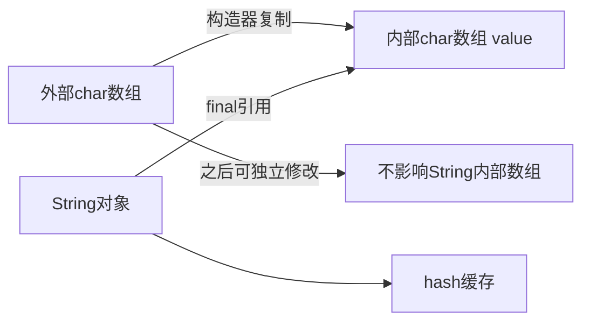

## 主干执行图

> 这张图用于定位主干步骤；重试、分支及异常以正文和源码为准。

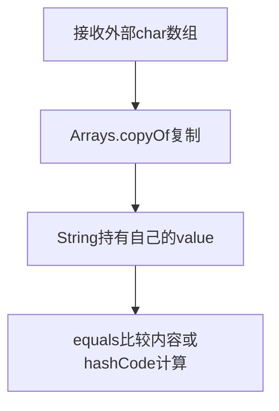

## 三段源码，抓住核心机制

### 源码1：private final char value[];

**String·[L114–L121](https://github.com/openjdk/jdk8u/blob/943a5ea328fd2fc8eed0aed4ec9b1957d41f8144/jdk/src/share/classes/java/lang/String.java#L114-L121)**

> 连续节选；窗口可能止于方法中间，完整实现请看链接。未省改算法，缩进作了统一处理。

```java
private final char value[];

/** Cache the hash code for the string */
private int hash; // Default to 0

/** use serialVersionUID from JDK 1.0.2 for interoperability */
private static final long serialVersionUID = -6849794470754667710L;

```

value是内部表示，hash是缓存，不是字符串的逻辑内容。一个Unicode字符可能需要两个char表示，因此length统计UTF-16代码单元。不要把char[]说成按字符编码后的byte数组。

### 源码2：public String(char value[])

**String·[L165–L169](https://github.com/openjdk/jdk8u/blob/943a5ea328fd2fc8eed0aed4ec9b1957d41f8144/jdk/src/share/classes/java/lang/String.java#L165-L169)**

> 连续节选；窗口可能止于方法中间，完整实现请看链接。未省改算法，缩进作了统一处理。

```java
public String(char value[]) {
    this.value = Arrays.copyOf(value, value.length);
}

/**
```

这个构造器复制外部数组。即使调用者后来修改原数组，已经构造的字符串也不改变。对比String(String)共享value：两个String都不提供修改该数组的公共接口，共享仍安全。

### 源码3：public int hashCode()

**String·[L1465–L1480](https://github.com/openjdk/jdk8u/blob/943a5ea328fd2fc8eed0aed4ec9b1957d41f8144/jdk/src/share/classes/java/lang/String.java#L1465-L1480)**

> 连续节选；窗口可能止于方法中间，完整实现请看链接。未省改算法，缩进作了统一处理。

```java
public int hashCode() {
    int h = hash;
    if (h == 0 && value.length > 0) {
        char val[] = value;

        for (int i = 0; i < value.length; i++) {
            h = 31 * h + val[i];
        }
        hash = h;
    }
    return h;
}

/**
 * Returns the index within this string of the first occurrence of
 * the specified character. If a character with value
```

逐个char累积h=31*h+字符。整数溢出是算法的一部分，不抛溢出异常；hash为0既可能是尚未计算，也可能是真实结果为0，后者可能再次计算。equals成立必须hash一致，hash相同不能推出equals。

## 手工推演：只读就能跟上

把外部数组想象成[A,B,C]。构造String后得到第二份[A,B,C]；原数组改成[X,B,C]，String仍是ABC。再想象两个不同字符串的hash碰巧相同：HashMap仍会用equals区分，不能以hash替代内容。

## 容易误读的边界

- JDK9以后的Compact Strings内部表示不要套到JDK8。
- substring在本基线中通过构造器复制所需区间；不要沿用早期JDK共享大数组的旧结论。
- intern是native边界；这里的Java字段不能证明某个字符串何时、在哪里分配。

## 如何用自己的话讲明白

String的不可变性来自封装与实现约束，char数组构造器做防御性复制；hash只是缓存。先讲表示，再讲复制和比较，最后才连接字符串池。

<a id="chapter-2"></a>
# 2. StringBuilder：可变数组如何减少复制

StringBuilder的核心在AbstractStringBuilder：value是可增长char数组，count是有效长度。容量和长度是两件事。连续append复用数组，只有容量不足才分配与复制；这解释了为什么循环累积文本通常比反复创建String更合适。

## 结构与状态图

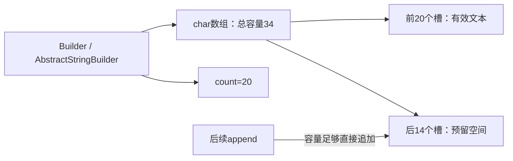

## 主干执行图

> 这张图用于定位主干步骤；重试、分支及异常以正文和源码为准。

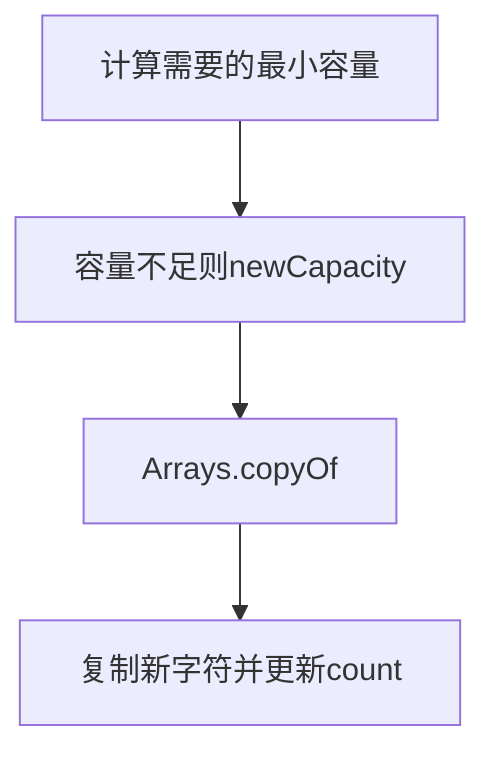

## 三段源码，抓住核心机制

### 源码1：private void ensureCapacityInternal(

**AbstractStringBuilder·[L121–L128](https://github.com/openjdk/jdk8u/blob/943a5ea328fd2fc8eed0aed4ec9b1957d41f8144/jdk/src/share/classes/java/lang/AbstractStringBuilder.java#L121-L128)**

> 连续节选；窗口可能止于方法中间，完整实现请看链接。未省改算法，缩进作了统一处理。

```java
private void ensureCapacityInternal(int minimumCapacity) {
    // overflow-conscious code
    if (minimumCapacity - value.length > 0) {
        value = Arrays.copyOf(value,
                newCapacity(minimumCapacity));
    }
}

```

用minimumCapacity-value.length判断是否需要增长。这里没有锁；不能因为内部数组复制就把StringBuilder当线程安全容器。

### 源码2：private int newCapacity(

**AbstractStringBuilder·[L148–L158](https://github.com/openjdk/jdk8u/blob/943a5ea328fd2fc8eed0aed4ec9b1957d41f8144/jdk/src/share/classes/java/lang/AbstractStringBuilder.java#L148-L158)**

> 连续节选；窗口可能止于方法中间，完整实现请看链接。未省改算法，缩进作了统一处理。

```java
private int newCapacity(int minCapacity) {
    // overflow-conscious code
    int newCapacity = (value.length << 1) + 2;
    if (newCapacity - minCapacity < 0) {
        newCapacity = minCapacity;
    }
    return (newCapacity <= 0 || MAX_ARRAY_SIZE - newCapacity < 0)
        ? hugeCapacity(minCapacity)
        : newCapacity;
}

```

常规候选容量是旧容量的两倍加2；若仍不足，使用minCapacity。巨大容量与溢出另有分支，所以“永远严格翻倍”不准确。

### 源码3：public AbstractStringBuilder append(String str)

**AbstractStringBuilder·[L444–L455](https://github.com/openjdk/jdk8u/blob/943a5ea328fd2fc8eed0aed4ec9b1957d41f8144/jdk/src/share/classes/java/lang/AbstractStringBuilder.java#L444-L455)**

> 连续节选；窗口可能止于方法中间，完整实现请看链接。未省改算法，缩进作了统一处理。

```java
public AbstractStringBuilder append(String str) {
    if (str == null)
        return appendNull();
    int len = str.length();
    ensureCapacityInternal(count + len);
    str.getChars(0, len, value, count);
    count += len;
    return this;
}

// Documentation in subclasses because of synchro difference
public AbstractStringBuilder append(StringBuffer sb) {
```

先处理null，再取长度、扩容、把字符复制到count之后，最后推进count。append(null String)追加的是字符串null，而不是跳过。

## 手工推演：只读就能跟上

容量16、count15，追加长度5，需要容量20，常规扩到34，之后count20。下一次追加短文本可直接使用剩余空间。扩容时复制旧数组，其他普通追加只搬新字符。

## 容易误读的边界

- StringBuilder不适合多个线程无同步共同修改。
- StringBuffer有同步，但跨多次方法调用的业务事务仍需单独分析。
- JDK8编译器常把普通字符串连接降为StringBuilder链，其他JDK的编译策略可能不同。

## 如何用自己的话讲明白

可变缓冲区把重复分配变成按需扩容。看count与value.length的区别，再看ensureCapacityInternal和append的写入顺序。

<a id="chapter-3"></a>
# 3. Integer：缓存、装箱与身份比较

Integer包装一个final int。valueOf先查缓存再新建，自动装箱通常走这个工厂。缓存优化的是对象复用，不改变整数的数学值；对象身份、值相等和拆箱是三条不同的比较路径。

## 结构与状态图

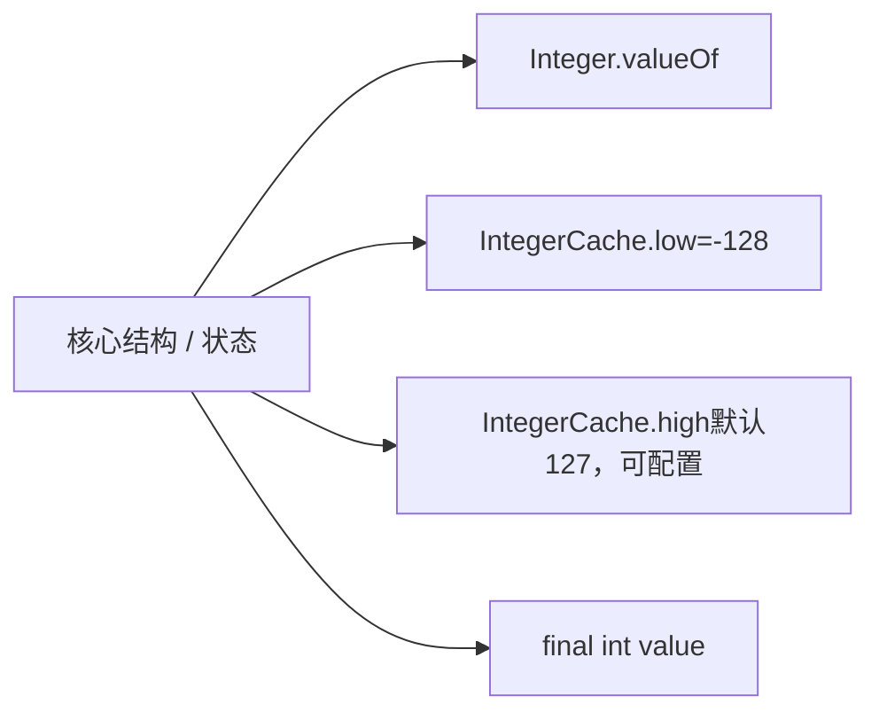

## 主干执行图

> 这张图用于定位主干步骤；重试、分支及异常以正文和源码为准。

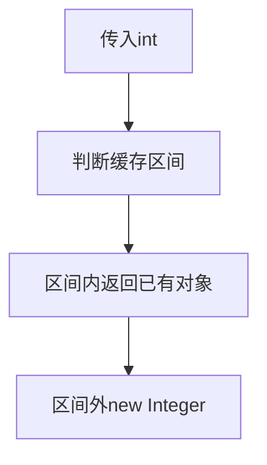

## 三段源码，抓住核心机制

### 源码1：private static class IntegerCache

**Integer·[L780–L803](https://github.com/openjdk/jdk8u/blob/943a5ea328fd2fc8eed0aed4ec9b1957d41f8144/jdk/src/share/classes/java/lang/Integer.java#L780-L803)**

> 连续节选；窗口可能止于方法中间，完整实现请看链接。未省改算法，缩进作了统一处理。

```java
private static class IntegerCache {
    static final int low = -128;
    static final int high;
    static final Integer cache[];

    static {
        // high value may be configured by property
        int h = 127;
        String integerCacheHighPropValue =
            sun.misc.VM.getSavedProperty("java.lang.Integer.IntegerCache.high");
        if (integerCacheHighPropValue != null) {
            try {
                int i = parseInt(integerCacheHighPropValue);
                i = Math.max(i, 127);
                // Maximum array size is Integer.MAX_VALUE
                h = Math.min(i, Integer.MAX_VALUE - (-low) -1);
            } catch( NumberFormatException nfe) {
                // If the property cannot be parsed into an int, ignore it.
            }
        }
        high = h;

        cache = new Integer[(high - low) + 1];
        int j = low;
```

默认上界127，下界-128；本实现允许通过保存的属性提高上界。不要把大于127一律“不可能缓存”当规范。

### 源码2：public static Integer valueOf(int i)

**Integer·[L829–L834](https://github.com/openjdk/jdk8u/blob/943a5ea328fd2fc8eed0aed4ec9b1957d41f8144/jdk/src/share/classes/java/lang/Integer.java#L829-L834)**

> 连续节选；窗口可能止于方法中间，完整实现请看链接。未省改算法，缩进作了统一处理。

```java
public static Integer valueOf(int i) {
    if (i >= IntegerCache.low && i <= IntegerCache.high)
        return IntegerCache.cache[i + (-IntegerCache.low)];
    return new Integer(i);
}

```

这里直接决定是否返回同一个缓存对象。new Integer走构造器，不经过valueOf缓存分支。

### 源码3：public boolean equals(Object obj)

**Integer·[L973–L980](https://github.com/openjdk/jdk8u/blob/943a5ea328fd2fc8eed0aed4ec9b1957d41f8144/jdk/src/share/classes/java/lang/Integer.java#L973-L980)**

> 连续节选；窗口可能止于方法中间，完整实现请看链接。未省改算法，缩进作了统一处理。

```java
public boolean equals(Object obj) {
    if (obj instanceof Integer) {
        return value == ((Integer)obj).intValue();
    }
    return false;
}

/**
```

equals先检查对象类型，然后比较int值。Integer与Long即使数值相同也不会因此equals；拆箱null则是另一条路径，会抛NullPointerException。

## 手工推演：只读就能跟上

两个通过valueOf取得的100通常指向同一缓存对象，因此==为真；两个显式新建的100是不同对象，但equals为真。200是否被缓存要看本实现的缓存上界，不能把对象身份写进业务判断。

## 容易误读的边界

- 规范对特定常量表达式装箱有身份保证；不要扩大为所有数值、所有包装类、所有构造路径。
- 整数业务比较先明确是否拆箱、是否可能null。
- 缓存区间是实现与配置知识，不能取代equals语义。

## 如何用自己的话讲明白

缓存影响身份而非值。用equals表达包装值相等，用明确的基本类型比较表达数学关系；不要依赖偶然的==结果。

<a id="chapter-4"></a>
# 4. ArrayList：数组、容量与摊还复杂度

ArrayList让逻辑上可变长度的List建立在固定长度数组上。size是已使用元素数；elementData.length是容量。追加通常只写一个槽，偶尔扩容复制整个数组，所以单次最坏O(n)，一串追加的摊还成本通常O(1)。

## 结构与状态图

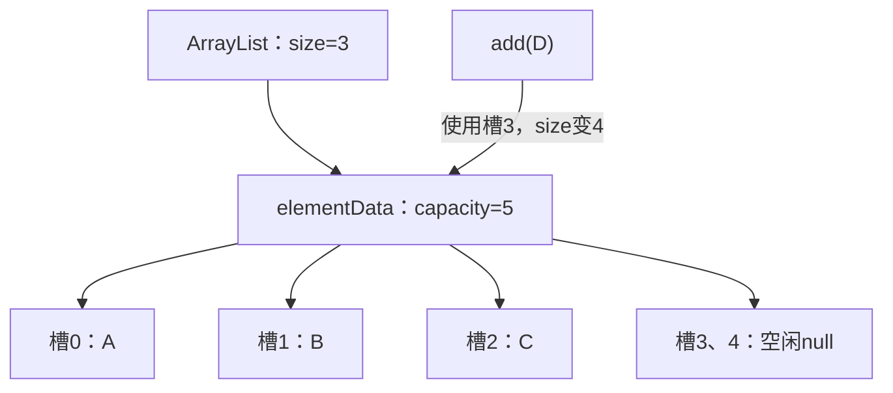

## 主干执行图

> 这张图用于定位主干步骤；重试、分支及异常以正文和源码为准。

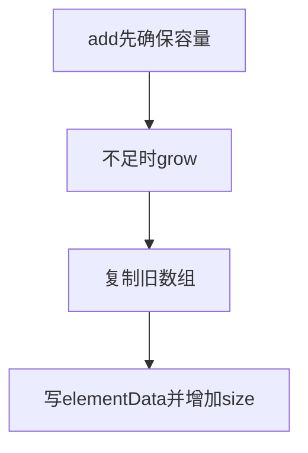

## 三段源码，抓住核心机制

### 源码1：public boolean add(E e)

**ArrayList·[L463–L468](https://github.com/openjdk/jdk8u/blob/943a5ea328fd2fc8eed0aed4ec9b1957d41f8144/jdk/src/share/classes/java/util/ArrayList.java#L463-L468)**

> 连续节选；窗口可能止于方法中间，完整实现请看链接。未省改算法，缩进作了统一处理。

```java
public boolean add(E e) {
    ensureCapacityInternal(size + 1);  // Increments modCount!!
    elementData[size++] = e;
    return true;
}

```

ensureCapacityInternal(size+1)确保下一格存在，然后数组赋值并后置增加size。默认构造的空标记数组在第一次添加时通常扩到默认容量10。

### 源码2：private void grow(int minCapacity)

**ArrayList·[L258–L270](https://github.com/openjdk/jdk8u/blob/943a5ea328fd2fc8eed0aed4ec9b1957d41f8144/jdk/src/share/classes/java/util/ArrayList.java#L258-L270)**

> 连续节选；窗口可能止于方法中间，完整实现请看链接。未省改算法，缩进作了统一处理。

```java
private void grow(int minCapacity) {
    // overflow-conscious code
    int oldCapacity = elementData.length;
    int newCapacity = oldCapacity + (oldCapacity >> 1);
    if (newCapacity - minCapacity < 0)
        newCapacity = minCapacity;
    if (newCapacity - MAX_ARRAY_SIZE > 0)
        newCapacity = hugeCapacity(minCapacity);
    // minCapacity is usually close to size, so this is a win:
    elementData = Arrays.copyOf(elementData, newCapacity);
}

private static int hugeCapacity(int minCapacity) {
```

常规候选容量为oldCapacity+(oldCapacity>>1)，约1.5倍；若候选不足则使用所需最小容量。超过数组上限还要走hugeCapacity，所以并非任意情况下恰好1.5倍。

### 源码3：public E remove(int index)

**ArrayList·[L497–L511](https://github.com/openjdk/jdk8u/blob/943a5ea328fd2fc8eed0aed4ec9b1957d41f8144/jdk/src/share/classes/java/util/ArrayList.java#L497-L511)**

> 连续节选；窗口可能止于方法中间，完整实现请看链接。未省改算法，缩进作了统一处理。

```java
public E remove(int index) {
    rangeCheck(index);

    modCount++;
    E oldValue = elementData(index);

    int numMoved = size - index - 1;
    if (numMoved > 0)
        System.arraycopy(elementData, index+1, elementData, index,
                         numMoved);
    elementData[--size] = null; // clear to let GC do its work

    return oldValue;
}

```

检查下标后移动后续元素，size减少，最后把多余槽置null，避免容器继续保留已删除对象的强引用。删除中间元素的成本来自搬移。

## 手工推演：只读就能跟上

容量10、size10时再add一次：新数组常规容量15，复制10个旧引用，放入新引用，size11。删除索引2：索引3到10整体左移，最后一个旧槽清空。

## 容易误读的边界

- ArrayList是线程不安全的；modCount不是同步机制。
- 构造容量不等于构造size，new ArrayList(100)仍为空。
- remove(int)按下标，remove(Object)按值；Integer列表尤其容易看错重载。

## 如何用自己的话讲明白

随机索引快、尾部追加摊还快、头部与中间插删要搬移。源码里size与容量分离，扩容复制引用，删除清空尾槽。

<a id="chapter-5"></a>
# 5. Iterator与subList：为什么修改后会报错

迭代器保存expectedModCount，容器保存modCount；二者不一致时提供尽力而为的fail-fast检查。subList是视图，持有父列表及偏移与范围，并非独立副本。要理解行为，先问“数据是否共享”和“结构修改计数由谁维护”。

## 结构与状态图

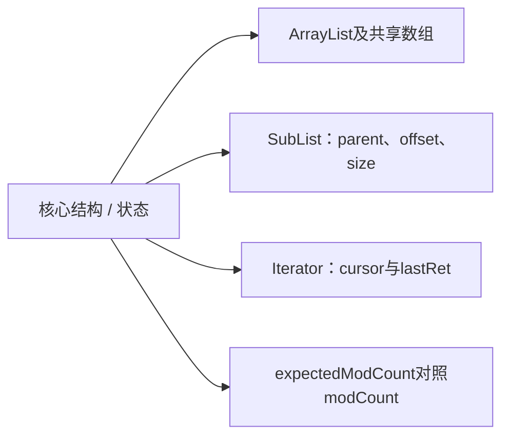

## 主干执行图

> 这张图用于定位主干步骤；重试、分支及异常以正文和源码为准。

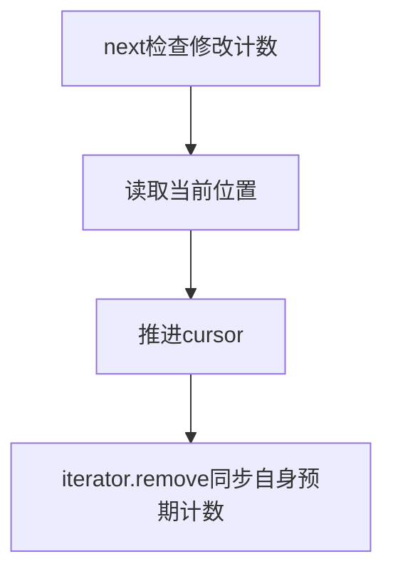

## 三段源码，抓住核心机制

### 源码1：public E next()

**ArrayList·[L860–L873](https://github.com/openjdk/jdk8u/blob/943a5ea328fd2fc8eed0aed4ec9b1957d41f8144/jdk/src/share/classes/java/util/ArrayList.java#L860-L873)**

> 连续节选；窗口可能止于方法中间，完整实现请看链接。未省改算法，缩进作了统一处理。

```java
public E next() {
    checkForComodification();
    int i = cursor;
    if (i >= size)
        throw new NoSuchElementException();
    Object[] elementData = ArrayList.this.elementData;
    if (i >= elementData.length)
        throw new ConcurrentModificationException();
    cursor = i + 1;
    return (E) elementData[lastRet = i];
}

public void remove() {
    if (lastRet < 0)
```

先检查并发修改，再检查下标和当前数组边界。检查只能帮助尽早发现错误，不能把数据竞争变成可靠异常。

### 源码2：final void checkForComodification()

**ArrayList·[L909–L912](https://github.com/openjdk/jdk8u/blob/943a5ea328fd2fc8eed0aed4ec9b1957d41f8144/jdk/src/share/classes/java/util/ArrayList.java#L909-L912)**

> 连续节选；窗口可能止于方法中间，完整实现请看链接。未省改算法，缩进作了统一处理。

```java
final void checkForComodification() {
    if (modCount != expectedModCount)
        throw new ConcurrentModificationException();
}
```

expectedModCount不同就抛异常。不要把ConcurrentModificationException理解成“只有多线程才触发”；同一线程绕过迭代器改列表也可能触发。

### 源码3：SubList(AbstractList<E> parent,

**ArrayList·[L1026–L1035](https://github.com/openjdk/jdk8u/blob/943a5ea328fd2fc8eed0aed4ec9b1957d41f8144/jdk/src/share/classes/java/util/ArrayList.java#L1026-L1035)**

> 连续节选；窗口可能止于方法中间，完整实现请看链接。未省改算法，缩进作了统一处理。

```java
SubList(AbstractList<E> parent,
        int offset, int fromIndex, int toIndex) {
    this.parent = parent;
    this.parentOffset = fromIndex;
    this.offset = offset + fromIndex;
    this.size = toIndex - fromIndex;
    this.modCount = ArrayList.this.modCount;
}

public E set(int index, E e) {
```

子视图保存父列表、偏移和创建时modCount。对视图做结构修改会经其实现更新相关状态，直接改父列表结构会让旧视图失效。

## 手工推演：只读就能跟上

遍历[a,b,c]时，迭代器预期计数为3。直接调用list.add(d)使modCount变4，之后next可能报错。若使用该迭代器自己的remove，它会更新expectedModCount，继续遍历有明确路径。subList(1,3)对应[b,c]，set修改会反映到父列表。

## 容易误读的边界

- fail-fast没有保证一定检测所有并发修改。
- subList保留父容器联系，长期持有小视图也可能保留整个大列表。
- 修改元素值和结构修改不同；ArrayList.set一般不增加modCount。

## 如何用自己的话讲明白

迭代器不是副本，subList也是共享视图。fail-fast用计数发现结构变化，不能替代锁或并发容器。

<a id="chapter-6"></a>
# 6. LinkedList：有了节点为什么索引访问仍慢

LinkedList是双向链表，first与last保存两端。节点连接起来后，改指针可以O(1)，但先定位第i个节点仍要走链。Java的List API传的是索引，没有直接把内部Node交给调用者，所以不能把所有插删笼统说成O(1)。

## 结构与状态图

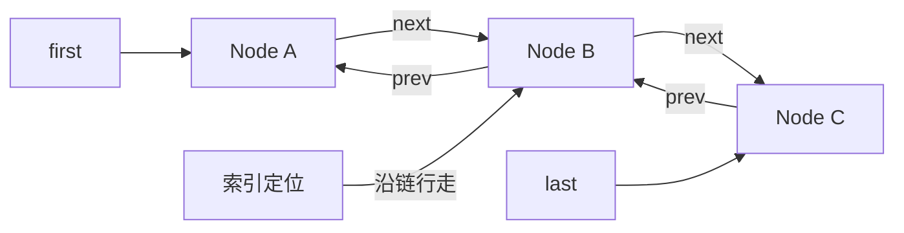

## 主干执行图

> 这张图用于定位主干步骤；重试、分支及异常以正文和源码为准。

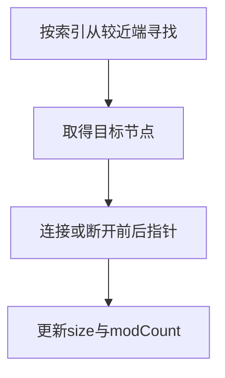

## 三段源码，抓住核心机制

### 源码1：void linkLast(E e)

**LinkedList·[L140–L151](https://github.com/openjdk/jdk8u/blob/943a5ea328fd2fc8eed0aed4ec9b1957d41f8144/jdk/src/share/classes/java/util/LinkedList.java#L140-L151)**

> 连续节选；窗口可能止于方法中间，完整实现请看链接。未省改算法，缩进作了统一处理。

```java
void linkLast(E e) {
    final Node<E> l = last;
    final Node<E> newNode = new Node<>(l, e, null);
    last = newNode;
    if (l == null)
        first = newNode;
    else
        l.next = newNode;
    size++;
    modCount++;
}

```

创建新尾节点，处理空链表与非空链表两种连接方式。追加尾部可直接用last，无需遍历。

### 源码2：Node<E> node(int index)

**LinkedList·[L566–L581](https://github.com/openjdk/jdk8u/blob/943a5ea328fd2fc8eed0aed4ec9b1957d41f8144/jdk/src/share/classes/java/util/LinkedList.java#L566-L581)**

> 连续节选；窗口可能止于方法中间，完整实现请看链接。未省改算法，缩进作了统一处理。

```java
Node<E> node(int index) {
    // assert isElementIndex(index);

    if (index < (size >> 1)) {
        Node<E> x = first;
        for (int i = 0; i < index; i++)
            x = x.next;
        return x;
    } else {
        Node<E> x = last;
        for (int i = size - 1; i > index; i--)
            x = x.prev;
        return x;
    }
}

```

index<size/2时从first向后，否则从last向前。双向链降低常数，但数量级仍为O(n)。

### 源码3：E unlink(Node<E> x)

**LinkedList·[L209–L238](https://github.com/openjdk/jdk8u/blob/943a5ea328fd2fc8eed0aed4ec9b1957d41f8144/jdk/src/share/classes/java/util/LinkedList.java#L209-L238)**

> 连续节选；窗口可能止于方法中间，完整实现请看链接。未省改算法，缩进作了统一处理。

```java
E unlink(Node<E> x) {
    // assert x != null;
    final E element = x.item;
    final Node<E> next = x.next;
    final Node<E> prev = x.prev;

    if (prev == null) {
        first = next;
    } else {
        prev.next = next;
        x.prev = null;
    }

    if (next == null) {
        last = prev;
    } else {
        next.prev = prev;
        x.next = null;
    }

    x.item = null;
    size--;
    modCount++;
    return element;
}

/**
 * Returns the first element in this list.
 *
 * @return the first element in this list
```

分别修补前驱和后继；首尾需要额外更新first/last。清除item和断开的引用，让已删除节点不继续保留旧结构。

## 手工推演：只读就能跟上

长度100的列表访问索引98，从尾走一步即可；访问索引50仍要走约49步。iterator已定位某个节点时，其remove可以就地调整链接，但反复get(i)遍历整个链表可能累计O(n²)。

## 容易误读的边界

- 链表对象多、引用多，缓存局部性通常比连续数组差。
- LinkedList允许null，poll返回null未必表示原队列一定没有null元素。
- 线程安全与是否链表无关，LinkedList无内建并发保证。

## 如何用自己的话讲明白

链表优势来自已知节点或两端操作；按索引定位仍线性。比较容器时把“寻找位置”和“改变连接”分开。

<a id="chapter-7"></a>
# 7. HashMap：从hash到桶，再到put

HashMap先把key.hashCode的高位扰动到低位，再用长度减一与hash按位与定位桶。长度维持为2的幂，让取模可用掩码完成。碰撞是不同key进入同一桶；最终仍用equals确认键身份。

## 结构与状态图

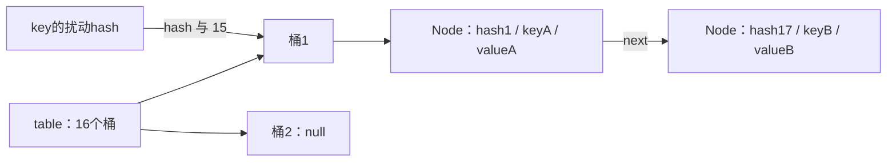

## 主干执行图

> 这张图用于定位主干步骤；重试、分支及异常以正文和源码为准。

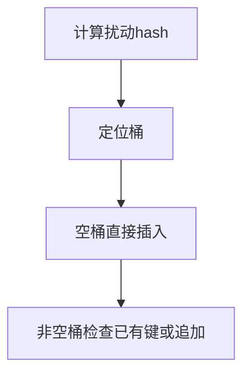

## 三段源码，抓住核心机制

### 源码1：static final int hash(Object key)

**HashMap·[L338–L341](https://github.com/openjdk/jdk8u/blob/943a5ea328fd2fc8eed0aed4ec9b1957d41f8144/jdk/src/share/classes/java/util/HashMap.java#L338-L341)**

> 连续节选；窗口可能止于方法中间，完整实现请看链接。未省改算法，缩进作了统一处理。

```java
static final int hash(Object key) {
    int h;
    return (key == null) ? 0 : (h = key.hashCode()) ^ (h >>> 16);
}
```

null键的hash为0；非null键使用h^(h>>>16)。hash字段记录扰动后的结果，避免每次访问都重算。

### 源码2：final V putVal(int hash, K key, V value, boolean onlyIfAbsent,

**HashMap·[L626–L659](https://github.com/openjdk/jdk8u/blob/943a5ea328fd2fc8eed0aed4ec9b1957d41f8144/jdk/src/share/classes/java/util/HashMap.java#L626-L659)**

> 连续节选；窗口可能止于方法中间，完整实现请看链接。未省改算法，缩进作了统一处理。

```java
final V putVal(int hash, K key, V value, boolean onlyIfAbsent,
               boolean evict) {
    Node<K,V>[] tab; Node<K,V> p; int n, i;
    if ((tab = table) == null || (n = tab.length) == 0)
        n = (tab = resize()).length;
    if ((p = tab[i = (n - 1) & hash]) == null)
        tab[i] = newNode(hash, key, value, null);
    else {
        Node<K,V> e; K k;
        if (p.hash == hash &&
            ((k = p.key) == key || (key != null && key.equals(k))))
            e = p;
        else if (p instanceof TreeNode)
            e = ((TreeNode<K,V>)p).putTreeVal(this, tab, hash, key, value);
        else {
            for (int binCount = 0; ; ++binCount) {
                if ((e = p.next) == null) {
                    p.next = newNode(hash, key, value, null);
                    if (binCount >= TREEIFY_THRESHOLD - 1) // -1 for 1st
                        treeifyBin(tab, hash);
                    break;
                }
                if (e.hash == hash &&
                    ((k = e.key) == key || (key != null && key.equals(k))))
                    break;
                p = e;
            }
        }
        if (e != null) { // existing mapping for key
            V oldValue = e.value;
            if (!onlyIfAbsent || oldValue == null)
                e.value = value;
            afterNodeAccess(e);
            return oldValue;
```

先确保table存在，然后处理空桶、首节点相等、树节点和普通链表。相等判断是hash相等且引用相同或equals成立。

### 源码3：if (++size > threshold)

**HashMap·[L663–L666](https://github.com/openjdk/jdk8u/blob/943a5ea328fd2fc8eed0aed4ec9b1957d41f8144/jdk/src/share/classes/java/util/HashMap.java#L663-L666)**

> 连续节选；窗口可能止于方法中间，完整实现请看链接。未省改算法，缩进作了统一处理。

```java
if (++size > threshold)
    resize();
afterNodeInsertion(evict);
return null;
```

只有新增条目才走size增加，替换已有键的value不增加条目数。先插入再判断是否超过threshold；loadFactor不是“桶里能容纳几个节点”。

## 手工推演：只读就能跟上

容量16时hash17与hash1都映射到桶1，因为17&15=1。若两个key不equals，链表保留两个条目；若相等则更新原条目value。null键也占一个真实条目。

## 容易误读的边界

- 平均O(1)依赖合理散列，不能当所有输入的严格最坏保证。
- 可变key若修改了参与hashCode/equals的字段，原条目可能无法按新键状态定位。
- HashMap无并发安全保证；JDK8避免了某些旧扩容机制问题，不等于可并发写。

## 如何用自己的话讲明白

put分成定位、匹配、插入、维护四步。hash缩小候选范围，equals确定逻辑键，threshold决定整体扩容。

<a id="chapter-8"></a>
# 8. HashMap.resize：为什么节点只去原位或原位加旧容量

扩容从n到2n，掩码只多了一个二进制位。已有节点保存了hash，只需检查hash&oldCap：零留在原桶，非零移到j+oldCap。这是位运算分流，不是重新调用key.hashCode。

## 结构与状态图

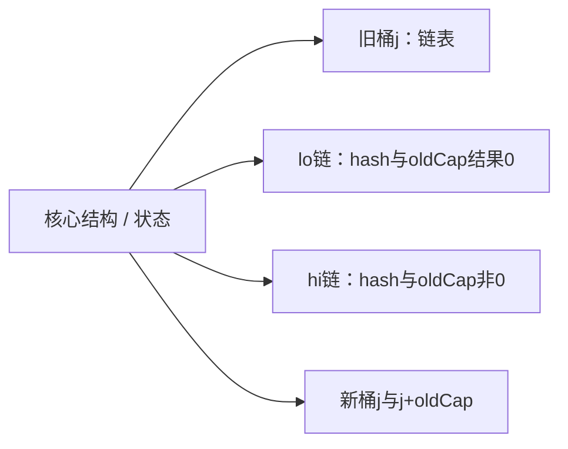

## 主干执行图

> 这张图用于定位主干步骤；重试、分支及异常以正文和源码为准。

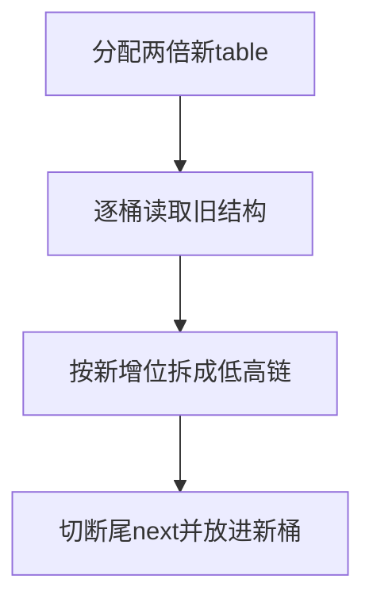

## 三段源码，抓住核心机制

### 源码1：final Node<K,V>[] resize()

**HashMap·[L678–L706](https://github.com/openjdk/jdk8u/blob/943a5ea328fd2fc8eed0aed4ec9b1957d41f8144/jdk/src/share/classes/java/util/HashMap.java#L678-L706)**

> 连续节选；窗口可能止于方法中间，完整实现请看链接。未省改算法，缩进作了统一处理。

```java
final Node<K,V>[] resize() {
    Node<K,V>[] oldTab = table;
    int oldCap = (oldTab == null) ? 0 : oldTab.length;
    int oldThr = threshold;
    int newCap, newThr = 0;
    if (oldCap > 0) {
        if (oldCap >= MAXIMUM_CAPACITY) {
            threshold = Integer.MAX_VALUE;
            return oldTab;
        }
        else if ((newCap = oldCap << 1) < MAXIMUM_CAPACITY &&
                 oldCap >= DEFAULT_INITIAL_CAPACITY)
            newThr = oldThr << 1; // double threshold
    }
    else if (oldThr > 0) // initial capacity was placed in threshold
        newCap = oldThr;
    else {               // zero initial threshold signifies using defaults
        newCap = DEFAULT_INITIAL_CAPACITY;
        newThr = (int)(DEFAULT_LOAD_FACTOR * DEFAULT_INITIAL_CAPACITY);
    }
    if (newThr == 0) {
        float ft = (float)newCap * loadFactor;
        newThr = (newCap < MAXIMUM_CAPACITY && ft < (float)MAXIMUM_CAPACITY ?
                  (int)ft : Integer.MAX_VALUE);
    }
    threshold = newThr;
    @SuppressWarnings({"rawtypes","unchecked"})
    Node<K,V>[] newTab = (Node<K,V>[])new Node[newCap];
    table = newTab;
```

读取旧容量与阈值，区分已存在table、预设threshold与默认初始化。达到最大容量时不能继续常规翻倍。

### 源码2：Node<K,V> loHead = null, loTail = null;

**HashMap·[L717–L746](https://github.com/openjdk/jdk8u/blob/943a5ea328fd2fc8eed0aed4ec9b1957d41f8144/jdk/src/share/classes/java/util/HashMap.java#L717-L746)**

> 连续节选；窗口可能止于方法中间，完整实现请看链接。未省改算法，缩进作了统一处理。

```java
        Node<K,V> loHead = null, loTail = null;
        Node<K,V> hiHead = null, hiTail = null;
        Node<K,V> next;
        do {
            next = e.next;
            if ((e.hash & oldCap) == 0) {
                if (loTail == null)
                    loHead = e;
                else
                    loTail.next = e;
                loTail = e;
            }
            else {
                if (hiTail == null)
                    hiHead = e;
                else
                    hiTail.next = e;
                hiTail = e;
            }
        } while ((e = next) != null);
        if (loTail != null) {
            loTail.next = null;
            newTab[j] = loHead;
        }
        if (hiTail != null) {
            hiTail.next = null;
            newTab[j + oldCap] = hiHead;
        }
    }
}
```

遍历链时按hash&oldCap拆分，同时维持每条子链的原相对顺序。两个tail只在尾部追加。

### 源码3：if (loTail != null)

**HashMap·[L737–L746](https://github.com/openjdk/jdk8u/blob/943a5ea328fd2fc8eed0aed4ec9b1957d41f8144/jdk/src/share/classes/java/util/HashMap.java#L737-L746)**

> 连续节选；窗口可能止于方法中间，完整实现请看链接。未省改算法，缩进作了统一处理。

```java
        if (loTail != null) {
            loTail.next = null;
            newTab[j] = loHead;
        }
        if (hiTail != null) {
            hiTail.next = null;
            newTab[j + oldCap] = hiHead;
        }
    }
}
```

尾节点next必须置null，避免低链与高链残留旧链接。新位置一条在j，一条在j+oldCap。树桶的split另走树结构逻辑。

## 手工推演：只读就能跟上

旧容量16，旧桶1里hash值1、17、33、49。扩到32：1和33满足hash&16=0，仍在桶1；17和49移到桶17。两个子链内部顺序分别保持1→33与17→49。

## 容易误读的边界

- “rehash”常被口语化使用；本实现链表迁移不重新调用用户hashCode。
- 扩容复制数组并迁移结构，有成本，不是免费增长。
- 初始容量参数经2的幂调整，第一次分配与后续resize的条件不同。

## 如何用自己的话讲明白

容量翻倍只新增一个索引位，按该位把旧桶分成两条链，位置是j和j+oldCap；这是HashMap源码最值得手推的一段。

<a id="chapter-9"></a>
# 9. HashMap树化：阈值8为什么常在第9个节点触发

树化要同时读三个地方：putVal的binCount、TREEIFY_THRESHOLD，以及treeifyBin中的MIN_TREEIFY_CAPACITY。常量8并不等于任意桶第8个元素一插入就树化；小table优先扩容。树结构还保留链式next，便于遍历和迁移。

## 结构与状态图

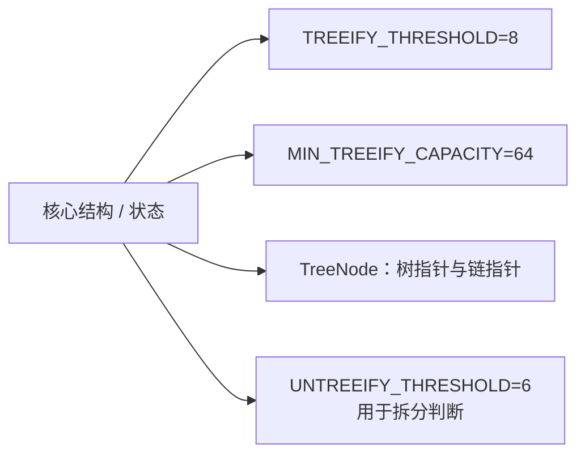

## 主干执行图

> 这张图用于定位主干步骤；重试、分支及异常以正文和源码为准。

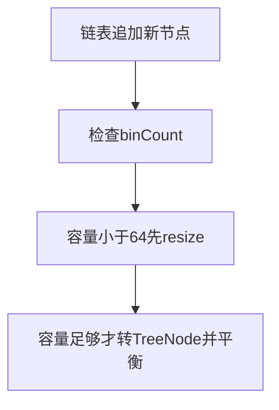

## 三段源码，抓住核心机制

### 源码1：if (binCount >= TREEIFY_THRESHOLD - 1)

**HashMap·[L644–L648](https://github.com/openjdk/jdk8u/blob/943a5ea328fd2fc8eed0aed4ec9b1957d41f8144/jdk/src/share/classes/java/util/HashMap.java#L644-L648)**

> 连续节选；窗口可能止于方法中间，完整实现请看链接。未省改算法，缩进作了统一处理。

```java
    if (binCount >= TREEIFY_THRESHOLD - 1) // -1 for 1st
        treeifyBin(tab, hash);
    break;
}
if (e.hash == hash &&
```

binCount从桶首开始计数，遇到链尾并追加后才判断。普通put逐个累积到原已有8个节点时，再加入第9个节点触发这个分支。

### 源码2：final void treeifyBin(Node<K,V>[] tab, int hash)

**HashMap·[L756–L780](https://github.com/openjdk/jdk8u/blob/943a5ea328fd2fc8eed0aed4ec9b1957d41f8144/jdk/src/share/classes/java/util/HashMap.java#L756-L780)**

> 连续节选；窗口可能止于方法中间，完整实现请看链接。未省改算法，缩进作了统一处理。

```java
final void treeifyBin(Node<K,V>[] tab, int hash) {
    int n, index; Node<K,V> e;
    if (tab == null || (n = tab.length) < MIN_TREEIFY_CAPACITY)
        resize();
    else if ((e = tab[index = (n - 1) & hash]) != null) {
        TreeNode<K,V> hd = null, tl = null;
        do {
            TreeNode<K,V> p = replacementTreeNode(e, null);
            if (tl == null)
                hd = p;
            else {
                p.prev = tl;
                tl.next = p;
            }
            tl = p;
        } while ((e = e.next) != null);
        if ((tab[index] = hd) != null)
            hd.treeify(tab);
    }
}

/**
 * Copies all of the mappings from the specified map to this map.
 * These mappings will replace any mappings that this map had for
 * any of the keys currently in the specified map.
```

容量不足64就resize；否则把Node换成TreeNode并连接prev/next，随后建红黑树。一次调用treeifyBin未必真正树化。

### 源码3：final void split(HashMap<K,V> map, Node<K,V>[] tab, int index, int bit)

**HashMap·[L2162–L2192](https://github.com/openjdk/jdk8u/blob/943a5ea328fd2fc8eed0aed4ec9b1957d41f8144/jdk/src/share/classes/java/util/HashMap.java#L2162-L2192)**

> 连续节选；窗口可能止于方法中间，完整实现请看链接。未省改算法，缩进作了统一处理。

```java
final void split(HashMap<K,V> map, Node<K,V>[] tab, int index, int bit) {
    TreeNode<K,V> b = this;
    // Relink into lo and hi lists, preserving order
    TreeNode<K,V> loHead = null, loTail = null;
    TreeNode<K,V> hiHead = null, hiTail = null;
    int lc = 0, hc = 0;
    for (TreeNode<K,V> e = b, next; e != null; e = next) {
        next = (TreeNode<K,V>)e.next;
        e.next = null;
        if ((e.hash & bit) == 0) {
            if ((e.prev = loTail) == null)
                loHead = e;
            else
                loTail.next = e;
            loTail = e;
            ++lc;
        }
        else {
            if ((e.prev = hiTail) == null)
                hiHead = e;
            else
                hiTail.next = e;
            hiTail = e;
            ++hc;
        }
    }

    if (loHead != null) {
        if (lc <= UNTREEIFY_THRESHOLD)
            tab[index] = loHead.untreeify(map);
        else {
```

树桶扩容也按新增位拆成两组，统计每组数量，足够小时退化为链。普通删除的退化判断还涉及树形条件，不是所有路径都仅看数字6。

## 手工推演：只读就能跟上

table容量64，连续放入hash相同且不equals的key：第8个放入后仍可为链表，第9个普通put触发树化。table容量16时同样的长链先促使扩容，不能从节点数量单独推断桶类型。

## 容易误读的边界

- “8树化、6退化”只是速记，必须附容量和具体路径。
- 无法合理比较的同hash键可能触发额外搜索，不能保证每种树桶查找都严格O(log n)。
- HashMap用instanceof TreeNode；CHM用TreeBin封装，二者结构不同。

## 如何用自己的话讲明白

说树化时给出操作路径：普通put追加、容量至少64、原链已有8个节点。再讲树桶迁移时的计数退化，避免只背常量。

<a id="chapter-10"></a>
# 10. HashSet与LinkedHashMap：组合复用与访问顺序

HashSet把元素当HashMap键，把同一个PRESENT哨兵当value；去重来自键语义。LinkedHashMap继承HashMap的桶结构，同时给条目增加全局双向链，用来维护插入顺序或访问顺序。桶链与全局顺序链服务不同目的。

## 结构与状态图

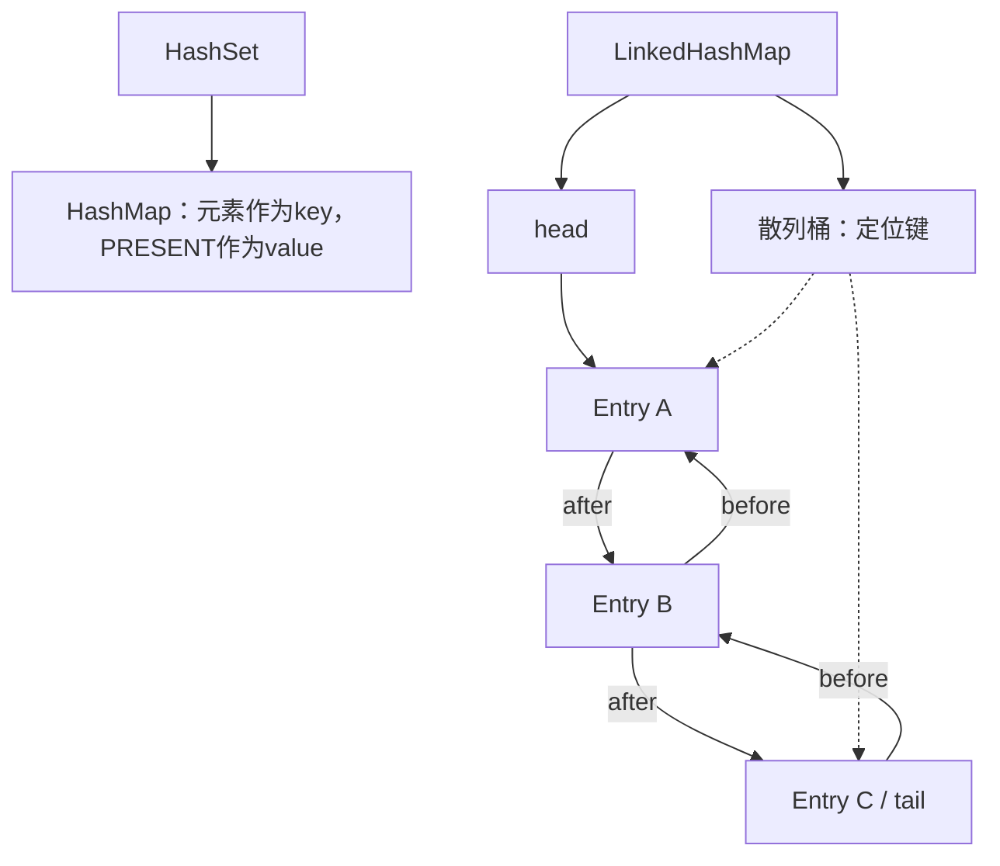

## 主干执行图

> 这张图用于定位主干步骤；重试、分支及异常以正文和源码为准。

```mermaid
flowchart TD
  N0["HashSet.add委托map.put"]
  N1["LinkedHashMap找到条目"]
  N2["accessOrder时移动到尾部"]
  N3["插入后可检查淘汰最老条目"]
  N0 --> N1
  N1 --> N2
  N2 --> N3
```

## 三段源码，抓住核心机制

### 源码1：public boolean add(E e)

**HashSet·[L219–L222](https://github.com/openjdk/jdk8u/blob/943a5ea328fd2fc8eed0aed4ec9b1957d41f8144/jdk/src/share/classes/java/util/HashSet.java#L219-L222)**

> 连续节选；窗口可能止于方法中间，完整实现请看链接。未省改算法，缩进作了统一处理。

```java
public boolean add(E e) {
    return map.put(e, PRESENT)==null;
}

```

put返回null表示此前没有此键，add才返回true。所有键对应同一个PRESENT，HashSet无需再维护另一份value语义。

### 源码2：void afterNodeAccess(Node<K,V> e)

**LinkedHashMap·[L305–L332](https://github.com/openjdk/jdk8u/blob/943a5ea328fd2fc8eed0aed4ec9b1957d41f8144/jdk/src/share/classes/java/util/LinkedHashMap.java#L305-L332)**

> 连续节选；窗口可能止于方法中间，完整实现请看链接。未省改算法，缩进作了统一处理。

```java
void afterNodeAccess(Node<K,V> e) { // move node to last
    LinkedHashMap.Entry<K,V> last;
    if (accessOrder && (last = tail) != e) {
        LinkedHashMap.Entry<K,V> p =
            (LinkedHashMap.Entry<K,V>)e, b = p.before, a = p.after;
        p.after = null;
        if (b == null)
            head = a;
        else
            b.after = a;
        if (a != null)
            a.before = b;
        else
            last = b;
        if (last == null)
            head = p;
        else {
            p.before = last;
            last.after = p;
        }
        tail = p;
        ++modCount;
    }
}

void internalWriteEntries(java.io.ObjectOutputStream s) throws IOException {
    for (LinkedHashMap.Entry<K,V> e = head; e != null; e = e.after) {
        s.writeObject(e.key);
```

accessOrder打开时，把访问节点从原位置摘下移到tail，并更新modCount。因此访问顺序模式的get也可能是结构修改。

### 源码3：void afterNodeInsertion(boolean evict)

**LinkedHashMap·[L297–L304](https://github.com/openjdk/jdk8u/blob/943a5ea328fd2fc8eed0aed4ec9b1957d41f8144/jdk/src/share/classes/java/util/LinkedHashMap.java#L297-L304)**

> 连续节选；窗口可能止于方法中间，完整实现请看链接。未省改算法，缩进作了统一处理。

```java
void afterNodeInsertion(boolean evict) { // possibly remove eldest
    LinkedHashMap.Entry<K,V> first;
    if (evict && (first = head) != null && removeEldestEntry(first)) {
        K key = first.key;
        removeNode(hash(key), key, null, false, true);
    }
}

```

新节点插入后检查removeEldestEntry。默认返回false；继承并覆盖该方法可做简单容量淘汰，但完整缓存还需考虑同步和过期策略。

## 手工推演：只读就能跟上

访问顺序为A→B→C，get(A)后变为B→C→A。若容量规则限制3，再插D可淘汰B。普通插入顺序模式get(A)不会因为访问自动挪到尾部。

## 容易误读的边界

- Set去重依赖hashCode与equals，不能只看元素内容“看起来一样”。
- LinkedHashMap不是并发LRU缓存。
- 访问顺序模式迭代时get可能触发fail-fast；containsKey的行为与get不同。

## 如何用自己的话讲明白

HashSet复用键去重；LinkedHashMap同时维护散列定位和顺序链。访问顺序加淘汰钩子是简单LRU的基础，但线程安全要额外解决。

<a id="chapter-11"></a>
# 11. TreeMap与PriorityQueue：树的排序与堆的排序差在哪

TreeMap按比较器或自然顺序组织红黑树，提供有序键遍历和范围查询。PriorityQueue用数组表示二叉堆，只保证根具有最高优先级；数组其他位置不保证整体有序。两者都叫“排序”容易掩盖完全不同的约束。

## 结构与状态图

```mermaid
flowchart LR
  R["核心结构 / 状态"]
  R --> M0["TreeMap：红黑树与Comparator"]
  R --> M1["树节点：left、right、parent"]
  R --> M2["PriorityQueue：数组二叉堆"]
  R --> M3["堆父节点i与子节点2i+1、2i+2"]
```

## 主干执行图

> 这张图用于定位主干步骤；重试、分支及异常以正文和源码为准。

```mermaid
flowchart TD
  N0["TreeMap沿比较结果找位置"]
  N1["插入后平衡颜色与旋转"]
  N2["PriorityQueue尾部插入上浮"]
  N3["poll用尾元素补根并下沉"]
  N0 --> N1
  N1 --> N2
  N2 --> N3
```

## 三段源码，抓住核心机制

### 源码1：public V put(K key, V value)

**TreeMap·[L535–L568](https://github.com/openjdk/jdk8u/blob/943a5ea328fd2fc8eed0aed4ec9b1957d41f8144/jdk/src/share/classes/java/util/TreeMap.java#L535-L568)**

> 连续节选；窗口可能止于方法中间，完整实现请看链接。未省改算法，缩进作了统一处理。

```java
public V put(K key, V value) {
    Entry<K,V> t = root;
    if (t == null) {
        compare(key, key); // type (and possibly null) check

        root = new Entry<>(key, value, null);
        size = 1;
        modCount++;
        return null;
    }
    int cmp;
    Entry<K,V> parent;
    // split comparator and comparable paths
    Comparator<? super K> cpr = comparator;
    if (cpr != null) {
        do {
            parent = t;
            cmp = cpr.compare(key, t.key);
            if (cmp < 0)
                t = t.left;
            else if (cmp > 0)
                t = t.right;
            else
                return t.setValue(value);
        } while (t != null);
    }
    else {
        if (key == null)
            throw new NullPointerException();
        @SuppressWarnings("unchecked")
            Comparable<? super K> k = (Comparable<? super K>) key;
        do {
            parent = t;
            cmp = k.compareTo(t.key);
```

比较结果为0时替换原value，不再新增键。TreeMap键身份取决于比较关系，与HashMap的hash/equals路径不同。

### 源码2：private void siftUpComparable(int k, E x)

**PriorityQueue·[L651–L663](https://github.com/openjdk/jdk8u/blob/943a5ea328fd2fc8eed0aed4ec9b1957d41f8144/jdk/src/share/classes/java/util/PriorityQueue.java#L651-L663)**

> 连续节选；窗口可能止于方法中间，完整实现请看链接。未省改算法，缩进作了统一处理。

```java
private void siftUpComparable(int k, E x) {
    Comparable<? super E> key = (Comparable<? super E>) x;
    while (k > 0) {
        int parent = (k - 1) >>> 1;
        Object e = queue[parent];
        if (key.compareTo((E) e) >= 0)
            break;
        queue[k] = e;
        k = parent;
    }
    queue[k] = key;
}

```

父索引是(k-1)>>>1。小根堆中只要x比父小就把父搬下来，直到找到合适位置。

### 源码3：public E poll()

**PriorityQueue·[L586–L601](https://github.com/openjdk/jdk8u/blob/943a5ea328fd2fc8eed0aed4ec9b1957d41f8144/jdk/src/share/classes/java/util/PriorityQueue.java#L586-L601)**

> 连续节选；窗口可能止于方法中间，完整实现请看链接。未省改算法，缩进作了统一处理。

```java
public E poll() {
    if (size == 0)
        return null;
    int s = --size;
    modCount++;
    E result = (E) queue[0];
    E x = (E) queue[s];
    queue[s] = null;
    if (s != 0)
        siftDown(0, x);
    return result;
}

/**
 * Removes the ith element from queue.
 *
```

移走根，尾元素补位后siftDown。堆操作O(log n)，peek看根O(1)，遍历底层数组不能得到全排序结果。

## 手工推演：只读就能跟上

比较器只按年龄比较，两个不同姓名但同年龄的键在TreeMap中可能视为同一键。PriorityQueue可能存储[1,3,2,7,4]：根是1且局部堆约束成立，但数组顺序并非从小到大。

## 容易误读的边界

- 比较关系应与equals保持一致，避免Map契约上的意外。
- TreeMap自然排序不支持null键；自定义比较器是否支持null要看比较器。
- PriorityQueue不支持null；同优先级出队不保证稳定顺序。

## 如何用自己的话讲明白

有序Map维护全局可搜索顺序；堆维护局部优先关系。需要有序遍历看TreeMap，需要反复取最优元素看堆。

<a id="chapter-12"></a>
# 12. ConcurrentHashMap.put/get：CAS和桶头锁如何分工

JDK8的CHM正常数据路径不再采用JDK7的Segment数组锁。table是Node数组；空桶CAS发布首节点，非空桶写入常用synchronized锁当前桶头，拿锁后还要确认桶头没有变化。get使用可见性读取与节点字段，不走这些常规写锁。

## 结构与状态图

```mermaid
flowchart TD
 T["volatile table引用"] --> E["空桶：null"]
 T --> N["普通桶：Node"]
 T --> F["迁移桶：ForwardingNode"]
 T --> R["树桶：TreeBin"]
 E -->|"casTabAt"| NN["发布新首Node"]
 N -->|"synchronized桶头 + 复查"| U["普通桶写入"]
 F --> NT["nextTable"]
 R --> TR["TreeNode树与链"]
```

## 主干执行图

> 这张图用于定位主干步骤；重试、分支及异常以正文和源码为准。

```mermaid
flowchart TD
  N0["读取table与桶头"]
  N1["空桶casTabAt"]
  N2["迁移桶帮助扩容"]
  N3["普通桶锁头并重新校验"]
  N0 --> N1
  N1 --> N2
  N2 --> N3
```

## 三段源码，抓住核心机制

### 源码1：static final <K,V> Node<K,V> tabAt(

**ConcurrentHashMap·[L754–L765](https://github.com/openjdk/jdk8u/blob/943a5ea328fd2fc8eed0aed4ec9b1957d41f8144/jdk/src/share/classes/java/util/concurrent/ConcurrentHashMap.java#L754-L765)**

> 连续节选；窗口可能止于方法中间，完整实现请看链接。未省改算法，缩进作了统一处理。

```java
static final <K,V> Node<K,V> tabAt(Node<K,V>[] tab, int i) {
    return (Node<K,V>)U.getObjectVolatile(tab, ((long)i << ASHIFT) + ABASE);
}

static final <K,V> boolean casTabAt(Node<K,V>[] tab, int i,
                                    Node<K,V> c, Node<K,V> v) {
    return U.compareAndSwapObject(tab, ((long)i << ASHIFT) + ABASE, c, v);
}

static final <K,V> void setTabAt(Node<K,V>[] tab, int i, Node<K,V> v) {
    U.putObjectVolatile(tab, ((long)i << ASHIFT) + ABASE, v);
}
```

tabAt与casTabAt通过Unsafe访问数组槽位，提供相应的内存语义。数组引用是volatile不意味着每个普通数组元素访问自动volatile。

### 源码2：final V putVal(K key, V value, boolean onlyIfAbsent)

**ConcurrentHashMap·[L1010–L1042](https://github.com/openjdk/jdk8u/blob/943a5ea328fd2fc8eed0aed4ec9b1957d41f8144/jdk/src/share/classes/java/util/concurrent/ConcurrentHashMap.java#L1010-L1042)**

> 连续节选；窗口可能止于方法中间，完整实现请看链接。未省改算法，缩进作了统一处理。

```java
final V putVal(K key, V value, boolean onlyIfAbsent) {
    if (key == null || value == null) throw new NullPointerException();
    int hash = spread(key.hashCode());
    int binCount = 0;
    for (Node<K,V>[] tab = table;;) {
        Node<K,V> f; int n, i, fh;
        if (tab == null || (n = tab.length) == 0)
            tab = initTable();
        else if ((f = tabAt(tab, i = (n - 1) & hash)) == null) {
            if (casTabAt(tab, i, null,
                         new Node<K,V>(hash, key, value, null)))
                break;                   // no lock when adding to empty bin
        }
        else if ((fh = f.hash) == MOVED)
            tab = helpTransfer(tab, f);
        else {
            V oldVal = null;
            synchronized (f) {
                if (tabAt(tab, i) == f) {
                    if (fh >= 0) {
                        binCount = 1;
                        for (Node<K,V> e = f;; ++binCount) {
                            K ek;
                            if (e.hash == hash &&
                                ((ek = e.key) == key ||
                                 (ek != null && key.equals(ek)))) {
                                oldVal = e.val;
                                if (!onlyIfAbsent)
                                    e.val = value;
                                break;
                            }
                            Node<K,V> pred = e;
                            if ((e = e.next) == null) {
```

拒绝null键与null值；空桶CAS，遇MOVED调用helpTransfer，非空桶在同步块内检查tabAt仍为原f。这个复查处理了拿锁前的结构变化。

### 源码3：public V get(Object key)

**ConcurrentHashMap·[L934–L959](https://github.com/openjdk/jdk8u/blob/943a5ea328fd2fc8eed0aed4ec9b1957d41f8144/jdk/src/share/classes/java/util/concurrent/ConcurrentHashMap.java#L934-L959)**

> 连续节选；窗口可能止于方法中间，完整实现请看链接。未省改算法，缩进作了统一处理。

```java
public V get(Object key) {
    Node<K,V>[] tab; Node<K,V> e, p; int n, eh; K ek;
    int h = spread(key.hashCode());
    if ((tab = table) != null && (n = tab.length) > 0 &&
        (e = tabAt(tab, (n - 1) & h)) != null) {
        if ((eh = e.hash) == h) {
            if ((ek = e.key) == key || (ek != null && key.equals(ek)))
                return e.val;
        }
        else if (eh < 0)
            return (p = e.find(h, key)) != null ? p.val : null;
        while ((e = e.next) != null) {
            if (e.hash == h &&
                ((ek = e.key) == key || (ek != null && key.equals(ek))))
                return e.val;
        }
    }
    return null;
}

/**
 * Tests if the specified object is a key in this table.
 *
 * @param  key possible key
 * @return {@code true} if and only if the specified object
 *         is a key in this table, as determined by the
```

先看首节点，再处理负hash特殊节点或顺链查找。get不获取普通桶头monitor，但仍有volatile读取和特殊树节点的协调，不能简化成“完全不需任何内存同步”。

## 手工推演：只读就能跟上

两个线程同时插空桶，只有一个CAS成功；失败者重新读取桶头后走后续分支。两个不同桶的写入通常可以并行，同桶写入则需要协调。扩容后原桶可能变ForwardingNode，因此锁前看到的节点要重新核验。

## 容易误读的边界

- null被禁用，让null结果可以表达未找到；HashMap允许null，二者不同。
- 线程安全操作不自动让get后put这样的组合原子。
- JDK8源码保留Segment兼容性内容，不表示正常put仍按Segment分段锁工作。

## 如何用自己的话讲明白

CHM把空桶发布交给CAS，把普通非空桶写交给桶头monitor，把迁移交给ForwardingNode；get靠可见性和相应节点查找路径。

<a id="chapter-13"></a>
# 13. ConcurrentHashMap扩容：迁移标记与协作搬家

CHM迁移允许多个线程分区搬桶。nextTable保存新表，transferIndex分配尚未领取的区间，旧桶完成迁移后安装ForwardingNode。读者遇转发节点去新表继续查；写者可能帮助迁移。整个机制是“迁移中仍可访问”。

## 结构与状态图

```mermaid
flowchart LR
 O["旧table"] --> P["未迁移桶"]
 O --> F["已迁移桶：ForwardingNode"]
 F -->|"nextTable引用"| N["新table"]
 P -->|"按旧容量位拆分"| L["新桶j"]
 P -->|"按旧容量位拆分"| H["新桶j+旧容量"]
 N --> L
 N --> H
 I["transferIndex"] -->|"分配工作区间"| W["多个迁移线程"]
```

## 主干执行图

> 这张图用于定位主干步骤；重试、分支及异常以正文和源码为准。

```mermaid
flowchart TD
  N0["领取一段旧桶区间"]
  N1["锁定或CAS处理桶"]
  N2["把低高两组放入新表"]
  N3["旧桶装MOVED并最后提交新表"]
  N0 --> N1
  N1 --> N2
  N2 --> N3
```

## 三段源码，抓住核心机制

### 源码1：private final void transfer(Node<K,V>[] tab, Node<K,V>[] nextTab)

**ConcurrentHashMap·[L2365–L2394](https://github.com/openjdk/jdk8u/blob/943a5ea328fd2fc8eed0aed4ec9b1957d41f8144/jdk/src/share/classes/java/util/concurrent/ConcurrentHashMap.java#L2365-L2394)**

> 连续节选；窗口可能止于方法中间，完整实现请看链接。未省改算法，缩进作了统一处理。

```java
private final void transfer(Node<K,V>[] tab, Node<K,V>[] nextTab) {
    int n = tab.length, stride;
    if ((stride = (NCPU > 1) ? (n >>> 3) / NCPU : n) < MIN_TRANSFER_STRIDE)
        stride = MIN_TRANSFER_STRIDE; // subdivide range
    if (nextTab == null) {            // initiating
        try {
            @SuppressWarnings("unchecked")
            Node<K,V>[] nt = (Node<K,V>[])new Node<?,?>[n << 1];
            nextTab = nt;
        } catch (Throwable ex) {      // try to cope with OOME
            sizeCtl = Integer.MAX_VALUE;
            return;
        }
        nextTable = nextTab;
        transferIndex = n;
    }
    int nextn = nextTab.length;
    ForwardingNode<K,V> fwd = new ForwardingNode<K,V>(nextTab);
    boolean advance = true;
    boolean finishing = false; // to ensure sweep before committing nextTab
    for (int i = 0, bound = 0;;) {
        Node<K,V> f; int fh;
        while (advance) {
            int nextIndex, nextBound;
            if (--i >= bound || finishing)
                advance = false;
            else if ((nextIndex = transferIndex) <= 0) {
                i = -1;
                advance = false;
            }
```

首次分配新表，计算迁移步长。每个线程不是盲目遍历所有桶，而是领取区间；分配失败有退出保护。

### 源码2：else if ((f = tabAt(tab, i)) == null)

**ConcurrentHashMap·[L2419–L2436](https://github.com/openjdk/jdk8u/blob/943a5ea328fd2fc8eed0aed4ec9b1957d41f8144/jdk/src/share/classes/java/util/concurrent/ConcurrentHashMap.java#L2419-L2436)**

> 连续节选；窗口可能止于方法中间，完整实现请看链接。未省改算法，缩进作了统一处理。

```java
else if ((f = tabAt(tab, i)) == null)
    advance = casTabAt(tab, i, null, fwd);
else if ((fh = f.hash) == MOVED)
    advance = true; // already processed
else {
    synchronized (f) {
        if (tabAt(tab, i) == f) {
            Node<K,V> ln, hn;
            if (fh >= 0) {
                int runBit = fh & n;
                Node<K,V> lastRun = f;
                for (Node<K,V> p = f.next; p != null; p = p.next) {
                    int b = p.hash & n;
                    if (b != runBit) {
                        runBit = b;
                        lastRun = p;
                    }
                }
```

空桶也要CAS装上转发节点，建立已迁移标记；已有MOVED可跳过；非空桶进入同步与桶头复查。

### 源码3：final Node<K,V>[] helpTransfer(Node<K,V>[] tab, Node<K,V> f)

**ConcurrentHashMap·[L2295–L2318](https://github.com/openjdk/jdk8u/blob/943a5ea328fd2fc8eed0aed4ec9b1957d41f8144/jdk/src/share/classes/java/util/concurrent/ConcurrentHashMap.java#L2295-L2318)**

> 连续节选；窗口可能止于方法中间，完整实现请看链接。未省改算法，缩进作了统一处理。

```java
final Node<K,V>[] helpTransfer(Node<K,V>[] tab, Node<K,V> f) {
    Node<K,V>[] nextTab; int sc;
    if (tab != null && (f instanceof ForwardingNode) &&
        (nextTab = ((ForwardingNode<K,V>)f).nextTable) != null) {
        int rs = resizeStamp(tab.length) << RESIZE_STAMP_SHIFT;
        while (nextTab == nextTable && table == tab &&
               (sc = sizeCtl) < 0) {
            if (sc == rs + MAX_RESIZERS || sc == rs + 1 ||
                transferIndex <= 0)
                break;
            if (U.compareAndSwapInt(this, SIZECTL, sc, sc + 1)) {
                transfer(tab, nextTab);
                break;
            }
        }
        return nextTab;
    }
    return table;
}

/**
 * Tries to presize table to accommodate the given number of elements.
 *
 * @param size number of elements (doesn't need to be perfectly accurate)
```

发现ForwardingNode后检查正在迁移的是同一张表及参与条件，再CAS增加协作者并调用transfer。不是每次看到MOVED都无限制加入。

## 手工推演：只读就能跟上

旧表长度16扩到32。线程甲领较高桶区间，乙领另一个区间。桶5完成后旧槽5指向ForwardingNode；新读者即便拿着旧table，仍可从该节点找到新table中的条目。

## 容易误读的边界

- table切换不是在迁移开始时瞬间完成。
- sizeCtl在正数时通常表达初始化/阈值信息，负数有初始化或扩容控制编码；不能只把它叫“扩容阈值”。
- 这些状态编码属于固定8u实现细节，移植其他版本须重读源码。

## 如何用自己的话讲明白

分区迁移、转发节点和完成协议共同保证迁移期间可访问。理解旧桶何时装MOVED，比背sizeCtl位布局更有用。

<a id="chapter-14"></a>
# 14. ConcurrentHashMap计数与compute：线程安全的边界

CHM的数量统计采用baseCount与CounterCell分散竞争；单次计数合并不等价于冻结整个Map快照。compute等复合操作能围绕指定键协调更新，但用户函数进入框架关键路径后，应短小且避免递归更新等危险依赖。

## 结构与状态图

```mermaid
flowchart LR
  R["核心结构 / 状态"]
  R --> M0["baseCount：低竞争计数"]
  R --> M1["CounterCell[]：分散竞争"]
  R --> M2["sumCount：汇总"]
  R --> M3["ReservationNode：计算占位"]
```

## 主干执行图

> 这张图用于定位主干步骤；重试、分支及异常以正文和源码为准。

```mermaid
flowchart TD
  N0["普通计数CAS"]
  N1["竞争时使用计数单元"]
  N2["需要时检查扩容"]
  N3["compute按键协调并发布结果"]
  N0 --> N1
  N1 --> N2
  N2 --> N3
```

## 三段源码，抓住核心机制

### 源码1：final long sumCount()

**ConcurrentHashMap·[L2509–L2519](https://github.com/openjdk/jdk8u/blob/943a5ea328fd2fc8eed0aed4ec9b1957d41f8144/jdk/src/share/classes/java/util/concurrent/ConcurrentHashMap.java#L2509-L2519)**

> 连续节选；窗口可能止于方法中间，完整实现请看链接。未省改算法，缩进作了统一处理。

```java
final long sumCount() {
    CounterCell[] as = counterCells; CounterCell a;
    long sum = baseCount;
    if (as != null) {
        for (int i = 0; i < as.length; ++i) {
            if ((a = as[i]) != null)
                sum += a.value;
        }
    }
    return sum;
}
```

把baseCount和所有cell求和。并发变化中这些读取不是一个瞬时全局快照，不能拿size判断后立刻假设其他线程未改变Map。

### 源码2：public V computeIfAbsent(K key, Function<? super K, ? extends V> mappingFunction)

**ConcurrentHashMap·[L1643–L1675](https://github.com/openjdk/jdk8u/blob/943a5ea328fd2fc8eed0aed4ec9b1957d41f8144/jdk/src/share/classes/java/util/concurrent/ConcurrentHashMap.java#L1643-L1675)**

> 连续节选；窗口可能止于方法中间，完整实现请看链接。未省改算法，缩进作了统一处理。

```java
public V computeIfAbsent(K key, Function<? super K, ? extends V> mappingFunction) {
    if (key == null || mappingFunction == null)
        throw new NullPointerException();
    int h = spread(key.hashCode());
    V val = null;
    int binCount = 0;
    for (Node<K,V>[] tab = table;;) {
        Node<K,V> f; int n, i, fh;
        if (tab == null || (n = tab.length) == 0)
            tab = initTable();
        else if ((f = tabAt(tab, i = (n - 1) & h)) == null) {
            Node<K,V> r = new ReservationNode<K,V>();
            synchronized (r) {
                if (casTabAt(tab, i, null, r)) {
                    binCount = 1;
                    Node<K,V> node = null;
                    try {
                        if ((val = mappingFunction.apply(key)) != null)
                            node = new Node<K,V>(h, key, val, null);
                    } finally {
                        setTabAt(tab, i, node);
                    }
                }
            }
            if (binCount != 0)
                break;
        }
        else if ((fh = f.hash) == MOVED)
            tab = helpTransfer(tab, f);
        else {
            boolean added = false;
            synchronized (f) {
                if (tabAt(tab, i) == f) {
```

空桶路径放ReservationNode并在同步区域执行映射函数，finally发布计算得到的节点或空结果。异常也要解除占位。

### 源码3：private final void addCount(long x, int check)

**ConcurrentHashMap·[L2256–L2282](https://github.com/openjdk/jdk8u/blob/943a5ea328fd2fc8eed0aed4ec9b1957d41f8144/jdk/src/share/classes/java/util/concurrent/ConcurrentHashMap.java#L2256-L2282)**

> 连续节选；窗口可能止于方法中间，完整实现请看链接。未省改算法，缩进作了统一处理。

```java
private final void addCount(long x, int check) {
    CounterCell[] as; long b, s;
    if ((as = counterCells) != null ||
        !U.compareAndSwapLong(this, BASECOUNT, b = baseCount, s = b + x)) {
        CounterCell a; long v; int m;
        boolean uncontended = true;
        if (as == null || (m = as.length - 1) < 0 ||
            (a = as[ThreadLocalRandom.getProbe() & m]) == null ||
            !(uncontended =
              U.compareAndSwapLong(a, CELLVALUE, v = a.value, v + x))) {
            fullAddCount(x, uncontended);
            return;
        }
        if (check <= 1)
            return;
        s = sumCount();
    }
    if (check >= 0) {
        Node<K,V>[] tab, nt; int n, sc;
        while (s >= (long)(sc = sizeCtl) && (tab = table) != null &&
               (n = tab.length) < MAXIMUM_CAPACITY) {
            int rs = resizeStamp(n) << RESIZE_STAMP_SHIFT;
            if (sc < 0) {
                if (sc == rs + MAX_RESIZERS || sc == rs + 1 ||
                    (nt = nextTable) == null || transferIndex <= 0)
                    break;
                if (U.compareAndSwapInt(this, SIZECTL, sc, sc + 1))
```

低竞争先尝试baseCount，失败进入计数单元路径；是否检查扩容还受check影响。容器逻辑正确性不能依赖计数一直精确呈现每一步。

## 手工推演：只读就能跟上

“若不存在就创建对象”写成get、判断、put会让两个线程各自创建。computeIfAbsent把指定键的计算与建立联系起来；但若函数等待另一个持有相关资源的计算，仍可能造成严重阻塞。映射函数返回null则不建立映射。

## 容易误读的边界

- computeIfAbsent不是全表事务，也不承诺业务外部副作用只发生一次直到永远。
- 计算期间其他更新可能阻塞，函数应短小，避免递归更新。
- CHM遍历是弱一致；size、isEmpty等更适合估计与监控，不能当并发流程控制锁。

## 如何用自己的话讲明白

单个原子API与全局快照是不同需求。compute解决按键复合更新，分散计数降低热点，但不提供冻结式全表观测。

<a id="chapter-15"></a>
# 15. CopyOnWriteArrayList：读者为什么不怕写者改数组

COW把写入变成锁内复制并发布新数组，读者使用当时拿到的数组引用。旧数组仍被旧迭代器持有，因此遍历得到固定快照。读写互不改同一数组的有效内容，代价是每次写复制、额外内存与旧快照延迟释放。

## 结构与状态图

```mermaid
flowchart LR
 I["旧迭代器.snapshot"] --> A["旧数组：A、B"]
 C["COW List.array"] --> B["新数组：A、B、C"]
 A -->|"锁内复制后追加C"| B
 A -.-> X["同一个元素A对象"]
 B -.-> X
 N["新迭代器"] --> B
```

## 主干执行图

> 这张图用于定位主干步骤；重试、分支及异常以正文和源码为准。

```mermaid
flowchart TD
  N0["写者获取锁"]
  N1["复制当前数组"]
  N2["写入新数组"]
  N3["setArray发布新版本"]
  N0 --> N1
  N1 --> N2
  N2 --> N3
```

## 三段源码，抓住核心机制

### 源码1：public boolean add(E e)

**CopyOnWriteArrayList·[L434–L448](https://github.com/openjdk/jdk8u/blob/943a5ea328fd2fc8eed0aed4ec9b1957d41f8144/jdk/src/share/classes/java/util/concurrent/CopyOnWriteArrayList.java#L434-L448)**

> 连续节选；窗口可能止于方法中间，完整实现请看链接。未省改算法，缩进作了统一处理。

```java
public boolean add(E e) {
    final ReentrantLock lock = this.lock;
    lock.lock();
    try {
        Object[] elements = getArray();
        int len = elements.length;
        Object[] newElements = Arrays.copyOf(elements, len + 1);
        newElements[len] = e;
        setArray(newElements);
        return true;
    } finally {
        lock.unlock();
    }
}

```

锁内获取旧数组、copyOf到len+1、写最后一格、发布新数组，finally释放锁。多个写者仍串行协调。

### 源码2：public Iterator<E> iterator()

**CopyOnWriteArrayList·[L1081–L1084](https://github.com/openjdk/jdk8u/blob/943a5ea328fd2fc8eed0aed4ec9b1957d41f8144/jdk/src/share/classes/java/util/concurrent/CopyOnWriteArrayList.java#L1081-L1084)**

> 连续节选；窗口可能止于方法中间，完整实现请看链接。未省改算法，缩进作了统一处理。

```java
public Iterator<E> iterator() {
    return new COWIterator<E>(getArray(), 0);
}

```

构造迭代器时捕获数组，后续遍历不会跟着容器字段切换版本。

### 源码3：static final class COWIterator<E>

**CopyOnWriteArrayList·[L1135–L1155](https://github.com/openjdk/jdk8u/blob/943a5ea328fd2fc8eed0aed4ec9b1957d41f8144/jdk/src/share/classes/java/util/concurrent/CopyOnWriteArrayList.java#L1135-L1155)**

> 连续节选；窗口可能止于方法中间，完整实现请看链接。未省改算法，缩进作了统一处理。

```java
static final class COWIterator<E> implements ListIterator<E> {
    /** Snapshot of the array */
    private final Object[] snapshot;
    /** Index of element to be returned by subsequent call to next.  */
    private int cursor;

    private COWIterator(Object[] elements, int initialCursor) {
        cursor = initialCursor;
        snapshot = elements;
    }

    public boolean hasNext() {
        return cursor < snapshot.length;
    }

    public boolean hasPrevious() {
        return cursor > 0;
    }

    @SuppressWarnings("unchecked")
    public E next() {
```

snapshot为final数组引用，cursor只在这个快照中移动。它不靠ArrayList那种modCount失败检查维护视图。

## 手工推演：只读就能跟上

迭代器先捕获[A,B]，写者add(C)发布[A,B,C]。旧迭代器仍只看到A、B；后来建立的迭代器看到三项。若A对象本身可变，两份数组都指向同一个A，快照并未深复制元素。

## 容易误读的边界

- 复制的是引用数组，不是所有元素对象。
- 快照迭代器不支持remove、set、add。
- 适合读多写少、规模受控的列表；写多或列表巨大时复制成本明显。

## 如何用自己的话讲明白

COW快照冻结的是数组版本，不是元素内部状态。写时复制换取遍历稳定，读取不必获取写锁。

<a id="chapter-16"></a>
# 16. ConcurrentLinkedQueue：无锁队列如何逻辑删除

CLQ使用单向链与CAS推进。head/tail可以滞后，算法通过遍历和帮助修正找到真实可操作位置。出队先把节点item从非null CAS为null，完成逻辑删除，然后再尝试调整head。这解释了为什么“头指针移动”不是唯一关键。

## 结构与状态图

```mermaid
flowchart LR
  R["核心结构 / 状态"]
  R --> M0["head：可滞后的起点"]
  R --> M1["tail：可滞后的尾提示"]
  R --> M2["Node.item：null表示已取走"]
  R --> M3["Node.next：链接与脱离标记"]
```

## 主干执行图

> 这张图用于定位主干步骤；重试、分支及异常以正文和源码为准。

```mermaid
flowchart TD
  N0["offer寻找末尾next为空"]
  N1["CAS链接新节点"]
  N2["尝试推进tail"]
  N3["poll以item CAS取得唯一所有权"]
  N0 --> N1
  N1 --> N2
  N2 --> N3
```

## 三段源码，抓住核心机制

### 源码1：public boolean offer(E e)

**ConcurrentLinkedQueue·[L326–L353](https://github.com/openjdk/jdk8u/blob/943a5ea328fd2fc8eed0aed4ec9b1957d41f8144/jdk/src/share/classes/java/util/concurrent/ConcurrentLinkedQueue.java#L326-L353)**

> 连续节选；窗口可能止于方法中间，完整实现请看链接。未省改算法，缩进作了统一处理。

```java
public boolean offer(E e) {
    checkNotNull(e);
    final Node<E> newNode = new Node<E>(e);

    for (Node<E> t = tail, p = t;;) {
        Node<E> q = p.next;
        if (q == null) {
            // p is last node
            if (p.casNext(null, newNode)) {
                // Successful CAS is the linearization point
                // for e to become an element of this queue,
                // and for newNode to become "live".
                if (p != t) // hop two nodes at a time
                    casTail(t, newNode);  // Failure is OK.
                return true;
            }
            // Lost CAS race to another thread; re-read next
        }
        else if (p == q)
            // We have fallen off list.  If tail is unchanged, it
            // will also be off-list, in which case we need to
            // jump to head, from which all live nodes are always
            // reachable.  Else the new tail is a better bet.
            p = (t != (t = tail)) ? t : head;
        else
            // Check for tail updates after two hops.
            p = (p != t && t != (t = tail)) ? t : q;
    }
```

拒绝null，遍历遇不同状态修正位置。成功把新节点链接到某个末尾节点next时入队成立，tail更新失败不意味着入队失败。

### 源码2：public E poll()

**ConcurrentLinkedQueue·[L356–L382](https://github.com/openjdk/jdk8u/blob/943a5ea328fd2fc8eed0aed4ec9b1957d41f8144/jdk/src/share/classes/java/util/concurrent/ConcurrentLinkedQueue.java#L356-L382)**

> 连续节选；窗口可能止于方法中间，完整实现请看链接。未省改算法，缩进作了统一处理。

```java
public E poll() {
    restartFromHead:
    for (;;) {
        for (Node<E> h = head, p = h, q;;) {
            E item = p.item;

            if (item != null && p.casItem(item, null)) {
                // Successful CAS is the linearization point
                // for item to be removed from this queue.
                if (p != h) // hop two nodes at a time
                    updateHead(h, ((q = p.next) != null) ? q : p);
                return item;
            }
            else if ((q = p.next) == null) {
                updateHead(h, p);
                return null;
            }
            else if (p == q)
                continue restartFromHead;
            else
                p = q;
        }
    }
}

public E peek() {
    restartFromHead:
```

item非null且CAS成null的线程取得元素；head更新可稍后完成。多个poll不会成功取走同一个非null item。

### 源码3：final void updateHead(Node<E> h, Node<E> p)

**ConcurrentLinkedQueue·[L304–L308](https://github.com/openjdk/jdk8u/blob/943a5ea328fd2fc8eed0aed4ec9b1957d41f8144/jdk/src/share/classes/java/util/concurrent/ConcurrentLinkedQueue.java#L304-L308)**

> 连续节选；窗口可能止于方法中间，完整实现请看链接。未省改算法，缩进作了统一处理。

```java
final void updateHead(Node<E> h, Node<E> p) {
    if (h != p && casHead(h, p))
        h.lazySetNext(h);
}

```

CAS更新head成功后把旧head的next指向自己，帮助脱离与后续遍历恢复。自链接不是普通有效队列环。

## 手工推演：只读就能跟上

甲乙同时看到头后节点item=A。甲CAS成null成功拿到A，乙失败，继续寻找下一个有效节点。tail还指向更早节点时，offer沿next继续走仍能找到真实尾部。

## 容易误读的边界

- 无锁不等于每个线程都无等待上界；CAS失败可能持续重试。
- size需要遍历并在并发期间不提供稳定快照。
- CLQ是非阻塞队列，不能因队列为空自动park等待元素。

## 如何用自己的话讲明白

线性化关键是next链接CAS和item清空CAS，head/tail是可修正的导航指针。逻辑删除先于物理脱离。

<a id="chapter-17"></a>
# 17. ThreadLocal：线程拥有Map，Entry弱键强值

ThreadLocal不是把数据存到ThreadLocal对象的某个普通value字段。当前Thread持有threadLocals，ThreadLocal实例作为Map的键。ThreadLocalMap用开放寻址数组；Entry弱引用键但强引用value，键被回收后value不会自动同时消失。

## 结构与状态图

```mermaid
flowchart TD
 A["Thread甲"] --> M["甲的threadLocals"]
 B["Thread乙"] --> N["乙的threadLocals"]
 M --> E["Entry甲"]
 N --> F["Entry乙"]
 E -.->|"弱引用key"| K["同一ThreadLocal实例"]
 F -.->|"弱引用key"| K
 E -->|"强引用value"| V["甲的value A"]
 F -->|"强引用value"| W["乙的value B"]
```

## 主干执行图

> 这张图用于定位主干步骤；重试、分支及异常以正文和源码为准。

```mermaid
flowchart TD
  N0["get当前Thread"]
  N1["按threadLocalHashCode定位"]
  N2["命中则返回value"]
  N3["未命中则initialValue并放入Map"]
  N0 --> N1
  N1 --> N2
  N2 --> N3
```

## 三段源码，抓住核心机制

### 源码1：public T get()

**ThreadLocal·[L161–L173](https://github.com/openjdk/jdk8u/blob/943a5ea328fd2fc8eed0aed4ec9b1957d41f8144/jdk/src/share/classes/java/lang/ThreadLocal.java#L161-L173)**

> 连续节选；窗口可能止于方法中间，完整实现请看链接。未省改算法，缩进作了统一处理。

```java
public T get() {
    Thread t = Thread.currentThread();
    ThreadLocalMap map = getMap(t);
    if (map != null) {
        ThreadLocalMap.Entry e = map.getEntry(this);
        if (e != null) {
            @SuppressWarnings("unchecked")
            T result = (T)e.value;
            return result;
        }
    }
    return setInitialValue();
}
```

先取当前线程的Map，再查对应Entry；Entry存在即返回value，包括value为null的情况。找不到才setInitialValue。

### 源码2：static class Entry extends WeakReference<ThreadLocal<?>>

**ThreadLocal·[L329–L339](https://github.com/openjdk/jdk8u/blob/943a5ea328fd2fc8eed0aed4ec9b1957d41f8144/jdk/src/share/classes/java/lang/ThreadLocal.java#L329-L339)**

> 连续节选；窗口可能止于方法中间，完整实现请看链接。未省改算法，缩进作了统一处理。

```java
static class Entry extends WeakReference<ThreadLocal<?>> {
    /** The value associated with this ThreadLocal. */
    Object value;

    Entry(ThreadLocal<?> k, Object v) {
        super(k);
        value = v;
    }
}

/**
```

继承WeakReference只削弱key引用；value仍是普通Object字段。Thread活着、Map活着、Entry未清理时value仍可被保留。

### 源码3：public void remove()

**ThreadLocal·[L239–L244](https://github.com/openjdk/jdk8u/blob/943a5ea328fd2fc8eed0aed4ec9b1957d41f8144/jdk/src/share/classes/java/lang/ThreadLocal.java#L239-L244)**

> 连续节选；窗口可能止于方法中间，完整实现请看链接。未省改算法，缩进作了统一处理。

```java
public void remove() {
    ThreadLocalMap m = getMap(Thread.currentThread());
    if (m != null) {
        m.remove(this);
    }
}
```

remove委托当前线程Map删除该键。在线程池里一个线程连续处理多次业务，结束一次使用后清理尤其重要。

## 手工推演：只读就能跟上

同一个ThreadLocal，线程甲存A、乙存B，两个不同Thread里的Map分别有一项。甲set(null)后get返回null，不触发initialValue；甲remove后再次get才重新初始化。线程乙的数据不受影响。

## 容易误读的边界

- 弱键不等于value自动回收，也不保证及时清理。
- 普通ThreadLocal不自动向其他线程传播。
- remove必须在持有数据的线程执行，在线程甲调用不能清理乙的Map。

## 如何用自己的话讲明白

线程持有Map，ThreadLocal是弱键，value是强值。用线程复用场景解释数据残留，再讲remove与set(null)的根本不同。

<a id="chapter-18"></a>
# 18. ThreadLocalMap：开放寻址与机会性清理

哈希定位后遇碰撞，ThreadLocalMap沿数组向后探测，索引环绕。删除不能只清空一个槽：探测链中的后续元素可能原本依赖这个位置，必须重新安置。陈旧Entry清理既释放value，也修复探测结构。

## 结构与状态图

```mermaid
flowchart LR
 H["A和B理想下标均为3"] --> S3["槽3：Entry A"]
 S3 -->|"碰撞后线性探测"| S4["槽4：Entry B"]
 S4 --> S5["槽5：null，探测结束"]
 D["删除A"] --> R["清空槽3并重新安置后续有效项"]
 R --> NB["B可回到理想槽3"]
```

## 主干执行图

> 这张图用于定位主干步骤；重试、分支及异常以正文和源码为准。

```mermaid
flowchart TD
  N0["计算hash掩码下标"]
  N1["向后探测找到key"]
  N2["遇stale可清理"]
  N3["删除后重排后续有效Entry"]
  N0 --> N1
  N1 --> N2
  N2 --> N3
```

## 三段源码，抓住核心机制

### 源码1：private Entry getEntry(ThreadLocal<?> key)

**ThreadLocal·[L434–L443](https://github.com/openjdk/jdk8u/blob/943a5ea328fd2fc8eed0aed4ec9b1957d41f8144/jdk/src/share/classes/java/lang/ThreadLocal.java#L434-L443)**

> 连续节选；窗口可能止于方法中间，完整实现请看链接。未省改算法，缩进作了统一处理。

```java
private Entry getEntry(ThreadLocal<?> key) {
    int i = key.threadLocalHashCode & (table.length - 1);
    Entry e = table[i];
    if (e != null && e.get() == key)
        return e;
    else
        return getEntryAfterMiss(key, i, e);
}

/**
```

先检查理想槽，未直接命中则走getEntryAfterMiss。常见无碰撞读取路径很短。

### 源码2：private Entry getEntryAfterMiss(ThreadLocal<?> key, int i, Entry e)

**ThreadLocal·[L452–L470](https://github.com/openjdk/jdk8u/blob/943a5ea328fd2fc8eed0aed4ec9b1957d41f8144/jdk/src/share/classes/java/lang/ThreadLocal.java#L452-L470)**

> 连续节选；窗口可能止于方法中间，完整实现请看链接。未省改算法，缩进作了统一处理。

```java
private Entry getEntryAfterMiss(ThreadLocal<?> key, int i, Entry e) {
    Entry[] tab = table;
    int len = tab.length;

    while (e != null) {
        ThreadLocal<?> k = e.get();
        if (k == key)
            return e;
        if (k == null)
            expungeStaleEntry(i);
        else
            i = nextIndex(i, len);
        e = tab[i];
    }
    return null;
}

/**
 * Set the value associated with key.
```

连续探测中遇null终止；遇stale会expunge，正常条目继续向后寻找。清理取决于实际触发的路径。

### 源码3：private int expungeStaleEntry(int staleSlot)

**ThreadLocal·[L610–L642](https://github.com/openjdk/jdk8u/blob/943a5ea328fd2fc8eed0aed4ec9b1957d41f8144/jdk/src/share/classes/java/lang/ThreadLocal.java#L610-L642)**

> 连续节选；窗口可能止于方法中间，完整实现请看链接。未省改算法，缩进作了统一处理。

```java
private int expungeStaleEntry(int staleSlot) {
    Entry[] tab = table;
    int len = tab.length;

    // expunge entry at staleSlot
    tab[staleSlot].value = null;
    tab[staleSlot] = null;
    size--;

    // Rehash until we encounter null
    Entry e;
    int i;
    for (i = nextIndex(staleSlot, len);
         (e = tab[i]) != null;
         i = nextIndex(i, len)) {
        ThreadLocal<?> k = e.get();
        if (k == null) {
            e.value = null;
            tab[i] = null;
            size--;
        } else {
            int h = k.threadLocalHashCode & (len - 1);
            if (h != i) {
                tab[i] = null;

                // Unlike Knuth 6.4 Algorithm R, we must scan until
                // null because multiple entries could have been stale.
                while (tab[h] != null)
                    h = nextIndex(h, len);
                tab[h] = e;
            }
        }
    }
```

先清除陈旧项的value与槽，再沿探测链重哈希有效Entry。这里只处理相关连续区域，不等于扫描所有线程的所有Map。

## 手工推演：只读就能跟上

键A理想位置3，键B也定位3，所以B放4。若删A后仅把3清空，查B从3看到null就会错误结束。正确清理需要把B重新安置或修复探测链。

## 容易误读的边界

- 这个Map不是HashMap，没有桶链与红黑树。
- get、set、remove有若干机会性清理路径，但没承诺定时全表清扫。
- 线程结束可以解除其Map的可达链；线程池长期存活则不能依赖这一点。

## 如何用自己的话讲明白

开放寻址的删除同时承担内存清理和查找正确性维护；理解重排过程，才能理解为什么只清key不够。

<a id="chapter-19"></a>
# 19. AtomicInteger与Unsafe：原子更新不是普通加一

volatile保证相应可见性与顺序，但i++包含读、计算、写，不能因此自动原子。AtomicInteger借助Unsafe的原子读改写或CAS把更新协调起来。CAS失败表示观察已过时，需要重试计算；成功点决定更新生效。

## 结构与状态图

```mermaid
flowchart LR
  R["核心结构 / 状态"]
  R --> M0["AtomicInteger.value：volatile int"]
  R --> M1["valueOffset：字段偏移"]
  R --> M2["Unsafe原子操作"]
  R --> M3["CAS比较期望值与当前值"]
```

## 主干执行图

> 这张图用于定位主干步骤；重试、分支及异常以正文和源码为准。

```mermaid
flowchart TD
  N0["读取旧值"]
  N1["计算新值"]
  N2["CAS尝试发布"]
  N3["失败重试或成功返回"]
  N0 --> N1
  N1 --> N2
  N2 --> N3
```

## 三段源码，抓住核心机制

### 源码1：public final int incrementAndGet()

**AtomicInteger·[L185–L188](https://github.com/openjdk/jdk8u/blob/943a5ea328fd2fc8eed0aed4ec9b1957d41f8144/jdk/src/share/classes/java/util/concurrent/atomic/AtomicInteger.java#L185-L188)**

> 连续节选；窗口可能止于方法中间，完整实现请看链接。未省改算法，缩进作了统一处理。

```java
public final int incrementAndGet() {
    return unsafe.getAndAddInt(this, valueOffset, 1) + 1;
}

```

getAndAddInt返回旧值，再加1得到新值。getAndIncrement则直接返回旧值，调用方看到的返回语义不同。

### 源码2：public final int updateAndGet(IntUnaryOperator updateFunction)

**AtomicInteger·[L237–L246](https://github.com/openjdk/jdk8u/blob/943a5ea328fd2fc8eed0aed4ec9b1957d41f8144/jdk/src/share/classes/java/util/concurrent/atomic/AtomicInteger.java#L237-L246)**

> 连续节选；窗口可能止于方法中间，完整实现请看链接。未省改算法，缩进作了统一处理。

```java
public final int updateAndGet(IntUnaryOperator updateFunction) {
    int prev, next;
    do {
        prev = get();
        next = updateFunction.applyAsInt(prev);
    } while (!compareAndSet(prev, next));
    return next;
}

/**
```

循环中函数可能被重复调用，因此应无副作用；CAS失败后必须基于新prev重算next。

### 源码3：public final int getAndAddInt(Object o, long offset, int delta)

**Unsafe·[L1031–L1037](https://github.com/openjdk/jdk8u/blob/943a5ea328fd2fc8eed0aed4ec9b1957d41f8144/jdk/src/share/classes/sun/misc/Unsafe.java#L1031-L1037)**

> 连续节选；窗口可能止于方法中间，完整实现请看链接。未省改算法，缩进作了统一处理。

```java
public final int getAndAddInt(Object o, long offset, int delta) {
    int v;
    do {
        v = getIntVolatile(o, offset);
    } while (!compareAndSwapInt(o, offset, v, v + delta));
    return v;
}
```

这里的Java包装用getIntVolatile加compareAndSwapInt循环。compareAndSwapInt本身跨到VM/native实现；不能从这个包装推断某平台的具体汇编。

## 手工推演：只读就能跟上

当前0，甲乙都读0并算1。甲CAS成功，乙CAS失败重读1再算2，最终2。普通volatile int两线程同时i++可能都写1丢失一次更新。

## 容易误读的边界

- CAS能解决这次字段更新，不自动保护多个字段的不变量。
- int存在回绕，AtomicInteger不提供无限精度。
- ABA是“值回到旧值但过程变了”，需要结合业务语义判断是否构成问题。

## 如何用自己的话讲明白

volatile解决可见性，原子读改写解决竞争更新。看API返回旧值还是新值，再看底层CAS如何失败重试。

<a id="chapter-20"></a>
# 20. LongAdder：分散热点为什么换来了非快照sum

LongAdder把并发更新分散到base或多个Cell，降低单一缓存行的竞争。sum遍历汇总，适合统计累计值，但汇总过程中其他线程仍可更新，所以不是线性化的单点快照；不适合用作严格的序号分配器。

## 结构与状态图

```mermaid
flowchart TD
 A["线程甲 probe"] --> C0["Cell 0"]
 B["线程乙 probe"] --> C1["Cell 1"]
 C["线程丙 probe"] --> C2["Cell 2"]
 L["低竞争路径"] --> BASE["base"]
 BASE --> SUM["sum逐项汇总"]
 C0 --> SUM
 C1 --> SUM
 C2 --> SUM
 SUM --> R["汇总期间更新仍可发生"]
```

## 主干执行图

> 这张图用于定位主干步骤；重试、分支及异常以正文和源码为准。

```mermaid
flowchart TD
  N0["低竞争CAS base"]
  N1["竞争后进入Cell"]
  N2["冲突调整probe或扩容"]
  N3["读时汇总所有分量"]
  N0 --> N1
  N1 --> N2
  N2 --> N3
```

## 三段源码，抓住核心机制

### 源码1：public void add(long x)

**LongAdder·[L84–L99](https://github.com/openjdk/jdk8u/blob/943a5ea328fd2fc8eed0aed4ec9b1957d41f8144/jdk/src/share/classes/java/util/concurrent/atomic/LongAdder.java#L84-L99)**

> 连续节选；窗口可能止于方法中间，完整实现请看链接。未省改算法，缩进作了统一处理。

```java
public void add(long x) {
    Cell[] as; long b, v; int m; Cell a;
    if ((as = cells) != null || !casBase(b = base, b + x)) {
        boolean uncontended = true;
        if (as == null || (m = as.length - 1) < 0 ||
            (a = as[getProbe() & m]) == null ||
            !(uncontended = a.cas(v = a.value, v + x)))
            longAccumulate(x, null, uncontended);
    }
}

/**
 * Equivalent to {@code add(1)}.
 */
public void increment() {
    add(1L);
```

无cells时先尝试base；存在cells或CAS失败时使用线程probe找到Cell，冲突进入longAccumulate。

### 源码2：public long sum()

**LongAdder·[L118–L129](https://github.com/openjdk/jdk8u/blob/943a5ea328fd2fc8eed0aed4ec9b1957d41f8144/jdk/src/share/classes/java/util/concurrent/atomic/LongAdder.java#L118-L129)**

> 连续节选；窗口可能止于方法中间，完整实现请看链接。未省改算法，缩进作了统一处理。

```java
public long sum() {
    Cell[] as = cells; Cell a;
    long sum = base;
    if (as != null) {
        for (int i = 0; i < as.length; ++i) {
            if ((a = as[i]) != null)
                sum += a.value;
        }
    }
    return sum;
}

```

逐个读取base与Cell值并相加，没有冻结所有更新线程；它给出观察到的累计总和，不能推出同时刻一致快照。

### 源码3：final void longAccumulate(long x, LongBinaryOperator fn,

**Striped64·[L214–L242](https://github.com/openjdk/jdk8u/blob/943a5ea328fd2fc8eed0aed4ec9b1957d41f8144/jdk/src/share/classes/java/util/concurrent/atomic/Striped64.java#L214-L242)**

> 连续节选；窗口可能止于方法中间，完整实现请看链接。未省改算法，缩进作了统一处理。

```java
final void longAccumulate(long x, LongBinaryOperator fn,
                          boolean wasUncontended) {
    int h;
    if ((h = getProbe()) == 0) {
        ThreadLocalRandom.current(); // force initialization
        h = getProbe();
        wasUncontended = true;
    }
    boolean collide = false;                // True if last slot nonempty
    for (;;) {
        Cell[] as; Cell a; int n; long v;
        if ((as = cells) != null && (n = as.length) > 0) {
            if ((a = as[(n - 1) & h]) == null) {
                if (cellsBusy == 0) {       // Try to attach new Cell
                    Cell r = new Cell(x);   // Optimistically create
                    if (cellsBusy == 0 && casCellsBusy()) {
                        boolean created = false;
                        try {               // Recheck under lock
                            Cell[] rs; int m, j;
                            if ((rs = cells) != null &&
                                (m = rs.length) > 0 &&
                                rs[j = (m - 1) & h] == null) {
                                rs[j] = r;
                                created = true;
                            }
                        } finally {
                            cellsBusy = 0;
                        }
                        if (created)
```

处理初始化Cell、空槽安置、竞争与扩展等路径。cellsBusy协调结构变化，不能把整个实现概括成“完全不使用任何互斥控制”。

## 手工推演：只读就能跟上

甲更新cell0，乙更新cell1，不必每次争同一个value。sum先读cell0，再读cell1；两次读取之间更新发生，返回值未必对应全体计数在某一时刻的精确状态。

## 容易误读的边界

- 低并发不一定比AtomicLong更有优势。
- sumThenReset不是和所有并发更新组成的原子事务。
- 计数统计与资金扣减、库存条件判断、序号分配的需求不同。

## 如何用自己的话讲明白

用分散写入换取吞吐，用遍历汇总付出读成本和快照边界。统计热点看LongAdder，单值CAS条件更新看原子类。

<a id="chapter-21"></a>
# 21. LockSupport：permit怎样避免先唤醒后睡眠的问题

每个线程有一个最多一个的permit。unpark让permit可用；park有permit时消费并返回，没有时可能阻塞。多次unpark不会累加多个许可。park还可能因为中断或虚假唤醒返回，因此必须在条件循环里重新判断。

## 结构与状态图

```mermaid
flowchart LR
  R["核心结构 / 状态"]
  R --> M0["Thread的permit：最多1"]
  R --> M1["park：消费或等待"]
  R --> M2["unpark：提供许可"]
  R --> M3["条件判断由上层同步器负责"]
```

## 主干执行图

> 这张图用于定位主干步骤；重试、分支及异常以正文和源码为准。

```mermaid
flowchart TD
  N0["检查业务条件"]
  N1["准备等待并再检查"]
  N2["park可能返回"]
  N3["循环复查条件"]
  N0 --> N1
  N1 --> N2
  N2 --> N3
```

## 三段源码，抓住核心机制

### 源码1：public static void unpark(Thread thread)

**LockSupport·[L139–L142](https://github.com/openjdk/jdk8u/blob/943a5ea328fd2fc8eed0aed4ec9b1957d41f8144/jdk/src/share/classes/java/util/concurrent/locks/LockSupport.java#L139-L142)**

> 连续节选；窗口可能止于方法中间，完整实现请看链接。未省改算法，缩进作了统一处理。

```java
public static void unpark(Thread thread) {
    if (thread != null)
        UNSAFE.unpark(thread);
}
```

thread非null才调用Unsafe.unpark。这个许可不是Semaphore那样可以积累多个计数。

### 源码2：public static void park(Object blocker)

**LockSupport·[L172–L178](https://github.com/openjdk/jdk8u/blob/943a5ea328fd2fc8eed0aed4ec9b1957d41f8144/jdk/src/share/classes/java/util/concurrent/locks/LockSupport.java#L172-L178)**

> 连续节选；窗口可能止于方法中间，完整实现请看链接。未省改算法，缩进作了统一处理。

```java
public static void park(Object blocker) {
    Thread t = Thread.currentThread();
    setBlocker(t, blocker);
    UNSAFE.park(false, 0L);
    setBlocker(t, null);
}

```

设置blocker供诊断，再调用Unsafe.park，返回后清理blocker。blocker不表示monitor锁所有权。

### 源码3：public static void parkNanos(Object blocker, long nanos)

**LockSupport·[L211–L219](https://github.com/openjdk/jdk8u/blob/943a5ea328fd2fc8eed0aed4ec9b1957d41f8144/jdk/src/share/classes/java/util/concurrent/locks/LockSupport.java#L211-L219)**

> 连续节选；窗口可能止于方法中间，完整实现请看链接。未省改算法，缩进作了统一处理。

```java
public static void parkNanos(Object blocker, long nanos) {
    if (nanos > 0) {
        Thread t = Thread.currentThread();
        setBlocker(t, blocker);
        UNSAFE.park(false, nanos);
        setBlocker(t, null);
    }
}

```

限时等待仅在nanos>0时进入Unsafe。超时返回不表示等待目标一定达成。

## 手工推演：只读就能跟上

甲在乙真正park前先unpark(乙)，乙稍后park会消费已存在许可，避免这一类先唤醒后等待的丢失。若连发三次unpark且乙尚未消费，也只累积一个许可。

## 容易误读的边界

- park返回不等于获得锁或条件满足。
- park不会像Object.wait那样自动释放monitor或ReentrantLock。
- 中断、超时、虚假唤醒等都要由上层重新判断状态。

## 如何用自己的话讲明白

LockSupport提供单许可阻塞原语；AQS在它之上实现排队、状态检查与唤醒协议。

<a id="chapter-22"></a>
# 22. AQS独占获取：state、队列和真正获得锁

AQS负责维护volatile state、FIFO风格等待队列和阻塞唤醒；子类定义tryAcquire/tryRelease的资源规则。排到队头并不自动拥有资源，必须再次tryAcquire成功。头节点通常作为已获得资源后的哨兵，不代表一个仍等待的线程。

## 结构与状态图

```mermaid
flowchart LR
 S["state：子类定义资源"] --> O["owner：持有者"]
 H["head哨兵"] -->|"next"| B["Node乙：等待线程"]
 B -->|"prev"| H
 B -->|"next"| C["Node丙：等待线程 / tail"]
 C -->|"prev"| B
 P["前驱SIGNAL"] -->|"承担唤醒后继责任"| B
```

## 主干执行图

> 这张图用于定位主干步骤；重试、分支及异常以正文和源码为准。

```mermaid
flowchart TD
  N0["tryAcquire快速尝试"]
  N1["失败则addWaiter入队"]
  N2["前驱为head时再次尝试"]
  N3["失败准备SIGNAL后park"]
  N0 --> N1
  N1 --> N2
  N2 --> N3
```

## 三段源码，抓住核心机制

### 源码1：public final void acquire(int arg)

**AbstractQueuedSynchronizer·[L1197–L1201](https://github.com/openjdk/jdk8u/blob/943a5ea328fd2fc8eed0aed4ec9b1957d41f8144/jdk/src/share/classes/java/util/concurrent/locks/AbstractQueuedSynchronizer.java#L1197-L1201)**

> 连续节选；窗口可能止于方法中间，完整实现请看链接。未省改算法，缩进作了统一处理。

```java
public final void acquire(int arg) {
    if (!tryAcquire(arg) &&
        acquireQueued(addWaiter(Node.EXCLUSIVE), arg))
        selfInterrupt();
}
```

先调子类tryAcquire，失败才入队等待。不可中断获取会记录等待期间的中断，并在获得资源后恢复中断标记。

### 源码2：final boolean acquireQueued(final Node node, int arg)

**AbstractQueuedSynchronizer·[L857–L882](https://github.com/openjdk/jdk8u/blob/943a5ea328fd2fc8eed0aed4ec9b1957d41f8144/jdk/src/share/classes/java/util/concurrent/locks/AbstractQueuedSynchronizer.java#L857-L882)**

> 连续节选；窗口可能止于方法中间，完整实现请看链接。未省改算法，缩进作了统一处理。

```java
final boolean acquireQueued(final Node node, int arg) {
    boolean failed = true;
    try {
        boolean interrupted = false;
        for (;;) {
            final Node p = node.predecessor();
            if (p == head && tryAcquire(arg)) {
                setHead(node);
                p.next = null; // help GC
                failed = false;
                return interrupted;
            }
            if (shouldParkAfterFailedAcquire(p, node) &&
                parkAndCheckInterrupt())
                interrupted = true;
        }
    } finally {
        if (failed)
            cancelAcquire(node);
    }
}

/**
 * Acquires in exclusive interruptible mode.
 * @param arg the acquire argument
 */
```

只有前驱为head时才在这条路径尝试获取；成功后setHead并断开旧头。failed/finally保证异常时取消节点。

### 源码3：private static boolean shouldParkAfterFailedAcquire(Node pred, Node node)

**AbstractQueuedSynchronizer·[L795–L818](https://github.com/openjdk/jdk8u/blob/943a5ea328fd2fc8eed0aed4ec9b1957d41f8144/jdk/src/share/classes/java/util/concurrent/locks/AbstractQueuedSynchronizer.java#L795-L818)**

> 连续节选；窗口可能止于方法中间，完整实现请看链接。未省改算法，缩进作了统一处理。

```java
private static boolean shouldParkAfterFailedAcquire(Node pred, Node node) {
    int ws = pred.waitStatus;
    if (ws == Node.SIGNAL)
        /*
         * This node has already set status asking a release
         * to signal it, so it can safely park.
         */
        return true;
    if (ws > 0) {
        /*
         * Predecessor was cancelled. Skip over predecessors and
         * indicate retry.
         */
        do {
            node.prev = pred = pred.prev;
        } while (pred.waitStatus > 0);
        pred.next = node;
    } else {
        /*
         * waitStatus must be 0 or PROPAGATE.  Indicate that we
         * need a signal, but don't park yet.  Caller will need to
         * retry to make sure it cannot acquire before parking.
         */
        compareAndSetWaitStatus(pred, ws, Node.SIGNAL);
```

前驱为SIGNAL才允许park；取消前驱需要跳过；其他情况先CAS前驱状态，再循环重试。先建立唤醒责任，再停车，避免漏掉状态变化。

## 手工推演：只读就能跟上

甲持有独占资源，乙入队，设置前驱SIGNAL，再尝试或park。甲释放后唤醒乙；乙醒来仍要tryAcquire，期间非公平实现允许另一个线程抢先获得，所以唤醒和获取不是同一步。

## 容易误读的边界

- AQS不是一把固定语义的锁，state含义由子类定义。
- 排队有先后，但是否严格公平由获取策略决定。
- Node.SIGNAL=-1、CANCELLED=1等是本实现状态，勿与CHM负hash标记混用。

## 如何用自己的话讲明白

先说明state的资源语义，再画入队与park协议。被唤醒只是重新竞争的机会，tryAcquire成功才获取资源。

<a id="chapter-23"></a>
# 23. ReentrantLock：可重入、公平与释放

ReentrantLock的Sync把state解释为重入次数，同时记录独占持有线程。非公平lock先尝试直接CAS；公平tryAcquire额外检查hasQueuedPredecessors。持有者再次进入只增加state，不会把自己排队阻塞。

## 结构与状态图

```mermaid
flowchart LR
  R["核心结构 / 状态"]
  R --> M0["state：重入次数"]
  R --> M1["exclusiveOwnerThread：拥有者"]
  R --> M2["NonfairSync：先抢占"]
  R --> M3["FairSync：检查前驱"]
```

## 主干执行图

> 这张图用于定位主干步骤；重试、分支及异常以正文和源码为准。

```mermaid
flowchart TD
  N0["空闲时CAS state"]
  N1["成功设置owner"]
  N2["当前owner重入增加state"]
  N3["unlock减计数到0才完全释放"]
  N0 --> N1
  N1 --> N2
  N2 --> N3
```

## 三段源码，抓住核心机制

### 源码1：final boolean nonfairTryAcquire(int acquires)

**ReentrantLock·[L129–L151](https://github.com/openjdk/jdk8u/blob/943a5ea328fd2fc8eed0aed4ec9b1957d41f8144/jdk/src/share/classes/java/util/concurrent/locks/ReentrantLock.java#L129-L151)**

> 连续节选；窗口可能止于方法中间，完整实现请看链接。未省改算法，缩进作了统一处理。

```java
final boolean nonfairTryAcquire(int acquires) {
    final Thread current = Thread.currentThread();
    int c = getState();
    if (c == 0) {
        if (compareAndSetState(0, acquires)) {
            setExclusiveOwnerThread(current);
            return true;
        }
    }
    else if (current == getExclusiveOwnerThread()) {
        int nextc = c + acquires;
        if (nextc < 0) // overflow
            throw new Error("Maximum lock count exceeded");
        setState(nextc);
        return true;
    }
    return false;
}

protected final boolean tryRelease(int releases) {
    int c = getState() - releases;
    if (Thread.currentThread() != getExclusiveOwnerThread())
        throw new IllegalMonitorStateException();
```

state为0时CAS成功后设置owner；owner为当前线程时累加state。递归过深溢出还有错误检测。

### 源码2：protected final boolean tryRelease(int releases)

**ReentrantLock·[L148–L161](https://github.com/openjdk/jdk8u/blob/943a5ea328fd2fc8eed0aed4ec9b1957d41f8144/jdk/src/share/classes/java/util/concurrent/locks/ReentrantLock.java#L148-L161)**

> 连续节选；窗口可能止于方法中间，完整实现请看链接。未省改算法，缩进作了统一处理。

```java
protected final boolean tryRelease(int releases) {
    int c = getState() - releases;
    if (Thread.currentThread() != getExclusiveOwnerThread())
        throw new IllegalMonitorStateException();
    boolean free = false;
    if (c == 0) {
        free = true;
        setExclusiveOwnerThread(null);
    }
    setState(c);
    return free;
}

protected final boolean isHeldExclusively() {
```

不是当前持有者则抛IllegalMonitorStateException。减到0才清owner并返回true，触发AQS释放后的唤醒。

### 源码3：if (!hasQueuedPredecessors() &&

**ReentrantLock·[L235–L242](https://github.com/openjdk/jdk8u/blob/943a5ea328fd2fc8eed0aed4ec9b1957d41f8144/jdk/src/share/classes/java/util/concurrent/locks/ReentrantLock.java#L235-L242)**

> 连续节选；窗口可能止于方法中间，完整实现请看链接。未省改算法，缩进作了统一处理。

```java
    if (!hasQueuedPredecessors() &&
        compareAndSetState(0, acquires)) {
        setExclusiveOwnerThread(current);
        return true;
    }
}
else if (current == getExclusiveOwnerThread()) {
    int nextc = c + acquires;
```

这是公平获取路径的附加条件。无参tryLock走非公平尝试，即便锁由公平构造器创建；不能把所有API一概说成公平。

## 手工推演：只读就能跟上

甲连续lock两次，state从0→1→2。第一次unlock变1，乙仍不能拥有；第二次变0，资源才可被其他线程获取。公平策略降低插队机会，但不保证操作系统绝对按排队时刻调度。

## 容易误读的边界

- unlock应在finally执行，否则异常可能让资源一直被占。
- lock不因等待中断立即抛出；lockInterruptibly具有不同中断语义。
- 公平锁不保证最快，也不保证无参tryLock遵守排队顺序。

## 如何用自己的话讲明白

重入次数归零才真正释放。公平差异主要在空闲资源竞争时是否检查等待前驱，具体API要分别看。

<a id="chapter-24"></a>
# 24. Condition：为什么await既释放锁又要重新获得锁

ConditionObject有自己的条件队列，与AQS同步队列分离。await先进入条件队列并完全释放独占资源，等待signal、中断或超时路径把节点转到同步队列，最后重新获取原锁。signal不替代unlock，通知后锁仍可能由通知线程持有。

## 结构与状态图

```mermaid
flowchart TD
 C["Condition队列"] --> A["等待条件的Node A"]
 A -->|"nextWaiter"| B["等待条件的Node B"]
 S["AQS同步队列"] --> H["head"]
 H --> N["竞争锁的Node"]
 A -->|"signal或取消转移"| N
 L["独占state / owner"] -->|"重新获得后才能返回await"| N
```

## 主干执行图

> 这张图用于定位主干步骤；重试、分支及异常以正文和源码为准。

```mermaid
flowchart TD
  N0["持锁调用await"]
  N1["进入条件队列并fullyRelease"]
  N2["signal转移到同步队列"]
  N3["重新acquire恢复savedState"]
  N0 --> N1
  N1 --> N2
  N2 --> N3
```

## 三段源码，抓住核心机制

### 源码1：public final void await() throws InterruptedException

**AbstractQueuedSynchronizer·[L2032–L2063](https://github.com/openjdk/jdk8u/blob/943a5ea328fd2fc8eed0aed4ec9b1957d41f8144/jdk/src/share/classes/java/util/concurrent/locks/AbstractQueuedSynchronizer.java#L2032-L2063)**

> 连续节选；窗口可能止于方法中间，完整实现请看链接。未省改算法，缩进作了统一处理。

```java
public final void await() throws InterruptedException {
    if (Thread.interrupted())
        throw new InterruptedException();
    Node node = addConditionWaiter();
    int savedState = fullyRelease(node);
    int interruptMode = 0;
    while (!isOnSyncQueue(node)) {
        LockSupport.park(this);
        if ((interruptMode = checkInterruptWhileWaiting(node)) != 0)
            break;
    }
    if (acquireQueued(node, savedState) && interruptMode != THROW_IE)
        interruptMode = REINTERRUPT;
    if (node.nextWaiter != null) // clean up if cancelled
        unlinkCancelledWaiters();
    if (interruptMode != 0)
        reportInterruptAfterWait(interruptMode);
}

/**
 * Implements timed condition wait.
 * <ol>
 * <li> If current thread is interrupted, throw InterruptedException.
 * <li> Save lock state returned by {@link #getState}.
 * <li> Invoke {@link #release} with saved state as argument,
 *      throwing IllegalMonitorStateException if it fails.
 * <li> Block until signalled, interrupted, or timed out.
 * <li> Reacquire by invoking specialized version of
 *      {@link #acquire} with saved state as argument.
 * <li> If interrupted while blocked in step 4, throw InterruptedException.
 * </ol>
 */
```

先检查中断、创建条件节点、完整释放资源，然后等待节点进入同步队列，重新获取savedState。最后处理中断的不同发生阶段。

### 源码2：final boolean transferForSignal(Node node)

**AbstractQueuedSynchronizer·[L1670–L1693](https://github.com/openjdk/jdk8u/blob/943a5ea328fd2fc8eed0aed4ec9b1957d41f8144/jdk/src/share/classes/java/util/concurrent/locks/AbstractQueuedSynchronizer.java#L1670-L1693)**

> 连续节选；窗口可能止于方法中间，完整实现请看链接。未省改算法，缩进作了统一处理。

```java
final boolean transferForSignal(Node node) {
    /*
     * If cannot change waitStatus, the node has been cancelled.
     */
    if (!compareAndSetWaitStatus(node, Node.CONDITION, 0))
        return false;

    /*
     * Splice onto queue and try to set waitStatus of predecessor to
     * indicate that thread is (probably) waiting. If cancelled or
     * attempt to set waitStatus fails, wake up to resync (in which
     * case the waitStatus can be transiently and harmlessly wrong).
     */
    Node p = enq(node);
    int ws = p.waitStatus;
    if (ws > 0 || !compareAndSetWaitStatus(p, ws, Node.SIGNAL))
        LockSupport.unpark(node.thread);
    return true;
}

/**
 * Transfers node, if necessary, to sync queue after a cancelled wait.
 * Returns true if thread was cancelled before being signalled.
 *
```

先把CONDITION状态CAS成同步队列状态，然后enq。必要时直接unpark，确保转移后的线程能够继续竞争。

### 源码3：public final void signal()

**AbstractQueuedSynchronizer·[L1937–L1945](https://github.com/openjdk/jdk8u/blob/943a5ea328fd2fc8eed0aed4ec9b1957d41f8144/jdk/src/share/classes/java/util/concurrent/locks/AbstractQueuedSynchronizer.java#L1937-L1945)**

> 连续节选；窗口可能止于方法中间，完整实现请看链接。未省改算法，缩进作了统一处理。

```java
public final void signal() {
    if (!isHeldExclusively())
        throw new IllegalMonitorStateException();
    Node first = firstWaiter;
    if (first != null)
        doSignal(first);
}

/**
```

要求当前线程isHeldExclusively，选择首条件节点执行doSignal。signal只进行通知转移，业务状态本身仍由调用者修改。

## 手工推演：只读就能跟上

消费者在count==0时await，释放锁。生产者持锁写入元素并signal，此时消费者可能醒，但要等生产者unlock后才能重新获得锁。用while(count==0)复查，因为醒来时元素可能已被别的消费者拿走。

## 容易误读的边界

- await必须持有关联锁；ReentrantLock支持的Condition不是任意对象wait。
- signal不立即移交锁，也不保证条件一定为真。
- 等待前后用while复查业务条件，处理虚假唤醒与竞争。

## 如何用自己的话讲明白

await经历条件排队、完全释放、同步队列转移和重获锁四阶段。把两条队列分开画就能理解signal与unlock的关系。

<a id="chapter-25"></a>
# 25. AQS共享模式：CountDownLatch与Semaphore怎样复用

共享模式允许一次成功后其他节点仍可能获取资源。tryAcquireShared用负值表示失败、零表示成功但无后续资源提示、正值表示成功且可继续传播。CountDownLatch把state当倒计时，Semaphore把state当可用许可；同一个框架对应不同状态语义。

## 结构与状态图

```mermaid
flowchart LR
  R["核心结构 / 状态"]
  R --> M0["AQS共享等待节点"]
  R --> M1["Latch.state：剩余倒计时"]
  R --> M2["Semaphore.state：许可数"]
  R --> M3["releaseShared：传播唤醒"]
```

## 主干执行图

> 这张图用于定位主干步骤；重试、分支及异常以正文和源码为准。

```mermaid
flowchart TD
  N0["共享尝试读取state"]
  N1["资源不足则入队"]
  N2["释放改变state"]
  N3["成功条件触发共享传播"]
  N0 --> N1
  N1 --> N2
  N2 --> N3
```

## 三段源码，抓住核心机制

### 源码1：protected int tryAcquireShared(int acquires)

**CountDownLatch·[L172–L175](https://github.com/openjdk/jdk8u/blob/943a5ea328fd2fc8eed0aed4ec9b1957d41f8144/jdk/src/share/classes/java/util/concurrent/CountDownLatch.java#L172-L175)**

> 连续节选；窗口可能止于方法中间，完整实现请看链接。未省改算法，缩进作了统一处理。

```java
protected int tryAcquireShared(int acquires) {
    return (getState() == 0) ? 1 : -1;
}

```

只有state==0才允许await通过；await不把计数再减一。Latch通常是一次性门闩，计数到0后继续通过。

### 源码2：protected boolean tryReleaseShared(int releases)

**CountDownLatch·[L176–L188](https://github.com/openjdk/jdk8u/blob/943a5ea328fd2fc8eed0aed4ec9b1957d41f8144/jdk/src/share/classes/java/util/concurrent/CountDownLatch.java#L176-L188)**

> 连续节选；窗口可能止于方法中间，完整实现请看链接。未省改算法，缩进作了统一处理。

```java
    protected boolean tryReleaseShared(int releases) {
        // Decrement count; signal when transition to zero
        for (;;) {
            int c = getState();
            if (c == 0)
                return false;
            int nextc = c-1;
            if (compareAndSetState(c, nextc))
                return nextc == 0;
        }
    }
}

```

循环CAS把计数减1，到0时返回true让AQS传播；已经为0再countDown返回false而不变负。

### 源码3：final int nonfairTryAcquireShared(int acquires)

**Semaphore·[L177–L186](https://github.com/openjdk/jdk8u/blob/943a5ea328fd2fc8eed0aed4ec9b1957d41f8144/jdk/src/share/classes/java/util/concurrent/Semaphore.java#L177-L186)**

> 连续节选；窗口可能止于方法中间，完整实现请看链接。未省改算法，缩进作了统一处理。

```java
final int nonfairTryAcquireShared(int acquires) {
    for (;;) {
        int available = getState();
        int remaining = available - acquires;
        if (remaining < 0 ||
            compareAndSetState(available, remaining))
            return remaining;
    }
}

```

计算remaining=available-acquires，不足返回负值，足够则CAS扣减。公平Semaphore还检查排队前驱。

## 手工推演：只读就能跟上

Latch初始3，三次countDown使3→2→1→0，所有等待者可继续。Semaphore初始3，线程申请2个后剩1，另一个申请2个需要等待；释放许可后再竞争。

## 容易误读的边界

- Latch的countDown不要求调用线程曾await。
- Semaphore无锁拥有者限制，释放许可者可以不是获取者；多释放会改变许可总数。
- 许可控制并发数量，不自动保护某组共享对象的复合读写。

## 如何用自己的话讲明白

先说state代表倒计时还是许可，再说共享获取与释放的返回值。不要把Latch当可重复计数器，也不要把Semaphore当owner锁。

<a id="chapter-26"></a>
# 26. ReentrantReadWriteLock：读写状态与锁降级

读写锁把state拆成高16位读计数和低16位写重入计数，同时用额外结构跟踪各线程读重入。多个读者可共享，写者独占。写持有者可以再获得读锁并释放写锁形成降级；普通读持有者不能直接升级成写锁。

## 结构与状态图

```mermaid
flowchart TD
 S["32位AQS state"] --> R["高16位：共享读计数"]
 S --> W["低16位：独占写计数"]
 R --> T["每线程读重入跟踪"]
 W --> O["写owner线程"]
 O -->|"允许持写再获读"| D["降级：获读后释放写"]
```

## 主干执行图

> 这张图用于定位主干步骤；重试、分支及异常以正文和源码为准。

```mermaid
flowchart TD
  N0["写获取检查读写计数"]
  N1["读获取检查写owner与策略"]
  N2["写者可获取读锁"]
  N3["先获读再释放写实现降级"]
  N0 --> N1
  N1 --> N2
  N2 --> N3
```

## 三段源码，抓住核心机制

### 源码1：static final int SHARED_SHIFT

**ReentrantReadWriteLock·[L262–L273](https://github.com/openjdk/jdk8u/blob/943a5ea328fd2fc8eed0aed4ec9b1957d41f8144/jdk/src/share/classes/java/util/concurrent/locks/ReentrantReadWriteLock.java#L262-L273)**

> 连续节选；窗口可能止于方法中间，完整实现请看链接。未省改算法，缩进作了统一处理。

```java
static final int SHARED_SHIFT   = 16;
static final int SHARED_UNIT    = (1 << SHARED_SHIFT);
static final int MAX_COUNT      = (1 << SHARED_SHIFT) - 1;
static final int EXCLUSIVE_MASK = (1 << SHARED_SHIFT) - 1;

/** Returns the number of shared holds represented in count  */
static int sharedCount(int c)    { return c >>> SHARED_SHIFT; }
/** Returns the number of exclusive holds represented in count  */
static int exclusiveCount(int c) { return c & EXCLUSIVE_MASK; }

/**
 * A counter for per-thread read hold counts.
```

SHARED_UNIT是1<<16，两部分通过掩码和移位提取。计数有MAX_COUNT限制，不是无限重入。

### 源码2：protected final boolean tryAcquire(int acquires)

**ReentrantReadWriteLock·[L380–L406](https://github.com/openjdk/jdk8u/blob/943a5ea328fd2fc8eed0aed4ec9b1957d41f8144/jdk/src/share/classes/java/util/concurrent/locks/ReentrantReadWriteLock.java#L380-L406)**

> 连续节选；窗口可能止于方法中间，完整实现请看链接。未省改算法，缩进作了统一处理。

```java
protected final boolean tryAcquire(int acquires) {
    /*
     * Walkthrough:
     * 1. If read count nonzero or write count nonzero
     *    and owner is a different thread, fail.
     * 2. If count would saturate, fail. (This can only
     *    happen if count is already nonzero.)
     * 3. Otherwise, this thread is eligible for lock if
     *    it is either a reentrant acquire or
     *    queue policy allows it. If so, update state
     *    and set owner.
     */
    Thread current = Thread.currentThread();
    int c = getState();
    int w = exclusiveCount(c);
    if (c != 0) {
        // (Note: if c != 0 and w == 0 then shared count != 0)
        if (w == 0 || current != getExclusiveOwnerThread())
            return false;
        if (w + exclusiveCount(acquires) > MAX_COUNT)
            throw new Error("Maximum lock count exceeded");
        // Reentrant acquire
        setState(c + acquires);
        return true;
    }
    if (writerShouldBlock() ||
        !compareAndSetState(c, c + acquires))
```

state非0时只有已有写owner可继续重入；存在其他读者时写获取失败。空闲时还要看writerShouldBlock与CAS。

### 源码3：protected final int tryAcquireShared(int unused)

**ReentrantReadWriteLock·[L448–L475](https://github.com/openjdk/jdk8u/blob/943a5ea328fd2fc8eed0aed4ec9b1957d41f8144/jdk/src/share/classes/java/util/concurrent/locks/ReentrantReadWriteLock.java#L448-L475)**

> 连续节选；窗口可能止于方法中间，完整实现请看链接。未省改算法，缩进作了统一处理。

```java
protected final int tryAcquireShared(int unused) {
    /*
     * Walkthrough:
     * 1. If write lock held by another thread, fail.
     * 2. Otherwise, this thread is eligible for
     *    lock wrt state, so ask if it should block
     *    because of queue policy. If not, try
     *    to grant by CASing state and updating count.
     *    Note that step does not check for reentrant
     *    acquires, which is postponed to full version
     *    to avoid having to check hold count in
     *    the more typical non-reentrant case.
     * 3. If step 2 fails either because thread
     *    apparently not eligible or CAS fails or count
     *    saturated, chain to version with full retry loop.
     */
    Thread current = Thread.currentThread();
    int c = getState();
    if (exclusiveCount(c) != 0 &&
        getExclusiveOwnerThread() != current)
        return -1;
    int r = sharedCount(c);
    if (!readerShouldBlock() &&
        r < MAX_COUNT &&
        compareAndSetState(c, c + SHARED_UNIT)) {
        if (r == 0) {
            firstReader = current;
            firstReaderHoldCount = 1;
```

存在其他线程的写锁就失败；否则走读者策略与CAS增加共享计数，跟踪读持有者。更复杂重入情况交给fullTryAcquireShared。

## 手工推演：只读就能跟上

甲持写锁，更新结构后在仍持写锁时拿读锁，再释放写锁，继续读刚更新的数据，这叫降级。甲若只持读锁却等待写锁，自己这份读计数也阻止写获取，不能把升级当默认支持。

## 容易误读的边界

- 读锁共享不允许多个读者在读锁保护下随意修改共享数据。
- 非公平策略也可能为避免写者长期饥饿而阻止某些新读者。
- 公平与非公平、重入与新获取有不同路径，不能只用一句“读永不阻塞”概括。

## 如何用自己的话讲明白

高低位编码只是基础，关键约束是写独占与读共享。降级先拿读再放写，升级不受支持。

<a id="chapter-27"></a>
# 27. ArrayBlockingQueue与LinkedBlockingQueue：阻塞条件在哪

阻塞队列的等待依赖条件循环。ABQ用固定数组、循环索引、一把锁和notEmpty/notFull；LBQ用链表、putLock与takeLock分离，加AtomicInteger count协调两侧。队列的数据结构决定锁粒度与容量成本。

## 结构与状态图

```mermaid
flowchart LR
  R["核心结构 / 状态"]
  R --> M0["ABQ：数组、putIndex、takeIndex"]
  R --> M1["ABQ：同一lock与两个Condition"]
  R --> M2["LBQ：链表、putLock、takeLock"]
  R --> M3["LBQ：AtomicInteger count"]
```

## 主干执行图

> 这张图用于定位主干步骤；重试、分支及异常以正文和源码为准。

```mermaid
flowchart TD
  N0["put满时await notFull"]
  N1["成功入队更新计数"]
  N2["从空到非空唤醒消费者"]
  N3["take空时await notEmpty"]
  N0 --> N1
  N1 --> N2
  N2 --> N3
```

## 三段源码，抓住核心机制

### 源码1：public void put(E e) throws InterruptedException

**ArrayBlockingQueue·[L347–L359](https://github.com/openjdk/jdk8u/blob/943a5ea328fd2fc8eed0aed4ec9b1957d41f8144/jdk/src/share/classes/java/util/concurrent/ArrayBlockingQueue.java#L347-L359)**

> 连续节选；窗口可能止于方法中间，完整实现请看链接。未省改算法，缩进作了统一处理。

```java
public void put(E e) throws InterruptedException {
    checkNotNull(e);
    final ReentrantLock lock = this.lock;
    lock.lockInterruptibly();
    try {
        while (count == items.length)
            notFull.await();
        enqueue(e);
    } finally {
        lock.unlock();
    }
}

```

在lockInterruptibly下用while判断count==items.length；await释放锁，醒来再检查。enqueue维护数组索引与通知。

### 源码2：private E dequeue()

**ArrayBlockingQueue·[L172–L191](https://github.com/openjdk/jdk8u/blob/943a5ea328fd2fc8eed0aed4ec9b1957d41f8144/jdk/src/share/classes/java/util/concurrent/ArrayBlockingQueue.java#L172-L191)**

> 连续节选；窗口可能止于方法中间，完整实现请看链接。未省改算法，缩进作了统一处理。

```java
private E dequeue() {
    // assert lock.getHoldCount() == 1;
    // assert items[takeIndex] != null;
    final Object[] items = this.items;
    @SuppressWarnings("unchecked")
    E x = (E) items[takeIndex];
    items[takeIndex] = null;
    if (++takeIndex == items.length)
        takeIndex = 0;
    count--;
    if (itrs != null)
        itrs.elementDequeued();
    notFull.signal();
    return x;
}

/**
 * Deletes item at array index removeIndex.
 * Utility for remove(Object) and iterator.remove.
 * Call only when holding lock.
```

取走当前槽并置null，takeIndex环绕，count递减，通知notFull，还处理活跃迭代器。

### 源码3：public void put(E e) throws InterruptedException

**LinkedBlockingQueue·[L331–L359](https://github.com/openjdk/jdk8u/blob/943a5ea328fd2fc8eed0aed4ec9b1957d41f8144/jdk/src/share/classes/java/util/concurrent/LinkedBlockingQueue.java#L331-L359)**

> 连续节选；窗口可能止于方法中间，完整实现请看链接。未省改算法，缩进作了统一处理。

```java
public void put(E e) throws InterruptedException {
    if (e == null) throw new NullPointerException();
    // Note: convention in all put/take/etc is to preset local var
    // holding count negative to indicate failure unless set.
    int c = -1;
    Node<E> node = new Node<E>(e);
    final ReentrantLock putLock = this.putLock;
    final AtomicInteger count = this.count;
    putLock.lockInterruptibly();
    try {
        /*
         * Note that count is used in wait guard even though it is
         * not protected by lock. This works because count can
         * only decrease at this point (all other puts are shut
         * out by lock), and we (or some other waiting put) are
         * signalled if it ever changes from capacity. Similarly
         * for all other uses of count in other wait guards.
         */
        while (count.get() == capacity) {
            notFull.await();
        }
        enqueue(node);
        c = count.getAndIncrement();
        if (c + 1 < capacity)
            notFull.signal();
    } finally {
        putLock.unlock();
    }
    if (c == 0)
```

生产者主要拿putLock，在原count为0的边界通过signalNotEmpty协调消费者；不能说两个锁之间完全无相互联系。

## 手工推演：只读就能跟上

ABQ容量3，放满后第4个put进入notFull等待。消费者take清空一格并signal，生产者重获锁后复查并入队。LBQ生产与消费可在部分时段分别操作头尾，计数与边界通知负责连接它们。

## 容易误读的边界

- put、take可阻塞且可中断；offer、poll各有立即或超时形式。
- LBQ默认容量Integer.MAX_VALUE，实际受内存限制；这在应用中近似无界风险。
- 线程池采用offer而非put，所以“队列满会让提交线程一直等待”通常不成立。

## 如何用自己的话讲明白

两条Condition分别表达非空与非满。数组队列一把锁，链表队列双锁加原子计数；边界变化决定通知时机。

<a id="chapter-28"></a>
# 28. SynchronousQueue与DelayQueue：零容量和时间条件

SynchronousQueue没有存储容量，每个生产操作要与消费操作配对。公平模式使用TransferQueue，非公平模式使用TransferStack。DelayQueue则保存Delayed元素，优先队列按到期顺序组织，只有队头延迟非正才能取出。

## 结构与状态图

```mermaid
flowchart LR
  R["核心结构 / 状态"]
  R --> M0["SynchronousQueue：生产消费配对节点"]
  R --> M1["公平FIFO或非公平栈式匹配"]
  R --> M2["DelayQueue：PriorityQueue"]
  R --> M3["leader线程与available条件"]
```

## 主干执行图

> 这张图用于定位主干步骤；重试、分支及异常以正文和源码为准。

```mermaid
flowchart TD
  N0["生产或消费尝试匹配"]
  N1["无匹配则入队等待"]
  N2["另一方到来完成交接"]
  N3["DelayQueue队头到期才可取"]
  N0 --> N1
  N1 --> N2
  N2 --> N3
```

## 三段源码，抓住核心机制

### 源码1：public SynchronousQueue(boolean fair)

**SynchronousQueue·[L864–L867](https://github.com/openjdk/jdk8u/blob/943a5ea328fd2fc8eed0aed4ec9b1957d41f8144/jdk/src/share/classes/java/util/concurrent/SynchronousQueue.java#L864-L867)**

> 连续节选；窗口可能止于方法中间，完整实现请看链接。未省改算法，缩进作了统一处理。

```java
public SynchronousQueue(boolean fair) {
    transferer = fair ? new TransferQueue<E>() : new TransferStack<E>();
}

```

选择TransferQueue或TransferStack，不能把公平性理解成普通容器内部元素排序。

### 源码2：public void put(E e) throws InterruptedException

**SynchronousQueue·[L875–L881](https://github.com/openjdk/jdk8u/blob/943a5ea328fd2fc8eed0aed4ec9b1957d41f8144/jdk/src/share/classes/java/util/concurrent/SynchronousQueue.java#L875-L881)**

> 连续节选；窗口可能止于方法中间，完整实现请看链接。未省改算法，缩进作了统一处理。

```java
public void put(E e) throws InterruptedException {
    if (e == null) throw new NullPointerException();
    if (transferer.transfer(e, false, 0) == null) {
        Thread.interrupted();
        throw new InterruptedException();
    }
}
```

transfer传入非null元素，等待匹配；失败路径处理中断。队列容量为0仍能通过等待配对成功交付。

### 源码3：public E take() throws InterruptedException

**DelayQueue·[L204–L234](https://github.com/openjdk/jdk8u/blob/943a5ea328fd2fc8eed0aed4ec9b1957d41f8144/jdk/src/share/classes/java/util/concurrent/DelayQueue.java#L204-L234)**

> 连续节选；窗口可能止于方法中间，完整实现请看链接。未省改算法，缩进作了统一处理。

```java
public E take() throws InterruptedException {
    final ReentrantLock lock = this.lock;
    lock.lockInterruptibly();
    try {
        for (;;) {
            E first = q.peek();
            if (first == null)
                available.await();
            else {
                long delay = first.getDelay(NANOSECONDS);
                if (delay <= 0)
                    return q.poll();
                first = null; // don't retain ref while waiting
                if (leader != null)
                    available.await();
                else {
                    Thread thisThread = Thread.currentThread();
                    leader = thisThread;
                    try {
                        available.awaitNanos(delay);
                    } finally {
                        if (leader == thisThread)
                            leader = null;
                    }
                }
            }
        }
    } finally {
        if (leader == null && q.peek() != null)
            available.signal();
        lock.unlock();
```

队列空等待；队头到期返回；未到期时一个leader限时等待，其他线程等待通知，降低同时精确计时的竞争。

## 手工推演：只读就能跟上

线程池用SynchronousQueue时offer若找不到已经等待的接收者就失败，接着可能新建worker或拒绝。DelayQueue有元素但队头尚有5秒延迟，take仍会等待；“非空”不等于“当前可取”。

## 容易误读的边界

- 零容量不等于所有put立即失败；put能阻塞等待交接。
- DelayQueue无界，put不因容量满阻塞。
- 延期任务的顺序依赖Delayed.getDelay与compareTo一致性。

## 如何用自己的话讲明白

SynchronousQueue满足配对条件，DelayQueue满足时间条件。不要用普通队列的“有格子就放、有元素就取”解释它们。

<a id="chapter-29"></a>
# 29. ThreadPoolExecutor.execute：核心线程、队列、最大线程

execute的判断顺序是先尝试核心worker，再offer队列，再尝试非核心worker，最后拒绝。maximumPoolSize通常只在排队失败时才参与扩张。队列成功后还要重新检查池状态，并保证至少有worker处理队列。

## 结构与状态图

```mermaid
flowchart LR
  R["核心结构 / 状态"]
  R --> M0["corePoolSize：首阶段建线程上限"]
  R --> M1["workQueue：等待任务"]
  R --> M2["maximumPoolSize：排队失败后扩张"]
  R --> M3["RejectedExecutionHandler：拒绝策略"]
```

## 主干执行图

> 这张图用于定位主干步骤；重试、分支及异常以正文和源码为准。

```mermaid
flowchart TD
  N0["小于core则addWorker"]
  N1["否则workQueue.offer"]
  N2["入队后复查状态与worker"]
  N3["入队失败再扩到max或reject"]
  N0 --> N1
  N1 --> N2
  N2 --> N3
```

## 三段源码，抓住核心机制

### 源码1：public void execute(Runnable command)

**ThreadPoolExecutor·[L1342–L1384](https://github.com/openjdk/jdk8u/blob/943a5ea328fd2fc8eed0aed4ec9b1957d41f8144/jdk/src/share/classes/java/util/concurrent/ThreadPoolExecutor.java#L1342-L1384)**

> 连续节选；窗口可能止于方法中间，完整实现请看链接。未省改算法，缩进作了统一处理。

```java
public void execute(Runnable command) {
    if (command == null)
        throw new NullPointerException();
    /*
     * Proceed in 3 steps:
     *
     * 1. If fewer than corePoolSize threads are running, try to
     * start a new thread with the given command as its first
     * task.  The call to addWorker atomically checks runState and
     * workerCount, and so prevents false alarms that would add
     * threads when it shouldn't, by returning false.
     *
     * 2. If a task can be successfully queued, then we still need
     * to double-check whether we should have added a thread
     * (because existing ones died since last checking) or that
     * the pool shut down since entry into this method. So we
     * recheck state and if necessary roll back the enqueuing if
     * stopped, or start a new thread if there are none.
     *
     * 3. If we cannot queue task, then we try to add a new
     * thread.  If it fails, we know we are shut down or saturated
     * and so reject the task.
     */
    int c = ctl.get();
    if (workerCountOf(c) < corePoolSize) {
        if (addWorker(command, true))
            return;
        c = ctl.get();
    }
    if (isRunning(c) && workQueue.offer(command)) {
        int recheck = ctl.get();
        if (! isRunning(recheck) && remove(command))
            reject(command);
        else if (workerCountOf(recheck) == 0)
            addWorker(null, false);
    }
    else if (!addWorker(command, false))
        reject(command);
}

/**
 * Initiates an orderly shutdown in which previously submitted
 * tasks are executed, but no new tasks will be accepted.
```

三阶段顺序与入队后的二次检查是本章重点。池已停止时要尝试移除刚入队任务并拒绝；没有worker时补一个去消费队列。

### 源码2：private boolean addWorker(Runnable firstTask, boolean core)

**ThreadPoolExecutor·[L901–L930](https://github.com/openjdk/jdk8u/blob/943a5ea328fd2fc8eed0aed4ec9b1957d41f8144/jdk/src/share/classes/java/util/concurrent/ThreadPoolExecutor.java#L901-L930)**

> 连续节选；窗口可能止于方法中间，完整实现请看链接。未省改算法，缩进作了统一处理。

```java
private boolean addWorker(Runnable firstTask, boolean core) {
    retry:
    for (;;) {
        int c = ctl.get();
        int rs = runStateOf(c);

        // Check if queue empty only if necessary.
        if (rs >= SHUTDOWN &&
            ! (rs == SHUTDOWN &&
               firstTask == null &&
               ! workQueue.isEmpty()))
            return false;

        for (;;) {
            int wc = workerCountOf(c);
            if (wc >= CAPACITY ||
                wc >= (core ? corePoolSize : maximumPoolSize))
                return false;
            if (compareAndIncrementWorkerCount(c))
                break retry;
            c = ctl.get();  // Re-read ctl
            if (runStateOf(c) != rs)
                continue retry;
            // else CAS failed due to workerCount change; retry inner loop
        }
    }

    boolean workerStarted = false;
    boolean workerAdded = false;
    Worker w = null;
```

CAS预占workerCount，检查运行状态与core或max上限；后面还会在mainLock下建立并启动Worker，失败要回滚。

### 源码3：final void reject(Runnable command)

**ThreadPoolExecutor·[L829–L832](https://github.com/openjdk/jdk8u/blob/943a5ea328fd2fc8eed0aed4ec9b1957d41f8144/jdk/src/share/classes/java/util/concurrent/ThreadPoolExecutor.java#L829-L832)**

> 连续节选；窗口可能止于方法中间，完整实现请看链接。未省改算法，缩进作了统一处理。

```java
final void reject(Runnable command) {
    handler.rejectedExecution(command, this);
}

```

拒绝行为由handler决定，不一定抛异常，也可能在调用者线程执行或丢弃。业务要知道具体策略。

## 手工推演：只读就能跟上

core=2、max=4、队列容量2，假设任务都很长且提交期间尚未完成：第1、2个建核心线程，第3、4个排队，第5、6个建非核心线程，第7个触发拒绝。若队列近似无界，第5个通常继续排队，不会仅因达到第5个任务就扩到4线程。

## 容易误读的边界

- 不要背成“先开满max再排队”。
- 核心线程也可以在allowCoreThreadTimeOut打开时超时退出。
- 队列容量、任务时长与到达速率共同影响延迟，线程数不是唯一参数。

## 如何用自己的话讲明白

核心→队列→最大→拒绝，并在入队后复查。理解这条顺序就能解释为何无界队列常让maximumPoolSize失去扩张作用。

<a id="chapter-30"></a>
# 30. 线程池ctl与Worker：为什么一个整数放两种状态

ctl高位编码运行状态，低位编码workerCount，避免分开读取时把不匹配的状态和计数组合使用。Worker既包装线程又是AQS小锁；runWorker通过它标记执行任务期间的忙碌，从而让shutdown对空闲worker的中断更精确。

## 结构与状态图

```mermaid
flowchart TD
 C["AtomicInteger ctl"] --> R["高3位：runState"]
 C --> N["低29位：workerCount"]
 P["ThreadPoolExecutor"] --> Q["workQueue：尚未执行任务"]
 P --> W["workers集合"]
 W --> X["Worker：thread + firstTask + AQS锁"]
 X -->|"首次任务后getTask"| Q
```

## 主干执行图

> 这张图用于定位主干步骤；重试、分支及异常以正文和源码为准。

```mermaid
flowchart TD
  N0["addWorker预占计数"]
  N1["创建并登记Worker"]
  N2["runWorker取得firstTask或getTask"]
  N3["每次任务锁Worker再运行"]
  N0 --> N1
  N1 --> N2
  N2 --> N3
```

## 三段源码，抓住核心机制

### 源码1：private final AtomicInteger ctl

**ThreadPoolExecutor·[L381–L408](https://github.com/openjdk/jdk8u/blob/943a5ea328fd2fc8eed0aed4ec9b1957d41f8144/jdk/src/share/classes/java/util/concurrent/ThreadPoolExecutor.java#L381-L408)**

> 连续节选；窗口可能止于方法中间，完整实现请看链接。未省改算法，缩进作了统一处理。

```java
private final AtomicInteger ctl = new AtomicInteger(ctlOf(RUNNING, 0));
private static final int COUNT_BITS = Integer.SIZE - 3;
private static final int CAPACITY   = (1 << COUNT_BITS) - 1;

// runState is stored in the high-order bits
private static final int RUNNING    = -1 << COUNT_BITS;
private static final int SHUTDOWN   =  0 << COUNT_BITS;
private static final int STOP       =  1 << COUNT_BITS;
private static final int TIDYING    =  2 << COUNT_BITS;
private static final int TERMINATED =  3 << COUNT_BITS;

// Packing and unpacking ctl
private static int runStateOf(int c)     { return c & ~CAPACITY; }
private static int workerCountOf(int c)  { return c & CAPACITY; }
private static int ctlOf(int rs, int wc) { return rs | wc; }

/*
 * Bit field accessors that don't require unpacking ctl.
 * These depend on the bit layout and on workerCount being never negative.
 */

private static boolean runStateLessThan(int c, int s) {
    return c < s;
}

private static boolean runStateAtLeast(int c, int s) {
    return c >= s;
}
```

RUNNING是负编码，其余状态按序递增。workerCount不是workers集合的实时size替代，创建/退出的中间阶段由协议协调。

### 源码2：final void runWorker(Worker w)

**ThreadPoolExecutor·[L1127–L1166](https://github.com/openjdk/jdk8u/blob/943a5ea328fd2fc8eed0aed4ec9b1957d41f8144/jdk/src/share/classes/java/util/concurrent/ThreadPoolExecutor.java#L1127-L1166)**

> 连续节选；窗口可能止于方法中间，完整实现请看链接。未省改算法，缩进作了统一处理。

```java
final void runWorker(Worker w) {
    Thread wt = Thread.currentThread();
    Runnable task = w.firstTask;
    w.firstTask = null;
    w.unlock(); // allow interrupts
    boolean completedAbruptly = true;
    try {
        while (task != null || (task = getTask()) != null) {
            w.lock();
            // If pool is stopping, ensure thread is interrupted;
            // if not, ensure thread is not interrupted.  This
            // requires a recheck in second case to deal with
            // shutdownNow race while clearing interrupt
            if ((runStateAtLeast(ctl.get(), STOP) ||
                 (Thread.interrupted() &&
                  runStateAtLeast(ctl.get(), STOP))) &&
                !wt.isInterrupted())
                wt.interrupt();
            try {
                beforeExecute(wt, task);
                Throwable thrown = null;
                try {
                    task.run();
                } catch (RuntimeException x) {
                    thrown = x; throw x;
                } catch (Error x) {
                    thrown = x; throw x;
                } catch (Throwable x) {
                    thrown = x; throw new Error(x);
                } finally {
                    afterExecute(task, thrown);
                }
            } finally {
                task = null;
                w.completedTasks++;
                w.unlock();
            }
        }
        completedAbruptly = false;
    } finally {
```

firstTask先执行，之后循环getTask；beforeExecute、task.run、afterExecute包在任务锁与异常处理里，最后processWorkerExit维护退出。

### 源码3：private Runnable getTask()

**ThreadPoolExecutor·[L1046–L1080](https://github.com/openjdk/jdk8u/blob/943a5ea328fd2fc8eed0aed4ec9b1957d41f8144/jdk/src/share/classes/java/util/concurrent/ThreadPoolExecutor.java#L1046-L1080)**

> 连续节选；窗口可能止于方法中间，完整实现请看链接。未省改算法，缩进作了统一处理。

```java
private Runnable getTask() {
    boolean timedOut = false; // Did the last poll() time out?

    for (;;) {
        int c = ctl.get();
        int rs = runStateOf(c);

        // Check if queue empty only if necessary.
        if (rs >= SHUTDOWN && (rs >= STOP || workQueue.isEmpty())) {
            decrementWorkerCount();
            return null;
        }

        int wc = workerCountOf(c);

        // Are workers subject to culling?
        boolean timed = allowCoreThreadTimeOut || wc > corePoolSize;

        if ((wc > maximumPoolSize || (timed && timedOut))
            && (wc > 1 || workQueue.isEmpty())) {
            if (compareAndDecrementWorkerCount(c))
                return null;
            continue;
        }

        try {
            Runnable r = timed ?
                workQueue.poll(keepAliveTime, TimeUnit.NANOSECONDS) :
                workQueue.take();
            if (r != null)
                return r;
            timedOut = true;
        } catch (InterruptedException retry) {
            timedOut = false;
        }
```

STOP或SHUTDOWN且队列空时退出；根据allowCoreThreadTimeOut或wc>core决定poll超时还是take阻塞。超时缩容也要重新核验条件。

## 手工推演：只读就能跟上

worker先带firstTask启动，完成后才向队列取下一项。非核心worker闲置超过keepAliveTime可能退出；若剩余worker不足且队列还有任务，退出逻辑会考虑补充，不是见到一个超时就盲目删线程。

## 容易误读的边界

- Worker锁不是业务任务共享数据的锁。
- 线程池计数和任务数量不同，线程可以活着但空闲。
- execute直接抛出的任务异常可能终止当前worker；submit包装FutureTask的异常路径不同。

## 如何用自己的话讲明白

ctl把生命周期与线程数绑定协调；Worker锁区分忙闲；getTask决定等待与缩容，runWorker负责执行与退出维护。

<a id="chapter-31"></a>
# 31. 线程池关闭与拒绝：任务、线程、状态分别看

shutdown进入SHUTDOWN，拒绝新任务但继续处理已提交任务；shutdownNow推进到STOP，中断worker并排出尚未开始的队列任务。中断是协作信号，不能强制终止不响应中断的计算或阻塞。终止状态要等待worker和队列条件满足。

## 结构与状态图

```mermaid
flowchart LR
  R["核心结构 / 状态"]
  R --> M0["RUNNING：接收与执行"]
  R --> M1["SHUTDOWN：不收新任务、处理队列"]
  R --> M2["STOP：中断并不再取队列任务"]
  R --> M3["TIDYING到TERMINATED：收尾"]
```

## 主干执行图

> 这张图用于定位主干步骤；重试、分支及异常以正文和源码为准。

```mermaid
flowchart TD
  N0["推进运行状态"]
  N1["shutdown中断空闲线程"]
  N2["shutdownNow中断全部并drainQueue"]
  N3["tryTerminate核验并完成终止"]
  N0 --> N1
  N1 --> N2
  N2 --> N3
```

## 三段源码，抓住核心机制

### 源码1：public void shutdown()

**ThreadPoolExecutor·[L1393–L1411](https://github.com/openjdk/jdk8u/blob/943a5ea328fd2fc8eed0aed4ec9b1957d41f8144/jdk/src/share/classes/java/util/concurrent/ThreadPoolExecutor.java#L1393-L1411)**

> 连续节选；窗口可能止于方法中间，完整实现请看链接。未省改算法，缩进作了统一处理。

```java
public void shutdown() {
    final ReentrantLock mainLock = this.mainLock;
    mainLock.lock();
    try {
        checkShutdownAccess();
        advanceRunState(SHUTDOWN);
        interruptIdleWorkers();
        onShutdown(); // hook for ScheduledThreadPoolExecutor
    } finally {
        mainLock.unlock();
    }
    tryTerminate();
}

/**
 * Attempts to stop all actively executing tasks, halts the
 * processing of waiting tasks, and returns a list of the tasks
 * that were awaiting execution. These tasks are drained (removed)
 * from the task queue upon return from this method.
```

mainLock保护状态推进，interruptIdleWorkers让空闲线程重新检查运行状态；onShutdown给ScheduledThreadPoolExecutor等子类处理任务策略。

### 源码2：public List<Runnable> shutdownNow()

**ThreadPoolExecutor·[L1424–L1443](https://github.com/openjdk/jdk8u/blob/943a5ea328fd2fc8eed0aed4ec9b1957d41f8144/jdk/src/share/classes/java/util/concurrent/ThreadPoolExecutor.java#L1424-L1443)**

> 连续节选；窗口可能止于方法中间，完整实现请看链接。未省改算法，缩进作了统一处理。

```java
public List<Runnable> shutdownNow() {
    List<Runnable> tasks;
    final ReentrantLock mainLock = this.mainLock;
    mainLock.lock();
    try {
        checkShutdownAccess();
        advanceRunState(STOP);
        interruptWorkers();
        tasks = drainQueue();
    } finally {
        mainLock.unlock();
    }
    tryTerminate();
    return tasks;
}

public boolean isShutdown() {
    return ! isRunning(ctl.get());
}

```

推进STOP并interruptWorkers，随后drainQueue返回未开始任务。返回列表不代表正在执行任务已经停下。

### 源码3：public static class CallerRunsPolicy

**ThreadPoolExecutor·[L2023–L2040](https://github.com/openjdk/jdk8u/blob/943a5ea328fd2fc8eed0aed4ec9b1957d41f8144/jdk/src/share/classes/java/util/concurrent/ThreadPoolExecutor.java#L2023-L2040)**

> 连续节选；窗口可能止于方法中间，完整实现请看链接。未省改算法，缩进作了统一处理。

```java
public static class CallerRunsPolicy implements RejectedExecutionHandler {
    /**
     * Creates a {@code CallerRunsPolicy}.
     */
    public CallerRunsPolicy() { }

    /**
     * Executes task r in the caller's thread, unless the executor
     * has been shut down, in which case the task is discarded.
     *
     * @param r the runnable task requested to be executed
     * @param e the executor attempting to execute this task
     */
    public void rejectedExecution(Runnable r, ThreadPoolExecutor e) {
        if (!e.isShutdown()) {
            r.run();
        }
    }
```

非shutdown时在提交者线程run；已shutdown时不运行。它改变任务执行上下文与提交延迟，不能当无条件兜底成功。

## 手工推演：只读就能跟上

队列里B、C未开始，worker正在执行A。shutdown后A、B、C可以继续处理；shutdownNow返回B、C并向A所属线程发中断，但A是否及时结束取决于任务实现。awaitTermination只是等待终止，不负责触发关闭。

## 容易误读的边界

- DiscardPolicy无提示丢弃；Future包装任务被丢弃后可能一直未完成。
- shutdownNow不保证返回列表中每个Future都已被cancel。
- isShutdown与isTerminated表达不同阶段。

## 如何用自己的话讲明白

关闭改变接收和取任务规则，中断请求由任务配合。终止需要资源真正退出，不能把shutdown返回当作全部任务已经结束。

<a id="chapter-32"></a>
# 32. FutureTask：状态机、结果与等待线程

FutureTask把Callable或Runnable包装成可运行的结果容器。state控制NEW、COMPLETING、NORMAL、EXCEPTIONAL与取消/中断状态；outcome存结果或异常。完成发布与唤醒必须按顺序发生，等待者才不会读到尚未就绪的结果。

## 结构与状态图

```mermaid
flowchart LR
  R["核心结构 / 状态"]
  R --> M0["volatile state：任务状态"]
  R --> M1["callable：执行逻辑"]
  R --> M2["outcome：结果或异常"]
  R --> M3["runner与waiters：执行/等待线程"]
```

## 主干执行图

> 这张图用于定位主干步骤；重试、分支及异常以正文和源码为准。

```mermaid
flowchart TD
  N0["run确认NEW并登记runner"]
  N1["执行callable"]
  N2["set或setException发布outcome"]
  N3["finishCompletion唤醒等待者"]
  N0 --> N1
  N1 --> N2
  N2 --> N3
```

## 三段源码，抓住核心机制

### 源码1：private volatile int state;

**FutureTask·[L92–L101](https://github.com/openjdk/jdk8u/blob/943a5ea328fd2fc8eed0aed4ec9b1957d41f8144/jdk/src/share/classes/java/util/concurrent/FutureTask.java#L92-L101)**

> 连续节选；窗口可能止于方法中间，完整实现请看链接。未省改算法，缩进作了统一处理。

```java
private volatile int state;
private static final int NEW          = 0;
private static final int COMPLETING   = 1;
private static final int NORMAL       = 2;
private static final int EXCEPTIONAL  = 3;
private static final int CANCELLED    = 4;
private static final int INTERRUPTING = 5;
private static final int INTERRUPTED  = 6;

/** The underlying callable; nulled out after running */
```

COMPLETING是结果发布的中间状态，get会继续等待；NORMAL或EXCEPTIONAL是不同的完成结果。取消状态也算isDone；本实现isDone以state!=NEW判断，短暂COMPLETING期间也可为true，此时get仍会等待结果发布。

### 源码2：public void run()

**FutureTask·[L255–L285](https://github.com/openjdk/jdk8u/blob/943a5ea328fd2fc8eed0aed4ec9b1957d41f8144/jdk/src/share/classes/java/util/concurrent/FutureTask.java#L255-L285)**

> 连续节选；窗口可能止于方法中间，完整实现请看链接。未省改算法，缩进作了统一处理。

```java
public void run() {
    if (state != NEW ||
        !UNSAFE.compareAndSwapObject(this, runnerOffset,
                                     null, Thread.currentThread()))
        return;
    try {
        Callable<V> c = callable;
        if (c != null && state == NEW) {
            V result;
            boolean ran;
            try {
                result = c.call();
                ran = true;
            } catch (Throwable ex) {
                result = null;
                ran = false;
                setException(ex);
            }
            if (ran)
                set(result);
        }
    } finally {
        // runner must be non-null until state is settled to
        // prevent concurrent calls to run()
        runner = null;
        // state must be re-read after nulling runner to prevent
        // leaked interrupts
        int s = state;
        if (s >= INTERRUPTING)
            handlePossibleCancellationInterrupt(s);
    }
```

CAS保证同一个FutureTask通常由一个runner执行；捕获Throwable并setException，所以提交者不会在submit那一刻直接收到业务异常。

### 源码3：protected void set(V v)

**FutureTask·[L229–L236](https://github.com/openjdk/jdk8u/blob/943a5ea328fd2fc8eed0aed4ec9b1957d41f8144/jdk/src/share/classes/java/util/concurrent/FutureTask.java#L229-L236)**

> 连续节选；窗口可能止于方法中间，完整实现请看链接。未省改算法，缩进作了统一处理。

```java
protected void set(V v) {
    if (UNSAFE.compareAndSwapInt(this, stateOffset, NEW, COMPLETING)) {
        outcome = v;
        UNSAFE.putOrderedInt(this, stateOffset, NORMAL); // final state
        finishCompletion();
    }
}

```

先CAS到COMPLETING，再写outcome，再有序发布NORMAL，最后finishCompletion。读取方根据state判断outcome已可见。

## 手工推演：只读就能跟上

任务抛出业务异常：FutureTask记录EXCEPTIONAL，get通过ExecutionException呈现原因。任务取消后get抛CancellationException。cancel(true)若成功会尝试中断runner，但不证明业务逻辑已停止。

## 容易误读的边界

- isDone为true包含取消与异常，不等于业务成功。
- Future.get阻塞；超时get只停止这次等待，不自动取消任务。
- submit通常由AbstractExecutorService包装FutureTask再execute，异常处理不能和直接execute混为一谈。

## 如何用自己的话讲明白

FutureTask是运行控制加结果状态机，完成先发布结果再发布终态并唤醒；get把正常、异常和取消区分开。

<a id="chapter-33"></a>
# 33. CompletableFuture：结果依赖图与执行线程

CompletableFuture同时保存结果与待触发Completion依赖。一个阶段完成后推动后继，不需要调用者手工逐个get串起来。普通thenApply可能在完成源阶段的线程或注册时的当前线程运行；Async版本按相应执行器规则调度，不能只看方法名中的Future。

## 结构与状态图

```mermaid
flowchart LR
  R["核心结构 / 状态"]
  R --> M0["result：正常结果或AltResult"]
  R --> M1["stack：后继Completion"]
  R --> M2["UniApply：单输入变换"]
  R --> M3["Executor：Async阶段调度"]
```

## 主干执行图

> 这张图用于定位主干步骤；重试、分支及异常以正文和源码为准。

```mermaid
flowchart TD
  N0["注册后继阶段"]
  N1["源阶段完成发布result"]
  N2["postComplete触发依赖"]
  N3["变换或组合产生新阶段"]
  N0 --> N1
  N1 --> N2
  N2 --> N3
```

## 三段源码，抓住核心机制

### 源码1：static <U> CompletableFuture<U> asyncSupplyStage(Executor e,

**CompletableFuture·[L1614–L1623](https://github.com/openjdk/jdk8u/blob/943a5ea328fd2fc8eed0aed4ec9b1957d41f8144/jdk/src/share/classes/java/util/concurrent/CompletableFuture.java#L1614-L1623)**

> 连续节选；窗口可能止于方法中间，完整实现请看链接。未省改算法，缩进作了统一处理。

```java
static <U> CompletableFuture<U> asyncSupplyStage(Executor e,
                                                 Supplier<U> f) {
    if (f == null) throw new NullPointerException();
    CompletableFuture<U> d = new CompletableFuture<U>();
    e.execute(new AsyncSupply<U>(d, f));
    return d;
}

@SuppressWarnings("serial")
static final class AsyncRun extends ForkJoinTask<Void>
```

创建新Future并向Executor提交AsyncSupply。默认supplyAsync使用asyncPool，本基线通常选择公共ForkJoinPool，不适合无节制放入长期阻塞任务。

### 源码2：public <U> CompletableFuture<U> thenApply(

**CompletableFuture·[L1994–L1998](https://github.com/openjdk/jdk8u/blob/943a5ea328fd2fc8eed0aed4ec9b1957d41f8144/jdk/src/share/classes/java/util/concurrent/CompletableFuture.java#L1994-L1998)**

> 连续节选；窗口可能止于方法中间，完整实现请看链接。未省改算法，缩进作了统一处理。

```java
public <U> CompletableFuture<U> thenApply(
    Function<? super T,? extends U> fn) {
    return uniApplyStage(null, fn);
}

```

普通thenApply传null执行器；thenApplyAsync走不同执行器参数。null在这里表达同步触发模式，不等于没有线程执行。

### 源码3：final void postComplete()

**CompletableFuture·[L470–L499](https://github.com/openjdk/jdk8u/blob/943a5ea328fd2fc8eed0aed4ec9b1957d41f8144/jdk/src/share/classes/java/util/concurrent/CompletableFuture.java#L470-L499)**

> 连续节选；窗口可能止于方法中间，完整实现请看链接。未省改算法，缩进作了统一处理。

```java
final void postComplete() {
    /*
     * On each step, variable f holds current dependents to pop
     * and run.  It is extended along only one path at a time,
     * pushing others to avoid unbounded recursion.
     */
    CompletableFuture<?> f = this; Completion h;
    while ((h = f.stack) != null ||
           (f != this && (h = (f = this).stack) != null)) {
        CompletableFuture<?> d; Completion t;
        if (f.casStack(h, t = h.next)) {
            if (t != null) {
                if (f != this) {
                    pushStack(h);
                    continue;
                }
                h.next = null;    // detach
            }
            f = (d = h.tryFire(NESTED)) == null ? this : d;
        }
    }
}

/** Traverses stack and unlinks dead Completions. */
final void cleanStack() {
    for (Completion p = null, q = stack; q != null;) {
        Completion s = q.next;
        if (q.isLive()) {
            p = q;
            q = s;
```

从Completion栈取依赖并尝试触发，必要时切换到依赖Future继续推进，避免把所有链条简单递归展开。

## 手工推演：只读就能跟上

源阶段已完成，再注册thenApply时，变换可能就在注册线程运行；源尚未完成，则可能由完成线程推进。thenCompose把“函数返回另一个Future”扁平化；thenApply返回Future会得到嵌套结果，不是同一语义。

## 容易误读的边界

- allOf完成不直接返回结果列表，需要分别读取各Future。
- join以CompletionException呈现异常，get有检查型异常路径。
- 本基线CompletableFuture.cancel不会用mayInterruptIfRunning强制控制底层任务线程。

## 如何用自己的话讲明白

把CompletableFuture画成依赖图，给每个阶段标执行器与异常传播。同步后继不保证固定线程，Async也应选合适Executor。

<a id="chapter-34"></a>
# 34. ScheduledThreadPoolExecutor：固定频率、固定延迟与异常

ScheduledThreadPoolExecutor把任务放进基于时间的DelayedWorkQueue。period正值表达固定频率，负值表达固定延迟，0是一次任务。周期任务成功运行后重新设时间并入队；异常会使runAndReset失败，从而停止后续周期执行。

## 结构与状态图

```mermaid
flowchart LR
  R["核心结构 / 状态"]
  R --> M0["ScheduledFutureTask.time：下次触发时间"]
  R --> M1["period：正频率、负延迟、零一次"]
  R --> M2["DelayedWorkQueue：时间堆"]
  R --> M3["sequenceNumber：相同时间顺序"]
```

## 主干执行图

> 这张图用于定位主干步骤；重试、分支及异常以正文和源码为准。

```mermaid
flowchart TD
  N0["等待队头到期"]
  N1["运行任务"]
  N2["周期任务runAndReset"]
  N3["成功计算下次时间再入队"]
  N0 --> N1
  N1 --> N2
  N2 --> N3
```

## 三段源码，抓住核心机制

### 源码1：private void setNextRunTime()

**ScheduledThreadPoolExecutor·[L270–L277](https://github.com/openjdk/jdk8u/blob/943a5ea328fd2fc8eed0aed4ec9b1957d41f8144/jdk/src/share/classes/java/util/concurrent/ScheduledThreadPoolExecutor.java#L270-L277)**

> 连续节选；窗口可能止于方法中间，完整实现请看链接。未省改算法，缩进作了统一处理。

```java
private void setNextRunTime() {
    long p = period;
    if (p > 0)
        time += p;
    else
        time = triggerTime(-p);
}

```

固定频率在原计划time上加period；固定延迟根据当前时刻重新计算。二者对任务执行耗时的处理不同。

### 源码2：public void run()

**ScheduledThreadPoolExecutor·[L288–L304](https://github.com/openjdk/jdk8u/blob/943a5ea328fd2fc8eed0aed4ec9b1957d41f8144/jdk/src/share/classes/java/util/concurrent/ScheduledThreadPoolExecutor.java#L288-L304)**

> 连续节选；窗口可能止于方法中间，完整实现请看链接。未省改算法，缩进作了统一处理。

```java
    public void run() {
        boolean periodic = isPeriodic();
        if (!canRunInCurrentRunState(periodic))
            cancel(false);
        else if (!periodic)
            ScheduledFutureTask.super.run();
        else if (ScheduledFutureTask.super.runAndReset()) {
            setNextRunTime();
            reExecutePeriodic(outerTask);
        }
    }
}

/**
 * Returns true if can run a task given current run state
 * and run-after-shutdown parameters.
 *
```

非周期调用普通FutureTask.run；周期任务用runAndReset，成功才setNextRunTime并reExecutePeriodic。异常阻断重入队。

### 源码3：private void delayedExecute(RunnableScheduledFuture<?> task)

**ScheduledThreadPoolExecutor·[L324–L339](https://github.com/openjdk/jdk8u/blob/943a5ea328fd2fc8eed0aed4ec9b1957d41f8144/jdk/src/share/classes/java/util/concurrent/ScheduledThreadPoolExecutor.java#L324-L339)**

> 连续节选；窗口可能止于方法中间，完整实现请看链接。未省改算法，缩进作了统一处理。

```java
private void delayedExecute(RunnableScheduledFuture<?> task) {
    if (isShutdown())
        reject(task);
    else {
        super.getQueue().add(task);
        if (isShutdown() &&
            !canRunInCurrentRunState(task.isPeriodic()) &&
            remove(task))
            task.cancel(false);
        else
            ensurePrestart();
    }
}

/**
 * Requeues a periodic task unless current run state precludes it.
```

先检查shutdown，再加入队列，并复查关闭状态与执行策略；需要时ensurePrestart。仍有入队后的状态核验。

## 手工推演：只读就能跟上

周期1秒，任务一次耗时3秒。固定频率下一计划仍按原时间轴增加，任务可能持续落后，但同一个周期任务不会重叠并发执行。固定延迟则结束后再等1秒。某次抛未处理异常后，后续周期通常不再执行。

## 容易误读的边界

- 定时不保证精确实时启动，受线程占用与调度影响。
- ScheduledThreadPoolExecutor使用无界延迟队列，maximumPoolSize通常没有普通线程池扩张效果。
- 关闭后周期与延迟任务是否继续受各自策略配置影响。

## 如何用自己的话讲明白

先看period符号，再看setNextRunTime和runAndReset。固定频率锚定原时间轴，固定延迟锚定上次完成，异常会终结周期链。

<a id="chapter-35"></a>
# 35. Thread：start、run、interrupt的边界

Thread.start请求VM创建并启动执行线程，最终调用run；直接run只是当前线程的一次普通方法调用。Java源码能展示状态检查、target委托和native入口，但线程调度、栈创建与底层中断唤醒需要继续进入VM及操作系统实现。

## 结构与状态图

```mermaid
flowchart LR
  R["核心结构 / 状态"]
  R --> M0["Thread对象与target Runnable"]
  R --> M1["threadStatus：VM维护状态"]
  R --> M2["start0：native入口"]
  R --> M3["interrupt0：native中断入口"]
```

## 主干执行图

> 这张图用于定位主干步骤；重试、分支及异常以正文和源码为准。

```mermaid
flowchart TD
  N0["start同步检查是否已启动"]
  N1["ThreadGroup登记"]
  N2["start0进入VM"]
  N3["新线程执行run委托target"]
  N0 --> N1
  N1 --> N2
  N2 --> N3
```

## 三段源码，抓住核心机制

### 源码1：public synchronized void start()

**Thread·[L701–L731](https://github.com/openjdk/jdk8u/blob/943a5ea328fd2fc8eed0aed4ec9b1957d41f8144/jdk/src/share/classes/java/lang/Thread.java#L701-L731)**

> 连续节选；窗口可能止于方法中间，完整实现请看链接。未省改算法，缩进作了统一处理。

```java
public synchronized void start() {
    /**
     * This method is not invoked for the main method thread or "system"
     * group threads created/set up by the VM. Any new functionality added
     * to this method in the future may have to also be added to the VM.
     *
     * A zero status value corresponds to state "NEW".
     */
    if (threadStatus != 0)
        throw new IllegalThreadStateException();

    /* Notify the group that this thread is about to be started
     * so that it can be added to the group's list of threads
     * and the group's unstarted count can be decremented. */
    group.add(this);

    boolean started = false;
    try {
        start0();
        started = true;
    } finally {
        try {
            if (!started) {
                group.threadStartFailed(this);
            }
        } catch (Throwable ignore) {
            /* do nothing. If start0 threw a Throwable then
              it will be passed up the call stack */
        }
    }
}
```

只能启动一次，启动检查与ThreadGroup操作在Java侧，实际创建/启动执行线程落到start0。失败路径需要清理登记。

### 源码2：public void run()

**Thread·[L748–L753](https://github.com/openjdk/jdk8u/blob/943a5ea328fd2fc8eed0aed4ec9b1957d41f8144/jdk/src/share/classes/java/lang/Thread.java#L748-L753)**

> 连续节选；窗口可能止于方法中间，完整实现请看链接。未省改算法，缩进作了统一处理。

```java
public void run() {
    if (target != null) {
        target.run();
    }
}

```

默认run只调用target.run。直接调用不会切换线程，也不会让当前调用者拥有一个新线程栈。

### 源码3：public void interrupt()

**Thread·[L919–L948](https://github.com/openjdk/jdk8u/blob/943a5ea328fd2fc8eed0aed4ec9b1957d41f8144/jdk/src/share/classes/java/lang/Thread.java#L919-L948)**

> 连续节选；窗口可能止于方法中间，完整实现请看链接。未省改算法，缩进作了统一处理。

```java
public void interrupt() {
    if (this != Thread.currentThread())
        checkAccess();

    synchronized (blockerLock) {
        Interruptible b = blocker;
        if (b != null) {
            interrupt0();           // Just to set the interrupt flag
            b.interrupt(this);
            return;
        }
    }
    interrupt0();
}

/**
 * Tests whether the current thread has been interrupted.  The
 * <i>interrupted status</i> of the thread is cleared by this method.  In
 * other words, if this method were to be called twice in succession, the
 * second call would return false (unless the current thread were
 * interrupted again, after the first call had cleared its interrupted
 * status and before the second call had examined it).
 *
 * <p>A thread interruption ignored because a thread was not alive
 * at the time of the interrupt will be reflected by this method
 * returning false.
 *
 * @return  <code>true</code> if the current thread has been interrupted;
 *          <code>false</code> otherwise.
 * @see #isInterrupted()
```

处理中断阻塞器与native入口。中断语义取决于目标线程正在做什么，不能从这个方法推导“任意任务立即终止”。

## 手工推演：只读就能跟上

主线程调用t.run，业务逻辑仍在主线程；调用t.start后业务由新执行线程运行。同一个Thread第二次start抛IllegalThreadStateException。若等待方法因中断抛InterruptedException，中断标记常被清除，应明确向上抛还是恢复。

## 容易误读的边界

- Thread.interrupted读并清除当前线程标记；isInterrupted查看目标线程标记且不清除。
- wait、sleep与某些阻塞API的中断行为不同。
- 看到native就标注边界，不杜撰跨平台调度细节。

## 如何用自己的话讲明白

start创建执行线程，run委托业务，中断是协作信号。Java包装解释入口协议，VM与操作系统解释实际线程机制。

<a id="chapter-36"></a>
# 36. NIO Buffer：position、limit与capacity的状态推演

Buffer的主要机制是索引状态，不是神秘的“读写模式开关”。一般不变量为0≤position≤limit≤capacity，mark若存在不大于position。flip把已写区间变成可读区间，clear重置索引准备再写，rewind只把position回到0。

## 结构与状态图

```mermaid
flowchart LR
 B["容量8，读态position2 / limit5"] --> U["索引0、1：已读"]
 B --> R["索引2、3、4：未读"]
 B --> F["索引5、6、7：当前limit之外"]
 P["position"] -->|"下一个相对读位置"| R
 L["limit"] -->|"有效区域结束边界"| F
```

## 主干执行图

> 这张图用于定位主干步骤；重试、分支及异常以正文和源码为准。

```mermaid
flowchart TD
  N0["初始position0与limit容量"]
  N1["写入推进position"]
  N2["flip将limit设为旧position"]
  N3["读完后clear或compact"]
  N0 --> N1
  N1 --> N2
  N2 --> N3
```

## 三段源码，抓住核心机制

### 源码1：public final Buffer clear()

**Buffer·[L328–L333](https://github.com/openjdk/jdk8u/blob/943a5ea328fd2fc8eed0aed4ec9b1957d41f8144/jdk/src/share/classes/java/nio/Buffer.java#L328-L333)**

> 连续节选；窗口可能止于方法中间，完整实现请看链接。未省改算法，缩进作了统一处理。

```java
public final Buffer clear() {
    position = 0;
    limit = capacity;
    mark = -1;
    return this;
}
```

position=0、limit=capacity、mark=-1，只改状态，没有把底层数据填零。旧内容仍可能存在。

### 源码2：public final Buffer flip()

**Buffer·[L356–L361](https://github.com/openjdk/jdk8u/blob/943a5ea328fd2fc8eed0aed4ec9b1957d41f8144/jdk/src/share/classes/java/nio/Buffer.java#L356-L361)**

> 连续节选；窗口可能止于方法中间，完整实现请看链接。未省改算法，缩进作了统一处理。

```java
public final Buffer flip() {
    limit = position;
    position = 0;
    mark = -1;
    return this;
}
```

limit取旧position，然后position归0并清mark。使用旧limit作为新limit会读到未写区域，这就是flip必需的原因。

### 源码3：public final Buffer rewind()

**Buffer·[L378–L382](https://github.com/openjdk/jdk8u/blob/943a5ea328fd2fc8eed0aed4ec9b1957d41f8144/jdk/src/share/classes/java/nio/Buffer.java#L378-L382)**

> 连续节选；窗口可能止于方法中间，完整实现请看链接。未省改算法，缩进作了统一处理。

```java
public final Buffer rewind() {
    position = 0;
    mark = -1;
    return this;
}
```

只归零position与清mark，limit保持不变。它适合重新读取同一有效区域，不等于为下一轮写入恢复整个容量。

## 手工推演：只读就能跟上

容量8，写5字节后position5、limit8。flip后position0、limit5；读取2后position2。compact把未读3字节搬到开头，position3、limit8，随后可继续追加。clear则position0、limit8，但未读数据的逻辑边界被放弃。

## 容易误读的边界

- clear不擦数据，安全清零是额外操作。
- compact定义在具体Buffer类型实现中，不在Buffer这几个通用索引方法里。
- Buffer默认非线程安全；只读Buffer的索引仍可变化。

## 如何用自己的话讲明白

读写模式只是索引组合的口语。画出有效区间，跟踪position和limit，flip、clear、rewind就不容易混淆。

<a id="chapter-37"></a>
# 37. DirectByteBuffer：模板生成、堆外分配与回收

OpenJDK8源树的ByteBuffer与DirectByteBuffer相关文件由模板生成，不能拿不存在的java路径冒充源码。这里明确引用Direct-X-Buffer.java.template，其中$type$等是构建占位符。直接缓冲的Java对象仍在堆内，数据区域可在堆外，容量预留与实际字节分配还要区分。

## 结构与状态图

```mermaid
flowchart LR
  R["核心结构 / 状态"]
  R --> M0["Java DirectBuffer对象"]
  R --> M1["address：native数据地址"]
  R --> M2["Cleaner与Deallocator"]
  R --> M3["Bits：容量计数与预留"]
```

## 主干执行图

> 这张图用于定位主干步骤；重试、分支及异常以正文和源码为准。

```mermaid
flowchart TD
  N0["Bits.reserveMemory预留"]
  N1["Unsafe.allocateMemory分配"]
  N2["建立Cleaner回收动作"]
  N3["释放native内存并取消预留"]
  N0 --> N1
  N1 --> N2
  N2 --> N3
```

## 三段源码，抓住核心机制

### 源码1：Direct$Type$Buffer$RW$(int cap)

**DirectBufferTemplate（构建模板原文，保留占位符）·[L117–L149](https://github.com/openjdk/jdk8u/blob/943a5ea328fd2fc8eed0aed4ec9b1957d41f8144/jdk/src/share/classes/java/nio/Direct-X-Buffer.java.template#L117-L149)**

> 连续节选；窗口可能止于方法中间，完整实现请看链接。未省改算法，缩进作了统一处理。

```java
    Direct$Type$Buffer$RW$(int cap) {                   // package-private
#if[rw]
        super(-1, 0, cap, cap);
        boolean pa = VM.isDirectMemoryPageAligned();
        int ps = Bits.pageSize();
        long size = Math.max(1L, (long)cap + (pa ? ps : 0));
        Bits.reserveMemory(size, cap);

        long base = 0;
        try {
            base = unsafe.allocateMemory(size);
        } catch (OutOfMemoryError x) {
            Bits.unreserveMemory(size, cap);
            throw x;
        }
        unsafe.setMemory(base, size, (byte) 0);
        if (pa && (base % ps != 0)) {
            // Round up to page boundary
            address = base + ps - (base & (ps - 1));
        } else {
            address = base;
        }
        cleaner = Cleaner.create(this, new Deallocator(base, size, cap));
        att = null;
#else[rw]
        super(cap);
#end[rw]
    }

#if[rw]

    // Invoked to construct a direct ByteBuffer referring to the block of
    // memory. A given arbitrary object may also be attached to the buffer.
```

这段是模板原文而非生成后的Java文件。构造中计算size、reserveMemory、allocateMemory，并在失败时撤销预留；页面保留模板占位符帮助识别来源。

### 源码2：public void run()

**DirectBufferTemplate（构建模板原文，保留占位符）·[L89–L100](https://github.com/openjdk/jdk8u/blob/943a5ea328fd2fc8eed0aed4ec9b1957d41f8144/jdk/src/share/classes/java/nio/Direct-X-Buffer.java.template#L89-L100)**

> 连续节选；窗口可能止于方法中间，完整实现请看链接。未省改算法，缩进作了统一处理。

```java
    public void run() {
        if (address == 0) {
            // Paranoia
            return;
        }
        unsafe.freeMemory(address);
        address = 0;
        Bits.unreserveMemory(size, capacity);
    }

}

```

Deallocator清理动作调用freeMemory，然后unreserveMemory。address置0避免重复释放。实际何时触发依赖引用与清理机制。

### 源码3：private static boolean tryReserveMemory(long size, int cap)

**Bits·[L705–L719](https://github.com/openjdk/jdk8u/blob/943a5ea328fd2fc8eed0aed4ec9b1957d41f8144/jdk/src/share/classes/java/nio/Bits.java#L705-L719)**

> 连续节选；窗口可能止于方法中间，完整实现请看链接。未省改算法，缩进作了统一处理。

```java
private static boolean tryReserveMemory(long size, int cap) {

    // -XX:MaxDirectMemorySize limits the total capacity rather than the
    // actual memory usage, which will differ when buffers are page
    // aligned.
    long totalCap;
    while (cap <= maxMemory - (totalCap = totalCapacity.get())) {
        if (totalCapacity.compareAndSet(totalCap, totalCap + cap)) {
            reservedMemory.addAndGet(size);
            count.incrementAndGet();
            return true;
        }
    }

    return false;
```

MaxDirectMemorySize相关限制检查totalCapacity，也就是逻辑容量总和；reservedMemory记录实际分配字节，二者可能因页对齐不同。

## 手工推演：只读就能跟上

逻辑容量100字节，不代表native实际预留恰好100，页对齐可能多占。若Buffer对象还可达，其清理动作不能被简单期待立即发生。slice/duplicate可能保留原缓冲关联，不意味着又独立分配整块native区。

## 容易误读的边界

- 直接缓冲不等于所有I/O场景绝对零复制。
- 堆外内存仍受系统内存和实现限制，并非绕过所有GC影响。
- Bits.reserveMemory含引用处理、GC请求与退避重试，不能简单说“分配失败立刻OOM”。

## 如何用自己的话讲明白

模板生成与native边界要标清。堆内对象管理堆外地址，Bits计数限制容量，Cleaner最终执行释放；回收时点不是业务可随意假设的确定事件。

<a id="chapter-38"></a>
# 38. Stream：惰性管道为什么终结时才遍历

Stream中间操作构建AbstractPipeline链，描述如何处理元素；终结操作才取得源Spliterator并推动Sink链。filter/map等无状态操作可串成一次遍历，sorted/distinct等有状态操作可能需要额外缓冲或协调，不能把所有Stream都说成零中间存储。

## 结构与状态图

```mermaid
flowchart LR
  R["核心结构 / 状态"]
  R --> M0["sourceStage：源头"]
  R --> M1["previousStage与nextStage"]
  R --> M2["opWrapSink：包装处理节点"]
  R --> M3["Spliterator：遍历与拆分源"]
```

## 主干执行图

> 这张图用于定位主干步骤；重试、分支及异常以正文和源码为准。

```mermaid
flowchart TD
  N0["注册filter或map阶段"]
  N1["尚不立即遍历所有元素"]
  N2["终结evaluate取源"]
  N3["Sink链接收并传递元素"]
  N0 --> N1
  N1 --> N2
  N2 --> N3
```

## 三段源码，抓住核心机制

### 源码1：public final Stream<P_OUT> filter(

**ReferencePipeline·[L160–L179](https://github.com/openjdk/jdk8u/blob/943a5ea328fd2fc8eed0aed4ec9b1957d41f8144/jdk/src/share/classes/java/util/stream/ReferencePipeline.java#L160-L179)**

> 连续节选；窗口可能止于方法中间，完整实现请看链接。未省改算法，缩进作了统一处理。

```java
public final Stream<P_OUT> filter(Predicate<? super P_OUT> predicate) {
    Objects.requireNonNull(predicate);
    return new StatelessOp<P_OUT, P_OUT>(this, StreamShape.REFERENCE,
                                 StreamOpFlag.NOT_SIZED) {
        @Override
        Sink<P_OUT> opWrapSink(int flags, Sink<P_OUT> sink) {
            return new Sink.ChainedReference<P_OUT, P_OUT>(sink) {
                @Override
                public void begin(long size) {
                    downstream.begin(-1);
                }

                @Override
                public void accept(P_OUT u) {
                    if (predicate.test(u))
                        downstream.accept(u);
                }
            };
        }
    };
```

filter返回StatelessOp并包装下游Sink；accept只在predicate通过时把元素交给下游。创建阶段主要描述操作，不是立即过滤所有源数据。

### 源码2：final <R> R evaluate(TerminalOp<E_OUT, R> terminalOp)

**AbstractPipeline·[L226–L243](https://github.com/openjdk/jdk8u/blob/943a5ea328fd2fc8eed0aed4ec9b1957d41f8144/jdk/src/share/classes/java/util/stream/AbstractPipeline.java#L226-L243)**

> 连续节选；窗口可能止于方法中间，完整实现请看链接。未省改算法，缩进作了统一处理。

```java
final <R> R evaluate(TerminalOp<E_OUT, R> terminalOp) {
    assert getOutputShape() == terminalOp.inputShape();
    if (linkedOrConsumed)
        throw new IllegalStateException(MSG_STREAM_LINKED);
    linkedOrConsumed = true;

    return isParallel()
           ? terminalOp.evaluateParallel(this, sourceSpliterator(terminalOp.getOpFlags()))
           : terminalOp.evaluateSequential(this, sourceSpliterator(terminalOp.getOpFlags()));
}

/**
 * Collect the elements output from the pipeline stage.
 *
 * @param generator the array generator to be used to create array instances
 * @return a flat array-backed Node that holds the collected output elements
 */
@SuppressWarnings("unchecked")
```

linkedOrConsumed禁止已链接或消费的流再次作为独立输入使用；再根据parallel选择顺序或并行评估。

### 源码3：final <P_IN> void copyInto(Sink<P_IN> wrappedSink, Spliterator<P_IN> spliterator)

**AbstractPipeline·[L477–L491](https://github.com/openjdk/jdk8u/blob/943a5ea328fd2fc8eed0aed4ec9b1957d41f8144/jdk/src/share/classes/java/util/stream/AbstractPipeline.java#L477-L491)**

> 连续节选；窗口可能止于方法中间，完整实现请看链接。未省改算法，缩进作了统一处理。

```java
final <P_IN> void copyInto(Sink<P_IN> wrappedSink, Spliterator<P_IN> spliterator) {
    Objects.requireNonNull(wrappedSink);

    if (!StreamOpFlag.SHORT_CIRCUIT.isKnown(getStreamAndOpFlags())) {
        wrappedSink.begin(spliterator.getExactSizeIfKnown());
        spliterator.forEachRemaining(wrappedSink);
        wrappedSink.end();
    }
    else {
        copyIntoWithCancel(wrappedSink, spliterator);
    }
}

@Override
@SuppressWarnings("unchecked")
```

非短路时begin、forEachRemaining、end；短路有另一套取消检查路径。终结方式影响实际遍历多少元素。

## 手工推演：只读就能跟上

源[1,2,3,4]经过filter偶数再map乘10，终结collect才产生[20,40]。findFirst可在找到所需元素后停止部分遍历；sorted要确认排序前的元素集合，不能保证只处理首个匹配元素。

## 容易误读的边界

- 同一个Stream不能消费后再消费。
- 中间操作里的副作用可能受优化、短路和并行顺序影响。
- Stream不是独立存储容器；并行不自动提升性能，也不保证安全共享修改。

## 如何用自己的话讲明白

管道描述与执行分开，终结操作驱动Spliterator经过Sink链。按无状态、有状态和短路三类理解内存与遍历成本。

<a id="chapter-39"></a>
# 39. ForkJoinPool：工作窃取与普通线程池的区别

ForkJoinPool面向可拆分任务，worker有自己的WorkQueue。典型非async模式本地工作偏向LIFO，窃取者从另一端取任务，减少双方对同一端的竞争。外部提交与worker内部fork不完全是同一路径，不能画成一个普通全局阻塞队列。

## 结构与状态图

```mermaid
flowchart LR
 W["worker甲"] -->|"本地push / pop"| T["WorkQueue的top端"]
 T --> A["数组槽中的任务"]
 A --> B["WorkQueue的base端"]
 V["空闲worker乙"] -->|"poll窃取"| B
 E["外部提交线程"] --> Q["外部提交队列路径"]
```

## 主干执行图

> 这张图用于定位主干步骤；重试、分支及异常以正文和源码为准。

```mermaid
flowchart TD
  N0["worker拆分并fork子任务"]
  N1["本地从top处理"]
  N2["空闲worker从base窃取"]
  N3["join等待时可帮助推进任务"]
  N0 --> N1
  N1 --> N2
  N2 --> N3
```

## 三段源码，抓住核心机制

### 源码1：final void externalPush(ForkJoinTask<?> task)

**ForkJoinPool·[L2399–L2424](https://github.com/openjdk/jdk8u/blob/943a5ea328fd2fc8eed0aed4ec9b1957d41f8144/jdk/src/share/classes/java/util/concurrent/ForkJoinPool.java#L2399-L2424)**

> 连续节选；窗口可能止于方法中间，完整实现请看链接。未省改算法，缩进作了统一处理。

```java
final void externalPush(ForkJoinTask<?> task) {
    WorkQueue[] ws; WorkQueue q; int m;
    int r = ThreadLocalRandom.getProbe();
    int rs = runState;
    if ((ws = workQueues) != null && (m = (ws.length - 1)) >= 0 &&
        (q = ws[m & r & SQMASK]) != null && r != 0 && rs > 0 &&
        U.compareAndSwapInt(q, QLOCK, 0, 1)) {
        ForkJoinTask<?>[] a; int am, n, s;
        if ((a = q.array) != null &&
            (am = a.length - 1) > (n = (s = q.top) - q.base)) {
            int j = ((am & s) << ASHIFT) + ABASE;
            U.putOrderedObject(a, j, task);
            U.putOrderedInt(q, QTOP, s + 1);
            U.putIntVolatile(q, QLOCK, 0);
            if (n <= 1)
                signalWork(ws, q);
            return;
        }
        U.compareAndSwapInt(q, QLOCK, 1, 0);
    }
    externalSubmit(task);
}

/**
 * Returns common pool queue for an external thread.
 */
```

外部线程通过提交队列路径发布，使用probe定位并协调队列访问；与worker直接操作其本地队列不同。

### 源码2：final void push(ForkJoinTask<?> task)

**ForkJoinPool·[L859–L881](https://github.com/openjdk/jdk8u/blob/943a5ea328fd2fc8eed0aed4ec9b1957d41f8144/jdk/src/share/classes/java/util/concurrent/ForkJoinPool.java#L859-L881)**

> 连续节选；窗口可能止于方法中间，完整实现请看链接。未省改算法，缩进作了统一处理。

```java
final void push(ForkJoinTask<?> task) {
    ForkJoinTask<?>[] a; ForkJoinPool p;
    int b = base, s = top, n;
    if ((a = array) != null) {    // ignore if queue removed
        int m = a.length - 1;     // fenced write for task visibility
        U.putOrderedObject(a, ((m & s) << ASHIFT) + ABASE, task);
        U.putOrderedInt(this, QTOP, s + 1);
        if ((n = s - b) <= 1) {
            if ((p = pool) != null)
                p.signalWork(p.workQueues, this);
        }
        else if (n >= m)
            growArray();
    }
}

/**
 * Initializes or doubles the capacity of array. Call either
 * by owner or with lock held -- it is OK for base, but not
 * top, to move while resizings are in progress.
 */
final ForkJoinTask<?>[] growArray() {
    ForkJoinTask<?>[] oldA = array;
```

WorkQueue.push写top侧槽位，再更新top，必要时通知或扩容。数组槽位发布有顺序要求。

### 源码3：final ForkJoinTask<?> poll()

**ForkJoinPool·[L944–L966](https://github.com/openjdk/jdk8u/blob/943a5ea328fd2fc8eed0aed4ec9b1957d41f8144/jdk/src/share/classes/java/util/concurrent/ForkJoinPool.java#L944-L966)**

> 连续节选；窗口可能止于方法中间，完整实现请看链接。未省改算法，缩进作了统一处理。

```java
final ForkJoinTask<?> poll() {
    ForkJoinTask<?>[] a; int b; ForkJoinTask<?> t;
    while ((b = base) - top < 0 && (a = array) != null) {
        int j = (((a.length - 1) & b) << ASHIFT) + ABASE;
        t = (ForkJoinTask<?>)U.getObjectVolatile(a, j);
        if (base == b) {
            if (t != null) {
                if (U.compareAndSwapObject(a, j, t, null)) {
                    base = b + 1;
                    return t;
                }
            }
            else if (b + 1 == top) // now empty
                break;
        }
    }
    return null;
}

/**
 * Takes next task, if one exists, in order specified by mode.
 */
final ForkJoinTask<?> nextLocalTask() {
```

窃取/轮询路径从base侧CAS取槽位并推进base，和本地pop使用相反端的方式互相配合。

## 手工推演：只读就能跟上

甲拆分大任务成左右两支，把一支fork到本地队列并处理另一支；空闲乙从甲队列另一端窃取可独立任务。甲join时框架有帮助执行机制，但任意阻塞I/O并不自动得到同样处理。

## 容易误读的边界

- 工作窃取不意味着每个任务一定被其他worker偷走。
- asyncMode改变本地调度倾向，不要把LIFO写成所有配置永远成立。
- 长期阻塞任务要评估专门Executor或ManagedBlocker，公共池不是无限线程资源。

## 如何用自己的话讲明白

本地双端队列加窃取分散任务负载。适合可分解计算，理解base/top与外部提交队列，比只背“并行框架”更实用。

<a id="chapter-40"></a>
# 40. 动态代理与ClassLoader：生成对象和加载类型分别看

JDK动态代理基于接口生成代理类，调用交给InvocationHandler；类加载器提供类型可见性与类型身份。ClassLoader.loadClass常见实现先查已加载，再委托父加载器，最后自己findClass。生成代理、加载类和初始化类不是同一个阶段。

## 结构与状态图

```mermaid
flowchart LR
  R["核心结构 / 状态"]
  R --> M0["Proxy：接口列表与InvocationHandler"]
  R --> M1["loader：类型可见性"]
  R --> M2["代理Class缓存"]
  R --> M3["ClassLoader：已加载、父委托、findClass"]
```

## 主干执行图

> 这张图用于定位主干步骤；重试、分支及异常以正文和源码为准。

```mermaid
flowchart TD
  N0["校验接口和handler"]
  N1["取得或生成代理Class"]
  N2["获取handler构造器并实例化"]
  N3["调用由生成方法转交handler"]
  N0 --> N1
  N1 --> N2
  N2 --> N3
```

## 三段源码，抓住核心机制

### 源码1：public static Object newProxyInstance(ClassLoader loader,

**Proxy·[L703–L736](https://github.com/openjdk/jdk8u/blob/943a5ea328fd2fc8eed0aed4ec9b1957d41f8144/jdk/src/share/classes/java/lang/reflect/Proxy.java#L703-L736)**

> 连续节选；窗口可能止于方法中间，完整实现请看链接。未省改算法，缩进作了统一处理。

```java
public static Object newProxyInstance(ClassLoader loader,
                                      Class<?>[] interfaces,
                                      InvocationHandler h)
    throws IllegalArgumentException
{
    Objects.requireNonNull(h);

    final Class<?>[] intfs = interfaces.clone();
    final SecurityManager sm = System.getSecurityManager();
    if (sm != null) {
        checkProxyAccess(Reflection.getCallerClass(), loader, intfs);
    }

    /*
     * Look up or generate the designated proxy class.
     */
    Class<?> cl = getProxyClass0(loader, intfs);

    /*
     * Invoke its constructor with the designated invocation handler.
     */
    try {
        if (sm != null) {
            checkNewProxyPermission(Reflection.getCallerClass(), cl);
        }

        final Constructor<?> cons = cl.getConstructor(constructorParams);
        final InvocationHandler ih = h;
        if (!Modifier.isPublic(cl.getModifiers())) {
            AccessController.doPrivileged(new PrivilegedAction<Void>() {
                public Void run() {
                    cons.setAccessible(true);
                    return null;
                }
```

要求handler非null，复制接口数组，做安全检查并取得代理Class，然后寻找接收InvocationHandler的构造器。实际字节码生成需进一步读ProxyClassFactory与ProxyGenerator。

### 源码2：protected Class<?> loadClass(String name, boolean resolve)

**ClassLoader·[L395–L428](https://github.com/openjdk/jdk8u/blob/943a5ea328fd2fc8eed0aed4ec9b1957d41f8144/jdk/src/share/classes/java/lang/ClassLoader.java#L395-L428)**

> 连续节选；窗口可能止于方法中间，完整实现请看链接。未省改算法，缩进作了统一处理。

```java
protected Class<?> loadClass(String name, boolean resolve)
    throws ClassNotFoundException
{
    synchronized (getClassLoadingLock(name)) {
        // First, check if the class has already been loaded
        Class<?> c = findLoadedClass(name);
        if (c == null) {
            long t0 = System.nanoTime();
            try {
                if (parent != null) {
                    c = parent.loadClass(name, false);
                } else {
                    c = findBootstrapClassOrNull(name);
                }
            } catch (ClassNotFoundException e) {
                // ClassNotFoundException thrown if class not found
                // from the non-null parent class loader
            }

            if (c == null) {
                // If still not found, then invoke findClass in order
                // to find the class.
                long t1 = System.nanoTime();
                c = findClass(name);

                // this is the defining class loader; record the stats
                sun.misc.PerfCounter.getParentDelegationTime().addTime(t1 - t0);
                sun.misc.PerfCounter.getFindClassTime().addElapsedTimeFrom(t1);
                sun.misc.PerfCounter.getFindClasses().increment();
            }
        }
        if (resolve) {
            resolveClass(c);
        }
```

先findLoadedClass，再父委托或bootstrap查找，失败后findClass；resolve控制是否链接解析。类加载器可覆盖策略，双亲委派是常见实现机制而非永不可改的规则。

### 源码3：protected Object getClassLoadingLock(String className)

**ClassLoader·[L453–L461](https://github.com/openjdk/jdk8u/blob/943a5ea328fd2fc8eed0aed4ec9b1957d41f8144/jdk/src/share/classes/java/lang/ClassLoader.java#L453-L461)**

> 连续节选；窗口可能止于方法中间，完整实现请看链接。未省改算法，缩进作了统一处理。

```java
protected Object getClassLoadingLock(String className) {
    Object lock = this;
    if (parallelLockMap != null) {
        Object newLock = new Object();
        lock = parallelLockMap.putIfAbsent(className, newLock);
        if (lock == null) {
            lock = newLock;
        }
    }
```

支持parallel capable时按类名取得加载锁，否则通常锁加载器自身。并行加载并不意味着同名类允许重复随意定义。

## 手工推演：只读就能跟上

两个不同定义加载器各自定义同名类，类型身份仍不同，强制转换可能失败。代理类的loader必须能正确看到接口；不能把任何接口名字符串拼在一起就假设代理可用。

## 容易误读的边界

- JDK动态代理直接面向接口，不是任意具体类的继承代理。
- 类名相同不足以保证类型相同，要考虑定义加载器。
- loadClass默认不等于立即执行类静态初始化，初始化触发另有规则。

## 如何用自己的话讲明白

代理解释调用转发，ClassLoader解释类型定义与可见性。入口代码读到反射与VM边界时继续追踪，并明确哪些事实在本层能证明。

<a id="chapter-41"></a>
# 41. 把关键协议展开：分支、时序与状态

前面每章的主干图方便建立路线，这里把最关键的判断和状态变化放大。图中列出的数字属于本基线；操作交错仅为解释机制的示例，不是实际运行测量。

## HashMap桶中的四条路径

```mermaid
flowchart TD
 A["putVal：table准备完成"] --> B{"目标桶为空？"}
 B -- 是 --> C["建立普通Node"]
 B -- 否 --> D{"首节点键相等？"}
 D -- 是 --> E["替换value，不增加size"]
 D -- 否 --> F{"TreeNode？"}
 F -- 是 --> G["树桶查找 / 插入"]
 F -- 否 --> H["链表查找，匹配则替换"]
 H --> I{"到尾部追加新节点？"}
 I -- 是 --> J{"binCount达到检查条件？"}
 J -- 是 --> K{"table长度至少64？"}
 K -- 否 --> L["resize"]
 K -- 是 --> M["treeify"]
 C --> N["新增条目：size加1"]
 G --> N
 J -- 否 --> N
 L --> N
 M --> N
 N --> O{"size超过threshold？"}
 O -- 是 --> P["resize"]
 O -- 否 --> Q["返回"]
```

树桶查找命中也会走已有键替换分支；图中的树桶到新增维护箭头表达的是未命中并确实插入的情况。相同key更新与新增条目必须分开，不能每次put都把size加一。

## HashMap低高位拆分

```mermaid
flowchart LR
 A["旧容量16，桶1：1 → 17 → 33 → 49"] --> B{"hash 与 16"}
 B -- "等于0" --> C["低链：1 → 33"]
 B -- "非0" --> D["高链：17 → 49"]
 C --> E["新容量32：桶1"]
 D --> F["新容量32：桶17"]
```

## CHM读者在迁移期间的路径

```mermaid
flowchart TD
 A["get读取旧table"] --> B["tabAt定位旧桶"]
 B --> C{"首节点hash"}
 C -- 普通非负 --> D["首节点或链表查找"]
 C -- MOVED --> E["ForwardingNode.find"]
 E --> F["进入nextTable重新定位"]
 C -- TREEBIN --> G["TreeBin.find的协调查找"]
 D --> H["返回找到的val或null"]
 F --> H
 G --> H
```

## ReentrantLock竞争的时序

```mermaid
sequenceDiagram
 participant A as 线程甲
 participant S as Sync / AQS
 participant B as 线程乙
 A->>S: tryAcquire成功，state=1
 B->>S: tryAcquire失败
 B->>S: 入队，设置前驱SIGNAL
 B->>B: park
 A->>S: unlock，state变0
 S-->>B: unpark
 B->>S: 再次tryAcquire
 Note over B,S: 成功才拥有锁；非公平竞争可能再失败
```

## Condition的两条队列

```mermaid
sequenceDiagram
 participant C as 消费者
 participant Q as Condition队列
 participant P as 生产者
 participant S as AQS同步队列
 C->>Q: 持锁发现条件不满足，加入条件队列
 C->>C: fullyRelease全部重入次数，park
 P->>P: 获得锁，改变业务条件
 P->>Q: signal
 Q->>S: transferForSignal
 P->>P: unlock
 S-->>C: 唤醒 / 再竞争
 C->>C: 重新获取savedState，while复查条件
```

条件等待中断与超时也可能负责把节点转到同步队列，signal不是唯一转移来源。await返回或抛出相应中断异常前的协议包含重新获得锁，不能把它当成永久放弃锁。

## ThreadPoolExecutor提交决策

```mermaid
flowchart TD
 A["execute(task)"] --> B{"workerCount小于core？"}
 B -- 是 --> C{"addWorker(task,true)成功？"}
 C -- 是 --> Z["返回"]
 C -- 否 --> D{"仍RUNNING且队列offer成功？"}
 B -- 否 --> D
 D -- 是 --> E["重读ctl"]
 E --> F{"已非RUNNING且remove成功？"}
 F -- 是 --> R["reject"]
 F -- 否 --> G{"workerCount为0？"}
 G -- 是 --> H["addWorker(null,false)"]
 G -- 否 --> Z
 H --> Z
 D -- 否 --> I{"addWorker(task,false)成功？"}
 I -- 是 --> Z
 I -- 否 --> R
```

## FutureTask状态机

```mermaid
stateDiagram-v2
 [*] --> NEW
 NEW --> COMPLETING: set / setException赢得CAS
 COMPLETING --> NORMAL: 发布正常outcome
 COMPLETING --> EXCEPTIONAL: 发布异常outcome
 NEW --> CANCELLED: cancel(false)成功
 NEW --> INTERRUPTING: cancel(true)成功
 INTERRUPTING --> INTERRUPTED: 中断尝试结束
 NORMAL --> [*]
 EXCEPTIONAL --> [*]
 CANCELLED --> [*]
 INTERRUPTED --> [*]
```

run开始执行Callable时state通常仍是NEW，runner用另一个CAS字段协调执行权；因此NEW并不一定表示“尚未开始运行”。cancel和完成会竞争状态，不能从名称直觉推导状态含义。

## Buffer区间变化

```mermaid
flowchart LR
 A["容量8：position0 / limit8"] -->|"写5字节"| B["position5 / limit8"]
 B -->|flip| C["position0 / limit5"]
 C -->|"读2字节"| D["position2 / limit5"]
 D -->|compact| E["保留未读3字节：position3 / limit8"]
 D -->|clear| F["position0 / limit8：不擦内容"]
 C -->|rewind| C
```

## 三种迭代语义

```mermaid
flowchart TD
 A["遍历时容器发生修改"] --> B["ArrayList：计数检查，尽力fail-fast"]
 A --> C["COW：捕获数组版本，快照遍历"]
 A --> D["CHM / CLQ：弱一致遍历"]
 B --> E["不能用异常检测保证线程安全"]
 C --> F["不包含之后发布的新数组版本"]
 D --> G["允许并发更新，无冻结全表快照"]
```

## 完成阶段与执行器

```mermaid
flowchart LR
 A["源任务 supplyAsync"] --> B["完成result"]
 B --> C["thenApply：可能由当前或完成线程运行"]
 B --> D["thenApplyAsync：提交指定 / 默认执行器"]
 C --> E["新阶段正常或异常完成"]
 D --> E
 E --> F["thenCompose：连接另一个阶段"]
 E --> G["exceptionally / handle：处理异常路径"]
```

<a id="chapter-42"></a>
# 42. 横向对照：把相似名字拆开

## 容器选择与结构成本

|类型|底层组织|典型成本|并发与遍历边界|
|---|---|---|---|
|ArrayList|连续引用数组|get O(1)，尾加摊还O(1)，中间搬移O(n)|无并发保证；fail-fast尽力检测|
|LinkedList|双向链|两端O(1)，索引定位O(n)|无并发保证；节点与引用开销|
|HashMap|桶数组、链、树桶|合理散列时平均查找O(1)|无并发保证；树桶不提供所有极端键的严格对数保证|
|LinkedHashMap|HashMap加全局链|通常继承散列成本|有顺序；访问顺序get可能修改结构|
|TreeMap|红黑树|常规查找插删O(log n)，另考虑比较器成本|比较结果定义键等价|
|PriorityQueue|数组堆|peek O(1)，offer/poll O(log n)|非完整排序；无并发保证|
|CHM|CAS/monitor协调桶|散列与竞争相关|弱一致遍历，禁null|
|COW List|发布新数组版本|写O(n)、读取便宜|快照数组，不深复制元素|
|CLQ|CAS链表|成本受竞争与遍历状态影响|非阻塞；size线性且非稳定快照|

复杂度默认忽略用户hashCode、equals、Comparator的自身成本，以及运行平台缓存和分配差异。源码速读可以解释机制，不能只凭结构就宣称某个容器在所有业务中更快。

## 操作名称相似，语义不同

|一对操作|核心区别|
|---|---|
|Thread.run与start|普通调用与请求创建执行线程|
|Thread.interrupted与isInterrupted|当前线程读并清除，与查看目标标记|
|LockSupport.park与Condition.await|前者不自动释放锁；后者按Condition协议释放并重获|
|signal与unlock|通知条件节点转移，与释放资源|
|AtomicInteger.incrementAndGet与getAndIncrement|返回新值，与返回旧值|
|LongAdder.sum与原子条件更新|聚合观测，与单值CAS协调|
|ThreadLocal.set(null)与remove|保留空值Entry，与删除后允许重新初始化|
|execute与submit|直接提交Runnable，与包装可取得结果的Future任务|
|Future超时get与cancel|停止本次等待，与竞争取消任务状态|
|shutdown与shutdownNow|排空已提交任务，与发中断并排出未开始任务|
|Buffer.clear与flip|恢复全容量索引，与限定刚写入的有效区域|
|thenApply与thenCompose|映射结果，与连接返回的异步阶段|

## 三类线程池常见工厂

|工厂|核心布局|应看到的源码后果|
|---|---|---|
|newFixedThreadPool|core=max=n，LinkedBlockingQueue|线程数固定，等待队列默认近似无界|
|newSingleThreadExecutor|一个worker加包装与无界队列|任务串行执行，排队可持续增长|
|newCachedThreadPool|core0、max很大、SynchronousQueue|找不到交接者时可能持续创建线程|
|newScheduledThreadPool|核心线程加DelayedWorkQueue|延迟任务堆，无界排队，周期策略另读|

这是工厂的固定实现布局，不是建议所有业务都使用这些默认配置。结合任务是否阻塞、能否拒绝、队列容量和服务可接受延迟选择；仅调整maximumPoolSize不能消除无界排队。

**Executors·[L88–L93](https://github.com/openjdk/jdk8u/blob/943a5ea328fd2fc8eed0aed4ec9b1957d41f8144/jdk/src/share/classes/java/util/concurrent/Executors.java#L88-L93)**

> 连续节选；窗口可能止于方法中间，完整实现请看链接。未省改算法，缩进作了统一处理。

```java
public static ExecutorService newFixedThreadPool(int nThreads) {
    return new ThreadPoolExecutor(nThreads, nThreads,
                                  0L, TimeUnit.MILLISECONDS,
                                  new LinkedBlockingQueue<Runnable>());
}

```

这段工厂代码直接把core和max都设为nThreads，并使用默认LinkedBlockingQueue。解释配置行为应回到这里，而不是凭线程池名称猜测。

**Executors·[L215–L219](https://github.com/openjdk/jdk8u/blob/943a5ea328fd2fc8eed0aed4ec9b1957d41f8144/jdk/src/share/classes/java/util/concurrent/Executors.java#L215-L219)**

> 连续节选；窗口可能止于方法中间，完整实现请看链接。未省改算法，缩进作了统一处理。

```java
public static ExecutorService newCachedThreadPool() {
    return new ThreadPoolExecutor(0, Integer.MAX_VALUE,
                                  60L, TimeUnit.SECONDS,
                                  new SynchronousQueue<Runnable>());
}
```

core为0，max为Integer.MAX_VALUE，使用SynchronousQueue。没有排队存储空间这一点会把更多提交压力推向创建worker。

**AbstractExecutorService·[L131–L137](https://github.com/openjdk/jdk8u/blob/943a5ea328fd2fc8eed0aed4ec9b1957d41f8144/jdk/src/share/classes/java/util/concurrent/AbstractExecutorService.java#L131-L137)**

> 连续节选；窗口可能止于方法中间，完整实现请看链接。未省改算法，缩进作了统一处理。

```java
public <T> Future<T> submit(Callable<T> task) {
    if (task == null) throw new NullPointerException();
    RunnableFuture<T> ftask = newTaskFor(task);
    execute(ftask);
    return ftask;
}

```

submit先newTaskFor获得RunnableFuture，再交给execute，最后返回Future。理解包装层就能区分任务异常在Future内呈现还是由worker的未捕获异常路径处理。

<a id="chapter-43"></a>
# 43. 五个只读案例：把源码连成系统行为

## 案例一：线程池中上一项业务的上下文残留

线程甲先处理请求A，把Context存入ThreadLocal。A结束没有remove，甲空闲后复用处理B。若B的初始化逻辑没有覆盖所有路径，可能读到A留下的Context。即便业务不再保存ThreadLocal对象，弱键消失后强value也未必立即清除。

**推演顺序：**Thread是否仍活着→threadLocals是否仍在→Entry键是否存在→value是否仍强可达→下一次操作是否触发清理。清理应放在当前执行线程的业务结束路径，通常以finally确保覆盖异常。这里不需要运行实验，用可达链就能看懂风险。

```mermaid
flowchart LR
 A["长期存活的worker Thread"] --> B["threadLocals Map"]
 B --> C["Entry"]
 C -->|"强引用"| D["Context value"]
 C -.->|"弱引用"| E["ThreadLocal key"]
 F["业务结束remove"] -->|"解除Entry并修复探测链"| B
```

## 案例二：线程池明明max很大，任务还是越积越多

假设core=4、max=64，workQueue是默认LinkedBlockingQueue，任务处理慢于到达。4个worker建立后，offer只要成功，execute就不会进入扩到max的分支。队列长度和等待时间可以持续增长，max64并不意味着马上用64个worker。

**推演顺序：**先沿execute判断顺序→确认offer是否失败→区分队列积压与worker扩张→看拒绝策略是否可能触发。任务完成速率、提交速率与排队容量应放在同一张图，不应只盯着最大线程数。

## 案例三：Future一直get不到结果，却也没收到拒绝异常

submit得到FutureTask，execute交给一个丢弃策略。任务若被静默丢弃且没有调用cancel或完成，Future仍在NEW，get可能一直等待。框架“拒绝已处理”与业务“结果已完成”是不同的状态机。

**推演顺序：**包装成FutureTask→execute拒绝→handler做了什么→Future的state是否变化。不要假设每个拒绝策略都会自动把Future标记取消。超时get能限制等待，但本身不会修复这条任务状态链。

```mermaid
flowchart LR
 A["submit创建FutureTask：NEW"] --> B["execute"]
 B --> C["饱和触发reject"]
 C --> D["DiscardPolicy不执行也不完成Future"]
 D --> E["state可能仍NEW"]
 E --> F["get等待；超时get只结束本次等待"]
```

## 案例四：把缓存写成get后put，偶尔重复创建

两个线程都get同一键发现null，各自创建对象再put，最终Map可能只有一个条目，但创建的外部副作用发生两次。容器操作各自安全，不意味着组合原子。computeIfAbsent能对该键协调建立映射，但函数需要短小，并避免递归更新等依赖。

**推演顺序：**把“读取”“判断”“创建”“写入”拆成四步→交错两线程→确定需要按键原子化的范围。若创建包含远程调用或外部事务，单个Map API不能替你建立整个系统的事务保证。

## 案例五：并行Stream里向共享ArrayList追加

parallel流可能让多个线程同时调用动作。共享ArrayList.add会竞争size与数组槽，数组本身没有安全协调。Stream框架并行并不把用户外部对象自动变成线程安全。合适的collect通过独立累加容器与组合器表达聚合，不等价于随手修改同一个列表。

**推演顺序：**终结操作是否并行→用户函数在哪些线程调用→共享可变对象是否有同步→聚合器的特征和组合契约是否成立。需要保留顺序时，还应区分遇见顺序、执行顺序与结果顺序。

```mermaid
flowchart TD
 A["parallel Stream拆分源"] --> B["任务甲处理一段"]
 A --> C["任务乙处理另一段"]
 B --> D["外部共享ArrayList.add"]
 C --> D
 D --> E["ArrayList本身不提供并发协调"]
 B --> F["独立累加容器"]
 C --> G["独立累加容器"]
 F --> H["按Collector契约合并"]
 G --> H
```

<a id="chapter-44"></a>
# 44. 高频追问与阅读检查表

## 能回答这些问题，才算读到机制层

|问题|回答应包含的关键证据|
|---|---|
|String为什么不可变，final是否足够|防御性复制、封装、数组仍可变、接口不泄露可写value|
|ArrayList为什么尾加摊还O(1)|多数追加只写槽，少数几何增长复制；最坏一次仍O(n)|
|链表插删一定快吗|定位成本与改指针成本分开，索引访问线性|
|HashMap怎么判断同一键|扰动hash相等再看引用或equals|
|扩容是否重新hashCode|节点保存hash，oldCap新增位拆分|
|何时树化|普通put计数路径、容量64门槛、第9个碰撞追加|
|CHM的锁到底在哪|空桶CAS、桶头monitor与复查、TreeBin等特殊机制|
|为何CHM禁null|get返回null表达不存在，避免与存储null歧义|
|COW迭代快照是不是对象快照|只冻结数组引用，元素对象不深复制|
|CLQ的tail怎么能滞后|通过next寻找真实尾，链接CAS成功决定入队|
|ThreadLocal为什么仍可能保留内存|Thread→Map→Entry→value强链，弱键不清强值|
|set(null)与remove区别|get命中空值Entry与缺项初始化|
|LongAdder为何不适合序号|写分散，sum非瞬时原子快照|
|park返回为什么要复查|许可、中断、超时、虚假唤醒，返回不等于条件满足|
|AQS是不是天然公平|子类获取策略决定，排队不等于严禁插队|
|Condition有几条队列|条件队列与同步队列，signal转移、unlock释放|
|线程池为什么max不生效|offer成功则排队，失败后才非核心扩张|
|submit异常去哪了|FutureTask捕获到outcome，get包装呈现|
|cancel(true)是否任务已结束|状态取消与中断尝试，不是强制终止|
|周期任务异常后会怎样|runAndReset失败，不再重新入队|
|flip与clear是否修改内容|索引变化；clear不擦除，compact搬未读部分|
|Stream何时开始遍历|中间构建管道，终结evaluate驱动Sink链|
|类名相同是否同一类型|定义加载器参与类型身份|

## 阅读每个新类时复用这套模板

1. 找实例字段与静态常量，写下最重要的不变量。
2. 从实际使用的公共方法进入，追一条最常见成功路径。
3. 找分配、复制、CAS、锁、native和用户回调的位置。
4. 追一次失败或竞争：重试、取消、异常、扩容或等待。
5. 检查返回值和异常如何对外表达状态。
6. 用两线程或三元素手推，说明一个容易误用的边界。
7. 回到API契约，区分实现优化和调用者可依赖的保证。

**不用背的细节：**每个Unsafe偏移计算、每个树旋转分支、AQS每个取消节点修补场景。先做到知道它们解决什么不变量，遇到特定追问再深入完整源码。

**不能省的细节：**版本、线程安全边界、返回值旧新、取消是否等于终止、weak是否同时释放value、视图是否复制。这些决定解释是否正确。

<a id="chapter-45"></a>
# 45. 源码索引、版本说明与版权

本期没有运行Java实验；案例为按固定源码机制展开的手工推演，不写成实测结果。图是导读示意，源码节选为连续真实文本。每段截取都可回到固定提交查看未展示的分支、注释和上下文。

普通Java源码、生成模板和native入口均明确区分。API的更多版本差异（例如JDK9后字符串表示、后续AQS实现、虚拟线程）不在这期JDK8主线中，不能把本文图直接用于新版本实现。

## 本期使用的公开源码文件

- [AbstractExecutorService](https://github.com/openjdk/jdk8u/blob/943a5ea328fd2fc8eed0aed4ec9b1957d41f8144/jdk/src/share/classes/java/util/concurrent/AbstractExecutorService.java)：jdk/src/share/classes/java/util/concurrent/AbstractExecutorService.java
- [AbstractPipeline](https://github.com/openjdk/jdk8u/blob/943a5ea328fd2fc8eed0aed4ec9b1957d41f8144/jdk/src/share/classes/java/util/stream/AbstractPipeline.java)：jdk/src/share/classes/java/util/stream/AbstractPipeline.java
- [AbstractQueuedSynchronizer](https://github.com/openjdk/jdk8u/blob/943a5ea328fd2fc8eed0aed4ec9b1957d41f8144/jdk/src/share/classes/java/util/concurrent/locks/AbstractQueuedSynchronizer.java)：jdk/src/share/classes/java/util/concurrent/locks/AbstractQueuedSynchronizer.java
- [AbstractStringBuilder](https://github.com/openjdk/jdk8u/blob/943a5ea328fd2fc8eed0aed4ec9b1957d41f8144/jdk/src/share/classes/java/lang/AbstractStringBuilder.java)：jdk/src/share/classes/java/lang/AbstractStringBuilder.java
- [ArrayBlockingQueue](https://github.com/openjdk/jdk8u/blob/943a5ea328fd2fc8eed0aed4ec9b1957d41f8144/jdk/src/share/classes/java/util/concurrent/ArrayBlockingQueue.java)：jdk/src/share/classes/java/util/concurrent/ArrayBlockingQueue.java
- [ArrayList](https://github.com/openjdk/jdk8u/blob/943a5ea328fd2fc8eed0aed4ec9b1957d41f8144/jdk/src/share/classes/java/util/ArrayList.java)：jdk/src/share/classes/java/util/ArrayList.java
- [AtomicInteger](https://github.com/openjdk/jdk8u/blob/943a5ea328fd2fc8eed0aed4ec9b1957d41f8144/jdk/src/share/classes/java/util/concurrent/atomic/AtomicInteger.java)：jdk/src/share/classes/java/util/concurrent/atomic/AtomicInteger.java
- [Bits](https://github.com/openjdk/jdk8u/blob/943a5ea328fd2fc8eed0aed4ec9b1957d41f8144/jdk/src/share/classes/java/nio/Bits.java)：jdk/src/share/classes/java/nio/Bits.java
- [Buffer](https://github.com/openjdk/jdk8u/blob/943a5ea328fd2fc8eed0aed4ec9b1957d41f8144/jdk/src/share/classes/java/nio/Buffer.java)：jdk/src/share/classes/java/nio/Buffer.java
- [ClassLoader](https://github.com/openjdk/jdk8u/blob/943a5ea328fd2fc8eed0aed4ec9b1957d41f8144/jdk/src/share/classes/java/lang/ClassLoader.java)：jdk/src/share/classes/java/lang/ClassLoader.java
- [CompletableFuture](https://github.com/openjdk/jdk8u/blob/943a5ea328fd2fc8eed0aed4ec9b1957d41f8144/jdk/src/share/classes/java/util/concurrent/CompletableFuture.java)：jdk/src/share/classes/java/util/concurrent/CompletableFuture.java
- [ConcurrentHashMap](https://github.com/openjdk/jdk8u/blob/943a5ea328fd2fc8eed0aed4ec9b1957d41f8144/jdk/src/share/classes/java/util/concurrent/ConcurrentHashMap.java)：jdk/src/share/classes/java/util/concurrent/ConcurrentHashMap.java
- [ConcurrentLinkedQueue](https://github.com/openjdk/jdk8u/blob/943a5ea328fd2fc8eed0aed4ec9b1957d41f8144/jdk/src/share/classes/java/util/concurrent/ConcurrentLinkedQueue.java)：jdk/src/share/classes/java/util/concurrent/ConcurrentLinkedQueue.java
- [CopyOnWriteArrayList](https://github.com/openjdk/jdk8u/blob/943a5ea328fd2fc8eed0aed4ec9b1957d41f8144/jdk/src/share/classes/java/util/concurrent/CopyOnWriteArrayList.java)：jdk/src/share/classes/java/util/concurrent/CopyOnWriteArrayList.java
- [CountDownLatch](https://github.com/openjdk/jdk8u/blob/943a5ea328fd2fc8eed0aed4ec9b1957d41f8144/jdk/src/share/classes/java/util/concurrent/CountDownLatch.java)：jdk/src/share/classes/java/util/concurrent/CountDownLatch.java
- [DelayQueue](https://github.com/openjdk/jdk8u/blob/943a5ea328fd2fc8eed0aed4ec9b1957d41f8144/jdk/src/share/classes/java/util/concurrent/DelayQueue.java)：jdk/src/share/classes/java/util/concurrent/DelayQueue.java
- [DirectBufferTemplate](https://github.com/openjdk/jdk8u/blob/943a5ea328fd2fc8eed0aed4ec9b1957d41f8144/jdk/src/share/classes/java/nio/Direct-X-Buffer.java.template)：jdk/src/share/classes/java/nio/Direct-X-Buffer.java.template
- [Executors](https://github.com/openjdk/jdk8u/blob/943a5ea328fd2fc8eed0aed4ec9b1957d41f8144/jdk/src/share/classes/java/util/concurrent/Executors.java)：jdk/src/share/classes/java/util/concurrent/Executors.java
- [ForkJoinPool](https://github.com/openjdk/jdk8u/blob/943a5ea328fd2fc8eed0aed4ec9b1957d41f8144/jdk/src/share/classes/java/util/concurrent/ForkJoinPool.java)：jdk/src/share/classes/java/util/concurrent/ForkJoinPool.java
- [FutureTask](https://github.com/openjdk/jdk8u/blob/943a5ea328fd2fc8eed0aed4ec9b1957d41f8144/jdk/src/share/classes/java/util/concurrent/FutureTask.java)：jdk/src/share/classes/java/util/concurrent/FutureTask.java
- [HashMap](https://github.com/openjdk/jdk8u/blob/943a5ea328fd2fc8eed0aed4ec9b1957d41f8144/jdk/src/share/classes/java/util/HashMap.java)：jdk/src/share/classes/java/util/HashMap.java
- [HashSet](https://github.com/openjdk/jdk8u/blob/943a5ea328fd2fc8eed0aed4ec9b1957d41f8144/jdk/src/share/classes/java/util/HashSet.java)：jdk/src/share/classes/java/util/HashSet.java
- [Integer](https://github.com/openjdk/jdk8u/blob/943a5ea328fd2fc8eed0aed4ec9b1957d41f8144/jdk/src/share/classes/java/lang/Integer.java)：jdk/src/share/classes/java/lang/Integer.java
- [LinkedBlockingQueue](https://github.com/openjdk/jdk8u/blob/943a5ea328fd2fc8eed0aed4ec9b1957d41f8144/jdk/src/share/classes/java/util/concurrent/LinkedBlockingQueue.java)：jdk/src/share/classes/java/util/concurrent/LinkedBlockingQueue.java
- [LinkedHashMap](https://github.com/openjdk/jdk8u/blob/943a5ea328fd2fc8eed0aed4ec9b1957d41f8144/jdk/src/share/classes/java/util/LinkedHashMap.java)：jdk/src/share/classes/java/util/LinkedHashMap.java
- [LinkedList](https://github.com/openjdk/jdk8u/blob/943a5ea328fd2fc8eed0aed4ec9b1957d41f8144/jdk/src/share/classes/java/util/LinkedList.java)：jdk/src/share/classes/java/util/LinkedList.java
- [LockSupport](https://github.com/openjdk/jdk8u/blob/943a5ea328fd2fc8eed0aed4ec9b1957d41f8144/jdk/src/share/classes/java/util/concurrent/locks/LockSupport.java)：jdk/src/share/classes/java/util/concurrent/locks/LockSupport.java
- [LongAdder](https://github.com/openjdk/jdk8u/blob/943a5ea328fd2fc8eed0aed4ec9b1957d41f8144/jdk/src/share/classes/java/util/concurrent/atomic/LongAdder.java)：jdk/src/share/classes/java/util/concurrent/atomic/LongAdder.java
- [PriorityQueue](https://github.com/openjdk/jdk8u/blob/943a5ea328fd2fc8eed0aed4ec9b1957d41f8144/jdk/src/share/classes/java/util/PriorityQueue.java)：jdk/src/share/classes/java/util/PriorityQueue.java
- [Proxy](https://github.com/openjdk/jdk8u/blob/943a5ea328fd2fc8eed0aed4ec9b1957d41f8144/jdk/src/share/classes/java/lang/reflect/Proxy.java)：jdk/src/share/classes/java/lang/reflect/Proxy.java
- [ReentrantLock](https://github.com/openjdk/jdk8u/blob/943a5ea328fd2fc8eed0aed4ec9b1957d41f8144/jdk/src/share/classes/java/util/concurrent/locks/ReentrantLock.java)：jdk/src/share/classes/java/util/concurrent/locks/ReentrantLock.java
- [ReentrantReadWriteLock](https://github.com/openjdk/jdk8u/blob/943a5ea328fd2fc8eed0aed4ec9b1957d41f8144/jdk/src/share/classes/java/util/concurrent/locks/ReentrantReadWriteLock.java)：jdk/src/share/classes/java/util/concurrent/locks/ReentrantReadWriteLock.java
- [ReferencePipeline](https://github.com/openjdk/jdk8u/blob/943a5ea328fd2fc8eed0aed4ec9b1957d41f8144/jdk/src/share/classes/java/util/stream/ReferencePipeline.java)：jdk/src/share/classes/java/util/stream/ReferencePipeline.java
- [ScheduledThreadPoolExecutor](https://github.com/openjdk/jdk8u/blob/943a5ea328fd2fc8eed0aed4ec9b1957d41f8144/jdk/src/share/classes/java/util/concurrent/ScheduledThreadPoolExecutor.java)：jdk/src/share/classes/java/util/concurrent/ScheduledThreadPoolExecutor.java
- [Semaphore](https://github.com/openjdk/jdk8u/blob/943a5ea328fd2fc8eed0aed4ec9b1957d41f8144/jdk/src/share/classes/java/util/concurrent/Semaphore.java)：jdk/src/share/classes/java/util/concurrent/Semaphore.java
- [String](https://github.com/openjdk/jdk8u/blob/943a5ea328fd2fc8eed0aed4ec9b1957d41f8144/jdk/src/share/classes/java/lang/String.java)：jdk/src/share/classes/java/lang/String.java
- [Striped64](https://github.com/openjdk/jdk8u/blob/943a5ea328fd2fc8eed0aed4ec9b1957d41f8144/jdk/src/share/classes/java/util/concurrent/atomic/Striped64.java)：jdk/src/share/classes/java/util/concurrent/atomic/Striped64.java
- [SynchronousQueue](https://github.com/openjdk/jdk8u/blob/943a5ea328fd2fc8eed0aed4ec9b1957d41f8144/jdk/src/share/classes/java/util/concurrent/SynchronousQueue.java)：jdk/src/share/classes/java/util/concurrent/SynchronousQueue.java
- [Thread](https://github.com/openjdk/jdk8u/blob/943a5ea328fd2fc8eed0aed4ec9b1957d41f8144/jdk/src/share/classes/java/lang/Thread.java)：jdk/src/share/classes/java/lang/Thread.java
- [ThreadLocal](https://github.com/openjdk/jdk8u/blob/943a5ea328fd2fc8eed0aed4ec9b1957d41f8144/jdk/src/share/classes/java/lang/ThreadLocal.java)：jdk/src/share/classes/java/lang/ThreadLocal.java
- [ThreadPoolExecutor](https://github.com/openjdk/jdk8u/blob/943a5ea328fd2fc8eed0aed4ec9b1957d41f8144/jdk/src/share/classes/java/util/concurrent/ThreadPoolExecutor.java)：jdk/src/share/classes/java/util/concurrent/ThreadPoolExecutor.java
- [TreeMap](https://github.com/openjdk/jdk8u/blob/943a5ea328fd2fc8eed0aed4ec9b1957d41f8144/jdk/src/share/classes/java/util/TreeMap.java)：jdk/src/share/classes/java/util/TreeMap.java
- [Unsafe](https://github.com/openjdk/jdk8u/blob/943a5ea328fd2fc8eed0aed4ec9b1957d41f8144/jdk/src/share/classes/sun/misc/Unsafe.java)：jdk/src/share/classes/sun/misc/Unsafe.java

## 内容与隐私范围

正文只包含公开OpenJDK源码、通用技术说明和虚构的A/B/C、线程甲乙等推演对象。页面不引用个人简历、工作项目、业务数据、聊天记录、账号凭据或本机目录。阅读搜索与主题切换在本地运行；无统计脚本、远程字体、外部渲染服务或表单收集。

源码包保留上游文件原文和版权头，包含上游LICENSE。源码节选遵循上游相应声明；引用与归属不会因页面展示而改变。查看[源码版权声明](./source-notices.txt)与[许可证](./openjdk-license.txt)可获得完整文本。

## 进一步延伸

- 读Thread与LockSupport的native实现：继续进入HotSpot对应入口，区别Java包装、VM内部协议和平台代码。
- 读集合的更多API：从本期主干扩展到remove、批量操作、序列化与视图。
- 读并发协议的更多失败路径：围绕取消、中断、超时与竞争重试拓展，不先陷进所有优化分支。
- 切换JDK版本：先确认tag/commit，再对比字段与关键方法，不把网上不同年代的片段混为一套实现。
