# MySQL源码学习手册

> 源码之下，系统之上。沿一条SQL，读懂Server、InnoDB和提交恢复。

**固定版本：mysql-8.4.0（8.4 LTS起点）**；官方提交：`dc86e412f18b36ce271f791026714e8caa0ec919`。这是一份固定源码基线的机制教程，不是最新补丁部署建议。研究覆盖Classic Protocol、Server优化执行与InnoDB；不覆盖NDB、X Protocol、商业插件及完整SQL语法。

[交互阅读](index.html) · [离线包](mysql-offline.zip) · [核验记录](VERIFICATION.md) · [源码许可](source-notices.txt)

每章先说明为什么需要这一步，再落到对象、字段、条件和失败路径。流程图是作者机制示意，省略支线，不能代替完整源码。真实源码固定SHA；函数窗口包含完整函数与分支，声明类窗口保留所讨论的字段或枚举，完整文件由永久链接提供。实验SQL**未执行**，所有预期均需在隔离的MySQL8.4环境复核。

## 阅读路径

- 请求主线：02→03→04→05→06→07→08→09。
- 存储与恢复：10→11→12→13→14→15→24。
- 并发一致性：16→17→18→19→20→25。
- 提交与复制：21→22→23→26→27。

<a id="chapter-01"></a>

## 01 · 阅读地图：先分清三本账

研究MySQL不能把SQL执行、存储引擎和复制日志揉成一个黑箱。Server层拥有连接上下文THD、语法树、优化器和协议结果；handler把访问动作交给引擎；InnoDB管理页、记录版本、事务与物理恢复；binlog描述对外复制的事务历史。下文固定mysql-8.4.0，选择8.4 LTS起点是为了稳定源码坐标，不意味着部署时应使用这个早期补丁。

阅读时一直保留三个问题：记录当前由哪个事务改过？哪些页修改已经能从redo重做？Server认为哪些事务已经写入binlog？前三者分别涉及DB_TRX_ID/undo链、LSN和XID/GTID，编号不能互换。COMMIT时交叉这些账本，恢复时再对账。

本章节选的ha_commit_trans是Server级提交入口，不是InnoDB单独提交。参数all区分完整事务与语句级提交边界；同一连接里还存在语句事务与完整事务的不同参与者列表。把函数名中的commit直接解释为“磁盘页全部写完”，后面的两阶段提交就会读错。


**真实源码窗口：**[sql/handler.cc · L1611–L1885](https://github.com/mysql/mysql-server/blob/dc86e412f18b36ce271f791026714e8caa0ec919/sql/handler.cc#L1611-L1885)。

```cpp
/**
  @param[in] thd                       Thread handle.
  @param[in] all                       Session transaction if true, statement
                                       otherwise.
  @param[in] ignore_global_read_lock   Allow commit to complete even if a
                                       global read lock is active. This can be
                                       used to allow changes to internal tables
                                       (e.g. slave status tables).

  @retval
    0   ok
  @retval
    1   transaction was rolled back
  @retval
    2   error during commit, data may be inconsistent

  @todo
    Since we don't support nested statement transactions in 5.0,
    we can't commit or rollback stmt transactions while we are inside
    stored functions or triggers. So we simply do nothing now.
    TODO: This should be fixed in later ( >= 5.1) releases.
*/

int ha_commit_trans(THD *thd, bool all, bool ignore_global_read_lock) {
  int error = 0;
  THD_STAGE_INFO(thd, stage_waiting_for_handler_commit);
  bool run_slave_post_commit = false;
  bool need_clear_owned_gtid = false;
  /*
    Save transaction owned gtid into table before transaction prepare
    if binlog is disabled, or binlog is enabled and log_replica_updates
    is disabled with slave SQL thread or slave worker thread.
  */
  std::tie(error, need_clear_owned_gtid) = commit_owned_gtids(thd, all);

  /*
    'all' means that this is either an explicit commit issued by
    user, or an implicit commit issued by a DDL.
  */
  Transaction_ctx *trn_ctx = thd->get_transaction();
  const Transaction_ctx::enum_trx_scope trx_scope =
      all ? Transaction_ctx::SESSION : Transaction_ctx::STMT;

  /*
    "real" is a nick name for a transaction for which a commit will
    make persistent changes. E.g. a 'stmt' transaction inside a 'all'
    transaction is not 'real': even though it's possible to commit it,
    the changes are not durable as they might be rolled back if the
    enclosing 'all' transaction is rolled back.
  */
  const bool is_real_trans =
      all || !trn_ctx->is_active(Transaction_ctx::SESSION);
#ifndef NDEBUG
  bool transaction_to_skip = false;
  DBUG_EXECUTE_IF("replica_crash_after_commit", {
    transaction_to_skip = is_already_logged_transaction(thd);
  });
#endif  // NDEBUG
  auto ha_info = trn_ctx->ha_trx_info(trx_scope);
  XID_STATE *xid_state = trn_ctx->xid_state();

  DBUG_TRACE;

  DBUG_PRINT("info", ("all=%d thd->in_sub_stmt=%d ha_info=%p is_real_trans=%d",
                      all, thd->in_sub_stmt, ha_info.head(), is_real_trans));
  /*
    We must not commit the normal transaction if a statement
    transaction is pending. Otherwise statement transaction
    flags will not get propagated to its normal transaction's
    counterpart.
  */
  assert(!trn_ctx->is_active(Transaction_ctx::STMT) || !all);

  DBUG_EXECUTE_IF("pre_commit_error", {
    error = true;
    my_error(ER_UNKNOWN_ERROR, MYF(0));
  });

  /*
    When atomic DDL is executed on the slave, we would like to
    to update slave applier state as part of DDL's transaction.
    Call Relay_log_info::pre_commit() hook to do this before DDL
    gets committed in the following block.
    Failed atomic DDL statements should've been marked as executed/committed
    during statement rollback, though some like GRANT may continue until
    this point.
    When applying a DDL statement on a slave and the statement is filtered
    out by a table filter, we report an error "ER_REPLICA_IGNORED_TABLE" to
    warn slave applier thread. We need to save the DDL statement's gtid
    into mysql.gtid_executed system table if the binary log is disabled
    on the slave and gtids are enabled.
  */
  if (is_real_trans && is_atomic_ddl_commit_on_slave(thd) &&
      (!thd->is_error() ||
       (thd->is_operating_gtid_table_implicitly &&
        thd->get_stmt_da()->mysql_errno() == ER_REPLICA_IGNORED_TABLE))) {
    run_slave_post_commit = true;
    error = error || thd->rli_slave->pre_commit();

    DBUG_EXECUTE_IF("rli_pre_commit_error", {
      error = true;
      my_error(ER_UNKNOWN_ERROR, MYF(0));
    });
    DBUG_EXECUTE_IF("replica_crash_before_commit", {
      /* This pre-commit crash aims solely at atomic DDL */
      DBUG_SUICIDE();
    });
  }

  if (thd->in_sub_stmt) {
    assert(0);
    /*
      Since we don't support nested statement transactions in 5.0,
      we can't commit or rollback stmt transactions while we are inside
      stored functions or triggers. So we simply do nothing now.
      TODO: This should be fixed in later ( >= 5.1) releases.
    */
    if (!all) return 0;
    /*
      We assume that all statements which commit or rollback main transaction
      are prohibited inside of stored functions or triggers. So they should
      bail out with error even before ha_commit_trans() call. To be 100% safe
      let us throw error in non-debug builds.
    */
    my_error(ER_COMMIT_NOT_ALLOWED_IN_SF_OR_TRG, MYF(0));
    return 2;
  }

  MDL_request mdl_request;
  bool release_mdl = false;
  if (ha_info && !error) {
    uint rw_ha_count = 0;
    bool rw_trans;

    DBUG_EXECUTE_IF("crash_commit_before", DBUG_SUICIDE(););

    /*
     skip 2PC if the transaction is empty and it is not marked as started (which
     can happen when the slave's binlog is disabled)
    */
    if (ha_info->is_started())
      rw_ha_count = ha_check_and_coalesce_trx_read_only(thd, ha_info, all);
    trn_ctx->set_rw_ha_count(trx_scope, rw_ha_count);
    /* rw_trans is true when we in a transaction changing data */
    rw_trans = is_real_trans && (rw_ha_count > 0);

    DBUG_EXECUTE_IF("dbug.enabled_commit", {
      const char act[] = "now signal Reached wait_for signal.commit_continue";
      assert(!debug_sync_set_action(thd, STRING_WITH_LEN(act)));
    };);
    DEBUG_SYNC(thd, "ha_commit_trans_before_acquire_commit_lock");
    if (rw_trans && !ignore_global_read_lock) {
      /*
        Acquire a metadata lock which will ensure that COMMIT is blocked
        by an active FLUSH TABLES WITH READ LOCK (and vice versa:
        COMMIT in progress blocks FTWRL).

        We allow the owner of FTWRL to COMMIT; we assume that it knows
        what it does.
      */
      MDL_REQUEST_INIT(&mdl_request, MDL_key::COMMIT, "", "",
                       MDL_INTENTION_EXCLUSIVE, MDL_EXPLICIT);

      DBUG_PRINT("debug", ("Acquire MDL commit lock"));
      if (thd->mdl_context.acquire_lock(&mdl_request,
                                        thd->variables.lock_wait_timeout)) {
        ha_rollback_trans(thd, all);
        return 1;
      }
      release_mdl = true;

      DEBUG_SYNC(thd, "ha_commit_trans_after_acquire_commit_lock");
    }

    if (rw_trans && stmt_has_updated_trans_table(ha_info) &&
        check_readonly(thd, true)) {
      ha_rollback_trans(thd, all);
      error = 1;
      goto end;
    }

    if (!trn_ctx->no_2pc(trx_scope) && (trn_ctx->rw_ha_count(trx_scope) > 1))
      error = tc_log->prepare(thd, all);
  }
  /*
    The state of XA transaction is changed to Prepared, intermediately.
    It's going to change to the regular NOTR at the end.
    The fact of the Prepared state is of interest to binary logger.
  */
  if (!error && all && xid_state->has_state(XID_STATE::XA_IDLE)) {
    assert(
        thd->lex->sql_command == SQLCOM_XA_COMMIT &&
        static_cast<Sql_cmd_xa_commit *>(thd->lex->m_sql_cmd)->get_xa_opt() ==
            XA_ONE_PHASE);

    xid_state->set_state(XID_STATE::XA_PREPARED);
  }
  if (error || (error = tc_log->commit(thd, all))) {
    ha_rollback_trans(thd, all);
    error = 1;
    goto end;
  }
/*
        Mark multi-statement (any autocommit mode) or single-statement
        (autocommit=1) transaction as rolled back
*/
#ifdef HAVE_PSI_TRANSACTION_INTERFACE
  if (is_real_trans && thd->m_transaction_psi != nullptr) {
    MYSQL_COMMIT_TRANSACTION(thd->m_transaction_psi);
    thd->m_transaction_psi = nullptr;
  }
#endif
  DBUG_EXECUTE_IF("crash_commit_after",
                  if (!thd->is_operating_gtid_table_implicitly)
                      DBUG_SUICIDE(););
end:
  if (release_mdl && mdl_request.ticket) {
    /*
      We do not always immediately release transactional locks
      after ha_commit_trans() (see uses of ha_enable_transaction()),
      thus we release the commit blocker lock as soon as it's
      not needed.
    */
    DBUG_PRINT("debug", ("Releasing MDL commit lock"));
    thd->mdl_context.release_lock(mdl_request.ticket);
  }
  /* Free resources and perform other cleanup even for 'empty' transactions. */
  if (is_real_trans) {
    trn_ctx->cleanup();
    thd->tx_priority = 0;
  }

  if (need_clear_owned_gtid) {
    thd->server_status &= ~SERVER_STATUS_IN_TRANS;
    /*
      Release the owned GTID when binlog is disabled, or binlog is
      enabled and log_replica_updates is disabled with slave SQL thread
      or slave worker thread.
    */
    if (error)
      gtid_state->update_on_rollback(thd);
    else
      gtid_state->update_on_commit(thd);
  } else {
    if (has_commit_order_manager(thd) && error) {
      gtid_state->update_on_rollback(thd);
    }
  }
  if (run_slave_post_commit) {
    DBUG_EXECUTE_IF("replica_crash_after_commit", DBUG_SUICIDE(););

    thd->rli_slave->post_commit(error != 0);
    /*
      SERVER_STATUS_IN_TRANS may've been gained by pre_commit alone
      when the main DDL transaction is filtered out of execution.
      In such case the status has to be reset now.

      TODO: move/refactor this handling onto trans_commit/commit_implicit()
            the caller level.
    */
    thd->server_status &= ~SERVER_STATUS_IN_TRANS;
  } else {
    DBUG_EXECUTE_IF("replica_crash_after_commit", {
      if (thd->slave_thread && thd->rli_slave &&
          thd->rli_slave->current_event &&
          thd->rli_slave->current_event->get_type_code() ==
              mysql::binlog::event::XID_EVENT &&
          !thd->is_operating_substatement_implicitly &&
          !thd->is_operating_gtid_table_implicitly && !transaction_to_skip)
        DBUG_SUICIDE();
    });
  }

  return error;
}
```

<a id="chapter-02"></a>

## 02 · 连接与THD：会话状态的所有者

默认每连接线程路径由handle_connection持有channel_info，建立THD，完成连接准备，然后反复do_command。线程缓存可以复用工作线程，所以连接生命周期与操作系统线程生命周期不能画成永久一一对应。企业线程池插件、X Protocol均不在这条默认Classic Protocol路径内。

THD不只是“线程编号”：它带着当前SQL、LEX、诊断区、事务上下文、会话变量、killed标记与MDL上下文。客户端执行SET SESSION会改变后续语句解释或执行条件，但不会改变别的THD。读调用链时，应分别看会话长期对象与每语句mem_root分配的短期对象。

循环退出会触发连接资源和会话清理。KILL QUERY与KILL CONNECTION在语句取消和连接终止上的语义不同；执行器读取killed后发送错误，而连接断开还会引发未完成事务回滚。连接池归还连接前若未重置事务或会话变量，就可能把前一个请求的状态交给下一个请求，这是应用层复用边界，不是InnoDB读错了数据。

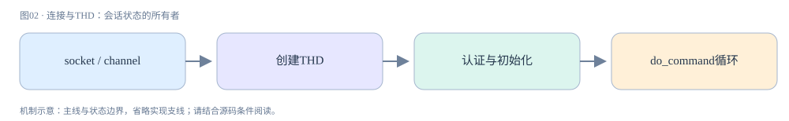

**真实源码窗口：**[sql/conn_handler/connection_handler_per_thread.cc · L246–L357](https://github.com/mysql/mysql-server/blob/dc86e412f18b36ce271f791026714e8caa0ec919/sql/conn_handler/connection_handler_per_thread.cc#L246-L357)。

```cpp
static void *handle_connection(void *arg) {
  Global_THD_manager *thd_manager = Global_THD_manager::get_instance();
  Connection_handler_manager *handler_manager =
      Connection_handler_manager::get_instance();
  Channel_info *channel_info = static_cast<Channel_info *>(arg);
  bool pthread_reused [[maybe_unused]] = false;

  if (my_thread_init()) {
    connection_errors_internal++;
    channel_info->send_error_and_close_channel(ER_OUT_OF_RESOURCES, 0, false);
    handler_manager->inc_aborted_connects();
    Connection_handler_manager::dec_connection_count();
    delete channel_info;
    my_thread_exit(nullptr);
    return nullptr;
  }

  for (;;) {
    THD *thd = init_new_thd(channel_info);
    if (thd == nullptr) {
      connection_errors_internal++;
      handler_manager->inc_aborted_connects();
      Connection_handler_manager::dec_connection_count();
      break;  // We are out of resources, no sense in continuing.
    }

#ifdef HAVE_PSI_THREAD_INTERFACE
    if (pthread_reused) {
      /*
        Reusing existing pthread:
        Create new instrumentation for the new THD job,
        and attach it to this running pthread.
      */
      PSI_thread *psi = PSI_THREAD_CALL(new_thread)(key_thread_one_connection,
                                                    0 /* no sequence number */,
                                                    thd, thd->thread_id());
      PSI_THREAD_CALL(set_thread_os_id)(psi);
      PSI_THREAD_CALL(set_thread)(psi);
    }
#endif

#ifdef HAVE_PSI_THREAD_INTERFACE
    /* Find the instrumented thread */
    PSI_thread *psi = PSI_THREAD_CALL(get_thread)();
    /* Save it within THD, so it can be inspected */
    thd->set_psi(psi);
#endif /* HAVE_PSI_THREAD_INTERFACE */
    mysql_thread_set_psi_id(thd->thread_id());
    mysql_thread_set_psi_THD(thd);
    const MYSQL_SOCKET socket =
        thd->get_protocol_classic()->get_vio()->mysql_socket;
    mysql_socket_set_thread_owner(socket);
    thd_manager->add_thd(thd);

    if (thd_prepare_connection(thd))
      handler_manager->inc_aborted_connects();
    else {
      while (thd_connection_alive(thd)) {
        if (do_command(thd)) break;
      }
      end_connection(thd);
    }
    close_connection(thd, 0, false, false);

    thd->get_stmt_da()->reset_diagnostics_area();
    thd->release_resources();

    // Clean up errors now, before possibly waiting for a new connection.
#if OPENSSL_VERSION_NUMBER < 0x10100000L
    ERR_remove_thread_state(nullptr);
#endif /* OPENSSL_VERSION_NUMBER < 0x10100000L */
    thd_manager->remove_thd(thd);
    Connection_handler_manager::dec_connection_count();

#ifdef HAVE_PSI_THREAD_INTERFACE
    /* Stop telemetry, while THD is still available. */
    if (psi != nullptr) {
      PSI_THREAD_CALL(abort_telemetry)(psi);
    }

    /* Decouple THD and the thread instrumentation. */
    thd->set_psi(nullptr);
    mysql_thread_set_psi_THD(nullptr);
#endif /* HAVE_PSI_THREAD_INTERFACE */

    delete thd;

#ifdef HAVE_PSI_THREAD_INTERFACE
    /* Delete the instrumentation for the job that just completed. */
    PSI_THREAD_CALL(delete_current_thread)();
#endif /* HAVE_PSI_THREAD_INTERFACE */

    // Server is shutting down so end the pthread.
    if (connection_events_loop_aborted()) break;

    channel_info = Per_thread_connection_handler::block_until_new_connection();
    if (channel_info == nullptr) break;
    pthread_reused = true;
    if (connection_events_loop_aborted()) {
      // Close the channel and exit as server is undergoing shutdown.
      channel_info->send_error_and_close_channel(ER_SERVER_SHUTDOWN, 0, false);
      delete channel_info;
      channel_info = nullptr;
      Connection_handler_manager::dec_connection_count();
      break;
    }
  }

  my_thread_end();
  my_thread_exit(nullptr);
  return nullptr;
}
```

<a id="chapter-03"></a>

## 03 · COM_QUERY：字节进入SQL执行入口

do_command读取并解释协议命令后进入dispatch_command。COM_QUERY分支先把查询文本复制到THD，再初始化Parser_state和digest状态，最后dispatch_sql_command。这里还要处理查询属性、多语句和错误清理，不能把“收到文本”与“SQL合法”视为同一时点。

alloc_query失败时直接跳出，Parser_state初始化失败也不执行SQL。m_input.m_has_digest和m_compute_digest决定语句摘要处理；摘要服务于监控聚合，不是结果缓存。原查询文本和归一化digest是不同信息，不能仅凭digest追溯某一次请求的参数。

prepared statement使用COM_STMT_PREPARE/EXECUTE另外的协议分支，参数类型与文本解析重用边界不同。本手册主线选择COM_QUERY是为了让解析→优化→执行链更直观。长SQL、语法错误或分号多语句应先核对协议入口，再沿诊断区追踪；不要一上来去找B+树代码。

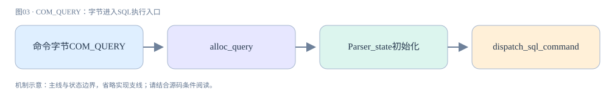

**真实源码窗口：**[sql/sql_parse.cc · L1723–L2521](https://github.com/mysql/mysql-server/blob/dc86e412f18b36ce271f791026714e8caa0ec919/sql/sql_parse.cc#L1723-L2521)。

```cpp
/**
  Perform one connection-level (COM_XXXX) command.

  @param thd             connection handle
  @param command         type of command to perform
  @param com_data        com_data union to store the generated command

  @todo
    set thd->lex->sql_command to SQLCOM_END here.
  @todo
    The following has to be changed to an 8 byte integer

  @retval
    0   ok
  @retval
    1   request of thread shutdown, i. e. if command is
        COM_QUIT
*/
bool dispatch_command(THD *thd, const COM_DATA *com_data,
                      enum enum_server_command command) {
  assert(thd->lex->m_IS_table_stats.is_valid() == false);
  assert(thd->lex->m_IS_tablespace_stats.is_valid() == false);
#ifndef NDEBUG
  auto tabstat_grd = create_scope_guard([&]() {
    assert(thd->lex->m_IS_table_stats.is_valid() == false);
    assert(thd->lex->m_IS_tablespace_stats.is_valid() == false);
  });
#endif /* NDEBUG */
  bool error = false;
  Global_THD_manager *thd_manager = Global_THD_manager::get_instance();
  DBUG_TRACE;
  DBUG_PRINT("info", ("command: %d", command));

  Sql_cmd_clone *clone_cmd = nullptr;

  /* SHOW PROFILE instrumentation, begin */
#if defined(ENABLED_PROFILING)
  thd->profiling->start_new_query();
#endif

  /* Performance Schema Interface instrumentation, begin */
  thd->m_statement_psi = MYSQL_REFINE_STATEMENT(
      thd->m_statement_psi, com_statement_info[command].m_key);

  thd->set_command(command);
  /*
    Commands which always take a long time are logged into
    the slow log only if opt_log_slow_admin_statements is set.
  */
  thd->enable_slow_log = true;
  thd->lex->sql_command = SQLCOM_END; /* to avoid confusing VIEW detectors */
  /*
    KILL QUERY may come after cleanup in mysql_execute_command(). Next query
    execution is interrupted due to this. So resetting THD::killed here.

    THD::killed value can not be KILL_TIMEOUT here as timer used for statement
    max execution time is disarmed in the cleanup stage of
    mysql_execute_command. KILL CONNECTION should terminate the connection.
    Hence resetting THD::killed only for KILL QUERY case here.
  */
  if (thd->killed == THD::KILL_QUERY) thd->killed = THD::NOT_KILLED;
  thd->set_time();
  if (is_time_t_valid_for_timestamp(thd->query_start_in_secs()) == false) {
    /*
      If the time has gone past end of epoch we need to shutdown the server. But
      there is possibility of getting invalid time value on some platforms.
      For example, gettimeofday() might return incorrect value on solaris
      platform. Hence validating the current time with 5 iterations before
      initiating the normal server shutdown process because of time getting
      past 2038.
    */
    const int max_tries = 5;
    LogErr(WARNING_LEVEL, ER_CONFIRMING_THE_FUTURE, max_tries);

    int tries = 0;
    while (++tries <= max_tries) {
      thd->set_time();
      if (is_time_t_valid_for_timestamp(thd->query_start_in_secs()) == true) {
        LogErr(WARNING_LEVEL, ER_BACK_IN_TIME, tries);
        break;
      }
      LogErr(WARNING_LEVEL, ER_FUTURE_DATE, tries);
    }
    if (tries > max_tries) {
      /*
        If the time has got past epoch, we need to shut this server down.
        We do this by making sure every command is a shutdown and we
        have enough privileges to shut the server down

        TODO: remove this when we have full 64 bit my_time_t support
      */
      LogErr(ERROR_LEVEL, ER_UNSUPPORTED_DATE);
      const ulong master_access = thd->security_context()->master_access();
      thd->security_context()->set_master_access(master_access | SHUTDOWN_ACL);
      error = true;
      kill_mysql();
    }
  }
  thd->set_query_id(next_query_id());
  thd->reset_rewritten_query();
  thd_manager->inc_thread_running();

  if (!(server_command_flags[command] & CF_SKIP_QUESTIONS)) {
    thd->status_var.questions++;
    global_aggregated_stats.get_shard(thd->thread_id()).questions++;
  }

  /**
    Clear the set of flags that are expected to be cleared at the
    beginning of each command.
  */
  thd->server_status &= ~SERVER_STATUS_CLEAR_SET;

  if (thd->get_protocol()->type() == Protocol::PROTOCOL_PLUGIN &&
      !(server_command_flags[command] & CF_ALLOW_PROTOCOL_PLUGIN)) {
    MYSQL_NOTIFY_STATEMENT_QUERY_ATTRIBUTES(thd->m_statement_psi, false);
    my_error(ER_PLUGGABLE_PROTOCOL_COMMAND_NOT_SUPPORTED, MYF(0));
    thd->killed = THD::KILL_CONNECTION;
    error = true;
    goto done;
  }

  /**
    Enforce password expiration for all RPC commands, except the
    following:

    COM_QUERY/COM_STMT_PREPARE and COM_STMT_EXECUTE do a more
    fine-grained check later.
    COM_STMT_CLOSE and COM_STMT_SEND_LONG_DATA don't return anything.
    COM_PING only discloses information that the server is running,
       and that's available through other means.
    COM_QUIT should work even for expired statements.
  */
  if (unlikely(thd->security_context()->password_expired() &&
               command != COM_QUERY && command != COM_STMT_CLOSE &&
               command != COM_STMT_SEND_LONG_DATA && command != COM_PING &&
               command != COM_QUIT && command != COM_STMT_PREPARE &&
               command != COM_STMT_EXECUTE)) {
    MYSQL_NOTIFY_STATEMENT_QUERY_ATTRIBUTES(thd->m_statement_psi, false);
    my_error(ER_MUST_CHANGE_PASSWORD, MYF(0));
    goto done;
  }

  if (mysql_event_tracking_command_notify(
          thd, AUDIT_EVENT(EVENT_TRACKING_COMMAND_START), command,
          Command_names::str_global(command).c_str())) {
    MYSQL_NOTIFY_STATEMENT_QUERY_ATTRIBUTES(thd->m_statement_psi, false);
    goto done;
  }

  /*
    For COM_QUERY, COM_STMT_EXECUTE
    wait until query attributes are extracted.
  */
  if (command != COM_QUERY && command != COM_STMT_EXECUTE) {
    MYSQL_NOTIFY_STATEMENT_QUERY_ATTRIBUTES(thd->m_statement_psi, false);
  }

  switch (command) {
    case COM_INIT_DB: {
      LEX_STRING tmp;
      thd->status_var.com_stat[SQLCOM_CHANGE_DB]++;
      global_aggregated_stats.get_shard(thd->thread_id())
          .com_stat[SQLCOM_CHANGE_DB]++;
      thd->convert_string(&tmp, system_charset_info,
                          com_data->com_init_db.db_name,
                          com_data->com_init_db.length, thd->charset());

      const LEX_CSTRING tmp_cstr = {tmp.str, tmp.length};
      if (!mysql_change_db(thd, tmp_cstr, false)) {
        query_logger.general_log_write(thd, command, thd->db().str,
                                       thd->db().length);
        my_ok(thd);
      }
      break;
    }
    case COM_REGISTER_SLAVE: {
      // TODO: access of protocol_classic should be removed
      if (!register_replica(thd, thd->get_protocol_classic()->get_raw_packet(),
                            thd->get_protocol_classic()->get_packet_length()))
        my_ok(thd);
      break;
    }
    case COM_RESET_CONNECTION: {
      thd->status_var.com_other++;
      global_aggregated_stats.get_shard(thd->thread_id()).com_other++;
      thd->cleanup_connection();
      my_ok(thd);
      break;
    }
    case COM_CLONE: {
      thd->status_var.com_other++;
      global_aggregated_stats.get_shard(thd->thread_id()).com_other++;

      /* Try loading clone plugin */
      clone_cmd = new (thd->mem_root) Sql_cmd_clone();

      if (clone_cmd && clone_cmd->load(thd)) {
        clone_cmd = nullptr;
      }

      thd->lex->m_sql_cmd = clone_cmd;
      thd->lex->sql_command = SQLCOM_CLONE;

      break;
    }
    case COM_SUBSCRIBE_GROUP_REPLICATION_STREAM: {
      Security_context *sctx = thd->security_context();
      if (!sctx->has_global_grant(STRING_WITH_LEN("GROUP_REPLICATION_STREAM"))
               .first) {
        my_error(ER_SPECIFIC_ACCESS_DENIED_ERROR, MYF(0), "");
        error = true;
        break;
      }

      if (!error && call_gr_incoming_connection_cb(
                        thd, thd->active_vio->mysql_socket.fd,
                        thd->active_vio->ssl_arg
                            ? static_cast<SSL *>(thd->active_vio->ssl_arg)
                            : nullptr)) {
        my_error(ER_UNKNOWN_COM_ERROR, MYF(0));
        error = true;
        break;
      }

      my_ok(thd);

      break;
    }
    case COM_CHANGE_USER: {
      int auth_rc;
      thd->status_var.com_other++;
      global_aggregated_stats.get_shard(thd->thread_id()).com_other++;

      thd->cleanup_connection();
      USER_CONN *save_user_connect =
          const_cast<USER_CONN *>(thd->get_user_connect());
      LEX_CSTRING save_db = thd->db();

      /*
        LOCK_thd_security_ctx protects the THD's security-context from
        inspection by SHOW PROCESSLIST while we're updating it. However,
        there is no need to protect this context while we're reading it,
        sinceother threads are not supposed to modify it.
        Nested acquiring of LOCK_thd_data is fine (see below).
      */
      const Security_context save_security_ctx(*(thd->security_context()));

      MUTEX_LOCK(grd_secctx, &thd->LOCK_thd_security_ctx);

      auth_rc = acl_authenticate(thd, COM_CHANGE_USER);
      auth_rc |= mysql_event_tracking_connection_notify(
          thd, AUDIT_EVENT(EVENT_TRACKING_CONNECTION_CHANGE_USER));
      if (auth_rc) {
        *thd->security_context() = save_security_ctx;
        thd->set_user_connect(save_user_connect);
        thd->reset_db(save_db);

        my_error(ER_ACCESS_DENIED_CHANGE_USER_ERROR, MYF(0),
                 thd->security_context()->user().str,
                 thd->security_context()->host_or_ip().str,
                 (thd->password ? ER_THD(thd, ER_YES) : ER_THD(thd, ER_NO)));
        thd->killed = THD::KILL_CONNECTION;
        error = true;
      } else {
#ifdef HAVE_PSI_THREAD_INTERFACE
        /* we've authenticated new user */
        PSI_THREAD_CALL(notify_session_change_user)(thd->get_psi());
#endif /* HAVE_PSI_THREAD_INTERFACE */

        if (save_user_connect) decrease_user_connections(save_user_connect);
        mysql_mutex_lock(&thd->LOCK_thd_data);
        my_free(const_cast<char *>(save_db.str));
        save_db = NULL_CSTR;
        mysql_mutex_unlock(&thd->LOCK_thd_data);
      }
      break;
    }
    case COM_STMT_EXECUTE: {
      /* Clear possible warnings from the previous command */
      thd->reset_for_next_command();

      Prepared_statement *stmt = nullptr;
      if (!mysql_stmt_precheck(thd, com_data, command, &stmt)) {
        PS_PARAM *parameters = com_data->com_stmt_execute.parameters;
        copy_bind_parameter_values(thd, parameters,
                                   com_data->com_stmt_execute.parameter_count);

        const bool with_query_attributes =
            (thd->bind_parameter_values_count > 0);
        MYSQL_NOTIFY_STATEMENT_QUERY_ATTRIBUTES(thd->m_statement_psi,
                                                with_query_attributes);

        mysqld_stmt_execute(thd, stmt, com_data->com_stmt_execute.has_new_types,
                            com_data->com_stmt_execute.open_cursor, parameters);
        thd->bind_parameter_values = nullptr;
        thd->bind_parameter_values_count = 0;
      }
      break;
    }
    case COM_STMT_FETCH: {
      /* Clear possible warnings from the previous command */
      thd->reset_for_next_command();

      Prepared_statement *stmt = nullptr;
      if (!mysql_stmt_precheck(thd, com_data, command, &stmt))
        mysqld_stmt_fetch(thd, stmt, com_data->com_stmt_fetch.num_rows);

      break;
    }
    case COM_STMT_SEND_LONG_DATA: {
      Prepared_statement *stmt;
      thd->get_stmt_da()->disable_status();

      if (!mysql_stmt_precheck(thd, com_data, command, &stmt))
        mysql_stmt_get_longdata(thd, stmt,
                                com_data->com_stmt_send_long_data.param_number,
                                com_data->com_stmt_send_long_data.longdata,
                                com_data->com_stmt_send_long_data.length);
      break;
    }
    case COM_STMT_PREPARE: {
      /* Clear possible warnings from the previous command */
      thd->reset_for_next_command();
      Prepared_statement *stmt = nullptr;

      DBUG_EXECUTE_IF("parser_stmt_to_error_log", {
        LogErr(INFORMATION_LEVEL, ER_PARSER_TRACE,
               com_data->com_stmt_prepare.query);
      });
      DBUG_EXECUTE_IF("parser_stmt_to_error_log_with_system_prio", {
        LogErr(SYSTEM_LEVEL, ER_PARSER_TRACE, com_data->com_stmt_prepare.query);
      });

      if (!mysql_stmt_precheck(thd, com_data, command, &stmt))
        mysqld_stmt_prepare(thd, com_data->com_stmt_prepare.query,
                            com_data->com_stmt_prepare.length, stmt);
      break;
    }
    case COM_STMT_CLOSE: {
      Prepared_statement *stmt = nullptr;
      thd->get_stmt_da()->disable_status();

      if (!mysql_stmt_precheck(thd, com_data, command, &stmt))
        mysqld_stmt_close(thd, stmt);
      break;
    }
    case COM_STMT_RESET: {
      /* Clear possible warnings from the previous command */
      thd->reset_for_next_command();

      Prepared_statement *stmt = nullptr;
      if (!mysql_stmt_precheck(thd, com_data, command, &stmt))
        mysqld_stmt_reset(thd, stmt);
      break;
    }
    case COM_QUERY: {
      /*
        IMPORTANT NOTE:

        Every execution path for COM_QUERY should call once
          MYSQL_NOTIFY_STATEMENT_QUERY_ATTRIBUTES()
      */
      assert(thd->m_digest == nullptr);
      thd->m_digest = &thd->m_digest_state;
      thd->m_digest->reset(thd->m_token_array, max_digest_length);

      if (alloc_query(thd, com_data->com_query.query,
                      com_data->com_query.length)) {
        MYSQL_NOTIFY_STATEMENT_QUERY_ATTRIBUTES(thd->m_statement_psi, false);
        break;  // fatal error is set
      }

      const char *packet_end = thd->query().str + thd->query().length;

      if (opt_general_log_raw)
        query_logger.general_log_write(thd, command, thd->query().str,
                                       thd->query().length);

      DBUG_PRINT("query", ("%-.4096s", thd->query().str));

#if defined(ENABLED_PROFILING)
      thd->profiling->set_query_source(thd->query().str, thd->query().length);
#endif

      const LEX_CSTRING orig_query = thd->query();

      Parser_state parser_state;
      if (parser_state.init(thd, thd->query().str, thd->query().length)) {
        MYSQL_NOTIFY_STATEMENT_QUERY_ATTRIBUTES(thd->m_statement_psi, false);
        break;
      }

      parser_state.m_input.m_has_digest = true;

      // we produce digest if it's not explicitly turned off
      // by setting maximum digest length to zero
      if (get_max_digest_length() != 0)
        parser_state.m_input.m_compute_digest = true;
      /*
        Initially, set up the statement for preparation and optimization
        in the primary storage engine. If an eligible secondary storage engine
        is found, the statement may be reprepared for the secondary storage
        engine later. In addition, open_secondary_engine_tables() will directly
        set up for the secondary storage engine if secondary engine is forced.
      */
      thd->set_secondary_engine_optimization(
          Secondary_engine_optimization::PRIMARY_TENTATIVELY);

      copy_bind_parameter_values(thd, com_data->com_query.parameters,
                                 com_data->com_query.parameter_count);

      /* This will call MYSQL_NOTIFY_STATEMENT_QUERY_ATTRIBUTES() */
      dispatch_sql_command(thd, &parser_state);

      // If statement failed, possibly restart it in another storage engine.
      if (thd->is_error()) {
        check_secondary_engine_statement(thd, &parser_state, orig_query.str,
                                         orig_query.length);
      }

      DBUG_EXECUTE_IF("parser_stmt_to_error_log", {
        LogErr(INFORMATION_LEVEL, ER_PARSER_TRACE, thd->query().str);
      });
      DBUG_EXECUTE_IF("parser_stmt_to_error_log_with_system_prio", {
        LogErr(SYSTEM_LEVEL, ER_PARSER_TRACE, thd->query().str);
      });

      while (!thd->killed && (parser_state.m_lip.found_semicolon != nullptr) &&
             !thd->is_error()) {
        // Multiple queries exist, execute them individually
        const char *beginning_of_next_stmt = parser_state.m_lip.found_semicolon;

        /* Finalize server status flags after executing a statement. */
        thd->update_slow_query_status();
        thd->send_statement_status();

        const std::string &cn = Command_names::str_global(command);
        mysql_event_tracking_general_notify(
            thd, AUDIT_EVENT(EVENT_TRACKING_GENERAL_STATUS),
            thd->get_stmt_da()->is_error() ? thd->get_stmt_da()->mysql_errno()
                                           : 0,
            cn.c_str(), cn.length());

        size_t length =
            static_cast<size_t>(packet_end - beginning_of_next_stmt);

        log_slow_statement(thd);

        thd->reset_copy_status_var();

        // Remove white space at start of query
        while (length > 0 &&
               my_isspace(thd->charset(), *beginning_of_next_stmt)) {
          beginning_of_next_stmt++;
          length--;
        }

        /* PSI end */
        MYSQL_END_STATEMENT(thd->m_statement_psi, thd->get_stmt_da());
        thd->m_statement_psi = nullptr;
        thd->m_digest = nullptr;

/* SHOW PROFILE end */
#if defined(ENABLED_PROFILING)
        thd->profiling->finish_current_query();
#endif

/* SHOW PROFILE begin */
#if defined(ENABLED_PROFILING)
        thd->profiling->start_new_query("continuing");
        thd->profiling->set_query_source(beginning_of_next_stmt, length);
#endif

        mysql_thread_set_secondary_engine(false);

        /* PSI begin */
        thd->m_digest = &thd->m_digest_state;
        thd->m_digest->reset(thd->m_token_array, max_digest_length);

        thd->m_statement_psi = MYSQL_START_STATEMENT(
            &thd->m_statement_state, com_statement_info[command].m_key,
            thd->db().str, thd->db().length, thd->charset(), nullptr);
        THD_STAGE_INFO(thd, stage_starting);

        thd->set_query(beginning_of_next_stmt, length);
        thd->set_query_id(next_query_id());

        /*
          Count each statement from the client.
        */
        thd->status_var.questions++;
        global_aggregated_stats.get_shard(thd->thread_id()).questions++;
        thd->set_time(); /* Reset the query start time. */
        parser_state.reset(beginning_of_next_stmt, length);
        thd->set_secondary_engine_optimization(
            Secondary_engine_optimization::PRIMARY_TENTATIVELY);
        /* TODO: set thd->lex->sql_command to SQLCOM_END here */
        dispatch_sql_command(thd, &parser_state);

        if (thd->is_error()) {
          check_secondary_engine_statement(thd, &parser_state,
                                           beginning_of_next_stmt, length);
        }
      }

      thd->bind_parameter_values = nullptr;
      thd->bind_parameter_values_count = 0;
      thd->set_secondary_engine_statement_context(nullptr);

      /* Need to set error to true for graceful shutdown */
      if ((thd->lex->sql_command == SQLCOM_SHUTDOWN) &&
          (thd->get_stmt_da()->is_ok()))
        error = true;

      DBUG_PRINT("info", ("query ready"));
      break;
    }
    case COM_FIELD_LIST:  // This isn't actually needed
    {
      char *fields;
      /* Locked closure of all tables */
      LEX_STRING table_name;
      LEX_STRING db;
      push_deprecated_warn(thd, "COM_FIELD_LIST",
                           "SHOW COLUMNS FROM statement");
      /*
        SHOW statements should not add the used tables to the list of tables
        used in a transaction.
      */
      MDL_savepoint mdl_savepoint = thd->mdl_context.mdl_savepoint();
      thd->status_var.com_stat[SQLCOM_SHOW_FIELDS]++;
      global_aggregated_stats.get_shard(thd->thread_id())
          .com_stat[SQLCOM_SHOW_FIELDS]++;
      if (thd->copy_db_to(&db.str, &db.length)) break;
      thd->convert_string(&table_name, system_charset_info,
                          (char *)com_data->com_field_list.table_name,
                          com_data->com_field_list.table_name_length,
                          thd->charset());
      const Ident_name_check ident_check_status =
          check_table_name(table_name.str, table_name.length);
      if (ident_check_status == Ident_name_check::WRONG) {
        /* this is OK due to convert_string() null-terminating the string */
        my_error(ER_WRONG_TABLE_NAME, MYF(0), table_name.str);
        break;
      } else if (ident_check_status == Ident_name_check::TOO_LONG) {
        my_error(ER_TOO_LONG_IDENT, MYF(0), table_name.str);
        break;
      }
      mysql_reset_thd_for_next_command(thd);
      lex_start(thd);
      /* Must be before we init the table list. */
      if (lower_case_table_names && !is_infoschema_db(db.str, db.length))
        table_name.length = my_casedn_str(files_charset_info, table_name.str);
      Table_ref table_list(db.str, db.length, table_name.str, table_name.length,
                           table_name.str, TL_READ);
      /*
        Init Table_ref members necessary when the undelrying
        table is view.
      */
      table_list.query_block = thd->lex->query_block;
      thd->lex->query_block->m_table_list.link_in_list(&table_list,
                                                       &table_list.next_local);
      thd->lex->add_to_query_tables(&table_list);
      if (is_infoschema_db(table_list.db, table_list.db_length)) {
        ST_SCHEMA_TABLE *schema_table =
            find_schema_table(thd, table_list.alias);
        if (schema_table) table_list.schema_table = schema_table;
      }
      if (!(fields =
                (char *)thd->memdup(com_data->com_field_list.query,
                                    com_data->com_field_list.query_length)))
        break;
      // Don't count end \0
      thd->set_query(fields, com_data->com_field_list.query_length - 1);
      query_logger.general_log_print(thd, command, "%s %s",
                                     table_list.table_name, fields);
      if (open_temporary_tables(thd, &table_list)) break;
      if (check_table_access(thd, SELECT_ACL, &table_list, true, UINT_MAX,
                             false))
        break;
      thd->lex->sql_command = SQLCOM_SHOW_FIELDS;
      // See comment in opt_trace_disable_if_no_security_context_access()
      const Opt_trace_start ots(thd, &table_list, thd->lex->sql_command,
                                nullptr, nullptr, 0, nullptr, nullptr);
      mysqld_list_fields(thd, &table_list, fields);
      thd->lex->cleanup(true);
      /* No need to rollback statement transaction, it's not started. */
      assert(thd->get_transaction()->is_empty(Transaction_ctx::STMT));
      close_thread_tables(thd);
      thd->mdl_context.rollback_to_savepoint(mdl_savepoint);
      if (thd->transaction_rollback_request) {
        /*
          Transaction rollback was requested since MDL deadlock was
          discovered while trying to open tables. Rollback transaction
          in all storage engines including binary log and release all
          locks.
        */
        trans_rollback_implicit(thd);
        thd->mdl_context.release_transactional_locks();
      }
      thd->cleanup_after_query();
      thd->lex->destroy();
      break;
    }
    case COM_QUIT:
      /* Prevent results of the form, "n>0 rows sent, 0 bytes sent" */
      thd->set_sent_row_count(0);
      /* We don't calculate statistics for this command */
      query_logger.general_log_print(thd, command, NullS);
      // Don't give 'abort' message
      // TODO: access of protocol_classic should be removed
      if (thd->is_classic_protocol())
        thd->get_protocol_classic()->get_net()->error = NET_ERROR_UNSET;
      thd->get_stmt_da()->disable_status();  // Don't send anything back
      error = true;                          // End server
      break;
    case COM_BINLOG_DUMP_GTID:
      // TODO: access of protocol_classic should be removed
      error = com_binlog_dump_gtid(
          thd, (char *)thd->get_protocol_classic()->get_raw_packet(),
          thd->get_protocol_classic()->get_packet_length());
      break;
    case COM_BINLOG_DUMP:
      // TODO: access of protocol_classic should be removed
      error = com_binlog_dump(
          thd, (char *)thd->get_protocol_classic()->get_raw_packet(),
          thd->get_protocol_classic()->get_packet_length());
      break;
    case COM_STATISTICS: {
      System_status_var current_global_status_var;
      ulong uptime;
      size_t length [[maybe_unused]];
      ulonglong queries_per_second1000;
      char buff[250];
      const size_t buff_len = sizeof(buff);

      query_logger.general_log_print(thd, command, NullS);
      thd->status_var.com_stat[SQLCOM_SHOW_STATUS]++;
      global_aggregated_stats.get_shard(thd->thread_id())
          .com_stat[SQLCOM_SHOW_STATUS]++;
      mysql_mutex_lock(&LOCK_status);
      calc_sum_of_all_status(&current_global_status_var);
      mysql_mutex_unlock(&LOCK_status);
      if (!(uptime = (ulong)(thd->query_start_in_secs() - server_start_time)))
        queries_per_second1000 = 0;
      else
        queries_per_second1000 = thd->query_id * 1000LL / uptime;

      length = snprintf(buff, buff_len - 1,
                        "Uptime: %lu  Threads: %d  Questions: %lu  "
                        "Slow queries: %llu  Opens: %llu  Flush tables: %lu  "
                        "Open tables: %u  Queries per second avg: %u.%03u",
                        uptime, (int)thd_manager->get_thd_count(),
                        (ulong)thd->query_id,
                        current_global_status_var.long_query_count,
                        current_global_status_var.opened_tables,
                        refresh_version, table_cache_manager.cached_tables(),
                        (uint)(queries_per_second1000 / 1000),
                        (uint)(queries_per_second1000 % 1000));
      // TODO: access of protocol_classic should be removed.
      // should be rewritten using store functions
      if (thd->get_protocol_classic()->write(pointer_cast<const uchar *>(buff),
                                             length))
        break;
      if (thd->get_protocol()->flush()) break;
      thd->get_stmt_da()->disable_status();
      break;
    }
    case COM_PING:
      thd->status_var.com_other++;
      global_aggregated_stats.get_shard(thd->thread_id()).com_other++;
      my_ok(thd);  // Tell client we are alive
      break;
    case COM_SET_OPTION: {
      thd->status_var.com_stat[SQLCOM_SET_OPTION]++;
      global_aggregated_stats.get_shard(thd->thread_id())
          .com_stat[SQLCOM_SET_OPTION]++;

      switch (com_data->com_set_option.opt_command) {
        case (int)MYSQL_OPTION_MULTI_STATEMENTS_ON:
          // TODO: access of protocol_classic should be removed
          thd->get_protocol_classic()->add_client_capability(
              CLIENT_MULTI_STATEMENTS);
          my_eof(thd);
          break;
        case (int)MYSQL_OPTION_MULTI_STATEMENTS_OFF:
          thd->get_protocol_classic()->remove_client_capability(
              CLIENT_MULTI_STATEMENTS);
          my_eof(thd);
          break;
        default:
          my_error(ER_UNKNOWN_COM_ERROR, MYF(0));
          break;
      }
      break;
    }
    case COM_DEBUG:
      thd->status_var.com_other++;
      global_aggregated_stats.get_shard(thd->thread_id()).com_other++;
      if (check_global_access(thd, SUPER_ACL)) break; /* purecov: inspected */
      query_logger.general_log_print(thd, command, NullS);
      my_eof(thd);
#ifdef WITH_LOCK_ORDER
      LO_dump();
#endif /* WITH_LOCK_ORDER */
      break;
    case COM_SLEEP:
    case COM_CONNECT:         // Impossible here
    case COM_TIME:            // Impossible from client
    case COM_DELAYED_INSERT:  // INSERT DELAYED has been removed.
    case COM_END:
    default:
      my_error(ER_UNKNOWN_COM_ERROR, MYF(0));
      break;
  }

done:
  assert(thd->open_tables == nullptr ||
         (thd->locked_tables_mode == LTM_LOCK_TABLES));

  /* Finalize server status flags after executing a command. */
  thd->update_slow_query_status();
  if (thd->killed) thd->send_kill_message();
  thd->send_statement_status();

  /* After sending response, switch to clone protocol */
  if (clone_cmd != nullptr) {
    assert(command == COM_CLONE);
    error = clone_cmd->execute_server(thd);
  }

  if (command == COM_SUBSCRIBE_GROUP_REPLICATION_STREAM && !error) {
    wait_for_gr_connection_end(thd);
  }

  thd->rpl_thd_ctx.session_gtids_ctx().notify_after_response_packet(thd);

  if (!thd->is_error() && !thd->killed)
    mysql_event_tracking_general_notify(
        thd, AUDIT_EVENT(EVENT_TRACKING_GENERAL_RESULT), 0, nullptr, 0);

  const std::string &cn = Command_names::str_global(command);
  mysql_event_tracking_general_notify(
      thd, AUDIT_EVENT(EVENT_TRACKING_GENERAL_STATUS),
      thd->get_stmt_da()->is_error() ? thd->get_stmt_da()->mysql_errno() : 0,
      cn.c_str(), cn.length());

  /* command_end is informational only. The plugin cannot abort
     execution of the command at this point. */
  mysql_event_tracking_command_notify(
      thd, AUDIT_EVENT(EVENT_TRACKING_COMMAND_END), command, cn.c_str());

  log_slow_statement(thd);

  THD_STAGE_INFO(thd, stage_cleaning_up);

  thd->reset_query();
  thd->set_command(COM_SLEEP);
  thd->set_proc_info(nullptr);
  thd->lex->sql_command = SQLCOM_END;

  /* Performance Schema Interface instrumentation, end */
  MYSQL_END_STATEMENT(thd->m_statement_psi, thd->get_stmt_da());
  thd->m_statement_psi = nullptr;
  thd->m_digest = nullptr;
  thd->reset_query_for_display();

  /* Prevent rewritten query from getting "stuck" in SHOW PROCESSLIST. */
  thd->reset_rewritten_query();

  thd_manager->dec_thread_running();

  /* Freeing the memroot will leave the THD::work_part_info invalid. */
  thd->work_part_info = nullptr;

  /*
    If we've allocated a lot of memory (compared to the default preallocation
    size = 8192; note that we don't actually preallocate anymore), free
    it so that one big query won't cause us to hold on to a lot of RAM forever.
    If not, keep the last block so that the next query will hopefully be able to
    run without allocating memory from the OS.

    The factor 5 is pretty much arbitrary, but ends up allowing three
    allocations (1 + 1.5 + 1.5²) under the current allocation policy.
  */
  constexpr size_t kPreallocSz = 40960;
  if (thd->mem_root->allocated_size() < kPreallocSz)
    thd->mem_root->ClearForReuse();
  else
    thd->mem_root->Clear();

    /* SHOW PROFILE instrumentation, end */
#if defined(ENABLED_PROFILING)
  thd->profiling->finish_current_query();
#endif

  return error;
}
```

<a id="chapter-04"></a>

## 04 · 词法与语法：文本如何成为查询结构

lex_one_token负责从Lex_input_stream取字符并分类，关键字和标识符通过字符集、转义及SQL模式解释。sql/sql_yacc.yy声明Bison语法与语义动作，语法树随后形成Query_expression、Query_block、Item等结构。parse_sql在sql_parse.cc包装解析过程，错误写入THD诊断区。

WHERE a=1在这里是表达式树，不是已经选好了索引；表名出现也不意味着表已经成功打开。语法合法之后，名称解析还需要把列引用绑定到表和字段，对聚合、类型转换等做语义检查。词法、语法、解析后准备阶段各自有不同失败条件。

源码中有大量解析上下文与mem_root对象。生命周期边界解释了为什么不能保存某个Item指针给下一次COM_QUERY继续用。排查SQL注入也要在协议和解析边界思考：参数绑定传入值与字符串拼接改变语法结构是不同操作，索引优化无法弥补错误的查询结构。

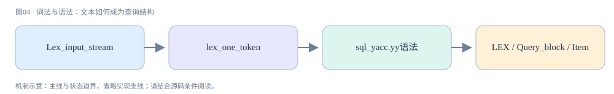

**真实源码窗口：**[sql/sql_lex.cc · L1432–L2156](https://github.com/mysql/mysql-server/blob/dc86e412f18b36ce271f791026714e8caa0ec919/sql/sql_lex.cc#L1432-L2156)。

```cpp
static int lex_one_token(Lexer_yystype *yylval, THD *thd) {
  uchar c = 0;
  bool comment_closed;
  int tokval, result_state;
  uint length;
  enum my_lex_states state;
  Lex_input_stream *lip = &thd->m_parser_state->m_lip;
  const CHARSET_INFO *cs = thd->charset();
  const my_lex_states *state_map = cs->state_maps->main_map;
  const uchar *ident_map = cs->ident_map;

  lip->yylval = yylval;  // The global state

  lip->start_token();
  state = lip->next_state;
  lip->next_state = MY_LEX_START;
  for (;;) {
    switch (state) {
      case MY_LEX_START:  // Start of token
        // Skip starting whitespace
        while (state_map[c = lip->yyPeek()] == MY_LEX_SKIP) {
          if (c == '\n') lip->yylineno++;

          lip->yySkip();
        }

        /* Start of real token */
        lip->restart_token();
        c = lip->yyGet();
        state = state_map[c];
        break;
      case MY_LEX_CHAR:  // Unknown or single char token
      case MY_LEX_SKIP:  // This should not happen
        if (c == '-' && lip->yyPeek() == '-' &&
            (my_isspace(cs, lip->yyPeekn(1)) ||
             my_iscntrl(cs, lip->yyPeekn(1)))) {
          state = MY_LEX_COMMENT;
          break;
        }

        if (c == '-' && lip->yyPeek() == '>')  // '->'
        {
          lip->yySkip();
          lip->next_state = MY_LEX_START;
          if (lip->yyPeek() == '>') {
            lip->yySkip();
            return JSON_UNQUOTED_SEPARATOR_SYM;
          }
          return JSON_SEPARATOR_SYM;
        }

        if (c != ')') lip->next_state = MY_LEX_START;  // Allow signed numbers

        /*
          Check for a placeholder: it should not precede a possible identifier
          because of binlogging: when a placeholder is replaced with its value
          in a query for the binlog, the query must stay grammatically correct.
        */
        if (c == '?' && lip->stmt_prepare_mode && !ident_map[lip->yyPeek()])
          return (PARAM_MARKER);

        return ((int)c);

      case MY_LEX_IDENT_OR_NCHAR:
        if (lip->yyPeek() != '\'') {
          state = MY_LEX_IDENT;
          break;
        }
        /* Found N'string' */
        lip->yySkip();  // Skip '
        if (!(yylval->lex_str.str = get_text(lip, 2, 1))) {
          state = MY_LEX_CHAR;  // Read char by char
          break;
        }
        yylval->lex_str.length = lip->yytoklen;
        return (NCHAR_STRING);

      case MY_LEX_IDENT_OR_HEX:
        if (lip->yyPeek() == '\'') {  // Found x'hex-number'
          state = MY_LEX_HEX_NUMBER;
          break;
        }
        [[fallthrough]];
      case MY_LEX_IDENT_OR_BIN:
        if (lip->yyPeek() == '\'') {  // Found b'bin-number'
          state = MY_LEX_BIN_NUMBER;
          break;
        }
        [[fallthrough]];
      case MY_LEX_IDENT:
        const char *start;
        if (use_mb(cs)) {
          result_state = IDENT_QUOTED;
          switch (my_mbcharlen(cs, lip->yyGetLast())) {
            case 1:
              break;
            case 0:
              if (my_mbmaxlenlen(cs) < 2) break;
              [[fallthrough]];
            default:
              const int l =
                  my_ismbchar(cs, lip->get_ptr() - 1, lip->get_end_of_query());
              if (l == 0) {
                state = MY_LEX_CHAR;
                continue;
              }
              lip->skip_binary(l - 1);
          }
          while (ident_map[c = lip->yyGet()]) {
            switch (my_mbcharlen(cs, c)) {
              case 1:
                break;
              case 0:
                if (my_mbmaxlenlen(cs) < 2) break;
                [[fallthrough]];
              default:
                int l;
                if ((l = my_ismbchar(cs, lip->get_ptr() - 1,
                                     lip->get_end_of_query())) == 0)
                  break;
                lip->skip_binary(l - 1);
            }
          }
        } else {
          for (result_state = c; ident_map[c = lip->yyGet()]; result_state |= c)
            ;
          /* If there were non-ASCII characters, mark that we must convert */
          result_state = result_state & 0x80 ? IDENT_QUOTED : IDENT;
        }
        length = lip->yyLength();
        start = lip->get_ptr();
        if (lip->ignore_space) {
          /*
            If we find a space then this can't be an identifier. We notice this
            below by checking start != lex->ptr.
          */
          for (; state_map[c] == MY_LEX_SKIP; c = lip->yyGet()) {
            if (c == '\n') lip->yylineno++;
          }
        }
        if (start == lip->get_ptr() && c == '.' && ident_map[lip->yyPeek()])
          lip->next_state = MY_LEX_IDENT_SEP;
        else {  // '(' must follow directly if function
          lip->yyUnget();
          if ((tokval = find_keyword(lip, length, c == '('))) {
            lip->next_state = MY_LEX_START;  // Allow signed numbers
            return (tokval);                 // Was keyword
          }
          lip->yySkip();  // next state does a unget
        }
        yylval->lex_str = get_token(lip, 0, length);

        /*
           Note: "SELECT _bla AS 'alias'"
           _bla should be considered as a IDENT if charset haven't been found.
           So we don't want to produce any warning in find_primary.
        */

        if (yylval->lex_str.str[0] == '_') {
          auto charset_name = yylval->lex_str.str + 1;
          const CHARSET_INFO *underscore_cs =
              mysql::collation::find_primary(charset_name);
          if (underscore_cs) {
            lip->warn_on_deprecated_charset(underscore_cs, charset_name);
            if (underscore_cs == &my_charset_utf8mb4_0900_ai_ci) {
              /*
                If underscore_cs is utf8mb4, and the collation of underscore_cs
                is the default collation of utf8mb4, then update underscore_cs
                with a value of the default_collation_for_utf8mb4 system
                variable:
              */
              underscore_cs = thd->variables.default_collation_for_utf8mb4;
            }
            yylval->charset = underscore_cs;
            lip->m_underscore_cs = underscore_cs;

            lip->body_utf8_append(lip->m_cpp_text_start,
                                  lip->get_cpp_tok_start() + length);
            return (UNDERSCORE_CHARSET);
          }
        }

        lip->body_utf8_append(lip->m_cpp_text_start);

        lip->body_utf8_append_literal(thd, &yylval->lex_str, cs,
                                      lip->m_cpp_text_end);

        return (result_state);  // IDENT or IDENT_QUOTED

      case MY_LEX_IDENT_SEP:  // Found ident and now '.'
        yylval->lex_str.str = const_cast<char *>(lip->get_ptr());
        yylval->lex_str.length = 1;
        c = lip->yyGet();  // should be '.'
        if (const uchar next_c = lip->yyPeek(); ident_map[next_c]) {
          lip->next_state =
              MY_LEX_IDENT_START;  // Next is an ident (not a keyword)
          if (next_c == '$')       // We got .$ident
            push_deprecated_warn_no_replacement(
                lip->m_thd,
                "$ as the first character of an unquoted identifier");
        } else  // Probably ` or "
          lip->next_state = MY_LEX_START;

        return ((int)c);

      case MY_LEX_NUMBER_IDENT:  // number or ident which num-start
        if (lip->yyGetLast() == '0') {
          c = lip->yyGet();
          if (c == 'x') {
            while (my_isxdigit(cs, (c = lip->yyGet())))
              ;
            if ((lip->yyLength() >= 3) && !ident_map[c]) {
              /* skip '0x' */
              yylval->lex_str = get_token(lip, 2, lip->yyLength() - 2);
              return (HEX_NUM);
            }
            lip->yyUnget();
            state = MY_LEX_IDENT_START;
            break;
          } else if (c == 'b') {
            while ((c = lip->yyGet()) == '0' || c == '1')
              ;
            if ((lip->yyLength() >= 3) && !ident_map[c]) {
              /* Skip '0b' */
              yylval->lex_str = get_token(lip, 2, lip->yyLength() - 2);
              return (BIN_NUM);
            }
            lip->yyUnget();
            state = MY_LEX_IDENT_START;
            break;
          }
          lip->yyUnget();
        }

        while (my_isdigit(cs, (c = lip->yyGet())))
          ;
        if (!ident_map[c]) {  // Can't be identifier
          state = MY_LEX_INT_OR_REAL;
          break;
        }
        if (c == 'e' || c == 'E') {
          // The following test is written this way to allow numbers of type 1e1
          if (my_isdigit(cs, lip->yyPeek()) || (c = (lip->yyGet())) == '+' ||
              c == '-') {  // Allow 1E+10
            if (my_isdigit(cs,
                           lip->yyPeek()))  // Number must have digit after sign
            {
              lip->yySkip();
              while (my_isdigit(cs, lip->yyGet()))
                ;
              yylval->lex_str = get_token(lip, 0, lip->yyLength());
              return (FLOAT_NUM);
            }
          }
          lip->yyUnget();
        }
        [[fallthrough]];
      case MY_LEX_IDENT_START:  // We come here after '.'
        result_state = IDENT;
        if (use_mb(cs)) {
          result_state = IDENT_QUOTED;
          while (ident_map[c = lip->yyGet()]) {
            switch (my_mbcharlen(cs, c)) {
              case 1:
                break;
              case 0:
                if (my_mbmaxlenlen(cs) < 2) break;
                [[fallthrough]];
              default:
                int l;
                if ((l = my_ismbchar(cs, lip->get_ptr() - 1,
                                     lip->get_end_of_query())) == 0)
                  break;
                lip->skip_binary(l - 1);
            }
          }
        } else {
          for (result_state = 0; ident_map[c = lip->yyGet()]; result_state |= c)
            ;
          /* If there were non-ASCII characters, mark that we must convert */
          result_state = result_state & 0x80 ? IDENT_QUOTED : IDENT;
        }
        if (c == '.' && ident_map[lip->yyPeek()])
          lip->next_state = MY_LEX_IDENT_SEP;  // Next is '.'

        yylval->lex_str = get_token(lip, 0, lip->yyLength());

        lip->body_utf8_append(lip->m_cpp_text_start);

        lip->body_utf8_append_literal(thd, &yylval->lex_str, cs,
                                      lip->m_cpp_text_end);

        return (result_state);

      case MY_LEX_USER_VARIABLE_DELIMITER:  // Found quote char
      {
        uint double_quotes = 0;
        const char quote_char = c;  // Used char
        for (;;) {
          c = lip->yyGet();
          if (c == 0) {
            lip->yyUnget();
            return ABORT_SYM;  // Unmatched quotes
          }

          int var_length;
          if ((var_length = my_mbcharlen(cs, c)) == 1) {
            if (c == quote_char) {
              if (lip->yyPeek() != quote_char) break;
              c = lip->yyGet();
              double_quotes++;
              continue;
            }
          } else if (use_mb(cs)) {
            if ((var_length = my_ismbchar(cs, lip->get_ptr() - 1,
                                          lip->get_end_of_query())))
              lip->skip_binary(var_length - 1);
          }
        }
        if (double_quotes)
          yylval->lex_str = get_quoted_token(
              lip, 1, lip->yyLength() - double_quotes - 1, quote_char);
        else
          yylval->lex_str = get_token(lip, 1, lip->yyLength() - 1);
        if (c == quote_char) lip->yySkip();  // Skip end `
        lip->next_state = MY_LEX_START;

        lip->body_utf8_append(lip->m_cpp_text_start);

        lip->body_utf8_append_literal(thd, &yylval->lex_str, cs,
                                      lip->m_cpp_text_end);

        return (IDENT_QUOTED);
      }
      case MY_LEX_INT_OR_REAL:  // Complete int or incomplete real
        if (c != '.') {         // Found complete integer number.
          yylval->lex_str = get_token(lip, 0, lip->yyLength());
          return int_token(yylval->lex_str.str, (uint)yylval->lex_str.length);
        }
        [[fallthrough]];
      case MY_LEX_REAL:  // Incomplete real number
        while (my_isdigit(cs, c = lip->yyGet()))
          ;

        if (c == 'e' || c == 'E') {
          c = lip->yyGet();
          if (c == '-' || c == '+') c = lip->yyGet();  // Skip sign
          if (!my_isdigit(cs, c)) {                    // No digit after sign
            state = MY_LEX_CHAR;
            break;
          }
          while (my_isdigit(cs, lip->yyGet()))
            ;
          yylval->lex_str = get_token(lip, 0, lip->yyLength());
          return (FLOAT_NUM);
        }
        yylval->lex_str = get_token(lip, 0, lip->yyLength());
        return (DECIMAL_NUM);

      case MY_LEX_HEX_NUMBER:  // Found x'hexstring'
        lip->yySkip();         // Accept opening '
        while (my_isxdigit(cs, (c = lip->yyGet())))
          ;
        if (c != '\'') return (ABORT_SYM);          // Illegal hex constant
        lip->yySkip();                              // Accept closing '
        length = lip->yyLength();                   // Length of hexnum+3
        if ((length % 2) == 0) return (ABORT_SYM);  // odd number of hex digits
        yylval->lex_str = get_token(lip,
                                    2,            // skip x'
                                    length - 3);  // don't count x' and last '
        return (HEX_NUM);

      case MY_LEX_BIN_NUMBER:  // Found b'bin-string'
        lip->yySkip();         // Accept opening '
        while ((c = lip->yyGet()) == '0' || c == '1')
          ;
        if (c != '\'') return (ABORT_SYM);  // Illegal hex constant
        lip->yySkip();                      // Accept closing '
        length = lip->yyLength();           // Length of bin-num + 3
        yylval->lex_str = get_token(lip,
                                    2,            // skip b'
                                    length - 3);  // don't count b' and last '
        return (BIN_NUM);

      case MY_LEX_CMP_OP:  // Incomplete comparison operator
        if (state_map[lip->yyPeek()] == MY_LEX_CMP_OP ||
            state_map[lip->yyPeek()] == MY_LEX_LONG_CMP_OP)
          lip->yySkip();
        if ((tokval = find_keyword(lip, lip->yyLength() + 1, false))) {
          lip->next_state = MY_LEX_START;  // Allow signed numbers
          return (tokval);
        }
        state = MY_LEX_CHAR;  // Something fishy found
        break;

      case MY_LEX_LONG_CMP_OP:  // Incomplete comparison operator
        if (state_map[lip->yyPeek()] == MY_LEX_CMP_OP ||
            state_map[lip->yyPeek()] == MY_LEX_LONG_CMP_OP) {
          lip->yySkip();
          if (state_map[lip->yyPeek()] == MY_LEX_CMP_OP) lip->yySkip();
        }
        if ((tokval = find_keyword(lip, lip->yyLength() + 1, false))) {
          lip->next_state = MY_LEX_START;  // Found long op
          return (tokval);
        }
        state = MY_LEX_CHAR;  // Something fishy found
        break;

      case MY_LEX_BOOL:
        if (c != lip->yyPeek()) {
          state = MY_LEX_CHAR;
          break;
        }
        lip->yySkip();
        tokval = find_keyword(lip, 2, false);  // Is a bool operator
        lip->next_state = MY_LEX_START;        // Allow signed numbers
        return (tokval);

      case MY_LEX_STRING_OR_DELIMITER:
        if (thd->variables.sql_mode & MODE_ANSI_QUOTES) {
          state = MY_LEX_USER_VARIABLE_DELIMITER;
          break;
        }
        /* " used for strings */
        [[fallthrough]];
      case MY_LEX_STRING:  // Incomplete text string
        if (!(yylval->lex_str.str = get_text(lip, 1, 1))) {
          state = MY_LEX_CHAR;  // Read char by char
          break;
        }
        yylval->lex_str.length = lip->yytoklen;

        lip->body_utf8_append(lip->m_cpp_text_start);

        lip->body_utf8_append_literal(
            thd, &yylval->lex_str,
            lip->m_underscore_cs ? lip->m_underscore_cs : cs,
            lip->m_cpp_text_end);

        lip->m_underscore_cs = nullptr;

        return (TEXT_STRING);

      case MY_LEX_COMMENT:  //  Comment
        thd->m_parser_state->add_comment();
        while ((c = lip->yyGet()) != '\n' && c)
          ;
        lip->yyUnget();        // Safety against eof
        state = MY_LEX_START;  // Try again
        break;
      case MY_LEX_LONG_COMMENT: /* Long C comment? */
        if (lip->yyPeek() != '*') {
          state = MY_LEX_CHAR;  // Probable division
          break;
        }
        thd->m_parser_state->add_comment();
        /* Reject '/' '*', since we might need to turn off the echo */
        lip->yyUnget();

        lip->save_in_comment_state();

        if (lip->yyPeekn(2) == '!') {
          lip->in_comment = DISCARD_COMMENT;
          /* Accept '/' '*' '!', but do not keep this marker. */
          lip->set_echo(false);
          lip->yySkip();
          lip->yySkip();
          lip->yySkip();

          /*
            The special comment format is very strict:
            '/' '*' '!', followed by either

            6 digits: 2 digits (major), 2 digits (mionr), 2 digits (dot), then a
            white-space character.
            032302 -> 3.23.2
            050032 -> 5.0.32
            050114 -> 5.1.14
            100000 -> 10.0.0

            or, if that format is not matched:

            5 digits: 1 digit (major), 2 digits (minor), then 2 digits (dot).
            32302 -> 3.23.2
            50032 -> 5.0.32
            50114 -> 5.1.14
          */
          char version_str[7] = {0};
          if (my_isdigit(cs, (version_str[0] = lip->yyPeekn(0))) &&
              my_isdigit(cs, (version_str[1] = lip->yyPeekn(1))) &&
              my_isdigit(cs, (version_str[2] = lip->yyPeekn(2))) &&
              my_isdigit(cs, (version_str[3] = lip->yyPeekn(3))) &&
              my_isdigit(cs, (version_str[4] = lip->yyPeekn(4)))) {
            if (my_isdigit(cs, lip->yyPeekn(5)) &&
                my_isspace(cs, lip->yyPeekn(6))) {
              version_str[5] = lip->yyPeekn(5);
            } else if (!my_isspace(cs, lip->yyPeekn(5))) {
              push_warning(thd, Sql_condition::SL_WARNING,
                           ER_WARN_NO_SPACE_VERSION_COMMENT,
                           ER_THD(thd, ER_WARN_NO_SPACE_VERSION_COMMENT));
            }

            ulong version = strtol(version_str, nullptr, 10);
            if (version <= MYSQL_VERSION_ID) {
              /* Accept ('M') 'M' 'm' 'm' 'd' 'd' */
              lip->yySkipn(strlen(version_str));
              /* Expand the content of the special comment as real code */
              lip->set_echo(true);
              state = MY_LEX_START;
              break; /* Do not treat contents as a comment.  */
            } else {
              /*
                Patch and skip the conditional comment to avoid it
                being propagated infinitely (eg. to a slave).
              */
              char *pcom = lip->yyUnput(' ');
              comment_closed = !consume_comment(lip, 1);
              if (!comment_closed) {
                *pcom = '!';
              }
              /* version allowed to have one level of comment inside. */
            }
          } else {
            /* Not a version comment. */
            state = MY_LEX_START;
            lip->set_echo(true);
            break;
          }
        } else {
          if (lip->in_comment != NO_COMMENT) {
            push_warning(
                lip->m_thd, Sql_condition::SL_WARNING,
                ER_WARN_DEPRECATED_SYNTAX_NO_REPLACEMENT,
                ER_THD(lip->m_thd, ER_WARN_DEPRECATED_NESTED_COMMENT_SYNTAX));
          }
          lip->in_comment = PRESERVE_COMMENT;
          lip->yySkip();  // Accept /
          lip->yySkip();  // Accept *
          comment_closed = !consume_comment(lip, 0);
          /* regular comments can have zero comments inside. */
        }
        /*
          Discard:
          - regular '/' '*' comments,
          - special comments '/' '*' '!' for a future version,
          by scanning until we find a closing '*' '/' marker.

          Nesting regular comments isn't allowed.  The first
          '*' '/' returns the parser to the previous state.

          /#!VERSI oned containing /# regular #/ is allowed #/

                  Inside one versioned comment, another versioned comment
                  is treated as a regular discardable comment.  It gets
                  no special parsing.
        */

        /* Unbalanced comments with a missing '*' '/' are a syntax error */
        if (!comment_closed) return (ABORT_SYM);
        state = MY_LEX_START;  // Try again
        lip->restore_in_comment_state();
        break;
      case MY_LEX_END_LONG_COMMENT:
        if ((lip->in_comment != NO_COMMENT) && lip->yyPeek() == '/') {
          /* Reject '*' '/' */
          lip->yyUnget();
          /* Accept '*' '/', with the proper echo */
          lip->set_echo(lip->in_comment == PRESERVE_COMMENT);
          lip->yySkipn(2);
          /* And start recording the tokens again */
          lip->set_echo(true);

          /*
            C-style comments are replaced with a single space (as it
            is in C and C++).  If there is already a whitespace
            character at this point in the stream, the space is
            not inserted.

            See also ISO/IEC 9899:1999 §5.1.1.2
            ("Programming languages — C")
          */
          if (!my_isspace(cs, lip->yyPeek()) &&
              lip->get_cpp_ptr() != lip->get_cpp_buf() &&
              !my_isspace(cs, *(lip->get_cpp_ptr() - 1)))
            lip->cpp_inject(' ');

          lip->in_comment = NO_COMMENT;
          state = MY_LEX_START;
        } else
          state = MY_LEX_CHAR;  // Return '*'
        break;
      case MY_LEX_SET_VAR:  // Check if ':='
        if (lip->yyPeek() != '=') {
          state = MY_LEX_CHAR;  // Return ':'
          break;
        }
        lip->yySkip();
        return (SET_VAR);
      case MY_LEX_SEMICOLON:  // optional line terminator
        state = MY_LEX_CHAR;  // Return ';'
        break;
      case MY_LEX_EOL:
        if (lip->eof()) {
          lip->yyUnget();  // Reject the last '\0'
          lip->set_echo(false);
          lip->yySkip();
          lip->set_echo(true);
          /* Unbalanced comments with a missing '*' '/' are a syntax error */
          if (lip->in_comment != NO_COMMENT) return (ABORT_SYM);
          lip->next_state = MY_LEX_END;  // Mark for next loop
          return (END_OF_INPUT);
        }
        state = MY_LEX_CHAR;
        break;
      case MY_LEX_END:
        lip->next_state = MY_LEX_END;
        return (0);  // We found end of input last time

        /* Actually real shouldn't start with . but allow them anyhow */
      case MY_LEX_REAL_OR_POINT:
        if (my_isdigit(cs, lip->yyPeek()))
          state = MY_LEX_REAL;  // Real
        else {
          state = MY_LEX_IDENT_SEP;  // return '.'
          lip->yyUnget();            // Put back '.'
        }
        break;
      case MY_LEX_USER_END:  // end '@' of user@hostname
        switch (state_map[lip->yyPeek()]) {
          case MY_LEX_STRING:
          case MY_LEX_USER_VARIABLE_DELIMITER:
          case MY_LEX_STRING_OR_DELIMITER:
            break;
          case MY_LEX_USER_END:
            lip->next_state = MY_LEX_SYSTEM_VAR;
            break;
          default:
            lip->next_state = MY_LEX_HOSTNAME;
            break;
        }
        yylval->lex_str.str = const_cast<char *>(lip->get_ptr());
        yylval->lex_str.length = 1;
        return ((int)'@');
      case MY_LEX_HOSTNAME:  // end '@' of user@hostname
        for (c = lip->yyGet();
             my_isalnum(cs, c) || c == '.' || c == '_' || c == '$';
             c = lip->yyGet())
          ;
        yylval->lex_str = get_token(lip, 0, lip->yyLength());
        return (LEX_HOSTNAME);
      case MY_LEX_SYSTEM_VAR:
        yylval->lex_str.str = const_cast<char *>(lip->get_ptr());
        yylval->lex_str.length = 1;
        lip->yySkip();  // Skip '@'
        lip->next_state =
            (state_map[lip->yyPeek()] == MY_LEX_USER_VARIABLE_DELIMITER
                 ? MY_LEX_START
                 : MY_LEX_IDENT_OR_KEYWORD);
        return ((int)'@');
      case MY_LEX_IDENT_OR_KEYWORD:
        /*
          We come here when we have found two '@' in a row.
          We should now be able to handle:
          [(global | local | session) .]variable_name
        */

        for (result_state = 0; ident_map[c = lip->yyGet()]; result_state |= c)
          ;
        /* If there were non-ASCII characters, mark that we must convert */
        result_state = result_state & 0x80 ? IDENT_QUOTED : IDENT;

        if (c == '.') lip->next_state = MY_LEX_IDENT_SEP;
        length = lip->yyLength();
        if (length == 0) return (ABORT_SYM);  // Names must be nonempty.
        if ((tokval = find_keyword(lip, length, false))) {
          lip->yyUnget();   // Put back 'c'
          return (tokval);  // Was keyword
        }
        yylval->lex_str = get_token(lip, 0, length);

        lip->body_utf8_append(lip->m_cpp_text_start);

        lip->body_utf8_append_literal(thd, &yylval->lex_str, cs,
                                      lip->m_cpp_text_end);

        return (result_state);

      case MY_LEX_IDENT_OR_DOLLAR_QUOTED_TEXT: {
        int len = 0;             /* Length of the tag of the dollar quote */
        uchar p = lip->yyPeek(); /* Character succeeding first $ */
        // Find $ character after the tag
        while (p != '$' && ident_map[p] &&
               lip->get_ptr() + len <= lip->get_end_of_query()) {
          if (use_mb(cs)) {
            int l =
                my_ismbchar(cs, lip->get_ptr() + len, lip->get_end_of_query());
            if (l > 1) len += l - 1;
          }
          p = lip->yyPeekn(++len);
        }

        if (p != '$') { /* Not a dollar quote, could be an identifier */
          push_deprecated_warn_no_replacement(
              lip->m_thd, "$ as the first character of an unquoted identifier");
          state = MY_LEX_IDENT;
          break;
        } else {
          LEX_CSTRING text = get_dollar_quoted_text(lip, len);
          if (text == NULL_CSTR)
            return ABORT_SYM;  // error: unterminated text
          else {
            yylval->lex_str.str = const_cast<char *>(text.str);
            yylval->lex_str.length = text.length;

            lip->body_utf8_append(text.str);
            lip->body_utf8_append_literal(thd, &yylval->lex_str, cs,
                                          text.str + text.length);

            return DOLLAR_QUOTED_STRING_SYM;  // $$ ... $$
          }
        }
      }
    }
  }
}
```

<a id="chapter-05"></a>

## 05 · 打开表与MDL：结构为什么不能随意变化

Server需要在执行期间确保表结构与已准备的访问对象一致，MDL即元数据锁。MDL_context属于THD，MDL_ticket记录已经授予的锁，MDL_request描述请求的对象和锁类型。普通事务访问表与ALTER TABLE之间因此会产生等待，哪怕没有冲突的数据行。

MDL与InnoDB行锁不是同一套锁：前者保护对象定义/名称和操作边界，后者保护索引记录与范围。长事务即使已经停止跑SQL，也可能持有到事务结束的MDL票据，阻挡需要更强锁的DDL。新的普通查询还可能受等待队列影响，看起来像“ALTER卡住全库”，实际需要看对象粒度和队列。

本章节选是MDL_context::acquire_lock入口窗口；继续从MDL_context::acquire_lock追等待和授予逻辑。诊断实验使用performance_schema.metadata_locks，区分GRANTED/PENDING并连接threads。仅观察PROCESSLIST的Waiting for table metadata lock能定位方向，却不能直接判定谁持有阻塞票据。


**真实源码窗口：**[sql/mdl.cc · L3349–L3594](https://github.com/mysql/mysql-server/blob/dc86e412f18b36ce271f791026714e8caa0ec919/sql/mdl.cc#L3349-L3594)。

```cpp
/**
  Acquire one lock with waiting for conflicting locks to go away if needed.

  @param [in,out] mdl_request Lock request object for lock to be acquired

  @param lock_wait_timeout Seconds to wait before timeout.

  @retval  false   Success. MDL_request::ticket points to the ticket
                   for the lock.
  @retval  true    Failure (Out of resources or waiting is aborted),
*/

bool MDL_context::acquire_lock(MDL_request *mdl_request,
                               Timeout_type lock_wait_timeout) {
  // in order to test bug#34594035 call functions that before the fix
  // caused crash and return failure
  DBUG_EXECUTE_IF("bug34594035_fail_acl_cache_lock",
                  debug_sync(get_thd(), "123", 3);
                  mysql_prlock_wrlock(&m_LOCK_waiting_for);
                  mysql_prlock_unlock(&m_LOCK_waiting_for);
                  DBUG_SET("-d,bug34594035_fail_acl_cache_lock"); return true;);

  if (lock_wait_timeout == 0) {
    /*
      Resort to try_acquire_lock() in case of zero timeout.

      This allows to avoid unnecessary deadlock detection attempt and "fake"
      deadlocks which might result from it.
      In case of failure to acquire lock, try_acquire_lock() preserves
      invariants by updating MDL_lock::fast_path_state and obtrusive locks
      count. It also performs SE notification if needed.
    */
    if (try_acquire_lock(mdl_request)) return true;

    if (!mdl_request->ticket) {
      /* We have failed to acquire lock instantly. */
      DEBUG_SYNC(get_thd(), "mdl_acquire_lock_wait");
      my_error(ER_LOCK_WAIT_TIMEOUT, MYF(0));
      return true;
    }
    return false;
  }

  /* Normal, non-zero timeout case. */

  MDL_lock *lock;
  MDL_ticket *ticket = nullptr;
  struct timespec abs_timeout;
  MDL_wait::enum_wait_status wait_status;
  /* Do some work outside the critical section. */
  set_timespec(&abs_timeout, lock_wait_timeout);

  if (try_acquire_lock_impl(mdl_request, &ticket)) return true;

  if (mdl_request->ticket) {
    /*
      We have managed to acquire lock without waiting.
      MDL_lock, MDL_context and MDL_request were updated
      accordingly, so we can simply return success.
    */
    return false;
  }

  /*
    Our attempt to acquire lock without waiting has failed.
    As a result of this attempt we got MDL_ticket with m_lock
    member pointing to the corresponding MDL_lock object which
    has MDL_lock::m_rwlock write-locked.
  */
  lock = ticket->m_lock;

  lock->m_waiting.add_ticket(ticket);

  /*
    Once we added a pending ticket to the waiting queue,
    we must ensure that our wait slot is empty, so
    that our lock request can be scheduled. Do that in the
    critical section formed by the acquired write lock on MDL_lock.
  */
  m_wait.reset_status();

  if (lock->needs_notification(ticket)) lock->notify_conflicting_locks(this);

  mysql_prlock_unlock(&lock->m_rwlock);

#ifdef HAVE_PSI_METADATA_INTERFACE
  PSI_metadata_locker_state state;
  PSI_metadata_locker *locker = nullptr;

  if (ticket->m_psi != nullptr) {
    locker = PSI_METADATA_CALL(start_metadata_wait)(&state, ticket->m_psi,
                                                    __FILE__, __LINE__);
  }
#endif

  will_wait_for(ticket);

  /* There is a shared or exclusive lock on the object. */
  DEBUG_SYNC(get_thd(), "mdl_acquire_lock_wait");

  /*
    Avoid deadlock detection in case when we are sure that introduction of
    pending lock hasn't introduced new deadlocks, because pending lock
    of this type doesn't block acquisition of other locks and there are
    no existing waiters for this context.

    We do this for specific case when we try to acquire S lock on ACL_CACHE
    singleton. While being singleton this lock is acquired by each connection
    attempt and in some cases even by each statement, so on systems with many
    connections deadlock detection can get really expensive.

    Doing the same in a general case is non-trivial (whether addition of
    pending request will create more waiters depends on situation with
    max_write_lock_count at least for object locks) and is likely to provide
    less benefits.

    There is another optimization for case when we try to acquire S lock on
    ACL_CACHE singleton and there are MDL waiters for this context.
    In this case we delay deadlock detection for 1 second in the hope that
    our request will be granted before that and the deadlock detection
    will be skipped. Note that this should be most common case as ACL_CACHE
    lock is supposed to be held for short periods only. If threads acquiring
    S lock on ACL_CACHE have to wait for more than 1 second, then the system
    is likely to be trouble (as it means more than 1 second stalls for any
    statement doing privilege checks).

    We don't apply this optimization in cases when locks are acquired on
    behalf of replication applier with commit order waits, as deadlocks
    are likely in such situation and it is better to detect it ASAP.
  */
  bool delayed_find_deadlock = false;
  if (lock->key.mdl_namespace() != MDL_key::ACL_CACHE ||
      ticket->m_type != MDL_SHARED ||
      get_owner()->might_have_commit_order_waiters()) {
    find_deadlock();
  } else if (has_locks()) {
    // Locks in ACL_CACHE namespace always need connection check, so
    assert(lock->needs_connection_check());
    delayed_find_deadlock = true;
  }

  if (lock->needs_notification(ticket) || lock->needs_connection_check()) {
    struct timespec abs_shortwait;
    set_timespec(&abs_shortwait, 1);
    wait_status = MDL_wait::WS_EMPTY;

    while (cmp_timespec(&abs_shortwait, &abs_timeout) <= 0) {
      /* abs_timeout is far away. Wait a short while and notify locks. */
      wait_status = m_wait.timed_wait(m_owner, &abs_shortwait, false,
                                      mdl_request->key.get_wait_state_name());

      if (wait_status != MDL_wait::WS_EMPTY) break;

      if (lock->needs_connection_check() && !m_owner->is_connected()) {
        /*
          If this is user-level lock and the client is disconnected don't wait
          forever: assume it's the same as statement being killed (this differs
          from pre-5.7 where we treat it as timeout, but is more logical).
          Using MDL_wait::set_status() to set status atomically wastes one
          condition variable wake up but should happen rarely.
          We don't want to do this check for all types of metadata locks since
          in general case we may want to complete wait/operation even when
          connection is lost (e.g. in case of logging into slow/general log).
        */
        if (!m_wait.set_status(MDL_wait::KILLED))
          wait_status = MDL_wait::KILLED;
        break;
      }

      if (lock->needs_notification(ticket)) {
        mysql_prlock_wrlock(&lock->m_rwlock);
        lock->notify_conflicting_locks(this);
        mysql_prlock_unlock(&lock->m_rwlock);
      }

      if (delayed_find_deadlock) {
        find_deadlock();
        delayed_find_deadlock = false;
      }

      set_timespec(&abs_shortwait, 1);
    }
    if (wait_status == MDL_wait::WS_EMPTY)
      wait_status = m_wait.timed_wait(m_owner, &abs_timeout, true,
                                      mdl_request->key.get_wait_state_name());
  } else {
    wait_status = m_wait.timed_wait(m_owner, &abs_timeout, true,
                                    mdl_request->key.get_wait_state_name());
  }

  done_waiting_for();

#ifdef HAVE_PSI_METADATA_INTERFACE
  if (locker != nullptr) {
    PSI_METADATA_CALL(end_metadata_wait)(locker, 0);
  }
#endif

  if (wait_status != MDL_wait::GRANTED) {
    lock->remove_ticket(this, m_pins, &MDL_lock::m_waiting, ticket);

    /*
      If SEs were notified about impending lock acquisition, the failure
      to acquire it requires the same notification as lock release.
    */
    if (ticket->m_hton_notified) {
      mysql_mdl_set_status(ticket->m_psi, MDL_ticket::POST_RELEASE_NOTIFY);
      m_owner->notify_hton_post_release_exclusive(&mdl_request->key);
    }

    MDL_ticket::destroy(ticket);
    switch (wait_status) {
      case MDL_wait::VICTIM:
        my_error(ER_LOCK_DEADLOCK, MYF(0));
        break;
      case MDL_wait::TIMEOUT:
        my_error(ER_LOCK_WAIT_TIMEOUT, MYF(0));
        break;
      case MDL_wait::KILLED:
        if (get_owner()->is_killed() == ER_QUERY_TIMEOUT)
          my_error(ER_QUERY_TIMEOUT, MYF(0));
        else
          my_error(ER_QUERY_INTERRUPTED, MYF(0));
        break;
      default:
        assert(0);
        break;
    }
    return true;
  }

  /*
    We have been granted our request.
    State of MDL_lock object is already being appropriately updated by a
    concurrent thread (@sa MDL_lock:reschedule_waiters()).
    So all we need to do is to update MDL_context and MDL_request objects.
  */
  assert(wait_status == MDL_wait::GRANTED);

  m_ticket_store.push_front(mdl_request->duration, ticket);
  mdl_request->ticket = ticket;

  mysql_mdl_set_status(ticket->m_psi, MDL_ticket::GRANTED);

  return false;
}
```

<a id="chapter-06"></a>

## 06 · 优化器：成本是在选计划，不是在保证速度

JOIN::optimize组织查询块优化，处理条件、表依赖、常量表、连接顺序和访问路径。8.4源码同时有传统优化器与其他优化路径，不能看见JOIN就把所有SQL都归为单一算法。统计估计参与成本比较，最终执行器面对真实数据，估计行数和实际行数可以严重不同。

同一个联合索引(a,b)既可能缩小扫描范围，也可能提供顺序、覆盖输出或ICP过滤。优化器判断的是这些收益与回表、随机读、排序成本的组合，不是“出现索引就一定用”。隐式类型转换、条件选择性、数据分布偏斜会改变候选路径的可用性或成本。

使用EXPLAIN FORMAT=TREE看结构，用EXPLAIN ANALYZE看执行测量，再用optimizer_trace追为何某候选被拒绝。ANALYZE会真实执行查询，不能把写入或昂贵SQL当无副作用解释命令。计划变化的失败后果常是放大扫描与回表次数，先比estimated/actual rows，再考虑更新统计或设计索引，而不是盲目FORCE INDEX。


**真实源码窗口：**[sql/sql_optimizer.cc · L328–L1140](https://github.com/mysql/mysql-server/blob/dc86e412f18b36ce271f791026714e8caa0ec919/sql/sql_optimizer.cc#L328-L1140)。

```cpp
/**
  Optimizes one query block into a query execution plan (QEP.)

  This is the entry point to the query optimization phase. This phase
  applies both logical (equivalent) query rewrites, cost-based join
  optimization, and rule-based access path selection. Once an optimal
  plan is found, the member function creates/initializes all
  structures needed for query execution. The main optimization phases
  are outlined below:

    -# Logical transformations:
      - Outer to inner joins transformation.
      - Equality/constant propagation.
      - Partition pruning.
      - COUNT(*), MIN(), MAX() constant substitution in case of
        implicit grouping.
      - ORDER BY optimization.
    -# Perform cost-based optimization of table order and access path
       selection. See JOIN::make_join_plan()
    -# Post-join order optimization:
       - Create optimal table conditions from the where clause and the
         join conditions.
       - Inject outer-join guarding conditions.
       - Adjust data access methods after determining table condition
         (several times.)
       - Optimize ORDER BY/DISTINCT.
    -# Code generation
       - Set data access functions.
       - Try to optimize away sorting/distinct.
       - Setup temporary table usage for grouping and/or sorting.

  @retval false Success.
  @retval true Error, error code saved in member JOIN::error.
*/
bool JOIN::optimize(bool finalize_access_paths) {
  DBUG_TRACE;

  uint no_jbuf_after = UINT_MAX;
  Query_block *const set_operand_block =
      query_expression()->non_simple_result_query_block();

  assert(query_block->leaf_table_count == 0 ||
         thd->lex->is_query_tables_locked() ||
         query_block == set_operand_block);
  assert(tables == 0 && primary_tables == 0 && tables_list == (Table_ref *)1);

  // to prevent double initialization on EXPLAIN
  if (optimized) return false;

  DEBUG_SYNC(thd, "before_join_optimize");

  THD_STAGE_INFO(thd, stage_optimizing);

  Opt_trace_context *const trace = &thd->opt_trace;
  const Opt_trace_object trace_wrapper(trace);
  Opt_trace_object trace_optimize(trace, "join_optimization");
  trace_optimize.add_select_number(query_block->select_number);
  Opt_trace_array trace_steps(trace, "steps");

  count_field_types(query_block, &tmp_table_param, *fields, false, false);

  assert(tmp_table_param.sum_func_count == 0 || !group_list.empty() ||
         implicit_grouping);

  const bool has_windows = m_windows.elements != 0;

  if (has_windows && Window::setup_windows2(thd, &m_windows))
    return true; /* purecov: inspected */

  if (query_block->olap == ROLLUP_TYPE && optimize_rollup())
    return true; /* purecov: inspected */

  if (alloc_func_list()) return true; /* purecov: inspected */

  if (query_block->get_optimizable_conditions(thd, &where_cond, &having_cond))
    return true;

  for (Item_rollup_group_item *item : query_block->rollup_group_items) {
    rollup_group_items.push_back(item);
  }
  for (Item_rollup_sum_switcher *item : query_block->rollup_sums) {
    rollup_sums.push_back(item);
  }

  set_optimized();

  tables_list = query_block->leaf_tables;

  if (alloc_indirection_slices()) return true;

  // The base ref items from query block are assigned as JOIN's ref items
  ref_items[REF_SLICE_ACTIVE] = query_block->base_ref_items;

  /* dump_TABLE_LIST_graph(query_block, query_block->leaf_tables); */
  /*
    Run optimize phase for all derived tables/views used in this SELECT,
    including those in semi-joins.
  */
  // if (query_block->materialized_derived_table_count) {
  {  // WL#6570
    for (Table_ref *tl = query_block->leaf_tables; tl; tl = tl->next_leaf) {
      tl->access_path_for_derived = nullptr;
      if (tl->is_view_or_derived()) {
        if (tl->optimize_derived(thd)) return true;
      } else if (tl->is_table_function()) {
        TABLE *const table = tl->table;
        if (!table->has_storage_handler()) {
          if (setup_tmp_table_handler(
                  thd, table,
                  query_block->active_options() | TMP_TABLE_ALL_COLUMNS))
            return true; /* purecov: inspected */
        }

        table->file->stats.records = 2;
      }
    }
  }

  if (thd->lex->using_hypergraph_optimizer()) {
    // The hypergraph optimizer also wants all subselect items to be optimized,
    // so that it has cost information to attach to filter nodes.
    for (Query_expression *unit = query_block->first_inner_query_expression();
         unit; unit = unit->next_query_expression()) {
      // Derived tables and const subqueries are already optimized
      if (!unit->is_optimized() &&
          unit->optimize(thd, /*materialize_destination=*/nullptr,
                         /*create_iterators=*/false,
                         /*finalize_access_paths=*/false))
        return true;
    }

    // The hypergraph optimizer does not do const tables,
    // nor does it evaluate subqueries during optimization.
    query_block->add_active_options(OPTION_NO_CONST_TABLES |
                                    OPTION_NO_SUBQUERY_DURING_OPTIMIZATION);
  }

  has_lateral = false;

  /* dump_TABLE_LIST_graph(query_block, query_block->leaf_tables); */

  row_limit = ((select_distinct || !order.empty() || !group_list.empty())
                   ? HA_POS_ERROR
                   : query_expression()->select_limit_cnt);
  // m_select_limit is used to decide if we are likely to scan the whole table.
  m_select_limit = query_expression()->select_limit_cnt;

  if (query_expression()->first_query_block()->active_options() &
      OPTION_FOUND_ROWS) {
    /*
      Calculate found rows (ie., keep counting rows even after we hit LIMIT) if
      - LIMIT is set, and
      - This is the outermost query block (for a UNION query, this is the
        block that contains the limit applied on the final UNION
        evaluation, cf query_term.h for explanation).
     */
    calc_found_rows = m_select_limit != HA_POS_ERROR &&
                      (!query_expression()->is_set_operation() ||
                       query_block == set_operand_block);
  }
  if (having_cond || calc_found_rows) m_select_limit = HA_POS_ERROR;

  if (query_expression()->select_limit_cnt == 0 && !calc_found_rows) {
    zero_result_cause = "Zero limit";
    best_rowcount = 0;
    set_root_access_path(create_access_paths_for_zero_rows());
    goto setup_subq_exit;
  }

  if (where_cond || query_block->outer_join) {
    if (optimize_cond(thd, &where_cond, &cond_equal, &query_block->m_table_nest,
                      &query_block->cond_value)) {
      error = 1;
      DBUG_PRINT("error", ("Error from optimize_cond"));
      return true;
    }
    if (query_block->cond_value == Item::COND_FALSE) {
      zero_result_cause = "Impossible WHERE";
      best_rowcount = 0;
      set_root_access_path(create_access_paths_for_zero_rows());
      goto setup_subq_exit;
    }
  }
  if (having_cond) {
    if (optimize_cond(thd, &having_cond, &cond_equal, nullptr,
                      &query_block->having_value)) {
      error = 1;
      DBUG_PRINT("error", ("Error from optimize_cond"));
      return true;
    }
    if (query_block->having_value == Item::COND_FALSE) {
      zero_result_cause = "Impossible HAVING";
      best_rowcount = 0;
      set_root_access_path(create_access_paths_for_zero_rows());
      goto setup_subq_exit;
    }
  }

  if (query_block->partitioned_table_count && prune_table_partitions()) {
    error = 1;
    DBUG_PRINT("error", ("Error from prune_partitions"));
    return true;
  }

  /*
     Try to optimize count(*), min() and max() to const fields if
     there is implicit grouping (aggregate functions but no
     group_list). In this case, the result set shall only contain one
     row.
  */
  if (tables_list && implicit_grouping &&
      !(query_block->active_options() & OPTION_NO_CONST_TABLES)) {
    aggregate_evaluated outcome;
    if (optimize_aggregated_query(thd, query_block, *fields, where_cond,
                                  &outcome)) {
      error = 1;
      DBUG_PRINT("error", ("Error from optimize_aggregated_query"));
      return true;
    }
    switch (outcome) {
      case AGGR_REGULAR:
        // Query was not (fully) evaluated. Revert to regular optimization.
        break;
      case AGGR_DELAYED:
        // Query was not (fully) evaluated. Revert to regular optimization,
        // but indicate that storage engine supports HA_COUNT_ROWS_INSTANT.
        select_count = true;
        break;
      case AGGR_COMPLETE: {
        // All SELECT expressions are fully evaluated
        DBUG_PRINT("info", ("Select tables optimized away"));
        zero_result_cause = "Select tables optimized away";
        tables_list = nullptr;  // All tables resolved
        best_rowcount = 1;
        const_tables = tables = primary_tables = query_block->leaf_table_count;
        AccessPath *path =
            NewFakeSingleRowAccessPath(thd, /*count_examined_rows=*/true);
        path = attach_access_paths_for_having_and_limit(path);
        m_root_access_path = path;
        /*
          There are no relevant conditions left from the WHERE;
          optimize_aggregated_query() will not return AGGR_COMPLETE if there are
          any table-independent conditions, and all other conditions have been
          optimized away by it. Thus, remove the condition, unless we have
          EXPLAIN (in which case we will keep it for printing).
        */
        if (!thd->lex->is_explain()) {
#ifndef NDEBUG
          // Verify, to be sure.
          if (where_cond != nullptr) {
            Item *table_independent_conds = make_cond_for_table(
                thd, where_cond, PSEUDO_TABLE_BITS, table_map(0),
                /*exclude_expensive_cond=*/true);
            assert(table_independent_conds == nullptr);
          }
#endif
          where_cond = nullptr;
        }
        goto setup_subq_exit;
      }
      case AGGR_EMPTY:
        // It was detected that the result tables are empty
        DBUG_PRINT("info", ("No matching min/max row"));
        zero_result_cause = "No matching min/max row";
        set_root_access_path(create_access_paths_for_zero_rows());
        goto setup_subq_exit;
    }
  }

  if (thd->lex->using_hypergraph_optimizer() &&
      query_block->is_table_value_constructor) {
    // Let the hypergraph optimizer handle table value constructors, even though
    // they are table-less queries.
  } else if (tables_list == nullptr) {
    DBUG_PRINT("info", ("No tables"));
    best_rowcount = 1;
    error = 0;
    if (make_tmp_tables_info()) return true;
    count_field_types(query_block, &tmp_table_param, *fields, false, false);
    // Make plan visible for EXPLAIN
    set_plan_state(NO_TABLES);
    create_access_paths();
    return false;
  }
  error = -1;  // Error is sent to client

  {
    m_windowing_steps = false;  // initialization
    m_windows_sort = false;
    List_iterator<Window> li(m_windows);
    Window *w;
    while ((w = li++))
      if (w->needs_sorting()) {
        m_windows_sort = true;
        break;
      }
  }

  if (!thd->lex->using_hypergraph_optimizer()) {
    sort_by_table = get_sort_by_table(order.order, group_list.order,
                                      query_block->leaf_tables);
  }

  if ((where_cond || !group_list.empty() || !order.empty()) &&
      substitute_gc(thd, query_block, where_cond, group_list.order,
                    order.order)) {
    // We added hidden fields to the all_fields list, count them.
    count_field_types(query_block, &tmp_table_param, query_block->fields, false,
                      false);
  }
  // Ensure there are no errors prior making query plan
  if (thd->is_error()) return true;

  if (thd->lex->using_hypergraph_optimizer()) {
    // Get the WHERE and HAVING clauses with the IN-to-EXISTS predicates
    // removed, so that we can plan both with and without the IN-to-EXISTS
    // conversion.
    Item *where_cond_no_in2exists = remove_in2exists_conds(where_cond);
    Item *having_cond_no_in2exists = remove_in2exists_conds(having_cond);

    UnstructuredTrace unstructured_trace;
    if (thd->opt_trace.is_started()) {
      thd->opt_trace.set_unstructured_trace(&unstructured_trace);
    }

    // Add the contents of unstructured_trace to the JSON tree when we exit
    // this scope.
    const auto copy_trace = create_scope_guard([&]() {
      if (thd->opt_trace.is_started()) {
        MoveUnstructuredToStructuredTrace(thd);
      }
    });

    SaveCondEqualLists(cond_equal);

    m_root_access_path = FindBestQueryPlan(thd, query_block);
    if (finalize_access_paths && m_root_access_path != nullptr) {
      if (FinalizePlanForQueryBlock(thd, query_block)) {
        return true;
      }
    }

    // If this query block was modified by IN-to-EXISTS conversion,
    // the outer query block may want to undo that conversion and materialize
    // us instead, depending on cost. (Materialization has high initial cost,
    // but looking up in the materialized table is typically cheaper than
    // running the entire query.) If so, we will need to plan the query again,
    // but with all extra conditions added by IN-to-EXISTS removed, as those
    // are specific to the values referred to by the outer query.
    //
    // Thus, we detect this here, and plan a second query plan. There are
    // computations that could be shared between the two plans (e.g. join order
    // between tables for which there is no IN-to-EXISTS-related condition),
    // so it is somewhat wasteful, but experiments have shown that planning
    // both at the same time quickly clutters the code with such handling;
    // there are so many places such filters could be added (base table filters,
    // filters after various types of joins, join conditions, post-join filters,
    // HAVING, possibly others) that trying to plan paths both with and without
    // them incurs complexity that is not justified by the small computational
    // gain it would bring.
    if (where_cond != where_cond_no_in2exists ||
        having_cond != having_cond_no_in2exists) {
      if (TraceStarted(thd)) {
        Trace(thd)
            << "\nPlanning an alternative with in2exists conditions removed:\n";
      }
      where_cond = where_cond_no_in2exists;
      having_cond = having_cond_no_in2exists;
      assert(!finalize_access_paths);
      m_root_access_path_no_in2exists = FindBestQueryPlan(thd, query_block);
    } else {
      m_root_access_path_no_in2exists = nullptr;
    }

    if (m_root_access_path == nullptr) {
      return true;
    }
    set_plan_state(PLAN_READY);
    DEBUG_SYNC(thd, "after_join_optimize");
    return false;
  }

  // ----------------------------------------------------------------------------
  //       All of this is never called for the hypergraph join optimizer!
  // ----------------------------------------------------------------------------

  assert(!thd->lex->using_hypergraph_optimizer());
  // Don't expect to get here if the hypergraph optimizer is enabled via an
  // optimizer switch. The "is_regular()" case is necessary for SET statements.
  assert(!thd->optimizer_switch_flag(OPTIMIZER_SWITCH_HYPERGRAPH_OPTIMIZER) ||
         !thd->stmt_arena->is_regular());

  // Set up join order and initial access paths
  THD_STAGE_INFO(thd, stage_statistics);
  if (make_join_plan()) {
    if (thd->killed) thd->send_kill_message();
    DBUG_PRINT("error", ("Error: JOIN::make_join_plan() failed"));
    return true;
  }

  // At this stage, join_tab==NULL, JOIN_TABs are listed in order by best_ref.
  ASSERT_BEST_REF_IN_JOIN_ORDER(this);

  if (zero_result_cause != nullptr) {  // Can be set by make_join_plan().
    set_root_access_path(create_access_paths_for_zero_rows());
    goto setup_subq_exit;
  }

  if (!query_block->is_non_primitive_grouped()) {
    /* Remove distinct if only const tables */
    select_distinct &= !plan_is_const();
  }

  if (const_tables && !thd->locked_tables_mode &&
      !(query_block->active_options() & SELECT_NO_UNLOCK)) {
    TABLE *ct[MAX_TABLES];
    for (uint i = 0; i < const_tables; i++) {
      ct[i] = best_ref[i]->table();
      ct[i]->file->ha_index_or_rnd_end();
    }
    mysql_unlock_some_tables(thd, ct, const_tables);
  }
  if (!where_cond && query_block->outer_join) {
    /* Handle the case where we have an OUTER JOIN without a WHERE */
    where_cond = new Item_func_true();  // Always true
  }

  error = 0;
  /*
    Among the equal fields belonging to the same multiple equality
    choose the one that is to be retrieved first and substitute
    all references to these in where condition for a reference for
    the selected field.
  */
  if (where_cond) {
    where_cond =
        substitute_for_best_equal_field(thd, where_cond, cond_equal, map2table);
    if (thd->is_error()) {
      error = 1;
      DBUG_PRINT("error", ("Error from substitute_for_best_equal"));
      return true;
    }
    where_cond->update_used_tables();
    DBUG_EXECUTE("where",
                 print_where(thd, where_cond, "after substitute_best_equal",
                             QT_ORDINARY););
  }

  /*
    Perform the same optimization on field evaluation for all join conditions.
  */
  for (uint i = const_tables; i < tables; ++i) {
    JOIN_TAB *const tab = best_ref[i];
    if (tab->position() != nullptr && tab->join_cond() != nullptr) {
      tab->set_join_cond(substitute_for_best_equal_field(
          thd, tab->join_cond(), tab->cond_equal, map2table));
      if (thd->is_error()) {
        error = 1;
        DBUG_PRINT("error", ("Error from substitute_for_best_equal"));
        return true;
      }
      tab->join_cond()->update_used_tables();
      if (tab->join_cond()->walk(&Item::cast_incompatible_args,
                                 enum_walk::POSTFIX, nullptr)) {
        return true;
      }
    }
  }

  if (init_ref_access()) {
    error = 1;
    DBUG_PRINT("error", ("Error from init_ref_access"));
    return true;
  }

  // Update table dependencies after assigning ref access fields
  update_depend_map();

  THD_STAGE_INFO(thd, stage_preparing);

  if (make_join_query_block(this, where_cond)) {
    if (thd->is_error()) return true;

    zero_result_cause = "Impossible WHERE noticed after reading const tables";
    set_root_access_path(create_access_paths_for_zero_rows());
    goto setup_subq_exit;
  }

  // Inject cast nodes into the WHERE conditions
  if (where_cond != nullptr && where_cond->walk(&Item::cast_incompatible_args,
                                                enum_walk::POSTFIX, nullptr)) {
    return true;
  }
  error = -1; /* if goto err */

  if (optimize_distinct_group_order()) return true;

  if ((query_block->active_options() & SELECT_NO_JOIN_CACHE) ||
      query_block->ftfunc_list->elements)
    no_jbuf_after = 0;

  /* Perform FULLTEXT search before all regular searches */
  if (query_block->has_ft_funcs() && optimize_fts_query()) return true;

  /*
    By setting child_subquery_can_materialize so late we gain the following:
    JOIN::compare_costs_of_subquery_strategies() can test this variable to
    know if we are have finished evaluating constant conditions, which itself
    helps determining fanouts.
  */
  child_subquery_can_materialize = true;

  /*
    It's necessary to check const part of HAVING cond as
    there is a chance that some cond parts may become
    const items after make_join_plan() (for example
    when Item is a reference to const table field from
    outer join).
    This check is performed only for those conditions
    which do not use aggregate functions. In such case
    temporary table may not be used and const condition
    elements may be lost during further having
    condition transformation in JOIN::exec.
  */
  if (having_cond && !having_cond->has_aggregation() && (const_tables > 0)) {
    having_cond->update_used_tables();
    if (remove_eq_conds(thd, having_cond, &having_cond,
                        &query_block->having_value)) {
      error = 1;
      DBUG_PRINT("error", ("Error from remove_eq_conds"));
      return true;
    }
    if (query_block->having_value == Item::COND_FALSE) {
      having_cond = new Item_func_false();
      zero_result_cause =
          "Impossible HAVING noticed after reading const tables";
      set_root_access_path(create_access_paths_for_zero_rows());
      goto setup_subq_exit;
    }
  }

  // Inject cast nodes into the HAVING conditions
  if (having_cond != nullptr &&
      having_cond->walk(&Item::cast_incompatible_args, enum_walk::POSTFIX,
                        nullptr)) {
    return true;
  }
  // Traverse the expressions and inject cast nodes to compatible data types,
  // if needed.
  for (Item *item : *fields) {
    if (item->walk(&Item::cast_incompatible_args, enum_walk::POSTFIX,
                   nullptr)) {
      return true;
    }
  }

  // Also GROUP BY expressions, so that find_in_group_list() doesn't
  // inadvertently fail because the SELECT list has casts that GROUP BY doesn't.
  for (ORDER *ord = group_list.order; ord != nullptr; ord = ord->next) {
    if ((*ord->item)
            ->walk(&Item::cast_incompatible_args, enum_walk::POSTFIX,
                   nullptr)) {
      return true;
    }
  }

  // See if this subquery can be evaluated with subselect_indexsubquery_engine
  if (const int ret = replace_index_subquery()) {
    if (ret == -1) {
      // Error (e.g. allocation failed, or some condition was attempted
      // evaluated statically and failed).
      return true;
    }

    create_access_paths_for_index_subquery();
    set_plan_state(PLAN_READY);
    /*
      We leave optimize() because the rest of it is only about order/group
      which those subqueries don't have and about setting up plan which
      we're not going to use due to different execution method.
    */
    return false;
  }

  {
    /*
      If the hint FORCE INDEX FOR ORDER BY/GROUP BY is used for the first
      table (it does not make sense for other tables) then we cannot do join
      buffering.
    */
    if (!plan_is_const()) {
      const TABLE *const first = best_ref[const_tables]->table();
      if ((first->force_index_order && !order.empty()) ||
          (first->force_index_group && !group_list.empty()))
        no_jbuf_after = 0;
    }

    bool simple_sort = true;
    const Table_map_restorer deps_lateral(
        &deps_of_remaining_lateral_derived_tables);
    // Check whether join cache could be used
    for (uint i = const_tables; i < tables; i++) {
      JOIN_TAB *const tab = best_ref[i];
      if (!tab->position()) continue;
      if (setup_join_buffering(tab, this, no_jbuf_after)) return true;
      if (tab->use_join_cache() != JOIN_CACHE::ALG_NONE) simple_sort = false;
      assert(tab->type() != JT_FT ||
             tab->use_join_cache() == JOIN_CACHE::ALG_NONE);
      if (has_lateral && get_lateral_deps(*best_ref[i]) != 0) {
        deps_of_remaining_lateral_derived_tables =
            calculate_deps_of_remaining_lateral_derived_tables(all_table_map,
                                                               i + 1);
      }
    }
    if (!simple_sort) {
      /*
        A join buffer is used for this table. We here inform the optimizer
        that it should not rely on rows of the first non-const table being in
        order thanks to an index scan; indeed join buffering of the present
        table subsequently changes the order of rows.
      */
      simple_order = simple_group = false;
    }
  }

  if (!plan_is_const() && !order.empty()) {
    /*
      Force using of tmp table if sorting by a SP or UDF function due to
      their expensive and probably non-deterministic nature.
    */
    for (ORDER *tmp_order = order.order; tmp_order;
         tmp_order = tmp_order->next) {
      Item *item = *tmp_order->item;
      if (item->cost().IsExpensive()) {
        /* Force tmp table without sort */
        simple_order = simple_group = false;
        break;
      }
    }
  }

  /*
    Check if we need to create a temporary table prior to any windowing.

    (1) If there is ROLLUP, which happens before DISTINCT, windowing and ORDER
    BY, any of those clauses needs the result of ROLLUP in a tmp table.

    Rows which ROLLUP adds to the result are visible only to DISTINCT,
    windowing and ORDER BY which we handled above. So for the rest of
    conditions ((2), etc), we can do as if there were no ROLLUP.

    (2) If all tables are constant, the query's result is guaranteed to have 0
    or 1 row only, so all SQL clauses discussed below (DISTINCT, ORDER BY,
    GROUP BY, windowing, SQL_BUFFER_RESULT) are useless and need no tmp
    table.

    (3) If there is GROUP BY which isn't resolved by using an index or sorting
    the first table, we need a tmp table to compute the grouped rows.
    GROUP BY happens before windowing; so it is a pre-windowing tmp
    table.

    (4) (5) If there is DISTINCT, or ORDER BY which isn't resolved by using an
    index or sorting the first table, those clauses need an input tmp table.
    If we have windowing, as those clauses are used after windowing, they can
    use the last window's tmp table.

    (6) If there are different ORDER BY and GROUP BY orders, ORDER BY needs an
    input tmp table, so it's like (5).

    (7) If the user wants us to buffer the result, we need a tmp table. But
    windowing creates one anyway, and so does the materialization of a derived
    table.

    See also the computation of Window::m_short_circuit,
    where we make sure to create a tmp table if the clauses above want one.

    (8) If the first windowing step needs sorting, filesort() will be used; it
    can sort one table but not a join of tables, so we need a tmp table
    then. If GROUP BY was optimized away, the pre-windowing result is 0 or 1
    row so doesn't need sorting.
  */

  if (rollup_state != RollupState::NONE &&  // (1)
      (select_distinct || has_windows || !order.empty()))
    need_tmp_before_win = true;

  /*
    If we have full-text columns involved in aggregation, we may need to
    materialize them. Materialization is needed if the result of a full-text
    search (the MATCH function) is accessed after aggregation, as the saving and
    loading of rows in AggregateIterator does not include FTS information. If we
    have a GROUP BY, we'll either have an aggregate-to-table or a sort, which
    fixes the issue. However, in the case of implicit grouping, we need to force
    the temporary table here.
   */
  if (!need_tmp_before_win && implicit_grouping &&
      contains_non_aggregated_fts()) {
    need_tmp_before_win = true;
  }

  if (!plan_is_const())  // (2)
  {
    if ((!group_list.empty() && !simple_group) ||                       // (3)
        (!has_windows && (select_distinct ||                            // (4)
                          (!order.empty() && !simple_order) ||          // (5)
                          (!group_list.empty() && !order.empty()))) ||  // (6)
        ((query_block->active_options() & OPTION_BUFFER_RESULT) &&
         !has_windows &&
         !(query_expression()->derived_table &&
           query_expression()
               ->derived_table->uses_materialization())) ||     // (7)
        (has_windows && (primary_tables - const_tables) > 1 &&  // (8)
         m_windows[0]->needs_sorting() && !group_optimized_away))
      need_tmp_before_win = true;
  }

  DBUG_EXECUTE("info", TEST_join(this););

  if (alloc_qep(tables)) return (error = 1); /* purecov: inspected */

  if (!plan_is_const()) {
    // Test if we can use an index instead of sorting
    test_skip_sort();

    if (finalize_table_conditions(thd)) return true;
  }

  if (make_join_readinfo(this, no_jbuf_after))
    return true; /* purecov: inspected */

  if (make_tmp_tables_info()) return true;

  /*
    If we decided to not sort after all, update the cost of the JOIN.
    Windowing sorts are handled elsewhere
  */
  if (sort_cost > 0.0 &&
      !explain_flags.any(ESP_USING_FILESORT, ESC_WINDOWING)) {
    best_read -= sort_cost;
    sort_cost = 0.0;
  }

  count_field_types(query_block, &tmp_table_param, *fields, false, false);

  create_access_paths();

  // Creating iterators may evaluate a constant hash join condition, which may
  // fail:
  if (thd->is_error()) return true;

  if (rollup_state != RollupState::NONE && query_block->has_ft_funcs()) {
    if (check_access_path_with_fts()) {
      return true;
    }
  }

  /*
    At this stage, we have set up an AccessPath 'plan'. Traverse the
    AccessPath structures and find components which may be offloaded to
    the engines. This process is allowed to modify the AccessPath itself.
    (Removing/modifying FILTERs where pushed to the engines, change JOIN*
    algorithms being used, modify aggregate expressions, ...).
    This will later affects which type of Iterator we should create. Thus no
    Iterators should be set up until after push_to_engines() has completed.

    Note that when the Hypergraph optimizer is used, there is an entirely
    different code path to push_to_engine(). (We create the AcccesPath directly
    instead of converting the QEP_TABs into an AccessPath structure).
    In the HG case we push_to_engine() when FinalizePlanForQueryBlock()
    has finalized the 'plan'.
  */
  if (push_to_engines()) return true;

  // Make plan visible for EXPLAIN
  set_plan_state(PLAN_READY);

  DEBUG_SYNC(thd, "after_join_optimize");

  error = 0;
  return false;

setup_subq_exit:

  assert(zero_result_cause != nullptr);
  assert(m_root_access_path != nullptr);
  /*
    Even with zero matching rows, subqueries in the HAVING clause may
    need to be evaluated if there are aggregate functions in the
    query. If this JOIN is part of an outer query, subqueries in HAVING may
    be evaluated several times in total; so subquery materialization makes
    sense.
  */
  child_subquery_can_materialize = true;

  trace_steps.end();  // because all steps are done
  Opt_trace_object(trace, "empty_result").add_alnum("cause", zero_result_cause);

  having_for_explain = having_cond;
  error = 0;

  if (!qep_tab && best_ref) {
    /*
      After creation of JOIN_TABs in make_join_plan(), we have shortcut due to
      some zero_result_cause. For simplification, if we have JOIN_TABs we
      want QEP_TABs too.
    */
    if (alloc_qep(tables)) return true; /* purecov: inspected */
    unplug_join_tabs();
  }

  set_plan_state(ZERO_RESULT);
  return false;
}
```

<a id="chapter-07"></a>

## 07 · 迭代执行器：一行一行往上拉

Query_expression::ExecuteIteratorQuery初始化结果发送并驱动根迭代器。FilterIterator::Read不断调用m_source->Read，返回值非零立即传播；得到行后m_condition->val_int，未匹配时UnlockRow并继续。匹配才返回0。因此一个父节点请求一行可能触发子节点扫描很多行。

Read契约中0表示行，-1通常表示EOF，正数表示错误；不同适配层负责把引擎错误转换过来。thd()->killed与表达式求值错误在过滤过程检查，使取消和异常能沿树上传播。LIMIT通常可提前停止上游请求，但排序、聚合或物化可能先消费大量输入才能给出第一行。

这条链解释了为何“只返回10行”仍很慢：输出行数与底层检查行数不同。查看迭代器actual rows、loops和首行耗时，才能分清过滤浪费、嵌套循环放大与阻塞算子。不要拿客户端收到的结果条数衡量InnoDB做了多少工作。

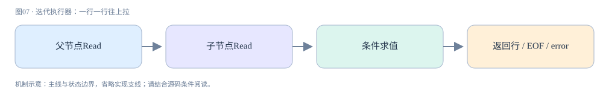

**真实源码窗口：**[sql/iterators/composite_iterators.cc · L91–L114](https://github.com/mysql/mysql-server/blob/dc86e412f18b36ce271f791026714e8caa0ec919/sql/iterators/composite_iterators.cc#L91-L114)。

```cpp
int FilterIterator::Read() {
  for (;;) {
    int err = m_source->Read();
    if (err != 0) return err;

    bool matched = m_condition->val_int();

    if (thd()->killed) {
      thd()->send_kill_message();
      return 1;
    }

    /* check for errors evaluating the condition */
    if (thd()->is_error()) return 1;

    if (!matched) {
      m_source->UnlockRow();
      continue;
    }

    // Successful row.
    return 0;
  }
}
```

<a id="chapter-08"></a>

## 08 · handler边界：SQL执行器如何进入InnoDB

TableScanIterator::Read调用table()->file->ha_rnd_next，把记录写到Server的record buffer；handler包装层处理监控、访问状态和错误，再进入存储引擎虚函数。索引读取对应ha_index_read_map等入口。InnoDB的index_read/general_fetch把查询转成row_search_mvcc所需的搜索与游标状态。

关键对象prebuilt保存索引、事务、搜索tuple、row template与persistent cursor。Server记录格式和InnoDB页内记录格式不相同，row template参与转换。查询使用哪条索引、是否锁定读和读视图等状态经过这个边界，故handler不是“文件读取函数”。

一条SELECT可能多次跨越边界：二级索引定位、聚簇索引读取、迭代取下一条。在覆盖、ICP、MVCC验证等不同条件下是否回聚簇索引还要看具体分支。引擎报告锁等待或死锁时，Server适配成SQL错误；应用看到1213不意味着解析器失败。

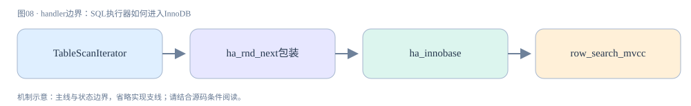

**真实源码窗口：**[sql/iterators/basic_row_iterators.cc · L291–L351](https://github.com/mysql/mysql-server/blob/dc86e412f18b36ce271f791026714e8caa0ec919/sql/iterators/basic_row_iterators.cc#L291-L351)。

```cpp
int TableScanIterator::Read() {
  int tmp;
  if (table()->is_union_or_table()) {
    while ((tmp = table()->file->ha_rnd_next(m_record))) {
      /*
       ha_rnd_next can return RECORD_DELETED for MyISAM when one thread is
       reading and another deleting without locks.
       */
      if (tmp == HA_ERR_RECORD_DELETED && !thd()->killed) continue;
      return HandleError(tmp);
    }
    if (m_examined_rows != nullptr) {
      ++*m_examined_rows;
    }
  } else {
    while (true) {
      if (m_remaining_dups == 0) {  // always initially
        while ((tmp = table()->file->ha_rnd_next(m_record))) {
          if (tmp == HA_ERR_RECORD_DELETED && !thd()->killed) continue;
          return HandleError(tmp);
        }
        if (m_examined_rows != nullptr) {
          ++*m_examined_rows;
        }

        // Filter out rows not qualifying for INTERSECT, EXCEPT by reading
        // the counter.
        const ulonglong cnt =
            static_cast<ulonglong>(table()->set_counter()->val_int());
        if (table()->is_except()) {
          if (table()->is_distinct()) {
            // EXCEPT DISTINCT: any counter value larger than one yields
            // exactly one row
            if (cnt >= 1) break;
          } else {
            // EXCEPT ALL: we use m_remaining_dups to yield as many rows
            // as found in the counter.
            m_remaining_dups = cnt;
          }
        } else {
          // INTERSECT
          if (table()->is_distinct()) {
            if (cnt == 0) break;
          } else {
            HalfCounter c(cnt);
            // Use min(left side counter, right side counter)
            m_remaining_dups = std::min(c[0], c[1]);
          }
        }
      } else {
        --m_remaining_dups;  // return the same row once more.
        break;
      }
      // Skipping this row
    }
    if (++m_stored_rows > m_limit_rows) {
      return HandleError(HA_ERR_END_OF_FILE);
    }
  }
  return 0;
}
```

<a id="chapter-09"></a>

## 09 · 聚簇与二级索引：记录与定位键的区别

InnoDB聚簇索引叶子包含行数据，二级索引叶子包含二级键和聚簇定位信息。btr_cur_search_to_nth_level沿树找到指定层的记录位置，搜索使用tuple、比较模式和latch_mode。cursor记录当前页内位置；B+树的页结构与Server层的逻辑行迭代不可混淆。

主键宽度因此不仅影响聚簇树，也放大每个二级索引的定位字段。按二级键扫描再回聚簇树读取非覆盖字段，会增加另一组树查找与页访问。所谓覆盖索引也要考虑MVCC：二级记录不能像聚簇记录一样直接从完整undo链还原旧行，必要时仍需聚簇验证。

随机主键和顺序主键改变插入分布、页分裂及局部性，却不能推出“所有业务必须自增主键”。读写热点、分布式ID与业务唯一约束都要一起评估。源码追踪先固定index->is_clustered()分支，再比较两种访问路径；只画两棵树但忽略ReadView，就解释不全回表。


**真实源码窗口：**[storage/innobase/btr/btr0cur.cc · L609–L1698](https://github.com/mysql/mysql-server/blob/dc86e412f18b36ce271f791026714e8caa0ec919/storage/innobase/btr/btr0cur.cc#L609-L1698)。

```cpp
/** Searches an index tree and positions a tree cursor on a given level.
 NOTE: n_fields_cmp in tuple must be set so that it cannot be compared
 to node pointer page number fields on the upper levels of the tree!
 Note that if mode is PAGE_CUR_LE, which is used in inserts, then
 cursor->up_match and cursor->low_match both will have sensible values.
 If mode is PAGE_CUR_GE, then up_match will a have a sensible value.

 If mode is PAGE_CUR_LE , cursor is left at the place where an insert of the
 search tuple should be performed in the B-tree. InnoDB does an insert
 immediately after the cursor. Thus, the cursor may end up on a user record,
 or on a page infimum record. */
void btr_cur_search_to_nth_level(
    dict_index_t *index,   /*!< in: index */
    ulint level,           /*!< in: the tree level of search */
    const dtuple_t *tuple, /*!< in: data tuple; NOTE: n_fields_cmp in
                           tuple must be set so that it cannot get
                           compared to the node ptr page number field! */
    page_cur_mode_t mode,  /*!< in: PAGE_CUR_L, ...;
                           Inserts should always be made using
                           PAGE_CUR_LE to search the position! */
    ulint latch_mode,      /*!< in: BTR_SEARCH_LEAF, ..., ORed with
                       at most one of BTR_INSERT, BTR_DELETE_MARK,
                       BTR_DELETE, or BTR_ESTIMATE;
                       cursor->left_block is used to store a pointer
                       to the left neighbor page, in the cases
                       BTR_SEARCH_PREV and BTR_MODIFY_PREV;
                       NOTE that if has_search_latch
                       is != 0, we maybe do not have a latch set
                       on the cursor page, we assume
                       the caller uses his search latch
                       to protect the record! */
    btr_cur_t *cursor,     /*!< in/out: tree cursor; the cursor page is
                           s- or x-latched, but see also above! */
    ulint has_search_latch,
    /*!< in: info on the latch mode the
    caller currently has on search system:
    RW_S_LATCH, or 0 */
    const char *file, /*!< in: file name */
    ulint line,       /*!< in: line where called */
    mtr_t *mtr)       /*!< in: mtr */
{
  page_t *page = nullptr; /* remove warning */
  buf_block_t *block;
  ulint height;
  ulint up_match;
  ulint up_bytes;
  ulint low_match;
  ulint low_bytes;
  ulint savepoint;
  ulint rw_latch;
  page_cur_mode_t page_mode;
  page_cur_mode_t search_mode = PAGE_CUR_UNSUPP;
  Page_fetch fetch;
  ulint node_ptr_max_size = UNIV_PAGE_SIZE / 2;
  page_cur_t *page_cursor;
  btr_op_t btr_op;
  ulint root_height = 0; /* remove warning */

  ulint upper_rw_latch, root_leaf_rw_latch;
  btr_intention_t lock_intention;
  bool modify_external;
  buf_block_t *tree_blocks[BTR_MAX_LEVELS];
  ulint tree_savepoints[BTR_MAX_LEVELS];
  ulint n_blocks = 0;
  ulint n_releases = 0;
  bool detected_same_key_root = false;

  bool retrying_for_search_prev = false;
  ulint leftmost_from_level = 0;
  buf_block_t **prev_tree_blocks = nullptr;
  ulint *prev_tree_savepoints = nullptr;
  ulint prev_n_blocks = 0;
  ulint prev_n_releases = 0;
  bool need_path = true;
  bool rtree_parent_modified = false;
  bool mbr_adj = false;
  bool found = false;

  DBUG_TRACE;

  mem_heap_t *heap = nullptr;
  ulint offsets_[REC_OFFS_NORMAL_SIZE];
  ulint *offsets = offsets_;
  ulint offsets2_[REC_OFFS_NORMAL_SIZE];
  ulint *offsets2 = offsets2_;
  rec_offs_init(offsets_);
  rec_offs_init(offsets2_);
  /* Currently, PAGE_CUR_LE is the only search mode used for searches
  ending to upper levels */

  ut_ad(level == 0 || mode == PAGE_CUR_LE || RTREE_SEARCH_MODE(mode));
  ut_ad(dict_index_check_search_tuple(index, tuple));
  ut_ad(!dict_index_is_ibuf(index) || ibuf_inside(mtr));

  UNIV_MEM_INVALID(&cursor->up_match, sizeof cursor->up_match);
  UNIV_MEM_INVALID(&cursor->up_bytes, sizeof cursor->up_bytes);
  UNIV_MEM_INVALID(&cursor->low_match, sizeof cursor->low_match);
  UNIV_MEM_INVALID(&cursor->low_bytes, sizeof cursor->low_bytes);
#ifdef UNIV_DEBUG
  cursor->up_match = ULINT_UNDEFINED;
  cursor->low_match = ULINT_UNDEFINED;
#endif /* UNIV_DEBUG */

  bool s_latch_by_caller = latch_mode & BTR_ALREADY_S_LATCHED;
  latch_mode &= ~BTR_ALREADY_S_LATCHED;

  ut_ad(!s_latch_by_caller || srv_read_only_mode ||
        mtr_memo_contains_flagged(mtr, dict_index_get_lock(index),
                                  MTR_MEMO_S_LOCK | MTR_MEMO_SX_LOCK));

  /* These flags are mutually exclusive, they are lumped together
  with the latch mode for historical reasons. It's possible for
  none of the flags to be set. */
  switch (UNIV_EXPECT(latch_mode & (BTR_INSERT | BTR_DELETE | BTR_DELETE_MARK),
                      0)) {
    case 0:
      btr_op = BTR_NO_OP;
      break;
    case BTR_INSERT:
      btr_op = (latch_mode & BTR_IGNORE_SEC_UNIQUE)
                   ? BTR_INSERT_IGNORE_UNIQUE_OP
                   : BTR_INSERT_OP;
      break;
    case BTR_DELETE:
      btr_op = BTR_DELETE_OP;
      ut_a(cursor->purge_node);
      break;
    case BTR_DELETE_MARK:
      btr_op = BTR_DELMARK_OP;
      break;
    default:
      /* only one of BTR_INSERT, BTR_DELETE, BTR_DELETE_MARK
      should be specified at a time */
      ut_error;
  }

  /* Operations on the insert buffer tree cannot be buffered. */
  ut_ad(btr_op == BTR_NO_OP || !dict_index_is_ibuf(index));
  /* Operations on the clustered index cannot be buffered. */
  ut_ad(btr_op == BTR_NO_OP || !index->is_clustered());
  /* Operations on the temporary table(indexes) cannot be buffered. */
  ut_ad(btr_op == BTR_NO_OP || !index->table->is_temporary());
  /* Operation on the spatial index cannot be buffered. */
  ut_ad(btr_op == BTR_NO_OP || !dict_index_is_spatial(index));

  auto estimate = latch_mode & BTR_ESTIMATE;

  lock_intention = btr_cur_get_and_clear_intention(&latch_mode);

  modify_external = latch_mode & BTR_MODIFY_EXTERNAL;

  /* Turn the flags unrelated to the latch mode off. */
  latch_mode = BTR_LATCH_MODE_WITHOUT_FLAGS(latch_mode);

  ut_ad(!modify_external || latch_mode == BTR_MODIFY_LEAF);

  ut_ad(!s_latch_by_caller || latch_mode == BTR_SEARCH_LEAF ||
        latch_mode == BTR_SEARCH_TREE || latch_mode == BTR_MODIFY_LEAF);

  cursor->flag = BTR_CUR_BINARY;
  cursor->index = index;

#ifdef UNIV_SEARCH_PERF_STAT
  info->n_searches++;
#endif
  /* Use of AHI is disabled for intrinsic table as these tables re-use
  the index-id and AHI validation is based on index-id. */
  if (rw_lock_get_writer(btr_get_search_latch(index)) == RW_LOCK_NOT_LOCKED &&
      latch_mode <= BTR_MODIFY_LEAF && index->search_info->last_hash_succ &&
      !index->disable_ahi && !estimate
#ifdef PAGE_CUR_LE_OR_EXTENDS
      && mode != PAGE_CUR_LE_OR_EXTENDS
#endif /* PAGE_CUR_LE_OR_EXTENDS */
      && !dict_index_is_spatial(index)
      /* If !has_search_latch, we do a dirty read of
      btr_search_enabled below, and btr_search_guess_on_hash()
      will have to check it again. */
      && UNIV_LIKELY(btr_search_enabled) && !modify_external &&
      btr_search_guess_on_hash(tuple, mode, latch_mode, cursor,
                               has_search_latch, mtr)) {

    /* Search using the hash index succeeded */

    ut_ad(cursor->up_match != ULINT_UNDEFINED || mode != PAGE_CUR_GE);
    ut_ad(cursor->up_match != ULINT_UNDEFINED || mode != PAGE_CUR_LE);
    ut_ad(cursor->low_match != ULINT_UNDEFINED || mode != PAGE_CUR_LE);
    btr_cur_n_sea++;

    return;
  }
  btr_cur_n_non_sea++;
  DBUG_EXECUTE_IF("non_ahi_search",
                  assert(!strcmp(index->table->name.m_name, "test/t1")););

  /* If the hash search did not succeed, do binary search down the
  tree */

  if (has_search_latch) {
    /* Release possible search latch to obey latching order */
    rw_lock_s_unlock(btr_get_search_latch(index));
  }

  /* Store the position of the tree latch we push to mtr so that we
  know how to release it when we have latched leaf node(s) */

  savepoint = mtr_set_savepoint(mtr);

  switch (latch_mode) {
    case BTR_MODIFY_TREE:
      /* Most of delete-intended operations are purging.
      Free blocks and read IO bandwidth should be prior
      for them, when the history list is glowing huge. */
      if (lock_intention == BTR_INTENTION_DELETE &&
          trx_sys->rseg_history_len.load() > BTR_CUR_FINE_HISTORY_LENGTH &&
          buf_get_n_pending_read_ios()) {
        mtr_x_lock(dict_index_get_lock(index), mtr, UT_LOCATION_HERE);
      } else if (dict_index_is_spatial(index) &&
                 lock_intention <= BTR_INTENTION_BOTH) {
        /* X lock the if there is possibility of
        pessimistic delete on spatial index. As we could
        lock upward for the tree */

        mtr_x_lock(dict_index_get_lock(index), mtr, UT_LOCATION_HERE);
      } else {
        mtr_sx_lock(dict_index_get_lock(index), mtr, UT_LOCATION_HERE);
      }
      upper_rw_latch = RW_X_LATCH;
      break;
    case BTR_CONT_MODIFY_TREE:
    case BTR_CONT_SEARCH_TREE:
      /* Do nothing */
      ut_ad(srv_read_only_mode ||
            mtr_memo_contains_flagged(mtr, dict_index_get_lock(index),
                                      MTR_MEMO_X_LOCK | MTR_MEMO_SX_LOCK));
      if (dict_index_is_spatial(index) && latch_mode == BTR_CONT_MODIFY_TREE) {
        /* If we are about to locating parent page for split
        and/or merge operation for R-Tree index, X latch
        the parent */
        upper_rw_latch = RW_X_LATCH;
      } else {
        upper_rw_latch = RW_NO_LATCH;
      }
      break;
    default:
      if (!srv_read_only_mode) {
        if (s_latch_by_caller) {
          /* The BTR_ALREADY_S_LATCHED indicates that the index->lock has been
          taken either in RW_S_LATCH or RW_SX_LATCH mode. For parallel reads
          another thread can own the dict index lock. */
          ut_ad(rw_lock_own_flagged(dict_index_get_lock(index),
                                    RW_LOCK_FLAG_S | RW_LOCK_FLAG_SX));

        } else if (!modify_external) {
          /* BTR_SEARCH_TREE is intended to be used with
          BTR_ALREADY_S_LATCHED */
          ut_ad(latch_mode != BTR_SEARCH_TREE);

          mtr_s_lock(dict_index_get_lock(index), mtr, UT_LOCATION_HERE);
        } else {
          /* BTR_MODIFY_EXTERNAL needs to be excluded */
          mtr_sx_lock(dict_index_get_lock(index), mtr, UT_LOCATION_HERE);
        }
        upper_rw_latch = RW_S_LATCH;
      } else {
        upper_rw_latch = RW_NO_LATCH;
      }
  }
  root_leaf_rw_latch = btr_cur_latch_for_root_leaf(latch_mode);

  page_cursor = btr_cur_get_page_cur(cursor);

  const space_id_t space = dict_index_get_space(index);
  const page_size_t page_size(dict_table_page_size(index->table));

  /* Start with the root page. */
  page_id_t page_id(space, dict_index_get_page(index));

  if (root_leaf_rw_latch == RW_X_LATCH) {
    node_ptr_max_size = dict_index_node_ptr_max_size(index);
  }

  up_match = 0;
  up_bytes = 0;
  low_match = 0;
  low_bytes = 0;

  height = ULINT_UNDEFINED;

  /* We use these modified search modes on non-leaf levels of the
  B-tree. These let us end up in the right B-tree leaf. In that leaf
  we use the original search mode. */

  switch (mode) {
    case PAGE_CUR_GE:
      page_mode = PAGE_CUR_L;
      break;
    case PAGE_CUR_G:
      page_mode = PAGE_CUR_LE;
      break;
    default:
#ifdef PAGE_CUR_LE_OR_EXTENDS
      ut_ad(mode == PAGE_CUR_L || mode == PAGE_CUR_LE ||
            RTREE_SEARCH_MODE(mode) || mode == PAGE_CUR_LE_OR_EXTENDS);
#else  /* PAGE_CUR_LE_OR_EXTENDS */
      ut_ad(mode == PAGE_CUR_L || mode == PAGE_CUR_LE ||
            RTREE_SEARCH_MODE(mode));
#endif /* PAGE_CUR_LE_OR_EXTENDS */
      page_mode = mode;
      break;
  }

  /* Loop and search until we arrive at the desired level */
  btr_latch_leaves_t latch_leaves = {{nullptr, nullptr, nullptr}, {0, 0, 0}};

search_loop:
  fetch = cursor->m_fetch_mode;
  rw_latch = RW_NO_LATCH;
  rtree_parent_modified = false;

  if (height != 0) {
    /* We are about to fetch the root or a non-leaf page. */
    if ((latch_mode != BTR_MODIFY_TREE || height == level) &&
        !retrying_for_search_prev) {
      /* If doesn't have SX or X latch of index,
      each pages should be latched before reading. */
      if (modify_external && height == ULINT_UNDEFINED &&
          upper_rw_latch == RW_S_LATCH) {
        /* needs sx-latch of root page
        for fseg operation */
        rw_latch = RW_SX_LATCH;
      } else {
        rw_latch = upper_rw_latch;
      }
    }
  } else if (latch_mode <= BTR_MODIFY_LEAF) {
    rw_latch = latch_mode;

    if (btr_op != BTR_NO_OP &&
        ibuf_should_try(index, btr_op != BTR_INSERT_OP)) {
      /* Try to buffer the operation if the leaf
      page is not in the buffer pool. */

      fetch = btr_op == BTR_DELETE_OP ? Page_fetch::IF_IN_POOL_OR_WATCH
                                      : Page_fetch::IF_IN_POOL;
    }
  }

retry_page_get:
  ut_ad(n_blocks < BTR_MAX_LEVELS);
  tree_savepoints[n_blocks] = mtr_set_savepoint(mtr);
  block = buf_page_get_gen(
      page_id, page_size, rw_latch,
      (height == ULINT_UNDEFINED ? index->search_info->root_guess : nullptr),
      fetch, {file, line}, mtr);

  tree_blocks[n_blocks] = block;

  if (block == nullptr) {
    /* This must be a search to perform an insert/delete
    mark/ delete; try using the insert/delete buffer */

    ut_ad(height == 0);
    ut_ad(cursor->thr);

    switch (btr_op) {
      case BTR_INSERT_OP:
      case BTR_INSERT_IGNORE_UNIQUE_OP:
        ut_ad(fetch == Page_fetch::IF_IN_POOL);
        ut_ad(!dict_index_is_spatial(index));

        if (ibuf_insert(IBUF_OP_INSERT, tuple, index, page_id, page_size,
                        cursor->thr)) {
          cursor->flag = BTR_CUR_INSERT_TO_IBUF;

          goto func_exit;
        }
        break;

      case BTR_DELMARK_OP:
        ut_ad(fetch == Page_fetch::IF_IN_POOL);
        ut_ad(!dict_index_is_spatial(index));

        if (ibuf_insert(IBUF_OP_DELETE_MARK, tuple, index, page_id, page_size,
                        cursor->thr)) {
          cursor->flag = BTR_CUR_DEL_MARK_IBUF;

          goto func_exit;
        }

        break;

      case BTR_DELETE_OP:
        ut_ad(fetch == Page_fetch::IF_IN_POOL_OR_WATCH);
        ut_ad(!dict_index_is_spatial(index));

        if (!row_purge_poss_sec(cursor->purge_node, index, tuple)) {
          /* The record cannot be purged yet. */
          cursor->flag = BTR_CUR_DELETE_REF;
        } else if (ibuf_insert(IBUF_OP_DELETE, tuple, index, page_id, page_size,
                               cursor->thr)) {
          /* The purge was buffered. */
          cursor->flag = BTR_CUR_DELETE_IBUF;
        } else {
          /* The purge could not be buffered. */
          buf_pool_watch_unset(page_id);
          break;
        }

        buf_pool_watch_unset(page_id);
        goto func_exit;

      default:
        ut_error;
    }

    /* Insert to the insert/delete buffer did not succeed, we
    must read the page from disk. */

    fetch = cursor->m_fetch_mode;

    goto retry_page_get;
  }

  if (retrying_for_search_prev && height != 0) {
    /* also latch left sibling */
    page_no_t left_page_no;
    buf_block_t *get_block;

    ut_ad(rw_latch == RW_NO_LATCH);

    rw_latch = upper_rw_latch;

    rw_lock_s_lock(&block->lock, UT_LOCATION_HERE);
    left_page_no = btr_page_get_prev(buf_block_get_frame(block), mtr);
    rw_lock_s_unlock(&block->lock);

    if (left_page_no != FIL_NULL) {
      ut_ad(prev_n_blocks < leftmost_from_level);

      prev_tree_savepoints[prev_n_blocks] = mtr_set_savepoint(mtr);
      get_block =
          buf_page_get_gen(page_id_t(page_id.space(), left_page_no), page_size,
                           rw_latch, nullptr, fetch, {file, line}, mtr);
      prev_tree_blocks[prev_n_blocks] = get_block;
      prev_n_blocks++;

      /* BTR_MODIFY_TREE doesn't update prev/next_page_no,
      without their parent page's lock. So, not needed to
      retry here, because we have the parent page's lock. */
    }

    /* release RW_NO_LATCH page and lock with RW_S_LATCH */
    mtr_release_block_at_savepoint(mtr, tree_savepoints[n_blocks],
                                   tree_blocks[n_blocks]);

    tree_savepoints[n_blocks] = mtr_set_savepoint(mtr);
    block = buf_page_get_gen(page_id, page_size, rw_latch, nullptr, fetch,
                             {file, line}, mtr);
    tree_blocks[n_blocks] = block;
  }

  page = buf_block_get_frame(block);

  if (height == ULINT_UNDEFINED && page_is_leaf(page) &&
      rw_latch != RW_NO_LATCH && rw_latch != root_leaf_rw_latch) {
    /* We should retry to get the page, because the root page
    is latched with different level as a leaf page. */
    ut_ad(root_leaf_rw_latch != RW_NO_LATCH);
    ut_ad(rw_latch == RW_S_LATCH || rw_latch == RW_SX_LATCH);
    ut_ad(rw_latch == RW_S_LATCH || modify_external);

    ut_ad(n_blocks == 0);
    mtr_release_block_at_savepoint(mtr, tree_savepoints[n_blocks],
                                   tree_blocks[n_blocks]);

    upper_rw_latch = root_leaf_rw_latch;
    goto search_loop;
  }

  if (rw_latch != RW_NO_LATCH) {
#ifdef UNIV_ZIP_DEBUG
    const page_zip_des_t *page_zip = buf_block_get_page_zip(block);
    ut_a(!page_zip || page_zip_validate(page_zip, page, index));
#endif /* UNIV_ZIP_DEBUG */

    buf_block_dbg_add_level(block, dict_index_is_ibuf(index)
                                       ? SYNC_IBUF_TREE_NODE
                                       : SYNC_TREE_NODE);
  }

  ut_ad(fil_page_index_page_check(page));
  ut_ad(index->id == btr_page_get_index_id(page));

  if (UNIV_UNLIKELY(height == ULINT_UNDEFINED)) {
    /* We are in the root node */

    height = btr_page_get_level(page);
    root_height = height;
    cursor->tree_height = root_height + 1;

    if (dict_index_is_spatial(index)) {
      ut_ad(cursor->rtr_info);

      node_seq_t seq_no = rtr_get_current_ssn_id(index);

      /* If SSN in memory is not initialized, fetch
      it from root page */
      if (seq_no < 1) {
        node_seq_t root_seq_no;

        root_seq_no = page_get_ssn_id(page);

        mutex_enter(&(index->rtr_ssn.mutex));
        index->rtr_ssn.seq_no = root_seq_no + 1;
        mutex_exit(&(index->rtr_ssn.mutex));
      }

      /* Save the MBR */
      cursor->rtr_info->thr = cursor->thr;
      rtr_get_mbr_from_tuple(tuple, &cursor->rtr_info->mbr);
    }

    index->search_info->root_guess = block;
  }

  if (height == 0) {
    if (rw_latch == RW_NO_LATCH) {
      latch_leaves = btr_cur_latch_leaves(block, page_id, page_size, latch_mode,
                                          cursor, mtr);
    }

    switch (latch_mode) {
      case BTR_MODIFY_TREE:
      case BTR_CONT_MODIFY_TREE:
      case BTR_CONT_SEARCH_TREE:
        break;
      default:
        if (!s_latch_by_caller && !srv_read_only_mode && !modify_external) {
          /* Release the tree s-latch */
          /* NOTE: BTR_MODIFY_EXTERNAL
          needs to keep tree sx-latch */
          mtr_release_s_latch_at_savepoint(mtr, savepoint,
                                           dict_index_get_lock(index));
        }

        /* release upper blocks */
        if (retrying_for_search_prev) {
          for (; prev_n_releases < prev_n_blocks; prev_n_releases++) {
            mtr_release_block_at_savepoint(
                mtr, prev_tree_savepoints[prev_n_releases],
                prev_tree_blocks[prev_n_releases]);
          }
        }

        for (; n_releases < n_blocks; n_releases++) {
          if (n_releases == 0 && modify_external) {
            /* keep latch of root page */
            ut_ad(mtr_memo_contains_flagged(
                mtr, tree_blocks[n_releases],
                MTR_MEMO_PAGE_SX_FIX | MTR_MEMO_PAGE_X_FIX));
            continue;
          }

          mtr_release_block_at_savepoint(mtr, tree_savepoints[n_releases],
                                         tree_blocks[n_releases]);
        }
    }

    page_mode = mode;
  }

  if (dict_index_is_spatial(index)) {
    /* Remember the page search mode */
    search_mode = page_mode;

    /* Some adjustment on search mode, when the
    page search mode is PAGE_CUR_RTREE_LOCATE
    or PAGE_CUR_RTREE_INSERT, as we are searching
    with MBRs. When it is not the target level, we
    should search all sub-trees that "CONTAIN" the
    search range/MBR. When it is at the target
    level, the search becomes PAGE_CUR_LE */
    if (page_mode == PAGE_CUR_RTREE_LOCATE && level == height) {
      if (level == 0) {
        page_mode = PAGE_CUR_LE;
      } else {
        page_mode = PAGE_CUR_RTREE_GET_FATHER;
      }
    }

    if (page_mode == PAGE_CUR_RTREE_INSERT) {
      page_mode = (level == height) ? PAGE_CUR_LE : PAGE_CUR_RTREE_INSERT;

      ut_ad(!page_is_leaf(page) || page_mode == PAGE_CUR_LE);
    }

    /* "need_path" indicates if we need to tracking the parent
    pages, if it is not spatial comparison, then no need to
    track it */
    if (page_mode < PAGE_CUR_CONTAIN) {
      need_path = false;
    }

    up_match = 0;
    low_match = 0;

    if (latch_mode == BTR_MODIFY_TREE || latch_mode == BTR_CONT_MODIFY_TREE ||
        latch_mode == BTR_CONT_SEARCH_TREE) {
      /* Tree are locked, no need for Page Lock to protect
      the "path" */
      cursor->rtr_info->need_page_lock = false;
    }
  }

  if (dict_index_is_spatial(index) && page_mode >= PAGE_CUR_CONTAIN) {
    ut_ad(need_path);
    found = rtr_cur_search_with_match(block, index, tuple, page_mode,
                                      page_cursor, cursor->rtr_info);

    /* Need to use BTR_MODIFY_TREE to do the MBR adjustment */
    if (search_mode == PAGE_CUR_RTREE_INSERT && cursor->rtr_info->mbr_adj) {
      if (latch_mode & BTR_MODIFY_LEAF) {
        /* Parent MBR needs updated, should retry
        with BTR_MODIFY_TREE */
        goto func_exit;
      } else if (latch_mode & BTR_MODIFY_TREE) {
        rtree_parent_modified = true;
        cursor->rtr_info->mbr_adj = false;
        mbr_adj = true;
      } else {
        ut_d(ut_error);
      }
    }

    if (found && page_mode == PAGE_CUR_RTREE_GET_FATHER) {
      cursor->low_match = DICT_INDEX_SPATIAL_NODEPTR_SIZE + 1;
    }
  } else if (height == 0 && btr_search_enabled &&
             !dict_index_is_spatial(index)) {
    /* The adaptive hash index is only used when searching
    for leaf pages (height==0), but not in r-trees.
    We only need the byte prefix comparison for the purpose
    of updating the adaptive hash index. */
    page_cur_search_with_match_bytes(block, index, tuple, page_mode, &up_match,
                                     &up_bytes, &low_match, &low_bytes,
                                     page_cursor);
  } else {
    /* Search for complete index fields. */
    up_bytes = low_bytes = 0;
    page_cur_search_with_match(block, index, tuple, page_mode, &up_match,
                               &low_match, page_cursor,
                               need_path ? cursor->rtr_info : nullptr);
  }

  if (estimate) {
    btr_cur_add_path_info(cursor, height, root_height);
  }

  /* If this is the desired level, leave the loop */

  ut_ad(height == btr_page_get_level(page_cur_get_page(page_cursor)));

  /* Add Predicate lock if it is serializable isolation
  and only if it is in the search case */
  if (dict_index_is_spatial(index) && cursor->rtr_info->need_prdt_lock &&
      mode != PAGE_CUR_RTREE_INSERT && mode != PAGE_CUR_RTREE_LOCATE &&
      mode >= PAGE_CUR_CONTAIN) {
    trx_t *trx = thr_get_trx(cursor->thr);
    lock_prdt_t prdt;

    trx_mutex_enter(trx);
    lock_init_prdt_from_mbr(&prdt, &cursor->rtr_info->mbr, mode,
                            trx->lock.lock_heap);
    trx_mutex_exit(trx);

    if (rw_latch == RW_NO_LATCH && height != 0) {
      rw_lock_s_lock(&block->lock, UT_LOCATION_HERE);
    }

    lock_prdt_lock(block, &prdt, index, LOCK_S, LOCK_PREDICATE, cursor->thr);

    if (rw_latch == RW_NO_LATCH && height != 0) {
      rw_lock_s_unlock(&(block->lock));
    }
  }

  if (level != height) {
    const rec_t *node_ptr;
    ut_ad(height > 0);

    height--;

    node_ptr = page_cur_get_rec(page_cursor);

    offsets = rec_get_offsets(node_ptr, index, offsets, ULINT_UNDEFINED,
                              UT_LOCATION_HERE, &heap);

    /* If the rec is the first or last in the page for
    pessimistic delete intention, it might cause node_ptr insert
    for the upper level. We should change the intention and retry.
    */
    if (latch_mode == BTR_MODIFY_TREE &&
        btr_cur_need_opposite_intention(page, lock_intention, node_ptr)) {
    need_opposite_intention:
      ut_ad(upper_rw_latch == RW_X_LATCH);

      if (n_releases > 0) {
        /* release root block */
        mtr_release_block_at_savepoint(mtr, tree_savepoints[0], tree_blocks[0]);
      }

      /* release all blocks */
      for (; n_releases <= n_blocks; n_releases++) {
        mtr_release_block_at_savepoint(mtr, tree_savepoints[n_releases],
                                       tree_blocks[n_releases]);
      }

      lock_intention = BTR_INTENTION_BOTH;

      page_id.reset(space, dict_index_get_page(index));
      up_match = 0;
      low_match = 0;
      height = ULINT_UNDEFINED;

      n_blocks = 0;
      n_releases = 0;

      goto search_loop;
    }

    if (dict_index_is_spatial(index)) {
      if (page_rec_is_supremum(node_ptr)) {
        cursor->low_match = 0;
        cursor->up_match = 0;
        goto func_exit;
      }

      /* If we are doing insertion or record locating,
      remember the tree nodes we visited */
      if (page_mode == PAGE_CUR_RTREE_INSERT ||
          (search_mode == PAGE_CUR_RTREE_LOCATE &&
           (latch_mode != BTR_MODIFY_LEAF))) {
        bool add_latch = false;

        if (latch_mode == BTR_MODIFY_TREE && rw_latch == RW_NO_LATCH) {
          ut_ad(mtr_memo_contains_flagged(mtr, dict_index_get_lock(index),
                                          MTR_MEMO_X_LOCK | MTR_MEMO_SX_LOCK));
          rw_lock_s_lock(&block->lock, UT_LOCATION_HERE);
          add_latch = true;
        }

        /* Store the parent cursor location */
#ifdef UNIV_DEBUG
        ulint num_stored =
            rtr_store_parent_path(block, cursor, latch_mode, height + 1, mtr);
#else
        rtr_store_parent_path(block, cursor, latch_mode, height + 1, mtr);
#endif

        if (page_mode == PAGE_CUR_RTREE_INSERT) {
          btr_pcur_t *r_cursor =
              rtr_get_parent_cursor(cursor, height + 1, true);
          /* If it is insertion, there should
          be only one parent for each level
          traverse */

          ut_ad(num_stored == 1);

          node_ptr = r_cursor->get_rec();
        }

        if (add_latch) {
          rw_lock_s_unlock(&block->lock);
        }

        ut_ad(!page_rec_is_supremum(node_ptr));
      }

      ut_ad(page_mode == search_mode || (page_mode == PAGE_CUR_WITHIN &&
                                         search_mode == PAGE_CUR_RTREE_LOCATE));

      page_mode = search_mode;
    }

    /* If the first or the last record of the page
    or the same key value to the first record or last record,
    the another page might be chosen when BTR_CONT_MODIFY_TREE.
    So, the parent page should not released to avoiding deadlock
    with blocking the another search with the same key value. */
    if (!detected_same_key_root && lock_intention == BTR_INTENTION_BOTH &&
        !dict_index_is_unique(index) && latch_mode == BTR_MODIFY_TREE &&
        (up_match >= rec_offs_n_fields(offsets) - 1 ||
         low_match >= rec_offs_n_fields(offsets) - 1)) {
      const rec_t *first_rec =
          page_rec_get_next_const(page_get_infimum_rec(page));
      ulint matched_fields;

      ut_ad(upper_rw_latch == RW_X_LATCH);

      if (node_ptr == first_rec || page_rec_is_last(node_ptr, page)) {
        detected_same_key_root = true;
      } else {
        matched_fields = 0;

        offsets2 = rec_get_offsets(first_rec, index, offsets2, ULINT_UNDEFINED,
                                   UT_LOCATION_HERE, &heap);
        cmp_rec_rec_with_match(node_ptr, first_rec, offsets, offsets2, index,
                               page_is_spatial_non_leaf(first_rec, index),
                               false, &matched_fields);

        if (matched_fields >= rec_offs_n_fields(offsets) - 1) {
          detected_same_key_root = true;
        } else {
          const rec_t *last_rec;

          last_rec = page_rec_get_prev_const(page_get_supremum_rec(page));

          matched_fields = 0;

          offsets2 = rec_get_offsets(last_rec, index, offsets2, ULINT_UNDEFINED,
                                     UT_LOCATION_HERE, &heap);
          cmp_rec_rec_with_match(node_ptr, last_rec, offsets, offsets2, index,
                                 page_is_spatial_non_leaf(last_rec, index),
                                 false, &matched_fields);
          if (matched_fields >= rec_offs_n_fields(offsets) - 1) {
            detected_same_key_root = true;
          }
        }
      }
    }

    /* If the page might cause modify_tree,
    we should not release the parent page's lock. */
    if (!detected_same_key_root && latch_mode == BTR_MODIFY_TREE &&
        !btr_cur_will_modify_tree(index, page, lock_intention, node_ptr,
                                  node_ptr_max_size, page_size, mtr) &&
        !rtree_parent_modified) {
      ut_ad(upper_rw_latch == RW_X_LATCH);
      ut_ad(n_releases <= n_blocks);

      /* we can release upper blocks */
      for (; n_releases < n_blocks; n_releases++) {
        if (n_releases == 0) {
          /* we should not release root page
          to pin to same block. */
          continue;
        }

        /* release unused blocks to unpin */
        mtr_release_block_at_savepoint(mtr, tree_savepoints[n_releases],
                                       tree_blocks[n_releases]);
      }
    }

    if (height == level && latch_mode == BTR_MODIFY_TREE) {
      ut_ad(upper_rw_latch == RW_X_LATCH);
      /* we should sx-latch root page, if released already.
      It contains seg_header. */
      if (n_releases > 0) {
        mtr_block_sx_latch_at_savepoint(mtr, tree_savepoints[0],
                                        tree_blocks[0]);
      }

      /* x-latch the branch blocks not released yet. */
      for (ulint i = n_releases; i <= n_blocks; i++) {
        mtr_block_x_latch_at_savepoint(mtr, tree_savepoints[i], tree_blocks[i]);
      }
    }

    /* We should consider prev_page of parent page, if the node_ptr
    is the leftmost of the page. because BTR_SEARCH_PREV and
    BTR_MODIFY_PREV latches prev_page of the leaf page. */
    if ((latch_mode == BTR_SEARCH_PREV || latch_mode == BTR_MODIFY_PREV) &&
        !retrying_for_search_prev) {
      /* block should be latched for consistent
         btr_page_get_prev() */
      ut_ad(mtr_memo_contains_flagged(
          mtr, block, MTR_MEMO_PAGE_S_FIX | MTR_MEMO_PAGE_X_FIX));

      if (btr_page_get_prev(page, mtr) != FIL_NULL &&
          page_rec_is_first(node_ptr, page)) {
        if (leftmost_from_level == 0) {
          leftmost_from_level = height + 1;
        }
      } else {
        leftmost_from_level = 0;
      }

      if (height == 0 && leftmost_from_level > 0) {
        /* should retry to get also prev_page
        from level==leftmost_from_level. */
        retrying_for_search_prev = true;

        prev_tree_blocks = static_cast<buf_block_t **>(
            ut::malloc_withkey(UT_NEW_THIS_FILE_PSI_KEY,
                               sizeof(buf_block_t *) * leftmost_from_level));

        prev_tree_savepoints = static_cast<ulint *>(ut::malloc_withkey(
            UT_NEW_THIS_FILE_PSI_KEY, sizeof(ulint) * leftmost_from_level));

        /* back to the level (leftmost_from_level+1) */
        ulint idx = n_blocks - (leftmost_from_level - 1);

        page_id.reset(space, tree_blocks[idx]->page.id.page_no());

        for (ulint i = n_blocks - (leftmost_from_level - 1); i <= n_blocks;
             i++) {
          mtr_release_block_at_savepoint(mtr, tree_savepoints[i],
                                         tree_blocks[i]);
        }

        n_blocks -= (leftmost_from_level - 1);
        height = leftmost_from_level;
        ut_ad(n_releases == 0);

        /* replay up_match, low_match */
        up_match = 0;
        low_match = 0;
        rtr_info_t *rtr_info = need_path ? cursor->rtr_info : nullptr;

        for (ulint i = 0; i < n_blocks; i++) {
          page_cur_search_with_match(tree_blocks[i], index, tuple, page_mode,
                                     &up_match, &low_match, page_cursor,
                                     rtr_info);
        }

        goto search_loop;
      }
    }

    /* Go to the child node */
    page_id.reset(space, btr_node_ptr_get_child_page_no(node_ptr, offsets));

    n_blocks++;

    if (UNIV_UNLIKELY(height == 0 && dict_index_is_ibuf(index))) {
      /* We're doing a search on an ibuf tree and we're one
      level above the leaf page. */

      ut_ad(level == 0);

      fetch = cursor->m_fetch_mode;
      rw_latch = RW_NO_LATCH;
      goto retry_page_get;
    }

    if (dict_index_is_spatial(index) && page_mode >= PAGE_CUR_CONTAIN &&
        page_mode != PAGE_CUR_RTREE_INSERT) {
      ut_ad(need_path);
      rtr_node_path_t *path = cursor->rtr_info->path;

      if (!path->empty() && found) {
#ifdef UNIV_DEBUG
        node_visit_t last_visit = path->back();

        ut_ad(last_visit.page_no == page_id.page_no());
#endif /* UNIV_DEBUG */

        path->pop_back();

#ifdef UNIV_DEBUG
        if (page_mode == PAGE_CUR_RTREE_LOCATE &&
            (latch_mode != BTR_MODIFY_LEAF)) {
          btr_pcur_t *cur = cursor->rtr_info->parent_path->back().cursor;
          rec_t *my_node_ptr = cur->get_rec();

          offsets = rec_get_offsets(my_node_ptr, index, offsets,
                                    ULINT_UNDEFINED, UT_LOCATION_HERE, &heap);

          page_no_t my_page_no =
              btr_node_ptr_get_child_page_no(my_node_ptr, offsets);

          ut_ad(page_id.page_no() == my_page_no);
        }
#endif
      }
    }

    goto search_loop;
  } else if (!dict_index_is_spatial(index) && latch_mode == BTR_MODIFY_TREE &&
             lock_intention == BTR_INTENTION_INSERT &&
             mach_read_from_4(page + FIL_PAGE_NEXT) != FIL_NULL &&
             page_rec_is_last(page_cur_get_rec(page_cursor), page)) {
    /* btr_insert_into_right_sibling() might cause
    deleting node_ptr at upper level */

    if (height == 0) {
      /* release the leaf pages if latched */
      for (uint i = 0; i < 3; i++) {
        if (latch_leaves.blocks[i] != nullptr) {
          mtr_release_block_at_savepoint(mtr, latch_leaves.savepoints[i],
                                         latch_leaves.blocks[i]);
          latch_leaves.blocks[i] = nullptr;
        }
      }
    }

    goto need_opposite_intention;
  }

  if (level != 0) {
    if (upper_rw_latch == RW_NO_LATCH) {
      /* latch the page */
      buf_block_t *child_block;

      if (latch_mode == BTR_CONT_MODIFY_TREE) {
        child_block = btr_block_get(page_id, page_size, RW_X_LATCH,
                                    UT_LOCATION_HERE, index, mtr);
      } else {
        ut_ad(latch_mode == BTR_CONT_SEARCH_TREE);
        child_block = btr_block_get(page_id, page_size, RW_SX_LATCH,
                                    UT_LOCATION_HERE, index, mtr);
      }

      btr_assert_not_corrupted(child_block, index);
    } else {
      ut_ad(mtr_memo_contains(mtr, block, upper_rw_latch));
      btr_assert_not_corrupted(block, index);

      if (s_latch_by_caller) {
        ut_ad(latch_mode == BTR_SEARCH_TREE);
        /* to exclude modifying tree operations
        should sx-latch the index. */
        ut_ad(mtr_memo_contains(mtr, dict_index_get_lock(index),
                                MTR_MEMO_SX_LOCK));
        /* because has sx-latch of index,
        can release upper blocks. */
        for (; n_releases < n_blocks; n_releases++) {
          mtr_release_block_at_savepoint(mtr, tree_savepoints[n_releases],
                                         tree_blocks[n_releases]);
        }
      }
    }

    if (page_mode <= PAGE_CUR_LE) {
      cursor->low_match = low_match;
      cursor->up_match = up_match;
    }
  } else {
    cursor->low_match = low_match;
    cursor->low_bytes = low_bytes;
    cursor->up_match = up_match;
    cursor->up_bytes = up_bytes;

    /* We do a dirty read of btr_search_enabled here.  We
    will properly check btr_search_enabled again in
    btr_search_build_page_hash_index() before building a
    page hash index, while holding search latch. */
    if (btr_search_enabled && !index->disable_ahi) {
      btr_search_info_update(cursor);
    }
    ut_ad(cursor->up_match != ULINT_UNDEFINED || mode != PAGE_CUR_GE);
    ut_ad(cursor->up_match != ULINT_UNDEFINED || mode != PAGE_CUR_LE);
    ut_ad(cursor->low_match != ULINT_UNDEFINED || mode != PAGE_CUR_LE);
  }

  /* For spatial index, remember  what blocks are still latched */
  if (dict_index_is_spatial(index) &&
      (latch_mode == BTR_MODIFY_TREE || latch_mode == BTR_MODIFY_LEAF)) {
    for (ulint i = 0; i < n_releases; i++) {
      cursor->rtr_info->tree_blocks[i] = nullptr;
      cursor->rtr_info->tree_savepoints[i] = 0;
    }

    for (ulint i = n_releases; i <= n_blocks; i++) {
      cursor->rtr_info->tree_blocks[i] = tree_blocks[i];
      cursor->rtr_info->tree_savepoints[i] = tree_savepoints[i];
    }
  }

func_exit:

  if (UNIV_LIKELY_NULL(heap)) {
    mem_heap_free(heap);
  }

  if (retrying_for_search_prev) {
    ut::free(prev_tree_blocks);
    ut::free(prev_tree_savepoints);
  }

  if (has_search_latch) {
    rw_lock_s_lock(btr_get_search_latch(index), UT_LOCATION_HERE);
  }

  if (mbr_adj) {
    /* remember that we will need to adjust parent MBR */
    cursor->rtr_info->mbr_adj = true;
  }
}

```

<a id="chapter-10"></a>

## 10 · 页、槽与分裂：B+树的物理变化

索引页有页头、infimum/supremum、用户记录、目录槽和空闲空间。页内记录逻辑顺序与物理存储位置不必一致；目录槽帮助缩小查找区间，再顺着记录链定位。页大小是实例建库相关配置，默认16KiB不代表所有表都必然16KiB。

btr_page_split_and_insert在无法满足插入时处理分裂，把记录分到新页并调整父节点与链。这个动作必须在mini-transaction保护下同时维护多个物理关系，并生成恢复所需日志；不能用“插入一行只改一块页”的成本模型。delete-mark与purge后物理清理也不能画为同一步。

页分裂会造成写放大、空间碎片与latch竞争，顺序插入也可能产生热点。逻辑事务锁保护业务并发语义，页latch保护短时结构一致性；持有latch去等待长事务锁会破坏并发设计，因此源码刻意控制不同临界区。性能诊断应先分清锁等待与页级争用。


**真实源码窗口：**[storage/innobase/btr/btr0btr.cc · L2298–L2682](https://github.com/mysql/mysql-server/blob/dc86e412f18b36ce271f791026714e8caa0ec919/storage/innobase/btr/btr0btr.cc#L2298-L2682)。

```cpp
/** Splits an index page to halves and inserts the tuple. It is assumed
 that mtr holds an x-latch to the index tree. NOTE: the tree x-latch is
 released within this function! NOTE that the operation of this
 function must always succeed, we cannot reverse it: therefore enough
 free disk space (2 pages) must be guaranteed to be available before
 this function is called.
 @return inserted record */
rec_t *btr_page_split_and_insert(
    uint32_t flags,        /*!< in: undo logging and locking flags */
    btr_cur_t *cursor,     /*!< in: cursor at which to insert; when the
                           function returns, the cursor is positioned
                           on the predecessor of the inserted record */
    ulint **offsets,       /*!< out: offsets on inserted record */
    mem_heap_t **heap,     /*!< in/out: pointer to memory heap, or NULL */
    const dtuple_t *tuple, /*!< in: tuple to insert */
    mtr_t *mtr)            /*!< in: mtr */
{
  buf_block_t *block;
  page_t *page;
  page_zip_des_t *page_zip;
  page_no_t page_no;
  byte direction;
  page_no_t hint_page_no;
  buf_block_t *new_block;
  page_t *new_page;
  page_zip_des_t *new_page_zip;
  rec_t *split_rec;
  buf_block_t *left_block;
  buf_block_t *right_block;
  buf_block_t *insert_block;
  page_cur_t *page_cursor;
  rec_t *first_rec;
  byte *buf = nullptr; /* remove warning */
  rec_t *move_limit;
  bool insert_will_fit;
  bool insert_left;
  ulint n_iterations = 0;
  rec_t *rec;
  ulint n_uniq;
  dict_index_t *index;

  index = cursor->index;

  if (dict_index_is_spatial(index)) {
    /* Split rtree page and update parent */
    return (
        rtr_page_split_and_insert(flags, cursor, offsets, heap, tuple, mtr));
  }

  if (!*heap) {
    *heap = mem_heap_create(1024, UT_LOCATION_HERE);
  }
  n_uniq = dict_index_get_n_unique_in_tree(cursor->index);
func_start:
  ut_ad(tuple->m_heap != *heap);
  mem_heap_empty(*heap);
  *offsets = nullptr;

  ut_ad(mtr_memo_contains_flagged(mtr, dict_index_get_lock(cursor->index),
                                  MTR_MEMO_X_LOCK | MTR_MEMO_SX_LOCK) ||
        cursor->index->table->is_intrinsic());
  ut_ad(!dict_index_is_online_ddl(cursor->index) || (flags & BTR_CREATE_FLAG) ||
        cursor->index->is_clustered());
  ut_ad(rw_lock_own_flagged(dict_index_get_lock(cursor->index),
                            RW_LOCK_FLAG_X | RW_LOCK_FLAG_SX) ||
        cursor->index->table->is_intrinsic());

  block = btr_cur_get_block(cursor);
  page = buf_block_get_frame(block);
  page_zip = buf_block_get_page_zip(block);

  ut_ad(
      mtr_is_block_fix(mtr, block, MTR_MEMO_PAGE_X_FIX, cursor->index->table));
  ut_ad(!page_is_empty(page));

  /* try to insert to the next page if possible before split */
  rec =
      btr_insert_into_right_sibling(flags, cursor, offsets, *heap, tuple, mtr);

  if (rec != nullptr) {
    return (rec);
  }

  page_no = block->page.id.page_no();

  /* 1. Decide the split record; split_rec == NULL means that the
  tuple to be inserted should be the first record on the upper
  half-page */
  insert_left = false;

  if (n_iterations > 0) {
    direction = FSP_UP;
    hint_page_no = page_no + 1;
    split_rec = btr_page_get_split_rec(cursor, tuple);

    if (split_rec == nullptr) {
      insert_left =
          btr_page_tuple_smaller(cursor, tuple, offsets, n_uniq, heap);
    }
  } else if (btr_page_get_split_rec_to_right(cursor, &split_rec)) {
    direction = FSP_UP;
    hint_page_no = page_no + 1;

  } else if (btr_page_get_split_rec_to_left(cursor, &split_rec)) {
    direction = FSP_DOWN;
    hint_page_no = page_no - 1;
    ut_ad(split_rec);
  } else {
    direction = FSP_UP;
    hint_page_no = page_no + 1;

    /* If there is only one record in the index page, we
    can't split the node in the middle by default. We need
    to determine whether the new record will be inserted
    to the left or right. */

    if (page_get_n_recs(page) > 1) {
      split_rec = page_get_middle_rec(page);
    } else if (btr_page_tuple_smaller(cursor, tuple, offsets, n_uniq, heap)) {
      split_rec = page_rec_get_next(page_get_infimum_rec(page));
    } else {
      split_rec = nullptr;
    }
  }

  /* 2. Allocate a new page to the index */
  new_block = btr_page_alloc(cursor->index, hint_page_no, direction,
                             btr_page_get_level(page), mtr, mtr);

  /* New page could not be allocated */
  if (!new_block) {
    return nullptr;
  }

  new_page = buf_block_get_frame(new_block);
  new_page_zip = buf_block_get_page_zip(new_block);
  btr_page_create(new_block, new_page_zip, cursor->index,
                  btr_page_get_level(page), mtr);

  /* 3. Calculate the first record on the upper half-page, and the
  first record (move_limit) on original page which ends up on the
  upper half */

  if (split_rec) {
    first_rec = move_limit = split_rec;

    *offsets = rec_get_offsets(split_rec, cursor->index, *offsets, n_uniq,
                               UT_LOCATION_HERE, heap);

    insert_left = cmp_dtuple_rec(tuple, split_rec, cursor->index, *offsets) < 0;

    if (!insert_left && new_page_zip && n_iterations > 0) {
      /* If a compressed page has already been split,
      avoid further splits by inserting the record
      to an empty page. */
      split_rec = nullptr;
      goto insert_empty;
    }
  } else if (insert_left) {
    ut_a(n_iterations > 0);
    first_rec = page_rec_get_next(page_get_infimum_rec(page));
    move_limit = page_rec_get_next(btr_cur_get_rec(cursor));
  } else {
  insert_empty:
    ut_ad(!split_rec);
    ut_ad(!insert_left);
    buf = ut::new_arr_withkey<byte>(
        UT_NEW_THIS_FILE_PSI_KEY,
        ut::Count{rec_get_converted_size(cursor->index, tuple)});

    first_rec = rec_convert_dtuple_to_rec(buf, cursor->index, tuple);
    move_limit = page_rec_get_next(btr_cur_get_rec(cursor));
  }

  /* 4. Do first the modifications in the tree structure */

  btr_attach_half_pages(flags, cursor->index, block, first_rec, new_block,
                        direction, mtr);

  /* If the split is made on the leaf level and the insert will fit
  on the appropriate half-page, we may release the tree x-latch.
  We can then move the records after releasing the tree latch,
  thus reducing the tree latch contention. */

  if (split_rec) {
    insert_will_fit =
        !new_page_zip &&
        btr_page_insert_fits(cursor, split_rec, offsets, tuple, heap);
  } else {
    if (!insert_left) {
      ut::delete_arr(buf);
      buf = nullptr;
    }

    insert_will_fit =
        !new_page_zip &&
        btr_page_insert_fits(cursor, nullptr, offsets, tuple, heap);
  }

  if (!srv_read_only_mode && !cursor->index->table->is_intrinsic() &&
      insert_will_fit && page_is_leaf(page) &&
      !dict_index_is_online_ddl(cursor->index)) {
    mtr->memo_release(dict_index_get_lock(cursor->index),
                      MTR_MEMO_X_LOCK | MTR_MEMO_SX_LOCK);

    /* NOTE: We cannot release root block latch here, because it
    has segment header and already modified in most of cases.*/
  }

  /* 5. Move then the records to the new page */
  if (direction == FSP_DOWN) {
    /*          fputs("Split left\n", stderr); */

    if (false
#ifdef UNIV_ZIP_COPY
        || page_zip
#endif /* UNIV_ZIP_COPY */
        || !page_move_rec_list_start(new_block, block, move_limit,
                                     cursor->index, mtr)) {
      /* For some reason, compressing new_page failed,
      even though it should contain fewer records than
      the original page.  Copy the page byte for byte
      and then delete the records from both pages
      as appropriate.  Deleting will always succeed. */
      ut_a(new_page_zip);

      page_zip_copy_recs(new_page_zip, new_page, page_zip, page, cursor->index,
                         mtr);
      page_delete_rec_list_end(move_limit - page + new_page, new_block,
                               cursor->index, ULINT_UNDEFINED, ULINT_UNDEFINED,
                               mtr);

      /* Update the lock table and possible hash index. */

      if (!dict_table_is_locking_disabled(cursor->index->table)) {
        lock_move_rec_list_start(new_block, block, move_limit,
                                 new_page + PAGE_NEW_INFIMUM);
      }

      btr_search_update_hash_on_move(new_block, block, cursor->index);

      /* Delete the records from the source page. */

      page_delete_rec_list_start(move_limit, block, cursor->index, mtr);
    }

    left_block = new_block;
    right_block = block;

    if (!dict_table_is_locking_disabled(cursor->index->table)) {
      lock_update_split_left(right_block, left_block);
    }
  } else {
    /*          fputs("Split right\n", stderr); */

    if (false
#ifdef UNIV_ZIP_COPY
        || page_zip
#endif /* UNIV_ZIP_COPY */
        || !page_move_rec_list_end(new_block, block, move_limit, cursor->index,
                                   mtr)) {
      /* For some reason, compressing new_page failed,
      even though it should contain fewer records than
      the original page.  Copy the page byte for byte
      and then delete the records from both pages
      as appropriate.  Deleting will always succeed. */
      ut_a(new_page_zip);

      page_zip_copy_recs(new_page_zip, new_page, page_zip, page, cursor->index,
                         mtr);
      page_delete_rec_list_start(move_limit - page + new_page, new_block,
                                 cursor->index, mtr);

      /* Update the lock table and possible hash index. */
      if (!dict_table_is_locking_disabled(cursor->index->table)) {
        lock_move_rec_list_end(new_block, block, move_limit);
      }

      ut_ad(!dict_index_is_spatial(index));

      btr_search_update_hash_on_move(new_block, block, cursor->index);

      /* Delete the records from the source page. */

      page_delete_rec_list_end(move_limit, block, cursor->index,
                               ULINT_UNDEFINED, ULINT_UNDEFINED, mtr);
    }

    left_block = block;
    right_block = new_block;

    if (!dict_table_is_locking_disabled(cursor->index->table)) {
      lock_update_split_right(right_block, left_block);
    }
  }

#ifdef UNIV_ZIP_DEBUG
  if (page_zip) {
    ut_a(page_zip_validate(page_zip, page, cursor->index));
    ut_a(page_zip_validate(new_page_zip, new_page, cursor->index));
  }
#endif /* UNIV_ZIP_DEBUG */

  /* At this point, split_rec, move_limit and first_rec may point
  to garbage on the old page. */

  /* 6. The split and the tree modification is now completed. Decide the
  page where the tuple should be inserted */

  if (insert_left) {
    insert_block = left_block;
  } else {
    insert_block = right_block;
  }

  /* 7. Reposition the cursor for insert and try insertion */
  page_cursor = btr_cur_get_page_cur(cursor);

  page_cur_search(insert_block, cursor->index, tuple, page_cursor);

  rec = page_cur_tuple_insert(page_cursor, tuple, cursor->index, offsets, heap,
                              mtr);

#ifdef UNIV_ZIP_DEBUG
  {
    page_t *insert_page = buf_block_get_frame(insert_block);

    page_zip_des_t *insert_page_zip = buf_block_get_page_zip(insert_block);

    ut_a(!insert_page_zip ||
         page_zip_validate(insert_page_zip, insert_page, cursor->index));
  }
#endif /* UNIV_ZIP_DEBUG */

  if (rec != nullptr) {
    goto func_exit;
  }

  /* 8. If insert did not fit, try page reorganization.
  For compressed pages, page_cur_tuple_insert() will have
  attempted this already. */

  if (page_cur_get_page_zip(page_cursor) ||
      !btr_page_reorganize(page_cursor, cursor->index, mtr)) {
    goto insert_failed;
  }

  rec = page_cur_tuple_insert(page_cursor, tuple, cursor->index, offsets, heap,
                              mtr);

  if (rec == nullptr) {
    /* The insert did not fit on the page: loop back to the
    start of the function for a new split */
  insert_failed:
    /* We play safe and reset the free bits for new_page */
    if (!cursor->index->is_clustered() &&
        !cursor->index->table->is_temporary()) {
      ibuf_reset_free_bits(new_block);
      ibuf_reset_free_bits(block);
    }

    n_iterations++;
    ut_ad(n_iterations < 2 || buf_block_get_page_zip(insert_block));
    ut_ad(!insert_will_fit);

    goto func_start;
  }

func_exit:
  /* Insert fit on the page: update the free bits for the
  left and right pages in the same mtr */

  if (!cursor->index->is_clustered() && !cursor->index->table->is_temporary() &&
      page_is_leaf(page)) {
    ibuf_update_free_bits_for_two_pages_low(left_block, right_block, mtr);
  }

  MONITOR_INC(MONITOR_INDEX_SPLIT);

  ut_ad(page_validate(buf_block_get_frame(left_block), cursor->index));
  ut_ad(page_validate(buf_block_get_frame(right_block), cursor->index));

  ut_ad(!rec || rec_offs_validate(rec, cursor->index, *offsets));
  return (rec);
}
```

<a id="chapter-11"></a>

## 11 · Buffer Pool：缓存页为什么还需要状态机

buf_page_get_gen以page_id(space,page_no)定位页，结合page_size、锁模式和mtr返回buf_block_t。page hash解决是否缓存，LRU解决替换倾向，flush list解决脏页刷写；这三张结构的职责不同。block内存固定与页latch也不是同一个保护手段。

读线程撞到正在读取的页需要等待I/O完成，不能拿尚未完整装入的frame继续解释记录。被buffer-fixed或I/O-fixed的页不允许随意淘汰；脏页即使位于LRU尾端，也先需要满足写回条件。缓存不足因此可以同时引发读I/O、脏页刷写和请求等待。

Buffer Pool命中率是总体指标，不能解释所有慢查询。某次执行大量随机回表、冷数据或高并发热点页时，平均命中率仍可能很好。观察读请求、物理读、等待空闲页和脏页趋势，再结合执行计划。扩大内存只是一个手段，不会修正扫描范围太大或锁阻塞。


**真实源码窗口：**[storage/innobase/buf/buf0buf.cc · L4380–L4445](https://github.com/mysql/mysql-server/blob/dc86e412f18b36ce271f791026714e8caa0ec919/storage/innobase/buf/buf0buf.cc#L4380-L4445)。

```cpp
buf_block_t *buf_page_get_gen(const page_id_t &page_id,
                              const page_size_t &page_size, ulint rw_latch,
                              buf_block_t *guess, Page_fetch mode,
                              ut::Location location, mtr_t *mtr,
                              bool dirty_with_no_latch) {
#ifdef UNIV_DEBUG
  ut_ad(mtr->is_active());

  ut_ad(rw_latch == RW_S_LATCH || rw_latch == RW_X_LATCH ||
        rw_latch == RW_SX_LATCH || rw_latch == RW_NO_LATCH);

  ut_ad(!ibuf_inside(mtr) ||
        ibuf_page_low(page_id, page_size, false, location, nullptr));

  switch (mode) {
    case Page_fetch::NO_LATCH:
      ut_ad(rw_latch == RW_NO_LATCH);
      break;
    case Page_fetch::NORMAL:
    case Page_fetch::SCAN:
    case Page_fetch::IF_IN_POOL:
    case Page_fetch::PEEK_IF_IN_POOL:
    case Page_fetch::IF_IN_POOL_OR_WATCH:
    case Page_fetch::POSSIBLY_FREED:
    case Page_fetch::POSSIBLY_FREED_NO_READ_AHEAD:
      break;
    default:
      ib::fatal(UT_LOCATION_HERE, ER_IB_ERR_UNKNOWN_PAGE_FETCH_MODE)
          << "Unknown fetch mode: " << (int)mode;
      ut_error;
  }

  bool found;
  const page_size_t &space_page_size =
      fil_space_get_page_size(page_id.space(), &found);

  ut_ad(!found || page_size.equals_to(space_page_size));
#endif /* UNIV_DEBUG */

  if (mode == Page_fetch::NORMAL && !fsp_is_system_temporary(page_id.space())) {
    Buf_fetch_normal fetch(page_id, page_size);

    fetch.m_rw_latch = rw_latch;
    fetch.m_guess = guess;
    fetch.m_mode = mode;
    fetch.m_file = location.filename;
    fetch.m_line = location.line;
    fetch.m_mtr = mtr;
    fetch.m_dirty_with_no_latch = dirty_with_no_latch;

    return (fetch.single_page());

  } else {
    Buf_fetch_other fetch(page_id, page_size);

    fetch.m_rw_latch = rw_latch;
    fetch.m_guess = guess;
    fetch.m_mode = mode;
    fetch.m_file = location.filename;
    fetch.m_line = location.line;
    fetch.m_mtr = mtr;
    fetch.m_dirty_with_no_latch = dirty_with_no_latch;

    return (fetch.single_page());
  }
}
```

<a id="chapter-12"></a>

## 12 · LRU与flush list：淘汰和持久化是两条轴

InnoDB采用带old/young分区的LRU策略减轻大扫描污染。buf_LRU_add_block_low根据old参数插入链表并维护长度；提升与访问时间策略决定是否年轻化，不是每次命中都移到链表头。预读页和单次扫描页若立刻霸占热区，会把业务热点挤出。

flush list按脏页最早修改信息服务checkpoint推进。一个页很热仍可能需要刷盘，一个页很冷也可能是干净页可直接淘汰。这就是为何LRU list与flush list都要存在：前者按访问局部性，后者按恢复与日志复用约束。

读盘压力导致LRU刷写，redo空间压力导致flush list刷写，两者可同时发生但触发原因不同。调参时先看是free page不足还是checkpoint age增长，再评估I/O能力与redo容量。仅看到“后台正在刷盘”就统一增加Buffer Pool，可能把问题延后而没有改善持续写入能力。

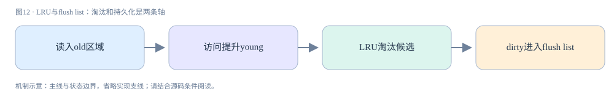

**真实源码窗口：**[storage/innobase/buf/buf0lru.cc · L1639–L1700](https://github.com/mysql/mysql-server/blob/dc86e412f18b36ce271f791026714e8caa0ec919/storage/innobase/buf/buf0lru.cc#L1639-L1700)。

```cpp
/** Adds a block to the LRU list. Please make sure that the page_size is
already set when invoking the function, so that we can get correct
page_size from the buffer page when adding a block into LRU
@param[in]      bpage   control block
@param[in]      old     true if should be put to the old blocks in the LRU list,
                        else put to the start; if the LRU list is very short,
                        the block is added to the start, regardless of this
                        parameter */
static inline void buf_LRU_add_block_low(buf_page_t *bpage, bool old) {
  buf_pool_t *buf_pool = buf_pool_from_bpage(bpage);

  ut_ad(mutex_own(&buf_pool->LRU_list_mutex));

  ut_a(buf_page_in_file(bpage));
  ut_ad(!bpage->in_LRU_list);

  if (!old || (UT_LIST_GET_LEN(buf_pool->LRU) < BUF_LRU_OLD_MIN_LEN)) {
    UT_LIST_ADD_FIRST(buf_pool->LRU, bpage);

    bpage->freed_page_clock = buf_pool->freed_page_clock;
  } else {
#ifdef UNIV_LRU_DEBUG
    /* buf_pool->LRU_old must be the first item in the LRU list
    whose "old" flag is set. */
    ut_a(buf_pool->LRU_old->old);
    ut_a(!UT_LIST_GET_PREV(LRU, buf_pool->LRU_old) ||
         !UT_LIST_GET_PREV(LRU, buf_pool->LRU_old)->old);
    ut_a(!UT_LIST_GET_NEXT(LRU, buf_pool->LRU_old) ||
         UT_LIST_GET_NEXT(LRU, buf_pool->LRU_old)->old);
#endif /* UNIV_LRU_DEBUG */
    UT_LIST_INSERT_AFTER(buf_pool->LRU, buf_pool->LRU_old, bpage);

    buf_pool->LRU_old_len++;
  }

  ut_d(bpage->in_LRU_list = true);

  incr_LRU_size_in_bytes(bpage, buf_pool);

  if (UT_LIST_GET_LEN(buf_pool->LRU) > BUF_LRU_OLD_MIN_LEN) {
    ut_ad(buf_pool->LRU_old);

    /* Adjust the length of the old block list if necessary */

    buf_page_set_old(bpage, old);
    buf_LRU_old_adjust_len(buf_pool);

  } else if (UT_LIST_GET_LEN(buf_pool->LRU) == BUF_LRU_OLD_MIN_LEN) {
    /* The LRU list is now long enough for LRU_old to become
    defined: init it */

    buf_LRU_old_init(buf_pool);
  } else {
    buf_page_set_old(bpage, buf_pool->LRU_old != nullptr);
  }

  /* If this is a zipped block with decompressed frame as well
  then put it on the unzip_LRU list */
  if (buf_page_belongs_to_unzip_LRU(bpage)) {
    buf_unzip_LRU_add_block((buf_block_t *)bpage, old);
  }
}
```

<a id="chapter-13"></a>

## 13 · mini-transaction与redo：物理一致性的最小单元

SQL事务可跨多个表、语句和秒级时间；mini-transaction(mtr)保护短时间的一组页访问与物理修改。mtr维护memo记录固定页和latch资源，日志缓冲收集本次物理修改，提交后释放资源。mtr_commit不等于用户COMMIT，也不意味着SQL事务对其他会话可见。

redo不是简单重放原SQL，而是描述页/记录等底层变化的恢复日志。某次SQL UPDATE可以产生多个mtr；undo页的修改也需要redo保护，否则崩溃后无法可靠回滚未提交事务。区分“undo用于回退逻辑版本”和“redo保护undo页物理恢复”能消除二者互斥的误解。

原子物理修改组在恢复时需要保持完整边界，LSN把日志和页修改关联。读源码应从mtr内部日志提交路径再走log writer，不要把memcpy写到log buffer当成已经落盘。内存中页内容、可写出日志和已持久化日志是不同状态。

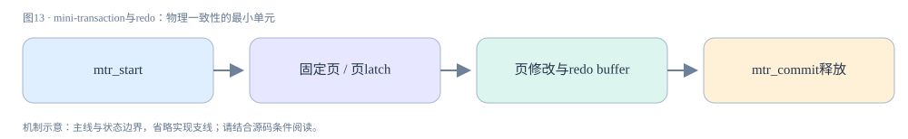

**真实源码窗口：**[storage/innobase/mtr/mtr0mtr.cc · L658–L692](https://github.com/mysql/mysql-server/blob/dc86e412f18b36ce271f791026714e8caa0ec919/storage/innobase/mtr/mtr0mtr.cc#L658-L692)。

```cpp
/** Commit a mini-transaction. */
void mtr_t::commit() {
  ut_ad(is_active());
  ut_ad(!is_inside_ibuf());
  ut_ad(m_impl.m_magic_n == MTR_MAGIC_N);
  m_impl.m_state = MTR_STATE_COMMITTING;

  DBUG_EXECUTE_IF("mtr_commit_crash", DBUG_SUICIDE(););

  Command cmd(this);

  if (has_any_log_record() ||
      (has_modifications() && m_impl.m_log_mode == MTR_LOG_NO_REDO)) {
    ut_ad(!srv_read_only_mode || m_impl.m_log_mode == MTR_LOG_NO_REDO);

    cmd.execute();
  } else {
    cmd.release_all();
    cmd.release_resources();
  }
#ifndef UNIV_HOTBACKUP
  check_nolog_and_unmark();
#endif /* !UNIV_HOTBACKUP */

  ut_d(remove_from_debug_list());
}

#ifdef UNIV_DEBUG
void mtr_t::remove_from_debug_list() const {
  auto it = s_my_thread_active_mtrs.find(this);
  /* We have to find the MTR that is about to be committed in local context. We
  are not sharing MTRs between threads. */
  ut_a(it != s_my_thread_active_mtrs.end());
  s_my_thread_active_mtrs.erase(it);
}
```

<a id="chapter-14"></a>

## 14 · Redo流水线：write LSN和flush LSN为什么不同

log_write_up_to(log,end_lsn,flush_to_disk)表达的目标非常具体：至少写到end_lsn；如果flush_to_disk为true，还要达到磁盘持久化水位。writer与flusher处理不同步骤，write_lsn不是flushed_to_disk_lsn，OS cache写入与持久化不能混为一谈。

txn生成redo后可先让后台线程批量推进，前台请求等待目标水位。多个事务的LSN落入一次写/刷的覆盖范围，所以“每个COMMIT需要持久化保证”不等于“每个事务独立发一次fsync”。等待事件、通知与忙等优化负责协调，源码函数返回的Wait_stats支持监控等待代价。

日志空间是循环利用的有限资源。生成速度长期快于checkpoint推进时，最终会限制写入；扩大redo容量提供更大缓冲窗口，却不能让慢磁盘永久追上写入速率。崩溃类型也要区分：进程退出、操作系统崩溃和存储设备丢失，对OS cache中尚未flush的日志影响不同。


**真实源码窗口：**[storage/innobase/log/log0write.cc · L1086–L1207](https://github.com/mysql/mysql-server/blob/dc86e412f18b36ce271f791026714e8caa0ec919/storage/innobase/log/log0write.cc#L1086-L1207)。

```cpp
Wait_stats log_write_up_to(log_t &log, lsn_t end_lsn, bool flush_to_disk) {
  ut_a(!srv_read_only_mode);

  /* If we were updating log.flushed_to_disk_lsn while parsing redo log
  during recovery, we would have valid value here and we would not need
  to explicitly exit because of the recovery. However we do not update
  the log.flushed_to_disk during recovery (it is zero).

  On the other hand, when we apply log records during recovery, we modify
  pages and update their oldest/newest_modification. The modified pages
  become dirty. When size of the buffer pool is too small, some pages
  have to be flushed from LRU, to reclaim a free page for a next read.

  When flushing such dirty pages, we notice that newest_modification != 0,
  so the redo log has to be flushed up to the newest_modification, before
  flushing the page. In such case we end up here during recovery.

  Note that redo log is actually flushed, because changes to the page
  are caused by applying the redo. */

  if (recv_no_ibuf_operations) {
    /* Recovery is running and no operations on the log files are
    allowed yet, which is implicitly deduced from the fact, that
    still ibuf merges are disallowed. */
    return Wait_stats{0};
  }

  /* We do not need to have exact numbers and we do not care if we
  lost some increments for heavy workload. The value only has usage
  when it is low workload and we need to discover that we request
  redo write or flush only from time to time. In such case we prefer
  to avoid spinning in log threads to save on CPU power usage. */
  log.write_to_file_requests_total.store(
      log.write_to_file_requests_total.load(std::memory_order_relaxed) + 1,
      std::memory_order_relaxed);

  ut_a(end_lsn != LSN_MAX);

  ut_a(end_lsn % OS_FILE_LOG_BLOCK_SIZE == 0 ||
       end_lsn % OS_FILE_LOG_BLOCK_SIZE >= LOG_BLOCK_HDR_SIZE);

  ut_a(end_lsn % OS_FILE_LOG_BLOCK_SIZE <=
       OS_FILE_LOG_BLOCK_SIZE - LOG_BLOCK_TRL_SIZE);

  ut_ad(end_lsn <= log_get_lsn(log));

  Wait_stats wait_stats{0};
  bool interrupted = false;

retry:
  if (log.writer_threads_paused.load(std::memory_order_acquire)) {
    /* the log writer threads are paused not to waste CPU resource. */
    wait_stats +=
        log_self_write_up_to(log, end_lsn, flush_to_disk, &interrupted);

    if (UNIV_UNLIKELY(interrupted)) {
      /* the log writer threads might be working. retry. */
      goto retry;
    }

    DEBUG_SYNC_C("log_flushed_by_self");
    return wait_stats;
  }

  /* the log writer threads are working for high concurrency scale */
  if (flush_to_disk) {
    if (log.flushed_to_disk_lsn.load() >= end_lsn) {
      DEBUG_SYNC_C("log_flushed_by_writer");
      return wait_stats;
    }

    if (srv_flush_log_at_trx_commit != 1) {
      /* We need redo flushed, but because trx != 1, we have
      disabled notifications sent from log_writer to log_flusher.

      The log_flusher might be sleeping for 1 second, and we need
      quick response here. Log_writer avoids waking up log_flusher,
      so we must do it ourselves here.

      However, before we wake up log_flusher, we must ensure that
      log.write_lsn >= lsn. Otherwise log_flusher could flush some
      data which was ready for lsn values smaller than end_lsn and
      return to sleeping for next 1 second. */

      if (log.write_lsn.load() < end_lsn) {
        wait_stats += log_wait_for_write(log, end_lsn, &interrupted);
      }
    }

    /* Wait until log gets flushed up to end_lsn. */
    wait_stats += log_wait_for_flush(log, end_lsn, &interrupted);

    if (UNIV_UNLIKELY(interrupted)) {
      /* the log writer threads might be paused. retry. */
      goto retry;
    }

    DEBUG_SYNC_C("log_flushed_by_writer");
  } else {
    if (log.write_lsn.load() >= end_lsn) {
      return wait_stats;
    }

    /* Wait until log gets written up to end_lsn. */
    wait_stats += log_wait_for_write(log, end_lsn, &interrupted);

    if (UNIV_UNLIKELY(interrupted)) {
      /* the log writer threads might be paused. retry. */
      goto retry;
    }
  }

  return wait_stats;
}

/** @} */

/**************************************************/ /**

 @name Log threads waiting strategy

 *******************************************************/
```

<a id="chapter-15"></a>

## 15 · WAL、刷脏页与doublewrite

buf_flush_write_block_low在写脏页前取get_newest_lsn，若log_sys->flushed_to_disk_lsn落后则调用log_write_up_to(...,true)。这段代码直接体现WAL：数据页不能先于恢复它所需的日志被可靠写出。COMMIT通常不等待所有被改数据页刷盘，因此已提交事务仍可以对应内存脏页。

WAL解决的是写出顺序，doublewrite解决的是页写入撕裂风险。存储系统可能把一页只写了一部分；redo依赖页可解析，损坏页不一定仅靠redo就能补齐。doublewrite在支持的模式中保留可恢复页副本，再写最终位置；8.4具体模式、压缩/原子写能力需要分别看dblwr实现和配置。

oldest_modification服务脏页最早日志需求，newest LSN服务刷页前redo保证，两者不应该互换。刷写线程给页设I/O固定以防同时搬移或淘汰。若看到写延迟上升，应分别看redo flush、doublewrite与数据文件I/O，而不是把它们都归成“数据页fsync”。


**真实源码窗口：**[storage/innobase/buf/buf0flu.cc · L1168–L1262](https://github.com/mysql/mysql-server/blob/dc86e412f18b36ce271f791026714e8caa0ec919/storage/innobase/buf/buf0flu.cc#L1168-L1262)。

```cpp
/** Does an asynchronous write of a buffer page.
@param[in]      bpage           buffer block to write
@param[in]      flush_type      type of flush
@param[in]      sync            true if sync IO request */
static void buf_flush_write_block_low(buf_page_t *bpage, buf_flush_t flush_type,
                                      bool sync) {
  page_t *frame = nullptr;

#ifdef UNIV_DEBUG
  buf_pool_t *buf_pool = buf_pool_from_bpage(bpage);
  ut_ad(!mutex_own(&buf_pool->LRU_list_mutex));
#endif /* UNIV_DEBUG */

  DBUG_PRINT("ib_buf", ("flush %s %u page " UINT32PF ":" UINT32PF,
                        sync ? "sync" : "async", (unsigned)flush_type,
                        bpage->id.space(), bpage->id.page_no()));

  ut_ad(buf_page_in_file(bpage));

  /* We are not holding block_mutex here. Nevertheless, it is safe to
  access bpage, because it is io_fixed and oldest_modification != 0.
  Thus, it cannot be relocated in the buffer pool or removed from
  flush_list or LRU_list. */
  ut_ad(!buf_flush_list_mutex_own(buf_pool));
  ut_ad(!buf_page_get_mutex(bpage)->is_owned());
  ut_ad(bpage->is_io_fix_write());
  ut_ad(bpage->is_dirty());

#ifdef UNIV_IBUF_COUNT_DEBUG
  ut_a(ibuf_count_get(bpage->id) == 0);
#endif /* UNIV_IBUF_COUNT_DEBUG */

  ut_ad(recv_recovery_is_on() || bpage->get_newest_lsn() != 0);

  /* Force the log to the disk before writing the modified block */
  if (!srv_read_only_mode) {
    const lsn_t flush_to_lsn = bpage->get_newest_lsn();

    /* Do the check before calling log_write_up_to() because in most
    cases it would allow to avoid call, and because of that we don't
    want those calls because they would have bad impact on the counter
    of calls, which is monitored to save CPU on spinning in log threads. */

    if (log_sys->flushed_to_disk_lsn.load() < flush_to_lsn) {
      Wait_stats wait_stats;

      wait_stats = log_write_up_to(*log_sys, flush_to_lsn, true);

      MONITOR_INC_WAIT_STATS_EX(MONITOR_ON_LOG_, _PAGE_WRITTEN, wait_stats);
    }
  }

  switch (buf_page_get_state(bpage)) {
    case BUF_BLOCK_POOL_WATCH:
    case BUF_BLOCK_ZIP_PAGE: /* The page should be dirty. */
    case BUF_BLOCK_NOT_USED:
    case BUF_BLOCK_READY_FOR_USE:
    case BUF_BLOCK_MEMORY:
    case BUF_BLOCK_REMOVE_HASH:
      ut_error;
      break;
    case BUF_BLOCK_ZIP_DIRTY: {
      frame = bpage->zip.data;
      BlockReporter reporter =
          BlockReporter(false, frame, bpage->size,
                        fsp_is_checksum_disabled(bpage->id.space()));

      mach_write_to_8(frame + FIL_PAGE_LSN, bpage->get_newest_lsn());

      ut_a(reporter.verify_zip_checksum());
      break;
    }
    case BUF_BLOCK_FILE_PAGE:
      frame = bpage->zip.data;
      if (!frame) {
        frame = ((buf_block_t *)bpage)->frame;
      }

      buf_flush_init_for_writing(
          reinterpret_cast<const buf_block_t *>(bpage),
          reinterpret_cast<const buf_block_t *>(bpage)->frame,
          bpage->zip.data ? &bpage->zip : nullptr, bpage->get_newest_lsn(),
          fsp_is_checksum_disabled(bpage->id.space()),
          false /* do not skip lsn check */);
      break;
  }

  dberr_t err = dblwr::write(flush_type, bpage, sync);

  ut_a(err == DB_SUCCESS || err == DB_TABLESPACE_DELETED);

  /* Increment the counter of I/O operations used
  for selecting LRU policy. */
  buf_LRU_stat_inc_io();
}
```

<a id="chapter-16"></a>

## 16 · Undo与版本链：UPDATE之前的值在哪里

聚簇记录带有事务标识DB_TRX_ID和回滚指针DB_ROLL_PTR；有无显式主键还影响隐藏行ID。修改产生的undo保存构建前版本和回滚所需信息。undo不是全行无限复制的概念模型，实际会记录相应字段与操作信息，具体还涉及LOB。

row_vers_build_for_consistent_read读取当前事务ID，反复trx_undo_prev_version_build得到prev_version，再对前版本事务ID调用view->changes_visible。一旦可见，把该版本复制到结果内存；若前版本为空，说明该行在此视图时点尚不存在。记录当前的值不一定就是本次SELECT应返回的值。

版本链的寿命受到最老视图与purge边界约束。不能把“事务提交”画成“undo立即删除”：读者还可能需要它。源码对无法建立历史版本返回DB_MISSING_HISTORY，说明恢复和purge边界有明确不变量。应用长期打开读事务，会让历史积压、空间占用和追链成本持续增长。


**真实源码窗口：**[storage/innobase/row/row0vers.cc · L1228–L1343](https://github.com/mysql/mysql-server/blob/dc86e412f18b36ce271f791026714e8caa0ec919/storage/innobase/row/row0vers.cc#L1228-L1343)。

```cpp
/** Constructs the version of a clustered index record which a consistent
 read should see. We assume that the trx id stored in rec is such that
 the consistent read should not see rec in its present version.
 @param[in]   rec   record in a clustered index; the caller must have a latch
                    on the page; this latch locks the top of the stack of
                    versions of this records
 @param[in]   mtr   mtr holding the latch on rec; it will also hold the latch
                    on purge_view
 @param[in]   index   the clustered index
 @param[in]   offsets   offsets returned by rec_get_offsets(rec, index)
 @param[in]   view   the consistent read view
 @param[in,out]   offset_heap   memory heap from which the offsets are
                                allocated
 @param[in]   in_heap   memory heap from which the memory for *old_vers is
                        allocated; memory for possible intermediate versions
                        is allocated and freed locally within the function
 @param[out]   old_vers   old version, or NULL if the history is missing or
                          the record does not exist in the view, that is, it
                          was freshly inserted afterwards.
 @param[out]   vrow   reports virtual column info if any
 @param[in]   lob_undo   undo log to be applied to blobs.
 @return DB_SUCCESS or DB_MISSING_HISTORY */
dberr_t row_vers_build_for_consistent_read(
    const rec_t *rec, mtr_t *mtr, dict_index_t *index, ulint **offsets,
    ReadView *view, mem_heap_t **offset_heap, mem_heap_t *in_heap,
    rec_t **old_vers, const dtuple_t **vrow, lob::undo_vers_t *lob_undo) {
  DBUG_TRACE;
  const rec_t *version;
  rec_t *prev_version;
  trx_id_t trx_id;
  mem_heap_t *heap = nullptr;
  byte *buf;
  dberr_t err;

  ut_ad(index->is_clustered());
  ut_ad(mtr_memo_contains_page(mtr, rec, MTR_MEMO_PAGE_X_FIX) ||
        mtr_memo_contains_page(mtr, rec, MTR_MEMO_PAGE_S_FIX));
  ut_ad(!rw_lock_own(&(purge_sys->latch), RW_LOCK_S));

  ut_ad(rec_offs_validate(rec, index, *offsets));

  trx_id = row_get_rec_trx_id(rec, index, *offsets);

  /* Reset the collected LOB undo information. */
  if (lob_undo != nullptr) {
    lob_undo->reset();
  }

  ut_ad(!view->changes_visible(trx_id, index->table->name));

  ut_ad(!vrow || !(*vrow));

  version = rec;

  for (;;) {
    mem_heap_t *prev_heap = heap;

    heap = mem_heap_create(1024, UT_LOCATION_HERE);

    if (vrow) {
      *vrow = nullptr;
    }

    /* If purge can't see the record then we can't rely on
    the UNDO log record. */

    bool purge_sees =
        trx_undo_prev_version_build(rec, mtr, version, index, *offsets, heap,
                                    &prev_version, nullptr, vrow, 0, lob_undo);

    err = (purge_sees) ? DB_SUCCESS : DB_MISSING_HISTORY;

    if (prev_heap != nullptr) {
      mem_heap_free(prev_heap);
    }

    if (prev_version == nullptr) {
      /* It was a freshly inserted version */
      *old_vers = nullptr;
      ut_ad(!vrow || !(*vrow));
      break;
    }

    *offsets = rec_get_offsets(prev_version, index, *offsets, ULINT_UNDEFINED,
                               UT_LOCATION_HERE, offset_heap);

#if defined UNIV_DEBUG || defined UNIV_BLOB_LIGHT_DEBUG
    ut_a(!rec_offs_any_null_extern(index, prev_version, *offsets));
#endif /* UNIV_DEBUG || UNIV_BLOB_LIGHT_DEBUG */

    trx_id = row_get_rec_trx_id(prev_version, index, *offsets);

    if (view->changes_visible(trx_id, index->table->name)) {
      /* The view already sees this version: we can copy
      it to in_heap and return */

      buf =
          static_cast<byte *>(mem_heap_alloc(in_heap, rec_offs_size(*offsets)));

      *old_vers = rec_copy(buf, prev_version, *offsets);
      rec_offs_make_valid(*old_vers, index, *offsets);

      if (vrow && *vrow) {
        *vrow = dtuple_copy(*vrow, in_heap);
        dtuple_dup_v_fld(*vrow, in_heap);
      }
      break;
    }

    version = prev_version;
  }

  mem_heap_free(heap);

  return err;
}
```

<a id="chapter-17"></a>

## 17 · ReadView：逐个条件推演可见性

ReadView::prepare记录创建者ID、下一事务ID作为m_low_limit_id、创建时活动读写事务集合m_ids；m_up_limit_id取活动集合最小值或low。名字容易误导：up是“全部可见的低端边界”，low是“全部不可见的高端边界”，不能仅按英文大小猜方向。

changes_visible严格按条件检查：id<up或等于creator直接可见；id>=low不可见；中间区若m_ids为空可见，否则二分查活动集合，不在集合才可见。举例up=100、low=110、ids=[100,105]、creator=108：99可见，100和105不可见，103可见，108自己的版本可见，110不可见。

事务ID100后来提交并不会修改已经创建视图的m_ids，所以老视图仍不能直接看见100的新版本，而是追undo；新视图才重新捕获活动集合。判定条件解释了“提交了别人还看不到”的原因，也解释了自己写入在快照事务中仍可见。ReadView不复制整张表，只存边界和活动事务信息。

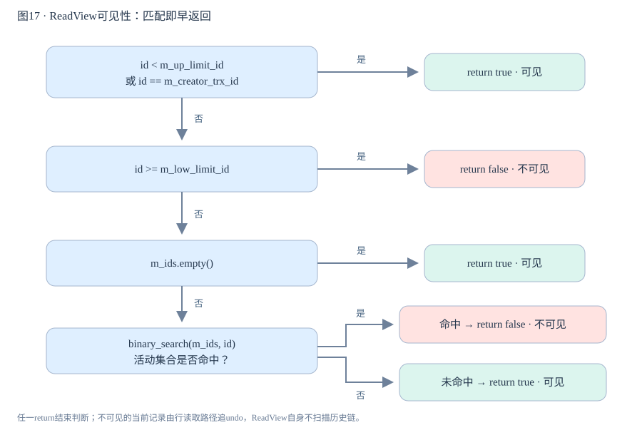

图中每个return均为早返回；只有上一条件未命中才继续下一个判断。最后的活动集合命中意味着不可见，而不是继续向“可见”节点流动。

**真实源码窗口：**[storage/innobase/include/read0types.h · L45–L320](https://github.com/mysql/mysql-server/blob/dc86e412f18b36ce271f791026714e8caa0ec919/storage/innobase/include/read0types.h#L45-L320)。

```cpp
/** Read view lists the trx ids of those transactions for which a consistent
read should not see the modifications to the database. */

class ReadView {
  /** This is similar to a std::vector but it is not a drop
  in replacement. It is specific to ReadView. */
  class ids_t {
    typedef trx_ids_t::value_type value_type;

    /**
    Constructor */
    ids_t() : m_ptr(), m_size(), m_reserved() {}

    /**
    Destructor */
    ~ids_t() { ut::delete_arr(m_ptr); }

    /** Try and increase the size of the array. Old elements are copied across.
    It is a no-op if n is < current size.
    @param n            Make space for n elements */
    void reserve(ulint n);

    /**
    Resize the array, sets the current element count.
    @param n            new size of the array, in elements */
    void resize(ulint n) {
      ut_ad(n <= capacity());

      m_size = n;
    }

    /**
    Reset the size to 0 */
    void clear() { resize(0); }

    /**
    @return the capacity of the array in elements */
    ulint capacity() const { return (m_reserved); }

    /**
    Copy and overwrite the current array contents

    @param start                Source array
    @param end          Pointer to end of array */
    void assign(const value_type *start, const value_type *end);

    /**
    Insert the value in the correct slot, preserving the order.
    Doesn't check for duplicates. */
    void insert(value_type value);

    /**
    @return the value of the first element in the array */
    value_type front() const {
      ut_ad(!empty());

      return (m_ptr[0]);
    }

    /**
    @return the value of the last element in the array */
    value_type back() const {
      ut_ad(!empty());

      return (m_ptr[m_size - 1]);
    }

    /**
    Append a value to the array.
    @param value                the value to append */
    void push_back(value_type value);

    /**
    @return a pointer to the start of the array */
    trx_id_t *data() { return (m_ptr); }

    /**
    @return a const pointer to the start of the array */
    const trx_id_t *data() const { return (m_ptr); }

    /**
    @return the number of elements in the array */
    ulint size() const { return (m_size); }

    /**
    @return true if size() == 0 */
    bool empty() const { return (size() == 0); }

   private:
    // Prevent copying
    ids_t(const ids_t &);
    ids_t &operator=(const ids_t &);

   private:
    /** Memory for the array */
    value_type *m_ptr;

    /** Number of active elements in the array */
    ulint m_size;

    /** Size of m_ptr in elements */
    ulint m_reserved;

    friend class ReadView;
  };

 public:
  ReadView();
  ~ReadView();
  /** Check whether transaction id is valid.
  @param[in]    id              transaction id to check
  @param[in]    name            table name */
  static void check_trx_id_sanity(trx_id_t id, const table_name_t &name);

  /** Check whether the changes by id are visible.
  @param[in]    id      transaction id to check against the view
  @param[in]    name    table name
  @return whether the view sees the modifications of id. */
  [[nodiscard]] bool changes_visible(trx_id_t id,
                                     const table_name_t &name) const {
    ut_ad(id > 0);

    if (id < m_up_limit_id || id == m_creator_trx_id) {
      return (true);
    }

    check_trx_id_sanity(id, name);

    if (id >= m_low_limit_id) {
      return (false);

    } else if (m_ids.empty()) {
      return (true);
    }

    const ids_t::value_type *p = m_ids.data();

    return (!std::binary_search(p, p + m_ids.size(), id));
  }

  /**
  @param id             transaction to check
  @return true if view sees transaction id */
  bool sees(trx_id_t id) const { return (id < m_up_limit_id); }

  /**
  Mark the view as closed */
  void close() {
    ut_ad(m_creator_trx_id != TRX_ID_MAX);
    m_creator_trx_id = TRX_ID_MAX;
  }

  /**
  @return true if the view is closed */
  bool is_closed() const { return (m_closed); }

  /**
  Write the limits to the file.
  @param file           file to write to */
  void print_limits(FILE *file) const {
    fprintf(file,
            "Trx read view will not see trx with"
            " id >= " TRX_ID_FMT ", sees < " TRX_ID_FMT "\n",
            m_low_limit_id, m_up_limit_id);
  }

  /** Check and reduce low limit number for read view. Used to
  block purge till GTID is persisted on disk table.
  @param[in]    trx_no  transaction number to check with */
  void reduce_low_limit(trx_id_t trx_no) {
    if (trx_no < m_low_limit_no) {
      /* Save low limit number set for Read View for MVCC. */
      ut_d(m_view_low_limit_no = m_low_limit_no);
      m_low_limit_no = trx_no;
    }
  }

  /**
  @return the low limit no */
  trx_id_t low_limit_no() const { return (m_low_limit_no); }

  /**
  @return the low limit id */
  trx_id_t low_limit_id() const { return (m_low_limit_id); }

  /**
  @return true if there are no transaction ids in the snapshot */
  bool empty() const { return (m_ids.empty()); }

#ifdef UNIV_DEBUG
  /**
  @return the view low limit number */
  trx_id_t view_low_limit_no() const { return (m_view_low_limit_no); }

  /**
  @param rhs            view to compare with
  @return truen if this view is less than or equal rhs */
  bool le(const ReadView *rhs) const {
    return (m_low_limit_no <= rhs->m_low_limit_no);
  }
#endif /* UNIV_DEBUG */
 private:
  /**
  Copy the transaction ids from the source vector */
  inline void copy_trx_ids(const trx_ids_t &trx_ids);

  /**
  Opens a read view where exactly the transactions serialized before this
  point in time are seen in the view.
  @param id             Creator transaction id */
  inline void prepare(trx_id_t id);

  /**
  Copy state from another view. Must call copy_complete() to finish.
  @param other          view to copy from */
  inline void copy_prepare(const ReadView &other);

  /**
  Complete the copy, insert the creator transaction id into the
  m_trx_ids too and adjust the m_up_limit_id *, if required */
  inline void copy_complete();

  /**
  Set the creator transaction id, existing id must be 0 */
  void creator_trx_id(trx_id_t id) {
    ut_ad(m_creator_trx_id == 0);
    m_creator_trx_id = id;
  }

  friend class MVCC;

 private:
  // Disable copying
  ReadView(const ReadView &);
  ReadView &operator=(const ReadView &);

 private:
  /** The read should not see any transaction with trx id >= this
  value. In other words, this is the "high water mark". */
  trx_id_t m_low_limit_id;

  /** The read should see all trx ids which are strictly
  smaller (<) than this value.  In other words, this is the
  low water mark". */
  trx_id_t m_up_limit_id;

  /** trx id of creating transaction, set to TRX_ID_MAX for free
  views. */
  trx_id_t m_creator_trx_id;

  /** Set of RW transactions that was active when this snapshot
  was taken */
  ids_t m_ids;

  /** The view does not need to see the undo logs for transactions
  whose transaction number is strictly smaller (<) than this value:
  they can be removed in purge if not needed by other views */
  trx_id_t m_low_limit_no;

#ifdef UNIV_DEBUG
  /** The low limit number up to which read views don't need to access
  undo log records for MVCC. This could be higher than m_low_limit_no
  if purge is blocked for GTID persistence. Currently used for debug
  variable INNODB_PURGE_VIEW_TRX_ID_AGE. */
  trx_id_t m_view_low_limit_no;
#endif /* UNIV_DEBUG */

  /** AC-NL-RO transaction view that has been "closed". */
  bool m_closed;

  typedef UT_LIST_NODE_T(ReadView) node_t;

  /** List of read views in trx_sys */
  byte pad1[64 - sizeof(node_t)];
  node_t m_view_list;
};

```

### 补充证据：ReadView::prepare：边界由活动集合产生

m_ids保存视图创建时的活动读写事务ID，m_up_limit_id取集合首项；m_low_limit_no服务purge，不能拿它替代changes_visible中的m_low_limit_id。

[storage/innobase/read/read0read.cc · L442–L471](https://github.com/mysql/mysql-server/blob/dc86e412f18b36ce271f791026714e8caa0ec919/storage/innobase/read/read0read.cc#L442-L471)

```cpp
/**
Opens a read view where exactly the transactions serialized before this
point in time are seen in the view.
@param id               Creator transaction id */

void ReadView::prepare(trx_id_t id) {
  ut_ad(trx_sys_mutex_own());

  m_creator_trx_id = id;

  m_low_limit_no = trx_get_serialisation_min_trx_no();

  m_low_limit_id = trx_sys_get_next_trx_id_or_no();

  ut_a(m_low_limit_no <= m_low_limit_id);

  if (!trx_sys->rw_trx_ids.empty()) {
    copy_trx_ids(trx_sys->rw_trx_ids);
  } else {
    m_ids.clear();
  }

  /* The first active transaction has the smallest id. */
  m_up_limit_id = !m_ids.empty() ? m_ids.front() : m_low_limit_id;

  ut_a(m_up_limit_id <= m_low_limit_id);

  ut_d(m_view_low_limit_no = m_low_limit_no);
  m_closed = false;
}
```

<a id="chapter-18"></a>

## 18 · RR与RC：快照读取和锁定读取不是一条路

trx_assign_read_view仅在当前事务没有活动视图时调用MVCC::view_open。普通RR事务通常在首次一致性读创建并复用视图，而不是无条件在BEGIN立即拍照；START TRANSACTION WITH CONSISTENT SNAPSHOT是需要单独理解的入口。RC语句边界会关闭相应视图，使下一次一致性读获得更新的快照。

SELECT ... FOR UPDATE和UPDATE属于需要锁协调的访问，不能用一致性读ReadView的结果解释。RR事务可能先读到旧快照，再用锁定读看到较新已提交值，自己的写入也能影响之后结果。这不是隔离实现自相矛盾，而是语句读取模式不同。

同一事务混用两类读取时，业务判定若基于快照读而写入未携带条件或锁，仍可能发生竞态。实验需要两个会话且明确提交顺序；单会话重复SELECT无法证明隔离效果。下文lab记录RR、RC与锁定读的预期变化，实际输出待在目标8.4环境执行确认。


**真实源码窗口：**[storage/innobase/trx/trx0trx.cc · L2311–L2330](https://github.com/mysql/mysql-server/blob/dc86e412f18b36ce271f791026714e8caa0ec919/storage/innobase/trx/trx0trx.cc#L2311-L2330)。

```cpp
/** Assigns a read view for a consistent read query. All the consistent reads
 within the same transaction will get the same read view, which is created
 when this function is first called for a new started transaction.
 @return consistent read view */
ReadView *trx_assign_read_view(trx_t *trx) /*!< in/out: active transaction */
{
  ut_ad(trx_can_be_handled_by_current_thread_or_is_hp_victim(trx));
  ut_ad(trx->state.load(std::memory_order_relaxed) == TRX_STATE_ACTIVE);

  if (srv_read_only_mode) {
    ut_ad(trx->read_view == nullptr);
    return (nullptr);

  } else if (!MVCC::is_view_active(trx->read_view)) {
    trx_sys->mvcc->view_open(trx->read_view, trx);
  }

  return (trx->read_view);
}


```

<a id="chapter-19"></a>

## 19 · 行锁、gap与next-key：锁的是索引范围

lock_rec_lock以mode、block、heap_no、index和事务线程请求记录锁，先走fast path，不满足时slow path处理冲突和等待。记录锁对象通过页与位图定位索引记录，不是把SQL WHERE字符串存起来当锁。扫描路径会影响实际锁住的记录与间隙。

next-key把记录与其前方间隙组合，gap锁保护插入范围。纯gap锁之间可以共存，gap S/X并不像记录S/X那样互斥；它们主要阻止向间隙插入。插入意向锁还要按具体插入位置与已有范围锁判断冲突，不能用“X必定排斥另一把X”解释所有data_locks输出。唯一索引完整等值命中与范围查询、未命中查询的锁行为不能一概而论；隔离级别、访问索引及外键/唯一性检查会改变锁集合。RC通常减少搜索中的gap锁，但仍有约束检查相关例外。

latch短时保护页内存结构，事务锁可能保持到事务结束。慢SQL锁住很多索引项后，其他请求等待不代表某个热点页latch无法释放。使用performance_schema.data_locks/data_lock_waits观察索引名、锁模式、状态和阻塞关系，再把它映射回执行计划与SQL条件。

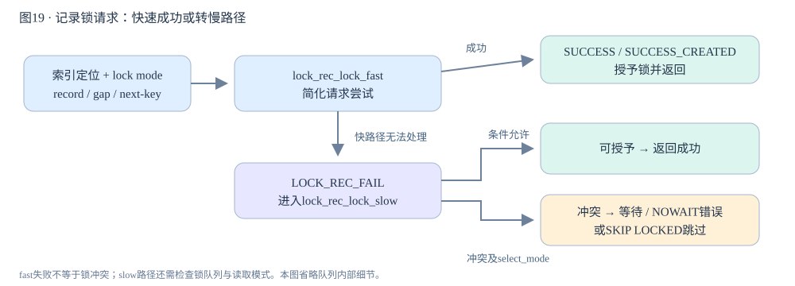

快路径无法处理会进入慢路径，并不直接等于等待。慢路径结合冲突与select_mode决定授予、等待、NOWAIT错误或SKIP LOCKED跳过。

**真实源码窗口：**[storage/innobase/lock/lock0lock.cc · L1918–L1966](https://github.com/mysql/mysql-server/blob/dc86e412f18b36ce271f791026714e8caa0ec919/storage/innobase/lock/lock0lock.cc#L1918-L1966)。

```cpp
/** Tries to lock the specified record in the mode requested. If not immediately
possible, enqueues a waiting lock request. This is a low-level function
which does NOT look at implicit locks! Checks lock compatibility within
explicit locks. This function sets a normal next-key lock, or in the case
of a page supremum record, a gap type lock.
@param[in]      impl            if true, no lock is set if no wait is
                                necessary: we assume that the caller will
                                set an implicit lock
@param[in]      sel_mode        select mode: SELECT_ORDINARY,
                                SELECT_SKIP_LOCKED, or SELECT_NO_WAIT
@param[in]      mode            lock mode: LOCK_X or LOCK_S possibly ORed to
                                either LOCK_GAP or LOCK_REC_NOT_GAP
@param[in]      block           buffer block containing the record
@param[in]      heap_no         heap number of record
@param[in]      index           index of record
@param[in,out]  thr             query thread
@return DB_SUCCESS, DB_SUCCESS_LOCKED_REC, DB_LOCK_WAIT, DB_DEADLOCK,
DB_SKIP_LOCKED, or DB_LOCK_NOWAIT */
static dberr_t lock_rec_lock(bool impl, select_mode sel_mode, ulint mode,
                             const buf_block_t *block, ulint heap_no,
                             dict_index_t *index, que_thr_t *thr) {
  ut_ad(locksys::owns_page_shard(block->get_page_id()));
  ut_ad(!srv_read_only_mode);
  ut_ad((LOCK_MODE_MASK & mode) != LOCK_S ||
        lock_table_has(thr_get_trx(thr), index->table, LOCK_IS));
  ut_ad((LOCK_MODE_MASK & mode) != LOCK_X ||
        lock_table_has(thr_get_trx(thr), index->table, LOCK_IX));
  ut_ad((LOCK_MODE_MASK & mode) == LOCK_S || (LOCK_MODE_MASK & mode) == LOCK_X);
  ut_ad(mode - (LOCK_MODE_MASK & mode) == LOCK_GAP ||
        mode - (LOCK_MODE_MASK & mode) == LOCK_REC_NOT_GAP ||
        mode - (LOCK_MODE_MASK & mode) == 0);
  ut_ad(index->is_clustered() || !dict_index_is_online_ddl(index));
  /* Implicit locks are equivalent to LOCK_X|LOCK_REC_NOT_GAP, so we can omit
  creation of explicit lock only if the requested mode was LOCK_REC_NOT_GAP */
  ut_ad(!impl || ((mode & LOCK_REC_NOT_GAP) == LOCK_REC_NOT_GAP));
  /* We try a simplified and faster subroutine for the most
  common cases */
  switch (lock_rec_lock_fast(impl, mode, block, heap_no, index, thr)) {
    case LOCK_REC_SUCCESS:
      return (DB_SUCCESS);
    case LOCK_REC_SUCCESS_CREATED:
      return (DB_SUCCESS_LOCKED_REC);
    case LOCK_REC_FAIL:
      return (
          lock_rec_lock_slow(impl, sel_mode, mode, block, heap_no, index, thr));
    default:
      ut_error;
  }
}
```

<a id="chapter-20"></a>

## 20 · 死锁检测：等待图和牺牲者选择

两个事务各持有一条记录锁，再请求对方持有的记录，会形成有向等待环。8.4的lock0wait.cc构建等待信息与边，找候选环后重新校验，避免锁状态变化导致误判；不是每次等待都立即认定死锁。

lock_wait_choose_victim比较事务权重，并存在高优先级仲裁。一般倾向选择较小事务回滚，但不应承诺固定回滚“最后来的那个”。事务权重涉及已修改数据和锁数量，且选择需要相应lock_sys保护。检测关闭后仍可由lock wait timeout结束等待，处理时机和错误语义不同。

死锁回滚的是被选事务；普通锁等待超时默认往往只回滚失败语句，完整事务处理还受innodb_rollback_on_timeout等影响。应用捕获1213应重试完整业务事务并控制次数，避免只重跑最后一条UPDATE。统一访问顺序、缩短事务和减少扫描锁范围比增大超时更直接。


**真实源码窗口：**[storage/innobase/lock/lock0wait.cc · L911–L958](https://github.com/mysql/mysql-server/blob/dc86e412f18b36ce271f791026714e8caa0ec919/storage/innobase/lock/lock0wait.cc#L911-L958)。

```cpp
/** Given an array with information about all waiting transactions and indexes
in it which form a deadlock cycle, picks the transaction to rollback.
@param[in]    cycle_ids   indexes in `infos` array, of transactions forming the
                          deadlock cycle
@param[in]    infos       information about all waiting transactions
@return the transaction chosen as a victim */
static trx_t *lock_wait_choose_victim(
    const ut::vector<uint> &cycle_ids,
    const ut::vector<waiting_trx_info_t> &infos) {
  /* We are iterating over various transactions comparing their trx_weight_ge,
  which is computed based on number of locks held thus we need exclusive latch
  on the whole lock_sys. In theory number of locks should not change while the
  transaction is waiting, but instead of proving that they can not wake up, it
  is easier to assert that we hold the mutex */
  ut_ad(locksys::owns_exclusive_global_latch());
  ut_ad(!cycle_ids.empty());
  trx_t *chosen_victim = nullptr;
  auto sorted_trxs = lock_wait_order_for_choosing_victim(cycle_ids, infos);

  for (auto *trx : sorted_trxs) {
    if (chosen_victim == nullptr) {
      chosen_victim = trx;
      continue;
    }

    if (trx_is_high_priority(chosen_victim) || trx_is_high_priority(trx)) {
      auto victim = trx_arbitrate(trx, chosen_victim);

      if (victim != nullptr) {
        if (victim == trx) {
          chosen_victim = trx;
        } else {
          ut_a(victim == chosen_victim);
        }
        continue;
      }
    }

    if (trx_weight_ge(chosen_victim, trx)) {
      /* The joining transaction is 'smaller',
      choose it as the victim and roll it back. */
      chosen_victim = trx;
    }
  }

  ut_a(chosen_victim);
  return chosen_victim;
}
```

<a id="chapter-21"></a>

## 21 · 事务提交：内存可见、redo可靠与锁释放

trx_commit_low组织引擎事务提交，trx_commit_in_memory处理内存事务状态、undo历史与锁释放；trx_flush_log_if_needed_low按srv_flush_log_at_trx_commit决定日志写/刷。提交不是一条write系统调用，且binlog开启时Server级协调会改变何时由谁完成持久化等待。

配置1要求写日志并按flush方式保证持久化，配置2写入文件但不在该调用中强制flush，配置0不在此事务提交调用写/刷。后台周期任务提供后续推进，但周期不是严格“一秒最多丢一秒”的实时承诺；调度和硬件都会影响窗口。服务端确认与客户端收到确认也不是同一时间。

rollback需要undo恢复事务修改；已提交修改即使数据页还脏，也由redo提供崩溃重做基础。业务判断COMMIT结果不应依赖连接是否恰好还活着：服务器提交后响应丢失是结果不确定窗口。幂等业务键或事后查询事务结果比简单重试INSERT更可靠。


**真实源码窗口：**[storage/innobase/trx/trx0trx.cc · L1752–L1784](https://github.com/mysql/mysql-server/blob/dc86e412f18b36ce271f791026714e8caa0ec919/storage/innobase/trx/trx0trx.cc#L1752-L1784)。

```cpp
/** If required, flushes the log to disk based on the value of
 innodb_flush_log_at_trx_commit. */
static void trx_flush_log_if_needed_low(lsn_t lsn) /*!< in: lsn up to which logs
                                                   are to be flushed. */
{
#ifdef _WIN32
  bool flush = true;
#else
  bool flush = srv_unix_file_flush_method != SRV_UNIX_NOSYNC;
#endif /* _WIN32 */

  Wait_stats wait_stats;

  switch (srv_flush_log_at_trx_commit) {
    case 2:
      /* Write the log but do not flush it to disk */
      flush = false;
      [[fallthrough]];
    case 1:
      /* Write the log and optionally flush it to disk */
      wait_stats = log_write_up_to(*log_sys, lsn, flush);

      MONITOR_INC_WAIT_STATS(MONITOR_TRX_ON_LOG_, wait_stats);

      return;
    case 0:
      /* Do nothing */
      return;
  }
}

/** If required, flushes the log to disk based on the value of
 innodb_flush_log_at_trx_commit. */
```

<a id="chapter-22"></a>

## 22 · Binlog与redo两阶段提交：对齐两个事实

Server的ha_commit_trans根据参与者、读写状态与no_2pc等条件决定是否通过tc_log准备。启用binlog且涉及需要协调的事务时，Server与InnoDB共同维护提交一致性，不能仅按“只有一个存储引擎”判断一定跳过协调。InnoDB trx_prepare_low把undo segment由ACTIVE改为PREPARED，并通过mtr记录此状态。

binlog再写完整事务事件和结束标记，ordered_commit负责flush/sync/commit各阶段。持久化binlog中的提交决定，与InnoDB可恢复的prepared状态结合，让启动恢复能判断悬而未决事务该提交还是回滚。XID服务这次内部协调；GTID标识复制事务，不是InnoDB事务ID或页LSN。

在prepare完成但binlog提交决定未持久化时崩溃，恢复不能随意把prepared事务当已提交；在binlog提交决定持久化后、引擎最终commit未完成时崩溃，则要依据协调日志完成提交。双1配置只是常见持久化要求组合，实际保证还依赖文件系统、硬件与错误策略，不能说“两阶段使任何配置都不丢”。

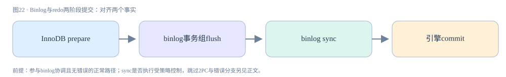

这是参与binlog协调事务的成功主线；不是所有只读/空事务、binlog关闭或no_2pc场景的必经步骤。SYNC是否真正同步还受sync_binlog等策略控制。

**真实源码窗口：**[storage/innobase/trx/trx0trx.cc · L2921–L2976](https://github.com/mysql/mysql-server/blob/dc86e412f18b36ce271f791026714e8caa0ec919/storage/innobase/trx/trx0trx.cc#L2921-L2976)。

```cpp
/** Prepares a transaction for given rollback segment.
 @return lsn_t: lsn assigned for commit of scheduled rollback segment */
static lsn_t trx_prepare_low(
    trx_t *trx,               /*!< in/out: transaction */
    trx_undo_ptr_t *undo_ptr, /*!< in/out: pointer to rollback
                              segment scheduled for prepare. */
    bool noredo_logging)      /*!< in: turn-off redo logging. */
{
  if (undo_ptr->insert_undo != nullptr || undo_ptr->update_undo != nullptr) {
    mtr_t mtr;
    trx_rseg_t *rseg = undo_ptr->rseg;

    mtr_start_sync(&mtr);

    if (noredo_logging) {
      mtr_set_log_mode(&mtr, MTR_LOG_NO_REDO);
    }

    /* Change the undo log segment states from TRX_UNDO_ACTIVE to
    TRX_UNDO_PREPARED: these modifications to the file data
    structure define the transaction as prepared in the file-based
    world, at the serialization point of lsn. */

    rseg->latch();

    if (undo_ptr->insert_undo != nullptr) {
      /* It is not necessary to obtain trx->undo_mutex here
      because only a single OS thread is allowed to do the
      transaction prepare for this transaction. */
      trx_undo_set_state_at_prepare(trx, undo_ptr->insert_undo, false, &mtr);
    }

    if (undo_ptr->update_undo != nullptr) {
      if (!noredo_logging) {
        trx_undo_gtid_set(trx, undo_ptr->update_undo, true);
      }
      trx_undo_set_state_at_prepare(trx, undo_ptr->update_undo, false, &mtr);
    }

    rseg->unlatch();

    /*--------------*/
    /* This mtr commit makes the transaction prepared in
    file-based world. */
    mtr_commit(&mtr);
    /*--------------*/

    if (!noredo_logging) {
      const lsn_t lsn = mtr.commit_lsn();
      ut_ad(lsn > 0 || !mtr_t::s_logging.is_enabled());
      return lsn;
    }
  }

  return 0;
}
```

<a id="chapter-23"></a>

## 23 · 组提交与故障窗口：三阶段不是三次事务

MYSQL_BIN_LOG::ordered_commit用Commit_stage_manager组织队列，每个阶段选leader处理一组THD，followers等待。FLUSH把事务缓存落到binlog文件，SYNC按sync_binlog策略同步，COMMIT按binlog_order_commits等条件完成引擎提交。不同阶段队列可以合并，故一次同步覆盖多个事务。

源码在FLUSH与SYNC间设置crash/debug同步点，恰好提醒“写入文件”还不等于可靠落盘。flush_error与sync_error单独处理，binlog_error_action控制某些错误后的终止策略；仅看函数末尾return 0不足以理解失败路径。opt_binlog_order_commits关闭时，提交阶段走不同线程路径，不能把leader永远提交所有引擎作为无条件事实。

窗口推演：prepare前没有提交决定；prepared但binlog未可靠保存需恢复仲裁；binlog可靠、引擎尚未完成需恢复提交；引擎完成而客户端未收到OK是业务结果不确定。这里不执行kill或断电实验，因为普通发布构建无法直接使用DBUG_SUICIDE。先纸面核对源码时点，再在隔离debug环境进行故障注入。

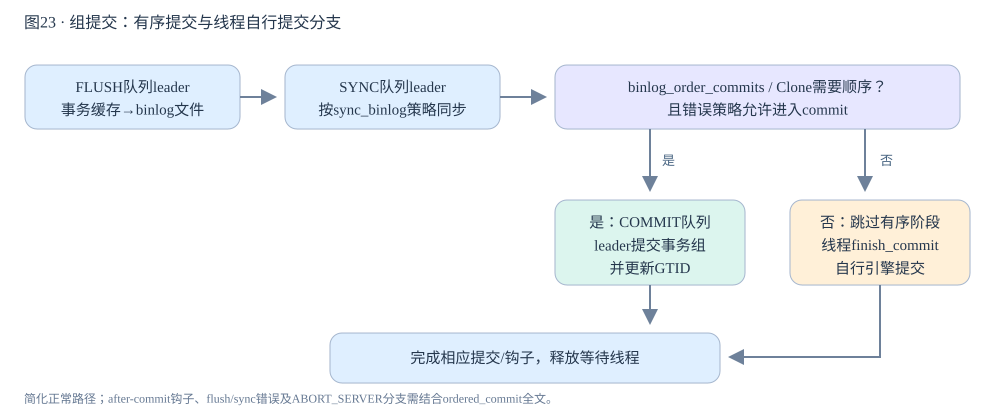

有序COMMIT队列是条件路径。关闭提交顺序且Clone不要求顺序等情况下，线程通过finish_commit完成对应引擎提交；flush/sync错误与ABORT_SERVER分支应单独追踪。

**真实源码窗口：**[sql/binlog.cc · L8974–L9280](https://github.com/mysql/mysql-server/blob/dc86e412f18b36ce271f791026714e8caa0ec919/sql/binlog.cc#L8974-L9280)。

```cpp
int MYSQL_BIN_LOG::ordered_commit(THD *thd, bool all, bool skip_commit) {
  DBUG_TRACE;
  int flush_error = 0, sync_error = 0;
  my_off_t total_bytes = 0;
  bool do_rotate = false;

  CONDITIONAL_SYNC_POINT_FOR_TIMESTAMP("before_assign_session_to_bgc_ticket");
  thd->rpl_thd_ctx.binlog_group_commit_ctx().assign_ticket();

  DBUG_EXECUTE_IF("syncpoint_before_wait_on_ticket_3",
                  binlog::Bgc_ticket_manager::instance().push_new_ticket(););
  DBUG_EXECUTE_IF("begin_new_bgc_ticket",
                  binlog::Bgc_ticket_manager::instance().push_new_ticket(););

  DBUG_EXECUTE_IF("crash_commit_before_log", DBUG_SUICIDE(););
  init_thd_variables(thd, all, skip_commit);
  DBUG_PRINT("enter", ("commit_pending: %s, commit_error: %d, thread_id: %u",
                       YESNO(thd->tx_commit_pending), thd->commit_error,
                       thd->thread_id()));

  DEBUG_SYNC(thd, "bgc_before_flush_stage");
  DBUG_EXECUTE_IF("ordered_commit_blocked", {
    const char act[] =
        "now signal signal.ordered_commit_waiting wait_for "
        "signal.ordered_commit_continue";
    assert(!debug_sync_set_action(current_thd, STRING_WITH_LEN(act)));
  });

  /*
    Stage #0: ensure slave threads commit order as they appear in the slave's
              relay log for transactions flushing to binary log.

    This will make thread wait until its turn to commit.
    Commit_order_manager maintains it own queue and its own order for the
    commit. So Stage#0 doesn't maintain separate StageID.
  */
  if (Commit_order_manager::wait_for_its_turn_before_flush_stage(thd) ||
      ending_trans(thd, all) ||
      Commit_order_manager::get_rollback_status(thd)) {
    if (Commit_order_manager::wait(thd)) {
      return thd->commit_error;
    }
  }

  /*
    Stage #1: flushing transactions to binary log

    While flushing, we allow new threads to enter and will process
    them in due time. Once the queue was empty, we cannot reap
    anything more since it is possible that a thread entered and
    appointed itself leader for the flush phase.
  */

  if (change_stage(thd, Commit_stage_manager::BINLOG_FLUSH_STAGE, thd, nullptr,
                   &LOCK_log)) {
    DBUG_PRINT("return", ("Thread ID: %u, commit_error: %d", thd->thread_id(),
                          thd->commit_error));
    return finish_commit(thd);
  }

  THD *wait_queue = nullptr, *final_queue = nullptr;
  mysql_mutex_t *leave_mutex_before_commit_stage = nullptr;
  my_off_t flush_end_pos = 0;
  bool update_binlog_end_pos_after_sync;
  if (unlikely(!is_open())) {
    final_queue = fetch_and_process_flush_stage_queue(true);
    leave_mutex_before_commit_stage = &LOCK_log;
    /*
      binary log is closed, flush stage and sync stage should be
      ignored. Binlog cache should be cleared, but instead of doing
      it here, do that work in 'finish_commit' function so that
      leader and followers thread caches will be cleared.
    */
    goto commit_stage;
  }
  DEBUG_SYNC(thd, "waiting_in_the_middle_of_flush_stage");
  flush_error =
      process_flush_stage_queue(&total_bytes, &do_rotate, &wait_queue);

  if (flush_error == 0 && total_bytes > 0)
    flush_error = flush_cache_to_file(&flush_end_pos);
  DBUG_EXECUTE_IF("crash_after_flush_binlog", DBUG_SUICIDE(););

  update_binlog_end_pos_after_sync = (get_sync_period() == 1);

  /*
    If the flush finished successfully, we can call the after_flush
    hook. Being invoked here, we have the guarantee that the hook is
    executed before the before/after_send_hooks on the dump thread
    preventing race conditions among these plug-ins.
  */
  if (flush_error == 0) {
    const char *file_name_ptr = log_file_name + dirname_length(log_file_name);
    assert(flush_end_pos != 0);
    if (RUN_HOOK(binlog_storage, after_flush,
                 (thd, file_name_ptr, flush_end_pos))) {
      LogErr(ERROR_LEVEL, ER_BINLOG_FAILED_TO_RUN_AFTER_FLUSH_HOOK);
      flush_error = ER_ERROR_ON_WRITE;
    }

    if (!update_binlog_end_pos_after_sync) update_binlog_end_pos();

    DBUG_EXECUTE_IF("crash_commit_after_log", DBUG_SUICIDE(););
  }

  if (flush_error) {
    /*
      Handle flush error (if any) after leader finishes it's flush stage.
    */
    handle_binlog_flush_or_sync_error(
        thd, false /* need_lock_log */,
        (thd->commit_error == THD::CE_FLUSH_GNO_EXHAUSTED_ERROR)
            ? ER_THD(thd, ER_GNO_EXHAUSTED)
            : nullptr);
  }

  DEBUG_SYNC(thd, "bgc_after_flush_stage_before_sync_stage");

  /*
    Stage #2: Syncing binary log file to disk
  */

  if (change_stage(thd, Commit_stage_manager::SYNC_STAGE, wait_queue, &LOCK_log,
                   &LOCK_sync)) {
    DBUG_PRINT("return", ("Thread ID: %u, commit_error: %d", thd->thread_id(),
                          thd->commit_error));
    return finish_commit(thd);
  }

  /*
    Shall introduce a delay only if it is going to do sync
    in this ongoing SYNC stage. The "+1" used below in the
    if condition is to count the ongoing sync stage.
    When sync_binlog=0 (where we never do sync in BGC group),
    it is considered as a special case and delay will be executed
    for every group just like how it is done when sync_binlog= 1.
  */
  if (!flush_error && (sync_counter + 1 >= get_sync_period()))
    Commit_stage_manager::get_instance().wait_count_or_timeout(
        opt_binlog_group_commit_sync_no_delay_count,
        opt_binlog_group_commit_sync_delay, Commit_stage_manager::SYNC_STAGE);

  final_queue = Commit_stage_manager::get_instance().fetch_queue_acquire_lock(
      Commit_stage_manager::SYNC_STAGE);

  if (flush_error == 0 && total_bytes > 0) {
    DEBUG_SYNC(thd, "before_sync_binlog_file");
    std::pair<bool, bool> result = sync_binlog_file(false);
    sync_error = result.first;
  }

  if (update_binlog_end_pos_after_sync && flush_error == 0 && sync_error == 0) {
    THD *tmp_thd = final_queue;
    const char *binlog_file = nullptr;
    my_off_t pos = 0;

    while (tmp_thd != nullptr) {
      if (tmp_thd->commit_error == THD::CE_NONE) {
        tmp_thd->get_trans_fixed_pos(&binlog_file, &pos);
      }
      tmp_thd = tmp_thd->next_to_commit;
    }

    if (binlog_file != nullptr && pos > 0) {
      update_binlog_end_pos(binlog_file, pos);
    }
  }

  DEBUG_SYNC(thd, "bgc_after_sync_stage_before_commit_stage");

  leave_mutex_before_commit_stage = &LOCK_sync;
  /*
    Stage #3: Commit all transactions in order.

    This stage is skipped if we do not need to order the commits and
    each thread have to execute the handlerton commit instead.

    However, since we are keeping the lock from the previous stage, we
    need to unlock it if we skip the stage.

    We must also step commit_clock before the ha_commit_low() is called
    either in ordered fashion (by the leader of this stage) or by the thread
    themselves.

    We are delaying the handling of sync error until
    all locks are released but we should not enter into
    commit stage if binlog_error_action is ABORT_SERVER.
  */
commit_stage:
  /* Clone needs binlog commit order. */
  if ((opt_binlog_order_commits || Clone_handler::need_commit_order()) &&
      (sync_error == 0 || binlog_error_action != ABORT_SERVER)) {
    if (change_stage(thd, Commit_stage_manager::COMMIT_STAGE, final_queue,
                     leave_mutex_before_commit_stage, &LOCK_commit)) {
      DBUG_PRINT("return", ("Thread ID: %u, commit_error: %d", thd->thread_id(),
                            thd->commit_error));
      return finish_commit(thd);
    }
    THD *commit_queue =
        Commit_stage_manager::get_instance().fetch_queue_acquire_lock(
            Commit_stage_manager::COMMIT_STAGE);
    DBUG_EXECUTE_IF("semi_sync_3-way_deadlock",
                    DEBUG_SYNC(thd, "before_process_commit_stage_queue"););

    if (flush_error == 0 && sync_error == 0)
      sync_error = call_after_sync_hook(commit_queue);

    /*
      process_commit_stage_queue will call update_on_commit or
      update_on_rollback for the GTID owned by each thd in the queue.

      This will be done this way to guarantee that GTIDs are added to
      gtid_executed in order, to avoid creating unnecessary temporary
      gaps and keep gtid_executed as a single interval at all times.

      If we allow each thread to call update_on_commit only when they
      are at finish_commit, the GTID order cannot be guaranteed and
      temporary gaps may appear in gtid_executed. When this happen,
      the server would have to add and remove intervals from the
      Gtid_set, and adding and removing intervals requires a mutex,
      which would reduce performance.
    */
    process_commit_stage_queue(thd, commit_queue);

    /**
     * After commit stage
     */
    if (change_stage(thd, Commit_stage_manager::AFTER_COMMIT_STAGE,
                     commit_queue, &LOCK_commit, &LOCK_after_commit)) {
      DBUG_PRINT("return", ("Thread ID: %u, commit_error: %d", thd->thread_id(),
                            thd->commit_error));
      return finish_commit(thd);
    }

    THD *after_commit_queue =
        Commit_stage_manager::get_instance().fetch_queue_acquire_lock(
            Commit_stage_manager::AFTER_COMMIT_STAGE);

    process_after_commit_stage_queue(thd, after_commit_queue);

    final_queue = after_commit_queue;
    mysql_mutex_unlock(&LOCK_after_commit);
  } else {
    if (leave_mutex_before_commit_stage)
      mysql_mutex_unlock(leave_mutex_before_commit_stage);
    if (flush_error == 0 && sync_error == 0)
      sync_error = call_after_sync_hook(final_queue);
  }

  /*
    Handle sync error after we release all locks in order to avoid deadlocks
  */
  if (sync_error)
    handle_binlog_flush_or_sync_error(thd, true /* need_lock_log */, nullptr);

  DEBUG_SYNC(thd, "before_signal_done");
  /* Commit done so signal all waiting threads */
  Commit_stage_manager::get_instance().signal_done(final_queue);
  DBUG_EXECUTE_IF("block_leader_after_delete", {
    const char action[] = "now SIGNAL leader_proceed";
    assert(!debug_sync_set_action(thd, STRING_WITH_LEN(action)));
  };);

  /*
    Finish the commit before executing a rotate, or run the risk of a
    deadlock. We don't need the return value here since it is in
    thd->commit_error, which is returned below.
  */
  (void)finish_commit(thd);
  DEBUG_SYNC(thd, "bgc_after_commit_stage_before_rotation");

  /*
    If we need to rotate, we do it without commit error.
    Otherwise the thd->commit_error will be possibly reset.
   */
  if (DBUG_EVALUATE_IF("force_rotate", 1, 0) ||
      (do_rotate && thd->commit_error == THD::CE_NONE &&
       !is_rotating_caused_by_incident)) {
    /*
      Do not force the rotate as several consecutive groups may
      request unnecessary rotations.

      NOTE: Run purge_logs wo/ holding LOCK_log because it does not
      need the mutex. Otherwise causes various deadlocks.
    */

    DEBUG_SYNC(thd, "ready_to_do_rotation");
    bool check_purge = false;
    mysql_mutex_lock(&LOCK_log);
    /*
      If rotate fails then depends on binlog_error_action variable
      appropriate action will be taken inside rotate call.
    */
    int error = rotate(false, &check_purge);
    mysql_mutex_unlock(&LOCK_log);

    if (error)
      thd->commit_error = THD::CE_COMMIT_ERROR;
    else if (check_purge)
      auto_purge();
  }
  /*
    flush or sync errors are handled above (using binlog_error_action).
    Hence treat only COMMIT_ERRORs as errors.
  */
  return thd->commit_error == THD::CE_COMMIT_ERROR;
}
```

### 补充证据：COMMIT阶段：GTID更新随事务组完成

process_commit_stage_queue在协调日志可靠性检查后调用引擎提交并更新GTID状态。关闭有序提交时要继续读另外分支，不应宣称所有配置都由leader串行完成。

[sql/binlog.cc · L8974–L9280](https://github.com/mysql/mysql-server/blob/dc86e412f18b36ce271f791026714e8caa0ec919/sql/binlog.cc#L8974-L9280)

```cpp
int MYSQL_BIN_LOG::ordered_commit(THD *thd, bool all, bool skip_commit) {
  DBUG_TRACE;
  int flush_error = 0, sync_error = 0;
  my_off_t total_bytes = 0;
  bool do_rotate = false;

  CONDITIONAL_SYNC_POINT_FOR_TIMESTAMP("before_assign_session_to_bgc_ticket");
  thd->rpl_thd_ctx.binlog_group_commit_ctx().assign_ticket();

  DBUG_EXECUTE_IF("syncpoint_before_wait_on_ticket_3",
                  binlog::Bgc_ticket_manager::instance().push_new_ticket(););
  DBUG_EXECUTE_IF("begin_new_bgc_ticket",
                  binlog::Bgc_ticket_manager::instance().push_new_ticket(););

  DBUG_EXECUTE_IF("crash_commit_before_log", DBUG_SUICIDE(););
  init_thd_variables(thd, all, skip_commit);
  DBUG_PRINT("enter", ("commit_pending: %s, commit_error: %d, thread_id: %u",
                       YESNO(thd->tx_commit_pending), thd->commit_error,
                       thd->thread_id()));

  DEBUG_SYNC(thd, "bgc_before_flush_stage");
  DBUG_EXECUTE_IF("ordered_commit_blocked", {
    const char act[] =
        "now signal signal.ordered_commit_waiting wait_for "
        "signal.ordered_commit_continue";
    assert(!debug_sync_set_action(current_thd, STRING_WITH_LEN(act)));
  });

  /*
    Stage #0: ensure slave threads commit order as they appear in the slave's
              relay log for transactions flushing to binary log.

    This will make thread wait until its turn to commit.
    Commit_order_manager maintains it own queue and its own order for the
    commit. So Stage#0 doesn't maintain separate StageID.
  */
  if (Commit_order_manager::wait_for_its_turn_before_flush_stage(thd) ||
      ending_trans(thd, all) ||
      Commit_order_manager::get_rollback_status(thd)) {
    if (Commit_order_manager::wait(thd)) {
      return thd->commit_error;
    }
  }

  /*
    Stage #1: flushing transactions to binary log

    While flushing, we allow new threads to enter and will process
    them in due time. Once the queue was empty, we cannot reap
    anything more since it is possible that a thread entered and
    appointed itself leader for the flush phase.
  */

  if (change_stage(thd, Commit_stage_manager::BINLOG_FLUSH_STAGE, thd, nullptr,
                   &LOCK_log)) {
    DBUG_PRINT("return", ("Thread ID: %u, commit_error: %d", thd->thread_id(),
                          thd->commit_error));
    return finish_commit(thd);
  }

  THD *wait_queue = nullptr, *final_queue = nullptr;
  mysql_mutex_t *leave_mutex_before_commit_stage = nullptr;
  my_off_t flush_end_pos = 0;
  bool update_binlog_end_pos_after_sync;
  if (unlikely(!is_open())) {
    final_queue = fetch_and_process_flush_stage_queue(true);
    leave_mutex_before_commit_stage = &LOCK_log;
    /*
      binary log is closed, flush stage and sync stage should be
      ignored. Binlog cache should be cleared, but instead of doing
      it here, do that work in 'finish_commit' function so that
      leader and followers thread caches will be cleared.
    */
    goto commit_stage;
  }
  DEBUG_SYNC(thd, "waiting_in_the_middle_of_flush_stage");
  flush_error =
      process_flush_stage_queue(&total_bytes, &do_rotate, &wait_queue);

  if (flush_error == 0 && total_bytes > 0)
    flush_error = flush_cache_to_file(&flush_end_pos);
  DBUG_EXECUTE_IF("crash_after_flush_binlog", DBUG_SUICIDE(););

  update_binlog_end_pos_after_sync = (get_sync_period() == 1);

  /*
    If the flush finished successfully, we can call the after_flush
    hook. Being invoked here, we have the guarantee that the hook is
    executed before the before/after_send_hooks on the dump thread
    preventing race conditions among these plug-ins.
  */
  if (flush_error == 0) {
    const char *file_name_ptr = log_file_name + dirname_length(log_file_name);
    assert(flush_end_pos != 0);
    if (RUN_HOOK(binlog_storage, after_flush,
                 (thd, file_name_ptr, flush_end_pos))) {
      LogErr(ERROR_LEVEL, ER_BINLOG_FAILED_TO_RUN_AFTER_FLUSH_HOOK);
      flush_error = ER_ERROR_ON_WRITE;
    }

    if (!update_binlog_end_pos_after_sync) update_binlog_end_pos();

    DBUG_EXECUTE_IF("crash_commit_after_log", DBUG_SUICIDE(););
  }

  if (flush_error) {
    /*
      Handle flush error (if any) after leader finishes it's flush stage.
    */
    handle_binlog_flush_or_sync_error(
        thd, false /* need_lock_log */,
        (thd->commit_error == THD::CE_FLUSH_GNO_EXHAUSTED_ERROR)
            ? ER_THD(thd, ER_GNO_EXHAUSTED)
            : nullptr);
  }

  DEBUG_SYNC(thd, "bgc_after_flush_stage_before_sync_stage");

  /*
    Stage #2: Syncing binary log file to disk
  */

  if (change_stage(thd, Commit_stage_manager::SYNC_STAGE, wait_queue, &LOCK_log,
                   &LOCK_sync)) {
    DBUG_PRINT("return", ("Thread ID: %u, commit_error: %d", thd->thread_id(),
                          thd->commit_error));
    return finish_commit(thd);
  }

  /*
    Shall introduce a delay only if it is going to do sync
    in this ongoing SYNC stage. The "+1" used below in the
    if condition is to count the ongoing sync stage.
    When sync_binlog=0 (where we never do sync in BGC group),
    it is considered as a special case and delay will be executed
    for every group just like how it is done when sync_binlog= 1.
  */
  if (!flush_error && (sync_counter + 1 >= get_sync_period()))
    Commit_stage_manager::get_instance().wait_count_or_timeout(
        opt_binlog_group_commit_sync_no_delay_count,
        opt_binlog_group_commit_sync_delay, Commit_stage_manager::SYNC_STAGE);

  final_queue = Commit_stage_manager::get_instance().fetch_queue_acquire_lock(
      Commit_stage_manager::SYNC_STAGE);

  if (flush_error == 0 && total_bytes > 0) {
    DEBUG_SYNC(thd, "before_sync_binlog_file");
    std::pair<bool, bool> result = sync_binlog_file(false);
    sync_error = result.first;
  }

  if (update_binlog_end_pos_after_sync && flush_error == 0 && sync_error == 0) {
    THD *tmp_thd = final_queue;
    const char *binlog_file = nullptr;
    my_off_t pos = 0;

    while (tmp_thd != nullptr) {
      if (tmp_thd->commit_error == THD::CE_NONE) {
        tmp_thd->get_trans_fixed_pos(&binlog_file, &pos);
      }
      tmp_thd = tmp_thd->next_to_commit;
    }

    if (binlog_file != nullptr && pos > 0) {
      update_binlog_end_pos(binlog_file, pos);
    }
  }

  DEBUG_SYNC(thd, "bgc_after_sync_stage_before_commit_stage");

  leave_mutex_before_commit_stage = &LOCK_sync;
  /*
    Stage #3: Commit all transactions in order.

    This stage is skipped if we do not need to order the commits and
    each thread have to execute the handlerton commit instead.

    However, since we are keeping the lock from the previous stage, we
    need to unlock it if we skip the stage.

    We must also step commit_clock before the ha_commit_low() is called
    either in ordered fashion (by the leader of this stage) or by the thread
    themselves.

    We are delaying the handling of sync error until
    all locks are released but we should not enter into
    commit stage if binlog_error_action is ABORT_SERVER.
  */
commit_stage:
  /* Clone needs binlog commit order. */
  if ((opt_binlog_order_commits || Clone_handler::need_commit_order()) &&
      (sync_error == 0 || binlog_error_action != ABORT_SERVER)) {
    if (change_stage(thd, Commit_stage_manager::COMMIT_STAGE, final_queue,
                     leave_mutex_before_commit_stage, &LOCK_commit)) {
      DBUG_PRINT("return", ("Thread ID: %u, commit_error: %d", thd->thread_id(),
                            thd->commit_error));
      return finish_commit(thd);
    }
    THD *commit_queue =
        Commit_stage_manager::get_instance().fetch_queue_acquire_lock(
            Commit_stage_manager::COMMIT_STAGE);
    DBUG_EXECUTE_IF("semi_sync_3-way_deadlock",
                    DEBUG_SYNC(thd, "before_process_commit_stage_queue"););

    if (flush_error == 0 && sync_error == 0)
      sync_error = call_after_sync_hook(commit_queue);

    /*
      process_commit_stage_queue will call update_on_commit or
      update_on_rollback for the GTID owned by each thd in the queue.

      This will be done this way to guarantee that GTIDs are added to
      gtid_executed in order, to avoid creating unnecessary temporary
      gaps and keep gtid_executed as a single interval at all times.

      If we allow each thread to call update_on_commit only when they
      are at finish_commit, the GTID order cannot be guaranteed and
      temporary gaps may appear in gtid_executed. When this happen,
      the server would have to add and remove intervals from the
      Gtid_set, and adding and removing intervals requires a mutex,
      which would reduce performance.
    */
    process_commit_stage_queue(thd, commit_queue);

    /**
     * After commit stage
     */
    if (change_stage(thd, Commit_stage_manager::AFTER_COMMIT_STAGE,
                     commit_queue, &LOCK_commit, &LOCK_after_commit)) {
      DBUG_PRINT("return", ("Thread ID: %u, commit_error: %d", thd->thread_id(),
                            thd->commit_error));
      return finish_commit(thd);
    }

    THD *after_commit_queue =
        Commit_stage_manager::get_instance().fetch_queue_acquire_lock(
            Commit_stage_manager::AFTER_COMMIT_STAGE);

    process_after_commit_stage_queue(thd, after_commit_queue);

    final_queue = after_commit_queue;
    mysql_mutex_unlock(&LOCK_after_commit);
  } else {
    if (leave_mutex_before_commit_stage)
      mysql_mutex_unlock(leave_mutex_before_commit_stage);
    if (flush_error == 0 && sync_error == 0)
      sync_error = call_after_sync_hook(final_queue);
  }

  /*
    Handle sync error after we release all locks in order to avoid deadlocks
  */
  if (sync_error)
    handle_binlog_flush_or_sync_error(thd, true /* need_lock_log */, nullptr);

  DEBUG_SYNC(thd, "before_signal_done");
  /* Commit done so signal all waiting threads */
  Commit_stage_manager::get_instance().signal_done(final_queue);
  DBUG_EXECUTE_IF("block_leader_after_delete", {
    const char action[] = "now SIGNAL leader_proceed";
    assert(!debug_sync_set_action(thd, STRING_WITH_LEN(action)));
  };);

  /*
    Finish the commit before executing a rotate, or run the risk of a
    deadlock. We don't need the return value here since it is in
    thd->commit_error, which is returned below.
  */
  (void)finish_commit(thd);
  DEBUG_SYNC(thd, "bgc_after_commit_stage_before_rotation");

  /*
    If we need to rotate, we do it without commit error.
    Otherwise the thd->commit_error will be possibly reset.
   */
  if (DBUG_EVALUATE_IF("force_rotate", 1, 0) ||
      (do_rotate && thd->commit_error == THD::CE_NONE &&
       !is_rotating_caused_by_incident)) {
    /*
      Do not force the rotate as several consecutive groups may
      request unnecessary rotations.

      NOTE: Run purge_logs wo/ holding LOCK_log because it does not
      need the mutex. Otherwise causes various deadlocks.
    */

    DEBUG_SYNC(thd, "ready_to_do_rotation");
    bool check_purge = false;
    mysql_mutex_lock(&LOCK_log);
    /*
      If rotate fails then depends on binlog_error_action variable
      appropriate action will be taken inside rotate call.
    */
    int error = rotate(false, &check_purge);
    mysql_mutex_unlock(&LOCK_log);

    if (error)
      thd->commit_error = THD::CE_COMMIT_ERROR;
    else if (check_purge)
      auto_purge();
  }
  /*
    flush or sync errors are handled above (using binlog_error_action).
    Hence treat only COMMIT_ERRORs as errors.
  */
  return thd->commit_error == THD::CE_COMMIT_ERROR;
}

```

### 提交故障窗口对照

| 时点 | 恢复/业务后果 |
|---|---|
| prepare前 | 没有完整提交决定，未完成事务回滚 |
| prepared但binlog决定未可靠保存 | 由协调日志仲裁，不能仅凭prepared提交 |
| binlog提交决定可靠，引擎commit未完成 | 恢复完成提交，对齐两个日志事实 |
| 引擎完成，OK响应丢失 | 数据库已提交，客户端结果不确定，需业务幂等 |

此表假定日志和设备满足对应可靠保存条件，配置放宽、I/O错误或日志损坏应回到具体分支。

<a id="chapter-24"></a>

## 24 · Checkpoint与恢复：日志何时允许复用

checkpoint不是“所有脏页刷完”的瞬间。InnoDB连续评估哪些日志已不再是恢复脏页所必需，结合flush list与近期完成日志信息得到可推进位置。log_update_available_for_checkpoint_lsn先确认m_allow_checkpoints；恢复尚未完成时不信任flush list，不能提前推进。

available_for_checkpoint_lsn只在新值更大时更新，实际checkpoint还受其他约束和保存动作影响。current LSN与checkpoint LSN间距表现恢复/日志复用压力，不等于某个事务尚未提交。redo循环空间要保留还不能覆盖的区间，慢刷页会反过来拖住日志复用并压制前台写入。

recv_recovery_from_checkpoint_start扫描redo、校验块与组边界并组织页恢复；页上的LSN用于判定某物理修改是否已经反映。之后还需处理未完成事务与协调日志，不是只重做就可开放服务。备份恢复不能直接复制运行中的任意ibd文件：一致性点、redo、字典、undo和日志协调共同决定可恢复性。


**真实源码窗口：**[storage/innobase/log/log0chkp.cc · L282–L310](https://github.com/mysql/mysql-server/blob/dc86e412f18b36ce271f791026714e8caa0ec919/storage/innobase/log/log0chkp.cc#L282-L310)。

```cpp
static void log_update_available_for_checkpoint_lsn(log_t &log) {
  /* Note: log.m_allow_checkpoints is set to true after recovery is finished,
  and changes gathered in recv_sys->metadata_recover are applied to dict_table_t
  objects; or in log_start() if recovery was not needed. We can't trust
  flush lists until recovery is finished, so we must not update lsn available
  for checkpoint (as update would be based on what we can see inside them). */
  if (!log.m_allow_checkpoints.load(std::memory_order_acquire)) {
    return;
  }

  /* Update lsn available for checkpoint. */
  log.recent_closed.advance_tail();
  const lsn_t oldest_lsn = log_compute_available_for_checkpoint_lsn(log);

  log_limits_mutex_enter(log);

  /* 1. The oldest_lsn can decrease in case previously buffer pool flush
        lists were empty and now a new dirty page appeared, which causes
        a maximum delay of log.recent_closed_size being suddenly subtracted.

     2. Race between concurrent log_update_available_for_checkpoint_lsn is
        also possible. */

  if (oldest_lsn > log.available_for_checkpoint_lsn) {
    log.available_for_checkpoint_lsn = oldest_lsn;
  }

  log_limits_mutex_exit(log);
}
```

### 补充证据：恢复入口：没有可用checkpoint就不能正常重做

恢复初始化flush-list辅助结构，检查force recovery模式，寻找可用checkpoint；找不到会返回DB_ERROR。强制恢复跳过redo是特殊救援模式，不能据此推断正常启动安全性。

[storage/innobase/log/log0recv.cc · L3850–L4029](https://github.com/mysql/mysql-server/blob/dc86e412f18b36ce271f791026714e8caa0ec919/storage/innobase/log/log0recv.cc#L3850-L4029)

```cpp
dberr_t recv_recovery_from_checkpoint_start(log_t &log, lsn_t flush_lsn) {
  /* Initialize red-black tree for fast insertions into the
  flush_list during recovery process. */
  buf_flush_init_flush_rbt();

  if (srv_force_recovery >= SRV_FORCE_NO_LOG_REDO) {
    ib::info(ER_IB_MSG_728);

    /* We leave redo log not started and this is read-only mode. */
    ut_a(log.sn == 0);
    ut_a(srv_read_only_mode);

    return DB_SUCCESS;
  }

  recv_recovery_on = true;

  ut_a(log.m_format == Log_format::CURRENT);

  /* Look for the latest checkpoint */
  Log_checkpoint_location checkpoint;
  if (!recv_find_max_checkpoint(log, checkpoint)) {
    ib::error(ER_IB_MSG_RECOVERY_CHECKPOINT_NOT_FOUND);
    return DB_ERROR;
  }

  const auto checkpoint_file = log.m_files.find(checkpoint.m_checkpoint_lsn);

  /* When reading checkpoints from redo log files, error would be reported
  if checkpoint_lsn was outside the redo log file from which it was read,
  and such file would be skipped. If no checkpoint was found because of that,
  then recv_find_max_checkpoint would return false. Therefore here we know
  that InnoDB found a valid checkpoint (for which there is a redo log file
  which contains the checkpoint_lsn). */
  if (checkpoint_file == log.m_files.end()) {
    ut_d(ut_error);
    ut_o(return DB_ERROR);
  }

  log.last_checkpoint_lsn.store(checkpoint.m_checkpoint_lsn);

  const auto file_path = log_file_path(log.m_files_ctx, checkpoint_file->m_id);
  ib::info(ER_IB_MSG_LOG_CHECKPOINT_FOUND,
           ulonglong{checkpoint.m_checkpoint_lsn}, file_path.c_str());

  Log_checkpoint_header checkpoint_header;

  auto checkpoint_file_handle =
      checkpoint_file->open(Log_file_access_mode::READ_ONLY);

  if (!checkpoint_file_handle.is_open()) {
    return DB_CANNOT_OPEN_FILE;
  }

  dberr_t err = log_checkpoint_header_read(checkpoint_file_handle,
                                           checkpoint.m_checkpoint_header_no,
                                           checkpoint_header);
  if (err != DB_SUCCESS) {
    return err;
  }

  checkpoint_file_handle.close();

  const lsn_t checkpoint_lsn = checkpoint.m_checkpoint_lsn;

  ut_a(checkpoint_lsn == checkpoint_header.m_checkpoint_lsn);

  /* Start reading the log from the checkpoint LSN up. */

  ut_ad(RECV_SCAN_SIZE <= log.buf_size);

  ut_ad(recv_sys->n_addrs == 0);

  /* NOTE: we always do a 'recovery' at startup, but only if
  there is something wrong we will print a message to the
  user about recovery: */

  if (checkpoint_lsn != flush_lsn) {
    if (checkpoint_lsn < flush_lsn) {
      ib::warn(ER_IB_MSG_RECOVERY_CHECKPOINT_FROM_BEFORE_CLEAN_SHUTDOWN,
               ulonglong{checkpoint_lsn}, ulonglong{flush_lsn});
    }

    if (!recv_needed_recovery) {
      ib::info(ER_IB_MSG_RECOVERY_IS_NEEDED, ulonglong{flush_lsn},
               ulonglong{checkpoint_lsn});

      if (srv_read_only_mode) {
        ib::error(ER_IB_MSG_RECOVERY_IN_READ_ONLY);

        return DB_ERROR;
      }

      recv_init_crash_recovery();
    }
  }

  err = recv_recovery_begin(log, checkpoint_lsn);
  if (err != DB_SUCCESS) {
    return err;
  }

  if (srv_read_only_mode && log.m_scanned_lsn > checkpoint_lsn) {
    ib::error(ER_IB_MSG_RECOVERY_IN_READ_ONLY);
    return DB_ERROR;
  }

  lsn_t recovered_lsn;

  recovered_lsn = recv_sys->recovered_lsn;

  ut_a(recv_needed_recovery || checkpoint_lsn == recovered_lsn);

  ut_a(!srv_read_only_mode || !recv_needed_recovery);
  ut_a(!srv_read_only_mode || checkpoint_lsn == recovered_lsn);

  log.recovered_lsn = recovered_lsn;

  ut_a(log.m_files.find(recovered_lsn) != log.m_files.end());

  /* If it is at block boundary, add header size. */
  auto check_scanned_lsn = log.m_scanned_lsn;
  if (check_scanned_lsn % OS_FILE_LOG_BLOCK_SIZE == 0) {
    check_scanned_lsn += LOG_BLOCK_HDR_SIZE;
  }

  if (check_scanned_lsn < checkpoint_lsn ||
      check_scanned_lsn < recv_max_page_lsn) {
    ib::error(ER_IB_MSG_737, ulonglong{log.m_scanned_lsn},
              ulonglong{checkpoint_lsn}, ulonglong{recv_max_page_lsn});
  }

  if (recovered_lsn < checkpoint_lsn) {
    /* No harm in trying to do RO access. */
    if (!srv_read_only_mode) {
      ut_error;
    }

    return DB_ERROR;
  }

  if ((recv_sys->found_corrupt_log && srv_force_recovery == 0) ||
      recv_sys->found_corrupt_fs) {
    return DB_ERROR;
  }

  /* Disallow checkpoints until recovery is finished, and changes gathered
  in recv_sys->metadata_recover (dict_metadata) are transferred to
  dict_table_t objects (happens in srv0start.cc). */

  err = log_start(log, checkpoint_lsn, recovered_lsn, false);
  if (err != DB_SUCCESS) {
    return err;
  }

  /* Make the preservation of max checkpoint info on disk certain by writing
  the checkpoint also to the other checkpoint header. After that both headers
  will have the same checkpoint_lsn. This is an extra protection in case next
  checkpoint write will become corrupted because of crash during the write. */

  if (!srv_read_only_mode) {
    log.next_checkpoint_header_no =
        log_next_checkpoint_header(checkpoint.m_checkpoint_header_no);

    err = log_files_next_checkpoint(log, checkpoint_lsn);
    if (err != DB_SUCCESS) {
      return err;
    }
  }

  mutex_enter(&recv_sys->mutex);
  recv_sys->apply_log_recs = true;
  mutex_exit(&recv_sys->mutex);

  /* The database is now ready to start almost normal processing of user
  transactions: transaction rollbacks and the application of the log
  records in the hash table can be run in background. */

  return DB_SUCCESS;
}

```

<a id="chapter-25"></a>

## 25 · Purge：为什么长事务拖住历史清理

提交后的update undo进入历史清理范围，但只有不再被活动ReadView需要的版本才允许purge。purge线程根据视图边界推进，处理delete-mark记录、二级索引清理与undo历史；它不是把每个已提交事务的undo马上删除。

长时间一致性读固定旧视图，使较新的版本仍须保留。history list length因此增长，磁盘空间、后台清理压力与读追链长度也可能升高。数量指标不是字节数，更不是简单“未提交事务数”。purge赶不上写入与单个老视图钉住边界是两种问题，需要先查最老事务起始时间与状态。

仅杀掉阻塞业务SQL而保留连接事务，可能没有释放ReadView。应确认事务完成或连接回滚。undo tablespace截断与逻辑版本清理也有不同条件，不能期待COMMIT后文件立即变小。实验应观察历史趋势，并在两个会话分别结束读事务后比较，而不以一次状态输出推断持续积压。


**真实源码窗口：**[storage/innobase/trx/trx0purge.cc · L2388–L2477](https://github.com/mysql/mysql-server/blob/dc86e412f18b36ce271f791026714e8caa0ec919/storage/innobase/trx/trx0purge.cc#L2388-L2477)。

```cpp
/** This function runs a purge batch.
 @return number of undo log pages handled in the batch */
ulint trx_purge(ulint n_purge_threads, /*!< in: number of purge tasks
                                       to submit to the work queue */
                ulint batch_size,      /*!< in: the maximum number of records
                                       to purge in one batch */
                bool truncate)         /*!< in: truncate history if true */
{
  que_thr_t *thr = nullptr;
  ulint n_pages_handled;

  ut_a(n_purge_threads > 0);

  srv_dml_needed_delay = trx_purge_dml_delay();

  /* The number of tasks submitted should be completed. */
  ut_a(purge_sys->n_submitted == purge_sys->n_completed);

  rw_lock_x_lock(&purge_sys->latch, UT_LOCATION_HERE);

  trx_sys->mvcc->clone_oldest_view(&purge_sys->view);

  rw_lock_x_unlock(&purge_sys->latch);

#ifdef UNIV_DEBUG
  if (srv_purge_view_update_only_debug) {
    return (0);
  }
#endif /* UNIV_DEBUG */

  /* Fetch the UNDO recs that need to be purged. */
  n_pages_handled = trx_purge_attach_undo_recs(n_purge_threads, batch_size);

  /* Submit the tasks to the work queue. */
  for (ulint i = 0; i < n_purge_threads - 1; ++i) {
    thr = que_fork_scheduler_round_robin(purge_sys->query, thr);

    ut_a(thr != nullptr);

    srv_que_task_enqueue_low(thr);
  }

  thr = que_fork_scheduler_round_robin(purge_sys->query, thr);
  ut_a(thr != nullptr);

  purge_sys->n_submitted += n_purge_threads - 1;

  que_run_threads(thr);

  trx_purge_wait_for_workers_to_complete();

  ut_a(purge_sys->n_submitted == purge_sys->n_completed);

#ifdef UNIV_DEBUG
  rw_lock_x_lock(&purge_sys->latch, UT_LOCATION_HERE);
  if (purge_sys->limit.trx_no == 0) {
    purge_sys->done = purge_sys->iter;
  } else {
    purge_sys->done = purge_sys->limit;
  }
  rw_lock_x_unlock(&purge_sys->latch);
#endif /* UNIV_DEBUG */

  /* The first page of LOBs are freed at the end of a purge batch because
  multiple purge threads will access the same LOB as part of the purge
  process.  Some purge threads will free only portion of the LOB related to
  the partial update of the LOB.  But 1 of the purge thread will free the LOB
  completely if it is not needed anymore (either because of full update or
  because of deletion).  If the LOB is freed, and a purge thread attempts to
  access the LOB, then it is a bug.  To avoid this, we delay the freeing of
  the first page of LOB till the end of a purge batch.  */
  for (thr = UT_LIST_GET_FIRST(purge_sys->query->thrs); thr != nullptr;
       thr = UT_LIST_GET_NEXT(thrs, thr)) {
    purge_node_t *node = static_cast<purge_node_t *>(thr->child);
    node->free_lob_pages();
  }

  /* During upgrade, to know whether purge is empty,
  we rely on purge history length. So truncate the
  undo logs during upgrade to update purge history
  length. */
  if (truncate || srv_upgrade_old_undo_found) {
    trx_purge_truncate();
  }

  MONITOR_INC_VALUE(MONITOR_PURGE_INVOKED, 1);
  MONITOR_INC_VALUE(MONITOR_PURGE_N_PAGE_HANDLED, n_pages_handled);

  return (n_pages_handled);
}
```

<a id="chapter-26"></a>

## 26 · 复制与GTID：应用日志不是重放数据页

Classic复制读取source binlog，在replica接收与持久化relay log，然后applier执行事件。apply_event_and_update_pos把事件应用和位点管理联系起来，多线程复制还涉及协调线程、worker及提交顺序；接收进度与执行进度是不同水位。

GTID使用source UUID与事务序列标识事务，gtid_executed描述已执行集合。相同事务可通过集合避免重复执行，但“有GTID”并不意味着数据内容自动一致：过滤、错误跳过、非事务对象或人为修改仍能破坏一致性。复制读取的是binlog事件语义，InnoDB redo则面向本地页恢复，二者不能互当备份。

延迟要区分传输慢、relay积压、worker执行慢与提交依赖等待。Seconds_Behind_Source不是所有故障下都准确的端到端时延。查询performance_schema.replication_applier_status_by_worker的错误、应用事务和时间信息，结合receiver状态判定。8.4使用SOURCE/REPLICA命令，老MASTER/SLAVE术语源码残留不表示文档应该统一沿用。

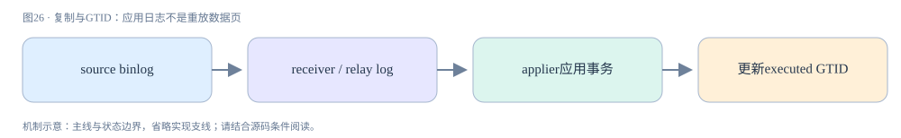

**真实源码窗口：**[sql/rpl_replica.cc · L4383–L4771](https://github.com/mysql/mysql-server/blob/dc86e412f18b36ce271f791026714e8caa0ec919/sql/rpl_replica.cc#L4383-L4771)。

```cpp
/**
  Applies the given event and advances the relay log position.

  This is needed by the sql thread to execute events from the binlog,
  and by clients executing BINLOG statements.  Conceptually, this
  function does:

  @code
    ev->apply_event(rli);
    ev->update_pos(rli);
  @endcode

  It also does the following maintenance:

   - Initializes the thread's server_id and time; and the event's
     thread.

   - If !rli->belongs_to_client() (i.e., if it belongs to the slave
     sql thread instead of being used for executing BINLOG
     statements), it does the following things: (1) skips events if it
     is needed according to the server id or slave_skip_counter; (2)
     unlocks rli->data_lock; (3) sleeps if required by 'CHANGE REPLICATION
  SOURCE TO SOURCE_DELAY=X'; (4) maintains the running state of the sql thread
  (rli->thread_state).

   - Reports errors as needed.

  @param ptr_ev a pointer to a reference to the event to apply.

  @param thd The client thread that executes the event (i.e., the
  slave sql thread if called from a replication slave, or the client
  thread if called to execute a BINLOG statement).

  @param rli The relay log info (i.e., the slave's rli if called from
  a replication slave, or the client's thd->rli_fake if called to
  execute a BINLOG statement).

  @note MTS can store NULL to @c ptr_ev location to indicate
        the event is taken over by a Worker.

  @retval SLAVE_APPLY_EVENT_AND_UPDATE_POS_OK
          OK.

  @retval SLAVE_APPLY_EVENT_AND_UPDATE_POS_APPLY_ERROR
          Error calling ev->apply_event().

  @retval SLAVE_APPLY_EVENT_AND_UPDATE_POS_UPDATE_POS_ERROR
          No error calling ev->apply_event(), but error calling
          ev->update_pos().

  @retval SLAVE_APPLY_EVENT_AND_UPDATE_POS_APPEND_JOB_ERROR
          append_item_to_jobs() failed, thread was killed while waiting
          for successful enqueue on worker.
*/
static enum enum_slave_apply_event_and_update_pos_retval
apply_event_and_update_pos(Log_event **ptr_ev, THD *thd, Relay_log_info *rli) {
  int exec_res = 0;
  bool skip_event = false;
  Log_event *ev = *ptr_ev;
  Log_event::enum_skip_reason reason = Log_event::EVENT_SKIP_NOT;

  DBUG_TRACE;

  DBUG_PRINT("exec_event",
             ("%s(type_code: %d; server_id: %d)", ev->get_type_str(),
              ev->get_type_code(), ev->server_id));
  DBUG_PRINT("info",
             ("thd->options: %s%s; rli->last_event_start_time: %lu",
              FLAGSTR(thd->variables.option_bits, OPTION_NOT_AUTOCOMMIT),
              FLAGSTR(thd->variables.option_bits, OPTION_BEGIN),
              (ulong)rli->last_event_start_time));

  /*
    Execute the event to change the database and update the binary
    log coordinates, but first we set some data that is needed for
    the thread.

    The event will be executed unless it is supposed to be skipped.

    Queries originating from this server must be skipped.  Low-level
    events (Format_description_log_event, Rotate_log_event,
    Stop_log_event) from this server must also be skipped. But for
    those we don't want to modify 'group_master_log_pos', because
    these events did not exist on the master.
    Format_description_log_event is not completely skipped.

    Skip queries specified by the user in 'slave_skip_counter'.  We
    can't however skip events that has something to do with the log
    files themselves.

    Filtering on own server id is extremely important, to ignore
    execution of events created by the creation/rotation of the relay
    log (remember that now the relay log starts with its Format_desc,
    has a Rotate etc).
  */
  /*
     Set the unmasked and actual server ids from the event
   */
  thd->server_id = ev->server_id;  // use the original server id for logging
  thd->unmasked_server_id = ev->common_header->unmasked_server_id;
  thd->set_time();  // time the query
  thd->lex->set_current_query_block(nullptr);
  if (!ev->common_header->when.tv_sec)
    my_micro_time_to_timeval(my_micro_time(), &ev->common_header->when);
  ev->thd = thd;  // because up to this point, ev->thd == 0

  if (!(rli->is_mts_recovery() &&
        bitmap_is_set(&rli->recovery_groups, rli->mts_recovery_index))) {
    reason = ev->shall_skip(rli);
  }
#ifndef NDEBUG
  if (rli->is_mts_recovery()) {
    DBUG_PRINT("mta",
               ("Mta is recovering %d, number of bits set %d, "
                "bitmap is set %d, index %lu.\n",
                rli->is_mts_recovery(), bitmap_bits_set(&rli->recovery_groups),
                bitmap_is_set(&rli->recovery_groups, rli->mts_recovery_index),
                rli->mts_recovery_index));
  }
#endif
  if (reason == Log_event::EVENT_SKIP_COUNT) {
    --rli->slave_skip_counter;
    skip_event = true;
  }
  set_timespec_nsec(&rli->ts_exec[0], 0);
  rli->stats_read_time += diff_timespec(&rli->ts_exec[0], &rli->ts_exec[1]);

  if (reason == Log_event::EVENT_SKIP_NOT) {
    // Sleeps if needed, and unlocks rli->data_lock.
    if (sql_delay_event(ev, thd, rli))
      return SLAVE_APPLY_EVENT_AND_UPDATE_POS_OK;

    // Setting positions for STA. Worker positions are set on
    // slave_worker_exec_job_group
    rli->set_group_source_log_start_end_pos(ev);
    exec_res = ev->apply_event(rli);

    DBUG_EXECUTE_IF("simulate_stop_when_mta_in_group",
                    if (rli->mts_group_status == Relay_log_info::MTS_IN_GROUP &&
                        rli->curr_group_seen_begin)
                        DBUG_SET("+d,stop_when_mta_in_group"););

    if (!exec_res && (ev->worker != rli)) {
      if (ev->worker) {
        Slave_job_item item = {ev, rli->get_event_relay_log_number(),
                               rli->get_event_start_pos()};
        Slave_job_item *job_item = &item;
        Slave_worker *w = (Slave_worker *)ev->worker;
        // specially marked group typically with OVER_MAX_DBS_IN_EVENT_MTS db:s
        bool need_sync = ev->is_mts_group_isolated();

        // all events except BEGIN-query must be marked with a non-NULL Worker
        assert(((Slave_worker *)ev->worker) == rli->last_assigned_worker);

        DBUG_PRINT("Log_event::apply_event:",
                   ("-> job item data %p to W_%lu", job_item->data, w->id));

        // Reset mts in-group state
        if (rli->mts_group_status == Relay_log_info::MTS_END_GROUP) {
          // CGAP cleanup
          rli->curr_group_assigned_parts.clear();
          // reset the B-group and Gtid-group marker
          rli->curr_group_seen_begin = rli->curr_group_seen_gtid = false;
          rli->last_assigned_worker = nullptr;
        }
        /*
           Storing GAQ index of the group that the event belongs to
           in the event. Deferred events are handled similarly below.
        */
        ev->mts_group_idx = rli->gaq->assigned_group_index;

        bool append_item_to_jobs_error = false;
        if (rli->curr_group_da.size() > 0) {
          /*
            the current event sorted out which partition the current group
            belongs to. It's time now to processed deferred array events.
          */
          for (uint i = 0; i < rli->curr_group_da.size(); i++) {
            Slave_job_item da_item = rli->curr_group_da[i];
            DBUG_PRINT("mta", ("Assigning job %llu to worker %lu",
                               (da_item.data)->common_header->log_pos, w->id));
            da_item.data->mts_group_idx =
                rli->gaq->assigned_group_index;  // similarly to above
            if (!append_item_to_jobs_error)
              append_item_to_jobs_error = append_item_to_jobs(&da_item, w, rli);
            if (append_item_to_jobs_error) delete da_item.data;
          }
          rli->curr_group_da.clear();
        }
        if (append_item_to_jobs_error)
          return SLAVE_APPLY_EVENT_AND_UPDATE_POS_APPEND_JOB_ERROR;

        DBUG_PRINT("mta", ("Assigning job %llu to worker %lu\n",
                           job_item->data->common_header->log_pos, w->id));

        /* Notice `ev' instance can be destroyed after `append()' */
        if (append_item_to_jobs(job_item, w, rli))
          return SLAVE_APPLY_EVENT_AND_UPDATE_POS_APPEND_JOB_ERROR;
        if (need_sync) {
          /*
            combination of over-max db:s and end of the current group
            forces to wait for the assigned groups completion by assigned
            to the event worker.
            Indeed MTS group status could be safely set to MTS_NOT_IN_GROUP
            after wait_() returns.
            No need to know a possible error out of synchronization call.
          */
          (void)rli->current_mts_submode->wait_for_workers_to_finish(rli);
        }
      }
      *ptr_ev = nullptr;  // announcing the event is passed to w-worker

      if (rli->is_parallel_exec() &&
          rli->mts_online_stat_curr > mts_online_stat_count) {
        time_t my_now = time(nullptr);

        if (((my_now - rli->mts_last_online_stat) >= mts_online_stat_period) ||
            DBUG_EVALUATE_IF("simulate_log_err_ER_RPL_MTA_STATISTICS", 1, 0)) {
          LogErr(INFORMATION_LEVEL, ER_RPL_MTA_STATISTICS,
                 rli->get_for_channel_str(),
                 static_cast<unsigned long>(my_now - rli->mts_last_online_stat),
                 rli->mts_events_assigned, rli->mts_wq_overrun_cnt.load(),
                 rli->mts_wq_overfill_cnt, rli->wq_size_waits_cnt,
                 rli->mts_total_wait_overlap.load(),
                 rli->mts_wq_no_underrun_cnt, rli->mts_total_wait_worker_avail);
          rli->mts_last_online_stat = my_now;
        }

        rli->mts_online_stat_curr = 0;
      }
    }
  } else
    mysql_mutex_unlock(&rli->data_lock);

  set_timespec_nsec(&rli->ts_exec[1], 0);
  rli->stats_exec_time += diff_timespec(&rli->ts_exec[1], &rli->ts_exec[0]);

  DBUG_PRINT("info", ("apply_event error = %d", exec_res));
  if (exec_res == 0) {
    /*
      Positions are not updated here when an XID is processed. To make
      a slave crash-safe, positions must be updated while processing a
      XID event and as such do not need to be updated here again.

      However, if the event needs to be skipped, this means that it
      will not be processed and then positions need to be updated here.

      DDL:s that are not yet committed, as indicated by
      @c has_ddl_committed flag, visit the block.

      See sql/rpl_rli.h for further details.
    */
    int error = 0;
    if (*ptr_ev &&
        ((ev->get_type_code() != mysql::binlog::event::XID_EVENT &&
          !is_committed_ddl(*ptr_ev)) ||
         skip_event ||
         (rli->is_mts_recovery() && !is_any_gtid_event(ev) &&
          (ev->ends_group() || !rli->mts_recovery_group_seen_begin) &&
          bitmap_is_set(&rli->recovery_groups, rli->mts_recovery_index)))) {
#ifndef NDEBUG
      /*
        This only prints information to the debug trace.

        TODO: Print an informational message to the error log?
      */
      static const char *const explain[] = {
          // EVENT_SKIP_NOT,
          "not skipped",
          // EVENT_SKIP_IGNORE,
          "skipped because event should be ignored",
          // EVENT_SKIP_COUNT
          "skipped because event skip counter was non-zero"};
      DBUG_PRINT("info",
                 ("OPTION_BEGIN: %d; IN_STMT: %d",
                  static_cast<bool>(thd->variables.option_bits & OPTION_BEGIN),
                  rli->get_flag(Relay_log_info::IN_STMT)));
      DBUG_PRINT("skip_event",
                 ("%s event was %s", ev->get_type_str(), explain[reason]));
#endif

      error = ev->update_pos(rli);
      /*
        Slave skips an event if the slave_skip_counter is greater than zero.
        We have to free thd's mem_root here after we update the positions
        in the repository table if the event is a skipped event.
        Otherwise, imagine a situation where slave_skip_counter is big number
        and slave is skipping the events and updating the repository.
        All the memory used while these operations are going on is never
        freed unless slave starts executing the events (after slave_skip_counter
        becomes zero).

        Hence we free thd's mem_root here if it is a skipped event.
        (freeing mem_root generally happens from Query_log_event::do_apply_event
        or Rows_log_event::do_apply_event when they find the end of
        the group event).
      */
      if (skip_event) thd->mem_root->ClearForReuse();

#ifndef NDEBUG
      DBUG_PRINT("info", ("update_pos error = %d", error));
      if (!rli->belongs_to_client()) {
        char buf[22];
        DBUG_PRINT("info",
                   ("group %s %s", llstr(rli->get_group_relay_log_pos(), buf),
                    rli->get_group_relay_log_name()));
        DBUG_PRINT("info",
                   ("event %s %s", llstr(rli->get_event_relay_log_pos(), buf),
                    rli->get_event_relay_log_name()));
      }
#endif
    } else {
      /*
        INTVAR_EVENT, RAND_EVENT, USER_VAR_EVENT and ROWS_QUERY_LOG_EVENT are
        deferred event. It means ev->worker is NULL.
      */
      assert(*ptr_ev == ev || rli->is_parallel_exec() ||
             (!ev->worker &&
              (ev->get_type_code() == mysql::binlog::event::INTVAR_EVENT ||
               ev->get_type_code() == mysql::binlog::event::RAND_EVENT ||
               ev->get_type_code() == mysql::binlog::event::USER_VAR_EVENT ||
               ev->get_type_code() ==
                   mysql::binlog::event::ROWS_QUERY_LOG_EVENT)));

      rli->inc_event_relay_log_pos();
    }

    if (!error && rli->is_mts_recovery() &&
        ev->get_type_code() != mysql::binlog::event::ROTATE_EVENT &&
        ev->get_type_code() != mysql::binlog::event::FORMAT_DESCRIPTION_EVENT &&
        ev->get_type_code() != mysql::binlog::event::PREVIOUS_GTIDS_LOG_EVENT) {
      if (ev->starts_group()) {
        rli->mts_recovery_group_seen_begin = true;
      } else if ((ev->ends_group() || !rli->mts_recovery_group_seen_begin) &&
                 !is_any_gtid_event(ev)) {
        rli->mts_recovery_index++;
        if (--rli->mts_recovery_group_cnt == 0) {
          rli->mts_recovery_index = 0;
          LogErr(INFORMATION_LEVEL, ER_RPL_MTA_RECOVERY_COMPLETE,
                 rli->get_for_channel_str(), rli->get_group_relay_log_name(),
                 rli->get_group_relay_log_pos(),
                 rli->get_group_master_log_name(),
                 rli->get_group_master_log_pos());
          /*
             Few tests wait for UNTIL_SQL_AFTER_MTS_GAPS completion.
             Due to existing convention the status won't change
             prior to slave restarts.
             So making of UNTIL_SQL_AFTER_MTS_GAPS completion is done here,
             and only in the debug build to make the test to catch the change
             despite a faulty design of UNTIL checking before execution.
          */
          if (rli->until_condition ==
              Relay_log_info::UNTIL_SQL_AFTER_MTS_GAPS) {
            rli->until_condition = Relay_log_info::UNTIL_DONE;
          }
          // reset the Worker tables to remove last slave session time info
          if ((error = rli->mts_finalize_recovery())) {
            (void)Rpl_info_factory::reset_workers(rli);
          }
        }
        rli->mts_recovery_group_seen_begin = false;
        if (!error)
          error = rli->flush_info(Relay_log_info::RLI_FLUSH_IGNORE_SYNC_OPT);
      }
    }

    if (error) {
      /*
        The update should not fail, so print an error message and
        return an error code.

        TODO: Replace this with a decent error message when merged
        with BUG#24954 (which adds several new error message).
      */
      char buf[22];
      rli->report(ERROR_LEVEL, ER_UNKNOWN_ERROR,
                  "It was not possible to update the positions"
                  " of the relay log information: the replica may"
                  " be in an inconsistent state."
                  " Stopped in %s position %s",
                  rli->get_group_relay_log_name(),
                  llstr(rli->get_group_relay_log_pos(), buf));
      return SLAVE_APPLY_EVENT_AND_UPDATE_POS_UPDATE_POS_ERROR;
    }
  }

  return exec_res ? SLAVE_APPLY_EVENT_AND_UPDATE_POS_APPLY_ERROR
                  : SLAVE_APPLY_EVENT_AND_UPDATE_POS_OK;
}
```

<a id="chapter-27"></a>

## 27 · 诊断与实验：把计划、锁和LSN放回同一现场

诊断先构造假设：慢在扫描、锁等待还是持久化？扫描问题看EXPLAIN ANALYZE与rows/loops，锁问题看data_lock_waits/metadata_locks及阻塞事务，持久化问题看redo写/刷、checkpoint与文件I/O等待。每类证据指向不同源码入口，不能从一个“慢查询”结论跳到缓存或加索引。

附带lab.sql建立独立source_lab库，使用显式主键、联合索引及少量数据；sessions.md给出两个会话RR/RC快照、FOR UPDATE、gap等待与死锁调度。SQL与预期是可复现设计，未在本机启动/编译MySQL，也没有伪造EXPLAIN结果。执行前核对SELECT VERSION()和隔离设置。

完成学习时应能连续复述：COM_QUERY建立THD语句状态→解析形成查询块→优化选择访问路径→迭代器Read跨handler→InnoDB游标取页与记录→ReadView或锁决定可读版本→结果返回；写事务另有undo/redo和binlog协调链。复述中如果出现“COMMIT刷全表”“RR等于BEGIN快照”“二级索引永远不回表”，返回对应章重新推演条件。

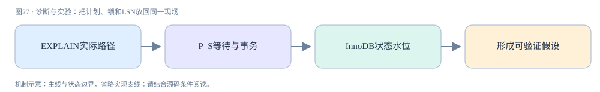

**真实源码窗口：**[sql/sql_union.cc · L1676–L1809](https://github.com/mysql/mysql-server/blob/dc86e412f18b36ce271f791026714e8caa0ec919/sql/sql_union.cc#L1676-L1809)。

```cpp
bool Query_expression::ExecuteIteratorQuery(THD *thd) {
  THD_STAGE_INFO(thd, stage_executing);
  DEBUG_SYNC(thd, "before_join_exec");

  Opt_trace_context *const trace = &thd->opt_trace;
  Opt_trace_object trace_wrapper(trace);
  Opt_trace_object trace_exec(trace, "join_execution");
  if (is_simple()) {
    trace_exec.add_select_number(first_query_block()->select_number);
  }
  Opt_trace_array trace_steps(trace, "steps");

  if (ClearForExecution()) {
    return true;
  }

  mem_root_deque<Item *> *fields = get_field_list();
  Query_result *query_result = this->query_result();
  assert(query_result != nullptr);

  if (query_result->start_execution(thd)) return true;

  if (query_result->send_result_set_metadata(
          thd, *fields, Protocol::SEND_NUM_ROWS | Protocol::SEND_EOF)) {
    return true;
  }

  set_executed();

  // Hand over the query to the secondary engine if needed.
  if (first_query_block()->join->override_executor_func != nullptr) {
    thd->current_found_rows = 0;
    for (Query_block *select = first_query_block(); select != nullptr;
         select = select->next_query_block()) {
      if (select->join->override_executor_func(select->join, query_result)) {
        return true;
      }
      thd->current_found_rows += select->join->send_records;
    }
    const bool calc_found_rows =
        (first_query_block()->active_options() & OPTION_FOUND_ROWS);
    if (!calc_found_rows) {
      // This is for backwards compatibility reasons only;
      // we have documented that without SQL_CALC_FOUND_ROWS,
      // we return the actual number of rows returned.
      thd->current_found_rows =
          std::min(thd->current_found_rows, select_limit_cnt);
    }
    return query_result->send_eof(thd);
  }

  if (item != nullptr) {
    item->reset_has_values();

    if (item->is_value_assigned()) {
      item->reset_value_assigned();  // Prepare for re-execution of this unit
      item->reset();
    }
  }

  // We need to accumulate in the first join's send_records as long as
  // we support SQL_CALC_FOUND_ROWS, since LimitOffsetIterator will use it
  // for reporting rows skipped by OFFSET or LIMIT. When we get rid of
  // SQL_CALC_FOUND_ROWS, we can use a local variable here instead.
  ha_rows *send_records_ptr;
  if (is_simple()) {
    // Not a UNION: found_rows() applies to the join.
    // LimitOffsetIterator will write skipped OFFSET rows into the JOIN's
    // send_records, so use that.
    send_records_ptr = &first_query_block()->join->send_records;
  } else if (set_operation()->m_is_materialized) {
    send_records_ptr = &query_term()->query_block()->join->send_records;
  } else {
    // UNION, but without a fake_query_block (may or may not have a
    // LIMIT): found_rows() applies to the outermost block. See
    // Query_expression::send_records for more information.
    send_records_ptr = &send_records;
  }
  *send_records_ptr = 0;

  thd->get_stmt_da()->reset_current_row_for_condition();

  {
    auto join_cleanup = create_scope_guard([this, thd] {
      for (Query_block *sl = first_query_block(); sl;
           sl = sl->next_query_block()) {
        JOIN *join = sl->join;
        join->join_free();
        thd->inc_examined_row_count(join->examined_rows);
      }
      if (!is_simple() && set_operation()->m_is_materialized)
        thd->inc_examined_row_count(
            query_term()->query_block()->join->examined_rows);
    });

    if (m_root_iterator->Init()) {
      return true;
    }

    PFSBatchMode pfs_batch_mode(m_root_iterator.get());

    for (;;) {
      int error = m_root_iterator->Read();
      DBUG_EXECUTE_IF("bug13822652_1", thd->killed = THD::KILL_QUERY;);

      if (error > 0 || thd->is_error())  // Fatal error
        return true;
      else if (error < 0)
        break;
      else if (thd->killed)  // Aborted by user
      {
        thd->send_kill_message();
        return true;
      }

      ++*send_records_ptr;

      if (query_result->send_data(thd, *fields)) {
        return true;
      }
      thd->get_stmt_da()->inc_current_row_for_condition();

      DBUG_EXECUTE_IF("simulate_partial_result_set_scenario",
                      my_error(ER_UNKNOWN_ERROR, MYF(0)););
    }

    // NOTE: join_cleanup must be done before we send EOF, so that we get the
    // row counts right.
  }

  thd->current_found_rows = *send_records_ptr;

  return query_result->send_eof(thd);
}

```

## 源码与官方文档

机制叙述主要来自上述固定源码窗口及其调用上下文，官方文档用于配置和术语核对；没有整段转载官方手册。动态在线手册可能更新，与8.4.0源代码细节有差异时以固定源码说明为准。

- [MySQL官方源码仓库](https://github.com/mysql/mysql-server/tree/dc86e412f18b36ce271f791026714e8caa0ec919)
- [InnoDB多版本机制](https://dev.mysql.com/doc/refman/8.4/en/innodb-multi-versioning.html)
- [Redo日志](https://dev.mysql.com/doc/refman/8.4/en/innodb-redo-log.html)
- [GTID格式与存储](https://dev.mysql.com/doc/refman/8.4/en/replication-gtids-concepts.html)
- [锁与事务](https://dev.mysql.com/doc/refman/8.4/en/innodb-locking.html)

## 复述与追问

1. 为什么数据页可以比COMMIT更晚刷盘，却不能比相关redo更早可靠写出？
2. ReadView的两个边界和活动事务集合如何判断ID103是否可见？
3. 为什么一个已提交事务的undo仍可能不能purge？
4. 为什么binlog可靠保存后、引擎commit前崩溃，恢复不能一律回滚？
5. 一个LIMIT10的查询为何可能扫描十万行？
6. 为什么metadata lock和data lock要分别查？

答案分别在15/17/25/22–23/07/05与19章。回答应包含字段条件和失败结果，而不是只背定义。
