# Nacos源码学习手册：连接、状态与一致性边界

主线Nacos3.2.4 · 固定提交`2c587c04891d532df1544ae95b906b677ac8eeff` · 对照2.5.4`55a99b1c186f81a53976e1a323ae29feb47d3aaf`。核验日期：2026年10月7日。

这是一条从SDK长连接到服务实例、配置正文和AI资源的状态推导路径。所有源码窗口逐字取自固定官方提交。机制图是教学抽象，不承诺运行时同步发生。本文没有执行完整服务端构建、Java集成测试或真实升级实验；源码与静态交付检查已执行。

[网页阅读](index.html) · [离线包](nacos-offline.zip) · [核验记录](VERIFICATION.md) · [源码许可](apache-license.txt)

## 阅读顺序

- [01 固定版本：先确认我们读的是哪一套实现](#baseline)
- [02 部署边界：Server、Console不是同一个职责](#deployment)
- [03 身份键：namespace、group、serviceName怎样避免串线](#identity)
- [04 gRPC接入：TCP连通之后还要登记连接](#connection)
- [05 RpcClient状态机：重连不是一次重新new连接](#rpc-state)
- [06 临时注册入口：实例绑定的是connectionId](#register)
- [07 注册后的状态：实例表、revision、事件怎样推进](#register-state)
- [08 两张索引：谁发布、谁订阅](#indexes)
- [09 推送ACK：收到列表，不等于业务已经使用](#push-cache)
- [10 空列表保护：可用性与陈旧数据的取舍](#empty-protect)
- [11 断链释放：连接回收如何变成实例删除](#disconnect)
- [12 客户端redo：重新注册与重新订阅是两种恢复](#redo)
- [13 Distro责任边界：谁有资格广播客户端数据](#distro-owner)
- [14 Distro延迟任务：合并的是任务，不是历史日志](#distro-task)
- [15 Distro应用快照：不仅增加，还要删除缺席服务](#distro-apply)
- [16 Distro启动与校验：成功条件不是有一个网络响应](#distro-verify)
- [17 持久实例：WriteRequest为什么交给CP协议](#persistent)
- [18 JRaft状态机：提交、应用、快照各保证什么](#raft-apply)
- [19 配置发布：CAS、灰度与正式内容怎样分流](#config-publish)
- [20 外部MySQL：事务边界落在存储实现](#external-db)
- [21 嵌入式数据库：复制SQL命令，不等于共享MySQL](#embedded-db)
- [22 dump与MD5：数据库提交如何变成可读缓存](#dump)
- [23 监听登记：服务端比的是客户端MD5](#listen-server)
- [24 变化通知：先标脏，再拉正文，再回调](#listen-client)
- [25 客户端快照与failover：两种文件不是同一个兜底](#snapshot)
- [26 鉴权与升级：用户权限、服务器身份、Raft认证三层](#auth-upgrade)
- [27 AI Registry之一：MCP/A2A复用配置与发现](#mcp-a2a)
- [28 AI Registry之二：Prompt/Skill的版本、可见性与发布](#prompt-skill)

## 版本对照：保留的机制与真正变化

|维度|2.5.4|3.2.4|迁移含义|
|---|---|---|---|
|服务端基线|2.5.4根POM：Java8|3.2.4根POM：Java17；客户端仍单独Java8|服务端JDK与业务SDK运行时分别检查|
|gRPC|2.x已使用RpcClient/gRPC长连接|继续使用并扩展，不是首次引入|防火墙/负载均衡仍要覆盖SDK与节点间通道|
|控制台|2.x传统console模块/服务集成路径|DeploymentType支持独立Console，默认console.port=8080|浏览器连通不等于SDK服务端可达|
|临时注册|ConnectionBasedClient与Distro已存在|延续Client主记录与异步副本同步|不应以3.x标签宣称全局线性一致|
|持久注册|PersistentClientOperationService与CP已存在|继续通过WriteRequest与状态机应用|多数派与异步推送的保证分开|
|配置存储|外部与嵌入式实现分别存在|继续分开；3.2.4收紧嵌入式结果类型|不能说所有配置都由Raft存储|
|AI资源|2.5.4没有对应ai模块及Prompt/Skill资源模型|MCP/A2A与Prompt/Skill有不同存储和发布链|业务发现兼容不等于新AI API兼容|
|管理客户端|对照版本无maintainer-client模块|新增maintainer-client，与业务client职责分开|管理操作与SDK发现接口分别迁移|
|JRaft认证|2.5.4没有该升级协调器|3.2.4引入能力检测和不可逆enforced锁存|核对每节点身份配置；不要假设混合旧版可滚动降级|
|API兼容开关|没有3.2.4对应AI弃用接口开关|部分旧AI接口默认410；临时兼容开关有明确范围|不能把兼容开关视作所有2.x API的通用开关|


<a id="baseline"></a>
## 01 固定版本：先确认我们读的是哪一套实现

本手册固定Nacos3.2.4的2c587c04891d532df1544ae95b906b677ac8eeff，并以2.5.4的55a99b1c186f81a53976e1a323ae29feb47d3aaf作对照。这里的3.2指系列，具体代码结论只属于这两个提交。升级教程最危险的错误，是把早期2.0、后期2.5和3.2混成一个抽象版本。先锁定源码，后面才能讨论某个字段是否真的新增、某个协议是否仍然存在。

根POM将服务端java.version设为17，却同时保留client.java.version=1.8；这两个属性不能互相替代。服务端运行环境升级，不等于业务应用里的Nacos客户端必须一起升到Java17。3.2.4的Spring Boot依赖基线实际是3.5.14，不能因为另一篇Spring Boot教程使用3.5.16就把这里改写成3.5.16。gRPC依赖也早已存在于2.5.4，因此gRPC绝不是3.2首次引入的功能。

|字段/对象|状态含义|
|---|---|
|`java.version`|服务端编译与运行基线17|
|`client.java.version`|客户端模块单独保留Java8基线|
|`spring-boot-dependencies.version`|3.2.4固定为3.5.14|
|`grpc-java.version`|传输依赖版本，不能代表协议首次出现时间|

### 固定源码正文

[pom.xml，L90–L146](https://github.com/alibaba/nacos/blob/2c587c04891d532df1544ae95b906b677ac8eeff/pom.xml#L90-L146)

```java
    <properties>
        <revision>3.2.4</revision>
        <project.build.sourceEncoding>UTF-8</project.build.sourceEncoding>
        <project.reporting.outputEncoding>UTF-8</project.reporting.outputEncoding>
        <!-- Compiler settings properties -->
        <client.java.version>1.8</client.java.version>
        <java.version>17</java.version>
        <maven.compiler.source>${java.version}</maven.compiler.source>
        <maven.compiler.target>${java.version}</maven.compiler.target>
        <!-- Maven properties -->
        <maven.test.skip>false</maven.test.skip>
        <maven.javadoc.skip>true</maven.javadoc.skip>
        <!-- Exclude all generated code -->
        <sonar.exclusions>file:**/generated-sources/**,**/test/**</sonar.exclusions>
        
        <!-- plugin version -->
        <versions-maven-plugin.version>2.2</versions-maven-plugin.version>
        <dependency-mediator-maven-plugin.version>1.0.2</dependency-mediator-maven-plugin.version>
        <clirr-maven-plugin.version>2.7</clirr-maven-plugin.version>
        <maven-enforcer-plugin.version>3.5.0</maven-enforcer-plugin.version>
        <maven-compiler-plugin.version>3.5.1</maven-compiler-plugin.version>
        <maven-javadoc-plugin.version>2.10.4</maven-javadoc-plugin.version>
        <maven-jar-plugin.version>3.2.2</maven-jar-plugin.version>
        <maven-source-plugin.version>3.0.1</maven-source-plugin.version>

        <apache-rat-plugin.version>0.12</apache-rat-plugin.version>
        <maven-resources-plugin.version>3.0.2</maven-resources-plugin.version>
        <jacoco-maven-plugin.version>0.8.13</jacoco-maven-plugin.version>
        <maven-surefire-plugin.version>3.2.5</maven-surefire-plugin.version>
        <spotbugs-maven-plugin.version>4.8.6.2</spotbugs-maven-plugin.version>
        <sonar-maven-plugin.version>3.0.2</sonar-maven-plugin.version>
        <maven-gpg-plugin.version>3.1.0</maven-gpg-plugin.version>
        <maven-failsafe-plugin.version>3.5.4</maven-failsafe-plugin.version>
        <maven-assembly-plugin.version>3.0.0</maven-assembly-plugin.version>
        <maven-checkstyle-plugin.version>3.6.0</maven-checkstyle-plugin.version>
        <maven-easyj-version>1.1.5</maven-easyj-version>
        <!-- dependency version related to plugin -->
        <extra-enforcer-rules.version>1.9.0</extra-enforcer-rules.version>
        
        <!-- dependency version -->
        <nacos.logback.adapter.version>1.1.5</nacos.logback.adapter.version>
        <spring-boot-dependencies.version>3.5.14</spring-boot-dependencies.version>
        <commons-io.version>2.14.0</commons-io.version>
        <commons-collections.version>3.2.2</commons-collections.version>
        <slf4j-api.version>2.0.13</slf4j-api.version>
        <logback.version>1.5.32</logback.version>
        <log4j.version>2.25.4</log4j.version>
        
        <mysql-connector-java.version>8.2.0</mysql-connector-java.version>
        <postgresql.version>42.7.11</postgresql.version>
        <derby.version>10.14.2.0</derby.version>
        <jjwt.version>0.11.2</jjwt.version>
        <grpc-java.version>1.78.0</grpc-java.version>
        <proto-google-common-protos.version>2.17.0</proto-google-common-protos.version>
        <protobuf-java.version>3.25.5</protobuf-java.version>
        <protoc-gen-grpc-java.version>${grpc-java.version}</protoc-gen-grpc-java.version>
        <hessian.version>4.0.63</hessian.version>
```

### 失败边界

直接用Java8启动3.2服务端会在类加载或启动阶段失败；用错客户端POM判断服务端要求，会把运行时故障误判为网络故障。

### 验证与观察

执行git rev-parse HEAD，再读取两个根POM；只比较固定提交，不以master分支替代。这里已执行SHA与源码窗口核验，未构建整个服务端。


<a id="deployment"></a>
## 02 部署边界：Server、Console不是同一个职责

3.x把控制台和业务服务的职责明确拆开。DeploymentType不仅有MERGED，也有SERVER、CONSOLE和SERVER_WITH_MCP。MERGED意味着同一进程同时承载两种职责；CONSOLE意味着界面和管理入口存在，但不应把它当作SDK注册发现的业务服务端。独立控制台通过代理层访问Server，这比把8080视为原来8848的简单改名更准确。

默认配置的nacos.console.port是8080；SDK端仍须按服务端地址和gRPC端口拓扑接入。控制台能打开只能证明控制台链路可用，不能证明业务SDK的长连接可用。独立部署减少界面流量与注册发现流量的耦合，但也增加Console到Server的连通性和身份转发边界。发布配置时，要沿Console controller→proxy→remote handler→Server操作服务观察，不能止于浏览器请求200。

|字段/对象|状态含义|
|---|---|
|`MERGED`|服务与控制台同进程|
|`SERVER / CONSOLE`|分别承担业务服务和管理界面|
|`SERVER_WITH_MCP`|特定Server与MCP组合部署类型|
|`ILLEGAL`|无法解析的部署类型，不是默认降级模式|

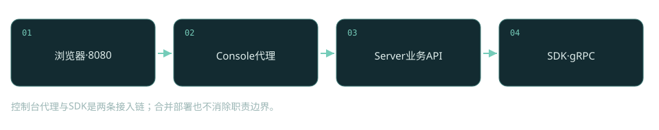
控制台代理与SDK是两条接入链；合并部署也不消除职责边界。

### 固定源码正文

[sys/src/main/java/com/alibaba/nacos/sys/env/DeploymentType.java，L26–L73](https://github.com/alibaba/nacos/blob/2c587c04891d532df1544ae95b906b677ac8eeff/sys/src/main/java/com/alibaba/nacos/sys/env/DeploymentType.java#L26-L73)

```java
    /**
     * Default deployment type, means the nacos server and console are deployed in one process.
     */
    MERGED(Constants.NACOS_DEPLOYMENT_TYPE_MERGED),
    
    /**
     * Only server deployment type, means only the nacos server is deployed in the process.
     */
    SERVER(Constants.NACOS_DEPLOYMENT_TYPE_SERVER),
    
    /**
     * Only console deployment type, means only the nacos console is deployed in the process.
     */
    CONSOLE(Constants.NACOS_DEPLOYMENT_TYPE_CONSOLE),
    
    /**
     * Nacos Server and Mcp will be deployed in the process.
     */
    SERVER_WITH_MCP(Constants.NACOS_DEPLOYMENT_TYPE_SERVER_WITH_MCP),
    
    /**
     * Unknown deployment type.
     */
    ILLEGAL("unknown");
    
    private final String typeName;
    
    DeploymentType(String typeName) {
        this.typeName = typeName;
    }
    
    public String getTypeName() {
        return typeName;
    }
    
    public static DeploymentType getType(String type) {
        try {
            return DeploymentType.valueOf(type.toUpperCase());
        } catch (IllegalArgumentException e) {
            return ILLEGAL;
        }
    }
}
```

### 失败边界

只放通控制台端口会出现界面正常、SDK连接失败；独立控制台身份转发错误会导致权限以错误主体判定。

### 验证与观察

在隔离环境分别启动merged与console模式，记录浏览器、代理、SDK三条连接的目标地址；这里只给验证步骤，未启动实例。


<a id="identity"></a>
## 03 身份键：namespace、group、serviceName怎样避免串线

同一个支付服务可以存在于测试和生产，也可以在同一namespace下由两个业务组使用。核心Service不是一个裸字符串，它同时保存namespace、group和name。getGroupedServiceName只把group与name组合，而getNameSpaceGroupedServiceName还附加namespace。两种键的使用场景不同：客户端在既定namespace内缓存，与服务端跨namespace聚合，不能混用。

equals与hashCode真正决定服务单例身份，比较的是namespace、group、name，没有比较ephemeral。于是同一三元组不能靠把ephemeral改成false就变出另一套独立服务。ServiceManager返回已有单例后，注册路径会检查它的临时/持久属性。这解释了为什么同名服务混合注册临时和持久实例会被拒绝，而不是自然形成两个集合。

|字段/对象|状态含义|
|---|---|
|`namespace`|隔离空间，应使用实际ID而不是展示名称|
|`group`|同空间内业务分组|
|`name`|服务名称|
|`ephemeral`|服务一致性类型属性，不参与equals|

### 固定源码正文

[naming/src/main/java/com/alibaba/nacos/naming/core/v2/pojo/Service.java，L97–L99](https://github.com/alibaba/nacos/blob/2c587c04891d532df1544ae95b906b677ac8eeff/naming/src/main/java/com/alibaba/nacos/naming/core/v2/pojo/Service.java#L97-L99)

```java
    public String getGroupedServiceName() {
        return NamingUtils.getGroupedName(name, group);
    }
```

### 失败边界

把namespace展示名称当ID，或忽略group，会得到空实例列表而非明显协议错误。

### 验证与观察

分别在两个namespace注册同名服务，再检查三元组与客户端缓存键；另用同三元组混合临时/持久实例观察拒绝。未执行服务实验。


<a id="connection"></a>
## 04 gRPC接入：TCP连通之后还要登记连接

连接是服务端的资源实体，不能把TCP握手成功当作注册成功。ConnectionManager.register先检查Connection.isConnected，随后判断connectionId是否重复，执行连接数量控制，最后才写入connections并增加按客户端IP的计数。事件通知发生在映射更新之后，命名模块因此能拿connectionId创建自己的Client。

连接表以connectionId定位当前会话，connectionForClientIp用于资源控制；一个业务应用可以建立配置和命名等不同长连接，因此连接数不等于进程数。checkLimit对集群来源与SDK来源区别处理，避免把节点间通信当作普通业务连接限流。若限制检查拒绝，register返回false，后面的实例注册就没有合法Client可关联。定位故障时应依次检查网络、连接建立、连接登记、Client创建，而不是直接查看服务列表。

|字段/对象|状态含义|
|---|---|
|`connections`|connectionId→当前Connection|
|`connectionForClientIp`|按IP累计连接数量|
|`isConnected`|传输是否仍可用|
|`notifyClientConnected`|跨模块生命周期通知|

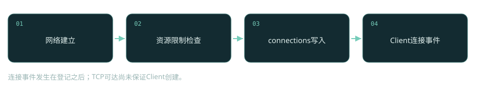
连接事件发生在登记之后；TCP可达尚未保证Client创建。

### 固定源码正文

[core/src/main/java/com/alibaba/nacos/core/remote/ConnectionManager.java，L98–L131](https://github.com/alibaba/nacos/blob/2c587c04891d532df1544ae95b906b677ac8eeff/core/src/main/java/com/alibaba/nacos/core/remote/ConnectionManager.java#L98-L131)

```java
    /**
     * register a new connect.
     *
     * @param connectionId connectionId
     * @param connection   connection
     */
    public synchronized boolean register(String connectionId, Connection connection) {
        
        if (connection.isConnected()) {
            String clientIp = connection.getMetaInfo().clientIp;
            if (connections.containsKey(connectionId)) {
                return true;
            }
            if (checkLimit(connection)) {
                return false;
            }
            if (traced(clientIp)) {
                connection.setTraced(true);
            }
            connections.put(connectionId, connection);
            connectionForClientIp.computeIfAbsent(clientIp, k -> new AtomicInteger(0))
                .getAndIncrement();
            
            clientConnectionEventListenerRegistry.notifyClientConnected(connection);
            
            LOGGER.info("new connection registered successfully, connectionId = {},connection={} ",
                connectionId,
                connection);
            return true;
            
        }
        return false;
        
    }
```

### 失败边界

IP共享或连接风暴可能触发连接限制；注册请求随即因找不到合法Client而失败。

### 验证与观察

在测试环境限制允许连接数，先观察连接登记再观察注册错误；未执行。


<a id="rpc-state"></a>
## 05 RpcClient状态机：重连不是一次重新new连接

客户端RpcClient维护原子状态和currentConnection，并通过reconnectionSignal调度重连。reconnect收到推荐服务器与onRequestFail标志后，重连循环以客户端未关闭为继续条件；请求失败触发的切换还会先判断当前连接健康，避免短暂超时导致不必要换节点。真正的恢复是循环选地址、建立新连接、替换旧连接和发出生命周期事件，而不是在调用线程无限重试原请求。

读这个方法要同时跟踪rpcClientStatus与currentConnection：状态说明当前能否接收请求，连接引用说明请求具体发往哪里。两者的转换顺序影响并发请求看到的结果。连接健康并不意味着某次请求一定成功，连接失败也不表示请求一定没有在服务端执行。超时后对写请求重试，需要靠上层业务键、CAS或幂等语义消除歧义。RPC传输只负责恢复通道，并不天然提供业务exactly-once。

|字段/对象|状态含义|
|---|---|
|`rpcClientStatus`|INITED/RUNNING/UNHEALTHY等状态|
|`currentConnection`|当前请求使用的连接引用|
|`reconnectionSignal`|异步切换信号|
|`onRequestFail`|决定是否先做健康检查|

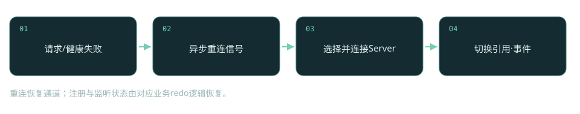
重连恢复通道；注册与监听状态由对应业务redo逻辑恢复。

### 固定源码正文

[common/src/main/java/com/alibaba/nacos/common/remote/client/RpcClient.java，L485–L607](https://github.com/alibaba/nacos/blob/2c587c04891d532df1544ae95b906b677ac8eeff/common/src/main/java/com/alibaba/nacos/common/remote/client/RpcClient.java#L485-L607)

```java
    /**
     * switch server .
     */
    protected void reconnect(final ServerInfo recommendServerInfo, boolean onRequestFail) {
        
        try {
            
            AtomicReference<ServerInfo> recommendServer =
                new AtomicReference<>(recommendServerInfo);
            if (onRequestFail && healthCheck()) {
                LoggerUtils.printIfInfoEnabled(LOGGER,
                    "[{}] Server check success, currentServer is {} ",
                    rpcClientConfig.name(), currentConnection.serverInfo.getAddress());
                rpcClientStatus.set(RpcClientStatus.RUNNING);
                return;
            }
            
            LoggerUtils.printIfInfoEnabled(LOGGER,
                "[{}] Try to reconnect to a new server, server is {}",
                rpcClientConfig.name(),
                recommendServerInfo == null ? " not appointed, will choose a random server."
                    : (recommendServerInfo.getAddress() + ", will try it once."));
            
            // loop until start client success.
            boolean switchSuccess = false;
            
            int reConnectTimes = 0;
            int retryTurns = 0;
            Exception lastException;
            while (!switchSuccess && !isShutdown()) {
                
                // 1.get a new server
                ServerInfo serverInfo = null;
                try {
                    serverInfo =
                        recommendServer.get() == null ? nextRpcServer() : recommendServer.get();
                    // 2.create a new channel to new server
                    Connection connectionNew = connectToServer(serverInfo);
                    if (connectionNew != null) {
                        LoggerUtils
                            .printIfInfoEnabled(LOGGER,
                                "[{}] Success to connect a server [{}], connectionId = {}",
                                rpcClientConfig.name(), serverInfo.getAddress(),
                                connectionNew.getConnectionId());
                        // successfully create a new connect.
                        if (currentConnection != null) {
                            LoggerUtils.printIfInfoEnabled(LOGGER,
                                "[{}] Abandon prev connection, server is {}, connectionId is {}",
                                rpcClientConfig.name(), currentConnection.serverInfo.getAddress(),
                                currentConnection.getConnectionId());
                            // set current connection to enable connection event.
                            currentConnection.setAbandon(true);
                            closeConnection(currentConnection);
                        }
                        currentConnection = connectionNew;
                        rpcClientStatus.set(RpcClientStatus.RUNNING);
                        switchSuccess = true;
                        eventLinkedBlockingQueue
                            .add(new ConnectionEvent(ConnectionEvent.CONNECTED, currentConnection));
                        return;
                    }
                    
                    // close connection if client is already shutdown.
                    if (isShutdown()) {
                        closeConnection(currentConnection);
                    }
                    
                    lastException = null;
                    
                } catch (Throwable throwable) {
                    LoggerUtils.printIfErrorEnabled(LOGGER, "Fail to connect server, error = {}",
                        throwable.getMessage());
                    lastException = new Exception(throwable);
                } finally {
                    recommendServer.set(null);
                }
                
                if (CollectionUtils.isEmpty(RpcClient.this.serverListFactory.getServerList())) {
                    throw new Exception("server list is empty");
                }
                
                if (reConnectTimes > 0
                    && reConnectTimes
                        % RpcClient.this.serverListFactory.getServerList().size() == 0) {
                    LoggerUtils.printIfInfoEnabled(LOGGER,
                        "[{}] Fail to connect server, after trying {} times, last try server is {}, error = {}",
                        rpcClientConfig.name(), reConnectTimes, serverInfo,
                        lastException == null ? "unknown" : lastException);
                    if (Integer.MAX_VALUE == retryTurns) {
                        retryTurns = 50;
                    } else {
                        retryTurns++;
                    }
                }
                
                reConnectTimes++;
                
                try {
                    // sleep x milliseconds to switch next server.
                    if (!isRunning()) {
                        // first round, try servers at a delay 100ms;second round, 200ms; max delays 5s. to be reconsidered.
                        Thread.sleep(Math.min(retryTurns + 1, 50) * 100L);
                    }
                } catch (InterruptedException e) {
                    // Do nothing.
                    // set the interrupted flag
                    Thread.currentThread().interrupt();
                }
            }
            
            if (isShutdown()) {
                LoggerUtils.printIfInfoEnabled(LOGGER,
                    "[{}] Client is shutdown, stop reconnect to server",
                    rpcClientConfig.name());
            }
            
        } catch (Exception e) {
            LoggerUtils
                .printIfWarnEnabled(LOGGER, "[{}] Fail to reconnect to server, error is {}",
                    rpcClientConfig.name(),
                    e);
        }
    }
```

### 失败边界

请求超时与服务端未执行不能画等号；网络抖动后重复写入可能已发生。

### 验证与观察

给SDK到节点A引入短延迟与完全断链两个场景，比较健康检查、切换地址和请求错误；未执行。


<a id="register"></a>
## 06 临时注册入口：实例绑定的是connectionId

SDK的临时实例请求到达InstanceRequestHandler后，handle用namespace/group/serviceName构造Service，分派REGISTER_INSTANCE与DE_REGISTER_INSTANCE。registerInstance检查Instance非空、调用validate，再把meta.getConnectionId传给EphemeralClientOperationServiceImpl。这个最后的参数决定生命周期归属：实例不是一个孤立的IP记录，它属于当前连接对应的Client。

连接身份来自服务端RequestMeta，不能让请求体随意指定另一个客户端ID。Instance对象的ip、port、cluster、weight、metadata等描述路由目标；connectionId描述谁负责维持该目标。一个客户端IP与实例IP并不一定相同，代理/NAT会使它们不同。注册成功响应表示当前节点处理了该请求，后续Distro同步和订阅推送仍属于异步链，不能从响应成功推出所有节点和消费者已经看到实例。

|字段/对象|状态含义|
|---|---|
|`RequestMeta.connectionId`|服务端已登记的会话身份|
|`Instance.ip / port`|被调用的业务端点|
|`Instance.validate`|入口参数合法性|
|`request.type`|注册/注销操作分派|

### 固定源码正文

[naming/src/main/java/com/alibaba/nacos/naming/remote/rpc/handler/InstanceRequestHandler.java，L81–L96](https://github.com/alibaba/nacos/blob/2c587c04891d532df1544ae95b906b677ac8eeff/naming/src/main/java/com/alibaba/nacos/naming/remote/rpc/handler/InstanceRequestHandler.java#L81-L96)

```java
    private InstanceResponse registerInstance(Service service, InstanceRequest request,
        RequestMeta meta)
        throws NacosException {
        Instance instance = request.getInstance();
        if (null == instance) {
            throw new NacosException(NacosException.INVALID_PARAM,
                "Required parameter 'instance' is missing.");
        }
        instance.validate();
        clientOperationService.registerInstance(service, instance, meta.getConnectionId());
        NotifyCenter.publishEvent(new RegisterInstanceTraceEvent(System.currentTimeMillis(),
            NamingRequestUtil.getSourceIpForGrpcRequest(meta), true, service.getNamespace(),
            service.getGroup(),
            service.getName(), instance.getIp(), instance.getPort()));
        return new InstanceResponse(NamingRemoteConstants.REGISTER_INSTANCE);
    }
```

### 失败边界

gRPC连接被重置后继续用旧会话推理，会看到Client不存在；成功响应也可能先于跨节点可见。

### 验证与观察

单客户端注册实例，记录连接ID和实例IP；断开客户端后观察服务端Client释放链。未执行。


<a id="register-state"></a>
## 07 注册后的状态：实例表、revision、事件怎样推进

入口通过之后，registerInstance先获得Service单例并确认它是临时服务，然后取Client并验证其合法性。Instance经getPublishInfo转成发布信息后，client.addServiceInstance把Service→InstancePublishInfo关系写入该Client。接着更新lastUpdatedTime并重新计算revision，最后发布ClientRegisterServiceEvent与InstanceMetadataEvent。这里的主记录属于Client，服务视角的列表只是由索引聚合得到。

revision用于标识客户端数据版本，lastUpdatedTime记录活跃/更新时刻，两者不是同一个语义。时间戳不能代替版本，版本也不是全局Raft日志索引。事件顺序把主记录变更与索引/推送解耦：注册处理线程不需要同步把所有消费者回调跑完。这提高吞吐量，但也形成可观测的中间状态——主记录已变，订阅索引或消费者缓存尚未更新。失败排查要查看事件积压而不只看入口QPS。

|字段/对象|状态含义|
|---|---|
|`singleton.isEphemeral`|拒绝类型冲突|
|`Client.publishedService`|客户端拥有的实例关系|
|`lastUpdatedTime`|最近更新时刻|
|`revision`|Distro验证使用的数据版本|

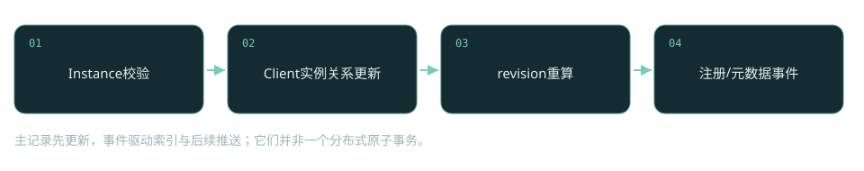
主记录先更新，事件驱动索引与后续推送；它们并非一个分布式原子事务。

### 固定源码正文

[naming/src/main/java/com/alibaba/nacos/naming/core/v2/service/impl/EphemeralClientOperationServiceImpl.java，L55–L78](https://github.com/alibaba/nacos/blob/2c587c04891d532df1544ae95b906b677ac8eeff/naming/src/main/java/com/alibaba/nacos/naming/core/v2/service/impl/EphemeralClientOperationServiceImpl.java#L55-L78)

```java
    @Override
    public void registerInstance(Service service, Instance instance, String clientId)
        throws NacosException {
        NamingUtils.checkInstanceIsLegal(instance);
        
        Service singleton = ServiceManager.getInstance().getSingleton(service);
        if (!singleton.isEphemeral()) {
            throw new NacosRuntimeException(NacosException.INVALID_PARAM,
                String.format(
                    "Current service %s is persistent service, can't register ephemeral instance.",
                    singleton.getGroupedServiceName()));
        }
        Client client = clientManager.getClient(clientId);
        checkClientIsLegal(client, clientId);
        InstancePublishInfo instanceInfo = getPublishInfo(instance);
        client.addServiceInstance(singleton, instanceInfo);
        client.setLastUpdatedTime();
        client.recalculateRevision();
        NotifyCenter
            .publishEvent(new ClientOperationEvent.ClientRegisterServiceEvent(singleton, clientId));
        NotifyCenter
            .publishEvent(new MetadataEvent.InstanceMetadataEvent(singleton,
                instanceInfo.getMetadataId(), false));
    }
```

### 失败边界

消费者暂时未看到实例，可能是事件/推送延迟，而不是注册写入失败。

### 验证与观察

在事件处理位置设断点，看注册线程返回和索引消费之间的时间差；未执行。


<a id="indexes"></a>
## 08 两张索引：谁发布、谁订阅

如果每次查询都扫描所有Client，服务发现的代价会随连接数增长。ClientServiceIndexesManager维护publisherIndexes和subscriberIndexes两张Service→Set<clientId>索引。前者让服务端快速找出实例来源，后者让推送任务找到订阅者。handleClientOperation按照注册、注销、订阅、取消订阅事件修改不同集合，事件类型就是索引操作的指令。

索引不是另一份独立权威实例表，它只保存clientId，查询最终还要去Client读取发布信息。这样可以减少重复数据，却要求断链时同时释放索引。ClientReleaseEvent携带Client，释放路径能遍历它全部已发布和已订阅服务，删除关系。如果只删除connections而没消费释放事件，会出现索引仍指向失效Client的残留。读源码时把主记录、索引和缓存分别标出来，才能解释为什么它们短时间内可能不一致。

|字段/对象|状态含义|
|---|---|
|`publisherIndexes`|Service→发布者clientId集合|
|`subscriberIndexes`|Service→订阅者clientId集合|
|`ClientReleaseEvent`|释放所有关系|
|`ClientOperationEvent`|增量更新索引|

### 固定源码正文

[naming/src/main/java/com/alibaba/nacos/naming/core/v2/index/ClientServiceIndexesManager.java，L122–L134](https://github.com/alibaba/nacos/blob/2c587c04891d532df1544ae95b906b677ac8eeff/naming/src/main/java/com/alibaba/nacos/naming/core/v2/index/ClientServiceIndexesManager.java#L122-L134)

```java
    private void handleClientOperation(ClientOperationEvent event) {
        Service service = event.getService();
        String clientId = event.getClientId();
        if (event instanceof ClientOperationEvent.ClientRegisterServiceEvent) {
            addPublisherIndexes(service, clientId);
        } else if (event instanceof ClientOperationEvent.ClientDeregisterServiceEvent) {
            removePublisherIndexes(service, clientId);
        } else if (event instanceof ClientOperationEvent.ClientSubscribeServiceEvent) {
            addSubscriberIndexes(service, clientId);
        } else if (event instanceof ClientOperationEvent.ClientUnsubscribeServiceEvent) {
            removeSubscriberIndexes(service, clientId);
        }
    }
```

### 失败边界

事件积压造成索引暂时落后；直接从索引大小推断健康实例数不可靠。

### 验证与观察

同一Client订阅两服务并发布一服务，记录四类事件分别修改哪张索引；未执行。


<a id="push-cache"></a>
## 09 推送ACK：收到列表，不等于业务已经使用

NamingPushRequestHandler的正文很短，却明确划定了ACK边界：收到NotifySubscriberRequest后调用serviceInfoHolder.processServiceInfo，再返回NotifySubscriberResponse。ACK确认SDK处理了协议消息；InstancesChangeEvent的业务监听、负载均衡器刷新乃至下一次请求是否使用新实例，都在其他处理链中。把ACK画成业务成功会错误扩大保证范围。

ServiceInfoHolder维护服务列表缓存并计算新旧实例差异。只有差异存在才发布InstancesChangeEvent；没有变化的重复推送不会反复触发业务回调。推送与主动查询共同更新缓存，业务读通常直接取本地列表以避免每次远程查找。这样的架构把发现延迟换成调用吞吐量；代价是消费者可能在传播窗口内使用旧列表，所以业务调用还要有超时、重试和故障实例规避机制。

|字段/对象|状态含义|
|---|---|
|`NotifySubscriberRequest.serviceInfo`|推送的服务实例快照|
|`processServiceInfo`|更新SDK缓存并产生差异事件|
|`NotifySubscriberResponse`|协议处理ACK|
|`InstancesChangeEvent`|后续业务监听通知|

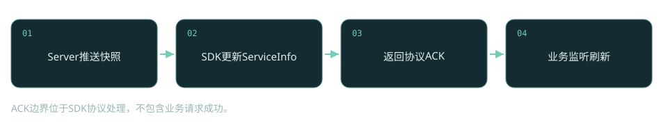
ACK边界位于SDK协议处理，不包含业务请求成功。

### 固定源码正文

[client/src/main/java/com/alibaba/nacos/client/naming/remote/gprc/NamingPushRequestHandler.java，L40–L48](https://github.com/alibaba/nacos/blob/2c587c04891d532df1544ae95b906b677ac8eeff/client/src/main/java/com/alibaba/nacos/client/naming/remote/gprc/NamingPushRequestHandler.java#L40-L48)

```java
    @Override
    public Response requestReply(Request request, Connection connection) {
        if (request instanceof NotifySubscriberRequest) {
            NotifySubscriberRequest notifyRequest = (NotifySubscriberRequest) request;
            serviceInfoHolder.processServiceInfo(notifyRequest.getServiceInfo());
            return new NotifySubscriberResponse();
        }
        return null;
    }
```

### 失败边界

推送成功但业务仍调用旧实例，应继续检查监听执行器与负载均衡缓存。

### 验证与观察

监听器故意延迟处理，比较ACK返回与业务负载均衡刷新时间；只在隔离环境执行，未执行。


<a id="empty-protect"></a>
## 10 空列表保护：可用性与陈旧数据的取舍

processServiceInfo先计算serviceKey，取旧缓存，再检查isEmptyOrErrorPush。命中空推送保护时直接返回oldService，不覆盖缓存。这个分支解释了一个常见现象：服务端实例已清空，客户端仍保留旧端点。它并不必然是推送失效，也可能是客户端主动保留了旧视图。开启与关闭保护，分别承担陈旧调用与误清空的风险。

正常路径先put新ServiceInfo，再计算差异；只有差异存在且当前服务没有处于failover接管状态，才发InstancesChangeEvent。磁盘缓存刷新也在差异分支中异步触发。因此内存更新、监听回调与磁盘写入不能视为同一事务。观察服务发现时至少记录hosts、pushEmptyProtection、failover开关和监听回调状态，才能区分真的空服务、错误空响应以及人为容灾数据。

|字段/对象|状态含义|
|---|---|
|`pushEmptyProtection`|是否拒绝空/异常推送|
|`serviceInfoMap`|SDK正常服务缓存|
|`failoverReactor`|容灾视图控制|
|`diff.hasDifferent`|决定是否产生变更事件|

### 固定源码正文

[client/src/main/java/com/alibaba/nacos/client/naming/cache/ServiceInfoHolder.java，L123–L173](https://github.com/alibaba/nacos/blob/2c587c04891d532df1544ae95b906b677ac8eeff/client/src/main/java/com/alibaba/nacos/client/naming/cache/ServiceInfoHolder.java#L123-L173)

```java
    /**
     * Process service info.
     *
     * @param serviceInfo new service info
     * @return service info
     */
    public ServiceInfo processServiceInfo(ServiceInfo serviceInfo) {
        String serviceKey = serviceInfo.getKeyWithoutClusters();
        if (serviceKey == null) {
            NAMING_LOGGER.warn("process service info but serviceKey is null, service host: {}",
                JacksonUtils.toJson(serviceInfo.getHosts()));
            return null;
        }
        ServiceInfo oldService = serviceInfoMap.get(serviceKey);
        if (isEmptyOrErrorPush(serviceInfo)) {
            //empty or error push, just ignore
            NAMING_LOGGER.warn(
                "process service info but found empty or error push, serviceKey: {}, "
                    + "pushEmptyProtection: {}, hosts: {}",
                serviceKey, pushEmptyProtection, serviceInfo.getHosts());
            return oldService;
        }
        serviceInfoMap.put(serviceKey, serviceInfo);
        InstancesDiff diff = getServiceInfoDiff(oldService, serviceInfo);
        if (StringUtils.isBlank(serviceInfo.getJsonFromServer())) {
            serviceInfo.setJsonFromServer(JacksonUtils.toJson(serviceInfo));
        }
        
        if (enableClientMetrics) {
            try {
                MetricsMonitor.getServiceInfoMapSizeMonitor().set(serviceInfoMap.size());
            } catch (Throwable t) {
                NAMING_LOGGER.error("Failed to update metrics for service info map size", t);
            }
        }
        
        if (diff.hasDifferent()) {
            NAMING_LOGGER.info("current ips:({}) service: {} -> {}", serviceInfo.ipCount(),
                serviceKey,
                JacksonUtils.toJson(serviceInfo.getHosts()));
            
            if (!failoverReactor.isFailoverSwitch(serviceKey)) {
                NotifyCenter.publishEvent(
                    new InstancesChangeEvent(notifierEventScope, serviceInfo.getName(),
                        serviceInfo.getGroupName(),
                        serviceInfo.getClusters(), serviceInfo.getHosts(), diff));
            }
            publishDiskCacheRefreshEvent(serviceKey, serviceInfo);
        }
        return serviceInfo;
    }
```

### 失败边界

保护保留失效端点可能产生持续连接失败；关闭保护可能把异常空响应传播给业务。

### 验证与观察

用同一SDK分别输入有实例与空ServiceInfo，对比保护开关的返回值和回调；这是建议的单元实验，未执行Java代码。


<a id="disconnect"></a>
## 11 断链释放：连接回收如何变成实例删除

服务端ConnectionManager.unregister会先从connections删除对象，降低IP连接计数，关闭传输，再通知客户端断开。ConnectionBasedClientManager收到事件后调用clientDisconnected：移除本地Client、释放其资源并发布ClientDisconnectEvent。临时实例生命周期依赖这条链，所以退出进程通常不必逐个显式注销才能最终清理。

链路的各阶段并不发生在同一个共享锁里。网络失效检测有时间窗口，释放事件与Distro删除有传播窗口，消费者本地列表也有缓存窗口。所谓实例自动删除，应理解为最终沿这些状态转换回收，不能承诺拔网线后立刻在所有节点消失。连接重建会获得新的身份，上层redo重新注册，旧Client释放与新Client注册可能重叠；排查短暂实例波动要按connectionId而非只按应用名追踪。

|字段/对象|状态含义|
|---|---|
|`clients.remove(clientId)`|本地Client主记录删除|
|`client.release`|释放客户端关联资源|
|`ClientDisconnectEvent`|跨节点删除信号|
|`ClientReleaseEvent`|索引清理相关事件|

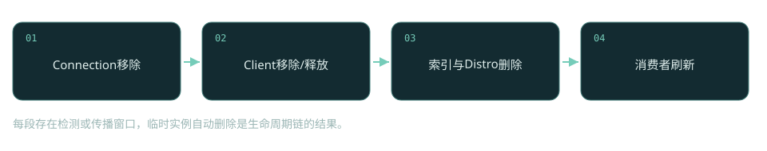
每段存在检测或传播窗口，临时实例自动删除是生命周期链的结果。

### 固定源码正文

[naming/src/main/java/com/alibaba/nacos/naming/core/v2/client/manager/impl/ConnectionBasedClientManager.java，L104–L118](https://github.com/alibaba/nacos/blob/2c587c04891d532df1544ae95b906b677ac8eeff/naming/src/main/java/com/alibaba/nacos/naming/core/v2/client/manager/impl/ConnectionBasedClientManager.java#L104-L118)

```java
    @Override
    public boolean clientDisconnected(String clientId) {
        Loggers.SRV_LOG.info("Client connection {} disconnect, remove instances and subscribers",
            clientId);
        ConnectionBasedClient client = clients.remove(clientId);
        if (null == client) {
            return true;
        }
        client.release();
        boolean isResponsible = isResponsibleClient(client);
        NotifyCenter
            .publishEvent(new ClientOperationEvent.ClientReleaseEvent(client, isResponsible));
        NotifyCenter.publishEvent(new ClientEvent.ClientDisconnectEvent(client, isResponsible));
        return true;
    }
```

### 失败边界

断链检测慢、事件积压或网络分区都会延迟消费者感知。

### 验证与观察

使用正常退出与黑洞丢包两种故障，分别记录连接移除、Client删除、列表变化时间；未执行。


<a id="redo"></a>
## 12 客户端redo：重新注册与重新订阅是两种恢复

网络恢复只让RpcClient重新RUNNING，并不会自动恢复业务状态。NamingGrpcRedoService分别缓存registeredInstances和subscribes，断连时将连接标记改为false，并把注册/订阅状态重置。后续redo任务根据这些状态重新向新连接发送操作。实例与订阅必须分别缓存，否则服务能重新注册，却可能永远收不到实例变更。

redo保存的是期望状态，不是所有历史操作的日志。显式注销会改变对应redo状态，避免重连把用户已经撤销的实例复活。这里应区分registered、deregistering及已经清理缓存的生命周期，不能把每个缓存条目都直接重注册。重连期间请求失败、旧节点残留与新节点注册可能同时存在，因此系统依靠服务身份及实例语义收敛，而不是依靠旧connectionId跨节点迁移。

|字段/对象|状态含义|
|---|---|
|`registeredInstances`|待恢复实例状态|
|`subscribes`|待恢复订阅状态|
|`connected`|是否可执行恢复请求|
|`registered / deregistering`|redo的期望生命周期|

### 固定源码正文

[client/src/main/java/com/alibaba/nacos/client/naming/remote/gprc/redo/NamingGrpcRedoService.java，L104–L120](https://github.com/alibaba/nacos/blob/2c587c04891d532df1544ae95b906b677ac8eeff/client/src/main/java/com/alibaba/nacos/client/naming/remote/gprc/redo/NamingGrpcRedoService.java#L104-L120)

```java
    @Override
    public void onDisConnect(Connection connection) {
        connected = false;
        LogUtils.NAMING_LOGGER.warn("Grpc connection disconnect, mark to redo");
        synchronized (registeredInstances) {
            registeredInstances.values()
                .forEach(instanceRedoData -> instanceRedoData.setRegistered(false));
        }
        synchronized (subscribes) {
            subscribes.values()
                .forEach(subscriberRedoData -> subscriberRedoData.setRegistered(false));
        }
        synchronized (namingFuzzyWatchServiceListHolder) {
            namingFuzzyWatchServiceListHolder.resetConsistenceStatus();
        }
        LogUtils.NAMING_LOGGER.warn("mark to redo completed");
    }
```

### 失败边界

只恢复连接却没有redo注册/订阅，会出现SDK在线但实例不存在或监听停滞。

### 验证与观察

注册并订阅后切换Server，记录重连与两种redo请求；随后先注销再断连，验证实例不会被恢复。未执行。


<a id="distro-owner"></a>
## 13 Distro责任边界：谁有资格广播客户端数据

DistroClientDataProcessor消费ClientChangedEvent与ClientDisconnectEvent，分别生成CHANGE与DELETE操作。syncToAllServer的第一件事不是序列化，而是isInvalidClient判断：不存在的Client、持久Client、当前节点不负责的Client都不广播。这条过滤比一句Distro是AP更能说明设计：临时数据以责任节点为来源，副本不应把收到的复制数据无限再广播。

责任来源与连接生命周期相关，本地连接Client和远端同步Client有不同角色。Distro以客户端为同步单元，客户端内部包含多个Service→Instance关系；因此单条实例变更会影响客户端revision以及后续数据序列化。它没有为每次临时实例注册执行多数派日志提交，能降低同步写成本，却不能推导出跨节点全局线性一致的读取。网络分区时要接受视图分化，并靠后续验证与数据同步修复。

|字段/对象|状态含义|
|---|---|
|`isEphemeral`|只同步临时Client|
|`isResponsibleClient`|只由责任来源发同步|
|`DistroKey.resourceKey`|同步单元clientId|
|`CHANGE / DELETE`|增改与断链删除|

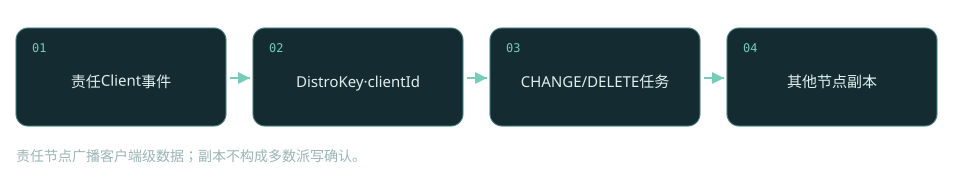
责任节点广播客户端级数据；副本不构成多数派写确认。

### 固定源码正文

[naming/src/main/java/com/alibaba/nacos/naming/consistency/ephemeral/distro/v2/DistroClientDataProcessor.java，L116–L128](https://github.com/alibaba/nacos/blob/2c587c04891d532df1544ae95b906b677ac8eeff/naming/src/main/java/com/alibaba/nacos/naming/consistency/ephemeral/distro/v2/DistroClientDataProcessor.java#L116-L128)

```java
    private void syncToAllServer(ClientEvent event) {
        Client client = event.getClient();
        if (isInvalidClient(client)) {
            return;
        }
        if (event instanceof ClientEvent.ClientDisconnectEvent) {
            DistroKey distroKey = new DistroKey(client.getClientId(), TYPE);
            distroProtocol.sync(distroKey, DataOperation.DELETE);
        } else if (event instanceof ClientEvent.ClientChangedEvent) {
            DistroKey distroKey = new DistroKey(client.getClientId(), TYPE);
            distroProtocol.sync(distroKey, DataOperation.CHANGE);
        }
    }
```

### 失败边界

分区中节点视图可能不同；不应以Distro同步返回推导所有节点立即一致。

### 验证与观察

隔离节点间通信但保留SDK到单节点连接，比较节点本地视图；未执行，禁止直接在生产制造分区。


<a id="distro-task"></a>
## 14 Distro延迟任务：合并的是任务，不是历史日志

DistroProtocol.sync向目标成员分发同步任务；syncToTarget用resourceKey、resourceType和targetServer构造目标键，再添加DistroDelayTask。delay层允许短时间内同一数据单元的重复变更合并，从而避免每次字段更新都发送完整客户端数据。执行层真正运行时再通过DataStorage取当前数据，因此同步更接近最新状态传播，而不是逐条重放业务操作日志。

任务键必须包含目标节点，否则给节点B的变更可能把给节点C的任务覆盖掉。DataOperation决定CHANGE与DELETE语义，延迟任务的合并策略需要结合具体操作读，不能简单说最后一个事件永远胜出。CHANGE任务读取当前快照并通过TransportAgent发送；返回失败进入重试处理。网络、任务队列和数据处理器是三个不同故障域，检查时分别看目标可达、待执行任务、接收后是否应用。

|字段/对象|状态含义|
|---|---|
|`resourceKey / resourceType`|数据单元身份与处理器类型|
|`targetServer`|目标副本|
|`DistroDelayTask`|延迟/合并层|
|`DistroTaskEngineHolder`|执行与传输层路由|

### 固定源码正文

[core/src/main/java/com/alibaba/nacos/core/distributed/distro/DistroProtocol.java，L124–L143](https://github.com/alibaba/nacos/blob/2c587c04891d532df1544ae95b906b677ac8eeff/core/src/main/java/com/alibaba/nacos/core/distributed/distro/DistroProtocol.java#L124-L143)

```java
    /**
     * Start to sync to target server.
     *
     * @param distroKey    distro key of sync data
     * @param action       the action of data operation
     * @param targetServer target server
     * @param delay        delay time for sync
     */
    public void syncToTarget(DistroKey distroKey, DataOperation action, String targetServer,
        long delay) {
        DistroKey distroKeyWithTarget =
            new DistroKey(distroKey.getResourceKey(), distroKey.getResourceType(),
                targetServer);
        DistroDelayTask distroDelayTask = new DistroDelayTask(distroKeyWithTarget, action, delay);
        distroTaskEngineHolder.getDelayTaskExecuteEngine().addTask(distroKeyWithTarget,
            distroDelayTask);
        if (Loggers.DISTRO.isDebugEnabled()) {
            Loggers.DISTRO.debug("[DISTRO-SCHEDULE] {} to {}", distroKey, targetServer);
        }
    }
```

### 失败边界

队列堆积会扩大传播延迟；CHANGE读取的是执行时状态，不能拿队列当完整审计日志。

### 验证与观察

快速多次修改同一Client实例metadata，观察延迟任务数量与最终副本内容；未执行。


<a id="distro-apply"></a>
## 15 Distro应用快照：不仅增加，还要删除缺席服务

upgradeClient收到ClientSyncData后维护syncedService集合，先处理批量实例，再按namespace、groupName、serviceName与InstancePublishInfo平行列表逐项构造Service。如果发布信息与当前值不同，更新Client并发出注册与metadata事件。随后它遍历Client原有服务，把没有出现在syncedService里的关系删除并发出注销事件，最后设置传入revision。

这说明CHANGE内容是该Client的完整发布状态，不能当作只含一个新增服务的增量包。若发送端漏了一项，接收端会把它解释为删除；这也是必须严格维护序列化平行列表对应关系的原因。revision写入发生在状态应用后，验证能据此判断是否还需要同步。它是该Client数据版本，不代表全局时钟，也不能单独证明不同Client之间的操作先后。

|字段/对象|状态含义|
|---|---|
|`syncedService`|本轮快照出现的服务集合|
|`InstancePublishInfo.equals`|判断是否需要改动|
|`client.getAllPublishedService`|用于清理缺席关系|
|`client.setRevision`|应用后的客户端数据版本|

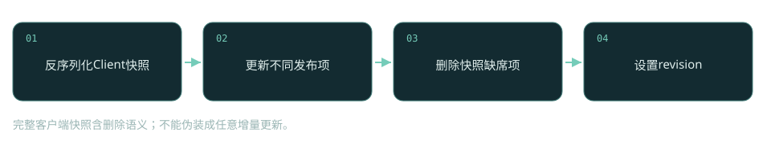
完整客户端快照含删除语义；不能伪装成任意增量更新。

### 固定源码正文

[naming/src/main/java/com/alibaba/nacos/naming/consistency/ephemeral/distro/v2/DistroClientDataProcessor.java，L172–L207](https://github.com/alibaba/nacos/blob/2c587c04891d532df1544ae95b906b677ac8eeff/naming/src/main/java/com/alibaba/nacos/naming/consistency/ephemeral/distro/v2/DistroClientDataProcessor.java#L172-L207)

```java
    private void upgradeClient(Client client, ClientSyncData clientSyncData) {
        Set<Service> syncedService = new HashSet<>();
        // process batch instance sync logic
        processBatchInstanceDistroData(syncedService, client, clientSyncData);
        List<String> namespaces = clientSyncData.getNamespaces();
        List<String> groupNames = clientSyncData.getGroupNames();
        List<String> serviceNames = clientSyncData.getServiceNames();
        List<InstancePublishInfo> instances = clientSyncData.getInstancePublishInfos();
        
        for (int i = 0; i < namespaces.size(); i++) {
            Service service =
                Service.newService(namespaces.get(i), groupNames.get(i), serviceNames.get(i));
            Service singleton = ServiceManager.getInstance().getSingleton(service);
            syncedService.add(singleton);
            InstancePublishInfo instancePublishInfo = instances.get(i);
            if (!instancePublishInfo.equals(client.getInstancePublishInfo(singleton))) {
                client.addServiceInstance(singleton, instancePublishInfo);
                NotifyCenter.publishEvent(
                    new ClientOperationEvent.ClientRegisterServiceEvent(singleton,
                        client.getClientId()));
                NotifyCenter.publishEvent(
                    new MetadataEvent.InstanceMetadataEvent(singleton,
                        instancePublishInfo.getMetadataId(), false));
            }
        }
        for (Service each : client.getAllPublishedService()) {
            if (!syncedService.contains(each)) {
                client.removeServiceInstance(each);
                NotifyCenter.publishEvent(
                    new ClientOperationEvent.ClientDeregisterServiceEvent(each,
                        client.getClientId()));
            }
        }
        client.setRevision(clientSyncData.getAttributes()
            .<Integer>getClientAttribute(ClientConstants.REVISION, 0));
    }
```

### 失败边界

构造不完整快照会删除原有关联；不一致的平行列表可能导致错误对应或异常。

### 验证与观察

在隔离单元测试构造包含A/B服务的Client，再应用只含A的快照，验证B被移除；未执行Java测试。


<a id="distro-verify"></a>
## 16 Distro启动与校验：成功条件不是有一个网络响应

新节点并不应该一边空着一边宣称数据初始化完成。DistroLoadDataTask先等待成员列表和存储类型注册，再为每种resourceType向远端拉取快照。loadAllDataSnapshotFromRemote遍历其他成员，调用TransportAgent.getDatumSnapshot，并把返回数据交给DataProcessor.processSnapshot。只有处理器返回true，才调用DataStorage.finishInitial并将这一类型视作成功。

因此网络请求成功与初始化成功是两个条件。找不到处理器/传输器会返回false；一个节点请求失败后会继续尝试其他成员；所有都失败则等待下一轮加载。运行中Verify任务发送精简验证数据，接收端用clientId/revision判断副本匹配情况，差异触发补充同步。校验提供反熵修复，不是对所有读请求执行线性化屏障。节点刚启动读不到实例时，要先确认对应类型是否finishInitial，而不是马上猜业务服务没注册。

|字段/对象|状态含义|
|---|---|
|`loadCompletedMap`|按存储类型记录加载完成|
|`processSnapshot`|应用数据的成功条件|
|`finishInitial`|解除该存储类型初始化状态|
|`verifyData / revision`|运行期差异检查|

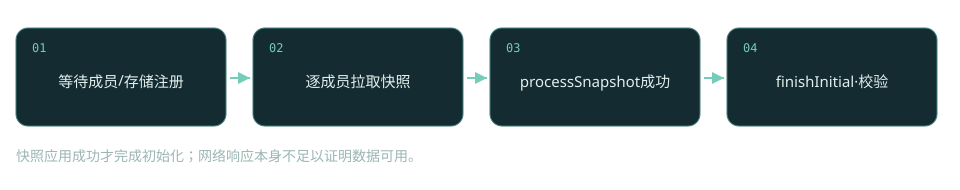
快照应用成功才完成初始化；网络响应本身不足以证明数据可用。

### 固定源码正文

[core/src/main/java/com/alibaba/nacos/core/distributed/distro/task/load/DistroLoadDataTask.java，L93–L128](https://github.com/alibaba/nacos/blob/2c587c04891d532df1544ae95b906b677ac8eeff/core/src/main/java/com/alibaba/nacos/core/distributed/distro/task/load/DistroLoadDataTask.java#L93-L128)

```java
    private boolean loadAllDataSnapshotFromRemote(String resourceType) {
        DistroTransportAgent transportAgent =
            distroComponentHolder.findTransportAgent(resourceType);
        DistroDataProcessor dataProcessor = distroComponentHolder.findDataProcessor(resourceType);
        if (null == transportAgent || null == dataProcessor) {
            Loggers.DISTRO.warn(
                "[DISTRO-INIT] Can't find component for type {}, transportAgent: {}, dataProcessor: {}",
                resourceType, transportAgent, dataProcessor);
            return false;
        }
        for (Member each : memberManager.allMembersWithoutSelf()) {
            long startTime = System.currentTimeMillis();
            try {
                Loggers.DISTRO.info("[DISTRO-INIT] load snapshot {} from {}", resourceType,
                    each.getAddress());
                DistroData distroData = transportAgent.getDatumSnapshot(each.getAddress());
                Loggers.DISTRO.info(
                    "[DISTRO-INIT] it took {} ms to load snapshot {} from {} and snapshot size is {}.",
                    System.currentTimeMillis() - startTime, resourceType, each.getAddress(),
                    getDistroDataLength(distroData));
                boolean result = dataProcessor.processSnapshot(distroData);
                Loggers.DISTRO
                    .info("[DISTRO-INIT] load snapshot {} from {} result: {}", resourceType,
                        each.getAddress(),
                        result);
                if (result) {
                    distroComponentHolder.findDataStorage(resourceType).finishInitial();
                    return true;
                }
            } catch (Exception e) {
                Loggers.DISTRO.error("[DISTRO-INIT] load snapshot {} from {} failed.", resourceType,
                    each.getAddress(), e);
            }
        }
        return false;
    }
```

### 失败边界

成员表异常或组件未注册会阻塞初始化；分区期间校验无法立即修复视图。

### 验证与观察

让第一个候选节点不可达但第二个可达，检查加载是否继续；未执行。


<a id="persistent"></a>
## 17 持久实例：WriteRequest为什么交给CP协议

持久实例不能随SDK断开就消失，它走PersistentClientOperationServiceImpl。registerInstance先检查Service单例不是临时服务，构造InstanceStoreRequest携带Service、Instance和clientId，再序列化为WriteRequest。WriteRequest还包含group()和ADD操作；protocol.write负责把命令送入对应CP复制组，而不是直接修改本地Client。

group把不同状态机业务隔开，data是可复制命令，operation描述应用动作。先复制再应用，使持久状态在节点故障后可以恢复；代价是多数派不可达时写入可用性受限。不能将这个链推广到所有临时实例，更不能说整个Nacos所有读写都由Raft排序。临时Client的Distro、持久实例的CP与配置数据库事务是不同数据面，它们的失败现象和运维恢复也不同。

|字段/对象|状态含义|
|---|---|
|`InstanceStoreRequest`|待复制的实例命令|
|`WriteRequest.group`|状态机复制组|
|`DataOperation.ADD`|写入操作类型|
|`protocol.write`|CP提交入口|

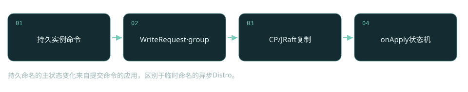
持久命名的主状态变化来自提交命令的应用，区别于临时命名的异步Distro。

### 固定源码正文

[naming/src/main/java/com/alibaba/nacos/naming/core/v2/service/impl/PersistentClientOperationServiceImpl.java，L106–L131](https://github.com/alibaba/nacos/blob/2c587c04891d532df1544ae95b906b677ac8eeff/naming/src/main/java/com/alibaba/nacos/naming/core/v2/service/impl/PersistentClientOperationServiceImpl.java#L106-L131)

```java
    @Override
    public void registerInstance(Service service, Instance instance, String clientId) {
        Service singleton = ServiceManager.getInstance().getSingleton(service);
        if (singleton.isEphemeral()) {
            throw new NacosRuntimeException(NacosException.INVALID_PARAM,
                String.format(
                    "Current service %s is ephemeral service, can't register persistent instance.",
                    singleton.getGroupedServiceName()));
        }
        final InstanceStoreRequest request = new InstanceStoreRequest();
        request.setService(service);
        request.setInstance(instance);
        request.setClientId(clientId);
        final WriteRequest writeRequest = WriteRequest.newBuilder().setGroup(group())
            .setData(ByteString.copyFrom(serializer.serialize(request)))
            .setOperation(DataOperation.ADD.name())
            .build();
        
        try {
            protocol.write(writeRequest);
            Loggers.RAFT.info("Client registered. service={}, clientId={}, instance={}", service,
                clientId, instance);
        } catch (Exception e) {
            throw new NacosRuntimeException(NacosException.SERVER_ERROR, e);
        }
    }
```

### 失败边界

多数派失联可能阻止持久实例写入，即使某节点HTTP与gRPC端口仍然存活。

### 验证与观察

三节点测试集群仅保留一个可通信节点，分别比较临时与持久注册；未执行。


<a id="raft-apply"></a>
## 18 JRaft状态机：提交、应用、快照各保证什么

onApply接收已经进入CP应用链的WriteRequest，反序列化InstanceStoreRequest并按operation执行ADD、CHANGE或DELETE。它拿读锁保护与快照装载等写锁操作的互斥，避免状态重建时同时应用实例命令；这把内存状态与复制日志接起来。onInstanceRegister最终仍更新Client与索引事件，但来源从入口线程变成状态机命令应用。

复制日志可恢复增量，快照则压缩状态恢复成本。快照保存ClientSyncData，装载时补齐、更新并清理Client关系。多数派提交意味着复制组决定了命令顺序，却不能自动推出任何外围缓存、推送或外部数据库操作都加入了同一个事务。读路径也必须按其实现判断是否有ReadIndex或本地读，不能因为系统使用Raft就把所有管理查询称作强一致。

|字段/对象|状态含义|
|---|---|
|`serializer.deserialize`|命令还原|
|`DataOperation.valueOf`|决定状态机动作|
|`readLock / writeLock`|应用与快照恢复互斥|
|`SnapshotOperation`|复制状态的压缩/装载|

### 固定源码正文

[naming/src/main/java/com/alibaba/nacos/naming/core/v2/service/impl/PersistentClientOperationServiceImpl.java，L200–L235](https://github.com/alibaba/nacos/blob/2c587c04891d532df1544ae95b906b677ac8eeff/naming/src/main/java/com/alibaba/nacos/naming/core/v2/service/impl/PersistentClientOperationServiceImpl.java#L200-L235)

```java
    @Override
    public Response onApply(WriteRequest request) {
        final Lock lock = readLock;
        lock.lock();
        try {
            final InstanceStoreRequest instanceRequest =
                serializer.deserialize(request.getData().toByteArray());
            final DataOperation operation = DataOperation.valueOf(request.getOperation());
            switch (operation) {
                case ADD:
                    onInstanceRegister(instanceRequest.service, instanceRequest.instance,
                        instanceRequest.getClientId());
                    break;
                case DELETE:
                    onInstanceDeregister(instanceRequest.service, instanceRequest.getClientId());
                    break;
                case CHANGE:
                    if (instanceAndServiceExist(instanceRequest)) {
                        onInstanceRegister(instanceRequest.service, instanceRequest.instance,
                            instanceRequest.getClientId());
                    }
                    break;
                default:
                    return Response.newBuilder().setSuccess(false)
                        .setErrMsg("unsupport operation : " + operation)
                        .build();
            }
            return Response.newBuilder().setSuccess(true).build();
        } catch (Exception e) {
            Loggers.RAFT.warn("Persistent client operation failed. ", e);
            return Response.newBuilder().setSuccess(false)
                .setErrMsg("Persistent client operation failed. " + e.getMessage()).build();
        } finally {
            lock.unlock();
        }
    }
```

### 失败边界

日志提交后客户端超时仍可能发生；重复提交和业务幂等要分开判断。

### 验证与观察

在状态机应用处设断点，比较复制提交、onApply、事件消费与消费者缓存更新；未执行。


<a id="config-publish"></a>
## 19 配置发布：CAS、灰度与正式内容怎样分流

配置发布入口把dataId、group、namespaceId与content组装成ConfigInfo，casMd5存在时把调用者期望的旧MD5放入对象。正式发布之外，betaIps和tag会先进入灰度迁移/发布分支并提前返回。不能只沿方法末尾看正式配置，就把灰度发布当作更新同一份全量内容。

正式分支在有casMd5时调用insertOrUpdateCas；失败抛RESOURCE_CONFLICT，提示服务端MD5可能变化。没有CAS则根据updateForExist决定插入或插入更新。只有持久化返回成功后才发送ConfigDataChangeEvent，它携带lastModified作为后续处理的版本线索。发布接口成功说明持久化链已经成功返回，不代表每个Server缓存、SDK监听或应用Bean已同步更新；Spring属性绑定是否动态刷新更不属于Nacos配置传输的保证。

|字段/对象|状态含义|
|---|---|
|`dataId/group/namespaceId`|配置三元组|
|`casMd5`|调用者期望旧内容版本|
|`betaIps / tag`|灰度路由分支|
|`lastModified`|持久化结果传给事件的时间标记|

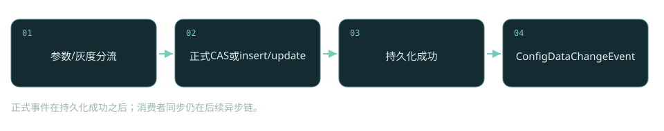
正式事件在持久化成功之后；消费者同步仍在后续异步链。

### 固定源码正文

[config/src/main/java/com/alibaba/nacos/config/server/service/ConfigOperationService.java，L83–L191](https://github.com/alibaba/nacos/blob/2c587c04891d532df1544ae95b906b677ac8eeff/config/src/main/java/com/alibaba/nacos/config/server/service/ConfigOperationService.java#L83-L191)

```java
    /**
     * Adds or updates non-aggregated data.
     *
     * @throws NacosException NacosException.
     */
    public Boolean publishConfig(ConfigForm configForm, ConfigRequestInfo configRequestInfo,
        String encryptedDataKey) throws NacosException {
        configForm
            .setNamespaceId(NamespaceUtil.processNamespaceParameter(configForm.getNamespaceId()));
        Map<String, Object> configAdvanceInfo = getConfigAdvanceInfo(configForm);
        ParamUtils.checkParam(configAdvanceInfo);
        
        configForm.setEncryptedDataKey(encryptedDataKey);
        ConfigInfo configInfo = new ConfigInfo(configForm.getDataId(), configForm.getGroup(),
            configForm.getNamespaceId(), configForm.getAppName(), configForm.getContent());
        //set old md5
        if (StringUtils.isNotBlank(configRequestInfo.getCasMd5())) {
            configInfo.setMd5(configRequestInfo.getCasMd5());
        }
        configInfo.setType(configForm.getType());
        configInfo.setEncryptedDataKey(encryptedDataKey);
        
        //beta publish
        if (StringUtils.isNotBlank(configRequestInfo.getBetaIps())) {
            configForm.setGrayName(BetaGrayRule.TYPE_BETA);
            configForm.setGrayRuleExp(configRequestInfo.getBetaIps());
            configForm.setGrayVersion(BetaGrayRule.VERSION);
            configMigrateService.persistBeta(configForm, configInfo, configRequestInfo);
            configForm.setGrayPriority(Integer.MAX_VALUE);
            configMigrateService.publishConfigGrayMigrate(BetaGrayRule.TYPE_BETA, configForm,
                configRequestInfo);
            publishConfigGray(BetaGrayRule.TYPE_BETA, configForm, configRequestInfo);
            return Boolean.TRUE;
        }
        // tag publish
        if (StringUtils.isNotBlank(configForm.getTag())) {
            configForm.setGrayName(TagGrayRule.TYPE_TAG + "_" + configForm.getTag());
            configForm.setGrayRuleExp(configForm.getTag());
            configForm.setGrayVersion(TagGrayRule.VERSION);
            configForm.setGrayPriority(Integer.MAX_VALUE - 1);
            configMigrateService.persistTagv1(configForm, configInfo, configRequestInfo);
            configMigrateService.publishConfigGrayMigrate(TagGrayRule.TYPE_TAG, configForm,
                configRequestInfo);
            publishConfigGray(TagGrayRule.TYPE_TAG, configForm, configRequestInfo);
            return Boolean.TRUE;
        }
        
        ConfigOperateResult configOperateResult;
        
        configMigrateService.publishConfigMigrate(configForm, configRequestInfo,
            configForm.getEncryptedDataKey());
        
        //formal publish
        if (StringUtils.isNotBlank(configRequestInfo.getCasMd5())) {
            configOperateResult =
                configInfoPersistService.insertOrUpdateCas(configRequestInfo.getSrcIp(),
                    configForm.getSrcUser(), configInfo, configAdvanceInfo);
            if (!configOperateResult.isSuccess()) {
                LOGGER.warn(
                    "[cas-publish-config-fail] srcIp = {}, dataId= {}, casMd5 = {}, msg = server md5 may have changed.",
                    configRequestInfo.getSrcIp(), configForm.getDataId(),
                    configRequestInfo.getCasMd5());
                throw new NacosApiException(HttpStatus.INTERNAL_SERVER_ERROR.value(),
                    ErrorCode.RESOURCE_CONFLICT,
                    "Cas publish fail, server md5 may have changed.");
            }
        } else {
            if (configRequestInfo.getUpdateForExist()) {
                configOperateResult =
                    configInfoPersistService.insertOrUpdate(configRequestInfo.getSrcIp(),
                        configForm.getSrcUser(), configInfo, configAdvanceInfo);
            } else {
                try {
                    configOperateResult =
                        configInfoPersistService.addConfigInfo(configRequestInfo.getSrcIp(),
                            configForm.getSrcUser(), configInfo, configAdvanceInfo);
                } catch (DataIntegrityViolationException ive) {
                    configOperateResult = new ConfigOperateResult(false);
                }
            }
        }
        if (!configOperateResult.isSuccess()) {
            LOGGER.warn(
                "[publish-config-failed] config already exists. dataId: {}, group: {}, namespaceId: {}",
                configForm.getDataId(), configForm.getGroup(), configForm.getNamespaceId());
            throw new ConfigAlreadyExistsException(
                String.format("config already exist, dataId: %s, group: %s, namespaceId: %s",
                    configForm.getDataId(), configForm.getGroup(), configForm.getNamespaceId()));
        }
        ConfigChangePublisher.notifyConfigChange(
            new ConfigDataChangeEvent(configForm.getDataId(), configForm.getGroup(),
                configForm.getNamespaceId(),
                configOperateResult.getLastModified()));
        if (ConfigTagUtil.isIstio(configForm.getConfigTags())) {
            ConfigChangePublisher.notifyConfigChange(
                new IstioConfigChangeEvent(configForm.getDataId(), configForm.getGroup(),
                    configForm.getNamespaceId(),
                    configOperateResult.getLastModified(), configForm.getContent(),
                    ConfigTagUtil.getIstioType(configForm.getConfigTags())));
        }
        ConfigTraceService.logPersistenceEvent(configForm.getDataId(), configForm.getGroup(),
            configForm.getNamespaceId(), configRequestInfo.getRequestIpApp(),
            configOperateResult.getLastModified(),
            InetUtils.getSelfIP(), ConfigTraceService.PERSISTENCE_EVENT,
            ConfigTraceService.PERSISTENCE_TYPE_PUB,
            configForm.getContent());
        
        return true;
    }
```

### 失败边界

CAS冲突不能用无限覆盖重试解决；应重新读取、合并并决定是否再次发布。

### 验证与观察

两个发布者读取同一个MD5后各自CAS写入，第二个应冲突；未执行真实Server。


<a id="external-db"></a>
## 20 外部MySQL：事务边界落在存储实现

ConfigOperationService依赖ConfigInfoPersistService接口，实际一致性必须继续看到实现。ExternalConfigInfoPersistServiceImpl使用外部数据库：insertOrUpdate先查询三元组是否存在，再调用addConfigInfo或updateConfigInfo。updateConfigInfo在TransactionTemplate事务中读现存内容、执行更新并记录修改历史，ConfigOperateResult表达最终状态。这不是把配置正文广播给Raft多数派后再存MySQL的统一模型。

数据库是这一路配置持久化的权威来源，Server本地缓存和dump文件服务于查询与通知。多个Server共享同一MySQL可看到提交结果，但缓存传播有延迟；数据库不可用时，缓存读与配置写的表现会不同。CAS路径在SQL条件里限制旧MD5，避免两个发布者的读后写竞争。这个条件比较内容摘要，不是单调递增版本号：内容A→B→A后，旧客户端携带A的MD5仍可能满足条件。若业务要求发现任何中间修改，应另外设计版本/审计校验；也不要把MD5当成安全认证。普通insertOrUpdate的查询存在性与写操作仍可能遇到并发插入/唯一键冲突，调用层必须处理错误而不是把先查询到不存在当作锁。

|字段/对象|状态含义|
|---|---|
|`TransactionTemplate`|写入与相关历史的事务边界|
|`config_info`|外部配置主数据|
|`ConfigInfoStateWrapper`|三元组的现存状态对象，不能误当作独立表名|
|`ConfigOperateResult`|向操作层返回成功和时间|

### 固定源码正文

[config/src/main/java/com/alibaba/nacos/config/server/service/repository/extrnal/ExternalConfigInfoPersistServiceImpl.java，L594–L644](https://github.com/alibaba/nacos/blob/2c587c04891d532df1544ae95b906b677ac8eeff/config/src/main/java/com/alibaba/nacos/config/server/service/repository/extrnal/ExternalConfigInfoPersistServiceImpl.java#L594-L644)

```java
    @Override
    public ConfigOperateResult updateConfigInfo(final ConfigInfo configInfo, final String srcIp,
        final String srcUser,
        final Map<String, Object> configAdvanceInfo) {
        return tjt.execute(status -> {
            try {
                ConfigAllInfo oldConfigAllInfo =
                    findConfigAllInfo(configInfo.getDataId(), configInfo.getGroup(),
                        configInfo.getTenant());
                if (oldConfigAllInfo == null) {
                    if (LogUtil.FATAL_LOG.isErrorEnabled()) {
                        LogUtil.FATAL_LOG.error(
                            "expected config info[dataid:{}, group:{}, tenent:{}] but not found.",
                            configInfo.getDataId(), configInfo.getGroup(), configInfo.getTenant());
                    }
                    return new ConfigOperateResult(false);
                }
                
                String appNameTmp = oldConfigAllInfo.getAppName();
                /*
                 If the appName passed by the user is not empty, use the persistent user's appName,
                 otherwise use db; when emptying appName, you need to pass an empty string
                 */
                if (configInfo.getAppName() == null) {
                    configInfo.setAppName(appNameTmp);
                }
                updateConfigInfoAtomic(configInfo, srcIp, srcUser, configAdvanceInfo);
                String configTags = configAdvanceInfo == null ? null
                    : (String) configAdvanceInfo.get("config_tags");
                if (configTags != null) {
                    // delete all tags and then recreate
                    removeTagByIdAtomic(oldConfigAllInfo.getId());
                    addConfigTagsRelation(oldConfigAllInfo.getId(), configTags,
                        configInfo.getDataId(),
                        configInfo.getGroup(), configInfo.getTenant());
                }
                if (!ConfigPersistContext.isSkipHistory()) {
                    Timestamp now = new Timestamp(System.currentTimeMillis());
                    historyConfigInfoPersistService.insertConfigHistoryAtomic(
                        oldConfigAllInfo.getId(),
                        oldConfigAllInfo, srcIp, srcUser, now, "U", Constants.FORMAL, null,
                        ConfigExtInfoUtil.getExtInfoFromAllInfo(oldConfigAllInfo));
                }
                return getConfigInfoOperateResult(configInfo.getDataId(), configInfo.getGroup(),
                    configInfo.getTenant());
            } catch (CannotGetJdbcConnectionException e) {
                LogUtil.FATAL_LOG.error("[db-error] " + e, e);
                throw e;
            }
        });
    }
```

### 失败边界

MySQL故障可使写入失败，已有缓存查询可能仍可用；不可将缓存读成功当作DB健康证据。

### 验证与观察

隔离环境停止数据库，分别读取已有缓存配置与发布新内容，记录错误差异；未执行。


<a id="embedded-db"></a>
## 21 嵌入式数据库：复制SQL命令，不等于共享MySQL

另一条配置存储路径是嵌入式分布式数据库。DistributedDatabaseOperateImpl.update接收ModifyRequest列表，把SQL上下文序列化成WriteRequest，设置复制组和数据，consumer为空时通过CPProtocol.write同步提交，有回调时通过writeAsync异步提交。其onApply在本地执行这些修改。这里由协议复制数据库操作，与所有节点连接外部共享MySQL是不同架构，不能同时套用两种权威来源解释同一部署。

读路径也有本地与协议相关逻辑，快照负责数据库状态恢复。复制SQL命令要求各副本数据库结构一致、参数和映射结果可安全序列化；3.2.4还收紧了结果类型解析，只支持受控基本类型与注册RowMapper。源码研究应连同配置选择、数据库模式与schema升级一起看。仅看到JRaft类存在，就宣布当前外部MySQL部署的每次配置写都走它，是跨实现误读。 有回调的异步分支会先返回true，完成结果随后交给consumer；这个布尔值不能被误解成已经多数派提交成功。

|字段/对象|状态含义|
|---|---|
|`ModifyRequest列表`|待应用SQL与参数|
|`WriteRequest.group`|数据库状态机组|
|`protocol.write / writeAsync`|按调用方式同步返回或异步完成|
|`onApply`|副本数据库执行|

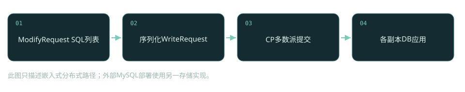
此图只描述嵌入式分布式路径；外部MySQL部署使用另一存储实现。

### 固定源码正文

[core/src/main/java/com/alibaba/nacos/core/persistence/DistributedDatabaseOperateImpl.java，L454–L498](https://github.com/alibaba/nacos/blob/2c587c04891d532df1544ae95b906b677ac8eeff/core/src/main/java/com/alibaba/nacos/core/persistence/DistributedDatabaseOperateImpl.java#L454-L498)

```java
    @Override
    public Boolean update(List<ModifyRequest> sqlContext, BiConsumer<Boolean, Throwable> consumer) {
        try {
            
            // Since the SQL parameter is Object[], in order to ensure that the types of
            // array elements are not lost, the serialization here is done using the java-specific
            // serialization framework, rather than continuing with the protobuff
            
            LoggerUtils.printIfDebugEnabled(LOGGER, "modifyRequests info : {}", sqlContext);
            
            // {timestamp}-{group}-{ip:port}-{signature}
            
            final String key =
                System.currentTimeMillis() + "-" + group() + "-"
                    + memberManager.getSelf().getAddress() + "-"
                    + MD5Utils.md5Hex(sqlContext.toString(), PersistenceConstant.DEFAULT_ENCODE);
            WriteRequest request = WriteRequest.newBuilder().setGroup(group()).setKey(key)
                .setData(ByteString.copyFrom(serializer.serialize(sqlContext)))
                .putAllExtendInfo(EmbeddedStorageContextHolder.getCurrentExtendInfo())
                .setType(sqlContext.getClass().getCanonicalName()).build();
            if (Objects.isNull(consumer)) {
                Response response = this.protocol.write(request);
                if (response.getSuccess()) {
                    return true;
                }
                LOGGER.error("execute sql modify operation failed : {}", response.getErrMsg());
                return false;
            } else {
                this.protocol.writeAsync(request)
                    .whenComplete((BiConsumer<Response, Throwable>) (response, ex) -> {
                        String errMsg = Objects.isNull(ex) ? response.getErrMsg()
                            : ExceptionUtil.getCause(ex).getMessage();
                        consumer.accept(response.getSuccess(),
                            StringUtils.isBlank(errMsg) ? null : new NJdbcException(errMsg));
                    });
            }
            return true;
        } catch (TimeoutException e) {
            LOGGER.error("An timeout exception occurred during the update operation");
            throw new NacosRuntimeException(NacosException.SERVER_ERROR, e.toString());
        } catch (Throwable e) {
            LOGGER.error("An exception occurred during the update operation : {}", e);
            throw new NacosRuntimeException(NacosException.SERVER_ERROR, e.toString());
        }
    }
```

### 失败边界

schema不一致或应用失败会破坏副本推进；数据库模式切换不能只更改一个连接地址。

### 验证与观察

读取onApply及group方法，比较外部实现没有的CP提交调用；本手册已核验源码，未执行数据库迁移。


<a id="dump"></a>
## 22 dump与MD5：数据库提交如何变成可读缓存

ConfigCacheService.dumpWithMd5将配置内容与MD5投影到Server本地可查询的缓存/文件。它按groupKey取得CacheItem并尝试写锁，检查lastModified以避免旧dump覆盖新状态，写文件后更新MD5与内容相关信息，最后释放锁并触发本地变化通知。写数据库、dump落文件、缓存版本推进和客户端通知是连续的多阶段链，不能看成单次数据库事务。

MD5用于判断内容相同或不同，lastModified用于拒绝过时的刷新，它们承担不同职责。若异步通知乱序，旧版本dump不应把更晚版本覆盖掉。缓存锁失败或文件落盘失败可以使本节点读视图暂时落后，即使数据库中已经有新内容。诊断发布后不生效时，先比较DB内容、dump文件、CacheItem.md5，再观察监听客户端的MD5和内容；这样的分层检查比重复点击发布更有解释力。 同MD5但更晚timestamp只推进时间，不重写正文；磁盘满的特定IOException分支会触发systemExit，不能把所有dump失败都描述成可忽略告警。

|字段/对象|状态含义|
|---|---|
|`groupKey`|配置三元组的缓存键|
|`CacheItem.md5`|当前缓存内容摘要|
|`lastModified`|防止过时刷新|
|`tryWriteLock / releaseWriteLock`|缓存与文件修改互斥|

### 固定源码正文

[config/src/main/java/com/alibaba/nacos/config/server/service/ConfigCacheService.java，L72–L164](https://github.com/alibaba/nacos/blob/2c587c04891d532df1544ae95b906b677ac8eeff/config/src/main/java/com/alibaba/nacos/config/server/service/ConfigCacheService.java#L72-L164)

```java
    /**
     * Save config file and update md5 value in cache.
     *
     * @param dataId         dataId string value.
     * @param group          group string value.
     * @param tenant         tenant string value.
     * @param content        content string value.
     * @param md5            md5 of persist.
     * @param lastModifiedTs lastModifiedTs.
     * @param type           file type.
     * @return dumpChange success or not.
     */
    public static boolean dumpWithMd5(String dataId, String group, String tenant, String content,
        String md5,
        long lastModifiedTs, String type, String encryptedDataKey) {
        String groupKey = GroupKey2.getKey(dataId, group, tenant);
        CacheItem ci = makeSure(groupKey, encryptedDataKey);
        ci.setType(type);
        final int lockResult = tryWriteLock(groupKey);
        
        if (lockResult < 0) {
            DUMP_LOG.warn("[dump-error] write lock failed. {}", groupKey);
            return false;
        }
        
        try {
            
            //check timestamp
            boolean lastModifiedOutDated =
                lastModifiedTs < ConfigCacheService.getLastModifiedTs(groupKey);
            if (lastModifiedOutDated) {
                DUMP_LOG.warn("[dump-ignore] timestamp is outdated,groupKey={}", groupKey);
                return true;
            }
            
            boolean newLastModified =
                lastModifiedTs > ConfigCacheService.getLastModifiedTs(groupKey);
            
            if (md5 == null) {
                md5 = MD5Utils.md5Hex(content, PERSIST_ENCODE);
            }
            
            //check md5 & update local disk cache.
            String localContentMd5 = ConfigCacheService.getContentMd5(groupKey);
            boolean md5Changed = !md5.equals(localContentMd5);
            if (md5Changed) {
                DUMP_LOG.info(
                    "[dump] md5 changed, save to disk cache ,groupKey={}, newMd5={},oldMd5={}",
                    groupKey, md5,
                    localContentMd5);
                ConfigDiskServiceFactory.getInstance().saveToDisk(dataId, group, tenant, content);
            } else {
                DUMP_LOG.warn(
                    "[dump-ignore] ignore to save to disk cache. md5 consistent,groupKey={}, md5={}",
                    groupKey, md5);
            }
            
            //check  md5 and timestamp & update local jvm cache.
            if (md5Changed) {
                DUMP_LOG.info(
                    "[dump] md5 changed, update md5 and timestamp in jvm cache ,groupKey={}, newMd5={},oldMd5={},lastModifiedTs={}",
                    groupKey, md5, localContentMd5, lastModifiedTs);
                updateMd5(groupKey, md5, content, lastModifiedTs, encryptedDataKey);
            } else if (newLastModified) {
                DUMP_LOG.info(
                    "[dump] md5 consistent ,timestamp changed, update timestamp only in jvm cache ,groupKey={},lastModifiedTs={}",
                    groupKey, lastModifiedTs);
                updateTimeStamp(groupKey, lastModifiedTs, encryptedDataKey);
            } else {
                DUMP_LOG.warn(
                    "[dump-ignore] ignore to save to jvm cache. md5 consistent and no new timestamp changed.groupKey={}",
                    groupKey);
            }
            
            return true;
        } catch (IOException ioe) {
            DUMP_LOG.error("[dump-exception] save disk error. " + groupKey + ", " + ioe);
            if (ioe.getMessage() != null) {
                String errMsg = ioe.getMessage();
                if (errMsg.contains(NO_SPACE_CN) || errMsg.contains(NO_SPACE_EN)
                    || errMsg.contains(DISK_QUOTA_CN)
                    || errMsg.contains(DISK_QUOTA_EN)) {
                    // Protect from disk full.
                    FATAL_LOG.error("Local Disk Full,Exit", ioe);
                    EnvUtil.systemExit();
                }
            }
            return false;
        } finally {
            releaseWriteLock(groupKey);
        }
        
    }
```

### 失败边界

DB成功而dump失败会导致该节点缓存落后；通知成功不能代替内容与MD5核对。

### 验证与观察

在隔离目录制造不可写权限并发布配置，检查dump日志与DB状态差异；未执行。


<a id="listen-server"></a>
## 23 监听登记：服务端比的是客户端MD5

客户端不需要为每一份配置建立一个独立长连接。ConfigChangeBatchListenRequestHandler处理批量监听上下文，每项包含dataId、group、tenant和MD5，服务端将配置键与connectionId绑定到ConfigChangeListenContext。listen=true表示新增/更新监听，false表示移除。它会比较服务端CacheItem的MD5与客户端MD5，不一致就把该项加入响应中的changedConfigs。

批量登记不只是建立未来推送关系，也承担当前版本对账。若客户端在断连期间漏了通知，重新监听时MD5差异仍能发现变化。连接是推送通道，MD5是内容版本证据，两者共同构成恢复路径。这种设计不要求客户端接收每次历史变化；消费者最终拿到当前配置，而不是所有中间版本。要审计修改历史应查持久化历史，不应拿监听回调次数当配置变更审计。

|字段/对象|状态含义|
|---|---|
|`listen`|新增/移除监听意图|
|`ConfigListenContext.md5`|客户端当前内容摘要|
|`connectionId`|推送目的会话|
|`changedConfigs`|登记时发现的差异项|


登记同时完成版本对账，恢复不依赖所有历史通知均送达。

### 固定源码正文

[config/src/main/java/com/alibaba/nacos/config/server/remote/ConfigChangeBatchListenRequestHandler.java，L55–L97](https://github.com/alibaba/nacos/blob/2c587c04891d532df1544ae95b906b677ac8eeff/config/src/main/java/com/alibaba/nacos/config/server/remote/ConfigChangeBatchListenRequestHandler.java#L55-L97)

```java
    @Override
    @NamespaceValidation
    @TpsControl(pointName = "ConfigListen")
    @Secured(action = ActionTypes.READ, signType = SignType.CONFIG)
    @ExtractorManager.Extractor(rpcExtractor = ConfigBatchListenRequestParamExtractor.class)
    public ConfigChangeBatchListenResponse handle(
        ConfigBatchListenRequest configChangeListenRequest, RequestMeta meta)
        throws NacosException {
        String connectionId = StringPool.get(meta.getConnectionId());
        String tag = configChangeListenRequest.getHeader(Constants.VIPSERVER_TAG);
        ParamUtils.checkParam(tag);
        ConfigChangeBatchListenResponse configChangeBatchListenResponse =
            new ConfigChangeBatchListenResponse();
        for (ConfigBatchListenRequest.ConfigListenContext listenContext : configChangeListenRequest
            .getConfigListenContexts()) {
            boolean isNeedTransferNamespace =
                NamespaceUtil.isNeedTransferNamespace(listenContext.getTenant());
            String namespaceId = NamespaceUtil.processNamespaceParameter(listenContext.getTenant());
            String groupKey =
                GroupKey2.getKey(listenContext.getDataId(), listenContext.getGroup(), namespaceId);
            groupKey = StringPool.get(groupKey);
            
            String md5 = StringPool.get(listenContext.getMd5());
            
            if (configChangeListenRequest.isListen()) {
                configChangeListenContext.addListen(groupKey, md5, connectionId,
                    isNeedTransferNamespace);
                boolean isUptoDate =
                    ConfigCacheService.isUptodate(groupKey, md5, meta.getClientIp(), tag,
                        meta.getAppLabels());
                if (!isUptoDate) {
                    configChangeBatchListenResponse.addChangeConfig(listenContext.getDataId(),
                        listenContext.getGroup(),
                        listenContext.getTenant());
                }
            } else {
                configChangeListenContext.removeListen(groupKey, connectionId);
            }
        }
        
        return configChangeBatchListenResponse;
        
    }
```

### 失败边界

连接重建但未重新监听，会丢失服务端到客户端的关系；MD5同步失败会保持陈旧内容。

### 验证与观察

暂停SDK网络后连续发布两次，再恢复连接，确认最终内容与最后版本一致，而非要求每个中间版本回调。未执行。


<a id="listen-client"></a>
## 24 变化通知：先标脏，再拉正文，再回调

ConfigChangeNotifyRequest不是直接承载新配置正文的推送。ClientWorker.handleConfigChangeNotifyRequest根据dataId/group/tenant找到CacheData，在同步块内把receiveNotifyChanged设为true，把consistentWithServer设为false，再notifyListenConfig唤醒监听循环，随后立刻返回ConfigChangeNotifyResponse。协议ACK只表示SDK已经把配置标为需要对账，不代表正文已获取或业务回调已成功。

监听循环收集不一致CacheData，通过批量监听比MD5和queryConfig拉取正文；refreshContentAndCheck更新内容和加密键并检查监听器MD5。断连时连接监听器把对应任务的CacheData标为不一致，重连后重新唤醒。这样断链与推送都统一成一条标脏→对账→拉取→回调链。用户看到通知日志却没有属性变化，应分别确认正文查询、Listener执行和应用层动态刷新，不把三者混为一谈。

|字段/对象|状态含义|
|---|---|
|`receiveNotifyChanged`|收到过变更提示|
|`consistentWithServer`|是否需要服务端对账|
|`listenExecutebell`|唤醒监听执行循环|
|`checkListenerMd5`|按内容版本触发监听器|

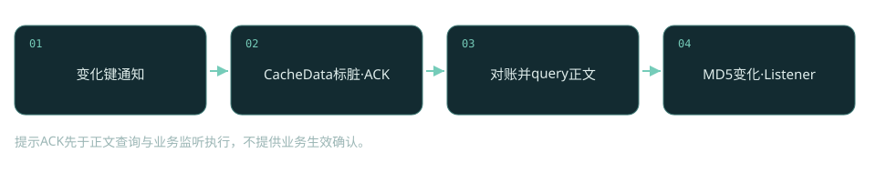
提示ACK先于正文查询与业务监听执行，不提供业务生效确认。

### 固定源码正文

[client/src/main/java/com/alibaba/nacos/client/config/impl/ClientWorker.java，L770–L790](https://github.com/alibaba/nacos/blob/2c587c04891d532df1544ae95b906b677ac8eeff/client/src/main/java/com/alibaba/nacos/client/config/impl/ClientWorker.java#L770-L790)

```java
        ConfigChangeNotifyResponse handleConfigChangeNotifyRequest(
            ConfigChangeNotifyRequest configChangeNotifyRequest,
            String clientName) {
            LOGGER.info("[{}] [server-push] config changed. dataId={}, group={},tenant={}",
                clientName,
                configChangeNotifyRequest.getDataId(), configChangeNotifyRequest.getGroup(),
                configChangeNotifyRequest.getTenant());
            String groupKey = GroupKey.getKeyTenant(configChangeNotifyRequest.getDataId(),
                configChangeNotifyRequest.getGroup(), configChangeNotifyRequest.getTenant());
            
            CacheData cacheData = cacheMap.get().get(groupKey);
            if (cacheData != null) {
                synchronized (cacheData) {
                    cacheData.getReceiveNotifyChanged().set(true);
                    cacheData.setConsistentWithServer(false);
                    notifyListenConfig();
                }
                
            }
            return new ConfigChangeNotifyResponse();
        }
```

### 失败边界

收到ACK仍可能随后查询失败；应用动态刷新机制也可能独立失败。

### 验证与观察

让正文查询超时但保留通知通道，观察CacheData保持不一致与后续补拉；未执行。


<a id="snapshot"></a>
## 25 客户端快照与failover：两种文件不是同一个兜底

NacosConfigService.getConfigInner首先检查本地failover内容；存在时优先返回并通过配置过滤链处理。没有failover才请求Server，成功内容保存snapshot，部分通信异常时再读取snapshot。failover是人为接管内容来源，snapshot是上次成功远程内容的备份；二者优先级、时效和运维责任不同。

快照改善服务端暂时不可达时的启动可用性，却不能证明内容最新。没有快照、内容已删除、网络错误和权限拒绝应分别判断，不能把所有失败都吞成旧内容。客户端监听循环也会检查failover文件创建、更新与删除，从而进入或退出本地接管。排障时先打印内容摘要与来源，避免以为服务端不生效，实际是本地failover一直覆盖远端。密文过滤和encryptedDataKey也要沿返回路径观察，不能只比较原始数据库文本。 getConfigInner明确对NO_RIGHT权限错误重新抛出，禁止用本地快照掩盖授权失败；这是故障兜底和权限边界交叉时必须保留的分支。

|字段/对象|状态含义|
|---|---|
|`getFailover`|人工容灾内容，优先级高|
|`getSnapshot`|成功远程查询的本地备份|
|`saveSnapshot`|更新可恢复内容|
|`ConfigFilterChainManager`|返回内容过滤/解密|

### 固定源码正文

[client/src/main/java/com/alibaba/nacos/client/config/NacosConfigService.java，L223–L287](https://github.com/alibaba/nacos/blob/2c587c04891d532df1544ae95b906b677ac8eeff/client/src/main/java/com/alibaba/nacos/client/config/NacosConfigService.java#L223-L287)

```java
    private String getConfigInner(String tenant, String dataId, String group, long timeoutMs)
        throws NacosException {
        group = blank2defaultGroup(group);
        ParamUtils.checkKeyParam(dataId, group);
        ConfigResponse cr = new ConfigResponse();
        
        cr.setDataId(dataId);
        cr.setTenant(tenant);
        cr.setGroup(group);
        
        // We first try to use local failover content if exists.
        // A config content for failover is not created by client program automatically,
        // but is maintained by user.
        // This is designed for certain scenario like client emergency reboot,
        // changing config needed in the same time, while nacos server is down.
        String content =
            LocalConfigInfoProcessor.getFailover(worker.getAgentName(), dataId, group, tenant);
        if (content != null) {
            LOGGER.warn("[{}] [get-config] get failover ok, dataId={}, group={}, tenant={}",
                worker.getAgentName(),
                dataId, group, tenant);
            cr.setContent(content);
            String encryptedDataKey =
                LocalEncryptedDataKeyProcessor.getEncryptDataKeyFailover(worker.getAgentName(),
                    dataId, group, tenant);
            cr.setEncryptedDataKey(encryptedDataKey);
            configFilterChainManager.doFilter(null, cr);
            content = cr.getContent();
            return content;
        }
        
        try {
            ConfigResponse response =
                worker.getServerConfig(dataId, group, tenant, timeoutMs, false);
            cr.setContent(response.getContent());
            cr.setEncryptedDataKey(response.getEncryptedDataKey());
            configFilterChainManager.doFilter(null, cr);
            content = cr.getContent();
            
            return content;
        } catch (NacosException ioe) {
            if (NacosException.NO_RIGHT == ioe.getErrCode()) {
                throw ioe;
            }
            LOGGER.warn(
                "[{}] [get-config] get from server error, dataId={}, group={}, tenant={}, msg={}",
                worker.getAgentName(), dataId, group, tenant, ioe.toString());
        }
        
        content =
            LocalConfigInfoProcessor.getSnapshot(worker.getAgentName(), dataId, group, tenant);
        if (content != null) {
            LOGGER.warn("[{}] [get-config] get snapshot ok, dataId={}, group={}, tenant={}",
                worker.getAgentName(),
                dataId, group, tenant);
        }
        cr.setContent(content);
        String encryptedDataKey =
            LocalEncryptedDataKeyProcessor.getEncryptDataKeySnapshot(worker.getAgentName(),
                dataId, group, tenant);
        cr.setEncryptedDataKey(encryptedDataKey);
        configFilterChainManager.doFilter(null, cr);
        content = cr.getContent();
        return content;
    }
```

### 失败边界

陈旧快照可能让应用启动但使用过期规则；长期遗留failover会掩盖正常发布。

### 验证与观察

在隔离SDK目录先生成snapshot，再放置不同failover，观察来源与删除failover后的恢复；未执行。


<a id="auth-upgrade"></a>
## 26 鉴权与升级：用户权限、服务器身份、Raft认证三层

gRPC业务入口通过RemoteRequestAuthFilter读取@Secured，再区分INNER_API和业务API。节点内部身份匹配与用户validateIdentity/validateAuthority不是同一条判断：服务器身份用于节点通信，用户身份与Permission(resource,action)用于业务权限。独立Console还需要把真正调用者身份传给Server，否则界面与服务端可能出现权限错位。

3.2.4新增的JRaft认证升级协调器会检测集群成员能力，所有成员支持后将enforced置true并持久化jraft-auth-enforced.state；重启恢复该状态。它不是每次启动重新允许旧成员的临时开关。服务身份key/value必须各节点一致，且由部署配置保证，Nacos不会自动跨节点同步。全员进入强制认证后不能依赖混合旧版本滚动降级；升级前应制定同版本完整恢复方案，而不是承诺随时降级任意节点。

|字段/对象|状态含义|
|---|---|
|`@Secured.apiType/action`|确定资源与鉴权语义|
|`server.identity.key/value`|节点间身份凭据|
|`enforced`|已锁定的认证强制状态|
|`statePersisted`|强制状态是否已落盘|

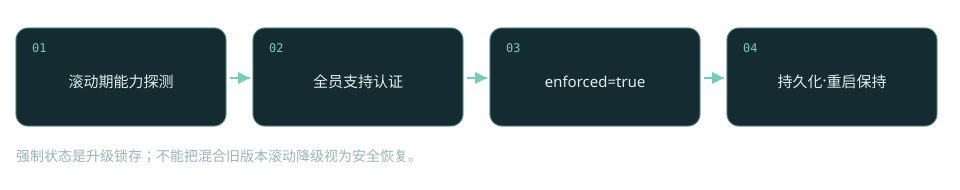
强制状态是升级锁存；不能把混合旧版本滚动降级视为安全恢复。

### 固定源码正文

[core/src/main/java/com/alibaba/nacos/core/distributed/raft/auth/JRaftAuthUpgradeCoordinator.java，L109–L134](https://github.com/alibaba/nacos/blob/2c587c04891d532df1544ae95b906b677ac8eeff/core/src/main/java/com/alibaba/nacos/core/distributed/raft/auth/JRaftAuthUpgradeCoordinator.java#L109-L134)

```java
    /**
     * Checks the complete member view and irreversibly enables JRaft authentication when every
     * member reports support. In-memory enforcement is enabled immediately, while state-file
     * persistence is retried independently until it succeeds.
     */
    @Scheduled(fixedRate = 3000)
    public synchronized void doCheck() {
        if (enforced.get()) {
            persistStateIfNecessary();
            return;
        }
        Collection<Member> members = serverMemberManager.allMembers();
        if (members == null || members.isEmpty()) {
            return;
        }
        for (Member each : members) {
            if (!Boolean.TRUE.equals(
                each.getExtendVal(MemberMetaDataConstants.SUPPORT_JRAFT_AUTH))) {
                return;
            }
        }
        enforced.set(true);
        Loggers.RAFT.info(
            "All Nacos servers support JRaft authentication; enforcement is enabled");
        persistStateIfNecessary();
    }
```

### 失败边界

身份不一致影响节点通信；强制认证后旧节点可能无法重新加入，SDK用户token正确也无济于事。

### 验证与观察

先离线核对节点身份配置和状态文件；需要专门测试集群验证升级，本文未执行实际滚动升级。


<a id="mcp-a2a"></a>
## 27 AI Registry之一：MCP/A2A复用配置与发现

MCP不是只在页面加一个列表。createMcpServer先按name解析已有ID并拒绝重复，要求version有效，校验自定义UUID或生成UUID，构造McpServerStorageInfo。随后先发布版本索引配置，再发布具体版本正文配置，调用syncEffectService并清理查询索引缓存。getMcpServerDetail还会注入端点，把静态规范与动态发现结果组装为客户端可消费的详情。

A2aServerOperationService.registerAgent具有相近结构：AgentCardVersionInfo与AgentCardDetailInfo分别转成ConfigForm并发布。两次publishConfig是两个调用，不能根据同一个方法体就声称整个创建过程在数据库跨资源事务中原子完成。若第一份成功、第二份失败，需要按索引与正文分别核查。注册中心管理能力、协议描述、版本和端点；实际模型推理、工具执行与Agent业务运行仍在外部服务，Nacos不是推理引擎。

|字段/对象|状态含义|
|---|---|
|`McpServerBasicInfo.id/name/versionDetail`|资源身份与版本|
|`McpServerStorageInfo`|保存的规范内容|
|`versionForm / configForm`|版本索引与版本正文|
|`injectEndpoint`|用发现结果补充动态端点|

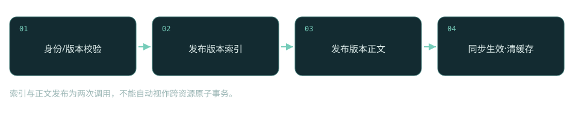
索引与正文发布为两次调用，不能自动视作跨资源原子事务。

### 固定源码正文

[ai/src/main/java/com/alibaba/nacos/ai/service/McpServerOperationService.java，L361–L448](https://github.com/alibaba/nacos/blob/2c587c04891d532df1544ae95b906b677ac8eeff/ai/src/main/java/com/alibaba/nacos/ai/service/McpServerOperationService.java#L361-L448)

```java
    /**
     * Create new mcp server with resource specification.
     *
     * @param namespaceId namespace id of mcp server
     * @param serverSpecification mcp server specification
     * @param toolSpecification mcp server tool specification
     * @param resourceSpecification mcp server resource specification
     * @param endpointSpecification mcp server endpoint specification
     * @return mcp server id
     * @throws NacosException any exception during handling
     */
    public String createMcpServer(String namespaceId, McpServerBasicInfo serverSpecification,
        McpToolSpecification toolSpecification, McpResourceSpecification resourceSpecification,
        McpEndpointSpec endpointSpecification) throws NacosException {
        
        String existId =
            resolveMcpServerId(namespaceId, serverSpecification.getName(), StringUtils.EMPTY);
        if (StringUtils.isNotEmpty(existId)) {
            throw new NacosApiException(NacosApiException.CONFLICT, ErrorCode.RESOURCE_CONFLICT,
                String.format("mcp server `%s` has existed, please update it rather than create.",
                    serverSpecification.getName()));
        }
        
        ServerVersionDetail versionDetail = serverSpecification.getVersionDetail();
        if (null == versionDetail && StringUtils.isNotBlank(serverSpecification.getVersion())) {
            versionDetail = new ServerVersionDetail();
            versionDetail.setVersion(serverSpecification.getVersion());
            serverSpecification.setVersionDetail(versionDetail);
        }
        if (Objects.isNull(versionDetail) || StringUtils.isEmpty(versionDetail.getVersion())) {
            throw new NacosApiException(NacosApiException.INVALID_PARAM,
                ErrorCode.PARAMETER_VALIDATE_ERROR,
                "Version must be specified in parameter `serverSpecification`");
        }
        String id;
        String customMcpId = serverSpecification.getId();
        
        if (StringUtils.isEmpty(customMcpId)) {
            id = UUID.randomUUID().toString();
        } else {
            if (!StringUtils.isUuidString(customMcpId)) {
                throw new NacosApiException(NacosApiException.INVALID_PARAM,
                    ErrorCode.PARAMETER_VALIDATE_ERROR,
                    "parameter `serverSpecification.id` is not match uuid pattern,  must obey uuid pattern");
            }
            if (mcpServerIndex.getMcpServerById(serverSpecification.getId()) != null) {
                throw new NacosApiException(NacosApiException.INVALID_PARAM,
                    ErrorCode.PARAMETER_VALIDATE_ERROR,
                    "parameter `serverSpecification.id` conflict with exist mcp server id");
            }
            
            id = customMcpId;
        }
        
        serverSpecification.setId(id);
        ZonedDateTime currentTime = ZonedDateTime.now(ZoneOffset.UTC);
        DateTimeFormatter formatter = DateTimeFormatter.ofPattern(Constants.RELEASE_DATE_FORMAT);
        String formattedCurrentTime = currentTime.format(formatter);
        versionDetail.setRelease_date(formattedCurrentTime);
        
        McpServerStorageInfo newSpecification = new McpServerStorageInfo();
        BeanUtils.copyProperties(serverSpecification, newSpecification);
        injectMcpDescriptionsAndEndpoint(namespaceId, serverSpecification.getId(), newSpecification,
            toolSpecification, resourceSpecification, endpointSpecification, false, null);
        
        McpServerVersionInfo versionInfo =
            buildServerVersionInfo(newSpecification, id, versionDetail);
        
        ConfigRequestInfo configRequestInfo = new ConfigRequestInfo();
        configRequestInfo.setUpdateForExist(Boolean.FALSE);
        
        ConfigFormV3 mcpServerVersionForm = buildMcpServerVersionForm(namespaceId, versionInfo);
        configOperationService.publishConfig(mcpServerVersionForm, configRequestInfo, null);
        
        ConfigForm configForm =
            buildMcpConfigForm(namespaceId, id, versionDetail.getVersion(), newSpecification);
        long startOperationTime = System.currentTimeMillis();
        configOperationService.publishConfig(configForm, configRequestInfo, null);
        syncEffectService.toSync(configForm, startOperationTime);
        
        // Delete the relevant cache after a successful database operation
        invalidateCacheAfterDbOperation(namespaceId, serverSpecification.getName(), id);
        AiResourceTraceService.logSuccess("mcp", serverSpecification.getName(),
            versionDetail.getVersion(), AiResourceTraceService.OP_CREATE_DRAFT,
            VisibilityHelper.resolveCurrentIdentity(), VisibilityHelper.resolveClientIp());
        
        return id;
    }
```

### 失败边界

部分成功会出现索引存在而正文缺失；私网MCP工具导入还受允许列表约束。

### 验证与观察

在隔离存储中模拟第二次发布失败，检查索引/正文差异；MCP工具执行不在本实验范围，未执行。


<a id="prompt-skill"></a>
## 28 AI Registry之二：Prompt/Skill的版本、可见性与发布

3.2.4的Prompt不是任意读取一份字符串配置。queryPrompt先requireReadableMeta检查AiResource及可见性，再从版本信息解析version/label，读取AiResourceVersion并要求状态ONLINE，最后从存储提供者装载内容。版本存在、版本上线、调用者可读是三个独立条件；直接在管理界面创建草稿并不意味着业务SDK能读到它。

SkillOperationServiceImpl.querySkill先检查资源meta可读性，再查SkillIndexManifest，按明确版本或latest等label解析实际版本，从manifest取得文件列表，装载多文件内容并发布下载事件。Skill上传与草稿写入会经过存储、版本记录和发布流水线，因此不能沿用MCP配置双写模型解释所有AI资源。学习它时把meta权限、version生命周期、manifest索引和storage文件列成四栏；任一层缺失都会影响查询，存储成功不等于正式发布成功。迁移2.x时，这些新资源没有与旧客户端相同的API语义，应逐接口检验，而非只替换依赖版本。

|字段/对象|状态含义|
|---|---|
|`AiResource`|资源元数据与可见性|
|`AiResourceVersion.status`|Prompt需ONLINE|
|`version / label`|真实版本与可移动版本标签|
|`SkillIndexManifest`|Skill版本到文件集合的索引|

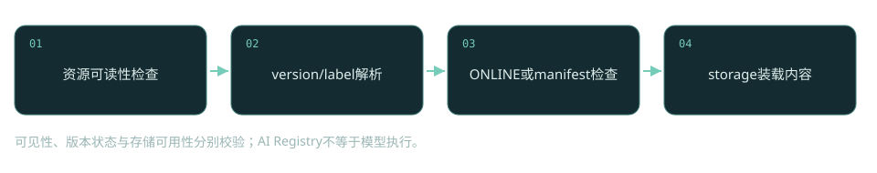
可见性、版本状态与存储可用性分别校验；AI Registry不等于模型执行。

### 固定源码正文

[ai/src/main/java/com/alibaba/nacos/ai/service/prompt/PromptOperationServiceImpl.java，L809–L836](https://github.com/alibaba/nacos/blob/2c587c04891d532df1544ae95b906b677ac8eeff/ai/src/main/java/com/alibaba/nacos/ai/service/prompt/PromptOperationServiceImpl.java#L809-L836)

```java
    // ========== Client APIs ==========
    
    @Override
    public PromptVersionInfo queryPrompt(String namespaceId, String promptKey, String version,
        String label)
        throws NacosException {
        AiResource meta = requireReadableMeta(namespaceId, promptKey);
        
        PromptVersionInfoPojo info = requireVersionInfo(meta);
        String resolved = resolveClientVersion(info, version, label);
        if (StringUtils.isBlank(resolved)) {
            throw new NacosApiException(NacosException.NOT_FOUND, ErrorCode.RESOURCE_NOT_FOUND,
                "Prompt version not found: " + promptKey);
        }
        
        // Verify version is online
        AiResourceVersion versionRow = resourceManager.findVersion(namespaceId, promptKey,
            RESOURCE_TYPE_PROMPT, resolved);
        if (versionRow == null || !VERSION_STATUS_ONLINE.equalsIgnoreCase(versionRow.getStatus())) {
            throw new NacosApiException(NacosException.NOT_FOUND, ErrorCode.RESOURCE_NOT_FOUND,
                "Prompt version not online: " + promptKey + "@" + resolved);
        }
        
        PromptVersionInfo result = loadPromptFromStorage(namespaceId, promptKey, resolved);
        result.setSrcUser(versionRow.getAuthor());
        result.setCommitMsg(versionRow.getDesc());
        return result;
    }
```

### 失败边界

草稿不可读、版本未上线、label无目标和文件缺失要分别定位；不能统一归因为gRPC问题。

### 验证与观察

为同一Prompt创建草稿与ONLINE版本，分别使用有权限和无权限主体查询；本文未执行AI API实测。


## 附录A：补充源码证据

### 身份比较：ephemeral不在equals中

[naming/src/main/java/com/alibaba/nacos/naming/core/v2/pojo/Service.java](https://github.com/alibaba/nacos/blob/2c587c04891d532df1544ae95b906b677ac8eeff/naming/src/main/java/com/alibaba/nacos/naming/core/v2/pojo/Service.java#L106-L117)

```java
    @Override
    public boolean equals(Object o) {
        if (this == o) {
            return true;
        }
        if (!(o instanceof Service)) {
            return false;
        }
        Service service = (Service) o;
        return namespace.equals(service.namespace) && group.equals(service.group)
            && name.equals(service.name);
    }
```

### Distro过滤持久Client与非责任节点

[naming/src/main/java/com/alibaba/nacos/naming/consistency/ephemeral/distro/v2/DistroClientDataProcessor.java](https://github.com/alibaba/nacos/blob/2c587c04891d532df1544ae95b906b677ac8eeff/naming/src/main/java/com/alibaba/nacos/naming/consistency/ephemeral/distro/v2/DistroClientDataProcessor.java#L130-L134)

```java
    private boolean isInvalidClient(Client client) {
        // Only ephemeral data sync by Distro, persist client should sync by raft.
        return null == client || !client.isEphemeral()
            || !clientManager.isResponsibleClient(client);
    }
```

### A2A分别发布索引与正文

[ai/src/main/java/com/alibaba/nacos/ai/service/a2a/A2aServerOperationService.java](https://github.com/alibaba/nacos/blob/2c587c04891d532df1544ae95b906b677ac8eeff/ai/src/main/java/com/alibaba/nacos/ai/service/a2a/A2aServerOperationService.java#L91-L129)

```java
    /**
     * Register agent.
     *
     * @param agentCard agent card
     * @throws NacosException nacos exception
     */
    public void registerAgent(AgentCard agentCard, String namespaceId, String registrationType)
        throws NacosException {
        try {
            // 1. register agent's info
            AgentCardVersionInfo agentCardVersionInfo =
                AgentCardUtil.buildAgentCardVersionInfo(agentCard,
                    registrationType, true);
            ConfigForm configForm =
                transferVersionInfoToConfigForm(agentCardVersionInfo, namespaceId);
            ConfigRequestInfo versionConfigRequest = new ConfigRequestInfo();
            versionConfigRequest.setUpdateForExist(Boolean.FALSE);
            configOperationService.publishConfig(configForm, versionConfigRequest, null);
            
            // 2. register agent's version info
            AgentCardDetailInfo agentCardDetailInfo =
                AgentCardUtil.buildAgentCardDetailInfo(agentCard,
                    registrationType);
            ConfigForm configFormVersion =
                transferAgentInfoToConfigForm(agentCardDetailInfo, namespaceId);
            ConfigRequestInfo agentCardConfigRequest = new ConfigRequestInfo();
            agentCardConfigRequest.setUpdateForExist(Boolean.FALSE);
            long startOperationTime = System.currentTimeMillis();
            configOperationService.publishConfig(configFormVersion, agentCardConfigRequest, null);
            
            syncEffectService.toSync(configFormVersion, startOperationTime);
            AiResourceTraceService.logSuccess("a2a", agentCard.getName(), agentCard.getVersion(),
                AiResourceTraceService.OP_CREATE_DRAFT, VisibilityHelper.resolveCurrentIdentity(),
                VisibilityHelper.resolveClientIp());
        } catch (ConfigAlreadyExistsException e) {
            throw new NacosApiException(NacosException.CONFLICT, ErrorCode.RESOURCE_CONFLICT,
                String.format("AgentCard name %s already exist", agentCard.getName()));
        }
    }
```

### Skill从manifest定位版本与文件

[ai/src/main/java/com/alibaba/nacos/ai/service/skills/SkillOperationServiceImpl.java](https://github.com/alibaba/nacos/blob/2c587c04891d532df1544ae95b906b677ac8eeff/ai/src/main/java/com/alibaba/nacos/ai/service/skills/SkillOperationServiceImpl.java#L1103-L1144)

```java
    /**
     * Query a skill for client consumption. Resolves the target version via explicit version, label, or manifest,
     * loads the skill content from the index manifest's file list, and publishes a download event.
     */
    @Override
    public Skill querySkill(String namespaceId, String name, String version, String label)
        throws NacosException {
        // Step 1: Verify meta exists and is readable
        AiResource meta = resourceManager.findMeta(namespaceId, name, RESOURCE_TYPE_SKILL);
        if (meta == null) {
            throw new NacosApiException(NacosException.NOT_FOUND, ErrorCode.RESOURCE_NOT_FOUND,
                "Skill not found: " + name);
        }
        resourceManager.ensureReadableOrNotFound(meta, "Skill not found: " + name);
        // Step 2: Find available versions from index manifest
        SkillIndexManifest manifest = manifestService.query(namespaceId, name);
        if (manifest == null || manifest.getVersions() == null
            || manifest.getVersions().isEmpty()) {
            throw new NacosApiException(NacosException.NOT_FOUND, ErrorCode.RESOURCE_NOT_FOUND,
                "Skill not found: " + name);
        }
        
        // Step 3: Resolve actual version from version/label params (labels like "latest" are looked up in manifest)
        String resolved = SkillIndexManifestService.resolveVersion(manifest, version, label);
        if (StringUtils.isBlank(resolved)) {
            throw new NacosApiException(NacosException.NOT_FOUND, ErrorCode.RESOURCE_NOT_FOUND,
                "Skill version not found: " + name);
        }
        
        // Step 4: Get file list from manifest and read storage content
        List<String> files = manifest.getVersions().get(resolved);
        if (files == null || files.isEmpty()) {
            throw new NacosApiException(NacosException.NOT_FOUND, ErrorCode.RESOURCE_NOT_FOUND,
                "Skill version not found: " + name + "@" + resolved);
        }
        
        Skill skill = loadSkillFromFiles(namespaceId, name, resolved, files);
        // Step 5: Publish download event for download count tracking
        NotifyCenter.publishEvent(
            new SkillDownloadEvent(namespaceId, name, RESOURCE_TYPE_SKILL, resolved));
        return skill;
    }
```

### gRPC业务鉴权与节点身份分支

[core/src/main/java/com/alibaba/nacos/core/auth/RemoteRequestAuthFilter.java](https://github.com/alibaba/nacos/blob/2c587c04891d532df1544ae95b906b677ac8eeff/core/src/main/java/com/alibaba/nacos/core/auth/RemoteRequestAuthFilter.java#L67-L142)

```java
    @Override
    public Response filter(Request request, RequestMeta meta, Class handlerClazz)
        throws NacosException {
        
        try {
            
            Method method = getHandleMethod(handlerClazz);
            if (method.isAnnotationPresent(Secured.class)) {
                Secured secured = method.getAnnotation(Secured.class);
                RequestContext requestContext = RequestContextHolder.getContext();
                requestContext.getAuthContext().setApiType(secured.apiType().name());
                // During Upgrading, Old Nacos server might not with server identity for some Inner API, follow old version logic.
                if (ApiType.INNER_API.equals(secured.apiType())
                    && !innerApiAuthEnabled.isEnabled()) {
                    return null;
                }
                // Inner API must do check server identity. So judge api type not inner api and whether auth is enabled.
                if (ApiType.INNER_API != secured.apiType() && !authConfig.isAuthEnabled()) {
                    return null;
                }
                if (Loggers.AUTH.isDebugEnabled()) {
                    Loggers.AUTH.debug("auth start, request: {}",
                        request.getClass().getSimpleName());
                }
                ServerIdentityResult identityResult =
                    protocolAuthService.checkServerIdentity(request, secured);
                switch (identityResult.getStatus()) {
                    case FAIL:
                        Response defaultResponseInstance = getDefaultResponseInstance(handlerClazz);
                        defaultResponseInstance.setErrorInfo(NacosException.NO_RIGHT,
                            identityResult.getMessage());
                        return defaultResponseInstance;
                    case MATCHED:
                        return null;
                    default:
                        break;
                }
                if (!protocolAuthService.enableAuth(secured)) {
                    return null;
                }
                String clientIp = meta.getClientIp();
                request.putHeader(Constants.Identity.X_REAL_IP, clientIp);
                Resource resource = protocolAuthService.parseResource(request, secured);
                IdentityContext identityContext = protocolAuthService.parseIdentity(request);
                AuthResult result = protocolAuthService.validateIdentity(identityContext, resource);
                requestContext.getAuthContext().setIdentityContext(identityContext);
                requestContext.getAuthContext().setResource(resource);
                requestContext.getAuthContext().setAuthResult(result);
                if (!result.isSuccess()) {
                    throw new AccessException(result.format());
                }
                String action = secured.action().toString();
                result = protocolAuthService.validateAuthority(identityContext,
                    new Permission(resource, action));
                if (!result.isSuccess()) {
                    throw new AccessException(result.format());
                }
            }
        } catch (AccessException e) {
            if (Loggers.AUTH.isDebugEnabled()) {
                Loggers.AUTH.debug("access denied, request: {}, reason: {}",
                    request.getClass().getSimpleName(),
                    e.getErrMsg());
            }
            Response defaultResponseInstance = getDefaultResponseInstance(handlerClazz);
            defaultResponseInstance.setErrorInfo(NacosException.NO_RIGHT, e.getErrMsg());
            return defaultResponseInstance;
        } catch (Exception e) {
            Response defaultResponseInstance = getDefaultResponseInstance(handlerClazz);
            defaultResponseInstance.setErrorInfo(NacosException.SERVER_ERROR,
                ExceptionUtil.getAllExceptionMsg(e));
            return defaultResponseInstance;
        }
        
        return null;
    }
```

### 配置事件转连接推送

[config/src/main/java/com/alibaba/nacos/config/server/remote/RpcConfigChangeNotifier.java](https://github.com/alibaba/nacos/blob/2c587c04891d532df1544ae95b906b677ac8eeff/config/src/main/java/com/alibaba/nacos/config/server/remote/RpcConfigChangeNotifier.java#L82-L117)

```java
    /**
     * adaptor to config module ,when server side config change ,invoke this method.
     *
     * @param groupKey groupKey
     */
    public void configDataChanged(String groupKey, String dataId, String group, String tenant) {
        
        Set<String> listeners = configChangeListenContext.getListeners(groupKey);
        if (CollectionUtils.isEmpty(listeners)) {
            return;
        }
        int notifyClientCount = 0;
        for (final String client : listeners) {
            Connection connection = connectionManager.getConnection(client);
            if (connection == null) {
                continue;
            }
            boolean ifNamespaceTransfer = configChangeListenContext
                .getConfigListenState(client, groupKey).isNamespaceTransfer();
            if (ifNamespaceTransfer) {
                tenant = null;
            }
            ConnectionMeta metaInfo = connection.getMetaInfo();
            String clientIp = metaInfo.getClientIp();
            
            ConfigChangeNotifyRequest notifyRequest =
                ConfigChangeNotifyRequest.build(dataId, group, tenant);
            
            RpcPushTask rpcPushRetryTask = new RpcPushTask(notifyRequest,
                ConfigCommonConfig.getInstance().getMaxPushRetryTimes(), client, clientIp,
                metaInfo.getAppName());
            push(rpcPushRetryTask, connectionManager);
            notifyClientCount++;
        }
        Loggers.REMOTE_PUSH.info("push [{}] clients, groupKey=[{}]", notifyClientCount, groupKey);
    }
```

### 配置断连标脏与重连唤醒

[client/src/main/java/com/alibaba/nacos/client/config/impl/ClientWorker.java](https://github.com/alibaba/nacos/blob/2c587c04891d532df1544ae95b906b677ac8eeff/client/src/main/java/com/alibaba/nacos/client/config/impl/ClientWorker.java#L824-L833)

```java
                @Override
                public void onConnected(Connection connection) {
                    LOGGER.info("[{}] Connected,notify listen context...",
                        rpcClientInner.getName());
                    notifyListenConfig();
                    
                    LOGGER.info("[{}] Connected,notify fuzzy listen context...",
                        rpcClientInner.getName());
                    configFuzzyWatchGroupKeyHolder.notifyFuzzyWatchSync();
                }
```

### 拉取正文并检查Listener MD5

[client/src/main/java/com/alibaba/nacos/client/config/impl/ClientWorker.java](https://github.com/alibaba/nacos/blob/2c587c04891d532df1544ae95b906b677ac8eeff/client/src/main/java/com/alibaba/nacos/client/config/impl/ClientWorker.java#L1064-L1089)

```java
        private void refreshContentAndCheck(RpcClient rpcClient, CacheData cacheData,
            boolean notify) {
            try {
                
                ConfigResponse response =
                    this.queryConfigInner(rpcClient, cacheData.dataId, cacheData.group,
                        cacheData.tenant, requestTimeout, notify);
                cacheData.setEncryptedDataKey(response.getEncryptedDataKey());
                cacheData.setContent(response.getContent());
                if (null != response.getConfigType()) {
                    cacheData.setType(response.getConfigType());
                }
                if (notify) {
                    LOGGER.info(
                        "[{}] [data-received] dataId={}, group={}, tenant={}, md5={}, type={}",
                        agent.getName(),
                        cacheData.dataId, cacheData.group, cacheData.tenant, cacheData.getMd5(),
                        response.getConfigType());
                }
                cacheData.checkListenerMd5();
            } catch (Exception e) {
                LOGGER.error("refresh content and check md5 fail ,dataId={},group={},tenant={} ",
                    cacheData.dataId,
                    cacheData.group, cacheData.tenant, e);
            }
        }
```

### 控制台默认端口

[distribution/conf/application.properties](https://github.com/alibaba/nacos/blob/2c587c04891d532df1544ae95b906b677ac8eeff/distribution/conf/application.properties#L230-L252)

```java
### Reopen deprecated v3 APIs pending removal during a migration window. Disabled by default.
# nacos.core.api.compatibility.enabled=false
### Enabled for legacy open API compatibility provided by nacos-api-legacy-adapter
# nacos.core.api.compatibility.client.enabled=true

#--------------- Nacos Console Configurations ---------------#

#*************** Nacos Console Related Configurations ***************#
### Nacos Console Main port
nacos.console.port=8080
### Nacos Server Web context path:
nacos.console.contextPath=

### Nacos Server context path, which link to nacos server `nacos.server.contextPath`, works when deployment type is `console`
nacos.console.remote.server.context-path=/nacos

#************** Console UI Configuration ***************#

### Turn on/off the nacos console ui.
#nacos.console.ui.enabled=true

### Default console UI version: 'next' (new UI) or 'legacy' (old UI)
#nacos.console.ui.default=next
```

### JRaft提交时的leader路由

[core/src/main/java/com/alibaba/nacos/core/distributed/raft/JRaftServer.java](https://github.com/alibaba/nacos/blob/2c587c04891d532df1544ae95b906b677ac8eeff/core/src/main/java/com/alibaba/nacos/core/distributed/raft/JRaftServer.java#L342-L363)

```java
    public CompletableFuture<Response> commit(final String group, final Message data,
        final CompletableFuture<Response> future) {
        LoggerUtils.printIfDebugEnabled(Loggers.RAFT, "data requested this time : {}", data);
        final RaftGroupTuple tuple = findTupleByGroup(group);
        if (tuple == null) {
            future.completeExceptionally(
                new IllegalArgumentException("No corresponding Raft Group found : " + group));
            return future;
        }
        
        FailoverClosureImpl closure = new FailoverClosureImpl(future);
        
        final Node node = tuple.node;
        if (node.isLeader()) {
            // The leader node directly applies this request
            applyOperation(node, data, closure);
        } else {
            // Forward to Leader for request processing
            invokeToLeader(group, data, rpcRequestTimeoutMs, closure);
        }
        return future;
    }
```

### 查询保存快照与删除快照分支

[client/src/main/java/com/alibaba/nacos/client/config/impl/ClientWorker.java](https://github.com/alibaba/nacos/blob/2c587c04891d532df1544ae95b906b677ac8eeff/client/src/main/java/com/alibaba/nacos/client/config/impl/ClientWorker.java#L1316-L1368)

```java
        ConfigResponse queryConfigInner(RpcClient rpcClient, String dataId, String group,
            String tenant,
            long readTimeouts, boolean notify) throws NacosException {
            ConfigQueryRequest request = ConfigQueryRequest.build(dataId, group, tenant);
            request.putHeader(NOTIFY_HEADER, String.valueOf(notify));
            
            ConfigQueryResponse response =
                (ConfigQueryResponse) requestProxy(rpcClient, request, readTimeouts);
            
            ConfigResponse configResponse = new ConfigResponse();
            if (response.isSuccess()) {
                LocalConfigInfoProcessor.saveSnapshot(this.getName(), dataId, group, tenant,
                    response.getContent());
                configResponse.setContent(response.getContent());
                // Set MD5 from server response
                configResponse.setMd5(response.getMd5());
                String configType;
                if (StringUtils.isNotBlank(response.getContentType())) {
                    configType = response.getContentType();
                } else {
                    configType = ConfigType.TEXT.getType();
                }
                configResponse.setConfigType(configType);
                String encryptedDataKey = response.getEncryptedDataKey();
                LocalEncryptedDataKeyProcessor.saveEncryptDataKeySnapshot(agent.getName(), dataId,
                    group, tenant,
                    encryptedDataKey);
                configResponse.setEncryptedDataKey(encryptedDataKey);
                return configResponse;
            } else if (response.getErrorCode() == ConfigQueryResponse.CONFIG_NOT_FOUND) {
                LocalConfigInfoProcessor.saveSnapshot(this.getName(), dataId, group, tenant, null);
                LocalEncryptedDataKeyProcessor.saveEncryptDataKeySnapshot(agent.getName(), dataId,
                    group, tenant, null);
                return configResponse;
            } else if (response.getErrorCode() == ConfigQueryResponse.CONFIG_QUERY_CONFLICT) {
                LOGGER.error(
                    "[{}] [sub-server-error] get server config being modified concurrently, dataId={}, group={}, "
                        + "tenant={}",
                    this.getName(), dataId, group, tenant);
                throw new NacosException(NacosException.CONFLICT,
                    "data being modified, dataId=" + dataId + ",group=" + group + ",tenant="
                        + tenant);
            } else {
                LOGGER.error("[{}] [sub-server-error]  dataId={}, group={}, tenant={}, code={}",
                    this.getName(), dataId,
                    group, tenant, response);
                throw new NacosException(response.getErrorCode(),
                    "http error, code=" + response.getErrorCode() + ",msg="
                        + response.getMessage() + ",dataId="
                        + dataId + ",group=" + group + ",tenant=" + tenant);
                
            }
        }
```

### 强制状态重启恢复

[core/src/main/java/com/alibaba/nacos/core/distributed/raft/auth/JRaftAuthUpgradeCoordinator.java](https://github.com/alibaba/nacos/blob/2c587c04891d532df1544ae95b906b677ac8eeff/core/src/main/java/com/alibaba/nacos/core/distributed/raft/auth/JRaftAuthUpgradeCoordinator.java#L136-L155)

```java
    private void loadState() {
        if (!Files.isRegularFile(stateFile)) {
            return;
        }
        try {
            List<String> lines = Files.readAllLines(stateFile, StandardCharsets.UTF_8);
            if (lines.contains(STATE_FILE_VERSION) && lines.contains(ENFORCED_STATE)) {
                enforced.set(true);
                statePersisted.set(true);
                Loggers.RAFT.info(
                    "Restored enforced JRaft authentication state from persistent marker");
            } else {
                Loggers.RAFT.warn("Ignored invalid JRaft authentication state file at {}",
                    stateFile);
            }
        } catch (IOException e) {
            Loggers.RAFT.warn("Failed to read JRaft authentication state file at {}", stateFile,
                e);
        }
    }
```

### 2.5.4对照：pom.xml

[pom.xml](https://github.com/alibaba/nacos/blob/55a99b1c186f81a53976e1a323ae29feb47d3aaf/pom.xml#L90-L146)

```java
    <properties>
        <revision>2.5.4</revision>
        <project.build.sourceEncoding>UTF-8</project.build.sourceEncoding>
        <project.reporting.outputEncoding>UTF-8</project.reporting.outputEncoding>
        <!-- Compiler settings properties -->
        <java.version>1.8</java.version>
        <maven.compiler.source>${java.version}</maven.compiler.source>
        <maven.compiler.target>${java.version}</maven.compiler.target>
        <!-- Maven properties -->
        <maven.test.skip>false</maven.test.skip>
        <maven.javadoc.skip>true</maven.javadoc.skip>
        <!-- Exclude all generated code -->
        <sonar.exclusions>file:**/generated-sources/**,**/test/**</sonar.exclusions>

        <!-- plugin version -->
        <versions-maven-plugin.version>2.2</versions-maven-plugin.version>
        <dependency-mediator-maven-plugin.version>1.0.2</dependency-mediator-maven-plugin.version>
        <clirr-maven-plugin.version>2.7</clirr-maven-plugin.version>
        <maven-enforcer-plugin.version>3.5.0</maven-enforcer-plugin.version>
        <maven-compiler-plugin.version>3.5.1</maven-compiler-plugin.version>
        <maven-javadoc-plugin.version>2.10.4</maven-javadoc-plugin.version>
        <maven-jar-plugin.version>3.2.2</maven-jar-plugin.version>
        <maven-source-plugin.version>3.0.1</maven-source-plugin.version>
        <maven-pmd-plugin.version>3.8</maven-pmd-plugin.version>
        <apache-rat-plugin.version>0.12</apache-rat-plugin.version>
        <maven-resources-plugin.version>3.0.2</maven-resources-plugin.version>
        <jacoco-maven-plugin.version>0.8.7</jacoco-maven-plugin.version>
        <maven-surefire-plugin.version>3.2.5</maven-surefire-plugin.version>
        <findbugs-maven-plugin.version>3.0.4</findbugs-maven-plugin.version>
        <sonar-maven-plugin.version>3.0.2</sonar-maven-plugin.version>
        <maven-gpg-plugin.version>1.6</maven-gpg-plugin.version>
        <maven-failsafe-plugin.version>3.2.5</maven-failsafe-plugin.version>
        <maven-assembly-plugin.version>3.0.0</maven-assembly-plugin.version>
        <maven-checkstyle-plugin.version>3.1.2</maven-checkstyle-plugin.version>
        <maven-easyj-version>1.1.5</maven-easyj-version>
        <!-- dependency version related to plugin -->
        <extra-enforcer-rules.version>1.9.0</extra-enforcer-rules.version>
        <p3c-pmd.version>1.3.0</p3c-pmd.version>

        <!-- dependency version -->
        <nacos.logback.adapter.version>1.1.5</nacos.logback.adapter.version>
        <spring-boot-dependencies.version>2.7.18</spring-boot-dependencies.version>
        <servlet-api.version>3.0</servlet-api.version>
        <commons-io.version>2.14.0</commons-io.version>
        <commons-collections.version>3.2.2</commons-collections.version>
        <slf4j-api.version>1.7.26</slf4j-api.version>
        <logback.version>1.2.13</logback.version>
        <log4j.version>2.17.1</log4j.version>

        <mysql-connector-java.version>8.2.0</mysql-connector-java.version>
        <derby.version>10.14.2.0</derby.version>
        <jjwt.version>0.11.2</jjwt.version>
        <grpc-java.version>1.75.0</grpc-java.version>
        <proto-google-common-protos.version>2.17.0</proto-google-common-protos.version>
        <protobuf-java.version>3.25.5</protobuf-java.version>
        <protoc-gen-grpc-java.version>${grpc-java.version}</protoc-gen-grpc-java.version>
        <hessian.version>4.0.63</hessian.version>
```

### 2.5.4对照：InstanceRequestHandler.java

[naming/src/main/java/com/alibaba/nacos/naming/remote/rpc/handler/InstanceRequestHandler.java](https://github.com/alibaba/nacos/blob/55a99b1c186f81a53976e1a323ae29feb47d3aaf/naming/src/main/java/com/alibaba/nacos/naming/remote/rpc/handler/InstanceRequestHandler.java#L73-L80)

```java
    private InstanceResponse registerInstance(Service service, InstanceRequest request, RequestMeta meta)
            throws NacosException {
        clientOperationService.registerInstance(service, request.getInstance(), meta.getConnectionId());
        NotifyCenter.publishEvent(new RegisterInstanceTraceEvent(System.currentTimeMillis(),
                NamingRequestUtil.getSourceIpForGrpcRequest(meta), true, service.getNamespace(), service.getGroup(),
                service.getName(), request.getInstance().getIp(), request.getInstance().getPort()));
        return new InstanceResponse(NamingRemoteConstants.REGISTER_INSTANCE);
    }
```

### 2.5.4对照：DistroClientDataProcessor.java

[naming/src/main/java/com/alibaba/nacos/naming/consistency/ephemeral/distro/v2/DistroClientDataProcessor.java](https://github.com/alibaba/nacos/blob/55a99b1c186f81a53976e1a323ae29feb47d3aaf/naming/src/main/java/com/alibaba/nacos/naming/consistency/ephemeral/distro/v2/DistroClientDataProcessor.java#L115-L127)

```java
    private void syncToAllServer(ClientEvent event) {
        Client client = event.getClient();
        if (isInvalidClient(client)) {
            return;
        }
        if (event instanceof ClientEvent.ClientDisconnectEvent) {
            DistroKey distroKey = new DistroKey(client.getClientId(), TYPE);
            distroProtocol.sync(distroKey, DataOperation.DELETE);
        } else if (event instanceof ClientEvent.ClientChangedEvent) {
            DistroKey distroKey = new DistroKey(client.getClientId(), TYPE);
            distroProtocol.sync(distroKey, DataOperation.CHANGE);
        }
    }
```

## 附录B：升级前的检查顺序

1. 固定当前与目标版本，区分Server、Console、Client和Maintainer Client。
2. 核对JDK、端口映射、namespace ID、DB模式与schema；备份DB和复制状态。
3. 验证每节点server identity一致，读取JRaft认证锁存状态，制定同版本完整恢复方案。
4. 使用隔离服务/配置验证注册、订阅、CAS发布、断链redo、快照与权限拒绝。
5. 将旧AI接口与MCP私网导入按3.2.4范围单独迁移；不以业务SDK连接成功推断全部兼容。
6. 对比Server主状态、节点缓存、SDK缓存和业务实际生效，不把ACK当最终效果。

## 参考与许可

[3.2.4官方发布说明](https://github.com/alibaba/nacos/releases/tag/3.2.4) · [2.5.4官方发布说明](https://github.com/alibaba/nacos/releases/tag/2.5.4)。具体技术推导以以上固定源码链接为依据。
源码节选原样保留，版权属于Alibaba及原贡献者，适用Apache License 2.0；本包附完整LICENSE与原NOTICE。机制图、解释与页面是教学编排，不是官方产品文档。
