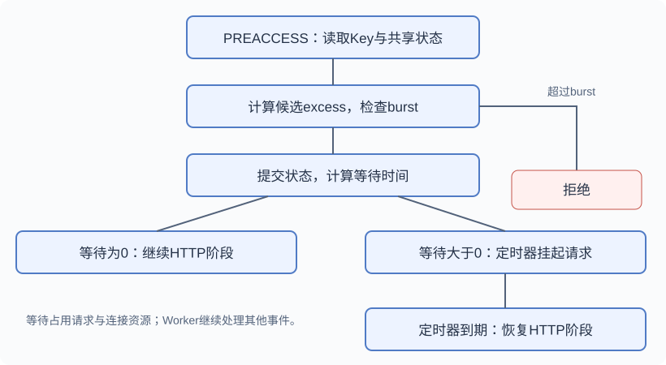
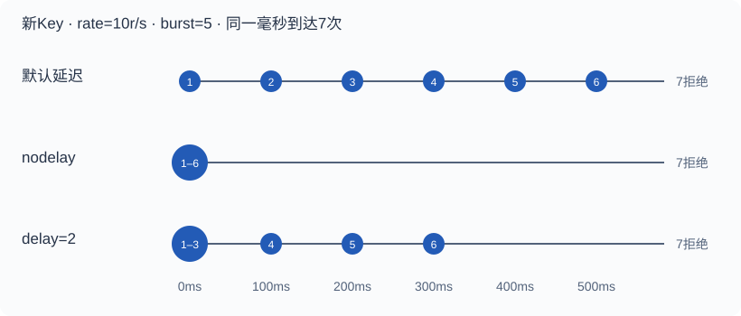

# Nginx限流原理与工程实践

从漏桶的时间记账，到共享内存、异步延迟与多实例边界。本文以开源NGINX1.28.0为固定阅读基线，对照官方文档；固定版本用于解释机制，不代表当前生产选型建议。

## 01 从请求速率到请求负债 {#principle}

### 漏桶控制的对象

`limit_req`通过控制请求的接纳与继续处理节奏，保护入口和上游服务。官方将其归类为漏桶算法，但理解实现时，最有用的模型是**随时间消化的超额请求量excess**。它不统计自然秒内的请求总数，也不统计业务正在执行的任务数。

固定窗口的反例：前一个窗口在0.99秒接纳10个请求，下一个窗口在1.01秒接纳10个请求，每个窗口都满足10次，却在20ms内接纳了20次。按时间差记账可以避免这种窗口切换，但配置允许突发时，仍会出现集中放行。

### 最小代理配置

```nginx
http {
    limit_req_zone $binary_remote_addr zone=perip:10m rate=10r/s;
    server {
        listen 8080;
        location /api/ {
            limit_req zone=perip burst=5;
            limit_req_status 429;
            proxy_pass http://127.0.0.1:9000;
        }
    }
}
```

这里按IP分别限流，10r/s意味着约100ms消化一个请求单位；burst=5允许最多5个超额单位。新Key的首个请求立即通过，其后的超额请求在容量内延迟，超出容量则返回配置的429。**默认拒绝码是503**，429来自显式配置。

zone的10MB保存Key的状态，不是HTTP请求缓存。100个不同IP各自拥有额度，这个规则不能单独约束服务总流量。[官方limit_req文档](https://nginx.org/en/docs/http/ngx_http_limit_req_module.html)



单zone的正常流程；多zone暂存与最终记账见第6节。

## 02 excess的整数运算与状态提交 {#excess}

### 候选超额量与内部单位

源码没有为每个IP安排一个定时扣减任务。请求到达时读取当前毫秒时间，用上次记账时间last计算衰减。对于已经存在的Key，单zone计算可写成：

```text
候选excess = max(0, 旧excess - rate × 经过毫秒 / 1000 + 1000)
候选excess > burst → 拒绝，不提交该候选值
候选excess ≤ burst → 记账，再计算是否需要等待
```

<!-- source-window:lookup -->

[ngx_http_limit_req_lookup：已有Key的计算、拒绝与提交 · 原文件L445—L480](https://github.com/nginx/nginx/blob/481d28cb4e04c8096b9b6134856891dc52ecc68f/src/http/modules/ngx_http_limit_req_module.c#L445-L480)

```c
            ms = (ngx_msec_int_t) (now - lr->last);

            if (ms < -60000) {
                ms = 1;

            } else if (ms < 0) {
                ms = 0;
            }

            excess = lr->excess - ctx->rate * ms / 1000 + 1000;

            if (excess < 0) {
                excess = 0;
            }

            *ep = excess;

            if ((ngx_uint_t) excess > limit->burst) {
                return NGX_BUSY;
            }

            if (account) {
                lr->excess = excess;

                if (ms) {
                    lr->last = now;
                }

                return NGX_OK;
            }

            lr->count++;

            ctx->node = lr;

            return NGX_AGAIN;
```

|量|配置或数学值|内部值|
|---|---|---|
|一个请求单位|1|1000|
|速率|10r/s|10000|
|burst阈值|5|5000|
|delay阈值|2|2000|
|时间差|200ms|200|

把整数舍入暂时省略，已存在Key的公式是`E新=max(0,E旧+1−R×Δt)`，Δt以秒计。E旧=4，经过200ms，R=10，则E新=4+1−2=3。源码采用整数除法；`rate=Nr/m`还会先换算并截断为内部速率，因此纸面公式不是任意参数下的逐位精确结果。

### 新Key、拒绝与时间回退

**这个公式不用于新节点的首个请求。**创建节点时源码直接将`lr->excess=0`。所以全新Key、同一毫秒、burst=5时，是首个请求加5个超额请求，共6个被接纳。长期空闲只会将负债消化到0，不会无限积累可以立即消费的额度。

<!-- source-window:new-node -->

[ngx_http_limit_req_lookup：新节点的首个请求 · 原文件L508—L526](https://github.com/nginx/nginx/blob/481d28cb4e04c8096b9b6134856891dc52ecc68f/src/http/modules/ngx_http_limit_req_module.c#L508-L526)

```c

    lr = (ngx_http_limit_req_node_t *) &node->color;

    lr->len = (u_short) key->len;
    lr->excess = 0;

    ngx_memcpy(lr->data, key->data, key->len);

    ngx_rbtree_insert(&ctx->sh->rbtree, node);

    ngx_queue_insert_head(&ctx->sh->queue, &lr->queue);

    if (account) {
        lr->last = now;
        lr->count = 0;
        return NGX_OK;
    }

    lr->last = 0;
```

单zone拒绝在赋值`lr->excess`之前返回NGX_BUSY。假设已记账excess=5、last=t0，t0时第7次请求的候选值为6，被拒绝，但状态仍是5；t0+100ms再到一个请求，候选值为5+1−1=5，可以接纳。拒绝不会把负债永久推高。查找仍会更新节点在近期访问队列中的位置，因此不能把拒绝理解为完全不触及共享数据。

时间回退也有专门分支：时间差小于−60000ms时按1ms处理，较小负差按0处理。解释正常请求序列时可以忽略这个防御分支，读取完整实现时应保留它。

## 03 rate、burst、nodelay与delay的组合 {#parameters}

### 三种延迟策略

`burst`决定候选超额量的拒绝阈值，`delay`决定其中有多少超额单位可以立即继续。不写delay时阈值为0；`delay=2`表示2个超额单位，而不是2秒。默认burst为0，配置时省略burst即可；不要写`burst=0`或`delay=0`，此版本解析器要求显式数值大于0。

```nginx
# 以下三行是三个独立场景，选择其中一个配置。
limit_req zone=perip burst=5;
limit_req zone=perip burst=5 nodelay;
limit_req zone=perip burst=5 delay=2;
```

对于全新Key，同一毫秒到达7个请求，rate=10r/s、burst=5：

|到达次序|候选excess|默认延迟|nodelay|delay=2|
|---|---|---|---|---|
|1|0|立即|立即|立即|
|2|1|100ms|立即|立即|
|3|2|200ms|立即|立即|
|4|3|300ms|立即|100ms|
|5|4|400ms|立即|200ms|
|6|5|500ms|立即|300ms|
|7|6|拒绝|拒绝|拒绝|

表中的延迟从各请求完成限流判断时算起，是相同到达时刻的理论值；真实事件调度、网络和后端处理会引入偏差，请求完成顺序也不保证等同于到达顺序。

```text
延迟毫秒 = max(0, 内部excess - 内部delay阈值) × 1000 / 内部rate
普通单位：等待秒数 = max(0, E - D) / R
```

<!-- source-window:delay-formula -->

[ngx_http_limit_req_account：最后一项的初始延迟 · 原文件L544—L553](https://github.com/nginx/nginx/blob/481d28cb4e04c8096b9b6134856891dc52ecc68f/src/http/modules/ngx_http_limit_req_module.c#L544-L553)

```c

    excess = *ep;

    if ((ngx_uint_t) excess <= (*limit)->delay) {
        max_delay = 0;

    } else {
        ctx = (*limit)->shm_zone->data;
        max_delay = (excess - (*limit)->delay) * 1000 / ctx->rate;
    }
```

### 突发仍需记账

`nodelay`允许容量内的请求立即处理，但仍然记账。源码将delay设为一个极大阈值，随后同样使用burst判定。6个请求瞬时通过后，负债是5；再到请求仍需等待时间消化出接纳空间。**后端提前执行完毕，不会归还limit_req额度。**

<!-- source-window:nodelay -->

[ngx_http_limit_req：nodelay的阈值解析 · 原文件L1020—L1023](https://github.com/nginx/nginx/blob/481d28cb4e04c8096b9b6134856891dc52ecc68f/src/http/modules/ngx_http_limit_req_module.c#L1020-L1023)

```c
        if (ngx_strcmp(value[i].data, "nodelay") == 0) {
            delay = NGX_MAX_INT_T_VALUE / 1000;
            continue;
        }
```



标号代表同一毫秒内到达的次序；真实调度存在误差。

## 04 延迟通过事件定时器恢复 {#scheduler}

### 限流发生的HTTP阶段

限流处理函数注册在HTTP的PREACCESS阶段。对普通proxy_pass路径，它在向上游发起业务请求前作出判断。这里不能使用`return 200`来验证限流：rewrite阶段可能提前结束请求，根本没有进入PREACCESS。实验应使用代理或确实继续到内容阶段的处理器。

<!-- source-window:phase -->

[ngx_http_limit_req_init：PREACCESS处理函数注册 · 原文件L1086—L1102](https://github.com/nginx/nginx/blob/481d28cb4e04c8096b9b6134856891dc52ecc68f/src/http/modules/ngx_http_limit_req_module.c#L1086-L1102)

```c
static ngx_int_t
ngx_http_limit_req_init(ngx_conf_t *cf)
{
    ngx_http_handler_pt        *h;
    ngx_http_core_main_conf_t  *cmcf;

    cmcf = ngx_http_conf_get_module_main_conf(cf, ngx_http_core_module);

    h = ngx_array_push(&cmcf->phases[NGX_HTTP_PREACCESS_PHASE].handlers);
    if (h == NULL) {
        return NGX_ERROR;
    }

    *h = ngx_http_limit_req_handler;

    return NGX_OK;
}
```

### 挂起与恢复

需要等待时，模块设置请求回调，在连接写事件上标记delayed并调用`ngx_add_timer`，然后返回NGX_AGAIN，暂停此请求的阶段推进。Worker可以继续处理其他连接，没有为这个等待执行阻塞式sleep。

<!-- source-window:timer -->

[ngx_http_limit_req_handler：挂起请求并注册定时器 · 原文件L322—L328](https://github.com/nginx/nginx/blob/481d28cb4e04c8096b9b6134856891dc52ecc68f/src/http/modules/ngx_http_limit_req_module.c#L322-L328)

```c
    r->read_event_handler = ngx_http_test_reading;
    r->write_event_handler = ngx_http_limit_req_delay;

    r->connection->write->delayed = 1;
    ngx_add_timer(r->connection->write, delay);

    return NGX_AGAIN;
```

定时器到期清除事件的delayed标记后，`ngx_http_limit_req_delay`将写处理函数切换为`ngx_http_core_run_phases`，恢复HTTP阶段推进。`r->main->limit_req_status`已设置，重新进入处理函数时可避免重复限流记账。

<!-- source-window:resume -->

[ngx_http_limit_req_delay：恢复HTTP阶段 · 原文件L350—L360](https://github.com/nginx/nginx/blob/481d28cb4e04c8096b9b6134856891dc52ecc68f/src/http/modules/ngx_http_limit_req_module.c#L350-L360)

```c

    if (ngx_handle_read_event(r->connection->read, 0) != NGX_OK) {
        ngx_http_finalize_request(r, NGX_HTTP_INTERNAL_SERVER_ERROR);
        return;
    }

    r->read_event_handler = ngx_http_block_reading;
    r->write_event_handler = ngx_http_core_run_phases;

    ngx_http_core_run_phases(r);
}
```

等待中的请求仍持有连接、请求结构、内存和文件描述符等资源。burst不是一个免费的FIFO缓存容量，模块也没有为每个IP构建保存请求对象的独立FIFO桶。对于默认延迟，满负债时最大理论等待约为`burst/rate`；例如1000/10=100秒，足以耗尽许多客户端的超时预算。

## 05 多Worker共享内存、锁与淘汰 {#shared-state}

### 状态结构与互斥

每个zone包含共享红黑树、近期访问双向队列和slab内存池。各Worker访问同一份状态；共享互斥锁保护查找、节点分配和记账，不会一直持有到上游请求执行结束。

<!-- source-window:lock -->

[ngx_http_limit_req_handler：带共享锁的查找 · 原文件L244—L250](https://github.com/nginx/nginx/blob/481d28cb4e04c8096b9b6134856891dc52ecc68f/src/http/modules/ngx_http_limit_req_module.c#L244-L250)

```c
        hash = ngx_crc32_short(key.data, key.len);

        ngx_shmtx_lock(&ctx->shpool->mutex);

        rc = ngx_http_limit_req_lookup(limit, hash, &key, &excess,
                                       (n == lrcf->limits.nelts - 1));

```

|字段或结构|作用|不能混淆的概念|
|---|---|---|
|hash与原始Key|先按CRC32定位，再比较原始字节和长度|哈希碰撞不会直接合并两个Key|
|last、excess|时间记账和超额负债|不表示业务执行耗时|
|queue|访问后移到队头，尾部用于淘汰|不是等待请求的FIFO队列|
|count|保护多zone流程中暂存待记账的节点|不是正在代理的请求数|
|ctx->node|进程内暂存当前zone待记账节点指针|不是集群级请求状态|

例如单zone、同一时刻excess=4：WorkerA在锁内提交5，WorkerB随后读到5，计算6并拒绝。单zone的状态不会因为有8个Worker就得到8倍独立额度。zone级共享锁也意味着热点Key和高基数流量需要关注锁竞争与内存开销。

### 内存容量与节点淘汰

新Key创建时先执行`expire(ctx,1)`，尝试清除尾部较旧、已无负债且count=0的节点。通常要求至少60秒未记账，一次最多清理两个。分配失败后再调用`expire(ctx,0)`，在count=0的条件下强制淘汰最旧节点，再尝试清理最多两个符合条件的旧节点。如果仍无法分配，返回NGX_ERROR，正常模式按limit_req_status拒绝。**burst没有超过，也可能因状态内存不足而拒绝。**

<!-- source-window:expire -->

[ngx_http_limit_req_expire：淘汰条件 · 原文件L651—L694](https://github.com/nginx/nginx/blob/481d28cb4e04c8096b9b6134856891dc52ecc68f/src/http/modules/ngx_http_limit_req_module.c#L651-L694)

```c

        if (ngx_queue_empty(&ctx->sh->queue)) {
            return;
        }

        q = ngx_queue_last(&ctx->sh->queue);

        lr = ngx_queue_data(q, ngx_http_limit_req_node_t, queue);

        if (lr->count) {

            /*
             * There is not much sense in looking further,
             * because we bump nodes on the lookup stage.
             */

            return;
        }

        if (n++ != 0) {

            ms = (ngx_msec_int_t) (now - lr->last);
            ms = ngx_abs(ms);

            if (ms < 60000) {
                return;
            }

            excess = lr->excess - ctx->rate * ms / 1000;

            if (excess > 0) {
                return;
            }
        }

        ngx_queue_remove(q);

        node = (ngx_rbtree_node_t *)
                   ((u_char *) lr - offsetof(ngx_rbtree_node_t, color));

        ngx_rbtree_delete(&ctx->sh->rbtree, node);

        ngx_slab_free_locked(ctx->shpool, node);
    }
```

官方以二进制IP为Key给出的典型状态占用是32位平台64字节、64位平台128字节，1MB约容纳8千个128字节状态；10MB约8万个是容量估算，实际取决于Key长度和分配开销。节点被淘汰后再次访问会重新创建状态，频繁高基数Key会改变限流连续性，不能把有限zone当作永久历史账本。

## 06 多个zone的判定与记账 {#multi-zone}

### lookup与account的分工

同时配置单IP和虚拟主机总量时，handler依次检查各zone。非最后一个zone通常返回NGX_AGAIN，递增count并暂存ctx->node；最后一个配置项检查成功时可以直接提交。全部通过后，account回头对暂存节点重新计算、记账、递减count，并取各zone要求的**最大等待时间**。

```text
zone A：lookup → 在锁内检查 → 暂存节点，count++
zone B：lookup → 检查并提交最后一项
account：回到A重新取时钟并记账，count--
最终延迟：max(A的等待时间, B的等待时间)
```

### 释放引用与并发边界

如果后续zone拒绝，`ngx_http_limit_req_unlock`减少之前暂存节点的count，清空进程内指针。这是释放节点引用，不是回滚一次后端调用，也不是对所有已经发生的访问行为做事务回滚。

<!-- source-window:account -->

[ngx_http_limit_req_account：暂存节点的最终记账 · 原文件L563—L605](https://github.com/nginx/nginx/blob/481d28cb4e04c8096b9b6134856891dc52ecc68f/src/http/modules/ngx_http_limit_req_module.c#L563-L605)

```c
        ngx_shmtx_lock(&ctx->shpool->mutex);

        now = ngx_current_msec;
        ms = (ngx_msec_int_t) (now - lr->last);

        if (ms < -60000) {
            ms = 1;

        } else if (ms < 0) {
            ms = 0;
        }

        excess = lr->excess - ctx->rate * ms / 1000 + 1000;

        if (excess < 0) {
            excess = 0;
        }

        if (ms) {
            lr->last = now;
        }

        lr->excess = excess;
        lr->count--;

        ngx_shmtx_unlock(&ctx->shpool->mutex);

        ctx->node = NULL;

        if ((ngx_uint_t) excess <= limits[n].delay) {
            continue;
        }

        delay = (excess - limits[n].delay) * 1000 / ctx->rate;

        if (delay > max_delay) {
            max_delay = delay;
            *ep = excess;
            *limit = &limits[n];
        }
    }

    return max_delay;
```

每个zone有自己的互斥锁，检查与最终记账可能分开，整个多zone流程没有持有一把跨zone事务锁。此版本account重新计算后不再次比较burst，并发交错时不能把“多zone都满足规则”升级为任意瞬间严格原子预留的承诺。上线应测实际流量与拒绝比例，而不是把流程图当作强一致事务协议。

## 07 单IP与实例总量的完整配置 {#configuration}

### 完整示例与配置继承

下面是可替换地址后验证的示例，不是某个生产系统的已披露配置。两个zone只在本示例的submit路径被使用：单IP20r/s，当前虚拟主机的submit总量75r/s。若其他location复用相同zone与相同Key，它们也会共享这份额度。

```nginx
worker_processes 2;
events { worker_connections 1024; }
http {
    limit_req_zone $binary_remote_addr zone=submit_ip:10m rate=20r/s;
    limit_req_zone $server_name zone=submit_total:1m rate=75r/s;
    log_format rate_log '$remote_addr pid=$pid "$request" '
                        'status=$status limit=$limit_req_status '
                        'rt=$request_time upstream=$upstream_response_time';
    server {
        listen 8080;
        server_name api.example.test;
        access_log logs/access.log rate_log;
        location = /submit {
            limit_req zone=submit_ip burst=10 nodelay;
            limit_req zone=submit_total burst=15;
            limit_req_status 429;
            limit_req_log_level notice;
            proxy_connect_timeout 2s;
            proxy_read_timeout 5s;
            proxy_pass http://127.0.0.1:9000;
        }
    }
}
```

第一层允许少量同IP突发立即进入后续阶段，第二层仍可能要求延迟；nodelay只作用于配置它的规则。`$server_name`是虚拟主机的配置名称，同一个名称产生同一个Key。一个zone可以容纳多个虚拟主机Key，不能把它自动视为整台机器所有服务的统一总预算。

**继承不是追加。**当前server/location只要定义了自己的limit_req列表，就不会再继承父级limit_req列表。需要两层保护时，应在实际生效的location写全两条规则，并通过`nginx -T`核对最终配置。

### 可信身份与Key选择

有代理或ALB时，必须先恢复可信客户端地址。示例中的文档网段需替换成实际代理范围：

```nginx
# 放在http/server中；仅适用于已启用http_realip_module的构建。
set_real_ip_from 192.0.2.0/24;
real_ip_header X-Forwarded-For;
real_ip_recursive on;
```

只信任受控代理，确认代理如何清理和追加转发头；直接信任用户可伪造的头会让限流可绕过。恢复真实IP后，企业或家庭共享公网出口仍会共享IP预算。用户维度Key应来自认证后的受信任身份，不能直接取任意客户端自报ID。[realip官方文档](https://nginx.org/en/docs/http/ngx_http_realip_module.html)

空Key不会记账，可以用map按明确策略豁免；但也要防止缺少身份意外变成空Key。超过65535字节的Key在此版本会记录错误并跳过该规则，不应让Key长度由不受控的长头部决定。

## 08 dry-run、日志与逐步启用 {#observation}

### 观察状态

首次配置可以在目标location临时启用`limit_req_dry_run on;`，观察真实Key、状态与影响，再决定rate和burst。它不执行实际拒绝或延迟；单zone超额拒绝分支也不会额外提交被拒绝请求的候选excess。因此dry-run是按该模块逻辑运行的观察模式，并不是记录所有到达请求的完整吞吐计数器。

|$limit_req_status|含义|
|---|---|
|PASSED|通过，未要求限流延迟|
|DELAYED|接纳但通过定时器延迟|
|REJECTED|因超额或状态分配失败拒绝|
|DELAYED_DRY_RUN|判断需要延迟，观察模式下立即继续|
|REJECTED_DRY_RUN|判断应拒绝，观察模式下继续|

未命中生效规则、空Key或提前结束的路径可能没有上述状态。HTTP429/503也可能来自上游，必须结合limit状态与error_log判断来源；REJECTED本身也不能区分超额和内存分配失败。

### 指标与参数选择

同时观察每个Key的流量分布、限流状态占比、上游错误率、连接占用和端到端延迟。被延迟的请求会把等待计入request_time，upstream_response_time只覆盖上游交互相关时间；二者不能简单当作同一个指标。多规则情况下状态代表最终请求结果，不提供每个zone独立的完整时间序列。

配额根据后端持续处理能力制定，burst根据短时承载能力制定，delay根据客户端延迟预算制定。对于默认延迟，burst/rate给出满负债的等待估算；增大burst可能减少拒绝，也可能积累大量等待。配置nodelay后，又可能让这批请求同时冲击后端。

## 09 速率、并发与跨实例边界 {#boundaries}

### 请求速率与在途请求

limit_req按时间恢复额度，与请求何时完成无关。若稳态接纳速率λ=150r/s、平均耗时W=0.2秒，Little定律给出的平均在途量L≈λW=30；耗时变成2秒时估算为300。该关系适用于稳定系统的平均值，不是每一瞬间的并发上限，也不能直接用于无限积压中的系统。

|机制|控制维度|边界|
|---|---|---|
|limit_req|请求接纳速率与超额负债|无法感知Java线程或数据库是否饱和|
|limit_conn|满足统计条件的连接/并发请求|只统计已完整读入请求头并处理中的请求；HTTP/2、HTTP/3各并发请求分别计数|
|应用线程池与隔离|业务执行资源|需处理队列容量与拒绝策略|
|超时与熔断|等待时间与故障传播|需匹配重试与幂等策略|

例如在http定义`limit_conn_zone $binary_remote_addr zone=conn_ip:10m;`，再在目标location配置`limit_conn conn_ip 20;`。这是Nginx所定义的统计口径，不能称为20个Java工作线程或20条全部TCP连接。[limit_conn官方文档](https://nginx.org/en/docs/http/ngx_http_limit_conn_module.html)

### 多实例与全局预算

开源标准limit_req的共享内存只在**同一Nginx实例的Worker间**共享。两台实例各75r/s、均衡分流且持续运行时，名义持续接纳能力相加为150r/s；单IP也可能在两台各自获得额度。路由偏斜、扩缩容、Key淘汰和burst会改变观察结果，不能由此保证任意一秒或整个集群严格不超过150次。

如果需要全局预算，应明确作用范围和一致性要求，再选择统一入口、分片配额或集中式原子记账。集中机制还需处理网络延迟、故障时放行/拒绝策略、时钟与重复请求。商业版提供zone同步选项，但同步不应未经验证就被当作强一致全局限流。

## 10 可复现的本地实验 {#experiments}

### 运行方式

随文提供[lab-nginx.conf](./lab-nginx.conf)、[lab.py](./lab.py)和[run-lab.py](./run-lab.py)。实验只监听127.0.0.1，使用两个Worker和独立zone测试默认延迟、nodelay、delay=2、dry-run和双zone。后端是真实HTTP代理目标，不通过rewrite阶段的return模拟。

```bash
# 安装或构建固定版本的nginx后，将路径替换为实际可执行文件。
python3 run-lab.py --nginx /path/to/nginx --output /tmp/nginx-rate-lab
```

脚本检查版本为1.28.0，创建独立临时前缀，运行nginx -t，启动本地后端并并发发出7个请求，写出客户端时间、后端接收时间、状态和Worker PID，最后停止实验进程。各场景使用不同Key；多次运行不会把上次负债误当作新Key。

### 理论预期与实验范围

对于前三个单zone场景，预期各6次成功、1次429；默认等待的成功请求后端接收时间大致分布在0、100、200、300、400、500ms，nodelay集中接收，delay=2大致在0、0、0、100、200、300ms。并发启动存在调度误差，源码表中的“同一毫秒”条件更严格，原始测量值和理论值应分开阅读。

dry-run应让7次请求继续到后端，同时日志出现观察状态。双zone实验验证组合规则的可观察行为，不能凭一次实验证明任意并发交错的强一致性。实验结果及执行范围见[VERIFICATION.md](./VERIFICATION.md)；这里不把步骤或预期写成生产实测。

## 11 源码阅读路线与参考依据 {#references}

### 固定版本与调用链

固定标签release-1.28.0，提交`481d28cb4e04c8096b9b6134856891dc52ecc68f`。本文的源码窗口逐行保留原文，并标注原始行号；本地[完整模块源码](./source/ngx_http_limit_req_module.c)与[许可证](./source/LICENSE)随离线包提供。

### 继续阅读

建议按`init → handler → lookup → account → delay → expire`阅读：先确认执行阶段和返回码，再跟踪Key、候选excess、提交时机、事件恢复和状态淘汰。需要掌握的核心是：**rate消化负债，burst约束接纳，delay控制等待，zone与锁控制状态共享范围。**

- [固定提交的limit_req模块](https://github.com/nginx/nginx/blob/481d28cb4e04c8096b9b6134856891dc52ecc68f/src/http/modules/ngx_http_limit_req_module.c)
- [limit_req官方指令文档](https://nginx.org/en/docs/http/ngx_http_limit_req_module.html)
- [limit_conn官方指令文档](https://nginx.org/en/docs/http/ngx_http_limit_conn_module.html)
- [真实客户端地址配置](https://nginx.org/en/docs/http/ngx_http_realip_module.html)
- [现有NGINX源码手册](https://yisiliang.github.io/nginx/#chapter-15)：继续阅读事件循环、HTTP阶段、连接限制、upstream与输出链。

本文根据“Nginx限流原理”讨论的主题重新组织，经固定源码核对后补齐配置、状态分支和实验材料；所有数值示例均注明条件，公开内容采用技术学习与工程实践表述。
