<a id="top"></a>
# NGINX源码学习手册

> 源码之下，系统之上。沿一条HTTP请求，读懂事件驱动、多进程、反向代理与流量治理的边界。

**固定基线：NGINX开源版1.28.0 · 24章 · 24幅机制图 · 24段真实C源码。**

[自包含离线包](./nginx-offline.zip) · [实验说明](./experiments.md) · [核验记录](./VERIFICATION.md) · [源码许可](./nginx-license.txt) · [来源与范围](./source-notices.txt)

发行标签`release-1.28.0`指向annotated tag对象`f6f8d515885fcda20f09b83583d576337fbabe0a`，解引用后的完整commit为`481d28cb4e04c8096b9b6134856891dc52ecc68f`。所有源码节选和GitHub行号都固定到此commit。它是稳定发行的历史学习基线；本书不宣称它是当前最新版本，也不提供生产版本安全选型结论。

主线是Unix上的HTTP/1.x开源反向代理。HTTP/2、HTTP/3、Windows、商业NGINX Plus、第三方模块与OpenSSL功能边界单独标明。**已执行：源码、节选、页面和离线结构核验；未执行：NGINX配置运行、信号、TLS、压测与系统调用跟踪。**脚本和预期供隔离实验复现。

源码节选连续且逐字取自基线，可能在函数内部开始或结束。图是作者对调用、状态、所有权的解释，不是上游性能承诺；箭头旁的标签区分调用、分支与共享。联网才能访问上游链接，离线阅读、图、目录、搜索、主题和代码复制无需网络。示例无真实业务账号、密钥或生产配置。

## 三轮阅读

|路线|章节|要回答的问题|
|---|---|---|
|生命周期|01—10|进程归谁管理，连接如何恢复，内存何时释放？|
|请求与后端|11—21|解析保存什么状态，phase如何跳转，重试何时禁止？|
|治理与观测|22—24|缓存与限流哪些状态共享，响应失败如何定位？|

## 章节导航

- [01 · 阅读坐标：进程、连接、请求三层对象](#chapter-01)
- [02 · 配置不是每次请求重新解释](#chapter-02)
- [03 · master、信号与worker退出](#chapter-03)
- [04 · reload与二进制热升级](#chapter-04)
- [05 · 事件循环：就绪、投递、超时](#chapter-05)
- [06 · epoll与kqueue：就绪不是完成](#chapter-06)
- [07 · timer红黑树与超时语义](#chapter-07)
- [08 · accept、惊群与接入公平性](#chapter-08)
- [09 · connection池：为什么连接数不等于请求数](#chapter-09)
- [10 · pool、buffer、chain：异步所有权](#chapter-10)
- [11 · HTTP请求行：分片输入与状态保存](#chapter-11)
- [12 · server与location：树查找不是按书写顺序扫描](#chapter-12)
- [13 · phase engine：模块如何组合](#chapter-13)
- [14 · rewrite与内部跳转：重入有预算](#chapter-14)
- [15 · 请求体：buffering与可重放性](#chapter-15)
- [16 · upstream：把后端变成事件状态机](#chapter-16)
- [17 · 负载均衡：平滑加权与失败状态](#chapter-17)
- [18 · 重试：字节重放与业务重复](#chapter-18)
- [19 · 上游keepalive与DNS边界](#chapter-19)
- [20 · proxy buffer与背压：两边速度不一致](#chapter-20)
- [21 · 输出filter与sendfile：剩余链就是进度](#chapter-21)
- [22 · 文件缓存：索引共享，内容在磁盘](#chapter-22)
- [23 · 限流：共享内存漏桶与延迟事件](#chapter-23)
- [24 · TLS、终结与性能诊断](#chapter-24)

<a id="chapter-01"></a>

# 01 · 阅读坐标：进程、连接、请求三层对象

**先画清责任，再进入函数**

NGINX1.28.0是本书的固定阅读基线，不是对最新发行版的声明。范围是开源版HTTP/1.x反向代理的Unix实现，必要时解释HTTP/2、HTTP/3与Windows边界。源码树中`core`放基础对象，`event`放通知、计时与异步传输，`http`放协议和模块，`os/unix`封装进程、系统调用与平台差异。沿目录分类读完代码，仍可能不知道一次请求为何结束；本书选择沿对象生命周期组织。

启动链是`main → ngx_init_cycle → ngx_master_process_cycle → ngx_start_worker_processes → ngx_spawn_process → ngx_worker_process_cycle`。master创建配置周期并管理子进程，worker接入、解析、代理、发送；启用文件缓存时还有cache manager/loader等辅助进程。`ngx_cycle_t`属于一轮配置，`ngx_connection_t`属于一个socket，`ngx_http_request_t`属于一次请求。HTTP/1.x keepalive可以让同一连接串行承载多次请求；HTTP/2、HTTP/3则允许多流，不能将本书HTTP/1.x状态机直接套到每条流的连接管理上。

进程fork后的普通堆内存是各进程的私有地址空间，初始页可以写时复制；变量名称相同不代表后续值共享。`cycle->connections`与空闲链由每个worker分别使用，显式共享内存区、继承的监听socket和内核资源才跨越进程边界。源码中“全局变量”必须先问进程归属，再问是否加锁。

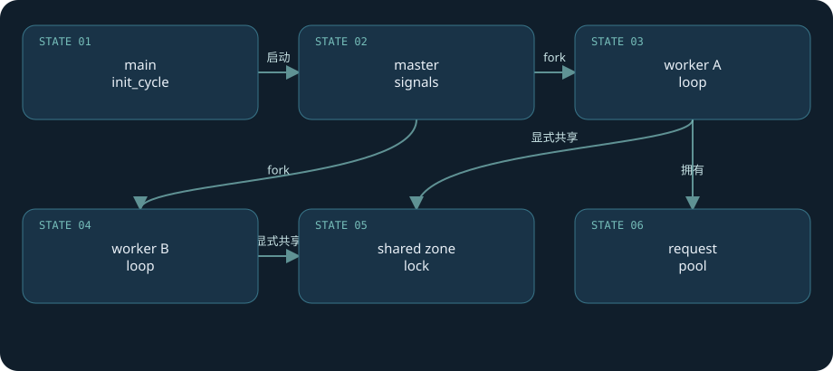

**真实源码：**[src/os/unix/ngx_process_cycle.c · L698—L749](https://github.com/nginx/nginx/blob/481d28cb4e04c8096b9b6134856891dc52ecc68f/src/os/unix/ngx_process_cycle.c#L698-L749)。连续原文，包含所讨论函数的完整分支与边界。

```c
static void
ngx_worker_process_cycle(ngx_cycle_t *cycle, void *data)
{
    ngx_int_t worker = (intptr_t) data;

    ngx_process = NGX_PROCESS_WORKER;
    ngx_worker = worker;

    ngx_worker_process_init(cycle, worker);

    ngx_setproctitle("worker process");

    for ( ;; ) {

        if (ngx_exiting) {
            if (ngx_event_no_timers_left() == NGX_OK) {
                ngx_log_error(NGX_LOG_NOTICE, cycle->log, 0, "exiting");
                ngx_worker_process_exit(cycle);
            }
        }

        ngx_log_debug0(NGX_LOG_DEBUG_EVENT, cycle->log, 0, "worker cycle");

        ngx_process_events_and_timers(cycle);

        if (ngx_terminate) {
            ngx_log_error(NGX_LOG_NOTICE, cycle->log, 0, "exiting");
            ngx_worker_process_exit(cycle);
        }

        if (ngx_quit) {
            ngx_quit = 0;
            ngx_log_error(NGX_LOG_NOTICE, cycle->log, 0,
                          "gracefully shutting down");
            ngx_setproctitle("worker process is shutting down");

            if (!ngx_exiting) {
                ngx_exiting = 1;
                ngx_set_shutdown_timer(cycle);
                ngx_close_listening_sockets(cycle);
                ngx_close_idle_connections(cycle);
                ngx_event_process_posted(cycle, &ngx_posted_events);
            }
        }

        if (ngx_reopen) {
            ngx_reopen = 0;
            ngx_log_error(NGX_LOG_NOTICE, cycle->log, 0, "reopening logs");
            ngx_reopen_files(cycle, -1);
        }
    }
}
```

**读代码：**初始化后没有“一连接一线程”的创建循环。`ngx_process_events_and_timers`接管每轮工作；主事件循环通常在worker主线程上执行，thread pool是特定异步文件任务的补充。第三方模块调用阻塞库，会阻塞该worker上的其他连接。

**失败推演：**一个worker进程崩溃，其现有连接不能自动迁到其他worker；master可以重生进程，但只能承接后续请求。负载均衡的多进程提升隔离程度，不提供请求执行的事务恢复。

**纸面检查：**把“master、worker、共享区、内核socket”各画一个框，逐一放入配置、free_connections、限流计数、listen fd。实验前先执行`nginx -V`确认构建选项，不能凭二进制名称断言包含SSL或stub_status模块。

[返回目录](#top)

<a id="chapter-02"></a>

# 02 · 配置不是每次请求重新解释

**指令表把文本编译成运行期结构**

配置路径`ngx_init_cycle → ngx_conf_parse → ngx_conf_read_token → ngx_conf_handler`把词法片段装进`cf->args`，查模块的`ngx_command_t`指令表。`cmd->type`同时编码允许的上下文、参数数目和是否是block；`cmd->set`才执行具体字段赋值或复杂解析。`http`块入口创建HTTP模块的main/server/location配置数组，各模块按`ctx_index`定位自己的槽位。

因此把`proxy_pass`放进`events`块不是运行时“找不到后端”，而是配置阶段上下文检查失败；缺少分号、括号、参数数目错误也在这里拒绝。简单字符串setter、数值setter与upstream复杂setter承担不同校验。模块的create/merge回调负责创建默认值、合并上层配置；“所有指令无条件继承”并不存在，某些数组只在本层未配置时整体继承。

核心路径最后调用`cmd->set(cf, cmd, conf)`。其中`conf`来自`cf->ctx`和模块索引；指令结构的`offset`供通用setter定位字段。这种结构避免在每次请求中扫描nginx.conf，但也意味着错误模块索引/上下文会写错对象。模块开发者需要理解配置对象的生命周期：它通常随cycle存活，不能把请求pool内存挂进长期配置。

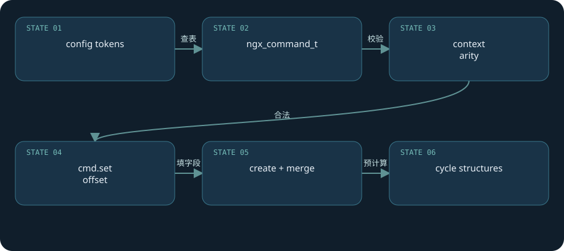

**真实源码：**[src/core/ngx_conf_file.c · L355—L499](https://github.com/nginx/nginx/blob/481d28cb4e04c8096b9b6134856891dc52ecc68f/src/core/ngx_conf_file.c#L355-L499)。连续原文，包含所讨论函数的完整分支与边界。

```c
static ngx_int_t
ngx_conf_handler(ngx_conf_t *cf, ngx_int_t last)
{
    char           *rv;
    void           *conf, **confp;
    ngx_uint_t      i, found;
    ngx_str_t      *name;
    ngx_command_t  *cmd;

    name = cf->args->elts;

    found = 0;

    for (i = 0; cf->cycle->modules[i]; i++) {

        cmd = cf->cycle->modules[i]->commands;
        if (cmd == NULL) {
            continue;
        }

        for ( /* void */ ; cmd->name.len; cmd++) {

            if (name->len != cmd->name.len) {
                continue;
            }

            if (ngx_strcmp(name->data, cmd->name.data) != 0) {
                continue;
            }

            found = 1;

            if (cf->cycle->modules[i]->type != NGX_CONF_MODULE
                && cf->cycle->modules[i]->type != cf->module_type)
            {
                continue;
            }

            /* is the directive's location right ? */

            if (!(cmd->type & cf->cmd_type)) {
                continue;
            }

            if (!(cmd->type & NGX_CONF_BLOCK) && last != NGX_OK) {
                ngx_conf_log_error(NGX_LOG_EMERG, cf, 0,
                                  "directive \"%s\" is not terminated by \";\"",
                                  name->data);
                return NGX_ERROR;
            }

            if ((cmd->type & NGX_CONF_BLOCK) && last != NGX_CONF_BLOCK_START) {
                ngx_conf_log_error(NGX_LOG_EMERG, cf, 0,
                                   "directive \"%s\" has no opening \"{\"",
                                   name->data);
                return NGX_ERROR;
            }

            /* is the directive's argument count right ? */

            if (!(cmd->type & NGX_CONF_ANY)) {

                if (cmd->type & NGX_CONF_FLAG) {

                    if (cf->args->nelts != 2) {
                        goto invalid;
                    }

                } else if (cmd->type & NGX_CONF_1MORE) {

                    if (cf->args->nelts < 2) {
                        goto invalid;
                    }

                } else if (cmd->type & NGX_CONF_2MORE) {

                    if (cf->args->nelts < 3) {
                        goto invalid;
                    }

                } else if (cf->args->nelts > NGX_CONF_MAX_ARGS) {

                    goto invalid;

                } else if (!(cmd->type & argument_number[cf->args->nelts - 1]))
                {
                    goto invalid;
                }
            }

            /* set up the directive's configuration context */

            conf = NULL;

            if (cmd->type & NGX_DIRECT_CONF) {
                conf = ((void **) cf->ctx)[cf->cycle->modules[i]->index];

            } else if (cmd->type & NGX_MAIN_CONF) {
                conf = &(((void **) cf->ctx)[cf->cycle->modules[i]->index]);

            } else if (cf->ctx) {
                confp = *(void **) ((char *) cf->ctx + cmd->conf);

                if (confp) {
                    conf = confp[cf->cycle->modules[i]->ctx_index];
                }
            }

            rv = cmd->set(cf, cmd, conf);

            if (rv == NGX_CONF_OK) {
                return NGX_OK;
            }

            if (rv == NGX_CONF_ERROR) {
                return NGX_ERROR;
            }

            ngx_conf_log_error(NGX_LOG_EMERG, cf, 0,
                               "\"%s\" directive %s", name->data, rv);

            return NGX_ERROR;
        }
    }

    if (found) {
        ngx_conf_log_error(NGX_LOG_EMERG, cf, 0,
                           "\"%s\" directive is not allowed here", name->data);

        return NGX_ERROR;
    }

    ngx_conf_log_error(NGX_LOG_EMERG, cf, 0,
                       "unknown directive \"%s\"", name->data);

    return NGX_ERROR;

invalid:

    ngx_conf_log_error(NGX_LOG_EMERG, cf, 0,
                       "invalid number of arguments in \"%s\" directive",
                       name->data);

    return NGX_ERROR;
}
```

**字段变化：**解析前字段常设为`NGX_CONF_UNSET`；setter写入配置值，merge阶段填缺省或继承上级值，初始化阶段构造hash、location树与phase数组。随后请求通过`r->main_conf / srv_conf / loc_conf`读取对应结构。

**失败后果与实验：**`nginx -t -p "$LAB/" -c conf/nginx.conf`只做配置与资源检查，不证明上游能连接、不证明业务路由正确。把lab中的`proxy_pass`临时移到`http`块，应得到上下文错误；恢复后再测试。`nginx -T`包含配置内容，适合本地虚构实验，不要将真实密钥路径和内网拓扑作为公开教程样本。

**知识回顾：**配置在cycle创建时解析、合并和预计算；请求只切换配置指针。reload是创建新的cycle，而不是在旧配置结构上到处修改字段。

[返回目录](#top)

<a id="chapter-03"></a>

# 03 · master、信号与worker退出

**信号设置意图，主循环执行生命周期操作**

Unix信号处理器根据进程角色设置`ngx_reconfigure、ngx_quit、ngx_terminate、ngx_reopen`等标志。master主循环在合适位置检查这些标志，worker自己的循环也检查退出与日志重开标志。HUP用于重新加载配置，QUIT用于优雅结束，TERM/INT用于快速结束，USR1用于重开日志。不要把给master发HUP与给某个worker发HUP混为一谈。

worker接到QUIT后设置`ngx_exiting`，关闭监听socket和空闲连接，处理已投递事件；下一轮继续运行事件循环，直到非可取消timer等退出条件满足。已有活动请求有机会完成，新连接由其他正常worker接入。若设置`worker_shutdown_timeout`，超时会触发关闭；长连接、慢请求和第三方模块都可能拉长优雅退出过程。

`ngx_terminate`分支直接退出与`ngx_quit`分支不同。快停不是“等待所有请求自然完成”。master负责收集子进程退出状态与重生需要重生的worker；故意退出时不会把每个死亡都按故障重启。所有普通状态属于相应进程，通信使用信号以及worker channel。

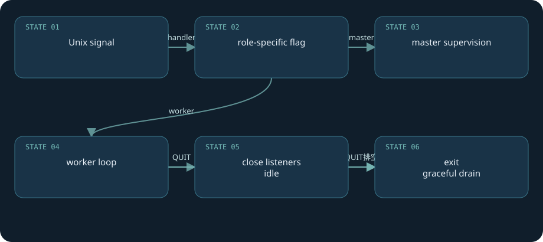

**真实源码：**[src/os/unix/ngx_process_cycle.c · L698—L749](https://github.com/nginx/nginx/blob/481d28cb4e04c8096b9b6134856891dc52ecc68f/src/os/unix/ngx_process_cycle.c#L698-L749)。连续原文，包含所讨论函数的完整分支与边界。

```c
static void
ngx_worker_process_cycle(ngx_cycle_t *cycle, void *data)
{
    ngx_int_t worker = (intptr_t) data;

    ngx_process = NGX_PROCESS_WORKER;
    ngx_worker = worker;

    ngx_worker_process_init(cycle, worker);

    ngx_setproctitle("worker process");

    for ( ;; ) {

        if (ngx_exiting) {
            if (ngx_event_no_timers_left() == NGX_OK) {
                ngx_log_error(NGX_LOG_NOTICE, cycle->log, 0, "exiting");
                ngx_worker_process_exit(cycle);
            }
        }

        ngx_log_debug0(NGX_LOG_DEBUG_EVENT, cycle->log, 0, "worker cycle");

        ngx_process_events_and_timers(cycle);

        if (ngx_terminate) {
            ngx_log_error(NGX_LOG_NOTICE, cycle->log, 0, "exiting");
            ngx_worker_process_exit(cycle);
        }

        if (ngx_quit) {
            ngx_quit = 0;
            ngx_log_error(NGX_LOG_NOTICE, cycle->log, 0,
                          "gracefully shutting down");
            ngx_setproctitle("worker process is shutting down");

            if (!ngx_exiting) {
                ngx_exiting = 1;
                ngx_set_shutdown_timer(cycle);
                ngx_close_listening_sockets(cycle);
                ngx_close_idle_connections(cycle);
                ngx_event_process_posted(cycle, &ngx_posted_events);
            }
        }

        if (ngx_reopen) {
            ngx_reopen = 0;
            ngx_log_error(NGX_LOG_NOTICE, cycle->log, 0, "reopening logs");
            ngx_reopen_files(cycle, -1);
        }
    }
}
```

**调用与状态：**`ngx_signal_handler → ngx_quit=1 → ngx_worker_process_cycle → ngx_exiting=1 → ngx_close_listening_sockets / ngx_close_idle_connections`。对象销毁要在回调仍可能触达它之前建立正确的退出条件，不能只看收到信号的时间。

**实验：**运行lab后，记录`ps`中的master/worker PID，发`nginx -p "$LAB/" -c conf/nginx.conf -s quit`，查看`error.log`里的“gracefully shutting down”和退出记录。实验应只对lab实例操作。先启动lab后端的`/slow`请求再QUIT，可以观察短请求完成；本书未在NGINX进程上实际执行信号实验。

**失败推演：**客户端看见连接断开，只能证明传输结束；不能证明上游没处理POST。优雅退出也不是业务幂等性的替代品。

[返回目录](#top)

<a id="chapter-04"></a>

# 04 · reload与二进制热升级

**两代配置可以重叠，状态迁移有边界**

HUP路径`ngx_master_process_cycle → ngx_init_cycle(old_cycle)`尝试解析新配置、打开文件、准备监听和共享区。创建失败返回NULL时master保留旧cycle并继续服务；创建成功后设置新`ngx_cycle`，启动新worker，再向旧worker发优雅退出信号。新配置接管后续请求，旧worker仍持有自己的配置视图与已有连接。因此reload不是一个瞬间覆盖所有请求的原子配置切换。

旧监听socket在地址和选项允许时可以复用。共享内存区是否复用取决于名字、tag、尺寸、noreuse和模块初始化逻辑；内存池与请求对象不会从老worker搬到新worker。新旧worker短时间并存会提高内存和fd需求。`worker_shutdown_timeout`能限制旧进程拖延，但代价可能是未完成传输终止。

USR2另走`ngx_exec_new_binary`：把监听fd编码到`NGINX`环境变量，启动新可执行文件，旧master的pid文件使用`.oldbin`等标识。新旧master共存，接下来停止老worker、观察新版本、必要时回退，是完整操作序列。它解决监听交接，不能解决模块ABI兼容、业务状态迁移或共享区格式改变。

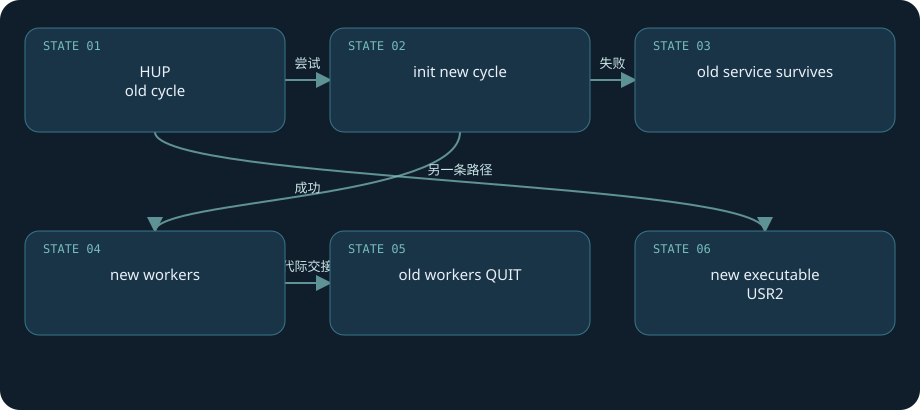

**真实源码：**[src/os/unix/ngx_process_cycle.c · L73—L275](https://github.com/nginx/nginx/blob/481d28cb4e04c8096b9b6134856891dc52ecc68f/src/os/unix/ngx_process_cycle.c#L73-L275)。连续原文，包含所讨论函数的完整分支与边界。

```c
void
ngx_master_process_cycle(ngx_cycle_t *cycle)
{
    char              *title;
    u_char            *p;
    size_t             size;
    ngx_int_t          i;
    ngx_uint_t         sigio;
    sigset_t           set;
    struct itimerval   itv;
    ngx_uint_t         live;
    ngx_msec_t         delay;
    ngx_core_conf_t   *ccf;

    sigemptyset(&set);
    sigaddset(&set, SIGCHLD);
    sigaddset(&set, SIGALRM);
    sigaddset(&set, SIGIO);
    sigaddset(&set, SIGINT);
    sigaddset(&set, ngx_signal_value(NGX_RECONFIGURE_SIGNAL));
    sigaddset(&set, ngx_signal_value(NGX_REOPEN_SIGNAL));
    sigaddset(&set, ngx_signal_value(NGX_NOACCEPT_SIGNAL));
    sigaddset(&set, ngx_signal_value(NGX_TERMINATE_SIGNAL));
    sigaddset(&set, ngx_signal_value(NGX_SHUTDOWN_SIGNAL));
    sigaddset(&set, ngx_signal_value(NGX_CHANGEBIN_SIGNAL));

    if (sigprocmask(SIG_BLOCK, &set, NULL) == -1) {
        ngx_log_error(NGX_LOG_ALERT, cycle->log, ngx_errno,
                      "sigprocmask() failed");
    }

    sigemptyset(&set);


    size = sizeof(master_process);

    for (i = 0; i < ngx_argc; i++) {
        size += ngx_strlen(ngx_argv[i]) + 1;
    }

    title = ngx_pnalloc(cycle->pool, size);
    if (title == NULL) {
        /* fatal */
        exit(2);
    }

    p = ngx_cpymem(title, master_process, sizeof(master_process) - 1);
    for (i = 0; i < ngx_argc; i++) {
        *p++ = ' ';
        p = ngx_cpystrn(p, (u_char *) ngx_argv[i], size);
    }

    ngx_setproctitle(title);


    ccf = (ngx_core_conf_t *) ngx_get_conf(cycle->conf_ctx, ngx_core_module);

    ngx_start_worker_processes(cycle, ccf->worker_processes,
                               NGX_PROCESS_RESPAWN);
    ngx_start_cache_manager_processes(cycle, 0);

    ngx_new_binary = 0;
    delay = 0;
    sigio = 0;
    live = 1;

    for ( ;; ) {
        if (delay) {
            if (ngx_sigalrm) {
                sigio = 0;
                delay *= 2;
                ngx_sigalrm = 0;
            }

            ngx_log_debug1(NGX_LOG_DEBUG_EVENT, cycle->log, 0,
                           "termination cycle: %M", delay);

            itv.it_interval.tv_sec = 0;
            itv.it_interval.tv_usec = 0;
            itv.it_value.tv_sec = delay / 1000;
            itv.it_value.tv_usec = (delay % 1000 ) * 1000;

            if (setitimer(ITIMER_REAL, &itv, NULL) == -1) {
                ngx_log_error(NGX_LOG_ALERT, cycle->log, ngx_errno,
                              "setitimer() failed");
            }
        }

        ngx_log_debug0(NGX_LOG_DEBUG_EVENT, cycle->log, 0, "sigsuspend");

        sigsuspend(&set);

        ngx_time_update();

        ngx_log_debug1(NGX_LOG_DEBUG_EVENT, cycle->log, 0,
                       "wake up, sigio %i", sigio);

        if (ngx_reap) {
            ngx_reap = 0;
            ngx_log_debug0(NGX_LOG_DEBUG_EVENT, cycle->log, 0, "reap children");

            live = ngx_reap_children(cycle);
        }

        if (!live && (ngx_terminate || ngx_quit)) {
            ngx_master_process_exit(cycle);
        }

        if (ngx_terminate) {
            if (delay == 0) {
                delay = 50;
            }

            if (sigio) {
                sigio--;
                continue;
            }

            sigio = ccf->worker_processes + 2 /* cache processes */;

            if (delay > 1000) {
                ngx_signal_worker_processes(cycle, SIGKILL);
            } else {
                ngx_signal_worker_processes(cycle,
                                       ngx_signal_value(NGX_TERMINATE_SIGNAL));
            }

            continue;
        }

        if (ngx_quit) {
            ngx_signal_worker_processes(cycle,
                                        ngx_signal_value(NGX_SHUTDOWN_SIGNAL));
            ngx_close_listening_sockets(cycle);

            continue;
        }

        if (ngx_reconfigure) {
            ngx_reconfigure = 0;

            if (ngx_new_binary) {
                ngx_start_worker_processes(cycle, ccf->worker_processes,
                                           NGX_PROCESS_RESPAWN);
                ngx_start_cache_manager_processes(cycle, 0);
                ngx_noaccepting = 0;

                continue;
            }

            ngx_log_error(NGX_LOG_NOTICE, cycle->log, 0, "reconfiguring");

            cycle = ngx_init_cycle(cycle);
            if (cycle == NULL) {
                cycle = (ngx_cycle_t *) ngx_cycle;
                continue;
            }

            ngx_cycle = cycle;
            ccf = (ngx_core_conf_t *) ngx_get_conf(cycle->conf_ctx,
                                                   ngx_core_module);
            ngx_start_worker_processes(cycle, ccf->worker_processes,
                                       NGX_PROCESS_JUST_RESPAWN);
            ngx_start_cache_manager_processes(cycle, 1);

            /* allow new processes to start */
            ngx_msleep(100);

            live = 1;
            ngx_signal_worker_processes(cycle,
                                        ngx_signal_value(NGX_SHUTDOWN_SIGNAL));
        }

        if (ngx_restart) {
            ngx_restart = 0;
            ngx_start_worker_processes(cycle, ccf->worker_processes,
                                       NGX_PROCESS_RESPAWN);
            ngx_start_cache_manager_processes(cycle, 0);
            live = 1;
        }

        if (ngx_reopen) {
            ngx_reopen = 0;
            ngx_log_error(NGX_LOG_NOTICE, cycle->log, 0, "reopening logs");
            ngx_reopen_files(cycle, ccf->user);
            ngx_signal_worker_processes(cycle,
                                        ngx_signal_value(NGX_REOPEN_SIGNAL));
        }

        if (ngx_change_binary) {
            ngx_change_binary = 0;
            ngx_log_error(NGX_LOG_NOTICE, cycle->log, 0, "changing binary");
            ngx_new_binary = ngx_exec_new_binary(cycle, ngx_argv);
        }

        if (ngx_noaccept) {
            ngx_noaccept = 0;
            ngx_noaccepting = 1;
            ngx_signal_worker_processes(cycle,
                                        ngx_signal_value(NGX_SHUTDOWN_SIGNAL));
        }
    }
}
```

**第二证据：**[`ngx_exec_new_binary · L728–L740`](https://github.com/nginx/nginx/blob/481d28cb4e04c8096b9b6134856891dc52ecc68f/src/core/nginx.c#L728-L740)逐个收集监听fd。可执行文件升级是独立机制，不能用一次`-s reload`替代。

**实验：**lab中更改`/version`的返回字符串，先`-t`，再`-s reload`，随后用新的curl连接读取新值；同时保留之前的`/slow`传输，观察旧worker排空。将端口改为不允许绑定的地址或制造语法错误，比较`-t`失败与error日志。NGINX实际reload还可能受资源、权限变化影响，预检查通过仍不是成功证据。

**官方规则依据：**[Controlling nginx](https://nginx.org/en/docs/control.html)。文档是滚动页，版本行为应以本书固定C源码为最终核对对象。

[返回目录](#top)

<a id="chapter-05"></a>

# 05 · 事件循环：就绪、投递、超时

**一个循环有明确的调度顺序**

事件循环并非“epoll拿到列表后挨个执行”这么短。`ngx_process_events_and_timers`先找最近timer，处理accept mutex与next posted事件，调用事件后端，再处理posted accept事件、解锁accept mutex、到期timer和普通posted事件。`ngx_posted_next_events`非空时会让本轮等待超时为0，以便让延期到下一轮的任务继续推进。

`ngx_event_t`将read/write事件、handler、ready、active、timedout、delayed、timer_set、instance等状态放在一起。`active`表示向通知系统注册，不等于“当前有数据”；`ready`表示本轮可尝试I/O，不保证一次能处理完；`timedout`由timer路径设置。不同模块更换handler意味着同一事件对象进入新的协议阶段。

事件后端可以当场执行handler，也可以通过`NGX_POST_EVENTS`投递队列。投递不是开新线程，只是推迟到worker循环的另一个阶段。这提供accept锁期间与普通请求处理的顺序边界，也减少特定递归/重入场景。异步的关键是保存对象与进度，等待事件恢复，而不是把每个callback都当作并发线程。

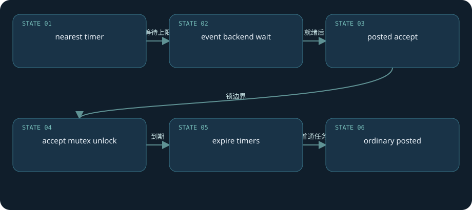

**真实源码：**[src/event/ngx_event.c · L194—L264](https://github.com/nginx/nginx/blob/481d28cb4e04c8096b9b6134856891dc52ecc68f/src/event/ngx_event.c#L194-L264)。连续原文，包含所讨论函数的完整分支与边界。

```c
void
ngx_process_events_and_timers(ngx_cycle_t *cycle)
{
    ngx_uint_t  flags;
    ngx_msec_t  timer, delta;

    if (ngx_timer_resolution) {
        timer = NGX_TIMER_INFINITE;
        flags = 0;

    } else {
        timer = ngx_event_find_timer();
        flags = NGX_UPDATE_TIME;

#if (NGX_WIN32)

        /* handle signals from master in case of network inactivity */

        if (timer == NGX_TIMER_INFINITE || timer > 500) {
            timer = 500;
        }

#endif
    }

    if (ngx_use_accept_mutex) {
        if (ngx_accept_disabled > 0) {
            ngx_accept_disabled--;

        } else {
            if (ngx_trylock_accept_mutex(cycle) == NGX_ERROR) {
                return;
            }

            if (ngx_accept_mutex_held) {
                flags |= NGX_POST_EVENTS;

            } else {
                if (timer == NGX_TIMER_INFINITE
                    || timer > ngx_accept_mutex_delay)
                {
                    timer = ngx_accept_mutex_delay;
                }
            }
        }
    }

    if (!ngx_queue_empty(&ngx_posted_next_events)) {
        ngx_event_move_posted_next(cycle);
        timer = 0;
    }

    delta = ngx_current_msec;

    (void) ngx_process_events(cycle, timer, flags);

    delta = ngx_current_msec - delta;

    ngx_log_debug1(NGX_LOG_DEBUG_EVENT, cycle->log, 0,
                   "timer delta: %M", delta);

    ngx_event_process_posted(cycle, &ngx_posted_accept_events);

    if (ngx_accept_mutex_held) {
        ngx_shmtx_unlock(&ngx_accept_mutex);
    }

    ngx_event_expire_timers();

    ngx_event_process_posted(cycle, &ngx_posted_events);
}
```

**完整链：**`worker loop → find_timer → ngx_process_events → epoll/kqueue handler → posted_accept → expire_timers → posted_events`。框图是调度顺序，并不意味着每轮所有分支都有工作。

**失败后果：**handler做CPU密集计算、同步DNS或阻塞文件读取时，该worker后面的所有事件和timer都延后；timer并没有独立抢占线程。增大`worker_connections`只增加容纳量，不会消除阻塞。

**实验：**在包含debug能力的隔离构建中设置`error_log ... debug`，观察“worker cycle / event timer / http”的时间顺序；debug日志本身会改变I/O负载。生产诊断更适合第24章的时延分段。本文仅验证源码路径，未测吞吐或延迟。

[返回目录](#top)

<a id="chapter-06"></a>

# 06 · epoll与kqueue：就绪不是完成

**平台适配共享事件抽象**

Linux路径由`ngx_epoll_process_events`调用`epoll_wait`，将内核返回的数据指针还原为connection，并校验fd与`instance`。回收connection槽位时read/write事件instance翻转，避免同一轮中旧socket的陈旧通知误处理复用槽位的新连接。仅比较fd数字不够：操作系统能快速复用fd。

epoll实现设置clear-event能力，对普通连接的注册路径使用边沿通知语义；监听socket还涉及EPOLLEXCLUSIVE、reuseport等独立分支，不能宣称所有fd都使用完全相同flag。handler应读取/写入直到EAGAIN或业务/调度边界，再正确重新注册或保留事件。当本地buffer已满时，不能无限读取；要保持进度并让消费者推进。

BSD/macOS的kqueue后端用`kevent`、EV_CLEAR等flag，也能提供EOF和可用量信息；Linux常将`rev->available=-1`作为未知。代码通过`ngx_event_flags`分辨能力并选择行为，平台差异仍会渗入accept、read、sendfile路径。Windows有独立进程与I/O代码，本书Unix分析不适用于它。

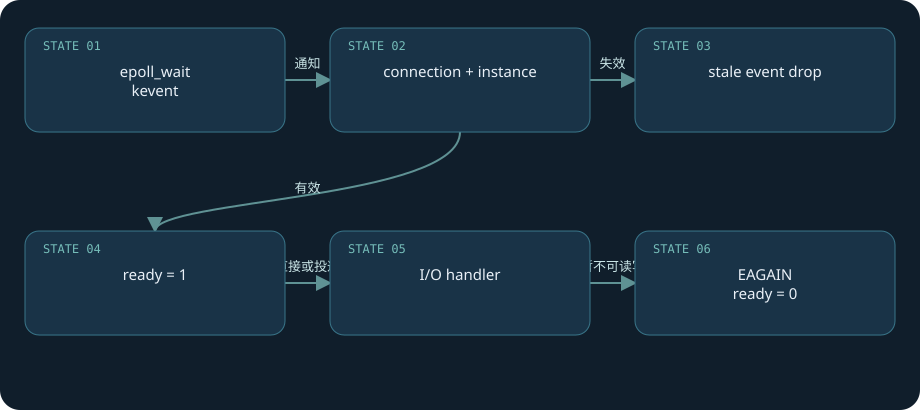

**真实源码：**[src/event/modules/ngx_epoll_module.c · L783—L936](https://github.com/nginx/nginx/blob/481d28cb4e04c8096b9b6134856891dc52ecc68f/src/event/modules/ngx_epoll_module.c#L783-L936)。连续原文，包含所讨论函数的完整分支与边界。

```c
static ngx_int_t
ngx_epoll_process_events(ngx_cycle_t *cycle, ngx_msec_t timer, ngx_uint_t flags)
{
    int                events;
    uint32_t           revents;
    ngx_int_t          instance, i;
    ngx_uint_t         level;
    ngx_err_t          err;
    ngx_event_t       *rev, *wev;
    ngx_queue_t       *queue;
    ngx_connection_t  *c;

    /* NGX_TIMER_INFINITE == INFTIM */

    ngx_log_debug1(NGX_LOG_DEBUG_EVENT, cycle->log, 0,
                   "epoll timer: %M", timer);

    events = epoll_wait(ep, event_list, (int) nevents, timer);

    err = (events == -1) ? ngx_errno : 0;

    if (flags & NGX_UPDATE_TIME || ngx_event_timer_alarm) {
        ngx_time_update();
    }

    if (err) {
        if (err == NGX_EINTR) {

            if (ngx_event_timer_alarm) {
                ngx_event_timer_alarm = 0;
                return NGX_OK;
            }

            level = NGX_LOG_INFO;

        } else {
            level = NGX_LOG_ALERT;
        }

        ngx_log_error(level, cycle->log, err, "epoll_wait() failed");
        return NGX_ERROR;
    }

    if (events == 0) {
        if (timer != NGX_TIMER_INFINITE) {
            return NGX_OK;
        }

        ngx_log_error(NGX_LOG_ALERT, cycle->log, 0,
                      "epoll_wait() returned no events without timeout");
        return NGX_ERROR;
    }

    for (i = 0; i < events; i++) {
        c = event_list[i].data.ptr;

        instance = (uintptr_t) c & 1;
        c = (ngx_connection_t *) ((uintptr_t) c & (uintptr_t) ~1);

        rev = c->read;

        if (c->fd == -1 || rev->instance != instance) {

            /*
             * the stale event from a file descriptor
             * that was just closed in this iteration
             */

            ngx_log_debug1(NGX_LOG_DEBUG_EVENT, cycle->log, 0,
                           "epoll: stale event %p", c);
            continue;
        }

        revents = event_list[i].events;

        ngx_log_debug3(NGX_LOG_DEBUG_EVENT, cycle->log, 0,
                       "epoll: fd:%d ev:%04XD d:%p",
                       c->fd, revents, event_list[i].data.ptr);

        if (revents & (EPOLLERR|EPOLLHUP)) {
            ngx_log_debug2(NGX_LOG_DEBUG_EVENT, cycle->log, 0,
                           "epoll_wait() error on fd:%d ev:%04XD",
                           c->fd, revents);

            /*
             * if the error events were returned, add EPOLLIN and EPOLLOUT
             * to handle the events at least in one active handler
             */

            revents |= EPOLLIN|EPOLLOUT;
        }

#if 0
        if (revents & ~(EPOLLIN|EPOLLOUT|EPOLLERR|EPOLLHUP)) {
            ngx_log_error(NGX_LOG_ALERT, cycle->log, 0,
                          "strange epoll_wait() events fd:%d ev:%04XD",
                          c->fd, revents);
        }
#endif

        if ((revents & EPOLLIN) && rev->active) {

#if (NGX_HAVE_EPOLLRDHUP)
            if (revents & EPOLLRDHUP) {
                rev->pending_eof = 1;
            }
#endif

            rev->ready = 1;
            rev->available = -1;

            if (flags & NGX_POST_EVENTS) {
                queue = rev->accept ? &ngx_posted_accept_events
                                    : &ngx_posted_events;

                ngx_post_event(rev, queue);

            } else {
                rev->handler(rev);
            }
        }

        wev = c->write;

        if ((revents & EPOLLOUT) && wev->active) {

            if (c->fd == -1 || wev->instance != instance) {

                /*
                 * the stale event from a file descriptor
                 * that was just closed in this iteration
                 */

                ngx_log_debug1(NGX_LOG_DEBUG_EVENT, cycle->log, 0,
                               "epoll: stale event %p", c);
                continue;
            }

            wev->ready = 1;
#if (NGX_THREADS)
            wev->complete = 1;
#endif

            if (flags & NGX_POST_EVENTS) {
                ngx_post_event(wev, &ngx_posted_events);

            } else {
                wev->handler(wev);
            }
        }
    }

    return NGX_OK;
}
```

**状态推进：**epoll通知后设置`rev->ready=1`，调用或投递handler；recv遇EAGAIN将ready清零并等待未来通知。这是“就绪驱动”，不像完成端口直接宣布某个提交的读操作已完成。

**失败推演：**边沿模式中只读一小段便无条件忘掉剩余数据，可能等不到新的边沿；反过来不停忽略EAGAIN会造成忙等。自定义模块必须遵守NGINX事件辅助函数的返回和能力标志。

**平台实验：**在Linux看`nginx -V`与启动notice里的“using the epoll event method”；在macOS通常应是kqueue，除非显式构建/选择其他后端。可用Linux `strace -f -e epoll_wait,epoll_ctl,accept4,recvfrom,sendfile`仅附着lab实例。本书没有执行平台系统调用跟踪，不据此给跨平台性能结论。

[返回目录](#top)

<a id="chapter-07"></a>

# 07 · timer红黑树与超时语义

**timeout是事件间隔，触发仍靠循环**

计时不是为每条连接建立线程。`ngx_event_add_timer`用`ngx_current_msec + timer`构造key，将事件内嵌的红黑树节点插入全局timer树；`ngx_event_find_timer`取最小key，作为事件等待上限。到期处理反复取最小节点，删除节点、清timer_set、设timedout，然后调用原handler。此“全局”仍是在一个worker的普通内存里。

`timer_set`防止同一节点重复插入。更新timer时，差值小于`NGX_TIMER_LAZY_DELAY`可以保留旧值，减少树操作；固定源码宏为300ms，因此不能拿debug日志里的timer更新时间当作每字节严格重设的合同。毫秒差用有符号差值比较以处理正常计时范围内的wrap，墙钟变化也需结合NGINX时间缓存实现读。

`proxy_read_timeout`控制从上游两次成功读取间隔，`send_timeout`控制向客户端两次写之间的间隔，`proxy_connect_timeout`属于连接阶段。它们不是整个业务请求的统一截止时间。上游每隔一小段时间发送数据，可能让传输远长于read_timeout；而worker阻塞会让到期回调实际执行晚于key。

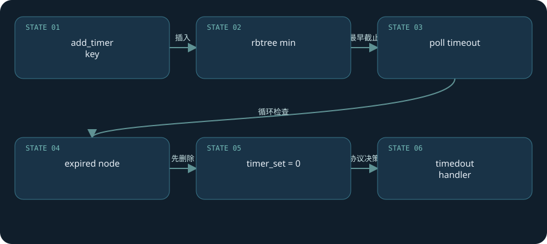

**真实源码：**[src/event/ngx_event_timer.c · L53—L96](https://github.com/nginx/nginx/blob/481d28cb4e04c8096b9b6134856891dc52ecc68f/src/event/ngx_event_timer.c#L53-L96)。连续原文，包含所讨论函数的完整分支与边界。

```c
void
ngx_event_expire_timers(void)
{
    ngx_event_t        *ev;
    ngx_rbtree_node_t  *node, *root, *sentinel;

    sentinel = ngx_event_timer_rbtree.sentinel;

    for ( ;; ) {
        root = ngx_event_timer_rbtree.root;

        if (root == sentinel) {
            return;
        }

        node = ngx_rbtree_min(root, sentinel);

        /* node->key > ngx_current_msec */

        if ((ngx_msec_int_t) (node->key - ngx_current_msec) > 0) {
            return;
        }

        ev = ngx_rbtree_data(node, ngx_event_t, timer);

        ngx_log_debug2(NGX_LOG_DEBUG_EVENT, ev->log, 0,
                       "event timer del: %d: %M",
                       ngx_event_ident(ev->data), ev->timer.key);

        ngx_rbtree_delete(&ngx_event_timer_rbtree, &ev->timer);

#if (NGX_DEBUG)
        ev->timer.left = NULL;
        ev->timer.right = NULL;
        ev->timer.parent = NULL;
#endif

        ev->timer_set = 0;

        ev->timedout = 1;

        ev->handler(ev);
    }
}
```

**完整链：**上游header/body handler或客户端writer添加timer → 事件循环使用最近截止 → expire_timers设`timedout` → 相应handler选择504、断连或其他清理。错误码是具体协议分支的决定，不是timer统一返回504。

**实验：**lab的`/slow?gap=2`每块间隔2秒；配置`proxy_read_timeout 1s`应在读等待期间超时。换为`gap=0.2`，即使整体传输超过1秒也可能继续完成。若已将响应头写给客户端，则后续超时通常表现为截断，不能重新发一个干净的504响应。

**证据定位：**[`ngx_event_add_timer · L56–L86`](https://github.com/nginx/nginx/blob/481d28cb4e04c8096b9b6134856891dc52ecc68f/src/event/ngx_event_timer.h#L56-L86)。测试时必须同时看curl exit code、收到字节数和error日志。

[返回目录](#top)

<a id="chapter-08"></a>

# 08 · accept、惊群与接入公平性

**监听竞争与连接容量分别治理**

worker继承监听socket，内核新连接进入监听队列后触发accept handler。`ngx_event_accept`在支持时使用`accept4(...SOCK_NONBLOCK)`；ENOSYS会退回accept路径，并另外处理非阻塞设置。EAGAIN意味着此时队列取空，并非一次业务失败。ECONNABORTED、EMFILE、ENFILE有不同日志等级与恢复处理。

接入竞争有多种机制：accept mutex协调worker监听事件注册；支持的Linux可使用EPOLLEXCLUSIVE减少同时唤醒；`listen ... reuseport`给worker各自socket并由内核分配。`accept_mutex`在本基线默认off，不能用古老版本的“所有worker必抢一把accept锁”解释现代配置。多种机制的有效组合取决于构建、系统和配置。

`ngx_accept_disabled = connection_n/8 - free_connection_n`反映本worker的剩余槽位，用来短期减少其接入机会。`multi_accept`决定一次通知接入多少连接，kqueue可用量还有后端专属分支。大量accept也可能拖延已接入连接的业务处理，公平性需要看真实负载，而不是一味打开所有吞吐开关。

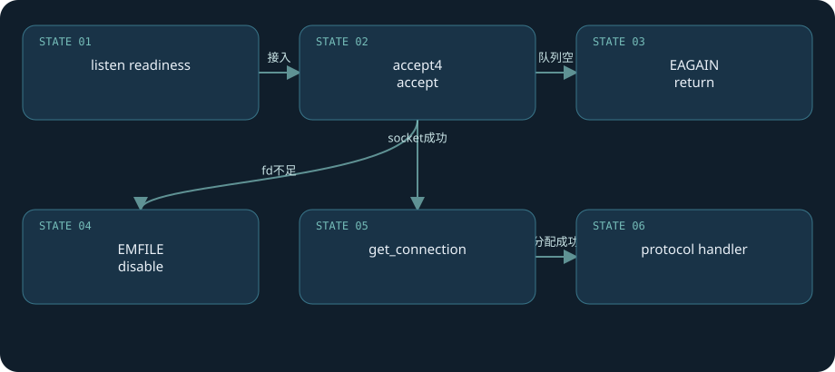

**真实源码：**[src/event/ngx_event_accept.c · L20—L324](https://github.com/nginx/nginx/blob/481d28cb4e04c8096b9b6134856891dc52ecc68f/src/event/ngx_event_accept.c#L20-L324)。连续原文，包含所讨论函数的完整分支与边界。

```c
void
ngx_event_accept(ngx_event_t *ev)
{
    socklen_t          socklen;
    ngx_err_t          err;
    ngx_log_t         *log;
    ngx_uint_t         level;
    ngx_socket_t       s;
    ngx_event_t       *rev, *wev;
    ngx_sockaddr_t     sa;
    ngx_listening_t   *ls;
    ngx_connection_t  *c, *lc;
    ngx_event_conf_t  *ecf;
#if (NGX_HAVE_ACCEPT4)
    static ngx_uint_t  use_accept4 = 1;
#endif

    if (ev->timedout) {
        if (ngx_enable_accept_events((ngx_cycle_t *) ngx_cycle) != NGX_OK) {
            return;
        }

        ev->timedout = 0;
    }

    ecf = ngx_event_get_conf(ngx_cycle->conf_ctx, ngx_event_core_module);

    if (!(ngx_event_flags & NGX_USE_KQUEUE_EVENT)) {
        ev->available = ecf->multi_accept;
    }

    lc = ev->data;
    ls = lc->listening;
    ev->ready = 0;

    ngx_log_debug2(NGX_LOG_DEBUG_EVENT, ev->log, 0,
                   "accept on %V, ready: %d", &ls->addr_text, ev->available);

    do {
        socklen = sizeof(ngx_sockaddr_t);

#if (NGX_HAVE_ACCEPT4)
        if (use_accept4) {
            s = accept4(lc->fd, &sa.sockaddr, &socklen, SOCK_NONBLOCK);
        } else {
            s = accept(lc->fd, &sa.sockaddr, &socklen);
        }
#else
        s = accept(lc->fd, &sa.sockaddr, &socklen);
#endif

        if (s == (ngx_socket_t) -1) {
            err = ngx_socket_errno;

            if (err == NGX_EAGAIN) {
                ngx_log_debug0(NGX_LOG_DEBUG_EVENT, ev->log, err,
                               "accept() not ready");
                return;
            }

            level = NGX_LOG_ALERT;

            if (err == NGX_ECONNABORTED) {
                level = NGX_LOG_ERR;

            } else if (err == NGX_EMFILE || err == NGX_ENFILE) {
                level = NGX_LOG_CRIT;
            }

#if (NGX_HAVE_ACCEPT4)
            ngx_log_error(level, ev->log, err,
                          use_accept4 ? "accept4() failed" : "accept() failed");

            if (use_accept4 && err == NGX_ENOSYS) {
                use_accept4 = 0;
                ngx_inherited_nonblocking = 0;
                continue;
            }
#else
            ngx_log_error(level, ev->log, err, "accept() failed");
#endif

            if (err == NGX_ECONNABORTED) {
                if (ngx_event_flags & NGX_USE_KQUEUE_EVENT) {
                    ev->available--;
                }

                if (ev->available) {
                    continue;
                }
            }

            if (err == NGX_EMFILE || err == NGX_ENFILE) {
                if (ngx_disable_accept_events((ngx_cycle_t *) ngx_cycle, 1)
                    != NGX_OK)
                {
                    return;
                }

                if (ngx_use_accept_mutex) {
                    if (ngx_accept_mutex_held) {
                        ngx_shmtx_unlock(&ngx_accept_mutex);
                        ngx_accept_mutex_held = 0;
                    }

                    ngx_accept_disabled = 1;

                } else {
                    ngx_add_timer(ev, ecf->accept_mutex_delay);
                }
            }

            return;
        }

#if (NGX_STAT_STUB)
        (void) ngx_atomic_fetch_add(ngx_stat_accepted, 1);
#endif

        ngx_accept_disabled = ngx_cycle->connection_n / 8
                              - ngx_cycle->free_connection_n;

        c = ngx_get_connection(s, ev->log);

        if (c == NULL) {
            if (ngx_close_socket(s) == -1) {
                ngx_log_error(NGX_LOG_ALERT, ev->log, ngx_socket_errno,
                              ngx_close_socket_n " failed");
            }

            return;
        }

        c->type = SOCK_STREAM;

#if (NGX_STAT_STUB)
        (void) ngx_atomic_fetch_add(ngx_stat_active, 1);
#endif

        c->pool = ngx_create_pool(ls->pool_size, ev->log);
        if (c->pool == NULL) {
            ngx_close_accepted_connection(c);
            return;
        }

        if (socklen > (socklen_t) sizeof(ngx_sockaddr_t)) {
            socklen = sizeof(ngx_sockaddr_t);
        }

        c->sockaddr = ngx_palloc(c->pool, socklen);
        if (c->sockaddr == NULL) {
            ngx_close_accepted_connection(c);
            return;
        }

        ngx_memcpy(c->sockaddr, &sa, socklen);

        log = ngx_palloc(c->pool, sizeof(ngx_log_t));
        if (log == NULL) {
            ngx_close_accepted_connection(c);
            return;
        }

        /* set a blocking mode for iocp and non-blocking mode for others */

        if (ngx_inherited_nonblocking) {
            if (ngx_event_flags & NGX_USE_IOCP_EVENT) {
                if (ngx_blocking(s) == -1) {
                    ngx_log_error(NGX_LOG_ALERT, ev->log, ngx_socket_errno,
                                  ngx_blocking_n " failed");
                    ngx_close_accepted_connection(c);
                    return;
                }
            }

        } else {
            if (!(ngx_event_flags & NGX_USE_IOCP_EVENT)) {
                if (ngx_nonblocking(s) == -1) {
                    ngx_log_error(NGX_LOG_ALERT, ev->log, ngx_socket_errno,
                                  ngx_nonblocking_n " failed");
                    ngx_close_accepted_connection(c);
                    return;
                }
            }
        }

        *log = ls->log;

        c->recv = ngx_recv;
        c->send = ngx_send;
        c->recv_chain = ngx_recv_chain;
        c->send_chain = ngx_send_chain;

        c->log = log;
        c->pool->log = log;

        c->socklen = socklen;
        c->listening = ls;
        c->local_sockaddr = ls->sockaddr;
        c->local_socklen = ls->socklen;

#if (NGX_HAVE_UNIX_DOMAIN)
        if (c->sockaddr->sa_family == AF_UNIX) {
            c->tcp_nopush = NGX_TCP_NOPUSH_DISABLED;
            c->tcp_nodelay = NGX_TCP_NODELAY_DISABLED;
#if (NGX_SOLARIS)
            /* Solaris's sendfilev() supports AF_NCA, AF_INET, and AF_INET6 */
            c->sendfile = 0;
#endif
        }
#endif

        rev = c->read;
        wev = c->write;

        wev->ready = 1;

        if (ngx_event_flags & NGX_USE_IOCP_EVENT) {
            rev->ready = 1;
        }

        if (ev->deferred_accept) {
            rev->ready = 1;
#if (NGX_HAVE_KQUEUE || NGX_HAVE_EPOLLRDHUP)
            rev->available = 1;
#endif
        }

        rev->log = log;
        wev->log = log;

        /*
         * TODO: MT: - ngx_atomic_fetch_add()
         *             or protection by critical section or light mutex
         *
         * TODO: MP: - allocated in a shared memory
         *           - ngx_atomic_fetch_add()
         *             or protection by critical section or light mutex
         */

        c->number = ngx_atomic_fetch_add(ngx_connection_counter, 1);

        c->start_time = ngx_current_msec;

#if (NGX_STAT_STUB)
        (void) ngx_atomic_fetch_add(ngx_stat_handled, 1);
#endif

        if (ls->addr_ntop) {
            c->addr_text.data = ngx_pnalloc(c->pool, ls->addr_text_max_len);
            if (c->addr_text.data == NULL) {
                ngx_close_accepted_connection(c);
                return;
            }

            c->addr_text.len = ngx_sock_ntop(c->sockaddr, c->socklen,
                                             c->addr_text.data,
                                             ls->addr_text_max_len, 0);
            if (c->addr_text.len == 0) {
                ngx_close_accepted_connection(c);
                return;
            }
        }

#if (NGX_DEBUG)
        {
        ngx_str_t  addr;
        u_char     text[NGX_SOCKADDR_STRLEN];

        ngx_debug_accepted_connection(ecf, c);

        if (log->log_level & NGX_LOG_DEBUG_EVENT) {
            addr.data = text;
            addr.len = ngx_sock_ntop(c->sockaddr, c->socklen, text,
                                     NGX_SOCKADDR_STRLEN, 1);

            ngx_log_debug3(NGX_LOG_DEBUG_EVENT, log, 0,
                           "*%uA accept: %V fd:%d", c->number, &addr, s);
        }

        }
#endif

        if (ngx_add_conn && (ngx_event_flags & NGX_USE_EPOLL_EVENT) == 0) {
            if (ngx_add_conn(c) == NGX_ERROR) {
                ngx_close_accepted_connection(c);
                return;
            }
        }

        log->data = NULL;
        log->handler = NULL;

        ls->handler(c);

        if (ngx_event_flags & NGX_USE_KQUEUE_EVENT) {
            ev->available--;
        }

    } while (ev->available);

#if (NGX_HAVE_EPOLLEXCLUSIVE)
    ngx_reorder_accept_events(ls);
#endif
}
```

**失败路径：**fd耗尽时禁用accept事件，使用mutex或timer路径等待恢复；connection槽位耗尽时新socket可能关闭。监听backlog、系统fd limit、worker_connections是不同层的上限，不能以一个配置覆盖全部。

**实验：**在lab启动日志确认后端；用多进程并发curl比较worker PID日志分布。`reuseport`实验必须在支持的平台与隔离端口，预期是监听方式改变，不承诺严格均匀。本文未实测惊群或accept公平性。

**推导题：**若upstream连接也占槽，1000个反向代理客户端可能需要接近2000个活动connection对象，加上空闲上游、监听和内部连接。这个估算不是硬性QPS公式。

[返回目录](#top)

<a id="chapter-09"></a>

# 09 · connection池：为什么连接数不等于请求数

**槽位复用与fd生命周期联动**

`ngx_get_connection`先尝试排空可复用空闲连接，再从`cycle->free_connections`链取槽，减`free_connection_n`。槽位存有read/write事件指针，清零connection后保留这些指针，重新设置fd、log、data和instance。`ngx_free_connection`把槽还给链表；关闭系统socket、注销通知与归还槽位是关联但不同的步骤。

一个客户端keepalive请求结束后，request pool可以释放而connection仍存在。反向代理还需要上游connection；上游keepalive缓存中的空闲socket也占fd和worker连接资源。HTTP/2每个stream是request，但多stream共享client connection；不能把同一公式用于HTTP/1.x、HTTP/2和HTTP/3。

worker_connections给的是每worker连接对象容量，worker_rlimit_nofile与系统限制给fd容量；连接还受内存、上游容量、CPU、带宽限制。为请求内存、SSL状态、buffer、cached upstream加总才接近资源模型。光把`worker_processes × worker_connections`写成可服务客户端数量，会忽略至少上游这一半。

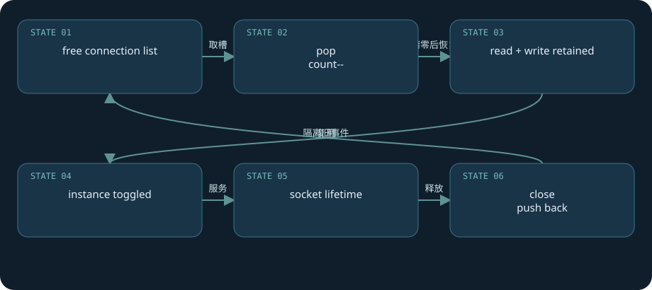

**真实源码：**[src/core/ngx_connection.c · L1174—L1237](https://github.com/nginx/nginx/blob/481d28cb4e04c8096b9b6134856891dc52ecc68f/src/core/ngx_connection.c#L1174-L1237)。连续原文，包含所讨论函数的完整分支与边界。

```c
ngx_connection_t *
ngx_get_connection(ngx_socket_t s, ngx_log_t *log)
{
    ngx_uint_t         instance;
    ngx_event_t       *rev, *wev;
    ngx_connection_t  *c;

    /* disable warning: Win32 SOCKET is u_int while UNIX socket is int */

    if (ngx_cycle->files && (ngx_uint_t) s >= ngx_cycle->files_n) {
        ngx_log_error(NGX_LOG_ALERT, log, 0,
                      "the new socket has number %d, "
                      "but only %ui files are available",
                      s, ngx_cycle->files_n);
        return NULL;
    }

    ngx_drain_connections((ngx_cycle_t *) ngx_cycle);

    c = ngx_cycle->free_connections;

    if (c == NULL) {
        ngx_log_error(NGX_LOG_ALERT, log, 0,
                      "%ui worker_connections are not enough",
                      ngx_cycle->connection_n);

        return NULL;
    }

    ngx_cycle->free_connections = c->data;
    ngx_cycle->free_connection_n--;

    if (ngx_cycle->files && ngx_cycle->files[s] == NULL) {
        ngx_cycle->files[s] = c;
    }

    rev = c->read;
    wev = c->write;

    ngx_memzero(c, sizeof(ngx_connection_t));

    c->read = rev;
    c->write = wev;
    c->fd = s;
    c->log = log;

    instance = rev->instance;

    ngx_memzero(rev, sizeof(ngx_event_t));
    ngx_memzero(wev, sizeof(ngx_event_t));

    rev->instance = !instance;
    wev->instance = !instance;

    rev->index = NGX_INVALID_INDEX;
    wev->index = NGX_INVALID_INDEX;

    rev->data = c;
    wev->data = c;

    wev->write = 1;

    return c;
}
```

**失败后果：**日志`worker_connections are not enough`发生在槽位分配，EMFILE发生在系统fd创建，二者应分别处理。加大连接数组可能提高内存常驻，并不会增加上游可用连接。

**纸面实例：**一个worker，1024个槽位，500个客户端加500个上游已接近饱和；再留256个idle upstream会超过数组容量。这是保守容量练习，实际要扣监听、内部channel等占用并看负载。

**实验：**lab配置1024，改变为很小的值后先`-t`，并发持续`/slow`。观察错误日志与fd数，而不是只看curl成功次数。勿用这个局部压测推算生产容量；本书未执行并发容量测试。

[返回目录](#top)

<a id="chapter-10"></a>

# 10 · pool、buffer、chain：异步所有权

**内存会集中释放，数据进度单独推进**

NGINX小对象频繁分配但多以请求为生命周期。`ngx_palloc_small`从pool当前块的`d.last`向后划分空间，按需对齐，块不够则走next或创建块；大块分配另记在large链。销毁pool统一运行cleanup并释放大块与pool blocks。它减少逐个malloc/free的管理成本，但小对象通常不能逐个归还，内存仍随pool保留。

`ngx_buf_t`表示一段数据：内存用`pos / last`表示待消费区间，容量用`start / end`；文件用`file_pos / file_last`，同时有in_file、temporary、flush、sync、last_buf等标志。`ngx_chain_t`是指向buffer的链，不等于复制了一份数据。output filters推进pos/file_pos，而pool决定内存什么时候真正释放。

模块不能把栈上的buffer或短生命周期内存交给异步发送；返回NGX_AGAIN之后仍会被后续write事件触达。`busy / free / out`链表达“下游尚未消费、可以复用、待提交”三种状态，shadow buffer共享底层存储时必须等所有关联消费者完成。cleanup通常用于fd、临时文件和外部资源，不只是释放字节。

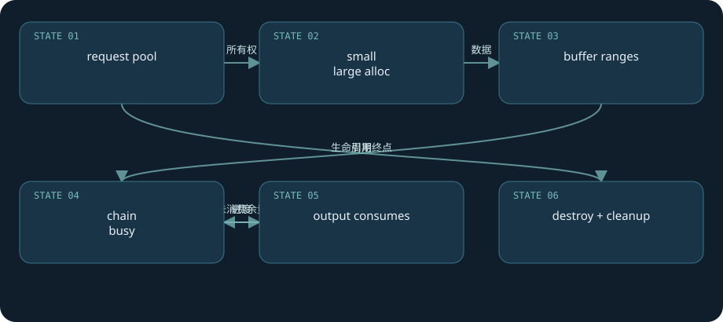

**真实源码：**[src/core/ngx_palloc.c · L148—L174](https://github.com/nginx/nginx/blob/481d28cb4e04c8096b9b6134856891dc52ecc68f/src/core/ngx_palloc.c#L148-L174)。连续原文，包含所讨论函数的完整分支与边界。

```c
static ngx_inline void *
ngx_palloc_small(ngx_pool_t *pool, size_t size, ngx_uint_t align)
{
    u_char      *m;
    ngx_pool_t  *p;

    p = pool->current;

    do {
        m = p->d.last;

        if (align) {
            m = ngx_align_ptr(m, NGX_ALIGNMENT);
        }

        if ((size_t) (p->d.end - m) >= size) {
            p->d.last = m + size;

            return m;
        }

        p = p->d.next;

    } while (p);

    return ngx_palloc_block(pool, size);
}
```

**调用链：**request创建pool → 模块palloc生成buffer/chain → filter保留未发送链 → 后续write恢复 → request引用计数归零 → pool cleanup。池销毁是生命周期终点，不能因为某个handler返回便认定内存可释放。

**失败推演：**慢客户端让busy buffer长期不能复用，放大每请求内存；pool泄漏常表现为请求无法完成/引用计数不归零，未必是malloc忘free。持有request pool指针到长期配置是悬空指针风险。

**练习：**画出一个buffer`pos=100、last=500`，本轮发送150字节后为`pos=250`，仍欠250字节。链节点可回收与底层内存可复用必须分别判断。

[返回目录](#top)

<a id="chapter-11"></a>

# 11 · HTTP请求行：分片输入与状态保存

**TCP没有一请求一包的边界**

连接的read handler从等待请求切到`ngx_http_process_request_line`，读取header buffer后调用`ngx_http_parse_request_line(r,b)`。解析器逐字符推进enum状态：method、URI、协议版本、CRLF等。`r->state`在下次进入时恢复，`b->pos`指向已消费位置，字段指针记录method与URI等边界。NGX_AGAIN表示当前输入不足，不表示请求被拒绝。

TCP可能把请求行拆成任意多个片段，也可能把header和body一起送来。解析器不能用一次recv等于完整消息的假设。遇到无效method、协议字符、URI问题等返回具体解析错误，调用者转为协议错误处理；完整请求行还要经`ngx_http_process_request_uri`做规范化和安全检查，Host及headers另有解析步骤。

buffer不够时调用者尝试large header buffer；请求行过大、header field过大、总buffer不足有各自边界。`client_header_timeout`约束读取过程，慢速发送不可能无限占用。请求头里的Host影响server选择，但TLS场景SNI选证书更早，二者不应混作一个阶段。

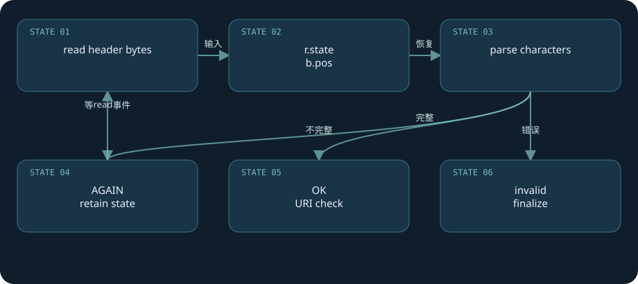

**真实源码：**[src/http/ngx_http_parse.c · L101—L812](https://github.com/nginx/nginx/blob/481d28cb4e04c8096b9b6134856891dc52ecc68f/src/http/ngx_http_parse.c#L101-L812)。连续原文，包含所讨论函数的完整分支与边界。

```c
/* gcc, icc, msvc and others compile these switches as an jump table */

ngx_int_t
ngx_http_parse_request_line(ngx_http_request_t *r, ngx_buf_t *b)
{
    u_char  c, ch, *p, *m;
    enum {
        sw_start = 0,
        sw_method,
        sw_spaces_before_uri,
        sw_schema,
        sw_schema_slash,
        sw_schema_slash_slash,
        sw_host_start,
        sw_host,
        sw_host_end,
        sw_host_ip_literal,
        sw_port,
        sw_after_slash_in_uri,
        sw_check_uri,
        sw_uri,
        sw_http_09,
        sw_http_H,
        sw_http_HT,
        sw_http_HTT,
        sw_http_HTTP,
        sw_first_major_digit,
        sw_major_digit,
        sw_first_minor_digit,
        sw_minor_digit,
        sw_spaces_after_digit,
        sw_almost_done
    } state;

    state = r->state;

    for (p = b->pos; p < b->last; p++) {
        ch = *p;

        switch (state) {

        /* HTTP methods: GET, HEAD, POST */
        case sw_start:
            r->request_start = p;

            if (ch == CR || ch == LF) {
                break;
            }

            if ((ch < 'A' || ch > 'Z') && ch != '_' && ch != '-') {
                return NGX_HTTP_PARSE_INVALID_METHOD;
            }

            state = sw_method;
            break;

        case sw_method:
            if (ch == ' ') {
                r->method_end = p - 1;
                m = r->request_start;

                switch (p - m) {

                case 3:
                    if (ngx_str3_cmp(m, 'G', 'E', 'T', ' ')) {
                        r->method = NGX_HTTP_GET;
                        break;
                    }

                    if (ngx_str3_cmp(m, 'P', 'U', 'T', ' ')) {
                        r->method = NGX_HTTP_PUT;
                        break;
                    }

                    break;

                case 4:
                    if (m[1] == 'O') {

                        if (ngx_str3Ocmp(m, 'P', 'O', 'S', 'T')) {
                            r->method = NGX_HTTP_POST;
                            break;
                        }

                        if (ngx_str3Ocmp(m, 'C', 'O', 'P', 'Y')) {
                            r->method = NGX_HTTP_COPY;
                            break;
                        }

                        if (ngx_str3Ocmp(m, 'M', 'O', 'V', 'E')) {
                            r->method = NGX_HTTP_MOVE;
                            break;
                        }

                        if (ngx_str3Ocmp(m, 'L', 'O', 'C', 'K')) {
                            r->method = NGX_HTTP_LOCK;
                            break;
                        }

                    } else {

                        if (ngx_str4cmp(m, 'H', 'E', 'A', 'D')) {
                            r->method = NGX_HTTP_HEAD;
                            break;
                        }
                    }

                    break;

                case 5:
                    if (ngx_str5cmp(m, 'M', 'K', 'C', 'O', 'L')) {
                        r->method = NGX_HTTP_MKCOL;
                        break;
                    }

                    if (ngx_str5cmp(m, 'P', 'A', 'T', 'C', 'H')) {
                        r->method = NGX_HTTP_PATCH;
                        break;
                    }

                    if (ngx_str5cmp(m, 'T', 'R', 'A', 'C', 'E')) {
                        r->method = NGX_HTTP_TRACE;
                        break;
                    }

                    break;

                case 6:
                    if (ngx_str6cmp(m, 'D', 'E', 'L', 'E', 'T', 'E')) {
                        r->method = NGX_HTTP_DELETE;
                        break;
                    }

                    if (ngx_str6cmp(m, 'U', 'N', 'L', 'O', 'C', 'K')) {
                        r->method = NGX_HTTP_UNLOCK;
                        break;
                    }

                    break;

                case 7:
                    if (ngx_str7_cmp(m, 'O', 'P', 'T', 'I', 'O', 'N', 'S', ' '))
                    {
                        r->method = NGX_HTTP_OPTIONS;
                    }

                    if (ngx_str7_cmp(m, 'C', 'O', 'N', 'N', 'E', 'C', 'T', ' '))
                    {
                        r->method = NGX_HTTP_CONNECT;
                    }

                    break;

                case 8:
                    if (ngx_str8cmp(m, 'P', 'R', 'O', 'P', 'F', 'I', 'N', 'D'))
                    {
                        r->method = NGX_HTTP_PROPFIND;
                    }

                    break;

                case 9:
                    if (ngx_str9cmp(m,
                            'P', 'R', 'O', 'P', 'P', 'A', 'T', 'C', 'H'))
                    {
                        r->method = NGX_HTTP_PROPPATCH;
                    }

                    break;
                }

                state = sw_spaces_before_uri;
                break;
            }

            if ((ch < 'A' || ch > 'Z') && ch != '_' && ch != '-') {
                return NGX_HTTP_PARSE_INVALID_METHOD;
            }

            break;

        /* space* before URI */
        case sw_spaces_before_uri:

            if (ch == '/') {
                r->uri_start = p;
                state = sw_after_slash_in_uri;
                break;
            }

            c = (u_char) (ch | 0x20);
            if (c >= 'a' && c <= 'z') {
                r->schema_start = p;
                state = sw_schema;
                break;
            }

            switch (ch) {
            case ' ':
                break;
            default:
                return NGX_HTTP_PARSE_INVALID_REQUEST;
            }
            break;

        case sw_schema:

            c = (u_char) (ch | 0x20);
            if (c >= 'a' && c <= 'z') {
                break;
            }

            if ((ch >= '0' && ch <= '9') || ch == '+' || ch == '-' || ch == '.')
            {
                break;
            }

            switch (ch) {
            case ':':
                r->schema_end = p;
                state = sw_schema_slash;
                break;
            default:
                return NGX_HTTP_PARSE_INVALID_REQUEST;
            }
            break;

        case sw_schema_slash:
            switch (ch) {
            case '/':
                state = sw_schema_slash_slash;
                break;
            default:
                return NGX_HTTP_PARSE_INVALID_REQUEST;
            }
            break;

        case sw_schema_slash_slash:
            switch (ch) {
            case '/':
                state = sw_host_start;
                break;
            default:
                return NGX_HTTP_PARSE_INVALID_REQUEST;
            }
            break;

        case sw_host_start:

            r->host_start = p;

            if (ch == '[') {
                state = sw_host_ip_literal;
                break;
            }

            state = sw_host;

            /* fall through */

        case sw_host:

            c = (u_char) (ch | 0x20);
            if (c >= 'a' && c <= 'z') {
                break;
            }

            if ((ch >= '0' && ch <= '9') || ch == '.' || ch == '-') {
                break;
            }

            /* fall through */

        case sw_host_end:

            r->host_end = p;

            switch (ch) {
            case ':':
                state = sw_port;
                break;
            case '/':
                r->uri_start = p;
                state = sw_after_slash_in_uri;
                break;
            case '?':
                r->uri_start = p;
                r->args_start = p + 1;
                r->empty_path_in_uri = 1;
                state = sw_uri;
                break;
            case ' ':
                /*
                 * use single "/" from request line to preserve pointers,
                 * if request line will be copied to large client buffer
                 */
                r->uri_start = r->schema_end + 1;
                r->uri_end = r->schema_end + 2;
                state = sw_http_09;
                break;
            default:
                return NGX_HTTP_PARSE_INVALID_REQUEST;
            }
            break;

        case sw_host_ip_literal:

            if (ch >= '0' && ch <= '9') {
                break;
            }

            c = (u_char) (ch | 0x20);
            if (c >= 'a' && c <= 'z') {
                break;
            }

            switch (ch) {
            case ':':
                break;
            case ']':
                state = sw_host_end;
                break;
            case '-':
            case '.':
            case '_':
            case '~':
                /* unreserved */
                break;
            case '!':
            case '$':
            case '&':
            case '\'':
            case '(':
            case ')':
            case '*':
            case '+':
            case ',':
            case ';':
            case '=':
                /* sub-delims */
                break;
            default:
                return NGX_HTTP_PARSE_INVALID_REQUEST;
            }
            break;

        case sw_port:
            if (ch >= '0' && ch <= '9') {
                break;
            }

            switch (ch) {
            case '/':
                r->uri_start = p;
                state = sw_after_slash_in_uri;
                break;
            case '?':
                r->uri_start = p;
                r->args_start = p + 1;
                r->empty_path_in_uri = 1;
                state = sw_uri;
                break;
            case ' ':
                /*
                 * use single "/" from request line to preserve pointers,
                 * if request line will be copied to large client buffer
                 */
                r->uri_start = r->schema_end + 1;
                r->uri_end = r->schema_end + 2;
                state = sw_http_09;
                break;
            default:
                return NGX_HTTP_PARSE_INVALID_REQUEST;
            }
            break;

        /* check "/.", "//", "%", and "\" (Win32) in URI */
        case sw_after_slash_in_uri:

            if (usual[ch >> 5] & (1U << (ch & 0x1f))) {
                state = sw_check_uri;
                break;
            }

            switch (ch) {
            case ' ':
                r->uri_end = p;
                state = sw_http_09;
                break;
            case CR:
                r->uri_end = p;
                r->http_minor = 9;
                state = sw_almost_done;
                break;
            case LF:
                r->uri_end = p;
                r->http_minor = 9;
                goto done;
            case '.':
                r->complex_uri = 1;
                state = sw_uri;
                break;
            case '%':
                r->quoted_uri = 1;
                state = sw_uri;
                break;
            case '/':
                r->complex_uri = 1;
                state = sw_uri;
                break;
#if (NGX_WIN32)
            case '\\':
                r->complex_uri = 1;
                state = sw_uri;
                break;
#endif
            case '?':
                r->args_start = p + 1;
                state = sw_uri;
                break;
            case '#':
                r->complex_uri = 1;
                state = sw_uri;
                break;
            case '+':
                r->plus_in_uri = 1;
                break;
            default:
                if (ch < 0x20 || ch == 0x7f) {
                    return NGX_HTTP_PARSE_INVALID_REQUEST;
                }
                state = sw_check_uri;
                break;
            }
            break;

        /* check "/", "%" and "\" (Win32) in URI */
        case sw_check_uri:

            if (usual[ch >> 5] & (1U << (ch & 0x1f))) {
                break;
            }

            switch (ch) {
            case '/':
#if (NGX_WIN32)
                if (r->uri_ext == p) {
                    r->complex_uri = 1;
                    state = sw_uri;
                    break;
                }
#endif
                r->uri_ext = NULL;
                state = sw_after_slash_in_uri;
                break;
            case '.':
                r->uri_ext = p + 1;
                break;
            case ' ':
                r->uri_end = p;
                state = sw_http_09;
                break;
            case CR:
                r->uri_end = p;
                r->http_minor = 9;
                state = sw_almost_done;
                break;
            case LF:
                r->uri_end = p;
                r->http_minor = 9;
                goto done;
#if (NGX_WIN32)
            case '\\':
                r->complex_uri = 1;
                state = sw_after_slash_in_uri;
                break;
#endif
            case '%':
                r->quoted_uri = 1;
                state = sw_uri;
                break;
            case '?':
                r->args_start = p + 1;
                state = sw_uri;
                break;
            case '#':
                r->complex_uri = 1;
                state = sw_uri;
                break;
            case '+':
                r->plus_in_uri = 1;
                break;
            default:
                if (ch < 0x20 || ch == 0x7f) {
                    return NGX_HTTP_PARSE_INVALID_REQUEST;
                }
                break;
            }
            break;

        /* URI */
        case sw_uri:

            if (usual[ch >> 5] & (1U << (ch & 0x1f))) {
                break;
            }

            switch (ch) {
            case ' ':
                r->uri_end = p;
                state = sw_http_09;
                break;
            case CR:
                r->uri_end = p;
                r->http_minor = 9;
                state = sw_almost_done;
                break;
            case LF:
                r->uri_end = p;
                r->http_minor = 9;
                goto done;
            case '#':
                r->complex_uri = 1;
                break;
            default:
                if (ch < 0x20 || ch == 0x7f) {
                    return NGX_HTTP_PARSE_INVALID_REQUEST;
                }
                break;
            }
            break;

        /* space+ after URI */
        case sw_http_09:
            switch (ch) {
            case ' ':
                break;
            case CR:
                r->http_minor = 9;
                state = sw_almost_done;
                break;
            case LF:
                r->http_minor = 9;
                goto done;
            case 'H':
                r->http_protocol.data = p;
                state = sw_http_H;
                break;
            default:
                return NGX_HTTP_PARSE_INVALID_REQUEST;
            }
            break;

        case sw_http_H:
            switch (ch) {
            case 'T':
                state = sw_http_HT;
                break;
            default:
                return NGX_HTTP_PARSE_INVALID_REQUEST;
            }
            break;

        case sw_http_HT:
            switch (ch) {
            case 'T':
                state = sw_http_HTT;
                break;
            default:
                return NGX_HTTP_PARSE_INVALID_REQUEST;
            }
            break;

        case sw_http_HTT:
            switch (ch) {
            case 'P':
                state = sw_http_HTTP;
                break;
            default:
                return NGX_HTTP_PARSE_INVALID_REQUEST;
            }
            break;

        case sw_http_HTTP:
            switch (ch) {
            case '/':
                state = sw_first_major_digit;
                break;
            default:
                return NGX_HTTP_PARSE_INVALID_REQUEST;
            }
            break;

        /* first digit of major HTTP version */
        case sw_first_major_digit:
            if (ch < '1' || ch > '9') {
                return NGX_HTTP_PARSE_INVALID_REQUEST;
            }

            r->http_major = ch - '0';

            if (r->http_major > 1) {
                return NGX_HTTP_PARSE_INVALID_VERSION;
            }

            state = sw_major_digit;
            break;

        /* major HTTP version or dot */
        case sw_major_digit:
            if (ch == '.') {
                state = sw_first_minor_digit;
                break;
            }

            if (ch < '0' || ch > '9') {
                return NGX_HTTP_PARSE_INVALID_REQUEST;
            }

            r->http_major = r->http_major * 10 + (ch - '0');

            if (r->http_major > 1) {
                return NGX_HTTP_PARSE_INVALID_VERSION;
            }

            break;

        /* first digit of minor HTTP version */
        case sw_first_minor_digit:
            if (ch < '0' || ch > '9') {
                return NGX_HTTP_PARSE_INVALID_REQUEST;
            }

            r->http_minor = ch - '0';
            state = sw_minor_digit;
            break;

        /* minor HTTP version or end of request line */
        case sw_minor_digit:
            if (ch == CR) {
                state = sw_almost_done;
                break;
            }

            if (ch == LF) {
                goto done;
            }

            if (ch == ' ') {
                state = sw_spaces_after_digit;
                break;
            }

            if (ch < '0' || ch > '9') {
                return NGX_HTTP_PARSE_INVALID_REQUEST;
            }

            if (r->http_minor > 99) {
                return NGX_HTTP_PARSE_INVALID_REQUEST;
            }

            r->http_minor = r->http_minor * 10 + (ch - '0');
            break;

        case sw_spaces_after_digit:
            switch (ch) {
            case ' ':
                break;
            case CR:
                state = sw_almost_done;
                break;
            case LF:
                goto done;
            default:
                return NGX_HTTP_PARSE_INVALID_REQUEST;
            }
            break;

        /* end of request line */
        case sw_almost_done:
            r->request_end = p - 1;
            switch (ch) {
            case LF:
                goto done;
            default:
                return NGX_HTTP_PARSE_INVALID_REQUEST;
            }
        }
    }

    b->pos = p;
    r->state = state;

    return NGX_AGAIN;

done:

    b->pos = p + 1;

    if (r->request_end == NULL) {
        r->request_end = p;
    }

    r->http_version = r->http_major * 1000 + r->http_minor;
    r->state = sw_start;

    if (r->http_version == 9 && r->method != NGX_HTTP_GET) {
        return NGX_HTTP_PARSE_INVALID_09_METHOD;
    }

    return NGX_OK;
}
```

**完整链：**`ngx_http_wait_request_handler → create_request → process_request_line → read_request_header → parse_request_line → process_request_uri → process_request_headers → process_request`。成功只意味着该阶段完成；body未必已读，上游也尚未连接。

**实验：**lab中使用Python socket分两次发送`GET /ver`与`sion HTTP/1.1...`，组成合法`/version`；完整split实验见`experiments.md`。记录返回状态；再发送小写method或故意损坏HTTP版本，比较error日志。不要把畸形输入发送到线上站点。

**思考：**解析字段经常指向header buffer内部，没有复制字符串；移动/扩大buffer必须相应修正指针。这解释了为什么buffer生命周期与请求状态机必须一起读。

[返回目录](#top)

<a id="chapter-12"></a>

# 12 · server与location：树查找不是按书写顺序扫描

**静态树、正则数组和嵌套递归**

请求进入server上下文后，`ngx_http_core_find_config_phase`调用`ngx_http_core_find_location`。静态location经初始化阶段整理为树，用URI比较寻找精确与前缀候选；精确匹配可直接结束，最长前缀可继续进入嵌套层。对当前层，若允许regex，按该层regex数组顺序测试，并把`r->loc_conf`切到命中的配置。

普通顶层配置可用“精确优先，最长前缀候选，候选^~时跳过当前层正则，否则按正则声明顺序”的路径推演。嵌套配置必须沿真实递归读：内层成功匹配可能先返回，外层是否继续正则受各层noregex等状态控制。把^~说成整个配置任意层的永久正则关闭开关会误导。

匹配用规范化后的`r->uri`，不含query string；`$request_uri`保留原始请求URI含参数。rewrite后URI变化会再次查location。`root`把URI拼到目录，`alias`替换匹配部分，proxy_pass带URI时又有前缀替换规则。三种机制不能仅凭配置尾部斜杠“口诀”相互替代。

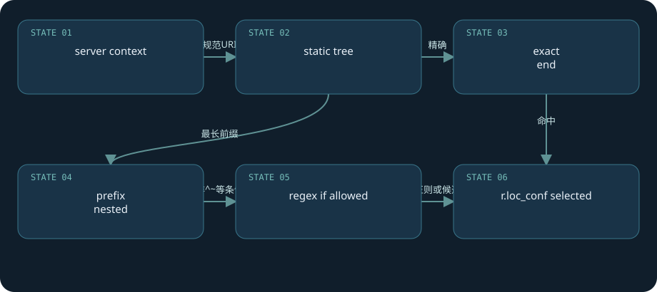

**真实源码：**[src/http/ngx_http_core_module.c · L1394—L1469](https://github.com/nginx/nginx/blob/481d28cb4e04c8096b9b6134856891dc52ecc68f/src/http/ngx_http_core_module.c#L1394-L1469)。连续原文，包含所讨论函数的完整分支与边界。

```c
/*
 * NGX_OK       - exact or regex match
 * NGX_DONE     - auto redirect
 * NGX_AGAIN    - inclusive match
 * NGX_ERROR    - regex error
 * NGX_DECLINED - no match
 */

static ngx_int_t
ngx_http_core_find_location(ngx_http_request_t *r)
{
    ngx_int_t                  rc;
    ngx_http_core_loc_conf_t  *pclcf;
#if (NGX_PCRE)
    ngx_int_t                  n;
    ngx_uint_t                 noregex;
    ngx_http_core_loc_conf_t  *clcf, **clcfp;

    noregex = 0;
#endif

    pclcf = ngx_http_get_module_loc_conf(r, ngx_http_core_module);

    rc = ngx_http_core_find_static_location(r, pclcf->static_locations);

    if (rc == NGX_AGAIN) {

#if (NGX_PCRE)
        clcf = ngx_http_get_module_loc_conf(r, ngx_http_core_module);

        noregex = clcf->noregex;
#endif

        /* look up nested locations */

        rc = ngx_http_core_find_location(r);
    }

    if (rc == NGX_OK || rc == NGX_DONE) {
        return rc;
    }

    /* rc == NGX_DECLINED or rc == NGX_AGAIN in nested location */

#if (NGX_PCRE)

    if (noregex == 0 && pclcf->regex_locations) {

        for (clcfp = pclcf->regex_locations; *clcfp; clcfp++) {

            ngx_log_debug1(NGX_LOG_DEBUG_HTTP, r->connection->log, 0,
                           "test location: ~ \"%V\"", &(*clcfp)->name);

            n = ngx_http_regex_exec(r, (*clcfp)->regex, &r->uri);

            if (n == NGX_OK) {
                r->loc_conf = (*clcfp)->loc_conf;

                /* look up nested locations */

                rc = ngx_http_core_find_location(r);

                return (rc == NGX_ERROR) ? rc : NGX_OK;
            }

            if (n == NGX_DECLINED) {
                continue;
            }

            return NGX_ERROR;
        }
    }
#endif

    return rc;
}
```

**第二证据：**[`regex loop · L1440–L1456`](https://github.com/nginx/nginx/blob/481d28cb4e04c8096b9b6134856891dc52ecc68f/src/http/ngx_http_core_module.c#L1440-L1456)表明正则检查与配置指针切换；完整函数保留嵌套关系。

**实验：**lab有`location = /version`、`location /prefix/`、`location ~ \.txt$`。分别curl`/version?x=1`、`/prefix/a.txt`，后者顶层regex可胜出；将前缀改成`^~ /prefix/`并reload后再试，应改走prefix内容。返回值实验只用于路由，限流实验不能用return绕过PREACCESS。

**失败后果：**匹配落到错误location，可能改变认证、缓存key、proxy_pass、日志等一整套模块配置。诊断应记录`$uri`与`$request_uri`，同时查看实际命中处理器。

[返回目录](#top)

<a id="chapter-13"></a>

# 13 · phase engine：模块如何组合

**checker控制流程，handler处理业务**

HTTP初始化`ngx_http_init_phase_handlers`把模块注册的handlers整理为可执行数组，包含每个阶段checker、业务handler和next索引。请求由`r->phase_handler`记录当前程序计数器，`ngx_http_core_run_phases`反复调用checker。server rewrite、find config、location rewrite、post rewrite、preaccess、access、content有不同控制规则；LOG阶段在请求释放路径执行，不能理解为这个循环中最后一个同步handler。

generic checker里handler返回NGX_OK意味着跳到ph->next，NGX_DECLINED表示换下一个handler，NGX_AGAIN/NGX_DONE表示暂停或异步已接管；checker本身又把这些结果转成循环控制码。因此“NGX_OK总是继续”或“NGX_AGAIN总是报错”都不成立，必须区分返回者与接收者。

content handler可以由location直接指定，如proxy模块；filters是另一条处理输出的链，和HTTP phases不等价。rewrite阶段的return提前生成响应时，后面的preaccess/access可能不再执行。这正是限流实验在`location`里用`return 200`经常测不出效果的原因。

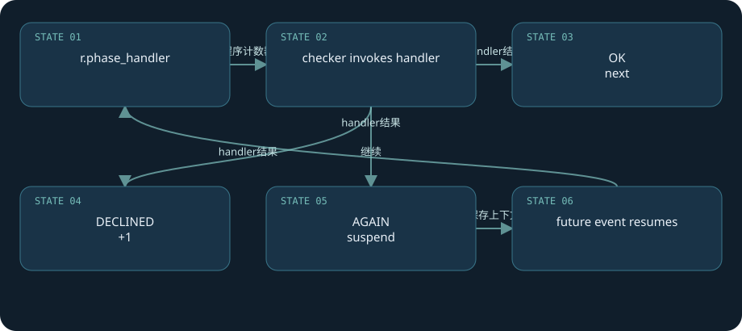

**真实源码：**[src/http/ngx_http_core_module.c · L891—L925](https://github.com/nginx/nginx/blob/481d28cb4e04c8096b9b6134856891dc52ecc68f/src/http/ngx_http_core_module.c#L891-L925)。连续原文，包含所讨论函数的完整分支与边界。

```c
ngx_int_t
ngx_http_core_generic_phase(ngx_http_request_t *r, ngx_http_phase_handler_t *ph)
{
    ngx_int_t  rc;

    /*
     * generic phase checker,
     * used by the post read and pre-access phases
     */

    ngx_log_debug1(NGX_LOG_DEBUG_HTTP, r->connection->log, 0,
                   "generic phase: %ui", r->phase_handler);

    rc = ph->handler(r);

    if (rc == NGX_OK) {
        r->phase_handler = ph->next;
        return NGX_AGAIN;
    }

    if (rc == NGX_DECLINED) {
        r->phase_handler++;
        return NGX_AGAIN;
    }

    if (rc == NGX_AGAIN || rc == NGX_DONE) {
        return NGX_OK;
    }

    /* rc == NGX_ERROR || rc == NGX_HTTP_...  */

    ngx_http_finalize_request(r, rc);

    return NGX_OK;
}
```

**状态链：**handler保存异步上下文并返回AGAIN → checker返回OK停止本轮phase loop → 未来事件handler恢复 → phase_handler继续。使用NGX_DONE的模块还必须遵守请求引用计数/最终化约定；状态推进错误会重复执行handler或泄漏请求。

**实验：**lab`/limit/`通过proxy产生内容，保证PREACCESS里的limit_req有机会运行；而`/version`仅用于rewrite return与路由观察。若把limit_req放在含return的location，看见“无限通过”不能据此断言限流算法失效。

**源码范围：**[`phase assembly · L491–L552`](https://github.com/nginx/nginx/blob/481d28cb4e04c8096b9b6134856891dc52ecc68f/src/http/ngx_http.c#L491-L552)。理解checker的跳转，才知道模块注册顺序为何不等于nginx.conf书写顺序。

[返回目录](#top)

<a id="chapter-14"></a>

# 14 · rewrite与内部跳转：重入有预算

**URI改写要同步配置上下文**

rewrite模块把配置编译为script指令数组，`ngx_http_rewrite_handler`初始化script engine并解释这些指令。改URI、设置变量、return和跳转的作用不同。`last`结束当前rewrite序列并触发按新URI重新寻找location，`break`停止本轮序列且留在当前location；外部redirect生成3xx让客户端发新请求，并不等于内部跳转。

post rewrite checker看`r->uri_changed`，未变化则继续；变化后递减`uri_changes`，将`phase_handler`设为find-config索引，并恢复server级loc_conf起点。本基线request初始化为`NGX_HTTP_MAX_URI_CHANGES+1`，宏是10；预算还会被其他内部重定向路径消耗，不能理解为所有场景均允许任意11次rewrite。

`try_files`最后参数、error_page内部重定向、index等也能改动请求流。内部重定向可能重置模块ctx或重新走部分phase，不能把r->ctx当作整个请求绝不会变的缓存。主请求引用、body状态与输出状态都需要模块正确处理。

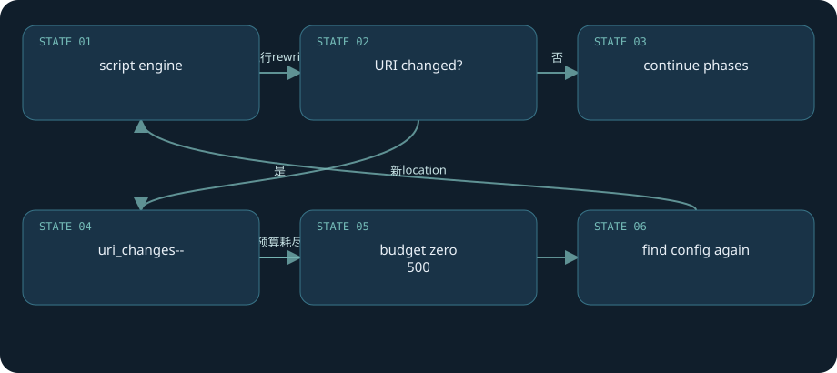

**真实源码：**[src/http/ngx_http_core_module.c · L1050—L1091](https://github.com/nginx/nginx/blob/481d28cb4e04c8096b9b6134856891dc52ecc68f/src/http/ngx_http_core_module.c#L1050-L1091)。连续原文，包含所讨论函数的完整分支与边界。

```c
ngx_int_t
ngx_http_core_post_rewrite_phase(ngx_http_request_t *r,
    ngx_http_phase_handler_t *ph)
{
    ngx_http_core_srv_conf_t  *cscf;

    ngx_log_debug1(NGX_LOG_DEBUG_HTTP, r->connection->log, 0,
                   "post rewrite phase: %ui", r->phase_handler);

    if (!r->uri_changed) {
        r->phase_handler++;
        return NGX_AGAIN;
    }

    ngx_log_debug1(NGX_LOG_DEBUG_HTTP, r->connection->log, 0,
                   "uri changes: %d", r->uri_changes);

    /*
     * gcc before 3.3 compiles the broken code for
     *     if (r->uri_changes-- == 0)
     * if the r->uri_changes is defined as
     *     unsigned  uri_changes:4
     */

    r->uri_changes--;

    if (r->uri_changes == 0) {
        ngx_log_error(NGX_LOG_ERR, r->connection->log, 0,
                      "rewrite or internal redirection cycle "
                      "while processing \"%V\"", &r->uri);

        ngx_http_finalize_request(r, NGX_HTTP_INTERNAL_SERVER_ERROR);
        return NGX_OK;
    }

    r->phase_handler = ph->next;

    cscf = ngx_http_get_module_srv_conf(r, ngx_http_core_module);
    r->loc_conf = cscf->ctx->loc_conf;

    return NGX_AGAIN;
}
```

**失败推演：**`/a → /b → /a`内部循环耗尽预算，日志明确记录“rewrite or internal redirection cycle”，最终500。正则性能不佳则可能在worker事件线程上消耗CPU，HTTP并发下降但未必马上报错。

**实验：**lab`/old`rewrite last到`/version`，比较日志中`request_uri=/old`与`uri=/version`；临时加入两个互相last的location，curl预期500，恢复配置再reload。这里只给隔离复现实验，未在NGINX上执行。

**知识回顾：**rewrite修改的是当前请求URI和程序计数器，last意味着重新选择配置，redirect则生成客户端下一次请求。是否继续body、鉴权、内容阶段，要沿checker跳转判断。

[返回目录](#top)

<a id="chapter-15"></a>

# 15 · 请求体：buffering与可重放性

**读请求体是异步任务，完成靠回调**

proxy handler创建`r->upstream`、绑定请求生成器和响应解析回调，然后调用`ngx_http_read_client_request_body(r, ngx_http_upstream_init)`。读体入口增加主请求count，创建`ngx_http_request_body_t`，保存post_handler。body可能已部分存在header buffer，也可能需要更多read事件；完成才调用upstream_init，不能用handler函数返回的时间代表body已收齐。

默认请求buffering允许在客户端与上游之间解耦：body先进入内存或temp file，再发送给后端。`proxy_request_buffering off`在符合条件时设置`request_body_no_buffering`，上游可以更早接收数据，慢上传也可能长时间占用上游连接。chunked上传还受proxy_http_version等条件影响，本基线显式判断HTTP/1.1。

`client_max_body_size`是请求体大小边界，`client_body_buffer_size`只是内存缓冲相关参数，溢出不必拒绝而可能落临时文件。`client_body_timeout`是读间隔超时。disk满、temp路径权限、分配失败、客户端断开会进入不同清理；部分body已发给上游后，切到另一peer是否能够重放由buffering与请求状态约束。

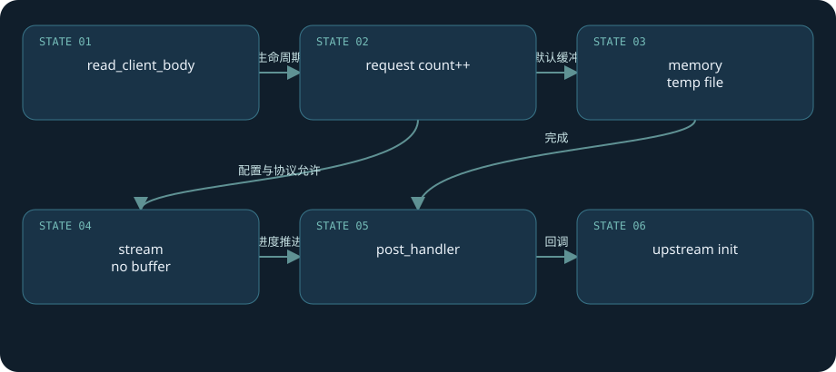

**真实源码：**[src/http/modules/ngx_http_proxy_module.c · L954—L1050](https://github.com/nginx/nginx/blob/481d28cb4e04c8096b9b6134856891dc52ecc68f/src/http/modules/ngx_http_proxy_module.c#L954-L1050)。连续原文，包含所讨论函数的完整分支与边界。

```c
static ngx_int_t
ngx_http_proxy_handler(ngx_http_request_t *r)
{
    ngx_int_t                    rc;
    ngx_http_upstream_t         *u;
    ngx_http_proxy_ctx_t        *ctx;
    ngx_http_proxy_loc_conf_t   *plcf;
#if (NGX_HTTP_CACHE)
    ngx_http_proxy_main_conf_t  *pmcf;
#endif

    if (ngx_http_upstream_create(r) != NGX_OK) {
        return NGX_HTTP_INTERNAL_SERVER_ERROR;
    }

    ctx = ngx_pcalloc(r->pool, sizeof(ngx_http_proxy_ctx_t));
    if (ctx == NULL) {
        return NGX_HTTP_INTERNAL_SERVER_ERROR;
    }

    ngx_http_set_ctx(r, ctx, ngx_http_proxy_module);

    plcf = ngx_http_get_module_loc_conf(r, ngx_http_proxy_module);

    u = r->upstream;

    if (plcf->proxy_lengths == NULL) {
        ctx->vars = plcf->vars;
        u->schema = plcf->vars.schema;
#if (NGX_HTTP_SSL)
        u->ssl = plcf->ssl;
#endif

    } else {
        if (ngx_http_proxy_eval(r, ctx, plcf) != NGX_OK) {
            return NGX_HTTP_INTERNAL_SERVER_ERROR;
        }
    }

    u->output.tag = (ngx_buf_tag_t) &ngx_http_proxy_module;

    u->conf = &plcf->upstream;

#if (NGX_HTTP_CACHE)
    pmcf = ngx_http_get_module_main_conf(r, ngx_http_proxy_module);

    u->caches = &pmcf->caches;
    u->create_key = ngx_http_proxy_create_key;
#endif

    u->create_request = ngx_http_proxy_create_request;
    u->reinit_request = ngx_http_proxy_reinit_request;
    u->process_header = ngx_http_proxy_process_status_line;
    u->abort_request = ngx_http_proxy_abort_request;
    u->finalize_request = ngx_http_proxy_finalize_request;
    r->state = 0;

    if (plcf->redirects) {
        u->rewrite_redirect = ngx_http_proxy_rewrite_redirect;
    }

    if (plcf->cookie_domains || plcf->cookie_paths || plcf->cookie_flags) {
        u->rewrite_cookie = ngx_http_proxy_rewrite_cookie;
    }

    u->buffering = plcf->upstream.buffering;

    u->pipe = ngx_pcalloc(r->pool, sizeof(ngx_event_pipe_t));
    if (u->pipe == NULL) {
        return NGX_HTTP_INTERNAL_SERVER_ERROR;
    }

    u->pipe->input_filter = ngx_http_proxy_copy_filter;
    u->pipe->input_ctx = r;

    u->input_filter_init = ngx_http_proxy_input_filter_init;
    u->input_filter = ngx_http_proxy_non_buffered_copy_filter;
    u->input_filter_ctx = r;

    u->accel = 1;

    if (!plcf->upstream.request_buffering
        && plcf->body_values == NULL && plcf->upstream.pass_request_body
        && (!r->headers_in.chunked
            || plcf->http_version == NGX_HTTP_VERSION_11))
    {
        r->request_body_no_buffering = 1;
    }

    rc = ngx_http_read_client_request_body(r, ngx_http_upstream_init);

    if (rc >= NGX_HTTP_SPECIAL_RESPONSE) {
        return rc;
    }

    return NGX_DONE;
}
```

**完整链：**proxy handler → read_client_request_body → read-event/body filters → post_handler(upstream_init) → create_request → connect/send。chunked decoding、HTTP/2/3 body路径不同，但共用“完成/异步进度不能混淆”的原则。

**实验：**用`curl --data-binary @payload.bin --limit-rate 16k .../echo`观察默认buffering下后端接收的启动时点，再改为off比较。lab后端将返回接收到的字节数；测试chunked需要独立构造Transfer-Encoding并核对HTTP/1.1，不能凭Content-Length上传推论全部协议。

**失败边界：**NGINX认为可重试，不代表业务可重试；body缓冲让字节可重放，业务幂等键才能让订单/扣款可安全重放。

[返回目录](#top)

<a id="chapter-16"></a>

# 16 · upstream：把后端变成事件状态机

**连接、发送、读头和读体各有回调**

proxy模块通过`u->create_request、reinit_request、process_header、abort_request、finalize_request`提供协议特化，upstream核心承担连接与超时调度。`ngx_http_upstream_init_request`准备peer和请求buffer，`ngx_http_upstream_connect`为本次尝试建立`u->state`，记录start_time，调用`ngx_event_connect_peer`。peer的get回调先选择地址，socket非阻塞connect可能返回NGX_AGAIN，后续write事件才判断连接结果。

连接对象的read/write handler都可指向`ngx_http_upstream_handler`，再由`u->read_event_handler / write_event_handler`选择阶段。目前初始化为send_request_handler与process_header，之后切到body处理器。`u->state`记录connect_time、header_time、response_time与peer；每次重试新增记录，日志可体现多次尝试。

`NGX_BUSY`表示没有可用peer，`NGX_DECLINED`等结果会走next逻辑；普通内部分配失败可能最终500。连接超时、协议头错误与上游响应503也并非同一失败类型。NGINX发出请求后后端是否已提交业务不可从TCP状态判断，因此分层错误诊断不能直接替代业务确定性。

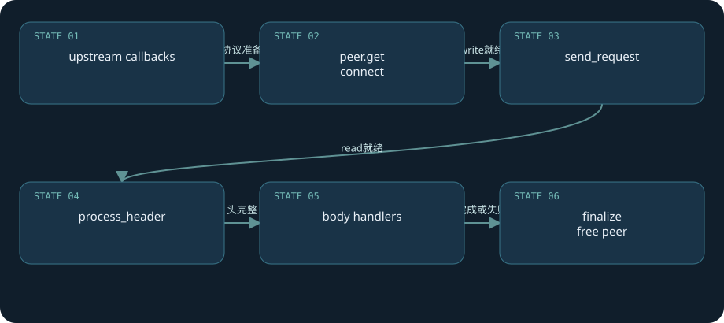

**真实源码：**[src/http/ngx_http_upstream.c · L1549—L1721](https://github.com/nginx/nginx/blob/481d28cb4e04c8096b9b6134856891dc52ecc68f/src/http/ngx_http_upstream.c#L1549-L1721)。连续原文，包含所讨论函数的完整分支与边界。

```c
static void
ngx_http_upstream_connect(ngx_http_request_t *r, ngx_http_upstream_t *u)
{
    ngx_int_t                  rc;
    ngx_connection_t          *c;
    ngx_http_core_loc_conf_t  *clcf;

    r->connection->log->action = "connecting to upstream";

    if (u->state && u->state->response_time == (ngx_msec_t) -1) {
        u->state->response_time = ngx_current_msec - u->start_time;
    }

    u->state = ngx_array_push(r->upstream_states);
    if (u->state == NULL) {
        ngx_http_upstream_finalize_request(r, u,
                                           NGX_HTTP_INTERNAL_SERVER_ERROR);
        return;
    }

    ngx_memzero(u->state, sizeof(ngx_http_upstream_state_t));

    u->start_time = ngx_current_msec;

    u->state->response_time = (ngx_msec_t) -1;
    u->state->connect_time = (ngx_msec_t) -1;
    u->state->header_time = (ngx_msec_t) -1;

    rc = ngx_event_connect_peer(&u->peer);

    ngx_log_debug1(NGX_LOG_DEBUG_HTTP, r->connection->log, 0,
                   "http upstream connect: %i", rc);

    if (rc == NGX_ERROR) {
        ngx_http_upstream_finalize_request(r, u,
                                           NGX_HTTP_INTERNAL_SERVER_ERROR);
        return;
    }

    u->state->peer = u->peer.name;

#if (NGX_HTTP_UPSTREAM_ZONE)
    if (u->upstream && u->upstream->shm_zone
        && (u->upstream->flags & NGX_HTTP_UPSTREAM_MODIFY))
    {
        u->state->peer = ngx_palloc(r->pool,
                                    sizeof(ngx_str_t) + u->peer.name->len);
        if (u->state->peer == NULL) {
            ngx_http_upstream_finalize_request(r, u,
                                               NGX_HTTP_INTERNAL_SERVER_ERROR);
            return;
        }

        u->state->peer->len = u->peer.name->len;
        u->state->peer->data = (u_char *) (u->state->peer + 1);
        ngx_memcpy(u->state->peer->data, u->peer.name->data, u->peer.name->len);

        u->peer.name = u->state->peer;
    }
#endif

    if (rc == NGX_BUSY) {
        ngx_log_error(NGX_LOG_ERR, r->connection->log, 0, "no live upstreams");
        ngx_http_upstream_next(r, u, NGX_HTTP_UPSTREAM_FT_NOLIVE);
        return;
    }

    if (rc == NGX_DECLINED) {
        ngx_http_upstream_next(r, u, NGX_HTTP_UPSTREAM_FT_ERROR);
        return;
    }

    /* rc == NGX_OK || rc == NGX_AGAIN || rc == NGX_DONE */

    c = u->peer.connection;

    c->requests++;

    c->data = r;

    c->write->handler = ngx_http_upstream_handler;
    c->read->handler = ngx_http_upstream_handler;

    u->write_event_handler = ngx_http_upstream_send_request_handler;
    u->read_event_handler = ngx_http_upstream_process_header;

    c->sendfile &= r->connection->sendfile;
    u->output.sendfile = c->sendfile;

    if (r->connection->tcp_nopush == NGX_TCP_NOPUSH_DISABLED) {
        c->tcp_nopush = NGX_TCP_NOPUSH_DISABLED;
    }

    if (c->pool == NULL) {

        /* we need separate pool here to be able to cache SSL connections */

        c->pool = ngx_create_pool(128, r->connection->log);
        if (c->pool == NULL) {
            ngx_http_upstream_finalize_request(r, u,
                                               NGX_HTTP_INTERNAL_SERVER_ERROR);
            return;
        }
    }

    c->log = r->connection->log;
    c->pool->log = c->log;
    c->read->log = c->log;
    c->write->log = c->log;

    /* init or reinit the ngx_output_chain() and ngx_chain_writer() contexts */

    clcf = ngx_http_get_module_loc_conf(r, ngx_http_core_module);

    u->writer.out = NULL;
    u->writer.last = &u->writer.out;
    u->writer.connection = c;
    u->writer.limit = clcf->sendfile_max_chunk;

    if (u->request_sent) {
        if (ngx_http_upstream_reinit(r, u) != NGX_OK) {
            ngx_http_upstream_finalize_request(r, u,
                                               NGX_HTTP_INTERNAL_SERVER_ERROR);
            return;
        }
    }

    if (r->request_body
        && r->request_body->buf
        && r->request_body->temp_file
        && r == r->main)
    {
        /*
         * the r->request_body->buf can be reused for one request only,
         * the subrequests should allocate their own temporary bufs
         */

        u->output.free = ngx_alloc_chain_link(r->pool);
        if (u->output.free == NULL) {
            ngx_http_upstream_finalize_request(r, u,
                                               NGX_HTTP_INTERNAL_SERVER_ERROR);
            return;
        }

        u->output.free->buf = r->request_body->buf;
        u->output.free->next = NULL;
        u->output.allocated = 1;

        r->request_body->buf->pos = r->request_body->buf->start;
        r->request_body->buf->last = r->request_body->buf->start;
        r->request_body->buf->tag = u->output.tag;
    }

    u->request_sent = 0;
    u->request_body_sent = 0;
    u->request_body_blocked = 0;

    if (rc == NGX_AGAIN) {
        ngx_add_timer(c->write, u->conf->connect_timeout);
        return;
    }

#if (NGX_HTTP_SSL)

    if (u->ssl && c->ssl == NULL) {
        ngx_http_upstream_ssl_init_connection(r, u, c);
        return;
    }

#endif

    ngx_http_upstream_send_request(r, u, 1);
}
```

**完整链：**proxy handler → upstream_init → upstream_init_request → connect_peer → peer.get → connect → send_request → process_header → process_headers → send_response → body callbacks → finalize。cache hit、upgrade、非缓冲等分支会跳过或替换部分步骤。

**实验：**lab`/retry/`第一个peer故意使用无人监听端口，backup可用；日志可看到连接拒绝与两次peer尝试。`upstream_connect_time`、`upstream_header_time`、`upstream_response_time`不是统一“后端计算时间”，包含连接/等待/传输且可能多值。

**阅读检查：**找到下一阶段handler写入点，再找同一字段的调用点，比只找函数名更容易串起异步调用链。

[返回目录](#top)

<a id="chapter-17"></a>

# 17 · 负载均衡：平滑加权与失败状态

**不是按权重机械复制列表**

默认round-robin实现用平滑加权算法。每个候选增加effective_weight到current_weight，总计effective_weight，选current_weight最大者，再对选中者减总权重。`weight`是配置目标权重，`effective_weight`可以因失败降低并逐步恢复，`current_weight`控制短期平滑。这比把A复制五次B复制一次再轮询更能均匀分散顺序。

选择前跳过本请求tried位图中的peer、down节点、处于max_fails/fail_timeout限制中的节点与达到max_conns的节点。当前请求在重试时不会无条件绕回同一已尝试peer。选中后维护连接数、引用等状态；失败释放peer时更新fails、时间与effective_weight。backup在主peer组无法服务时进入候补流程。

不配置upstream zone时许多运行状态由各worker分别维护；配置共享zone后相关peer状态可共享并使用锁。`max_conns`语义和idle keepalive计数必须结合共享与worker场景理解。开源版这里主要是被动失败判断，不能把NGINX Plus主动健康检查当作本书开源默认能力。

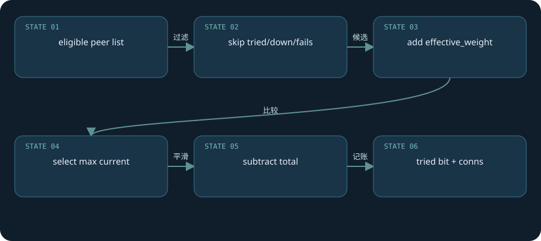

**真实源码：**[src/http/ngx_http_upstream_round_robin.c · L703—L779](https://github.com/nginx/nginx/blob/481d28cb4e04c8096b9b6134856891dc52ecc68f/src/http/ngx_http_upstream_round_robin.c#L703-L779)。连续原文，包含所讨论函数的完整分支与边界。

```c
static ngx_http_upstream_rr_peer_t *
ngx_http_upstream_get_peer(ngx_http_upstream_rr_peer_data_t *rrp)
{
    time_t                        now;
    uintptr_t                     m;
    ngx_int_t                     total;
    ngx_uint_t                    i, n, p;
    ngx_http_upstream_rr_peer_t  *peer, *best;

    now = ngx_time();

    best = NULL;
    total = 0;

#if (NGX_SUPPRESS_WARN)
    p = 0;
#endif

    for (peer = rrp->peers->peer, i = 0;
         peer;
         peer = peer->next, i++)
    {
        n = i / (8 * sizeof(uintptr_t));
        m = (uintptr_t) 1 << i % (8 * sizeof(uintptr_t));

        if (rrp->tried[n] & m) {
            continue;
        }

        if (peer->down) {
            continue;
        }

        if (peer->max_fails
            && peer->fails >= peer->max_fails
            && now - peer->checked <= peer->fail_timeout)
        {
            continue;
        }

        if (peer->max_conns && peer->conns >= peer->max_conns) {
            continue;
        }

        peer->current_weight += peer->effective_weight;
        total += peer->effective_weight;

        if (peer->effective_weight < peer->weight) {
            peer->effective_weight++;
        }

        if (best == NULL || peer->current_weight > best->current_weight) {
            best = peer;
            p = i;
        }
    }

    if (best == NULL) {
        return NULL;
    }

    rrp->current = best;
    ngx_http_upstream_rr_peer_ref(rrp->peers, best);

    n = p / (8 * sizeof(uintptr_t));
    m = (uintptr_t) 1 << p % (8 * sizeof(uintptr_t));

    rrp->tried[n] |= m;

    best->current_weight -= total;

    if (now - best->checked > best->fail_timeout) {
        best->checked = now;
    }

    return best;
}
```

**纸面推演：**A权重2，B权重1，初始current=0；第一次加到2/1选A并减3得-1/1；第二次加到1/2选B得1/-1；第三次加到3/0选A得0/0。三次A/B/A，下一周期重复。这是假设候选可用且effective=weight的精简推演。

**补充源码：**[`tried与减权 · L764–L778`](https://github.com/nginx/nginx/blob/481d28cb4e04c8096b9b6134856891dc52ecc68f/src/http/ngx_http_upstream_round_robin.c#L764-L778)。least_conn、ip_hash、hash等有独立选择器，不应把round-robin字段变化直接代入。

**实验：**起两个lab后端并设置2:1，单worker、顺序curl若干次记录upstream_addr。并发、多worker、失败、keepalive复用都可改变观察序列；本文未执行这个分布测试。

[返回目录](#top)

<a id="chapter-18"></a>

# 18 · 重试：字节重放与业务重复

**next_upstream是条件集合，不是保证**

`ngx_http_upstream_next`接收失败类型bitmask，释放当前peer并映射状态。连接错误、timeout、invalid_header与被配置的HTTP响应状态有不同mask。之后同时检查剩余tries、允许重试的mask、已发送非buffered body以及next_upstream总尝试时间。只有所有条件满足，才重新连接另一个peer。

对已发送POST/LOCK/PATCH，代码加`NGX_HTTP_UPSTREAM_FT_NON_IDEMPOTENT`，需显式允许相应行为才能跨过mask判断。即便GET在协议语义上应安全，如果业务错误地用GET执行扣款，NGINX并不知道。接收响应头和向客户端发出响应是不同边界；一旦已经向客户端发送响应内容，无法撤回旧响应再完整替换，后续body失败通常走finalize而不是干净的新响应。

请求体buffering off并已发送时，代码直接阻止重试，因为数据未必可再次重放。next_upstream_timeout是尝试预算，和connect/read/send各阶段间隔超时并列；零值、tries上限和已尝试peer都影响终止条件。HTTP404等状态是否计入peer失败，还需读free-peer分支，不能把全部4xx都叫上游故障。

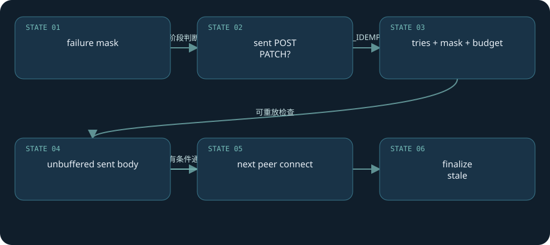

**真实源码：**[src/http/ngx_http_upstream.c · L4379—L4532](https://github.com/nginx/nginx/blob/481d28cb4e04c8096b9b6134856891dc52ecc68f/src/http/ngx_http_upstream.c#L4379-L4532)。连续原文，包含所讨论函数的完整分支与边界。

```c
static void
ngx_http_upstream_next(ngx_http_request_t *r, ngx_http_upstream_t *u,
    ngx_uint_t ft_type)
{
    ngx_msec_t  timeout;
    ngx_uint_t  status, state;

    ngx_log_debug1(NGX_LOG_DEBUG_HTTP, r->connection->log, 0,
                   "http next upstream, %xi", ft_type);

    if (u->peer.sockaddr) {

        if (u->peer.connection) {
            u->state->bytes_sent = u->peer.connection->sent;
        }

        if (ft_type == NGX_HTTP_UPSTREAM_FT_HTTP_403
            || ft_type == NGX_HTTP_UPSTREAM_FT_HTTP_404)
        {
            state = NGX_PEER_NEXT;

        } else {
            state = NGX_PEER_FAILED;
        }

        u->peer.free(&u->peer, u->peer.data, state);
        u->peer.sockaddr = NULL;
    }

    if (ft_type == NGX_HTTP_UPSTREAM_FT_TIMEOUT) {
        ngx_log_error(NGX_LOG_ERR, r->connection->log, NGX_ETIMEDOUT,
                      "upstream timed out");
    }

    if (u->peer.cached && ft_type == NGX_HTTP_UPSTREAM_FT_ERROR) {
        /* TODO: inform balancer instead */
        u->peer.tries++;
    }

    switch (ft_type) {

    case NGX_HTTP_UPSTREAM_FT_TIMEOUT:
    case NGX_HTTP_UPSTREAM_FT_HTTP_504:
        status = NGX_HTTP_GATEWAY_TIME_OUT;
        break;

    case NGX_HTTP_UPSTREAM_FT_HTTP_500:
        status = NGX_HTTP_INTERNAL_SERVER_ERROR;
        break;

    case NGX_HTTP_UPSTREAM_FT_HTTP_503:
        status = NGX_HTTP_SERVICE_UNAVAILABLE;
        break;

    case NGX_HTTP_UPSTREAM_FT_HTTP_403:
        status = NGX_HTTP_FORBIDDEN;
        break;

    case NGX_HTTP_UPSTREAM_FT_HTTP_404:
        status = NGX_HTTP_NOT_FOUND;
        break;

    case NGX_HTTP_UPSTREAM_FT_HTTP_429:
        status = NGX_HTTP_TOO_MANY_REQUESTS;
        break;

    /*
     * NGX_HTTP_UPSTREAM_FT_BUSY_LOCK and NGX_HTTP_UPSTREAM_FT_MAX_WAITING
     * never reach here
     */

    default:
        status = NGX_HTTP_BAD_GATEWAY;
    }

    if (r->connection->error) {
        ngx_http_upstream_finalize_request(r, u,
                                           NGX_HTTP_CLIENT_CLOSED_REQUEST);
        return;
    }

    u->state->status = status;

    timeout = u->conf->next_upstream_timeout;

    if (u->request_sent
        && (r->method & (NGX_HTTP_POST|NGX_HTTP_LOCK|NGX_HTTP_PATCH)))
    {
        ft_type |= NGX_HTTP_UPSTREAM_FT_NON_IDEMPOTENT;
    }

    if (u->peer.tries == 0
        || ((u->conf->next_upstream & ft_type) != ft_type)
        || (u->request_sent && r->request_body_no_buffering)
        || (timeout && ngx_current_msec - u->peer.start_time >= timeout))
    {
#if (NGX_HTTP_CACHE)

        if (u->cache_status == NGX_HTTP_CACHE_EXPIRED
            && ((u->conf->cache_use_stale & ft_type) || r->cache->stale_error))
        {
            ngx_int_t  rc;

            rc = u->reinit_request(r);

            if (rc != NGX_OK) {
                ngx_http_upstream_finalize_request(r, u, rc);
                return;
            }

            u->cache_status = NGX_HTTP_CACHE_STALE;
            rc = ngx_http_upstream_cache_send(r, u);

            if (rc == NGX_DONE) {
                return;
            }

            if (rc == NGX_HTTP_UPSTREAM_INVALID_HEADER) {
                rc = NGX_HTTP_INTERNAL_SERVER_ERROR;
            }

            ngx_http_upstream_finalize_request(r, u, rc);
            return;
        }
#endif

        ngx_http_upstream_finalize_request(r, u, status);
        return;
    }

    if (u->peer.connection) {
        ngx_log_debug1(NGX_LOG_DEBUG_HTTP, r->connection->log, 0,
                       "close http upstream connection: %d",
                       u->peer.connection->fd);
#if (NGX_HTTP_SSL)

        if (u->peer.connection->ssl) {
            u->peer.connection->ssl->no_wait_shutdown = 1;
            u->peer.connection->ssl->no_send_shutdown = 1;

            (void) ngx_ssl_shutdown(u->peer.connection);
        }
#endif

        if (u->peer.connection->pool) {
            ngx_destroy_pool(u->peer.connection->pool);
        }

        ngx_close_connection(u->peer.connection);
        u->peer.connection = NULL;
    }

    ngx_http_upstream_connect(r, u);
}
```

**失败推演：**后端已写入订单但连接在响应前断开，代理只知道“未得到成功响应”。允许重试可能产生第二次提交；禁止重试也不能断言第一次失败。业务需要幂等键与查询补偿来确定结果。

**实验：**lab的失联primary+可用backup，用GET观察重试列表；POST实验必须用只统计字节的`/echo`虚构端点。将`proxy_next_upstream off`应直接暴露primary连接错误，将`... error timeout`恢复后GET可切backup。默认非幂等保护与“请求是否已发送”的时点必须通过日志确认，不预设POST必然或绝不重试。

**知识回顾：**重试资格由失败类型、请求阶段、可重放性和预算共同决定；NGINX处理网络重试，业务处理一次性效果。

[返回目录](#top)

<a id="chapter-19"></a>

# 19 · 上游keepalive与DNS边界

**连接缓存通常在每个worker内部**

upstream keepalive模块包装原来的peer get/free回调。先进行负载选择，再按socket地址在本worker缓存队列找可复用连接；命中时从cache队列移到free队列，清idle、恢复log、删除idle read timer，设置`pc->connection`和cached标志，返回NGX_DONE。它是已有socket复用，不是一次新connect的完成通知。

`keepalive N`限制每worker保存的空闲连接数量，不等于所有活动连接上限，也不是客户端keepalive超时。HTTP代理要正确使用`proxy_http_version 1.1`并清除Connection header，避免上游主动关闭。在本书1.28.0基线中显式写这两项，不能拿较新版本默认值代替固定基线。server关闭、EOF、超过请求数或时间上限会让连接不能进缓存。

静态域名解析、变量proxy_pass配合resolver、upstream server resolve是不同路径。1.28.0源码含开源共享zone与动态resolve支持；需要相应resolver、zone与参数配置。不要笼统声称“NGINX永远只在启动解析DNS”，也不要以配置了resolver就断言所有静态server都自动刷新。DNS变化不能迁移已存在的socket。

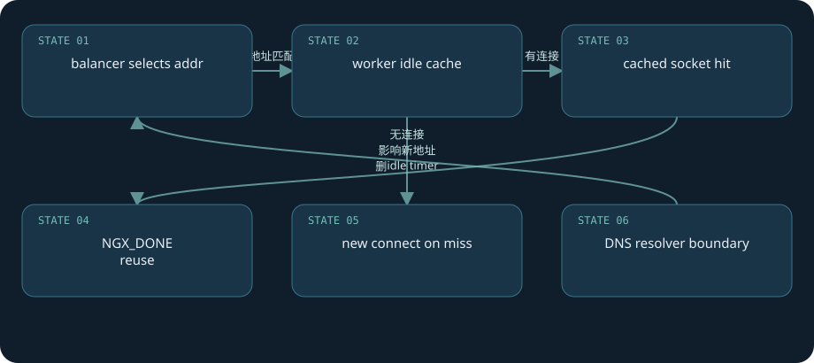

**真实源码：**[src/http/modules/ngx_http_upstream_keepalive_module.c · L235—L301](https://github.com/nginx/nginx/blob/481d28cb4e04c8096b9b6134856891dc52ecc68f/src/http/modules/ngx_http_upstream_keepalive_module.c#L235-L301)。连续原文，包含所讨论函数的完整分支与边界。

```c
static ngx_int_t
ngx_http_upstream_get_keepalive_peer(ngx_peer_connection_t *pc, void *data)
{
    ngx_http_upstream_keepalive_peer_data_t  *kp = data;
    ngx_http_upstream_keepalive_cache_t      *item;

    ngx_int_t          rc;
    ngx_queue_t       *q, *cache;
    ngx_connection_t  *c;

    ngx_log_debug0(NGX_LOG_DEBUG_HTTP, pc->log, 0,
                   "get keepalive peer");

    /* ask balancer */

    rc = kp->original_get_peer(pc, kp->data);

    if (rc != NGX_OK) {
        return rc;
    }

    /* search cache for suitable connection */

    cache = &kp->conf->cache;

    for (q = ngx_queue_head(cache);
         q != ngx_queue_sentinel(cache);
         q = ngx_queue_next(q))
    {
        item = ngx_queue_data(q, ngx_http_upstream_keepalive_cache_t, queue);
        c = item->connection;

        if (ngx_memn2cmp((u_char *) &item->sockaddr, (u_char *) pc->sockaddr,
                         item->socklen, pc->socklen)
            == 0)
        {
            ngx_queue_remove(q);
            ngx_queue_insert_head(&kp->conf->free, q);

            goto found;
        }
    }

    return NGX_OK;

found:

    ngx_log_debug1(NGX_LOG_DEBUG_HTTP, pc->log, 0,
                   "get keepalive peer: using connection %p", c);

    c->idle = 0;
    c->sent = 0;
    c->data = NULL;
    c->log = pc->log;
    c->read->log = pc->log;
    c->write->log = pc->log;
    c->pool->log = pc->log;

    if (c->read->timer_set) {
        ngx_del_timer(c->read);
    }

    pc->connection = c;
    pc->cached = 1;

    return NGX_DONE;
}
```

**失败后果：**后端先关闭了空闲socket，而代理刚准备复用，可能第一次发送遇到错误然后进入重试。大量idle连接会占fd和connection槽，连接缓存大小必须和上游容量、worker数一起预算。

**实验：**lab app upstream设置keepalive16，重复请求看`upstream_connect_time`与后端连接来源端口；单凭`0.000`不能严谨证明复用，也可能是新连接极快。后端日志或debug cache-hit消息更有说服力。DNS实验需自建可控解析器，本书未执行。

**官方辅助入口：**[upstream模块](https://nginx.org/en/docs/http/ngx_http_upstream_module.html)。教程不借用商业模块能力补全开源基线。

[返回目录](#top)

<a id="chapter-20"></a>

# 20 · proxy buffer与背压：两边速度不一致

**响应缓冲和请求缓冲是两套开关**

`proxy_buffering on`进入event pipe路径，`ngx_event_pipe`循环推进上游读取和下游输出；`bufs、busy、free、in、out`以及temp_file跟踪缓冲和所有权。`proxy_buffer_size`主要影响首段/响应头，`proxy_buffers`提供body缓冲，`proxy_busy_buffers_size`控制用于发送的忙缓冲量。响应头过大需要看header buffer，不应盲增所有body buffer。

快上游、慢客户端时，缓冲让上游更早释放；内存不够可写临时文件，受max_temp_file_size等配置限制。temp file空间、权限、磁盘吞吐可能成为瓶颈。写盘与cache/store并不是一回事：临时缓冲文件未必是可复用缓存。配置buffering off换成non-buffered read/write handlers，仍有有限buffer与输出链，并非“完全不分配内存”。

当缓冲满且下游未消费，read路径必须等待，让背压逐层传给上游。`X-Accel-Buffering`响应头可以影响代理模式，除非配置忽略；SSE等流式场景通常需要检查buffering、flush和超时，不能仅关一个开关后承诺每个应用字节都立刻抵达客户端。

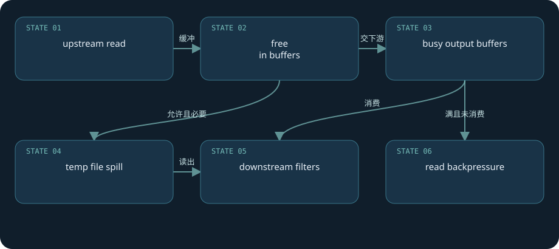

**真实源码：**[src/http/ngx_http_upstream.c · L3056—L3396](https://github.com/nginx/nginx/blob/481d28cb4e04c8096b9b6134856891dc52ecc68f/src/http/ngx_http_upstream.c#L3056-L3396)。连续原文，包含所讨论函数的完整分支与边界。

```c
static void
ngx_http_upstream_send_response(ngx_http_request_t *r, ngx_http_upstream_t *u)
{
    ssize_t                    n;
    ngx_int_t                  rc;
    ngx_event_pipe_t          *p;
    ngx_connection_t          *c;
    ngx_http_core_loc_conf_t  *clcf;

    rc = ngx_http_send_header(r);

    if (rc == NGX_ERROR || rc > NGX_OK || r->post_action) {
        ngx_http_upstream_finalize_request(r, u, rc);
        return;
    }

    u->header_sent = 1;

    if (u->upgrade) {

#if (NGX_HTTP_CACHE)

        if (r->cache) {
            ngx_http_file_cache_free(r->cache, u->pipe->temp_file);
        }

#endif

        ngx_http_upstream_upgrade(r, u);
        return;
    }

    c = r->connection;

    if (r->header_only) {

        if (!u->buffering) {
            ngx_http_upstream_finalize_request(r, u, rc);
            return;
        }

        if (!u->cacheable && !u->store) {
            ngx_http_upstream_finalize_request(r, u, rc);
            return;
        }

        u->pipe->downstream_error = 1;
    }

    if (r->request_body && r->request_body->temp_file
        && r == r->main && !r->preserve_body
        && !u->conf->preserve_output)
    {
        ngx_pool_run_cleanup_file(r->pool, r->request_body->temp_file->file.fd);
        r->request_body->temp_file->file.fd = NGX_INVALID_FILE;
    }

    clcf = ngx_http_get_module_loc_conf(r, ngx_http_core_module);

    if (!u->buffering) {

#if (NGX_HTTP_CACHE)

        if (r->cache) {
            ngx_http_file_cache_free(r->cache, u->pipe->temp_file);
        }

#endif

        if (u->input_filter == NULL) {
            u->input_filter_init = ngx_http_upstream_non_buffered_filter_init;
            u->input_filter = ngx_http_upstream_non_buffered_filter;
            u->input_filter_ctx = r;
        }

        u->read_event_handler = ngx_http_upstream_process_non_buffered_upstream;
        r->write_event_handler =
                             ngx_http_upstream_process_non_buffered_downstream;

        r->limit_rate = 0;
        r->limit_rate_set = 1;

        if (u->input_filter_init(u->input_filter_ctx) == NGX_ERROR) {
            ngx_http_upstream_finalize_request(r, u, NGX_ERROR);
            return;
        }

        if (clcf->tcp_nodelay && ngx_tcp_nodelay(c) != NGX_OK) {
            ngx_http_upstream_finalize_request(r, u, NGX_ERROR);
            return;
        }

        n = u->buffer.last - u->buffer.pos;

        if (n) {
            u->buffer.last = u->buffer.pos;

            u->state->response_length += n;

            if (u->input_filter(u->input_filter_ctx, n) == NGX_ERROR) {
                ngx_http_upstream_finalize_request(r, u, NGX_ERROR);
                return;
            }

            ngx_http_upstream_process_non_buffered_downstream(r);

        } else {
            u->buffer.pos = u->buffer.start;
            u->buffer.last = u->buffer.start;

            if (ngx_http_send_special(r, NGX_HTTP_FLUSH) == NGX_ERROR) {
                ngx_http_upstream_finalize_request(r, u, NGX_ERROR);
                return;
            }

            ngx_http_upstream_process_non_buffered_upstream(r, u);
        }

        return;
    }

    /* TODO: preallocate event_pipe bufs, look "Content-Length" */

#if (NGX_HTTP_CACHE)

    if (r->cache && r->cache->file.fd != NGX_INVALID_FILE) {
        ngx_pool_run_cleanup_file(r->pool, r->cache->file.fd);
        r->cache->file.fd = NGX_INVALID_FILE;
    }

    switch (ngx_http_test_predicates(r, u->conf->no_cache)) {

    case NGX_ERROR:
        ngx_http_upstream_finalize_request(r, u, NGX_ERROR);
        return;

    case NGX_DECLINED:
        u->cacheable = 0;
        break;

    default: /* NGX_OK */

        if (u->cache_status == NGX_HTTP_CACHE_BYPASS) {

            /* create cache if previously bypassed */

            if (ngx_http_file_cache_create(r) != NGX_OK) {
                ngx_http_upstream_finalize_request(r, u, NGX_ERROR);
                return;
            }
        }

        break;
    }

    if (u->cacheable) {
        time_t  now, valid;

        now = ngx_time();

        valid = r->cache->valid_sec;

        if (valid == 0) {
            valid = ngx_http_file_cache_valid(u->conf->cache_valid,
                                              u->headers_in.status_n);
            if (valid) {
                r->cache->valid_sec = now + valid;
            }
        }

        if (valid) {
            r->cache->date = now;
            r->cache->body_start = (u_short) (u->buffer.pos - u->buffer.start);

            if (u->headers_in.status_n == NGX_HTTP_OK
                || u->headers_in.status_n == NGX_HTTP_PARTIAL_CONTENT)
            {
                r->cache->last_modified = u->headers_in.last_modified_time;

                if (u->headers_in.etag) {
                    r->cache->etag = u->headers_in.etag->value;

                } else {
                    ngx_str_null(&r->cache->etag);
                }

            } else {
                r->cache->last_modified = -1;
                ngx_str_null(&r->cache->etag);
            }

            if (ngx_http_file_cache_set_header(r, u->buffer.start) != NGX_OK) {
                ngx_http_upstream_finalize_request(r, u, NGX_ERROR);
                return;
            }

        } else {
            u->cacheable = 0;
        }
    }

    ngx_log_debug1(NGX_LOG_DEBUG_HTTP, c->log, 0,
                   "http cacheable: %d", u->cacheable);

    if (u->cacheable == 0 && r->cache) {
        ngx_http_file_cache_free(r->cache, u->pipe->temp_file);
    }

    if (r->header_only && !u->cacheable && !u->store) {
        ngx_http_upstream_finalize_request(r, u, 0);
        return;
    }

#endif

    p = u->pipe;

    p->output_filter = ngx_http_upstream_output_filter;
    p->output_ctx = r;
    p->tag = u->output.tag;
    p->bufs = u->conf->bufs;
    p->busy_size = u->conf->busy_buffers_size;
    p->upstream = u->peer.connection;
    p->downstream = c;
    p->pool = r->pool;
    p->log = c->log;
    p->limit_rate = ngx_http_complex_value_size(r, u->conf->limit_rate, 0);
    p->start_sec = ngx_time();

    p->cacheable = u->cacheable || u->store;

    p->temp_file = ngx_pcalloc(r->pool, sizeof(ngx_temp_file_t));
    if (p->temp_file == NULL) {
        ngx_http_upstream_finalize_request(r, u, NGX_ERROR);
        return;
    }

    p->temp_file->file.fd = NGX_INVALID_FILE;
    p->temp_file->file.log = c->log;
    p->temp_file->path = u->conf->temp_path;
    p->temp_file->pool = r->pool;

    if (p->cacheable) {
        p->temp_file->persistent = 1;

#if (NGX_HTTP_CACHE)
        if (r->cache && !r->cache->file_cache->use_temp_path) {
            p->temp_file->path = r->cache->file_cache->path;
            p->temp_file->file.name = r->cache->file.name;
        }
#endif

    } else {
        p->temp_file->log_level = NGX_LOG_WARN;
        p->temp_file->warn = "an upstream response is buffered "
                             "to a temporary file";
    }

    p->max_temp_file_size = u->conf->max_temp_file_size;
    p->temp_file_write_size = u->conf->temp_file_write_size;

#if (NGX_THREADS)
    if (clcf->aio == NGX_HTTP_AIO_THREADS && clcf->aio_write) {
        p->thread_handler = ngx_http_upstream_thread_handler;
        p->thread_ctx = r;
    }
#endif

    p->preread_bufs = ngx_alloc_chain_link(r->pool);
    if (p->preread_bufs == NULL) {
        ngx_http_upstream_finalize_request(r, u, NGX_ERROR);
        return;
    }

    p->preread_bufs->buf = &u->buffer;
    p->preread_bufs->next = NULL;
    u->buffer.recycled = 1;

    p->preread_size = u->buffer.last - u->buffer.pos;

    if (u->cacheable) {

        p->buf_to_file = ngx_calloc_buf(r->pool);
        if (p->buf_to_file == NULL) {
            ngx_http_upstream_finalize_request(r, u, NGX_ERROR);
            return;
        }

        p->buf_to_file->start = u->buffer.start;
        p->buf_to_file->pos = u->buffer.start;
        p->buf_to_file->last = u->buffer.pos;
        p->buf_to_file->temporary = 1;
    }

    if (ngx_event_flags & NGX_USE_IOCP_EVENT) {
        /* the posted aio operation may corrupt a shadow buffer */
        p->single_buf = 1;
    }

    /* TODO: p->free_bufs = 0 if use ngx_create_chain_of_bufs() */
    p->free_bufs = 1;

    /*
     * event_pipe would do u->buffer.last += p->preread_size
     * as though these bytes were read
     */
    u->buffer.last = u->buffer.pos;

    if (u->conf->cyclic_temp_file) {

        /*
         * we need to disable the use of sendfile() if we use cyclic temp file
         * because the writing a new data may interfere with sendfile()
         * that uses the same kernel file pages (at least on FreeBSD)
         */

        p->cyclic_temp_file = 1;
        c->sendfile = 0;

    } else {
        p->cyclic_temp_file = 0;
    }

    p->read_timeout = u->conf->read_timeout;
    p->send_timeout = clcf->send_timeout;
    p->send_lowat = clcf->send_lowat;

    p->length = -1;

    if (u->input_filter_init
        && u->input_filter_init(p->input_ctx) != NGX_OK)
    {
        ngx_http_upstream_finalize_request(r, u, NGX_ERROR);
        return;
    }

    u->read_event_handler = ngx_http_upstream_process_upstream;
    r->write_event_handler = ngx_http_upstream_process_downstream;

    ngx_http_upstream_process_upstream(r, u);
}
```

**链路对照：**buffered：上游event → event_pipe_read_upstream → buffer/temp → write_to_downstream → output filters；non-buffered：process_non_buffered_upstream/downstream → shared progress → output filters。两套路径都遵循NGX_AGAIN恢复与引用清理。

**实验：**用lab`/slow?gap=0.2`配`curl -N`看流式响应；用`/blob?size=8388608`配curl限速，观察temp目录和后端发送完成时点。配置`proxy_max_temp_file_size 0`限制临时落盘并不等于禁用cache，也不是内存无限增长承诺。

**源码补充：**[`event_pipe loop · L23–L66`](https://github.com/nginx/nginx/blob/481d28cb4e04c8096b9b6134856891dc52ecc68f/src/event/ngx_event_pipe.c#L23-L66)。本文未执行慢消费者或磁盘压力测试。

[返回目录](#top)

<a id="chapter-21"></a>

# 21 · 输出filter与sendfile：剩余链就是进度

**返回成功不代表客户端已收到全部**

`ngx_http_output_filter`把body链交给`ngx_http_top_body_filter`，模块按初始化时的挂接顺序组成链。gzip、range、chunked、copy等模块根据编译和响应条件参与处理，最终write filter调用连接`send_chain`。header filter是另一条链，先生成状态行与headers；启用HTTP/2/3时还会转为对应协议帧，不是简单沿HTTP/1.1文本输出。

write filter收集`r->out`，检查flush/last/缓冲标志，计算limit与sendfile_max_chunk，调用`c->send_chain(c,r->out,limit)`。返回链指向尚未发送的部分，发送错误才是NGX_CHAIN_ERROR。输出到socket发送缓冲也不等于远端应用已经处理；连接层只保证按自身传输进度推进。

静态文件路径可用文件buffer加sendfile减少用户态拷贝，但不意味着磁盘I/O永远非阻塞，也不意味着所有TLS场景都能用普通sendfile。Linux sendfile链、FreeBSD sendfile链、SSL send_chain以及可选kTLS能力有不同实现/构建边界。gzip往往需要读取并转换body，不能拿“零拷贝”标签代替实际filter判断。

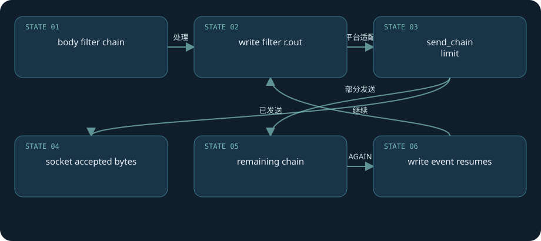

**真实源码：**[src/http/ngx_http_write_filter_module.c · L47—L362](https://github.com/nginx/nginx/blob/481d28cb4e04c8096b9b6134856891dc52ecc68f/src/http/ngx_http_write_filter_module.c#L47-L362)。连续原文，包含所讨论函数的完整分支与边界。

```c
ngx_int_t
ngx_http_write_filter(ngx_http_request_t *r, ngx_chain_t *in)
{
    off_t                      size, sent, nsent, limit;
    ngx_uint_t                 last, flush, sync;
    ngx_msec_t                 delay;
    ngx_chain_t               *cl, *ln, **ll, *chain;
    ngx_connection_t          *c;
    ngx_http_core_loc_conf_t  *clcf;

    c = r->connection;

    if (c->error) {
        return NGX_ERROR;
    }

    size = 0;
    flush = 0;
    sync = 0;
    last = 0;
    ll = &r->out;

    /* find the size, the flush point and the last link of the saved chain */

    for (cl = r->out; cl; cl = cl->next) {
        ll = &cl->next;

        ngx_log_debug7(NGX_LOG_DEBUG_EVENT, c->log, 0,
                       "write old buf t:%d f:%d %p, pos %p, size: %z "
                       "file: %O, size: %O",
                       cl->buf->temporary, cl->buf->in_file,
                       cl->buf->start, cl->buf->pos,
                       cl->buf->last - cl->buf->pos,
                       cl->buf->file_pos,
                       cl->buf->file_last - cl->buf->file_pos);

        if (ngx_buf_size(cl->buf) == 0 && !ngx_buf_special(cl->buf)) {
            ngx_log_error(NGX_LOG_ALERT, c->log, 0,
                          "zero size buf in writer "
                          "t:%d r:%d f:%d %p %p-%p %p %O-%O",
                          cl->buf->temporary,
                          cl->buf->recycled,
                          cl->buf->in_file,
                          cl->buf->start,
                          cl->buf->pos,
                          cl->buf->last,
                          cl->buf->file,
                          cl->buf->file_pos,
                          cl->buf->file_last);

            ngx_debug_point();
            return NGX_ERROR;
        }

        if (ngx_buf_size(cl->buf) < 0) {
            ngx_log_error(NGX_LOG_ALERT, c->log, 0,
                          "negative size buf in writer "
                          "t:%d r:%d f:%d %p %p-%p %p %O-%O",
                          cl->buf->temporary,
                          cl->buf->recycled,
                          cl->buf->in_file,
                          cl->buf->start,
                          cl->buf->pos,
                          cl->buf->last,
                          cl->buf->file,
                          cl->buf->file_pos,
                          cl->buf->file_last);

            ngx_debug_point();
            return NGX_ERROR;
        }

        size += ngx_buf_size(cl->buf);

        if (cl->buf->flush || cl->buf->recycled) {
            flush = 1;
        }

        if (cl->buf->sync) {
            sync = 1;
        }

        if (cl->buf->last_buf) {
            last = 1;
        }
    }

    /* add the new chain to the existent one */

    for (ln = in; ln; ln = ln->next) {
        cl = ngx_alloc_chain_link(r->pool);
        if (cl == NULL) {
            return NGX_ERROR;
        }

        cl->buf = ln->buf;
        *ll = cl;
        ll = &cl->next;

        ngx_log_debug7(NGX_LOG_DEBUG_EVENT, c->log, 0,
                       "write new buf t:%d f:%d %p, pos %p, size: %z "
                       "file: %O, size: %O",
                       cl->buf->temporary, cl->buf->in_file,
                       cl->buf->start, cl->buf->pos,
                       cl->buf->last - cl->buf->pos,
                       cl->buf->file_pos,
                       cl->buf->file_last - cl->buf->file_pos);

        if (ngx_buf_size(cl->buf) == 0 && !ngx_buf_special(cl->buf)) {
            ngx_log_error(NGX_LOG_ALERT, c->log, 0,
                          "zero size buf in writer "
                          "t:%d r:%d f:%d %p %p-%p %p %O-%O",
                          cl->buf->temporary,
                          cl->buf->recycled,
                          cl->buf->in_file,
                          cl->buf->start,
                          cl->buf->pos,
                          cl->buf->last,
                          cl->buf->file,
                          cl->buf->file_pos,
                          cl->buf->file_last);

            ngx_debug_point();
            return NGX_ERROR;
        }

        if (ngx_buf_size(cl->buf) < 0) {
            ngx_log_error(NGX_LOG_ALERT, c->log, 0,
                          "negative size buf in writer "
                          "t:%d r:%d f:%d %p %p-%p %p %O-%O",
                          cl->buf->temporary,
                          cl->buf->recycled,
                          cl->buf->in_file,
                          cl->buf->start,
                          cl->buf->pos,
                          cl->buf->last,
                          cl->buf->file,
                          cl->buf->file_pos,
                          cl->buf->file_last);

            ngx_debug_point();
            return NGX_ERROR;
        }

        size += ngx_buf_size(cl->buf);

        if (cl->buf->flush || cl->buf->recycled) {
            flush = 1;
        }

        if (cl->buf->sync) {
            sync = 1;
        }

        if (cl->buf->last_buf) {
            last = 1;
        }
    }

    *ll = NULL;

    ngx_log_debug3(NGX_LOG_DEBUG_HTTP, c->log, 0,
                   "http write filter: l:%ui f:%ui s:%O", last, flush, size);

    clcf = ngx_http_get_module_loc_conf(r, ngx_http_core_module);

    /*
     * avoid the output if there are no last buf, no flush point,
     * there are the incoming bufs and the size of all bufs
     * is smaller than "postpone_output" directive
     */

    if (!last && !flush && in && size < (off_t) clcf->postpone_output) {
        return NGX_OK;
    }

    if (c->write->delayed) {
        c->buffered |= NGX_HTTP_WRITE_BUFFERED;
        return NGX_AGAIN;
    }

    if (size == 0
        && !(c->buffered & NGX_LOWLEVEL_BUFFERED)
        && !(last && c->need_last_buf)
        && !(flush && c->need_flush_buf))
    {
        if (last || flush || sync) {
            for (cl = r->out; cl; /* void */) {
                ln = cl;
                cl = cl->next;
                ngx_free_chain(r->pool, ln);
            }

            r->out = NULL;
            c->buffered &= ~NGX_HTTP_WRITE_BUFFERED;

            if (last) {
                r->response_sent = 1;
            }

            return NGX_OK;
        }

        ngx_log_error(NGX_LOG_ALERT, c->log, 0,
                      "the http output chain is empty");

        ngx_debug_point();

        return NGX_ERROR;
    }

    if (!r->limit_rate_set) {
        r->limit_rate = ngx_http_complex_value_size(r, clcf->limit_rate, 0);
        r->limit_rate_set = 1;
    }

    if (r->limit_rate) {

        if (!r->limit_rate_after_set) {
            r->limit_rate_after = ngx_http_complex_value_size(r,
                                                    clcf->limit_rate_after, 0);
            r->limit_rate_after_set = 1;
        }

        limit = (off_t) r->limit_rate * (ngx_time() - r->start_sec + 1)
                - (c->sent - r->limit_rate_after);

        if (limit <= 0) {
            c->write->delayed = 1;
            delay = (ngx_msec_t) (- limit * 1000 / r->limit_rate + 1);
            ngx_add_timer(c->write, delay);

            c->buffered |= NGX_HTTP_WRITE_BUFFERED;

            return NGX_AGAIN;
        }

        if (clcf->sendfile_max_chunk
            && (off_t) clcf->sendfile_max_chunk < limit)
        {
            limit = clcf->sendfile_max_chunk;
        }

    } else {
        limit = clcf->sendfile_max_chunk;
    }

    sent = c->sent;

    ngx_log_debug1(NGX_LOG_DEBUG_HTTP, c->log, 0,
                   "http write filter limit %O", limit);

    chain = c->send_chain(c, r->out, limit);

    ngx_log_debug1(NGX_LOG_DEBUG_HTTP, c->log, 0,
                   "http write filter %p", chain);

    if (chain == NGX_CHAIN_ERROR) {
        c->error = 1;
        return NGX_ERROR;
    }

    if (r->limit_rate) {

        nsent = c->sent;

        if (r->limit_rate_after) {

            sent -= r->limit_rate_after;
            if (sent < 0) {
                sent = 0;
            }

            nsent -= r->limit_rate_after;
            if (nsent < 0) {
                nsent = 0;
            }
        }

        delay = (ngx_msec_t) ((nsent - sent) * 1000 / r->limit_rate);

        if (delay > 0) {
            c->write->delayed = 1;
            ngx_add_timer(c->write, delay);
        }
    }

    if (chain && c->write->ready && !c->write->delayed) {
        ngx_post_event(c->write, &ngx_posted_next_events);
    }

    for (cl = r->out; cl && cl != chain; /* void */) {
        ln = cl;
        cl = cl->next;
        ngx_free_chain(r->pool, ln);
    }

    r->out = chain;

    if (chain) {
        c->buffered |= NGX_HTTP_WRITE_BUFFERED;
        return NGX_AGAIN;
    }

    c->buffered &= ~NGX_HTTP_WRITE_BUFFERED;

    if (last) {
        r->response_sent = 1;
    }

    if ((c->buffered & NGX_LOWLEVEL_BUFFERED) && r->postponed == NULL) {
        return NGX_AGAIN;
    }

    return NGX_OK;
}
```

**第二证据：**[`Linux余量更新 · L200–L206`](https://github.com/nginx/nginx/blob/481d28cb4e04c8096b9b6134856891dc52ecc68f/src/os/unix/ngx_linux_sendfile_chain.c#L200-L206)推进c->sent与链，并在AGAIN时清write ready。`sendfile_max_chunk`是公平性边界，避免单条大连接在一次循环里独占过久。

**实验：**lab生成静态文件，`curl --limit-rate 32k /static/large.bin`看多个write推进；Linux可跟踪sendfile/writev，HTTPS应另读SSL调用。只要客户端收到字节不足，即使access日志已出现2xx，仍需检查body截断和curl退出值。

**失败后果：**下游关闭、内核写错、filter内存分配失败会终止传输。响应头已发出时，不能再把原来200完整替换成500。

[返回目录](#top)

<a id="chapter-22"></a>

# 22 · 文件缓存：索引共享，内容在磁盘

**cache hit是多阶段判断，不是一张map**

proxy cache至少两层：共享keys_zone里保存索引、状态、引用等，磁盘文件保存headers/body。`ngx_http_file_cache_open`通过r->cache检查waiting/reading，查询共享节点，再决定是否打开磁盘文件、读取header与有效期。cold启动期间loader逐步恢复索引；manager控制容量和失效清理。keys_zone容量不等于body缓存容量，max_size也不是请求buffer上限。

cache key由proxy配置生成，默认和scheme、proxy_host、request_uri等有关；用户自定义key必须包含业务隔离维度。请求Cookie本身不会自动禁止缓存，也不会自动进入默认cache key；响应Set-Cookie默认阻止保存，Authorization、Cache-Control与Vary另有资格或变体规则。不能把这几种头混成同一条规则，也不能仅凭GET+200就断言会落缓存。忽略响应缓存头可能缓存私人数据，教程采用无账号的虚构端点。

MISS可能发到上游，HIT从文件返回，EXPIRED可能等待刷新或重验证，STALE要符合策略。`proxy_cache_lock`协调同key填充者，等待和lock age/timeout是独立边界；它不是跨任意缓存key的一把全局请求锁。background update通过子请求等路径更新，跨进程共享状态仍需锁与引用管理。

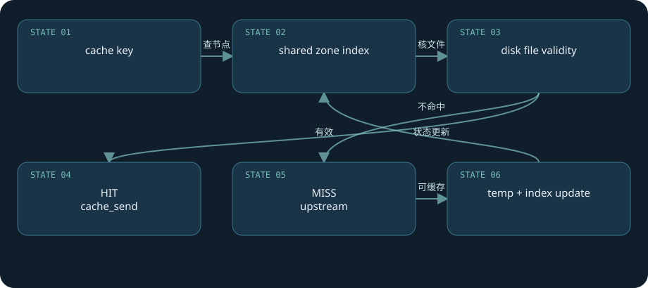

**真实源码：**[src/http/ngx_http_file_cache.c · L264—L401](https://github.com/nginx/nginx/blob/481d28cb4e04c8096b9b6134856891dc52ecc68f/src/http/ngx_http_file_cache.c#L264-L401)。连续原文，包含所讨论函数的完整分支与边界。

```c
ngx_int_t
ngx_http_file_cache_open(ngx_http_request_t *r)
{
    ngx_int_t                  rc, rv;
    ngx_uint_t                 test;
    ngx_http_cache_t          *c;
    ngx_pool_cleanup_t        *cln;
    ngx_open_file_info_t       of;
    ngx_http_file_cache_t     *cache;
    ngx_http_core_loc_conf_t  *clcf;

    c = r->cache;

    if (c->waiting) {
        return NGX_AGAIN;
    }

    if (c->reading) {
        return ngx_http_file_cache_read(r, c);
    }

    cache = c->file_cache;

    if (c->node == NULL) {
        cln = ngx_pool_cleanup_add(r->pool, 0);
        if (cln == NULL) {
            return NGX_ERROR;
        }

        cln->handler = ngx_http_file_cache_cleanup;
        cln->data = c;
    }

    c->buffer_size = c->body_start;

    rc = ngx_http_file_cache_exists(cache, c);

    ngx_log_debug2(NGX_LOG_DEBUG_HTTP, r->connection->log, 0,
                   "http file cache exists: %i e:%d", rc, c->exists);

    if (rc == NGX_ERROR) {
        return rc;
    }

    if (rc == NGX_AGAIN) {
        return NGX_HTTP_CACHE_SCARCE;
    }

    if (rc == NGX_OK) {

        if (c->error) {
            return c->error;
        }

        c->temp_file = 1;
        test = c->exists ? 1 : 0;
        rv = NGX_DECLINED;

    } else { /* rc == NGX_DECLINED */

        test = cache->sh->cold ? 1 : 0;

        if (c->min_uses > 1) {

            if (!test) {
                return NGX_HTTP_CACHE_SCARCE;
            }

            rv = NGX_HTTP_CACHE_SCARCE;

        } else {
            c->temp_file = 1;
            rv = NGX_DECLINED;
        }
    }

    if (ngx_http_file_cache_name(r, cache->path) != NGX_OK) {
        return NGX_ERROR;
    }

    if (!test) {
        goto done;
    }

    clcf = ngx_http_get_module_loc_conf(r, ngx_http_core_module);

    ngx_memzero(&of, sizeof(ngx_open_file_info_t));

    of.uniq = c->uniq;
    of.valid = clcf->open_file_cache_valid;
    of.min_uses = clcf->open_file_cache_min_uses;
    of.events = clcf->open_file_cache_events;
    of.directio = NGX_OPEN_FILE_DIRECTIO_OFF;
    of.read_ahead = clcf->read_ahead;

    if (ngx_open_cached_file(clcf->open_file_cache, &c->file.name, &of, r->pool)
        != NGX_OK)
    {
        switch (of.err) {

        case 0:
            return NGX_ERROR;

        case NGX_ENOENT:
        case NGX_ENOTDIR:
            goto done;

        default:
            ngx_log_error(NGX_LOG_CRIT, r->connection->log, of.err,
                          ngx_open_file_n " \"%s\" failed", c->file.name.data);
            return NGX_ERROR;
        }
    }

    ngx_log_debug1(NGX_LOG_DEBUG_HTTP, r->connection->log, 0,
                   "http file cache fd: %d", of.fd);

    c->file.fd = of.fd;
    c->file.log = r->connection->log;
    c->uniq = of.uniq;
    c->length = of.size;
    c->fs_size = (of.fs_size + cache->bsize - 1) / cache->bsize;

    c->buf = ngx_create_temp_buf(r->pool, c->body_start);
    if (c->buf == NULL) {
        return NGX_ERROR;
    }

    return ngx_http_file_cache_read(r, c);

done:

    if (rv == NGX_DECLINED) {
        return ngx_http_file_cache_lock(r, c);
    }

    return rv;
}
```

**完整链：**proxy create_key → file_cache_open → shared exists/lock → file read/validity → cache_send或upstream connect → temp写入 → 原子文件更新与索引状态更新。实际存在many分支，磁盘删除或权限变化仍可能使“索引存在”走回miss/error。

**实验：**lab`/cache/`两次curl `-i`，看`X-Lab-Cache`从MISS到HIT；等待有效期再请求观察过期路径，后端时间值帮助判断内容复用。并发首请求用于lock实验需控制上游变慢，不能只凭HIT比例证明没有重复回源。

**失败边界：**cache key漏租户维度比缓存未命中严重得多；服务不可用时use_stale提高可用性，但内容过旧的业务后果由应用决定。对登录态请求要按业务定义同一个绕过条件，分别配置proxy_cache_bypass（不读缓存）和proxy_no_cache（不保存响应）；只禁保存仍可能读到已有缓存，只禁读取仍可能把私人响应存进去。本书未执行缓存流程，配置和预期依据固定代码。

[返回目录](#top)

<a id="chapter-23"></a>

# 23 · 限流：共享内存漏桶与延迟事件

**excess是固定精度负债，不是请求数队列**

limit_req在PREACCESS注册handler，计算配置的complex key，hash查共享红黑树，使用共享slab mutex保护节点。相同hash还比较key字节，不能把CRC碰撞视为相同用户。节点保留last、excess、count和队列链接；队列帮助回收过期状态，slab负责共享区内存分配。

命中节点后计算`excess = old_excess - rate * ms / 1000 + 1000`并下限截0。rate/excess以千分之一请求为精度，`+1000`代表当前请求，内部burst也已相应缩放。超burst返回BUSY；未超时再决定delay。`nodelay`允许burst范围内尽快处理，但excess负债仍在后续请求中消减，它不是取消速率限制。

延迟不sleep worker：handler设置read/write回调、write delayed并加timer，返回NGX_AGAIN；timer到期resume phases。reject使用配置status_code，本实验显式429，基线默认拒绝码不是429。dry_run记录本应延迟/拒绝的状态而不实际拦截。limit_conn另统计连接/请求并发，有HTTP/2/3并发请求相关语义，不能用它替代每秒rate。

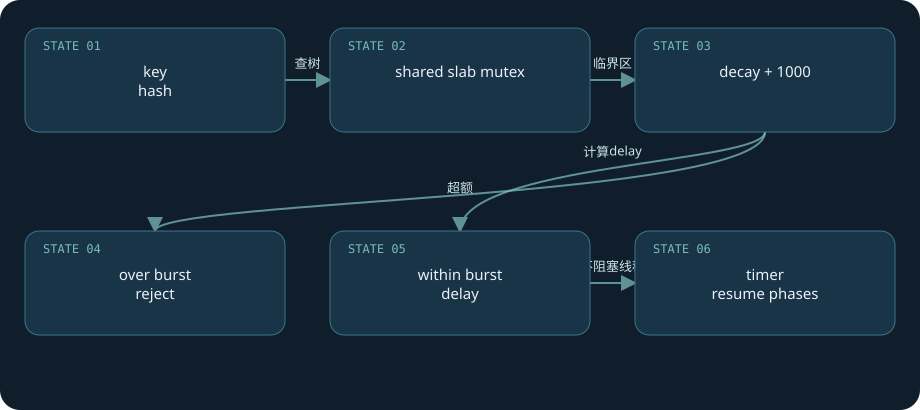

**真实源码：**[src/http/modules/ngx_http_limit_req_module.c · L404—L532](https://github.com/nginx/nginx/blob/481d28cb4e04c8096b9b6134856891dc52ecc68f/src/http/modules/ngx_http_limit_req_module.c#L404-L532)。连续原文，包含所讨论函数的完整分支与边界。

```c
static ngx_int_t
ngx_http_limit_req_lookup(ngx_http_limit_req_limit_t *limit, ngx_uint_t hash,
    ngx_str_t *key, ngx_uint_t *ep, ngx_uint_t account)
{
    size_t                      size;
    ngx_int_t                   rc, excess;
    ngx_msec_t                  now;
    ngx_msec_int_t              ms;
    ngx_rbtree_node_t          *node, *sentinel;
    ngx_http_limit_req_ctx_t   *ctx;
    ngx_http_limit_req_node_t  *lr;

    now = ngx_current_msec;

    ctx = limit->shm_zone->data;

    node = ctx->sh->rbtree.root;
    sentinel = ctx->sh->rbtree.sentinel;

    while (node != sentinel) {

        if (hash < node->key) {
            node = node->left;
            continue;
        }

        if (hash > node->key) {
            node = node->right;
            continue;
        }

        /* hash == node->key */

        lr = (ngx_http_limit_req_node_t *) &node->color;

        rc = ngx_memn2cmp(key->data, lr->data, key->len, (size_t) lr->len);

        if (rc == 0) {
            ngx_queue_remove(&lr->queue);
            ngx_queue_insert_head(&ctx->sh->queue, &lr->queue);

            ms = (ngx_msec_int_t) (now - lr->last);

            if (ms < -60000) {
                ms = 1;

            } else if (ms < 0) {
                ms = 0;
            }

            excess = lr->excess - ctx->rate * ms / 1000 + 1000;

            if (excess < 0) {
                excess = 0;
            }

            *ep = excess;

            if ((ngx_uint_t) excess > limit->burst) {
                return NGX_BUSY;
            }

            if (account) {
                lr->excess = excess;

                if (ms) {
                    lr->last = now;
                }

                return NGX_OK;
            }

            lr->count++;

            ctx->node = lr;

            return NGX_AGAIN;
        }

        node = (rc < 0) ? node->left : node->right;
    }

    *ep = 0;

    size = offsetof(ngx_rbtree_node_t, color)
           + offsetof(ngx_http_limit_req_node_t, data)
           + key->len;

    ngx_http_limit_req_expire(ctx, 1);

    node = ngx_slab_alloc_locked(ctx->shpool, size);

    if (node == NULL) {
        ngx_http_limit_req_expire(ctx, 0);

        node = ngx_slab_alloc_locked(ctx->shpool, size);
        if (node == NULL) {
            ngx_log_error(NGX_LOG_ALERT, ngx_cycle->log, 0,
                          "could not allocate node%s", ctx->shpool->log_ctx);
            return NGX_ERROR;
        }
    }

    node->key = hash;

    lr = (ngx_http_limit_req_node_t *) &node->color;

    lr->len = (u_short) key->len;
    lr->excess = 0;

    ngx_memcpy(lr->data, key->data, key->len);

    ngx_rbtree_insert(&ctx->sh->rbtree, node);

    ngx_queue_insert_head(&ctx->sh->queue, &lr->queue);

    if (account) {
        lr->last = now;
        lr->count = 0;
        return NGX_OK;
    }

    lr->last = 0;
    lr->count = 1;

    ctx->node = lr;

    return NGX_AGAIN;
}
```

**精度练习：**假设rate=2r/s，内部rate=2000，前一excess=1000，间隔250ms，则新excess=1000-2000×250/1000+1000=1500。burst=1内部1000时会拒绝；burst=3时可进入delay/pass判断。这是公式推演，不是实测时序。

**第二证据：**[`timer delay · L322–L328`](https://github.com/nginx/nginx/blob/481d28cb4e04c8096b9b6134856891dc52ecc68f/src/http/modules/ngx_http_limit_req_module.c#L322-L328)。数据跨worker共享必须锁；普通worker计数器不能提供同样全局限额。

**实验：**lab `/limit/`走proxy，顺序短间隔curl，查看状态码和`$limit_req_status`；并发curl可能有PASSED/REJECTED，数量取决于真实时序，不承诺固定第几次拒绝。key采用`$binary_remote_addr`，同一NAT共享额度；trusted realip配置错误又会造成伪造或误限。

[返回目录](#top)

<a id="chapter-24"></a>

# 24 · TLS、终结与性能诊断

**连接的最后一步也是状态机的一部分**

SSL握手通过`SSL_do_handshake`推进，`SSL_ERROR_WANT_READ/WRITE`分别清ready、设置read/write握手handler并注册事件，返回NGX_AGAIN。握手不是同步调用一次就结束；证书解析、OpenSSL版本、会话复用、OCSP、kTLS和协议模块能力取决于构建与配置。SNI在HTTP Host前发生，证书选择与HTTP路由要分别诊断。

reload加载新的SSL配置，旧worker现有SSL连接继续使用旧对象；新连接才进入新的SSL上下文。更新证书后必须确认配置检测、reload日志和新连接实际证书，不能看文件已写入就宣布全部连接切换。TLS终止后代理到HTTP上游是独立连接；上游HTTPS认证与SNI又由proxy_ssl配置控制，本书不假设默认自动验证后端证书。

响应完成进入`ngx_http_finalize_request / ngx_http_finalize_connection`，主请求count、subrequest、body读取、keepalive、lingering close和协议流决定何时释放。HTTP/1.x keepalive保留socket并销毁request pool；lingering读取剩余客户端数据后再关闭，减少立刻close导致响应被RST干扰的风险。HTTP/2/3流终结不等于整个连接终结。

诊断从“哪层在等”出发：request_time包含客户端读体、代理与客户端发送；upstream_connect/header/response分出上游阶段并可多值；连接槽不足看connection_n与fd；CPU高看解析/rewrite/TLS/filter/模块阻塞；磁盘忙看temp/cache/log；慢客户端看busy chains与send_timeout。不要把所有502归为后端宕机，也不要把CPU不满解释为无瓶颈。

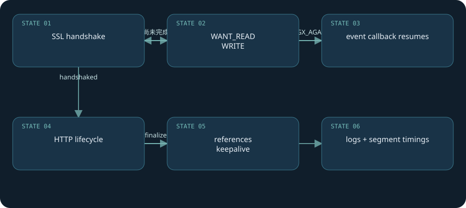

**真实源码：**[src/event/ngx_event_openssl.c · L1705—L1850](https://github.com/nginx/nginx/blob/481d28cb4e04c8096b9b6134856891dc52ecc68f/src/event/ngx_event_openssl.c#L1705-L1850)。连续原文，包含所讨论函数的完整分支与边界。

```c
ngx_int_t
ngx_ssl_handshake(ngx_connection_t *c)
{
    int        n, sslerr;
    ngx_err_t  err;
    ngx_int_t  rc;

#ifdef SSL_READ_EARLY_DATA_SUCCESS
    if (c->ssl->try_early_data) {
        return ngx_ssl_try_early_data(c);
    }
#endif

    if (c->ssl->in_ocsp) {
        return ngx_ssl_ocsp_validate(c);
    }

    ngx_ssl_clear_error(c->log);

    n = SSL_do_handshake(c->ssl->connection);

    ngx_log_debug1(NGX_LOG_DEBUG_EVENT, c->log, 0, "SSL_do_handshake: %d", n);

    if (n == 1) {

        if (ngx_handle_read_event(c->read, 0) != NGX_OK) {
            return NGX_ERROR;
        }

        if (ngx_handle_write_event(c->write, 0) != NGX_OK) {
            return NGX_ERROR;
        }

#if (NGX_DEBUG)
        ngx_ssl_handshake_log(c);
#endif

        c->recv = ngx_ssl_recv;
        c->send = ngx_ssl_write;
        c->recv_chain = ngx_ssl_recv_chain;
        c->send_chain = ngx_ssl_send_chain;

        c->read->ready = 1;
        c->write->ready = 1;

#if (!defined SSL_OP_NO_RENEGOTIATION                                         \
     && !defined SSL_OP_NO_CLIENT_RENEGOTIATION                               \
     && defined SSL3_FLAGS_NO_RENEGOTIATE_CIPHERS                             \
     && OPENSSL_VERSION_NUMBER < 0x10100000L)

        /* initial handshake done, disable renegotiation (CVE-2009-3555) */
        if (c->ssl->connection->s3 && SSL_is_server(c->ssl->connection)) {
            c->ssl->connection->s3->flags |= SSL3_FLAGS_NO_RENEGOTIATE_CIPHERS;
        }

#endif

#if (defined BIO_get_ktls_send && !NGX_WIN32)

        if (BIO_get_ktls_send(SSL_get_wbio(c->ssl->connection)) == 1) {
            ngx_log_debug0(NGX_LOG_DEBUG_EVENT, c->log, 0,
                           "BIO_get_ktls_send(): 1");
            c->ssl->sendfile = 1;
        }

#endif

        rc = ngx_ssl_ocsp_validate(c);

        if (rc == NGX_ERROR) {
            return NGX_ERROR;
        }

        if (rc == NGX_AGAIN) {
            c->read->handler = ngx_ssl_handshake_handler;
            c->write->handler = ngx_ssl_handshake_handler;
            return NGX_AGAIN;
        }

        c->ssl->handshaked = 1;

        return NGX_OK;
    }

    sslerr = SSL_get_error(c->ssl->connection, n);

    ngx_log_debug1(NGX_LOG_DEBUG_EVENT, c->log, 0, "SSL_get_error: %d", sslerr);

    if (sslerr == SSL_ERROR_WANT_READ) {
        c->read->ready = 0;
        c->read->handler = ngx_ssl_handshake_handler;
        c->write->handler = ngx_ssl_handshake_handler;

        if (ngx_handle_read_event(c->read, 0) != NGX_OK) {
            return NGX_ERROR;
        }

        if (ngx_handle_write_event(c->write, 0) != NGX_OK) {
            return NGX_ERROR;
        }

        return NGX_AGAIN;
    }

    if (sslerr == SSL_ERROR_WANT_WRITE) {
        c->write->ready = 0;
        c->read->handler = ngx_ssl_handshake_handler;
        c->write->handler = ngx_ssl_handshake_handler;

        if (ngx_handle_read_event(c->read, 0) != NGX_OK) {
            return NGX_ERROR;
        }

        if (ngx_handle_write_event(c->write, 0) != NGX_OK) {
            return NGX_ERROR;
        }

        return NGX_AGAIN;
    }

    err = (sslerr == SSL_ERROR_SYSCALL) ? ngx_errno : 0;

    c->ssl->no_wait_shutdown = 1;
    c->ssl->no_send_shutdown = 1;
    c->read->eof = 1;

    if (sslerr == SSL_ERROR_ZERO_RETURN || ERR_peek_error() == 0) {
        ngx_connection_error(c, err,
                             "peer closed connection in SSL handshake");

        return NGX_ERROR;
    }

    if (c->ssl->handshake_rejected) {
        ngx_connection_error(c, err, "handshake rejected");
        ERR_clear_error();

        return NGX_ERROR;
    }

    c->read->error = 1;

    ngx_ssl_connection_error(c, sslerr, err, "SSL_do_handshake() failed");

    return NGX_ERROR;
}
```

**实验：**lab日志已经配置两种URI和upstream分段时间。连接拒绝常落502，连接/读超时可能504，响应体已输出后超时可能是截断；在每种场景同时记录status、curl退出码、error日志和收到字节数。TLS用自签证书的独立lab端口测试，可执行`openssl s_client -connect 127.0.0.1:18443 -servername lab.local`；本文没有启动TLS实例。

**复述练习：**用“accept → parse → phases → upstream → filters → finalize”在两分钟内解释请求，再回答：在哪保存进度、哪个pool拥有内存、哪个flag触发恢复、响应已发后还能否重试？这些问题比记住默认值更能检验源码理解。

**边界清单：**本书没有编译NGINX、没有压测、没有在生产执行配置或信号，没有声称实验全部通过。完成的是固定源码阅读、原文节选核验、离线与页面结构核验。实验脚本作为可复现材料交付，NGINX运行结果需要读者在匹配构建上验证。

[返回目录](#top)

## 后续源码挑战

1. 沿`ngx_http_upstream_next`列出不能重试的所有条件，并说明发送响应头以后为什么要换一种失败解释。
2. 写出请求pool、connection pool、cycle pool和共享slab的生命周期，指出reload时哪些不能迁移。
3. 跟踪一个NGX_AGAIN，从产生点走到未来handler恢复点；仅画函数调用箭头不足以说明异步。
4. 解释一个限流延迟请求的timer、write handler、phase index变化，指出它没有sleep worker。
5. 用日志证明一次失败发生在connect、header、body还是downstream，避免仅按HTTP状态码猜原因。

## 官方阅读入口

- [固定发行基线](https://github.com/nginx/nginx/tree/481d28cb4e04c8096b9b6134856891dc52ecc68f)
- [开发指南](https://nginx.org/en/docs/dev/development_guide.html)
- [连接处理方法](https://nginx.org/en/docs/events.html)
- [请求处理](https://nginx.org/en/docs/http/request_processing.html)
- [进程控制](https://nginx.org/en/docs/control.html)
- [HTTP core](https://nginx.org/en/docs/http/ngx_http_core_module.html)
- [proxy模块](https://nginx.org/en/docs/http/ngx_http_proxy_module.html)
- [upstream模块](https://nginx.org/en/docs/http/ngx_http_upstream_module.html)
- [limit_req模块](https://nginx.org/en/docs/http/ngx_http_limit_req_module.html)
- [SSL模块](https://nginx.org/en/docs/http/ngx_http_ssl_module.html)

官方文档为滚动更新页面，本书不是其全文翻译。解释依据固定源码，配置指令按基线核对；升级或部署前需要重新查官方变更与安全公告。
