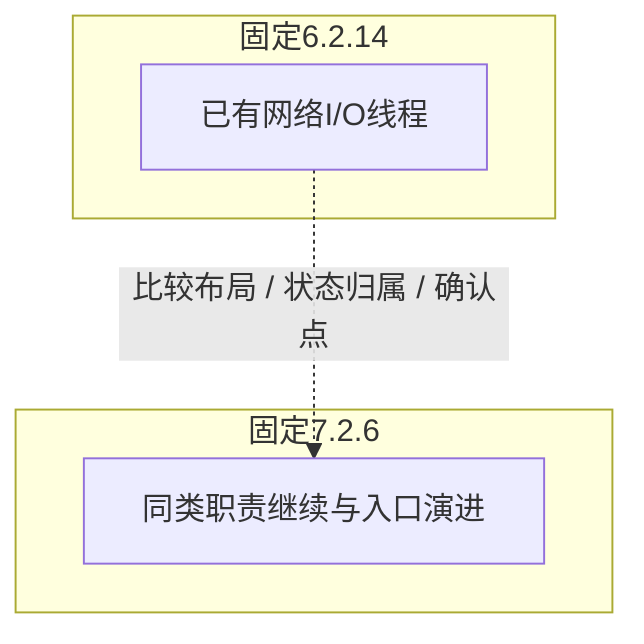
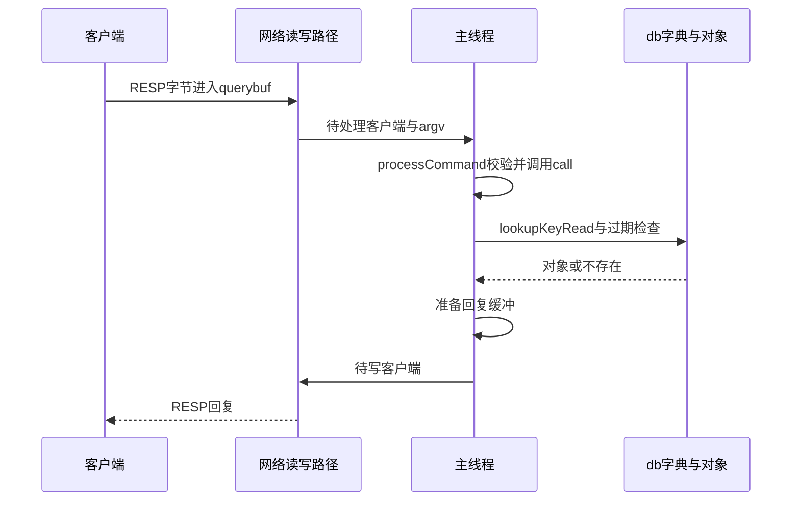
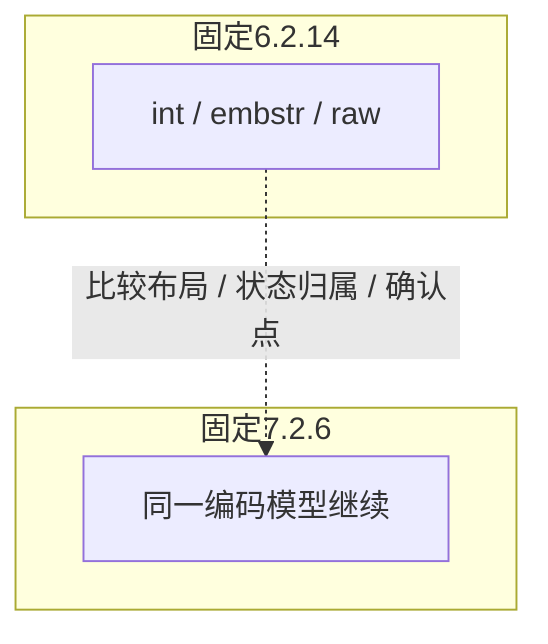
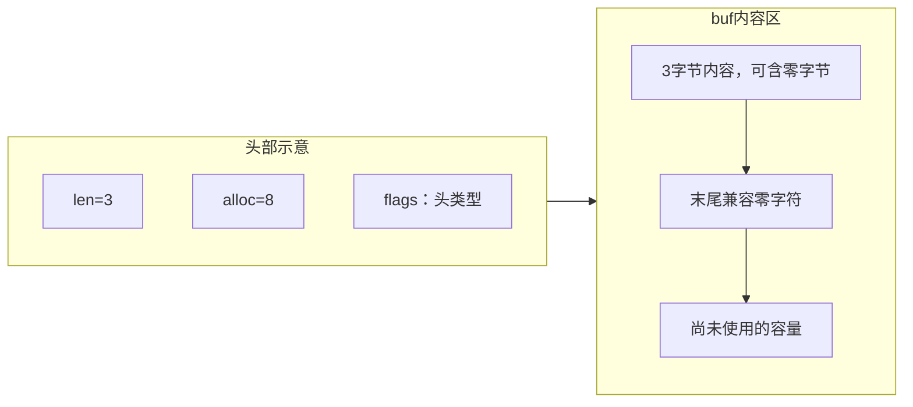
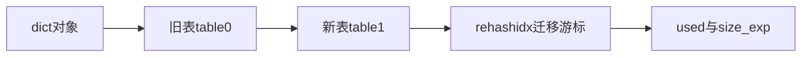

<a id="handbook-title"></a>

# Redis源码速读图解手册

> 主线Redis7.2.6，对照6.2.14。真实C源码、结构图、字段变化、故障推演与面试复述；面向只读学习，无需编译或做实验。

[完整离线版](./redis-offline.zip) · [引用的原始源码包](./redis-source.zip) · [上游COPYING](./redis-copying.txt) · [源码归属与许可说明](./source-notices.txt)

所有案例均为虚构。本页不含个人履历、业务系统信息、真实日志、账号、生产配置或本地路径。图、搜索、样式与语法高亮全部内嵌；访问上游源码和文档链接才需要网络。主题偏好保存在本地，不上传阅读内容。

## 固定源码版本与对照原则

|版本|固定提交|作用|
|---|---|---|
|7.2.6|ae6a2aa95cd094b032e7a69b8b59f64dd1ed085f|全文主线|
|6.2.14|91863dd854feba7f75ae58976a920acb192a5b67|经典实现对照|

关键处有15组6.x/7.x双版本源码对照。官方说明给出的事实与本文从源码结构作出的原因分析分开标注，不能把分析当作维护者的性能承诺。阈值、默认值与首次加入时间只在已核对的范围内描述。

## 三轮阅读路线

|轮次|章节主线|目标|
|---|---|---|
|第一轮|网络与命令→对象/SDS/dict→各类型→SET与TTL|一条命令改了哪几个状态？|
|第二轮|过期/淘汰→事务/脚本→RDB/AOF→复制与确认|失败发生后，哪些状态能恢复？|
|第三轮|Sentinel/Cluster→PubSub/Stream→缓存/锁→故障复述|协议与业务边界在哪，版本变化解决了什么？|

## 版本说明

两份基线都固定到发行标签与提交，不能推断后续版本的全部实现。本文核心覆盖RedisOSS/C源码，不把RedisCloud、Enterprise、Valkey或第三方客户端的行为混作同一实现。Redis8.x导航只解释范围变化，不复制未固定版本的实现。

源码节选是连续原文，可能止于函数中间；仅统一展示缩进。遇到异常分支与调用方，用固定链接读完整函数。机制图包含调用、层级或状态关系，不能把所有箭头当成同一线程按顺序执行。


<a id="chapter-0"></a>

# 0. 阅读地图：先定位版本和线程责任

**适用范围：**Redis7.2.6核心C源码；对照6.2.14。

**本章目标：**按命令链、数据结构和故障路径阅读，先避开版本混用。


## 0.1 源码基线与本书的使用方式

本书以Redis7.2.6固定提交为主线，对照6.2.14解释关键演进；两者是阅读基线，不是最新版本或部署选型建议。所有源码链接指向固定提交，不会随分支更新改变行号。Redis8.x只在版本导航说明中讨论，不能把其后新增能力代入7.2.6代码。

不需要编译C、不需要运行redis-server、不需要做实验。每节按机制图→连续源码节选→字段与分支→纸面案例阅读。窗口可能在方法中间结束，完整实现以链接为准；这里只统一显示缩进，未用伪代码替换算法。


**源码对照：**[server.c · 7.2.6 · L7042–L7082](https://github.com/redis/redis/blob/ae6a2aa95cd094b032e7a69b8b59f64dd1ed085f/src/server.c#L7042-L7082)。连续节选，窗口可能结束于函数中间；完整函数及调用方见链接。

```c
int main(int argc, char **argv) {
    struct timeval tv;
    int j;
    char config_from_stdin = 0;

#ifdef REDIS_TEST
    if (argc >= 3 && !strcasecmp(argv[1], "test")) {
        int flags = 0;
        for (j = 3; j < argc; j++) {
            char *arg = argv[j];
            if (!strcasecmp(arg, "--accurate")) flags |= REDIS_TEST_ACCURATE;
            else if (!strcasecmp(arg, "--large-memory")) flags |= REDIS_TEST_LARGE_MEMORY;
            else if (!strcasecmp(arg, "--valgrind")) flags |= REDIS_TEST_VALGRIND;
        }

        if (!strcasecmp(argv[2], "all")) {
            int numtests = sizeof(redisTests)/sizeof(struct redisTest);
            for (j = 0; j < numtests; j++) {
                redisTests[j].failed = (redisTests[j].proc(argc,argv,flags) != 0);
            }

            /* Report tests result */
            int failed_num = 0;
            for (j = 0; j < numtests; j++) {
                if (redisTests[j].failed) {
                    failed_num++;
                    printf("[failed] Test - %s\n", redisTests[j].name);
                } else {
                    printf("[ok] Test - %s\n", redisTests[j].name);
                }
            }

            printf("%d tests, %d passed, %d failed\n", numtests,
                   numtests-failed_num, failed_num);

            return failed_num == 0 ? 0 : 1;
        } else {
            redisTestProc *proc = getTestProcByName(argv[2]);
            if (!proc) return -1; /* test not found */
            return proc(argc,argv,flags);
        }
```

**逐段阅读抓手：**main是生命周期入口；具体命令路径要进入networking.c、server.c和各t_*.c。


## 0.2 Redis的单线程到底指什么

7.2.6核心普通命令执行与共享键空间修改主要在主线程，网络读写可以在配置条件下使用I/O线程；BIO线程处理部分fsync、关闭文件和惰性释放，RDB/AOF重写可用子进程。模块等扩展还有自身约束。

因此“Redis进程只有一个线程”和“开I/O线程后所有命令都并行执行”都不准确。要看线程在哪个阶段接管，以及结果何时回到主线程执行。长命令、脚本和大对象处理依然可能阻塞核心命令路径。


**源码对照：**[networking.c · 7.2.6 · L4173–L4238](https://github.com/redis/redis/blob/ae6a2aa95cd094b032e7a69b8b59f64dd1ed085f/src/networking.c#L4173-L4238)。连续节选，窗口可能结束于函数中间；完整函数及调用方见链接。

```c
void *IOThreadMain(void *myid) {
    /* The ID is the thread number (from 0 to server.io_threads_num-1), and is
     * used by the thread to just manipulate a single sub-array of clients. */
    long id = (unsigned long)myid;
    char thdname[16];

    snprintf(thdname, sizeof(thdname), "io_thd_%ld", id);
    redis_set_thread_title(thdname);
    redisSetCpuAffinity(server.server_cpulist);
    makeThreadKillable();

    while(1) {
        /* Wait for start */
        for (int j = 0; j < 1000000; j++) {
            if (getIOPendingCount(id) != 0) break;
        }

        /* Give the main thread a chance to stop this thread. */
        if (getIOPendingCount(id) == 0) {
            pthread_mutex_lock(&io_threads_mutex[id]);
            pthread_mutex_unlock(&io_threads_mutex[id]);
            continue;
        }

        serverAssert(getIOPendingCount(id) != 0);

        /* Process: note that the main thread will never touch our list
         * before we drop the pending count to 0. */
        listIter li;
        listNode *ln;
        listRewind(io_threads_list[id],&li);
        while((ln = listNext(&li))) {
            client *c = listNodeValue(ln);
            if (io_threads_op == IO_THREADS_OP_WRITE) {
                writeToClient(c,0);
            } else if (io_threads_op == IO_THREADS_OP_READ) {
                readQueryFromClient(c->conn);
            } else {
                serverPanic("io_threads_op value is unknown");
            }
        }
        listEmpty(io_threads_list[id]);
        setIOPendingCount(id, 0);
    }
}

/* Initialize the data structures needed for threaded I/O. */
void initThreadedIO(void) {
    server.io_threads_active = 0; /* We start with threads not active. */

    /* Indicate that io-threads are currently idle */
    io_threads_op = IO_THREADS_OP_IDLE;

    /* Don't spawn any thread if the user selected a single thread:
     * we'll handle I/O directly from the main thread. */
    if (server.io_threads_num == 1) return;

    if (server.io_threads_num > IO_THREADS_MAX_NUM) {
        serverLog(LL_WARNING,"Fatal: too many I/O threads configured. "
                             "The maximum number is %d.", IO_THREADS_MAX_NUM);
        exit(1);
    }

    /* Spawn and initialize the I/O threads. */
    for (int i = 0; i < server.io_threads_num; i++) {
        /* Things we do for all the threads including the main thread. */
```

**逐段阅读抓手：**关注IO_THREADS_OP_READ/WRITE以及CLIENT_PENDING_COMMAND；线程参与I/O不等于并行修改数据库。


## 0.3 目录怎样对应职责

server.c负责初始化、周期任务、命令调度和传播；networking.c负责客户端与协议；db.c负责键空间；object.c和各结构文件管理编码；t_string/t_hash等实现命令；rdb/aof负责持久化；replication、sentinel、cluster分别负责复制、监控切换和分片。

从一个命令的proc函数出发，沿lookup→结构操作→signalModifiedKey→dirty→传播读，能同时理解命令语义与后台影响。redisObject的type和encoding是跨文件阅读的共同坐标。


**源码对照：**[server.h · 7.2.6 · L900–L918](https://github.com/redis/redis/blob/ae6a2aa95cd094b032e7a69b8b59f64dd1ed085f/src/server.h#L900-L918)。连续节选，窗口可能结束于函数中间；完整函数及调用方见链接。

```c
struct redisObject {
    unsigned type:4;
    unsigned encoding:4;
    unsigned lru:LRU_BITS; /* LRU time (relative to global lru_clock) or
                            * LFU data (least significant 8 bits frequency
                            * and most significant 16 bits access time). */
    int refcount;
    void *ptr;
};

/* The string name for an object's type as listed above
 * Native types are checked against the OBJ_STRING, OBJ_LIST, OBJ_* defines,
 * and Module types have their registered name returned. */
char *getObjectTypeName(robj*);

/* Macro used to initialize a Redis object allocated on the stack.
 * Note that this macro is taken near the structure definition to make sure
 * we'll update it when the structure is changed, to avoid bugs like
 * bug #85 introduced exactly in this way. */
```

**逐段阅读抓手：**type是用户数据类型，encoding是当前底层表示；相同type可有多个encoding。


## 0.4 6.x与7.x对照：6.x已有I/O线程，7.x也不等于命令多线程

|维度|固定6.2.14|固定7.2.6|
|---|---|---|
|实现|6.2.14可配置网络I/O线程；命令执行回到主线程。|7.2.6保留此分工，并演进线程管理、连接和读写处理；本文线程结论限定这两份基线。|

**变化原因（固定源码分析）：**网络读写与共享键空间执行需要分清，前者可以分担CPU而后者仍按核心模型协调。不能把I/O线程功能首次引入时间错误归到7.x。

**边界：**只看进程线程数不能判定普通命令是否并行；8.x后续实现需重新固定版本读。



**6.2.14源码：**[networking.c · L3769–L3816](https://github.com/redis/redis/blob/91863dd854feba7f75ae58976a920acb192a5b67/src/networking.c#L3769-L3816)，连续节选。

```c
int handleClientsWithPendingReadsUsingThreads(void) {
    if (!server.io_threads_active || !server.io_threads_do_reads) return 0;
    int processed = listLength(server.clients_pending_read);
    if (processed == 0) return 0;

    /* Distribute the clients across N different lists. */
    listIter li;
    listNode *ln;
    listRewind(server.clients_pending_read,&li);
    int item_id = 0;
    while((ln = listNext(&li))) {
        client *c = listNodeValue(ln);
        int target_id = item_id % server.io_threads_num;
        listAddNodeTail(io_threads_list[target_id],c);
        item_id++;
    }

    /* Give the start condition to the waiting threads, by setting the
     * start condition atomic var. */
    io_threads_op = IO_THREADS_OP_READ;
    for (int j = 1; j < server.io_threads_num; j++) {
        int count = listLength(io_threads_list[j]);
        setIOPendingCount(j, count);
    }

    /* Also use the main thread to process a slice of clients. */
    listRewind(io_threads_list[0],&li);
    while((ln = listNext(&li))) {
        client *c = listNodeValue(ln);
        readQueryFromClient(c->conn);
    }
    listEmpty(io_threads_list[0]);

    /* Wait for all the other threads to end their work. */
    while(1) {
        unsigned long pending = 0;
        for (int j = 1; j < server.io_threads_num; j++)
            pending += getIOPendingCount(j);
        if (pending == 0) break;
    }

    /* Run the list of clients again to process the new buffers. */
    while(listLength(server.clients_pending_read)) {
        ln = listFirst(server.clients_pending_read);
        client *c = listNodeValue(ln);
        c->flags &= ~CLIENT_PENDING_READ;
        listDelNode(server.clients_pending_read,ln);

```

**7.2.6源码：**[networking.c · L4443–L4494](https://github.com/redis/redis/blob/ae6a2aa95cd094b032e7a69b8b59f64dd1ed085f/src/networking.c#L4443-L4494)，连续节选。

```c
int handleClientsWithPendingReadsUsingThreads(void) {
    if (!server.io_threads_active || !server.io_threads_do_reads) return 0;
    int processed = listLength(server.clients_pending_read);
    if (processed == 0) return 0;

    /* Distribute the clients across N different lists. */
    listIter li;
    listNode *ln;
    listRewind(server.clients_pending_read,&li);
    int item_id = 0;
    while((ln = listNext(&li))) {
        client *c = listNodeValue(ln);
        int target_id = item_id % server.io_threads_num;
        listAddNodeTail(io_threads_list[target_id],c);
        item_id++;
    }

    /* Give the start condition to the waiting threads, by setting the
     * start condition atomic var. */
    io_threads_op = IO_THREADS_OP_READ;
    for (int j = 1; j < server.io_threads_num; j++) {
        int count = listLength(io_threads_list[j]);
        setIOPendingCount(j, count);
    }

    /* Also use the main thread to process a slice of clients. */
    listRewind(io_threads_list[0],&li);
    while((ln = listNext(&li))) {
        client *c = listNodeValue(ln);
        readQueryFromClient(c->conn);
    }
    listEmpty(io_threads_list[0]);

    /* Wait for all the other threads to end their work. */
    while(1) {
        unsigned long pending = 0;
        for (int j = 1; j < server.io_threads_num; j++)
            pending += getIOPendingCount(j);
        if (pending == 0) break;
    }

    io_threads_op = IO_THREADS_OP_IDLE;

    /* Run the list of clients again to process the new buffers. */
    while(listLength(server.clients_pending_read)) {
        ln = listFirst(server.clients_pending_read);
        client *c = listNodeValue(ln);
        listDelNode(server.clients_pending_read,ln);
        c->pending_read_list_node = NULL;

        serverAssert(!(c->flags & CLIENT_BLOCKED));

```

**对照抓手：**如果只是字段重排或函数拆分，说明语义延续；如果新增后端、确认点或协议，则明确它何时启用、状态存在哪里、失败怎样收尾。

## 本章纸面推演

第一轮只读SET→对象→db字典→回复与传播；第二轮补RDB/AOF、复制、过期与淘汰；第三轮读Sentinel/Cluster、事务与Streams。遇到结构转换，先写明对象type和encoding，别只背命令名。


<a id="chapter-1"></a>

# 1. 事件循环与命令生命周期

**适用范围：**ae事件循环；核心命令调度。

**本章目标：**把网络就绪、协议解析、执行与回复接起来。


## 1.1 ae事件循环如何工作

aeProcessEvents结合文件事件和时间事件，计算poll等待时长，调用平台后端获取就绪事件，再执行注册的读写回调。epoll、kqueue、select等是平台实现，不能把epoll当作Redis业务命令引擎。

I/O多路复用解决多个连接的就绪等待；真正的命令执行仍在上层回调和调度中。文件事件不等于文件持久化，名称指可轮询的描述符事件。


**源码对照：**[ae.c · 7.2.6 · L361–L429](https://github.com/redis/redis/blob/ae6a2aa95cd094b032e7a69b8b59f64dd1ed085f/src/ae.c#L361-L429)。连续节选，窗口可能结束于函数中间；完整函数及调用方见链接。

```c
int aeProcessEvents(aeEventLoop *eventLoop, int flags)
{
    int processed = 0, numevents;

    /* Nothing to do? return ASAP */
    if (!(flags & AE_TIME_EVENTS) && !(flags & AE_FILE_EVENTS)) return 0;

    /* Note that we want to call aeApiPoll() even if there are no
     * file events to process as long as we want to process time
     * events, in order to sleep until the next time event is ready
     * to fire. */
    if (eventLoop->maxfd != -1 ||
        ((flags & AE_TIME_EVENTS) && !(flags & AE_DONT_WAIT))) {
        int j;
        struct timeval tv, *tvp = NULL; /* NULL means infinite wait. */
        int64_t usUntilTimer;

        if (eventLoop->beforesleep != NULL && (flags & AE_CALL_BEFORE_SLEEP))
            eventLoop->beforesleep(eventLoop);

        /* The eventLoop->flags may be changed inside beforesleep.
         * So we should check it after beforesleep be called. At the same time,
         * the parameter flags always should have the highest priority.
         * That is to say, once the parameter flag is set to AE_DONT_WAIT,
         * no matter what value eventLoop->flags is set to, we should ignore it. */
        if ((flags & AE_DONT_WAIT) || (eventLoop->flags & AE_DONT_WAIT)) {
            tv.tv_sec = tv.tv_usec = 0;
            tvp = &tv;
        } else if (flags & AE_TIME_EVENTS) {
            usUntilTimer = usUntilEarliestTimer(eventLoop);
            if (usUntilTimer >= 0) {
                tv.tv_sec = usUntilTimer / 1000000;
                tv.tv_usec = usUntilTimer % 1000000;
                tvp = &tv;
            }
        }
        /* Call the multiplexing API, will return only on timeout or when
         * some event fires. */
        numevents = aeApiPoll(eventLoop, tvp);

        /* Don't process file events if not requested. */
        if (!(flags & AE_FILE_EVENTS)) {
            numevents = 0;
        }

        /* After sleep callback. */
        if (eventLoop->aftersleep != NULL && flags & AE_CALL_AFTER_SLEEP)
            eventLoop->aftersleep(eventLoop);

        for (j = 0; j < numevents; j++) {
            int fd = eventLoop->fired[j].fd;
            aeFileEvent *fe = &eventLoop->events[fd];
            int mask = eventLoop->fired[j].mask;
            int fired = 0; /* Number of events fired for current fd. */

            /* Normally we execute the readable event first, and the writable
             * event later. This is useful as sometimes we may be able
             * to serve the reply of a query immediately after processing the
             * query.
             *
             * However if AE_BARRIER is set in the mask, our application is
             * asking us to do the reverse: never fire the writable event
             * after the readable. In such a case, we invert the calls.
             * This is useful when, for instance, we want to do things
             * in the beforeSleep() hook, like fsyncing a file to disk,
             * before replying to a client. */
            int invert = fe->mask & AE_BARRIER;

            /* Note the "fe->mask & mask & ..." code: maybe an already
```

**逐段阅读抓手：**看AE_DONT_WAIT、AE_CALL_BEFORE_SLEEP等标记；不要只画一个永久阻塞的epoll调用。


## 1.2 processCommand先处理哪些前置条件

processCommand处理命令查找、参数数量、认证/ACL、Cluster重定向、内存及持久化错误、脚本限制和事务排队等条件，符合条件才执行或排队。一个命令在真正修改数据前可能被多层检查拒绝。

“SET失败”要区分参数错误、权限拒绝、OOM、写入禁止、Cluster路由以及网络响应丢失。前置拒绝和执行后响应丢失具有不同重试风险。


**源码对照：**[server.c · 7.2.6 · L3833–L3913](https://github.com/redis/redis/blob/ae6a2aa95cd094b032e7a69b8b59f64dd1ed085f/src/server.c#L3833-L3913)。连续节选，窗口可能结束于函数中间；完整函数及调用方见链接。

```c
int processCommand(client *c) {
    if (!scriptIsTimedout()) {
        /* Both EXEC and scripts call call() directly so there should be
         * no way in_exec or scriptIsRunning() is 1.
         * That is unless lua_timedout, in which case client may run
         * some commands. */
        serverAssert(!server.in_exec);
        serverAssert(!scriptIsRunning());
    }

    /* in case we are starting to ProcessCommand and we already have a command we assume
     * this is a reprocessing of this command, so we do not want to perform some of the actions again. */
    int client_reprocessing_command = c->cmd ? 1 : 0;

    /* only run command filter if not reprocessing command */
    if (!client_reprocessing_command) {
        moduleCallCommandFilters(c);
        reqresAppendRequest(c);
    }

    /* Handle possible security attacks. */
    if (!strcasecmp(c->argv[0]->ptr,"host:") || !strcasecmp(c->argv[0]->ptr,"post")) {
        securityWarningCommand(c);
        return C_ERR;
    }

    /* If we're inside a module blocked context yielding that wants to avoid
     * processing clients, postpone the command. */
    if (server.busy_module_yield_flags != BUSY_MODULE_YIELD_NONE &&
        !(server.busy_module_yield_flags & BUSY_MODULE_YIELD_CLIENTS))
    {
        blockPostponeClient(c);
        return C_OK;
    }

    /* Now lookup the command and check ASAP about trivial error conditions
     * such as wrong arity, bad command name and so forth.
     * In case we are reprocessing a command after it was blocked,
     * we do not have to repeat the same checks */
    if (!client_reprocessing_command) {
        c->cmd = c->lastcmd = c->realcmd = lookupCommand(c->argv,c->argc);
        sds err;
        if (!commandCheckExistence(c, &err)) {
            rejectCommandSds(c, err);
            return C_OK;
        }
        if (!commandCheckArity(c, &err)) {
            rejectCommandSds(c, err);
            return C_OK;
        }


        /* Check if the command is marked as protected and the relevant configuration allows it */
        if (c->cmd->flags & CMD_PROTECTED) {
            if ((c->cmd->proc == debugCommand && !allowProtectedAction(server.enable_debug_cmd, c)) ||
                (c->cmd->proc == moduleCommand && !allowProtectedAction(server.enable_module_cmd, c)))
            {
                rejectCommandFormat(c,"%s command not allowed. If the %s option is set to \"local\", "
                                      "you can run it from a local connection, otherwise you need to set this option "
                                      "in the configuration file, and then restart the server.",
                                      c->cmd->proc == debugCommand ? "DEBUG" : "MODULE",
                                      c->cmd->proc == debugCommand ? "enable-debug-command" : "enable-module-command");
                return C_OK;

            }
        }
    }

    uint64_t cmd_flags = getCommandFlags(c);

    int is_read_command = (cmd_flags & CMD_READONLY) ||
                           (c->cmd->proc == execCommand && (c->mstate.cmd_flags & CMD_READONLY));
    int is_write_command = (cmd_flags & CMD_WRITE) ||
                           (c->cmd->proc == execCommand && (c->mstate.cmd_flags & CMD_WRITE));
    int is_denyoom_command = (cmd_flags & CMD_DENYOOM) ||
                             (c->cmd->proc == execCommand && (c->mstate.cmd_flags & CMD_DENYOOM));
    int is_denystale_command = !(cmd_flags & CMD_STALE) ||
                               (c->cmd->proc == execCommand && (c->mstate.cmd_inv_flags & CMD_STALE));
    int is_denyloading_command = !(cmd_flags & CMD_LOADING) ||
                                 (c->cmd->proc == execCommand && (c->mstate.cmd_inv_flags & CMD_LOADING));
    int is_may_replicate_command = (cmd_flags & (CMD_WRITE | CMD_MAY_REPLICATE)) ||
```

**逐段阅读抓手：**命令表中的flags与proc驱动分支；名称相同并不意味着所有部署都可在当前节点执行。


## 1.3 call负责统计和传播，而不只是调用函数

call记录命令开始时间与dirty变化，执行c->cmd->proc，再处理统计、慢日志、传播条件和相关收尾。传播可能把命令写到AOF或复制流；命令内部也可重写argv或额外传播确定性操作。

回复准备、实际网络发送、AOF写入和副本确认是不同完成点。核心命令顺序执行不自动提供磁盘持久化或故障切换后的强一致。


**源码对照：**[server.c · 7.2.6 · L3473–L3568](https://github.com/redis/redis/blob/ae6a2aa95cd094b032e7a69b8b59f64dd1ed085f/src/server.c#L3473-L3568)。连续节选，窗口可能结束于函数中间；完整函数及调用方见链接。

```c
void call(client *c, int flags) {
    long long dirty;
    uint64_t client_old_flags = c->flags;
    struct redisCommand *real_cmd = c->realcmd;
    client *prev_client = server.executing_client;
    server.executing_client = c;

    /* When call() is issued during loading the AOF we don't want commands called
     * from module, exec or LUA to go into the slowlog or to populate statistics. */
    int update_command_stats = !isAOFLoadingContext();

    /* We want to be aware of a client which is making a first time attempt to execute this command
     * and a client which is reprocessing command again (after being unblocked).
     * Blocked clients can be blocked in different places and not always it means the call() function has been
     * called. For example this is required for avoiding double logging to monitors.*/
    int reprocessing_command = flags & CMD_CALL_REPROCESSING;

    /* Initialization: clear the flags that must be set by the command on
     * demand, and initialize the array for additional commands propagation. */
    c->flags &= ~(CLIENT_FORCE_AOF|CLIENT_FORCE_REPL|CLIENT_PREVENT_PROP);

    /* Redis core is in charge of propagation when the first entry point
     * of call() is processCommand().
     * The only other option to get to call() without having processCommand
     * as an entry point is if a module triggers RM_Call outside of call()
     * context (for example, in a timer).
     * In that case, the module is in charge of propagation. */

    /* Call the command. */
    dirty = server.dirty;
    long long old_master_repl_offset = server.master_repl_offset;
    incrCommandStatsOnError(NULL, 0);

    const long long call_timer = ustime();
    enterExecutionUnit(1, call_timer);

    /* setting the CLIENT_EXECUTING_COMMAND flag so we will avoid
     * sending client side caching message in the middle of a command reply.
     * In case of blocking commands, the flag will be un-set only after successfully
     * re-processing and unblock the client.*/
    c->flags |= CLIENT_EXECUTING_COMMAND;

    /* Setting the CLIENT_REPROCESSING_COMMAND flag so that during the actual
     * processing of the command proc, the client is aware that it is being
     * re-processed. */
    if (reprocessing_command) c->flags |= CLIENT_REPROCESSING_COMMAND;

    monotime monotonic_start = 0;
    if (monotonicGetType() == MONOTONIC_CLOCK_HW)
        monotonic_start = getMonotonicUs();

    c->cmd->proc(c);

    /* Clear the CLIENT_REPROCESSING_COMMAND flag after the proc is executed. */
    if (reprocessing_command) c->flags &= ~CLIENT_REPROCESSING_COMMAND;

    exitExecutionUnit();

    /* In case client is blocked after trying to execute the command,
     * it means the execution is not yet completed and we MIGHT reprocess the command in the future. */
    if (!(c->flags & CLIENT_BLOCKED)) c->flags &= ~(CLIENT_EXECUTING_COMMAND);

    /* In order to avoid performance implication due to querying the clock using a system call 3 times,
     * we use a monotonic clock, when we are sure its cost is very low, and fall back to non-monotonic call otherwise. */
    ustime_t duration;
    if (monotonicGetType() == MONOTONIC_CLOCK_HW)
        duration = getMonotonicUs() - monotonic_start;
    else
        duration = ustime() - call_timer;

    c->duration += duration;
    dirty = server.dirty-dirty;
    if (dirty < 0) dirty = 0;

    /* Update failed command calls if required. */

    if (!incrCommandStatsOnError(real_cmd, ERROR_COMMAND_FAILED) && c->deferred_reply_errors) {
        /* When call is used from a module client, error stats, and total_error_replies
         * isn't updated since these errors, if handled by the module, are internal,
         * and not reflected to users. however, the commandstats does show these calls
         * (made by RM_Call), so it should log if they failed or succeeded. */
        real_cmd->failed_calls++;
    }

    /* After executing command, we will close the client after writing entire
     * reply if it is set 'CLIENT_CLOSE_AFTER_COMMAND' flag. */
    if (c->flags & CLIENT_CLOSE_AFTER_COMMAND) {
        c->flags &= ~CLIENT_CLOSE_AFTER_COMMAND;
        c->flags |= CLIENT_CLOSE_AFTER_REPLY;
    }

    /* Note: the code below uses the real command that was executed
     * c->cmd and c->lastcmd may be different, in case of MULTI-EXEC or
     * re-written commands such as EXPIRE, GEOADD, etc. */

    /* Record the latency this command induced on the main thread.
```

**逐段阅读抓手：**比较执行前后的server.dirty及传播标记；某些命令响应成功但没有发生实际修改。


## 1.4 按线程与缓冲区复述一次GET

普通命令主路径按主线程串行访问键空间。开启网络I/O线程时，部分读写可分担；图中并行区域只是配置允许的网络处理，不表示GET与SET在同一共享字典上任意并行。Pipeline减少往返，命令之间仍存在各自的执行边界。



## 本章纸面推演

客户端一次写入两条完整命令，服务端可在同一轮读取后连续解析执行；另一个客户端的处理时机受事件循环与调度影响。单线程不意味着按全网客户端发送时间建立全局顺序。


<a id="chapter-2"></a>

# 2. RESP、客户端缓冲与Pipeline

**适用范围：**经典TCP/RESP；RESP2与RESP3支持。

**本章目标：**理解拆包、批量发送与大回复的内存压力。


## 2.1 协议解析为何需要保留半条请求

RESP数组请求含参数数量、每段Bulk长度及内容。processMultibulkBuffer维护multibulklen、bulklen和qb_pos等状态，网络只收到半个参数时先返回等待，收到完整内容后再构造argv。

SDS querybuf可存二进制数据，解析按长度而非只靠字符串终止符。拆包粘包由长度协议和解析状态处理，不是每次read都恰好得到一条命令。


**源码对照：**[networking.c · 7.2.6 · L2253–L2326](https://github.com/redis/redis/blob/ae6a2aa95cd094b032e7a69b8b59f64dd1ed085f/src/networking.c#L2253-L2326)。连续节选，窗口可能结束于函数中间；完整函数及调用方见链接。

```c
int processMultibulkBuffer(client *c) {
    char *newline = NULL;
    int ok;
    long long ll;

    if (c->multibulklen == 0) {
        /* The client should have been reset */
        serverAssertWithInfo(c,NULL,c->argc == 0);

        /* Multi bulk length cannot be read without a \r\n */
        newline = strchr(c->querybuf+c->qb_pos,'\r');
        if (newline == NULL) {
            if (sdslen(c->querybuf)-c->qb_pos > PROTO_INLINE_MAX_SIZE) {
                addReplyError(c,"Protocol error: too big mbulk count string");
                setProtocolError("too big mbulk count string",c);
            }
            return C_ERR;
        }

        /* Buffer should also contain \n */
        if (newline-(c->querybuf+c->qb_pos) > (ssize_t)(sdslen(c->querybuf)-c->qb_pos-2))
            return C_ERR;

        /* We know for sure there is a whole line since newline != NULL,
         * so go ahead and find out the multi bulk length. */
        serverAssertWithInfo(c,NULL,c->querybuf[c->qb_pos] == '*');
        ok = string2ll(c->querybuf+1+c->qb_pos,newline-(c->querybuf+1+c->qb_pos),&ll);
        if (!ok || ll > INT_MAX) {
            addReplyError(c,"Protocol error: invalid multibulk length");
            setProtocolError("invalid mbulk count",c);
            return C_ERR;
        } else if (ll > 10 && authRequired(c)) {
            addReplyError(c, "Protocol error: unauthenticated multibulk length");
            setProtocolError("unauth mbulk count", c);
            return C_ERR;
        }

        c->qb_pos = (newline-c->querybuf)+2;

        if (ll <= 0) return C_OK;

        c->multibulklen = ll;

        /* Setup argv array on client structure */
        if (c->argv) zfree(c->argv);
        c->argv_len = min(c->multibulklen, 1024);
        c->argv = zmalloc(sizeof(robj*)*c->argv_len);
        c->argv_len_sum = 0;
    }

    serverAssertWithInfo(c,NULL,c->multibulklen > 0);
    while(c->multibulklen) {
        /* Read bulk length if unknown */
        if (c->bulklen == -1) {
            newline = strchr(c->querybuf+c->qb_pos,'\r');
            if (newline == NULL) {
                if (sdslen(c->querybuf)-c->qb_pos > PROTO_INLINE_MAX_SIZE) {
                    addReplyError(c,
                        "Protocol error: too big bulk count string");
                    setProtocolError("too big bulk count string",c);
                    return C_ERR;
                }
                break;
            }

            /* Buffer should also contain \n */
            if (newline-(c->querybuf+c->qb_pos) > (ssize_t)(sdslen(c->querybuf)-c->qb_pos-2))
                break;

            if (c->querybuf[c->qb_pos] != '$') {
                addReplyErrorFormat(c,
                    "Protocol error: expected '$', got '%c'",
                    c->querybuf[c->qb_pos]);
                setProtocolError("expected $ but got something else",c);
```

**逐段阅读抓手：**bulklen与参数内容长度相关；协议中CRLF也占字节，不能混算。


## 2.2 一个输入缓冲可以有多条命令

processInputBuffer在缓冲中循环解析命令，检查阻塞、待执行和客户端状态等条件，再通过processCommandAndResetClient推进。主线程或I/O线程参与解析的条件需要结合pending reads流程理解。

Pipeline不构成事务。每条命令有自己的结果，错误不会自动撤销此前命令。集群跨节点Pipeline还要由客户端分别组织路由与响应。


**源码对照：**[networking.c · 7.2.6 · L2520–L2595](https://github.com/redis/redis/blob/ae6a2aa95cd094b032e7a69b8b59f64dd1ed085f/src/networking.c#L2520-L2595)。连续节选，窗口可能结束于函数中间；完整函数及调用方见链接。

```c
int processInputBuffer(client *c) {
    /* Keep processing while there is something in the input buffer */
    while(c->qb_pos < sdslen(c->querybuf)) {
        /* Immediately abort if the client is in the middle of something. */
        if (c->flags & CLIENT_BLOCKED) break;

        /* Don't process more buffers from clients that have already pending
         * commands to execute in c->argv. */
        if (c->flags & CLIENT_PENDING_COMMAND) break;

        /* Don't process input from the master while there is a busy script
         * condition on the slave. We want just to accumulate the replication
         * stream (instead of replying -BUSY like we do with other clients) and
         * later resume the processing. */
        if (isInsideYieldingLongCommand() && c->flags & CLIENT_MASTER) break;

        /* CLIENT_CLOSE_AFTER_REPLY closes the connection once the reply is
         * written to the client. Make sure to not let the reply grow after
         * this flag has been set (i.e. don't process more commands).
         *
         * The same applies for clients we want to terminate ASAP. */
        if (c->flags & (CLIENT_CLOSE_AFTER_REPLY|CLIENT_CLOSE_ASAP)) break;

        /* Determine request type when unknown. */
        if (!c->reqtype) {
            if (c->querybuf[c->qb_pos] == '*') {
                c->reqtype = PROTO_REQ_MULTIBULK;
            } else {
                c->reqtype = PROTO_REQ_INLINE;
            }
        }

        if (c->reqtype == PROTO_REQ_INLINE) {
            if (processInlineBuffer(c) != C_OK) break;
        } else if (c->reqtype == PROTO_REQ_MULTIBULK) {
            if (processMultibulkBuffer(c) != C_OK) break;
        } else {
            serverPanic("Unknown request type");
        }

        /* Multibulk processing could see a <= 0 length. */
        if (c->argc == 0) {
            resetClient(c);
        } else {
            /* If we are in the context of an I/O thread, we can't really
             * execute the command here. All we can do is to flag the client
             * as one that needs to process the command. */
            if (io_threads_op != IO_THREADS_OP_IDLE) {
                serverAssert(io_threads_op == IO_THREADS_OP_READ);
                c->flags |= CLIENT_PENDING_COMMAND;
                break;
            }

            /* We are finally ready to execute the command. */
            if (processCommandAndResetClient(c) == C_ERR) {
                /* If the client is no longer valid, we avoid exiting this
                 * loop and trimming the client buffer later. So we return
                 * ASAP in that case. */
                return C_ERR;
            }
        }
    }

    if (c->flags & CLIENT_MASTER) {
        /* If the client is a master, trim the querybuf to repl_applied,
         * since master client is very special, its querybuf not only
         * used to parse command, but also proxy to sub-replicas.
         *
         * Here are some scenarios we cannot trim to qb_pos:
         * 1. we don't receive complete command from master
         * 2. master client blocked cause of client pause
         * 3. io threads operate read, master client flagged with CLIENT_PENDING_COMMAND
         *
         * In these scenarios, qb_pos points to the part of the current command
         * or the beginning of next command, and the current command is not applied yet,
         * so the repl_applied is not equal to qb_pos. */
```

**逐段阅读抓手：**CLIENT_BLOCKED等状态会打断循环；并非无条件一次读完就执行完所有命令。


## 2.3 输出缓冲与慢客户端

writeToClient向连接发送固定回复缓冲和回复链表中的数据，处理部分写、写入错误及事件注册。大回复、慢客户端、Pub/Sub或复制连接可占用不同形式的输出内存。

必须区分命令执行慢与回复传输慢。SLOWLOG主要测命令执行，不包含所有客户端网络耗时；客户端RT高而慢日志不高，并不矛盾。


**源码对照：**[networking.c · 7.2.6 · L1939–L2012](https://github.com/redis/redis/blob/ae6a2aa95cd094b032e7a69b8b59f64dd1ed085f/src/networking.c#L1939-L2012)。连续节选，窗口可能结束于函数中间；完整函数及调用方见链接。

```c
int writeToClient(client *c, int handler_installed) {
    /* Update total number of writes on server */
    atomicIncr(server.stat_total_writes_processed, 1);

    ssize_t nwritten = 0, totwritten = 0;

    while(clientHasPendingReplies(c)) {
        int ret = _writeToClient(c, &nwritten);
        if (ret == C_ERR) break;
        totwritten += nwritten;
        /* Note that we avoid to send more than NET_MAX_WRITES_PER_EVENT
         * bytes, in a single threaded server it's a good idea to serve
         * other clients as well, even if a very large request comes from
         * super fast link that is always able to accept data (in real world
         * scenario think about 'KEYS *' against the loopback interface).
         *
         * However if we are over the maxmemory limit we ignore that and
         * just deliver as much data as it is possible to deliver.
         *
         * Moreover, we also send as much as possible if the client is
         * a slave or a monitor (otherwise, on high-speed traffic, the
         * replication/output buffer will grow indefinitely) */
        if (totwritten > NET_MAX_WRITES_PER_EVENT &&
            (server.maxmemory == 0 ||
             zmalloc_used_memory() < server.maxmemory) &&
            !(c->flags & CLIENT_SLAVE)) break;
    }

    if (getClientType(c) == CLIENT_TYPE_SLAVE) {
        atomicIncr(server.stat_net_repl_output_bytes, totwritten);
    } else {
        atomicIncr(server.stat_net_output_bytes, totwritten);
    }

    if (nwritten == -1) {
        if (connGetState(c->conn) != CONN_STATE_CONNECTED) {
            serverLog(LL_VERBOSE,
                "Error writing to client: %s", connGetLastError(c->conn));
            freeClientAsync(c);
            return C_ERR;
        }
    }
    if (totwritten > 0) {
        /* For clients representing masters we don't count sending data
         * as an interaction, since we always send REPLCONF ACK commands
         * that take some time to just fill the socket output buffer.
         * We just rely on data / pings received for timeout detection. */
        if (!(c->flags & CLIENT_MASTER)) c->lastinteraction = server.unixtime;
    }
    if (!clientHasPendingReplies(c)) {
        c->sentlen = 0;
        /* Note that writeToClient() is called in a threaded way, but
         * aeDeleteFileEvent() is not thread safe: however writeToClient()
         * is always called with handler_installed set to 0 from threads
         * so we are fine. */
        if (handler_installed) {
            serverAssert(io_threads_op == IO_THREADS_OP_IDLE);
            connSetWriteHandler(c->conn, NULL);
        }

        /* Close connection after entire reply has been sent. */
        if (c->flags & CLIENT_CLOSE_AFTER_REPLY) {
            freeClientAsync(c);
            return C_ERR;
        }
    }
    /* Update client's memory usage after writing.
     * Since this isn't thread safe we do this conditionally. In case of threaded writes this is done in
     * handleClientsWithPendingWritesUsingThreads(). */
    if (io_threads_op == IO_THREADS_OP_IDLE)
        updateClientMemUsageAndBucket(c);
    return C_OK;
}

```

**逐段阅读抓手：**看sentlen与bufpos/list head；写一次成功可能只发送部分回复。


## 本章纸面推演

Pipeline连续发送1000条GET减少等待往返，但Redis仍逐条执行并组织回复。客户端不及时读取时，输出缓冲会增长；网络效率提高不意味着服务器能无限缓存结果。


<a id="chapter-3"></a>

# 3. redisObject与String编码

**适用范围：**type/encoding/refcount；int、embstr、raw。

**本章目标：**把业务String与底层内存形式分开。


## 3.1 对象头是结构阅读入口

redisObject记录type、encoding、lru、refcount和ptr等字段。lru在不同淘汰策略下承担不同含义：LRU时用于时间信息，LFU时组合访问计数与时间片。不要把它永久解释成精确“最后访问时间”。

ptr的解释由type/encoding决定；int编码可以把整数值存进指针大小的字段，而raw指向SDS，容器指向quicklist、dict等。C结构复用靠运行时标记来解码。


**源码对照：**[server.h · 7.2.6 · L900–L915](https://github.com/redis/redis/blob/ae6a2aa95cd094b032e7a69b8b59f64dd1ed085f/src/server.h#L900-L915)。连续节选，窗口可能结束于函数中间；完整函数及调用方见链接。

```c
struct redisObject {
    unsigned type:4;
    unsigned encoding:4;
    unsigned lru:LRU_BITS; /* LRU time (relative to global lru_clock) or
                            * LFU data (least significant 8 bits frequency
                            * and most significant 16 bits access time). */
    int refcount;
    void *ptr;
};

/* The string name for an object's type as listed above
 * Native types are checked against the OBJ_STRING, OBJ_LIST, OBJ_* defines,
 * and Module types have their registered name returned. */
char *getObjectTypeName(robj*);

/* Macro used to initialize a Redis object allocated on the stack.
```

**逐段阅读抓手：**先读标记再解引用ptr；仅看到void*无法知道它是哪个容器。


## 3.2 embstr为什么紧凑，为什么不能据此保证长期不分配

embstr把对象头与SDS头/数据放在一次分配中，适合短字符串；raw通常分别分配对象和SDS。短字符串阈值来自固定版本常量和布局，不是普适数学定律。

embstr常按不可原地扩展的形式使用，修改命令可能转成raw后再操作。它是内部内存优化，不代表应用层不可修改这个Key，也不意味着所有短String都一定保持embstr。


**源码对照：**[object.c · 7.2.6 · L92–L130](https://github.com/redis/redis/blob/ae6a2aa95cd094b032e7a69b8b59f64dd1ed085f/src/object.c#L92-L130)。连续节选，窗口可能结束于函数中间；完整函数及调用方见链接。

```c
robj *createEmbeddedStringObject(const char *ptr, size_t len) {
    robj *o = zmalloc(sizeof(robj)+sizeof(struct sdshdr8)+len+1);
    struct sdshdr8 *sh = (void*)(o+1);

    o->type = OBJ_STRING;
    o->encoding = OBJ_ENCODING_EMBSTR;
    o->ptr = sh+1;
    o->refcount = 1;
    o->lru = 0;

    sh->len = len;
    sh->alloc = len;
    sh->flags = SDS_TYPE_8;
    if (ptr == SDS_NOINIT)
        sh->buf[len] = '\0';
    else if (ptr) {
        memcpy(sh->buf,ptr,len);
        sh->buf[len] = '\0';
    } else {
        memset(sh->buf,0,len+1);
    }
    return o;
}

/* Create a string object with EMBSTR encoding if it is smaller than
 * OBJ_ENCODING_EMBSTR_SIZE_LIMIT, otherwise the RAW encoding is
 * used.
 *
 * The current limit of 44 is chosen so that the biggest string object
 * we allocate as EMBSTR will still fit into the 64 byte arena of jemalloc. */
#define OBJ_ENCODING_EMBSTR_SIZE_LIMIT 44
robj *createStringObject(const char *ptr, size_t len) {
    if (len <= OBJ_ENCODING_EMBSTR_SIZE_LIMIT)
        return createEmbeddedStringObject(ptr,len);
    else
        return createRawStringObject(ptr,len);
}

/* Same as CreateRawStringObject, can return NULL if allocation fails */
```

**逐段阅读抓手：**对照OBJ_ENCODING_EMBSTR_SIZE_LIMIT与createStringObject；不要把大小阈值脱离版本背诵。


## 3.3 tryObjectEncoding选择整数与紧凑表示

tryObjectEncodingEx先检查对象是否适合改编码，包括类型、现有表示、引用计数等，再尝试long范围内的整数编码、共享整数或embstr/空间裁剪。它不把任意像数字的字符串都无损转成整数。

格式、范围和对象共享条件影响是否成功。应用语义仍保持String；INCR还需单独验证可解析整数与溢出，不应以底层int编码推出任意数学精度。


**源码对照：**[object.c · 7.2.6 · L635–L704](https://github.com/redis/redis/blob/ae6a2aa95cd094b032e7a69b8b59f64dd1ed085f/src/object.c#L635-L704)。连续节选，窗口可能结束于函数中间；完整函数及调用方见链接。

```c
robj *tryObjectEncodingEx(robj *o, int try_trim) {
    long value;
    sds s = o->ptr;
    size_t len;

    /* Make sure this is a string object, the only type we encode
     * in this function. Other types use encoded memory efficient
     * representations but are handled by the commands implementing
     * the type. */
    serverAssertWithInfo(NULL,o,o->type == OBJ_STRING);

    /* We try some specialized encoding only for objects that are
     * RAW or EMBSTR encoded, in other words objects that are still
     * in represented by an actually array of chars. */
    if (!sdsEncodedObject(o)) return o;

    /* It's not safe to encode shared objects: shared objects can be shared
     * everywhere in the "object space" of Redis and may end in places where
     * they are not handled. We handle them only as values in the keyspace. */
     if (o->refcount > 1) return o;

    /* Check if we can represent this string as a long integer.
     * Note that we are sure that a string larger than 20 chars is not
     * representable as a 32 nor 64 bit integer. */
    len = sdslen(s);
    if (len <= 20 && string2l(s,len,&value)) {
        /* This object is encodable as a long. Try to use a shared object.
         * Note that we avoid using shared integers when maxmemory is used
         * because every object needs to have a private LRU field for the LRU
         * algorithm to work well. */
        if ((server.maxmemory == 0 ||
            !(server.maxmemory_policy & MAXMEMORY_FLAG_NO_SHARED_INTEGERS)) &&
            value >= 0 &&
            value < OBJ_SHARED_INTEGERS)
        {
            decrRefCount(o);
            return shared.integers[value];
        } else {
            if (o->encoding == OBJ_ENCODING_RAW) {
                sdsfree(o->ptr);
                o->encoding = OBJ_ENCODING_INT;
                o->ptr = (void*) value;
                return o;
            } else if (o->encoding == OBJ_ENCODING_EMBSTR) {
                decrRefCount(o);
                return createStringObjectFromLongLongForValue(value);
            }
        }
    }

    /* If the string is small and is still RAW encoded,
     * try the EMBSTR encoding which is more efficient.
     * In this representation the object and the SDS string are allocated
     * in the same chunk of memory to save space and cache misses. */
    if (len <= OBJ_ENCODING_EMBSTR_SIZE_LIMIT) {
        robj *emb;

        if (o->encoding == OBJ_ENCODING_EMBSTR) return o;
        emb = createEmbeddedStringObject(s,sdslen(s));
        decrRefCount(o);
        return emb;
    }

    /* We can't encode the object...
     * Do the last try, and at least optimize the SDS string inside */
    if (try_trim)
        trimStringObjectIfNeeded(o, 0);

    /* Return the original object. */
    return o;
```

**逐段阅读抓手：**可共享整数的条件与maxmemory策略相关；共享对象不能随意原地修改。


## 3.4 6.x与7.x对照：String编码核心延续，别强行说每版都是新结构

|维度|固定6.2.14|固定7.2.6|
|---|---|---|
|实现|6.2.14已有int/embstr/raw与引用管理。|7.2.6同样保留核心表示，编码函数拆分/参数有所演进。|

**变化原因（固定源码分析）：**小字符串减少分配、整数减少内容存储、较大字符串允许扩展；核心取舍并未因为版本号改变而消失。

**边界：**embstr阈值、共享整数条件以各基线常量和实现为准；内部编码不等于业务类型变化。



**6.2.14源码：**[object.c · L438–L497](https://github.com/redis/redis/blob/91863dd854feba7f75ae58976a920acb192a5b67/src/object.c#L438-L497)，连续节选。

```c
robj *tryObjectEncoding(robj *o) {
    long value;
    sds s = o->ptr;
    size_t len;

    /* Make sure this is a string object, the only type we encode
     * in this function. Other types use encoded memory efficient
     * representations but are handled by the commands implementing
     * the type. */
    serverAssertWithInfo(NULL,o,o->type == OBJ_STRING);

    /* We try some specialized encoding only for objects that are
     * RAW or EMBSTR encoded, in other words objects that are still
     * in represented by an actually array of chars. */
    if (!sdsEncodedObject(o)) return o;

    /* It's not safe to encode shared objects: shared objects can be shared
     * everywhere in the "object space" of Redis and may end in places where
     * they are not handled. We handle them only as values in the keyspace. */
     if (o->refcount > 1) return o;

    /* Check if we can represent this string as a long integer.
     * Note that we are sure that a string larger than 20 chars is not
     * representable as a 32 nor 64 bit integer. */
    len = sdslen(s);
    if (len <= 20 && string2l(s,len,&value)) {
        /* This object is encodable as a long. Try to use a shared object.
         * Note that we avoid using shared integers when maxmemory is used
         * because every object needs to have a private LRU field for the LRU
         * algorithm to work well. */
        if ((server.maxmemory == 0 ||
            !(server.maxmemory_policy & MAXMEMORY_FLAG_NO_SHARED_INTEGERS)) &&
            value >= 0 &&
            value < OBJ_SHARED_INTEGERS)
        {
            decrRefCount(o);
            incrRefCount(shared.integers[value]);
            return shared.integers[value];
        } else {
            if (o->encoding == OBJ_ENCODING_RAW) {
                sdsfree(o->ptr);
                o->encoding = OBJ_ENCODING_INT;
                o->ptr = (void*) value;
                return o;
            } else if (o->encoding == OBJ_ENCODING_EMBSTR) {
                decrRefCount(o);
                return createStringObjectFromLongLongForValue(value);
            }
        }
    }

    /* If the string is small and is still RAW encoded,
     * try the EMBSTR encoding which is more efficient.
     * In this representation the object and the SDS string are allocated
     * in the same chunk of memory to save space and cache misses. */
    if (len <= OBJ_ENCODING_EMBSTR_SIZE_LIMIT) {
        robj *emb;

        if (o->encoding == OBJ_ENCODING_EMBSTR) return o;
        emb = createEmbeddedStringObject(s,sdslen(s));
```

**7.2.6源码：**[object.c · L635–L694](https://github.com/redis/redis/blob/ae6a2aa95cd094b032e7a69b8b59f64dd1ed085f/src/object.c#L635-L694)，连续节选。

```c
robj *tryObjectEncodingEx(robj *o, int try_trim) {
    long value;
    sds s = o->ptr;
    size_t len;

    /* Make sure this is a string object, the only type we encode
     * in this function. Other types use encoded memory efficient
     * representations but are handled by the commands implementing
     * the type. */
    serverAssertWithInfo(NULL,o,o->type == OBJ_STRING);

    /* We try some specialized encoding only for objects that are
     * RAW or EMBSTR encoded, in other words objects that are still
     * in represented by an actually array of chars. */
    if (!sdsEncodedObject(o)) return o;

    /* It's not safe to encode shared objects: shared objects can be shared
     * everywhere in the "object space" of Redis and may end in places where
     * they are not handled. We handle them only as values in the keyspace. */
     if (o->refcount > 1) return o;

    /* Check if we can represent this string as a long integer.
     * Note that we are sure that a string larger than 20 chars is not
     * representable as a 32 nor 64 bit integer. */
    len = sdslen(s);
    if (len <= 20 && string2l(s,len,&value)) {
        /* This object is encodable as a long. Try to use a shared object.
         * Note that we avoid using shared integers when maxmemory is used
         * because every object needs to have a private LRU field for the LRU
         * algorithm to work well. */
        if ((server.maxmemory == 0 ||
            !(server.maxmemory_policy & MAXMEMORY_FLAG_NO_SHARED_INTEGERS)) &&
            value >= 0 &&
            value < OBJ_SHARED_INTEGERS)
        {
            decrRefCount(o);
            return shared.integers[value];
        } else {
            if (o->encoding == OBJ_ENCODING_RAW) {
                sdsfree(o->ptr);
                o->encoding = OBJ_ENCODING_INT;
                o->ptr = (void*) value;
                return o;
            } else if (o->encoding == OBJ_ENCODING_EMBSTR) {
                decrRefCount(o);
                return createStringObjectFromLongLongForValue(value);
            }
        }
    }

    /* If the string is small and is still RAW encoded,
     * try the EMBSTR encoding which is more efficient.
     * In this representation the object and the SDS string are allocated
     * in the same chunk of memory to save space and cache misses. */
    if (len <= OBJ_ENCODING_EMBSTR_SIZE_LIMIT) {
        robj *emb;

        if (o->encoding == OBJ_ENCODING_EMBSTR) return o;
        emb = createEmbeddedStringObject(s,sdslen(s));
        decrRefCount(o);
```

**对照抓手：**如果只是字段重排或函数拆分，说明语义延续；如果新增后端、确认点或协议，则明确它何时启用、状态存在哪里、失败怎样收尾。

## 本章纸面推演

SET数字字符串后对象可能用int编码；对它执行APPEND等修改可能需要解码或转raw。OBJECT ENCODING描述当前表示，不改变GET返回的业务字符串语义。


<a id="chapter-4"></a>

# 4. SDS：二进制安全、长度与扩容

**适用范围：**sds.c与sds.h；小头部到大头部。

**本章目标：**读懂为什么不用裸C字符串保存所有数据。


## 4.1 SDS头部与数据指针关系

SDS对不同长度使用不同头部类型，记录len、alloc和flags；对外sds指针指向字符数据区，代码通过前面的flags识别头部。type5是特别紧凑的小字符串形式，不具备所有大头部的字段。

长度记录使读取长度无需扫描内容，并允许包含零字节。尾部仍保留终止零以兼容部分C接口，但数据真实长度依len，不能改用strlen。


**源码对照：**[sds.h · 7.2.6 · L51–L70](https://github.com/redis/redis/blob/ae6a2aa95cd094b032e7a69b8b59f64dd1ed085f/src/sds.h#L51-L70)。连续节选，窗口可能结束于函数中间；完整函数及调用方见链接。

```c
struct __attribute__ ((__packed__)) sdshdr8 {
    uint8_t len; /* used */
    uint8_t alloc; /* excluding the header and null terminator */
    unsigned char flags; /* 3 lsb of type, 5 unused bits */
    char buf[];
};
struct __attribute__ ((__packed__)) sdshdr16 {
    uint16_t len; /* used */
    uint16_t alloc; /* excluding the header and null terminator */
    unsigned char flags; /* 3 lsb of type, 5 unused bits */
    char buf[];
};
struct __attribute__ ((__packed__)) sdshdr32 {
    uint32_t len; /* used */
    uint32_t alloc; /* excluding the header and null terminator */
    unsigned char flags; /* 3 lsb of type, 5 unused bits */
    char buf[];
};
struct __attribute__ ((__packed__)) sdshdr64 {
    uint64_t len; /* used */
```

**逐段阅读抓手：**packed布局减少头部填充；不同sdshdr字段宽度不同。


## 4.2 创建时如何选择头部

_sdsnewlen根据长度和分配结果选择SDS类型，分配头部加内容及终止位，设置长度和容量，再复制或初始化数据。分配器实际可用空间可能影响最终alloc。

“预分配了多少”需区分逻辑请求大小与分配器给出的可用块。SDS内部长度也不能和对象总内存占用相等，后者还包含对象头、分配器开销等。


**源码对照：**[sds.c · 7.2.6 · L104–L179](https://github.com/redis/redis/blob/ae6a2aa95cd094b032e7a69b8b59f64dd1ed085f/src/sds.c#L104-L179)。连续节选，窗口可能结束于函数中间；完整函数及调用方见链接。

```c
sds _sdsnewlen(const void *init, size_t initlen, int trymalloc) {
    void *sh;
    sds s;
    char type = sdsReqType(initlen);
    /* Empty strings are usually created in order to append. Use type 8
     * since type 5 is not good at this. */
    if (type == SDS_TYPE_5 && initlen == 0) type = SDS_TYPE_8;
    int hdrlen = sdsHdrSize(type);
    unsigned char *fp; /* flags pointer. */
    size_t usable;

    assert(initlen + hdrlen + 1 > initlen); /* Catch size_t overflow */
    sh = trymalloc?
        s_trymalloc_usable(hdrlen+initlen+1, &usable) :
        s_malloc_usable(hdrlen+initlen+1, &usable);
    if (sh == NULL) return NULL;
    if (init==SDS_NOINIT)
        init = NULL;
    else if (!init)
        memset(sh, 0, hdrlen+initlen+1);
    s = (char*)sh+hdrlen;
    fp = ((unsigned char*)s)-1;
    usable = usable-hdrlen-1;
    if (usable > sdsTypeMaxSize(type))
        usable = sdsTypeMaxSize(type);
    switch(type) {
        case SDS_TYPE_5: {
            *fp = type | (initlen << SDS_TYPE_BITS);
            break;
        }
        case SDS_TYPE_8: {
            SDS_HDR_VAR(8,s);
            sh->len = initlen;
            sh->alloc = usable;
            *fp = type;
            break;
        }
        case SDS_TYPE_16: {
            SDS_HDR_VAR(16,s);
            sh->len = initlen;
            sh->alloc = usable;
            *fp = type;
            break;
        }
        case SDS_TYPE_32: {
            SDS_HDR_VAR(32,s);
            sh->len = initlen;
            sh->alloc = usable;
            *fp = type;
            break;
        }
        case SDS_TYPE_64: {
            SDS_HDR_VAR(64,s);
            sh->len = initlen;
            sh->alloc = usable;
            *fp = type;
            break;
        }
    }
    if (initlen && init)
        memcpy(s, init, initlen);
    s[initlen] = '\0';
    return s;
}

sds sdsnewlen(const void *init, size_t initlen) {
    return _sdsnewlen(init, initlen, 0);
}

sds sdstrynewlen(const void *init, size_t initlen) {
    return _sdsnewlen(init, initlen, 1);
}

/* Create an empty (zero length) sds string. Even in this case the string
 * always has an implicit null term. */
sds sdsempty(void) {
```

**逐段阅读抓手：**hdrlen、initlen、usable各有单位；不要只统计Body忽略头部。


## 4.3 扩容策略与指针失效

_sdsMakeRoomFor先检查剩余容量，再按greedy及大小阈值选择增长量。小规模常倍增，较大规模采用另一增长规则；头部类型变化时需要搬移数据并调整指针。

重新分配可能改变地址，所以调用者要赋回返回值。append摊销效率来自保留空闲容量，不代表每次追加都O(1)，一次真实扩容仍可复制已有内容。


**源码对照：**[sds.c · 7.2.6 · L240–L311](https://github.com/redis/redis/blob/ae6a2aa95cd094b032e7a69b8b59f64dd1ed085f/src/sds.c#L240-L311)。连续节选，窗口可能结束于函数中间；完整函数及调用方见链接。

```c
sds _sdsMakeRoomFor(sds s, size_t addlen, int greedy) {
    void *sh, *newsh;
    size_t avail = sdsavail(s);
    size_t len, newlen, reqlen;
    char type, oldtype = s[-1] & SDS_TYPE_MASK;
    int hdrlen;
    size_t usable;

    /* Return ASAP if there is enough space left. */
    if (avail >= addlen) return s;

    len = sdslen(s);
    sh = (char*)s-sdsHdrSize(oldtype);
    reqlen = newlen = (len+addlen);
    assert(newlen > len);   /* Catch size_t overflow */
    if (greedy == 1) {
        if (newlen < SDS_MAX_PREALLOC)
            newlen *= 2;
        else
            newlen += SDS_MAX_PREALLOC;
    }

    type = sdsReqType(newlen);

    /* Don't use type 5: the user is appending to the string and type 5 is
     * not able to remember empty space, so sdsMakeRoomFor() must be called
     * at every appending operation. */
    if (type == SDS_TYPE_5) type = SDS_TYPE_8;

    hdrlen = sdsHdrSize(type);
    assert(hdrlen + newlen + 1 > reqlen);  /* Catch size_t overflow */
    if (oldtype==type) {
        newsh = s_realloc_usable(sh, hdrlen+newlen+1, &usable);
        if (newsh == NULL) return NULL;
        s = (char*)newsh+hdrlen;
    } else {
        /* Since the header size changes, need to move the string forward,
         * and can't use realloc */
        newsh = s_malloc_usable(hdrlen+newlen+1, &usable);
        if (newsh == NULL) return NULL;
        memcpy((char*)newsh+hdrlen, s, len+1);
        s_free(sh);
        s = (char*)newsh+hdrlen;
        s[-1] = type;
        sdssetlen(s, len);
    }
    usable = usable-hdrlen-1;
    if (usable > sdsTypeMaxSize(type))
        usable = sdsTypeMaxSize(type);
    sdssetalloc(s, usable);
    return s;
}

/* Enlarge the free space at the end of the sds string more than needed,
 * This is useful to avoid repeated re-allocations when repeatedly appending to the sds. */
sds sdsMakeRoomFor(sds s, size_t addlen) {
    return _sdsMakeRoomFor(s, addlen, 1);
}

/* Unlike sdsMakeRoomFor(), this one just grows to the necessary size. */
sds sdsMakeRoomForNonGreedy(sds s, size_t addlen) {
    return _sdsMakeRoomFor(s, addlen, 0);
}

/* Reallocate the sds string so that it has no free space at the end. The
 * contained string remains not altered, but next concatenation operations
 * will require a reallocation.
 *
 * After the call, the passed sds string is no longer valid and all the
 * references must be substituted with the new pointer returned by the call. */
sds sdsRemoveFreeSpace(sds s, int would_regrow) {
    return sdsResize(s, sdslen(s), would_regrow);
```

**逐段阅读抓手：**跟踪s、sh、newsh；返回数据指针不同于分配块基址。


## 4.4 len、alloc与末尾零字符不是同一个长度

假设字符串内容为3字节，其中可以包含零字节。len记录内容长度，alloc记录内容容量，末尾额外保留一个零字符供兼容使用。图仅画常见带len/alloc的SDS，不画特殊sdshdr5。扩容策略处理的是所需容量；扩容可能搬家，调用方必须接住返回的新指针。

|状态|len|alloc|可追加空间|
|---|---:|---:|---:|
|虚构初始状态|3|8|5|
|追加2字节后|5|8|3|

alloc不包含额外的末尾零字符。这里8是纸面容量，不声称每次创建3字节必然分配8。



## 本章纸面推演

字符串内容含一个零字节，SDS的len仍记录完整长度；用strlen则可能提前结束。扩容后地址可能改变，调用方必须接住返回的新SDS指针。


<a id="chapter-5"></a>

# 5. dict：哈希表、碰撞与渐进rehash

**适用范围：**Redis通用字典；两张表在迁移期间共存。

**本章目标：**理解字典复杂度和后台迁移窗口。


## 5.1 7.2的dict字段不要照抄旧图

7.2.6的dict用ht_table[2]、ht_used[2]、ht_size_exp[2]和rehashidx等表示双表状态；旧版本常把它们装在dictht结构中。语义延续，但字段布局不同。

桶数组大小通常为2的幂，mask用于定位桶；碰撞条目按链处理。某些字典无value或有特殊entry优化，通用图只解释带键值链的主模型，不能假设所有dictEntry都固定相同内存尺寸。



**源码对照：**[dict.h · 7.2.6 · L84–L103](https://github.com/redis/redis/blob/ae6a2aa95cd094b032e7a69b8b59f64dd1ed085f/src/dict.h#L84-L103)。连续节选，窗口可能结束于函数中间；完整函数及调用方见链接。

```c
struct dict {
    dictType *type;

    dictEntry **ht_table[2];
    unsigned long ht_used[2];

    long rehashidx; /* rehashing not in progress if rehashidx == -1 */

    /* Keep small vars at end for optimal (minimal) struct padding */
    int16_t pauserehash; /* If >0 rehashing is paused (<0 indicates coding error) */
    signed char ht_size_exp[2]; /* exponent of size. (size = 1<<exp) */

    void *metadata[];           /* An arbitrary number of bytes (starting at a
                                 * pointer-aligned address) of size as defined
                                 * by dictType's dictEntryBytes. */
};

/* If safe is set to 1 this is a safe iterator, that means, you can call
 * dictAdd, dictFind, and other functions against the dictionary even while
 * iterating. Otherwise it is a non safe iterator, and only dictNext()
```

**逐段阅读抓手：**rehashidx=-1表示未迁移；pauserehash影响渐进步骤是否允许进行。


## 5.2 插入前会推进迁移并查重复

dictAddRaw按条件执行rehash一步，计算Key hash并找可插入位置；重复Key返回相应结果，非重复Key分配条目并写当前目标表。Key/value的复制、比较与析构由dictType回调控制。

数据库dict、Hash对象dict和Set dict的回调不同。通用容器机制不能直接推出某个命令的值覆盖或TTL行为，后者由上层db与命令代码决定。

```mermaid
flowchart LR
    N0["推进可能的rehash"]
    N1["计算hash"]
    N2["检查重复与目标桶"]
    N3["创建Entry"]
    N4["更新表used"]
    N0 --> N1 --> N2 --> N3 --> N4
```

**源码对照：**[dict.c · 7.2.6 · L451–L513](https://github.com/redis/redis/blob/ae6a2aa95cd094b032e7a69b8b59f64dd1ed085f/src/dict.c#L451-L513)。连续节选，窗口可能结束于函数中间；完整函数及调用方见链接。

```c
dictEntry *dictAddRaw(dict *d, void *key, dictEntry **existing)
{
    /* Get the position for the new key or NULL if the key already exists. */
    void *position = dictFindPositionForInsert(d, key, existing);
    if (!position) return NULL;

    /* Dup the key if necessary. */
    if (d->type->keyDup) key = d->type->keyDup(d, key);

    return dictInsertAtPosition(d, key, position);
}

/* Adds a key in the dict's hashtable at the position returned by a preceding
 * call to dictFindPositionForInsert. This is a low level function which allows
 * splitting dictAddRaw in two parts. Normally, dictAddRaw or dictAdd should be
 * used instead. */
dictEntry *dictInsertAtPosition(dict *d, void *key, void *position) {
    dictEntry **bucket = position; /* It's a bucket, but the API hides that. */
    dictEntry *entry;
    /* If rehashing is ongoing, we insert in table 1, otherwise in table 0.
     * Assert that the provided bucket is the right table. */
    int htidx = dictIsRehashing(d) ? 1 : 0;
    assert(bucket >= &d->ht_table[htidx][0] &&
           bucket <= &d->ht_table[htidx][DICTHT_SIZE_MASK(d->ht_size_exp[htidx])]);
    size_t metasize = dictEntryMetadataSize(d);
    if (d->type->no_value) {
        assert(!metasize); /* Entry metadata + no value not supported. */
        if (d->type->keys_are_odd && !*bucket) {
            /* We can store the key directly in the destination bucket without the
             * allocated entry.
             *
             * TODO: Add a flag 'keys_are_even' and if set, we can use this
             * optimization for these dicts too. We can set the LSB bit when
             * stored as a dict entry and clear it again when we need the key
             * back. */
            entry = key;
            assert(entryIsKey(entry));
        } else {
            /* Allocate an entry without value. */
            entry = createEntryNoValue(key, *bucket);
        }
    } else {
        /* Allocate the memory and store the new entry.
         * Insert the element in top, with the assumption that in a database
         * system it is more likely that recently added entries are accessed
         * more frequently. */
        entry = zmalloc(sizeof(*entry) + metasize);
        assert(entryIsNormal(entry)); /* Check alignment of allocation */
        if (metasize > 0) {
            memset(dictEntryMetadata(entry), 0, metasize);
        }
        entry->key = key;
        entry->next = *bucket;
    }
    *bucket = entry;
    d->ht_used[htidx]++;

    return entry;
}

/* Add or Overwrite:
 * Add an element, discarding the old value if the key already exists.
 * Return 1 if the key was added from scratch, 0 if there was already an
```

**逐段阅读抓手：**existing返回重复条目；调用方决定覆盖还是保持原值。


## 5.3 迁移按桶推进，不是按固定条数

dictRehash迁移旧表中的桶及其碰撞链，跳过空桶并限制空桶访问工作，逐步增长rehashidx。旧表used归零时释放旧桶数组，将新表变为主表并重置迁移状态。

一次迁移n个桶并不等于只处理n个Key。长碰撞链、大表扫描、分配压力等会影响时延。渐进迁移减少一次性停顿，不会让所有迁移成本消失。

```mermaid
flowchart LR
    N0["找到旧表非空桶"]
    N1["遍历该桶链"]
    N2["重新定位到新表"]
    N3["减少旧used增加新used"]
    N4["旧表清空后交换角色"]
    N0 --> N1 --> N2 --> N3 --> N4
```

**源码对照：**[dict.c · 7.2.6 · L295–L374](https://github.com/redis/redis/blob/ae6a2aa95cd094b032e7a69b8b59f64dd1ed085f/src/dict.c#L295-L374)。连续节选，窗口可能结束于函数中间；完整函数及调用方见链接。

```c
int dictRehash(dict *d, int n) {
    int empty_visits = n*10; /* Max number of empty buckets to visit. */
    unsigned long s0 = DICTHT_SIZE(d->ht_size_exp[0]);
    unsigned long s1 = DICTHT_SIZE(d->ht_size_exp[1]);
    if (dict_can_resize == DICT_RESIZE_FORBID || !dictIsRehashing(d)) return 0;
    if (dict_can_resize == DICT_RESIZE_AVOID && 
        ((s1 > s0 && s1 / s0 < dict_force_resize_ratio) ||
         (s1 < s0 && s0 / s1 < dict_force_resize_ratio)))
    {
        return 0;
    }

    while(n-- && d->ht_used[0] != 0) {
        dictEntry *de, *nextde;

        /* Note that rehashidx can't overflow as we are sure there are more
         * elements because ht[0].used != 0 */
        assert(DICTHT_SIZE(d->ht_size_exp[0]) > (unsigned long)d->rehashidx);
        while(d->ht_table[0][d->rehashidx] == NULL) {
            d->rehashidx++;
            if (--empty_visits == 0) return 1;
        }
        de = d->ht_table[0][d->rehashidx];
        /* Move all the keys in this bucket from the old to the new hash HT */
        while(de) {
            uint64_t h;

            nextde = dictGetNext(de);
            void *key = dictGetKey(de);
            /* Get the index in the new hash table */
            if (d->ht_size_exp[1] > d->ht_size_exp[0]) {
                h = dictHashKey(d, key) & DICTHT_SIZE_MASK(d->ht_size_exp[1]);
            } else {
                /* We're shrinking the table. The tables sizes are powers of
                 * two, so we simply mask the bucket index in the larger table
                 * to get the bucket index in the smaller table. */
                h = d->rehashidx & DICTHT_SIZE_MASK(d->ht_size_exp[1]);
            }
            if (d->type->no_value) {
                if (d->type->keys_are_odd && !d->ht_table[1][h]) {
                    /* Destination bucket is empty and we can store the key
                     * directly without an allocated entry. Free the old entry
                     * if it's an allocated entry.
                     *
                     * TODO: Add a flag 'keys_are_even' and if set, we can use
                     * this optimization for these dicts too. We can set the LSB
                     * bit when stored as a dict entry and clear it again when
                     * we need the key back. */
                    assert(entryIsKey(key));
                    if (!entryIsKey(de)) zfree(decodeMaskedPtr(de));
                    de = key;
                } else if (entryIsKey(de)) {
                    /* We don't have an allocated entry but we need one. */
                    de = createEntryNoValue(key, d->ht_table[1][h]);
                } else {
                    /* Just move the existing entry to the destination table and
                     * update the 'next' field. */
                    assert(entryIsNoValue(de));
                    dictSetNext(de, d->ht_table[1][h]);
                }
            } else {
                dictSetNext(de, d->ht_table[1][h]);
            }
            d->ht_table[1][h] = de;
            d->ht_used[0]--;
            d->ht_used[1]++;
            de = nextde;
        }
        d->ht_table[0][d->rehashidx] = NULL;
        d->rehashidx++;
    }

    /* Check if we already rehashed the whole table... */
    if (d->ht_used[0] == 0) {
        zfree(d->ht_table[0]);
        /* Copy the new ht onto the old one */
        d->ht_table[0] = d->ht_table[1];
        d->ht_used[0] = d->ht_used[1];
        d->ht_size_exp[0] = d->ht_size_exp[1];
        _dictReset(d, 1);
```

**逐段阅读抓手：**n计数的是迁移步骤/桶；跟踪rehashidx和两张表used。


## 5.4 6.x与7.x对照：dict字段布局变化，双表迁移语义延续

|维度|固定6.2.14|固定7.2.6|
|---|---|---|
|实现|6.2.14用dictht ht[2]管理表指针、大小、mask与used。|7.2.6用ht_table、ht_used、ht_size_exp等字段组织，增加/调整entry与元数据相关抽象。|

**变化原因（固定源码分析）：**【源码分析】布局与抽象改变可减少特定开销并服务更多字典用途；两张表和渐进rehash的核心协议仍相似。

**边界：**不能照抄旧ht[0].size字段到7.2代码；也不能把字段变化说成废除了rehash。

```mermaid
flowchart TB
subgraph V6["固定6.2.14"]
A["dictht ht[2]"]
end
subgraph V7["固定7.2.6"]
B["ht_table / ht_used / ht_size_exp"]
end
A -. "比较布局 / 状态归属 / 确认点" .-> B
```

**6.2.14源码：**[dict.h · L80–L97](https://github.com/redis/redis/blob/91863dd854feba7f75ae58976a920acb192a5b67/src/dict.h#L80-L97)，连续节选。

```c
typedef struct dict {
    dictType *type;
    void *privdata;
    dictht ht[2];
    long rehashidx; /* rehashing not in progress if rehashidx == -1 */
    int16_t pauserehash; /* If >0 rehashing is paused (<0 indicates coding error) */
} dict;

/* If safe is set to 1 this is a safe iterator, that means, you can call
 * dictAdd, dictFind, and other functions against the dictionary even while
 * iterating. Otherwise it is a non safe iterator, and only dictNext()
 * should be called while iterating. */
typedef struct dictIterator {
    dict *d;
    long index;
    int table, safe;
    dictEntry *entry, *nextEntry;
    /* unsafe iterator fingerprint for misuse detection. */
```

**7.2.6源码：**[dict.h · L84–L103](https://github.com/redis/redis/blob/ae6a2aa95cd094b032e7a69b8b59f64dd1ed085f/src/dict.h#L84-L103)，连续节选。

```c
struct dict {
    dictType *type;

    dictEntry **ht_table[2];
    unsigned long ht_used[2];

    long rehashidx; /* rehashing not in progress if rehashidx == -1 */

    /* Keep small vars at end for optimal (minimal) struct padding */
    int16_t pauserehash; /* If >0 rehashing is paused (<0 indicates coding error) */
    signed char ht_size_exp[2]; /* exponent of size. (size = 1<<exp) */

    void *metadata[];           /* An arbitrary number of bytes (starting at a
                                 * pointer-aligned address) of size as defined
                                 * by dictType's dictEntryBytes. */
};

/* If safe is set to 1 this is a safe iterator, that means, you can call
 * dictAdd, dictFind, and other functions against the dictionary even while
 * iterating. Otherwise it is a non safe iterator, and only dictNext()
```

**对照抓手：**如果只是字段重排或函数拆分，说明语义延续；如果新增后端、确认点或协议，则明确它何时启用、状态存在哪里、失败怎样收尾。

## 5.5 rehashidx=2时查找为什么必须兼顾两表

纸面设置旧表8桶、新表16桶，rehashidx=2表示旧表索引小于2的桶已经迁移，后续桶仍可能保留条目。新写入进入新表；查找依据相应mask计算桶，在迁移期间兼顾两张表。迁移一个桶可能处理整条碰撞链，因此“渐进”不表示任何一次迁移都固定一个元素成本。

|操作|迁移期间必须维持的事实|
|---|---|
|查找|旧表尚有条目，新表已有条目，不能只查其一|
|新增|写入新表，避免继续扩大旧表待迁移集合|
|迁移|从旧桶断开并挂到新桶，更新两表used|
|完成|旧表used归零后收尾，rehashidx恢复未迁移状态|

```mermaid
flowchart TB
 K["查找Key并计算hash"] --> O["按旧表mask找桶"]
 O --> F{"找到？"}
 F -->|是| R["返回entry"]
 F -->|否且正在rehash| N["按新表mask找桶"]
 N --> R
 F -->|否且未rehash| Z["不存在"]
 subgraph OLD["旧表8桶，rehashidx=2"]
 E["桶0、1已清空"]
 U["桶2到7仍可能有碰撞链"]
 end
 subgraph NEW["新表16桶"]
 V["已迁移条目和新插入条目"]
 end
 U -. "后续逐桶搬迁" .-> V

```

**固定7.2.6源码：**[dict.c · L668–L702](https://github.com/redis/redis/blob/ae6a2aa95cd094b032e7a69b8b59f64dd1ed085f/src/dict.c#L668-L702)。连续原文窗口，完整分支见链接。

```c
dictEntry *dictFind(dict *d, const void *key)
{
    dictEntry *he;
    uint64_t h, idx, table;

    if (dictSize(d) == 0) return NULL; /* dict is empty */
    if (dictIsRehashing(d)) _dictRehashStep(d);
    h = dictHashKey(d, key);
    for (table = 0; table <= 1; table++) {
        idx = h & DICTHT_SIZE_MASK(d->ht_size_exp[table]);
        he = d->ht_table[table][idx];
        while(he) {
            void *he_key = dictGetKey(he);
            if (key == he_key || dictCompareKeys(d, key, he_key))
                return he;
            he = dictGetNext(he);
        }
        if (!dictIsRehashing(d)) return NULL;
    }
    return NULL;
}

void *dictFetchValue(dict *d, const void *key) {
    dictEntry *he;

    he = dictFind(d,key);
    return he ? dictGetVal(he) : NULL;
}

/* Find an element from the table, also get the plink of the entry. The entry
 * is returned if the element is found, and the user should later call
 * `dictTwoPhaseUnlinkFree` with it in order to unlink and release it. Otherwise if
 * the key is not found, NULL is returned. These two functions should be used in pair.
 * `dictTwoPhaseUnlinkFind` pauses rehash and `dictTwoPhaseUnlinkFree` resumes rehash.
 *
```

## 本章纸面推演

rehash中已有Key可能仍在旧表，新Key通常写新表；查找需按迁移状态检查两张表。不能把rehash解释成一次性复制整张表，也不能宣称每个操作永远严格O(1)。


<a id="chapter-6"></a>

# 6. SCAN：游标、位反转与非快照遍历

**适用范围：**dictScan与scanGenericCommand。

**本章目标：**明确SCAN为什么可重复、COUNT为何不是结果保证。


## 6.1 dictScan游标不是普通数组下标

dictScan用位反转等方式推进游标，并在rehash时兼容大小不同的两张表。它不需要把整个字典锁定成快照，因此能在命令间继续修改键空间，但会有重复等语义边界。

SCAN的0是开始与迭代结束标志，非零游标应原样继续，不宜做加一或自行按桶大小解释。遍历次数、返回条数和当时字典状态相关。

```mermaid
flowchart LR
    N0["输入游标"]
    N1["扫描当前桶及扩展桶"]
    N2["执行回调"]
    N3["位反转推进"]
    N4["返回下一游标"]
    N0 --> N1 --> N2 --> N3 --> N4
```

**源码对照：**[dict.c · 7.2.6 · L1284–L1359](https://github.com/redis/redis/blob/ae6a2aa95cd094b032e7a69b8b59f64dd1ed085f/src/dict.c#L1284-L1359)。连续节选，窗口可能结束于函数中间；完整函数及调用方见链接。

```c
unsigned long dictScan(dict *d,
                       unsigned long v,
                       dictScanFunction *fn,
                       void *privdata)
{
    return dictScanDefrag(d, v, fn, NULL, privdata);
}

/* Like dictScan, but additionally reallocates the memory used by the dict
 * entries using the provided allocation function. This feature was added for
 * the active defrag feature.
 *
 * The 'defragfns' callbacks are called with a pointer to memory that callback
 * can reallocate. The callbacks should return a new memory address or NULL,
 * where NULL means that no reallocation happened and the old memory is still
 * valid. */
unsigned long dictScanDefrag(dict *d,
                             unsigned long v,
                             dictScanFunction *fn,
                             dictDefragFunctions *defragfns,
                             void *privdata)
{
    int htidx0, htidx1;
    const dictEntry *de, *next;
    unsigned long m0, m1;

    if (dictSize(d) == 0) return 0;

    /* This is needed in case the scan callback tries to do dictFind or alike. */
    dictPauseRehashing(d);

    if (!dictIsRehashing(d)) {
        htidx0 = 0;
        m0 = DICTHT_SIZE_MASK(d->ht_size_exp[htidx0]);

        /* Emit entries at cursor */
        if (defragfns) {
            dictDefragBucket(d, &d->ht_table[htidx0][v & m0], defragfns);
        }
        de = d->ht_table[htidx0][v & m0];
        while (de) {
            next = dictGetNext(de);
            fn(privdata, de);
            de = next;
        }

        /* Set unmasked bits so incrementing the reversed cursor
         * operates on the masked bits */
        v |= ~m0;

        /* Increment the reverse cursor */
        v = rev(v);
        v++;
        v = rev(v);

    } else {
        htidx0 = 0;
        htidx1 = 1;

        /* Make sure t0 is the smaller and t1 is the bigger table */
        if (DICTHT_SIZE(d->ht_size_exp[htidx0]) > DICTHT_SIZE(d->ht_size_exp[htidx1])) {
            htidx0 = 1;
            htidx1 = 0;
        }

        m0 = DICTHT_SIZE_MASK(d->ht_size_exp[htidx0]);
        m1 = DICTHT_SIZE_MASK(d->ht_size_exp[htidx1]);

        /* Emit entries at cursor */
        if (defragfns) {
            dictDefragBucket(d, &d->ht_table[htidx0][v & m0], defragfns);
        }
        de = d->ht_table[htidx0][v & m0];
        while (de) {
            next = dictGetNext(de);
            fn(privdata, de);
```

**逐段阅读抓手：**对照两张表的size mask；图模型不包含所有特殊无value字典优化。


## 6.2 COUNT是工作提示，不是精确分页

scanGenericCommand按COUNT等参数组织扫描工作和结果，再做MATCH/TYPE等筛选。COUNT影响工作量目标，不保证返回COUNT条，也不保证一次耗时完全相同。紧凑编码的容器有不同扫描实现。

返回空数组且游标非零时，仍应继续；MATCH是在扫描与过滤过程中使用，不是一个能精准跳到模式匹配位置的独立索引。

```mermaid
flowchart LR
    N0["解析COUNT与MATCH"]
    N1["扫描候选"]
    N2["做模式或类型过滤"]
    N3["可能返回零或多条"]
    N4["游标非零继续"]
    N0 --> N1 --> N2 --> N3 --> N4
```

**源码对照：**[db.c · 7.2.6 · L955–L1031](https://github.com/redis/redis/blob/ae6a2aa95cd094b032e7a69b8b59f64dd1ed085f/src/db.c#L955-L1031)。连续节选，窗口可能结束于函数中间；完整函数及调用方见链接。

```c
void scanGenericCommand(client *c, robj *o, unsigned long cursor) {
    int i, j;
    listNode *node;
    long count = 10;
    sds pat = NULL;
    sds typename = NULL;
    long long type = LLONG_MAX;
    int patlen = 0, use_pattern = 0;
    dict *ht;

    /* Object must be NULL (to iterate keys names), or the type of the object
     * must be Set, Sorted Set, or Hash. */
    serverAssert(o == NULL || o->type == OBJ_SET || o->type == OBJ_HASH ||
                o->type == OBJ_ZSET);

    /* Set i to the first option argument. The previous one is the cursor. */
    i = (o == NULL) ? 2 : 3; /* Skip the key argument if needed. */

    /* Step 1: Parse options. */
    while (i < c->argc) {
        j = c->argc - i;
        if (!strcasecmp(c->argv[i]->ptr, "count") && j >= 2) {
            if (getLongFromObjectOrReply(c, c->argv[i+1], &count, NULL)
                != C_OK)
            {
                return;
            }

            if (count < 1) {
                addReplyErrorObject(c,shared.syntaxerr);
                return;
            }

            i += 2;
        } else if (!strcasecmp(c->argv[i]->ptr, "match") && j >= 2) {
            pat = c->argv[i+1]->ptr;
            patlen = sdslen(pat);

            /* The pattern always matches if it is exactly "*", so it is
             * equivalent to disabling it. */
            use_pattern = !(patlen == 1 && pat[0] == '*');

            i += 2;
        } else if (!strcasecmp(c->argv[i]->ptr, "type") && o == NULL && j >= 2) {
            /* SCAN for a particular type only applies to the db dict */
            typename = c->argv[i+1]->ptr;
            type = getObjectTypeByName(typename);
            if (type == LLONG_MAX) {
                /* TODO: uncomment in redis 8.0
                addReplyErrorFormat(c, "unknown type name '%s'", typename);
                return; */
            }
            i+= 2;
        } else {
            addReplyErrorObject(c,shared.syntaxerr);
            return;
        }
    }

    /* Step 2: Iterate the collection.
     *
     * Note that if the object is encoded with a listpack, intset, or any other
     * representation that is not a hash table, we are sure that it is also
     * composed of a small number of elements. So to avoid taking state we
     * just return everything inside the object in a single call, setting the
     * cursor to zero to signal the end of the iteration. */

    /* Handle the case of a hash table. */
    ht = NULL;
    if (o == NULL) {
        ht = c->db->dict;
    } else if (o->type == OBJ_SET && o->encoding == OBJ_ENCODING_HT) {
        ht = o->ptr;
    } else if (o->type == OBJ_HASH && o->encoding == OBJ_ENCODING_HT) {
        ht = o->ptr;
    } else if (o->type == OBJ_ZSET && o->encoding == OBJ_ENCODING_SKIPLIST) {
        zset *zs = o->ptr;
```

**逐段阅读抓手：**区分迭代工作量与最终结果数；COUNT不等于数据库分页大小。


## 6.3 KEYS为什么与SCAN不同

KEYS在一次命令中遍历匹配键，并组织完整结果，数据量大时可长时间占用主线程及输出缓冲。SCAN把遍历拆成多次命令，改善单次等待窗口，但完整总工作仍存在。

SCAN并不让遍历免费，也不提供在不停写入时的精确去重快照。需要准确导出或强一致清点时，要另外定义数据一致性边界。

```mermaid
flowchart LR
    N0["一次KEYS全表遍历"]
    N1["一次大回复"]
    N2["主线程时延上升"]
    N3["SCAN拆多次工作"]
    N4["仍无快照语义"]
    N0 --> N1 --> N2 --> N3 --> N4
```

**源码对照：**[db.c · 7.2.6 · L785–L815](https://github.com/redis/redis/blob/ae6a2aa95cd094b032e7a69b8b59f64dd1ed085f/src/db.c#L785-L815)。连续节选，窗口可能结束于函数中间；完整函数及调用方见链接。

```c
void keysCommand(client *c) {
    dictIterator *di;
    dictEntry *de;
    sds pattern = c->argv[1]->ptr;
    int plen = sdslen(pattern), allkeys;
    unsigned long numkeys = 0;
    void *replylen = addReplyDeferredLen(c);

    di = dictGetSafeIterator(c->db->dict);
    allkeys = (pattern[0] == '*' && plen == 1);
    robj keyobj;
    while((de = dictNext(di)) != NULL) {
        sds key = dictGetKey(de);

        if (allkeys || stringmatchlen(pattern,plen,key,sdslen(key),0)) {
            initStaticStringObject(keyobj, key);
            if (!keyIsExpired(c->db, &keyobj)) {
                addReplyBulkCBuffer(c, key, sdslen(key));
                numkeys++;
            }
        }
        if (c->flags & CLIENT_CLOSE_ASAP)
            break;
    }
    dictReleaseIterator(di);
    setDeferredArrayLen(c,replylen,numkeys);
}

/* Data used by the dict scan callback. */
typedef struct {
    list *keys;   /* elements that collect from dict */
```

**逐段阅读抓手：**看dict迭代循环所在同一命令调用内；总复杂度与单次阻塞要分开。


## 6.4 把游标遍历和快照读分开

从cursor=0开始，始终把上次返回游标传入下一次，直到返回0才算一次完整迭代。COUNT=10不保证返回10个，也可能返回0个但游标非0。字典扩缩容时位反转遍历用于兼顾桶空间；客户端仍需处理重复元素和期间变化。

完整迭代期间始终存在的元素应被遍历到，始终不存在的元素不会返回；中途新增或移除者的结果不确定。这不是某一时刻全库一致快照。只想做去重统计可以记录已见Key；要读出一致业务集合仍需额外协议。

```mermaid
sequenceDiagram
 participant C as 扫描者
 participant R as Redis
 participant W as 并发写者
 C->>R: SCAN 0 COUNT 10
 R-->>C: 游标c1与若干Key
 W->>R: 插入、删除或改变触发rehash
 C->>R: SCAN c1 COUNT 10
 R-->>C: 游标c2，可能重复或零条
 C->>R: 继续传返回游标
 R-->>C: 最终游标0
 Note over C,R: 完整迭代有条件覆盖；没有快照隔离

```

## 本章纸面推演

遍历期间某Key始终存在，完整迭代应能覆盖它；短暂插入删除的Key则不一定有同样保证，重复返回也可能发生。调用方按Key幂等处理，不应把一次SCAN当成一致快照。


<a id="chapter-7"></a>

# 7. ziplist与listpack：紧凑编码演进

**适用范围：**主线listpack；ziplist在6.2对照节展开。

**本章目标：**理解背后内存布局与级联更新原因。


## 7.1 listpack元素保存自己的长度信息

listpack包含总字节、元素数等头部，元素携带编码、内容及自身backlen，用于从后向前定位。backlen表示该元素前面编码与内容部分的长度，不是下一个元素长度，也不是旧ziplist的prevlen。

它减少旧布局中相邻长度变化引起的级联更新。紧凑连续内存改善小对象占用与局部性，但随机查找和中间插入仍可能线性扫描或memmove。

```mermaid
flowchart LR
    N0["listpack头"]
    N1["元素编码与内容"]
    N2["自身backlen"]
    N3["下一个元素"]
    N4["结束标记"]
    N0 --> N1 --> N2 --> N3 --> N4
```

**源码对照：**[listpack.c · 7.2.6 · L347–L404](https://github.com/redis/redis/blob/ae6a2aa95cd094b032e7a69b8b59f64dd1ed085f/src/listpack.c#L347-L404)。连续节选，窗口可能结束于函数中间；完整函数及调用方见链接。

```c
static inline unsigned long lpEncodeBacklen(unsigned char *buf, uint64_t l) {
    if (l <= 127) {
        if (buf) buf[0] = l;
        return 1;
    } else if (l < 16383) {
        if (buf) {
            buf[0] = l>>7;
            buf[1] = (l&127)|128;
        }
        return 2;
    } else if (l < 2097151) {
        if (buf) {
            buf[0] = l>>14;
            buf[1] = ((l>>7)&127)|128;
            buf[2] = (l&127)|128;
        }
        return 3;
    } else if (l < 268435455) {
        if (buf) {
            buf[0] = l>>21;
            buf[1] = ((l>>14)&127)|128;
            buf[2] = ((l>>7)&127)|128;
            buf[3] = (l&127)|128;
        }
        return 4;
    } else {
        if (buf) {
            buf[0] = l>>28;
            buf[1] = ((l>>21)&127)|128;
            buf[2] = ((l>>14)&127)|128;
            buf[3] = ((l>>7)&127)|128;
            buf[4] = (l&127)|128;
        }
        return 5;
    }
}

/* Decode the backlen and returns it. If the encoding looks invalid (more than
 * 5 bytes are used), UINT64_MAX is returned to report the problem. */
static inline uint64_t lpDecodeBacklen(unsigned char *p) {
    uint64_t val = 0;
    uint64_t shift = 0;
    do {
        val |= (uint64_t)(p[0] & 127) << shift;
        if (!(p[0] & 128)) break;
        shift += 7;
        p--;
        if (shift > 28) return UINT64_MAX;
    } while(1);
    return val;
}

/* Encode the string element pointed by 's' of size 'len' in the target
 * buffer 's'. The function should be called with 'buf' having always enough
 * space for encoding the string. This is done by calling lpEncodeGetType()
 * before calling this function. */
static inline void lpEncodeString(unsigned char *buf, unsigned char *s, uint32_t len) {
    if (len < 64) {
```

**逐段阅读抓手：**lpEncodeBacklen是可变长编码；不要把backlen永远画成固定1字节。


## 7.2 插入仍要计算容量与移动字节

lpInsert计算新元素编码、backlen和总长度，根据插入/替换/删除位置调整空间并移动内容，还更新头部总字节和元素计数。容量上限和完整性检查也参与。

消除特定级联更新不等于中间插入O(1)。当listpack很大或值很长，连续内存复制仍有明显成本，因此上层Hash、Zset、Set会设置转编码条件。

```mermaid
flowchart LR
    N0["确定操作与位置"]
    N1["编码元素长度"]
    N2["调整整个listpack容量"]
    N3["移动尾部并写元素"]
    N4["更新头部"]
    N0 --> N1 --> N2 --> N3 --> N4
```

**源码对照：**[listpack.c · 7.2.6 · L780–L866](https://github.com/redis/redis/blob/ae6a2aa95cd094b032e7a69b8b59f64dd1ed085f/src/listpack.c#L780-L866)。连续节选，窗口可能结束于函数中间；完整函数及调用方见链接。

```c
unsigned char *lpInsert(unsigned char *lp, unsigned char *elestr, unsigned char *eleint,
                        uint32_t size, unsigned char *p, int where, unsigned char **newp)
{
    unsigned char intenc[LP_MAX_INT_ENCODING_LEN];
    unsigned char backlen[LP_MAX_BACKLEN_SIZE];

    uint64_t enclen; /* The length of the encoded element. */
    int delete = (elestr == NULL && eleint == NULL);

    /* when deletion, it is conceptually replacing the element with a
     * zero-length element. So whatever we get passed as 'where', set
     * it to LP_REPLACE. */
    if (delete) where = LP_REPLACE;

    /* If we need to insert after the current element, we just jump to the
     * next element (that could be the EOF one) and handle the case of
     * inserting before. So the function will actually deal with just two
     * cases: LP_BEFORE and LP_REPLACE. */
    if (where == LP_AFTER) {
        p = lpSkip(p);
        where = LP_BEFORE;
        ASSERT_INTEGRITY(lp, p);
    }

    /* Store the offset of the element 'p', so that we can obtain its
     * address again after a reallocation. */
    unsigned long poff = p-lp;

    int enctype;
    if (elestr) {
        /* Calling lpEncodeGetType() results into the encoded version of the
        * element to be stored into 'intenc' in case it is representable as
        * an integer: in that case, the function returns LP_ENCODING_INT.
        * Otherwise if LP_ENCODING_STR is returned, we'll have to call
        * lpEncodeString() to actually write the encoded string on place later.
        *
        * Whatever the returned encoding is, 'enclen' is populated with the
        * length of the encoded element. */
        enctype = lpEncodeGetType(elestr,size,intenc,&enclen);
        if (enctype == LP_ENCODING_INT) eleint = intenc;
    } else if (eleint) {
        enctype = LP_ENCODING_INT;
        enclen = size; /* 'size' is the length of the encoded integer element. */
    } else {
        enctype = -1;
        enclen = 0;
    }

    /* We need to also encode the backward-parsable length of the element
     * and append it to the end: this allows to traverse the listpack from
     * the end to the start. */
    unsigned long backlen_size = (!delete) ? lpEncodeBacklen(backlen,enclen) : 0;
    uint64_t old_listpack_bytes = lpGetTotalBytes(lp);
    uint32_t replaced_len  = 0;
    if (where == LP_REPLACE) {
        replaced_len = lpCurrentEncodedSizeUnsafe(p);
        replaced_len += lpEncodeBacklen(NULL,replaced_len);
        ASSERT_INTEGRITY_LEN(lp, p, replaced_len);
    }

    uint64_t new_listpack_bytes = old_listpack_bytes + enclen + backlen_size
                                  - replaced_len;
    if (new_listpack_bytes > UINT32_MAX) return NULL;

    /* We now need to reallocate in order to make space or shrink the
     * allocation (in case 'when' value is LP_REPLACE and the new element is
     * smaller). However we do that before memmoving the memory to
     * make room for the new element if the final allocation will get
     * larger, or we do it after if the final allocation will get smaller. */

    unsigned char *dst = lp + poff; /* May be updated after reallocation. */

    /* Realloc before: we need more room. */
    if (new_listpack_bytes > old_listpack_bytes &&
        new_listpack_bytes > lp_malloc_size(lp)) {
        if ((lp = lp_realloc(lp,new_listpack_bytes)) == NULL) return NULL;
        dst = lp + poff;
    }

    /* Setup the listpack relocating the elements to make the exact room
     * we need to store the new one. */
    if (where == LP_BEFORE) {
        memmove(dst+enclen+backlen_size,dst,old_listpack_bytes-poff);
    } else { /* LP_REPLACE. */
        memmove(dst+enclen+backlen_size,
                dst+replaced_len,
                old_listpack_bytes-poff-replaced_len);
```

**逐段阅读抓手：**关注replaced_len与backlen_size；删除和替换并非同一个长度公式。


## 7.3 查找为什么仍适合小容器

lpSeek可以按正向或负向位置访问，并根据元素数和方向选择遍历。字符串查找还要逐元素比较。listpack优势偏向小容器内存紧凑，而非大容器任意字段O(1)定位。

上层编码阈值是空间和CPU之间的取舍，不应为了省指针无限增大阈值。单条Hash有几万字段时，用紧凑布局强行保持可能放大读写时延。

```mermaid
flowchart LR
    N0["目标位置"]
    N1["选择遍历方向"]
    N2["逐元素跳转"]
    N3["找到目标或结束"]
    N4["上层决定是否转编码"]
    N0 --> N1 --> N2 --> N3 --> N4
```

**源码对照：**[listpack.c · 7.2.6 · L1238–L1285](https://github.com/redis/redis/blob/ae6a2aa95cd094b032e7a69b8b59f64dd1ed085f/src/listpack.c#L1238-L1285)。连续节选，窗口可能结束于函数中间；完整函数及调用方见链接。

```c
unsigned char *lpSeek(unsigned char *lp, long index) {
    int forward = 1; /* Seek forward by default. */

    /* We want to seek from left to right or the other way around
     * depending on the listpack length and the element position.
     * However if the listpack length cannot be obtained in constant time,
     * we always seek from left to right. */
    uint32_t numele = lpGetNumElements(lp);
    if (numele != LP_HDR_NUMELE_UNKNOWN) {
        if (index < 0) index = (long)numele+index;
        if (index < 0) return NULL; /* Index still < 0 means out of range. */
        if (index >= (long)numele) return NULL; /* Out of range the other side. */
        /* We want to scan right-to-left if the element we are looking for
         * is past the half of the listpack. */
        if (index > (long)numele/2) {
            forward = 0;
            /* Right to left scanning always expects a negative index. Convert
             * our index to negative form. */
            index -= numele;
        }
    } else {
        /* If the listpack length is unspecified, for negative indexes we
         * want to always scan right-to-left. */
        if (index < 0) forward = 0;
    }

    /* Forward and backward scanning is trivially based on lpNext()/lpPrev(). */
    if (forward) {
        unsigned char *ele = lpFirst(lp);
        while (index > 0 && ele) {
            ele = lpNext(lp,ele);
            index--;
        }
        return ele;
    } else {
        unsigned char *ele = lpLast(lp);
        while (index < -1 && ele) {
            ele = lpPrev(lp,ele);
            index++;
        }
        return ele;
    }
}

/* Same as lpFirst but without validation assert, to be used right before lpValidateNext. */
unsigned char *lpValidateFirst(unsigned char *lp) {
    unsigned char *p = lp + LP_HDR_SIZE; /* Skip the header. */
    if (p[0] == LP_EOF) return NULL;
```

**逐段阅读抓手：**lpSeek处理负索引；数组下标语义不等于底层直接随机寻址。


## 7.4 6.x与7.x对照：ziplist级联更新到listpack自身backlen

|维度|固定6.2.14|固定7.2.6|
|---|---|---|
|实现|6.2.14小Hash/Zset和quicklist块常用ziplist；元素记录前一元素长度，可能级联调整。|7.2.6这些核心容器改用listpack，元素记录自身backlen，消除相同的prevlen级联机制。|

**变化原因（固定源码分析）：**【源码分析】插入元素增长导致相邻prevlen扩宽，是旧级联传播的来源；新布局避免依赖下一元素记录前一长度。

**边界：**listpack在6.2的Stream等场景已存在，不是7.x才发明；中间插入仍可能memmove，不是全部O(1)。

```mermaid
flowchart TB
subgraph V6["固定6.2.14"]
A["prevlen依赖前一元素"]
end
subgraph V7["固定7.2.6"]
B["backlen描述自身长度"]
end
A -. "比较布局 / 状态归属 / 确认点" .-> B
```

**6.2.14源码：**[ziplist.c · L751–L833](https://github.com/redis/redis/blob/91863dd854feba7f75ae58976a920acb192a5b67/src/ziplist.c#L751-L833)，连续节选。

```c
unsigned char *__ziplistCascadeUpdate(unsigned char *zl, unsigned char *p) {
    zlentry cur;
    size_t prevlen, prevlensize, prevoffset; /* Informat of the last changed entry. */
    size_t firstentrylen; /* Used to handle insert at head. */
    size_t rawlen, curlen = intrev32ifbe(ZIPLIST_BYTES(zl));
    size_t extra = 0, cnt = 0, offset;
    size_t delta = 4; /* Extra bytes needed to update a entry's prevlen (5-1). */
    unsigned char *tail = zl + intrev32ifbe(ZIPLIST_TAIL_OFFSET(zl));

    /* Empty ziplist */
    if (p[0] == ZIP_END) return zl;

    zipEntry(p, &cur); /* no need for "safe" variant since the input pointer was validated by the function that returned it. */
    firstentrylen = prevlen = cur.headersize + cur.len;
    prevlensize = zipStorePrevEntryLength(NULL, prevlen);
    prevoffset = p - zl;
    p += prevlen;

    /* Iterate ziplist to find out how many extra bytes do we need to update it. */
    while (p[0] != ZIP_END) {
        assert(zipEntrySafe(zl, curlen, p, &cur, 0));

        /* Abort when "prevlen" has not changed. */
        if (cur.prevrawlen == prevlen) break;

        /* Abort when entry's "prevlensize" is big enough. */
        if (cur.prevrawlensize >= prevlensize) {
            if (cur.prevrawlensize == prevlensize) {
                zipStorePrevEntryLength(p, prevlen);
            } else {
                /* This would result in shrinking, which we want to avoid.
                 * So, set "prevlen" in the available bytes. */
                zipStorePrevEntryLengthLarge(p, prevlen);
            }
            break;
        }

        /* cur.prevrawlen means cur is the former head entry. */
        assert(cur.prevrawlen == 0 || cur.prevrawlen + delta == prevlen);

        /* Update prev entry's info and advance the cursor. */
        rawlen = cur.headersize + cur.len;
        prevlen = rawlen + delta; 
        prevlensize = zipStorePrevEntryLength(NULL, prevlen);
        prevoffset = p - zl;
        p += rawlen;
        extra += delta;
        cnt++;
    }

    /* Extra bytes is zero all update has been done(or no need to update). */
    if (extra == 0) return zl;

    /* Update tail offset after loop. */
    if (tail == zl + prevoffset) {
        /* When the the last entry we need to update is also the tail, update tail offset
         * unless this is the only entry that was updated (so the tail offset didn't change). */
        if (extra - delta != 0) {
            ZIPLIST_TAIL_OFFSET(zl) =
                intrev32ifbe(intrev32ifbe(ZIPLIST_TAIL_OFFSET(zl))+extra-delta);
        }
    } else {
        /* Update the tail offset in cases where the last entry we updated is not the tail. */
        ZIPLIST_TAIL_OFFSET(zl) =
            intrev32ifbe(intrev32ifbe(ZIPLIST_TAIL_OFFSET(zl))+extra);
    }

    /* Now "p" points at the first unchanged byte in original ziplist,
     * move data after that to new ziplist. */
    offset = p - zl;
    zl = ziplistResize(zl, curlen + extra);
    p = zl + offset;
    memmove(p + extra, p, curlen - offset - 1);
    p += extra;

    /* Iterate all entries that need to be updated tail to head. */
    while (cnt) {
        zipEntry(zl + prevoffset, &cur); /* no need for "safe" variant since we already iterated on all these entries above. */
        rawlen = cur.headersize + cur.len;
        /* Move entry to tail and reset prevlen. */
        memmove(p - (rawlen - cur.prevrawlensize), 
                zl + prevoffset + cur.prevrawlensize, 
                rawlen - cur.prevrawlensize);
```

**7.2.6源码：**[listpack.c · L347–L404](https://github.com/redis/redis/blob/ae6a2aa95cd094b032e7a69b8b59f64dd1ed085f/src/listpack.c#L347-L404)，连续节选。

```c
static inline unsigned long lpEncodeBacklen(unsigned char *buf, uint64_t l) {
    if (l <= 127) {
        if (buf) buf[0] = l;
        return 1;
    } else if (l < 16383) {
        if (buf) {
            buf[0] = l>>7;
            buf[1] = (l&127)|128;
        }
        return 2;
    } else if (l < 2097151) {
        if (buf) {
            buf[0] = l>>14;
            buf[1] = ((l>>7)&127)|128;
            buf[2] = (l&127)|128;
        }
        return 3;
    } else if (l < 268435455) {
        if (buf) {
            buf[0] = l>>21;
            buf[1] = ((l>>14)&127)|128;
            buf[2] = ((l>>7)&127)|128;
            buf[3] = (l&127)|128;
        }
        return 4;
    } else {
        if (buf) {
            buf[0] = l>>28;
            buf[1] = ((l>>21)&127)|128;
            buf[2] = ((l>>14)&127)|128;
            buf[3] = ((l>>7)&127)|128;
            buf[4] = (l&127)|128;
        }
        return 5;
    }
}

/* Decode the backlen and returns it. If the encoding looks invalid (more than
 * 5 bytes are used), UINT64_MAX is returned to report the problem. */
static inline uint64_t lpDecodeBacklen(unsigned char *p) {
    uint64_t val = 0;
    uint64_t shift = 0;
    do {
        val |= (uint64_t)(p[0] & 127) << shift;
        if (!(p[0] & 128)) break;
        shift += 7;
        p--;
        if (shift > 28) return UINT64_MAX;
    } while(1);
    return val;
}

/* Encode the string element pointed by 's' of size 'len' in the target
 * buffer 's'. The function should be called with 'buf' having always enough
 * space for encoding the string. This is done by calling lpEncodeGetType()
 * before calling this function. */
static inline void lpEncodeString(unsigned char *buf, unsigned char *s, uint32_t len) {
    if (len < 64) {
```

**对照抓手：**如果只是字段重排或函数拆分，说明语义延续；如果新增后端、确认点或协议，则明确它何时启用、状态存在哪里、失败怎样收尾。

## 7.5 为什么prevlen会连锁扩宽，而backlen不会同样传播

ziplist的prevlen在前一条目长度小于254时用1字节，否则用5字节。若某条目从253字节长到254字节，下一条目的prevlen会增加4字节；下一条目总长度若因此也跨阈值，变化还可能传到再下一条。这里长度是完整条目长度，不只是字符串内容。

listpack的backlen描述当前条目的编码长度，用于反向定位。变更A不要求B扩大“前一元素长度”字段，因此没有相同的级联链。但连续内存中插入或扩容依然可能搬移后续字节，不能说listpack修改总是O(1)。

```mermaid
flowchart TB
 subgraph ZIP["ziplist纸面例子"]
 A["A总长253变254"] --> B["B.prevlen从1字节扩到5字节"]
 B --> C{"B总长也跨254？"}
 C -->|是| D["C.prevlen也扩宽，可能继续"]
 C -->|否| E["级联在这里停止"]
 end
 subgraph LP["listpack"]
 X["A保存自身编码与backlen"] --> Y["A变长，更新A并搬移后续区域"]
 Y --> Z["B不保存A长度，无同类prevlen级联"]
 end

```

## 本章纸面推演

旧ziplist一个元素增长后，下一个元素的prevlen可能从1字节变5字节，再影响再下一个；listpack记录自己的backlen，避免同样的相邻prevlen级联机制，但插入仍可能搬移后续字节。


<a id="chapter-8"></a>

# 8. List与quicklist：分块、压缩和阻塞唤醒

**适用范围：**quicklist节点；7.2内含listpack或plain节点。

**本章目标：**把链表操作与块内操作分别计算。


## 8.1 quicklist由节点和紧凑块组成

quicklist是双向链表，每个节点保存一块数据和count、sz、encoding、container等字段。7.2主要用listpack装多个元素，也有plain节点处理特定大元素情形。

节点填充规则和压缩深度影响内存与操作成本。不能再用“RedisList就是普通双向链表每个元素一个节点”概括，也不应说所有节点永远含ziplist。

```mermaid
flowchart LR
    N0["quicklist头"]
    N1["双向节点链"]
    N2["节点含listpack多元素"]
    N3["大元素plain分支"]
    N4["端点与内部节点策略"]
    N0 --> N1 --> N2 --> N3 --> N4
```

**源码对照：**[quicklist.h · 7.2.6 · L46–L85](https://github.com/redis/redis/blob/ae6a2aa95cd094b032e7a69b8b59f64dd1ed085f/src/quicklist.h#L46-L85)。连续节选，窗口可能结束于函数中间；完整函数及调用方见链接。

```c
typedef struct quicklistNode {
    struct quicklistNode *prev;
    struct quicklistNode *next;
    unsigned char *entry;
    size_t sz;             /* entry size in bytes */
    unsigned int count : 16;     /* count of items in listpack */
    unsigned int encoding : 2;   /* RAW==1 or LZF==2 */
    unsigned int container : 2;  /* PLAIN==1 or PACKED==2 */
    unsigned int recompress : 1; /* was this node previous compressed? */
    unsigned int attempted_compress : 1; /* node can't compress; too small */
    unsigned int dont_compress : 1; /* prevent compression of entry that will be used later */
    unsigned int extra : 9; /* more bits to steal for future usage */
} quicklistNode;

/* quicklistLZF is a 8+N byte struct holding 'sz' followed by 'compressed'.
 * 'sz' is byte length of 'compressed' field.
 * 'compressed' is LZF data with total (compressed) length 'sz'
 * NOTE: uncompressed length is stored in quicklistNode->sz.
 * When quicklistNode->entry is compressed, node->entry points to a quicklistLZF */
typedef struct quicklistLZF {
    size_t sz; /* LZF size in bytes*/
    char compressed[];
} quicklistLZF;

/* Bookmarks are padded with realloc at the end of of the quicklist struct.
 * They should only be used for very big lists if thousands of nodes were the
 * excess memory usage is negligible, and there's a real need to iterate on them
 * in portions.
 * When not used, they don't add any memory overhead, but when used and then
 * deleted, some overhead remains (to avoid resonance).
 * The number of bookmarks used should be kept to minimum since it also adds
 * overhead on node deletion (searching for a bookmark to update). */
typedef struct quicklistBookmark {
    quicklistNode *node;
    char *name;
} quicklistBookmark;

#if UINTPTR_MAX == 0xffffffff
/* 32-bit */
#   define QL_FILL_BITS 14
```

**逐段阅读抓手：**node.count是块内元素数；quicklist.count是总元素数，len是节点数。


## 8.2 头插决定复用节点还是新建

quicklistPushHead检查元素大小、当前头节点容量和填充限制，能容纳则向listpack头插；否则新建节点并链接，随后处理压缩和计数。

链表端点操作避免遍历全部节点，但块内扩容、压缩/解压和内存分配仍有成本。复杂度讨论要同时说明元素大小、节点策略与返回结果量。

```mermaid
flowchart LR
    N0["判断大元素"]
    N1["检查头节点能否容纳"]
    N2["listpack头插或新建节点"]
    N3["维护链与计数"]
    N4["压缩策略"]
    N0 --> N1 --> N2 --> N3 --> N4
```

**源码对照：**[quicklist.c · 7.2.6 · L570–L627](https://github.com/redis/redis/blob/ae6a2aa95cd094b032e7a69b8b59f64dd1ed085f/src/quicklist.c#L570-L627)。连续节选，窗口可能结束于函数中间；完整函数及调用方见链接。

```c
int quicklistPushHead(quicklist *quicklist, void *value, size_t sz) {
    quicklistNode *orig_head = quicklist->head;

    if (unlikely(isLargeElement(sz))) {
        __quicklistInsertPlainNode(quicklist, quicklist->head, value, sz, 0);
        return 1;
    }

    if (likely(
            _quicklistNodeAllowInsert(quicklist->head, quicklist->fill, sz))) {
        quicklist->head->entry = lpPrepend(quicklist->head->entry, value, sz);
        quicklistNodeUpdateSz(quicklist->head);
    } else {
        quicklistNode *node = quicklistCreateNode();
        node->entry = lpPrepend(lpNew(0), value, sz);

        quicklistNodeUpdateSz(node);
        _quicklistInsertNodeBefore(quicklist, quicklist->head, node);
    }
    quicklist->count++;
    quicklist->head->count++;
    return (orig_head != quicklist->head);
}

/* Add new entry to tail node of quicklist.
 *
 * Returns 0 if used existing tail.
 * Returns 1 if new tail created. */
int quicklistPushTail(quicklist *quicklist, void *value, size_t sz) {
    quicklistNode *orig_tail = quicklist->tail;
    if (unlikely(isLargeElement(sz))) {
        __quicklistInsertPlainNode(quicklist, quicklist->tail, value, sz, 1);
        return 1;
    }

    if (likely(
            _quicklistNodeAllowInsert(quicklist->tail, quicklist->fill, sz))) {
        quicklist->tail->entry = lpAppend(quicklist->tail->entry, value, sz);
        quicklistNodeUpdateSz(quicklist->tail);
    } else {
        quicklistNode *node = quicklistCreateNode();
        node->entry = lpAppend(lpNew(0), value, sz);

        quicklistNodeUpdateSz(node);
        _quicklistInsertNodeAfter(quicklist, quicklist->tail, node);
    }
    quicklist->count++;
    quicklist->tail->count++;
    return (orig_tail != quicklist->tail);
}

/* Create new node consisting of a pre-formed listpack.
 * Used for loading RDBs where entire listpacks have been stored
 * to be retrieved later. */
void quicklistAppendListpack(quicklist *quicklist, unsigned char *zl) {
    quicklistNode *node = quicklistCreateNode();

    node->entry = zl;
```

**逐段阅读抓手：**看_allowInsert与isLargeElement；plain分支不能漏。


## 8.3 阻塞POP把客户端挂起，不让主线程睡死

阻塞型List/Stream命令没有可返回元素时，会记录客户端等待的Key等状态并标记阻塞。新数据到达后标记ready key，再由相应处理流程唤醒客户端；事件循环可以继续处理其他连接。

BLOCK timeout是该客户端等待期限，不代表服务器主线程调用sleep停机。等待者恢复时也要考虑公平性、事务/脚本禁止阻塞等条件。

```mermaid
flowchart LR
    N0["没有可取元素"]
    N1["记录客户端等待Key"]
    N2["返回事件循环"]
    N3["新元素标记ready"]
    N4["处理并唤醒客户端"]
    N0 --> N1 --> N2 --> N3 --> N4
```

**源码对照：**[blocked.c · 7.2.6 · L368–L431](https://github.com/redis/redis/blob/ae6a2aa95cd094b032e7a69b8b59f64dd1ed085f/src/blocked.c#L368-L431)。连续节选，窗口可能结束于函数中间；完整函数及调用方见链接。

```c
void blockForKeys(client *c, int btype, robj **keys, int numkeys, mstime_t timeout, int unblock_on_nokey) {
    dictEntry *db_blocked_entry, *db_blocked_existing_entry, *client_blocked_entry;
    list *l;
    int j;

    if (!(c->flags & CLIENT_REPROCESSING_COMMAND)) {
        /* If the client is re-processing the command, we do not set the timeout
         * because we need to retain the client's original timeout. */
        c->bstate.timeout = timeout;
    }

    for (j = 0; j < numkeys; j++) {
        /* If the key already exists in the dictionary ignore it. */
        if (!(client_blocked_entry = dictAddRaw(c->bstate.keys,keys[j],NULL))) {
            continue;
        }
        incrRefCount(keys[j]);

        /* And in the other "side", to map keys -> clients */
        db_blocked_entry = dictAddRaw(c->db->blocking_keys,keys[j], &db_blocked_existing_entry);

        /* In case key[j] did not have blocking clients yet, we need to create a new list */
        if (db_blocked_entry != NULL) {
            l = listCreate();
            dictSetVal(c->db->blocking_keys, db_blocked_entry, l);
            incrRefCount(keys[j]);
        } else {
            l = dictGetVal(db_blocked_existing_entry);
        }
        listAddNodeTail(l,c);
        dictSetVal(c->bstate.keys,client_blocked_entry,listLast(l));

        /* We need to add the key to blocking_keys_unblock_on_nokey, if the client
         * wants to be awakened if key is deleted (like XREADGROUP) */
        if (unblock_on_nokey) {
            db_blocked_entry = dictAddRaw(c->db->blocking_keys_unblock_on_nokey, keys[j], &db_blocked_existing_entry);
            if (db_blocked_entry) {
                incrRefCount(keys[j]);
                dictSetUnsignedIntegerVal(db_blocked_entry, 1);
            } else {
                dictIncrUnsignedIntegerVal(db_blocked_existing_entry, 1);
            }
        }
    }
    c->bstate.unblock_on_nokey = unblock_on_nokey;
    /* Currently we assume key blocking will require reprocessing the command.
     * However in case of modules, they have a different way to handle the reprocessing
     * which does not require setting the pending command flag */
    if (btype != BLOCKED_MODULE)
        c->flags |= CLIENT_PENDING_COMMAND;
    blockClient(c,btype);
}

/* Helper function to unblock a client that's waiting in a blocking operation such as BLPOP.
 * Internal function for unblockClient() */
static void unblockClientWaitingData(client *c) {
    dictEntry *de;
    dictIterator *di;

    if (dictSize(c->bstate.keys) == 0)
        return;

    di = dictGetIterator(c->bstate.keys);
    /* The client may wait for multiple keys, so unblock it for every key. */
```

**逐段阅读抓手：**blockForKeys是通用基础设施，List与Stream的返回内容和状态仍由对应命令处理。


## 8.4 6.x与7.x对照：quicklist链表仍在，节点内容发生演进

|维度|固定6.2.14|固定7.2.6|
|---|---|---|
|实现|6.2.14quicklist节点主要包含ziplist紧凑块。|7.2.6quicklist节点主要含listpack，并有针对大元素的plain节点与相关策略。|

**变化原因（固定源码分析）：**【源码分析】保留分块链表和端点效率，同时使用新紧凑块布局与大元素路径，避免硬把所有内容都放进同一紧凑块。

**边界：**List未变成每个元素一个节点；节点压缩、填充与元素大小仍影响时延。

```mermaid
flowchart TB
subgraph V6["固定6.2.14"]
A["quicklist加ziplist块"]
end
subgraph V7["固定7.2.6"]
B["quicklist加listpack或plain"]
end
A -. "比较布局 / 状态归属 / 确认点" .-> B
```

**6.2.14源码：**[quicklist.c · L492–L540](https://github.com/redis/redis/blob/91863dd854feba7f75ae58976a920acb192a5b67/src/quicklist.c#L492-L540)，连续节选。

```c
int quicklistPushHead(quicklist *quicklist, void *value, size_t sz) {
    quicklistNode *orig_head = quicklist->head;
    assert(sz < UINT32_MAX); /* TODO: add support for quicklist nodes that are sds encoded (not zipped) */
    if (likely(
            _quicklistNodeAllowInsert(quicklist->head, quicklist->fill, sz))) {
        quicklist->head->zl =
            ziplistPush(quicklist->head->zl, value, sz, ZIPLIST_HEAD);
        quicklistNodeUpdateSz(quicklist->head);
    } else {
        quicklistNode *node = quicklistCreateNode();
        node->zl = ziplistPush(ziplistNew(), value, sz, ZIPLIST_HEAD);

        quicklistNodeUpdateSz(node);
        _quicklistInsertNodeBefore(quicklist, quicklist->head, node);
    }
    quicklist->count++;
    quicklist->head->count++;
    return (orig_head != quicklist->head);
}

/* Add new entry to tail node of quicklist.
 *
 * Returns 0 if used existing tail.
 * Returns 1 if new tail created. */
int quicklistPushTail(quicklist *quicklist, void *value, size_t sz) {
    quicklistNode *orig_tail = quicklist->tail;
    assert(sz < UINT32_MAX); /* TODO: add support for quicklist nodes that are sds encoded (not zipped) */
    if (likely(
            _quicklistNodeAllowInsert(quicklist->tail, quicklist->fill, sz))) {
        quicklist->tail->zl =
            ziplistPush(quicklist->tail->zl, value, sz, ZIPLIST_TAIL);
        quicklistNodeUpdateSz(quicklist->tail);
    } else {
        quicklistNode *node = quicklistCreateNode();
        node->zl = ziplistPush(ziplistNew(), value, sz, ZIPLIST_TAIL);

        quicklistNodeUpdateSz(node);
        _quicklistInsertNodeAfter(quicklist, quicklist->tail, node);
    }
    quicklist->count++;
    quicklist->tail->count++;
    return (orig_tail != quicklist->tail);
}

/* Create new node consisting of a pre-formed ziplist.
 * Used for loading RDBs where entire ziplists have been stored
 * to be retrieved later. */
void quicklistAppendZiplist(quicklist *quicklist, unsigned char *zl) {
    quicklistNode *node = quicklistCreateNode();
```

**7.2.6源码：**[quicklist.c · L570–L627](https://github.com/redis/redis/blob/ae6a2aa95cd094b032e7a69b8b59f64dd1ed085f/src/quicklist.c#L570-L627)，连续节选。

```c
int quicklistPushHead(quicklist *quicklist, void *value, size_t sz) {
    quicklistNode *orig_head = quicklist->head;

    if (unlikely(isLargeElement(sz))) {
        __quicklistInsertPlainNode(quicklist, quicklist->head, value, sz, 0);
        return 1;
    }

    if (likely(
            _quicklistNodeAllowInsert(quicklist->head, quicklist->fill, sz))) {
        quicklist->head->entry = lpPrepend(quicklist->head->entry, value, sz);
        quicklistNodeUpdateSz(quicklist->head);
    } else {
        quicklistNode *node = quicklistCreateNode();
        node->entry = lpPrepend(lpNew(0), value, sz);

        quicklistNodeUpdateSz(node);
        _quicklistInsertNodeBefore(quicklist, quicklist->head, node);
    }
    quicklist->count++;
    quicklist->head->count++;
    return (orig_head != quicklist->head);
}

/* Add new entry to tail node of quicklist.
 *
 * Returns 0 if used existing tail.
 * Returns 1 if new tail created. */
int quicklistPushTail(quicklist *quicklist, void *value, size_t sz) {
    quicklistNode *orig_tail = quicklist->tail;
    if (unlikely(isLargeElement(sz))) {
        __quicklistInsertPlainNode(quicklist, quicklist->tail, value, sz, 1);
        return 1;
    }

    if (likely(
            _quicklistNodeAllowInsert(quicklist->tail, quicklist->fill, sz))) {
        quicklist->tail->entry = lpAppend(quicklist->tail->entry, value, sz);
        quicklistNodeUpdateSz(quicklist->tail);
    } else {
        quicklistNode *node = quicklistCreateNode();
        node->entry = lpAppend(lpNew(0), value, sz);

        quicklistNodeUpdateSz(node);
        _quicklistInsertNodeAfter(quicklist, quicklist->tail, node);
    }
    quicklist->count++;
    quicklist->tail->count++;
    return (orig_tail != quicklist->tail);
}

/* Create new node consisting of a pre-formed listpack.
 * Used for loading RDBs where entire listpacks have been stored
 * to be retrieved later. */
void quicklistAppendListpack(quicklist *quicklist, unsigned char *zl) {
    quicklistNode *node = quicklistCreateNode();

    node->entry = zl;
```

**对照抓手：**如果只是字段重排或函数拆分，说明语义延续；如果新增后端、确认点或协议，则明确它何时启用、状态存在哪里、失败怎样收尾。

## 本章纸面推演

LPUSH小元素通常只改头部节点；插入中间大元素可能触发拆分或plain节点。LRANGE返回大量内容还要扫描和组织回复，不能因为是链表就说所有List命令O(1)。


<a id="chapter-9"></a>

# 9. Hash：listpack与dict、字段更新和转换

**适用范围：**7.2.6Hash；6.2的ziplist另作对照。

**本章目标：**理解HSET的编码路径与内存/时延取舍。


## 9.1 Hash字段与值在listpack中成对

listpack形式按field/value成对保存，查字段需要扫描；dict形式把field作为Key、value作为值，平均查找更适合大Hash。HSET更新已有字段和新增字段需要不同计数与结果。

Key的TTL属于整个Hash对象，不是7.2.6中的独立字段TTL。字段过期属于之后的版本能力，不能把新命令写到旧源码注释里。

```mermaid
flowchart LR
    N0["Hash对象encoding"]
    N1["listpack扫描字段与值"]
    N2["或dict查找字段"]
    N3["覆盖或插入"]
    N4["返回新增字段数"]
    N0 --> N1 --> N2 --> N3 --> N4
```

**源码对照：**[t_hash.c · 7.2.6 · L200–L284](https://github.com/redis/redis/blob/ae6a2aa95cd094b032e7a69b8b59f64dd1ed085f/src/t_hash.c#L200-L284)。连续节选，窗口可能结束于函数中间；完整函数及调用方见链接。

```c
int hashTypeSet(robj *o, sds field, sds value, int flags) {
    int update = 0;

    /* Check if the field is too long for listpack, and convert before adding the item.
     * This is needed for HINCRBY* case since in other commands this is handled early by
     * hashTypeTryConversion, so this check will be a NOP. */
    if (o->encoding == OBJ_ENCODING_LISTPACK) {
        if (sdslen(field) > server.hash_max_listpack_value || sdslen(value) > server.hash_max_listpack_value)
            hashTypeConvert(o, OBJ_ENCODING_HT);
    }

    if (o->encoding == OBJ_ENCODING_LISTPACK) {
        unsigned char *zl, *fptr, *vptr;

        zl = o->ptr;
        fptr = lpFirst(zl);
        if (fptr != NULL) {
            fptr = lpFind(zl, fptr, (unsigned char*)field, sdslen(field), 1);
            if (fptr != NULL) {
                /* Grab pointer to the value (fptr points to the field) */
                vptr = lpNext(zl, fptr);
                serverAssert(vptr != NULL);
                update = 1;

                /* Replace value */
                zl = lpReplace(zl, &vptr, (unsigned char*)value, sdslen(value));
            }
        }

        if (!update) {
            /* Push new field/value pair onto the tail of the listpack */
            zl = lpAppend(zl, (unsigned char*)field, sdslen(field));
            zl = lpAppend(zl, (unsigned char*)value, sdslen(value));
        }
        o->ptr = zl;

        /* Check if the listpack needs to be converted to a hash table */
        if (hashTypeLength(o) > server.hash_max_listpack_entries)
            hashTypeConvert(o, OBJ_ENCODING_HT);
    } else if (o->encoding == OBJ_ENCODING_HT) {
        dict *ht = o->ptr;
        dictEntry *de, *existing;
        sds v;
        if (flags & HASH_SET_TAKE_VALUE) {
            v = value;
            value = NULL;
        } else {
            v = sdsdup(value);
        }
        de = dictAddRaw(ht, field, &existing);
        if (de) {
            dictSetVal(ht, de, v);
            if (flags & HASH_SET_TAKE_FIELD) {
                field = NULL;
            } else {
                dictSetKey(ht, de, sdsdup(field));
            }
        } else {
            sdsfree(dictGetVal(existing));
            dictSetVal(ht, existing, v);
            update = 1;
        }
    } else {
        serverPanic("Unknown hash encoding");
    }

    /* Free SDS strings we did not referenced elsewhere if the flags
     * want this function to be responsible. */
    if (flags & HASH_SET_TAKE_FIELD && field) sdsfree(field);
    if (flags & HASH_SET_TAKE_VALUE && value) sdsfree(value);
    return update;
}

/* Delete an element from a hash.
 * Return 1 on deleted and 0 on not found. */
int hashTypeDelete(robj *o, sds field) {
    int deleted = 0;

    if (o->encoding == OBJ_ENCODING_LISTPACK) {
        unsigned char *zl, *fptr;

        zl = o->ptr;
        fptr = lpFirst(zl);
        if (fptr != NULL) {
            fptr = lpFind(zl, fptr, (unsigned char*)field, sdslen(field), 1);
```

**逐段阅读抓手：**HSET返回新增字段数，不是本次成功更新总字段数。


## 9.2 什么条件触发转dict

hashTypeTryConversion检查即将加入的参数长度等条件，hashTypeSet还会按元素数量等规则判断。配置项控制紧凑编码适用范围；字符长度阈值与字段数量阈值分别衡量不同成本。

编码转换是一次遍历与重建，可能造成短时开销。只看转换后平均查找效率，忽略转换那次命令的时延，会漏掉重要的尾部延迟来源。

```mermaid
flowchart LR
    N0["新增参数"]
    N1["检查field/value长度"]
    N2["检查字段数量"]
    N3["超过阈值"]
    N4["遍历转换成dict"]
    N0 --> N1 --> N2 --> N3 --> N4
```

**源码对照：**[t_hash.c · 7.2.6 · L40–L83](https://github.com/redis/redis/blob/ae6a2aa95cd094b032e7a69b8b59f64dd1ed085f/src/t_hash.c#L40-L83)。连续节选，窗口可能结束于函数中间；完整函数及调用方见链接。

```c
void hashTypeTryConversion(robj *o, robj **argv, int start, int end) {
    int i;
    size_t sum = 0;

    if (o->encoding != OBJ_ENCODING_LISTPACK) return;

    /* We guess that most of the values in the input are unique, so
     * if there are enough arguments we create a pre-sized hash, which
     * might over allocate memory if there are duplicates. */
    size_t new_fields = (end - start + 1) / 2;
    if (new_fields > server.hash_max_listpack_entries) {
        hashTypeConvert(o, OBJ_ENCODING_HT);
        dictExpand(o->ptr, new_fields);
        return;
    }

    for (i = start; i <= end; i++) {
        if (!sdsEncodedObject(argv[i]))
            continue;
        size_t len = sdslen(argv[i]->ptr);
        if (len > server.hash_max_listpack_value) {
            hashTypeConvert(o, OBJ_ENCODING_HT);
            return;
        }
        sum += len;
    }
    if (!lpSafeToAdd(o->ptr, sum))
        hashTypeConvert(o, OBJ_ENCODING_HT);
}

/* Get the value from a listpack encoded hash, identified by field.
 * Returns -1 when the field cannot be found. */
int hashTypeGetFromListpack(robj *o, sds field,
                            unsigned char **vstr,
                            unsigned int *vlen,
                            long long *vll)
{
    unsigned char *zl, *fptr = NULL, *vptr = NULL;

    serverAssert(o->encoding == OBJ_ENCODING_LISTPACK);

    zl = o->ptr;
    fptr = lpFirst(zl);
    if (fptr != NULL) {
```

**逐段阅读抓手：**先看参数转换检查，再看写入后的数量判断；两个入口不能只选一个。


## 9.3 转换保留业务内容而改变布局

转换逐对读取listpack字段和值，构造SDS并加入新dict，释放原紧凑块后更新encoding和ptr。内容的逻辑语义保持，但分配数量和占用会变化。

复杂度应按字段和值的规模计算。对象编码是内部实现，应用不能依赖所有写法永远固定某种encoding；RDB加载也会结合当前版本实现重建表示。

```mermaid
flowchart LR
    N0["遍历field/value对"]
    N1["创建dict条目"]
    N2["迁移全部内容"]
    N3["释放原listpack"]
    N4["更新encoding和ptr"]
    N0 --> N1 --> N2 --> N3 --> N4
```

**源码对照：**[t_hash.c · 7.2.6 · L455–L521](https://github.com/redis/redis/blob/ae6a2aa95cd094b032e7a69b8b59f64dd1ed085f/src/t_hash.c#L455-L521)。连续节选，窗口可能结束于函数中间；完整函数及调用方见链接。

```c
void hashTypeConvertListpack(robj *o, int enc) {
    serverAssert(o->encoding == OBJ_ENCODING_LISTPACK);

    if (enc == OBJ_ENCODING_LISTPACK) {
        /* Nothing to do... */

    } else if (enc == OBJ_ENCODING_HT) {
        hashTypeIterator *hi;
        dict *dict;
        int ret;

        hi = hashTypeInitIterator(o);
        dict = dictCreate(&hashDictType);

        /* Presize the dict to avoid rehashing */
        dictExpand(dict,hashTypeLength(o));

        while (hashTypeNext(hi) != C_ERR) {
            sds key, value;

            key = hashTypeCurrentObjectNewSds(hi,OBJ_HASH_KEY);
            value = hashTypeCurrentObjectNewSds(hi,OBJ_HASH_VALUE);
            ret = dictAdd(dict, key, value);
            if (ret != DICT_OK) {
                sdsfree(key); sdsfree(value); /* Needed for gcc ASAN */
                hashTypeReleaseIterator(hi);  /* Needed for gcc ASAN */
                serverLogHexDump(LL_WARNING,"listpack with dup elements dump",
                    o->ptr,lpBytes(o->ptr));
                serverPanic("Listpack corruption detected");
            }
        }
        hashTypeReleaseIterator(hi);
        zfree(o->ptr);
        o->encoding = OBJ_ENCODING_HT;
        o->ptr = dict;
    } else {
        serverPanic("Unknown hash encoding");
    }
}

void hashTypeConvert(robj *o, int enc) {
    if (o->encoding == OBJ_ENCODING_LISTPACK) {
        hashTypeConvertListpack(o, enc);
    } else if (o->encoding == OBJ_ENCODING_HT) {
        serverPanic("Not implemented");
    } else {
        serverPanic("Unknown hash encoding");
    }
}

/* This is a helper function for the COPY command.
 * Duplicate a hash object, with the guarantee that the returned object
 * has the same encoding as the original one.
 *
 * The resulting object always has refcount set to 1 */
robj *hashTypeDup(robj *o) {
    robj *hobj;
    hashTypeIterator *hi;

    serverAssert(o->type == OBJ_HASH);

    if(o->encoding == OBJ_ENCODING_LISTPACK) {
        unsigned char *zl = o->ptr;
        size_t sz = lpBytes(zl);
        unsigned char *new_zl = zmalloc(sz);
        memcpy(new_zl, zl, sz);
        hobj = createObject(OBJ_HASH, new_zl);
```

**逐段阅读抓手：**注意field/value的内存所有权；复制与析构由上层/回调协调。


## 9.4 6.x与7.x对照：Hash由ziplist转listpack，字段TTL不在7.2基线

|维度|固定6.2.14|固定7.2.6|
|---|---|---|
|实现|6.2.14小Hash用ziplist、较大用dict。|7.2.6小Hash用listpack、较大用dict，转换函数及配置名相应改变。|

**变化原因（固定源码分析）：**【源码分析】紧凑布局继续优化小字段集合空间，listpack减少旧级联问题；数量/长度阈值限制线性扫描和搬移成本。

**边界：**独立Hash字段过期是之后版本的能力，不能把HSETEX等新API写成7.2.6已有。

```mermaid
flowchart TB
subgraph V6["固定6.2.14"]
A["ziplist field/value对"]
end
subgraph V7["固定7.2.6"]
B["listpack field/value对"]
end
A -. "比较布局 / 状态归属 / 确认点" .-> B
```

**6.2.14源码：**[t_hash.c · L207–L274](https://github.com/redis/redis/blob/91863dd854feba7f75ae58976a920acb192a5b67/src/t_hash.c#L207-L274)，连续节选。

```c
int hashTypeSet(robj *o, sds field, sds value, int flags) {
    int update = 0;

    if (o->encoding == OBJ_ENCODING_ZIPLIST) {
        unsigned char *zl, *fptr, *vptr;

        zl = o->ptr;
        fptr = ziplistIndex(zl, ZIPLIST_HEAD);
        if (fptr != NULL) {
            fptr = ziplistFind(zl, fptr, (unsigned char*)field, sdslen(field), 1);
            if (fptr != NULL) {
                /* Grab pointer to the value (fptr points to the field) */
                vptr = ziplistNext(zl, fptr);
                serverAssert(vptr != NULL);
                update = 1;

                /* Replace value */
                zl = ziplistReplace(zl, vptr, (unsigned char*)value,
                        sdslen(value));
            }
        }

        if (!update) {
            /* Push new field/value pair onto the tail of the ziplist */
            zl = ziplistPush(zl, (unsigned char*)field, sdslen(field),
                    ZIPLIST_TAIL);
            zl = ziplistPush(zl, (unsigned char*)value, sdslen(value),
                    ZIPLIST_TAIL);
        }
        o->ptr = zl;

        /* Check if the ziplist needs to be converted to a hash table */
        if (hashTypeLength(o) > server.hash_max_ziplist_entries)
            hashTypeConvert(o, OBJ_ENCODING_HT);
    } else if (o->encoding == OBJ_ENCODING_HT) {
        dictEntry *de = dictFind(o->ptr,field);
        if (de) {
            sdsfree(dictGetVal(de));
            if (flags & HASH_SET_TAKE_VALUE) {
                dictGetVal(de) = value;
                value = NULL;
            } else {
                dictGetVal(de) = sdsdup(value);
            }
            update = 1;
        } else {
            sds f,v;
            if (flags & HASH_SET_TAKE_FIELD) {
                f = field;
                field = NULL;
            } else {
                f = sdsdup(field);
            }
            if (flags & HASH_SET_TAKE_VALUE) {
                v = value;
                value = NULL;
            } else {
                v = sdsdup(value);
            }
            dictAdd(o->ptr,f,v);
        }
    } else {
        serverPanic("Unknown hash encoding");
    }

    /* Free SDS strings we did not referenced elsewhere if the flags
     * want this function to be responsible. */
    if (flags & HASH_SET_TAKE_FIELD && field) sdsfree(field);
```

**7.2.6源码：**[t_hash.c · L200–L267](https://github.com/redis/redis/blob/ae6a2aa95cd094b032e7a69b8b59f64dd1ed085f/src/t_hash.c#L200-L267)，连续节选。

```c
int hashTypeSet(robj *o, sds field, sds value, int flags) {
    int update = 0;

    /* Check if the field is too long for listpack, and convert before adding the item.
     * This is needed for HINCRBY* case since in other commands this is handled early by
     * hashTypeTryConversion, so this check will be a NOP. */
    if (o->encoding == OBJ_ENCODING_LISTPACK) {
        if (sdslen(field) > server.hash_max_listpack_value || sdslen(value) > server.hash_max_listpack_value)
            hashTypeConvert(o, OBJ_ENCODING_HT);
    }

    if (o->encoding == OBJ_ENCODING_LISTPACK) {
        unsigned char *zl, *fptr, *vptr;

        zl = o->ptr;
        fptr = lpFirst(zl);
        if (fptr != NULL) {
            fptr = lpFind(zl, fptr, (unsigned char*)field, sdslen(field), 1);
            if (fptr != NULL) {
                /* Grab pointer to the value (fptr points to the field) */
                vptr = lpNext(zl, fptr);
                serverAssert(vptr != NULL);
                update = 1;

                /* Replace value */
                zl = lpReplace(zl, &vptr, (unsigned char*)value, sdslen(value));
            }
        }

        if (!update) {
            /* Push new field/value pair onto the tail of the listpack */
            zl = lpAppend(zl, (unsigned char*)field, sdslen(field));
            zl = lpAppend(zl, (unsigned char*)value, sdslen(value));
        }
        o->ptr = zl;

        /* Check if the listpack needs to be converted to a hash table */
        if (hashTypeLength(o) > server.hash_max_listpack_entries)
            hashTypeConvert(o, OBJ_ENCODING_HT);
    } else if (o->encoding == OBJ_ENCODING_HT) {
        dict *ht = o->ptr;
        dictEntry *de, *existing;
        sds v;
        if (flags & HASH_SET_TAKE_VALUE) {
            v = value;
            value = NULL;
        } else {
            v = sdsdup(value);
        }
        de = dictAddRaw(ht, field, &existing);
        if (de) {
            dictSetVal(ht, de, v);
            if (flags & HASH_SET_TAKE_FIELD) {
                field = NULL;
            } else {
                dictSetKey(ht, de, sdsdup(field));
            }
        } else {
            sdsfree(dictGetVal(existing));
            dictSetVal(ht, existing, v);
            update = 1;
        }
    } else {
        serverPanic("Unknown hash encoding");
    }

    /* Free SDS strings we did not referenced elsewhere if the flags
     * want this function to be responsible. */
```

**对照抓手：**如果只是字段重排或函数拆分，说明语义延续；如果新增后端、确认点或协议，则明确它何时启用、状态存在哪里、失败怎样收尾。

## 本章纸面推演

Hash起初只有十个短字段，listpack紧凑；加入一个超过配置长度阈值的值后，可转成dict。之后删除大字段通常不会保证自动变回原编码，阈值不是随时往返的承诺。


<a id="chapter-10"></a>

# 10. Set：intset、listpack与哈希表

**适用范围：**7.2.6Set包含三类表示。

**本章目标：**不要把小Set编码永远限定为纯整数。


## 10.1 创建时就可能选择三种编码

setTypeCreate结合元素是否可表示为long long以及size_hint选择intset、listpack或hash table。7.2.6的Set已经有紧凑非整数listpack分支；6.2对照中则不同。

size_hint只是初始规模提示，并不改变Set的唯一性语义。最终编码随新增元素类型、数量和长度等限制变化。所有表示都要禁止重复成员。

```mermaid
flowchart LR
    N0["元素与规模提示"]
    N1["整数且够小用intset"]
    N2["小非整数可用listpack"]
    N3["更大用哈希表"]
    N4["后续按限制转换"]
    N0 --> N1 --> N2 --> N3 --> N4
```

**源码对照：**[t_set.c · 7.2.6 · L46–L68](https://github.com/redis/redis/blob/ae6a2aa95cd094b032e7a69b8b59f64dd1ed085f/src/t_set.c#L46-L68)。连续节选，窗口可能结束于函数中间；完整函数及调用方见链接。

```c
robj *setTypeCreate(sds value, size_t size_hint) {
    if (isSdsRepresentableAsLongLong(value,NULL) == C_OK && size_hint <= server.set_max_intset_entries)
        return createIntsetObject();
    if (size_hint <= server.set_max_listpack_entries)
        return createSetListpackObject();

    /* We may oversize the set by using the hint if the hint is not accurate,
     * but we will assume this is acceptable to maximize performance. */
    robj *o = createSetObject();
    dictExpand(o->ptr, size_hint);
    return o;
}

/* Check if the existing set should be converted to another encoding based off the
 * the size hint. */
void setTypeMaybeConvert(robj *set, size_t size_hint) {
    if ((set->encoding == OBJ_ENCODING_LISTPACK && size_hint > server.set_max_listpack_entries)
        || (set->encoding == OBJ_ENCODING_INTSET && size_hint > server.set_max_intset_entries))
    {
        setTypeConvertAndExpand(set, OBJ_ENCODING_HT, size_hint, 1);
    }
}

```

**逐段阅读抓手：**size_hint与set_max_*配置共同决定初始表示。


## 10.2 intset有序数组与整数宽度

intset按整数大小有序存储并去重，通过搜索确定插入位置，再搬移数组元素。元素宽度由encoding决定，包含16/32/64位整数形式。

有序数组查找可以二分，但中间插入可能移动许多元素。不是每个Set操作都因“集合”这个抽象而O(1)，编码和操作类型会改变成本。

```mermaid
flowchart LR
    N0["整数值"]
    N1["判断需要宽度"]
    N2["二分查重和定位"]
    N3["扩容并搬移后缀"]
    N4["写入并更新length"]
    N0 --> N1 --> N2 --> N3 --> N4
```

**源码对照：**[intset.c · 7.2.6 · L206–L250](https://github.com/redis/redis/blob/ae6a2aa95cd094b032e7a69b8b59f64dd1ed085f/src/intset.c#L206-L250)。连续节选，窗口可能结束于函数中间；完整函数及调用方见链接。

```c
intset *intsetAdd(intset *is, int64_t value, uint8_t *success) {
    uint8_t valenc = _intsetValueEncoding(value);
    uint32_t pos;
    if (success) *success = 1;

    /* Upgrade encoding if necessary. If we need to upgrade, we know that
     * this value should be either appended (if > 0) or prepended (if < 0),
     * because it lies outside the range of existing values. */
    if (valenc > intrev32ifbe(is->encoding)) {
        /* This always succeeds, so we don't need to curry *success. */
        return intsetUpgradeAndAdd(is,value);
    } else {
        /* Abort if the value is already present in the set.
         * This call will populate "pos" with the right position to insert
         * the value when it cannot be found. */
        if (intsetSearch(is,value,&pos)) {
            if (success) *success = 0;
            return is;
        }

        is = intsetResize(is,intrev32ifbe(is->length)+1);
        if (pos < intrev32ifbe(is->length)) intsetMoveTail(is,pos,pos+1);
    }

    _intsetSet(is,pos,value);
    is->length = intrev32ifbe(intrev32ifbe(is->length)+1);
    return is;
}

/* Delete integer from intset */
intset *intsetRemove(intset *is, int64_t value, int *success) {
    uint8_t valenc = _intsetValueEncoding(value);
    uint32_t pos;
    if (success) *success = 0;

    if (valenc <= intrev32ifbe(is->encoding) && intsetSearch(is,value,&pos)) {
        uint32_t len = intrev32ifbe(is->length);

        /* We know we can delete */
        if (success) *success = 1;

        /* Overwrite value with tail and update length */
        if (pos < (len-1)) intsetMoveTail(is,pos+1,pos);
        is = intsetResize(is,len-1);
        is->length = intrev32ifbe(len-1);
```

**逐段阅读抓手：**success指针区分新增与已存在；成员数量不是数组字节长度。


## 10.3 宽度升级不能只扩一个元素

当新增值超出现有整数宽度，intset扩大整个数组编码，并从后向前迁移旧元素，避免覆盖尚未读取的数据；新值按符号落在适当端点。

升级通常不会因删除大整数自动降回窄编码。它减少实现复杂度并保持后续操作稳定，但一次升级有线性迁移成本。

```mermaid
flowchart LR
    N0["发现更宽整数"]
    N1["升级encoding"]
    N2["重新分配数组"]
    N3["从后向前迁移旧值"]
    N4["插入新值"]
    N0 --> N1 --> N2 --> N3 --> N4
```

**源码对照：**[intset.c · 7.2.6 · L159–L200](https://github.com/redis/redis/blob/ae6a2aa95cd094b032e7a69b8b59f64dd1ed085f/src/intset.c#L159-L200)。连续节选，窗口可能结束于函数中间；完整函数及调用方见链接。

```c
static intset *intsetUpgradeAndAdd(intset *is, int64_t value) {
    uint8_t curenc = intrev32ifbe(is->encoding);
    uint8_t newenc = _intsetValueEncoding(value);
    int length = intrev32ifbe(is->length);
    int prepend = value < 0 ? 1 : 0;

    /* First set new encoding and resize */
    is->encoding = intrev32ifbe(newenc);
    is = intsetResize(is,intrev32ifbe(is->length)+1);

    /* Upgrade back-to-front so we don't overwrite values.
     * Note that the "prepend" variable is used to make sure we have an empty
     * space at either the beginning or the end of the intset. */
    while(length--)
        _intsetSet(is,length+prepend,_intsetGetEncoded(is,length,curenc));

    /* Set the value at the beginning or the end. */
    if (prepend)
        _intsetSet(is,0,value);
    else
        _intsetSet(is,intrev32ifbe(is->length),value);
    is->length = intrev32ifbe(intrev32ifbe(is->length)+1);
    return is;
}

static void intsetMoveTail(intset *is, uint32_t from, uint32_t to) {
    void *src, *dst;
    uint32_t bytes = intrev32ifbe(is->length)-from;
    uint32_t encoding = intrev32ifbe(is->encoding);

    if (encoding == INTSET_ENC_INT64) {
        src = (int64_t*)is->contents+from;
        dst = (int64_t*)is->contents+to;
        bytes *= sizeof(int64_t);
    } else if (encoding == INTSET_ENC_INT32) {
        src = (int32_t*)is->contents+from;
        dst = (int32_t*)is->contents+to;
        bytes *= sizeof(int32_t);
    } else {
        src = (int16_t*)is->contents+from;
        dst = (int16_t*)is->contents+to;
        bytes *= sizeof(int16_t);
```

**逐段阅读抓手：**prepend与value符号相关；升级新值必在已有窄范围之外。


## 10.4 6.x与7.x对照：7.2的小Set增加listpack选项

|维度|固定6.2.14|固定7.2.6|
|---|---|---|
|实现|6.2.14按元素是否整数，主要在intset和hashtable间选择。|7.2.6小非整数Set可用listpack，并按规模提示与配置选择intset/listpack/HT。|

**变化原因（固定源码分析）：**【源码分析】非整数小集合也能获得紧凑存储，降低为每个成员创建哈希条目的内存开销；代价是较小范围内的扫描/移动。

**边界：**这是7.2.6对6.2.14的确切差异，不推断所有7.0版本都已具有这条Set分支。

```mermaid
flowchart TB
subgraph V6["固定6.2.14"]
A["整数intset或HT"]
end
subgraph V7["固定7.2.6"]
B["整数intset / 小listpack / HT"]
end
A -. "比较布局 / 状态归属 / 确认点" .-> B
```

**6.2.14源码：**[t_set.c · L42–L55](https://github.com/redis/redis/blob/91863dd854feba7f75ae58976a920acb192a5b67/src/t_set.c#L42-L55)，连续节选。

```c
robj *setTypeCreate(sds value) {
    if (isSdsRepresentableAsLongLong(value,NULL) == C_OK)
        return createIntsetObject();
    return createSetObject();
}

/* Add the specified value into a set.
 *
 * If the value was already member of the set, nothing is done and 0 is
 * returned, otherwise the new element is added and 1 is returned. */
int setTypeAdd(robj *subject, sds value) {
    long long llval;
    if (subject->encoding == OBJ_ENCODING_HT) {
        dict *ht = subject->ptr;
```

**7.2.6源码：**[t_set.c · L46–L67](https://github.com/redis/redis/blob/ae6a2aa95cd094b032e7a69b8b59f64dd1ed085f/src/t_set.c#L46-L67)，连续节选。

```c
robj *setTypeCreate(sds value, size_t size_hint) {
    if (isSdsRepresentableAsLongLong(value,NULL) == C_OK && size_hint <= server.set_max_intset_entries)
        return createIntsetObject();
    if (size_hint <= server.set_max_listpack_entries)
        return createSetListpackObject();

    /* We may oversize the set by using the hint if the hint is not accurate,
     * but we will assume this is acceptable to maximize performance. */
    robj *o = createSetObject();
    dictExpand(o->ptr, size_hint);
    return o;
}

/* Check if the existing set should be converted to another encoding based off the
 * the size hint. */
void setTypeMaybeConvert(robj *set, size_t size_hint) {
    if ((set->encoding == OBJ_ENCODING_LISTPACK && size_hint > server.set_max_listpack_entries)
        || (set->encoding == OBJ_ENCODING_INTSET && size_hint > server.set_max_intset_entries))
    {
        setTypeConvertAndExpand(set, OBJ_ENCODING_HT, size_hint, 1);
    }
}
```

**对照抓手：**如果只是字段重排或函数拆分，说明语义延续；如果新增后端、确认点或协议，则明确它何时启用、状态存在哪里、失败怎样收尾。

## 10.5 intset升级是值范围变化，不是成员数变化

intset把成员按数值有序保存，用2、4或8字节整数宽度表示。加入超出当前宽度的整数，需要升级编码并搬移已有元素；变宽后删除大整数也不会自动把整个集合降回较窄intset。转换到listpack/hashtable又是另一层容器选择。

例如原成员为1、2、3，加入40000超出有符号16位范围，intset需要更宽元素槽。成员仍是同一个Set的四个值，升级不是新增一张业务表。

```mermaid
flowchart LR
 A["intset宽度16位：1、2、3"] --> Q{"新值40000超出范围"}
 Q --> B["分配更宽空间"] --> C["按新宽度搬移旧成员"] --> D["插入40000并更新长度"]
 D --> E["删除40000也不自动降宽"]

```

**固定7.2.6源码：**[intset.c · L159–L197](https://github.com/redis/redis/blob/ae6a2aa95cd094b032e7a69b8b59f64dd1ed085f/src/intset.c#L159-L197)。连续原文窗口，完整分支见链接。

```c
static intset *intsetUpgradeAndAdd(intset *is, int64_t value) {
    uint8_t curenc = intrev32ifbe(is->encoding);
    uint8_t newenc = _intsetValueEncoding(value);
    int length = intrev32ifbe(is->length);
    int prepend = value < 0 ? 1 : 0;

    /* First set new encoding and resize */
    is->encoding = intrev32ifbe(newenc);
    is = intsetResize(is,intrev32ifbe(is->length)+1);

    /* Upgrade back-to-front so we don't overwrite values.
     * Note that the "prepend" variable is used to make sure we have an empty
     * space at either the beginning or the end of the intset. */
    while(length--)
        _intsetSet(is,length+prepend,_intsetGetEncoded(is,length,curenc));

    /* Set the value at the beginning or the end. */
    if (prepend)
        _intsetSet(is,0,value);
    else
        _intsetSet(is,intrev32ifbe(is->length),value);
    is->length = intrev32ifbe(intrev32ifbe(is->length)+1);
    return is;
}

static void intsetMoveTail(intset *is, uint32_t from, uint32_t to) {
    void *src, *dst;
    uint32_t bytes = intrev32ifbe(is->length)-from;
    uint32_t encoding = intrev32ifbe(is->encoding);

    if (encoding == INTSET_ENC_INT64) {
        src = (int64_t*)is->contents+from;
        dst = (int64_t*)is->contents+to;
        bytes *= sizeof(int64_t);
    } else if (encoding == INTSET_ENC_INT32) {
        src = (int32_t*)is->contents+from;
        dst = (int32_t*)is->contents+to;
        bytes *= sizeof(int32_t);
    } else {
```

## 本章纸面推演

纯整数小Set用intset；加入更宽整数会扩宽整个数组。7.2.6小非整数Set还可能用listpack；达到相关限制后转哈希表。因此6.2的二选一图不能直接覆盖7.2。


<a id="chapter-11"></a>

# 11. Zset：dict、跳表与排名跨度

**适用范围：**7.2Zset listpack/skiplist+dict。

**本章目标：**同时理解按成员和按分数/排名的索引。


## 11.1 一个Zset为何需要两套索引

小Zset可用listpack存member/score对；较大形式用dict快速按member找分数，用skiplist按score及同分时member字典序维护排序。zsetAdd处理NX、XX、GT、LT、INCR等标记及NaN错误。

ZADD更新旧成员分数与添加新成员不同。成员唯一，分数不唯一；相同分数需要确定的二级排序，不能当成允许同名成员重复加入。

```mermaid
flowchart LR
    N0["Zset对象"]
    N1["member到score的dict"]
    N2["score加member排序的skiplist"]
    N3["更新保持一致"]
    N4["按类型返回结果"]
    N0 --> N1 --> N2 --> N3 --> N4
```

**源码对照：**[t_zset.c · 7.2.6 · L1363–L1457](https://github.com/redis/redis/blob/ae6a2aa95cd094b032e7a69b8b59f64dd1ed085f/src/t_zset.c#L1363-L1457)。连续节选，窗口可能结束于函数中间；完整函数及调用方见链接。

```c
int zsetAdd(robj *zobj, double score, sds ele, int in_flags, int *out_flags, double *newscore) {
    /* Turn options into simple to check vars. */
    int incr = (in_flags & ZADD_IN_INCR) != 0;
    int nx = (in_flags & ZADD_IN_NX) != 0;
    int xx = (in_flags & ZADD_IN_XX) != 0;
    int gt = (in_flags & ZADD_IN_GT) != 0;
    int lt = (in_flags & ZADD_IN_LT) != 0;
    *out_flags = 0; /* We'll return our response flags. */
    double curscore;

    /* NaN as input is an error regardless of all the other parameters. */
    if (isnan(score)) {
        *out_flags = ZADD_OUT_NAN;
        return 0;
    }

    /* Update the sorted set according to its encoding. */
    if (zobj->encoding == OBJ_ENCODING_LISTPACK) {
        unsigned char *eptr;

        if ((eptr = zzlFind(zobj->ptr,ele,&curscore)) != NULL) {
            /* NX? Return, same element already exists. */
            if (nx) {
                *out_flags |= ZADD_OUT_NOP;
                return 1;
            }

            /* Prepare the score for the increment if needed. */
            if (incr) {
                score += curscore;
                if (isnan(score)) {
                    *out_flags |= ZADD_OUT_NAN;
                    return 0;
                }
            }

            /* GT/LT? Only update if score is greater/less than current. */
            if ((lt && score >= curscore) || (gt && score <= curscore)) {
                *out_flags |= ZADD_OUT_NOP;
                return 1;
            }

            if (newscore) *newscore = score;

            /* Remove and re-insert when score changed. */
            if (score != curscore) {
                zobj->ptr = zzlDelete(zobj->ptr,eptr);
                zobj->ptr = zzlInsert(zobj->ptr,ele,score);
                *out_flags |= ZADD_OUT_UPDATED;
            }
            return 1;
        } else if (!xx) {
            /* check if the element is too large or the list
             * becomes too long *before* executing zzlInsert. */
            if (zzlLength(zobj->ptr)+1 > server.zset_max_listpack_entries ||
                sdslen(ele) > server.zset_max_listpack_value ||
                !lpSafeToAdd(zobj->ptr, sdslen(ele)))
            {
                zsetConvertAndExpand(zobj, OBJ_ENCODING_SKIPLIST, zsetLength(zobj) + 1);
            } else {
                zobj->ptr = zzlInsert(zobj->ptr,ele,score);
                if (newscore) *newscore = score;
                *out_flags |= ZADD_OUT_ADDED;
                return 1;
            }
        } else {
            *out_flags |= ZADD_OUT_NOP;
            return 1;
        }
    }

    /* Note that the above block handling listpack would have either returned or
     * converted the key to skiplist. */
    if (zobj->encoding == OBJ_ENCODING_SKIPLIST) {
        zset *zs = zobj->ptr;
        zskiplistNode *znode;
        dictEntry *de;

        de = dictFind(zs->dict,ele);
        if (de != NULL) {
            /* NX? Return, same element already exists. */
            if (nx) {
                *out_flags |= ZADD_OUT_NOP;
                return 1;
            }

            curscore = *(double*)dictGetVal(de);

            /* Prepare the score for the increment if needed. */
            if (incr) {
                score += curscore;
                if (isnan(score)) {
                    *out_flags |= ZADD_OUT_NAN;
                    return 0;
                }
```

**逐段阅读抓手：**看输入标记组合的检查；Zset不是只靠一张跳表完成所有查询。


## 11.2 跳表插入如何更新forward和span

zslInsert从高层向低层搜索插入前驱，记录update[]与rank[]；随机选择层高，再更新forward和span，维护backward、tail与长度。span用于排名计算，不是两个元素分数的差。

跳表性能是期望复杂度，不能说对任何输入都严格最坏O(logN)。层级指针减少遍历步数，也增加内存；紧凑编码与跳表形式的空间成本不同。

```mermaid
flowchart LR
    N0["高层到低层搜索"]
    N1["记录前驱与累计rank"]
    N2["随机层高"]
    N3["更新forward及span"]
    N4["维护底层后向链接"]
    N0 --> N1 --> N2 --> N3 --> N4
```

**源码对照：**[t_zset.c · 7.2.6 · L135–L229](https://github.com/redis/redis/blob/ae6a2aa95cd094b032e7a69b8b59f64dd1ed085f/src/t_zset.c#L135-L229)。连续节选，窗口可能结束于函数中间；完整函数及调用方见链接。

```c
zskiplistNode *zslInsert(zskiplist *zsl, double score, sds ele) {
    zskiplistNode *update[ZSKIPLIST_MAXLEVEL], *x;
    unsigned long rank[ZSKIPLIST_MAXLEVEL];
    int i, level;

    serverAssert(!isnan(score));
    x = zsl->header;
    for (i = zsl->level-1; i >= 0; i--) {
        /* store rank that is crossed to reach the insert position */
        rank[i] = i == (zsl->level-1) ? 0 : rank[i+1];
        while (x->level[i].forward &&
                (x->level[i].forward->score < score ||
                    (x->level[i].forward->score == score &&
                    sdscmp(x->level[i].forward->ele,ele) < 0)))
        {
            rank[i] += x->level[i].span;
            x = x->level[i].forward;
        }
        update[i] = x;
    }
    /* we assume the element is not already inside, since we allow duplicated
     * scores, reinserting the same element should never happen since the
     * caller of zslInsert() should test in the hash table if the element is
     * already inside or not. */
    level = zslRandomLevel();
    if (level > zsl->level) {
        for (i = zsl->level; i < level; i++) {
            rank[i] = 0;
            update[i] = zsl->header;
            update[i]->level[i].span = zsl->length;
        }
        zsl->level = level;
    }
    x = zslCreateNode(level,score,ele);
    for (i = 0; i < level; i++) {
        x->level[i].forward = update[i]->level[i].forward;
        update[i]->level[i].forward = x;

        /* update span covered by update[i] as x is inserted here */
        x->level[i].span = update[i]->level[i].span - (rank[0] - rank[i]);
        update[i]->level[i].span = (rank[0] - rank[i]) + 1;
    }

    /* increment span for untouched levels */
    for (i = level; i < zsl->level; i++) {
        update[i]->level[i].span++;
    }

    x->backward = (update[0] == zsl->header) ? NULL : update[0];
    if (x->level[0].forward)
        x->level[0].forward->backward = x;
    else
        zsl->tail = x;
    zsl->length++;
    return x;
}

/* Internal function used by zslDelete, zslDeleteRangeByScore and
 * zslDeleteRangeByRank. */
void zslDeleteNode(zskiplist *zsl, zskiplistNode *x, zskiplistNode **update) {
    int i;
    for (i = 0; i < zsl->level; i++) {
        if (update[i]->level[i].forward == x) {
            update[i]->level[i].span += x->level[i].span - 1;
            update[i]->level[i].forward = x->level[i].forward;
        } else {
            update[i]->level[i].span -= 1;
        }
    }
    if (x->level[0].forward) {
        x->level[0].forward->backward = x->backward;
    } else {
        zsl->tail = x->backward;
    }
    while(zsl->level > 1 && zsl->header->level[zsl->level-1].forward == NULL)
        zsl->level--;
    zsl->length--;
}

/* Delete an element with matching score/element from the skiplist.
 * The function returns 1 if the node was found and deleted, otherwise
 * 0 is returned.
 *
 * If 'node' is NULL the deleted node is freed by zslFreeNode(), otherwise
 * it is not freed (but just unlinked) and *node is set to the node pointer,
 * so that it is possible for the caller to reuse the node (including the
 * referenced SDS string at node->ele). */
int zslDelete(zskiplist *zsl, double score, sds ele, zskiplistNode **node) {
    zskiplistNode *update[ZSKIPLIST_MAXLEVEL], *x;
    int i;

    x = zsl->header;
    for (i = zsl->level-1; i >= 0; i--) {
        while (x->level[i].forward &&
                (x->level[i].forward->score < score ||
```

**逐段阅读抓手：**span记录跨越的底层元素数；跨多层跳跃时rank按span累计。


## 11.3 排名不是遍历每个分数再排序

zslGetRank沿层级前进，把经过的span累加，到达目标成员时返回对应内部排名。内部函数与命令接口的起始下标可能不同，须看ZRANK等调用方如何转换。

范围查询成本还包含返回M个元素及组织回复。查定位通常期望O(logN)，把M省略会错估一次大范围读取的负载。

```mermaid
flowchart LR
    N0["目标score与member"]
    N1["分层查找"]
    N2["沿forward累加span"]
    N3["找到内部rank"]
    N4["命令层转换下标"]
    N0 --> N1 --> N2 --> N3 --> N4
```

**源码对照：**[t_zset.c · 7.2.6 · L478–L507](https://github.com/redis/redis/blob/ae6a2aa95cd094b032e7a69b8b59f64dd1ed085f/src/t_zset.c#L478-L507)。连续节选，窗口可能结束于函数中间；完整函数及调用方见链接。

```c
unsigned long zslGetRank(zskiplist *zsl, double score, sds ele) {
    zskiplistNode *x;
    unsigned long rank = 0;
    int i;

    x = zsl->header;
    for (i = zsl->level-1; i >= 0; i--) {
        while (x->level[i].forward &&
            (x->level[i].forward->score < score ||
                (x->level[i].forward->score == score &&
                sdscmp(x->level[i].forward->ele,ele) <= 0))) {
            rank += x->level[i].span;
            x = x->level[i].forward;
        }

        /* x might be equal to zsl->header, so test if obj is non-NULL */
        if (x->ele && x->score == score && sdscmp(x->ele,ele) == 0) {
            return rank;
        }
    }
    return 0;
}

/* Finds an element by its rank. The rank argument needs to be 1-based. */
zskiplistNode* zslGetElementByRank(zskiplist *zsl, unsigned long rank) {
    zskiplistNode *x;
    unsigned long traversed = 0;
    int i;

    x = zsl->header;
```

**逐段阅读抓手：**内部rank与对外0-based结果要区分；不能直接打印函数返回值当命令结果。


## 11.4 dict负责定位，span负责排名

有序集需要同时回答“这个member的score是多少”和“第k个是谁”。dict按member定位score；跳表按(score,member)排序，相同score用member字典序打破平局。两者引用与生命周期必须配合，不能只改其中一个。

跳表高层forward跳过若干底层节点，span记录跨越的排名距离。zslGetRank沿层前进时累加span，内部返回排名从1开始，Redis命令展示ZRANK从0开始；不存在与排名0不能混为同一个内部返回值。

```mermaid
flowchart TB
 M["member=b"] --> H["dict定位score=20"]
 M --> S["skiplist按score与member查找"]
 subgraph L0["底层有序序列"]
 A["a:10"] --> B["b:20"] --> C["c:20"] --> D["d:30"]
 end
 F["高层forward：跨越底层节点"] -. "累加span得到内部排名" .-> S
 S --> R["内部rank=2，ZRANK显示1"]

```

## 本章纸面推演

要同时回答成员A的分数和分数区间内前十名，用dict查成员、跳表做有序访问。二者不是两份互不相关业务数据；更新分数必须保持关联结构一致。


<a id="chapter-12"></a>

# 12. Bitmap、HyperLogLog与Geo：抽象建立在什么结构上

**适用范围：**基于String或Zset的特化命令。

**本章目标：**理解它们不是三个独立万能引擎。


## 12.1 Bitmap本质是String的位操作

SETBIT把bit offset映射为字节偏移和位位置，确保String长度可容纳，然后设置目标位。它返回旧位值。大offset即使只设置一位，也可能需要扩张大量连续字节。

位操作适合密集有界编号；稀疏超大ID不能仅凭“一个位”就断言省内存。统计、批量位运算和结果返回仍有按长度扫描成本。

```mermaid
flowchart LR
    N0["bit offset"]
    N1["byte=offset除8"]
    N2["检查或扩展String"]
    N3["定位字节中的bit"]
    N4["修改并返回旧位"]
    N0 --> N1 --> N2 --> N3 --> N4
```

**源码对照：**[bitops.c · 7.2.6 · L532–L585](https://github.com/redis/redis/blob/ae6a2aa95cd094b032e7a69b8b59f64dd1ed085f/src/bitops.c#L532-L585)。连续节选，窗口可能结束于函数中间；完整函数及调用方见链接。

```c
void setbitCommand(client *c) {
    robj *o;
    char *err = "bit is not an integer or out of range";
    uint64_t bitoffset;
    ssize_t byte, bit;
    int byteval, bitval;
    long on;

    if (getBitOffsetFromArgument(c,c->argv[2],&bitoffset,0,0) != C_OK)
        return;

    if (getLongFromObjectOrReply(c,c->argv[3],&on,err) != C_OK)
        return;

    /* Bits can only be set or cleared... */
    if (on & ~1) {
        addReplyError(c,err);
        return;
    }

    int dirty;
    if ((o = lookupStringForBitCommand(c,bitoffset,&dirty)) == NULL) return;

    /* Get current values */
    byte = bitoffset >> 3;
    byteval = ((uint8_t*)o->ptr)[byte];
    bit = 7 - (bitoffset & 0x7);
    bitval = byteval & (1 << bit);

    /* Either it is newly created, changed length, or the bit changes before and after.
     * Note that the bitval here is actually a decimal number.
     * So we need to use `!!` to convert it to 0 or 1 for comparison. */
    if (dirty || (!!bitval != on)) {
        /* Update byte with new bit value. */
        byteval &= ~(1 << bit);
        byteval |= ((on & 0x1) << bit);
        ((uint8_t*)o->ptr)[byte] = byteval;
        signalModifiedKey(c,c->db,c->argv[1]);
        notifyKeyspaceEvent(NOTIFY_STRING,"setbit",c->argv[1],c->db->id);
        server.dirty++;
    }

    /* Return original value. */
    addReply(c, bitval ? shared.cone : shared.czero);
}

/* GETBIT key offset */
void getbitCommand(client *c) {
    robj *o;
    char llbuf[32];
    uint64_t bitoffset;
    size_t byte, bit;
    size_t bitval = 0;

```

**逐段阅读抓手：**看getBitOffsetFromArgument与字节位序；序号与字节长度单位不同。


## 12.2 HyperLogLog保存概率状态，不保存成员列表

HyperLogLog通过hash确定寄存器及统计值，再依据寄存器分布估算基数。Redis实现有稀疏/密集等内部表示及缓存状态；误差来自概率算法，不是每次都精确等于去重集合大小。

成员加入后不能像Set那样完整枚举或按任意成员精确删除。适用场景是大规模基数统计，不能代替唯一约束与审计名单。

```mermaid
flowchart LR
    N0["成员hash"]
    N1["选择寄存器"]
    N2["更新统计值"]
    N3["PFCOUNT估计基数"]
    N4["不保留原成员名单"]
    N0 --> N1 --> N2 --> N3 --> N4
```

**源码对照：**[hyperloglog.c · 7.2.6 · L1063–L1086](https://github.com/redis/redis/blob/ae6a2aa95cd094b032e7a69b8b59f64dd1ed085f/src/hyperloglog.c#L1063-L1086)。连续节选，窗口可能结束于函数中间；完整函数及调用方见链接。

```c
int hllAdd(robj *o, unsigned char *ele, size_t elesize) {
    struct hllhdr *hdr = o->ptr;
    switch(hdr->encoding) {
    case HLL_DENSE: return hllDenseAdd(hdr->registers,ele,elesize);
    case HLL_SPARSE: return hllSparseAdd(o,ele,elesize);
    default: return -1; /* Invalid representation. */
    }
}

/* Merge by computing MAX(registers[i],hll[i]) the HyperLogLog 'hll'
 * with an array of uint8_t HLL_REGISTERS registers pointed by 'max'.
 *
 * The hll object must be already validated via isHLLObjectOrReply()
 * or in some other way.
 *
 * If the HyperLogLog is sparse and is found to be invalid, C_ERR
 * is returned, otherwise the function always succeeds. */
int hllMerge(uint8_t *max, robj *hll) {
    struct hllhdr *hdr = hll->ptr;
    int i;

    if (hdr->encoding == HLL_DENSE) {
        uint8_t val;

```

**逐段阅读抓手：**hllAdd根据encoding转到不同路径；这里的统计状态不是业务成员对象。


## 12.3 Geo先产生候选，再核验距离

Geo把坐标编码后写入Zset分数，搜索时用地理编码范围生成候选，再按实际坐标和距离条件筛选。坐标范围、距离单位与球面模型都是API语义，不要把所有地理查询当精确平面几何。

Geo排序和限制结果仍有成本；跨Cluster多个GeoKey查询也受Key路由约束。底层复用Zset并不意味着普通ZADD任意分数都能当合法Geo数据。

```mermaid
flowchart LR
    N0["经纬度校验"]
    N1["GeoHash编码"]
    N2["写Zset分数"]
    N3["范围取候选"]
    N4["距离精确过滤"]
    N0 --> N1 --> N2 --> N3 --> N4
```

**源码对照：**[geo.c · 7.2.6 · L445–L514](https://github.com/redis/redis/blob/ae6a2aa95cd094b032e7a69b8b59f64dd1ed085f/src/geo.c#L445-L514)。连续节选，窗口可能结束于函数中间；完整函数及调用方见链接。

```c
void geoaddCommand(client *c) {
    int xx = 0, nx = 0, longidx = 2;
    int i;

    /* Parse options. At the end 'longidx' is set to the argument position
     * of the longitude of the first element. */
    while (longidx < c->argc) {
        char *opt = c->argv[longidx]->ptr;
        if (!strcasecmp(opt,"nx")) nx = 1;
        else if (!strcasecmp(opt,"xx")) xx = 1;
        else if (!strcasecmp(opt,"ch")) { /* Handle in zaddCommand. */ }
        else break;
        longidx++;
    }

    if ((c->argc - longidx) % 3 || (xx && nx)) {
        /* Need an odd number of arguments if we got this far... */
            addReplyErrorObject(c,shared.syntaxerr);
        return;
    }

    /* Set up the vector for calling ZADD. */
    int elements = (c->argc - longidx) / 3;
    int argc = longidx+elements*2; /* ZADD key [CH] [NX|XX] score ele ... */
    robj **argv = zcalloc(argc*sizeof(robj*));
    argv[0] = createRawStringObject("zadd",4);
    for (i = 1; i < longidx; i++) {
        argv[i] = c->argv[i];
        incrRefCount(argv[i]);
    }

    /* Create the argument vector to call ZADD in order to add all
     * the score,value pairs to the requested zset, where score is actually
     * an encoded version of lat,long. */
    for (i = 0; i < elements; i++) {
        double xy[2];

        if (extractLongLatOrReply(c, (c->argv+longidx)+(i*3),xy) == C_ERR) {
            for (i = 0; i < argc; i++)
                if (argv[i]) decrRefCount(argv[i]);
            zfree(argv);
            return;
        }

        /* Turn the coordinates into the score of the element. */
        GeoHashBits hash;
        geohashEncodeWGS84(xy[0], xy[1], GEO_STEP_MAX, &hash);
        GeoHashFix52Bits bits = geohashAlign52Bits(hash);
        robj *score = createStringObjectFromLongLongWithSds(bits);
        robj *val = c->argv[longidx + i * 3 + 2];
        argv[longidx+i*2] = score;
        argv[longidx+1+i*2] = val;
        incrRefCount(val);
    }

    /* Finally call ZADD that will do the work for us. */
    replaceClientCommandVector(c,argc,argv);
    zaddCommand(c);
}

#define SORT_NONE 0
#define SORT_ASC 1
#define SORT_DESC 2

#define RADIUS_COORDS (1<<0)    /* Search around coordinates. */
#define RADIUS_MEMBER (1<<1)    /* Search around member. */
#define RADIUS_NOSTORE (1<<2)   /* Do not accept STORE/STOREDIST option. */
#define GEOSEARCH (1<<3)        /* GEOSEARCH command variant (different arguments supported) */
#define GEOSEARCHSTORE (1<<4)   /* GEOSEARCHSTORE just accept STOREDIST option */

```

**逐段阅读抓手：**geoaddCommand重写为ZADD相关操作；继续读查询函数才能理解候选筛选。


## 本章纸面推演

HyperLogLog估算去重规模，不能取出所有原始成员；Bitmap按offset设置位，过大的稀疏offset仍可能扩张大String；Geo使用分数编码并精确过滤候选，不能把Zset分数当经纬度直接展示。


<a id="chapter-13"></a>

# 13. 数据库字典、SET与TTL保留

**适用范围：**db.c与t_string.c。

**本章目标：**从具体命令看覆盖、过期与修改通知。


## 13.1 GET查键还会处理过期与访问元数据

lookupKeyReadWithFlags结合expireIfNeeded判断键是否可见，查字典并维护命中统计、通知和访问状态等。LOOKUP_NOTOUCH、NOEFFECTS等flags改变副作用；副本过期读与主节点物理删除的行为也有区别。

一次GET逻辑上是读，但可能触发主节点过期清理和传播。读命令不能理解成永远不修改任何服务状态。

```mermaid
flowchart LR
    N0["查过期条件"]
    N1["字典定位对象"]
    N2["按flags更新访问状态"]
    N3["命中或未命中"]
    N4["返回对象"]
    N0 --> N1 --> N2 --> N3 --> N4
```

**源码对照：**[db.c · 7.2.6 · L151–L196](https://github.com/redis/redis/blob/ae6a2aa95cd094b032e7a69b8b59f64dd1ed085f/src/db.c#L151-L196)。连续节选，窗口可能结束于函数中间；完整函数及调用方见链接。

```c
robj *lookupKeyReadWithFlags(redisDb *db, robj *key, int flags) {
    serverAssert(!(flags & LOOKUP_WRITE));
    return lookupKey(db, key, flags);
}

/* Like lookupKeyReadWithFlags(), but does not use any flag, which is the
 * common case. */
robj *lookupKeyRead(redisDb *db, robj *key) {
    return lookupKeyReadWithFlags(db,key,LOOKUP_NONE);
}

/* Lookup a key for write operations, and as a side effect, if needed, expires
 * the key if its TTL is reached. It's equivalent to lookupKey() with the
 * LOOKUP_WRITE flag added.
 *
 * Returns the linked value object if the key exists or NULL if the key
 * does not exist in the specified DB. */
robj *lookupKeyWriteWithFlags(redisDb *db, robj *key, int flags) {
    return lookupKey(db, key, flags | LOOKUP_WRITE);
}

robj *lookupKeyWrite(redisDb *db, robj *key) {
    return lookupKeyWriteWithFlags(db, key, LOOKUP_NONE);
}

robj *lookupKeyReadOrReply(client *c, robj *key, robj *reply) {
    robj *o = lookupKeyRead(c->db, key);
    if (!o) addReplyOrErrorObject(c, reply);
    return o;
}

robj *lookupKeyWriteOrReply(client *c, robj *key, robj *reply) {
    robj *o = lookupKeyWrite(c->db, key);
    if (!o) addReplyOrErrorObject(c, reply);
    return o;
}

/* Add the key to the DB. It's up to the caller to increment the reference
 * counter of the value if needed.
 *
 * If the update_if_existing argument is false, the the program is aborted
 * if the key already exists, otherwise, it can fall back to dbOverwite. */
static void dbAddInternal(redisDb *db, robj *key, robj *val, int update_if_existing) {
    dictEntry *existing;
    dictEntry *de = dictAddRaw(db->dict, key->ptr, &existing);
    if (update_if_existing && existing) {
```

**逐段阅读抓手：**先看lookupKey的flags，再看expireIfNeeded；性能诊断读取可能刻意避免touch。


## 13.2 SET的条件、TTL与回复

setGenericCommand处理NX/XX、GET、EX/PX及绝对时间等选项，决定是否写入、是否保存过期时间以及如何传播确定性语义。条件不满足可返回相应结果而不执行覆盖。

SET NX PX把条件设置和租期作为一个命令完成，避免SETNX与EXPIRE之间进程崩溃留下无租期键。但这个原子命令不提供跨故障锁线性一致或外部资源隔离。

```mermaid
flowchart LR
    N0["解析SET条件与TTL"]
    N1["查询已有对象"]
    N2["条件满足才覆盖"]
    N3["设置或保留过期"]
    N4["回复并安排传播"]
    N0 --> N1 --> N2 --> N3 --> N4
```

**源码对照：**[t_string.c · 7.2.6 · L84–L172](https://github.com/redis/redis/blob/ae6a2aa95cd094b032e7a69b8b59f64dd1ed085f/src/t_string.c#L84-L172)。连续节选，窗口可能结束于函数中间；完整函数及调用方见链接。

```c
void setGenericCommand(client *c, int flags, robj *key, robj *val, robj *expire, int unit, robj *ok_reply, robj *abort_reply) {
    long long milliseconds = 0; /* initialized to avoid any harmness warning */
    int found = 0;
    int setkey_flags = 0;

    if (expire && getExpireMillisecondsOrReply(c, expire, flags, unit, &milliseconds) != C_OK) {
        return;
    }

    if (flags & OBJ_SET_GET) {
        if (getGenericCommand(c) == C_ERR) return;
    }

    found = (lookupKeyWrite(c->db,key) != NULL);

    if ((flags & OBJ_SET_NX && found) ||
        (flags & OBJ_SET_XX && !found))
    {
        if (!(flags & OBJ_SET_GET)) {
            addReply(c, abort_reply ? abort_reply : shared.null[c->resp]);
        }
        return;
    }

    /* When expire is not NULL, we avoid deleting the TTL so it can be updated later instead of being deleted and then created again. */
    setkey_flags |= ((flags & OBJ_KEEPTTL) || expire) ? SETKEY_KEEPTTL : 0;
    setkey_flags |= found ? SETKEY_ALREADY_EXIST : SETKEY_DOESNT_EXIST;

    setKey(c,c->db,key,val,setkey_flags);
    server.dirty++;
    notifyKeyspaceEvent(NOTIFY_STRING,"set",key,c->db->id);

    if (expire) {
        setExpire(c,c->db,key,milliseconds);
        /* Propagate as SET Key Value PXAT millisecond-timestamp if there is
         * EX/PX/EXAT flag. */
        if (!(flags & OBJ_PXAT)) {
            robj *milliseconds_obj = createStringObjectFromLongLong(milliseconds);
            rewriteClientCommandVector(c, 5, shared.set, key, val, shared.pxat, milliseconds_obj);
            decrRefCount(milliseconds_obj);
        }
        notifyKeyspaceEvent(NOTIFY_GENERIC,"expire",key,c->db->id);
    }

    if (!(flags & OBJ_SET_GET)) {
        addReply(c, ok_reply ? ok_reply : shared.ok);
    }

    /* Propagate without the GET argument (Isn't needed if we had expire since in that case we completely re-written the command argv) */
    if ((flags & OBJ_SET_GET) && !expire) {
        int argc = 0;
        int j;
        robj **argv = zmalloc((c->argc-1)*sizeof(robj*));
        for (j=0; j < c->argc; j++) {
            char *a = c->argv[j]->ptr;
            /* Skip GET which may be repeated multiple times. */
            if (j >= 3 &&
                (a[0] == 'g' || a[0] == 'G') &&
                (a[1] == 'e' || a[1] == 'E') &&
                (a[2] == 't' || a[2] == 'T') && a[3] == '\0')
                continue;
            argv[argc++] = c->argv[j];
            incrRefCount(c->argv[j]);
        }
        replaceClientCommandVector(c, argc, argv);
    }
}

/*
 * Extract the `expire` argument of a given GET/SET command as an absolute timestamp in milliseconds.
 *
 * "client" is the client that sent the `expire` argument.
 * "expire" is the `expire` argument to be extracted.
 * "flags" represents the behavior of the command (e.g. PX or EX).
 * "unit" is the original unit of the given `expire` argument (e.g. UNIT_SECONDS).
 * "milliseconds" is output argument.
 *
 * If return C_OK, "milliseconds" output argument will be set to the resulting absolute timestamp.
 * If return C_ERR, an error reply has been added to the given client.
 */
static int getExpireMillisecondsOrReply(client *c, robj *expire, int flags, int unit, long long *milliseconds) {
    int ret = getLongLongFromObjectOrReply(c, expire, milliseconds, NULL);
    if (ret != C_OK) {
        return ret;
    }

    if (*milliseconds <= 0 || (unit == UNIT_SECONDS && *milliseconds > LLONG_MAX / 1000)) {
        /* Negative value provided or multiplication is gonna overflow. */
        addReplyErrorExpireTime(c);
```

**逐段阅读抓手：**注意SET_KEEPTTL与已有过期时间；条件失败不能当作已获锁。


## 13.3 修改通知关联WATCH与客户端缓存

signalModifiedKey通知WATCH和客户端tracking等逻辑。dbAdd/dbOverwrite、setKey与命令自己的修改计数共同完成数据库更新语义，不是只把ptr赋值就结束。

客户端缓存失效通知是另一层机制，依赖连接、模式和应用正确处理。它不会把外部数据库事务纳入Redis原子操作。

```mermaid
flowchart LR
    N0["Key实际修改"]
    N1["触发WATCH脏状态"]
    N2["触发tracking失效"]
    N3["更新命令dirty"]
    N4["持久化与复制传播"]
    N0 --> N1 --> N2 --> N3 --> N4
```

**源码对照：**[db.c · 7.2.6 · L603–L617](https://github.com/redis/redis/blob/ae6a2aa95cd094b032e7a69b8b59f64dd1ed085f/src/db.c#L603-L617)。连续节选，窗口可能结束于函数中间；完整函数及调用方见链接。

```c
void signalModifiedKey(client *c, redisDb *db, robj *key) {
    touchWatchedKey(db,key);
    trackingInvalidateKey(c,key,1);
}

void signalFlushedDb(int dbid, int async) {
    int startdb, enddb;
    if (dbid == -1) {
        startdb = 0;
        enddb = server.dbnum-1;
    } else {
        startdb = enddb = dbid;
    }

    for (int j = startdb; j <= enddb; j++) {
```

**逐段阅读抓手：**同Key被修改即使最终值看似一样，也要按命令实现判断通知与dirty。


## 本章纸面推演

SET覆盖原值默认会处理原有TTL；要求保留要看KEEPTTL等选项。GETSET、INCR、HSET等命令的TTL语义各自不同，不能用“Redis所有写都刷新TTL”概括。


<a id="chapter-14"></a>

# 14. 过期：惰性、主动扫描与主从差异

**适用范围：**expire.c与db.c；毫秒绝对时间。

**本章目标：**明确TTL到期与物理释放不是同一时刻。


## 14.1 TTL保存的是过期时间，不是倒计时线程

expires字典保存Key对应的绝对过期时间，键空间dict保存值对象。每个Key没有独立线程或定时器持续倒数；检查时与当前时间比较。

时间单位、EX/PX转换、绝对时间选项及持久化保存都必须区分。系统时钟变化会影响绝对到期判断，不能把所有TTL都当严格单调时钟租约。

```mermaid
flowchart LR
    N0["db键空间保存值"]
    N1["expires保存绝对到期时间"]
    N2["访问或扫描比较时间"]
    N3["过期处理"]
    N4["清除值与过期元数据"]
    N0 --> N1 --> N2 --> N3 --> N4
```

**源码对照：**[db.c · 7.2.6 · L1653–L1683](https://github.com/redis/redis/blob/ae6a2aa95cd094b032e7a69b8b59f64dd1ed085f/src/db.c#L1653-L1683)。连续节选，窗口可能结束于函数中间；完整函数及调用方见链接。

```c
void setExpire(client *c, redisDb *db, robj *key, long long when) {
    dictEntry *kde, *de;

    /* Reuse the sds from the main dict in the expire dict */
    kde = dictFind(db->dict,key->ptr);
    serverAssertWithInfo(NULL,key,kde != NULL);
    de = dictAddOrFind(db->expires,dictGetKey(kde));
    dictSetSignedIntegerVal(de,when);

    int writable_slave = server.masterhost && server.repl_slave_ro == 0;
    if (c && writable_slave && !(c->flags & CLIENT_MASTER))
        rememberSlaveKeyWithExpire(db,key);
}

/* Return the expire time of the specified key, or -1 if no expire
 * is associated with this key (i.e. the key is non volatile) */
long long getExpire(redisDb *db, robj *key) {
    dictEntry *de;

    /* No expire? return ASAP */
    if (dictSize(db->expires) == 0 ||
       (de = dictFind(db->expires,key->ptr)) == NULL) return -1;

    return dictGetSignedIntegerVal(de);
}

/* Delete the specified expired key and propagate expire. */
void deleteExpiredKeyAndPropagate(redisDb *db, robj *keyobj) {
    mstime_t expire_latency;
    latencyStartMonitor(expire_latency);
    dbGenericDelete(db,keyobj,server.lazyfree_lazy_expire,DB_FLAG_KEY_EXPIRED);
```

**逐段阅读抓手：**expires中的key可复用主字典Key内存；所有权与删除顺序由实现管理。


## 14.2 访问时expireIfNeeded处理可见性

expireIfNeeded判断Key是否过期，在主/副本及特殊客户端、加载阶段等条件下决定返回过期状态或执行删除。副本通常依赖主节点传播删除完成物理清理，同时普通读取可以把逻辑过期键视为不可见。

不能把“副本不主动按主逻辑删除”说成“副本一定会把过期值返回给所有客户端”。需要看当前客户端身份与flags分支。

```mermaid
flowchart LR
    N0["比较绝对过期时间"]
    N1["判断角色与特殊状态"]
    N2["按条件逻辑不可见"]
    N3["主节点删除并传播"]
    N4["返回过期结果"]
    N0 --> N1 --> N2 --> N3 --> N4
```

**源码对照：**[db.c · 7.2.6 · L1775–L1838](https://github.com/redis/redis/blob/ae6a2aa95cd094b032e7a69b8b59f64dd1ed085f/src/db.c#L1775-L1838)。连续节选，窗口可能结束于函数中间；完整函数及调用方见链接。

```c
int expireIfNeeded(redisDb *db, robj *key, int flags) {
    if (server.lazy_expire_disabled) return 0;
    if (!keyIsExpired(db,key)) return 0;

    /* If we are running in the context of a replica, instead of
     * evicting the expired key from the database, we return ASAP:
     * the replica key expiration is controlled by the master that will
     * send us synthesized DEL operations for expired keys. The
     * exception is when write operations are performed on writable
     * replicas.
     *
     * Still we try to return the right information to the caller,
     * that is, 0 if we think the key should be still valid, 1 if
     * we think the key is expired at this time.
     *
     * When replicating commands from the master, keys are never considered
     * expired. */
    if (server.masterhost != NULL) {
        if (server.current_client && (server.current_client->flags & CLIENT_MASTER)) return 0;
        if (!(flags & EXPIRE_FORCE_DELETE_EXPIRED)) return 1;
    }

    /* In some cases we're explicitly instructed to return an indication of a
     * missing key without actually deleting it, even on masters. */
    if (flags & EXPIRE_AVOID_DELETE_EXPIRED)
        return 1;

    /* If 'expire' action is paused, for whatever reason, then don't expire any key.
     * Typically, at the end of the pause we will properly expire the key OR we
     * will have failed over and the new primary will send us the expire. */
    if (isPausedActionsWithUpdate(PAUSE_ACTION_EXPIRE)) return 1;

    /* The key needs to be converted from static to heap before deleted */
    int static_key = key->refcount == OBJ_STATIC_REFCOUNT;
    if (static_key) {
        key = createStringObject(key->ptr, sdslen(key->ptr));
    }
    /* Delete the key */
    deleteExpiredKeyAndPropagate(db,key);
    if (static_key) {
        decrRefCount(key);
    }
    return 1;
}

/* -----------------------------------------------------------------------------
 * API to get key arguments from commands
 * ---------------------------------------------------------------------------*/

/* Prepare the getKeysResult struct to hold numkeys, either by using the
 * pre-allocated keysbuf or by allocating a new array on the heap.
 *
 * This function must be called at least once before starting to populate
 * the result, and can be called repeatedly to enlarge the result array.
 */
keyReference *getKeysPrepareResult(getKeysResult *result, int numkeys) {
    /* GETKEYS_RESULT_INIT initializes keys to NULL, point it to the pre-allocated stack
     * buffer here. */
    if (!result->keys) {
        serverAssert(!result->numkeys);
        result->keys = result->keysbuf;
    }

    /* Resize if necessary */
```

**逐段阅读抓手：**读keyIsExpired与expireIfNeeded两个函数；一个是判定，一个决定处理。


## 14.3 主动过期是有预算的周期任务

activeExpireCycle在数据库过期字典中分批检查，结合过期比例、快慢周期、active-expire-effort和时间预算决定是否继续。它不是固定每轮遍历全部Key。

大量Key集中到期可让清理变成CPU与释放压力。加随机TTL可分散业务到期峰值，但不是源码保证；仍需看值大小、到期密度和实际负载。

```mermaid
flowchart LR
    N0["周期进入"]
    N1["选择数据库并采样/扫描"]
    N2["删除到期键"]
    N3["计算过期比例与耗时"]
    N4["继续或达到预算退出"]
    N0 --> N1 --> N2 --> N3 --> N4
```

**源码对照：**[expire.c · 7.2.6 · L142–L232](https://github.com/redis/redis/blob/ae6a2aa95cd094b032e7a69b8b59f64dd1ed085f/src/expire.c#L142-L232)。连续节选，窗口可能结束于函数中间；完整函数及调用方见链接。

```c
void activeExpireCycle(int type) {
    /* Adjust the running parameters according to the configured expire
     * effort. The default effort is 1, and the maximum configurable effort
     * is 10. */
    unsigned long
    effort = server.active_expire_effort-1, /* Rescale from 0 to 9. */
    config_keys_per_loop = ACTIVE_EXPIRE_CYCLE_KEYS_PER_LOOP +
                           ACTIVE_EXPIRE_CYCLE_KEYS_PER_LOOP/4*effort,
    config_cycle_fast_duration = ACTIVE_EXPIRE_CYCLE_FAST_DURATION +
                                 ACTIVE_EXPIRE_CYCLE_FAST_DURATION/4*effort,
    config_cycle_slow_time_perc = ACTIVE_EXPIRE_CYCLE_SLOW_TIME_PERC +
                                  2*effort,
    config_cycle_acceptable_stale = ACTIVE_EXPIRE_CYCLE_ACCEPTABLE_STALE-
                                    effort;

    /* This function has some global state in order to continue the work
     * incrementally across calls. */
    static unsigned int current_db = 0; /* Next DB to test. */
    static int timelimit_exit = 0;      /* Time limit hit in previous call? */
    static long long last_fast_cycle = 0; /* When last fast cycle ran. */

    int j, iteration = 0;
    int dbs_per_call = CRON_DBS_PER_CALL;
    long long start = ustime(), timelimit, elapsed;

    /* If 'expire' action is paused, for whatever reason, then don't expire any key.
     * Typically, at the end of the pause we will properly expire the key OR we
     * will have failed over and the new primary will send us the expire. */
    if (isPausedActionsWithUpdate(PAUSE_ACTION_EXPIRE)) return;

    if (type == ACTIVE_EXPIRE_CYCLE_FAST) {
        /* Don't start a fast cycle if the previous cycle did not exit
         * for time limit, unless the percentage of estimated stale keys is
         * too high. Also never repeat a fast cycle for the same period
         * as the fast cycle total duration itself. */
        if (!timelimit_exit &&
            server.stat_expired_stale_perc < config_cycle_acceptable_stale)
            return;

        if (start < last_fast_cycle + (long long)config_cycle_fast_duration*2)
            return;

        last_fast_cycle = start;
    }

    /* We usually should test CRON_DBS_PER_CALL per iteration, with
     * two exceptions:
     *
     * 1) Don't test more DBs than we have.
     * 2) If last time we hit the time limit, we want to scan all DBs
     * in this iteration, as there is work to do in some DB and we don't want
     * expired keys to use memory for too much time. */
    if (dbs_per_call > server.dbnum || timelimit_exit)
        dbs_per_call = server.dbnum;

    /* We can use at max 'config_cycle_slow_time_perc' percentage of CPU
     * time per iteration. Since this function gets called with a frequency of
     * server.hz times per second, the following is the max amount of
     * microseconds we can spend in this function. */
    timelimit = config_cycle_slow_time_perc*1000000/server.hz/100;
    timelimit_exit = 0;
    if (timelimit <= 0) timelimit = 1;

    if (type == ACTIVE_EXPIRE_CYCLE_FAST)
        timelimit = config_cycle_fast_duration; /* in microseconds. */

    /* Accumulate some global stats as we expire keys, to have some idea
     * about the number of keys that are already logically expired, but still
     * existing inside the database. */
    long total_sampled = 0;
    long total_expired = 0;

    /* Try to smoke-out bugs (server.also_propagate should be empty here) */
    serverAssert(server.also_propagate.numops == 0);

    for (j = 0; j < dbs_per_call && timelimit_exit == 0; j++) {
        /* Scan callback data including expired and checked count per iteration. */
        expireScanData data;

        redisDb *db = server.db+(current_db % server.dbnum);
        data.db = db;

        /* Increment the DB now so we are sure if we run out of time
         * in the current DB we'll restart from the next. This allows to
         * distribute the time evenly across DBs. */
        current_db++;

        /* Continue to expire if at the end of the cycle there are still
         * a big percentage of keys to expire, compared to the number of keys
         * we scanned. The percentage, stored in config_cycle_acceptable_stale
         * is not fixed, but depends on the Redis configured "expire effort". */
```

**逐段阅读抓手：**type为快/慢周期；effort影响工作预算，不能简单说每秒固定删N条。


## 本章纸面推演

某Key到期后暂时没有访问，主动周期也未扫到，它仍可能占内存。GET时可按过期逻辑视为不存在，随后主节点删除并传播；不能承诺在到期毫秒立即释放全部内存。


<a id="chapter-15"></a>

# 15. maxmemory与淘汰：近似LRU、LFU及策略

**适用范围：**evict.c；过期删除与内存淘汰分开。

**本章目标：**理解候选池、采样与未能释放足够内存的结果。


## 15.1 淘汰为何发生，哪些内存参与判断

performEvictions检查是否需要回收以及是否允许在当前状态回收，按策略选择Key、删除并传播，在时间预算内释放目标内存。noeviction不删除缓存Key，但可能拒绝需要内存的命令。

maxmemory判断会考虑部分不计入淘汰目标的缓冲等因素，避免复制/AOF增长与淘汰传播互相放大。不能把它等同操作系统RSS限额，也不能把OOM理解成所有读命令都必然失败。

```mermaid
flowchart LR
    N0["计算待释放内存"]
    N1["检查策略与状态"]
    N2["选候选Key"]
    N3["删除并传播"]
    N4["达到目标或报告仍不足"]
    N0 --> N1 --> N2 --> N3 --> N4
```

**源码对照：**[evict.c · 7.2.6 · L538–L633](https://github.com/redis/redis/blob/ae6a2aa95cd094b032e7a69b8b59f64dd1ed085f/src/evict.c#L538-L633)。连续节选，窗口可能结束于函数中间；完整函数及调用方见链接。

```c
int performEvictions(void) {
    /* Note, we don't goto update_metrics here because this check skips eviction
     * as if it wasn't triggered. it's a fake EVICT_OK. */
    if (!isSafeToPerformEvictions()) return EVICT_OK;

    int keys_freed = 0;
    size_t mem_reported, mem_tofree;
    long long mem_freed; /* May be negative */
    mstime_t latency, eviction_latency;
    long long delta;
    int slaves = listLength(server.slaves);
    int result = EVICT_FAIL;

    if (getMaxmemoryState(&mem_reported,NULL,&mem_tofree,NULL) == C_OK) {
        result = EVICT_OK;
        goto update_metrics;
    }

    if (server.maxmemory_policy == MAXMEMORY_NO_EVICTION) {
        result = EVICT_FAIL;  /* We need to free memory, but policy forbids. */
        goto update_metrics;
    }

    unsigned long eviction_time_limit_us = evictionTimeLimitUs();

    mem_freed = 0;

    latencyStartMonitor(latency);

    monotime evictionTimer;
    elapsedStart(&evictionTimer);

    /* Try to smoke-out bugs (server.also_propagate should be empty here) */
    serverAssert(server.also_propagate.numops == 0);

    while (mem_freed < (long long)mem_tofree) {
        int j, k, i;
        static unsigned int next_db = 0;
        sds bestkey = NULL;
        int bestdbid;
        redisDb *db;
        dict *dict;
        dictEntry *de;

        if (server.maxmemory_policy & (MAXMEMORY_FLAG_LRU|MAXMEMORY_FLAG_LFU) ||
            server.maxmemory_policy == MAXMEMORY_VOLATILE_TTL)
        {
            struct evictionPoolEntry *pool = EvictionPoolLRU;

            while (bestkey == NULL) {
                unsigned long total_keys = 0, keys;

                /* We don't want to make local-db choices when expiring keys,
                 * so to start populate the eviction pool sampling keys from
                 * every DB. */
                for (i = 0; i < server.dbnum; i++) {
                    db = server.db+i;
                    dict = (server.maxmemory_policy & MAXMEMORY_FLAG_ALLKEYS) ?
                            db->dict : db->expires;
                    if ((keys = dictSize(dict)) != 0) {
                        evictionPoolPopulate(i, dict, db->dict, pool);
                        total_keys += keys;
                    }
                }
                if (!total_keys) break; /* No keys to evict. */

                /* Go backward from best to worst element to evict. */
                for (k = EVPOOL_SIZE-1; k >= 0; k--) {
                    if (pool[k].key == NULL) continue;
                    bestdbid = pool[k].dbid;

                    if (server.maxmemory_policy & MAXMEMORY_FLAG_ALLKEYS) {
                        de = dictFind(server.db[bestdbid].dict,
                            pool[k].key);
                    } else {
                        de = dictFind(server.db[bestdbid].expires,
                            pool[k].key);
                    }

                    /* Remove the entry from the pool. */
                    if (pool[k].key != pool[k].cached)
                        sdsfree(pool[k].key);
                    pool[k].key = NULL;
                    pool[k].idle = 0;

                    /* If the key exists, is our pick. Otherwise it is
                     * a ghost and we need to try the next element. */
                    if (de) {
                        bestkey = dictGetKey(de);
                        break;
                    } else {
                        /* Ghost... Iterate again. */
                    }
                }
            }
        }
```

**逐段阅读抓手：**返回EVICT_OK/RUNNING/FAIL各有语义；未立刻释放全部并非无条件成功。


## 15.2 LRU是采样近似，不是全局精确链表

evictionPoolPopulate从候选字典采样，按空闲时间、频率或TTL等策略构造候选池。Redis不会为了每次访问都维护一条全Key的精确LRU双向链表。

采样数量、候选池和策略影响近似效果与CPU成本。volatile与allkeys决定候选集合，LRU/LFU/TTL等决定评分，两者是不同维度。

```mermaid
flowchart LR
    N0["候选字典 allkeys或expires"]
    N1["随机采样"]
    N2["计算LRU/LFU/TTL评分"]
    N3["更新候选池"]
    N4["选择待淘汰Key"]
    N0 --> N1 --> N2 --> N3 --> N4
```

**源码对照：**[evict.c · 7.2.6 · L146–L230](https://github.com/redis/redis/blob/ae6a2aa95cd094b032e7a69b8b59f64dd1ed085f/src/evict.c#L146-L230)。连续节选，窗口可能结束于函数中间；完整函数及调用方见链接。

```c
void evictionPoolPopulate(int dbid, dict *sampledict, dict *keydict, struct evictionPoolEntry *pool) {
    int j, k, count;
    dictEntry *samples[server.maxmemory_samples];

    count = dictGetSomeKeys(sampledict,samples,server.maxmemory_samples);
    for (j = 0; j < count; j++) {
        unsigned long long idle;
        sds key;
        robj *o;
        dictEntry *de;

        de = samples[j];
        key = dictGetKey(de);

        /* If the dictionary we are sampling from is not the main
         * dictionary (but the expires one) we need to lookup the key
         * again in the key dictionary to obtain the value object. */
        if (server.maxmemory_policy != MAXMEMORY_VOLATILE_TTL) {
            if (sampledict != keydict) de = dictFind(keydict, key);
            o = dictGetVal(de);
        }

        /* Calculate the idle time according to the policy. This is called
         * idle just because the code initially handled LRU, but is in fact
         * just a score where an higher score means better candidate. */
        if (server.maxmemory_policy & MAXMEMORY_FLAG_LRU) {
            idle = estimateObjectIdleTime(o);
        } else if (server.maxmemory_policy & MAXMEMORY_FLAG_LFU) {
            /* When we use an LRU policy, we sort the keys by idle time
             * so that we expire keys starting from greater idle time.
             * However when the policy is an LFU one, we have a frequency
             * estimation, and we want to evict keys with lower frequency
             * first. So inside the pool we put objects using the inverted
             * frequency subtracting the actual frequency to the maximum
             * frequency of 255. */
            idle = 255-LFUDecrAndReturn(o);
        } else if (server.maxmemory_policy == MAXMEMORY_VOLATILE_TTL) {
            /* In this case the sooner the expire the better. */
            idle = ULLONG_MAX - (long)dictGetVal(de);
        } else {
            serverPanic("Unknown eviction policy in evictionPoolPopulate()");
        }

        /* Insert the element inside the pool.
         * First, find the first empty bucket or the first populated
         * bucket that has an idle time smaller than our idle time. */
        k = 0;
        while (k < EVPOOL_SIZE &&
               pool[k].key &&
               pool[k].idle < idle) k++;
        if (k == 0 && pool[EVPOOL_SIZE-1].key != NULL) {
            /* Can't insert if the element is < the worst element we have
             * and there are no empty buckets. */
            continue;
        } else if (k < EVPOOL_SIZE && pool[k].key == NULL) {
            /* Inserting into empty position. No setup needed before insert. */
        } else {
            /* Inserting in the middle. Now k points to the first element
             * greater than the element to insert.  */
            if (pool[EVPOOL_SIZE-1].key == NULL) {
                /* Free space on the right? Insert at k shifting
                 * all the elements from k to end to the right. */

                /* Save SDS before overwriting. */
                sds cached = pool[EVPOOL_SIZE-1].cached;
                memmove(pool+k+1,pool+k,
                    sizeof(pool[0])*(EVPOOL_SIZE-k-1));
                pool[k].cached = cached;
            } else {
                /* No free space on right? Insert at k-1 */
                k--;
                /* Shift all elements on the left of k (included) to the
                 * left, so we discard the element with smaller idle time. */
                sds cached = pool[0].cached; /* Save SDS before overwriting. */
                if (pool[0].key != pool[0].cached) sdsfree(pool[0].key);
                memmove(pool,pool+1,sizeof(pool[0])*k);
                pool[k].cached = cached;
            }
        }

        /* Try to reuse the cached SDS string allocated in the pool entry,
         * because allocating and deallocating this object is costly
         * (according to the profiler, not my fantasy. Remember:
         * premature optimization bla bla bla. */
        int klen = sdslen(key);
```

**逐段阅读抓手：**先区分候选范围再看评分；策略名不能只解释后缀LRU。


## 15.3 LFU计数与时间衰减

LFU使用有限宽度的概率递增计数和时间衰减信息，结合lfu-log-factor与lfu-decay-time等配置估计访问频率。它不是无限增长的精确访问次数。

热点发生切换时，衰减让过去的高频对象逐步失去优势。频率与最近性服务不同目标，不能说LFU在所有工作负载都优于LRU。

```mermaid
flowchart LR
    N0["对象LFU时间与计数"]
    N1["计算距离上次衰减时间"]
    N2["按规则减少估计频率"]
    N3["访问时概率递增"]
    N4["候选比较"]
    N0 --> N1 --> N2 --> N3 --> N4
```

**源码对照：**[evict.c · 7.2.6 · L319–L347](https://github.com/redis/redis/blob/ae6a2aa95cd094b032e7a69b8b59f64dd1ed085f/src/evict.c#L319-L347)。连续节选，窗口可能结束于函数中间；完整函数及调用方见链接。

```c
unsigned long LFUDecrAndReturn(robj *o) {
    unsigned long ldt = o->lru >> 8;
    unsigned long counter = o->lru & 255;
    unsigned long num_periods = server.lfu_decay_time ? LFUTimeElapsed(ldt) / server.lfu_decay_time : 0;
    if (num_periods)
        counter = (num_periods > counter) ? 0 : counter - num_periods;
    return counter;
}

/* We don't want to count AOF buffers and slaves output buffers as
 * used memory: the eviction should use mostly data size, because
 * it can cause feedback-loop when we push DELs into them, putting
 * more and more DELs will make them bigger, if we count them, we
 * need to evict more keys, and then generate more DELs, maybe cause
 * massive eviction loop, even all keys are evicted.
 *
 * This function returns the sum of AOF and replication buffer. */
size_t freeMemoryGetNotCountedMemory(void) {
    size_t overhead = 0;

    /* Since all replicas and replication backlog share global replication
     * buffer, we think only the part of exceeding backlog size is the extra
     * separate consumption of replicas.
     *
     * Note that although the backlog is also initially incrementally grown
     * (pushing DELs consumes memory), it'll eventually stop growing and
     * remain constant in size, so even if its creation will cause some
     * eviction, it's capped, and also here to stay (no resonance effect)
     *
```

**逐段阅读抓手：**lru字段在LFU模式复用；看LFULogIncr再理解增长规则。


## 本章纸面推演

内存满且volatile策略下没有足够带TTL的Key，写入仍可能OOM。maxmemory不是进程RSS的绝对上限，复制/AOF缓冲、分配器碎片和fork COW等会影响实际内存。


<a id="chapter-16"></a>

# 16. 删除、UNLINK、lazyfree与内存碎片

**适用范围：**主线程逻辑删除；后台对象释放。

**本章目标：**把Key不可见与RSS下降分开。


## 16.1 删除字典引用先使Key不可见

dbGenericDelete从expires和主字典中移除相关引用，决定同步析构还是调用freeObjAsync等路径。dbAsyncDelete与dbSyncDelete围绕同一删除逻辑组织。

惰性释放不把字典结构修改任意丢给后台并发执行；主线程先处理键空间状态，再把适合的对象释放任务交给BIO。Key逻辑删除顺序仍由主线程控制。

```mermaid
flowchart LR
    N0["移除过期元信息"]
    N1["移除键空间引用"]
    N2["判断同步或异步释放"]
    N3["Key已不可见"]
    N4["对象内存稍后释放"]
    N0 --> N1 --> N2 --> N3 --> N4
```

**源码对照：**[db.c · 7.2.6 · L357–L417](https://github.com/redis/redis/blob/ae6a2aa95cd094b032e7a69b8b59f64dd1ed085f/src/db.c#L357-L417)。连续节选，窗口可能结束于函数中间；完整函数及调用方见链接。

```c
int dbGenericDelete(redisDb *db, robj *key, int async, int flags) {
    dictEntry **plink;
    int table;
    dictEntry *de = dictTwoPhaseUnlinkFind(db->dict,key->ptr,&plink,&table);
    if (de) {
        robj *val = dictGetVal(de);
        /* RM_StringDMA may call dbUnshareStringValue which may free val, so we
         * need to incr to retain val */
        incrRefCount(val);
        /* Tells the module that the key has been unlinked from the database. */
        moduleNotifyKeyUnlink(key,val,db->id,flags);
        /* We want to try to unblock any module clients or clients using a blocking XREADGROUP */
        signalDeletedKeyAsReady(db,key,val->type);
        /* We should call decr before freeObjAsync. If not, the refcount may be
         * greater than 1, so freeObjAsync doesn't work */
        decrRefCount(val);
        if (async) {
            /* Because of dbUnshareStringValue, the val in de may change. */
            freeObjAsync(key, dictGetVal(de), db->id);
            dictSetVal(db->dict, de, NULL);
        }
        if (server.cluster_enabled) slotToKeyDelEntry(de, db);

        /* Deleting an entry from the expires dict will not free the sds of
        * the key, because it is shared with the main dictionary. */
        if (dictSize(db->expires) > 0) dictDelete(db->expires,key->ptr);
        dictTwoPhaseUnlinkFree(db->dict,de,plink,table);
        return 1;
    } else {
        return 0;
    }
}

/* Delete a key, value, and associated expiration entry if any, from the DB */
int dbSyncDelete(redisDb *db, robj *key) {
    return dbGenericDelete(db, key, 0, DB_FLAG_KEY_DELETED);
}

/* Delete a key, value, and associated expiration entry if any, from the DB. If
 * the value consists of many allocations, it may be freed asynchronously. */
int dbAsyncDelete(redisDb *db, robj *key) {
    return dbGenericDelete(db, key, 1, DB_FLAG_KEY_DELETED);
}

/* This is a wrapper whose behavior depends on the Redis lazy free
 * configuration. Deletes the key synchronously or asynchronously. */
int dbDelete(redisDb *db, robj *key) {
    return dbGenericDelete(db, key, server.lazyfree_lazy_server_del, DB_FLAG_KEY_DELETED);
}

/* Prepare the string object stored at 'key' to be modified destructively
 * to implement commands like SETBIT or APPEND.
 *
 * An object is usually ready to be modified unless one of the two conditions
 * are true:
 *
 * 1) The object 'o' is shared (refcount > 1), we don't want to affect
 *    other users.
 * 2) The object encoding is not "RAW".
 *
 * If the object is found in one of the above conditions (or both) by the
```

**逐段阅读抓手：**key对象与value对象的所有权不同；不要把一整个数据库dict任意无锁跨线程使用。


## 16.2 对象是否后台释放取决于代价

freeObjAsync估计释放工作量，并检查引用等条件，符合阈值才提交lazyfree任务；否则在当前路径释放。UNLINK不是保证每个小对象都被送到另一个线程。

延迟释放降低长析构在主线程的停顿，但后台任务积压仍会占内存和CPU。频繁创建删除大对象可以让逻辑键数很少而待释放内存很多。

```mermaid
flowchart LR
    N0["估算free effort"]
    N1["检查引用与阈值"]
    N2["符合则BIO任务"]
    N3["否则同步释放"]
    N4["更新待释放计数"]
    N0 --> N1 --> N2 --> N3 --> N4
```

**源码对照：**[lazyfree.c · 7.2.6 · L160–L187](https://github.com/redis/redis/blob/ae6a2aa95cd094b032e7a69b8b59f64dd1ed085f/src/lazyfree.c#L160-L187)。连续节选，窗口可能结束于函数中间；完整函数及调用方见链接。

```c
void freeObjAsync(robj *key, robj *obj, int dbid) {
    size_t free_effort = lazyfreeGetFreeEffort(key,obj,dbid);
    /* Note that if the object is shared, to reclaim it now it is not
     * possible. This rarely happens, however sometimes the implementation
     * of parts of the Redis core may call incrRefCount() to protect
     * objects, and then call dbDelete(). */
    if (free_effort > LAZYFREE_THRESHOLD && obj->refcount == 1) {
        atomicIncr(lazyfree_objects,1);
        bioCreateLazyFreeJob(lazyfreeFreeObject,1,obj);
    } else {
        decrRefCount(obj);
    }
}

/* Empty a Redis DB asynchronously. What the function does actually is to
 * create a new empty set of hash tables and scheduling the old ones for
 * lazy freeing. */
void emptyDbAsync(redisDb *db) {
    dict *oldht1 = db->dict, *oldht2 = db->expires;
    db->dict = dictCreate(&dbDictType);
    db->expires = dictCreate(&dbExpiresDictType);
    if (server.cluster_enabled) {
        slotToKeyDestroy(db);
        slotToKeyInit(db);
    }
    atomicIncr(lazyfree_objects,dictSize(oldht1));
    bioCreateLazyFreeJob(lazyfreeFreeDatabase,2,oldht1,oldht2);
}
```

**逐段阅读抓手：**lazyfreeGetFreeEffort按编码估算；元素数量不必等于字节大小。


## 16.3 分配器与RSS解释

zmalloc封装分配器并维护内存统计，释放内存块不意味着底层allocator马上向OS归还所有页面。碎片、arena、后台释放和持久化子进程COW共同影响RSS。

used_memory、used_memory_rss、allocator指标、lazyfree_pending_objects分别反映不同阶段。不能只用一个比值就定位所有内存增长原因；小数据集时固定开销也会放大比值。

```mermaid
flowchart LR
    N0["对象释放"]
    N1["分配器回收块"]
    N2["页面是否可归还"]
    N3["RSS变化"]
    N4["结合allocator与后台指标"]
    N0 --> N1 --> N2 --> N3 --> N4
```

**源码对照：**[zmalloc.c · 7.2.6 · L365–L392](https://github.com/redis/redis/blob/ae6a2aa95cd094b032e7a69b8b59f64dd1ed085f/src/zmalloc.c#L365-L392)。连续节选，窗口可能结束于函数中间；完整函数及调用方见链接。

```c
void zfree(void *ptr) {
#ifndef HAVE_MALLOC_SIZE
    void *realptr;
    size_t oldsize;
#endif

    if (ptr == NULL) return;
#ifdef HAVE_MALLOC_SIZE
    update_zmalloc_stat_free(zmalloc_size(ptr));
    free(ptr);
#else
    realptr = (char*)ptr-PREFIX_SIZE;
    oldsize = *((size_t*)realptr);
    update_zmalloc_stat_free(oldsize+PREFIX_SIZE);
    free(realptr);
#endif
}

/* Similar to zfree, '*usable' is set to the usable size being freed. */
void zfree_usable(void *ptr, size_t *usable) {
#ifndef HAVE_MALLOC_SIZE
    void *realptr;
    size_t oldsize;
#endif

    if (ptr == NULL) return;
#ifdef HAVE_MALLOC_SIZE
    update_zmalloc_stat_free(*usable = zmalloc_size(ptr));
```

**逐段阅读抓手：**源码只展示封装释放；内存归还策略要结合实际构建使用的allocator。


## 本章纸面推演

UNLINK大Hash后，Key可迅速不可见，但对象释放任务还在后台，allocator也未必把页面立即归还OS。业务观察到DEL成功与系统RSS降低不是同一个完成点。


<a id="chapter-17"></a>

# 17. MULTI/EXEC与WATCH：隔离执行，不做自动回滚

**适用范围：**multi.c与命令调度。

**本章目标：**区分排队错误、乐观条件失败和执行期错误。


## 17.1 MULTI把命令排入事务队列

MULTI使客户端进入事务状态，后续通过前置检查的命令复制参数进入mstate队列。QUEUED表示已排队，不代表已写入数据库或磁盘。

排队时语法/命令错误与EXEC中运行期错误不同。Pipeline只是批量发送；MULTI/EXEC才组织一段事务执行，但它也不是关系数据库的undo日志事务。

```mermaid
flowchart LR
    N0["MULTI状态"]
    N1["后续命令通过校验"]
    N2["复制argv入mstate"]
    N3["回复QUEUED"]
    N4["等EXEC或DISCARD"]
    N0 --> N1 --> N2 --> N3 --> N4
```

**源码对照：**[multi.c · 7.2.6 · L60–L99](https://github.com/redis/redis/blob/ae6a2aa95cd094b032e7a69b8b59f64dd1ed085f/src/multi.c#L60-L99)。连续节选，窗口可能结束于函数中间；完整函数及调用方见链接。

```c
void queueMultiCommand(client *c, uint64_t cmd_flags) {
    multiCmd *mc;

    /* No sense to waste memory if the transaction is already aborted.
     * this is useful in case client sends these in a pipeline, or doesn't
     * bother to read previous responses and didn't notice the multi was already
     * aborted. */
    if (c->flags & (CLIENT_DIRTY_CAS|CLIENT_DIRTY_EXEC))
        return;
    if (c->mstate.count == 0) {
        /* If a client is using multi/exec, assuming it is used to execute at least
         * two commands. Hence, creating by default size of 2. */
        c->mstate.commands = zmalloc(sizeof(multiCmd)*2);
        c->mstate.alloc_count = 2;
    }
    if (c->mstate.count == c->mstate.alloc_count) {
        c->mstate.alloc_count = c->mstate.alloc_count < INT_MAX/2 ? c->mstate.alloc_count*2 : INT_MAX;
        c->mstate.commands = zrealloc(c->mstate.commands, sizeof(multiCmd)*(c->mstate.alloc_count));
    }
    mc = c->mstate.commands+c->mstate.count;
    mc->cmd = c->cmd;
    mc->argc = c->argc;
    mc->argv = c->argv;
    mc->argv_len = c->argv_len;

    c->mstate.count++;
    c->mstate.cmd_flags |= cmd_flags;
    c->mstate.cmd_inv_flags |= ~cmd_flags;
    c->mstate.argv_len_sums += c->argv_len_sum + sizeof(robj*)*c->argc;

    /* Reset the client's args since we copied them into the mstate and shouldn't
     * reference them from c anymore. */
    c->argv = NULL;
    c->argc = 0;
    c->argv_len_sum = 0;
    c->argv_len = 0;
}

void discardTransaction(client *c) {
    freeClientMultiState(c);
```

**逐段阅读抓手：**参数引用计数确保排队后内容仍有效；EXEC前并未调用各写命令proc。


## 17.2 EXEC先检查条件，再连续执行队列

execCommand检查事务状态、脏CAS/脏EXEC等条件，满足则执行排队命令，组织结果数组并收尾。核心执行过程中没有普通客户端命令插入这段序列；某些特殊阻塞/脚本上下文另有约束。

执行期某条命令报错，不会撤销此前成功命令，后续命令仍按实现继续。原子性在这里首先表示执行隔离，而不是所有业务结果全成功或全回滚。

```mermaid
flowchart LR
    N0["EXEC请求"]
    N1["检查WATCH与排队错误"]
    N2["条件失败则放弃队列"]
    N3["条件满足逐条执行"]
    N4["返回每条结果"]
    N0 --> N1 --> N2 --> N3 --> N4
```

**源码对照：**[multi.c · 7.2.6 · L148–L242](https://github.com/redis/redis/blob/ae6a2aa95cd094b032e7a69b8b59f64dd1ed085f/src/multi.c#L148-L242)。连续节选，窗口可能结束于函数中间；完整函数及调用方见链接。

```c
void execCommand(client *c) {
    int j;
    robj **orig_argv;
    int orig_argc, orig_argv_len;
    struct redisCommand *orig_cmd;

    if (!(c->flags & CLIENT_MULTI)) {
        addReplyError(c,"EXEC without MULTI");
        return;
    }

    /* EXEC with expired watched key is disallowed*/
    if (isWatchedKeyExpired(c)) {
        c->flags |= (CLIENT_DIRTY_CAS);
    }

    /* Check if we need to abort the EXEC because:
     * 1) Some WATCHed key was touched.
     * 2) There was a previous error while queueing commands.
     * A failed EXEC in the first case returns a multi bulk nil object
     * (technically it is not an error but a special behavior), while
     * in the second an EXECABORT error is returned. */
    if (c->flags & (CLIENT_DIRTY_CAS | CLIENT_DIRTY_EXEC)) {
        if (c->flags & CLIENT_DIRTY_EXEC) {
            addReplyErrorObject(c, shared.execaborterr);
        } else {
            addReply(c, shared.nullarray[c->resp]);
        }

        discardTransaction(c);
        return;
    }

    uint64_t old_flags = c->flags;

    /* we do not want to allow blocking commands inside multi */
    c->flags |= CLIENT_DENY_BLOCKING;

    /* Exec all the queued commands */
    unwatchAllKeys(c); /* Unwatch ASAP otherwise we'll waste CPU cycles */

    server.in_exec = 1;

    orig_argv = c->argv;
    orig_argv_len = c->argv_len;
    orig_argc = c->argc;
    orig_cmd = c->cmd;
    addReplyArrayLen(c,c->mstate.count);
    for (j = 0; j < c->mstate.count; j++) {
        c->argc = c->mstate.commands[j].argc;
        c->argv = c->mstate.commands[j].argv;
        c->argv_len = c->mstate.commands[j].argv_len;
        c->cmd = c->realcmd = c->mstate.commands[j].cmd;

        /* ACL permissions are also checked at the time of execution in case
         * they were changed after the commands were queued. */
        int acl_errpos;
        int acl_retval = ACLCheckAllPerm(c,&acl_errpos);
        if (acl_retval != ACL_OK) {
            char *reason;
            switch (acl_retval) {
            case ACL_DENIED_CMD:
                reason = "no permission to execute the command or subcommand";
                break;
            case ACL_DENIED_KEY:
                reason = "no permission to touch the specified keys";
                break;
            case ACL_DENIED_CHANNEL:
                reason = "no permission to access one of the channels used "
                         "as arguments";
                break;
            default:
                reason = "no permission";
                break;
            }
            addACLLogEntry(c,acl_retval,ACL_LOG_CTX_MULTI,acl_errpos,NULL,NULL);
            addReplyErrorFormat(c,
                "-NOPERM ACLs rules changed between the moment the "
                "transaction was accumulated and the EXEC call. "
                "This command is no longer allowed for the "
                "following reason: %s", reason);
        } else {
            if (c->id == CLIENT_ID_AOF)
                call(c,CMD_CALL_NONE);
            else
                call(c,CMD_CALL_FULL);

            serverAssert((c->flags & CLIENT_BLOCKED) == 0);
        }

        /* Commands may alter argc/argv, restore mstate. */
        c->mstate.commands[j].argc = c->argc;
        c->mstate.commands[j].argv = c->argv;
        c->mstate.commands[j].argv_len = c->argv_len;
        c->mstate.commands[j].cmd = c->cmd;
```

**逐段阅读抓手：**看CLIENT_DIRTY_CAS与CLIENT_DIRTY_EXEC；它们对应不同拒绝原因。


## 17.3 WATCH监听Key修改与过期条件

WATCH为客户端与Key建立关联，修改通知使事务CAS条件变脏；过期状态也参与EXEC判断。它提供乐观并发控制，应用失败后需重新读取状态再决定是否重试。

WATCH不是对Key加排他锁，也不阻止其他客户端修改。Cluster事务和脚本还需要遵守Key同槽等限制；数据库本身不负责对任意跨节点事务协调。

```mermaid
flowchart LR
    N0["客户端WATCH Key"]
    N1["登记监听关联"]
    N2["其他命令或过期改变条件"]
    N3["标记CAS不再有效"]
    N4["EXEC拒绝或重新尝试"]
    N0 --> N1 --> N2 --> N3 --> N4
```

**源码对照：**[multi.c · 7.2.6 · L300–L342](https://github.com/redis/redis/blob/ae6a2aa95cd094b032e7a69b8b59f64dd1ed085f/src/multi.c#L300-L342)。连续节选，窗口可能结束于函数中间；完整函数及调用方见链接。

```c
void watchForKey(client *c, robj *key) {
    list *clients = NULL;
    listIter li;
    listNode *ln;
    watchedKey *wk;

    /* Check if we are already watching for this key */
    listRewind(c->watched_keys,&li);
    while((ln = listNext(&li))) {
        wk = listNodeValue(ln);
        if (wk->db == c->db && equalStringObjects(key,wk->key))
            return; /* Key already watched */
    }
    /* This key is not already watched in this DB. Let's add it */
    clients = dictFetchValue(c->db->watched_keys,key);
    if (!clients) {
        clients = listCreate();
        dictAdd(c->db->watched_keys,key,clients);
        incrRefCount(key);
    }
    /* Add the new key to the list of keys watched by this client */
    wk = zmalloc(sizeof(*wk));
    wk->key = key;
    wk->client = c;
    wk->db = c->db;
    wk->expired = keyIsExpired(c->db, key);
    incrRefCount(key);
    listAddNodeTail(c->watched_keys, wk);
    watchedKeyLinkToClients(clients, wk);
}

/* Unwatch all the keys watched by this client. To clean the EXEC dirty
 * flag is up to the caller. */
void unwatchAllKeys(client *c) {
    listIter li;
    listNode *ln;

    if (listLength(c->watched_keys) == 0) return;
    listRewind(c->watched_keys,&li);
    while((ln = listNext(&li))) {
        list *clients;
        watchedKey *wk;

```

**逐段阅读抓手：**观察watch记录中的db、key、expired；不要只考虑普通SET修改。


## 17.4 三种失败要分开：排队、WATCH、执行期

下面使用虚构Keydemo:tx，只展示语义推演，没有需要执行的客户端代码。命令入队成功不证明执行时类型正确。EXEC执行期的某条命令遇到WRONGTYPE，其他成功命令的效果仍保留；这与入队期错误导致EXECABORT不同。WATCH发现受监视状态改变则整段不执行，返回空结果。

|失败点|结果|已排队命令是否执行|
|---|---|---|
|入队期参数/命令错误并标记dirty-exec|EXECABORT|不执行该事务队列|
|WATCH检测被修改|EXEC空结果|不执行该事务队列|
|EXEC执行中的WRONGTYPE等|返回每条命令各自结果|其余命令继续，不自动回滚成功项|

```mermaid
flowchart TB
 A["MULTI后接收命令"] --> Q{"排队期错误？"}
 Q -->|是| E["标记事务失败，EXECABORT"]
 Q -->|否| W{"WATCH状态已改变？"}
 W -->|是| N["EXEC空结果，队列不执行"]
 W -->|否| X["逐条执行已排队命令"]
 X --> R["成功结果或单条运行错误"]
 R --> C["继续后续命令，无自动undo"]

```

## 本章纸面推演

事务里SET成功、后面INCR遇到非整数报错，前面的SET不会被自动回滚。WATCH条件失败则EXEC不执行排队命令。两种错误发生阶段不同。


<a id="chapter-18"></a>

# 18. Lua与Functions：执行原子性、限制与错误

**适用范围：**7.2脚本引擎；Functions沿公共运行框架。

**本章目标：**避免用Lua原子性推出外部事务或无限执行安全。


## 18.1 EVAL查脚本并准备执行上下文

evalGenericCommand处理脚本体或SHA、脚本缓存、KEYS/ARGV数量及运行上下文，然后交给Lua引擎。EVALSHA缓存未命中需要相应处理；脚本缓存不是永久业务存储。

脚本需要明确访问的Keys，Cluster下不能依赖任意动态跨槽访问。把JSON或参数藏在ARGV并不绕过路由与权限语义。

```mermaid
flowchart LR
    N0["EVAL或EVALSHA"]
    N1["脚本缓存与参数"]
    N2["KEYS/ARGV布局"]
    N3["准备运行上下文"]
    N4["Lua执行并回复"]
    N0 --> N1 --> N2 --> N3 --> N4
```

**源码对照：**[eval.c · 7.2.6 · L472–L554](https://github.com/redis/redis/blob/ae6a2aa95cd094b032e7a69b8b59f64dd1ed085f/src/eval.c#L472-L554)。连续节选，窗口可能结束于函数中间；完整函数及调用方见链接。

```c
void evalGenericCommand(client *c, int evalsha) {
    lua_State *lua = lctx.lua;
    char funcname[43];
    long long numkeys;

    /* Get the number of arguments that are keys */
    if (getLongLongFromObjectOrReply(c,c->argv[2],&numkeys,NULL) != C_OK)
        return;
    if (numkeys > (c->argc - 3)) {
        addReplyError(c,"Number of keys can't be greater than number of args");
        return;
    } else if (numkeys < 0) {
        addReplyError(c,"Number of keys can't be negative");
        return;
    }

    if (c->cur_script) {
        funcname[0] = 'f', funcname[1] = '_';
        memcpy(funcname+2, dictGetKey(c->cur_script), 40);
        funcname[42] = '\0';
    } else
        evalCalcFunctionName(evalsha, c->argv[1]->ptr, funcname);

    /* Push the pcall error handler function on the stack. */
    lua_getglobal(lua, "__redis__err__handler");

    /* Try to lookup the Lua function */
    lua_getfield(lua, LUA_REGISTRYINDEX, funcname);
    if (lua_isnil(lua,-1)) {
        lua_pop(lua,1); /* remove the nil from the stack */
        /* Function not defined... let's define it if we have the
         * body of the function. If this is an EVALSHA call we can just
         * return an error. */
        if (evalsha) {
            lua_pop(lua,1); /* remove the error handler from the stack. */
            addReplyErrorObject(c, shared.noscripterr);
            return;
        }
        if (luaCreateFunction(c,c->argv[1]) == NULL) {
            lua_pop(lua,1); /* remove the error handler from the stack. */
            /* The error is sent to the client by luaCreateFunction()
             * itself when it returns NULL. */
            return;
        }
        /* Now the following is guaranteed to return non nil */
        lua_getfield(lua, LUA_REGISTRYINDEX, funcname);
        serverAssert(!lua_isnil(lua,-1));
    }

    char *lua_cur_script = funcname + 2;
    dictEntry *de = c->cur_script;
    if (!de)
        de = dictFind(lctx.lua_scripts, lua_cur_script);
    luaScript *l = dictGetVal(de);
    int ro = c->cmd->proc == evalRoCommand || c->cmd->proc == evalShaRoCommand;

    scriptRunCtx rctx;
    if (scriptPrepareForRun(&rctx, lctx.lua_client, c, lua_cur_script, l->flags, ro) != C_OK) {
        lua_pop(lua,2); /* Remove the function and error handler. */
        return;
    }
    rctx.flags |= SCRIPT_EVAL_MODE; /* mark the current run as EVAL (as opposed to FCALL) so we'll
                                      get appropriate error messages and logs */

    luaCallFunction(&rctx, lua, c->argv+3, numkeys, c->argv+3+numkeys, c->argc-3-numkeys, ldb.active);
    lua_pop(lua,1); /* Remove the error handler. */
    scriptResetRun(&rctx);
}

void evalCommand(client *c) {
    /* Explicitly feed monitor here so that lua commands appear after their
     * script command. */
    replicationFeedMonitors(c,server.monitors,c->db->id,c->argv,c->argc);
    if (!(c->flags & CLIENT_LUA_DEBUG))
        evalGenericCommand(c,0);
    else
        evalGenericCommandWithDebugging(c,0);
}

void evalRoCommand(client *c) {
    evalCommand(c);
}

```

**逐段阅读抓手：**区分脚本标识和业务幂等键；SHA只代表脚本内容。


## 18.2 脚本中的Redis调用仍走命令检查

scriptCall检查命令是否存在、参数、ACL、命令标记、只读/写入状态及其他脚本限制，再执行对应命令。脚本并不能绕过Redis命令语义，也不能把任意阻塞命令变成合法等待。

7.x主要传播脚本产生的确定性命令效果，而不应沿用旧教程中“总把EVAL原文发给副本执行”的通用描述。不同6.x模式也有选择，版本对照会单独说明。

```mermaid
flowchart LR
    N0["Lua redis.call"]
    N1["解析命令与参数"]
    N2["ACL及脚本flags"]
    N3["检查写与阻塞限制"]
    N4["执行命令并收集效果"]
    N0 --> N1 --> N2 --> N3 --> N4
```

**源码对照：**[script.c · 7.2.6 · L513–L578](https://github.com/redis/redis/blob/ae6a2aa95cd094b032e7a69b8b59f64dd1ed085f/src/script.c#L513-L578)。连续节选，窗口可能结束于函数中间；完整函数及调用方见链接。

```c
void scriptCall(scriptRunCtx *run_ctx, sds *err) {
    client *c = run_ctx->c;

    /* Setup our fake client for command execution */
    c->user = run_ctx->original_client->user;

    /* Process module hooks */
    moduleCallCommandFilters(c);

    struct redisCommand *cmd = lookupCommand(c->argv, c->argc);
    c->cmd = c->lastcmd = c->realcmd = cmd;
    if (scriptVerifyCommandArity(cmd, c->argc, err) != C_OK) {
        goto error;
    }

    /* There are commands that are not allowed inside scripts. */
    if (!server.script_disable_deny_script && (cmd->flags & CMD_NOSCRIPT)) {
        *err = sdsnew("This Redis command is not allowed from script");
        goto error;
    }

    if (scriptVerifyAllowStale(c, err) != C_OK) {
        goto error;
    }

    if (scriptVerifyACL(c, err) != C_OK) {
        goto error;
    }

    if (scriptVerifyWriteCommandAllow(run_ctx, err) != C_OK) {
        goto error;
    }

    if (scriptVerifyOOM(run_ctx, err) != C_OK) {
        goto error;
    }

    if (cmd->flags & CMD_WRITE) {
        /* signify that we already change the data in this execution */
        run_ctx->flags |= SCRIPT_WRITE_DIRTY;
    }

    if (scriptVerifyClusterState(run_ctx, c, run_ctx->original_client, err) != C_OK) {
        goto error;
    }

    int call_flags = CMD_CALL_NONE;
    if (run_ctx->repl_flags & PROPAGATE_AOF) {
        call_flags |= CMD_CALL_PROPAGATE_AOF;
    }
    if (run_ctx->repl_flags & PROPAGATE_REPL) {
        call_flags |= CMD_CALL_PROPAGATE_REPL;
    }
    call(c, call_flags);
    serverAssert((c->flags & CLIENT_BLOCKED) == 0);
    return;

error:
    afterErrorReply(c, *err, sdslen(*err), 0);
    incrCommandStatsOnError(cmd, ERROR_COMMAND_REJECTED);
}

long long scriptRunDuration(void) {
    serverAssert(scriptIsRunning());
    return elapsedMs(curr_run_ctx->start_time);
}
```

**逐段阅读抓手：**不能只看Lua封装；真正限制在公共script运行框架中。


## 18.3 Functions复用引擎但生命周期不同

Functions把库与函数元数据组织到服务端，FCALL查找函数并使用公共scriptPrepareForRun等框架执行。与临时EVAL脚本缓存相比，加载、持久化和复制的管理方式不同。

Functions仍受原子执行、时延、ACL、Key路由和错误不回滚等约束。它是服务器逻辑管理能力，不是把Redis变成能与任意外部服务共享事务的应用服务器。

```mermaid
flowchart LR
    N0["加载函数库"]
    N1["FCALL查函数"]
    N2["公共执行上下文"]
    N3["引擎执行Redis命令"]
    N4["结果与持久化管理"]
    N0 --> N1 --> N2 --> N3 --> N4
```

**源码对照：**[functions.c · 7.2.6 · L621–L691](https://github.com/redis/redis/blob/ae6a2aa95cd094b032e7a69b8b59f64dd1ed085f/src/functions.c#L621-L691)。连续节选，窗口可能结束于函数中间；完整函数及调用方见链接。

```c
static void fcallCommandGeneric(client *c, int ro) {
    /* Functions need to be fed to monitors before the commands they execute. */
    replicationFeedMonitors(c,server.monitors,c->db->id,c->argv,c->argc);

    robj *function_name = c->argv[1];
    dictEntry *de = c->cur_script;
    if (!de)
        de = dictFind(curr_functions_lib_ctx->functions, function_name->ptr);
    if (!de) {
        addReplyError(c, "Function not found");
        return;
    }
    functionInfo *fi = dictGetVal(de);
    engine *engine = fi->li->ei->engine;

    long long numkeys;
    /* Get the number of arguments that are keys */
    if (getLongLongFromObject(c->argv[2], &numkeys) != C_OK) {
        addReplyError(c, "Bad number of keys provided");
        return;
    }
    if (numkeys > (c->argc - 3)) {
        addReplyError(c, "Number of keys can't be greater than number of args");
        return;
    } else if (numkeys < 0) {
        addReplyError(c, "Number of keys can't be negative");
        return;
    }

    scriptRunCtx run_ctx;

    if (scriptPrepareForRun(&run_ctx, fi->li->ei->c, c, fi->name, fi->f_flags, ro) != C_OK)
        return;

    engine->call(&run_ctx, engine->engine_ctx, fi->function, c->argv + 3, numkeys,
                 c->argv + 3 + numkeys, c->argc - 3 - numkeys);
    scriptResetRun(&run_ctx);
}

/*
 * FCALL <FUNCTION NAME> nkeys <key1 .. keyn> <arg1 .. argn>
 */
void fcallCommand(client *c) {
    fcallCommandGeneric(c, 0);
}

/*
 * FCALL_RO <FUNCTION NAME> nkeys <key1 .. keyn> <arg1 .. argn>
 */
void fcallroCommand(client *c) {
    fcallCommandGeneric(c, 1);
}

/*
 * FUNCTION DUMP
 *
 * Returns a binary payload representing all the libraries.
 * Can be loaded using FUNCTION RESTORE
 *
 * The payload structure is the same as on RDB. Each library
 * is saved separately with the following information:
 * * Library name
 * * Engine name
 * * Library description
 * * Library code
 * RDB_OPCODE_FUNCTION2 is saved before each library to present
 * that the payload is a library.
 * RDB version and crc64 is saved at the end of the payload.
 * The RDB version is saved for backward compatibility.
 * crc64 is saved so we can verify the payload content.
 */
```

**逐段阅读抓手：**查看functionsSave/functionsLoad等相关入口，再理解库生命周期。


## 18.4 6.x与7.x对照：Lua复制方式：6.2默认也可传播效果

|维度|固定6.2.14|固定7.2.6|
|---|---|---|
|实现|6.2.14支持效果复制和脚本原文复制的相关模式，固定基线默认lua-replicate-commands为1。|7.2.6公共script框架传播执行产生的命令效果，不保留旧原文复制作为同样的运行模式。|

**变化原因（固定源码分析）：**【源码分析】传播确定性写效果避免要求副本重复运行脚本并保持相同随机/时间条件，统一脚本与函数的执行管理。

**边界：**不能说所有6.x都只传播EVAL原文；也不能说7.x的Lua错误会自动回滚。

```mermaid
flowchart TB
subgraph V6["固定6.2.14"]
A["6.2多模式，默认效果复制"]
end
subgraph V7["固定7.2.6"]
B["7.2效果复制与公共运行框架"]
end
A -. "比较布局 / 状态归属 / 确认点" .-> B
```

**6.2.14源码：**[scripting.c · L1002–L1016](https://github.com/redis/redis/blob/91863dd854feba7f75ae58976a920acb192a5b67/src/scripting.c#L1002-L1016)，连续节选。

```c
int luaRedisReplicateCommandsCommand(lua_State *lua) {
    if (server.lua_write_dirty) {
        lua_pushboolean(lua,0);
    } else {
        server.lua_replicate_commands = 1;
        /* When we switch to single commands replication, we can provide
         * different math.random() sequences at every call, which is what
         * the user normally expects. */
        redisSrand48(rand());
        lua_pushboolean(lua,1);
    }
    return 1;
}

/* redis.breakpoint()
```

**7.2.6源码：**[script.c · L513–L562](https://github.com/redis/redis/blob/ae6a2aa95cd094b032e7a69b8b59f64dd1ed085f/src/script.c#L513-L562)，连续节选。

```c
void scriptCall(scriptRunCtx *run_ctx, sds *err) {
    client *c = run_ctx->c;

    /* Setup our fake client for command execution */
    c->user = run_ctx->original_client->user;

    /* Process module hooks */
    moduleCallCommandFilters(c);

    struct redisCommand *cmd = lookupCommand(c->argv, c->argc);
    c->cmd = c->lastcmd = c->realcmd = cmd;
    if (scriptVerifyCommandArity(cmd, c->argc, err) != C_OK) {
        goto error;
    }

    /* There are commands that are not allowed inside scripts. */
    if (!server.script_disable_deny_script && (cmd->flags & CMD_NOSCRIPT)) {
        *err = sdsnew("This Redis command is not allowed from script");
        goto error;
    }

    if (scriptVerifyAllowStale(c, err) != C_OK) {
        goto error;
    }

    if (scriptVerifyACL(c, err) != C_OK) {
        goto error;
    }

    if (scriptVerifyWriteCommandAllow(run_ctx, err) != C_OK) {
        goto error;
    }

    if (scriptVerifyOOM(run_ctx, err) != C_OK) {
        goto error;
    }

    if (cmd->flags & CMD_WRITE) {
        /* signify that we already change the data in this execution */
        run_ctx->flags |= SCRIPT_WRITE_DIRTY;
    }

    if (scriptVerifyClusterState(run_ctx, c, run_ctx->original_client, err) != C_OK) {
        goto error;
    }

    int call_flags = CMD_CALL_NONE;
    if (run_ctx->repl_flags & PROPAGATE_AOF) {
        call_flags |= CMD_CALL_PROPAGATE_AOF;
    }
```

**对照抓手：**如果只是字段重排或函数拆分，说明语义延续；如果新增后端、确认点或协议，则明确它何时启用、状态存在哪里、失败怎样收尾。

## 18.5 脚本超时不等于安全杀死或自动撤销

长脚本进入超时处理后可以让服务端处理受限事件，不代表普通写命令可以随意穿插到脚本中。SCRIPT KILL只能终止满足安全条件的脚本；已经执行写操作的脚本不能用相同方式无条件杀死，因为之前的效果已经发生且没有自动回滚。Functions也共享运行上下文中的有关限制。

脚本先修改A，再在后续路径报错，A不会因为报错恢复旧值。把验证放在写入前可以减少某些错误窗口，但仍要理解内存、配置和外部系统的边界。

```mermaid
flowchart TB
 A["请求终止当前脚本"] --> B{"存在运行脚本？"}
 B -->|否| N["返回未运行错误"]
 B -->|是| W{"已经产生写效果？"}
 W -->|否且允许终止| K["标记终止请求，执行路径检查"]
 W -->|是| U["拒绝普通KILL，没有自动undo"]

```

**固定7.2.6源码：**[script.c · L287–L327](https://github.com/redis/redis/blob/ae6a2aa95cd094b032e7a69b8b59f64dd1ed085f/src/script.c#L287-L327)。连续原文窗口，完整分支见链接。

```c
void scriptKill(client *c, int is_eval) {
    if (!curr_run_ctx) {
        addReplyError(c, "-NOTBUSY No scripts in execution right now.");
        return;
    }
    if (mustObeyClient(curr_run_ctx->original_client)) {
        addReplyError(c,
                "-UNKILLABLE The busy script was sent by a master instance in the context of replication and cannot be killed.");
        return;
    }
    if (curr_run_ctx->flags & SCRIPT_WRITE_DIRTY) {
        addReplyError(c,
                "-UNKILLABLE Sorry the script already executed write "
                        "commands against the dataset. You can either wait the "
                        "script termination or kill the server in a hard way "
                        "using the SHUTDOWN NOSAVE command.");
        return;
    }
    if (is_eval && !(curr_run_ctx->flags & SCRIPT_EVAL_MODE)) {
        /* Kill a function with 'SCRIPT KILL' is not allow */
        addReplyErrorObject(c, shared.slowscripterr);
        return;
    }
    if (!is_eval && (curr_run_ctx->flags & SCRIPT_EVAL_MODE)) {
        /* Kill an eval with 'FUNCTION KILL' is not allow */
        addReplyErrorObject(c, shared.slowevalerr);
        return;
    }
    curr_run_ctx->flags |= SCRIPT_KILLED;
    addReply(c, shared.ok);
}

static int scriptVerifyCommandArity(struct redisCommand *cmd, int argc, sds *err) {
    if (!cmd || ((cmd->arity > 0 && cmd->arity != argc) || (argc < -cmd->arity))) {
        if (cmd)
            *err = sdsnew("Wrong number of args calling Redis command from script");
        else
            *err = sdsnew("Unknown Redis command called from script");
        return C_ERR;
    }
    return C_OK;
```

## 本章纸面推演

脚本先写KeyA，再对KeyB执行错误命令，前面的写不会自动回滚。脚本运行太久会拖住命令服务；超时提示也不意味着系统已安全撤销其全部写入。


<a id="chapter-19"></a>

# 19. RDB：快照、fork与恢复

**适用范围：**rdb.c；同步保存与后台保存。

**本章目标：**把内存快照和写盘时机分开。


## 19.1 RDB序列化的是数据集状态

rdbSaveRio写版本标识、辅助信息、数据库、过期信息与对象记录等，再写结束与校验。RDB可带不同对象编码格式；加载会识别格式并创建内存对象，不应假设文件字节布局就是运行时结构体原样复制。

快照描述保存时刻的数据状态，不保存每一步命令历史。持久化文件大小与运行时内存不同，加载后的编码与分配器也影响占用。

```mermaid
flowchart LR
    N0["RDB头与辅助信息"]
    N1["遍历数据库对象"]
    N2["写过期和对象编码"]
    N3["EOF与校验"]
    N4["形成快照文件"]
    N0 --> N1 --> N2 --> N3 --> N4
```

**源码对照：**[rdb.c · 7.2.6 · L1376–L1465](https://github.com/redis/redis/blob/ae6a2aa95cd094b032e7a69b8b59f64dd1ed085f/src/rdb.c#L1376-L1465)。连续节选，窗口可能结束于函数中间；完整函数及调用方见链接。

```c
int rdbSaveRio(int req, rio *rdb, int *error, int rdbflags, rdbSaveInfo *rsi) {
    char magic[10];
    uint64_t cksum;
    long key_counter = 0;
    int j;

    if (server.rdb_checksum)
        rdb->update_cksum = rioGenericUpdateChecksum;
    snprintf(magic,sizeof(magic),"REDIS%04d",RDB_VERSION);
    if (rdbWriteRaw(rdb,magic,9) == -1) goto werr;
    if (rdbSaveInfoAuxFields(rdb,rdbflags,rsi) == -1) goto werr;
    if (!(req & SLAVE_REQ_RDB_EXCLUDE_DATA) && rdbSaveModulesAux(rdb, REDISMODULE_AUX_BEFORE_RDB) == -1) goto werr;

    /* save functions */
    if (!(req & SLAVE_REQ_RDB_EXCLUDE_FUNCTIONS) && rdbSaveFunctions(rdb) == -1) goto werr;

    /* save all databases, skip this if we're in functions-only mode */
    if (!(req & SLAVE_REQ_RDB_EXCLUDE_DATA)) {
        for (j = 0; j < server.dbnum; j++) {
            if (rdbSaveDb(rdb, j, rdbflags, &key_counter) == -1) goto werr;
        }
    }

    if (!(req & SLAVE_REQ_RDB_EXCLUDE_DATA) && rdbSaveModulesAux(rdb, REDISMODULE_AUX_AFTER_RDB) == -1) goto werr;

    /* EOF opcode */
    if (rdbSaveType(rdb,RDB_OPCODE_EOF) == -1) goto werr;

    /* CRC64 checksum. It will be zero if checksum computation is disabled, the
     * loading code skips the check in this case. */
    cksum = rdb->cksum;
    memrev64ifbe(&cksum);
    if (rioWrite(rdb,&cksum,8) == 0) goto werr;
    return C_OK;

werr:
    if (error) *error = errno;
    return C_ERR;
}

/* This is just a wrapper to rdbSaveRio() that additionally adds a prefix
 * and a suffix to the generated RDB dump. The prefix is:
 *
 * $EOF:<40 bytes unguessable hex string>\r\n
 *
 * While the suffix is the 40 bytes hex string we announced in the prefix.
 * This way processes receiving the payload can understand when it ends
 * without doing any processing of the content. */
int rdbSaveRioWithEOFMark(int req, rio *rdb, int *error, rdbSaveInfo *rsi) {
    char eofmark[RDB_EOF_MARK_SIZE];

    startSaving(RDBFLAGS_REPLICATION);
    getRandomHexChars(eofmark,RDB_EOF_MARK_SIZE);
    if (error) *error = 0;
    if (rioWrite(rdb,"$EOF:",5) == 0) goto werr;
    if (rioWrite(rdb,eofmark,RDB_EOF_MARK_SIZE) == 0) goto werr;
    if (rioWrite(rdb,"\r\n",2) == 0) goto werr;
    if (rdbSaveRio(req,rdb,error,RDBFLAGS_NONE,rsi) == C_ERR) goto werr;
    if (rioWrite(rdb,eofmark,RDB_EOF_MARK_SIZE) == 0) goto werr;
    stopSaving(1);
    return C_OK;

werr: /* Write error. */
    /* Set 'error' only if not already set by rdbSaveRio() call. */
    if (error && *error == 0) *error = errno;
    stopSaving(0);
    return C_ERR;
}

static int rdbSaveInternal(int req, const char *filename, rdbSaveInfo *rsi, int rdbflags) {
    char cwd[MAXPATHLEN]; /* Current working dir path for error messages. */
    rio rdb;
    int error = 0;
    int saved_errno;
    char *err_op;    /* For a detailed log */

    FILE *fp = fopen(filename,"w");
    if (!fp) {
        saved_errno = errno;
        char *str_err = strerror(errno);
        char *cwdp = getcwd(cwd,MAXPATHLEN);
        serverLog(LL_WARNING,
            "Failed opening the temp RDB file %s (in server root dir %s) "
            "for saving: %s",
            filename,
            cwdp ? cwdp : "unknown",
            str_err);
        errno = saved_errno;
        return C_ERR;
    }
```

**逐段阅读抓手：**rio抽象支持不同输出介质；RDB既用于本地文件也参与复制。


## 19.2 BGSAVE父子分工与COW

rdbSaveBackground调用redisFork，子进程执行快照保存并退出，父进程记录子进程状态继续服务。fork页表工作本身也可能阻塞主线程；之后父进程写共享页触发COW，增加实际内存。

后台保存不等于完全零阻塞或零额外内存。写入负载、大对象修改、内存布局和系统配置影响COW规模，不能简单承诺恰好翻倍或完全不增长。

```mermaid
flowchart LR
    N0["主进程fork"]
    N1["子进程持快照视图写RDB"]
    N2["父进程继续命令"]
    N3["修改共享页触发COW"]
    N4["子进程结束与收尾"]
    N0 --> N1 --> N2 --> N3 --> N4
```

**源码对照：**[rdb.c · 7.2.6 · L1559–L1619](https://github.com/redis/redis/blob/ae6a2aa95cd094b032e7a69b8b59f64dd1ed085f/src/rdb.c#L1559-L1619)。连续节选，窗口可能结束于函数中间；完整函数及调用方见链接。

```c
int rdbSaveBackground(int req, char *filename, rdbSaveInfo *rsi, int rdbflags) {
    pid_t childpid;

    if (hasActiveChildProcess()) return C_ERR;
    server.stat_rdb_saves++;

    server.dirty_before_bgsave = server.dirty;
    server.lastbgsave_try = time(NULL);

    if ((childpid = redisFork(CHILD_TYPE_RDB)) == 0) {
        int retval;

        /* Child */
        redisSetProcTitle("redis-rdb-bgsave");
        redisSetCpuAffinity(server.bgsave_cpulist);
        retval = rdbSave(req, filename,rsi,rdbflags);
        if (retval == C_OK) {
            sendChildCowInfo(CHILD_INFO_TYPE_RDB_COW_SIZE, "RDB");
        }
        exitFromChild((retval == C_OK) ? 0 : 1);
    } else {
        /* Parent */
        if (childpid == -1) {
            server.lastbgsave_status = C_ERR;
            serverLog(LL_WARNING,"Can't save in background: fork: %s",
                strerror(errno));
            return C_ERR;
        }
        serverLog(LL_NOTICE,"Background saving started by pid %ld",(long) childpid);
        server.rdb_save_time_start = time(NULL);
        server.rdb_child_type = RDB_CHILD_TYPE_DISK;
        return C_OK;
    }
    return C_OK; /* unreached */
}

/* Note that we may call this function in signal handle 'sigShutdownHandler',
 * so we need guarantee all functions we call are async-signal-safe.
 * If we call this function from signal handle, we won't call bg_unlink that
 * is not async-signal-safe. */
void rdbRemoveTempFile(pid_t childpid, int from_signal) {
    char tmpfile[256];
    char pid[32];

    /* Generate temp rdb file name using async-signal safe functions. */
    ll2string(pid, sizeof(pid), childpid);
    redis_strlcpy(tmpfile, "temp-", sizeof(tmpfile));
    redis_strlcat(tmpfile, pid, sizeof(tmpfile));
    redis_strlcat(tmpfile, ".rdb", sizeof(tmpfile));

    if (from_signal) {
        /* bg_unlink is not async-signal-safe, but in this case we don't really
         * need to close the fd, it'll be released when the process exists. */
        int fd = open(tmpfile, O_RDONLY|O_NONBLOCK);
        UNUSED(fd);
        unlink(tmpfile);
    } else {
        bg_unlink(tmpfile);
    }
}

```

**逐段阅读抓手：**fork耗时与子进程保存耗时是两个指标；响应时延可能先受fork影响。


## 19.3 加载时检查格式和对象有效性

rdbLoadRio读取签名/版本、数据库与对象类型，检查长度、压缩与校验等数据，恢复Key和值及过期信息。加载状态影响服务可用性和命令拒绝。

过期键的保留或跳过与主/副本及加载用途有关，不能把一个分支概括成所有加载场景。文件损坏、截断和不支持版本也需要分别处理。

```mermaid
flowchart LR
    N0["校验RDB头"]
    N1["解析数据库与对象类型"]
    N2["解码长度与内容"]
    N3["恢复Key及过期"]
    N4["校验结束与状态"]
    N0 --> N1 --> N2 --> N3 --> N4
```

**源码对照：**[rdb.c · 7.2.6 · L3010–L3105](https://github.com/redis/redis/blob/ae6a2aa95cd094b032e7a69b8b59f64dd1ed085f/src/rdb.c#L3010-L3105)。连续节选，窗口可能结束于函数中间；完整函数及调用方见链接。

```c
int rdbLoadRio(rio *rdb, int rdbflags, rdbSaveInfo *rsi) {
    functionsLibCtx* functions_lib_ctx = functionsLibCtxGetCurrent();
    rdbLoadingCtx loading_ctx = { .dbarray = server.db, .functions_lib_ctx = functions_lib_ctx };
    int retval = rdbLoadRioWithLoadingCtx(rdb,rdbflags,rsi,&loading_ctx);
    return retval;
}


/* Load an RDB file from the rio stream 'rdb'. On success C_OK is returned,
 * otherwise C_ERR is returned.
 * The rdb_loading_ctx argument holds objects to which the rdb will be loaded to,
 * currently it only allow to set db object and functionLibCtx to which the data
 * will be loaded (in the future it might contains more such objects). */
int rdbLoadRioWithLoadingCtx(rio *rdb, int rdbflags, rdbSaveInfo *rsi, rdbLoadingCtx *rdb_loading_ctx) {
    uint64_t dbid = 0;
    int type, rdbver;
    redisDb *db = rdb_loading_ctx->dbarray+0;
    char buf[1024];
    int error;
    long long empty_keys_skipped = 0;

    rdb->update_cksum = rdbLoadProgressCallback;
    rdb->max_processing_chunk = server.loading_process_events_interval_bytes;
    if (rioRead(rdb,buf,9) == 0) goto eoferr;
    buf[9] = '\0';
    if (memcmp(buf,"REDIS",5) != 0) {
        serverLog(LL_WARNING,"Wrong signature trying to load DB from file");
        return C_ERR;
    }
    rdbver = atoi(buf+5);
    if (rdbver < 1 || rdbver > RDB_VERSION) {
        serverLog(LL_WARNING,"Can't handle RDB format version %d",rdbver);
        return C_ERR;
    }

    /* Key-specific attributes, set by opcodes before the key type. */
    long long lru_idle = -1, lfu_freq = -1, expiretime = -1, now = mstime();
    long long lru_clock = LRU_CLOCK();

    while(1) {
        sds key;
        robj *val;

        /* Read type. */
        if ((type = rdbLoadType(rdb)) == -1) goto eoferr;

        /* Handle special types. */
        if (type == RDB_OPCODE_EXPIRETIME) {
            /* EXPIRETIME: load an expire associated with the next key
             * to load. Note that after loading an expire we need to
             * load the actual type, and continue. */
            expiretime = rdbLoadTime(rdb);
            expiretime *= 1000;
            if (rioGetReadError(rdb)) goto eoferr;
            continue; /* Read next opcode. */
        } else if (type == RDB_OPCODE_EXPIRETIME_MS) {
            /* EXPIRETIME_MS: milliseconds precision expire times introduced
             * with RDB v3. Like EXPIRETIME but no with more precision. */
            expiretime = rdbLoadMillisecondTime(rdb,rdbver);
            if (rioGetReadError(rdb)) goto eoferr;
            continue; /* Read next opcode. */
        } else if (type == RDB_OPCODE_FREQ) {
            /* FREQ: LFU frequency. */
            uint8_t byte;
            if (rioRead(rdb,&byte,1) == 0) goto eoferr;
            lfu_freq = byte;
            continue; /* Read next opcode. */
        } else if (type == RDB_OPCODE_IDLE) {
            /* IDLE: LRU idle time. */
            uint64_t qword;
            if ((qword = rdbLoadLen(rdb,NULL)) == RDB_LENERR) goto eoferr;
            lru_idle = qword;
            continue; /* Read next opcode. */
        } else if (type == RDB_OPCODE_EOF) {
            /* EOF: End of file, exit the main loop. */
            break;
        } else if (type == RDB_OPCODE_SELECTDB) {
            /* SELECTDB: Select the specified database. */
            if ((dbid = rdbLoadLen(rdb,NULL)) == RDB_LENERR) goto eoferr;
            if (dbid >= (unsigned)server.dbnum) {
                serverLog(LL_WARNING,
                    "FATAL: Data file was created with a Redis "
                    "server configured to handle more than %d "
                    "databases. Exiting\n", server.dbnum);
                exit(1);
            }
            db = rdb_loading_ctx->dbarray+dbid;
            continue; /* Read next opcode. */
        } else if (type == RDB_OPCODE_RESIZEDB) {
            /* RESIZEDB: Hint about the size of the keys in the currently
             * selected data base, in order to avoid useless rehashing. */
            uint64_t db_size, expires_size;
            if ((db_size = rdbLoadLen(rdb,NULL)) == RDB_LENERR)
                goto eoferr;
            if ((expires_size = rdbLoadLen(rdb,NULL)) == RDB_LENERR)
                goto eoferr;
```

**逐段阅读抓手：**RDB内的过期时间不是加载时重新获得同样TTL；它保存绝对时间语义。


## 19.4 fork快照看的是哪一份页

fork后的父子进程看到当时的地址空间。共享页在父进程继续修改时由操作系统按页复制；子进程按自己的快照视图写RDB。不是把父进程所有对象立即复制一遍，也不是完全没有额外内存。

页粒度、写入密度、分配器和子进程存活时间共同影响COW。恢复时能否看到fork后的新写，要看更新的AOF/复制等路径；不能要求旧快照凭空包含后来数据。

```mermaid
sequenceDiagram
 participant P as 父进程
 participant OS as 页表与COW
 participant C as RDB子进程
 P->>OS: fork创建子进程页表
 OS-->>C: 共享当时的数据页视图
 P->>OS: 改写某共享页
 OS-->>P: 为写入复制页，父进程获得新内容
 C->>C: 按快照视图序列化RDB
 C-->>P: 子进程结果与收尾
 Note over P,C: 后续业务写不自动进入这一份旧快照

```

## 本章纸面推演

BGSAVE子进程看到fork时刻的数据视图，父进程继续处理后续写；这些写不必进入本次RDB。快照文件完成之前宕机，与完成之后再有写入，是不同丢失窗口。


<a id="chapter-20"></a>

# 20. AOF：传播、write与fsync确认

**适用范围：**7.2多段AOF基础写入；重写下一章。

**本章目标：**明确内存修改、日志缓冲、文件写入和磁盘同步四层。


## 20.1 AOF记录的是可重放命令效果

feedAppendOnlyFile把命令编码成可重放字节，处理SELECT等上下文并追加aof_buf。某些命令会被重写成绝对到期或确定性操作，使重放不依赖原始调用的相对时间。

AOF并不是简单抓包复制所有客户端请求，读命令通常不会作为数据变更日志保存；命令执行与传播标记共同决定内容。

```mermaid
flowchart LR
    N0["写命令完成或效果产生"]
    N1["构造确定性传播命令"]
    N2["RESP序列化"]
    N3["追加aof_buf"]
    N4["后续写入文件"]
    N0 --> N1 --> N2 --> N3 --> N4
```

**源码对照：**[aof.c · 7.2.6 · L1322–L1387](https://github.com/redis/redis/blob/ae6a2aa95cd094b032e7a69b8b59f64dd1ed085f/src/aof.c#L1322-L1387)。连续节选，窗口可能结束于函数中间；完整函数及调用方见链接。

```c
void feedAppendOnlyFile(int dictid, robj **argv, int argc) {
    sds buf = sdsempty();

    serverAssert(dictid == -1 || (dictid >= 0 && dictid < server.dbnum));

    /* Feed timestamp if needed */
    if (server.aof_timestamp_enabled) {
        sds ts = genAofTimestampAnnotationIfNeeded(0);
        if (ts != NULL) {
            buf = sdscatsds(buf, ts);
            sdsfree(ts);
        }
    }

    /* The DB this command was targeting is not the same as the last command
     * we appended. To issue a SELECT command is needed. */
    if (dictid != -1 && dictid != server.aof_selected_db) {
        char seldb[64];

        snprintf(seldb,sizeof(seldb),"%d",dictid);
        buf = sdscatprintf(buf,"*2\r\n$6\r\nSELECT\r\n$%lu\r\n%s\r\n",
            (unsigned long)strlen(seldb),seldb);
        server.aof_selected_db = dictid;
    }

    /* All commands should be propagated the same way in AOF as in replication.
     * No need for AOF-specific translation. */
    buf = catAppendOnlyGenericCommand(buf,argc,argv);

    /* Append to the AOF buffer. This will be flushed on disk just before
     * of re-entering the event loop, so before the client will get a
     * positive reply about the operation performed. */
    if (server.aof_state == AOF_ON ||
        (server.aof_state == AOF_WAIT_REWRITE && server.child_type == CHILD_TYPE_AOF))
    {
        server.aof_buf = sdscatlen(server.aof_buf, buf, sdslen(buf));
    }

    sdsfree(buf);
}

/* ----------------------------------------------------------------------------
 * AOF loading
 * ------------------------------------------------------------------------- */

/* In Redis commands are always executed in the context of a client, so in
 * order to load the append only file we need to create a fake client. */
struct client *createAOFClient(void) {
    struct client *c = createClient(NULL);

    c->id = CLIENT_ID_AOF; /* So modules can identify it's the AOF client. */

    /*
     * The AOF client should never be blocked (unlike master
     * replication connection).
     * This is because blocking the AOF client might cause
     * deadlock (because potentially no one will unblock it).
     * Also, if the AOF client will be blocked just for
     * background processing there is a chance that the
     * command execution order will be violated.
     */
    c->flags = CLIENT_DENY_BLOCKING;

    /* We set the fake client as a slave waiting for the synchronization
     * so that Redis will not try to send replies to this client. */
    c->replstate = SLAVE_STATE_WAIT_BGSAVE_START;
```

**逐段阅读抓手：**过期时间重写与对象命令重写可能发生在上层；不能只找feed中的一个字符串。


## 20.2 write到文件与fsync到设备不是一步

flushAppendOnlyFile处理aof_buf、write结果、短写/错误、fsync策略和正在进行的后台fsync。appendfsync always/everysec/no改变何时等待与调度同步。

write返回通常意味着字节到内核文件路径，而不是物理介质已经稳定。源码记录的同步状态也依赖系统和硬件，不是所有灾难模式下的绝对保证。

```mermaid
flowchart LR
    N0["aof_buf"]
    N1["write文件"]
    N2["处理错误与短写"]
    N3["按策略执行或提交fsync"]
    N4["更新同步位置"]
    N0 --> N1 --> N2 --> N3 --> N4
```

**源码对照：**[aof.c · 7.2.6 · L1066–L1163](https://github.com/redis/redis/blob/ae6a2aa95cd094b032e7a69b8b59f64dd1ed085f/src/aof.c#L1066-L1163)。连续节选，窗口可能结束于函数中间；完整函数及调用方见链接。

```c
void flushAppendOnlyFile(int force) {
    ssize_t nwritten;
    int sync_in_progress = 0;
    mstime_t latency;

    if (sdslen(server.aof_buf) == 0) {
        /* Check if we need to do fsync even the aof buffer is empty,
         * because previously in AOF_FSYNC_EVERYSEC mode, fsync is
         * called only when aof buffer is not empty, so if users
         * stop write commands before fsync called in one second,
         * the data in page cache cannot be flushed in time. */
        if (server.aof_fsync == AOF_FSYNC_EVERYSEC &&
            server.aof_last_incr_fsync_offset != server.aof_last_incr_size &&
            server.unixtime > server.aof_last_fsync &&
            !(sync_in_progress = aofFsyncInProgress())) {
            goto try_fsync;

        /* Check if we need to do fsync even the aof buffer is empty,
         * the reason is described in the previous AOF_FSYNC_EVERYSEC block,
         * and AOF_FSYNC_ALWAYS is also checked here to handle a case where
         * aof_fsync is changed from everysec to always. */
        } else if (server.aof_fsync == AOF_FSYNC_ALWAYS &&
                   server.aof_last_incr_fsync_offset != server.aof_last_incr_size)
        {
            goto try_fsync;
        } else {
            return;
        }
    }

    if (server.aof_fsync == AOF_FSYNC_EVERYSEC)
        sync_in_progress = aofFsyncInProgress();

    if (server.aof_fsync == AOF_FSYNC_EVERYSEC && !force) {
        /* With this append fsync policy we do background fsyncing.
         * If the fsync is still in progress we can try to delay
         * the write for a couple of seconds. */
        if (sync_in_progress) {
            if (server.aof_flush_postponed_start == 0) {
                /* No previous write postponing, remember that we are
                 * postponing the flush and return. */
                server.aof_flush_postponed_start = server.unixtime;
                return;
            } else if (server.unixtime - server.aof_flush_postponed_start < 2) {
                /* We were already waiting for fsync to finish, but for less
                 * than two seconds this is still ok. Postpone again. */
                return;
            }
            /* Otherwise fall through, and go write since we can't wait
             * over two seconds. */
            server.aof_delayed_fsync++;
            serverLog(LL_NOTICE,"Asynchronous AOF fsync is taking too long (disk is busy?). Writing the AOF buffer without waiting for fsync to complete, this may slow down Redis.");
        }
    }
    /* We want to perform a single write. This should be guaranteed atomic
     * at least if the filesystem we are writing is a real physical one.
     * While this will save us against the server being killed I don't think
     * there is much to do about the whole server stopping for power problems
     * or alike */

    if (server.aof_flush_sleep && sdslen(server.aof_buf)) {
        usleep(server.aof_flush_sleep);
    }

    latencyStartMonitor(latency);
    nwritten = aofWrite(server.aof_fd,server.aof_buf,sdslen(server.aof_buf));
    latencyEndMonitor(latency);
    /* We want to capture different events for delayed writes:
     * when the delay happens with a pending fsync, or with a saving child
     * active, and when the above two conditions are missing.
     * We also use an additional event name to save all samples which is
     * useful for graphing / monitoring purposes. */
    if (sync_in_progress) {
        latencyAddSampleIfNeeded("aof-write-pending-fsync",latency);
    } else if (hasActiveChildProcess()) {
        latencyAddSampleIfNeeded("aof-write-active-child",latency);
    } else {
        latencyAddSampleIfNeeded("aof-write-alone",latency);
    }
    latencyAddSampleIfNeeded("aof-write",latency);

    /* We performed the write so reset the postponed flush sentinel to zero. */
    server.aof_flush_postponed_start = 0;

    if (nwritten != (ssize_t)sdslen(server.aof_buf)) {
        static time_t last_write_error_log = 0;
        int can_log = 0;

        /* Limit logging rate to 1 line per AOF_WRITE_LOG_ERROR_RATE seconds. */
        if ((server.unixtime - last_write_error_log) > AOF_WRITE_LOG_ERROR_RATE) {
            can_log = 1;
            last_write_error_log = server.unixtime;
        }

        /* Log the AOF write error and record the error code. */
        if (nwritten == -1) {
            if (can_log) {
                serverLog(LL_WARNING,"Error writing to the AOF file: %s",
```

**逐段阅读抓手：**关注AOF_FSYNC_EVERYSEC、BIO_PENDING与延后写；时延与持久化窗口会相互影响。


## 20.3 BIO把部分fsync放后台

BIO维护特定后台任务队列，处理文件关闭、AOF fsync和lazyfree等工作。后台线程完成后更新相关状态，主线程在后续周期或等待逻辑中观察。

后台执行降低某些主线程阻塞，却不能消除存储慢的事实。任务滞后会表现为未同步位置、延迟与内存积累；应看完整因果链，而不是只看主线程CPU。

```mermaid
flowchart LR
    N0["主线程提交BIO任务"]
    N1["后台队列"]
    N2["执行fsync或free"]
    N3["更新完成状态"]
    N4["主线程观察与后续处理"]
    N0 --> N1 --> N2 --> N3 --> N4
```

**源码对照：**[bio.c · 7.2.6 · L205–L291](https://github.com/redis/redis/blob/ae6a2aa95cd094b032e7a69b8b59f64dd1ed085f/src/bio.c#L205-L291)。连续节选，窗口可能结束于函数中间；完整函数及调用方见链接。

```c
void *bioProcessBackgroundJobs(void *arg) {
    bio_job *job;
    unsigned long worker = (unsigned long) arg;
    sigset_t sigset;

    /* Check that the worker is within the right interval. */
    serverAssert(worker < BIO_WORKER_NUM);

    redis_set_thread_title(bio_worker_title[worker]);

    redisSetCpuAffinity(server.bio_cpulist);

    makeThreadKillable();

    pthread_mutex_lock(&bio_mutex[worker]);
    /* Block SIGALRM so we are sure that only the main thread will
     * receive the watchdog signal. */
    sigemptyset(&sigset);
    sigaddset(&sigset, SIGALRM);
    if (pthread_sigmask(SIG_BLOCK, &sigset, NULL))
        serverLog(LL_WARNING,
            "Warning: can't mask SIGALRM in bio.c thread: %s", strerror(errno));

    while(1) {
        listNode *ln;

        /* The loop always starts with the lock hold. */
        if (listLength(bio_jobs[worker]) == 0) {
            pthread_cond_wait(&bio_newjob_cond[worker], &bio_mutex[worker]);
            continue;
        }
        /* Get the job from the queue. */
        ln = listFirst(bio_jobs[worker]);
        job = ln->value;
        /* It is now possible to unlock the background system as we know have
         * a stand alone job structure to process.*/
        pthread_mutex_unlock(&bio_mutex[worker]);

        /* Process the job accordingly to its type. */
        int job_type = job->header.type;

        if (job_type == BIO_CLOSE_FILE) {
            if (job->fd_args.need_fsync &&
                redis_fsync(job->fd_args.fd) == -1 &&
                errno != EBADF && errno != EINVAL)
            {
                serverLog(LL_WARNING, "Fail to fsync the AOF file: %s",strerror(errno));
            }
            if (job->fd_args.need_reclaim_cache) {
                if (reclaimFilePageCache(job->fd_args.fd, 0, 0) == -1) {
                    serverLog(LL_NOTICE,"Unable to reclaim page cache: %s", strerror(errno));
                }
            }
            close(job->fd_args.fd);
        } else if (job_type == BIO_AOF_FSYNC || job_type == BIO_CLOSE_AOF) {
            /* The fd may be closed by main thread and reused for another
             * socket, pipe, or file. We just ignore these errno because
             * aof fsync did not really fail. */
            if (redis_fsync(job->fd_args.fd) == -1 &&
                errno != EBADF && errno != EINVAL)
            {
                int last_status;
                atomicGet(server.aof_bio_fsync_status,last_status);
                atomicSet(server.aof_bio_fsync_status,C_ERR);
                atomicSet(server.aof_bio_fsync_errno,errno);
                if (last_status == C_OK) {
                    serverLog(LL_WARNING,
                        "Fail to fsync the AOF file: %s",strerror(errno));
                }
            } else {
                atomicSet(server.aof_bio_fsync_status,C_OK);
                atomicSet(server.fsynced_reploff_pending, job->fd_args.offset);
            }

            if (job->fd_args.need_reclaim_cache) {
                if (reclaimFilePageCache(job->fd_args.fd, 0, 0) == -1) {
                    serverLog(LL_NOTICE,"Unable to reclaim page cache: %s", strerror(errno));
                }
            }
            if (job_type == BIO_CLOSE_AOF)
                close(job->fd_args.fd);
        } else if (job_type == BIO_LAZY_FREE) {
            job->free_args.free_fn(job->free_args.free_args);
        } else {
            serverPanic("Wrong job type in bioProcessBackgroundJobs().");
        }
        zfree(job);
```

**逐段阅读抓手：**BIO任务类型有独立职责；不能把所有后台工作都叫I/O线程。


## 20.4 beforeSleep把AOF与回复顺序连起来

在固定7.2.6的普通beforeSleep路径中，flushAppendOnlyFile位于待写客户端处理之前，源码注释明确关联appendfsync=always。但“函数名叫flush”不意味着所有配置都同步fsync：everysec会使用后台同步逻辑，no把同步时机交给系统。

|完成点|说明|
|---|---|
|修改db对象|内存效果已发生|
|feedAppendOnlyFile|把传播效果编码到日志缓冲|
|write|字节交给内核写路径，仍需判断写失败|
|fsync|要求对应文件数据同步，成功与错误需处理|
|客户端收到响应|取决于配置、事件循环与网络，响应丢失会产生未知结果|

下面只截取源码中AOF与网络回复附近窗口；WAIT/WAITAOF额外阻塞的路径在第23章。

```mermaid
flowchart TB
 M["内存修改及传播缓冲"] --> F["beforeSleep调用flushAppendOnlyFile"]
 F --> P{"appendfsync策略"}
 P -->|always| A["同步路径及错误处理"]
 P -->|everysec| B["按后台fsync状态处理"]
 P -->|no| C["依赖系统同步策略"]
 A --> R["待写客户端处理"]
 B --> R
 C --> R
 R --> N["网络写与客户端接收"]

```

**固定7.2.6源码：**[server.c · L1714–L1752](https://github.com/redis/redis/blob/ae6a2aa95cd094b032e7a69b8b59f64dd1ed085f/src/server.c#L1714-L1752)。连续原文窗口，完整分支见链接。

```c
/* Record time consumption of AOF writing. */
monotime aof_start_time = getMonotonicUs();
/* Record cron time in beforeSleep. This does not include the time consumed by AOF writing and IO writing below. */
monotime duration_before_aof = aof_start_time - cron_start_time_before_aof;

/* Write the AOF buffer on disk,
 * must be done before handleClientsWithPendingWritesUsingThreads,
 * in case of appendfsync=always. */
if (server.aof_state == AOF_ON || server.aof_state == AOF_WAIT_REWRITE)
    flushAppendOnlyFile(0);

/* Record time consumption of AOF writing. */
durationAddSample(EL_DURATION_TYPE_AOF, getMonotonicUs() - aof_start_time);

/* Update the fsynced replica offset.
 * If an initial rewrite is in progress then not all data is guaranteed to have actually been
 * persisted to disk yet, so we cannot update the field. We will wait for the rewrite to complete. */
if (server.aof_state == AOF_ON && server.fsynced_reploff != -1) {
    long long fsynced_reploff_pending;
    atomicGet(server.fsynced_reploff_pending, fsynced_reploff_pending);
    server.fsynced_reploff = fsynced_reploff_pending;
}

/* Handle writes with pending output buffers. */
handleClientsWithPendingWritesUsingThreads();

/* Record cron time in beforeSleep. This does not include the time consumed by AOF writing and IO writing above. */
monotime cron_start_time_after_write = getMonotonicUs();

/* Close clients that need to be closed asynchronous */
freeClientsInAsyncFreeQueue();

/* Incrementally trim replication backlog, 10 times the normal speed is
 * to free replication backlog as much as possible. */
if (server.repl_backlog)
    incrementalTrimReplicationBacklog(10*REPL_BACKLOG_TRIM_BLOCKS_PER_CALL);

/* Disconnect some clients if they are consuming too much memory. */
evictClients();
```

## 本章纸面推演

SET已修改内存且回复成功，AOF可能仍在缓冲、OS页缓存或后台fsync过程中。everysec缩小常见丢失窗口，但调度与fsync延迟意味着不能承诺任何故障下严格只丢1秒。


<a id="chapter-21"></a>

# 21. 多段AOF重写：BASE、INCR与manifest

**适用范围：**Redis7.x机制；6.2单文件重写作对照。

**本章目标：**理解为什么重写不只是压缩一个日志文件。


## 21.1 manifest管理实际文件集合

7.x的manifest记录当前BASE、多个INCR和历史文件信息。BASE表示某次重写时的数据状态，可能为RDB或AOF格式；INCR记录之后变化。加载按有效清单顺序恢复。

这是多文件一致性管理问题，不是把文件名按字典序随便拼起来重放。manifest持久化使用临时文件、同步和重命名等步骤，需结合错误分支理解。

```mermaid
flowchart LR
    N0["BASE文件"]
    N1["INCR文件序列"]
    N2["manifest保存顺序与状态"]
    N3["加载按清单重放"]
    N4["历史文件安全清理"]
    N0 --> N1 --> N2 --> N3 --> N4
```

**源码对照：**[aof.c · 7.2.6 · L600–L670](https://github.com/redis/redis/blob/ae6a2aa95cd094b032e7a69b8b59f64dd1ed085f/src/aof.c#L600-L670)。连续节选，窗口可能结束于函数中间；完整函数及调用方见链接。

```c
int persistAofManifest(aofManifest *am) {
    if (am->dirty == 0) {
        return C_OK;
    }

    sds amstr = getAofManifestAsString(am);
    int ret = writeAofManifestFile(amstr);
    sdsfree(amstr);
    if (ret == C_OK) am->dirty = 0;
    return ret;
}

/* Called in `loadAppendOnlyFiles` when we upgrade from a old version redis.
 *
 * 1) Create AOF directory use 'server.aof_dirname' as the name.
 * 2) Use 'server.aof_filename' to construct a BASE type aofInfo and add it to
 *    aofManifest, then persist the manifest file to AOF directory.
 * 3) Move the old AOF file (server.aof_filename) to AOF directory.
 *
 * If any of the above steps fails or crash occurs, this will not cause any
 * problems, and redis will retry the upgrade process when it restarts.
 */
void aofUpgradePrepare(aofManifest *am) {
    serverAssert(!aofFileExist(server.aof_filename));

    /* Create AOF directory use 'server.aof_dirname' as the name. */
    if (dirCreateIfMissing(server.aof_dirname) == -1) {
        serverLog(LL_WARNING, "Can't open or create append-only dir %s: %s",
            server.aof_dirname, strerror(errno));
        exit(1);
    }

    /* Manually construct a BASE type aofInfo and add it to aofManifest. */
    if (am->base_aof_info) aofInfoFree(am->base_aof_info);
    aofInfo *ai = aofInfoCreate();
    ai->file_name = sdsnew(server.aof_filename);
    ai->file_seq = 1;
    ai->file_type = AOF_FILE_TYPE_BASE;
    am->base_aof_info = ai;
    am->curr_base_file_seq = 1;
    am->dirty = 1;

    /* Persist the manifest file to AOF directory. */
    if (persistAofManifest(am) != C_OK) {
        exit(1);
    }

    /* Move the old AOF file to AOF directory. */
    sds aof_filepath = makePath(server.aof_dirname, server.aof_filename);
    if (rename(server.aof_filename, aof_filepath) == -1) {
        serverLog(LL_WARNING,
            "Error trying to move the old AOF file %s into dir %s: %s",
            server.aof_filename,
            server.aof_dirname,
            strerror(errno));
        sdsfree(aof_filepath);
        exit(1);
    }
    sdsfree(aof_filepath);

    serverLog(LL_NOTICE, "Successfully migrated an old-style AOF file (%s) into the AOF directory (%s).",
        server.aof_filename, server.aof_dirname);
}

/* When AOFRW success, the previous BASE and INCR AOFs will
 * become HISTORY type and be moved into 'history_aof_list'.
 *
 * The function will traverse the 'history_aof_list' and submit
 * the delete task to the bio thread.
 */
int aofDelHistoryFiles(void) {
```

**逐段阅读抓手：**看临时manifest、rename与目录同步相关处理；有效清单切换是关键确认点。


## 21.2 重写开始前先准备增量记录路径

rewriteAppendOnlyFileBackground检查子进程状态，准备新INCR及相关manifest状态，再fork子进程生成新BASE。父进程把后续写留在增量路径，减少旧单文件模式中重写差量交接的负担。

重写成功和子进程退出是不同阶段，父进程仍要校验结果、切换manifest和清理历史文件。失败时继续保持可恢复的旧有效集合。

```mermaid
flowchart LR
    N0["检查能否重写"]
    N1["准备新的INCR"]
    N2["fork生成BASE"]
    N3["父进程继续增量写"]
    N4["子完成后切换manifest"]
    N0 --> N1 --> N2 --> N3 --> N4
```

**源码对照：**[aof.c · 7.2.6 · L2427–L2514](https://github.com/redis/redis/blob/ae6a2aa95cd094b032e7a69b8b59f64dd1ed085f/src/aof.c#L2427-L2514)。连续节选，窗口可能结束于函数中间；完整函数及调用方见链接。

```c
int rewriteAppendOnlyFileBackground(void) {
    pid_t childpid;

    if (hasActiveChildProcess()) return C_ERR;

    if (dirCreateIfMissing(server.aof_dirname) == -1) {
        serverLog(LL_WARNING, "Can't open or create append-only dir %s: %s",
            server.aof_dirname, strerror(errno));
        server.aof_lastbgrewrite_status = C_ERR;
        return C_ERR;
    }

    /* We set aof_selected_db to -1 in order to force the next call to the
     * feedAppendOnlyFile() to issue a SELECT command. */
    server.aof_selected_db = -1;
    flushAppendOnlyFile(1);
    if (openNewIncrAofForAppend() != C_OK) {
        server.aof_lastbgrewrite_status = C_ERR;
        return C_ERR;
    }

    if (server.aof_state == AOF_WAIT_REWRITE) {
        /* Wait for all bio jobs related to AOF to drain. This prevents a race
         * between updates to `fsynced_reploff_pending` of the worker thread, belonging
         * to the previous AOF, and the new one. This concern is specific for a full
         * sync scenario where we don't wanna risk the ACKed replication offset
         * jumping backwards or forward when switching to a different master. */
        bioDrainWorker(BIO_AOF_FSYNC);

        /* Set the initial repl_offset, which will be applied to fsynced_reploff
         * when AOFRW finishes (after possibly being updated by a bio thread) */
        atomicSet(server.fsynced_reploff_pending, server.master_repl_offset);
        server.fsynced_reploff = 0;
    }

    server.stat_aof_rewrites++;

    if ((childpid = redisFork(CHILD_TYPE_AOF)) == 0) {
        char tmpfile[256];

        /* Child */
        redisSetProcTitle("redis-aof-rewrite");
        redisSetCpuAffinity(server.aof_rewrite_cpulist);
        snprintf(tmpfile,256,"temp-rewriteaof-bg-%d.aof", (int) getpid());
        if (rewriteAppendOnlyFile(tmpfile) == C_OK) {
            serverLog(LL_NOTICE,
                "Successfully created the temporary AOF base file %s", tmpfile);
            sendChildCowInfo(CHILD_INFO_TYPE_AOF_COW_SIZE, "AOF rewrite");
            exitFromChild(0);
        } else {
            exitFromChild(1);
        }
    } else {
        /* Parent */
        if (childpid == -1) {
            server.aof_lastbgrewrite_status = C_ERR;
            serverLog(LL_WARNING,
                "Can't rewrite append only file in background: fork: %s",
                strerror(errno));
            return C_ERR;
        }
        serverLog(LL_NOTICE,
            "Background append only file rewriting started by pid %ld",(long) childpid);
        server.aof_rewrite_scheduled = 0;
        server.aof_rewrite_time_start = time(NULL);
        return C_OK;
    }
    return C_OK; /* unreached */
}

void bgrewriteaofCommand(client *c) {
    if (server.child_type == CHILD_TYPE_AOF) {
        addReplyError(c,"Background append only file rewriting already in progress");
    } else if (hasActiveChildProcess() || server.in_exec) {
        server.aof_rewrite_scheduled = 1;
        /* When manually triggering AOFRW we reset the count 
         * so that it can be executed immediately. */
        server.stat_aofrw_consecutive_failures = 0;
        addReplyStatus(c,"Background append only file rewriting scheduled");
    } else if (rewriteAppendOnlyFileBackground() == C_OK) {
        addReplyStatus(c,"Background append only file rewriting started");
    } else {
        addReplyError(c,"Can't execute an AOF background rewriting. "
                        "Please check the server logs for more information.");
    }
}

void aofRemoveTempFile(pid_t childpid) {
```

**逐段阅读抓手：**区分BASE生成与有效manifest更新；新BASE存在不等于已正式启用。


## 21.3 加载不是只打开一个appendonly.aof

loadAppendOnlyFiles按manifest识别BASE与INCR，逐文件检查并重放，处理空文件、截断、事务完整性及错误策略。老单文件升级兼容也有独立流程。

AOF尾部损坏是否允许截断受配置和实际文件位置影响，不能把“能恢复部分日志”说成所有损坏自动无损修复。开启AOF和RDB时，启动选择及文件类型要按loadDataFromDisk流程读。

```mermaid
flowchart LR
    N0["读取manifest"]
    N1["加载BASE"]
    N2["依序重放INCR"]
    N3["检查截断与事务边界"]
    N4["恢复完成或报错"]
    N0 --> N1 --> N2 --> N3 --> N4
```

**源码对照：**[aof.c · 7.2.6 · L1651–L1737](https://github.com/redis/redis/blob/ae6a2aa95cd094b032e7a69b8b59f64dd1ed085f/src/aof.c#L1651-L1737)。连续节选，窗口可能结束于函数中间；完整函数及调用方见链接。

```c
int loadAppendOnlyFiles(aofManifest *am) {
    serverAssert(am != NULL);
    int status, ret = AOF_OK;
    long long start;
    off_t total_size = 0, base_size = 0;
    sds aof_name;
    int total_num, aof_num = 0, last_file;

    /* If the 'server.aof_filename' file exists in dir, we may be starting
     * from an old redis version. We will use enter upgrade mode in three situations.
     *
     * 1. If the 'server.aof_dirname' directory not exist
     * 2. If the 'server.aof_dirname' directory exists but the manifest file is missing
     * 3. If the 'server.aof_dirname' directory exists and the manifest file it contains
     *    has only one base AOF record, and the file name of this base AOF is 'server.aof_filename',
     *    and the 'server.aof_filename' file not exist in 'server.aof_dirname' directory
     * */
    if (fileExist(server.aof_filename)) {
        if (!dirExists(server.aof_dirname) ||
            (am->base_aof_info == NULL && listLength(am->incr_aof_list) == 0) ||
            (am->base_aof_info != NULL && listLength(am->incr_aof_list) == 0 &&
             !strcmp(am->base_aof_info->file_name, server.aof_filename) && !aofFileExist(server.aof_filename)))
        {
            aofUpgradePrepare(am);
        }
    }

    if (am->base_aof_info == NULL && listLength(am->incr_aof_list) == 0) {
        return AOF_NOT_EXIST;
    }

    total_num = getBaseAndIncrAppendOnlyFilesNum(am);
    serverAssert(total_num > 0);

    /* Here we calculate the total size of all BASE and INCR files in
     * advance, it will be set to `server.loading_total_bytes`. */
    total_size = getBaseAndIncrAppendOnlyFilesSize(am, &status);
    if (status != AOF_OK) {
        /* If an AOF exists in the manifest but not on the disk, we consider this to be a fatal error. */
        if (status == AOF_NOT_EXIST) status = AOF_FAILED;

        return status;
    } else if (total_size == 0) {
        return AOF_EMPTY;
    }

    startLoading(total_size, RDBFLAGS_AOF_PREAMBLE, 0);

    /* Load BASE AOF if needed. */
    if (am->base_aof_info) {
        serverAssert(am->base_aof_info->file_type == AOF_FILE_TYPE_BASE);
        aof_name = (char*)am->base_aof_info->file_name;
        updateLoadingFileName(aof_name);
        base_size = getAppendOnlyFileSize(aof_name, NULL);
        last_file = ++aof_num == total_num;
        start = ustime();
        ret = loadSingleAppendOnlyFile(aof_name);
        if (ret == AOF_OK || (ret == AOF_TRUNCATED && last_file)) {
            serverLog(LL_NOTICE, "DB loaded from base file %s: %.3f seconds",
                aof_name, (float)(ustime()-start)/1000000);
        }

        /* If the truncated file is not the last file, we consider this to be a fatal error. */
        if (ret == AOF_TRUNCATED && !last_file) {
            ret = AOF_FAILED;
            serverLog(LL_WARNING, "Fatal error: the truncated file is not the last file");
        }

        if (ret == AOF_OPEN_ERR || ret == AOF_FAILED) {
            goto cleanup;
        }
    }

    /* Load INCR AOFs if needed. */
    if (listLength(am->incr_aof_list)) {
        listNode *ln;
        listIter li;

        listRewind(am->incr_aof_list, &li);
        while ((ln = listNext(&li)) != NULL) {
            aofInfo *ai = (aofInfo*)ln->value;
            serverAssert(ai->file_type == AOF_FILE_TYPE_INCR);
            aof_name = (char*)ai->file_name;
            updateLoadingFileName(aof_name);
            last_file = ++aof_num == total_num;
            start = ustime();
            ret = loadSingleAppendOnlyFile(aof_name);
```

**逐段阅读抓手：**loadAppendOnlyFile处理单文件，loadAppendOnlyFiles组织集合；不要混淆复数函数。


## 21.4 6.x与7.x对照：AOF从单文件加差量交接到多段manifest

|维度|固定6.2.14|固定7.2.6|
|---|---|---|
|实现|6.2.14重写子进程生成新日志，父进程维护重写差量并在完成时拼接/切换单文件。|7.2.6以BASE、INCR和manifest组织，重写时新变化持续落到增量文件，BASE完成后切有效清单。|

**变化原因（官方持久化说明与源码分析）：**官方持久化文档说明7.0起多段AOF。结构上减少旧重写期间差量交接与最终拼接路径的负担，并显式管理文件组合。

**边界：**多段AOF不会免除fork/COW、fsync、manifest失败和容量开销，也不是自动强一致。

```mermaid
flowchart TB
subgraph V6["固定6.2.14"]
A["单AOF重写加差量"]
end
subgraph V7["固定7.2.6"]
B["BASE加INCR加manifest"]
end
A -. "比较布局 / 状态归属 / 确认点" .-> B
```

**6.2.14源码：**[aof.c · L1851–L1939](https://github.com/redis/redis/blob/91863dd854feba7f75ae58976a920acb192a5b67/src/aof.c#L1851-L1939)，连续节选。

```c
void backgroundRewriteDoneHandler(int exitcode, int bysignal) {
    if (!bysignal && exitcode == 0) {
        int newfd, oldfd;
        char tmpfile[256];
        long long now = ustime();
        mstime_t latency;

        serverLog(LL_NOTICE,
            "Background AOF rewrite terminated with success");

        /* Flush the differences accumulated by the parent to the
         * rewritten AOF. */
        latencyStartMonitor(latency);
        snprintf(tmpfile,256,"temp-rewriteaof-bg-%d.aof",
            (int)server.child_pid);
        newfd = open(tmpfile,O_WRONLY|O_APPEND);
        if (newfd == -1) {
            serverLog(LL_WARNING,
                "Unable to open the temporary AOF produced by the child: %s", strerror(errno));
            goto cleanup;
        }

        if (aofRewriteBufferWrite(newfd) == -1) {
            serverLog(LL_WARNING,
                "Error trying to flush the parent diff to the rewritten AOF: %s", strerror(errno));
            close(newfd);
            goto cleanup;
        }
        latencyEndMonitor(latency);
        latencyAddSampleIfNeeded("aof-rewrite-diff-write",latency);

        if (server.aof_fsync == AOF_FSYNC_EVERYSEC) {
            aof_background_fsync(newfd);
        } else if (server.aof_fsync == AOF_FSYNC_ALWAYS) {
            latencyStartMonitor(latency);
            if (redis_fsync(newfd) == -1) {
                serverLog(LL_WARNING,
                    "Error trying to fsync the parent diff to the rewritten AOF: %s", strerror(errno));
                close(newfd);
                goto cleanup;
            }
            latencyEndMonitor(latency);
            latencyAddSampleIfNeeded("aof-rewrite-done-fsync",latency);
        }

        serverLog(LL_NOTICE,
            "Residual parent diff successfully flushed to the rewritten AOF (%.2f MB)", (double) aofRewriteBufferSize() / (1024*1024));

        /* The only remaining thing to do is to rename the temporary file to
         * the configured file and switch the file descriptor used to do AOF
         * writes. We don't want close(2) or rename(2) calls to block the
         * server on old file deletion.
         *
         * There are two possible scenarios:
         *
         * 1) AOF is DISABLED and this was a one time rewrite. The temporary
         * file will be renamed to the configured file. When this file already
         * exists, it will be unlinked, which may block the server.
         *
         * 2) AOF is ENABLED and the rewritten AOF will immediately start
         * receiving writes. After the temporary file is renamed to the
         * configured file, the original AOF file descriptor will be closed.
         * Since this will be the last reference to that file, closing it
         * causes the underlying file to be unlinked, which may block the
         * server.
         *
         * To mitigate the blocking effect of the unlink operation (either
         * caused by rename(2) in scenario 1, or by close(2) in scenario 2), we
         * use a background thread to take care of this. First, we
         * make scenario 1 identical to scenario 2 by opening the target file
         * when it exists. The unlink operation after the rename(2) will then
         * be executed upon calling close(2) for its descriptor. Everything to
         * guarantee atomicity for this switch has already happened by then, so
         * we don't care what the outcome or duration of that close operation
         * is, as long as the file descriptor is released again. */
        if (server.aof_fd == -1) {
            /* AOF disabled */

            /* Don't care if this fails: oldfd will be -1 and we handle that.
             * One notable case of -1 return is if the old file does
             * not exist. */
            oldfd = open(server.aof_filename,O_RDONLY|O_NONBLOCK);
        } else {
            /* AOF enabled */
            oldfd = -1; /* We'll set this to the current AOF filedes later. */
        }

        /* Rename the temporary file. This will not unlink the target file if
         * it exists, because we reference it with "oldfd". */
```

**7.2.6源码：**[aof.c · L2427–L2505](https://github.com/redis/redis/blob/ae6a2aa95cd094b032e7a69b8b59f64dd1ed085f/src/aof.c#L2427-L2505)，连续节选。

```c
int rewriteAppendOnlyFileBackground(void) {
    pid_t childpid;

    if (hasActiveChildProcess()) return C_ERR;

    if (dirCreateIfMissing(server.aof_dirname) == -1) {
        serverLog(LL_WARNING, "Can't open or create append-only dir %s: %s",
            server.aof_dirname, strerror(errno));
        server.aof_lastbgrewrite_status = C_ERR;
        return C_ERR;
    }

    /* We set aof_selected_db to -1 in order to force the next call to the
     * feedAppendOnlyFile() to issue a SELECT command. */
    server.aof_selected_db = -1;
    flushAppendOnlyFile(1);
    if (openNewIncrAofForAppend() != C_OK) {
        server.aof_lastbgrewrite_status = C_ERR;
        return C_ERR;
    }

    if (server.aof_state == AOF_WAIT_REWRITE) {
        /* Wait for all bio jobs related to AOF to drain. This prevents a race
         * between updates to `fsynced_reploff_pending` of the worker thread, belonging
         * to the previous AOF, and the new one. This concern is specific for a full
         * sync scenario where we don't wanna risk the ACKed replication offset
         * jumping backwards or forward when switching to a different master. */
        bioDrainWorker(BIO_AOF_FSYNC);

        /* Set the initial repl_offset, which will be applied to fsynced_reploff
         * when AOFRW finishes (after possibly being updated by a bio thread) */
        atomicSet(server.fsynced_reploff_pending, server.master_repl_offset);
        server.fsynced_reploff = 0;
    }

    server.stat_aof_rewrites++;

    if ((childpid = redisFork(CHILD_TYPE_AOF)) == 0) {
        char tmpfile[256];

        /* Child */
        redisSetProcTitle("redis-aof-rewrite");
        redisSetCpuAffinity(server.aof_rewrite_cpulist);
        snprintf(tmpfile,256,"temp-rewriteaof-bg-%d.aof", (int) getpid());
        if (rewriteAppendOnlyFile(tmpfile) == C_OK) {
            serverLog(LL_NOTICE,
                "Successfully created the temporary AOF base file %s", tmpfile);
            sendChildCowInfo(CHILD_INFO_TYPE_AOF_COW_SIZE, "AOF rewrite");
            exitFromChild(0);
        } else {
            exitFromChild(1);
        }
    } else {
        /* Parent */
        if (childpid == -1) {
            server.aof_lastbgrewrite_status = C_ERR;
            serverLog(LL_WARNING,
                "Can't rewrite append only file in background: fork: %s",
                strerror(errno));
            return C_ERR;
        }
        serverLog(LL_NOTICE,
            "Background append only file rewriting started by pid %ld",(long) childpid);
        server.aof_rewrite_scheduled = 0;
        server.aof_rewrite_time_start = time(NULL);
        return C_OK;
    }
    return C_OK; /* unreached */
}

void bgrewriteaofCommand(client *c) {
    if (server.child_type == CHILD_TYPE_AOF) {
        addReplyError(c,"Background append only file rewriting already in progress");
    } else if (hasActiveChildProcess() || server.in_exec) {
        server.aof_rewrite_scheduled = 1;
        /* When manually triggering AOFRW we reset the count 
         * so that it can be executed immediately. */
        server.stat_aofrw_consecutive_failures = 0;
        addReplyStatus(c,"Background append only file rewriting scheduled");
```

**对照抓手：**如果只是字段重排或函数拆分，说明语义延续；如果新增后端、确认点或协议，则明确它何时启用、状态存在哪里、失败怎样收尾。

## 21.5 manifest更新的持久化边界

writeAofManifestFile把新清单写到临时路径，对文件进行fsync，再rename到正式路径并同步目录。rename解决清单可见性的替换；文件和目录同步承担不同持久化责任。调用方检查失败，不能只看rename成功就宣称整轮重写全程可靠。

重写新BASE成功后还需组织有效INCR清单，旧文件只在完成交接后进入历史清理路径。恢复加载的是manifest指定组合，不是随便把目录下所有AOF文件拼起来。

```mermaid
sequenceDiagram
 participant P as 父进程
 participant C as 重写子进程
 participant F as BASE与INCR文件
 participant M as manifest
 P->>F: flush旧变化并建立新的INCR
 P->>C: fork并开始构建新BASE
 P->>F: 新写持续进入当前INCR
 C-->>P: BASE构建成功或失败
 alt 构建成功且交接成功
 P->>F: 完成新BASE命名与文件处理
 P->>M: 临时manifest写入与fsync
 P->>M: rename并同步目录
 P->>F: 历史文件后续清理
 else 失败
 P->>P: 保留可恢复组合并处理错误
 end

```

**固定7.2.6源码：**[aof.c · L527–L597](https://github.com/redis/redis/blob/ae6a2aa95cd094b032e7a69b8b59f64dd1ed085f/src/aof.c#L527-L597)。连续原文窗口，完整分支见链接。

```c
int writeAofManifestFile(sds buf) {
    int ret = C_OK;
    ssize_t nwritten;
    int len;

    sds am_name = getAofManifestFileName();
    sds am_filepath = makePath(server.aof_dirname, am_name);
    sds tmp_am_name = getTempAofManifestFileName();
    sds tmp_am_filepath = makePath(server.aof_dirname, tmp_am_name);

    int fd = open(tmp_am_filepath, O_WRONLY|O_TRUNC|O_CREAT, 0644);
    if (fd == -1) {
        serverLog(LL_WARNING, "Can't open the AOF manifest file %s: %s",
            tmp_am_name, strerror(errno));

        ret = C_ERR;
        goto cleanup;
    }

    len = sdslen(buf);
    while(len) {
        nwritten = write(fd, buf, len);

        if (nwritten < 0) {
            if (errno == EINTR) continue;

            serverLog(LL_WARNING, "Error trying to write the temporary AOF manifest file %s: %s",
                tmp_am_name, strerror(errno));

            ret = C_ERR;
            goto cleanup;
        }

        len -= nwritten;
        buf += nwritten;
    }

    if (redis_fsync(fd) == -1) {
        serverLog(LL_WARNING, "Fail to fsync the temp AOF file %s: %s.",
            tmp_am_name, strerror(errno));

        ret = C_ERR;
        goto cleanup;
    }

    if (rename(tmp_am_filepath, am_filepath) != 0) {
        serverLog(LL_WARNING,
            "Error trying to rename the temporary AOF manifest file %s into %s: %s",
            tmp_am_name, am_name, strerror(errno));

        ret = C_ERR;
        goto cleanup;
    }

    /* Also sync the AOF directory as new AOF files may be added in the directory */
    if (fsyncFileDir(am_filepath) == -1) {
        serverLog(LL_WARNING, "Fail to fsync AOF directory %s: %s.",
            am_filepath, strerror(errno));

        ret = C_ERR;
        goto cleanup;
    }

cleanup:
    if (fd != -1) close(fd);
    sdsfree(am_name);
    sdsfree(am_filepath);
    sdsfree(tmp_am_name);
    sdsfree(tmp_am_filepath);
    return ret;
}
```

## 本章纸面推演

重写期间父进程继续向新的增量文件写入，子进程生成BASE。只有manifest更新成功后，新组合才成为有效文件集合；重写失败时不能提前删除仍被旧manifest依赖的文件。


<a id="chapter-22"></a>

# 22. 复制：命令流、offset与全量同步

**适用范围：**主从异步复制；非Sentinel选主。

**本章目标：**建立replid、offset与backlog的坐标系。


## 22.1 复制历史由replid和字节offset标识

PSYNC比较复制历史ID和请求offset，并检查backlog覆盖范围，可能接受当前ID或次级ID的限定历史。offset描述复制流字节位置，不是执行命令条数或Key数量。

新的主节点会处理复制历史身份变化，部分重同步需要明确历史边界。只比较“从节点比主节点少100”而不说明单位，无法正确推断需要补什么。

```mermaid
flowchart LR
    N0["Replica请求replid和offset"]
    N1["确认历史兼容"]
    N2["检查backlog覆盖"]
    N3["允许部分补齐"]
    N4["否则全量同步"]
    N0 --> N1 --> N2 --> N3 --> N4
```

**源码对照：**[replication.c · 7.2.6 · L740–L825](https://github.com/redis/redis/blob/ae6a2aa95cd094b032e7a69b8b59f64dd1ed085f/src/replication.c#L740-L825)。连续节选，窗口可能结束于函数中间；完整函数及调用方见链接。

```c
int masterTryPartialResynchronization(client *c, long long psync_offset) {
    long long psync_len;
    char *master_replid = c->argv[1]->ptr;
    char buf[128];
    int buflen;

    /* Is the replication ID of this master the same advertised by the wannabe
     * slave via PSYNC? If the replication ID changed this master has a
     * different replication history, and there is no way to continue.
     *
     * Note that there are two potentially valid replication IDs: the ID1
     * and the ID2. The ID2 however is only valid up to a specific offset. */
    if (strcasecmp(master_replid, server.replid) &&
        (strcasecmp(master_replid, server.replid2) ||
         psync_offset > server.second_replid_offset))
    {
        /* Replid "?" is used by slaves that want to force a full resync. */
        if (master_replid[0] != '?') {
            if (strcasecmp(master_replid, server.replid) &&
                strcasecmp(master_replid, server.replid2))
            {
                serverLog(LL_NOTICE,"Partial resynchronization not accepted: "
                    "Replication ID mismatch (Replica asked for '%s', my "
                    "replication IDs are '%s' and '%s')",
                    master_replid, server.replid, server.replid2);
            } else {
                serverLog(LL_NOTICE,"Partial resynchronization not accepted: "
                    "Requested offset for second ID was %lld, but I can reply "
                    "up to %lld", psync_offset, server.second_replid_offset);
            }
        } else {
            serverLog(LL_NOTICE,"Full resync requested by replica %s",
                replicationGetSlaveName(c));
        }
        goto need_full_resync;
    }

    /* We still have the data our slave is asking for? */
    if (!server.repl_backlog ||
        psync_offset < server.repl_backlog->offset ||
        psync_offset > (server.repl_backlog->offset + server.repl_backlog->histlen))
    {
        serverLog(LL_NOTICE,
            "Unable to partial resync with replica %s for lack of backlog (Replica request was: %lld).", replicationGetSlaveName(c), psync_offset);
        if (psync_offset > server.master_repl_offset) {
            serverLog(LL_WARNING,
                "Warning: replica %s tried to PSYNC with an offset that is greater than the master replication offset.", replicationGetSlaveName(c));
        }
        goto need_full_resync;
    }

    /* If we reached this point, we are able to perform a partial resync:
     * 1) Set client state to make it a slave.
     * 2) Inform the client we can continue with +CONTINUE
     * 3) Send the backlog data (from the offset to the end) to the slave. */
    c->flags |= CLIENT_SLAVE;
    c->replstate = SLAVE_STATE_ONLINE;
    c->repl_ack_time = server.unixtime;
    c->repl_start_cmd_stream_on_ack = 0;
    listAddNodeTail(server.slaves,c);
    /* We can't use the connection buffers since they are used to accumulate
     * new commands at this stage. But we are sure the socket send buffer is
     * empty so this write will never fail actually. */
    if (c->slave_capa & SLAVE_CAPA_PSYNC2) {
        buflen = snprintf(buf,sizeof(buf),"+CONTINUE %s\r\n", server.replid);
    } else {
        buflen = snprintf(buf,sizeof(buf),"+CONTINUE\r\n");
    }
    if (connWrite(c->conn,buf,buflen) != buflen) {
        freeClientAsync(c);
        return C_OK;
    }
    psync_len = addReplyReplicationBacklog(c,psync_offset);
    serverLog(LL_NOTICE,
        "Partial resynchronization request from %s accepted. Sending %lld bytes of backlog starting from offset %lld.",
            replicationGetSlaveName(c),
            psync_len, psync_offset);
    /* Note that we don't need to set the selected DB at server.slaveseldb
     * to -1 to force the master to emit SELECT, since the slave already
     * has this state from the previous connection with the master. */

    refreshGoodSlavesCount();

    /* Fire the replica change modules event. */
    moduleFireServerEvent(REDISMODULE_EVENT_REPLICA_CHANGE,
                          REDISMODULE_SUBEVENT_REPLICA_CHANGE_ONLINE,
```

**逐段阅读抓手：**看replid2与second_replid_offset；双ID不表示存在两个同时写的主节点。


## 22.2 全量同步是快照加后续增量

syncCommand处理SYNC/PSYNC、复制状态、backlog建立与全量同步安排。主节点生成或发送RDB快照，期间的新写作为复制流继续管理，Replica加载后再接收后续增量。

全量同步可用磁盘或diskless等路径，具体条件影响fork、内存、网络与加载时延。不能把diskless理解成没有快照、没有fork或完全不占内存。

```mermaid
flowchart LR
    N0["PSYNC不能部分续传"]
    N1["安排RDB生成或发送"]
    N2["Replica接收并加载快照"]
    N3["补齐快照之后写"]
    N4["进入在线复制"]
    N0 --> N1 --> N2 --> N3 --> N4
```

**源码对照：**[replication.c · 7.2.6 · L937–L1033](https://github.com/redis/redis/blob/ae6a2aa95cd094b032e7a69b8b59f64dd1ed085f/src/replication.c#L937-L1033)。连续节选，窗口可能结束于函数中间；完整函数及调用方见链接。

```c
void syncCommand(client *c) {
    /* ignore SYNC if already slave or in monitor mode */
    if (c->flags & CLIENT_SLAVE) return;

    /* Check if this is a failover request to a replica with the same replid and
     * become a master if so. */
    if (c->argc > 3 && !strcasecmp(c->argv[0]->ptr,"psync") && 
        !strcasecmp(c->argv[3]->ptr,"failover"))
    {
        serverLog(LL_NOTICE, "Failover request received for replid %s.",
            (unsigned char *)c->argv[1]->ptr);
        if (!server.masterhost) {
            addReplyError(c, "PSYNC FAILOVER can't be sent to a master.");
            return;
        }

        if (!strcasecmp(c->argv[1]->ptr,server.replid)) {
            replicationUnsetMaster();
            sds client = catClientInfoString(sdsempty(),c);
            serverLog(LL_NOTICE,
                "MASTER MODE enabled (failover request from '%s')",client);
            sdsfree(client);
        } else {
            addReplyError(c, "PSYNC FAILOVER replid must match my replid.");
            return;            
        }
    }

    /* Don't let replicas sync with us while we're failing over */
    if (server.failover_state != NO_FAILOVER) {
        addReplyError(c,"-NOMASTERLINK Can't SYNC while failing over");
        return;
    }

    /* Refuse SYNC requests if we are a slave but the link with our master
     * is not ok... */
    if (server.masterhost && server.repl_state != REPL_STATE_CONNECTED) {
        addReplyError(c,"-NOMASTERLINK Can't SYNC while not connected with my master");
        return;
    }

    /* SYNC can't be issued when the server has pending data to send to
     * the client about already issued commands. We need a fresh reply
     * buffer registering the differences between the BGSAVE and the current
     * dataset, so that we can copy to other slaves if needed. */
    if (clientHasPendingReplies(c)) {
        addReplyError(c,"SYNC and PSYNC are invalid with pending output");
        return;
    }

    /* Fail sync if slave doesn't support EOF capability but wants a filtered RDB. This is because we force filtered
     * RDB's to be generated over a socket and not through a file to avoid conflicts with the snapshot files. Forcing
     * use of a socket is handled, if needed, in `startBgsaveForReplication`. */
    if (c->slave_req & SLAVE_REQ_RDB_MASK && !(c->slave_capa & SLAVE_CAPA_EOF)) {
        addReplyError(c,"Filtered replica requires EOF capability");
        return;
    }

    serverLog(LL_NOTICE,"Replica %s asks for synchronization",
        replicationGetSlaveName(c));

    /* Try a partial resynchronization if this is a PSYNC command.
     * If it fails, we continue with usual full resynchronization, however
     * when this happens replicationSetupSlaveForFullResync will replied
     * with:
     *
     * +FULLRESYNC <replid> <offset>
     *
     * So the slave knows the new replid and offset to try a PSYNC later
     * if the connection with the master is lost. */
    if (!strcasecmp(c->argv[0]->ptr,"psync")) {
        long long psync_offset;
        if (getLongLongFromObjectOrReply(c, c->argv[2], &psync_offset, NULL) != C_OK) {
            serverLog(LL_WARNING, "Replica %s asks for synchronization but with a wrong offset",
                      replicationGetSlaveName(c));
            return;
        }

        if (masterTryPartialResynchronization(c, psync_offset) == C_OK) {
            server.stat_sync_partial_ok++;
            return; /* No full resync needed, return. */
        } else {
            char *master_replid = c->argv[1]->ptr;

            /* Increment stats for failed PSYNCs, but only if the
             * replid is not "?", as this is used by slaves to force a full
             * resync on purpose when they are not able to partially
             * resync. */
            if (master_replid[0] != '?') server.stat_sync_partial_err++;
        }
    } else {
        /* If a slave uses SYNC, we are dealing with an old implementation
         * of the replication protocol (like redis-cli --slave). Flag the client
         * so that we don't expect to receive REPLCONF ACK feedbacks. */
        c->flags |= CLIENT_PRE_PSYNC;
    }

```

**逐段阅读抓手：**全量同步状态机跨多个函数；syncCommand只负责入口与安排。


## 22.3 共享复制缓冲与backlog引用

7.2.6使用复制缓冲块，并让backlog与Replica消费位置关联这些块，按引用与覆盖范围管理回收。slow Replica可能使缓冲保留更久；backlog本身也承担断线续传窗口。

repl-backlog-size控制历史窗口，但实际内存还受块管理、Replica滞后和输出限制影响，不应机械认定复制内存永远等于一个配置数字。

```mermaid
flowchart LR
    N0["传播字节"]
    N1["共享复制buffer块"]
    N2["backlog引用历史范围"]
    N3["Replica引用待读位置"]
    N4["引用解除后回收"]
    N0 --> N1 --> N2 --> N3 --> N4
```

**源码对照：**[replication.c · 7.2.6 · L331–L421](https://github.com/redis/redis/blob/ae6a2aa95cd094b032e7a69b8b59f64dd1ed085f/src/replication.c#L331-L421)。连续节选，窗口可能结束于函数中间；完整函数及调用方见链接。

```c
void feedReplicationBuffer(char *s, size_t len) {
    static long long repl_block_id = 0;

    if (server.repl_backlog == NULL) return;

    while(len > 0) {
        size_t start_pos = 0; /* The position of referenced block to start sending. */
        listNode *start_node = NULL; /* Replica/backlog starts referenced node. */
        int add_new_block = 0; /* Create new block if current block is total used. */
        listNode *ln = listLast(server.repl_buffer_blocks);
        replBufBlock *tail = ln ? listNodeValue(ln) : NULL;

        /* Append to tail string when possible. */
        if (tail && tail->size > tail->used) {
            start_node = listLast(server.repl_buffer_blocks);
            start_pos = tail->used;
            /* Copy the part we can fit into the tail, and leave the rest for a
             * new node */
            size_t avail = tail->size - tail->used;
            size_t copy = (avail >= len) ? len : avail;
            memcpy(tail->buf + tail->used, s, copy);
            tail->used += copy;
            s += copy;
            len -= copy;
            server.master_repl_offset += copy;
            server.repl_backlog->histlen += copy;
        }
        if (len) {
            /* Create a new node, make sure it is allocated to at
             * least PROTO_REPLY_CHUNK_BYTES */
            size_t usable_size;
            /* Avoid creating nodes smaller than PROTO_REPLY_CHUNK_BYTES, so that we can append more data into them,
             * and also avoid creating nodes bigger than repl_backlog_size / 16, so that we won't have huge nodes that can't
             * trim when we only still need to hold a small portion from them. */
            size_t limit = max((size_t)server.repl_backlog_size / 16, (size_t)PROTO_REPLY_CHUNK_BYTES);
            size_t size = min(max(len, (size_t)PROTO_REPLY_CHUNK_BYTES), limit);
            tail = zmalloc_usable(size + sizeof(replBufBlock), &usable_size);
            /* Take over the allocation's internal fragmentation */
            tail->size = usable_size - sizeof(replBufBlock);
            size_t copy = (tail->size >= len) ? len : tail->size;
            tail->used = copy;
            tail->refcount = 0;
            tail->repl_offset = server.master_repl_offset + 1;
            tail->id = repl_block_id++;
            memcpy(tail->buf, s, copy);
            listAddNodeTail(server.repl_buffer_blocks, tail);
            /* We also count the list node memory into replication buffer memory. */
            server.repl_buffer_mem += (usable_size + sizeof(listNode));
            add_new_block = 1;
            if (start_node == NULL) {
                start_node = listLast(server.repl_buffer_blocks);
                start_pos = 0;
            }
            s += copy;
            len -= copy;
            server.master_repl_offset += copy;
            server.repl_backlog->histlen += copy;
        }

        /* For output buffer of replicas. */
        listIter li;
        listRewind(server.slaves,&li);
        while((ln = listNext(&li))) {
            client *slave = ln->value;
            if (!canFeedReplicaReplBuffer(slave)) continue;

            /* Update shared replication buffer start position. */
            if (slave->ref_repl_buf_node == NULL) {
                slave->ref_repl_buf_node = start_node;
                slave->ref_block_pos = start_pos;
                /* Only increase the start block reference count. */
                ((replBufBlock *)listNodeValue(start_node))->refcount++;
            }

            /* Check output buffer limit only when add new block. */
            if (add_new_block) closeClientOnOutputBufferLimitReached(slave, 1);
        }

        /* For replication backlog */
        if (server.repl_backlog->ref_repl_buf_node == NULL) {
            server.repl_backlog->ref_repl_buf_node = start_node;
            /* Only increase the start block reference count. */
            ((replBufBlock *)listNodeValue(start_node))->refcount++;

            /* Replication buffer must be empty before adding replication stream
             * into replication backlog. */
            serverAssert(add_new_block == 1 && start_pos == 0);
        }
        if (add_new_block) {
            createReplicationBacklogIndex(listLast(server.repl_buffer_blocks));

```

**逐段阅读抓手：**跟踪refcount、repl_buffer_blocks与backlog位置；与6.2环形backlog不同。


## 22.4 6.x与7.x对照：复制backlog从环形缓存到共享块

|维度|固定6.2.14|固定7.2.6|
|---|---|---|
|实现|6.2.14feedReplicationBacklog向环形backlog写字节，Replica输出缓冲另行组织。|7.2.6feedReplicationBuffer管理共享块，Replica与backlog引用相同复制字节并按引用回收。|

**变化原因（固定源码分析）：**【源码分析】减少同一复制内容的重复持有与复制，并统一Replica位置和历史窗口管理；慢Replica仍可增加保留压力。

**边界：**两边offset都是字节，不是命令条数；backlog仅保留有限历史，不是永久日志。

```mermaid
flowchart TB
subgraph V6["固定6.2.14"]
A["环形backlog独立保留"]
end
subgraph V7["固定7.2.6"]
B["共享块与引用计数"]
end
A -. "比较布局 / 状态归属 / 确认点" .-> B
```

**6.2.14源码：**[replication.c · L159–L189](https://github.com/redis/redis/blob/91863dd854feba7f75ae58976a920acb192a5b67/src/replication.c#L159-L189)，连续节选。

```c
void feedReplicationBacklog(void *ptr, size_t len) {
    unsigned char *p = ptr;

    server.master_repl_offset += len;

    /* This is a circular buffer, so write as much data we can at every
     * iteration and rewind the "idx" index if we reach the limit. */
    while(len) {
        size_t thislen = server.repl_backlog_size - server.repl_backlog_idx;
        if (thislen > len) thislen = len;
        memcpy(server.repl_backlog+server.repl_backlog_idx,p,thislen);
        server.repl_backlog_idx += thislen;
        if (server.repl_backlog_idx == server.repl_backlog_size)
            server.repl_backlog_idx = 0;
        len -= thislen;
        p += thislen;
        server.repl_backlog_histlen += thislen;
    }
    if (server.repl_backlog_histlen > server.repl_backlog_size)
        server.repl_backlog_histlen = server.repl_backlog_size;
    /* Set the offset of the first byte we have in the backlog. */
    server.repl_backlog_off = server.master_repl_offset -
                              server.repl_backlog_histlen + 1;
}

/* Wrapper for feedReplicationBacklog() that takes Redis string objects
 * as input. */
void feedReplicationBacklogWithObject(robj *o) {
    char llstr[LONG_STR_SIZE];
    void *p;
    size_t len;
```

**7.2.6源码：**[replication.c · L331–L412](https://github.com/redis/redis/blob/ae6a2aa95cd094b032e7a69b8b59f64dd1ed085f/src/replication.c#L331-L412)，连续节选。

```c
void feedReplicationBuffer(char *s, size_t len) {
    static long long repl_block_id = 0;

    if (server.repl_backlog == NULL) return;

    while(len > 0) {
        size_t start_pos = 0; /* The position of referenced block to start sending. */
        listNode *start_node = NULL; /* Replica/backlog starts referenced node. */
        int add_new_block = 0; /* Create new block if current block is total used. */
        listNode *ln = listLast(server.repl_buffer_blocks);
        replBufBlock *tail = ln ? listNodeValue(ln) : NULL;

        /* Append to tail string when possible. */
        if (tail && tail->size > tail->used) {
            start_node = listLast(server.repl_buffer_blocks);
            start_pos = tail->used;
            /* Copy the part we can fit into the tail, and leave the rest for a
             * new node */
            size_t avail = tail->size - tail->used;
            size_t copy = (avail >= len) ? len : avail;
            memcpy(tail->buf + tail->used, s, copy);
            tail->used += copy;
            s += copy;
            len -= copy;
            server.master_repl_offset += copy;
            server.repl_backlog->histlen += copy;
        }
        if (len) {
            /* Create a new node, make sure it is allocated to at
             * least PROTO_REPLY_CHUNK_BYTES */
            size_t usable_size;
            /* Avoid creating nodes smaller than PROTO_REPLY_CHUNK_BYTES, so that we can append more data into them,
             * and also avoid creating nodes bigger than repl_backlog_size / 16, so that we won't have huge nodes that can't
             * trim when we only still need to hold a small portion from them. */
            size_t limit = max((size_t)server.repl_backlog_size / 16, (size_t)PROTO_REPLY_CHUNK_BYTES);
            size_t size = min(max(len, (size_t)PROTO_REPLY_CHUNK_BYTES), limit);
            tail = zmalloc_usable(size + sizeof(replBufBlock), &usable_size);
            /* Take over the allocation's internal fragmentation */
            tail->size = usable_size - sizeof(replBufBlock);
            size_t copy = (tail->size >= len) ? len : tail->size;
            tail->used = copy;
            tail->refcount = 0;
            tail->repl_offset = server.master_repl_offset + 1;
            tail->id = repl_block_id++;
            memcpy(tail->buf, s, copy);
            listAddNodeTail(server.repl_buffer_blocks, tail);
            /* We also count the list node memory into replication buffer memory. */
            server.repl_buffer_mem += (usable_size + sizeof(listNode));
            add_new_block = 1;
            if (start_node == NULL) {
                start_node = listLast(server.repl_buffer_blocks);
                start_pos = 0;
            }
            s += copy;
            len -= copy;
            server.master_repl_offset += copy;
            server.repl_backlog->histlen += copy;
        }

        /* For output buffer of replicas. */
        listIter li;
        listRewind(server.slaves,&li);
        while((ln = listNext(&li))) {
            client *slave = ln->value;
            if (!canFeedReplicaReplBuffer(slave)) continue;

            /* Update shared replication buffer start position. */
            if (slave->ref_repl_buf_node == NULL) {
                slave->ref_repl_buf_node = start_node;
                slave->ref_block_pos = start_pos;
                /* Only increase the start block reference count. */
                ((replBufBlock *)listNodeValue(start_node))->refcount++;
            }

            /* Check output buffer limit only when add new block. */
            if (add_new_block) closeClientOnOutputBufferLimitReached(slave, 1);
        }

        /* For replication backlog */
        if (server.repl_backlog->ref_repl_buf_node == NULL) {
            server.repl_backlog->ref_repl_buf_node = start_node;
            /* Only increase the start block reference count. */
```

**对照抓手：**如果只是字段重排或函数拆分，说明语义延续；如果新增后端、确认点或协议，则明确它何时启用、状态存在哪里、失败怎样收尾。

## 22.5 PSYNC必须同时满足身份与历史窗口

举例Master当前复制offset为10000，backlog可用历史覆盖8001到10000。Replica请求的下一字节offset=9001，且replid匹配，才可能补发9001到10000。请求7001已经超出历史范围，即使只少2000多个字节，也不能从不存在的历史续传。实际还要检查replid2与切换边界等分支。

复制offset累计复制协议字节；一个SET长度变了，推进的offset也变，不能把它当“第几条消息”。共享缓冲块以引用位置与历史保留约束回收，慢Replica可能拖住更多块。

```mermaid
flowchart TB
 A["PSYNC携带replid与请求offset"] --> I{"身份与切换边界可接受？"}
 I -->|否| FULL["走全量同步协议"]
 I -->|是| O{"需要的字节仍在backlog？"}
 O -->|否| FULL
 O -->|是| PART["CONTINUE并补发历史字节"]
 PART --> LIVE["后续实时复制字节流"]
 FULL --> SNAP["传输快照及后续增量"]
 SNAP --> LIVE

```

## 本章纸面推演

网络断开时Replica落后，重连若历史ID与offset仍在backlog范围内可PSYNC部分补齐；否则全量同步RDB再追增量。是否同一IP地址不足以判断复制历史可连续。


<a id="chapter-23"></a>

# 23. WAIT、WAITAOF与不丢数据的边界

**适用范围：**7.2.6客户端连接的写入offset；WAIT不等于强一致。

**本章目标：**分清副本处理ACK和AOF同步ACK。


## 23.1 WAIT确认当前连接此前写入进度

WAIT取客户端c->woff作为目标，计算达到该offset的在线Replica数量，足够则返回，否则阻塞此客户端并请求副本ACK。其他客户端仍能继续工作。

WAIT的ACK描述副本处理复制进度，不等同副本已完成AOF fsync。返回值要由调用方检查；超时不是撤销此前写。事务/脚本等不允许阻塞上下文会走非阻塞结果分支。

```mermaid
flowchart LR
    N0["连接此前写offset"]
    N1["统计Replica处理ACK"]
    N2["足够立即返回"]
    N3["不足挂起客户端"]
    N4["ACK或超时返回数量"]
    N0 --> N1 --> N2 --> N3 --> N4
```

**源码对照：**[replication.c · 7.2.6 · L3529–L3560](https://github.com/redis/redis/blob/ae6a2aa95cd094b032e7a69b8b59f64dd1ed085f/src/replication.c#L3529-L3560)。连续节选，窗口可能结束于函数中间；完整函数及调用方见链接。

```c
void waitCommand(client *c) {
    mstime_t timeout;
    long numreplicas, ackreplicas;
    long long offset = c->woff;

    if (server.masterhost) {
        addReplyError(c,"WAIT cannot be used with replica instances. Please also note that since Redis 4.0 if a replica is configured to be writable (which is not the default) writes to replicas are just local and are not propagated.");
        return;
    }

    /* Argument parsing. */
    if (getLongFromObjectOrReply(c,c->argv[1],&numreplicas,NULL) != C_OK)
        return;
    if (getTimeoutFromObjectOrReply(c,c->argv[2],&timeout,UNIT_MILLISECONDS)
        != C_OK) return;

    /* First try without blocking at all. */
    ackreplicas = replicationCountAcksByOffset(c->woff);
    if (ackreplicas >= numreplicas || c->flags & CLIENT_DENY_BLOCKING) {
        addReplyLongLong(c,ackreplicas);
        return;
    }

    /* Otherwise block the client and put it into our list of clients
     * waiting for ack from slaves. */
    blockForReplication(c,timeout,offset,numreplicas);

    /* Make sure that the server will send an ACK request to all the slaves
     * before returning to the event loop. */
    replicationRequestAckFromSlaves();
}

```

**逐段阅读抓手：**c->woff不是全局“最后一个Key”的版本；限定当前连接此前写入。


## 23.2 WAITAOF增加持久化确认维度

WAITAOF分别请求本地和副本AOF同步确认，比较fsynced_reploff与副本的AOF ACK位置。返回本地与副本达成数量，受AOF启用、角色及是否允许阻塞等条件约束。

它比WAIT多了AOF持久化等待，但没有自动变成共识提交/线性一致数据库，也不能让应用数据库事务与Redis一起原子提交。6.2没有该命令，版本差异会明确标注。

```mermaid
flowchart LR
    N0["目标连接offset"]
    N1["本地fsynced_reploff"]
    N2["Replica AOF确认数"]
    N3["按请求条件等待"]
    N4["返回两个数量"]
    N0 --> N1 --> N2 --> N3 --> N4
```

**源码对照：**[replication.c · 7.2.6 · L3563–L3610](https://github.com/redis/redis/blob/ae6a2aa95cd094b032e7a69b8b59f64dd1ed085f/src/replication.c#L3563-L3610)。连续节选，窗口可能结束于函数中间；完整函数及调用方见链接。

```c
void waitaofCommand(client *c) {
    mstime_t timeout;
    long numreplicas, numlocal, ackreplicas, acklocal;

    /* Argument parsing. */
    if (getRangeLongFromObjectOrReply(c,c->argv[1],0,1,&numlocal,NULL) != C_OK)
        return;
    if (getPositiveLongFromObjectOrReply(c,c->argv[2],&numreplicas,NULL) != C_OK)
        return;
    if (getTimeoutFromObjectOrReply(c,c->argv[3],&timeout,UNIT_MILLISECONDS) != C_OK)
        return;

    if (server.masterhost) {
        addReplyError(c,"WAITAOF cannot be used with replica instances. Please also note that writes to replicas are just local and are not propagated.");
        return;
    }
    if (numlocal && !server.aof_enabled) {
        addReplyError(c, "WAITAOF cannot be used when numlocal is set but appendonly is disabled.");
        return;
    }

    /* First try without blocking at all. */
    ackreplicas = replicationCountAOFAcksByOffset(c->woff);
    acklocal = server.fsynced_reploff >= c->woff;
    if ((ackreplicas >= numreplicas && acklocal >= numlocal) || c->flags & CLIENT_DENY_BLOCKING) {
        addReplyArrayLen(c,2);
        addReplyLongLong(c,acklocal);
        addReplyLongLong(c,ackreplicas);
        return;
    }

    /* Otherwise block the client and put it into our list of clients
     * waiting for ack from slaves. */
    blockForAofFsync(c,timeout,c->woff,numlocal,numreplicas);

    /* Make sure that the server will send an ACK request to all the slaves
     * before returning to the event loop. */
    replicationRequestAckFromSlaves();
}

/* This is called by unblockClient() to perform the blocking op type
 * specific cleanup. We just remove the client from the list of clients
 * waiting for replica acks. Never call it directly, call unblockClient()
 * instead. */
void unblockClientWaitingReplicas(client *c) {
    listNode *ln = listSearchKey(server.clients_waiting_acks,c);
    serverAssert(ln != NULL);
    listDelNode(server.clients_waiting_acks,ln);
```

**逐段阅读抓手：**numlocal范围与AOF启用条件要看参数检查；不是所有部署都可直接请求本地确认。


## 23.3 确认、选主与业务事务是三层问题

持久化决定崩溃恢复有哪些本地数据；复制确认决定哪些副本达到进度；Sentinel/Cluster决定故障后选哪个节点并让客户端转向；业务幂等决定重复请求是否产生重复副作用。

默认异步复制仍可能在主节点故障或分区切换时丢失已回复写。min-replicas-to-write等减少部分风险窗口，但不是逐条写入多数派提交协议。

```mermaid
flowchart LR
    N0["客户端成功响应"]
    N1["本地日志状态"]
    N2["副本复制状态"]
    N3["切换候选和决策"]
    N4["应用重复处理"]
    N0 --> N1 --> N2 --> N3 --> N4
```

**源码对照：**[replication.c · 7.2.6 · L3495–L3510](https://github.com/redis/redis/blob/ae6a2aa95cd094b032e7a69b8b59f64dd1ed085f/src/replication.c#L3495-L3510)。连续节选，窗口可能结束于函数中间；完整函数及调用方见链接。

```c
int replicationCountAcksByOffset(long long offset) {
    listIter li;
    listNode *ln;
    int count = 0;

    listRewind(server.slaves,&li);
    while((ln = listNext(&li))) {
        client *slave = ln->value;

        if (slave->replstate != SLAVE_STATE_ONLINE) continue;
        if (slave->repl_ack_off >= offset) count++;
    }
    return count;
}

/* Return the number of replicas that already acknowledged the specified
```

**逐段阅读抓手：**ACK计数只检查在线Replica进度；它本身不执行选主。


## 23.4 6.x与7.x对照：WAIT一直有，WAITAOF增加磁盘确认

|维度|固定6.2.14|固定7.2.6|
|---|---|---|
|实现|6.2.14WAIT确认当前连接此前写达到的Replica复制ACK数量。|7.2.6保留WAIT，新增WAITAOF等待本地/副本AOF同步进度并返回两个数量。|

**变化原因（固定源码分析）：**【源码分析】复制处理与磁盘持久化是不同完成点；WAITAOF把AOF确认暴露给客户端，便于表达更明确等待条件。

**边界：**WAIT不等于fsync，WAITAOF也不是共识事务；应检查返回数量、AOF配置与超时。

```mermaid
flowchart TB
subgraph V6["固定6.2.14"]
A["复制ACK数量"]
end
subgraph V7["固定7.2.6"]
B["本地与Replica AOF同步确认"]
end
A -. "比较布局 / 状态归属 / 确认点" .-> B
```

**6.2.14源码：**[replication.c · L3189–L3218](https://github.com/redis/redis/blob/91863dd854feba7f75ae58976a920acb192a5b67/src/replication.c#L3189-L3218)，连续节选。

```c
void waitCommand(client *c) {
    mstime_t timeout;
    long numreplicas, ackreplicas;
    long long offset = c->woff;

    if (server.masterhost) {
        addReplyError(c,"WAIT cannot be used with replica instances. Please also note that since Redis 4.0 if a replica is configured to be writable (which is not the default) writes to replicas are just local and are not propagated.");
        return;
    }

    /* Argument parsing. */
    if (getLongFromObjectOrReply(c,c->argv[1],&numreplicas,NULL) != C_OK)
        return;
    if (getTimeoutFromObjectOrReply(c,c->argv[2],&timeout,UNIT_MILLISECONDS)
        != C_OK) return;

    /* First try without blocking at all. */
    ackreplicas = replicationCountAcksByOffset(c->woff);
    if (ackreplicas >= numreplicas || c->flags & CLIENT_MULTI) {
        addReplyLongLong(c,ackreplicas);
        return;
    }

    /* Otherwise block the client and put it into our list of clients
     * waiting for ack from slaves. */
    c->bpop.timeout = timeout;
    c->bpop.reploffset = offset;
    c->bpop.numreplicas = numreplicas;
    listAddNodeHead(server.clients_waiting_acks,c);
    blockClient(c,BLOCKED_WAIT);
```

**7.2.6源码：**[replication.c · L3563–L3610](https://github.com/redis/redis/blob/ae6a2aa95cd094b032e7a69b8b59f64dd1ed085f/src/replication.c#L3563-L3610)，连续节选。

```c
void waitaofCommand(client *c) {
    mstime_t timeout;
    long numreplicas, numlocal, ackreplicas, acklocal;

    /* Argument parsing. */
    if (getRangeLongFromObjectOrReply(c,c->argv[1],0,1,&numlocal,NULL) != C_OK)
        return;
    if (getPositiveLongFromObjectOrReply(c,c->argv[2],&numreplicas,NULL) != C_OK)
        return;
    if (getTimeoutFromObjectOrReply(c,c->argv[3],&timeout,UNIT_MILLISECONDS) != C_OK)
        return;

    if (server.masterhost) {
        addReplyError(c,"WAITAOF cannot be used with replica instances. Please also note that writes to replicas are just local and are not propagated.");
        return;
    }
    if (numlocal && !server.aof_enabled) {
        addReplyError(c, "WAITAOF cannot be used when numlocal is set but appendonly is disabled.");
        return;
    }

    /* First try without blocking at all. */
    ackreplicas = replicationCountAOFAcksByOffset(c->woff);
    acklocal = server.fsynced_reploff >= c->woff;
    if ((ackreplicas >= numreplicas && acklocal >= numlocal) || c->flags & CLIENT_DENY_BLOCKING) {
        addReplyArrayLen(c,2);
        addReplyLongLong(c,acklocal);
        addReplyLongLong(c,ackreplicas);
        return;
    }

    /* Otherwise block the client and put it into our list of clients
     * waiting for ack from slaves. */
    blockForAofFsync(c,timeout,c->woff,numlocal,numreplicas);

    /* Make sure that the server will send an ACK request to all the slaves
     * before returning to the event loop. */
    replicationRequestAckFromSlaves();
}

/* This is called by unblockClient() to perform the blocking op type
 * specific cleanup. We just remove the client from the list of clients
 * waiting for replica acks. Never call it directly, call unblockClient()
 * instead. */
void unblockClientWaitingReplicas(client *c) {
    listNode *ln = listSearchKey(server.clients_waiting_acks,c);
    serverAssert(ln != NULL);
    listDelNode(server.clients_waiting_acks,ln);
```

**对照抓手：**如果只是字段重排或函数拆分，说明语义延续；如果新增后端、确认点或协议，则明确它何时启用、状态存在哪里、失败怎样收尾。

## 23.5 用同一连接的目标offset区分确认

假设本连接上一条写的woff=9500。WAIT检查达到这个目标的Replica ACK数量；WAITAOF进一步检查本地与Replica的AOF同步进度。其他连接的写不自动成为本连接等待命令的承诺范围。

|观察状态|WAIT可能计入？|WAITAOF持久化计入？|
|---|---|---|
|Replica复制ACK offset=9600，AOF同步到9000|达到复制目标，可计入复制数量|未达到9500，不计入对应AOF数量|
|本地AOF同步offset=9700|本地不是WAIT的Replica数|按请求条件可计入本地数量|
|超时只返回部分数量|必须检查返回值|必须分别检查两项返回数量|

这个例子只比较进度，不假定WAITAOF在任何配置和运行状态都可用；是否启用AOF、是否处于允许等待的上下文也需先检查。

```mermaid
flowchart LR
 W["本连接写目标woff=9500"] --> A["Replica ACK进度"]
 W --> B["本地fsynced_reploff"]
 W --> C["Replica AOF同步进度"]
 A --> R["WAIT：达到目标的Replica数"]
 B --> Q["WAITAOF：本地数量与Replica数量"]
 C --> Q
 R --> E["超时返回数量；不是共识提交"]
 Q --> E

```

## 本章纸面推演

SET响应丢失后客户端重试可能覆盖或重复执行业务。WAIT返回副本数小于目标表示未达所需确认；它不回滚SET。确认达到目标也不等于选主一定保留所有写或外部业务只执行一次。


<a id="chapter-24"></a>

# 24. Sentinel：下线判断、投票与切换状态机

**适用范围：**sentinel.c；监控与自动主从切换，不分片。

**本章目标：**区分SDOWN、ODOWN、quorum与选举多数。


## 24.1 主观下线与客观下线

SDOWN是单个Sentinel按探测和时限产生的主观判断；ODOWN对主节点结合其他Sentinel的下线意见达到配置quorum。Replica等实例的处理不完全一样。

检测失联不等于证明节点永久死亡，可能是网络分区。切换必须再经领导者授权与状态机，且数据复制进度依旧由Redis主从管理。

```mermaid
flowchart LR
    N0["单Sentinel探测超时"]
    N1["主观SDOWN"]
    N2["收集其他下线意见"]
    N3["达到quorum形成ODOWN"]
    N4["进入后续选举条件"]
    N0 --> N1 --> N2 --> N3 --> N4
```

**源码对照：**[sentinel.c · 7.2.6 · L4611–L4655](https://github.com/redis/redis/blob/ae6a2aa95cd094b032e7a69b8b59f64dd1ed085f/src/sentinel.c#L4611-L4655)。连续节选，窗口可能结束于函数中间；完整函数及调用方见链接。

```c
void sentinelCheckObjectivelyDown(sentinelRedisInstance *master) {
    dictIterator *di;
    dictEntry *de;
    unsigned int quorum = 0, odown = 0;

    if (master->flags & SRI_S_DOWN) {
        /* Is down for enough sentinels? */
        quorum = 1; /* the current sentinel. */
        /* Count all the other sentinels. */
        di = dictGetIterator(master->sentinels);
        while((de = dictNext(di)) != NULL) {
            sentinelRedisInstance *ri = dictGetVal(de);

            if (ri->flags & SRI_MASTER_DOWN) quorum++;
        }
        dictReleaseIterator(di);
        if (quorum >= master->quorum) odown = 1;
    }

    /* Set the flag accordingly to the outcome. */
    if (odown) {
        if ((master->flags & SRI_O_DOWN) == 0) {
            sentinelEvent(LL_WARNING,"+odown",master,"%@ #quorum %d/%d",
                quorum, master->quorum);
            master->flags |= SRI_O_DOWN;
            master->o_down_since_time = mstime();
        }
    } else {
        if (master->flags & SRI_O_DOWN) {
            sentinelEvent(LL_WARNING,"-odown",master,"%@");
            master->flags &= ~SRI_O_DOWN;
        }
    }
}

/* Receive the SENTINEL is-master-down-by-addr reply, see the
 * sentinelAskMasterStateToOtherSentinels() function for more information. */
void sentinelReceiveIsMasterDownReply(redisAsyncContext *c, void *reply, void *privdata) {
    sentinelRedisInstance *ri = privdata;
    instanceLink *link = c->data;
    redisReply *r;

    if (!reply || !link) return;
    link->pending_commands--;
    r = reply;
```

**逐段阅读抓手：**quorum用于客观下线及授权条件；不要只把它翻译成全部系统多数。


## 24.2 领导者选举需要更强授权

sentinelGetLeader统计当前epoch候选与票数，检查选举多数以及配置quorum等条件，选择负责本次故障转移的Sentinel。epoch帮助区分不同选举轮次。

quorum可小于Sentinel总数多数，但授权条件仍不能忽略多数。Sentinel数量不等于Redis数据副本数量；监控服务不保存消息日志或业务Key副本。

```mermaid
flowchart LR
    N0["故障转移epoch"]
    N1["统计候选票数"]
    N2["满足多数及quorum"]
    N3["选出转移领导者"]
    N4["负责状态机"]
    N0 --> N1 --> N2 --> N3 --> N4
```

**源码对照：**[sentinel.c · 7.2.6 · L4805–L4889](https://github.com/redis/redis/blob/ae6a2aa95cd094b032e7a69b8b59f64dd1ed085f/src/sentinel.c#L4805-L4889)。连续节选，窗口可能结束于函数中间；完整函数及调用方见链接。

```c
char *sentinelGetLeader(sentinelRedisInstance *master, uint64_t epoch) {
    dict *counters;
    dictIterator *di;
    dictEntry *de;
    unsigned int voters = 0, voters_quorum;
    char *myvote;
    char *winner = NULL;
    uint64_t leader_epoch;
    uint64_t max_votes = 0;

    serverAssert(master->flags & (SRI_O_DOWN|SRI_FAILOVER_IN_PROGRESS));
    counters = dictCreate(&leaderVotesDictType);

    voters = dictSize(master->sentinels)+1; /* All the other sentinels and me.*/

    /* Count other sentinels votes */
    di = dictGetIterator(master->sentinels);
    while((de = dictNext(di)) != NULL) {
        sentinelRedisInstance *ri = dictGetVal(de);
        if (ri->leader != NULL && ri->leader_epoch == sentinel.current_epoch)
            sentinelLeaderIncr(counters,ri->leader);
    }
    dictReleaseIterator(di);

    /* Check what's the winner. For the winner to win, it needs two conditions:
     * 1) Absolute majority between voters (50% + 1).
     * 2) And anyway at least master->quorum votes. */
    di = dictGetIterator(counters);
    while((de = dictNext(di)) != NULL) {
        uint64_t votes = dictGetUnsignedIntegerVal(de);

        if (votes > max_votes) {
            max_votes = votes;
            winner = dictGetKey(de);
        }
    }
    dictReleaseIterator(di);

    /* Count this Sentinel vote:
     * if this Sentinel did not voted yet, either vote for the most
     * common voted sentinel, or for itself if no vote exists at all. */
    if (winner)
        myvote = sentinelVoteLeader(master,epoch,winner,&leader_epoch);
    else
        myvote = sentinelVoteLeader(master,epoch,sentinel.myid,&leader_epoch);

    if (myvote && leader_epoch == epoch) {
        uint64_t votes = sentinelLeaderIncr(counters,myvote);

        if (votes > max_votes) {
            max_votes = votes;
            winner = myvote;
        }
    }

    voters_quorum = voters/2+1;
    if (winner && (max_votes < voters_quorum || max_votes < master->quorum))
        winner = NULL;

    winner = winner ? sdsnew(winner) : NULL;
    sdsfree(myvote);
    dictRelease(counters);
    return winner;
}

/* Send SLAVEOF to the specified instance, always followed by a
 * CONFIG REWRITE command in order to store the new configuration on disk
 * when possible (that is, if the Redis instance is recent enough to support
 * config rewriting, and if the server was started with a configuration file).
 *
 * If Host is NULL the function sends "SLAVEOF NO ONE".
 *
 * The command returns C_OK if the SLAVEOF command was accepted for
 * (later) delivery otherwise C_ERR. The command replies are just
 * discarded. */
int sentinelSendSlaveOf(sentinelRedisInstance *ri, const sentinelAddr *addr) {
    char portstr[32];
    const char *host;
    int retval;

    /* If host is NULL we send SLAVEOF NO ONE that will turn the instance
    * into a master. */
    if (!addr) {
        host = "NO";
        memcpy(portstr,"ONE",4);
```

**逐段阅读抓手：**voters/majority与master.quorum分别出现；这是常见面试追问点。


## 24.3 Replica挑选与切换不是一瞬间

状态机经历等待授权、选择Replica、发送提升命令、等待提升、重配置其他Replica和更新配置等阶段。候选选择考虑可用性、优先级、复制offset等条件。

客户端要发现并切换新主，旧主回来后也需重配置。网络分区里原主可能仍被某些客户端访问，不能因为Sentinel选出新主就推断所有旧连接已经被强制隔离。

```mermaid
flowchart LR
    N0["WAIT_START"]
    N1["SELECT_SLAVE"]
    N2["SEND_SLAVEOF_NOONE"]
    N3["WAIT_PROMOTION"]
    N4["RECONF_SLAVES"]
    N5["UPDATE_CONFIG"]
    N0 --> N1 --> N2 --> N3 --> N4 --> N5
```

**源码对照：**[sentinel.c · 7.2.6 · L5331–L5369](https://github.com/redis/redis/blob/ae6a2aa95cd094b032e7a69b8b59f64dd1ed085f/src/sentinel.c#L5331-L5369)。连续节选，窗口可能结束于函数中间；完整函数及调用方见链接。

```c
void sentinelFailoverStateMachine(sentinelRedisInstance *ri) {
    serverAssert(ri->flags & SRI_MASTER);

    if (!(ri->flags & SRI_FAILOVER_IN_PROGRESS)) return;

    switch(ri->failover_state) {
        case SENTINEL_FAILOVER_STATE_WAIT_START:
            sentinelFailoverWaitStart(ri);
            break;
        case SENTINEL_FAILOVER_STATE_SELECT_SLAVE:
            sentinelFailoverSelectSlave(ri);
            break;
        case SENTINEL_FAILOVER_STATE_SEND_SLAVEOF_NOONE:
            sentinelFailoverSendSlaveOfNoOne(ri);
            break;
        case SENTINEL_FAILOVER_STATE_WAIT_PROMOTION:
            sentinelFailoverWaitPromotion(ri);
            break;
        case SENTINEL_FAILOVER_STATE_RECONF_SLAVES:
            sentinelFailoverReconfNextSlave(ri);
            break;
    }
}

/* Abort a failover in progress:
 *
 * This function can only be called before the promoted slave acknowledged
 * the slave -> master switch. Otherwise the failover can't be aborted and
 * will reach its end (possibly by timeout). */
void sentinelAbortFailover(sentinelRedisInstance *ri) {
    serverAssert(ri->flags & SRI_FAILOVER_IN_PROGRESS);
    serverAssert(ri->failover_state <= SENTINEL_FAILOVER_STATE_WAIT_PROMOTION);

    ri->flags &= ~(SRI_FAILOVER_IN_PROGRESS|SRI_FORCE_FAILOVER);
    ri->failover_state = SENTINEL_FAILOVER_STATE_NONE;
    ri->failover_state_change_time = mstime();
    if (ri->promoted_slave) {
        ri->promoted_slave->flags &= ~SRI_PROMOTED;
        ri->promoted_slave = NULL;
```

**逐段阅读抓手：**继续读sentinelSelectSlave的过滤与排序；高offset并非唯一条件。


## 24.4 6.x与7.x对照：Sentinel核心选举语义延续

|维度|固定6.2.14|固定7.2.6|
|---|---|---|
|实现|6.2.14领导者授权检查多数与master quorum。|7.2.6核心条件继续；监控、配置和兼容细节有演进，但不改变成数据分片服务。|

**变化原因（固定源码分析）：**自动切换需独立确定监控者的授权，既避免单人判断直接切换，也保持部署可配置。

**边界：**Sentinel不会为每条SET进行共识提交，也不保存数据副本；Cluster是另一套架构。

```mermaid
flowchart TB
subgraph V6["固定6.2.14"]
A["多数与quorum授权"]
end
subgraph V7["固定7.2.6"]
B["同类授权条件继续"]
end
A -. "比较布局 / 状态归属 / 确认点" .-> B
```

**6.2.14源码：**[sentinel.c · L4471–L4541](https://github.com/redis/redis/blob/91863dd854feba7f75ae58976a920acb192a5b67/src/sentinel.c#L4471-L4541)，连续节选。

```c
char *sentinelGetLeader(sentinelRedisInstance *master, uint64_t epoch) {
    dict *counters;
    dictIterator *di;
    dictEntry *de;
    unsigned int voters = 0, voters_quorum;
    char *myvote;
    char *winner = NULL;
    uint64_t leader_epoch;
    uint64_t max_votes = 0;

    serverAssert(master->flags & (SRI_O_DOWN|SRI_FAILOVER_IN_PROGRESS));
    counters = dictCreate(&leaderVotesDictType,NULL);

    voters = dictSize(master->sentinels)+1; /* All the other sentinels and me.*/

    /* Count other sentinels votes */
    di = dictGetIterator(master->sentinels);
    while((de = dictNext(di)) != NULL) {
        sentinelRedisInstance *ri = dictGetVal(de);
        if (ri->leader != NULL && ri->leader_epoch == sentinel.current_epoch)
            sentinelLeaderIncr(counters,ri->leader);
    }
    dictReleaseIterator(di);

    /* Check what's the winner. For the winner to win, it needs two conditions:
     * 1) Absolute majority between voters (50% + 1).
     * 2) And anyway at least master->quorum votes. */
    di = dictGetIterator(counters);
    while((de = dictNext(di)) != NULL) {
        uint64_t votes = dictGetUnsignedIntegerVal(de);

        if (votes > max_votes) {
            max_votes = votes;
            winner = dictGetKey(de);
        }
    }
    dictReleaseIterator(di);

    /* Count this Sentinel vote:
     * if this Sentinel did not voted yet, either vote for the most
     * common voted sentinel, or for itself if no vote exists at all. */
    if (winner)
        myvote = sentinelVoteLeader(master,epoch,winner,&leader_epoch);
    else
        myvote = sentinelVoteLeader(master,epoch,sentinel.myid,&leader_epoch);

    if (myvote && leader_epoch == epoch) {
        uint64_t votes = sentinelLeaderIncr(counters,myvote);

        if (votes > max_votes) {
            max_votes = votes;
            winner = myvote;
        }
    }

    voters_quorum = voters/2+1;
    if (winner && (max_votes < voters_quorum || max_votes < master->quorum))
        winner = NULL;

    winner = winner ? sdsnew(winner) : NULL;
    sdsfree(myvote);
    dictRelease(counters);
    return winner;
}

/* Send SLAVEOF to the specified instance, always followed by a
 * CONFIG REWRITE command in order to store the new configuration on disk
 * when possible (that is, if the Redis instance is recent enough to support
 * config rewriting, and if the server was started with a configuration file).
 *
 * If Host is NULL the function sends "SLAVEOF NO ONE".
```

**7.2.6源码：**[sentinel.c · L4805–L4875](https://github.com/redis/redis/blob/ae6a2aa95cd094b032e7a69b8b59f64dd1ed085f/src/sentinel.c#L4805-L4875)，连续节选。

```c
char *sentinelGetLeader(sentinelRedisInstance *master, uint64_t epoch) {
    dict *counters;
    dictIterator *di;
    dictEntry *de;
    unsigned int voters = 0, voters_quorum;
    char *myvote;
    char *winner = NULL;
    uint64_t leader_epoch;
    uint64_t max_votes = 0;

    serverAssert(master->flags & (SRI_O_DOWN|SRI_FAILOVER_IN_PROGRESS));
    counters = dictCreate(&leaderVotesDictType);

    voters = dictSize(master->sentinels)+1; /* All the other sentinels and me.*/

    /* Count other sentinels votes */
    di = dictGetIterator(master->sentinels);
    while((de = dictNext(di)) != NULL) {
        sentinelRedisInstance *ri = dictGetVal(de);
        if (ri->leader != NULL && ri->leader_epoch == sentinel.current_epoch)
            sentinelLeaderIncr(counters,ri->leader);
    }
    dictReleaseIterator(di);

    /* Check what's the winner. For the winner to win, it needs two conditions:
     * 1) Absolute majority between voters (50% + 1).
     * 2) And anyway at least master->quorum votes. */
    di = dictGetIterator(counters);
    while((de = dictNext(di)) != NULL) {
        uint64_t votes = dictGetUnsignedIntegerVal(de);

        if (votes > max_votes) {
            max_votes = votes;
            winner = dictGetKey(de);
        }
    }
    dictReleaseIterator(di);

    /* Count this Sentinel vote:
     * if this Sentinel did not voted yet, either vote for the most
     * common voted sentinel, or for itself if no vote exists at all. */
    if (winner)
        myvote = sentinelVoteLeader(master,epoch,winner,&leader_epoch);
    else
        myvote = sentinelVoteLeader(master,epoch,sentinel.myid,&leader_epoch);

    if (myvote && leader_epoch == epoch) {
        uint64_t votes = sentinelLeaderIncr(counters,myvote);

        if (votes > max_votes) {
            max_votes = votes;
            winner = myvote;
        }
    }

    voters_quorum = voters/2+1;
    if (winner && (max_votes < voters_quorum || max_votes < master->quorum))
        winner = NULL;

    winner = winner ? sdsnew(winner) : NULL;
    sdsfree(myvote);
    dictRelease(counters);
    return winner;
}

/* Send SLAVEOF to the specified instance, always followed by a
 * CONFIG REWRITE command in order to store the new configuration on disk
 * when possible (that is, if the Redis instance is recent enough to support
 * config rewriting, and if the server was started with a configuration file).
 *
 * If Host is NULL the function sends "SLAVEOF NO ONE".
```

**对照抓手：**如果只是字段重排或函数拆分，说明语义延续；如果新增后端、确认点或协议，则明确它何时启用、状态存在哪里、失败怎样收尾。

## 24.5 5个Sentinel、quorum=2：ODOWN不等于已获切换授权

纸面部署5个Sentinel，quorum=2。至少达到配置条件的下线报告可以形成ODOWN；自动故障转移的领导者授权还需要多数，即3票，并同时达到quorum。只有2个Sentinel互通时，可能形成ODOWN，却无法仅靠这2票完成5人部署所需多数授权。

选Replica时先过滤不可用、priority=0、信息过旧及链路断开过久等候选，再排序；不是拿一个offset最大者就无条件提升。priority数值更小者优先，再比较复制offset，仍相同时用runid排序。Sentinel本身不存储业务Key。

```mermaid
flowchart TB
 A["本Sentinel判断SDOWN"] --> B["收集其他Sentinel对Master的判断"]
 B --> O["达到quorum=2可判断ODOWN"]
 O --> E["进入故障转移epoch并请求授权"]
 E --> Q{"同时达到多数3票与quorum2？"}
 Q -->|否| W["等待或中止这一轮，不能自动继续"]
 Q -->|是| S["过滤并排序候选Replica"]
 S --> P["提升目标并重配其他Replica"]

```

**固定7.2.6源码：**[sentinel.c · L5062–L5107](https://github.com/redis/redis/blob/ae6a2aa95cd094b032e7a69b8b59f64dd1ed085f/src/sentinel.c#L5062-L5107)。连续原文窗口，完整分支见链接。

```c
sentinelRedisInstance *sentinelSelectSlave(sentinelRedisInstance *master) {
    sentinelRedisInstance **instance =
        zmalloc(sizeof(instance[0])*dictSize(master->slaves));
    sentinelRedisInstance *selected = NULL;
    int instances = 0;
    dictIterator *di;
    dictEntry *de;
    mstime_t max_master_down_time = 0;

    if (master->flags & SRI_S_DOWN)
        max_master_down_time += mstime() - master->s_down_since_time;
    max_master_down_time += master->down_after_period * 10;

    di = dictGetIterator(master->slaves);

    while((de = dictNext(di)) != NULL) {
        sentinelRedisInstance *slave = dictGetVal(de);
        mstime_t info_validity_time;

        if (slave->flags & (SRI_S_DOWN|SRI_O_DOWN)) continue;
        if (slave->link->disconnected) continue;
        if (mstime() - slave->link->last_avail_time > sentinel_ping_period*5) continue;
        if (slave->slave_priority == 0) continue;

        /* If the master is in SDOWN state we get INFO for slaves every second.
         * Otherwise we get it with the usual period so we need to account for
         * a larger delay. */
        if (master->flags & SRI_S_DOWN)
            info_validity_time = sentinel_ping_period*5;
        else
            info_validity_time = sentinel_info_period*3;
        if (mstime() - slave->info_refresh > info_validity_time) continue;
        if (slave->master_link_down_time > max_master_down_time) continue;
        instance[instances++] = slave;
    }
    dictReleaseIterator(di);
    if (instances) {
        qsort(instance,instances,sizeof(sentinelRedisInstance*),
            compareSlavesForPromotion);
        selected = instance[0];
    }
    zfree(instance);
    return selected;
}

/* ---------------- Failover state machine implementation ------------------- */
```

## 本章纸面推演

5个Sentinel配置quorum=2，两者同意可形成客观下线条件，但故障转移领导授权仍需要相关多数与quorum要求。不能以为只活2个Sentinel就总能完成切换。


<a id="chapter-25"></a>

# 25. Cluster：16384槽、路由与同槽限制

**适用范围：**cluster.c；OSS Cluster，不等同Sentinel。

**本章目标：**把分片、复制和客户端重定向分开。


## 25.1 Key如何映射到槽

keyHashSlot按CRC16并取16384槽范围，若存在有效非空花括号片段则用其中hash tag计算。槽是路由单元，当前拥有者由集群元数据记录。

这是固定槽分区，不是每个请求直接对节点列表做一致性哈希环。迁移槽可改变拥有者，不必改变Key的槽号；数据倾斜取决于Key和值的分布。

```mermaid
flowchart LR
    N0["Key字节"]
    N1["检查有效hash tag"]
    N2["CRC16"]
    N3["映射16384槽"]
    N4["按槽找节点"]
    N0 --> N1 --> N2 --> N3 --> N4
```

**源码对照：**[cluster.c · 7.2.6 · L1352–L1375](https://github.com/redis/redis/blob/ae6a2aa95cd094b032e7a69b8b59f64dd1ed085f/src/cluster.c#L1352-L1375)。连续节选，窗口可能结束于函数中间；完整函数及调用方见链接。

```c
unsigned int keyHashSlot(char *key, int keylen) {
    int s, e; /* start-end indexes of { and } */

    for (s = 0; s < keylen; s++)
        if (key[s] == '{') break;

    /* No '{' ? Hash the whole key. This is the base case. */
    if (s == keylen) return crc16(key,keylen) & 0x3FFF;

    /* '{' found? Check if we have the corresponding '}'. */
    for (e = s+1; e < keylen; e++)
        if (key[e] == '}') break;

    /* No '}' or nothing between {} ? Hash the whole key. */
    if (e == keylen || e == s+1) return crc16(key,keylen) & 0x3FFF;

    /* If we are here there is both a { and a } on its right. Hash
     * what is in the middle between { and }. */
    return crc16(key+s+1,e-s-1) & 0x3FFF;
}

/* -----------------------------------------------------------------------------
 * CLUSTER node API
 * -------------------------------------------------------------------------- */
```

**逐段阅读抓手：**空括号与多个括号的处理按函数顺序判断；不要用正则想当然替代源码。


## 25.2 getNodeByQuery检查所有相关Key

路由函数取得命令Key位置，检查槽一致性、当前拥有者、迁移导入状态与只读等条件，再决定本地执行或返回重定向/错误。多Key事务和脚本还要遵循对应约束。

同槽并不意味着跨客户端业务事务自动强一致，只意味着可由同一个槽节点执行相关命令。读副本可能看到复制滞后数据，应和READONLY等模式一起解释。

```mermaid
flowchart LR
    N0["命令Key集合"]
    N1["检查是否同槽"]
    N2["查槽拥有者"]
    N3["判断迁移或读模式"]
    N4["本地执行或错误/重定向"]
    N0 --> N1 --> N2 --> N3 --> N4
```

**源码对照：**[cluster.c · 7.2.6 · L7239–L7333](https://github.com/redis/redis/blob/ae6a2aa95cd094b032e7a69b8b59f64dd1ed085f/src/cluster.c#L7239-L7333)。连续节选，窗口可能结束于函数中间；完整函数及调用方见链接。

```c
clusterNode *getNodeByQuery(client *c, struct redisCommand *cmd, robj **argv, int argc, int *hashslot, int *error_code) {
    clusterNode *n = NULL;
    robj *firstkey = NULL;
    int multiple_keys = 0;
    multiState *ms, _ms;
    multiCmd mc;
    int i, slot = 0, migrating_slot = 0, importing_slot = 0, missing_keys = 0,
        existing_keys = 0;

    /* Allow any key to be set if a module disabled cluster redirections. */
    if (server.cluster_module_flags & CLUSTER_MODULE_FLAG_NO_REDIRECTION)
        return myself;

    /* Set error code optimistically for the base case. */
    if (error_code) *error_code = CLUSTER_REDIR_NONE;

    /* Modules can turn off Redis Cluster redirection: this is useful
     * when writing a module that implements a completely different
     * distributed system. */

    /* We handle all the cases as if they were EXEC commands, so we have
     * a common code path for everything */
    if (cmd->proc == execCommand) {
        /* If CLIENT_MULTI flag is not set EXEC is just going to return an
         * error. */
        if (!(c->flags & CLIENT_MULTI)) return myself;
        ms = &c->mstate;
    } else {
        /* In order to have a single codepath create a fake Multi State
         * structure if the client is not in MULTI/EXEC state, this way
         * we have a single codepath below. */
        ms = &_ms;
        _ms.commands = &mc;
        _ms.count = 1;
        mc.argv = argv;
        mc.argc = argc;
        mc.cmd = cmd;
    }

    int is_pubsubshard = cmd->proc == ssubscribeCommand ||
            cmd->proc == sunsubscribeCommand ||
            cmd->proc == spublishCommand;

    /* Check that all the keys are in the same hash slot, and obtain this
     * slot and the node associated. */
    for (i = 0; i < ms->count; i++) {
        struct redisCommand *mcmd;
        robj **margv;
        int margc, numkeys, j;
        keyReference *keyindex;

        mcmd = ms->commands[i].cmd;
        margc = ms->commands[i].argc;
        margv = ms->commands[i].argv;

        getKeysResult result = GETKEYS_RESULT_INIT;
        numkeys = getKeysFromCommand(mcmd,margv,margc,&result);
        keyindex = result.keys;

        for (j = 0; j < numkeys; j++) {
            robj *thiskey = margv[keyindex[j].pos];
            int thisslot = keyHashSlot((char*)thiskey->ptr,
                                       sdslen(thiskey->ptr));

            if (firstkey == NULL) {
                /* This is the first key we see. Check what is the slot
                 * and node. */
                firstkey = thiskey;
                slot = thisslot;
                n = server.cluster->slots[slot];

                /* Error: If a slot is not served, we are in "cluster down"
                 * state. However the state is yet to be updated, so this was
                 * not trapped earlier in processCommand(). Report the same
                 * error to the client. */
                if (n == NULL) {
                    getKeysFreeResult(&result);
                    if (error_code)
                        *error_code = CLUSTER_REDIR_DOWN_UNBOUND;
                    return NULL;
                }

                /* If we are migrating or importing this slot, we need to check
                 * if we have all the keys in the request (the only way we
                 * can safely serve the request, otherwise we return a TRYAGAIN
                 * error). To do so we set the importing/migrating state and
                 * increment a counter for every missing key. */
                if (n == myself &&
                    server.cluster->migrating_slots_to[slot] != NULL)
                {
                    migrating_slot = 1;
                } else if (server.cluster->importing_slots_from[slot] != NULL) {
                    importing_slot = 1;
                }
            } else {
```

**逐段阅读抓手：**无Key命令与带多个Key命令路径不同；不能只取argv[1]计算路由。


## 25.3 MOVED与ASK为什么不同

MOVED表示按当前槽归属应到另一节点，客户端通常更新槽路由；ASK用于迁移窗口的临时指引，客户端需向目标发送ASKING再执行这次请求，不应直接把它当永久归属变更。

ASKING是连接状态与下一请求语义，Pipeline客户端必须正确配对。把MOVED/ASK忽略后重试原节点会循环；把ASK当永久路由则可能造成迁移期间错误。

```mermaid
flowchart LR
    N0["当前节点判断路由"]
    N1["MOVED更新槽归属认知"]
    N2["ASK临时去目标"]
    N3["目标ASKING后执行一次"]
    N4["后续仍按迁移路由"]
    N0 --> N1 --> N2 --> N3 --> N4
```

**源码对照：**[cluster.c · 7.2.6 · L7458–L7513](https://github.com/redis/redis/blob/ae6a2aa95cd094b032e7a69b8b59f64dd1ed085f/src/cluster.c#L7458-L7513)。连续节选，窗口可能结束于函数中间；完整函数及调用方见链接。

```c
void clusterRedirectClient(client *c, clusterNode *n, int hashslot, int error_code) {
    if (error_code == CLUSTER_REDIR_CROSS_SLOT) {
        addReplyError(c,"-CROSSSLOT Keys in request don't hash to the same slot");
    } else if (error_code == CLUSTER_REDIR_UNSTABLE) {
        /* The request spawns multiple keys in the same slot,
         * but the slot is not "stable" currently as there is
         * a migration or import in progress. */
        addReplyError(c,"-TRYAGAIN Multiple keys request during rehashing of slot");
    } else if (error_code == CLUSTER_REDIR_DOWN_STATE) {
        addReplyError(c,"-CLUSTERDOWN The cluster is down");
    } else if (error_code == CLUSTER_REDIR_DOWN_RO_STATE) {
        addReplyError(c,"-CLUSTERDOWN The cluster is down and only accepts read commands");
    } else if (error_code == CLUSTER_REDIR_DOWN_UNBOUND) {
        addReplyError(c,"-CLUSTERDOWN Hash slot not served");
    } else if (error_code == CLUSTER_REDIR_MOVED ||
               error_code == CLUSTER_REDIR_ASK)
    {
        /* Report TLS ports to TLS client, and report non-TLS port to non-TLS client. */
        int port = getNodeClientPort(n, shouldReturnTlsInfo());
        addReplyErrorSds(c,sdscatprintf(sdsempty(),
            "-%s %d %s:%d",
            (error_code == CLUSTER_REDIR_ASK) ? "ASK" : "MOVED",
            hashslot, getPreferredEndpoint(n), port));
    } else {
        serverPanic("getNodeByQuery() unknown error.");
    }
}

/* This function is called by the function processing clients incrementally
 * to detect timeouts, in order to handle the following case:
 *
 * 1) A client blocks with BLPOP or similar blocking operation.
 * 2) The master migrates the hash slot elsewhere or turns into a slave.
 * 3) The client may remain blocked forever (or up to the max timeout time)
 *    waiting for a key change that will never happen.
 *
 * If the client is found to be blocked into a hash slot this node no
 * longer handles, the client is sent a redirection error, and the function
 * returns 1. Otherwise 0 is returned and no operation is performed. */
int clusterRedirectBlockedClientIfNeeded(client *c) {
    if (c->flags & CLIENT_BLOCKED &&
        (c->bstate.btype == BLOCKED_LIST ||
         c->bstate.btype == BLOCKED_ZSET ||
         c->bstate.btype == BLOCKED_STREAM ||
         c->bstate.btype == BLOCKED_MODULE))
    {
        dictEntry *de;
        dictIterator *di;

        /* If the cluster is down, unblock the client with the right error.
         * If the cluster is configured to allow reads on cluster down, we
         * still want to emit this error since a write will be required
         * to unblock them which may never come.  */
        if (server.cluster->state == CLUSTER_FAIL) {
            clusterRedirectClient(c,NULL,0,CLUSTER_REDIR_DOWN_STATE);
            return 1;
```

**逐段阅读抓手：**错误码到回复字符串映射在此；完整迁移判断在getNodeByQuery。


## 25.4 6.x与7.x对照：Cluster槽路由延续，不能与Sentinel混讲

|维度|固定6.2.14|固定7.2.6|
|---|---|---|
|实现|6.2.14已有16384槽、hash tag和重定向。|7.2.6保留槽计算核心，并演进连接、元数据、命令Key描述等周边实现。|

**变化原因（固定源码分析）：**固定槽让Key路由与节点数量解耦，迁移改变槽拥有者；hash tag支持需要一起处理的Key归同槽。

**边界：**RedisCluster不是新版本才引入，也不是一致性哈希环；MOVED和ASK仍有不同用途。

```mermaid
flowchart TB
subgraph V6["固定6.2.14"]
A["CRC16与hash tag"]
end
subgraph V7["固定7.2.6"]
B["核心槽计算延续"]
end
A -. "比较布局 / 状态归属 / 确认点" .-> B
```

**6.2.14源码：**[cluster.c · L752–L775](https://github.com/redis/redis/blob/91863dd854feba7f75ae58976a920acb192a5b67/src/cluster.c#L752-L775)，连续节选。

```c
unsigned int keyHashSlot(char *key, int keylen) {
    int s, e; /* start-end indexes of { and } */

    for (s = 0; s < keylen; s++)
        if (key[s] == '{') break;

    /* No '{' ? Hash the whole key. This is the base case. */
    if (s == keylen) return crc16(key,keylen) & 0x3FFF;

    /* '{' found? Check if we have the corresponding '}'. */
    for (e = s+1; e < keylen; e++)
        if (key[e] == '}') break;

    /* No '}' or nothing between {} ? Hash the whole key. */
    if (e == keylen || e == s+1) return crc16(key,keylen) & 0x3FFF;

    /* If we are here there is both a { and a } on its right. Hash
     * what is in the middle between { and }. */
    return crc16(key+s+1,e-s-1) & 0x3FFF;
}

/* -----------------------------------------------------------------------------
 * CLUSTER node API
 * -------------------------------------------------------------------------- */
```

**7.2.6源码：**[cluster.c · L1352–L1375](https://github.com/redis/redis/blob/ae6a2aa95cd094b032e7a69b8b59f64dd1ed085f/src/cluster.c#L1352-L1375)，连续节选。

```c
unsigned int keyHashSlot(char *key, int keylen) {
    int s, e; /* start-end indexes of { and } */

    for (s = 0; s < keylen; s++)
        if (key[s] == '{') break;

    /* No '{' ? Hash the whole key. This is the base case. */
    if (s == keylen) return crc16(key,keylen) & 0x3FFF;

    /* '{' found? Check if we have the corresponding '}'. */
    for (e = s+1; e < keylen; e++)
        if (key[e] == '}') break;

    /* No '}' or nothing between {} ? Hash the whole key. */
    if (e == keylen || e == s+1) return crc16(key,keylen) & 0x3FFF;

    /* If we are here there is both a { and a } on its right. Hash
     * what is in the middle between { and }. */
    return crc16(key+s+1,e-s-1) & 0x3FFF;
}

/* -----------------------------------------------------------------------------
 * CLUSTER node API
 * -------------------------------------------------------------------------- */
```

**对照抓手：**如果只是字段重排或函数拆分，说明语义延续；如果新增后端、确认点或协议，则明确它何时启用、状态存在哪里、失败怎样收尾。

## 本章纸面推演

两个Key带相同有效hash tag可以落同槽，便于多Key操作；所有Key都用同一tag会集中到一个槽形成热点。Cluster不能自动把一个大Key拆到多台机器。


<a id="chapter-26"></a>

# 26. Cluster故障判断与槽迁移窗口

**适用范围：**Cluster Bus与Replica故障转移；不引入Sentinel解释。

**本章目标：**理解PFAIL、FAIL、投票与迁移可用性。


## 26.1 PFAIL到FAIL需要集群意见

PFAIL是本节点超时判断；FAIL需要结合其他相关主节点报告及有效期形成足够意见，随后广播失败状态。投票范围和持槽主节点角色参与判断，不能直接用全部节点总数计算。

Cluster Bus传播元数据，数据复制仍走Replica协议。故障判断与数据最后写的安全性不同，少数分区的可写窗口受超时和状态条件影响。

```mermaid
flowchart LR
    N0["本节点发现超时PFAIL"]
    N1["接收失败报告"]
    N2["检查持槽主节点多数条件"]
    N3["设置FAIL并广播"]
    N4["Replica进入选举条件"]
    N0 --> N1 --> N2 --> N3 --> N4
```

**源码对照：**[cluster.c · 7.2.6 · L1956–L2016](https://github.com/redis/redis/blob/ae6a2aa95cd094b032e7a69b8b59f64dd1ed085f/src/cluster.c#L1956-L2016)。连续节选，窗口可能结束于函数中间；完整函数及调用方见链接。

```c
void markNodeAsFailingIfNeeded(clusterNode *node) {
    int failures;
    int needed_quorum = (server.cluster->size / 2) + 1;

    if (!nodeTimedOut(node)) return; /* We can reach it. */
    if (nodeFailed(node)) return; /* Already FAILing. */

    failures = clusterNodeFailureReportsCount(node);
    /* Also count myself as a voter if I'm a master. */
    if (nodeIsMaster(myself)) failures++;
    if (failures < needed_quorum) return; /* No weak agreement from masters. */

    serverLog(LL_NOTICE,
        "Marking node %.40s (%s) as failing (quorum reached).", node->name, node->human_nodename);

    /* Mark the node as failing. */
    node->flags &= ~CLUSTER_NODE_PFAIL;
    node->flags |= CLUSTER_NODE_FAIL;
    node->fail_time = mstime();

    /* Broadcast the failing node name to everybody, forcing all the other
     * reachable nodes to flag the node as FAIL.
     * We do that even if this node is a replica and not a master: anyway
     * the failing state is triggered collecting failure reports from masters,
     * so here the replica is only helping propagating this status. */
    clusterSendFail(node->name);
    clusterDoBeforeSleep(CLUSTER_TODO_UPDATE_STATE|CLUSTER_TODO_SAVE_CONFIG);
}

/* This function is called only if a node is marked as FAIL, but we are able
 * to reach it again. It checks if there are the conditions to undo the FAIL
 * state. */
void clearNodeFailureIfNeeded(clusterNode *node) {
    mstime_t now = mstime();

    serverAssert(nodeFailed(node));

    /* For slaves we always clear the FAIL flag if we can contact the
     * node again. */
    if (nodeIsSlave(node) || node->numslots == 0) {
        serverLog(LL_NOTICE,
            "Clear FAIL state for node %.40s (%s):%s is reachable again.",
                node->name,node->human_nodename,
                nodeIsSlave(node) ? "replica" : "master without slots");
        node->flags &= ~CLUSTER_NODE_FAIL;
        clusterDoBeforeSleep(CLUSTER_TODO_UPDATE_STATE|CLUSTER_TODO_SAVE_CONFIG);
    }

    /* If it is a master and...
     * 1) The FAIL state is old enough.
     * 2) It is yet serving slots from our point of view (not failed over).
     * Apparently no one is going to fix these slots, clear the FAIL flag. */
    if (nodeIsMaster(node) && node->numslots > 0 &&
        (now - node->fail_time) >
        (server.cluster_node_timeout * CLUSTER_FAIL_UNDO_TIME_MULT))
    {
        serverLog(LL_NOTICE,
            "Clear FAIL state for node %.40s (%s): is reachable again and nobody is serving its slots after some time.",
                node->name, node->human_nodename);
        node->flags &= ~CLUSTER_NODE_FAIL;
        clusterDoBeforeSleep(CLUSTER_TODO_UPDATE_STATE|CLUSTER_TODO_SAVE_CONFIG);
```

**逐段阅读抓手：**报告有有效期；陈旧意见不能无限期凑票。


## 26.2 Replica故障转移要检查资格与授权

Replica检查主节点FAIL、连接与数据新鲜度、故障转移配置、等待时延和授权epoch等条件，再请求其他主节点投票。复制排名等信息影响候选等待与资格。

Cluster自动切换不是默认每条写入经过共识，多数授权决定主身份而非为所有历史写生成一个强一致提交点。异步复制尾部仍可能丢失。

```mermaid
flowchart LR
    N0["主节点FAIL"]
    N1["Replica资格与延迟"]
    N2["发起epoch授权请求"]
    N3["得到选举许可"]
    N4["接管槽并广播"]
    N0 --> N1 --> N2 --> N3 --> N4
```

**源码对照：**[cluster.c · 7.2.6 · L4183–L4279](https://github.com/redis/redis/blob/ae6a2aa95cd094b032e7a69b8b59f64dd1ed085f/src/cluster.c#L4183-L4279)。连续节选，窗口可能结束于函数中间；完整函数及调用方见链接。

```c
void clusterHandleSlaveFailover(void) {
    mstime_t data_age;
    mstime_t auth_age = mstime() - server.cluster->failover_auth_time;
    int needed_quorum = (server.cluster->size / 2) + 1;
    int manual_failover = server.cluster->mf_end != 0 &&
                          server.cluster->mf_can_start;
    mstime_t auth_timeout, auth_retry_time;

    server.cluster->todo_before_sleep &= ~CLUSTER_TODO_HANDLE_FAILOVER;

    /* Compute the failover timeout (the max time we have to send votes
     * and wait for replies), and the failover retry time (the time to wait
     * before trying to get voted again).
     *
     * Timeout is MAX(NODE_TIMEOUT*2,2000) milliseconds.
     * Retry is two times the Timeout.
     */
    auth_timeout = server.cluster_node_timeout*2;
    if (auth_timeout < 2000) auth_timeout = 2000;
    auth_retry_time = auth_timeout*2;

    /* Pre conditions to run the function, that must be met both in case
     * of an automatic or manual failover:
     * 1) We are a slave.
     * 2) Our master is flagged as FAIL, or this is a manual failover.
     * 3) We don't have the no failover configuration set, and this is
     *    not a manual failover.
     * 4) It is serving slots. */
    if (nodeIsMaster(myself) ||
        myself->slaveof == NULL ||
        (!nodeFailed(myself->slaveof) && !manual_failover) ||
        (server.cluster_slave_no_failover && !manual_failover) ||
        myself->slaveof->numslots == 0)
    {
        /* There are no reasons to failover, so we set the reason why we
         * are returning without failing over to NONE. */
        server.cluster->cant_failover_reason = CLUSTER_CANT_FAILOVER_NONE;
        return;
    }

    /* Set data_age to the number of milliseconds we are disconnected from
     * the master. */
    if (server.repl_state == REPL_STATE_CONNECTED) {
        data_age = (mstime_t)(server.unixtime - server.master->lastinteraction)
                   * 1000;
    } else {
        data_age = (mstime_t)(server.unixtime - server.repl_down_since) * 1000;
    }

    /* Remove the node timeout from the data age as it is fine that we are
     * disconnected from our master at least for the time it was down to be
     * flagged as FAIL, that's the baseline. */
    if (data_age > server.cluster_node_timeout)
        data_age -= server.cluster_node_timeout;

    /* Check if our data is recent enough according to the slave validity
     * factor configured by the user.
     *
     * Check bypassed for manual failovers. */
    if (server.cluster_slave_validity_factor &&
        data_age >
        (((mstime_t)server.repl_ping_slave_period * 1000) +
         (server.cluster_node_timeout * server.cluster_slave_validity_factor)))
    {
        if (!manual_failover) {
            clusterLogCantFailover(CLUSTER_CANT_FAILOVER_DATA_AGE);
            return;
        }
    }

    /* If the previous failover attempt timeout and the retry time has
     * elapsed, we can setup a new one. */
    if (auth_age > auth_retry_time) {
        server.cluster->failover_auth_time = mstime() +
            500 + /* Fixed delay of 500 milliseconds, let FAIL msg propagate. */
            random() % 500; /* Random delay between 0 and 500 milliseconds. */
        server.cluster->failover_auth_count = 0;
        server.cluster->failover_auth_sent = 0;
        server.cluster->failover_auth_rank = clusterGetSlaveRank();
        /* We add another delay that is proportional to the slave rank.
         * Specifically 1 second * rank. This way slaves that have a probably
         * less updated replication offset, are penalized. */
        server.cluster->failover_auth_time +=
            server.cluster->failover_auth_rank * 1000;
        /* However if this is a manual failover, no delay is needed. */
        if (server.cluster->mf_end) {
            server.cluster->failover_auth_time = mstime();
            server.cluster->failover_auth_rank = 0;
	    clusterDoBeforeSleep(CLUSTER_TODO_HANDLE_FAILOVER);
        }
        serverLog(LL_NOTICE,
            "Start of election delayed for %lld milliseconds "
            "(rank #%d, offset %lld).",
            server.cluster->failover_auth_time - mstime(),
            server.cluster->failover_auth_rank,
            replicationGetSlaveOffset());
        /* Now that we have a scheduled election, broadcast our offset
```

**逐段阅读抓手：**函数前面可能有声明，节选从真正定义开始；看failover_auth_*状态。


## 26.3 迁移通过MIGRATE搬Key而槽状态另行维护

CLUSTER子命令管理节点、槽和迁移/导入状态；数据搬移还涉及MIGRATE/DUMP/RESTORE等路径。控制面状态与实际Key所在位置在迁移窗口不必完全一致，所以需要ASK/TRYAGAIN等协议。

恢复和迁移都要考虑TTL、对象格式、网络超时与客户端路由重试。MIGRATE超时不应直接证明目标没有写入；读取结果与重复操作仍需按协议语义处理。

```mermaid
flowchart LR
    N0["设置槽迁移状态"]
    N1["逐Key迁移内容"]
    N2["窗口内路由ASK或TRYAGAIN"]
    N3["确认数据搬移完成"]
    N4["更新正式槽拥有者"]
    N0 --> N1 --> N2 --> N3 --> N4
```

**源码对照：**[cluster.c · 7.2.6 · L5887–L5952](https://github.com/redis/redis/blob/ae6a2aa95cd094b032e7a69b8b59f64dd1ed085f/src/cluster.c#L5887-L5952)。连续节选，窗口可能结束于函数中间；完整函数及调用方见链接。

```c
void clusterCommand(client *c) {
    if (server.cluster_enabled == 0) {
        addReplyError(c,"This instance has cluster support disabled");
        return;
    }

    if (c->argc == 2 && !strcasecmp(c->argv[1]->ptr,"help")) {
        const char *help[] = {
"ADDSLOTS <slot> [<slot> ...]",
"    Assign slots to current node.",
"ADDSLOTSRANGE <start slot> <end slot> [<start slot> <end slot> ...]",
"    Assign slots which are between <start-slot> and <end-slot> to current node.",
"BUMPEPOCH",
"    Advance the cluster config epoch.",
"COUNT-FAILURE-REPORTS <node-id>",
"    Return number of failure reports for <node-id>.",
"COUNTKEYSINSLOT <slot>",
"    Return the number of keys in <slot>.",
"DELSLOTS <slot> [<slot> ...]",
"    Delete slots information from current node.",
"DELSLOTSRANGE <start slot> <end slot> [<start slot> <end slot> ...]",
"    Delete slots information which are between <start-slot> and <end-slot> from current node.",
"FAILOVER [FORCE|TAKEOVER]",
"    Promote current replica node to being a master.",
"FORGET <node-id>",
"    Remove a node from the cluster.",
"GETKEYSINSLOT <slot> <count>",
"    Return key names stored by current node in a slot.",
"FLUSHSLOTS",
"    Delete current node own slots information.",
"INFO",
"    Return information about the cluster.",
"KEYSLOT <key>",
"    Return the hash slot for <key>.",
"MEET <ip> <port> [<bus-port>]",
"    Connect nodes into a working cluster.",
"MYID",
"    Return the node id.",
"MYSHARDID",
"    Return the node's shard id.",
"NODES",
"    Return cluster configuration seen by node. Output format:",
"    <id> <ip:port@bus-port[,hostname]> <flags> <master> <pings> <pongs> <epoch> <link> <slot> ...",
"REPLICATE <node-id>",
"    Configure current node as replica to <node-id>.",
"RESET [HARD|SOFT]",
"    Reset current node (default: soft).",
"SET-CONFIG-EPOCH <epoch>",
"    Set config epoch of current node.",
"SETSLOT <slot> (IMPORTING <node-id>|MIGRATING <node-id>|STABLE|NODE <node-id>)",
"    Set slot state.",
"REPLICAS <node-id>",
"    Return <node-id> replicas.",
"SAVECONFIG",
"    Force saving cluster configuration on disk.",
"SLOTS",
"    Return information about slots range mappings. Each range is made of:",
"    start, end, master and replicas IP addresses, ports and ids",
"SHARDS",
"    Return information about slot range mappings and the nodes associated with them.",
"LINKS",
"    Return information about all network links between this node and its peers.",
"    Output format is an array where each array element is a map containing attributes of a link",
NULL
        };
        addReplyHelp(c, help);
```

**逐段阅读抓手：**本节展示控制入口，不能把CLUSTER命令本身当作全部数据复制代码。


## 26.4 ASK是一次迁移请求，MOVED是路由信息更新

虚构槽42从A迁向B。迁移期间已搬走的Key可能需要客户端临时去B，并在同连接发送ASKING后重发原命令；客户端不能收到一次ASK就永久把槽42路由全改成B。MOVED表示节点给出槽拥有者重定向，客户端应更新路由信息或刷新槽表。

同槽不表示迁移过程中任何多Key命令都必然成功。若同一次操作的Key分散在迁移源/目标，可能进入TRYAGAIN等分支，应按协议重试。重试还要判断业务操作是否已经执行及是否幂等。

```mermaid
sequenceDiagram
 participant C as Cluster客户端
 participant A as 源节点A
 participant B as 目标节点B
 C->>A: 请求槽42中已搬走的Key
 A-->>C: ASK目标B
 C->>B: ASKING
 C->>B: 同连接重发原命令
 B-->>C: 返回结果
 Note over C,B: ASK只为本次迁移访问，不永久改槽表
 C->>A: 迁移完成后再访问槽42
 A-->>C: MOVED到B
 C->>C: 更新或刷新槽路由

```

## 本章纸面推演

槽迁移期间源节点仍拥有槽，但某Key已被搬到目标节点，访问可能返回ASK；一个多Key请求一部分在源一部分已搬走时，可遇到TRYAGAIN等条件。迁移不是原子搬走整个数据集。


<a id="chapter-27"></a>

# 27. Pub/Sub：即时投递与分片频道

**适用范围：**pubsub.c；经典与sharded Pub/Sub。

**本章目标：**和Stream的持久记录/PEL严格区分。


## 27.1 订阅者与频道如何关联

Pub/Sub维护客户端订阅字典和服务器频道到客户端集合，模式订阅另有结构；投递按当前连接的订阅状态找到接收者。

订阅关系是运行态，不是可恢复的消费者处理位点。Redis进程或连接重启需要重新建立订阅，重连不会自动获取所有断线期间发布内容。

```mermaid
flowchart LR
    N0["客户端订阅频道"]
    N1["客户端订阅表"]
    N2["服务器频道接收者集合"]
    N3["发布按当前集合投递"]
    N0 --> N1 --> N2 --> N3
```

**源码对照：**[pubsub.c · 7.2.6 · L246–L288](https://github.com/redis/redis/blob/ae6a2aa95cd094b032e7a69b8b59f64dd1ed085f/src/pubsub.c#L246-L288)。连续节选，窗口可能结束于函数中间；完整函数及调用方见链接。

```c
int pubsubSubscribeChannel(client *c, robj *channel, pubsubtype type) {
    dictEntry *de;
    list *clients = NULL;
    int retval = 0;

    /* Add the channel to the client -> channels hash table */
    if (dictAdd(type.clientPubSubChannels(c),channel,NULL) == DICT_OK) {
        retval = 1;
        incrRefCount(channel);
        /* Add the client to the channel -> list of clients hash table */
        de = dictFind(*type.serverPubSubChannels, channel);
        if (de == NULL) {
            clients = listCreate();
            dictAdd(*type.serverPubSubChannels, channel, clients);
            incrRefCount(channel);
        } else {
            clients = dictGetVal(de);
        }
        listAddNodeTail(clients,c);
    }
    /* Notify the client */
    addReplyPubsubSubscribed(c,channel,type);
    return retval;
}

/* Unsubscribe a client from a channel. Returns 1 if the operation succeeded, or
 * 0 if the client was not subscribed to the specified channel. */
int pubsubUnsubscribeChannel(client *c, robj *channel, int notify, pubsubtype type) {
    dictEntry *de;
    list *clients;
    listNode *ln;
    int retval = 0;

    /* Remove the channel from the client -> channels hash table */
    incrRefCount(channel); /* channel may be just a pointer to the same object
                            we have in the hash tables. Protect it... */
    if (dictDelete(type.clientPubSubChannels(c),channel) == DICT_OK) {
        retval = 1;
        /* Remove the client from the channel -> clients list hash table */
        de = dictFind(*type.serverPubSubChannels, channel);
        serverAssertWithInfo(c,NULL,de != NULL);
        clients = dictGetVal(de);
        ln = listSearchKey(clients,c);
```

**逐段阅读抓手：**查看重复订阅时返回值；模式订阅和普通频道不是同一张映射。


## 27.2 PUBLISH把消息加入当前接收者回复

pubsubPublishMessage查频道订阅者和模式匹配，组织当前接收者回复并统计。没有订阅者的发布不会自动生成可消费历史记录。

所谓实时不是保证业务在同一毫秒完成；网络缓冲、客户端消费速度与断开都会影响投递。业务要求可恢复处理进度时，应选择并设计持久化机制，而不是仅重试PUBLISH。

```mermaid
flowchart LR
    N0["发布消息"]
    N1["查当前频道或模式订阅"]
    N2["组织客户端回复"]
    N3["网络异步发送"]
    N4["无历史ACK与重放位点"]
    N0 --> N1 --> N2 --> N3 --> N4
```

**源码对照：**[pubsub.c · 7.2.6 · L525–L595](https://github.com/redis/redis/blob/ae6a2aa95cd094b032e7a69b8b59f64dd1ed085f/src/pubsub.c#L525-L595)。连续节选，窗口可能结束于函数中间；完整函数及调用方见链接。

```c
int pubsubPublishMessage(robj *channel, robj *message, int sharded) {
    return pubsubPublishMessageInternal(channel, message, sharded? pubSubShardType : pubSubType);
}

/*-----------------------------------------------------------------------------
 * Pubsub commands implementation
 *----------------------------------------------------------------------------*/

/* SUBSCRIBE channel [channel ...] */
void subscribeCommand(client *c) {
    int j;
    if ((c->flags & CLIENT_DENY_BLOCKING) && !(c->flags & CLIENT_MULTI)) {
        /**
         * A client that has CLIENT_DENY_BLOCKING flag on
         * expect a reply per command and so can not execute subscribe.
         *
         * Notice that we have a special treatment for multi because of
         * backward compatibility
         */
        addReplyError(c, "SUBSCRIBE isn't allowed for a DENY BLOCKING client");
        return;
    }
    for (j = 1; j < c->argc; j++)
        pubsubSubscribeChannel(c,c->argv[j],pubSubType);
    c->flags |= CLIENT_PUBSUB;
}

/* UNSUBSCRIBE [channel ...] */
void unsubscribeCommand(client *c) {
    if (c->argc == 1) {
        pubsubUnsubscribeAllChannels(c,1);
    } else {
        int j;

        for (j = 1; j < c->argc; j++)
            pubsubUnsubscribeChannel(c,c->argv[j],1,pubSubType);
    }
    if (clientTotalPubSubSubscriptionCount(c) == 0) c->flags &= ~CLIENT_PUBSUB;
}

/* PSUBSCRIBE pattern [pattern ...] */
void psubscribeCommand(client *c) {
    int j;
    if ((c->flags & CLIENT_DENY_BLOCKING) && !(c->flags & CLIENT_MULTI)) {
        /**
         * A client that has CLIENT_DENY_BLOCKING flag on
         * expect a reply per command and so can not execute subscribe.
         *
         * Notice that we have a special treatment for multi because of
         * backward compatibility
         */
        addReplyError(c, "PSUBSCRIBE isn't allowed for a DENY BLOCKING client");
        return;
    }

    for (j = 1; j < c->argc; j++)
        pubsubSubscribePattern(c,c->argv[j]);
    c->flags |= CLIENT_PUBSUB;
}

/* PUNSUBSCRIBE [pattern [pattern ...]] */
void punsubscribeCommand(client *c) {
    if (c->argc == 1) {
        pubsubUnsubscribeAllPatterns(c,1);
    } else {
        int j;

        for (j = 1; j < c->argc; j++)
            pubsubUnsubscribePattern(c,c->argv[j],1);
    }
    if (clientTotalPubSubSubscriptionCount(c) == 0) c->flags &= ~CLIENT_PUBSUB;
```

**逐段阅读抓手：**接收计数是本次协议投递信息；与消费业务成功数不同。


## 27.3 Sharded Pub/Sub限制传播范围

Redis7.x的分片Pub/Sub按频道槽与相关分片处理，区别于经典集群全局Pub/Sub传播。SSUBSCRIBE/SPUBLISH等属于另一类频道机制，不能与普通SUBSCRIBE/PUBLISH随意混配。

其目标是改善分片场景下传播规模，而不是增加消息持久化、消费者ACK或Exactly Once。适用入口与槽限制需按命令元数据看。

```mermaid
flowchart LR
    N0["分片频道"]
    N1["按槽归属路由"]
    N2["分片范围传播"]
    N3["SSUBSCRIBE接收者"]
    N4["仍无持久消费ACK"]
    N0 --> N1 --> N2 --> N3 --> N4
```

**源码对照：**[pubsub.c · 7.2.6 · L703–L725](https://github.com/redis/redis/blob/ae6a2aa95cd094b032e7a69b8b59f64dd1ed085f/src/pubsub.c#L703-L725)。连续节选，窗口可能结束于函数中间；完整函数及调用方见链接。

```c
void spublishCommand(client *c) {
    int receivers = pubsubPublishMessageAndPropagateToCluster(c->argv[1],c->argv[2],1);
    if (!server.cluster_enabled)
        forceCommandPropagation(c,PROPAGATE_REPL);
    addReplyLongLong(c,receivers);
}

/* SSUBSCRIBE shardchannel [shardchannel ...] */
void ssubscribeCommand(client *c) {
    if (c->flags & CLIENT_DENY_BLOCKING) {
        /* A client that has CLIENT_DENY_BLOCKING flag on
         * expect a reply per command and so can not execute subscribe. */
        addReplyError(c, "SSUBSCRIBE isn't allowed for a DENY BLOCKING client");
        return;
    }

    for (int j = 1; j < c->argc; j++) {
        /* A channel is only considered to be added, if a
         * subscriber exists for it. And if a subscriber
         * already exists the slotToChannel doesn't needs
         * to be incremented. */
        if (server.cluster_enabled &
            (dictFind(*pubSubShardType.serverPubSubChannels, c->argv[j]) == NULL)) {
```

**逐段阅读抓手：**sharded参数进入pubsubPublishMessage；路径不同不表示消息语义变成Stream。


## 27.4 6.x与7.x对照：7.x分片PubSub扩展传播边界

|维度|固定6.2.14|固定7.2.6|
|---|---|---|
|实现|6.2.14经典Pub/Sub按频道/模式投递；Cluster相关传播范围较广。|7.2.6新增并支持sharded Pub/Sub路径，以频道槽和分片范围组织。|

**变化原因（固定源码分析）：**【源码分析】减少分片场景中不必要的全局消息传播，同时让订阅与分片路由协调；业务仍是当前连接的即时投递。

**边界：**没有因为分片就增加PEL、历史重放或业务ACK；普通与分片订阅命令不能随意互换。

```mermaid
flowchart TB
subgraph V6["固定6.2.14"]
A["经典频道/模式投递"]
end
subgraph V7["固定7.2.6"]
B["分片频道路由与传播"]
end
A -. "比较布局 / 状态归属 / 确认点" .-> B
```

**6.2.14源码：**[pubsub.c · L306–L352](https://github.com/redis/redis/blob/91863dd854feba7f75ae58976a920acb192a5b67/src/pubsub.c#L306-L352)，连续节选。

```c
int pubsubPublishMessage(robj *channel, robj *message) {
    int receivers = 0;
    dictEntry *de;
    dictIterator *di;
    listNode *ln;
    listIter li;

    /* Send to clients listening for that channel */
    de = dictFind(server.pubsub_channels,channel);
    if (de) {
        list *list = dictGetVal(de);
        listNode *ln;
        listIter li;

        listRewind(list,&li);
        while ((ln = listNext(&li)) != NULL) {
            client *c = ln->value;
            addReplyPubsubMessage(c,channel,message);
            receivers++;
        }
    }
    /* Send to clients listening to matching channels */
    di = dictGetIterator(server.pubsub_patterns);
    if (di) {
        channel = getDecodedObject(channel);
        while((de = dictNext(di)) != NULL) {
            robj *pattern = dictGetKey(de);
            list *clients = dictGetVal(de);
            if (!stringmatchlen((char*)pattern->ptr,
                                sdslen(pattern->ptr),
                                (char*)channel->ptr,
                                sdslen(channel->ptr),0)) continue;

            listRewind(clients,&li);
            while ((ln = listNext(&li)) != NULL) {
                client *c = listNodeValue(ln);
                addReplyPubsubPatMessage(c,pattern,channel,message);
                receivers++;
            }
        }
        decrRefCount(channel);
        dictReleaseIterator(di);
    }
    return receivers;
}

/*-----------------------------------------------------------------------------
```

**7.2.6源码：**[pubsub.c · L703–L725](https://github.com/redis/redis/blob/ae6a2aa95cd094b032e7a69b8b59f64dd1ed085f/src/pubsub.c#L703-L725)，连续节选。

```c
void spublishCommand(client *c) {
    int receivers = pubsubPublishMessageAndPropagateToCluster(c->argv[1],c->argv[2],1);
    if (!server.cluster_enabled)
        forceCommandPropagation(c,PROPAGATE_REPL);
    addReplyLongLong(c,receivers);
}

/* SSUBSCRIBE shardchannel [shardchannel ...] */
void ssubscribeCommand(client *c) {
    if (c->flags & CLIENT_DENY_BLOCKING) {
        /* A client that has CLIENT_DENY_BLOCKING flag on
         * expect a reply per command and so can not execute subscribe. */
        addReplyError(c, "SSUBSCRIBE isn't allowed for a DENY BLOCKING client");
        return;
    }

    for (int j = 1; j < c->argc; j++) {
        /* A channel is only considered to be added, if a
         * subscriber exists for it. And if a subscriber
         * already exists the slotToChannel doesn't needs
         * to be incremented. */
        if (server.cluster_enabled &
            (dictFind(*pubSubShardType.serverPubSubChannels, c->argv[j]) == NULL)) {
```

**对照抓手：**如果只是字段重排或函数拆分，说明语义延续；如果新增后端、确认点或协议，则明确它何时启用、状态存在哪里、失败怎样收尾。

## 本章纸面推演

订阅者离线期间发布的消息不会自动进入PEL待补发；输出缓冲超限也可能断开连接。PUBLISH返回投递相关计数，不代表每个业务消费者已持久化处理结果。


<a id="chapter-28"></a>

# 28. Stream内部：rax、listpack和消息ID

**适用范围：**t_stream.c；7.2Stream数据结构。

**本章目标：**从持久记录格式理解追加与范围读取。


## 28.1 Stream主结构与分块索引

Stream用rax索引消息块，块内listpack紧凑存储多个字段和值，维护length、last_id及消费组等元信息。分块结构减少每条消息独立大索引的开销，但范围查找与块内遍历仍有成本。

StreamKey有TTL不等于每条记录都自动单独过期。XTRIM/XDEL影响记录保留，与消费组ACK完成状态是不同层；不能套用RocketMQ日志保留阻止重复的假设。

```mermaid
flowchart LR
    N0["Stream对象"]
    N1["rax定位消息块"]
    N2["listpack字段/值记录"]
    N3["消息ID与长度"]
    N4["消费组元信息"]
    N0 --> N1 --> N2 --> N3 --> N4
```

**源码对照：**[stream.h · 7.2.6 · L16–L47](https://github.com/redis/redis/blob/ae6a2aa95cd094b032e7a69b8b59f64dd1ed085f/src/stream.h#L16-L47)。连续节选，窗口可能结束于函数中间；完整函数及调用方见链接。

```c
typedef struct stream {
    rax *rax;               /* The radix tree holding the stream. */
    uint64_t length;        /* Current number of elements inside this stream. */
    streamID last_id;       /* Zero if there are yet no items. */
    streamID first_id;      /* The first non-tombstone entry, zero if empty. */
    streamID max_deleted_entry_id;  /* The maximal ID that was deleted. */
    uint64_t entries_added; /* All time count of elements added. */
    rax *cgroups;           /* Consumer groups dictionary: name -> streamCG */
} stream;

/* We define an iterator to iterate stream items in an abstract way, without
 * caring about the radix tree + listpack representation. Technically speaking
 * the iterator is only used inside streamReplyWithRange(), so could just
 * be implemented inside the function, but practically there is the AOF
 * rewriting code that also needs to iterate the stream to emit the XADD
 * commands. */
typedef struct streamIterator {
    stream *stream;         /* The stream we are iterating. */
    streamID master_id;     /* ID of the master entry at listpack head. */
    uint64_t master_fields_count;       /* Master entries # of fields. */
    unsigned char *master_fields_start; /* Master entries start in listpack. */
    unsigned char *master_fields_ptr;   /* Master field to emit next. */
    int entry_flags;                    /* Flags of entry we are emitting. */
    int rev;                /* True if iterating end to start (reverse). */
    int skip_tombstones;    /* True if not emitting tombstone entries. */
    uint64_t start_key[2];  /* Start key as 128 bit big endian. */
    uint64_t end_key[2];    /* End key as 128 bit big endian. */
    raxIterator ri;         /* Rax iterator. */
    unsigned char *lp;      /* Current listpack. */
    unsigned char *lp_ele;  /* Current listpack cursor. */
    unsigned char *lp_flags; /* Current entry flags pointer. */
    /* Buffers used to hold the string of lpGet() when the element is
```

**逐段阅读抓手：**rax节点保存的块与消息字段对不同；先画对象所有权再读迭代器。


## 28.2 XADD追加必须维护单调ID

streamAppendItem生成或校验ID，定位尾部块，决定复用或新建listpack块，并追加字段值和统计。显式ID必须满足对应顺序与格式约束；自动ID遇到时间变化也会保持已有序列约束。

同毫秒可用序列号区分多条记录，时间倒退不意味着任意插入较小ID。消息ID单调针对单一Stream，跨Key没有天然同一顺序。

```mermaid
flowchart LR
    N0["请求自动或显式ID"]
    N1["校验与生成单调位置"]
    N2["尾块是否可容纳"]
    N3["追加listpack内容"]
    N4["更新last_id和length"]
    N0 --> N1 --> N2 --> N3 --> N4
```

**源码对照：**[t_stream.c · 7.2.6 · L427–L524](https://github.com/redis/redis/blob/ae6a2aa95cd094b032e7a69b8b59f64dd1ed085f/src/t_stream.c#L427-L524)。连续节选，窗口可能结束于函数中间；完整函数及调用方见链接。

```c
int streamAppendItem(stream *s, robj **argv, int64_t numfields, streamID *added_id, streamID *use_id, int seq_given) {

    /* Generate the new entry ID. */
    streamID id;
    if (use_id) {
        if (seq_given) {
            id = *use_id;
        } else {
            /* The automatically generated sequence can be either zero (new
             * timestamps) or the incremented sequence of the last ID. In the
             * latter case, we need to prevent an overflow/advancing forward
             * in time. */
            if (s->last_id.ms == use_id->ms) {
                if (s->last_id.seq == UINT64_MAX) {
                    errno = EDOM;
                    return C_ERR;
                }
                id = s->last_id;
                id.seq++;
            } else {
                id = *use_id;
            }
        }
    } else {
        streamNextID(&s->last_id,&id);
    }

    /* Check that the new ID is greater than the last entry ID
     * or return an error. Automatically generated IDs might
     * overflow (and wrap-around) when incrementing the sequence
       part. */
    if (streamCompareID(&id,&s->last_id) <= 0) {
        errno = EDOM;
        return C_ERR;
    }

    /* Avoid overflow when trying to add an element to the stream (listpack
     * can only host up to 32bit length strings, and also a total listpack size
     * can't be bigger than 32bit length. */
    size_t totelelen = 0;
    for (int64_t i = 0; i < numfields*2; i++) {
        sds ele = argv[i]->ptr;
        totelelen += sdslen(ele);
    }
    if (totelelen > STREAM_LISTPACK_MAX_SIZE) {
        errno = ERANGE;
        return C_ERR;
    }

    /* Add the new entry. */
    raxIterator ri;
    raxStart(&ri,s->rax);
    raxSeek(&ri,"$",NULL,0);

    size_t lp_bytes = 0;        /* Total bytes in the tail listpack. */
    unsigned char *lp = NULL;   /* Tail listpack pointer. */

    if (!raxEOF(&ri)) {
        /* Get a reference to the tail node listpack. */
        lp = ri.data;
        lp_bytes = lpBytes(lp);
    }
    raxStop(&ri);

    /* We have to add the key into the radix tree in lexicographic order,
     * to do so we consider the ID as a single 128 bit number written in
     * big endian, so that the most significant bytes are the first ones. */
    uint64_t rax_key[2];    /* Key in the radix tree containing the listpack.*/
    streamID master_id;     /* ID of the master entry in the listpack. */

    /* Create a new listpack and radix tree node if needed. Note that when
     * a new listpack is created, we populate it with a "master entry". This
     * is just a set of fields that is taken as references in order to compress
     * the stream entries that we'll add inside the listpack.
     *
     * Note that while we use the first added entry fields to create
     * the master entry, the first added entry is NOT represented in the master
     * entry, which is a stand alone object. But of course, the first entry
     * will compress well because it's used as reference.
     *
     * The master entry is composed like in the following example:
     *
     * +-------+---------+------------+---------+--/--+---------+---------+-+
     * | count | deleted | num-fields | field_1 | field_2 | ... | field_N |0|
     * +-------+---------+------------+---------+--/--+---------+---------+-+
     *
     * count and deleted just represent respectively the total number of
     * entries inside the listpack that are valid, and marked as deleted
     * (deleted flag in the entry flags set). So the total number of items
     * actually inside the listpack (both deleted and not) is count+deleted.
     *
     * The real entries will be encoded with an ID that is just the
     * millisecond and sequence difference compared to the key stored at
     * the radix tree node containing the listpack (delta encoding), and
     * if the fields of the entry are the same as the master entry fields, the
     * entry flags will specify this fact and the entry fields and number
     * of fields will be omitted (see later in the code of this function).
     *
```

**逐段阅读抓手：**auto_id、use_id与seq_given参数表达不同输入；不要只读命令层字符串解析。


## 28.3 读取不会自动代表业务处理完成

XREAD/XREADGROUP共享部分解析和读取框架，但GROUP模式还要处理消费组、消费者、读取新消息或历史待处理等条件。BLOCK只挂起客户端等待未来满足条件数据。

获取记录是投递，业务提交和XACK是后续状态。多个Stream联合读取与Cluster同槽要求等也需区分。不能把XREAD最后读取ID直接当全部业务已完成位点。

```mermaid
flowchart LR
    N0["解析Stream与读取ID"]
    N1["普通读取或Group分支"]
    N2["定位可读记录"]
    N3["必要时客户端阻塞"]
    N4["返回记录后业务处理"]
    N0 --> N1 --> N2 --> N3 --> N4
```

**源码对照：**[t_stream.c · 7.2.6 · L2173–L2263](https://github.com/redis/redis/blob/ae6a2aa95cd094b032e7a69b8b59f64dd1ed085f/src/t_stream.c#L2173-L2263)。连续节选，窗口可能结束于函数中间；完整函数及调用方见链接。

```c
void xreadCommand(client *c) {
    long long timeout = -1; /* -1 means, no BLOCK argument given. */
    long long count = 0;
    int streams_count = 0;
    int streams_arg = 0;
    int noack = 0;          /* True if NOACK option was specified. */
    streamID static_ids[STREAMID_STATIC_VECTOR_LEN];
    streamID *ids = static_ids;
    streamCG **groups = NULL;
    int xreadgroup = sdslen(c->argv[0]->ptr) == 10; /* XREAD or XREADGROUP? */
    robj *groupname = NULL;
    robj *consumername = NULL;

    /* Parse arguments. */
    for (int i = 1; i < c->argc; i++) {
        int moreargs = c->argc-i-1;
        char *o = c->argv[i]->ptr;
        if (!strcasecmp(o,"BLOCK") && moreargs) {
            if (c->flags & CLIENT_SCRIPT) {
                /*
                 * Although the CLIENT_DENY_BLOCKING flag should protect from blocking the client
                 * on Lua/MULTI/RM_Call we want special treatment for Lua to keep backward compatibility.
                 * There is no sense to use BLOCK option within Lua. */
                addReplyErrorFormat(c, "%s command is not allowed with BLOCK option from scripts", (char *)c->argv[0]->ptr);
                return;
            }
            i++;
            if (getTimeoutFromObjectOrReply(c,c->argv[i],&timeout,
                UNIT_MILLISECONDS) != C_OK) return;
        } else if (!strcasecmp(o,"COUNT") && moreargs) {
            i++;
            if (getLongLongFromObjectOrReply(c,c->argv[i],&count,NULL) != C_OK)
                return;
            if (count < 0) count = 0;
        } else if (!strcasecmp(o,"STREAMS") && moreargs) {
            streams_arg = i+1;
            streams_count = (c->argc-streams_arg);
            if ((streams_count % 2) != 0) {
                char symbol = xreadgroup ? '>' : '$';
                addReplyErrorFormat(c,"Unbalanced '%s' list of streams: "
                                      "for each stream key an ID or '%c' must be "
                                      "specified.", c->cmd->fullname,symbol);
                return;
            }
            streams_count /= 2; /* We have two arguments for each stream. */
            break;
        } else if (!strcasecmp(o,"GROUP") && moreargs >= 2) {
            if (!xreadgroup) {
                addReplyError(c,"The GROUP option is only supported by "
                                "XREADGROUP. You called XREAD instead.");
                return;
            }
            groupname = c->argv[i+1];
            consumername = c->argv[i+2];
            i += 2;
        } else if (!strcasecmp(o,"NOACK")) {
            if (!xreadgroup) {
                addReplyError(c,"The NOACK option is only supported by "
                                "XREADGROUP. You called XREAD instead.");
                return;
            }
            noack = 1;
        } else {
            addReplyErrorObject(c,shared.syntaxerr);
            return;
        }
    }

    /* STREAMS option is mandatory. */
    if (streams_arg == 0) {
        addReplyErrorObject(c,shared.syntaxerr);
        return;
    }

    /* If the user specified XREADGROUP then it must also
     * provide the GROUP option. */
    if (xreadgroup && groupname == NULL) {
        addReplyError(c,"Missing GROUP option for XREADGROUP");
        return;
    }

    /* Parse the IDs and resolve the group name. */
    if (streams_count > STREAMID_STATIC_VECTOR_LEN)
        ids = zmalloc(sizeof(streamID)*streams_count);
    if (groupname) groups = zmalloc(sizeof(streamCG*)*streams_count);

    for (int i = streams_arg + streams_count; i < c->argc; i++) {
        /* Specifying "$" as last-known-id means that the client wants to be
         * served with just the messages that will arrive into the stream
         * starting from now. */
        int id_idx = i - streams_arg - streams_count;
```

**逐段阅读抓手：**GROUP相关分支修改消费状态；普通XREAD没有自动创建消费组PEL。


## 本章纸面推演

StreamID由毫秒部分与序列部分构成，保证同一Stream的追加顺序约束。它不是全Redis集群全局唯一时钟，也不是一个能自动协调数据库事务的业务事件ID。


<a id="chapter-29"></a>

# 29. Stream消费组：PEL、XACK和认领

**适用范围：**消费者分组与待确认记录；没有自动业务回滚。

**本章目标：**把投递身份和业务幂等分开。


## 29.1 消费组进度与PEL不是一个字段

streamCG维护组的last_id、PEL和消费者集合；每个Consumer还可保存自己的PEL引用。PEL记录已交付但未确认项，并包含投递时间、次数和当前消费者等状态。

组的last_id前进表示新消息投递进度，不等于所有较早记录都已ACK。一个早期记录长期挂起时，新的消息仍可继续被投递，应用要明确顺序要求。

```mermaid
flowchart LR
    N0["消费组last_id"]
    N1["投递新记录并推进"]
    N2["组PEL保存未ACK"]
    N3["消费者PEL引用"]
    N4["业务完成后XACK"]
    N0 --> N1 --> N2 --> N3 --> N4
```

**源码对照：**[t_stream.c · 7.2.6 · L2482–L2504](https://github.com/redis/redis/blob/ae6a2aa95cd094b032e7a69b8b59f64dd1ed085f/src/t_stream.c#L2482-L2504)。连续节选，窗口可能结束于函数中间；完整函数及调用方见链接。

```c
streamCG *streamCreateCG(stream *s, char *name, size_t namelen, streamID *id, long long entries_read) {
    if (s->cgroups == NULL) s->cgroups = raxNew();
    if (raxFind(s->cgroups,(unsigned char*)name,namelen) != raxNotFound)
        return NULL;

    streamCG *cg = zmalloc(sizeof(*cg));
    cg->pel = raxNew();
    cg->consumers = raxNew();
    cg->last_id = *id;
    cg->entries_read = entries_read;
    raxInsert(s->cgroups,(unsigned char*)name,namelen,cg,NULL);
    return cg;
}

/* Free a consumer group and all its associated data. */
void streamFreeCG(streamCG *cg) {
    raxFreeWithCallback(cg->pel,(void(*)(void*))streamFreeNACK);
    raxFreeWithCallback(cg->consumers,(void(*)(void*))streamFreeConsumer);
    zfree(cg);
}

/* Lookup the consumer group in the specified stream and returns its
 * pointer, otherwise if there is no such group, NULL is returned. */
```

**逐段阅读抓手：**Stream消息与PEL记录是不同对象；PEL可引用已被删除的消息ID。


## 29.2 XACK删除待确认记录，不删除Stream消息体

XACK查组PEL，找到ID后移除组和消费者关联的待确认状态，释放相应NACK记录并计数。普通消息体仍在Stream中，除非另有XDEL/XTRIM等操作。

ACK不是数据保留清理，也不代表上游数据库与消息一起提交。重试XACK通常可按计数理解，但业务应对确认未知结果与再次投递保持幂等。

```mermaid
flowchart LR
    N0["XACK消息ID"]
    N1["查组PEL"]
    N2["移除消费者PEL关联"]
    N3["移除组PEL并释放NACK"]
    N4["Stream记录仍可保留"]
    N0 --> N1 --> N2 --> N3 --> N4
```

**源码对照：**[t_stream.c · 7.2.6 · L2820–L2870](https://github.com/redis/redis/blob/ae6a2aa95cd094b032e7a69b8b59f64dd1ed085f/src/t_stream.c#L2820-L2870)。连续节选，窗口可能结束于函数中间；完整函数及调用方见链接。

```c
void xackCommand(client *c) {
    streamCG *group = NULL;
    robj *o = lookupKeyRead(c->db,c->argv[1]);
    if (o) {
        if (checkType(c,o,OBJ_STREAM)) return; /* Type error. */
        group = streamLookupCG(o->ptr,c->argv[2]->ptr);
    }

    /* No key or group? Nothing to ack. */
    if (o == NULL || group == NULL) {
        addReply(c,shared.czero);
        return;
    }

    /* Start parsing the IDs, so that we abort ASAP if there is a syntax
     * error: the return value of this command cannot be an error in case
     * the client successfully acknowledged some messages, so it should be
     * executed in a "all or nothing" fashion. */
    streamID static_ids[STREAMID_STATIC_VECTOR_LEN];
    streamID *ids = static_ids;
    int id_count = c->argc-3;
    if (id_count > STREAMID_STATIC_VECTOR_LEN)
        ids = zmalloc(sizeof(streamID)*id_count);
    for (int j = 3; j < c->argc; j++) {
        if (streamParseStrictIDOrReply(c,c->argv[j],&ids[j-3],0,NULL) != C_OK) goto cleanup;
    }

    int acknowledged = 0;
    for (int j = 3; j < c->argc; j++) {
        unsigned char buf[sizeof(streamID)];
        streamEncodeID(buf,&ids[j-3]);

        /* Lookup the ID in the group PEL: it will have a reference to the
         * NACK structure that will have a reference to the consumer, so that
         * we are able to remove the entry from both PELs. */
        streamNACK *nack = raxFind(group->pel,buf,sizeof(buf));
        if (nack != raxNotFound) {
            raxRemove(group->pel,buf,sizeof(buf),NULL);
            raxRemove(nack->consumer->pel,buf,sizeof(buf),NULL);
            streamFreeNACK(nack);
            acknowledged++;
            server.dirty++;
        }
    }
    addReplyLongLong(c,acknowledged);
cleanup:
    if (ids != static_ids) zfree(ids);
}

/* XPENDING <key> <group> [[IDLE <idle>] <start> <stop> <count> [<consumer>]]
 *
```

**逐段阅读抓手：**返回移除PEL条数；已不存在的ID不会再次计作成功删除。


## 29.3 XAUTOCLAIM按闲置时间转交待处理

XAUTOCLAIM扫描PEL并按min-idle-time等条件转移所有权或处理已不存在的记录。它不执行你的业务回调，也不自动证明原消费者永久死亡。

原任务可能还在运行，因此认领会产生并发重复窗口。Stream被裁剪后，PEL中可能留下没有原记录的数据，版本相关清理和返回内容需单独读。Redis6.2已提供XAUTOCLAIM，不能说它是7.x才有。

```mermaid
flowchart LR
    N0["PEL游标"]
    N1["检查记录是否存在"]
    N2["判断idle阈值"]
    N3["转交Consumer"]
    N4["返回记录及清理信息"]
    N0 --> N1 --> N2 --> N3 --> N4
```

**源码对照：**[t_stream.c · 7.2.6 · L3338–L3436](https://github.com/redis/redis/blob/ae6a2aa95cd094b032e7a69b8b59f64dd1ed085f/src/t_stream.c#L3338-L3436)。连续节选，窗口可能结束于函数中间；完整函数及调用方见链接。

```c
void xautoclaimCommand(client *c) {
    streamCG *group = NULL;
    robj *o = lookupKeyRead(c->db,c->argv[1]);
    long long minidle; /* Minimum idle time argument, in milliseconds. */
    long count = 100; /* Maximum entries to claim. */
    const unsigned attempts_factor = 10;
    streamID startid;
    int startex;
    int justid = 0;

    /* Parse idle/start/end/count arguments ASAP if needed, in order to report
     * syntax errors before any other error. */
    if (getLongLongFromObjectOrReply(c,c->argv[4],&minidle,"Invalid min-idle-time argument for XAUTOCLAIM") != C_OK)
        return;
    if (minidle < 0) minidle = 0;

    if (streamParseIntervalIDOrReply(c,c->argv[5],&startid,&startex,0) != C_OK)
        return;
    if (startex && streamIncrID(&startid) != C_OK) {
        addReplyError(c,"invalid start ID for the interval");
        return;
    }

    int j = 6; /* options start at argv[6] */
    while(j < c->argc) {
        int moreargs = (c->argc-1) - j; /* Number of additional arguments. */
        char *opt = c->argv[j]->ptr;
        if (!strcasecmp(opt,"COUNT") && moreargs) {
            long max_count = LONG_MAX / (max(sizeof(streamID), attempts_factor));
            if (getRangeLongFromObjectOrReply(c,c->argv[j+1],1,max_count,&count,"COUNT must be > 0") != C_OK)
                return;
            j++;
        } else if (!strcasecmp(opt,"JUSTID")) {
            justid = 1;
        } else {
            addReplyErrorObject(c,shared.syntaxerr);
            return;
        }
        j++;
    }

    if (o) {
        if (checkType(c,o,OBJ_STREAM))
            return; /* Type error. */
        group = streamLookupCG(o->ptr,c->argv[2]->ptr);
    }

    /* No key or group? Send an error given that the group creation
     * is mandatory. */
    if (o == NULL || group == NULL) {
        addReplyErrorFormat(c,"-NOGROUP No such key '%s' or consumer group '%s'",
                            (char*)c->argv[1]->ptr,
                            (char*)c->argv[2]->ptr);
        return;
    }

    streamID *deleted_ids = ztrymalloc(count * sizeof(streamID));
    if (!deleted_ids) {
        addReplyError(c, "Insufficient memory, failed allocating transient memory, COUNT too high.");
        return;
    }

    /* Do the actual claiming. */
    streamConsumer *consumer = streamLookupConsumer(group,c->argv[3]->ptr);
    if (consumer == NULL) {
        consumer = streamCreateConsumer(group,c->argv[3]->ptr,c->argv[1],c->db->id,SCC_DEFAULT);
    }
    consumer->seen_time = commandTimeSnapshot();

    long long attempts = count * attempts_factor;

    addReplyArrayLen(c, 3); /* We add another reply later */
    void *endidptr = addReplyDeferredLen(c); /* reply[0] */
    void *arraylenptr = addReplyDeferredLen(c); /* reply[1] */

    unsigned char startkey[sizeof(streamID)];
    streamEncodeID(startkey,&startid);
    raxIterator ri;
    raxStart(&ri,group->pel);
    raxSeek(&ri,">=",startkey,sizeof(startkey));
    size_t arraylen = 0;
    mstime_t now = commandTimeSnapshot();
    int deleted_id_num = 0;
    while (attempts-- && count && raxNext(&ri)) {
        streamNACK *nack = ri.data;

        streamID id;
        streamDecodeID(ri.key, &id);

        /* Item must exist for us to transfer it to another consumer. */
        if (!streamEntryExists(o->ptr,&id)) {
            /* Propagate this change (we are going to delete the NACK). */
            robj *idstr = createObjectFromStreamID(&id);
            streamPropagateXCLAIM(c,c->argv[1],group,c->argv[2],idstr,nack);
            decrRefCount(idstr);
            server.dirty++;
            /* Clear this entry from the PEL, it no longer exists */
            raxRemove(group->pel,ri.key,ri.key_len,NULL);
            raxRemove(nack->consumer->pel,ri.key,ri.key_len,NULL);
```

**逐段阅读抓手：**COUNT和游标约束扫描工作；认领次数与业务尝试次数未必完全相同。


## 29.4 6.x与7.x对照：6.2已有XAUTOCLAIM，7.x处理悬挂PEL更明确

|维度|固定6.2.14|固定7.2.6|
|---|---|---|
|实现|6.2.14已提供XAUTOCLAIM扫描并转交待处理记录。|7.2.6对原Stream记录已删除的PEL项有清理和返回相关信息等逻辑，接口与统计行为有差异。|

**变化原因（固定源码分析）：**【源码分析】消息裁剪后PEL仍可能引用不存在记录，清理有助于收敛悬挂状态，避免只认领却永远无法取回Body。

**边界：**认领不是自动业务处理；idle超时也不证明原任务永久停止，仍可能重复副作用。

```mermaid
flowchart TB
subgraph V6["固定6.2.14"]
A["6.2已有自动认领"]
end
subgraph V7["固定7.2.6"]
B["7.2清理不存在记录PEL"]
end
A -. "比较布局 / 状态归属 / 确认点" .-> B
```

**6.2.14源码：**[t_stream.c · L3058–L3151](https://github.com/redis/redis/blob/91863dd854feba7f75ae58976a920acb192a5b67/src/t_stream.c#L3058-L3151)，连续节选。

```c
void xautoclaimCommand(client *c) {
    streamCG *group = NULL;
    robj *o = lookupKeyRead(c->db,c->argv[1]);
    long long minidle; /* Minimum idle time argument, in milliseconds. */
    long count = 100; /* Maximum entries to claim. */
    streamID startid;
    int startex;
    int justid = 0;

    /* Parse idle/start/end/count arguments ASAP if needed, in order to report
     * syntax errors before any other error. */
    if (getLongLongFromObjectOrReply(c,c->argv[4],&minidle,"Invalid min-idle-time argument for XAUTOCLAIM") != C_OK)
        return;
    if (minidle < 0) minidle = 0;

    if (streamParseIntervalIDOrReply(c,c->argv[5],&startid,&startex,0) != C_OK)
        return;
    if (startex && streamIncrID(&startid) != C_OK) {
        addReplyError(c,"invalid start ID for the interval");
        return;
    }

    int j = 6; /* options start at argv[6] */
    while(j < c->argc) {
        int moreargs = (c->argc-1) - j; /* Number of additional arguments. */
        char *opt = c->argv[j]->ptr;
        if (!strcasecmp(opt,"COUNT") && moreargs) {
            if (getRangeLongFromObjectOrReply(c,c->argv[j+1],1,LONG_MAX,&count,"COUNT must be > 0") != C_OK)
                return;
            j++;
        } else if (!strcasecmp(opt,"JUSTID")) {
            justid = 1;
        } else {
            addReplyErrorObject(c,shared.syntaxerr);
            return;
        }
        j++;
    }

    if (o) {
        if (checkType(c,o,OBJ_STREAM))
            return; /* Type error. */
        group = streamLookupCG(o->ptr,c->argv[2]->ptr);
    }

    /* No key or group? Send an error given that the group creation
     * is mandatory. */
    if (o == NULL || group == NULL) {
        addReplyErrorFormat(c,"-NOGROUP No such key '%s' or consumer group '%s'",
                            (char*)c->argv[1]->ptr,
                            (char*)c->argv[2]->ptr);
        return;
    }

    /* Do the actual claiming. */
    streamConsumer *consumer = NULL;
    long long attempts = count*10;

    addReplyArrayLen(c, 2);
    void *endidptr = addReplyDeferredLen(c);
    void *arraylenptr = addReplyDeferredLen(c);

    unsigned char startkey[sizeof(streamID)];
    streamEncodeID(startkey,&startid);
    raxIterator ri;
    raxStart(&ri,group->pel);
    raxSeek(&ri,">=",startkey,sizeof(startkey));
    size_t arraylen = 0;
    mstime_t now = mstime();
    while (attempts-- && count && raxNext(&ri)) {
        streamNACK *nack = ri.data;

        if (minidle) {
            mstime_t this_idle = now - nack->delivery_time;
            if (this_idle < minidle)
                continue;
        }

        streamID id;
        streamDecodeID(ri.key, &id);

        if (consumer == NULL)
            consumer = streamLookupConsumer(group,c->argv[3]->ptr,SLC_NONE,NULL);
        if (nack->consumer != consumer) {
            /* Remove the entry from the old consumer.
             * Note that nack->consumer is NULL if we created the
             * NACK above because of the FORCE option. */
            if (nack->consumer)
                raxRemove(nack->consumer->pel,ri.key,ri.key_len,NULL);
        }

        /* Update the consumer and idle time. */
        nack->delivery_time = now;
        /* Increment the delivery attempts counter unless JUSTID option provided */
```

**7.2.6源码：**[t_stream.c · L3338–L3436](https://github.com/redis/redis/blob/ae6a2aa95cd094b032e7a69b8b59f64dd1ed085f/src/t_stream.c#L3338-L3436)，连续节选。

```c
void xautoclaimCommand(client *c) {
    streamCG *group = NULL;
    robj *o = lookupKeyRead(c->db,c->argv[1]);
    long long minidle; /* Minimum idle time argument, in milliseconds. */
    long count = 100; /* Maximum entries to claim. */
    const unsigned attempts_factor = 10;
    streamID startid;
    int startex;
    int justid = 0;

    /* Parse idle/start/end/count arguments ASAP if needed, in order to report
     * syntax errors before any other error. */
    if (getLongLongFromObjectOrReply(c,c->argv[4],&minidle,"Invalid min-idle-time argument for XAUTOCLAIM") != C_OK)
        return;
    if (minidle < 0) minidle = 0;

    if (streamParseIntervalIDOrReply(c,c->argv[5],&startid,&startex,0) != C_OK)
        return;
    if (startex && streamIncrID(&startid) != C_OK) {
        addReplyError(c,"invalid start ID for the interval");
        return;
    }

    int j = 6; /* options start at argv[6] */
    while(j < c->argc) {
        int moreargs = (c->argc-1) - j; /* Number of additional arguments. */
        char *opt = c->argv[j]->ptr;
        if (!strcasecmp(opt,"COUNT") && moreargs) {
            long max_count = LONG_MAX / (max(sizeof(streamID), attempts_factor));
            if (getRangeLongFromObjectOrReply(c,c->argv[j+1],1,max_count,&count,"COUNT must be > 0") != C_OK)
                return;
            j++;
        } else if (!strcasecmp(opt,"JUSTID")) {
            justid = 1;
        } else {
            addReplyErrorObject(c,shared.syntaxerr);
            return;
        }
        j++;
    }

    if (o) {
        if (checkType(c,o,OBJ_STREAM))
            return; /* Type error. */
        group = streamLookupCG(o->ptr,c->argv[2]->ptr);
    }

    /* No key or group? Send an error given that the group creation
     * is mandatory. */
    if (o == NULL || group == NULL) {
        addReplyErrorFormat(c,"-NOGROUP No such key '%s' or consumer group '%s'",
                            (char*)c->argv[1]->ptr,
                            (char*)c->argv[2]->ptr);
        return;
    }

    streamID *deleted_ids = ztrymalloc(count * sizeof(streamID));
    if (!deleted_ids) {
        addReplyError(c, "Insufficient memory, failed allocating transient memory, COUNT too high.");
        return;
    }

    /* Do the actual claiming. */
    streamConsumer *consumer = streamLookupConsumer(group,c->argv[3]->ptr);
    if (consumer == NULL) {
        consumer = streamCreateConsumer(group,c->argv[3]->ptr,c->argv[1],c->db->id,SCC_DEFAULT);
    }
    consumer->seen_time = commandTimeSnapshot();

    long long attempts = count * attempts_factor;

    addReplyArrayLen(c, 3); /* We add another reply later */
    void *endidptr = addReplyDeferredLen(c); /* reply[0] */
    void *arraylenptr = addReplyDeferredLen(c); /* reply[1] */

    unsigned char startkey[sizeof(streamID)];
    streamEncodeID(startkey,&startid);
    raxIterator ri;
    raxStart(&ri,group->pel);
    raxSeek(&ri,">=",startkey,sizeof(startkey));
    size_t arraylen = 0;
    mstime_t now = commandTimeSnapshot();
    int deleted_id_num = 0;
    while (attempts-- && count && raxNext(&ri)) {
        streamNACK *nack = ri.data;

        streamID id;
        streamDecodeID(ri.key, &id);

        /* Item must exist for us to transfer it to another consumer. */
        if (!streamEntryExists(o->ptr,&id)) {
            /* Propagate this change (we are going to delete the NACK). */
            robj *idstr = createObjectFromStreamID(&id);
            streamPropagateXCLAIM(c,c->argv[1],group,c->argv[2],idstr,nack);
            decrRefCount(idstr);
            server.dirty++;
            /* Clear this entry from the PEL, it no longer exists */
            raxRemove(group->pel,ri.key,ri.key_len,NULL);
            raxRemove(nack->consumer->pel,ri.key,ri.key_len,NULL);
```

**对照抓手：**如果只是字段重排或函数拆分，说明语义延续；如果新增后端、确认点或协议，则明确它何时启用、状态存在哪里、失败怎样收尾。

## 29.5 消息体、组PEL与消费者PEL是三种状态

Stream消息体保存在Stream本体中，消费组PEL维护待确认ID，消费者PEL归属到当前Consumer；NACK条目记录最后投递时间、投递次数及Consumer。XACK从PEL管理结构移除待确认状态，消息体保留与否由XDEL/XTRIM等另一套路径决定。

|状态变化|消息体|组PEL|Consumer归属|
|---|---|---|---|
|XADD后未投递|存在|通常尚无此投递项|无|
|组内投递后未ACK|存在|待确认|当前Consumer|
|认领后|通常仍存在，也可能已被裁剪|仍待确认，更新投递信息|转给新Consumer|
|XACK成功|可仍存在|此项移除|相应消费者PEL项移除|

消息体被删除而PEL仍在时，不能把取不到内容等同于已经完成业务。XAUTOCLAIM在7.2基线有清理相关逻辑，版本差异见本章对照。

```mermaid
stateDiagram-v2
 [*] --> Stored: XADD
 Stored --> PendingA: 消费组正常投递
 PendingA --> PendingB: CLAIM或XAUTOCLAIM转交
 PendingA --> Acked: XACK
 PendingB --> Acked: XACK
 PendingA --> MissingBody: 消息体删除或裁剪
 MissingBody --> Cleared: 相关PEL清理路径
 Acked --> [*]: 待确认状态结束，Body可仍保留

```

**固定7.2.6源码：**[stream.h · L92–L104](https://github.com/redis/redis/blob/ae6a2aa95cd094b032e7a69b8b59f64dd1ed085f/src/stream.h#L92-L104)。连续原文窗口，完整分支见链接。

```c
typedef struct streamNACK {
    mstime_t delivery_time;     /* Last time this message was delivered. */
    uint64_t delivery_count;    /* Number of times this message was delivered.*/
    streamConsumer *consumer;   /* The consumer this message was delivered to
                                   in the last delivery. */
} streamNACK;

/* Stream propagation information, passed to functions in order to propagate
 * XCLAIM commands to AOF and slaves. */
typedef struct streamPropInfo {
    robj *keyname;
    robj *groupname;
} streamPropInfo;
```

## 本章纸面推演

ConsumerA读到记录后提交数据库但XACK丢失，PEL仍有记录；ConsumerB认领后可能再处理。只有同一业务事件的幂等逻辑能避免重复副作用，XACK不会回滚或提交数据库。


<a id="chapter-30"></a>

# 30. 缓存应用推演：穿透、击穿、雪崩与一致性

**适用范围：**应用层策略；不伪装成Redis内核自带保证。

**本章目标：**把Cache Aside时序与源码原子命令边界联系起来。


## 30.1 Cache Aside的两个并发路径

读路径先查缓存，未命中再查权威数据并回填；写路径先正确提交权威数据，再按策略失效或更新缓存。Redis只负责自己的GET/SET/DEL原子语义，不自动协调外部数据库。

缓存穿透是不存在数据持续打到源，击穿是热点失效引发并发回源，雪崩是多Key或缓存服务整体失效导致负载集中。空值缓存、TTL抖动、请求合并和降级各针对不同触发条件。

```mermaid
flowchart LR
    N0["读缓存"]
    N1["未命中查权威库"]
    N2["回填缓存"]
    N3["写权威库提交"]
    N4["失效缓存"]
    N0 --> N1 --> N2 --> N3 --> N4
```

**源码对照：**[t_string.c · 7.2.6 · L337–L346](https://github.com/redis/redis/blob/ae6a2aa95cd094b032e7a69b8b59f64dd1ed085f/src/t_string.c#L337-L346)。连续节选，窗口可能结束于函数中间；完整函数及调用方见链接。

```c
void getCommand(client *c) {
    getGenericCommand(c);
}

/*
 * GETEX <key> [PERSIST][EX seconds][PX milliseconds][EXAT seconds-timestamp][PXAT milliseconds-timestamp]
 *
 * The getexCommand() function implements extended options and variants of the GET command. Unlike GET
 * command this command is not read-only.
 *
```

**逐段阅读抓手：**getCommand本身不知道数据库查询、业务版本或回源限流。


## 30.2 一次原子操作与整段业务原子性不同

Redis可原子执行SET NX PX或Lua中的Redis命令序列，但客户端先查数据库、再改缓存、再调用外部服务仍是跨组件流程。响应丢失会造成操作结果未知，不能简单当作没执行再无条件重试。

可用业务版本、幂等事件、可靠失效消息或带版本条件的更新管理陈旧回填；是否实现强一致要看完整读写协议，不能只因为用了Redis事务就下结论。

```mermaid
flowchart LR
    N0["原子SET或Lua"]
    N1["外部数据库仍独立"]
    N2["网络响应可能丢失"]
    N3["重试可能重复"]
    N4["业务版本与幂等控制"]
    N0 --> N1 --> N2 --> N3 --> N4
```

**源码对照：**[t_string.c · 7.2.6 · L84–L141](https://github.com/redis/redis/blob/ae6a2aa95cd094b032e7a69b8b59f64dd1ed085f/src/t_string.c#L84-L141)。连续节选，窗口可能结束于函数中间；完整函数及调用方见链接。

```c
void setGenericCommand(client *c, int flags, robj *key, robj *val, robj *expire, int unit, robj *ok_reply, robj *abort_reply) {
    long long milliseconds = 0; /* initialized to avoid any harmness warning */
    int found = 0;
    int setkey_flags = 0;

    if (expire && getExpireMillisecondsOrReply(c, expire, flags, unit, &milliseconds) != C_OK) {
        return;
    }

    if (flags & OBJ_SET_GET) {
        if (getGenericCommand(c) == C_ERR) return;
    }

    found = (lookupKeyWrite(c->db,key) != NULL);

    if ((flags & OBJ_SET_NX && found) ||
        (flags & OBJ_SET_XX && !found))
    {
        if (!(flags & OBJ_SET_GET)) {
            addReply(c, abort_reply ? abort_reply : shared.null[c->resp]);
        }
        return;
    }

    /* When expire is not NULL, we avoid deleting the TTL so it can be updated later instead of being deleted and then created again. */
    setkey_flags |= ((flags & OBJ_KEEPTTL) || expire) ? SETKEY_KEEPTTL : 0;
    setkey_flags |= found ? SETKEY_ALREADY_EXIST : SETKEY_DOESNT_EXIST;

    setKey(c,c->db,key,val,setkey_flags);
    server.dirty++;
    notifyKeyspaceEvent(NOTIFY_STRING,"set",key,c->db->id);

    if (expire) {
        setExpire(c,c->db,key,milliseconds);
        /* Propagate as SET Key Value PXAT millisecond-timestamp if there is
         * EX/PX/EXAT flag. */
        if (!(flags & OBJ_PXAT)) {
            robj *milliseconds_obj = createStringObjectFromLongLong(milliseconds);
            rewriteClientCommandVector(c, 5, shared.set, key, val, shared.pxat, milliseconds_obj);
            decrRefCount(milliseconds_obj);
        }
        notifyKeyspaceEvent(NOTIFY_GENERIC,"expire",key,c->db->id);
    }

    if (!(flags & OBJ_SET_GET)) {
        addReply(c, ok_reply ? ok_reply : shared.ok);
    }

    /* Propagate without the GET argument (Isn't needed if we had expire since in that case we completely re-written the command argv) */
    if ((flags & OBJ_SET_GET) && !expire) {
        int argc = 0;
        int j;
        robj **argv = zmalloc((c->argc-1)*sizeof(robj*));
        for (j=0; j < c->argc; j++) {
            char *a = c->argv[j]->ptr;
            /* Skip GET which may be repeated multiple times. */
            if (j >= 3 &&
                (a[0] == 'g' || a[0] == 'G') &&
```

**逐段阅读抓手：**SET条件只检查Redis内状态；外部事实必须由应用协议维护。


## 30.3 热点与大Key是不同问题

热点指访问集中，可能由一个很小的Key产生；大Key指内存、元素数、单次处理或回复规模大。热点需要分散读负载、合并请求或业务拆分，大Key还涉及编码、扫描、网络和删除成本。

把一个大Hash拆成多个Key可能改善部分操作窗口，也会增加元数据和多Key一致性难度。Cluster按Key分槽，不会自动拆Hash内部字段。

```mermaid
flowchart LR
    N0["热点小Key 高频请求"]
    N1["大Key 大值或多元素"]
    N2["命令处理与回复压力"]
    N3["单Key仍位于单槽"]
    N4["应用按业务拆分"]
    N0 --> N1 --> N2 --> N3 --> N4
```

**源码对照：**[t_hash.c · 7.2.6 · L200–L234](https://github.com/redis/redis/blob/ae6a2aa95cd094b032e7a69b8b59f64dd1ed085f/src/t_hash.c#L200-L234)。连续节选，窗口可能结束于函数中间；完整函数及调用方见链接。

```c
int hashTypeSet(robj *o, sds field, sds value, int flags) {
    int update = 0;

    /* Check if the field is too long for listpack, and convert before adding the item.
     * This is needed for HINCRBY* case since in other commands this is handled early by
     * hashTypeTryConversion, so this check will be a NOP. */
    if (o->encoding == OBJ_ENCODING_LISTPACK) {
        if (sdslen(field) > server.hash_max_listpack_value || sdslen(value) > server.hash_max_listpack_value)
            hashTypeConvert(o, OBJ_ENCODING_HT);
    }

    if (o->encoding == OBJ_ENCODING_LISTPACK) {
        unsigned char *zl, *fptr, *vptr;

        zl = o->ptr;
        fptr = lpFirst(zl);
        if (fptr != NULL) {
            fptr = lpFind(zl, fptr, (unsigned char*)field, sdslen(field), 1);
            if (fptr != NULL) {
                /* Grab pointer to the value (fptr points to the field) */
                vptr = lpNext(zl, fptr);
                serverAssert(vptr != NULL);
                update = 1;

                /* Replace value */
                zl = lpReplace(zl, &vptr, (unsigned char*)value, sdslen(value));
            }
        }

        if (!update) {
            /* Push new field/value pair onto the tail of the listpack */
            zl = lpAppend(zl, (unsigned char*)field, sdslen(field));
            zl = lpAppend(zl, (unsigned char*)value, sdslen(value));
        }
        o->ptr = zl;
```

**逐段阅读抓手：**HGETALL等大回复不是仅一次平均O(1)字典查找；关注总返回量。


## 30.4 陈旧回填是顺序问题，TTL只能限制一部分存活时间

纸面数据库初始v1。读者R先缓存未命中并读到v1，写者W随后提交v2且删除缓存，R最后把先前读到的v1填回缓存。删除缓存这个动作本身成功，仍出现陈旧值。

短TTL可以缩短某些陈旧结果存活时间，却不修复这个操作顺序。若业务要求更强保证，需完整分析版本比较、可靠失效事件、读写协议和失败恢复；单独说“更新DB后删缓存”还不足以证明所有并发窗口正确。

```mermaid
sequenceDiagram
 participant R as 读者R
 participant C as 缓存
 participant DB as 数据库
 participant W as 写者W
 R->>C: GET未命中
 R->>DB: 查询并读到v1
 W->>DB: 提交v2
 W->>C: 删除旧缓存
 R->>C: 把稍早读到的v1回填
 Note over R,C: 操作都成功，却回填陈旧值

```

## 本章纸面推演

删除缓存后，一个早已读到旧数据库值的请求仍可能把旧值写回缓存。双删只是某种缓解策略，不能在所有并发与复制延迟下保证强一致；需要定义业务容忍窗口和可靠失效机制。


<a id="chapter-31"></a>

# 31. 分布式锁：租约、误删与fencing边界

**适用范围：**SET NX PX与Lua比较删除；跨故障不作绝对保证。

**本章目标：**从超时与暂停推演正确使用条件。


## 31.1 获取租约必须检查条件结果

SET NX PX在Redis内把条件设置与TTL一起完成，避免分两条命令的缺口。Value可用唯一token表示本次持有者，释放时要比较token再删，不能直接DEL误删后来持有者的锁。

唯一token不是递增fencing token。租约到期、进程暂停、网络延迟和主从切换都会让客户端对自己是否仍有权操作产生不确定。

```mermaid
flowchart LR
    N0["SET NX PX和唯一token"]
    N1["检查确实成功"]
    N2["在租约内做工作"]
    N3["释放比较token"]
    N4["过期后可能新持有者"]
    N0 --> N1 --> N2 --> N3 --> N4
```

**源码对照：**[t_string.c · 7.2.6 · L84–L133](https://github.com/redis/redis/blob/ae6a2aa95cd094b032e7a69b8b59f64dd1ed085f/src/t_string.c#L84-L133)。连续节选，窗口可能结束于函数中间；完整函数及调用方见链接。

```c
void setGenericCommand(client *c, int flags, robj *key, robj *val, robj *expire, int unit, robj *ok_reply, robj *abort_reply) {
    long long milliseconds = 0; /* initialized to avoid any harmness warning */
    int found = 0;
    int setkey_flags = 0;

    if (expire && getExpireMillisecondsOrReply(c, expire, flags, unit, &milliseconds) != C_OK) {
        return;
    }

    if (flags & OBJ_SET_GET) {
        if (getGenericCommand(c) == C_ERR) return;
    }

    found = (lookupKeyWrite(c->db,key) != NULL);

    if ((flags & OBJ_SET_NX && found) ||
        (flags & OBJ_SET_XX && !found))
    {
        if (!(flags & OBJ_SET_GET)) {
            addReply(c, abort_reply ? abort_reply : shared.null[c->resp]);
        }
        return;
    }

    /* When expire is not NULL, we avoid deleting the TTL so it can be updated later instead of being deleted and then created again. */
    setkey_flags |= ((flags & OBJ_KEEPTTL) || expire) ? SETKEY_KEEPTTL : 0;
    setkey_flags |= found ? SETKEY_ALREADY_EXIST : SETKEY_DOESNT_EXIST;

    setKey(c,c->db,key,val,setkey_flags);
    server.dirty++;
    notifyKeyspaceEvent(NOTIFY_STRING,"set",key,c->db->id);

    if (expire) {
        setExpire(c,c->db,key,milliseconds);
        /* Propagate as SET Key Value PXAT millisecond-timestamp if there is
         * EX/PX/EXAT flag. */
        if (!(flags & OBJ_PXAT)) {
            robj *milliseconds_obj = createStringObjectFromLongLong(milliseconds);
            rewriteClientCommandVector(c, 5, shared.set, key, val, shared.pxat, milliseconds_obj);
            decrRefCount(milliseconds_obj);
        }
        notifyKeyspaceEvent(NOTIFY_GENERIC,"expire",key,c->db->id);
    }

    if (!(flags & OBJ_SET_GET)) {
        addReply(c, ok_reply ? ok_reply : shared.ok);
    }

    /* Propagate without the GET argument (Isn't needed if we had expire since in that case we completely re-written the command argv) */
    if ((flags & OBJ_SET_GET) && !expire) {
```

**逐段阅读抓手：**重试GET或SET响应丢失时，要定义确认与恢复策略；不能只看本地变量。


## 31.2 比较删除要在一个Redis执行单元完成

若先GET token再独立DEL，中间租约可能过期并被新持有者获取，DEL会误删。Lua或相应原子比较操作把验证与删除组合在同一Redis执行单元中，可避免这个特定窗口。

这只保护Redis锁Key，不保证外部数据库写入顺序。脚本错误也不会自动撤销此前外部操作；原子操作的作用域必须明确。

```mermaid
flowchart LR
    N0["读取锁token"]
    N1["同一执行单元比较"]
    N2["匹配才删除"]
    N3["不匹配不删"]
    N4["保护当前Redis锁状态"]
    N0 --> N1 --> N2 --> N3 --> N4
```

**源码对照：**[script.c · 7.2.6 · L513–L545](https://github.com/redis/redis/blob/ae6a2aa95cd094b032e7a69b8b59f64dd1ed085f/src/script.c#L513-L545)。连续节选，窗口可能结束于函数中间；完整函数及调用方见链接。

```c
void scriptCall(scriptRunCtx *run_ctx, sds *err) {
    client *c = run_ctx->c;

    /* Setup our fake client for command execution */
    c->user = run_ctx->original_client->user;

    /* Process module hooks */
    moduleCallCommandFilters(c);

    struct redisCommand *cmd = lookupCommand(c->argv, c->argc);
    c->cmd = c->lastcmd = c->realcmd = cmd;
    if (scriptVerifyCommandArity(cmd, c->argc, err) != C_OK) {
        goto error;
    }

    /* There are commands that are not allowed inside scripts. */
    if (!server.script_disable_deny_script && (cmd->flags & CMD_NOSCRIPT)) {
        *err = sdsnew("This Redis command is not allowed from script");
        goto error;
    }

    if (scriptVerifyAllowStale(c, err) != C_OK) {
        goto error;
    }

    if (scriptVerifyACL(c, err) != C_OK) {
        goto error;
    }

    if (scriptVerifyWriteCommandAllow(run_ctx, err) != C_OK) {
        goto error;
    }

```

**逐段阅读抓手：**这里引用脚本命令公共执行路径，而非虚构一段上游不存在的锁脚本。


## 31.3 过期持有者需要外部拒绝机制

严格防止过期持有者继续写外部资源，可使用由可靠权威服务提供并由资源端检查的递增fencing token或其他串行化机制。简单Redis INCR在故障切换中的持久性/单调性也需要协议保证，不能自动充当永不回退的权威序号。

WAIT或WAITAOF提高特定确认条件，但不自动补齐共识、选主和外部资源校验。锁方案应按允许的故障和业务后果选择，不把一个命令当完整分布式互斥证明。

```mermaid
flowchart LR
    N0["租约过期但旧任务恢复"]
    N1["随机token只能防误删"]
    N2["外部资源检查有效代次"]
    N3["过期写被拒绝"]
    N4["权威序号需可靠维护"]
    N0 --> N1 --> N2 --> N3 --> N4
```

**源码对照：**[replication.c · 7.2.6 · L3529–L3550](https://github.com/redis/redis/blob/ae6a2aa95cd094b032e7a69b8b59f64dd1ed085f/src/replication.c#L3529-L3550)。连续节选，窗口可能结束于函数中间；完整函数及调用方见链接。

```c
void waitCommand(client *c) {
    mstime_t timeout;
    long numreplicas, ackreplicas;
    long long offset = c->woff;

    if (server.masterhost) {
        addReplyError(c,"WAIT cannot be used with replica instances. Please also note that since Redis 4.0 if a replica is configured to be writable (which is not the default) writes to replicas are just local and are not propagated.");
        return;
    }

    /* Argument parsing. */
    if (getLongFromObjectOrReply(c,c->argv[1],&numreplicas,NULL) != C_OK)
        return;
    if (getTimeoutFromObjectOrReply(c,c->argv[2],&timeout,UNIT_MILLISECONDS)
        != C_OK) return;

    /* First try without blocking at all. */
    ackreplicas = replicationCountAcksByOffset(c->woff);
    if (ackreplicas >= numreplicas || c->flags & CLIENT_DENY_BLOCKING) {
        addReplyLongLong(c,ackreplicas);
        return;
    }
```

**逐段阅读抓手：**WAIT不是锁线性一致证明；正确性必须跨到资源端验证。


## 31.4 随机token防误删，fencing防过期写是另一层

A获取30秒租约后暂停40秒，租约已过期，B获得新租约。A恢复时原token无法通过比较删除，所以不会误删B的锁。但A仍可能向外部资源写入旧业务操作；资源端必须用可靠的有效代次或其他串行化协议拒绝这种写。

图中的代次10、11只用于说明资源端判断。如何可靠产生并在故障切换后保持单调，必须由完整协议证明；不能直接把Redis INCR返回值贴上“永不回退”的标签。

```mermaid
sequenceDiagram
 participant A as 旧持有者A
 participant R as Redis租约
 participant B as 新持有者B
 participant DB as 外部资源
 A->>R: 获取30秒租约tokenA
 Note over A: 暂停40秒
 B->>R: 过期后获取tokenB
 B->>DB: 有效代次11的写
 A->>R: 比较tokenA并尝试释放
 R-->>A: 不匹配，不删除tokenB
 A->>DB: 旧代次10的写
 DB-->>A: 资源端按可靠代次拒绝

```

## 本章纸面推演

A获得30秒租约后暂停40秒，B获取新租约开始写外部资源；A恢复仍可能继续写。随机token可防止A误删B的锁，却不能单独阻止A对外部资源产生过期写。


<a id="chapter-32"></a>

# 32. 性能阅读：慢命令、fork、I/O与指标

**适用范围：**只读排查方法；无需压测实验。

**本章目标：**按链路拆RT，避免套一份通用调参清单。


## 32.1 慢日志覆盖执行窗口而非端到端RT

SLOWLOG按命令执行耗时阈值记录条目，参数可能被截断以控制占用。它不是完整网络RT测量，也不包含所有排队、客户端处理和连接建立耗时。

长脚本、大范围扫描、编码转换和大对象删除都可能产生尾部时延。识别触发的命令和数据规模，再定位源码路径，比先加线程更有效。

```mermaid
flowchart LR
    N0["客户端等待与网络"]
    N1["服务端命令执行计时"]
    N2["slowlog按阈值记录"]
    N3["回复传输"]
    N4["客户端RT"]
    N0 --> N1 --> N2 --> N3 --> N4
```

**源码对照：**[slowlog.c · 7.2.6 · L123–L175](https://github.com/redis/redis/blob/ae6a2aa95cd094b032e7a69b8b59f64dd1ed085f/src/slowlog.c#L123-L175)。连续节选，窗口可能结束于函数中间；完整函数及调用方见链接。

```c
void slowlogPushEntryIfNeeded(client *c, robj **argv, int argc, long long duration) {
    if (server.slowlog_log_slower_than < 0) return; /* Slowlog disabled */
    if (duration >= server.slowlog_log_slower_than)
        listAddNodeHead(server.slowlog,
                        slowlogCreateEntry(c,argv,argc,duration));

    /* Remove old entries if needed. */
    while (listLength(server.slowlog) > server.slowlog_max_len)
        listDelNode(server.slowlog,listLast(server.slowlog));
}

/* Remove all the entries from the current slow log. */
void slowlogReset(void) {
    while (listLength(server.slowlog) > 0)
        listDelNode(server.slowlog,listLast(server.slowlog));
}

/* The SLOWLOG command. Implements all the subcommands needed to handle the
 * Redis slow log. */
void slowlogCommand(client *c) {
    if (c->argc == 2 && !strcasecmp(c->argv[1]->ptr,"help")) {
        const char *help[] = {
"GET [<count>]",
"    Return top <count> entries from the slowlog (default: 10, -1 mean all).",
"    Entries are made of:",
"    id, timestamp, time in microseconds, arguments array, client IP and port,",
"    client name",
"LEN",
"    Return the length of the slowlog.",
"RESET",
"    Reset the slowlog.",
NULL
        };
        addReplyHelp(c, help);
    } else if (c->argc == 2 && !strcasecmp(c->argv[1]->ptr,"reset")) {
        slowlogReset();
        addReply(c,shared.ok);
    } else if (c->argc == 2 && !strcasecmp(c->argv[1]->ptr,"len")) {
        addReplyLongLong(c,listLength(server.slowlog));
    } else if ((c->argc == 2 || c->argc == 3) &&
               !strcasecmp(c->argv[1]->ptr,"get"))
    {
        long count = 10;
        listIter li;
        listNode *ln;
        slowlogEntry *se;

        if (c->argc == 3) {
            /* Consume count arg. */
            if (getRangeLongFromObjectOrReply(c, c->argv[2], -1,
                    LONG_MAX, &count, "count should be greater than or equal to -1") != C_OK)
                return;

```

**逐段阅读抓手：**记录参数也可能包含业务数据；本手册只展示公开源码，不包含真实慢日志。


## 32.2 周期任务也参与时延

serverCron执行过期、客户端维护、数据库rehash、持久化检查、复制/集群维护等周期工作，根据条件调度。beforeSleep还有写回复、AOF等事件循环收尾。

周期任务有时间预算与条件，但高过期密度、对象规模和系统资源压力仍可影响时延。Redis性能不仅由一次GET的算法复杂度决定。

```mermaid
flowchart LR
    N0["事件循环时间事件"]
    N1["客户端与数据库维护"]
    N2["过期和rehash"]
    N3["持久化及复制检查"]
    N4["回到主循环"]
    N0 --> N1 --> N2 --> N3 --> N4
```

**源码对照：**[server.c · 7.2.6 · L1260–L1343](https://github.com/redis/redis/blob/ae6a2aa95cd094b032e7a69b8b59f64dd1ed085f/src/server.c#L1260-L1343)。连续节选，窗口可能结束于函数中间；完整函数及调用方见链接。

```c
int serverCron(struct aeEventLoop *eventLoop, long long id, void *clientData) {
    int j;
    UNUSED(eventLoop);
    UNUSED(id);
    UNUSED(clientData);

    /* Software watchdog: deliver the SIGALRM that will reach the signal
     * handler if we don't return here fast enough. */
    if (server.watchdog_period) watchdogScheduleSignal(server.watchdog_period);

    server.hz = server.config_hz;
    /* Adapt the server.hz value to the number of configured clients. If we have
     * many clients, we want to call serverCron() with an higher frequency. */
    if (server.dynamic_hz) {
        while (listLength(server.clients) / server.hz >
               MAX_CLIENTS_PER_CLOCK_TICK)
        {
            server.hz *= 2;
            if (server.hz > CONFIG_MAX_HZ) {
                server.hz = CONFIG_MAX_HZ;
                break;
            }
        }
    }

    /* for debug purposes: skip actual cron work if pause_cron is on */
    if (server.pause_cron) return 1000/server.hz;

    monotime cron_start = getMonotonicUs();

    run_with_period(100) {
        long long stat_net_input_bytes, stat_net_output_bytes;
        long long stat_net_repl_input_bytes, stat_net_repl_output_bytes;
        atomicGet(server.stat_net_input_bytes, stat_net_input_bytes);
        atomicGet(server.stat_net_output_bytes, stat_net_output_bytes);
        atomicGet(server.stat_net_repl_input_bytes, stat_net_repl_input_bytes);
        atomicGet(server.stat_net_repl_output_bytes, stat_net_repl_output_bytes);
        monotime current_time = getMonotonicUs();
        long long factor = 1000000;  // us
        trackInstantaneousMetric(STATS_METRIC_COMMAND, server.stat_numcommands, current_time, factor);
        trackInstantaneousMetric(STATS_METRIC_NET_INPUT, stat_net_input_bytes + stat_net_repl_input_bytes,
                                 current_time, factor);
        trackInstantaneousMetric(STATS_METRIC_NET_OUTPUT, stat_net_output_bytes + stat_net_repl_output_bytes,
                                 current_time, factor);
        trackInstantaneousMetric(STATS_METRIC_NET_INPUT_REPLICATION, stat_net_repl_input_bytes, current_time,
                                 factor);
        trackInstantaneousMetric(STATS_METRIC_NET_OUTPUT_REPLICATION, stat_net_repl_output_bytes,
                                 current_time, factor);
        trackInstantaneousMetric(STATS_METRIC_EL_CYCLE, server.duration_stats[EL_DURATION_TYPE_EL].cnt,
                                 current_time, factor);
        trackInstantaneousMetric(STATS_METRIC_EL_DURATION, server.duration_stats[EL_DURATION_TYPE_EL].sum,
                                 server.duration_stats[EL_DURATION_TYPE_EL].cnt, 1);
    }

    /* We have just LRU_BITS bits per object for LRU information.
     * So we use an (eventually wrapping) LRU clock.
     *
     * Note that even if the counter wraps it's not a big problem,
     * everything will still work but some object will appear younger
     * to Redis. However for this to happen a given object should never be
     * touched for all the time needed to the counter to wrap, which is
     * not likely.
     *
     * Note that you can change the resolution altering the
     * LRU_CLOCK_RESOLUTION define. */
    server.lruclock = getLRUClock();

    cronUpdateMemoryStats();

    /* We received a SIGTERM or SIGINT, shutting down here in a safe way, as it is
     * not ok doing so inside the signal handler. */
    if (server.shutdown_asap && !isShutdownInitiated()) {
        int shutdownFlags = SHUTDOWN_NOFLAGS;
        if (server.last_sig_received == SIGINT && server.shutdown_on_sigint)
            shutdownFlags = server.shutdown_on_sigint;
        else if (server.last_sig_received == SIGTERM && server.shutdown_on_sigterm)
            shutdownFlags = server.shutdown_on_sigterm;

        if (prepareForShutdown(shutdownFlags) == C_OK) exit(0);
    } else if (isShutdownInitiated()) {
        if (server.mstime >= server.shutdown_mstime || isReadyToShutdown()) {
            if (finishShutdown() == C_OK) exit(0);
            /* Shutdown failed. Continue running. An error has been logged. */
        }
```

**逐段阅读抓手：**不要把全部维护都当后台线程；有些工作发生在主线程周期回调。


## 32.3 fork时延与COW峰值分别看

redisFork围绕fork进行状态、线程相关处理及耗时/COW统计。子进程快照或重写期间的写入产生页面复制，可能使RSS和系统内存压力增长。

关注latency、fork时间、当前/最后子进程COW、AOF pending fsync、复制缓冲和lazyfree等指标，才可区分不同原因。本文给出阅读坐标，不要求执行命令或提供生产日志。

```mermaid
flowchart LR
    N0["fork前准备"]
    N1["fork自身主线程等待"]
    N2["父继续写产生COW"]
    N3["子生成文件"]
    N4["结束与资源收尾"]
    N0 --> N1 --> N2 --> N3 --> N4
```

**源码对照：**[server.c · 7.2.6 · L6596–L6674](https://github.com/redis/redis/blob/ae6a2aa95cd094b032e7a69b8b59f64dd1ed085f/src/server.c#L6596-L6674)。连续节选，窗口可能结束于函数中间；完整函数及调用方见链接。

```c
int redisFork(int purpose) {
    if (isMutuallyExclusiveChildType(purpose)) {
        if (hasActiveChildProcess()) {
            errno = EEXIST;
            return -1;
        }

        openChildInfoPipe();
    }

    int childpid;
    long long start = ustime();
    if ((childpid = fork()) == 0) {
        /* Child.
         *
         * The order of setting things up follows some reasoning:
         * Setup signal handlers first because a signal could fire at any time.
         * Adjust OOM score before everything else to assist the OOM killer if
         * memory resources are low.
         */
        server.in_fork_child = purpose;
        setupChildSignalHandlers();
        setOOMScoreAdj(CONFIG_OOM_BGCHILD);
        updateDictResizePolicy();
        dismissMemoryInChild();
        closeChildUnusedResourceAfterFork();
        /* Close the reading part, so that if the parent crashes, the child will
         * get a write error and exit. */
        if (server.child_info_pipe[0] != -1)
            close(server.child_info_pipe[0]);
    } else {
        /* Parent */
        if (childpid == -1) {
            int fork_errno = errno;
            if (isMutuallyExclusiveChildType(purpose)) closeChildInfoPipe();
            errno = fork_errno;
            return -1;
        }

        server.stat_total_forks++;
        server.stat_fork_time = ustime()-start;
        server.stat_fork_rate = (double) zmalloc_used_memory() * 1000000 / server.stat_fork_time / (1024*1024*1024); /* GB per second. */
        latencyAddSampleIfNeeded("fork",server.stat_fork_time/1000);

        /* The child_pid and child_type are only for mutually exclusive children.
         * other child types should handle and store their pid's in dedicated variables.
         *
         * Today, we allows CHILD_TYPE_LDB to run in parallel with the other fork types:
         * - it isn't used for production, so it will not make the server be less efficient
         * - used for debugging, and we don't want to block it from running while other
         *   forks are running (like RDB and AOF) */
        if (isMutuallyExclusiveChildType(purpose)) {
            server.child_pid = childpid;
            server.child_type = purpose;
            server.stat_current_cow_peak = 0;
            server.stat_current_cow_bytes = 0;
            server.stat_current_cow_updated = 0;
            server.stat_current_save_keys_processed = 0;
            server.stat_module_progress = 0;
            server.stat_current_save_keys_total = dbTotalServerKeyCount();
        }

        updateDictResizePolicy();
        moduleFireServerEvent(REDISMODULE_EVENT_FORK_CHILD,
                              REDISMODULE_SUBEVENT_FORK_CHILD_BORN,
                              NULL);
    }
    return childpid;
}

void sendChildCowInfo(childInfoType info_type, char *pname) {
    sendChildInfoGeneric(info_type, 0, -1, pname);
}

void sendChildInfo(childInfoType info_type, size_t keys, char *pname) {
    sendChildInfoGeneric(info_type, keys, -1, pname);
}

/* Try to release pages back to the OS directly (bypassing the allocator),
```

**逐段阅读抓手：**fork耗时不是RDB文件写完耗时；COW值也不是数据集精确大小。


## 本章纸面推演

客户端RT高，SLOWLOG不高：可能在网络、排队、连接池、输出缓冲或客户端停顿。fork峰值时则主线程可能短暂停顿，AOF慢盘时BIO与日志状态也会变化。


<a id="chapter-33"></a>

# 33. 完整生命周期与故障窗口复述

**适用范围：**SET、事务、复制与Stream的纸面案例。

**本章目标：**用具体完成点回答成功、重复、丢失与恢复。


## 33.1 一次普通SET的主路径

虚构Key demo:42执行SET：字节进入querybuf，解析成argv，processCommand做前置校验，call进入setCommand/setGenericCommand，更新db对象与过期信息，准备回复；按dirty与传播条件处理AOF和复制，回复由网络路径发出。

传播、同步和回复时机受配置和事件循环条件影响。纸面复述先说明修改发生在哪里，再说明请求的确认条件，避免只说“Redis写内存所以不会失败”。

```mermaid
flowchart LR
    N0["querybuf与argv"]
    N1["processCommand"]
    N2["call和SET实际修改"]
    N3["AOF及复制传播"]
    N4["网络回复"]
    N0 --> N1 --> N2 --> N3 --> N4
```

**源码对照：**[server.c · 7.2.6 · L3244–L3279](https://github.com/redis/redis/blob/ae6a2aa95cd094b032e7a69b8b59f64dd1ed085f/src/server.c#L3244-L3279)。连续节选，窗口可能结束于函数中间；完整函数及调用方见链接。

```c
static void propagateNow(int dbid, robj **argv, int argc, int target) {
    if (!shouldPropagate(target))
        return;

    /* This needs to be unreachable since the dataset should be fixed during
     * replica pause (otherwise data may be lost during a failover) */
    serverAssert(!(isPausedActions(PAUSE_ACTION_REPLICA) &&
                   (!server.client_pause_in_transaction)));

    if (server.aof_state != AOF_OFF && target & PROPAGATE_AOF)
        feedAppendOnlyFile(dbid,argv,argc);
    if (target & PROPAGATE_REPL)
        replicationFeedSlaves(server.slaves,dbid,argv,argc);
}

/* Used inside commands to schedule the propagation of additional commands
 * after the current command is propagated to AOF / Replication.
 *
 * dbid is the database ID the command should be propagated into.
 * Arguments of the command to propagate are passed as an array of redis
 * objects pointers of len 'argc', using the 'argv' vector.
 *
 * The function does not take a reference to the passed 'argv' vector,
 * so it is up to the caller to release the passed argv (but it is usually
 * stack allocated).  The function automatically increments ref count of
 * passed objects, so the caller does not need to. */
void alsoPropagate(int dbid, robj **argv, int argc, int target) {
    robj **argvcopy;
    int j;

    if (!shouldPropagate(target))
        return;

    argvcopy = zmalloc(sizeof(robj*)*argc);
    for (j = 0; j < argc; j++) {
        argvcopy[j] = argv[j];
```

**逐段阅读抓手：**propagateNow分别向AOF和复制传播；它不是每次都同步等待二者完成。


## 33.2 业务提交后StreamACK失败

虚构事件event-42：ConsumerA取到记录并在数据库事务内写幂等记录和业务结果；XACK响应丢失，恢复者以后认领并重投。ConsumerB按稳定业务事件ID发现已完成，跳过副作用并确认本次待处理状态。

去重记录保留应覆盖消息保留与允许人工重放窗口；只以StreamID或当前Consumer名字当业务唯一键需评估作用域。ACK本身不触发数据库提交。

```mermaid
flowchart LR
    N0["Stream投递并进入PEL"]
    N1["业务事务含去重与更新"]
    N2["数据库提交"]
    N3["XACK未知结果"]
    N4["再次认领"]
    N5["幂等后确认"]
    N0 --> N1 --> N2 --> N3 --> N4 --> N5
```

**源码对照：**[t_stream.c · 7.2.6 · L2820–L2853](https://github.com/redis/redis/blob/ae6a2aa95cd094b032e7a69b8b59f64dd1ed085f/src/t_stream.c#L2820-L2853)。连续节选，窗口可能结束于函数中间；完整函数及调用方见链接。

```c
void xackCommand(client *c) {
    streamCG *group = NULL;
    robj *o = lookupKeyRead(c->db,c->argv[1]);
    if (o) {
        if (checkType(c,o,OBJ_STREAM)) return; /* Type error. */
        group = streamLookupCG(o->ptr,c->argv[2]->ptr);
    }

    /* No key or group? Nothing to ack. */
    if (o == NULL || group == NULL) {
        addReply(c,shared.czero);
        return;
    }

    /* Start parsing the IDs, so that we abort ASAP if there is a syntax
     * error: the return value of this command cannot be an error in case
     * the client successfully acknowledged some messages, so it should be
     * executed in a "all or nothing" fashion. */
    streamID static_ids[STREAMID_STATIC_VECTOR_LEN];
    streamID *ids = static_ids;
    int id_count = c->argc-3;
    if (id_count > STREAMID_STATIC_VECTOR_LEN)
        ids = zmalloc(sizeof(streamID)*id_count);
    for (int j = 3; j < c->argc; j++) {
        if (streamParseStrictIDOrReply(c,c->argv[j],&ids[j-3],0,NULL) != C_OK) goto cleanup;
    }

    int acknowledged = 0;
    for (int j = 3; j < c->argc; j++) {
        unsigned char buf[sizeof(streamID)];
        streamEncodeID(buf,&ids[j-3]);

        /* Lookup the ID in the group PEL: it will have a reference to the
         * NACK structure that will have a reference to the consumer, so that
```

**逐段阅读抓手：**XACK只管理PEL；外部业务事实来自应用数据库。


## 33.3 面试答案先讲条件，再讲保证

可口述答案：Redis核心命令在主线程串行执行，I/O、后台任务和持久化子进程分担部分工作；对象按规模和内容选择紧凑或通用结构。RDB保存快照，AOF保存可重放效果，复制默认异步，Sentinel/Cluster负责不同部署中的切换与路由。

追问边界：事务/脚本错误不自动回滚；SCAN不是快照；TTL不保证精确物理删除；WAIT不等于磁盘同步，WAITAOF也不等于跨系统强一致；缓存与锁需要应用协议和幂等。

```mermaid
flowchart LR
    N0["先说明版本与部署"]
    N1["命令执行与对象编码"]
    N2["持久化与复制条件"]
    N3["路由和切换机制"]
    N4["业务故障边界"]
    N0 --> N1 --> N2 --> N3 --> N4
```

**源码对照：**[replication.c · 7.2.6 · L3563–L3602](https://github.com/redis/redis/blob/ae6a2aa95cd094b032e7a69b8b59f64dd1ed085f/src/replication.c#L3563-L3602)。连续节选，窗口可能结束于函数中间；完整函数及调用方见链接。

```c
void waitaofCommand(client *c) {
    mstime_t timeout;
    long numreplicas, numlocal, ackreplicas, acklocal;

    /* Argument parsing. */
    if (getRangeLongFromObjectOrReply(c,c->argv[1],0,1,&numlocal,NULL) != C_OK)
        return;
    if (getPositiveLongFromObjectOrReply(c,c->argv[2],&numreplicas,NULL) != C_OK)
        return;
    if (getTimeoutFromObjectOrReply(c,c->argv[3],&timeout,UNIT_MILLISECONDS) != C_OK)
        return;

    if (server.masterhost) {
        addReplyError(c,"WAITAOF cannot be used with replica instances. Please also note that writes to replicas are just local and are not propagated.");
        return;
    }
    if (numlocal && !server.aof_enabled) {
        addReplyError(c, "WAITAOF cannot be used when numlocal is set but appendonly is disabled.");
        return;
    }

    /* First try without blocking at all. */
    ackreplicas = replicationCountAOFAcksByOffset(c->woff);
    acklocal = server.fsynced_reploff >= c->woff;
    if ((ackreplicas >= numreplicas && acklocal >= numlocal) || c->flags & CLIENT_DENY_BLOCKING) {
        addReplyArrayLen(c,2);
        addReplyLongLong(c,acklocal);
        addReplyLongLong(c,ackreplicas);
        return;
    }

    /* Otherwise block the client and put it into our list of clients
     * waiting for ack from slaves. */
    blockForAofFsync(c,timeout,c->woff,numlocal,numreplicas);

    /* Make sure that the server will send an ACK request to all the slaves
     * before returning to the event loop. */
    replicationRequestAckFromSlaves();
}

```

**逐段阅读抓手：**不要把所有确认叠加成默认保证；指出是否启用AOF和对应等待命令。


## 本章纸面推演

把一次SET画出内存修改、AOF缓冲、write、fsync、复制ACK、客户端响应六个点；再对照配置判断它们谁先谁后，不能强行画成所有配置都同样的串行链。

<a id="chapter-34"></a>

# 34. 数据类型、编码与复杂度地图

|用户类型|7.2.6主要表示|转编码或操作成本要点|
|---|---|---|
|String|int / embstr / raw(SDS)|整数/长度/引用条件；扩容搬移与输出长度|
|List|quicklist，节点含listpack或plain|节点填充、分裂、压缩/解压、范围返回量|
|Hash|listpack / dict|字段数与字段/值长度；线性查找与字典取舍|
|Set|intset / listpack / HT|整数宽度、元素类型、规模和长度等限制|
|Zset|listpack / skiplist+dict|成员定位与有序范围双索引，返回M项成本|
|Stream|rax + listpack + Group/PEL结构|记录保留、消费进度与确认状态独立|
|Bitmap|String上的位操作|最大offset决定底层长度，稀疏大ID不一定省内存|
|HyperLogLog|String内概率寄存器结构|估算基数，不保留可枚举成员|
|Geo|Zset上的地理编码|范围候选加距离核验，不等于普通任意分数|

```mermaid
flowchart TB
O["redisObject: type / encoding / ptr"] --> S["String: int / embstr / raw"]
O --> H["Hash: listpack / dict"]
O --> L["List: quicklist"]
O --> SET["Set: intset / listpack / HT"]
O --> Z["Zset: listpack / skiplist+dict"]
O --> ST["Stream: rax与listpack及Group"]
S --> BM["Bitmap / HyperLogLog特化"]
Z --> GEO["Geo特化"]
```

**复杂度读法：**分别计算定位、修改、分配/搬移、维护辅助结构、返回M个结果与网络传输。平均O(1)不等于所有请求RT固定；摊销O(1)不等于这次扩容不复制；期望O(logN)不等于最坏输入永远如此。

<a id="chapter-35"></a>

# 35. 6.x与7.x变化速查

|关键点|回到章节|需要纠正的旧说法|
|---|---|---|
|6.x已有I/O线程，7.x也不等于命令多线程|[第0章](#chapter-0)|只看进程线程数不能判定普通命令是否并行；8.x后续实现需重新固定版本读。|
|String编码核心延续，别强行说每版都是新结构|[第3章](#chapter-3)|embstr阈值、共享整数条件以各基线常量和实现为准；内部编码不等于业务类型变化。|
|dict字段布局变化，双表迁移语义延续|[第5章](#chapter-5)|不能照抄旧ht[0].size字段到7.2代码；也不能把字段变化说成废除了rehash。|
|ziplist级联更新到listpack自身backlen|[第7章](#chapter-7)|listpack在6.2的Stream等场景已存在，不是7.x才发明；中间插入仍可能memmove，不是全部O(1)。|
|quicklist链表仍在，节点内容发生演进|[第8章](#chapter-8)|List未变成每个元素一个节点；节点压缩、填充与元素大小仍影响时延。|
|Hash由ziplist转listpack，字段TTL不在7.2基线|[第9章](#chapter-9)|独立Hash字段过期是之后版本的能力，不能把HSETEX等新API写成7.2.6已有。|
|7.2的小Set增加listpack选项|[第10章](#chapter-10)|这是7.2.6对6.2.14的确切差异，不推断所有7.0版本都已具有这条Set分支。|
|Lua复制方式：6.2默认也可传播效果|[第18章](#chapter-18)|不能说所有6.x都只传播EVAL原文；也不能说7.x的Lua错误会自动回滚。|
|AOF从单文件加差量交接到多段manifest|[第21章](#chapter-21)|多段AOF不会免除fork/COW、fsync、manifest失败和容量开销，也不是自动强一致。|
|复制backlog从环形缓存到共享块|[第22章](#chapter-22)|两边offset都是字节，不是命令条数；backlog仅保留有限历史，不是永久日志。|
|WAIT一直有，WAITAOF增加磁盘确认|[第23章](#chapter-23)|WAIT不等于fsync，WAITAOF也不是共识事务；应检查返回数量、AOF配置与超时。|
|Sentinel核心选举语义延续|[第24章](#chapter-24)|Sentinel不会为每条SET进行共识提交，也不保存数据副本；Cluster是另一套架构。|
|Cluster槽路由延续，不能与Sentinel混讲|[第25章](#chapter-25)|RedisCluster不是新版本才引入，也不是一致性哈希环；MOVED和ASK仍有不同用途。|
|7.x分片PubSub扩展传播边界|[第27章](#chapter-27)|没有因为分片就增加PEL、历史重放或业务ACK；普通与分片订阅命令不能随意互换。|
|6.2已有XAUTOCLAIM，7.x处理悬挂PEL更明确|[第29章](#chapter-29)|认领不是自动业务处理；idle超时也不证明原任务永久停止，仍可能重复副作用。|


```mermaid
flowchart TB
V["版本升级"] --> A["布局变化: dict等字段"]
V --> B["容器编码: ziplist转listpack"]
V --> C["持久化协议: 多段AOF"]
V --> D["确认API: WAITAOF"]
V --> E["服务能力: Functions / Sharded PubSub"]
A --> F["固定源码后再判断语义与原因"]
B --> F
C --> F
D --> F
E --> F
```

哪些没变同样重要：SDS二进制安全、经典核心命令主线程、渐进rehash、异步复制的故障边界、事务错误不自动回滚、Sentinel与Cluster的职责区别。

<a id="chapter-36"></a>

# 36. Redis8.x能力导航与范围边界

本文核心源码到7.2.6。Redis8.0官方发布范围把Search、JSON、Time Series及多类概率结构等能力整合到Redis发行中；这些有独立数据模型、索引和执行引擎，不能把本文String/Hash图无条件当成它们的完整实现。[Redis8.0官方说明](https://redis.io/blog/redis-8-ga/)、[模块生命周期说明](https://redis.io/docs/latest/operate/oss_and_stack/stack-with-enterprise/modules-lifecycle/)。

```mermaid
flowchart TB
CORE["本书: 7.2.6核心对象与服务"] --> OLD["String / Hash / List / Set / Zset / Stream"]
NEW["8.0能力范围"] --> SEARCH["Search与查询引擎"]
NEW --> JSON["JSON与Time Series"]
NEW --> PROB["Bloom等概率结构"]
NEW --> VEC["向量相关能力"]
OLD -. "共用部分基础设施，不等于相同算法" .-> NEW
```

- Hash字段过期是7.2之后的能力，需按目标小版本查命令与源码；7.2.6只有Key级TTL相关主线。
- 后续8.x的线程、性能、命令和Cluster优化不能从本书7.2图直接推断，尤其不要把“7.2普通命令主线程”机械推广到所有新增引擎和扩展。
- Redis6.2与7.2基线按各自COPYING及文件头保留归属。Redis7.4与8.x许可模型有变化，不能把旧BSD许可自动套到新版本源码；本文未打包8.x源码。[官方许可说明](https://redis.io/legal/licenses/)。
- Valkey是独立项目，类似API不等于未来实现完全相同；本文不替它声明版本行为。

<a id="chapter-37"></a>

# 37. 面试复述与只读自检

|问题|准确答案要点|
|---|---|
|为什么快？|内存访问、适当结构与紧凑编码、事件驱动和批量I/O；不是所有操作O(1)，也不是完全没有线程|
|Hash小对象用什么？|6.2小Hash常ziplist，7.2小Hash用listpack；大Hash用dict，数量和长度触发转换|
|rehash一次迁移几个Key？|参数常按桶/步骤，不一定等于Key数；长碰撞链仍有成本|
|SCAN是否不会重复？|可能重复，非快照；完整迭代保证有条件，COUNT只是提示|
|TTL到期立刻释放吗？|逻辑可见性与物理清理分开，主动/惰性与后台释放影响时刻|
|LRU是否精准排序？|Redis使用采样和候选池近似，不是全Key精确LRU链表|
|事务报错会回滚吗？|EXEC运行期错误不自动回滚；排队拒绝与WATCH失败另有行为|
|Lua可以访问外部库事务吗？|脚本主要原子执行Redis内部命令，不自动协调外部资源，错误也不回滚此前写|
|everysec严格只丢1秒？|常见目标窗口约1秒，但系统调度、fsync延迟和故障模式影响；不能绝对承诺|
|WAIT等于强一致？|否，确认Replica处理offset，不等于AOF同步、共识提交或外部事务|
|Sentinel quorum就是选主多数？|SDOWN/ODOWN与领导授权分层；授权还需多数和配置quorum|
|Cluster是一致性哈希吗？|核心为16384槽与槽拥有者映射，支持hash tag|
|ASK可以永久更新路由吗？|ASK为迁移临时指引；MOVED含当前槽归属变化|
|XACK是否删除消息？|删除PEL待确认状态，不自动删除Stream记录或提交业务数据库|
|随机锁token能阻止过期写吗？|只可用于防误删等检查；外部写隔离需资源端校验或其他可靠协议|

```mermaid
flowchart LR
A["说明版本 / 部署"] --> B["定位数据结构与状态拥有者"]
B --> C["解释命令推进条件"]
C --> D["明确持久化和复制确认"]
D --> E["指出故障与业务边界"]
```

**复述示例：**“在7.2.6中，小非整数Set可能用listpack，规模或长度超过限制转哈希表；这减少小集合指针开销，但插入和查找仍可能线性。6.2.14没有相同的小非整数listpack选择，所以编码图必须带版本。”

<a id="chapter-38"></a>

# 38. 上游来源、原始源码与许可证

[固定7.2.6源码](https://github.com/redis/redis/tree/ae6a2aa95cd094b032e7a69b8b59f64dd1ed085f) · [固定6.2.14源码](https://github.com/redis/redis/tree/91863dd854feba7f75ae58976a920acb192a5b67)

正文中的C代码是上游连续节选；源码ZIP提供实际引用的未修改完整文件、两版COPYING和固定提交/SHA-256清单。原始文件版权/许可头全部保留，少数文件具体归属以原头为准。图示和说明为独立学习导读，不是Redis官方担保。

## 可核验的官方行为说明

- [SCAN完整迭代语义](https://redis.io/docs/latest/commands/scan/)
- [WAIT确认与一致性边界](https://redis.io/docs/latest/commands/wait/)
- [复制协议与异步确认](https://redis.io/docs/latest/operate/oss_and_stack/management/replication/)
- [RDB/AOF与多段AOF](https://redis.io/docs/latest/operate/oss_and_stack/management/persistence/)
- [OBJECT ENCODING](https://redis.io/docs/latest/commands/object-encoding/)

这些在线文档可能随新版本更新。读旧版具体分支时，本文的固定提交代码优先用于判断旧版实现，不能把最新文档所有新命令移植到6.2或7.2。

## 按版本与文件查阅

### Redis7.2.6

- [src/ae.c](https://github.com/redis/redis/blob/ae6a2aa95cd094b032e7a69b8b59f64dd1ed085f/src/ae.c)
- [src/aof.c](https://github.com/redis/redis/blob/ae6a2aa95cd094b032e7a69b8b59f64dd1ed085f/src/aof.c)
- [src/bio.c](https://github.com/redis/redis/blob/ae6a2aa95cd094b032e7a69b8b59f64dd1ed085f/src/bio.c)
- [src/bitops.c](https://github.com/redis/redis/blob/ae6a2aa95cd094b032e7a69b8b59f64dd1ed085f/src/bitops.c)
- [src/blocked.c](https://github.com/redis/redis/blob/ae6a2aa95cd094b032e7a69b8b59f64dd1ed085f/src/blocked.c)
- [src/cluster.c](https://github.com/redis/redis/blob/ae6a2aa95cd094b032e7a69b8b59f64dd1ed085f/src/cluster.c)
- [src/db.c](https://github.com/redis/redis/blob/ae6a2aa95cd094b032e7a69b8b59f64dd1ed085f/src/db.c)
- [src/dict.c](https://github.com/redis/redis/blob/ae6a2aa95cd094b032e7a69b8b59f64dd1ed085f/src/dict.c)
- [src/dict.h](https://github.com/redis/redis/blob/ae6a2aa95cd094b032e7a69b8b59f64dd1ed085f/src/dict.h)
- [src/eval.c](https://github.com/redis/redis/blob/ae6a2aa95cd094b032e7a69b8b59f64dd1ed085f/src/eval.c)
- [src/evict.c](https://github.com/redis/redis/blob/ae6a2aa95cd094b032e7a69b8b59f64dd1ed085f/src/evict.c)
- [src/expire.c](https://github.com/redis/redis/blob/ae6a2aa95cd094b032e7a69b8b59f64dd1ed085f/src/expire.c)
- [src/functions.c](https://github.com/redis/redis/blob/ae6a2aa95cd094b032e7a69b8b59f64dd1ed085f/src/functions.c)
- [src/geo.c](https://github.com/redis/redis/blob/ae6a2aa95cd094b032e7a69b8b59f64dd1ed085f/src/geo.c)
- [src/hyperloglog.c](https://github.com/redis/redis/blob/ae6a2aa95cd094b032e7a69b8b59f64dd1ed085f/src/hyperloglog.c)
- [src/intset.c](https://github.com/redis/redis/blob/ae6a2aa95cd094b032e7a69b8b59f64dd1ed085f/src/intset.c)
- [src/lazyfree.c](https://github.com/redis/redis/blob/ae6a2aa95cd094b032e7a69b8b59f64dd1ed085f/src/lazyfree.c)
- [src/listpack.c](https://github.com/redis/redis/blob/ae6a2aa95cd094b032e7a69b8b59f64dd1ed085f/src/listpack.c)
- [src/multi.c](https://github.com/redis/redis/blob/ae6a2aa95cd094b032e7a69b8b59f64dd1ed085f/src/multi.c)
- [src/networking.c](https://github.com/redis/redis/blob/ae6a2aa95cd094b032e7a69b8b59f64dd1ed085f/src/networking.c)
- [src/object.c](https://github.com/redis/redis/blob/ae6a2aa95cd094b032e7a69b8b59f64dd1ed085f/src/object.c)
- [src/pubsub.c](https://github.com/redis/redis/blob/ae6a2aa95cd094b032e7a69b8b59f64dd1ed085f/src/pubsub.c)
- [src/quicklist.c](https://github.com/redis/redis/blob/ae6a2aa95cd094b032e7a69b8b59f64dd1ed085f/src/quicklist.c)
- [src/quicklist.h](https://github.com/redis/redis/blob/ae6a2aa95cd094b032e7a69b8b59f64dd1ed085f/src/quicklist.h)
- [src/rdb.c](https://github.com/redis/redis/blob/ae6a2aa95cd094b032e7a69b8b59f64dd1ed085f/src/rdb.c)
- [src/replication.c](https://github.com/redis/redis/blob/ae6a2aa95cd094b032e7a69b8b59f64dd1ed085f/src/replication.c)
- [src/script.c](https://github.com/redis/redis/blob/ae6a2aa95cd094b032e7a69b8b59f64dd1ed085f/src/script.c)
- [src/sds.c](https://github.com/redis/redis/blob/ae6a2aa95cd094b032e7a69b8b59f64dd1ed085f/src/sds.c)
- [src/sds.h](https://github.com/redis/redis/blob/ae6a2aa95cd094b032e7a69b8b59f64dd1ed085f/src/sds.h)
- [src/sentinel.c](https://github.com/redis/redis/blob/ae6a2aa95cd094b032e7a69b8b59f64dd1ed085f/src/sentinel.c)
- [src/server.c](https://github.com/redis/redis/blob/ae6a2aa95cd094b032e7a69b8b59f64dd1ed085f/src/server.c)
- [src/server.h](https://github.com/redis/redis/blob/ae6a2aa95cd094b032e7a69b8b59f64dd1ed085f/src/server.h)
- [src/slowlog.c](https://github.com/redis/redis/blob/ae6a2aa95cd094b032e7a69b8b59f64dd1ed085f/src/slowlog.c)
- [src/stream.h](https://github.com/redis/redis/blob/ae6a2aa95cd094b032e7a69b8b59f64dd1ed085f/src/stream.h)
- [src/t_hash.c](https://github.com/redis/redis/blob/ae6a2aa95cd094b032e7a69b8b59f64dd1ed085f/src/t_hash.c)
- [src/t_set.c](https://github.com/redis/redis/blob/ae6a2aa95cd094b032e7a69b8b59f64dd1ed085f/src/t_set.c)
- [src/t_stream.c](https://github.com/redis/redis/blob/ae6a2aa95cd094b032e7a69b8b59f64dd1ed085f/src/t_stream.c)
- [src/t_string.c](https://github.com/redis/redis/blob/ae6a2aa95cd094b032e7a69b8b59f64dd1ed085f/src/t_string.c)
- [src/t_zset.c](https://github.com/redis/redis/blob/ae6a2aa95cd094b032e7a69b8b59f64dd1ed085f/src/t_zset.c)
- [src/zmalloc.c](https://github.com/redis/redis/blob/ae6a2aa95cd094b032e7a69b8b59f64dd1ed085f/src/zmalloc.c)

### Redis6.2.14

- [src/aof.c](https://github.com/redis/redis/blob/91863dd854feba7f75ae58976a920acb192a5b67/src/aof.c)
- [src/cluster.c](https://github.com/redis/redis/blob/91863dd854feba7f75ae58976a920acb192a5b67/src/cluster.c)
- [src/dict.h](https://github.com/redis/redis/blob/91863dd854feba7f75ae58976a920acb192a5b67/src/dict.h)
- [src/networking.c](https://github.com/redis/redis/blob/91863dd854feba7f75ae58976a920acb192a5b67/src/networking.c)
- [src/object.c](https://github.com/redis/redis/blob/91863dd854feba7f75ae58976a920acb192a5b67/src/object.c)
- [src/pubsub.c](https://github.com/redis/redis/blob/91863dd854feba7f75ae58976a920acb192a5b67/src/pubsub.c)
- [src/quicklist.c](https://github.com/redis/redis/blob/91863dd854feba7f75ae58976a920acb192a5b67/src/quicklist.c)
- [src/replication.c](https://github.com/redis/redis/blob/91863dd854feba7f75ae58976a920acb192a5b67/src/replication.c)
- [src/scripting.c](https://github.com/redis/redis/blob/91863dd854feba7f75ae58976a920acb192a5b67/src/scripting.c)
- [src/sentinel.c](https://github.com/redis/redis/blob/91863dd854feba7f75ae58976a920acb192a5b67/src/sentinel.c)
- [src/t_hash.c](https://github.com/redis/redis/blob/91863dd854feba7f75ae58976a920acb192a5b67/src/t_hash.c)
- [src/t_set.c](https://github.com/redis/redis/blob/91863dd854feba7f75ae58976a920acb192a5b67/src/t_set.c)
- [src/t_stream.c](https://github.com/redis/redis/blob/91863dd854feba7f75ae58976a920acb192a5b67/src/t_stream.c)
- [src/ziplist.c](https://github.com/redis/redis/blob/91863dd854feba7f75ae58976a920acb192a5b67/src/ziplist.c)

