<a id="handbook-title"></a>

# RocketMQ源码速读图解手册

> 固定基线：Apache RocketMQ5.3.4，标签rocketmq-all-5.3.4。面向只读学习：真实源码、机制图、状态推演与面试复述；无需实验。

[下载完整离线版](./rocketmq-offline.zip) · [下载本文引用的原始源码](./rocketmq-source.zip) · [Apache许可](./apache-license.txt) · [上游NOTICE](./apache-notice.txt) · [源码归属说明](./source-notices.txt)

本文是独立的公开源码导读，所有案例均为虚构，不含个人履历、业务系统细节、生产配置、账号或本地路径。页面图、样式、搜索与语法高亮均内嵌；打开源码外链时才需要网络。搜索和主题设置在本地处理，不上传阅读内容。

## 版本与责任边界

- 以固定提交解释行为，不能用本手册推断任何未来版本。5.3.4不是当前最新版本。
- 经典Java Remoting客户端：本仓库client模块；5.xgRPC SDK：另见apache/rocketmq-clients，本手册主要解释Proxy服务端。
- 文件CommitLog/CQ、RocksDB CQ、DLedger、Controller、旧POP与KV POP均有独立分支；图中主线是机制模型，不保证所有配置同时经过全部步骤。
- 本文不提供跨数据库与MQ的Exactly Once承诺；每个确认点都要读清配置和故障窗口。

## 4.x与5.x比较基线

|版本|标签|固定提交|用途|
|---|---|---|---|
|4.9.8|rocketmq-all-4.9.8|2bdd53ef6694ffa19fd00db0b887e4895444f63e|经典实现对照；不代表所有4.x小版本完全一样|
|5.3.4|rocketmq-all-5.3.4|63d20eb92a4aa685ae0d0696b419d3ffb6ca1738|全文主线；新增能力须看实际配置与客户端|

关键章节包含17组源码对照。**“官方原因”<strong>引用官方文档或RIP，</strong>“源码分析/推断”**说明结构变化可能解决的问题，不伪装成维护者明确承诺。变化时间只对这两个基线负责，不推断所有能力都在5.0.0一次加入。

[4.9.8官方发布说明](https://rocketmq.apache.org/release-notes/2024/01/29/4.9.8/) · [官方负载均衡说明](https://rocketmq.apache.org/docs/featureBehavior/08consumerloadbalance/) · [RIP-44Controller设计](https://github.com/apache/rocketmq/wiki/RIP-44-Support-DLedger-Controller)

## 从这里开始：先懂主线，再钻源码

先读[0.5三本账](#reading-ledgers)、[0.6手算offset](#reading-offsets)、[0.7发送完成点](#reading-send)、[0.8写入位置](#reading-positions)、[0.9消费进度](#reading-consume)、[0.10失败恢复](#reading-failures)、[0.11因果表与复述](#reading-tradeoffs)。这七节构成第一轮连贯导读；各章原始源码供第二轮逐段验证。

阅读每个机制时，依次回答：<strong>解决什么问题→状态存在哪里→什么条件允许前进→失败由谁接手→为何采用这个结构。</strong>遇到版本、配置和特殊协议变化，再检查前提是否仍成立。

## 阅读节奏

|轮次|重点|读完应能回答|
|---|---|---|
|第一轮|架构→Producer→Broker→CommitLog→CQ→Pull→消费位点|一条普通消息如何走完生命周期？|
|第二轮|并发/顺序→重试→事务→定时→HA|哪个失败由谁补偿？状态怎样恢复？|
|第三轮|Proxy→POP→KV→可靠性→性能推演|改变协议、部署和后端后，哪些结论需要重讲？|


<a id="chapter-0"></a>

# 0. 先选阅读路线，再选实现分支

<strong>适用范围：</strong>RocketMQ4.9.8与5.3.4固定提交；以5.3.4为主线。

<strong>本章目标：</strong>先把组件、协议、存储和消费方式分开，避免从一个类推断所有部署模式。


## 0.1 这本手册怎样读

全文以Apache RocketMQ的rocketmq-all-5.3.4标签为基线，固定到提交`63d20eb92a4aa685ae0d0696b419d3ffb6ca1738`。这是有意固定的源码版本，不是“始终最新”。本仓库里的client模块主要讲经典Java Remoting客户端；5.x多语言gRPC客户端位于另一仓库，本文通过服务端Proxy入口解释协议，不把两个客户端当作同一个实现。

每节先看机制图，再看真实代码，最后看变量和分支。代码是带固定提交链接的连续节选，保留原算法，只统一展示缩进。窗口可能止于方法中间；完整逻辑以链接中的方法和调用方为准。所有推演均为纸面阅读，没有要求运行Java或搭建集群。

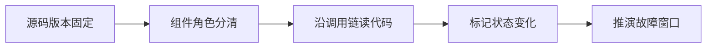

<strong>源码对照：</strong>[BrokerController.java · L877–L904](https://github.com/apache/rocketmq/blob/63d20eb92a4aa685ae0d0696b419d3ffb6ca1738/broker/src/main/java/org/apache/rocketmq/broker/BrokerController.java#L877-L904)。以下为连续节选，可能止于方法中间；仅统一缩进，完整方法与调用方见链接。

```java
public boolean initialize() throws CloneNotSupportedException {

    boolean result = this.initializeMetadata();
    if (!result) {
        return false;
    }

    result = this.initializeMessageStore();
    if (!result) {
        return false;
    }

    return this.recoverAndInitService();
}

public boolean recoverAndInitService() throws CloneNotSupportedException {

    boolean result = true;

    if (this.brokerConfig.isEnableControllerMode()) {
        this.replicasManager = new ReplicasManager(this);
        this.replicasManager.setFenced(true);
    }

    if (messageStore != null) {
        registerMessageStoreHook();
        result = this.messageStore.load();
    }
```

<strong>逐段阅读抓手：</strong>initialize是生命周期入口，不是发送入口；先确认依赖加载是否成功，再看服务启动。


## 0.2 四组容易混淆的路径

四个维度分别回答不同问题：Remoting/gRPC是通信入口；Pull/POP是消费协议；文件CQ/RocksDB CQ是索引后端；传统HA/DLedger/Controller是复制和切换机制。它们不能简单排列成“4.x旧、5.x新”。5.3.4仍包含多条兼容路径。

DefaultMessageStore的索引工厂还包含双写迁移分支。RocksDBMessageStore有自己的实现。看到一个20字节CQ记录，只能说明当前读的是文件ConsumeQueue，不能说所有存储都按这个布局写。

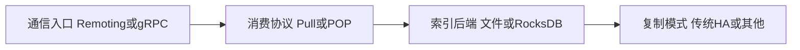

<strong>源码对照：</strong>[DefaultMessageStore.java · L268–L280](https://github.com/apache/rocketmq/blob/63d20eb92a4aa685ae0d0696b419d3ffb6ca1738/store/src/main/java/org/apache/rocketmq/store/DefaultMessageStore.java#L268-L280)。以下为连续节选，可能止于方法中间；仅统一缩进，完整方法与调用方见链接。

```java
public ConsumeQueueStoreInterface createConsumeQueueStore() {
    if (messageStoreConfig.isRocksdbCQDoubleWriteEnable()) {
        return new CombineConsumeQueueStore(this);
    }
    return new ConsumeQueueStore(this);
}

public boolean parseDelayLevel() {
    HashMap<String, Long> timeUnitTable = new HashMap<>();
    timeUnitTable.put("s", 1000L);
    timeUnitTable.put("m", 1000L * 60);
    timeUnitTable.put("h", 1000L * 60 * 60);
    timeUnitTable.put("d", 1000L * 60 * 60 * 24);
```

<strong>逐段阅读抓手：</strong>先辨认实际对象类型；同名接口方法可以落到不同存储实现。


## 0.3 源码目录对应哪些职责

client负责客户端路由、发送和消费调度；namesrv负责路由注册与查询；remoting负责RPC协议和异步响应；broker负责请求处理、消费元数据及业务消息服务；store负责日志、索引和复制；proxy负责gRPC入口与消息处理编排；controller负责自动切换相关元数据与决策。

目录名就是第一层责任边界。Proxy不会凭空替代CommitLog，NameServer不承载消息体，也不会因为它有“集群信息表”就变成消息一致性的仲裁者。


<strong>源码对照：</strong>[DefaultMessagingProcessor.java · L139–L153](https://github.com/apache/rocketmq/blob/63d20eb92a4aa685ae0d0696b419d3ffb6ca1738/proxy/src/main/java/org/apache/rocketmq/proxy/processor/DefaultMessagingProcessor.java#L139-L153)。以下为连续节选，可能止于方法中间；仅统一缩进，完整方法与调用方见链接。

```java
protected void init() {
    this.appendStartAndShutdown(this.serviceManager);
    this.appendStartAndShutdown(this.receiptHandleProcessor);
    this.appendShutdown(this.producerProcessorExecutor::shutdown);
    this.appendShutdown(this.consumerProcessorExecutor::shutdown);
}

@Override
public SubscriptionGroupConfig getSubscriptionGroupConfig(ProxyContext ctx, String consumerGroupName) {
    return this.serviceManager.getMetadataService().getSubscriptionGroupConfig(ctx, consumerGroupName);
}

@Override
public ProxyTopicRouteData getTopicRouteDataForProxy(ProxyContext ctx, List<Address> requestHostAndPortList,
    String topicName) throws Exception {
```

<strong>逐段阅读抓手：</strong>DefaultMessagingProcessor把不同操作交给对应Processor；继续进入具体操作，不要停在接口转发层。


## 0.4 4.x与5.x对照：两个基线与“升级”究竟比较什么

|对照维度|固定4.9.8|固定5.3.4|
|---|---|---|
|实现|4.9.8保留经典Remoting客户端、队列分配、等级延迟、事务消息与传统HA/DLedger等路径。|5.3.4同时保留兼容路径并增加Proxy/gRPC、POP、时间轮定时、Controller及新的存储分支等。|

<strong>变化原因（源码分析）：</strong>兼容既有生态，同时提供新的消费和部署模型。这里比较固定发行版差异，不把某特性在5.3.4出现说成必定于5.0.0首次发布。

<strong>适用边界：</strong>升级Broker版本不会自动把旧Remoting Consumer变成gRPC/POP；源码有某分支，也不表示配置已启用。

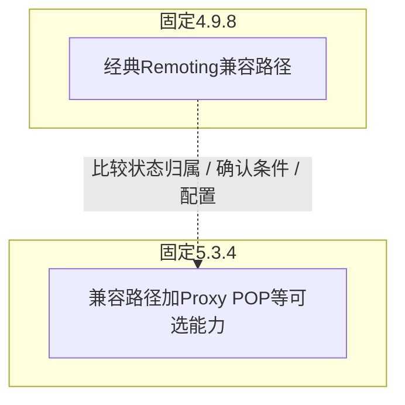

<strong>4.9.8源码：</strong>[BrokerController.java · L241–L270](https://github.com/apache/rocketmq/blob/2bdd53ef6694ffa19fd00db0b887e4895444f63e/broker/src/main/java/org/apache/rocketmq/broker/BrokerController.java#L241-L270)，连续节选。

```java
public boolean initialize() throws CloneNotSupportedException {
    boolean result = this.topicConfigManager.load();

    result = result && this.consumerOffsetManager.load();
    result = result && this.subscriptionGroupManager.load();
    result = result && this.consumerFilterManager.load();

    if (result) {
        try {
            this.messageStore =
                new DefaultMessageStore(this.messageStoreConfig, this.brokerStatsManager, this.messageArrivingListener,
                    this.brokerConfig);
            if (messageStoreConfig.isEnableDLegerCommitLog()) {
                DLedgerRoleChangeHandler roleChangeHandler = new DLedgerRoleChangeHandler(this, (DefaultMessageStore) messageStore);
                ((DLedgerCommitLog)((DefaultMessageStore) messageStore).getCommitLog()).getdLedgerServer().getdLedgerLeaderElector().addRoleChangeHandler(roleChangeHandler);
            }
            this.brokerStats = new BrokerStats((DefaultMessageStore) this.messageStore);
            //load plugin
            MessageStorePluginContext context = new MessageStorePluginContext(messageStoreConfig, brokerStatsManager, messageArrivingListener, brokerConfig);
            this.messageStore = MessageStoreFactory.build(context, this.messageStore);
            this.messageStore.getDispatcherList().addFirst(new CommitLogDispatcherCalcBitMap(this.brokerConfig, this.consumerFilterManager));
        } catch (IOException e) {
            result = false;
            log.error("Failed to initialize", e);
        }
    }

    result = result && this.messageStore.load();

    if (result) {
```

<strong>5.3.4源码：</strong>[BrokerController.java · L877–L904](https://github.com/apache/rocketmq/blob/63d20eb92a4aa685ae0d0696b419d3ffb6ca1738/broker/src/main/java/org/apache/rocketmq/broker/BrokerController.java#L877-L904)，连续节选。

```java
public boolean initialize() throws CloneNotSupportedException {

    boolean result = this.initializeMetadata();
    if (!result) {
        return false;
    }

    result = this.initializeMessageStore();
    if (!result) {
        return false;
    }

    return this.recoverAndInitService();
}

public boolean recoverAndInitService() throws CloneNotSupportedException {

    boolean result = true;

    if (this.brokerConfig.isEnableControllerMode()) {
        this.replicasManager = new ReplicasManager(this);
        this.replicasManager.setFenced(true);
    }

    if (messageStore != null) {
        registerMessageStoreHook();
        result = this.messageStore.load();
    }
```

<strong>对照读法：</strong>先找输入条件，再标记状态保存在哪个组件，最后比较成功确认和故障恢复的触发点。类名变化不一定表示协议改变；新增分支也不代表旧路径消失。

<a id="reading-ledgers"></a>

## 0.5 先把RocketMQ看成三本账

读源码时最容易走丢，是把“消息存在”“消息可读”和“业务做完”看成同一个状态。经典文件存储可以先看成三本账：<strong>CommitLog记录发生过什么，ConsumeQueue记录到哪里找，消费位点记录某个Group下次从哪里继续。</strong>IndexFile是按Key查询的辅助入口，不替代按队列消费的CQ。

|账本|谁维护|记录的单位|回答的问题|不能证明什么|
|---|---|---|---|---|
|CommitLog|Broker的CommitLog追加路径|物理字节位置与完整消息记录|日志中是否有这条记录|不能单凭追加证明已刷盘、已建CQ或业务成功|
|ConsumeQueue|Reput分发到CQ实现|某个Topic/Queue的逻辑序号→物理位置|给定queueOffset去哪读消息|不能证明任何Group处理完成|
|consumerOffset|客户端OffsetStore及Broker位点管理|Group/Topic/Queue的进度|该组重启或重新分配后从哪里继续|不能证明数据库副作用恰好发生一次|

为什么拆开？多个Topic/Queue共享物理追加日志，可把许多写入汇入顺序写；消费又需要按各自Queue读，所以由索引把逻辑序列映射回物理日志；不同Group独立订阅同一批消息，所以进度必须另存。<strong>结构的收益与代价是一体的：写入和索引解耦提升处理弹性，也引入追加成功而暂时不可见的窗口。</strong>

这只是经典文件主线的模型。RocksDB CQ改变索引后端；POP增加逐次投递的在途记录；DLedger改变日志提交路径。先掌握账本职责，再去看这些分支怎样换实现。

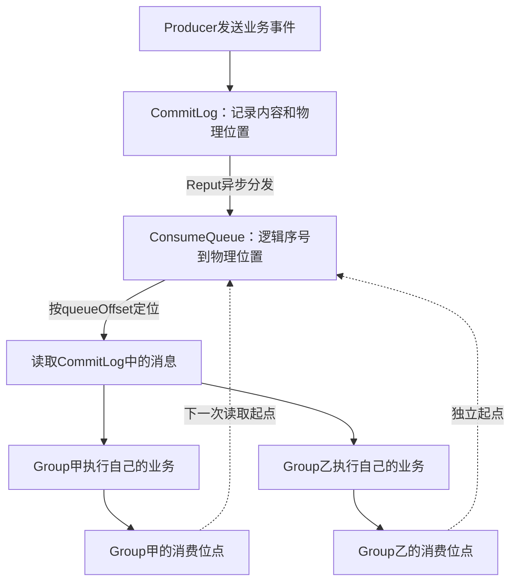

<strong>源码接续：</strong>[第1章的三种offset](#chapter-1)→[第7章的追加](#chapter-7)→[第10章的索引分发](#chapter-10)→[第17章的进度持久化](#chapter-17)。阅读时在每个类旁边写下“它管哪本账”，再读方法。

<a id="reading-offsets"></a>

## 0.6 用四条消息手算：为什么三个offset不能互换

假设只讨论同一个Broker的经典文件主线，以下物理位置和长度均为讲解自拟值，不包含文件尾滚动。TopicA有Q0、Q1，TopicB有Q0。表中长度是**整条编码记录**的长度，包含元数据，并非只有Body。

|物理追加顺序|Topic/Queue|queueOffset|commitLogOffset|记录长度|物理结束位置|
|---|---|---:|---:|---:|---:|
|M1|A/Q0|0|1000|120|1120|
|M2|B/Q0|0|1120|160|1280|
|M3|A/Q0|1|1280|140|1420|
|M4|A/Q1|0|1420|180|1600|

从这张表推出四个结论：A/Q0的逻辑offset连续为0、1，但物理位置隔着B/Q0的记录；A/Q1和B/Q0各自也从0开始；同一条M3对Group甲和Group乙的queueOffset相同，消费进度却可以不同；刷盘等待M3时关注的是完整记录结束位置1420，不是逻辑offset1。

经典文件CQ的一条记录占20字节，所以A/Q0的逻辑offset1对应CQ逻辑字节位置`1×20=20`，该槽保存物理位置1280、消息长度140和tagsCode。CQ文件自身也会分段；找到槽后再读取CommitLog。<strong>乘20定位的是CQ槽，不是消息体，也不是CommitLog偏移。</strong>

若Group甲已处理A/Q0的M1，通常把下一读取位置推进到1；Group乙还没处理则可能停在0。甲的consumerOffset=1表示下次从M3开始，并不表示“物理日志只刷到了1字节”。

<strong>闭眼自检：</strong>M3已进入CommitLog，但CQ分发尚未赶到1280，消费者能否仅靠A/Q0的offset1马上读到它？不能，按队列消费的索引入口尚未建立。业务监听器完成M3后，能否立即物理删除M3？不能，其他Group、回溯与日志文件保留都有自己的生命周期。

<a id="reading-send"></a>

## 0.7 一次send成功经过了什么，哪些动作仍在后面

普通Remoting同步发送主线从`DefaultMQProducerImpl.sendDefaultImpl`开始：拿路由、选Queue、计算剩余超时、通过Remoting发请求。Broker按请求码进入`SendMessageProcessor`，校验并构造内部消息，再进入MessageStore和CommitLog。最终响应来自存储结果映射，而消费在另一个推进过程里。

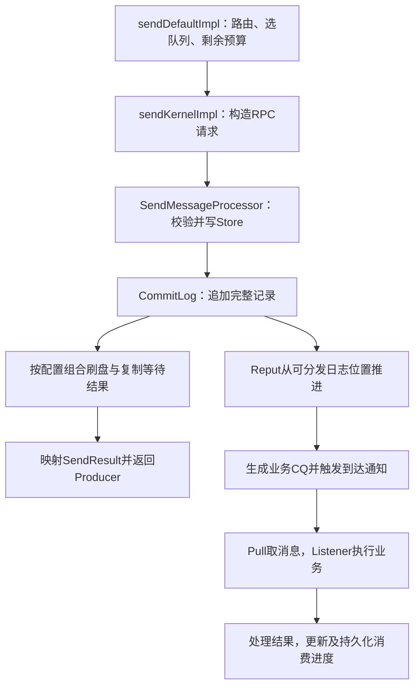

图里从追加处分叉，表示发送响应路径与消费可见性路径分别推进，**不表示两者有固定的先后竞赛结果**。重负载时Producer先拿到结果、Reput随后赶上；另一些时序下索引已生成，Producer仍在等待刷盘或复制确认。

|完成点|源码抓手|此时能说什么|下一步还要问什么|
|---|---|---|---|
|追加完成|`AppendMessageResult`中的位置与长度|当前追加路径接受了该记录|可读位置、刷盘与副本到了哪里？|
|发送结果返回|刷盘/复制Future与`SendMessageProcessor`状态映射|满足了本路径实际启用的确认条件，或报告相应错误|结果是否到达Producer？CQ是否赶上？|
|业务CQ可见|Reput与CQ分发器|按此Queue查询可定位消息|消费者有没有拉到、执行是否成功？|
|业务事务提交|应用自己的事务事实|业务副作用按其事务约束生效|消费确认是否送达、重投如何判重？|
|进度持久化|OffsetStore及Broker位点管理|重启可按已保存进度续读|日志还在保留范围内吗？是否允许回溯？|

<strong>关键反例：</strong>同步刷盘配置下，刷盘等待超时可以发生在记录已追加之后。把`FLUSH_DISK_TIMEOUT`或RPC超时一律理解为“Broker没收过”，会在重发时制造重复。代码中的Future超时结束的是一次等待，不会倒着擦除已追加日志。

<strong>源码接续：</strong>[第4章](#chapter-4)、[第6章](#chapter-6)、[第9章](#chapter-9)、[第10章](#chapter-10)。先追成功判定，再追超时返回；不要只背调用栈。

<a id="reading-positions"></a>

## 0.8 三个写入位置：画清wrote、committed、flushed

这三个字段首先是**单个MappedFile内部的位置**；`MappedFileQueue`的全局位置还要加上文件起始offset。讨论数值大小前，先确定是否启用暂存缓冲。以下限定经典文件路径，省略替代写入方式。

|路径|追加后数据在哪|什么位置可读|commit做什么|flush做什么|
|---|---|---|---|---|
|没有writeBuffer的映射追加|映射区域/PageCache|以wrotePosition为可读边界|不存在把暂存区搬入文件的必要步骤|对可读数据执行相应force并推进刷盘位置|
|有writeBuffer的暂存追加|暂存缓冲|以committedPosition为可读边界|把wrote与committed之间的字节写入文件通道|对已提交的可读数据force并推进刷盘位置|

不能无条件写成`flushed≤committed≤wrote`后套给所有配置。无暂存缓冲时，`getReadPosition()`直接取wrotePosition，committedPosition不是该路径读取的门槛。有暂存缓冲时，三个阶段才构成“已追加→已提交到文件→已刷盘”的推进关系。

假设有暂存缓冲，一个文件起始全局offset为0：初始W=C=F=1000；追加M1后W=1120、C=F=1000；commit后W=C=1120、F=1000；flush后W=C=F=1120。第一步后，暂存区有M1，却还不能据此认为文件读取路径或HA已能读到M1。第二步后，进程可从文件侧读取，断电持久化保证还取决于后续刷盘。

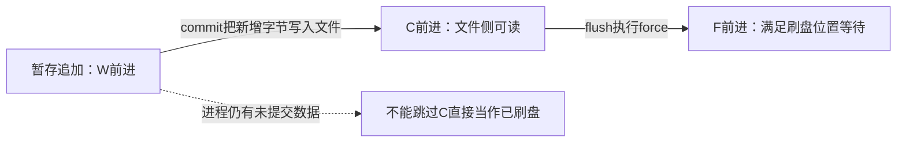

<strong>读源码的顺序：</strong>[第8章](#chapter-8)中先看`appendMessage`写哪个Buffer，再看`getReadPosition`选择哪个位置，最后看`commit0`、`flush`和队列全局位置怎样组合。这样才能解释为什么“写入吞吐很高”与“同步刷盘RT很高”可以同时发生。

<a id="reading-consume"></a>

## 0.9 消费不是一个ACK：先追本地缓存，再追远端进度

经典PushConsumer用后台Pull主动取消息。Broker长轮询挂起的是请求上下文，不是为每条请求占住一个业务线程不停等待。客户端把拉取结果放进ProcessQueue，再交给消费线程池。于是同一个Queue至少有三种客户端状态：**下次Pull位置、本地未完成集合、安全消费位点**；三者职责不同。

下面假设正常集群并发消费，消息100、101、102已拉入同一ProcessQueue，没有过期清理或队列撤销。pull的nextOffset可以已经到103，consumerOffset却仍在100。消费者已“取走”不等于已“处理完”。

|步骤|ProcessQueue剩余记录|本次removeMessage结果|内存安全位点|Broker持久化位点|
|---|---|---:|---:|---|
|都在处理|100、101、102|尚未移除|100|例如仍为100|
|102先成功|100、101|100|100|不应据此跳到103|
|100再成功|101|101|101|可能仍为100，尚未完成提交|
|101最后成功|空|103|103|完成持久化后才可到103|

为什么回调不能“谁先完成就把offset写成谁+1”？102先完成就提交103，重启后会跳过100、101。源码用有序的`msgTreeMap`保留尚未交接完成的记录，`removeMessage`取最小残留位置，空时返回`queueOffsetMax+1`。它保护的是本地待处理集合下的续读边界；普通Pull过滤掉的消息无需假装也都在这个集合里。

101业务失败怎么办？若`sendMessageBack`成功，失败责任交给Broker重试消息，原Queue可以继续推进；回送失败则把101排除出本次可删除集合，保留本地并延后消费。<strong>允许原位点越过失败消息的理由，是重试责任已被安全交接，绝不是“失败也算成功”。</strong>

最后还有一条裂缝：数据库已提交，但进度尚未持久化时宕机，重启可能再消费；业务幂等必须依据稳定业务事件标识，而非只看ProcessQueue是否为空。广播、顺序服务与POP各有自己的分支，不能套这张并发集群表。

<strong>源码接续：</strong>[第13章](#chapter-13)的ProcessQueue→[第14章](#chapter-14)的Pull循环→[第15章](#chapter-15)的结果处理→[第17章](#chapter-17)的持久化。

<a id="reading-failures"></a>

## 0.10 失败由谁接手：把重试、事务回查与POP恢复分开

三个机制都会“以后再做”，但补的是三个不同的缺口。

|机制|要弥补的缺口|保存什么依据|谁推动恢复|应用仍需做什么|
|---|---|---|---|---|
|经典消费重试|Listener未完成处理|回送后的重试消息及重试次数等信息|Broker调度，消费者再次处理|幂等、可重试分类、死信处置|
|事务回查|Broker不知道生产者本地事务结果|half及op处理记录、业务事务标识|Broker发起检查，Producer查本地事务事实|可靠查询COMMIT/ROLLBACK/未知，不能凭猜测返回|
|POP超时恢复|投递过但没有完成有效ACK|checkpoint/ACK或KV在途记录|到期后的Revive或KV恢复路径|处理与ACK分离，续期、超时与重复处理控制|

<strong>事务纸面时序：</strong>half先被接受→本地订单事务提交→Producer还没送达COMMIT就宕机。Broker看不到订单数据库，无法自行判断订单成功，只能回查Producer端的持久化事实。回查若只查原进程内的Map，进程重启后事实丢失，便无法可靠收敛。若数据库暂不可读，应区分未知与已回滚；查不到是否代表回滚，取决于事务记录、查询隔离与业务状态设计。

COMMIT处理把最终消息写回原业务Topic，再记录half已处理的op。这里不是把磁盘上的half原地翻一个布尔位，也不是马上删除旧字节。最终业务消息与half处于不同逻辑队列，offset会变化。失败或重复处理窗口仍需结合完整源码追踪；下游数据库也没有自动加入生产者事务。[官方事务说明](https://rocketmq.apache.org/docs/featureBehavior/04transactionmessage/)明确区分消息生产与本地事务的一致性，以及下游消费处理责任。

<strong>POP纸面时序：</strong>消费者甲取到M，获得本次投递的收据和不可见期限；甲执行很慢，期限到期且缺乏有效ACK/续期；恢复路径使M有机会再投递给乙；甲后来也提交了业务。不可见期限限制的是本次投递可见性，不是给甲的数据库加锁，也不是永久所有权。两个业务处理可能重叠，所以需要判重及业务并发约束。

ReceiptHandle带本次投递的上下文，业务事件ID表达“这件业务是什么”。前者不能代替后者。旧checkpoint/ReviveTopic与KV在途记录是替代实现分支，必须看实际开关，不能把两个后端同时画成每条消息必经路径。

<strong>源码接续：</strong>[第18章重试](#chapter-18)、[第20章事务](#chapter-20)、[第25章POP](#chapter-25)、[第26章KV/收据](#chapter-26)。

<a id="reading-tradeoffs"></a>

## 0.11 把顺序、吞吐和可靠性放在同一张因果表里

|设计选择|为什么这样做|由此产生的代价|面试追问怎么接|
|---|---|---|---|
|共享CommitLog顺序追加|汇聚写入，减少分散随机写|物理追加仍要协调，共享路径可能形成瓶颈|先拆队列锁与物理追加锁，再谈锁内工作|
|CQ异步派生|把日志事实与消费索引解耦|追加到可见之间有分发滞后|发送成功但拉不到，先确认CQ与分发位置|
|并发消费+安全位点|让后续记录并行做，又不越过未完成集合|最早未完成记录拖住原队列进度|失败重试成功交接后，原位点为什么可以前进？|
|同Queue顺序消费|限制同一序列内的并发执行|头部失败阻塞后续，吞吐受单条RT牵制|增加Queue只提高多个独立序列的并发，不能凭空保全局顺序|
|异步刷盘/异步复制|减少发送路径等待|确认之后仍有数据未持久化或未复制窗口|指定进程故障、主机故障或断电，再说可能丢在哪里|
|POP不可见期限|用时限回收失联消费者的投递责任|超时后旧、新处理可能重叠|续期减少重投窗口，业务幂等仍需单独证明|

经典顺序消息需要把“同一个业务序列稳定路由到同一Queue”和“该Queue按顺序执行”同时说清。只启用顺序Listener、发送时却随机选Queue，不会得到同一订单跨Queue顺序。不同Producer并发发送时，“数据库中先发生”也不自动等于“Broker先追加”。5.x消息组FIFO要按对应SDK和服务端分支解释，不能靠旧顺序服务的Queue锁代替。

吞吐算例也要明确范围：假设某个必须串行执行的业务序列，平均一条占用10ms，且不计其他开销，则该序列的处理上限约为100条/秒。这是讲解用的服务时间估算，不是RocketMQ基准值。加消费者若没有新的可分配Queue，经典队列分配模式下不会自动拆开这个序列；消息级负载均衡也不能免除FIFO序列约束。[官方负载均衡说明](https://rocketmq.apache.org/docs/featureBehavior/08consumerloadbalance/)按消费者类型区分队列级与消息级分配。

<strong>一分钟复述：</strong>RocketMQ把物理日志、逻辑索引和消费进度分开。发送先选队列，经Broker追加日志，按配置等待刷盘和副本确认；CQ分发决定按队列消费的可见性。经典Push是后台Pull，消费完成顺序可以不同，所以用本地未完成集合算安全位点，失败则交给重试路径。事务消息解决生产者本地事务与消息可见性的收敛，POP用不可见期限和逐投递ACK管理在途责任。每个阶段都存在确认丢失或宕机窗口，业务幂等、顺序边界和日志保留需要分别设计。

<strong>能复述不等于读懂，试着继续答这六个追问：</strong>

1. 为什么SEND_OK后CQ仍可能没赶上？答出异步分发和不同完成点，见0.7。
2. 为什么committedPosition不能总作可读边界？答出writeBuffer分支，见0.8。
3. 102已成功而位点仍在100，是重复消费Bug吗？答出安全边界及持久化窗口，见0.9。
4. 失败101为什么允许从原Queue移除？答出重试责任交接及回送失败保留，见0.9。
5. 事务回查为什么不能只查内存？答出进程重启与持久化业务事实，见0.10。
6. 不可见时间延长能否保证只扣款一次？不能，它管理投递期限，数据库重复副作用需要业务约束，见0.10。

第一轮读到这里，应能画出消息和三本账的关系；第二轮回到各章的源码卡，验证每一次状态前进的条件；第三轮读版本对照和特殊路径，检查哪些前提已经变化。详细源码保留在原章，不要求逐行背诵，也不要求搭建集群或运行实验。


## 本章纸面推演

第一遍沿发送→CommitLog→CQ→拉取→消费位点读完；第二遍补事务、定时、HA、Proxy与POP。遇到复杂分支，先写下自己的客户端协议和Broker配置，再进入对应章节。


<a id="chapter-1"></a>

# 1. 架构、消息模型与三种offset

<strong>适用范围：</strong>所有路径的概念层；布局示例以文件存储为准。

<strong>本章目标：</strong>建立Topic、Queue、Group与物理日志之间的对应关系。

> <strong>带着这个问题读：三个offset的单位分别是什么？</strong>
>
> queueOffset是单Queue逻辑序号，commitLogOffset是物理字节位置，consumerOffset属于Group进度。先手算0.6，再看源码字段。


## 1.1 Queue是逻辑序列，CommitLog是物理日志

Topic是消息分类；MessageQueue由topic、brokerName、queueId标识。经典客户端以队列为路由和负载分配单元，同一Topic的不同队列可以位于不同Broker。单个文件存储实例通常把多个Topic/Queue的消息追加到同一CommitLog文件序列，再以CQ还原逻辑队列。

因此“Topic对应一个日志文件”和“每个Queue独立保存完整消息体”都不是经典存储的准确描述。队列有序与全局有序也不同：多个Queue之间没有天然的共同提交顺序。

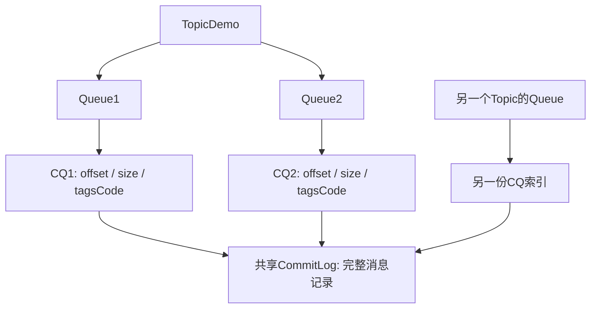

<strong>源码对照：</strong>[MessageQueue.java · L21–L49](https://github.com/apache/rocketmq/blob/63d20eb92a4aa685ae0d0696b419d3ffb6ca1738/common/src/main/java/org/apache/rocketmq/common/message/MessageQueue.java#L21-L49)。以下为连续节选，可能止于方法中间；仅统一缩进，完整方法与调用方见链接。

```java
public class MessageQueue implements Comparable<MessageQueue>, Serializable {
    private static final long serialVersionUID = 6191200464116433425L;
    private String topic;
    private String brokerName;
    private int queueId;

    public MessageQueue() {

    }

    public MessageQueue(MessageQueue other) {
        this.topic = other.topic;
        this.brokerName = other.brokerName;
        this.queueId = other.queueId;
    }

    public MessageQueue(String topic, String brokerName, int queueId) {
        this.topic = topic;
        this.brokerName = brokerName;
        this.queueId = queueId;
    }

    public String getTopic() {
        return topic;
    }

    public void setTopic(String topic) {
        this.topic = topic;
    }
```

<strong>逐段阅读抓手：</strong>MessageQueue的equals与compareTo用于集合、排序和分配；brokerName是逻辑Broker名称，不等于某次连接的IP地址。


## 1.2 queueOffset、commitLogOffset、consumerOffset

queueOffset是某逻辑队列的消息位置；commitLogOffset是日志中的字节位置；consumerOffset是某消费组在某队列的进度，通常指下一条待消费位置。三者单位、范围和拥有者不同，不能相减。

例如Queue的第100条消息可以位于CommitLog字节位置8,000,000；消费位点100表示下次从逻辑位置100开始，不表示读到日志第100字节。文件CQ用逻辑位置乘记录宽度定位索引，再得到物理位置和长度。

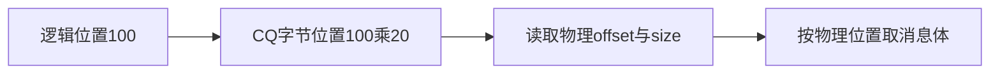

<strong>源码对照：</strong>[ConsumeQueue.java · L797–L840](https://github.com/apache/rocketmq/blob/63d20eb92a4aa685ae0d0696b419d3ffb6ca1738/store/src/main/java/org/apache/rocketmq/store/ConsumeQueue.java#L797-L840)。以下为连续节选，可能止于方法中间；仅统一缩进，完整方法与调用方见链接。

```java
private boolean putMessagePositionInfo(final long offset, final int size, final long tagsCode,
    final long cqOffset) {

    if (offset + size <= this.getMaxPhysicOffset()) {
        // During the recovery process after broker crashes, this logs will cause the scrolling of valid logs.
        if (messageStore.getStateMachine().getCurrentState().isAfter(MessageStoreStateMachine.MessageStoreState.RECOVER_COMMITLOG_OK) ||
            messageStore.getMessageStoreConfig().isEnableLogConsumeQueueRepeatedlyBuildWhenRecover()) {
            log.warn("Maybe try to build consume queue repeatedly maxPhysicOffset={} phyOffset={}",
                this.getMaxPhysicOffset(), offset);
        }
        return true;
    }

    this.byteBufferIndex.flip();
    this.byteBufferIndex.limit(CQ_STORE_UNIT_SIZE);
    this.byteBufferIndex.putLong(offset);
    this.byteBufferIndex.putInt(size);
    this.byteBufferIndex.putLong(tagsCode);

    final long expectLogicOffset = cqOffset * CQ_STORE_UNIT_SIZE;

    MappedFile mappedFile = this.mappedFileQueue.getLastMappedFile(expectLogicOffset);
    if (mappedFile != null) {

        if (mappedFile.isFirstCreateInQueue() && cqOffset != 0 && mappedFile.getWrotePosition() == 0) {
            this.minLogicOffset = expectLogicOffset;
            this.mappedFileQueue.setFlushedWhere(expectLogicOffset);
            this.mappedFileQueue.setCommittedWhere(expectLogicOffset);
            this.fillPreBlank(mappedFile, expectLogicOffset);
            log.info("fill pre blank space " + mappedFile.getFileName() + " " + expectLogicOffset + " "
                + mappedFile.getWrotePosition());
        }

        if (cqOffset != 0) {
            long currentLogicOffset = mappedFile.getWrotePosition() + mappedFile.getFileFromOffset();

            if (expectLogicOffset < currentLogicOffset) {
                log.warn("Build consume queue repeatedly, expectLogicOffset: {} currentLogicOffset: {} Topic: {} QID: {} Diff: {}",
                    expectLogicOffset, currentLogicOffset, this.topic, this.queueId, expectLogicOffset - currentLogicOffset);
                return true;
            }

            if (expectLogicOffset != currentLogicOffset) {
                LOG_ERROR.warn(
```

<strong>逐段阅读抓手：</strong>看expectLogicOffset如何由cqOffset计算；参数offset是物理位置，cqOffset是逻辑位置，别被同一个单词误导。


## 1.3 Group才是消费进度的命名空间

消费进度按Group、Topic、Queue组织。同一Group成员变化会重新分配处理权；不同Group互不共享业务进度。经典广播客户端还涉及本地位点，它不能套用集群模式的Broker远程位点语义。

Broker记录的是消息消费协议的进度，不知道你的数据库是否已经提交。把“更新consumerOffset”解释成“业务事务已成功”，跨越了系统边界。

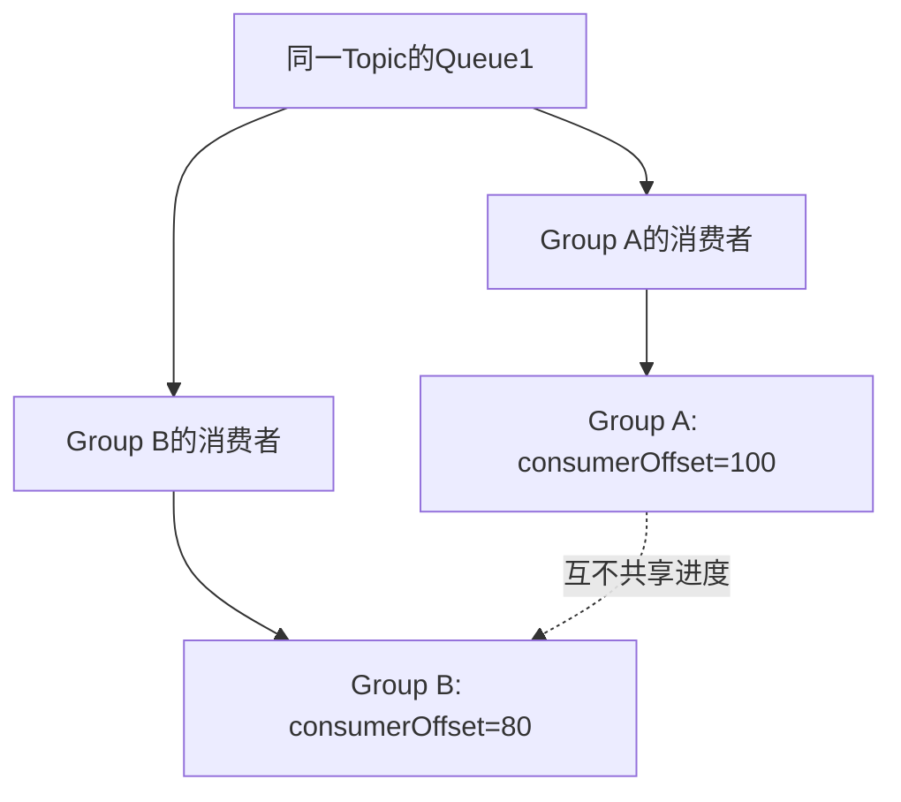

<strong>源码对照：</strong>[ConsumerOffsetManager.java · L198–L222](https://github.com/apache/rocketmq/blob/63d20eb92a4aa685ae0d0696b419d3ffb6ca1738/broker/src/main/java/org/apache/rocketmq/broker/offset/ConsumerOffsetManager.java#L198-L222)。以下为连续节选，可能止于方法中间；仅统一缩进，完整方法与调用方见链接。

```java
public void commitOffset(final String clientHost, final String group, final String topic, final int queueId,
    final long offset) {
    // topic@group
    String key = topic + TOPIC_GROUP_SEPARATOR + group;
    this.commitOffset(clientHost, key, queueId, offset);
}

private void commitOffset(final String clientHost, final String key, final int queueId, final long offset) {
    ConcurrentMap<Integer, Long> map = this.offsetTable.get(key);
    if (null == map) {
        map = new ConcurrentHashMap<>(32);
        map.put(queueId, offset);
        this.offsetTable.put(key, map);
    } else {
        Long storeOffset = map.put(queueId, offset);
        if (storeOffset != null && offset < storeOffset) {
            LOG.warn("[NOTIFYME]update consumer offset less than store. clientHost={}, key={}, queueId={}, requestOffset={}, storeOffset={}", clientHost, key, queueId, offset, storeOffset);
        }
    }
    if (versionChangeCounter.incrementAndGet() % brokerController.getBrokerConfig().getConsumerOffsetUpdateVersionStep() == 0) {
        updateDataVersion();
    }
}

public void commitPullOffset(final String clientHost, final String group, final String topic, final int queueId,
```

<strong>逐段阅读抓手：</strong>观察topic与group组合key以及queueId到offset的映射；同Topic不同Group必须区分。


## 1.4 4.x与5.x对照：消息类型与Topic约束

4.9.8经典TopicConfig主要表达读写队列数、权限、过滤类型等属性；普通、顺序、事务、延迟行为更多由消息属性和客户端使用方式表达。5.3.4新增/扩展Topic消息类型属性与Proxy发送校验路径，可区分NORMAL、FIFO、DELAY、TRANSACTION等能力。

<strong>原因（官方模型与源码分析）：</strong>明确Topic消息类型可在入口阻止不匹配消息，并让路由/消费能力按类型表达。<strong>边界：</strong>校验是否启用及是否允许MIXED等兼容行为需看路径和配置；不能笼统说任何5.xBroker都无条件拒绝所有混用。经典Remoting兼容行为与Proxy不必完全相同。

[官方Topic模型与版本兼容说明](https://rocketmq.apache.org/docs/domainModel/02topic/)。

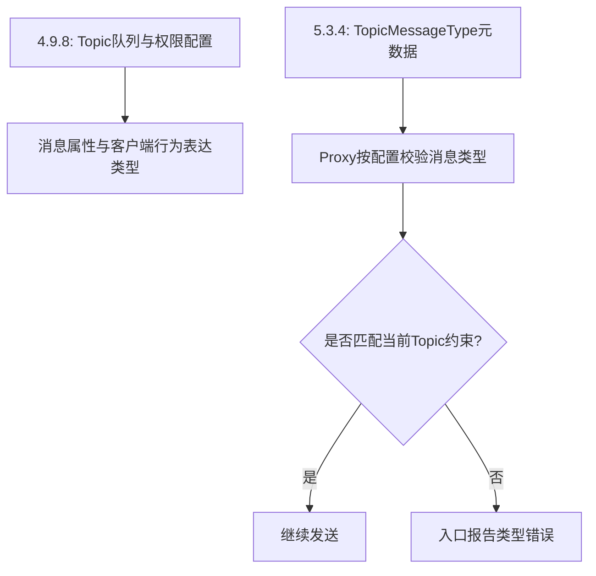


<strong>4.9.8源码对照：</strong>[TopicConfig.java · L21–L51](https://github.com/apache/rocketmq/blob/2bdd53ef6694ffa19fd00db0b887e4895444f63e/common/src/main/java/org/apache/rocketmq/common/TopicConfig.java#L21-L51)，连续节选。

```java
public class TopicConfig {
    private static final String SEPARATOR = " ";
    public static int defaultReadQueueNums = 16;
    public static int defaultWriteQueueNums = 16;
    private String topicName;
    private int readQueueNums = defaultReadQueueNums;
    private int writeQueueNums = defaultWriteQueueNums;
    private int perm = PermName.PERM_READ | PermName.PERM_WRITE;
    private TopicFilterType topicFilterType = TopicFilterType.SINGLE_TAG;
    private int topicSysFlag = 0;
    private boolean order = false;

    public TopicConfig() {
    }

    public TopicConfig(String topicName) {
        this.topicName = topicName;
    }

    public TopicConfig(String topicName, int readQueueNums, int writeQueueNums, int perm) {
        this.topicName = topicName;
        this.readQueueNums = readQueueNums;
        this.writeQueueNums = writeQueueNums;
        this.perm = perm;
    }

    public String encode() {
        StringBuilder sb = new StringBuilder();
        sb.append(this.topicName);
        sb.append(SEPARATOR);
        sb.append(this.readQueueNums);
```

<strong>5.3.4源码对照：</strong>[ProducerProcessor.java · L69–L102](https://github.com/apache/rocketmq/blob/63d20eb92a4aa685ae0d0696b419d3ffb6ca1738/proxy/src/main/java/org/apache/rocketmq/proxy/processor/ProducerProcessor.java#L69-L102)，连续节选。

```java
public CompletableFuture<List<SendResult>> sendMessage(ProxyContext ctx, QueueSelector queueSelector,
    String producerGroup, int sysFlag, List<Message> messageList, long timeoutMillis) {
    CompletableFuture<List<SendResult>> future = new CompletableFuture<>();
    long beginTimestampFirst = System.currentTimeMillis();
    AddressableMessageQueue messageQueue = null;
    try {
        Message message = messageList.get(0);
        String topic = message.getTopic();
        if (isNeedCheckTopicMessageType(message)) {
            if (topicMessageTypeValidator != null) {
                // Do not check retry or dlq topic
                if (!NamespaceUtil.isRetryTopic(topic) && !NamespaceUtil.isDLQTopic(topic)) {
                    TopicMessageType topicMessageType = serviceManager.getMetadataService().getTopicMessageType(ctx, topic);
                    TopicMessageType messageType = TopicMessageType.parseFromMessageProperty(message.getProperties());
                    topicMessageTypeValidator.validate(topicMessageType, messageType);
                }
            }
        }
        messageQueue = queueSelector.select(ctx,
            this.serviceManager.getTopicRouteService().getCurrentMessageQueueView(ctx, topic));
        if (messageQueue == null) {
            throw new ProxyException(ProxyExceptionCode.FORBIDDEN, "no writable queue");
        }

        for (Message msg : messageList) {
            MessageClientIDSetter.setUniqID(msg);
        }
        SendMessageRequestHeader requestHeader = buildSendMessageRequestHeader(messageList, producerGroup, sysFlag, messageQueue.getQueueId());

        AddressableMessageQueue finalMessageQueue = messageQueue;
        future = this.serviceManager.getMessageService().sendMessage(
            ctx,
            messageQueue,
            messageList,
```

## 本章纸面推演

Topic有4个Queue，两组消费者都要读全量业务事件：每个Group各自推进位点；同一Group内分摊队列。增加Group不会复制一份CommitLog，主要增加订阅、位点与消费负载。


<a id="chapter-2"></a>

# 2. NameServer：路由注册、查询与过期

<strong>适用范围：</strong>经典路由；Namesrv RouteInfoManager。

<strong>本章目标：</strong>读懂路由表的来源与失效，而不是把路由服务当成消息主节点。

> <strong>带着这个问题读：NameServer故障会立刻停止所有消息发送吗？</strong>
>
> 路由缓存与已有Broker连接可能继续工作，新的路由发现和变更感知会受影响。要按缓存、刷新和Broker可达性分阶段判断。


## 2.1 注册一次Broker会更新哪些表

RouteInfoManager维护Topic到QueueData、Broker名到地址集合、Cluster到Broker集合，以及地址到存活信息等表。Broker注册不仅宣告“我在线”，还上报Topic配置和版本，供路由查询构造完整结果。

注册方法需要处理同名Broker、主从地址、配置变更、静态Topic等情况。本文图只画主要责任，不表示所有表都能无锁独立更新；应注意写锁保护的复合变更。

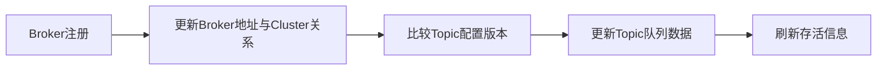

<strong>源码对照：</strong>[RouteInfoManager.java · L212–L266](https://github.com/apache/rocketmq/blob/63d20eb92a4aa685ae0d0696b419d3ffb6ca1738/namesrv/src/main/java/org/apache/rocketmq/namesrv/routeinfo/RouteInfoManager.java#L212-L266)。以下为连续节选，可能止于方法中间；仅统一缩进，完整方法与调用方见链接。

```java
public RegisterBrokerResult registerBroker(
    final String clusterName,
    final String brokerAddr,
    final String brokerName,
    final long brokerId,
    final String haServerAddr,
    final String zoneName,
    final Long timeoutMillis,
    final TopicConfigSerializeWrapper topicConfigWrapper,
    final List<String> filterServerList,
    final Channel channel) {
    return registerBroker(clusterName, brokerAddr, brokerName, brokerId, haServerAddr, zoneName, timeoutMillis, false, topicConfigWrapper, filterServerList, channel);
}

public RegisterBrokerResult registerBroker(
    final String clusterName,
    final String brokerAddr,
    final String brokerName,
    final long brokerId,
    final String haServerAddr,
    final String zoneName,
    final Long timeoutMillis,
    final Boolean enableActingMaster,
    final TopicConfigSerializeWrapper topicConfigWrapper,
    final List<String> filterServerList,
    final Channel channel) {
    RegisterBrokerResult result = new RegisterBrokerResult();
    try {
        this.lock.writeLock().lockInterruptibly();

        //init or update the cluster info
        Set<String> brokerNames = ConcurrentHashMapUtils.computeIfAbsent((ConcurrentHashMap<String, Set<String>>) this.clusterAddrTable, clusterName, k -> new HashSet<>());
        brokerNames.add(brokerName);

        boolean registerFirst = false;

        BrokerData brokerData = this.brokerAddrTable.get(brokerName);
        if (null == brokerData) {
            registerFirst = true;
            brokerData = new BrokerData(clusterName, brokerName, new HashMap<>());
            this.brokerAddrTable.put(brokerName, brokerData);
        }

        boolean isOldVersionBroker = enableActingMaster == null;
        brokerData.setEnableActingMaster(!isOldVersionBroker && enableActingMaster);
        brokerData.setZoneName(zoneName);

        Map<Long, String> brokerAddrsMap = brokerData.getBrokerAddrs();

        boolean isMinBrokerIdChanged = false;
        long prevMinBrokerId = 0;
        if (!brokerAddrsMap.isEmpty()) {
            prevMinBrokerId = Collections.min(brokerAddrsMap.keySet());
        }

```

<strong>逐段阅读抓手：</strong>第一个重载会委托更完整的重载；继续读后面的锁范围和DataVersion比较。


## 2.2 查询路由返回快照，不传消息体

客户端查询Topic路由得到QueueData、BrokerData等信息，再直接向相应Broker发消息。NameServer不处于每条消息的发送数据路径。它的可用性影响新客户端启动、缓存失效后的路由发现以及拓扑变更感知。

已有有效路由缓存时，短时NameServer不可用未必立即阻断所有发送；但不能据此说NameServer永远不重要，缓存里没有的Topic、Broker切换和新实例仍依赖路由发现。

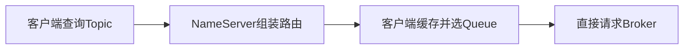

<strong>源码对照：</strong>[RouteInfoManager.java · L700–L746](https://github.com/apache/rocketmq/blob/63d20eb92a4aa685ae0d0696b419d3ffb6ca1738/namesrv/src/main/java/org/apache/rocketmq/namesrv/routeinfo/RouteInfoManager.java#L700-L746)。以下为连续节选，可能止于方法中间；仅统一缩进，完整方法与调用方见链接。

```java
public TopicRouteData pickupTopicRouteData(final String topic) {
    TopicRouteData topicRouteData = new TopicRouteData();
    boolean foundQueueData = false;
    boolean foundBrokerData = false;
    List<BrokerData> brokerDataList = new LinkedList<>();
    topicRouteData.setBrokerDatas(brokerDataList);

    HashMap<String, List<String>> filterServerMap = new HashMap<>();
    topicRouteData.setFilterServerTable(filterServerMap);

    try {
        this.lock.readLock().lockInterruptibly();
        Map<String, QueueData> queueDataMap = this.topicQueueTable.get(topic);
        if (queueDataMap != null) {
            topicRouteData.setQueueDatas(new ArrayList<>(queueDataMap.values()));
            foundQueueData = true;

            Set<String> brokerNameSet = new HashSet<>(queueDataMap.keySet());

            for (String brokerName : brokerNameSet) {
                BrokerData brokerData = this.brokerAddrTable.get(brokerName);
                if (null == brokerData) {
                    continue;
                }
                BrokerData brokerDataClone = new BrokerData(brokerData);

                brokerDataList.add(brokerDataClone);
                foundBrokerData = true;
                if (filterServerTable.isEmpty()) {
                    continue;
                }
                for (final String brokerAddr : brokerDataClone.getBrokerAddrs().values()) {
                    BrokerAddrInfo brokerAddrInfo = new BrokerAddrInfo(brokerDataClone.getCluster(), brokerAddr);
                    List<String> filterServerList = this.filterServerTable.get(brokerAddrInfo);
                    filterServerMap.put(brokerAddr, filterServerList);
                }

            }
        }
    } catch (Exception e) {
        log.error("pickupTopicRouteData Exception", e);
    } finally {
        this.lock.readLock().unlock();
    }

    log.debug("pickupTopicRouteData {} {}", topic, topicRouteData);

```

<strong>逐段阅读抓手：</strong>关注读锁、返回对象的复制以及Topic是否存在；查不到路由和消息发送失败是不同阶段。


## 2.3 心跳超时与连接断开怎样清理

过期扫描使用BrokerLiveInfo中的lastUpdateTimestamp和heartbeatTimeoutMillis判断超时，关闭Channel并触发清理。不能把源码中的某个默认常量直接解释成所有部署固定的失效时间；实际心跳超时字段也参与判断。

客户端故障感知、NameServer路由清理、Controller选主是不同机制。NameServer从路由中删除地址，既不会把原主的未复制消息变到从节点，也不等于完成了选主和数据同步。

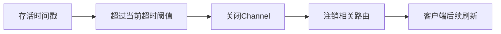

<strong>源码对照：</strong>[RouteInfoManager.java · L803–L818](https://github.com/apache/rocketmq/blob/63d20eb92a4aa685ae0d0696b419d3ffb6ca1738/namesrv/src/main/java/org/apache/rocketmq/namesrv/routeinfo/RouteInfoManager.java#L803-L818)。以下为连续节选，可能止于方法中间；仅统一缩进，完整方法与调用方见链接。

```java
public void scanNotActiveBroker() {
    try {
        log.info("start scanNotActiveBroker");
        for (Entry<BrokerAddrInfo, BrokerLiveInfo> next : this.brokerLiveTable.entrySet()) {
            long last = next.getValue().getLastUpdateTimestamp();
            long timeoutMillis = next.getValue().getHeartbeatTimeoutMillis();
            if ((last + timeoutMillis) < System.currentTimeMillis()) {
                RemotingHelper.closeChannel(next.getValue().getChannel());
                log.warn("The broker channel expired, {} {}ms", next.getKey(), timeoutMillis);
                this.onChannelDestroy(next.getKey());
            }
        }
    } catch (Exception e) {
        log.error("scanNotActiveBroker exception", e);
    }
}
```

<strong>逐段阅读抓手：</strong>逐行看比较条件；扫描周期和阈值共同决定观察到的故障检测延迟。


## 2.4 4.x与5.x对照：路由层定位没变，版本信息与部署职责扩展

|对照维度|固定4.9.8|固定5.3.4|
|---|---|---|
|实现|RouteInfoManager维护Topic、Broker、Cluster和存活表，客户端取路由后直连Broker。|核心路由职责仍在；源码还处理更多静态Topic、主从通知等条件，Controller可独立或嵌入部署。|

<strong>变化原因（源码分析）：</strong>路由发现必须兼容新老客户端及不同部署。NameServer与Controller的职责不能因为部署在同一进程就混为一谈。

<strong>适用边界：</strong>不能说4.x依赖ZooKeeper而5.x才有NameServer；两边都有NameServer。

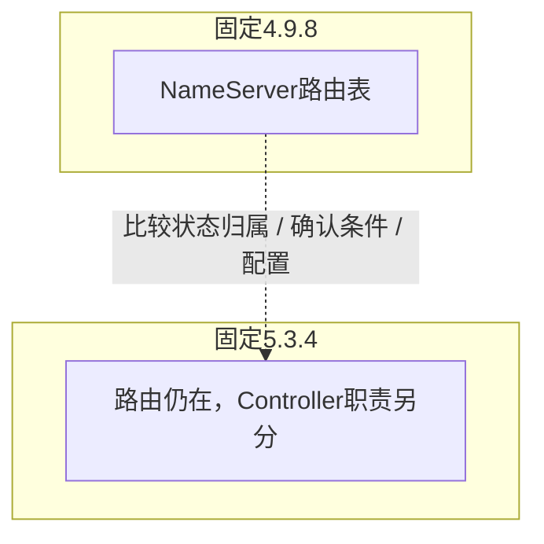

<strong>4.9.8源码：</strong>[RouteInfoManager.java · L409–L446](https://github.com/apache/rocketmq/blob/2bdd53ef6694ffa19fd00db0b887e4895444f63e/namesrv/src/main/java/org/apache/rocketmq/namesrv/routeinfo/RouteInfoManager.java#L409-L446)，连续节选。

```java
public TopicRouteData pickupTopicRouteData(final String topic) {
    TopicRouteData topicRouteData = new TopicRouteData();
    boolean foundQueueData = false;
    boolean foundBrokerData = false;
    Set<String> brokerNameSet = new HashSet<>();
    List<BrokerData> brokerDataList = new LinkedList<>();
    topicRouteData.setBrokerDatas(brokerDataList);

    HashMap<String, List<String>> filterServerMap = new HashMap<>();
    topicRouteData.setFilterServerTable(filterServerMap);

    try {
        try {
            this.lock.readLock().lockInterruptibly();
            Map<String, QueueData> queueDataMap = this.topicQueueTable.get(topic);
            if (queueDataMap != null) {
                topicRouteData.setQueueDatas(new ArrayList<>(queueDataMap.values()));
                foundQueueData = true;

                brokerNameSet.addAll(queueDataMap.keySet());

                for (String brokerName : brokerNameSet) {
                    BrokerData brokerData = this.brokerAddrTable.get(brokerName);
                    if (null != brokerData) {
                        BrokerData brokerDataClone = new BrokerData(brokerData.getCluster(), brokerData.getBrokerName(), (HashMap<Long, String>) brokerData
                                .getBrokerAddrs().clone());
                        brokerDataList.add(brokerDataClone);
                        foundBrokerData = true;

                        // skip if filter server table is empty
                        if (!filterServerTable.isEmpty()) {
                            for (final String brokerAddr : brokerDataClone.getBrokerAddrs().values()) {
                                List<String> filterServerList = this.filterServerTable.get(brokerAddr);

                                // only add filter server list when not null
                                if (filterServerList != null) {
                                    filterServerMap.put(brokerAddr, filterServerList);
                                }
```

<strong>5.3.4源码：</strong>[RouteInfoManager.java · L700–L737](https://github.com/apache/rocketmq/blob/63d20eb92a4aa685ae0d0696b419d3ffb6ca1738/namesrv/src/main/java/org/apache/rocketmq/namesrv/routeinfo/RouteInfoManager.java#L700-L737)，连续节选。

```java
public TopicRouteData pickupTopicRouteData(final String topic) {
    TopicRouteData topicRouteData = new TopicRouteData();
    boolean foundQueueData = false;
    boolean foundBrokerData = false;
    List<BrokerData> brokerDataList = new LinkedList<>();
    topicRouteData.setBrokerDatas(brokerDataList);

    HashMap<String, List<String>> filterServerMap = new HashMap<>();
    topicRouteData.setFilterServerTable(filterServerMap);

    try {
        this.lock.readLock().lockInterruptibly();
        Map<String, QueueData> queueDataMap = this.topicQueueTable.get(topic);
        if (queueDataMap != null) {
            topicRouteData.setQueueDatas(new ArrayList<>(queueDataMap.values()));
            foundQueueData = true;

            Set<String> brokerNameSet = new HashSet<>(queueDataMap.keySet());

            for (String brokerName : brokerNameSet) {
                BrokerData brokerData = this.brokerAddrTable.get(brokerName);
                if (null == brokerData) {
                    continue;
                }
                BrokerData brokerDataClone = new BrokerData(brokerData);

                brokerDataList.add(brokerDataClone);
                foundBrokerData = true;
                if (filterServerTable.isEmpty()) {
                    continue;
                }
                for (final String brokerAddr : brokerDataClone.getBrokerAddrs().values()) {
                    BrokerAddrInfo brokerAddrInfo = new BrokerAddrInfo(brokerDataClone.getCluster(), brokerAddr);
                    List<String> filterServerList = this.filterServerTable.get(brokerAddrInfo);
                    filterServerMap.put(brokerAddr, filterServerList);
                }

            }
```

<strong>对照读法：</strong>先找输入条件，再标记状态保存在哪个组件，最后比较成功确认和故障恢复的触发点。类名变化不一定表示协议改变；新增分支也不代表旧路径消失。

## 本章纸面推演

Broker停止心跳以后，NameServer过期扫描移除路由需要时间；客户端也有缓存刷新周期。在这个窗口里客户端可能连接旧地址并失败，再依靠重试、刷新和故障规避恢复。


<a id="chapter-3"></a>

# 3. Broker生命周期与线程分工

<strong>适用范围：</strong>BrokerController与Remoting请求处理。

<strong>本章目标：</strong>把初始化、恢复、启动、注册与真正请求执行连接起来。

> <strong>带着这个问题读：为何启动必须先恢复日志和索引？</strong>
>
> 请求进入前要建立可解释的存储边界；只恢复线程池而没有恢复状态，会让后续读写建立在错误位置上。


## 3.1 先恢复存储，再对外提供服务

Broker启动要加载Topic、订阅组、消费进度、存储文件及相关服务。恢复阶段检查上次退出状态和日志有效边界，再初始化服务资源。对外监听和注册路由涉及后续start流程，不应把构造对象当成已经可接收消息。

失败传播也重要：某一组件load失败时，不能继续按“正常服务”推演。源码阅读要同时看成功调用链和初始化返回false、抛异常时的处理。

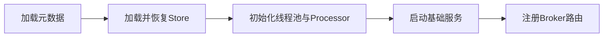

<strong>源码对照：</strong>[BrokerController.java · L892–L935](https://github.com/apache/rocketmq/blob/63d20eb92a4aa685ae0d0696b419d3ffb6ca1738/broker/src/main/java/org/apache/rocketmq/broker/BrokerController.java#L892-L935)。以下为连续节选，可能止于方法中间；仅统一缩进，完整方法与调用方见链接。

```java
public boolean recoverAndInitService() throws CloneNotSupportedException {

    boolean result = true;

    if (this.brokerConfig.isEnableControllerMode()) {
        this.replicasManager = new ReplicasManager(this);
        this.replicasManager.setFenced(true);
    }

    if (messageStore != null) {
        registerMessageStoreHook();
        result = this.messageStore.load();
    }

    if (messageStoreConfig.isTimerWheelEnable()) {
        result = result && this.timerMessageStore.load();
    }

    //scheduleMessageService load after messageStore load success
    result = result && this.scheduleMessageService.load();

    for (BrokerAttachedPlugin brokerAttachedPlugin : brokerAttachedPlugins) {
        if (brokerAttachedPlugin != null) {
            result = result && brokerAttachedPlugin.load();
        }
    }

    this.brokerMetricsManager = new BrokerMetricsManager(this);

    if (result) {

        initializeRemotingServer();

        initializeResources();

        registerProcessor();

        initializeScheduledTasks();

        initialTransaction();

        initialRpcHooks();

        initialRequestPipeline();
```

<strong>逐段阅读抓手：</strong>将recoverAndInitService与startBasicService、start串起来读；不要只看一个方法。


## 3.2 请求码怎样找到处理器

Remoting把请求码映射到Processor及ExecutorService。发送、拉取、ACK、事务结束、管理命令有不同处理入口，隔离部分执行资源。隔离并不意味着完全独立，最终仍可能争用Store、锁、CPU和磁盘。

看到SEND_MESSAGE请求应转到SendMessageProcessor，而消费拉取应进入PullMessageProcessor；Proxy则还有自己的入口和编排层。用请求码找链路比按类名猜职责更可靠。


<strong>源码对照：</strong>[BrokerController.java · L1094–L1146](https://github.com/apache/rocketmq/blob/63d20eb92a4aa685ae0d0696b419d3ffb6ca1738/broker/src/main/java/org/apache/rocketmq/broker/BrokerController.java#L1094-L1146)。以下为连续节选，可能止于方法中间；仅统一缩进，完整方法与调用方见链接。

```java
public void registerProcessor() {
    RemotingServer remotingServer = remotingServerMap.get(TCP_REMOTING_SERVER);
    RemotingServer fastRemotingServer = remotingServerMap.get(FAST_REMOTING_SERVER);

    /*
     * SendMessageProcessor
     */
    sendMessageProcessor.registerSendMessageHook(sendMessageHookList);
    sendMessageProcessor.registerConsumeMessageHook(consumeMessageHookList);

    remotingServer.registerProcessor(RequestCode.SEND_MESSAGE, sendMessageProcessor, this.sendMessageExecutor);
    remotingServer.registerProcessor(RequestCode.SEND_MESSAGE_V2, sendMessageProcessor, this.sendMessageExecutor);
    remotingServer.registerProcessor(RequestCode.SEND_BATCH_MESSAGE, sendMessageProcessor, this.sendMessageExecutor);
    remotingServer.registerProcessor(RequestCode.CONSUMER_SEND_MSG_BACK, sendMessageProcessor, this.sendMessageExecutor);
    remotingServer.registerProcessor(RequestCode.RECALL_MESSAGE, recallMessageProcessor, this.sendMessageExecutor);
    fastRemotingServer.registerProcessor(RequestCode.SEND_MESSAGE, sendMessageProcessor, this.sendMessageExecutor);
    fastRemotingServer.registerProcessor(RequestCode.SEND_MESSAGE_V2, sendMessageProcessor, this.sendMessageExecutor);
    fastRemotingServer.registerProcessor(RequestCode.SEND_BATCH_MESSAGE, sendMessageProcessor, this.sendMessageExecutor);
    fastRemotingServer.registerProcessor(RequestCode.CONSUMER_SEND_MSG_BACK, sendMessageProcessor, this.sendMessageExecutor);
    fastRemotingServer.registerProcessor(RequestCode.RECALL_MESSAGE, recallMessageProcessor, this.sendMessageExecutor);
    /**
     * PullMessageProcessor
     */
    remotingServer.registerProcessor(RequestCode.PULL_MESSAGE, this.pullMessageProcessor, this.pullMessageExecutor);
    remotingServer.registerProcessor(RequestCode.LITE_PULL_MESSAGE, this.pullMessageProcessor, this.litePullMessageExecutor);
    this.pullMessageProcessor.registerConsumeMessageHook(consumeMessageHookList);
    /**
     * PeekMessageProcessor
     */
    remotingServer.registerProcessor(RequestCode.PEEK_MESSAGE, this.peekMessageProcessor, this.pullMessageExecutor);
    /**
     * PopMessageProcessor
     */
    remotingServer.registerProcessor(RequestCode.POP_MESSAGE, this.popMessageProcessor, this.pullMessageExecutor);

    /**
     * AckMessageProcessor
     */
    remotingServer.registerProcessor(RequestCode.ACK_MESSAGE, this.ackMessageProcessor, this.ackMessageExecutor);
    fastRemotingServer.registerProcessor(RequestCode.ACK_MESSAGE, this.ackMessageProcessor, this.ackMessageExecutor);

    remotingServer.registerProcessor(RequestCode.BATCH_ACK_MESSAGE, this.ackMessageProcessor, this.ackMessageExecutor);
    fastRemotingServer.registerProcessor(RequestCode.BATCH_ACK_MESSAGE, this.ackMessageProcessor, this.ackMessageExecutor);
    /**
     * ChangeInvisibleTimeProcessor
     */
    remotingServer.registerProcessor(RequestCode.CHANGE_MESSAGE_INVISIBLETIME, this.changeInvisibleTimeProcessor, this.ackMessageExecutor);
    fastRemotingServer.registerProcessor(RequestCode.CHANGE_MESSAGE_INVISIBLETIME, this.changeInvisibleTimeProcessor, this.ackMessageExecutor);
    /**
     * notificationProcessor
     */
    remotingServer.registerProcessor(RequestCode.NOTIFICATION, this.notificationProcessor, this.pullMessageExecutor);

```

<strong>逐段阅读抓手：</strong>看注册时传入的线程池对象，区分网络事件线程和业务处理线程。


## 3.3 排队时延也是可靠性问题

NettyRemotingAbstract根据请求码找处理器，处理拒绝请求、流水线、执行任务和错误响应。服务端繁忙或队列排队可能使客户端超时，超时又引发重试，形成放大反馈。

增加线程不一定消除瓶颈：如果线程都等同一磁盘或锁，只会增加并发等待。应把网络接收、Executor排队、Store处理和响应发送分别考虑。

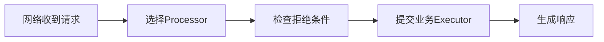

<strong>源码对照：</strong>[NettyRemotingAbstract.java · L342–L391](https://github.com/apache/rocketmq/blob/63d20eb92a4aa685ae0d0696b419d3ffb6ca1738/remoting/src/main/java/org/apache/rocketmq/remoting/netty/NettyRemotingAbstract.java#L342-L391)。以下为连续节选，可能止于方法中间；仅统一缩进，完整方法与调用方见链接。

```java
public void processRequestCommand(final ChannelHandlerContext ctx, final RemotingCommand cmd) {
    final Pair<NettyRequestProcessor, ExecutorService> matched = this.processorTable.get(cmd.getCode());
    final Pair<NettyRequestProcessor, ExecutorService> pair = null == matched ? this.defaultRequestProcessorPair : matched;
    final int opaque = cmd.getOpaque();

    if (pair == null) {
        String error = " request type " + cmd.getCode() + " not supported";
        final RemotingCommand response =
            RemotingCommand.createResponseCommand(RemotingSysResponseCode.REQUEST_CODE_NOT_SUPPORTED, error);
        response.setOpaque(opaque);
        this.writeResponse(ctx.channel(), cmd, response, null);
        log.error(RemotingHelper.parseChannelRemoteAddr(ctx.channel()) + error);
        return;
    }

    Runnable run = buildProcessRequestHandler(ctx, cmd, pair, opaque);

    if (isShuttingDown.get()) {
        if (cmd.getVersion() > MQVersion.Version.V5_3_1.ordinal()) {
            final RemotingCommand response = RemotingCommand.createResponseCommand(ResponseCode.GO_AWAY,
                "please go away");
            response.setOpaque(opaque);
            this.writeResponse(ctx.channel(), cmd, response, null);
            log.info("proxy is shutting down, write response GO_AWAY. channel={}, requestCode={}, opaque={}", ctx.channel(), cmd.getCode(), opaque);
            return;
        }
    }

    if (pair.getObject1().rejectRequest()) {
        final RemotingCommand response = RemotingCommand.createResponseCommand(RemotingSysResponseCode.SYSTEM_BUSY,
            "[REJECTREQUEST]system busy, start flow control for a while");
        response.setOpaque(opaque);
        this.writeResponse(ctx.channel(), cmd, response, null);
        return;
    }

    try {
        final RequestTask requestTask = new RequestTask(run, ctx.channel(), cmd);
        //async execute task, current thread return directly
        pair.getObject2().submit(requestTask);
    } catch (RejectedExecutionException e) {
        if ((System.currentTimeMillis() % 10000) == 0) {
            log.warn(RemotingHelper.parseChannelRemoteAddr(ctx.channel())
                + ", too many requests and system thread pool busy, RejectedExecutionException "
                + pair.getObject2().toString()
                + " request code: " + cmd.getCode());
        }

        final RemotingCommand response = RemotingCommand.createResponseCommand(RemotingSysResponseCode.SYSTEM_BUSY,
            "[OVERLOAD]system busy, start flow control for a while");
```

<strong>逐段阅读抓手：</strong>关注rejectRequest与线程池提交失败的响应；繁忙错误不等于消息必然未写入。


## 本章纸面推演

发送线程池排队很长时，客户端会超时，即使磁盘还能写。反过来，业务线程池正常但刷盘Future迟迟不完成，也会增加发送RT。先定位哪个阶段等待，才知道瓶颈在哪里。


<a id="chapter-4"></a>

# 4. Producer：启动、路由与发送预算

<strong>适用范围：</strong>经典DefaultMQProducerImpl；SYNC/ASYNC/ONEWAY。

<strong>本章目标：</strong>一章串起发送对象、路由缓存、重试、故障规避和超时预算。

> <strong>带着这个问题读：一次重试的预算为什么会越来越少？</strong>
>
> sendDefaultImpl扣的是同一次发送的总时间；选队列、前次请求和异常处理都占用预算，重试次数只是另一个上限。


## 4.1 Producer怎样共享客户端基础设施

Producer启动验证Group和配置，取得MQClientInstance、注册Producer，再启动共享客户端工厂。MQClientManager按clientId管理实例；同进程内某些Producer和Consumer可以共享连接、定时任务和路由设施，但Group注册仍有约束。

共享实例解释了为什么不能把每个Producer都想象成完整独立网络栈。对象生命周期结束也不等于共享工厂必然立即退出，要看还有哪些注册使用者。

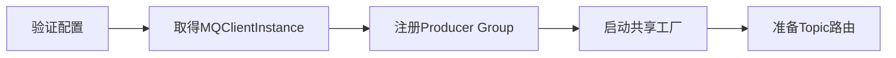

<strong>源码对照：</strong>[DefaultMQProducerImpl.java · L243–L291](https://github.com/apache/rocketmq/blob/63d20eb92a4aa685ae0d0696b419d3ffb6ca1738/client/src/main/java/org/apache/rocketmq/client/impl/producer/DefaultMQProducerImpl.java#L243-L291)。以下为连续节选，可能止于方法中间；仅统一缩进，完整方法与调用方见链接。

```java
public void start(final boolean startFactory) throws MQClientException {
    switch (this.serviceState) {
        case CREATE_JUST:
            this.serviceState = ServiceState.START_FAILED;

            this.checkConfig();

            if (!this.defaultMQProducer.getProducerGroup().equals(MixAll.CLIENT_INNER_PRODUCER_GROUP)) {
                this.defaultMQProducer.changeInstanceNameToPID();
            }

            this.mQClientFactory = MQClientManager.getInstance().getOrCreateMQClientInstance(this.defaultMQProducer, rpcHook);

            defaultMQProducer.initProduceAccumulator();

            boolean registerOK = mQClientFactory.registerProducer(this.defaultMQProducer.getProducerGroup(), this);
            if (!registerOK) {
                this.serviceState = ServiceState.CREATE_JUST;
                throw new MQClientException("The producer group[" + this.defaultMQProducer.getProducerGroup()
                    + "] has been created before, specify another name please." + FAQUrl.suggestTodo(FAQUrl.GROUP_NAME_DUPLICATE_URL),
                    null);
            }

            if (startFactory) {
                mQClientFactory.start();
            }

            this.initTopicRoute();

            this.mqFaultStrategy.startDetector();

            log.info("the producer [{}] start OK. sendMessageWithVIPChannel={}", this.defaultMQProducer.getProducerGroup(),
                this.defaultMQProducer.isSendMessageWithVIPChannel());
            this.serviceState = ServiceState.RUNNING;
            break;
        case RUNNING:
        case START_FAILED:
        case SHUTDOWN_ALREADY:
            throw new MQClientException("The producer service state not OK, maybe started once, "
                + this.serviceState
                + FAQUrl.suggestTodo(FAQUrl.CLIENT_SERVICE_NOT_OK),
                null);
        default:
            break;
    }

    this.mQClientFactory.sendHeartbeatToAllBrokerWithLock();

    RequestFutureHolder.getInstance().startScheduledTask(this);
```

<strong>逐段阅读抓手：</strong>看ServiceState转换以及registerProducer失败分支；Group重复注册和路由不存在是两种问题。


## 4.2 sendDefaultImpl是发送控制环

发送前检查状态和消息合法性，获取TopicPublishInfo，再决定尝试次数与队列。这里同步发送的总尝试数由1加retryTimesWhenSendFailed得到；异步重试还要进入客户端API层，不能只用这个循环概括。ONEWAY没有业务响应确认。

每轮以第一次开始时间计算已消耗预算。5.3.4还包含sendMsgMaxTimeoutPerRequest对单次请求预算的限制条件。重试状态、可重试响应码以及是否在非SEND_OK状态换Broker，都影响最终行为。

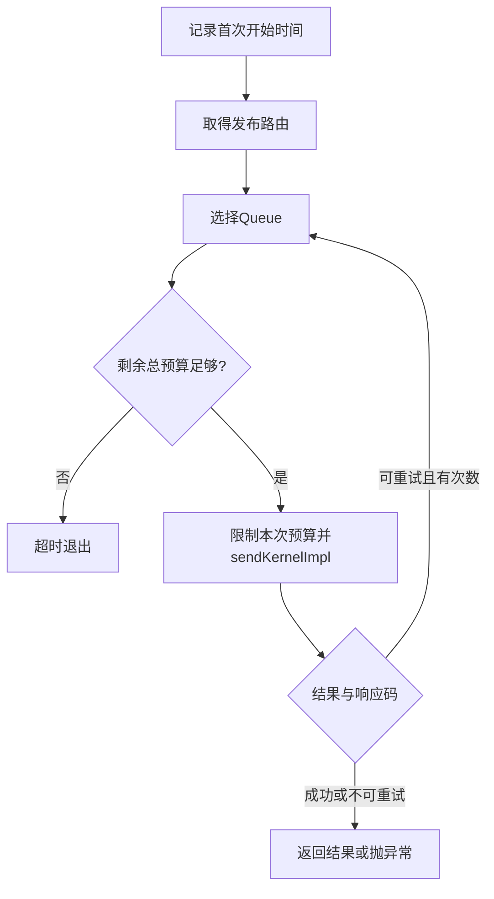

<strong>源码对照：</strong>[DefaultMQProducerImpl.java · L738–L805](https://github.com/apache/rocketmq/blob/63d20eb92a4aa685ae0d0696b419d3ffb6ca1738/client/src/main/java/org/apache/rocketmq/client/impl/producer/DefaultMQProducerImpl.java#L738-L805)。以下为连续节选，可能止于方法中间；仅统一缩进，完整方法与调用方见链接。

```java
private SendResult sendDefaultImpl(
    Message msg,
    final CommunicationMode communicationMode,
    final SendCallback sendCallback,
    final long timeout
) throws MQClientException, RemotingException, MQBrokerException, InterruptedException {
    this.makeSureStateOK();
    Validators.checkMessage(msg, this.defaultMQProducer);
    final long invokeID = random.nextLong();
    long beginTimestampFirst = System.currentTimeMillis();
    long beginTimestampPrev = beginTimestampFirst;
    long endTimestamp = beginTimestampFirst;
    TopicPublishInfo topicPublishInfo = this.tryToFindTopicPublishInfo(msg.getTopic());
    if (topicPublishInfo != null && topicPublishInfo.ok()) {
        boolean callTimeout = false;
        MessageQueue mq = null;
        Exception exception = null;
        SendResult sendResult = null;
        int timesTotal = communicationMode == CommunicationMode.SYNC ? 1 + this.defaultMQProducer.getRetryTimesWhenSendFailed() : 1;
        int times = 0;
        String[] brokersSent = new String[timesTotal];
        boolean resetIndex = false;
        for (; times < timesTotal; times++) {
            String lastBrokerName = null == mq ? null : mq.getBrokerName();
            if (times > 0) {
                resetIndex = true;
            }
            MessageQueue mqSelected = this.selectOneMessageQueue(topicPublishInfo, lastBrokerName, resetIndex);
            if (mqSelected != null) {
                mq = mqSelected;
                brokersSent[times] = mq.getBrokerName();
                try {
                    beginTimestampPrev = System.currentTimeMillis();
                    if (times > 0) {
                        //Reset topic with namespace during resend.
                        msg.setTopic(this.defaultMQProducer.withNamespace(msg.getTopic()));
                    }
                    long costTime = beginTimestampPrev - beginTimestampFirst;
                    if (timeout < costTime) {
                        callTimeout = true;
                        break;
                    }
                    long curTimeout = timeout - costTime;
                    // Get the maximum timeout allowed per request
                    long maxSendTimeoutPerRequest = defaultMQProducer.getSendMsgMaxTimeoutPerRequest();
                    // Determine if retries are still possible
                    boolean canRetryAgain = times + 1 < timesTotal;
                    // If retries are possible, and the current timeout exceeds the max allowed timeout, set the current timeout to the max allowed
                    if (maxSendTimeoutPerRequest > -1 && canRetryAgain && curTimeout > maxSendTimeoutPerRequest) {
                        curTimeout = maxSendTimeoutPerRequest;
                    }
                    sendResult = this.sendKernelImpl(msg, mq, communicationMode, sendCallback, topicPublishInfo, curTimeout);
                    endTimestamp = System.currentTimeMillis();
                    this.updateFaultItem(mq.getBrokerName(), endTimestamp - beginTimestampPrev, false, true);
                    switch (communicationMode) {
                        case ASYNC:
                            return null;
                        case ONEWAY:
                            return null;
                        case SYNC:
                            if (sendResult.getSendStatus() != SendStatus.SEND_OK) {
                                if (this.defaultMQProducer.isRetryAnotherBrokerWhenNotStoreOK()) {
                                    continue;
                                }
                            }

                            return sendResult;
                        default:
```

<strong>逐段阅读抓手：</strong>关注timesTotal、costTime、curTimeout、canRetryAgain；这是总预算与单次预算的组合。


## 4.3 重试为什么可能换Broker

MQFaultStrategy结合队列列表、上次Broker和故障信息选择目标。延迟故障策略启用时，会过滤不可用或不可达Broker，再选择退化候选；关闭时走更简单的队列选择。策略可用性标记是本地观察，不是全局一致的Broker健康证明。

重试换队列改善可用性，但可能影响同一业务键的顺序。需要业务键固定到队列的场景，必须同时考虑选队策略、扩容、重试和消费顺序。不能只设置顺序Listener就宣称端到端有序。

```mermaid
flowchart LR
    N0["记录Broker时延或错误"]
    N1["更新本地故障表"]
    N2["选择可用Queue"]
    N3["必要时退化选择"]
    N4["再次发送"]
    N0 --> N1 --> N2 --> N3 --> N4
```

<strong>源码对照：</strong>[MQFaultStrategy.java · L137–L179](https://github.com/apache/rocketmq/blob/63d20eb92a4aa685ae0d0696b419d3ffb6ca1738/client/src/main/java/org/apache/rocketmq/client/latency/MQFaultStrategy.java#L137-L179)。以下为连续节选，可能止于方法中间；仅统一缩进，完整方法与调用方见链接。

```java
public MessageQueue selectOneMessageQueue(final TopicPublishInfo tpInfo, final String lastBrokerName, final boolean resetIndex) {
    BrokerFilter brokerFilter = threadBrokerFilter.get();
    brokerFilter.setLastBrokerName(lastBrokerName);
    if (this.sendLatencyFaultEnable) {
        if (resetIndex) {
            tpInfo.resetIndex();
        }
        MessageQueue mq = tpInfo.selectOneMessageQueue(availableFilter, brokerFilter);
        if (mq != null) {
            return mq;
        }

        mq = tpInfo.selectOneMessageQueue(reachableFilter, brokerFilter);
        if (mq != null) {
            return mq;
        }

        return tpInfo.selectOneMessageQueue();
    }

    MessageQueue mq = tpInfo.selectOneMessageQueue(brokerFilter);
    if (mq != null) {
        return mq;
    }
    return tpInfo.selectOneMessageQueue();
}

public void updateFaultItem(final String brokerName, final long currentLatency, boolean isolation,
                            final boolean reachable) {
    if (this.sendLatencyFaultEnable) {
        long duration = computeNotAvailableDuration(isolation ? 10000 : currentLatency);
        this.latencyFaultTolerance.updateFaultItem(brokerName, currentLatency, duration, reachable);
    }
}

private long computeNotAvailableDuration(final long currentLatency) {
    for (int i = latencyMax.length - 1; i >= 0; i--) {
        if (currentLatency >= latencyMax[i]) {
            return this.notAvailableDuration[i];
        }
    }

    return 0;
```

<strong>逐段阅读抓手：</strong>区分sendLatencyFaultEnable、reachable与available；它们不是同一个判断。


## 4.4 消息真正进入RPC之前会发生什么

sendKernelImpl解析Broker地址、处理唯一消息ID、压缩、消息系统标记、事务属性和发送钩子，构造请求Header再调用MQClientAPIImpl。某些操作暂时修改消息内容，finally恢复相关字段，避免后续调用持续使用压缩后的Body等临时状态。

Producer生成的唯一ID和Broker物理消息ID承担不同用途；业务幂等仍应有稳定业务键。不要认为有msgId就代表Broker自动对所有重复发送做全局去重。

```mermaid
flowchart LR
    N0["Queue定位Broker地址"]
    N1["设置ID与系统标记"]
    N2["压缩与事务属性"]
    N3["构造发送Header"]
    N4["调用客户端RPC"]
    N0 --> N1 --> N2 --> N3 --> N4
```

<strong>源码对照：</strong>[DefaultMQProducerImpl.java · L915–L978](https://github.com/apache/rocketmq/blob/63d20eb92a4aa685ae0d0696b419d3ffb6ca1738/client/src/main/java/org/apache/rocketmq/client/impl/producer/DefaultMQProducerImpl.java#L915-L978)。以下为连续节选，可能止于方法中间；仅统一缩进，完整方法与调用方见链接。

```java
private SendResult sendKernelImpl(final Message msg,
    final MessageQueue mq,
    final CommunicationMode communicationMode,
    final SendCallback sendCallback,
    final TopicPublishInfo topicPublishInfo,
    final long timeout) throws MQClientException, RemotingException, MQBrokerException, InterruptedException {
    long beginStartTime = System.currentTimeMillis();
    String brokerName = this.mQClientFactory.getBrokerNameFromMessageQueue(mq);
    String brokerAddr = this.mQClientFactory.findBrokerAddressInPublish(brokerName);
    if (null == brokerAddr) {
        tryToFindTopicPublishInfo(mq.getTopic());
        brokerName = this.mQClientFactory.getBrokerNameFromMessageQueue(mq);
        brokerAddr = this.mQClientFactory.findBrokerAddressInPublish(brokerName);
    }

    SendMessageContext context = null;
    if (brokerAddr != null) {
        brokerAddr = MixAll.brokerVIPChannel(this.defaultMQProducer.isSendMessageWithVIPChannel(), brokerAddr);

        byte[] prevBody = msg.getBody();
        try {
            //for MessageBatch,ID has been set in the generating process
            if (!(msg instanceof MessageBatch)) {
                MessageClientIDSetter.setUniqID(msg);
            }

            boolean topicWithNamespace = false;
            if (null != this.mQClientFactory.getClientConfig().getNamespace()) {
                msg.setInstanceId(this.mQClientFactory.getClientConfig().getNamespace());
                topicWithNamespace = true;
            }

            int sysFlag = 0;
            boolean msgBodyCompressed = false;
            if (this.tryToCompressMessage(msg)) {
                sysFlag |= MessageSysFlag.COMPRESSED_FLAG;
                sysFlag |= this.defaultMQProducer.getCompressType().getCompressionFlag();
                msgBodyCompressed = true;
            }

            final String tranMsg = msg.getProperty(MessageConst.PROPERTY_TRANSACTION_PREPARED);
            if (Boolean.parseBoolean(tranMsg)) {
                sysFlag |= MessageSysFlag.TRANSACTION_PREPARED_TYPE;
            }

            if (hasCheckForbiddenHook()) {
                CheckForbiddenContext checkForbiddenContext = new CheckForbiddenContext();
                checkForbiddenContext.setNameSrvAddr(this.defaultMQProducer.getNamesrvAddr());
                checkForbiddenContext.setGroup(this.defaultMQProducer.getProducerGroup());
                checkForbiddenContext.setCommunicationMode(communicationMode);
                checkForbiddenContext.setBrokerAddr(brokerAddr);
                checkForbiddenContext.setMessage(msg);
                checkForbiddenContext.setMq(mq);
                checkForbiddenContext.setUnitMode(this.isUnitMode());
                this.executeCheckForbiddenHook(checkForbiddenContext);
            }

            if (this.hasSendMessageHook()) {
                context = new SendMessageContext();
                context.setProducer(this);
                context.setProducerGroup(this.defaultMQProducer.getProducerGroup());
                context.setCommunicationMode(communicationMode);
                context.setBornHost(this.defaultMQProducer.getClientIP());
                context.setBrokerAddr(brokerAddr);
```

<strong>逐段阅读抓手：</strong>从try到finally看临时修改的恢复；Hook是观察/扩展点，不能替代存储确认。


## 4.5 4.x与5.x对照：发送重试仍有总预算，5.3.4增加单次预算控制

|对照维度|固定4.9.8|固定5.3.4|
|---|---|---|
|实现|sendDefaultImpl以第一次调用时间扣减总timeout；同步尝试数为1加发送失败重试次数。|同样保留总预算，并在符合条件时用sendMsgMaxTimeoutPerRequest限制单次curTimeout，为剩余尝试保留机会。|

<strong>变化原因（源码分析）：</strong>【源码推断】第一轮耗尽总预算后无法有效重试，单次预算上限能改善某些慢Broker场景下的重试机会；实际效果取决于剩余时间与配置。

<strong>适用边界：</strong>不是4.x每次重试都重新给完整超时；总预算扣减在4.9.8就存在。

```mermaid
flowchart TB
subgraph V4["固定4.9.8"]
A["总timeout减costTime"]
end
subgraph V5["固定5.3.4"]
B["总预算加单次请求上限"]
end
A -. "比较状态归属 / 确认条件 / 配置" .-> B
```

<strong>4.9.8源码：</strong>[DefaultMQProducerImpl.java · L555–L588](https://github.com/apache/rocketmq/blob/2bdd53ef6694ffa19fd00db0b887e4895444f63e/client/src/main/java/org/apache/rocketmq/client/impl/producer/DefaultMQProducerImpl.java#L555-L588)，连续节选。

```java
int timesTotal = communicationMode == CommunicationMode.SYNC ? 1 + this.defaultMQProducer.getRetryTimesWhenSendFailed() : 1;
int times = 0;
String[] brokersSent = new String[timesTotal];
for (; times < timesTotal; times++) {
    String lastBrokerName = null == mq ? null : mq.getBrokerName();
    MessageQueue mqSelected = this.selectOneMessageQueue(topicPublishInfo, lastBrokerName);
    if (mqSelected != null) {
        mq = mqSelected;
        brokersSent[times] = mq.getBrokerName();
        try {
            beginTimestampPrev = System.currentTimeMillis();
            if (times > 0) {
                //Reset topic with namespace during resend.
                msg.setTopic(this.defaultMQProducer.withNamespace(msg.getTopic()));
            }
            long costTime = beginTimestampPrev - beginTimestampFirst;
            if (timeout < costTime) {
                callTimeout = true;
                break;
            }

            sendResult = this.sendKernelImpl(msg, mq, communicationMode, sendCallback, topicPublishInfo, timeout - costTime);
            endTimestamp = System.currentTimeMillis();
            this.updateFaultItem(mq.getBrokerName(), endTimestamp - beginTimestampPrev, false);
            switch (communicationMode) {
                case ASYNC:
                    return null;
                case ONEWAY:
                    return null;
                case SYNC:
                    if (sendResult.getSendStatus() != SendStatus.SEND_OK) {
                        if (this.defaultMQProducer.isRetryAnotherBrokerWhenNotStoreOK()) {
                            continue;
                        }
```

<strong>5.3.4源码：</strong>[DefaultMQProducerImpl.java · L756–L804](https://github.com/apache/rocketmq/blob/63d20eb92a4aa685ae0d0696b419d3ffb6ca1738/client/src/main/java/org/apache/rocketmq/client/impl/producer/DefaultMQProducerImpl.java#L756-L804)，连续节选。

```java
int timesTotal = communicationMode == CommunicationMode.SYNC ? 1 + this.defaultMQProducer.getRetryTimesWhenSendFailed() : 1;
int times = 0;
String[] brokersSent = new String[timesTotal];
boolean resetIndex = false;
for (; times < timesTotal; times++) {
    String lastBrokerName = null == mq ? null : mq.getBrokerName();
    if (times > 0) {
        resetIndex = true;
    }
    MessageQueue mqSelected = this.selectOneMessageQueue(topicPublishInfo, lastBrokerName, resetIndex);
    if (mqSelected != null) {
        mq = mqSelected;
        brokersSent[times] = mq.getBrokerName();
        try {
            beginTimestampPrev = System.currentTimeMillis();
            if (times > 0) {
                //Reset topic with namespace during resend.
                msg.setTopic(this.defaultMQProducer.withNamespace(msg.getTopic()));
            }
            long costTime = beginTimestampPrev - beginTimestampFirst;
            if (timeout < costTime) {
                callTimeout = true;
                break;
            }
            long curTimeout = timeout - costTime;
            // Get the maximum timeout allowed per request
            long maxSendTimeoutPerRequest = defaultMQProducer.getSendMsgMaxTimeoutPerRequest();
            // Determine if retries are still possible
            boolean canRetryAgain = times + 1 < timesTotal;
            // If retries are possible, and the current timeout exceeds the max allowed timeout, set the current timeout to the max allowed
            if (maxSendTimeoutPerRequest > -1 && canRetryAgain && curTimeout > maxSendTimeoutPerRequest) {
                curTimeout = maxSendTimeoutPerRequest;
            }
            sendResult = this.sendKernelImpl(msg, mq, communicationMode, sendCallback, topicPublishInfo, curTimeout);
            endTimestamp = System.currentTimeMillis();
            this.updateFaultItem(mq.getBrokerName(), endTimestamp - beginTimestampPrev, false, true);
            switch (communicationMode) {
                case ASYNC:
                    return null;
                case ONEWAY:
                    return null;
                case SYNC:
                    if (sendResult.getSendStatus() != SendStatus.SEND_OK) {
                        if (this.defaultMQProducer.isRetryAnotherBrokerWhenNotStoreOK()) {
                            continue;
                        }
                    }

                    return sendResult;
```

<strong>对照读法：</strong>先找输入条件，再标记状态保存在哪个组件，最后比较成功确认和故障恢复的触发点。类名变化不一定表示协议改变；新增分支也不代表旧路径消失。


## 状态展开：一次发送的预算纸面计算

|时间点|累计耗时|剩余总预算|含义|
|---|---:|---:|---|
|进入sendDefaultImpl|0ms|3000ms|开始计时|
|第一轮开始|100ms|2900ms|路由等操作已占预算|
|第一轮错误返回|2100ms|900ms|能否再试还受次数和错误码影响|
|第二轮开始|2200ms|800ms|单次上限不会重新补回总预算|
|超过总预算|超过3000ms|不再有有效剩余|应结束重试而非无限延长|

假设启用单次请求上限1000ms，第一轮可能先使用1000ms，但这个上限只在对应可重试条件下生效。具体超时还经过RPC层和调度，表只是控制预算推演，不是RT测量。


## 本章纸面推演

总预算3秒，第一轮耗时2.8秒后失败，后续重试只能使用剩余预算；不是每次重试都额外获得3秒。第一次响应丢失时，Broker可能已经存储，第二次发送可能产生重复。


<a id="chapter-5"></a>

# 5. Remoting：协议帧、Future与并发限流

<strong>适用范围：</strong>经典Netty Remoting；gRPC另见Proxy章。

<strong>本章目标：</strong>弄清请求关联、响应回调、发送完成和业务确认的区别。

> <strong>带着这个问题读：socket写完成为什么不等于发送成功？</strong>
>
> 网络写完成只说明请求传输阶段的结果；业务响应还要靠opaque找到对应Future，并有超时、回调和许可释放收尾。


## 5.1 协议帧里各字段的职责

RemotingCommand编码长度、Header以及Body。Header包含code、opaque、flag和扩展字段等；opaque用来把响应关联到请求。头部长度标记还携带序列化类型，不能把整个4字节都当作纯Header长度。

发送消息的Body与协议Header不同：业务属性可能参与自定义头或消息编码，实际字段需按请求类型读。协议帧有长度前缀，接收端据此处理拆包粘包。

```mermaid
flowchart LR
    N0["总长度前缀"]
    N1["头长度及序列化类型"]
    N2["Header含code和opaque"]
    N3["Body负载"]
    N0 --> N1 --> N2 --> N3
```

<strong>源码对照：</strong>[RemotingCommand.java · L387–L420](https://github.com/apache/rocketmq/blob/63d20eb92a4aa685ae0d0696b419d3ffb6ca1738/remoting/src/main/java/org/apache/rocketmq/remoting/protocol/RemotingCommand.java#L387-L420)。以下为连续节选，可能止于方法中间；仅统一缩进，完整方法与调用方见链接。

```java
public ByteBuffer encode() {
    // 1> header length size
    int length = 4;

    // 2> header data length
    byte[] headerData = this.headerEncode();
    length += headerData.length;

    // 3> body data length
    if (this.body != null) {
        length += body.length;
    }

    ByteBuffer result = ByteBuffer.allocate(4 + length);

    // length
    result.putInt(length);

    // header length
    result.putInt(markProtocolType(headerData.length, serializeTypeCurrentRPC));

    // header data
    result.put(headerData);

    // body data;
    if (this.body != null) {
        result.put(this.body);
    }

    result.flip();

    return result;
}

```

<strong>逐段阅读抓手：</strong>对照decode与encode；长度是否包含自身的4字节，要按ByteBuffer构造和解码步骤算。


## 5.2 responseTable如何兑现异步结果

收到响应后，以opaque查询responseTable中的ResponseFuture，保存响应、移除表项，再走回调或唤醒等待者。响应丢失、超时、连接失败都可能让调用方看不到业务结果；它们不能证明服务端没有处理。

异步回调执行在哪个Executor上，会影响资源消耗和回调延迟。回调内部做长时间业务操作，可能拖慢后续完成通知，因此要把客户端框架完成路径和业务任务分开理解。

```mermaid
sequenceDiagram
participant C as 客户端调用
participant N as NettyRemoting
participant B as Broker
C->>N: 创建请求opaque并登记Future
N->>B: 请求
B->>B: 业务处理 / Store等待
B-->>N: 响应带相同opaque
N->>N: 查Future、保存响应、移除表项
N-->>C: 唤醒等待者或执行回调
Note over N,B: 网络写完成与业务响应完成不同
```

<strong>源码对照：</strong>[NettyRemotingAbstract.java · L468–L490](https://github.com/apache/rocketmq/blob/63d20eb92a4aa685ae0d0696b419d3ffb6ca1738/remoting/src/main/java/org/apache/rocketmq/remoting/netty/NettyRemotingAbstract.java#L468-L490)。以下为连续节选，可能止于方法中间；仅统一缩进，完整方法与调用方见链接。

```java
public void processResponseCommand(ChannelHandlerContext ctx, RemotingCommand cmd) {
    final int opaque = cmd.getOpaque();
    final ResponseFuture responseFuture = responseTable.get(opaque);
    if (responseFuture != null) {
        responseFuture.setResponseCommand(cmd);

        responseTable.remove(opaque);

        if (responseFuture.getInvokeCallback() != null) {
            executeInvokeCallback(responseFuture);
        } else {
            responseFuture.putResponse(cmd);
            responseFuture.release();
        }
    } else {
        log.warn("receive response, cmd={}, but not matched any request, address={}, channelId={}", cmd, RemotingHelper.parseChannelRemoteAddr(ctx.channel()), ctx.channel().id());
    }
}

/**
 * Execute callback in callback executor. If callback executor is null, run directly in current thread
 */
private void executeInvokeCallback(final ResponseFuture responseFuture) {
```

<strong>逐段阅读抓手：</strong>观察putResponse、responseTable.remove与release的相对顺序。


## 5.3 许可释放必须只发生一次

ResponseFuture用原子标记防止回调重复执行，并通过SemaphoreReleaseOnlyOnce管理许可释放。NettyRemotingAbstract还有异步/单向请求许可，用来控制在途请求数；它们是内存与网络压力控制，不是消息去重。

失败和成功可能在并发窗口里竞争：超时扫描、响应到达、Channel关闭都可能触发收尾。一次性回调与一次性release保障本地资源状态；业务效果是否重复仍是另一层问题。

```mermaid
flowchart LR
    N0["响应到达或超时"]
    N1["竞争完成路径"]
    N2["回调最多执行一次"]
    N3["许可最多释放一次"]
    N0 --> N1 --> N2 --> N3
```

<strong>源码对照：</strong>[ResponseFuture.java · L62–L91](https://github.com/apache/rocketmq/blob/63d20eb92a4aa685ae0d0696b419d3ffb6ca1738/remoting/src/main/java/org/apache/rocketmq/remoting/netty/ResponseFuture.java#L62-L91)。以下为连续节选，可能止于方法中间；仅统一缩进，完整方法与调用方见链接。

```java
public void executeInvokeCallback() {
    if (invokeCallback != null) {
        if (this.executeCallbackOnlyOnce.compareAndSet(false, true)) {
            RemotingCommand response = getResponseCommand();
            if (response != null) {
                invokeCallback.operationSucceed(response);
            } else {
                if (!isSendRequestOK()) {
                    invokeCallback.operationFail(new RemotingSendRequestException(channel.remoteAddress().toString(), getCause()));
                } else if (isTimeout()) {
                    invokeCallback.operationFail(new RemotingTimeoutException(channel.remoteAddress().toString(), getTimeoutMillis(), getCause()));
                } else {
                    invokeCallback.operationFail(new RemotingException(getRequestCommand().toString(), getCause()));
                }
            }
            invokeCallback.operationComplete(this);
        }
    }
}

public void interrupt() {
    interrupted = true;
    executeInvokeCallback();
}

public void release() {
    if (this.once != null) {
        this.once.release();
    }
}
```

<strong>逐段阅读抓手：</strong>AtomicBoolean比较设置控制本地回调；不要把此处once翻译成消息Exactly Once。


## 本章纸面推演

Channel的writeAndFlush成功说明网络写入步骤成功，不能说明Broker已经PUT_OK。responseTable中的Future等到带同一opaque的响应后，才有请求层面的结果；超时清理并不能撤销服务端已经执行的写入。


<a id="chapter-6"></a>

# 6. SendMessageProcessor：Broker接收与响应映射

<strong>适用范围：</strong>Broker经典发送请求；普通消息为主。

<strong>本章目标：</strong>区分验证失败、日志追加成功、刷盘结果和客户端状态。

> <strong>带着这个问题读：Broker返回的状态能证明消费完成吗？</strong>
>
> 存储状态映射只描述发送侧的完成条件；CQ分发、Listener执行和消费进度提交属于后续独立状态。


## 6.1 接收端先校验与构造内部消息

Broker侧检查Topic权限、队列、消息类型和属性等条件，构造MessageExtBrokerInner，补充出生地址、存储地址、时间、重消费次数等信息。事务prepare消息、定时消息和普通消息可能进入不同处理分支。

消息内部结构含有Broker运行时信息，因此客户端的Message不等于CommitLog中完整记录。源码里同名sendMessage可能指客户端发送，也可能指服务端处理，阅读时始终标记所在组件。

```mermaid
flowchart LR
    N0["请求Header和Body"]
    N1["校验Topic与权限"]
    N2["创建Broker内部消息"]
    N3["选择事务或普通存储"]
    N4["异步接收Put结果"]
    N0 --> N1 --> N2 --> N3 --> N4
```

<strong>源码对照：</strong>[SendMessageProcessor.java · L242–L306](https://github.com/apache/rocketmq/blob/63d20eb92a4aa685ae0d0696b419d3ffb6ca1738/broker/src/main/java/org/apache/rocketmq/broker/processor/SendMessageProcessor.java#L242-L306)。以下为连续节选，可能止于方法中间；仅统一缩进，完整方法与调用方见链接。

```java
public RemotingCommand sendMessage(final ChannelHandlerContext ctx,
    final RemotingCommand request,
    final SendMessageContext sendMessageContext,
    final SendMessageRequestHeader requestHeader,
    final TopicQueueMappingContext mappingContext,
    final SendMessageCallback sendMessageCallback) throws RemotingCommandException {

    final RemotingCommand response = preSend(ctx, request, requestHeader);
    if (response.getCode() != -1) {
        return response;
    }

    final SendMessageResponseHeader responseHeader = (SendMessageResponseHeader) response.readCustomHeader();

    final byte[] body = request.getBody();

    int queueIdInt = requestHeader.getQueueId();
    TopicConfig topicConfig = this.brokerController.getTopicConfigManager().selectTopicConfig(requestHeader.getTopic());

    if (queueIdInt < 0) {
        queueIdInt = randomQueueId(topicConfig.getWriteQueueNums());
    }

    MessageExtBrokerInner msgInner = new MessageExtBrokerInner();
    msgInner.setTopic(requestHeader.getTopic());
    msgInner.setQueueId(queueIdInt);

    Map<String, String> oriProps = MessageDecoder.string2messageProperties(requestHeader.getProperties());
    if (!handleRetryAndDLQ(requestHeader, response, request, msgInner, topicConfig, oriProps)) {
        return response;
    }

    msgInner.setBody(body);
    msgInner.setFlag(requestHeader.getFlag());

    String uniqKey = oriProps.get(MessageConst.PROPERTY_UNIQ_CLIENT_MESSAGE_ID_KEYIDX);
    if (uniqKey == null || uniqKey.length() <= 0) {
        uniqKey = MessageClientIDSetter.createUniqID();
        oriProps.put(MessageConst.PROPERTY_UNIQ_CLIENT_MESSAGE_ID_KEYIDX, uniqKey);
    }

    MessageAccessor.setProperties(msgInner, oriProps);

    CleanupPolicy cleanupPolicy = CleanupPolicyUtils.getDeletePolicy(Optional.of(topicConfig));
    if (Objects.equals(cleanupPolicy, CleanupPolicy.COMPACTION)) {
        if (StringUtils.isBlank(msgInner.getKeys())) {
            response.setCode(ResponseCode.MESSAGE_ILLEGAL);
            response.setRemark("Required message key is missing");
            return response;
        }
    }

    msgInner.setTagsCode(MessageExtBrokerInner.tagsString2tagsCode(topicConfig.getTopicFilterType(), msgInner.getTags()));
    msgInner.setBornTimestamp(requestHeader.getBornTimestamp());
    msgInner.setBornHost(ctx.channel().remoteAddress());
    msgInner.setStoreHost(this.getStoreHost());
    msgInner.setReconsumeTimes(requestHeader.getReconsumeTimes() == null ? 0 : requestHeader.getReconsumeTimes());
    String clusterName = this.brokerController.getBrokerConfig().getBrokerClusterName();
    MessageAccessor.putProperty(msgInner, MessageConst.PROPERTY_CLUSTER, clusterName);

    msgInner.setPropertiesString(MessageDecoder.messageProperties2String(msgInner.getProperties()));

    // Map<String, String> oriProps = MessageDecoder.string2messageProperties(requestHeader.getProperties());
    String traFlag = oriProps.get(MessageConst.PROPERTY_TRANSACTION_PREPARED);
    boolean sendTransactionPrepareMessage;
```

<strong>逐段阅读抓手：</strong>看preSend与sendMessage的先后关系；参数校验和存储失败分别由不同位置产生。


## 6.2 PUT_OK怎样变成发送响应

Store返回PutMessageResult，Processor映射到Remoting响应码，客户端再映射成SendStatus或异常。PUT_OK、FLUSH_DISK_TIMEOUT、FLUSH_SLAVE_TIMEOUT等是不同保证层级的结果，不能只写“成功/失败”两种。

某些超时结果仍携带AppendMessageResult，说明追加已完成而后续等待未达成。Broker若尚未生成有效追加结果，则消息ID、offset等结果可能不同，需具体检查对应分支。

```mermaid
flowchart LR
    N0["AppendMessageResult"]
    N1["PutMessageStatus"]
    N2["Broker响应码"]
    N3["客户端SendStatus或异常"]
    N0 --> N1 --> N2 --> N3
```

<strong>源码对照：</strong>[SendMessageProcessor.java · L367–L428](https://github.com/apache/rocketmq/blob/63d20eb92a4aa685ae0d0696b419d3ffb6ca1738/broker/src/main/java/org/apache/rocketmq/broker/processor/SendMessageProcessor.java#L367-L428)。以下为连续节选，可能止于方法中间；仅统一缩进，完整方法与调用方见链接。

```java
private RemotingCommand handlePutMessageResult(PutMessageResult putMessageResult, RemotingCommand response,
    RemotingCommand request, MessageExt msg, SendMessageResponseHeader responseHeader,
    SendMessageContext sendMessageContext, ChannelHandlerContext ctx, int queueIdInt, long beginTimeMillis,
    TopicQueueMappingContext mappingContext, TopicMessageType messageType) {
    if (putMessageResult == null) {
        response.setCode(ResponseCode.SYSTEM_ERROR);
        response.setRemark("store putMessage return null");
        return response;
    }
    boolean sendOK = false;

    switch (putMessageResult.getPutMessageStatus()) {
        // Success
        case PUT_OK:
            sendOK = true;
            response.setCode(ResponseCode.SUCCESS);
            break;
        case FLUSH_DISK_TIMEOUT:
            response.setCode(ResponseCode.FLUSH_DISK_TIMEOUT);
            sendOK = true;
            break;
        case FLUSH_SLAVE_TIMEOUT:
            response.setCode(ResponseCode.FLUSH_SLAVE_TIMEOUT);
            sendOK = true;
            break;
        case SLAVE_NOT_AVAILABLE:
            response.setCode(ResponseCode.SLAVE_NOT_AVAILABLE);
            sendOK = true;
            break;

        // Failed
        case IN_SYNC_REPLICAS_NOT_ENOUGH:
            response.setCode(ResponseCode.SYSTEM_ERROR);
            response.setRemark("in-sync replicas not enough");
            break;
        case CREATE_MAPPED_FILE_FAILED:
            response.setCode(ResponseCode.SYSTEM_ERROR);
            response.setRemark("create mapped file failed, server is busy or broken.");
            break;
        case MESSAGE_ILLEGAL:
        case PROPERTIES_SIZE_EXCEEDED:
            response.setCode(ResponseCode.MESSAGE_ILLEGAL);
            response.setRemark(String.format("the message is illegal, maybe msg body or properties length not matched. msg body length limit %dB, msg properties length limit 32KB.",
                this.brokerController.getMessageStoreConfig().getMaxMessageSize()));
            break;
        case WHEEL_TIMER_MSG_ILLEGAL:
            response.setCode(ResponseCode.MESSAGE_ILLEGAL);
            response.setRemark(String.format("timer message illegal, the delay time should not be bigger than the max delay %dms; or if set del msg, the delay time should be bigger than the current time",
                this.brokerController.getMessageStoreConfig().getTimerMaxDelaySec() * 1000L));
            break;
        case WHEEL_TIMER_FLOW_CONTROL:
            response.setCode(ResponseCode.SYSTEM_ERROR);
            response.setRemark(String.format("timer message is under flow control, max num limit is %d or the current value is greater than %d and less than %d, trigger random flow control",
                 this.brokerController.getMessageStoreConfig().getTimerCongestNumEachSlot() * 2L, this.brokerController.getMessageStoreConfig().getTimerCongestNumEachSlot(), this.brokerController.getMessageStoreConfig().getTimerCongestNumEachSlot() * 2L));
            break;
        case WHEEL_TIMER_NOT_ENABLE:
            response.setCode(ResponseCode.SYSTEM_ERROR);
            response.setRemark(String.format("accurate timer message is not enabled, timerWheelEnable is %s",
                 this.brokerController.getMessageStoreConfig().isTimerWheelEnable()));
            break;
        case SERVICE_NOT_AVAILABLE:
            response.setCode(ResponseCode.SERVICE_NOT_AVAILABLE);
```

<strong>逐段阅读抓手：</strong>对照switch中的每个状态；发送返回不是CQ已分发和消费者已处理的证明。


## 6.3 重试消息与DLQ在发送侧也有分支

发送到重试Topic的消息会按重消费次数、最大次数和相关配置处理，必要时转入死信Topic。重试/DLQ是消费失败处置机制；Producer自身的发送重试发生在更早的阶段，两者不是同一套次数和延迟。

不要把“默认16次”套到所有消费方式：经典并发消费、顺序消费、POP以及用户自定义最大次数不同。正确表述应带上实现路径和配置来源。

```mermaid
flowchart LR
    N0["客户端消费失败回送"]
    N1["重试Topic"]
    N2["检查重消费次数"]
    N3["继续重试或写入DLQ"]
    N0 --> N1 --> N2 --> N3
```

<strong>源码对照：</strong>[SendMessageProcessor.java · L180–L239](https://github.com/apache/rocketmq/blob/63d20eb92a4aa685ae0d0696b419d3ffb6ca1738/broker/src/main/java/org/apache/rocketmq/broker/processor/SendMessageProcessor.java#L180-L239)。以下为连续节选，可能止于方法中间；仅统一缩进，完整方法与调用方见链接。

```java
private boolean handleRetryAndDLQ(SendMessageRequestHeader requestHeader, RemotingCommand response,
    RemotingCommand request,
    MessageExt msg, TopicConfig topicConfig, Map<String, String> properties) {
    String newTopic = requestHeader.getTopic();
    if (null != newTopic && newTopic.startsWith(MixAll.RETRY_GROUP_TOPIC_PREFIX)) {
        String groupName = KeyBuilder.parseGroup(newTopic);
        SubscriptionGroupConfig subscriptionGroupConfig =
            this.brokerController.getSubscriptionGroupManager().findSubscriptionGroupConfig(groupName);
        if (null == subscriptionGroupConfig) {
            response.setCode(ResponseCode.SUBSCRIPTION_GROUP_NOT_EXIST);
            response.setRemark(
                "subscription group not exist, " + groupName + " " + FAQUrl.suggestTodo(FAQUrl.SUBSCRIPTION_GROUP_NOT_EXIST));
            return false;
        }

        int maxReconsumeTimes = subscriptionGroupConfig.getRetryMaxTimes();
        if (request.getVersion() >= MQVersion.Version.V3_4_9.ordinal() && requestHeader.getMaxReconsumeTimes() != null) {
            maxReconsumeTimes = requestHeader.getMaxReconsumeTimes();
        }
        int reconsumeTimes = requestHeader.getReconsumeTimes() == null ? 0 : requestHeader.getReconsumeTimes();

        boolean sendRetryMessageToDeadLetterQueueDirectly = false;
        if (!brokerController.getRebalanceLockManager().isLockAllExpired(groupName)) {
            LOGGER.info("Group has unexpired lock record, which show it is ordered message, send it to DLQ "
                    + "right now group={}, topic={}, reconsumeTimes={}, maxReconsumeTimes={}.", groupName,
                newTopic, reconsumeTimes, maxReconsumeTimes);
            sendRetryMessageToDeadLetterQueueDirectly = true;
        }

        if (reconsumeTimes > maxReconsumeTimes || sendRetryMessageToDeadLetterQueueDirectly) {
            Attributes attributes = this.brokerController.getBrokerMetricsManager().newAttributesBuilder()
                .put(LABEL_CONSUMER_GROUP, requestHeader.getProducerGroup())
                .put(LABEL_TOPIC, requestHeader.getTopic())
                .put(LABEL_IS_SYSTEM, BrokerMetricsManager.isSystem(requestHeader.getTopic(), requestHeader.getProducerGroup()))
                .build();
            this.brokerController.getBrokerMetricsManager().getSendToDlqMessages().add(1, attributes);

            properties.put(MessageConst.PROPERTY_DELAY_TIME_LEVEL, "-1");
            newTopic = MixAll.getDLQTopic(groupName);
            int queueIdInt = randomQueueId(DLQ_NUMS_PER_GROUP);
            topicConfig = this.brokerController.getTopicConfigManager().createTopicInSendMessageBackMethod(newTopic,
                DLQ_NUMS_PER_GROUP,
                PermName.PERM_WRITE | PermName.PERM_READ, 0
            );
            msg.setTopic(newTopic);
            msg.setQueueId(queueIdInt);
            msg.setDelayTimeLevel(0);
            if (null == topicConfig) {
                response.setCode(ResponseCode.SYSTEM_ERROR);
                response.setRemark("topic[" + newTopic + "] not exist");
                return false;
            }
        }
    }
    int sysFlag = requestHeader.getSysFlag();
    if (TopicFilterType.MULTI_TAG == topicConfig.getTopicFilterType()) {
        sysFlag |= MessageSysFlag.MULTI_TAGS_FLAG;
    }
    msg.setSysFlag(sysFlag);
    return true;
```

<strong>逐段阅读抓手：</strong>关注reconsumeTimes与maxReconsumeTimes；Producer发送次数并不进入这个计数。


## 本章纸面推演

同步刷盘超时返回FLUSH_DISK_TIMEOUT时，消息可能已经追加，甚至稍后刷盘成功。应用把该响应简单当成“绝对没存进去”并无限重发，会扩大重复。


<a id="chapter-7"></a>

# 7. CommitLog：追加、编码、锁与文件滚动

<strong>适用范围：</strong>经典CommitLog；非DLedger覆盖路径。

<strong>本章目标：</strong>理解日志写入的连续性和逻辑offset分配。

> <strong>带着这个问题读：队列锁和物理追加锁各保护什么？</strong>
>
> 队列序号与共享文件追加位置是两类状态；5.3.4经典路径先持队列锁，再在较小范围内保护物理追加，成功后推进对应队列offset。


## 7.1 追加的锁保护什么

asyncPutMessage设置校验信息和版本，取得线程本地编码器，判断副本确认条件，再进入队列级和日志追加相关临界区。这里要同时观察topicQueueLock与putMessageLock：前者关联队列offset处理，后者保护共享物理追加位置等关键状态。

5.3.4的完整流程比“一个全局锁直接写文件”更复杂。编码、文件取得、追加、offset增长和释放锁的顺序决定了哪些步骤并发，哪些步骤序列化；不同配置也会改变路径。

```mermaid
flowchart TB
 A["按Topic/Queue获取topicQueueLock"] --> Q["分配本队列逻辑offset并准备编码"]
 Q --> L["获取putMessageLock"]
 L --> W["选择文件、追加；文件尾不足则滚动"]
 W --> U["finally释放putMessageLock"]
 U --> O["成功追加后增加对应Queue的offset"]
 O --> T["finally释放topicQueueLock"]
 T --> H["组合刷盘与HA结果"]
```

<strong>源码对照：</strong>[CommitLog.java · L1017–L1106](https://github.com/apache/rocketmq/blob/63d20eb92a4aa685ae0d0696b419d3ffb6ca1738/store/src/main/java/org/apache/rocketmq/store/CommitLog.java#L1017-L1106)。以下为连续节选，可能止于方法中间；仅统一缩进，完整方法与调用方见链接。

```java
topicQueueLock.lock(topicQueueKey);
try {

    boolean needAssignOffset = true;
    if (defaultMessageStore.getMessageStoreConfig().isDuplicationEnable()
        && defaultMessageStore.getMessageStoreConfig().getBrokerRole() != BrokerRole.SLAVE) {
        needAssignOffset = false;
    }
    if (needAssignOffset) {
        defaultMessageStore.assignOffset(msg);
    }

    PutMessageResult encodeResult = putMessageThreadLocal.getEncoder().encode(msg);
    if (encodeResult != null) {
        return CompletableFuture.completedFuture(encodeResult);
    }
    msg.setEncodedBuff(putMessageThreadLocal.getEncoder().getEncoderBuffer());
    PutMessageContext putMessageContext = new PutMessageContext(topicQueueKey);

    putMessageLock.lock(); //spin or ReentrantLock, depending on store config
    try {
        long beginLockTimestamp = this.defaultMessageStore.getSystemClock().now();
        this.beginTimeInLock = beginLockTimestamp;

        // Here settings are stored timestamp, in order to ensure an orderly
        // global
        if (!defaultMessageStore.getMessageStoreConfig().isDuplicationEnable()) {
            msg.setStoreTimestamp(beginLockTimestamp);
        }

        if (null == mappedFile || mappedFile.isFull()) {
            mappedFile = this.mappedFileQueue.getLastMappedFile(0); // Mark: NewFile may be cause noise
            if (isCloseReadAhead()) {
                setFileReadMode(mappedFile, LibC.MADV_RANDOM);
            }
        }
        if (null == mappedFile) {
            log.error("create mapped file1 error, topic: {} clientAddr: {}", msg.getTopic(), msg.getBornHostString());
            beginTimeInLock = 0;
            return CompletableFuture.completedFuture(new PutMessageResult(PutMessageStatus.CREATE_MAPPED_FILE_FAILED, null));
        }

        result = mappedFile.appendMessage(msg, this.appendMessageCallback, putMessageContext);
        switch (result.getStatus()) {
            case PUT_OK:
                onCommitLogAppend(msg, result, mappedFile);
                break;
            case END_OF_FILE:
                onCommitLogAppend(msg, result, mappedFile);
                unlockMappedFile = mappedFile;
                // Create a new file, re-write the message
                mappedFile = this.mappedFileQueue.getLastMappedFile(0);
                if (null == mappedFile) {
                    // XXX: warn and notify me
                    log.error("create mapped file2 error, topic: {} clientAddr: {}", msg.getTopic(), msg.getBornHostString());
                    beginTimeInLock = 0;
                    return CompletableFuture.completedFuture(new PutMessageResult(PutMessageStatus.CREATE_MAPPED_FILE_FAILED, result));
                }
                if (isCloseReadAhead()) {
                    setFileReadMode(mappedFile, LibC.MADV_RANDOM);
                }
                result = mappedFile.appendMessage(msg, this.appendMessageCallback, putMessageContext);
                if (AppendMessageStatus.PUT_OK.equals(result.getStatus())) {
                    onCommitLogAppend(msg, result, mappedFile);
                }
                break;
            case MESSAGE_SIZE_EXCEEDED:
            case PROPERTIES_SIZE_EXCEEDED:
                beginTimeInLock = 0;
                return CompletableFuture.completedFuture(new PutMessageResult(PutMessageStatus.MESSAGE_ILLEGAL, result));
            case UNKNOWN_ERROR:
            default:
                beginTimeInLock = 0;
                return CompletableFuture.completedFuture(new PutMessageResult(PutMessageStatus.UNKNOWN_ERROR, result));
        }

        elapsedTimeInLock = this.defaultMessageStore.getSystemClock().now() - beginLockTimestamp;
        beginTimeInLock = 0;
    } finally {
        putMessageLock.unlock();
    }
    // Increase queue offset when messages are successfully written
    if (AppendMessageStatus.PUT_OK.equals(result.getStatus())) {
        this.defaultMessageStore.increaseOffset(msg, getMessageNum(msg));
    }
} catch (RocksDBException e) {
    return CompletableFuture.completedFuture(new PutMessageResult(PutMessageStatus.UNKNOWN_ERROR, result));
} finally {
    topicQueueLock.unlock(topicQueueKey);
}
```

<strong>逐段阅读抓手：</strong>这段连续原文已经覆盖两把锁：topicQueueLock包住队列offset分配、编码与offset递增；putMessageLock只在内层保护文件选择与物理追加。成功追加后才增加队列offset，两个finally分别释放各自的锁。

<strong>为什么分两层：</strong>不同Topic/Queue可以在外层各自准备逻辑状态，但汇入共享CommitLog时仍须协调文件和写入位置。同一Queue若两个线程拿到同一个逻辑offset却各自成功追加，就会破坏索引序列，所以物理追加锁释放后，外层队列锁仍要保护increaseOffset。队列锁实际由锁表映射，也不能据此承诺每个Queue有完全独立、永不碰撞的锁对象。

<strong>失败分支怎么读：</strong>encode失败会提早返回；文件创建失败、消息过大和未知追加错误也会返回。return在try里不跳过finally。只有AppendMessageStatus.PUT_OK才增加逻辑offset；END_OF_FILE先结束旧文件，再尝试新文件追加，不能把文件尾填充当作该业务消息成功入队。刷盘与HA结果组合位于两把锁释放之后，因此一次同步确认等待不会全程占住物理追加锁。


## 7.2 文件尾不够放一条消息怎么办

追加回调遇到剩余空间不足，返回END_OF_FILE，调用方取得下一个MappedFile再追加。当前文件尾用BLANK_MAGIC_CODE等信息表示结束，使恢复和读取能够识别边界。

文件滚动不是失败重发到另一Broker，也不是把一条普通消息切成跨两个文件的片段。这个窗口发生在同一Store内部，随后刷盘与HA等待仍要继续。

```mermaid
flowchart LR
    N0["当前文件剩余空间不足"]
    N1["追加空白尾部标记"]
    N2["返回END_OF_FILE"]
    N3["取得下一MappedFile"]
    N4["再次追加消息"]
    N0 --> N1 --> N2 --> N3 --> N4
```

<strong>源码对照：</strong>[CommitLog.java · L1064–L1092](https://github.com/apache/rocketmq/blob/63d20eb92a4aa685ae0d0696b419d3ffb6ca1738/store/src/main/java/org/apache/rocketmq/store/CommitLog.java#L1064-L1092)。以下为连续节选，可能止于方法中间；仅统一缩进，完整方法与调用方见链接。

```java
    case END_OF_FILE:
        onCommitLogAppend(msg, result, mappedFile);
        unlockMappedFile = mappedFile;
        // Create a new file, re-write the message
        mappedFile = this.mappedFileQueue.getLastMappedFile(0);
        if (null == mappedFile) {
            // XXX: warn and notify me
            log.error("create mapped file2 error, topic: {} clientAddr: {}", msg.getTopic(), msg.getBornHostString());
            beginTimeInLock = 0;
            return CompletableFuture.completedFuture(new PutMessageResult(PutMessageStatus.CREATE_MAPPED_FILE_FAILED, result));
        }
        if (isCloseReadAhead()) {
            setFileReadMode(mappedFile, LibC.MADV_RANDOM);
        }
        result = mappedFile.appendMessage(msg, this.appendMessageCallback, putMessageContext);
        if (AppendMessageStatus.PUT_OK.equals(result.getStatus())) {
            onCommitLogAppend(msg, result, mappedFile);
        }
        break;
    case MESSAGE_SIZE_EXCEEDED:
    case PROPERTIES_SIZE_EXCEEDED:
        beginTimeInLock = 0;
        return CompletableFuture.completedFuture(new PutMessageResult(PutMessageStatus.MESSAGE_ILLEGAL, result));
    case UNKNOWN_ERROR:
    default:
        beginTimeInLock = 0;
        return CompletableFuture.completedFuture(new PutMessageResult(PutMessageStatus.UNKNOWN_ERROR, result));
}

```

<strong>逐段阅读抓手：</strong>观察getLastMappedFile(0)之后是否可能CREATE_MAPPED_FILE_FAILED；切文件也有资源失败分支。


## 7.3 记录格式为何包含两种offset

DefaultAppendMessageCallback根据文件起始offset与当前位置计算物理wroteOffset，使用内部消息的queueOffset表示逻辑队列位置。记录还包含长度、magic、CRC、queueId、flag、时间、地址、Body、Topic和属性等。IPv6标记、消息版本及Topic长度会影响部分字段尺寸。

物理消息ID与存储地址和物理位置关联。真实编码长度要按版本与标记计算，不能套一个固定“所有消息头都相同”的常数。

```mermaid
flowchart LR
    N0["文件基址加当前位置"]
    N1["确定物理wroteOffset"]
    N2["写queueOffset及消息字段"]
    N3["生成AppendMessageResult"]
    N0 --> N1 --> N2 --> N3
```

<strong>源码对照：</strong>[CommitLog.java · L1959–L2023](https://github.com/apache/rocketmq/blob/63d20eb92a4aa685ae0d0696b419d3ffb6ca1738/store/src/main/java/org/apache/rocketmq/store/CommitLog.java#L1959-L2023)。以下为连续节选，可能止于方法中间；仅统一缩进，完整方法与调用方见链接。

```java
public AppendMessageResult doAppend(final long fileFromOffset, final ByteBuffer byteBuffer, final int maxBlank,
    final MessageExtBrokerInner msgInner, PutMessageContext putMessageContext) {
    // STORETIMESTAMP + STOREHOSTADDRESS + OFFSET <br>

    ByteBuffer preEncodeBuffer = msgInner.getEncodedBuff();
    boolean isMultiDispatchMsg = messageStoreConfig.isEnableLmq() && msgInner.needDispatchLMQ();
    if (isMultiDispatchMsg) {
        AppendMessageResult appendMessageResult = handlePropertiesForLmqMsg(preEncodeBuffer, msgInner);
        if (appendMessageResult != null) {
            return appendMessageResult;
        }
    }

    final int msgLen = preEncodeBuffer.getInt(0);
    preEncodeBuffer.position(0);
    preEncodeBuffer.limit(msgLen);

    // PHY OFFSET
    long wroteOffset = fileFromOffset + byteBuffer.position();

    Supplier<String> msgIdSupplier = () -> {
        int sysflag = msgInner.getSysFlag();
        int msgIdLen = (sysflag & MessageSysFlag.STOREHOSTADDRESS_V6_FLAG) == 0 ? 4 + 4 + 8 : 16 + 4 + 8;
        ByteBuffer msgIdBuffer = ByteBuffer.allocate(msgIdLen);
        MessageExt.socketAddress2ByteBuffer(msgInner.getStoreHost(), msgIdBuffer);
        msgIdBuffer.clear();//because socketAddress2ByteBuffer flip the buffer
        msgIdBuffer.putLong(msgIdLen - 8, wroteOffset);
        return UtilAll.bytes2string(msgIdBuffer.array());
    };

    // Record ConsumeQueue information
    Long queueOffset = msgInner.getQueueOffset();

    // this msg maybe an inner-batch msg.
    short messageNum = getMessageNum(msgInner);

    // Transaction messages that require special handling
    final int tranType = MessageSysFlag.getTransactionValue(msgInner.getSysFlag());
    switch (tranType) {
        // Prepared and Rollback message is not consumed, will not enter the consume queue
        case MessageSysFlag.TRANSACTION_PREPARED_TYPE:
        case MessageSysFlag.TRANSACTION_ROLLBACK_TYPE:
            queueOffset = 0L;
            break;
        case MessageSysFlag.TRANSACTION_NOT_TYPE:
        case MessageSysFlag.TRANSACTION_COMMIT_TYPE:
        default:
            break;
    }

    // Determines whether there is sufficient free space
    if ((msgLen + END_FILE_MIN_BLANK_LENGTH) > maxBlank) {
        this.msgStoreItemMemory.clear();
        // 1 TOTALSIZE
        this.msgStoreItemMemory.putInt(maxBlank);
        // 2 MAGICCODE
        this.msgStoreItemMemory.putInt(CommitLog.BLANK_MAGIC_CODE);
        // 3 The remaining space may be any value
        // Here the length of the specially set maxBlank
        final long beginTimeMills = CommitLog.this.defaultMessageStore.now();
        byteBuffer.put(this.msgStoreItemMemory.array(), 0, 8);
        return new AppendMessageResult(AppendMessageStatus.END_OF_FILE, wroteOffset,
            maxBlank, /* only wrote 8 bytes, but declare wrote maxBlank for compute write position */
            msgIdSupplier, msgInner.getStoreTimestamp(),
            queueOffset, CommitLog.this.defaultMessageStore.now() - beginTimeMills);
```

<strong>逐段阅读抓手：</strong>看tranType：prepare与rollback不按普通可消费消息的逻辑offset方式处理。


## 7.4 4.x与5.x对照：CommitLog锁与offset管理的重构

|对照维度|固定4.9.8|固定5.3.4|
|---|---|---|
|实现|4.9.8已经把普通消息的主要编码放在物理追加锁之前；追加回调中的队列offset、最终记录字段修正与文件滚动仍关联物理追加临界区。|5.3.4用topicQueueLock与QueueOffsetOperator等结构更明确地管理队列offset，编码后再进入物理追加锁；线程本地编码器在4.9.8已经存在。|

<strong>变化原因（源码分析）：</strong>【源码分析】队列逻辑位置与共享物理位置是不同并发资源，拆分其管理有助于收敛临界区职责；不能仅凭结构变化声称吞吐提升固定百分比。

<strong>适用边界：</strong>两边经典路径仍有物理追加序列化；5.x并没有消除所有锁，也不是为每个Topic改成独立CommitLog。

```mermaid
flowchart TB
subgraph V4["固定4.9.8"]
A["旧追加临界区内队列offset管理"]
end
subgraph V5["固定5.3.4"]
B["队列锁加物理追加锁"]
end
A -. "比较状态归属 / 确认条件 / 配置" .-> B
```

<strong>4.9.8源码：</strong>[CommitLog.java · L676–L731](https://github.com/apache/rocketmq/blob/2bdd53ef6694ffa19fd00db0b887e4895444f63e/store/src/main/java/org/apache/rocketmq/store/CommitLog.java#L676-L731)，连续节选。

```java
putMessageLock.lock(); //spin or ReentrantLock ,depending on store config
try {
    MappedFile mappedFile = this.mappedFileQueue.getLastMappedFile();
    long beginLockTimestamp = this.defaultMessageStore.getSystemClock().now();
    this.beginTimeInLock = beginLockTimestamp;

    // Here settings are stored timestamp, in order to ensure an orderly
    // global
    msg.setStoreTimestamp(beginLockTimestamp);

    if (null == mappedFile || mappedFile.isFull()) {
        mappedFile = this.mappedFileQueue.getLastMappedFile(0); // Mark: NewFile may be cause noise
    }
    if (null == mappedFile) {
        log.error("create mapped file1 error, topic: " + msg.getTopic() + " clientAddr: " + msg.getBornHostString());
        return CompletableFuture.completedFuture(new PutMessageResult(PutMessageStatus.CREATE_MAPEDFILE_FAILED, null));
    }

    result = mappedFile.appendMessage(msg, this.appendMessageCallback, putMessageContext);
    switch (result.getStatus()) {
        case PUT_OK:
            break;
        case END_OF_FILE:
            unlockMappedFile = mappedFile;
            // Create a new file, re-write the message
            mappedFile = this.mappedFileQueue.getLastMappedFile(0);
            if (null == mappedFile) {
                // XXX: warn and notify me
                log.error("create mapped file2 error, topic: " + msg.getTopic() + " clientAddr: " + msg.getBornHostString());
                return CompletableFuture.completedFuture(new PutMessageResult(PutMessageStatus.CREATE_MAPEDFILE_FAILED, result));
            }
            result = mappedFile.appendMessage(msg, this.appendMessageCallback, putMessageContext);
            break;
        case MESSAGE_SIZE_EXCEEDED:
        case PROPERTIES_SIZE_EXCEEDED:
            return CompletableFuture.completedFuture(new PutMessageResult(PutMessageStatus.MESSAGE_ILLEGAL, result));
        case UNKNOWN_ERROR:
            return CompletableFuture.completedFuture(new PutMessageResult(PutMessageStatus.UNKNOWN_ERROR, result));
        default:
            return CompletableFuture.completedFuture(new PutMessageResult(PutMessageStatus.UNKNOWN_ERROR, result));
    }

    elapsedTimeInLock = this.defaultMessageStore.getSystemClock().now() - beginLockTimestamp;
} finally {
    beginTimeInLock = 0;
    putMessageLock.unlock();
}

if (elapsedTimeInLock > 500) {
    log.warn("[NOTIFYME]putMessage in lock cost time(ms)={}, bodyLength={} AppendMessageResult={}", elapsedTimeInLock, msg.getBody().length, result);
}

if (null != unlockMappedFile && this.defaultMessageStore.getMessageStoreConfig().isWarmMapedFileEnable()) {
    this.defaultMessageStore.unlockMappedFile(unlockMappedFile);
}

```

<strong>5.3.4源码：</strong>[CommitLog.java · L1017–L1074](https://github.com/apache/rocketmq/blob/63d20eb92a4aa685ae0d0696b419d3ffb6ca1738/store/src/main/java/org/apache/rocketmq/store/CommitLog.java#L1017-L1074)，连续节选。

```java
topicQueueLock.lock(topicQueueKey);
try {

    boolean needAssignOffset = true;
    if (defaultMessageStore.getMessageStoreConfig().isDuplicationEnable()
        && defaultMessageStore.getMessageStoreConfig().getBrokerRole() != BrokerRole.SLAVE) {
        needAssignOffset = false;
    }
    if (needAssignOffset) {
        defaultMessageStore.assignOffset(msg);
    }

    PutMessageResult encodeResult = putMessageThreadLocal.getEncoder().encode(msg);
    if (encodeResult != null) {
        return CompletableFuture.completedFuture(encodeResult);
    }
    msg.setEncodedBuff(putMessageThreadLocal.getEncoder().getEncoderBuffer());
    PutMessageContext putMessageContext = new PutMessageContext(topicQueueKey);

    putMessageLock.lock(); //spin or ReentrantLock, depending on store config
    try {
        long beginLockTimestamp = this.defaultMessageStore.getSystemClock().now();
        this.beginTimeInLock = beginLockTimestamp;

        // Here settings are stored timestamp, in order to ensure an orderly
        // global
        if (!defaultMessageStore.getMessageStoreConfig().isDuplicationEnable()) {
            msg.setStoreTimestamp(beginLockTimestamp);
        }

        if (null == mappedFile || mappedFile.isFull()) {
            mappedFile = this.mappedFileQueue.getLastMappedFile(0); // Mark: NewFile may be cause noise
            if (isCloseReadAhead()) {
                setFileReadMode(mappedFile, LibC.MADV_RANDOM);
            }
        }
        if (null == mappedFile) {
            log.error("create mapped file1 error, topic: {} clientAddr: {}", msg.getTopic(), msg.getBornHostString());
            beginTimeInLock = 0;
            return CompletableFuture.completedFuture(new PutMessageResult(PutMessageStatus.CREATE_MAPPED_FILE_FAILED, null));
        }

        result = mappedFile.appendMessage(msg, this.appendMessageCallback, putMessageContext);
        switch (result.getStatus()) {
            case PUT_OK:
                onCommitLogAppend(msg, result, mappedFile);
                break;
            case END_OF_FILE:
                onCommitLogAppend(msg, result, mappedFile);
                unlockMappedFile = mappedFile;
                // Create a new file, re-write the message
                mappedFile = this.mappedFileQueue.getLastMappedFile(0);
                if (null == mappedFile) {
                    // XXX: warn and notify me
                    log.error("create mapped file2 error, topic: {} clientAddr: {}", msg.getTopic(), msg.getBornHostString());
                    beginTimeInLock = 0;
                    return CompletableFuture.completedFuture(new PutMessageResult(PutMessageStatus.CREATE_MAPPED_FILE_FAILED, result));
                }
```

<strong>对照读法：</strong>先找输入条件，再标记状态保存在哪个组件，最后比较成功确认和故障恢复的触发点。类名变化不一定表示协议改变；新增分支也不代表旧路径消失。


## 状态展开：追加位置与队列位置推演

|记录|逻辑Queue|queueOffset|CommitLog物理位置示例|
|---|---|---:|---:|
|事件A|TopicDemo / Queue1|100|8000000|
|事件B|TopicOther / Queue0|23|8000500|
|事件C|TopicDemo / Queue1|101|8000900|

Queue1逻辑连续的100、101之间，物理日志插入了另一Topic的消息。消费者按CQ定位，不应假设Queue1每条记录在CommitLog中物理紧邻。物理位置示例与记录长度为虚构，真实长度由编码决定。


## 本章纸面推演

文件剩余空间不足时，会写空白结束标记并切换下一MappedFile，再追加同一条消息。物理offset因此可以跳过文件尾空白；逻辑queueOffset不应被这个空白占用。


<a id="chapter-8"></a>

# 8. MappedFile：写、commit、flush与引用释放

<strong>适用范围：</strong>DefaultMappedFile；经典文件路径。

<strong>本章目标：</strong>把内存可见和持久化分开，并理解TransientStorePool。

> <strong>带着这个问题读：为什么commit并不是落盘承诺？</strong>
>
> 有暂存区时commit把新增字节写入文件侧；flush才推进刷盘边界。无暂存区时读取直接以wrote为界，不能机械套三位置不等式。


## 8.1 追加写入与暂存缓冲

DefaultMappedFile根据配置选择写入映射缓冲、暂存writeBuffer或其他文件写入路径，再更新wrotePosition。使用TransientStorePool时，数据先进入池中的直接缓冲区，commit阶段再向FileChannel提交。

因此mmap并非无条件“零拷贝且立刻落盘”。写入过程中仍有编码、内存复制、PageCache与设备I/O等步骤。讨论性能应明确是哪一次复制、哪一段传输以及是否启用了暂存池。

```mermaid
flowchart TB
 A["追加消息"] --> B{"是否有writeBuffer?"}
 B -- 是 --> T["写暂存Buffer，推进wrotePosition"]
 T --> C["commit0写文件通道，推进committedPosition"]
 B -- 否 --> M["经典映射追加，推进wrotePosition"]
 C --> R["getReadPosition取committedPosition"]
 M --> W["getReadPosition取wrotePosition"]
 R --> F["flush可读范围并推进flushedPosition"]
 W --> F
```

<strong>源码对照：</strong>[DefaultMappedFile.java · L351–L412](https://github.com/apache/rocketmq/blob/63d20eb92a4aa685ae0d0696b419d3ffb6ca1738/store/src/main/java/org/apache/rocketmq/store/logfile/DefaultMappedFile.java#L351-L412)。以下为连续节选，可能止于方法中间；仅统一缩进，完整方法与调用方见链接。

```java
public AppendMessageResult appendMessagesInner(final MessageExt messageExt, final AppendMessageCallback cb,
    PutMessageContext putMessageContext) {
    assert messageExt != null;
    assert cb != null;

    int currentPos = WROTE_POSITION_UPDATER.get(this);
    long fileFromOffset = this.getFileFromOffset();

    if (currentPos < this.fileSize) {
        SharedByteBufferManager.SharedByteBuffer sharedByteBuffer = null;
        ByteBuffer byteBuffer;
        if (writeWithoutMmap) {
            sharedByteBuffer = SharedByteBufferManager.getInstance().borrowSharedByteBuffer();
            byteBuffer = sharedByteBuffer.acquire();
            byteBuffer.position(0).limit(byteBuffer.capacity());
            fileFromOffset += currentPos;
        } else {
            byteBuffer = appendMessageBuffer().slice();
            byteBuffer.position(currentPos);
        }

        AppendMessageResult result;
        try {
            if (messageExt instanceof MessageExtBatch && !((MessageExtBatch) messageExt).isInnerBatch()) {
                // traditional batch message
                result = cb.doAppend(fileFromOffset, byteBuffer, this.fileSize - currentPos,
                    (MessageExtBatch) messageExt, putMessageContext);
            } else if (messageExt instanceof MessageExtBrokerInner) {
                // traditional single message or newly introduced inner-batch message
                result = cb.doAppend(fileFromOffset, byteBuffer, this.fileSize - currentPos,
                    (MessageExtBrokerInner) messageExt, putMessageContext);
            } else {
                return new AppendMessageResult(AppendMessageStatus.UNKNOWN_ERROR);
            }

            if (sharedByteBuffer != null) {
                try {
                    this.fileChannel.position(currentPos);
                    byteBuffer.position(0).limit(result.getWroteBytes());
                    this.fileChannel.write(byteBuffer);
                } catch (Throwable t) {
                    log.error("Failed to write to mappedFile {}", this.fileName, t);
                    return new AppendMessageResult(AppendMessageStatus.UNKNOWN_ERROR);
                }
            }
        } finally {
            if (sharedByteBuffer != null) {
                sharedByteBuffer.release();
            }
        }

        WROTE_POSITION_UPDATER.addAndGet(this, result.getWroteBytes());
        this.storeTimestamp = result.getStoreTimestamp();
        return result;
    }
    log.error("MappedFile.appendMessage return null, wrotePosition: {} fileSize: {}", currentPos, this.fileSize);
    return new AppendMessageResult(AppendMessageStatus.UNKNOWN_ERROR);
}
protected ByteBuffer appendMessageBuffer() {
    this.mappedByteBufferAccessCountSinceLastSwap++;
    return writeBuffer != null ? writeBuffer : this.mappedByteBuffer;
}
```

<strong>逐段阅读抓手：</strong>关注writeBuffer是否为null，以及getReadPosition如何限制可读取范围。


## 8.2 commit提交不等于flush落盘

commit把暂存缓冲中的新数据写入文件通道，并推进committedPosition；没有暂存缓冲时，commit通常不需要执行同样的复制。commitLeastPages控制是否达到提交条件，也有文件已满等特殊判断。

flush负责对文件通道或映射缓冲执行force，并记录flushedPosition。两个操作语义不同；不能把commit这个名字和数据库事务COMMIT、消费确认或消息事务提交混为一谈。

```mermaid
flowchart LR
    N0["writeBuffer数据"]
    N1["检查提交阈值"]
    N2["FileChannel.write"]
    N3["推进committedPosition"]
    N4["等待flush"]
    N0 --> N1 --> N2 --> N3 --> N4
```

<strong>源码对照：</strong>[DefaultMappedFile.java · L548–L598](https://github.com/apache/rocketmq/blob/63d20eb92a4aa685ae0d0696b419d3ffb6ca1738/store/src/main/java/org/apache/rocketmq/store/logfile/DefaultMappedFile.java#L548-L598)。以下为连续节选，可能止于方法中间；仅统一缩进，完整方法与调用方见链接。

```java
public int commit(final int commitLeastPages) {
    if (writeBuffer == null) {
        //no need to commit data to file channel, so just regard wrotePosition as committedPosition.
        return WROTE_POSITION_UPDATER.get(this);
    }

    //no need to commit data to file channel, so just set committedPosition to wrotePosition.
    if (transientStorePool != null && !transientStorePool.isRealCommit()) {
        COMMITTED_POSITION_UPDATER.set(this, WROTE_POSITION_UPDATER.get(this));
    } else if (this.isAbleToCommit(commitLeastPages)) {
        if (this.hold()) {
            commit0();
            this.release();
        } else {
            log.warn("in commit, hold failed, commit offset = " + COMMITTED_POSITION_UPDATER.get(this));
        }
    }

    // All dirty data has been committed to FileChannel.
    if (writeBuffer != null && this.transientStorePool != null && this.fileSize == COMMITTED_POSITION_UPDATER.get(this)) {
        this.transientStorePool.returnBuffer(writeBuffer);
        this.writeBuffer = null;
    }

    return COMMITTED_POSITION_UPDATER.get(this);
}

protected void commit0() {
    int writePos = WROTE_POSITION_UPDATER.get(this);
    int lastCommittedPosition = COMMITTED_POSITION_UPDATER.get(this);

    if (writePos - lastCommittedPosition > 0) {
        try {
            ByteBuffer byteBuffer = writeBuffer.slice();
            byteBuffer.position(lastCommittedPosition);
            byteBuffer.limit(writePos);
            this.fileChannel.position(lastCommittedPosition);
            this.fileChannel.write(byteBuffer);
            COMMITTED_POSITION_UPDATER.set(this, writePos);
        } catch (Throwable e) {
            log.error("Error occurred when commit data to FileChannel.", e);
        }
    }
}

public boolean getAndMakeNotWriteable() {
    if (runningFlags == null) {
        return false;
    }
    return runningFlags.getAndMakeStoreNotWriteable();
}
```

<strong>逐段阅读抓手：</strong>逐行看commit0读取哪两个位置以及写入长度；提交成功并未等价于force完成。


## 8.3 flush与读取引用的收尾

flush选择fileChannel.force或mappedByteBuffer.force等路径，在hold/release保护下操作映射文件。持久化语义依赖操作系统、文件系统、设备与部署环境，本文只解释源码等待的确认点，不承诺任意硬件故障下绝对安全。

读消息返回SelectMappedBufferResult，调用方使用后应释放引用。引用计数关系到过期文件清理和映射资源释放；一个消息体切片持有文件引用，不能立即任意删除底层映射。

```mermaid
flowchart LR
    N0["检查刷盘条件"]
    N1["hold文件引用"]
    N2["执行force"]
    N3["推进flushedPosition"]
    N4["release引用"]
    N0 --> N1 --> N2 --> N3 --> N4
```

<strong>源码对照：</strong>[DefaultMappedFile.java · L512–L546](https://github.com/apache/rocketmq/blob/63d20eb92a4aa685ae0d0696b419d3ffb6ca1738/store/src/main/java/org/apache/rocketmq/store/logfile/DefaultMappedFile.java#L512-L546)。以下为连续节选，可能止于方法中间；仅统一缩进，完整方法与调用方见链接。

```java
public int flush(final int flushLeastPages) {
    if (!isWriteable()) {
        return this.getFlushedPosition();
    }
    if (this.isAbleToFlush(flushLeastPages)) {
        if (this.hold()) {
            int value = getReadPosition();

            try {
                this.mappedByteBufferAccessCountSinceLastSwap++;

                //We only append data to fileChannel or mappedByteBuffer, never both.
                if (writeWithoutMmap || writeBuffer != null || this.fileChannel.position() != 0) {
                    this.fileChannel.force(false);
                } else {
                    this.mappedByteBuffer.force();
                }

                this.lastFlushTime = System.currentTimeMillis();
                FLUSHED_POSITION_UPDATER.set(this, value);
            } catch (Throwable e) {
                if (e instanceof IOException) {
                    getAndMakeNotWriteable();
                }
                log.error("Error occurred when force data to disk.", e);
            }
            this.release();
        } else {
            log.warn("in flush, hold failed, flush offset = " + FLUSHED_POSITION_UPDATER.get(this));
            FLUSHED_POSITION_UPDATER.set(this, getReadPosition());
        }
    }
    return this.getFlushedPosition();
}

```

<strong>逐段阅读抓手：</strong>flushLeastPages不是时间间隔；时间与页数阈值由后台服务共同决定。


## 8.4 4.x与5.x对照：MappedFile从具体类向接口体系演进

|对照维度|固定4.9.8|固定5.3.4|
|---|---|---|
|实现|4.9.8的store.MappedFile集中实现映射文件、追加、commit、flush与引用管理。|5.3.4的store.logfile下出现MappedFile接口、AbstractMappedFile和DefaultMappedFile等，配置还影响实际写入路径。|

<strong>变化原因（源码分析）：</strong>【源码分析】职责抽象便于不同文件实现和扩展策略；可读性上应先找实际实现，不再只按旧包路径搜索。

<strong>适用边界：</strong>wrote/committed/flushed位置的核心区分并未消失；5.x也不是所有写入都自动绕过PageCache。

```mermaid
flowchart TB
subgraph V4["固定4.9.8"]
A["store.MappedFile具体类"]
end
subgraph V5["固定5.3.4"]
B["logfile接口与DefaultMappedFile"]
end
A -. "比较状态归属 / 确认条件 / 配置" .-> B
```

<strong>4.9.8源码：</strong>[MappedFile.java · L315–L347](https://github.com/apache/rocketmq/blob/2bdd53ef6694ffa19fd00db0b887e4895444f63e/store/src/main/java/org/apache/rocketmq/store/MappedFile.java#L315-L347)，连续节选。

```java
public int commit(final int commitLeastPages) {
    if (writeBuffer == null) {
        //no need to commit data to file channel, so just regard wrotePosition as committedPosition.
        return this.wrotePosition.get();
    }
    if (this.isAbleToCommit(commitLeastPages)) {
        if (this.hold()) {
            commit0();
            this.release();
        } else {
            log.warn("in commit, hold failed, commit offset = " + this.committedPosition.get());
        }
    }

    // All dirty data has been committed to FileChannel.
    if (writeBuffer != null && this.transientStorePool != null && this.fileSize == this.committedPosition.get()) {
        this.transientStorePool.returnBuffer(writeBuffer);
        this.writeBuffer = null;
    }

    return this.committedPosition.get();
}

protected void commit0() {
    int writePos = this.wrotePosition.get();
    int lastCommittedPosition = this.committedPosition.get();

    if (writePos - lastCommittedPosition > 0) {
        try {
            ByteBuffer byteBuffer = writeBuffer.slice();
            byteBuffer.position(lastCommittedPosition);
            byteBuffer.limit(writePos);
            this.fileChannel.position(lastCommittedPosition);
```

<strong>5.3.4源码：</strong>[DefaultMappedFile.java · L548–L580](https://github.com/apache/rocketmq/blob/63d20eb92a4aa685ae0d0696b419d3ffb6ca1738/store/src/main/java/org/apache/rocketmq/store/logfile/DefaultMappedFile.java#L548-L580)，连续节选。

```java
public int commit(final int commitLeastPages) {
    if (writeBuffer == null) {
        //no need to commit data to file channel, so just regard wrotePosition as committedPosition.
        return WROTE_POSITION_UPDATER.get(this);
    }

    //no need to commit data to file channel, so just set committedPosition to wrotePosition.
    if (transientStorePool != null && !transientStorePool.isRealCommit()) {
        COMMITTED_POSITION_UPDATER.set(this, WROTE_POSITION_UPDATER.get(this));
    } else if (this.isAbleToCommit(commitLeastPages)) {
        if (this.hold()) {
            commit0();
            this.release();
        } else {
            log.warn("in commit, hold failed, commit offset = " + COMMITTED_POSITION_UPDATER.get(this));
        }
    }

    // All dirty data has been committed to FileChannel.
    if (writeBuffer != null && this.transientStorePool != null && this.fileSize == COMMITTED_POSITION_UPDATER.get(this)) {
        this.transientStorePool.returnBuffer(writeBuffer);
        this.writeBuffer = null;
    }

    return COMMITTED_POSITION_UPDATER.get(this);
}

protected void commit0() {
    int writePos = WROTE_POSITION_UPDATER.get(this);
    int lastCommittedPosition = COMMITTED_POSITION_UPDATER.get(this);

    if (writePos - lastCommittedPosition > 0) {
        try {
```

<strong>对照读法：</strong>先找输入条件，再标记状态保存在哪个组件，最后比较成功确认和故障恢复的触发点。类名变化不一定表示协议改变；新增分支也不代表旧路径消失。


## 状态展开：三个位置的约束与例外

|状态|表示什么|不表示什么|
|---|---|---|
|wrotePosition|当前文件累计追加位置|一定已force|
|committedPosition|暂存路径已提交到文件通道位置|数据库或消息事务COMMIT|
|flushedPosition|源码记录已执行刷盘达到的位置|消费者业务完成|
|fileFromOffset|该日志段的全局物理基址|文件内相对位置|
|readPosition|当前实现允许读取的有效位置|与wrotePosition永远无条件相等|

启用writeBuffer时，理解flushed≤committed≤wrote的主要状态关系；未启用暂存时，readPosition通常跟随wrote，committed字段不再承担同样角色。图示不能把后一场景硬套进三段复制流程。


## 本章纸面推演

假设wrotePosition=8192、committedPosition=4096、flushedPosition=0：在启用暂存缓冲的路径里，后半段尚未提交到文件侧可读位置，前半段也尚未达到已记录的刷盘位置。不能把8192都称为已持久化。


<a id="chapter-9"></a>

# 9. 刷盘与复制确认：SEND_OK的边界

<strong>适用范围：</strong>经典CommitLog；同步/异步刷盘与HA组合。

<strong>本章目标：</strong>分别回答本地追加、本地持久化与副本复制是否等待。

> <strong>带着这个问题读：同步刷盘加同步复制是否等于所有副本同步落盘？</strong>
>
> 本地force目标与副本确认目标不同；副本报告何种位置要看HA实现，不能从同步复制名称推导每个副本都force。


## 9.1 两个Future怎样合并为结果

handleDiskFlushAndHA分别取得刷盘Future和复制Future，用thenCombine合并结果。无需HA等待时，会用已完成的PUT_OK结果代替复制Future。最终状态还受到两个分支状态覆盖顺序影响。

这说明同步刷盘和同步复制是不同维度，不能把“SYNC_MASTER”解释成“已经同步刷盘”。请求是否waitStoreMsgOK、部署角色、Controller模式和需要确认数量等都会影响是否等待。

```mermaid
flowchart TB
A["CommitLog追加完成"] --> F["本地flush Future"]
A --> H["HA replica Future"]
F --> J["thenCombine汇合"]
H --> J
J --> S{"两个结果是否符合要求?"}
S -- 是 --> OK["PUT_OK"]
S -- 否 --> TO["报告相应失败或超时状态"]
TO --> U["不代表已追加记录被撤销"]
```

<strong>源码对照：</strong>[CommitLog.java · L1317–L1355](https://github.com/apache/rocketmq/blob/63d20eb92a4aa685ae0d0696b419d3ffb6ca1738/store/src/main/java/org/apache/rocketmq/store/CommitLog.java#L1317-L1355)。以下为连续节选，可能止于方法中间；仅统一缩进，完整方法与调用方见链接。

```java
private CompletableFuture<PutMessageResult> handleDiskFlushAndHA(PutMessageResult putMessageResult,
    MessageExt messageExt, int needAckNums, boolean needHandleHA) {
    CompletableFuture<PutMessageStatus> flushResultFuture = handleDiskFlush(putMessageResult.getAppendMessageResult(), messageExt);
    CompletableFuture<PutMessageStatus> replicaResultFuture;
    if (!needHandleHA) {
        replicaResultFuture = CompletableFuture.completedFuture(PutMessageStatus.PUT_OK);
    } else {
        replicaResultFuture = handleHA(putMessageResult.getAppendMessageResult(), putMessageResult, needAckNums);
    }

    return flushResultFuture.thenCombine(replicaResultFuture, (flushStatus, replicaStatus) -> {
        if (flushStatus != PutMessageStatus.PUT_OK) {
            putMessageResult.setPutMessageStatus(flushStatus);
        }
        if (replicaStatus != PutMessageStatus.PUT_OK) {
            putMessageResult.setPutMessageStatus(replicaStatus);
        }
        return putMessageResult;
    });
}

private CompletableFuture<PutMessageStatus> handleDiskFlush(AppendMessageResult result, MessageExt messageExt) {
    return this.flushManager.handleDiskFlush(result, messageExt);
}

private CompletableFuture<PutMessageStatus> handleHA(AppendMessageResult result, PutMessageResult putMessageResult,
    int needAckNums) {
    if (needAckNums >= 0 && needAckNums <= 1) {
        return CompletableFuture.completedFuture(PutMessageStatus.PUT_OK);
    }

    HAService haService = this.defaultMessageStore.getHaService();

    long nextOffset = result.getWroteOffset() + result.getWroteBytes();

    // Wait enough acks from different slaves
    GroupCommitRequest request = new GroupCommitRequest(nextOffset, this.defaultMessageStore.getMessageStoreConfig().getSlaveTimeout(), needAckNums);
    haService.putRequest(request);
    haService.getWaitNotifyObject().wakeupAll();
```

<strong>逐段阅读抓手：</strong>两个非PUT_OK状态同时出现时，后一赋值会影响最终报告；一个状态码未展示全部背景。


## 9.2 同步刷盘等待的是目标字节位置

GroupCommitService处理一组刷盘请求，每个请求携带期望nextOffset。服务检查当前flushedWhere是否达到目标，必要时执行flush，再完成对应请求。多请求可共享刷盘工作，名字中的Group不是消费组。

超时意味着在规定时间内未取得所要求的确认，并非对已追加消息执行撤销。读GroupCommitRequest的future、deadline与服务循环，能把“等待条件”和“存储事实”分开。

```mermaid
flowchart LR
    N0["多个请求各有nextOffset"]
    N1["交换待处理请求列表"]
    N2["检查flushedWhere"]
    N3["执行刷盘"]
    N4["完成请求Future"]
    N0 --> N1 --> N2 --> N3 --> N4
```

<strong>源码对照：</strong>[CommitLog.java · L1662–L1734](https://github.com/apache/rocketmq/blob/63d20eb92a4aa685ae0d0696b419d3ffb6ca1738/store/src/main/java/org/apache/rocketmq/store/CommitLog.java#L1662-L1734)。以下为连续节选，可能止于方法中间；仅统一缩进，完整方法与调用方见链接。

```java
class GroupCommitService extends FlushCommitLogService {
    private LinkedList<GroupCommitRequest> requestsWrite = new LinkedList<>();
    private LinkedList<GroupCommitRequest> requestsRead = new LinkedList<>();
    private final PutMessageSpinLock lock = new PutMessageSpinLock();

    public void putRequest(final GroupCommitRequest request) {
        lock.lock();
        try {
            this.requestsWrite.add(request);
        } finally {
            lock.unlock();
        }
        this.wakeup();
    }

    private void swapRequests() {
        lock.lock();
        try {
            LinkedList<GroupCommitRequest> tmp = this.requestsWrite;
            this.requestsWrite = this.requestsRead;
            this.requestsRead = tmp;
        } finally {
            lock.unlock();
        }
    }

    private void doCommit() {
        if (!this.requestsRead.isEmpty()) {
            for (GroupCommitRequest req : this.requestsRead) {
                boolean flushOK = CommitLog.this.mappedFileQueue.getFlushedWhere() >= req.getNextOffset();
                for (int i = 0; i < 1000 && !flushOK; i++) {
                    CommitLog.this.mappedFileQueue.flush(0);
                    flushOK = CommitLog.this.mappedFileQueue.getFlushedWhere() >= req.getNextOffset();
                    if (flushOK) {
                        break;
                    } else {
                        // When transientStorePoolEnable is true, the messages in writeBuffer may not be committed
                        // to pageCache very quickly, and flushOk here may almost be false, so we can sleep 1ms to
                        // wait for the messages to be committed to pageCache.
                        try {
                            Thread.sleep(1);
                        } catch (InterruptedException ignored) {
                        }
                    }
                }

                req.wakeupCustomer(flushOK ? PutMessageStatus.PUT_OK : PutMessageStatus.FLUSH_DISK_TIMEOUT);
            }

            long storeTimestamp = CommitLog.this.mappedFileQueue.getStoreTimestamp();
            if (storeTimestamp > 0) {
                CommitLog.this.defaultMessageStore.getStoreCheckpoint().setPhysicMsgTimestamp(storeTimestamp);
            }

            this.requestsRead = new LinkedList<>();
        } else {
            // Because of individual messages is set to not sync flush, it
            // will come to this process
            CommitLog.this.mappedFileQueue.flush(0);
        }
    }

    @Override
    public void run() {
        CommitLog.log.info("{} service started", this.getServiceName());

        while (!this.isStopped()) {
            try {
                this.waitForRunning(10);
                this.doCommit();
            } catch (Exception e) {
                CommitLog.log.warn("{} service has exception. ", this.getServiceName(), e);
            }
```

<strong>逐段阅读抓手：</strong>目标值通常是wroteOffset加wroteBytes；这表示整条记录的末尾位置。


## 9.3 复制确认与刷盘确认不能互相替代

handleHA把消息末尾位置和需要的确认数封装为GroupCommitRequest，交给HAService。传统HA报告的从节点进度主要是接收/追加到从节点日志的复制进度，不应自动说成所有副本都执行了同步force。

Controller模式还考虑SyncStateSet和最小同步副本数。确认数量不是固定“一个从节点”，也不能跨部署方式推断成Raft多数派提交；DLedger是另一套实现。

```mermaid
flowchart LR
    N0["消息末尾nextOffset"]
    N1["确定needAckNums"]
    N2["提交HA等待请求"]
    N3["从节点进度满足条件"]
    N4["返回复制结果"]
    N0 --> N1 --> N2 --> N3 --> N4
```

<strong>源码对照：</strong>[CommitLog.java · L1342–L1360](https://github.com/apache/rocketmq/blob/63d20eb92a4aa685ae0d0696b419d3ffb6ca1738/store/src/main/java/org/apache/rocketmq/store/CommitLog.java#L1342-L1360)。以下为连续节选，可能止于方法中间；仅统一缩进，完整方法与调用方见链接。

```java
private CompletableFuture<PutMessageStatus> handleHA(AppendMessageResult result, PutMessageResult putMessageResult,
    int needAckNums) {
    if (needAckNums >= 0 && needAckNums <= 1) {
        return CompletableFuture.completedFuture(PutMessageStatus.PUT_OK);
    }

    HAService haService = this.defaultMessageStore.getHaService();

    long nextOffset = result.getWroteOffset() + result.getWroteBytes();

    // Wait enough acks from different slaves
    GroupCommitRequest request = new GroupCommitRequest(nextOffset, this.defaultMessageStore.getMessageStoreConfig().getSlaveTimeout(), needAckNums);
    haService.putRequest(request);
    haService.getWaitNotifyObject().wakeupAll();
    return request.future();
}

/**
 * According to receive certain message or offset storage time if an error occurs, it returns -1
```

<strong>逐段阅读抓手：</strong>needAckNums小于等于1时无需额外从节点确认；数量含义要结合HAService实现看。


## 9.4 4.x与5.x对照：复制确认从传统从节点进度扩展到同步集合

|对照维度|固定4.9.8|固定5.3.4|
|---|---|---|
|实现|4.9.8经典CommitLog按SYNC_MASTER等条件，提交目标nextOffset到HAService等待从节点进度。|5.3.4的HA等待携带needAckNums；Controller等路径考虑minInSyncReplicas、SyncStateSet和allAckInSyncStateSet。|

<strong>变化原因（源码分析）：</strong>【源码分析】更明确的确认数量和同步集合能把写入可用性与副本安全条件纳入决策，但需要与切换资格保持一致。

<strong>适用边界：</strong>这些等待都不同于每个副本同步force；DLedger多数派提交不能套到普通HA。

```mermaid
flowchart TB
subgraph V4["固定4.9.8"]
A["传统HA目标offset等待"]
end
subgraph V5["固定5.3.4"]
B["确认数量加SyncStateSet条件"]
end
A -. "比较状态归属 / 确认条件 / 配置" .-> B
```

<strong>4.9.8源码：</strong>[CommitLog.java · L617–L653](https://github.com/apache/rocketmq/blob/2bdd53ef6694ffa19fd00db0b887e4895444f63e/store/src/main/java/org/apache/rocketmq/store/CommitLog.java#L617-L653)，连续节选。

```java
    public CompletableFuture<PutMessageResult> asyncPutMessage(final MessageExtBrokerInner msg) {
        // Set the storage time
        msg.setStoreTimestamp(System.currentTimeMillis());
        // Set the message body BODY CRC (consider the most appropriate setting
        // on the client)
        msg.setBodyCRC(UtilAll.crc32(msg.getBody()));
        // Back to Results
        AppendMessageResult result = null;

        StoreStatsService storeStatsService = this.defaultMessageStore.getStoreStatsService();

        String topic = msg.getTopic();
//        int queueId msg.getQueueId();
        final int tranType = MessageSysFlag.getTransactionValue(msg.getSysFlag());
        if (tranType == MessageSysFlag.TRANSACTION_NOT_TYPE
                || tranType == MessageSysFlag.TRANSACTION_COMMIT_TYPE) {
            // Delay Delivery
            if (msg.getDelayTimeLevel() > 0) {
                if (msg.getDelayTimeLevel() > this.defaultMessageStore.getScheduleMessageService().getMaxDelayLevel()) {
                    msg.setDelayTimeLevel(this.defaultMessageStore.getScheduleMessageService().getMaxDelayLevel());
                }

                topic = TopicValidator.RMQ_SYS_SCHEDULE_TOPIC;
                int queueId = ScheduleMessageService.delayLevel2QueueId(msg.getDelayTimeLevel());

                // Backup real topic, queueId
                MessageAccessor.putProperty(msg, MessageConst.PROPERTY_REAL_TOPIC, msg.getTopic());
                MessageAccessor.putProperty(msg, MessageConst.PROPERTY_REAL_QUEUE_ID, String.valueOf(msg.getQueueId()));
                msg.setPropertiesString(MessageDecoder.messageProperties2String(msg.getProperties()));

                msg.setTopic(topic);
                msg.setQueueId(queueId);
            }
        }

        InetSocketAddress bornSocketAddress = (InetSocketAddress) msg.getBornHost();
        if (bornSocketAddress.getAddress() instanceof Inet6Address) {
```

<strong>5.3.4源码：</strong>[CommitLog.java · L996–L1024](https://github.com/apache/rocketmq/blob/63d20eb92a4aa685ae0d0696b419d3ffb6ca1738/store/src/main/java/org/apache/rocketmq/store/CommitLog.java#L996-L1024)，连续节选。

```java
int needAckNums = this.defaultMessageStore.getMessageStoreConfig().getInSyncReplicas();
boolean needHandleHA = needHandleHA(msg);

if (needHandleHA && this.defaultMessageStore.getBrokerConfig().isEnableControllerMode()) {
    if (this.defaultMessageStore.getHaService().inSyncReplicasNums(currOffset) < this.defaultMessageStore.getMessageStoreConfig().getMinInSyncReplicas()) {
        return CompletableFuture.completedFuture(new PutMessageResult(PutMessageStatus.IN_SYNC_REPLICAS_NOT_ENOUGH, null));
    }
    if (this.defaultMessageStore.getMessageStoreConfig().isAllAckInSyncStateSet()) {
        // -1 means all ack in SyncStateSet
        needAckNums = MixAll.ALL_ACK_IN_SYNC_STATE_SET;
    }
} else if (needHandleHA && this.defaultMessageStore.getBrokerConfig().isEnableSlaveActingMaster()) {
    int inSyncReplicas = Math.min(this.defaultMessageStore.getAliveReplicaNumInGroup(),
        this.defaultMessageStore.getHaService().inSyncReplicasNums(currOffset));
    needAckNums = calcNeedAckNums(inSyncReplicas);
    if (needAckNums > inSyncReplicas) {
        // Tell the producer, don't have enough slaves to handle the send request
        return CompletableFuture.completedFuture(new PutMessageResult(PutMessageStatus.IN_SYNC_REPLICAS_NOT_ENOUGH, null));
    }
}

topicQueueLock.lock(topicQueueKey);
try {

    boolean needAssignOffset = true;
    if (defaultMessageStore.getMessageStoreConfig().isDuplicationEnable()
        && defaultMessageStore.getMessageStoreConfig().getBrokerRole() != BrokerRole.SLAVE) {
        needAssignOffset = false;
    }
```

<strong>对照读法：</strong>先找输入条件，再标记状态保存在哪个组件，最后比较成功确认和故障恢复的触发点。类名变化不一定表示协议改变；新增分支也不代表旧路径消失。


## 状态展开：确认保证矩阵

|经典配置组合|等待本地force|等待相应副本进度|不能据此推导|
|---|---|---|---|
|ASYNC_FLUSH + ASYNC_MASTER|通常不按每条同步等待|通常不按每条同步等待|所有确认消息已落盘且有副本|
|SYNC_FLUSH + ASYNC_MASTER|符合waitStoreMsgOK等条件时等待|通常不按每条同步等待|本地主故障后其他副本一定拥有尾部|
|ASYNC_FLUSH + SYNC_MASTER|通常不按每条同步等待|符合HA条件时等待|每个副本已同步force|
|SYNC_FLUSH + SYNC_MASTER|符合条件时等待|符合条件时等待|业务只执行一次、任意故障永不丢|

Controller模式需再叠加同步集合、最小副本数、确认数、角色等条件；DLedger应换用其实现。表格描述主线，所有结论都受waitStoreMsgOK与具体部署限制。


## 本章纸面推演

异步刷盘且异步复制时，SEND_OK主要说明这条路径的追加和处理成功，并不表示消息已同步落盘且复制到从节点。同步刷盘加同步复制提供更强等待条件，但仍需考虑超时、故障域、切换规则和业务幂等。


<a id="chapter-10"></a>

# 10. Reput、ConsumeQueue与可见性

<strong>适用范围：</strong>经典文件CQ；RocksDB与双写分支独立说明。

<strong>本章目标：</strong>从日志事实重建面向消费的逻辑索引。

> <strong>带着这个问题读：为什么日志里有消息，按队列却暂时读不到？</strong>
>
> CQ由分发服务派生；可分发位置、扫描、CQ更新和消息类型条件共同决定业务Queue可见性。


## 10.1 Reput怎样从日志派生索引

ReputMessageService从reputFromOffset扫描CommitLog，解析消息大小与分发信息，再交给CommitLogDispatcher生成CQ、索引以及到达通知等派生状态。扫描窗口受到可分发位置等条件约束，具体要看HA与复制相关配置。

可恢复的派生索引仍依赖原始日志保留、有效恢复边界与具体索引实现。不能泛化成“任何索引坏了都无条件重建且无影响”，重建有时间与数据范围成本。

```mermaid
flowchart TB
CL["CommitLog记录"] --> R["Reput解析DispatchRequest"]
R --> CQ["ConsumeQueue分发器"]
R --> IX["Index分发器"]
CQ --> LP["通知等待的Pull请求"]
IX --> KY["按Key查询候选"]
CQ --> P["按Queue消费"]
```

<strong>源码对照：</strong>[DefaultMessageStore.java · L2529–L2610](https://github.com/apache/rocketmq/blob/63d20eb92a4aa685ae0d0696b419d3ffb6ca1738/store/src/main/java/org/apache/rocketmq/store/DefaultMessageStore.java#L2529-L2610)。以下为连续节选，可能止于方法中间；仅统一缩进，完整方法与调用方见链接。

```java
public void doReput() {
    if (this.reputFromOffset < DefaultMessageStore.this.commitLog.getMinOffset()) {
        LOGGER.warn("The reputFromOffset={} is smaller than minPyOffset={}, this usually indicate that the dispatch behind too much and the commitlog has expired.",
            this.reputFromOffset, DefaultMessageStore.this.commitLog.getMinOffset());
        this.reputFromOffset = DefaultMessageStore.this.commitLog.getMinOffset();
    }
    boolean isCommitLogAvailable = isCommitLogAvailable();
    if (!isCommitLogAvailable) {
        currentReputTimestamp = System.currentTimeMillis();
    }
    for (boolean doNext = true; isCommitLogAvailable() && doNext; ) {

        SelectMappedBufferResult result = DefaultMessageStore.this.commitLog.getData(reputFromOffset);

        if (result == null) {
            break;
        }

        try {
            this.reputFromOffset = result.getStartOffset();

            for (int readSize = 0; readSize < result.getSize() && reputFromOffset < getReputEndOffset() && doNext; ) {
                DispatchRequest dispatchRequest =
                    DefaultMessageStore.this.commitLog.checkMessageAndReturnSize(result.getByteBuffer(), false, false, false);
                int size = dispatchRequest.getBufferSize() == -1 ? dispatchRequest.getMsgSize() : dispatchRequest.getBufferSize();

                if (reputFromOffset + size > getReputEndOffset()) {
                    doNext = false;
                    break;
                }

                if (dispatchRequest.isSuccess()) {
                    if (size > 0) {
                        currentReputTimestamp = dispatchRequest.getStoreTimestamp();
                        DefaultMessageStore.this.doDispatch(dispatchRequest);

                        if (!notifyMessageArriveInBatch) {
                            notifyMessageArriveIfNecessary(dispatchRequest);
                        }

                        this.reputFromOffset += size;
                        readSize += size;
                        if (!DefaultMessageStore.this.getMessageStoreConfig().isDuplicationEnable() &&
                            DefaultMessageStore.this.getMessageStoreConfig().getBrokerRole() == BrokerRole.SLAVE) {
                            DefaultMessageStore.this.storeStatsService
                                .getSinglePutMessageTopicTimesTotal(dispatchRequest.getTopic()).add(dispatchRequest.getBatchSize());
                            DefaultMessageStore.this.storeStatsService
                                .getSinglePutMessageTopicSizeTotal(dispatchRequest.getTopic())
                                .add(dispatchRequest.getMsgSize());
                        }
                    } else if (size == 0) {
                        this.reputFromOffset = DefaultMessageStore.this.commitLog.rollNextFile(this.reputFromOffset);
                        readSize = result.getSize();
                    }
                } else {
                    if (size > 0) {
                        LOGGER.error("[BUG]read total count not equals msg total size. reputFromOffset={}", reputFromOffset);
                        this.reputFromOffset += size;
                    } else {
                        doNext = false;
                        // If user open the dledger pattern or the broker is master node,
                        // it will not ignore the exception and fix the reputFromOffset variable
                        if (DefaultMessageStore.this.getMessageStoreConfig().isEnableDLegerCommitLog() ||
                            DefaultMessageStore.this.brokerConfig.getBrokerId() == MixAll.MASTER_ID) {
                            LOGGER.error("[BUG]dispatch message to consume queue error, COMMITLOG OFFSET: {}",
                                this.reputFromOffset);
                            this.reputFromOffset += result.getSize() - readSize;
                        }
                    }
                }
            }
        } catch (RocksDBException e) {
            ERROR_LOG.info("dispatch message to cq exception. reputFromOffset: {}", this.reputFromOffset, e);
            return;
        } finally {
            result.release();
        }
    }
}

private void notifyMessageArrive4MultiQueue(DispatchRequest dispatchRequest) {
    Map<String, String> prop = dispatchRequest.getPropertiesMap();
```

<strong>逐段阅读抓手：</strong>观察记录大小、读取位置增长与文件尾滚动；解析失败分支也会影响推进。


## 10.2 文件CQ为什么固定20字节

文件ConsumeQueue单元包含8字节物理offset、4字节消息size、8字节tagsCode，共20字节。它存储定位信息而不是完整Body。tagsCode通常用于Tag预过滤；启用扩展时也可能编码扩展地址，不能一概当作Tag hash。

对于逻辑位置q，索引字节位置是q×20；获取物理offset和size后，再去CommitLog取真实内容。BatchConsumeQueue、RocksDB CQ和分层存储不能无条件套这张格式图。

```mermaid
flowchart LR
Q["逻辑queueOffset=q"] --> POS["索引位置=q×20"]
POS --> UNIT["文件CQ单元"]
UNIT --> O["8字节物理offset"]
UNIT --> S["4字节size"]
UNIT --> T["8字节tagsCode或扩展地址"]
O --> CL["CommitLog消息区间"]
S --> CL
```

<strong>源码对照：</strong>[ConsumeQueue.java · L797–L863](https://github.com/apache/rocketmq/blob/63d20eb92a4aa685ae0d0696b419d3ffb6ca1738/store/src/main/java/org/apache/rocketmq/store/ConsumeQueue.java#L797-L863)。以下为连续节选，可能止于方法中间；仅统一缩进，完整方法与调用方见链接。

```java
private boolean putMessagePositionInfo(final long offset, final int size, final long tagsCode,
    final long cqOffset) {

    if (offset + size <= this.getMaxPhysicOffset()) {
        // During the recovery process after broker crashes, this logs will cause the scrolling of valid logs.
        if (messageStore.getStateMachine().getCurrentState().isAfter(MessageStoreStateMachine.MessageStoreState.RECOVER_COMMITLOG_OK) ||
            messageStore.getMessageStoreConfig().isEnableLogConsumeQueueRepeatedlyBuildWhenRecover()) {
            log.warn("Maybe try to build consume queue repeatedly maxPhysicOffset={} phyOffset={}",
                this.getMaxPhysicOffset(), offset);
        }
        return true;
    }

    this.byteBufferIndex.flip();
    this.byteBufferIndex.limit(CQ_STORE_UNIT_SIZE);
    this.byteBufferIndex.putLong(offset);
    this.byteBufferIndex.putInt(size);
    this.byteBufferIndex.putLong(tagsCode);

    final long expectLogicOffset = cqOffset * CQ_STORE_UNIT_SIZE;

    MappedFile mappedFile = this.mappedFileQueue.getLastMappedFile(expectLogicOffset);
    if (mappedFile != null) {

        if (mappedFile.isFirstCreateInQueue() && cqOffset != 0 && mappedFile.getWrotePosition() == 0) {
            this.minLogicOffset = expectLogicOffset;
            this.mappedFileQueue.setFlushedWhere(expectLogicOffset);
            this.mappedFileQueue.setCommittedWhere(expectLogicOffset);
            this.fillPreBlank(mappedFile, expectLogicOffset);
            log.info("fill pre blank space " + mappedFile.getFileName() + " " + expectLogicOffset + " "
                + mappedFile.getWrotePosition());
        }

        if (cqOffset != 0) {
            long currentLogicOffset = mappedFile.getWrotePosition() + mappedFile.getFileFromOffset();

            if (expectLogicOffset < currentLogicOffset) {
                log.warn("Build consume queue repeatedly, expectLogicOffset: {} currentLogicOffset: {} Topic: {} QID: {} Diff: {}",
                    expectLogicOffset, currentLogicOffset, this.topic, this.queueId, expectLogicOffset - currentLogicOffset);
                return true;
            }

            if (expectLogicOffset != currentLogicOffset) {
                LOG_ERROR.warn(
                    "[BUG]logic queue order maybe wrong, expectLogicOffset: {} currentLogicOffset: {} Topic: {} QID: {} Diff: {}",
                    expectLogicOffset,
                    currentLogicOffset,
                    this.topic,
                    this.queueId,
                    expectLogicOffset - currentLogicOffset
                );
            }
        }
        this.setMaxPhysicOffset(offset + size);
        boolean appendResult;
        if (messageStore.getMessageStoreConfig().isPutConsumeQueueDataByFileChannel()) {
            appendResult = mappedFile.appendMessageUsingFileChannel(this.byteBufferIndex.array());
        } else {
            appendResult = mappedFile.appendMessage(this.byteBufferIndex.array());
        }
        return appendResult;
    }
    return false;
}

private void fillPreBlank(final MappedFile mappedFile, final long untilWhere) {
    ByteBuffer byteBuffer = ByteBuffer.allocate(CQ_STORE_UNIT_SIZE);
```

<strong>逐段阅读抓手：</strong>看byteBufferIndex.putLong、putInt、putLong及重复/回退位置判断。


## 10.3 事务状态决定是否进入业务CQ

分发器查看事务系统标记，普通消息和COMMIT消息进入可消费逻辑队列，prepare/rollback不按同样方式加入业务CQ。半消息存储在内部Topic，消费者订阅原业务Topic时不会把它当作普通事件处理。

这不是消息Body被隐藏的魔法，而是Topic改写、事务状态和索引分发一起形成可见性控制。后面的事务章会把half、op、commit连起来。

```mermaid
flowchart TB
R["DispatchRequest事务标记"] --> K{"事务类型"}
K -- NOT或COMMIT --> CQ["构建对应可消费CQ"]
K -- PREPARE或ROLLBACK --> NO["此分发器不按普通消息构建业务CQ"]
CQ --> C["订阅业务Topic的消费者可读取"]
```

<strong>源码对照：</strong>[DefaultMessageStore.java · L2083–L2111](https://github.com/apache/rocketmq/blob/63d20eb92a4aa685ae0d0696b419d3ffb6ca1738/store/src/main/java/org/apache/rocketmq/store/DefaultMessageStore.java#L2083-L2111)。以下为连续节选，可能止于方法中间；仅统一缩进，完整方法与调用方见链接。

```java
class CommitLogDispatcherBuildConsumeQueue implements CommitLogDispatcher {

    @Override
    public void dispatch(DispatchRequest request) throws RocksDBException {
        final int tranType = MessageSysFlag.getTransactionValue(request.getSysFlag());
        switch (tranType) {
            case MessageSysFlag.TRANSACTION_NOT_TYPE:
            case MessageSysFlag.TRANSACTION_COMMIT_TYPE:
                putMessagePositionInfo(request);
                break;
            case MessageSysFlag.TRANSACTION_PREPARED_TYPE:
            case MessageSysFlag.TRANSACTION_ROLLBACK_TYPE:
                break;
        }
    }
}

class CommitLogDispatcherBuildIndex implements CommitLogDispatcher {

    @Override
    public void dispatch(DispatchRequest request) {
        if (DefaultMessageStore.this.messageStoreConfig.isMessageIndexEnable()) {
            DefaultMessageStore.this.indexService.buildIndex(request);
        }
    }
}

public boolean isTimeToDelete() {
    String when = messageStoreConfig.getDeleteWhen();
```

<strong>逐段阅读抓手：</strong>对照switch枚举；可见性判断位于索引分发，不仅在Consumer过滤层。


## 10.4 RocksDB CQ和迁移双写需要单独读

RocksDB CQ把逻辑索引与offset元数据写到KV存储，批量处理使用WriteBatch等结构。CombineConsumeQueueStore服务于相关双写/迁移路径，并非所有配置都同时写两份。

文件CQ方便用固定记录布局理解定位，KV CQ则需要看key编码、批处理、恢复和持久化配置。两者提供类似接口，但底层写入、恢复、资源压力和性能特征不同。

```mermaid
flowchart LR
    N0["DispatchRequest集合"]
    N1["构造CQ键值与offset键值"]
    N2["WriteBatch"]
    N3["RocksDB存储"]
    N4["通知到达与恢复进度"]
    N0 --> N1 --> N2 --> N3 --> N4
```

<strong>源码对照：</strong>[RocksDBConsumeQueueStore.java · L233–L268](https://github.com/apache/rocketmq/blob/63d20eb92a4aa685ae0d0696b419d3ffb6ca1738/store/src/main/java/org/apache/rocketmq/store/queue/RocksDBConsumeQueueStore.java#L233-L268)。以下为连续节选，可能止于方法中间；仅统一缩进，完整方法与调用方见链接。

```java
public void putMessagePosition(List<DispatchRequest> requests) throws RocksDBException {
    final int maxRetries = 30;
    for (int i = 0; i < maxRetries; i++) {
        if (putMessagePosition0(requests)) {
            if (this.isCQError) {
                this.messageStore.getRunningFlags().clearLogicsQueueError();
                this.isCQError = false;
            }
            return;
        } else {
            ERROR_LOG.warn("Put cq Failed. retryTime: {}", i);
            try {
                Thread.sleep(100);
            } catch (InterruptedException ignored) {
            }
        }
    }
    if (!this.isCQError) {
        ERROR_LOG.error("[BUG] put CQ Failed.");
        this.messageStore.getRunningFlags().makeLogicsQueueError();
        this.isCQError = true;
    }
    throw new RocksDBException("put CQ Failed");
}

private boolean putMessagePosition0(List<DispatchRequest> requests) {
    if (!this.rocksDBStorage.hold()) {
        return false;
    }

    try (WriteBatch writeBatch = new WriteBatch()) {
        final int size = requests.size();
        if (size == 0) {
            return true;
        }
        long maxPhyOffset = 0;
```

<strong>逐段阅读抓手：</strong>看批量写成功前后如何更新和通知；接口一致不代表持久化顺序完全一样。


## 10.5 4.x与5.x对照：文件CQ基础保留，KV与双写成为可选分支

|对照维度|固定4.9.8|固定5.3.4|
|---|---|---|
|实现|4.9.8创建文件ConsumeQueue，单元定位沿用物理offset、size、tagsCode。|5.3.4通过ConsumeQueueStoreInterface组织索引，还存在RocksDB CQ、Combine双写迁移等配置分支。|

<strong>变化原因（源码分析）：</strong>【源码分析】KV后端改变多队列索引的管理方式；双写给迁移提供路径。它们并非所有场景都更快，代价还包括KV写放大、后台任务与内存管理。

<strong>适用边界：</strong>20字节是文件ConsumeQueue格式，不是5.x所有索引后端格式；不要把双写开关当默认启用。

```mermaid
flowchart TB
subgraph V4["固定4.9.8"]
A["文件ConsumeQueue"]
end
subgraph V5["固定5.3.4"]
B["文件与RocksDB及Combine分支"]
end
A -. "比较状态归属 / 确认条件 / 配置" .-> B
```

<strong>4.9.8源码：</strong>[DefaultMessageStore.java · L1235–L1258](https://github.com/apache/rocketmq/blob/2bdd53ef6694ffa19fd00db0b887e4895444f63e/store/src/main/java/org/apache/rocketmq/store/DefaultMessageStore.java#L1235-L1258)，连续节选。

```java
        ConsumeQueue newLogic = new ConsumeQueue(
            topic,
            queueId,
            StorePathConfigHelper.getStorePathConsumeQueue(this.messageStoreConfig.getStorePathRootDir()),
            this.getMessageStoreConfig().getMappedFileSizeConsumeQueue(),
            this);
        ConsumeQueue oldLogic = map.putIfAbsent(queueId, newLogic);
        if (oldLogic != null) {
            logic = oldLogic;
        } else {
            if (MixAll.isLmq(topic)) {
                lmqConsumeQueueNum.getAndIncrement();
            }
            logic = newLogic;
        }
    }

    return logic;
}

private long nextOffsetCorrection(long oldOffset, long newOffset) {
    long nextOffset = oldOffset;
    if (this.getMessageStoreConfig().getBrokerRole() != BrokerRole.SLAVE || this.getMessageStoreConfig().isOffsetCheckInSlave()) {
        nextOffset = newOffset;
```

<strong>5.3.4源码：</strong>[DefaultMessageStore.java · L268–L277](https://github.com/apache/rocketmq/blob/63d20eb92a4aa685ae0d0696b419d3ffb6ca1738/store/src/main/java/org/apache/rocketmq/store/DefaultMessageStore.java#L268-L277)，连续节选。

```java
public ConsumeQueueStoreInterface createConsumeQueueStore() {
    if (messageStoreConfig.isRocksdbCQDoubleWriteEnable()) {
        return new CombineConsumeQueueStore(this);
    }
    return new ConsumeQueueStore(this);
}

public boolean parseDelayLevel() {
    HashMap<String, Long> timeUnitTable = new HashMap<>();
    timeUnitTable.put("s", 1000L);
```

<strong>对照读法：</strong>先找输入条件，再标记状态保存在哪个组件，最后比较成功确认和故障恢复的触发点。类名变化不一定表示协议改变；新增分支也不代表旧路径消失。


## 状态展开：日志、索引与消费进度的三个完成点

1. CommitLog追加完成：消息记录进入当前存储路径，随后仍有刷盘/复制条件。
2. Reput分发完成：CQ等派生结构能定位记录，符合条件后可拉取。
3. Consumer业务完成：业务事务结束，再进行位点或ACK确认。

这三个阶段由不同线程或服务推进，不能拿其中一个offset替另一个阶段作证明。如果发送成功却短暂拉不到，先核对Topic/Queue、订阅过滤、Reput滞后和offset范围，再判断数据事实。


## 本章纸面推演

CommitLog成功追加后，Reput仍可能暂时落后，CQ尚未出现新消息。Producer成功和Consumer立即可拉到消息之间存在分发阶段；索引滞后要看dispatchBehind，而不能直接断言消息丢了。


<a id="chapter-11"></a>

# 11. IndexFile：按Key查询与冲突验证

<strong>适用范围：</strong>经典哈希IndexFile；不是消费主路径。

<strong>本章目标：</strong>理解业务Key查询为何是候选索引，而非唯一性约束。

> <strong>带着这个问题读：Key相同或哈希相同，为什么查询还要读消息核验？</strong>
>
> IndexFile提供候选物理位置，哈希不能证明原始Key精确相等；最终查询层还要检查真实消息信息。


## 11.1 哈希槽与链式索引结构

IndexFile通过key hash定位哈希槽，再追加索引条目。条目包含keyHash、物理offset、相对时间和前一条索引位置，形成同槽链。IndexHeader维护时间范围、物理范围和条目计数。

这个结构优化按Key和时间范围找候选位置，不承担消息投递排序，也不强制Key唯一。业务同一个Key可以关联多条消息，尤其重试与不同事件共享业务标识时。

```mermaid
flowchart LR
    N0["Key计算hash"]
    N1["选择hash槽"]
    N2["追加索引条目"]
    N3["记录旧槽链指针"]
    N4["槽指向新条目"]
    N0 --> N1 --> N2 --> N3 --> N4
```

<strong>源码对照：</strong>[IndexFile.java · L116–L175](https://github.com/apache/rocketmq/blob/63d20eb92a4aa685ae0d0696b419d3ffb6ca1738/store/src/main/java/org/apache/rocketmq/store/index/IndexFile.java#L116-L175)。以下为连续节选，可能止于方法中间；仅统一缩进，完整方法与调用方见链接。

```java
public boolean putKey(final String key, final long phyOffset, final long storeTimestamp) {
    if (this.indexHeader.getIndexCount() < this.indexNum) {
        int keyHash = indexKeyHashMethod(key);
        int slotPos = keyHash % this.hashSlotNum;
        int absSlotPos = IndexHeader.INDEX_HEADER_SIZE + slotPos * hashSlotSize;

        try {

            int slotValue = this.mappedByteBuffer.getInt(absSlotPos);
            if (slotValue <= invalidIndex || slotValue > this.indexHeader.getIndexCount()) {
                slotValue = invalidIndex;
            }

            long timeDiff = storeTimestamp - this.indexHeader.getBeginTimestamp();

            timeDiff = timeDiff / 1000;

            if (this.indexHeader.getBeginTimestamp() <= 0) {
                timeDiff = 0;
            } else if (timeDiff > Integer.MAX_VALUE) {
                timeDiff = Integer.MAX_VALUE;
            } else if (timeDiff < 0) {
                timeDiff = 0;
            }

            int absIndexPos =
                IndexHeader.INDEX_HEADER_SIZE + this.hashSlotNum * hashSlotSize
                    + this.indexHeader.getIndexCount() * indexSize;

            this.mappedByteBuffer.putInt(absIndexPos, keyHash);
            this.mappedByteBuffer.putLong(absIndexPos + 4, phyOffset);
            this.mappedByteBuffer.putInt(absIndexPos + 4 + 8, (int) timeDiff);
            this.mappedByteBuffer.putInt(absIndexPos + 4 + 8 + 4, slotValue);

            this.mappedByteBuffer.putInt(absSlotPos, this.indexHeader.getIndexCount());

            if (this.indexHeader.getIndexCount() <= 1) {
                this.indexHeader.setBeginPhyOffset(phyOffset);
                this.indexHeader.setBeginTimestamp(storeTimestamp);
            }

            if (invalidIndex == slotValue) {
                this.indexHeader.incHashSlotCount();
            }
            this.indexHeader.incIndexCount();
            this.indexHeader.setEndPhyOffset(phyOffset);
            this.indexHeader.setEndTimestamp(storeTimestamp);

            return true;
        } catch (Exception e) {
            log.error("putKey exception, Key: " + key + " KeyHashCode: " + key.hashCode(), e);
        }
    } else {
        log.warn("Over index file capacity: index count = " + this.indexHeader.getIndexCount()
            + "; index max num = " + this.indexNum);
    }

    return false;
}

```

<strong>逐段阅读抓手：</strong>关注slotValue和indexCount；链位置不是CommitLog字节位置。


## 11.2 查询沿槽链向后追溯

selectPhyOffset按hash和时间范围沿链查询，达到最大候选数或链边界时停止。哈希不存完整Key，不能在IndexFile层完成字符串精确比较；查询结果需要回到CommitLog验证。

相对时间使用有限精度，时间范围筛选用于加速，最终结果要结合消息本身判断。查询数量上限、日志保留和索引文件覆盖范围也限制能查到的结果。

```mermaid
flowchart LR
    N0["定位槽首索引"]
    N1["比较hash和时间"]
    N2["收集物理offset候选"]
    N3["沿prevIndex继续"]
    N4["到达限制停止"]
    N0 --> N1 --> N2 --> N3 --> N4
```

<strong>源码对照：</strong>[IndexFile.java · L204–L260](https://github.com/apache/rocketmq/blob/63d20eb92a4aa685ae0d0696b419d3ffb6ca1738/store/src/main/java/org/apache/rocketmq/store/index/IndexFile.java#L204-L260)。以下为连续节选，可能止于方法中间；仅统一缩进，完整方法与调用方见链接。

```java
    public void selectPhyOffset(final List<Long> phyOffsets, final String key, final int maxNum,
                                final long begin, final long end) {
        if (this.mappedFile.hold()) {
            int keyHash = indexKeyHashMethod(key);
            int slotPos = keyHash % this.hashSlotNum;
            int absSlotPos = IndexHeader.INDEX_HEADER_SIZE + slotPos * hashSlotSize;

            try {
                int slotValue = this.mappedByteBuffer.getInt(absSlotPos);
                if (slotValue <= invalidIndex || slotValue > this.indexHeader.getIndexCount()
                    || this.indexHeader.getIndexCount() <= 1) {
                } else {
                    for (int nextIndexToRead = slotValue; ; ) {
                        if (phyOffsets.size() >= maxNum) {
                            break;
                        }

                        int absIndexPos =
                            IndexHeader.INDEX_HEADER_SIZE + this.hashSlotNum * hashSlotSize
                                + nextIndexToRead * indexSize;

                        int keyHashRead = this.mappedByteBuffer.getInt(absIndexPos);
                        long phyOffsetRead = this.mappedByteBuffer.getLong(absIndexPos + 4);

                        long timeDiff = this.mappedByteBuffer.getInt(absIndexPos + 4 + 8);
                        int prevIndexRead = this.mappedByteBuffer.getInt(absIndexPos + 4 + 8 + 4);

                        if (timeDiff < 0) {
                            break;
                        }

                        timeDiff *= 1000L;

                        long timeRead = this.indexHeader.getBeginTimestamp() + timeDiff;
                        boolean timeMatched = timeRead >= begin && timeRead <= end;

                        if (keyHash == keyHashRead && timeMatched) {
                            phyOffsets.add(phyOffsetRead);
                        }

                        if (prevIndexRead <= invalidIndex
                            || prevIndexRead > this.indexHeader.getIndexCount()
                            || prevIndexRead == nextIndexToRead || timeRead < begin) {
                            break;
                        }

                        nextIndexToRead = prevIndexRead;
                    }
                }
            } catch (Exception e) {
                log.error("selectPhyOffset exception ", e);
            } finally {
                this.mappedFile.release();
            }
        }
    }
}
```

<strong>逐段阅读抓手：</strong>看timeDiff如何还原时间；query的maxNum是上限，不保证一定返回这么多目标消息。


## 11.3 最终结果为何还要读消息体

DefaultMessageStore.queryMessage从IndexService取得候选物理位置，排序并读取日志中的消息缓冲返回。此处没有完成全部Key字符串精确核验；经典管理客户端MQAdminImpl接收候选消息后再按真实Key/Topic过滤。时间范围主要参与索引候选筛选，不应把存储方法描述成每个字段都已严格核验。索引缺失或滞后影响按Key查询，不应直接推断逻辑队列完全不可消费。

消息查询用于追踪与诊断，不是幂等服务。真正防止业务重复，需要应用唯一约束或幂等状态，而不是每次消费前做一次IndexFile查询。

```mermaid
flowchart LR
    N0["IndexService候选offset"]
    N1["读取CommitLog"]
    N2["验证消息实际字段"]
    N3["返回匹配记录"]
    N0 --> N1 --> N2 --> N3
```

<strong>源码对照：</strong>[DefaultMessageStore.java · L1307–L1361](https://github.com/apache/rocketmq/blob/63d20eb92a4aa685ae0d0696b419d3ffb6ca1738/store/src/main/java/org/apache/rocketmq/store/DefaultMessageStore.java#L1307-L1361)。以下为连续节选，可能止于方法中间；仅统一缩进，完整方法与调用方见链接。

```java
public QueryMessageResult queryMessage(String topic, String key, int maxNum, long begin, long end) {
    QueryMessageResult queryMessageResult = new QueryMessageResult();

    long lastQueryMsgTime = end;

    for (int i = 0; i < 3; i++) {
        QueryOffsetResult queryOffsetResult = this.indexService.queryOffset(topic, key, maxNum, begin, lastQueryMsgTime);
        if (queryOffsetResult.getPhyOffsets().isEmpty()) {
            break;
        }

        Collections.sort(queryOffsetResult.getPhyOffsets());

        queryMessageResult.setIndexLastUpdatePhyoffset(queryOffsetResult.getIndexLastUpdatePhyoffset());
        queryMessageResult.setIndexLastUpdateTimestamp(queryOffsetResult.getIndexLastUpdateTimestamp());

        for (int m = 0; m < queryOffsetResult.getPhyOffsets().size(); m++) {
            long offset = queryOffsetResult.getPhyOffsets().get(m);

            try {
                MessageExt msg = this.lookMessageByOffset(offset);
                if (0 == m) {
                    lastQueryMsgTime = msg.getStoreTimestamp();
                }

                SelectMappedBufferResult result = this.commitLog.getData(offset, false);
                if (result != null) {
                    int size = result.getByteBuffer().getInt(0);
                    result.getByteBuffer().limit(size);
                    result.setSize(size);
                    queryMessageResult.addMessage(result);
                }
            } catch (Exception e) {
                LOGGER.error("queryMessage exception", e);
            }
        }

        if (queryMessageResult.getBufferTotalSize() > 0) {
            break;
        }

        if (lastQueryMsgTime < begin) {
            break;
        }
    }

    return queryMessageResult;
}

@Override public CompletableFuture<QueryMessageResult> queryMessageAsync(String topic, String key,
    int maxNum, long begin, long end) {
    return CompletableFuture.completedFuture(queryMessage(topic, key, maxNum, begin, end));
}

@Override
```

<strong>逐段阅读抓手：</strong>本节Store方法负责取候选；字段拒绝的最终筛选见下一节MQAdminImpl。


## 11.4 查询精确核验实际在MQAdminImpl这一层

这段代码是前面哈希冲突问题的最后一环：普通Key查询把消息keys按分隔符拆开，比较Key字符串，并检查Topic；uniqKey查询采用另一分支。LMQ有对应Topic条件例外，所以不能说所有路径都执行完全一样的Topic比较。

纠正后的调用链是IndexService选候选→DefaultMessageStore取日志缓冲→Broker响应→经典MQAdminImpl解码与字段匹配。若改用其他客户端或接口，应该验证它是否提供相同最终筛选，不要把经典管理客户端保证无条件推广。

```mermaid
flowchart LR
A["Index哈希候选"] --> B["Store读取缓冲"]
B --> C["Broker返回候选"]
C --> D["MQAdminImpl真实Key/Topic比较"]
D --> E["最终查询列表"]
```


<strong>5.3.4源码对照：</strong>[MQAdminImpl.java · L441–L475](https://github.com/apache/rocketmq/blob/63d20eb92a4aa685ae0d0696b419d3ffb6ca1738/client/src/main/java/org/apache/rocketmq/client/impl/MQAdminImpl.java#L441-L475)，连续节选。

```java
    for (MessageExt msgExt : qr.getMessageList()) {
        if (isUniqKey) {
            if (msgExt.getMsgId().equals(key)) {
                messageList.add(msgExt);
            } else {
                log.warn("queryMessage by uniqKey, find message key not matched, maybe hash duplicate {}", msgExt.toString());
            }
        } else {
            String keys = msgExt.getKeys();
            String msgTopic = msgExt.getTopic();
            if (keys != null) {
                boolean matched = false;
                String[] keyArray = keys.split(MessageConst.KEY_SEPARATOR);
                for (String k : keyArray) {
                    // both topic and key must be equal at the same time
                    if (Objects.equals(key, k) && (isLmq || Objects.equals(topic, msgTopic))) {
                        matched = true;
                        break;
                    }
                }

                if (matched) {
                    messageList.add(msgExt);
                } else {
                    log.warn("queryMessage, find message key not matched, maybe hash duplicate {}", msgExt.toString());
                }
            }
        }
    }
}

//If namespace not null , reset Topic without namespace.
if (null != this.mQClientFactory.getClientConfig().getNamespace()) {
    for (MessageExt messageExt : messageList) {
        messageExt.setTopic(NamespaceUtil.withoutNamespace(messageExt.getTopic(), this.mQClientFactory.getClientConfig().getNamespace()));
```


## 本章纸面推演

两个不同Key的hash相同，索引查询可能给出相同候选物理位置。经典MQAdminImpl在收到候选消息后核验真实Topic和Key等条件；哈希命中不能证明就是目标消息。


<a id="chapter-12"></a>

# 12. Broker拉取与长轮询

<strong>适用范围：</strong>PullMessageProcessor；经典Pull协议。

<strong>本章目标：</strong>连起订阅过滤、CQ扫描、消息读取和挂起唤醒。

> <strong>带着这个问题读：长轮询到底把什么挂起来？</strong>
>
> 保存请求和Channel等上下文，之后由到达通知或超时推进；没有为每个等待请求永久阻塞一个业务线程。


## 12.1 拉取请求先确认什么

拉取处理检查Group、Topic、队列、权限、订阅及请求标记，然后调用MessageStore.getMessage。返回状态区别FOUND、没有匹配、无消息、offset非法等情况，响应携带nextBeginOffset与min/max范围。

队列最大offset通常是末尾下一位置；消费位点等于它表示追平，不是还能读一条。位点小于保留范围或大于合法范围时，需要对应的纠正行为，不能持续原地重试。

```mermaid
flowchart LR
    N0["Pull请求含offset与订阅"]
    N1["验证权限及Group"]
    N2["getMessage"]
    N3["映射Pull状态"]
    N4["返回nextBeginOffset"]
    N0 --> N1 --> N2 --> N3 --> N4
```

<strong>源码对照：</strong>[PullMessageProcessor.java · L302–L369](https://github.com/apache/rocketmq/blob/63d20eb92a4aa685ae0d0696b419d3ffb6ca1738/broker/src/main/java/org/apache/rocketmq/broker/processor/PullMessageProcessor.java#L302-L369)。以下为连续节选，可能止于方法中间；仅统一缩进，完整方法与调用方见链接。

```java
private RemotingCommand processRequest(final Channel channel, RemotingCommand request, boolean brokerAllowSuspend,
    boolean brokerAllowFlowCtrSuspend)
    throws RemotingCommandException {
    final long beginTimeMills = this.brokerController.getMessageStore().now();
    RemotingCommand response = RemotingCommand.createResponseCommand(PullMessageResponseHeader.class);
    final PullMessageResponseHeader responseHeader = (PullMessageResponseHeader) response.readCustomHeader();
    final PullMessageRequestHeader requestHeader =
        (PullMessageRequestHeader) request.decodeCommandCustomHeader(PullMessageRequestHeader.class);

    response.setOpaque(request.getOpaque());

    LOGGER.debug("receive PullMessage request command, {}", request);

    if (!PermName.isReadable(this.brokerController.getBrokerConfig().getBrokerPermission())) {
        response.setCode(ResponseCode.NO_PERMISSION);
        responseHeader.setForbiddenType(ForbiddenType.BROKER_FORBIDDEN);
        response.setRemark(String.format("the broker[%s] pulling message is forbidden",
            this.brokerController.getBrokerConfig().getBrokerIP1()));
        return response;
    }

    if (request.getCode() == RequestCode.LITE_PULL_MESSAGE && !this.brokerController.getBrokerConfig().isLitePullMessageEnable()) {
        response.setCode(ResponseCode.NO_PERMISSION);
        responseHeader.setForbiddenType(ForbiddenType.BROKER_FORBIDDEN);
        response.setRemark(
            "the broker[" + this.brokerController.getBrokerConfig().getBrokerIP1() + "] for lite pull consumer is forbidden");
        return response;
    }

    SubscriptionGroupConfig subscriptionGroupConfig =
        this.brokerController.getSubscriptionGroupManager().findSubscriptionGroupConfig(requestHeader.getConsumerGroup());
    if (null == subscriptionGroupConfig) {
        response.setCode(ResponseCode.SUBSCRIPTION_GROUP_NOT_EXIST);
        response.setRemark(String.format("subscription group [%s] does not exist, %s", requestHeader.getConsumerGroup(), FAQUrl.suggestTodo(FAQUrl.SUBSCRIPTION_GROUP_NOT_EXIST)));
        return response;
    }

    if (!subscriptionGroupConfig.isConsumeEnable()) {
        response.setCode(ResponseCode.NO_PERMISSION);
        responseHeader.setForbiddenType(ForbiddenType.GROUP_FORBIDDEN);
        response.setRemark("subscription group no permission, " + requestHeader.getConsumerGroup());
        return response;
    }

    TopicConfig topicConfig = this.brokerController.getTopicConfigManager().selectTopicConfig(requestHeader.getTopic());
    if (null == topicConfig) {
        LOGGER.error("the topic {} not exist, consumer: {}", requestHeader.getTopic(), RemotingHelper.parseChannelRemoteAddr(channel));
        response.setCode(ResponseCode.TOPIC_NOT_EXIST);
        response.setRemark(String.format("topic[%s] not exist, apply first please! %s", requestHeader.getTopic(), FAQUrl.suggestTodo(FAQUrl.APPLY_TOPIC_URL)));
        return response;
    }

    if (!PermName.isReadable(topicConfig.getPerm())) {
        response.setCode(ResponseCode.NO_PERMISSION);
        responseHeader.setForbiddenType(ForbiddenType.TOPIC_FORBIDDEN);
        response.setRemark("the topic[" + requestHeader.getTopic() + "] pulling message is forbidden");
        return response;
    }

    TopicQueueMappingContext mappingContext = this.brokerController.getTopicQueueMappingManager().buildTopicQueueMappingContext(requestHeader, false);

    {
        RemotingCommand rewriteResult = rewriteRequestForStaticTopic(requestHeader, mappingContext);
        if (rewriteResult != null) {
            return rewriteResult;
        }
    }

```

<strong>逐段阅读抓手：</strong>区分commitOffset标记和本次拉取offset；一个请求可以携带不同用途的进度。


## 12.2 getMessage扫描索引再取日志

getMessage先取得ConsumeQueue，检查offset范围，再迭代CQ单元、做预过滤、按物理位置读取CommitLog并做进一步过滤。还受到最大消息数、字节数、扫描范围和内存/磁盘读限制等条件影响。

一次请求可能扫描了多个不匹配索引却没有返回消息，这时nextBeginOffset仍可能前进。把“返回数量为0”当作“位点不能推进”会导致重复扫描无关消息。

```mermaid
flowchart LR
    N0["检查逻辑offset范围"]
    N1["CQ扫描与预过滤"]
    N2["CommitLog读取"]
    N3["精确过滤"]
    N4["限制数量与字节"]
    N5["返回下一位置"]
    N0 --> N1 --> N2 --> N3 --> N4 --> N5
```

<strong>源码对照：</strong>[DefaultMessageStore.java · L808–L879](https://github.com/apache/rocketmq/blob/63d20eb92a4aa685ae0d0696b419d3ffb6ca1738/store/src/main/java/org/apache/rocketmq/store/DefaultMessageStore.java#L808-L879)。以下为连续节选，可能止于方法中间；仅统一缩进，完整方法与调用方见链接。

```java
public GetMessageResult getMessage(final String group, final String topic, final int queueId, final long offset,
    final int maxMsgNums, final MessageFilter messageFilter) {
    return getMessage(group, topic, queueId, offset, maxMsgNums, MAX_PULL_MSG_SIZE, messageFilter);
}

@Override
public CompletableFuture<GetMessageResult> getMessageAsync(String group, String topic,
    int queueId, long offset, int maxMsgNums, MessageFilter messageFilter) {
    return CompletableFuture.completedFuture(getMessage(group, topic, queueId, offset, maxMsgNums, messageFilter));
}

@Override
public GetMessageResult getMessage(final String group, final String topic, final int queueId, final long offset,
    final int maxMsgNums, final int maxTotalMsgSize, final MessageFilter messageFilter) {
    if (this.shutdown) {
        LOGGER.warn("message store has shutdown, so getMessage is forbidden");
        return null;
    }

    if (!this.runningFlags.isReadable()) {
        LOGGER.warn("message store is not readable, so getMessage is forbidden " + this.runningFlags.getFlagBits());
        return null;
    }

    Optional<TopicConfig> topicConfig = getTopicConfig(topic);
    CleanupPolicy policy = CleanupPolicyUtils.getDeletePolicy(topicConfig);
    //check request topic flag
    if (Objects.equals(policy, CleanupPolicy.COMPACTION) && messageStoreConfig.isEnableCompaction()) {
        return compactionStore.getMessage(group, topic, queueId, offset, maxMsgNums, maxTotalMsgSize);
    } // else skip

    long beginTime = this.getSystemClock().now();

    GetMessageStatus status = GetMessageStatus.NO_MESSAGE_IN_QUEUE;
    long nextBeginOffset = offset;
    long minOffset = 0;
    long maxOffset = 0;

    GetMessageResult getResult = new GetMessageResult();
    int filterMessageCount = 0;

    final long maxOffsetPy = this.commitLog.getMaxOffset();

    ConsumeQueueInterface consumeQueue = findConsumeQueue(topic, queueId);
    if (consumeQueue != null) {
        minOffset = consumeQueue.getMinOffsetInQueue();
        maxOffset = consumeQueue.getMaxOffsetInQueue();

        if (maxOffset == 0) {
            status = GetMessageStatus.NO_MESSAGE_IN_QUEUE;
            nextBeginOffset = nextOffsetCorrection(offset, 0);
        } else if (offset < minOffset) {
            status = GetMessageStatus.OFFSET_TOO_SMALL;
            nextBeginOffset = nextOffsetCorrection(offset, minOffset);
        } else if (offset == maxOffset) {
            status = GetMessageStatus.OFFSET_OVERFLOW_ONE;
            nextBeginOffset = nextOffsetCorrection(offset, offset);
        } else if (offset > maxOffset) {
            status = GetMessageStatus.OFFSET_OVERFLOW_BADLY;
            nextBeginOffset = nextOffsetCorrection(offset, maxOffset);
        } else {
            final int maxFilterMessageSize = Math.max(this.messageStoreConfig.getMaxFilterMessageSize(), maxMsgNums * consumeQueue.getUnitSize());
            final boolean diskFallRecorded = this.messageStoreConfig.isDiskFallRecorded();

            long maxPullSize = Math.max(maxTotalMsgSize, 100);
            if (maxPullSize > MAX_PULL_MSG_SIZE) {
                LOGGER.warn("The max pull size is too large maxPullSize={} topic={} queueId={}", maxPullSize, topic, queueId);
                maxPullSize = MAX_PULL_MSG_SIZE;
            }
            status = GetMessageStatus.NO_MATCHED_MESSAGE;
            long maxPhyOffsetPulling = 0;
            int cqFileNum = 0;
```

<strong>逐段阅读抓手：</strong>该签名有委托重载；继续读更完整重载中的迭代与状态分支。


## 12.3 长轮询不需要线程一直阻塞等待

PullRequestHoldService把待等待请求按Topic/Queue组织保存。消息到达通知和周期性检查决定哪些请求要唤醒；唤醒后提交重新处理，而不是永久占用一个业务线程睡眠。

长轮询是有限时的请求等待，客户端HTTP/gRPC截止时间和Remoting请求超时需考虑相应关系。本文不会给出跨协议通用的固定参数值。

```mermaid
flowchart LR
    N0["无消息且允许挂起"]
    N1["保存PullRequest"]
    N2["消息到达或超时"]
    N3["重新执行请求"]
    N4["返回响应"]
    N0 --> N1 --> N2 --> N3 --> N4
```

<strong>源码对照：</strong>[PullRequestHoldService.java · L45–L64](https://github.com/apache/rocketmq/blob/63d20eb92a4aa685ae0d0696b419d3ffb6ca1738/broker/src/main/java/org/apache/rocketmq/broker/longpolling/PullRequestHoldService.java#L45-L64)。以下为连续节选，可能止于方法中间；仅统一缩进，完整方法与调用方见链接。

```java
public void suspendPullRequest(final String topic, final int queueId, final PullRequest pullRequest) {
    String key = this.buildKey(topic, queueId);
    ManyPullRequest mpr = this.pullRequestTable.get(key);
    if (null == mpr) {
        mpr = new ManyPullRequest();
        ManyPullRequest prev = this.pullRequestTable.putIfAbsent(key, mpr);
        if (prev != null) {
            mpr = prev;
        }
    }

    pullRequest.getRequestCommand().setSuspended(true);
    mpr.addPullRequest(pullRequest);
}

private String buildKey(final String topic, final int queueId) {
    StringBuilder sb = new StringBuilder(topic.length() + 5);
    sb.append(topic);
    sb.append(TOPIC_QUEUEID_SEPARATOR);
    sb.append(queueId);
```

<strong>逐段阅读抓手：</strong>挂起保存了Channel和请求上下文；连接关闭与请求超时都要有收尾。


## 12.4 到达通知也需要判断过滤条件

notifyMessageArriving判断新offset、Tag或过滤信息、请求截止时间，符合条件则唤醒；未符合的请求重新加入等待集合。定期扫描补足事件通知的边界，避免只依赖一次信号。

“有新消息”与“该订阅有可返回消息”不同。例如只订阅TagA的消费者不应因为每条TagB都无限频繁地空转。

```mermaid
flowchart LR
    N0["新最大offset"]
    N1["判断订阅是否可能匹配"]
    N2["匹配则唤醒"]
    N3["超时也唤醒"]
    N4["其余重新挂起"]
    N0 --> N1 --> N2 --> N3 --> N4
```

<strong>源码对照：</strong>[PullRequestHoldService.java · L123–L184](https://github.com/apache/rocketmq/blob/63d20eb92a4aa685ae0d0696b419d3ffb6ca1738/broker/src/main/java/org/apache/rocketmq/broker/longpolling/PullRequestHoldService.java#L123-L184)。以下为连续节选，可能止于方法中间；仅统一缩进，完整方法与调用方见链接。

```java
public void notifyMessageArriving(final String topic, final int queueId, final long maxOffset, final Long tagsCode,
    long msgStoreTime, byte[] filterBitMap, Map<String, String> properties) {
    String key = this.buildKey(topic, queueId);
    ManyPullRequest mpr = this.pullRequestTable.get(key);
    if (mpr != null) {
        List<PullRequest> requestList = mpr.cloneListAndClear();
        if (requestList != null) {
            List<PullRequest> replayList = new ArrayList<>();

            for (PullRequest request : requestList) {
                long newestOffset = maxOffset;
                if (newestOffset <= request.getPullFromThisOffset()) {
                    try {
                        newestOffset = this.brokerController.getMessageStore().getMaxOffsetInQueue(topic, queueId);
                    } catch (ConsumeQueueException e) {
                        log.error("Failed tp get max offset in queue", e);
                        continue;
                    }
                }

                if (newestOffset > request.getPullFromThisOffset()) {
                    boolean match = request.getMessageFilter().isMatchedByConsumeQueue(tagsCode,
                        new ConsumeQueueExt.CqExtUnit(tagsCode, msgStoreTime, filterBitMap));
                    // match by bit map, need eval again when properties is not null.
                    if (match && properties != null) {
                        match = request.getMessageFilter().isMatchedByCommitLog(null, properties);
                    }

                    if (match) {
                        try {
                            this.brokerController.getPullMessageProcessor().executeRequestWhenWakeup(request.getClientChannel(),
                                request.getRequestCommand());
                        } catch (Throwable e) {
                            log.error(
                                "PullRequestHoldService#notifyMessageArriving: failed to execute request when "
                                    + "message matched, topic={}, queueId={}", topic, queueId, e);
                        }
                        continue;
                    }
                }

                if (System.currentTimeMillis() >= (request.getSuspendTimestamp() + request.getTimeoutMillis())) {
                    try {
                        this.brokerController.getPullMessageProcessor().executeRequestWhenWakeup(request.getClientChannel(),
                            request.getRequestCommand());
                    } catch (Throwable e) {
                        log.error(
                            "PullRequestHoldService#notifyMessageArriving: failed to execute request when time's "
                                + "up, topic={}, queueId={}", topic, queueId, e);
                    }
                    continue;
                }

                replayList.add(request);
            }

            if (!replayList.isEmpty()) {
                mpr.addPullRequest(replayList);
            }
        }
    }
}
```

<strong>逐段阅读抓手：</strong>cloneListAndClear与replayList配合，理解取出、检查和重新加入的状态变化。


## 本章纸面推演

客户端请求offset等于队列末尾时，Broker可以挂起请求等待新消息。新消息分发到CQ后触发通知，再重新执行拉取；网络请求仍由客户端发起，所以经典PushConsumer底层是长轮询Pull。


<a id="chapter-13"></a>

# 13. Rebalance与ProcessQueue：队列处理权

<strong>适用范围：</strong>经典队列分配；Broker分配分支须区分。

<strong>本章目标：</strong>理解分配算法、撤销、位点恢复和本地缓存的责任。

> <strong>带着这个问题读：消费者变多，为什么可能仍有实例闲着？</strong>
>
> 经典队列分配下Queue是分配单位；再均衡还需撤销旧ProcessQueue及处理进度收尾。消息级分配另走相应路径。


## 13.1 同Group成员怎样算出分配结果

经典CLUSTERING分支取得队列列表与消费组成员列表，排序后用AllocateMessageQueueStrategy为当前clientId计算分配。BROADCASTING则采用不同处理方式。5.3.4还包含客户端/Broker端分配相关分支，必须看clientRebalance等条件。

分配需要成员与队列视图相对一致；心跳、路由更新和通知之间存在传播延迟。这个算法不是强一致分布式锁，不能独自保证业务Exactly Once。

```mermaid
flowchart LR
    N0["获取Topic队列"]
    N1["获取Group成员"]
    N2["稳定排序"]
    N3["执行分配策略"]
    N4["调整本地队列表"]
    N0 --> N1 --> N2 --> N3 --> N4
```

<strong>源码对照：</strong>[RebalanceImpl.java · L268–L346](https://github.com/apache/rocketmq/blob/63d20eb92a4aa685ae0d0696b419d3ffb6ca1738/client/src/main/java/org/apache/rocketmq/client/impl/consumer/RebalanceImpl.java#L268-L346)。以下为连续节选，可能止于方法中间；仅统一缩进，完整方法与调用方见链接。

```java
private boolean rebalanceByTopic(final String topic, final boolean isOrder) {
    boolean balanced = true;
    switch (messageModel) {
        case BROADCASTING: {
            Set<MessageQueue> mqSet = this.topicSubscribeInfoTable.get(topic);
            if (mqSet != null) {
                boolean changed = this.updateProcessQueueTableInRebalance(topic, mqSet, false);
                if (changed) {
                    this.messageQueueChanged(topic, mqSet, mqSet);
                    log.info("messageQueueChanged {} {} {} {}", consumerGroup, topic, mqSet, mqSet);
                }

                balanced = mqSet.equals(getWorkingMessageQueue(topic));
            } else {
                this.messageQueueChanged(topic, Collections.<MessageQueue>emptySet(), Collections.<MessageQueue>emptySet());
                log.warn("doRebalance, {}, but the topic[{}] not exist.", consumerGroup, topic);
            }
            break;
        }
        case CLUSTERING: {
            Set<MessageQueue> mqSet = this.topicSubscribeInfoTable.get(topic);
            List<String> cidAll = this.mQClientFactory.findConsumerIdList(topic, consumerGroup);
            if (null == mqSet) {
                if (!topic.startsWith(MixAll.RETRY_GROUP_TOPIC_PREFIX)) {
                    this.messageQueueChanged(topic, Collections.<MessageQueue>emptySet(), Collections.<MessageQueue>emptySet());
                    log.warn("doRebalance, {}, but the topic[{}] not exist.", consumerGroup, topic);
                }
            }

            if (null == cidAll) {
                log.warn("doRebalance, {} {}, get consumer id list failed", consumerGroup, topic);
            }

            if (mqSet != null && cidAll != null) {
                List<MessageQueue> mqAll = new ArrayList<>();
                mqAll.addAll(mqSet);

                Collections.sort(mqAll);
                Collections.sort(cidAll);

                AllocateMessageQueueStrategy strategy = this.allocateMessageQueueStrategy;

                List<MessageQueue> allocateResult = null;
                try {
                    allocateResult = strategy.allocate(
                        this.consumerGroup,
                        this.mQClientFactory.getClientId(),
                        mqAll,
                        cidAll);
                } catch (Throwable e) {
                    log.error("allocate message queue exception. strategy name: {}, ex: {}", strategy.getName(), e);
                    return false;
                }

                Set<MessageQueue> allocateResultSet = new HashSet<>();
                if (allocateResult != null) {
                    allocateResultSet.addAll(allocateResult);
                }

                boolean changed = this.updateProcessQueueTableInRebalance(topic, allocateResultSet, isOrder);
                if (changed) {
                    log.info(
                        "client rebalanced result changed. allocateMessageQueueStrategyName={}, group={}, topic={}, clientId={}, mqAllSize={}, cidAllSize={}, rebalanceResultSize={}, rebalanceResultSet={}",
                        strategy.getName(), consumerGroup, topic, this.mQClientFactory.getClientId(), mqSet.size(), cidAll.size(),
                        allocateResultSet.size(), allocateResultSet);
                    this.messageQueueChanged(topic, mqSet, allocateResultSet);
                }

                balanced = allocateResultSet.equals(getWorkingMessageQueue(topic));
            }
            break;
        }
        default:
            break;
    }

    return balanced;
}

```

<strong>逐段阅读抓手：</strong>找CLUSTERING、BROADCASTING与分配条件；不要把平均分配示例当成唯一策略。


## 13.2 撤销队列先标记dropped

调整时对不再属于当前消费者的ProcessQueue标记dropped，调用移除逻辑；新队列创建ProcessQueue并计算起始offset，随后生成PullRequest。顺序消费还涉及Broker锁。

标记dropped阻止新工作继续使用旧处理权，但已经进入业务回调的数据库操作可能无法撤销。读取dropped检查点的位置，能理解为何Rebalance仍需幂等，而不必把所有重复都归为算法错误。

```mermaid
flowchart LR
    N0["比较新旧Queue集合"]
    N1["旧Queue标记dropped"]
    N2["清理并持久化进度"]
    N3["新Queue初始化offset"]
    N4["提交拉取请求"]
    N0 --> N1 --> N2 --> N3 --> N4
```

<strong>源码对照：</strong>[RebalanceImpl.java · L428–L504](https://github.com/apache/rocketmq/blob/63d20eb92a4aa685ae0d0696b419d3ffb6ca1738/client/src/main/java/org/apache/rocketmq/client/impl/consumer/RebalanceImpl.java#L428-L504)。以下为连续节选，可能止于方法中间；仅统一缩进，完整方法与调用方见链接。

```java
private boolean updateProcessQueueTableInRebalance(final String topic, final Set<MessageQueue> mqSet,
    final boolean needLockMq) {
    boolean changed = false;

    // drop process queues no longer belong me
    HashMap<MessageQueue, ProcessQueue> removeQueueMap = new HashMap<>(this.processQueueTable.size());
    Iterator<Entry<MessageQueue, ProcessQueue>> it = this.processQueueTable.entrySet().iterator();
    while (it.hasNext()) {
        Entry<MessageQueue, ProcessQueue> next = it.next();
        MessageQueue mq = next.getKey();
        ProcessQueue pq = next.getValue();

        if (mq.getTopic().equals(topic)) {
            if (!mqSet.contains(mq)) {
                pq.setDropped(true);
                removeQueueMap.put(mq, pq);
            } else if (pq.isPullExpired() && this.consumeType() == ConsumeType.CONSUME_PASSIVELY) {
                pq.setDropped(true);
                removeQueueMap.put(mq, pq);
                log.error("[BUG]doRebalance, {}, try remove unnecessary mq, {}, because pull is pause, so try to fixed it",
                    consumerGroup, mq);
            }
        }
    }

    // remove message queues no longer belong me
    for (Entry<MessageQueue, ProcessQueue> entry : removeQueueMap.entrySet()) {
        MessageQueue mq = entry.getKey();
        ProcessQueue pq = entry.getValue();

        if (this.removeUnnecessaryMessageQueue(mq, pq)) {
            this.processQueueTable.remove(mq);
            changed = true;
            log.info("doRebalance, {}, remove unnecessary mq, {}", consumerGroup, mq);
        }
    }

    // add new message queue
    boolean allMQLocked = true;
    List<PullRequest> pullRequestList = new ArrayList<>();
    for (MessageQueue mq : mqSet) {
        if (!this.processQueueTable.containsKey(mq)) {
            if (needLockMq && !this.lock(mq)) {
                log.warn("doRebalance, {}, add a new mq failed, {}, because lock failed", consumerGroup, mq);
                allMQLocked = false;
                continue;
            }

            this.removeDirtyOffset(mq);
            ProcessQueue pq = createProcessQueue();
            pq.setLocked(true);
            long nextOffset = this.computePullFromWhere(mq);
            if (nextOffset >= 0) {
                ProcessQueue pre = this.processQueueTable.putIfAbsent(mq, pq);
                if (pre != null) {
                    log.info("doRebalance, {}, mq already exists, {}", consumerGroup, mq);
                } else {
                    log.info("doRebalance, {}, add a new mq, {}", consumerGroup, mq);
                    PullRequest pullRequest = new PullRequest();
                    pullRequest.setConsumerGroup(consumerGroup);
                    pullRequest.setNextOffset(nextOffset);
                    pullRequest.setMessageQueue(mq);
                    pullRequest.setProcessQueue(pq);
                    pullRequestList.add(pullRequest);
                    changed = true;
                }
            } else {
                log.warn("doRebalance, {}, add new mq failed, {}", consumerGroup, mq);
            }
        }

    }

    if (!allMQLocked) {
        mQClientFactory.rebalanceLater(500);
    }

```

<strong>逐段阅读抓手：</strong>removeUnnecessaryMessageQueue失败时可能延后移除；处理权迁移有收尾过程。


## 13.3 ProcessQueue如何保存未完成消息

ProcessQueue用有序结构按queueOffset保存拉取到但尚未完成的消息，维护msgCount、msgSize以及消费状态。重复拉取同一offset时，本地结构可避免重复插入同一个缓存位置，但不构成跨重启业务去重。

并发消费任务完成顺序与拉取顺序可以不同，消费位点要受最早未完成消息约束。ProcessQueue是理解位点不随最快任务任意跳跃的关键。

```mermaid
flowchart LR
    N0["Pull返回消息"]
    N1["按queueOffset插入缓存"]
    N2["更新数量与字节"]
    N3["提交消费任务"]
    N4["完成后删除并推进安全位点"]
    N0 --> N1 --> N2 --> N3 --> N4
```

<strong>源码对照：</strong>[ProcessQueue.java · L129–L186](https://github.com/apache/rocketmq/blob/63d20eb92a4aa685ae0d0696b419d3ffb6ca1738/client/src/main/java/org/apache/rocketmq/client/impl/consumer/ProcessQueue.java#L129-L186)。以下为连续节选，可能止于方法中间；仅统一缩进，完整方法与调用方见链接。

```java
public boolean putMessage(final List<MessageExt> msgs) {
    boolean dispatchToConsume = false;
    try {
        this.treeMapLock.writeLock().lockInterruptibly();
        try {
            int validMsgCnt = 0;
            for (MessageExt msg : msgs) {
                MessageExt old = msgTreeMap.put(msg.getQueueOffset(), msg);
                if (null == old) {
                    validMsgCnt++;
                    this.queueOffsetMax = msg.getQueueOffset();
                    msgSize.addAndGet(null == msg.getBody() ? 0 : msg.getBody().length);
                }
            }
            msgCount.addAndGet(validMsgCnt);

            if (!msgTreeMap.isEmpty() && !this.consuming) {
                dispatchToConsume = true;
                this.consuming = true;
            }

            if (!msgs.isEmpty()) {
                MessageExt messageExt = msgs.get(msgs.size() - 1);
                String property = messageExt.getProperty(MessageConst.PROPERTY_MAX_OFFSET);
                if (property != null) {
                    long accTotal = Long.parseLong(property) - messageExt.getQueueOffset();
                    if (accTotal > 0) {
                        this.msgAccCnt = accTotal;
                    }
                }
            }
        } finally {
            this.treeMapLock.writeLock().unlock();
        }
    } catch (InterruptedException e) {
        log.error("putMessage exception", e);
    }

    return dispatchToConsume;
}

public long getMaxSpan() {
    try {
        this.treeMapLock.readLock().lockInterruptibly();
        try {
            if (!this.msgTreeMap.isEmpty()) {
                return this.msgTreeMap.lastKey() - this.msgTreeMap.firstKey();
            }
        } finally {
            this.treeMapLock.readLock().unlock();
        }
    } catch (InterruptedException e) {
        log.error("getMaxSpan exception", e);
    }

    return 0;
}

```

<strong>逐段阅读抓手：</strong>看旧值是否存在以及计数如何增长；msgCount是本地缓存，不是Broker积压总量。


## 13.4 4.x与5.x对照：队列分配与消息分配：并发模型变化

|对照维度|固定4.9.8|固定5.3.4|
|---|---|---|
|实现|经典PushConsumer在Rebalance中将Queue分配给Group成员，一个Queue在稳定经典集群分配里主要由一个成员持有。|5.x保留队列分配，并为对应消费类型提供消息粒度分配与POP确认：同一Queue的不同消息可被不同消费者处理。|

<strong>变化原因（官方说明与固定源码）：</strong>官方负载均衡文档把两种策略区分开。消息粒度减少非顺序消费并发对Queue数量的直接约束，同时把在途消息确认与恢复更多交给服务端。

<strong>适用边界：</strong>不是所有5.xConsumer都消息分配；策略取决于客户端和消费者类型，FIFO还有额外顺序约束。

```mermaid
flowchart TB
subgraph V4["4.9.8经典队列分配"]
Q1["Queue1"] --> C1["ConsumerA"]
Q2["Queue2"] --> C2["ConsumerB"]
end
subgraph V5["5.x适用类型的消息分配"]
Q3["同一Queue中的不同消息"] --> M1["消息1 / ConsumerA"]
Q3 --> M2["消息2 / ConsumerB"]
M1 --> ACK["每条确认与不可见恢复"]
M2 --> ACK
end
```

<strong>4.9.8源码：</strong>[RebalanceImpl.java · L239–L304](https://github.com/apache/rocketmq/blob/2bdd53ef6694ffa19fd00db0b887e4895444f63e/client/src/main/java/org/apache/rocketmq/client/impl/consumer/RebalanceImpl.java#L239-L304)，连续节选。

```java
private void rebalanceByTopic(final String topic, final boolean isOrder) {
    switch (messageModel) {
        case BROADCASTING: {
            Set<MessageQueue> mqSet = this.topicSubscribeInfoTable.get(topic);
            if (mqSet != null) {
                boolean changed = this.updateProcessQueueTableInRebalance(topic, mqSet, isOrder);
                if (changed) {
                    this.messageQueueChanged(topic, mqSet, mqSet);
                    log.info("messageQueueChanged {} {} {} {}",
                        consumerGroup,
                        topic,
                        mqSet,
                        mqSet);
                }
            } else {
                log.warn("doRebalance, {}, but the topic[{}] not exist.", consumerGroup, topic);
            }
            break;
        }
        case CLUSTERING: {
            Set<MessageQueue> mqSet = this.topicSubscribeInfoTable.get(topic);
            List<String> cidAll = this.mQClientFactory.findConsumerIdList(topic, consumerGroup);
            if (null == mqSet) {
                if (!topic.startsWith(MixAll.RETRY_GROUP_TOPIC_PREFIX)) {
                    log.warn("doRebalance, {}, but the topic[{}] not exist.", consumerGroup, topic);
                }
            }

            if (null == cidAll) {
                log.warn("doRebalance, {} {}, get consumer id list failed", consumerGroup, topic);
            }

            if (mqSet != null && cidAll != null) {
                List<MessageQueue> mqAll = new ArrayList<MessageQueue>();
                mqAll.addAll(mqSet);

                Collections.sort(mqAll);
                Collections.sort(cidAll);

                AllocateMessageQueueStrategy strategy = this.allocateMessageQueueStrategy;

                List<MessageQueue> allocateResult = null;
                try {
                    allocateResult = strategy.allocate(
                        this.consumerGroup,
                        this.mQClientFactory.getClientId(),
                        mqAll,
                        cidAll);
                } catch (Throwable e) {
                    log.error("AllocateMessageQueueStrategy.allocate Exception. allocateMessageQueueStrategyName={}", strategy.getName(),
                        e);
                    return;
                }

                Set<MessageQueue> allocateResultSet = new HashSet<MessageQueue>();
                if (allocateResult != null) {
                    allocateResultSet.addAll(allocateResult);
                }

                boolean changed = this.updateProcessQueueTableInRebalance(topic, allocateResultSet, isOrder);
                if (changed) {
                    log.info(
                        "rebalanced result changed. allocateMessageQueueStrategyName={}, group={}, topic={}, clientId={}, mqAllSize={}, cidAllSize={}, rebalanceResultSize={}, rebalanceResultSet={}",
                        strategy.getName(), consumerGroup, topic, this.mQClientFactory.getClientId(), mqSet.size(), cidAll.size(),
                        allocateResultSet.size(), allocateResultSet);
                    this.messageQueueChanged(topic, mqSet, allocateResultSet);
```

<strong>5.3.4源码：</strong>[PopMessageProcessor.java · L675–L728](https://github.com/apache/rocketmq/blob/63d20eb92a4aa685ae0d0696b419d3ffb6ca1738/broker/src/main/java/org/apache/rocketmq/broker/processor/PopMessageProcessor.java#L675-L728)，连续节选。

```java
private CompletableFuture<Long> popMsgFromQueue(String topic, String attemptId, boolean isRetry,
    GetMessageResult getMessageResult,
    PopMessageRequestHeader requestHeader, int queueId, long restNum, int reviveQid,
    Channel channel, long popTime, ExpressionMessageFilter messageFilter, StringBuilder startOffsetInfo,
    StringBuilder msgOffsetInfo, StringBuilder orderCountInfo) {

    String lockKey =
        topic + PopAckConstants.SPLIT + requestHeader.getConsumerGroup() + PopAckConstants.SPLIT + queueId;
    boolean isOrder = requestHeader.isOrder();
    long offset;
    try {
        offset = getPopOffset(topic, requestHeader.getConsumerGroup(), queueId, requestHeader.getInitMode(),
            false, lockKey, false);
    } catch (ConsumeQueueException e) {
        CompletableFuture<Long> failure = new CompletableFuture<>();
        failure.completeExceptionally(e);
        return failure;
    }

    CompletableFuture<Long> future = new CompletableFuture<>();
    if (!queueLockManager.tryLock(lockKey)) {
        try {
            if (!requestHeader.isOrder()) {
                restNum = this.brokerController.getMessageStore().getMaxOffsetInQueue(topic, queueId) - offset + restNum;
            }
            future.complete(restNum);
        } catch (ConsumeQueueException e) {
            future.completeExceptionally(e);
        }
        return future;
    }

    future.whenComplete((result, throwable) -> queueLockManager.unLock(lockKey));
    if (isPopShouldStop(topic, requestHeader.getConsumerGroup(), queueId)) {
        POP_LOGGER.warn("Too much msgs unacked, then stop popping. topic={}, group={}, queueId={}",
            topic, requestHeader.getConsumerGroup(), queueId);
        try {
            restNum = this.brokerController.getMessageStore().getMaxOffsetInQueue(topic, queueId) - offset + restNum;
            future.complete(restNum);
        } catch (ConsumeQueueException e) {
            future.completeExceptionally(e);
        }
        return future;
    }

    try {
        offset = getPopOffset(topic, requestHeader.getConsumerGroup(), queueId, requestHeader.getInitMode(),
            true, lockKey, true);

        // Current requests would calculate the total number of messages
        // waiting to be filtered for new message arrival notifications in
        // the long-polling service, need disregarding the backlog in order
        // consumption scenario. If rest message num including the blocked
        // queue accumulation would lead to frequent unnecessary wake-ups
```

<strong>对照读法：</strong>先找输入条件，再标记状态保存在哪个组件，最后比较成功确认和故障恢复的触发点。类名变化不一定表示协议改变；新增分支也不代表旧路径消失。


## 状态展开：四Queue、三成员到五成员的经典分配

|状态|消费者A|消费者B|消费者C|消费者D/E|
|---|---|---|---|---|
|4Queue、3成员的可能平均结果|Q0/Q1|Q2|Q3|不存在|
|4Queue、5成员的可能结果|Q0|Q1|Q2|D拿Q3，E无Queue|

实际归属取决于稳定排序与分配策略，表仅示例。新增成员可能先触发心跳、成员查询和Rebalance，旧任务收尾与新任务启动存在窗口。POP消息分配不是这张经典Queue拥有者表，FIFO同样不能无条件放开并发。


## 本章纸面推演

4个Queue与3个消费者分配可能为2/1/1。扩到5个消费者也不会让4条Queue同时变成5个经典队列拥有者；新增消费者可能没有分配。迁移时旧实例尚在处理，仍存在重复业务执行窗口。


<a id="chapter-14"></a>

# 14. 经典PushConsumer：拉取循环与流控

<strong>适用范围：</strong>DefaultMQPushConsumerImpl的Pull分支。

<strong>本章目标：</strong>把“Push”表层API还原为缓存、回调与调度。

> <strong>带着这个问题读：拉取到103为什么不代表消费位点能到103？</strong>
>
> nextOffset推动下一轮取数，ProcessQueue保留未完成集合，OffsetStore保存安全处理进度；取到与做完必须分开。


## 14.1 拉取前为何检查缓存与跨度

pullMessage检查ProcessQueue是否dropped、Consumer状态和暂停条件，再按缓存条数、缓存字节、并发消费跨度等阈值决定是否延后拉取。顺序消费还检查锁。各阈值有适用条件，不是所有消费方式都走完全相同判断。

消息跨度描述缓存中最大与最小逻辑offset距离。一个很慢的早期任务可以让跨度扩大，即使消息条数不算极多；跨度控制帮助避免未确认窗口无限扩张。

```mermaid
flowchart LR
    N0["检查处理权与状态"]
    N1["缓存条数与大小"]
    N2["并发跨度或顺序锁"]
    N3["立即拉取或延后"]
    N0 --> N1 --> N2 --> N3
```

<strong>源码对照：</strong>[DefaultMQPushConsumerImpl.java · L246–L341](https://github.com/apache/rocketmq/blob/63d20eb92a4aa685ae0d0696b419d3ffb6ca1738/client/src/main/java/org/apache/rocketmq/client/impl/consumer/DefaultMQPushConsumerImpl.java#L246-L341)。以下为连续节选，可能止于方法中间；仅统一缩进，完整方法与调用方见链接。

```java
public void pullMessage(final PullRequest pullRequest) {
    final ProcessQueue processQueue = pullRequest.getProcessQueue();
    if (processQueue.isDropped()) {
        log.info("the pull request[{}] is dropped.", pullRequest.toString());
        return;
    }

    pullRequest.getProcessQueue().setLastPullTimestamp(System.currentTimeMillis());

    try {
        this.makeSureStateOK();
    } catch (MQClientException e) {
        log.warn("pullMessage exception, consumer state not ok", e);
        this.executePullRequestLater(pullRequest, pullTimeDelayMillsWhenException);
        return;
    }

    if (this.isPause()) {
        log.warn("consumer was paused, execute pull request later. instanceName={}, group={}", this.defaultMQPushConsumer.getInstanceName(), this.defaultMQPushConsumer.getConsumerGroup());
        this.executePullRequestLater(pullRequest, PULL_TIME_DELAY_MILLS_WHEN_SUSPEND);
        return;
    }

    long cachedMessageCount = processQueue.getMsgCount().get();
    long cachedMessageSizeInMiB = processQueue.getMsgSize().get() / (1024 * 1024);

    if (cachedMessageCount > this.defaultMQPushConsumer.getPullThresholdForQueue()) {
        this.executePullRequestLater(pullRequest, PULL_TIME_DELAY_MILLS_WHEN_CACHE_FLOW_CONTROL);
        if ((queueFlowControlTimes++ % 1000) == 0) {
            log.warn(
                "the cached message count exceeds the threshold {}, so do flow control, minOffset={}, maxOffset={}, count={}, size={} MiB, pullRequest={}, flowControlTimes={}",
                this.defaultMQPushConsumer.getPullThresholdForQueue(), processQueue.getMsgTreeMap().firstKey(), processQueue.getMsgTreeMap().lastKey(), cachedMessageCount, cachedMessageSizeInMiB, pullRequest, queueFlowControlTimes);
        }
        return;
    }

    if (cachedMessageSizeInMiB > this.defaultMQPushConsumer.getPullThresholdSizeForQueue()) {
        this.executePullRequestLater(pullRequest, PULL_TIME_DELAY_MILLS_WHEN_CACHE_FLOW_CONTROL);
        if ((queueFlowControlTimes++ % 1000) == 0) {
            log.warn(
                "the cached message size exceeds the threshold {} MiB, so do flow control, minOffset={}, maxOffset={}, count={}, size={} MiB, pullRequest={}, flowControlTimes={}",
                this.defaultMQPushConsumer.getPullThresholdSizeForQueue(), processQueue.getMsgTreeMap().firstKey(), processQueue.getMsgTreeMap().lastKey(), cachedMessageCount, cachedMessageSizeInMiB, pullRequest, queueFlowControlTimes);
        }
        return;
    }

    if (!this.consumeOrderly) {
        if (processQueue.getMaxSpan() > this.defaultMQPushConsumer.getConsumeConcurrentlyMaxSpan()) {
            this.executePullRequestLater(pullRequest, PULL_TIME_DELAY_MILLS_WHEN_CACHE_FLOW_CONTROL);
            if ((queueMaxSpanFlowControlTimes++ % 1000) == 0) {
                log.warn(
                    "the queue's messages, span too long, so do flow control, minOffset={}, maxOffset={}, maxSpan={}, pullRequest={}, flowControlTimes={}",
                    processQueue.getMsgTreeMap().firstKey(), processQueue.getMsgTreeMap().lastKey(), processQueue.getMaxSpan(),
                    pullRequest, queueMaxSpanFlowControlTimes);
            }
            return;
        }
    } else {
        if (processQueue.isLocked()) {
            if (!pullRequest.isPreviouslyLocked()) {
                long offset = -1L;
                try {
                    offset = this.rebalanceImpl.computePullFromWhereWithException(pullRequest.getMessageQueue());
                    if (offset < 0) {
                        throw new MQClientException(ResponseCode.SYSTEM_ERROR, "Unexpected offset " + offset);
                    }
                } catch (Exception e) {
                    this.executePullRequestLater(pullRequest, pullTimeDelayMillsWhenException);
                    log.error("Failed to compute pull offset, pullResult: {}", pullRequest, e);
                    return;
                }
                boolean brokerBusy = offset < pullRequest.getNextOffset();
                log.info("the first time to pull message, so fix offset from broker. pullRequest: {} NewOffset: {} brokerBusy: {}",
                    pullRequest, offset, brokerBusy);
                if (brokerBusy) {
                    log.info("[NOTIFYME]the first time to pull message, but pull request offset larger than broker consume offset. pullRequest: {} NewOffset: {}",
                        pullRequest, offset);
                }

                pullRequest.setPreviouslyLocked(true);
                pullRequest.setNextOffset(offset);
            }
        } else {
            this.executePullRequestLater(pullRequest, pullTimeDelayMillsWhenException);
            log.info("pull message later because not locked in broker, {}", pullRequest);
            return;
        }
    }

    final MessageQueue messageQueue = pullRequest.getMessageQueue();
    final SubscriptionData subscriptionData = this.rebalanceImpl.getSubscriptionInner().get(messageQueue.getTopic());
    if (null == subscriptionData) {
        this.executePullRequestLater(pullRequest, pullTimeDelayMillsWhenException);
        log.warn("find the consumer's subscription failed, {}", pullRequest);
        return;
    }
```

<strong>逐段阅读抓手：</strong>定位executePullRequestLater及延后时长；它是调度延期，不是立刻丢掉缓存消息。


## 14.2 Pull回调怎样连接到消费线程

FOUND分支更新nextOffset、处理返回消息、把消息放入ProcessQueue，再提交ConsumeMessageService任务，最后调度下一次拉取。空结果、非法offset和异常有不同分支。

nextOffset是下一次拉取进度，不等于业务消费完成进度。缓存尚未处理的消息可以让拉取位置领先消费位置；混淆两者会误判消息已处理。

```mermaid
flowchart LR
    N0["Pull FOUND"]
    N1["更新下次拉取offset"]
    N2["放入ProcessQueue"]
    N3["提交Listener任务"]
    N4["安排下一次拉取"]
    N0 --> N1 --> N2 --> N3 --> N4
```

<strong>源码对照：</strong>[DefaultMQPushConsumerImpl.java · L353–L409](https://github.com/apache/rocketmq/blob/63d20eb92a4aa685ae0d0696b419d3ffb6ca1738/client/src/main/java/org/apache/rocketmq/client/impl/consumer/DefaultMQPushConsumerImpl.java#L353-L409)。以下为连续节选，可能止于方法中间；仅统一缩进，完整方法与调用方见链接。

```java
case FOUND:
    long prevRequestOffset = pullRequest.getNextOffset();
    pullRequest.setNextOffset(pullResult.getNextBeginOffset());
    long pullRT = System.currentTimeMillis() - beginTimestamp;
    DefaultMQPushConsumerImpl.this.getConsumerStatsManager().incPullRT(pullRequest.getConsumerGroup(),
        pullRequest.getMessageQueue().getTopic(), pullRT);

    long firstMsgOffset = Long.MAX_VALUE;
    if (pullResult.getMsgFoundList() == null || pullResult.getMsgFoundList().isEmpty()) {
        DefaultMQPushConsumerImpl.this.executePullRequestImmediately(pullRequest);
    } else {
        firstMsgOffset = pullResult.getMsgFoundList().get(0).getQueueOffset();

        DefaultMQPushConsumerImpl.this.getConsumerStatsManager().incPullTPS(pullRequest.getConsumerGroup(),
            pullRequest.getMessageQueue().getTopic(), pullResult.getMsgFoundList().size());

        boolean dispatchToConsume = processQueue.putMessage(pullResult.getMsgFoundList());
        DefaultMQPushConsumerImpl.this.consumeMessageService.submitConsumeRequest(
            pullResult.getMsgFoundList(),
            processQueue,
            pullRequest.getMessageQueue(),
            dispatchToConsume);

        if (DefaultMQPushConsumerImpl.this.defaultMQPushConsumer.getPullInterval() > 0) {
            DefaultMQPushConsumerImpl.this.executePullRequestLater(pullRequest,
                DefaultMQPushConsumerImpl.this.defaultMQPushConsumer.getPullInterval());
        } else {
            DefaultMQPushConsumerImpl.this.executePullRequestImmediately(pullRequest);
        }
    }

    if (pullResult.getNextBeginOffset() < prevRequestOffset
        || firstMsgOffset < prevRequestOffset) {
        log.warn(
            "[BUG] pull message result maybe data wrong, nextBeginOffset: {} firstMsgOffset: {} prevRequestOffset: {}",
            pullResult.getNextBeginOffset(),
            firstMsgOffset,
            prevRequestOffset);
    }

    break;
case NO_NEW_MSG:
case NO_MATCHED_MSG:
    pullRequest.setNextOffset(pullResult.getNextBeginOffset());

    DefaultMQPushConsumerImpl.this.correctTagsOffset(pullRequest);

    DefaultMQPushConsumerImpl.this.executePullRequestImmediately(pullRequest);
    break;
case OFFSET_ILLEGAL:
    log.warn("the pull request offset illegal, {} {}",
        pullRequest.toString(), pullResult.toString());
    pullRequest.setNextOffset(pullResult.getNextBeginOffset());

    pullRequest.getProcessQueue().setDropped(true);
    DefaultMQPushConsumerImpl.this.executeTask(new Runnable() {

```

<strong>逐段阅读抓手：</strong>比较PullRequest.nextOffset与OffsetStore中的offset，确认两个位置不同。


## 14.3 并发消费如何切分批次

submitConsumeRequest按consumeMessageBatchMaxSize把消息分批，向消费Executor提交任务；线程池拒绝时转为延后提交。批大小是回调批次组织参数，不是CommitLog单条消息格式。

一批消息里只有部分成功时，需要ackIndex表达成功前缀；业务回调自行异步提交任务后立即返回SUCCESS，会使框架错误地认为处理已完成。

```mermaid
flowchart LR
    N0["消息列表"]
    N1["按消费批大小切分"]
    N2["提交消费Executor"]
    N3["调用业务Listener"]
    N4["处理结果与位点"]
    N0 --> N1 --> N2 --> N3 --> N4
```

<strong>源码对照：</strong>[ConsumeMessageConcurrentlyService.java · L187–L225](https://github.com/apache/rocketmq/blob/63d20eb92a4aa685ae0d0696b419d3ffb6ca1738/client/src/main/java/org/apache/rocketmq/client/impl/consumer/ConsumeMessageConcurrentlyService.java#L187-L225)。以下为连续节选，可能止于方法中间；仅统一缩进，完整方法与调用方见链接。

```java
public void submitConsumeRequest(
    final List<MessageExt> msgs,
    final ProcessQueue processQueue,
    final MessageQueue messageQueue,
    final boolean dispatchToConsume) {
    final int consumeBatchSize = this.defaultMQPushConsumer.getConsumeMessageBatchMaxSize();
    if (msgs.size() <= consumeBatchSize) {
        ConsumeRequest consumeRequest = new ConsumeRequest(msgs, processQueue, messageQueue);
        try {
            this.consumeExecutor.submit(consumeRequest);
        } catch (RejectedExecutionException e) {
            this.submitConsumeRequestLater(consumeRequest);
        }
    } else {
        for (int total = 0; total < msgs.size(); ) {
            List<MessageExt> msgThis = new ArrayList<>(consumeBatchSize);
            for (int i = 0; i < consumeBatchSize; i++, total++) {
                if (total < msgs.size()) {
                    msgThis.add(msgs.get(total));
                } else {
                    break;
                }
            }

            ConsumeRequest consumeRequest = new ConsumeRequest(msgThis, processQueue, messageQueue);
            try {
                this.consumeExecutor.submit(consumeRequest);
            } catch (RejectedExecutionException e) {
                for (; total < msgs.size(); total++) {
                    msgThis.add(msgs.get(total));
                }

                this.submitConsumeRequestLater(consumeRequest);
            }
        }
    }
}

@Override
```

<strong>逐段阅读抓手：</strong>Executor拒绝不是业务Listener失败；看延迟重提如何保留消息列表。


## 本章纸面推演

本地缓存已经超阈值时继续拉取会消耗堆内存，却不增加业务处理能力。流控延后PullRequest，让消费线程消化缓存；Broker积压仍可能增长，这表明业务吞吐不足，不意味着流控失效。


<a id="chapter-15"></a>

# 15. 并发消费：ackIndex、回送与安全位点

<strong>适用范围：</strong>经典ConsumeMessageConcurrentlyService；CLUSTERING/BROADCASTING分开。

<strong>本章目标：</strong>解释批次部分成功和乱序完成怎样影响进度。

> <strong>带着这个问题读：后面的消息先成功，位点怎样避免跳过前面的？</strong>
>
> 删除完成或已交接重试的记录，再以最小残留offset计算续读边界；远端提交是之后的动作。


## 15.1 ackIndex表示成功前缀

CONSUME_SUCCESS时ackIndex会被限制到本批最后下标；RECONSUME_LATER把ackIndex置为-1。它表达从0到ackIndex的成功前缀，不能编码任意成功集合，例如0与2成功但1失败。

如果Listener批量写多个业务记录，最好保证返回语义与实际提交对应。一次返回SUCCESS并不能证明回调内部每个业务副作用都完成了，尤其异步调用、部分事务和吞掉异常时。

```mermaid
flowchart TB
 A["Listener返回状态"] --> S{"返回哪种状态?"}
 S -- CONSUME_SUCCESS --> C["ackIndex限制到批次末尾"]
 S -- RECONSUME_LATER --> F["ackIndex置为负一"]
 C --> P["从0到ackIndex为成功前缀"]
 F --> P
 P --> R["后缀按MessageModel处理失败"]
```

<strong>源码对照：</strong>[ConsumeMessageConcurrentlyService.java · L242–L275](https://github.com/apache/rocketmq/blob/63d20eb92a4aa685ae0d0696b419d3ffb6ca1738/client/src/main/java/org/apache/rocketmq/client/impl/consumer/ConsumeMessageConcurrentlyService.java#L242-L275)。以下为连续节选，可能止于方法中间；仅统一缩进，完整方法与调用方见链接。

```java
public void processConsumeResult(
    final ConsumeConcurrentlyStatus status,
    final ConsumeConcurrentlyContext context,
    final ConsumeRequest consumeRequest
) {
    int ackIndex = context.getAckIndex();

    if (consumeRequest.getMsgs().isEmpty())
        return;

    switch (status) {
        case CONSUME_SUCCESS:
            if (ackIndex >= consumeRequest.getMsgs().size()) {
                ackIndex = consumeRequest.getMsgs().size() - 1;
            }
            int ok = ackIndex + 1;
            int failed = consumeRequest.getMsgs().size() - ok;
            this.getConsumerStatsManager().incConsumeOKTPS(consumerGroup, consumeRequest.getMessageQueue().getTopic(), ok);
            this.getConsumerStatsManager().incConsumeFailedTPS(consumerGroup, consumeRequest.getMessageQueue().getTopic(), failed);
            break;
        case RECONSUME_LATER:
            ackIndex = -1;
            this.getConsumerStatsManager().incConsumeFailedTPS(consumerGroup, consumeRequest.getMessageQueue().getTopic(),
                consumeRequest.getMsgs().size());
            break;
        default:
            break;
    }

    switch (this.defaultMQPushConsumer.getMessageModel()) {
        case BROADCASTING:
            for (int i = ackIndex + 1; i < consumeRequest.getMsgs().size(); i++) {
                MessageExt msg = consumeRequest.getMsgs().get(i);
                log.warn("BROADCASTING, the message consume failed, drop it, {}", msg.toString());
```

<strong>逐段阅读抓手：</strong>ackIndex是批内数组下标，不是queueOffset；两个整数不要混用。

<strong>把分支展开：</strong>若传给Listener的批次为[100,101,102]且返回SUCCESS、ackIndex=0，成功的是100，101与102进入失败后缀。若真实业务已经做完100和102、唯独101失败，ackIndex无法表达这个不连续集合；把它设成2会错误宣告101成功，设成0则可能重做102。需要让实际事务边界与返回语义一致，并让可能重做的副作用具备幂等约束。典型默认消费批次只有一条；这张表解释扩大批次后接口能表达什么，不声称默认会同时回调三条。


## 15.2 集群失败回送，广播路径不同

这条经典并发消费路径中，BROADCASTING对失败消息打印drop日志，不走CLUSTERING的Broker回送重试。CLUSTERING逐条sendMessageBack；回送失败的消息保留并安排本地延后处理。

这个结论明确限定到此实现：不能据此声称所有5.x广播、Proxy、POP或应用自建广播都同样没有重试。单独增加Group模拟多订阅，也是独立消费组语义，不能直接等同该BROADCASTING枚举。

```mermaid
flowchart TB
F["批次失败后缀"] --> M{"经典MessageModel"}
M -- BROADCASTING --> B["记录失败drop日志"]
M -- CLUSTERING --> S["sendMessageBack"]
S --> R{"交接是否成功?"}
R -- 是 --> OK["从原缓存移除并推进安全位点"]
R -- 否 --> RET["保留本地并延后消费"]
B --> OK
```

<strong>源码对照：</strong>[ConsumeMessageConcurrentlyService.java · L272–L310](https://github.com/apache/rocketmq/blob/63d20eb92a4aa685ae0d0696b419d3ffb6ca1738/client/src/main/java/org/apache/rocketmq/client/impl/consumer/ConsumeMessageConcurrentlyService.java#L272-L310)。以下为连续节选，可能止于方法中间；仅统一缩进，完整方法与调用方见链接。

```java
        case BROADCASTING:
            for (int i = ackIndex + 1; i < consumeRequest.getMsgs().size(); i++) {
                MessageExt msg = consumeRequest.getMsgs().get(i);
                log.warn("BROADCASTING, the message consume failed, drop it, {}", msg.toString());
            }
            break;
        case CLUSTERING:
            List<MessageExt> msgBackFailed = new ArrayList<>(consumeRequest.getMsgs().size());
            for (int i = ackIndex + 1; i < consumeRequest.getMsgs().size(); i++) {
                MessageExt msg = consumeRequest.getMsgs().get(i);
                // Maybe message is expired and cleaned, just ignore it.
                if (!consumeRequest.getProcessQueue().containsMessage(msg)) {
                    log.info("Message is not found in its process queue; skip send-back-procedure, topic={}, "
                            + "brokerName={}, queueId={}, queueOffset={}", msg.getTopic(), msg.getBrokerName(),
                        msg.getQueueId(), msg.getQueueOffset());
                    continue;
                }
                boolean result = this.sendMessageBack(msg, context);
                if (!result) {
                    msg.setReconsumeTimes(msg.getReconsumeTimes() + 1);
                    msgBackFailed.add(msg);
                }
            }

            if (!msgBackFailed.isEmpty()) {
                consumeRequest.getMsgs().removeAll(msgBackFailed);

                this.submitConsumeRequestLater(msgBackFailed, consumeRequest.getProcessQueue(), consumeRequest.getMessageQueue());
            }
            break;
        default:
            break;
    }

    long offset = consumeRequest.getProcessQueue().removeMessage(consumeRequest.getMsgs());
    if (offset >= 0 && !consumeRequest.getProcessQueue().isDropped()) {
        this.defaultMQPushConsumerImpl.getOffsetStore().updateOffset(consumeRequest.getMessageQueue(), offset, true);
    }
}
```

<strong>逐段阅读抓手：</strong>msgBackFailed会从本次可移除集合排除；先成功交接到重试存储，再让原队列进度前进。


## 15.3 removeMessage返回最早未完成位置

removeMessage删除本批已处理或已安全交接的缓存记录，在锁保护下更新计数，返回最小残留offset；缓存为空时可返回最后已缓存位置之后。随后OffsetStore更新进度。

Broker看到的是协议进度。最早未完成位置保障客户端不会因为后来的任务更快而直接越过前面的缓存，但业务事务和位点持久化仍不在同一个原子提交中。

```mermaid
flowchart TB
PQ["缓存offset 100 / 101 / 102"] --> F["102先完成并移除"]
F --> O1["最早残留100: 位点仍是100"]
O1 --> G["100完成并移除"]
G --> O2["最早残留101: 位点可到101"]
O2 --> H["101完成后缓存空"]
H --> O3["位点可到103"]
```

<strong>源码对照：</strong>[ProcessQueue.java · L187–L247](https://github.com/apache/rocketmq/blob/63d20eb92a4aa685ae0d0696b419d3ffb6ca1738/client/src/main/java/org/apache/rocketmq/client/impl/consumer/ProcessQueue.java#L187-L247)。以下为连续节选，可能止于方法中间；仅统一缩进，完整方法与调用方见链接。

```java
public long removeMessage(final List<MessageExt> msgs) {
    long result = -1;
    final long now = System.currentTimeMillis();
    try {
        this.treeMapLock.writeLock().lockInterruptibly();
        this.lastConsumeTimestamp = now;
        try {
            if (!msgTreeMap.isEmpty()) {
                result = this.queueOffsetMax + 1;
                int removedCnt = 0;
                for (MessageExt msg : msgs) {
                    MessageExt prev = msgTreeMap.remove(msg.getQueueOffset());
                    if (prev != null) {
                        removedCnt--;
                        long bodySize = null == msg.getBody() ? 0 : msg.getBody().length;
                        if (bodySize > 0) {
                            msgSize.addAndGet(-bodySize);
                        }
                    }
                }
                if (msgCount.addAndGet(removedCnt) == 0) {
                    msgSize.set(0);
                }

                if (!msgTreeMap.isEmpty()) {
                    result = msgTreeMap.firstKey();
                }
            }
        } finally {
            this.treeMapLock.writeLock().unlock();
        }
    } catch (Throwable t) {
        log.error("removeMessage exception", t);
    }

    return result;
}

public TreeMap<Long, MessageExt> getMsgTreeMap() {
    return msgTreeMap;
}

public AtomicLong getMsgCount() {
    return msgCount;
}

public AtomicLong getMsgSize() {
    return msgSize;
}

public boolean isDropped() {
    return dropped;
}

public void setDropped(boolean dropped) {
    this.dropped = dropped;
}

public boolean isLocked() {
    return locked;
}
```

<strong>逐段阅读抓手：</strong>区分缓存删除、内存offset更新和远端offset提交三个动作。

<strong>不变量与异常窗口：</strong>msgTreeMap按queueOffset有序；正常结果处理移除已完成或已交接记录，最小残留位置仍是未处理边界。treeMapLock保护删除、计数变化与返回边界的计算，不能把它理解为Listener业务代码也在这把锁内执行。拿到结果后，还要检查ProcessQueue是否dropped，再更新OffsetStore。撤销队列后的旧任务不能无条件拿旧缓存去覆盖新拥有者的进度；但dropped检查也不是把旧业务事务撤回的分布式锁。


## 状态展开：五条消息的ackIndex推演

假设批次为offset100、101、102、103、104，回调返回CONSUME_SUCCESS且ackIndex=1。

- 批内下标0、1视为成功，对应100、101。
- 下标2、3、4作为失败后缀，在集群分支尝试回送。
- 假设103回送失败，其余失败消息交接成功，则103保留本地，安排延后。
- 本次可移除100、101、102、104；安全位点受到103以及其他残留任务限制。

ackIndex只表达成功前缀。若业务实际成功集合是100、102、104，就不能用一个ackIndex完整表达，应调整批次事务策略或返回保守失败并依赖幂等。


## 本章纸面推演

缓存含100、101、102；102先完成后被删除，但100仍未完成，安全位点不能跳到103。100完成后若101仍在，位点最多到101。否则重启后可能跳过未处理的101。


<a id="chapter-16"></a>

# 16. 顺序消费：路由、队列锁与失败阻塞

<strong>适用范围：</strong>经典ConsumeMessageOrderlyService；POP FIFO另有实现。

<strong>本章目标：</strong>把生产顺序、存储顺序和处理顺序串成端到端约束。

> <strong>带着这个问题读：顺序消费为什么更容易被一条慢消息卡住？</strong>
>
> 同一顺序域的后续执行必须等待前序处理；失败本地重试维持顺序，也放大头部阻塞代价。


## 16.1 同队列消费串行靠哪些锁

ConsumeRequest使用MessageQueue对应的本地锁，结合ProcessQueue消费锁和CLUSTERING场景的Broker队列锁控制并发。检查dropped、锁过期等条件后，才从ProcessQueue取出批次调用Listener。

锁定Queue保障这一层的处理序列；它不能补救Producer此前跨队列发送或上游并发顺序已经错乱。重平衡、失败、锁续期和消费耗时都要同时纳入。

```mermaid
flowchart TB
 A["ConsumeRequest开始"] --> D{"ProcessQueue已dropped?"}
 D -- 是 --> X["结束旧任务"]
 D -- 否 --> L["进入本地MessageQueue对应monitor"]
 L --> M{"广播或集群队列锁有效?"}
 M -- 否 --> RET["稍后再锁定队列并消费"]
 M -- 是 --> T["takeMessages取顺序批次"]
 T --> C["ProcessQueue消费锁内再次检查dropped"]
 C --> B["调用Listener并处理返回结果"]
 B --> N["提交进度或本地回退/稍后重试"]
```

<strong>源码对照：</strong>[ConsumeMessageOrderlyService.java · L410–L486](https://github.com/apache/rocketmq/blob/63d20eb92a4aa685ae0d0696b419d3ffb6ca1738/client/src/main/java/org/apache/rocketmq/client/impl/consumer/ConsumeMessageOrderlyService.java#L410-L486)。以下为连续节选，可能止于方法中间；仅统一缩进，完整方法与调用方见链接。

```java
class ConsumeRequest implements Runnable {
    private final ProcessQueue processQueue;
    private final MessageQueue messageQueue;

    public ConsumeRequest(ProcessQueue processQueue, MessageQueue messageQueue) {
        this.processQueue = processQueue;
        this.messageQueue = messageQueue;
    }

    public ProcessQueue getProcessQueue() {
        return processQueue;
    }

    public MessageQueue getMessageQueue() {
        return messageQueue;
    }

    @Override
    public void run() {
        if (this.processQueue.isDropped()) {
            log.warn("run, the message queue not be able to consume, because it's dropped. {}", this.messageQueue);
            return;
        }

        final Object objLock = messageQueueLock.fetchLockObject(this.messageQueue);
        synchronized (objLock) {
            if (MessageModel.BROADCASTING.equals(ConsumeMessageOrderlyService.this.defaultMQPushConsumerImpl.messageModel())
                || this.processQueue.isLocked() && !this.processQueue.isLockExpired()) {
                final long beginTime = System.currentTimeMillis();
                for (boolean continueConsume = true; continueConsume; ) {
                    if (this.processQueue.isDropped()) {
                        log.warn("the message queue not be able to consume, because it's dropped. {}", this.messageQueue);
                        break;
                    }

                    if (MessageModel.CLUSTERING.equals(ConsumeMessageOrderlyService.this.defaultMQPushConsumerImpl.messageModel())
                        && !this.processQueue.isLocked()) {
                        log.warn("the message queue not locked, so consume later, {}", this.messageQueue);
                        ConsumeMessageOrderlyService.this.tryLockLaterAndReconsume(this.messageQueue, this.processQueue, 10);
                        break;
                    }

                    if (MessageModel.CLUSTERING.equals(ConsumeMessageOrderlyService.this.defaultMQPushConsumerImpl.messageModel())
                        && this.processQueue.isLockExpired()) {
                        log.warn("the message queue lock expired, so consume later, {}", this.messageQueue);
                        ConsumeMessageOrderlyService.this.tryLockLaterAndReconsume(this.messageQueue, this.processQueue, 10);
                        break;
                    }

                    long interval = System.currentTimeMillis() - beginTime;
                    if (interval > MAX_TIME_CONSUME_CONTINUOUSLY) {
                        ConsumeMessageOrderlyService.this.submitConsumeRequestLater(processQueue, messageQueue, 10);
                        break;
                    }

                    final int consumeBatchSize =
                        ConsumeMessageOrderlyService.this.defaultMQPushConsumer.getConsumeMessageBatchMaxSize();

                    List<MessageExt> msgs = this.processQueue.takeMessages(consumeBatchSize);
                    defaultMQPushConsumerImpl.resetRetryAndNamespace(msgs, defaultMQPushConsumer.getConsumerGroup());
                    if (!msgs.isEmpty()) {
                        final ConsumeOrderlyContext context = new ConsumeOrderlyContext(this.messageQueue);

                        ConsumeOrderlyStatus status = null;

                        ConsumeMessageContext consumeMessageContext = null;
                        if (ConsumeMessageOrderlyService.this.defaultMQPushConsumerImpl.hasHook()) {
                            consumeMessageContext = new ConsumeMessageContext();
                            consumeMessageContext
                                .setConsumerGroup(ConsumeMessageOrderlyService.this.defaultMQPushConsumer.getConsumerGroup());
                            consumeMessageContext.setNamespace(defaultMQPushConsumer.getNamespace());
                            consumeMessageContext.setMq(messageQueue);
                            consumeMessageContext.setMsgList(msgs);
                            consumeMessageContext.setSuccess(false);
                            // init the consume context type
                            consumeMessageContext.setProps(new HashMap<>());
                            ConsumeMessageOrderlyService.this.defaultMQPushConsumerImpl.executeHookBefore(consumeMessageContext);
```

<strong>逐段阅读抓手：</strong>顺序锁粒度是MessageQueue；不同Queue可以并发消费。


## 16.2 成功提交，失败先放回本地

自动提交模式下SUCCESS调用ProcessQueue.commit；SUSPEND_CURRENT_QUEUE_A_MOMENT根据重消费判断把消息放回待消费集合，并延后当前Queue。手动提交模式另有COMMIT/ROLLBACK含义。

这里的commit是本地顺序消费缓存与位点处理，不是数据库事务提交。应用必须先把业务事务正确提交，再返回相应状态；框架无法替你回滚外部系统副作用。

```mermaid
flowchart LR
    N0["取出顺序批次"]
    N1["业务处理"]
    N2["成功commit缓存"]
    N3["失败makeMessageToConsumeAgain"]
    N4["暂停当前Queue"]
    N0 --> N1 --> N2 --> N3 --> N4
```

<strong>源码对照：</strong>[ConsumeMessageOrderlyService.java · L274–L344](https://github.com/apache/rocketmq/blob/63d20eb92a4aa685ae0d0696b419d3ffb6ca1738/client/src/main/java/org/apache/rocketmq/client/impl/consumer/ConsumeMessageOrderlyService.java#L274-L344)。以下为连续节选，可能止于方法中间；仅统一缩进，完整方法与调用方见链接。

```java
public boolean processConsumeResult(
    final List<MessageExt> msgs,
    final ConsumeOrderlyStatus status,
    final ConsumeOrderlyContext context,
    final ConsumeRequest consumeRequest
) {
    boolean continueConsume = true;
    long commitOffset = -1L;
    if (context.isAutoCommit()) {
        switch (status) {
            case COMMIT:
            case ROLLBACK:
                log.warn("the message queue consume result is illegal, we think you want to ack these message {}",
                    consumeRequest.getMessageQueue());
            case SUCCESS:
                commitOffset = consumeRequest.getProcessQueue().commit();
                this.getConsumerStatsManager().incConsumeOKTPS(consumerGroup, consumeRequest.getMessageQueue().getTopic(), msgs.size());
                break;
            case SUSPEND_CURRENT_QUEUE_A_MOMENT:
                this.getConsumerStatsManager().incConsumeFailedTPS(consumerGroup, consumeRequest.getMessageQueue().getTopic(), msgs.size());
                if (checkReconsumeTimes(msgs)) {
                    consumeRequest.getProcessQueue().makeMessageToConsumeAgain(msgs);
                    this.submitConsumeRequestLater(
                        consumeRequest.getProcessQueue(),
                        consumeRequest.getMessageQueue(),
                        context.getSuspendCurrentQueueTimeMillis());
                    continueConsume = false;
                } else {
                    commitOffset = consumeRequest.getProcessQueue().commit();
                }
                break;
            default:
                break;
        }
    } else {
        switch (status) {
            case SUCCESS:
                this.getConsumerStatsManager().incConsumeOKTPS(consumerGroup, consumeRequest.getMessageQueue().getTopic(), msgs.size());
                break;
            case COMMIT:
                commitOffset = consumeRequest.getProcessQueue().commit();
                break;
            case ROLLBACK:
                consumeRequest.getProcessQueue().rollback();
                this.submitConsumeRequestLater(
                    consumeRequest.getProcessQueue(),
                    consumeRequest.getMessageQueue(),
                    context.getSuspendCurrentQueueTimeMillis());
                continueConsume = false;
                break;
            case SUSPEND_CURRENT_QUEUE_A_MOMENT:
                this.getConsumerStatsManager().incConsumeFailedTPS(consumerGroup, consumeRequest.getMessageQueue().getTopic(), msgs.size());
                if (checkReconsumeTimes(msgs)) {
                    consumeRequest.getProcessQueue().makeMessageToConsumeAgain(msgs);
                    this.submitConsumeRequestLater(
                        consumeRequest.getProcessQueue(),
                        consumeRequest.getMessageQueue(),
                        context.getSuspendCurrentQueueTimeMillis());
                    continueConsume = false;
                }
                break;
            default:
                break;
        }
    }

    if (commitOffset >= 0 && !consumeRequest.getProcessQueue().isDropped()) {
        this.defaultMQPushConsumerImpl.getOffsetStore().updateOffset(consumeRequest.getMessageQueue(), commitOffset, false);
    }

    return continueConsume;
```

<strong>逐段阅读抓手：</strong>对照context.isAutoCommit两套switch；不要把并发消费返回枚举搬到顺序Listener。


## 16.3 顺序重试次数不是固定16次

本基线经典顺序服务在maxReconsumeTimes为-1时返回Integer.MAX_VALUE，再由checkReconsumeTimes决定继续本地暂停或回送。达到用户设置上限时仍需处理sendMessageBack失败。

因此“消费失败都进入Broker延迟队列、最多16次”在这里不成立。真正的默认值和跳转条件要看当前服务实现；业务上需评估无限或长时间阻塞队列的代价。

```mermaid
flowchart LR
    N0["读取顺序最大重消费配置"]
    N1["未达上限继续本地暂停"]
    N2["达到上限尝试回送"]
    N3["回送失败继续保留"]
    N4["成功交接后推进"]
    N0 --> N1 --> N2 --> N3 --> N4
```

<strong>源码对照：</strong>[ConsumeMessageOrderlyService.java · L351–L394](https://github.com/apache/rocketmq/blob/63d20eb92a4aa685ae0d0696b419d3ffb6ca1738/client/src/main/java/org/apache/rocketmq/client/impl/consumer/ConsumeMessageOrderlyService.java#L351-L394)。以下为连续节选，可能止于方法中间；仅统一缩进，完整方法与调用方见链接。

```java
private int getMaxReconsumeTimes() {
    // default reconsume times: Integer.MAX_VALUE
    if (this.defaultMQPushConsumer.getMaxReconsumeTimes() == -1) {
        return Integer.MAX_VALUE;
    } else {
        return this.defaultMQPushConsumer.getMaxReconsumeTimes();
    }
}

private boolean checkReconsumeTimes(List<MessageExt> msgs) {
    boolean suspend = false;
    if (msgs != null && !msgs.isEmpty()) {
        for (MessageExt msg : msgs) {
            if (msg.getReconsumeTimes() >= getMaxReconsumeTimes()) {
                MessageAccessor.setReconsumeTime(msg, String.valueOf(msg.getReconsumeTimes()));
                if (!sendMessageBack(msg)) {
                    suspend = true;
                    msg.setReconsumeTimes(msg.getReconsumeTimes() + 1);
                }
            } else {
                suspend = true;
                msg.setReconsumeTimes(msg.getReconsumeTimes() + 1);
            }
        }
    }
    return suspend;
}

public boolean sendMessageBack(final MessageExt msg) {
    try {
        // max reconsume times exceeded then send to dead letter queue.
        Message newMsg = new Message(MixAll.getRetryTopic(this.defaultMQPushConsumer.getConsumerGroup()), msg.getBody());
        MessageAccessor.setProperties(newMsg, msg.getProperties());
        String originMsgId = MessageAccessor.getOriginMessageId(msg);
        MessageAccessor.setOriginMessageId(newMsg, UtilAll.isBlank(originMsgId) ? msg.getMsgId() : originMsgId);
        newMsg.setFlag(msg.getFlag());
        MessageAccessor.putProperty(newMsg, MessageConst.PROPERTY_RETRY_TOPIC, msg.getTopic());
        MessageAccessor.setReconsumeTime(newMsg, String.valueOf(msg.getReconsumeTimes() + 1));
        MessageAccessor.setMaxReconsumeTimes(newMsg, String.valueOf(getMaxReconsumeTimes()));
        MessageAccessor.clearProperty(newMsg, MessageConst.PROPERTY_TRANSACTION_PREPARED);
        newMsg.setDelayTimeLevel(3 + msg.getReconsumeTimes());

        this.defaultMQPushConsumerImpl.getmQClientFactory().getDefaultMQProducer().send(newMsg);
        return true;
```

<strong>逐段阅读抓手：</strong>这里直接给出getMaxReconsumeTimes和checkReconsumeTimes；结合后面的sendMessageBack看DLQ转交。


## 16.4 4.x与5.x对照：顺序消费保障延续，POP FIFO不能靠旧锁流程说明

|对照维度|固定4.9.8|固定5.3.4|
|---|---|---|
|实现|4.9.8顺序消费依赖Broker Queue锁、客户端同Queue锁、顺序缓存commit与失败暂停。|5.3.4经典顺序服务仍保留；POP顺序还维护Broker侧消费顺序状态与确认时间等信息。|

<strong>变化原因（源码分析）：</strong>【源码分析】不同协议的处理权与确认模型不同，需对应维护顺序阻塞状态。业务键路由与外部业务幂等依然是应用责任。

<strong>适用边界：</strong>5.x新增FIFO相关能力不意味着所有事件自动全局有序；旧顺序服务默认重试上限也不能套到POP。

```mermaid
flowchart TB
subgraph V4["固定4.9.8"]
A["经典Broker锁加本地顺序消费"]
end
subgraph V5["固定5.3.4"]
B["经典保留加POP FIFO状态"]
end
A -. "比较状态归属 / 确认条件 / 配置" .-> B
```

<strong>4.9.8源码：</strong>[ConsumeMessageOrderlyService.java · L272–L318](https://github.com/apache/rocketmq/blob/2bdd53ef6694ffa19fd00db0b887e4895444f63e/client/src/main/java/org/apache/rocketmq/client/impl/consumer/ConsumeMessageOrderlyService.java#L272-L318)，连续节选。

```java
public boolean processConsumeResult(
    final List<MessageExt> msgs,
    final ConsumeOrderlyStatus status,
    final ConsumeOrderlyContext context,
    final ConsumeRequest consumeRequest
) {
    boolean continueConsume = true;
    long commitOffset = -1L;
    if (context.isAutoCommit()) {
        switch (status) {
            case COMMIT:
            case ROLLBACK:
                log.warn("the message queue consume result is illegal, we think you want to ack these message {}",
                    consumeRequest.getMessageQueue());
            case SUCCESS:
                commitOffset = consumeRequest.getProcessQueue().commit();
                this.getConsumerStatsManager().incConsumeOKTPS(consumerGroup, consumeRequest.getMessageQueue().getTopic(), msgs.size());
                break;
            case SUSPEND_CURRENT_QUEUE_A_MOMENT:
                this.getConsumerStatsManager().incConsumeFailedTPS(consumerGroup, consumeRequest.getMessageQueue().getTopic(), msgs.size());
                if (checkReconsumeTimes(msgs)) {
                    consumeRequest.getProcessQueue().makeMessageToConsumeAgain(msgs);
                    this.submitConsumeRequestLater(
                        consumeRequest.getProcessQueue(),
                        consumeRequest.getMessageQueue(),
                        context.getSuspendCurrentQueueTimeMillis());
                    continueConsume = false;
                } else {
                    commitOffset = consumeRequest.getProcessQueue().commit();
                }
                break;
            default:
                break;
        }
    } else {
        switch (status) {
            case SUCCESS:
                this.getConsumerStatsManager().incConsumeOKTPS(consumerGroup, consumeRequest.getMessageQueue().getTopic(), msgs.size());
                break;
            case COMMIT:
                commitOffset = consumeRequest.getProcessQueue().commit();
                break;
            case ROLLBACK:
                consumeRequest.getProcessQueue().rollback();
                this.submitConsumeRequestLater(
                    consumeRequest.getProcessQueue(),
                    consumeRequest.getMessageQueue(),
```

<strong>5.3.4源码：</strong>[ConsumerOrderInfoManager.java · L143–L185](https://github.com/apache/rocketmq/blob/63d20eb92a4aa685ae0d0696b419d3ffb6ca1738/broker/src/main/java/org/apache/rocketmq/broker/offset/ConsumerOrderInfoManager.java#L143-L185)，连续节选。

```java
public boolean checkBlock(String attemptId, String topic, String group, int queueId, long invisibleTime) {
    String key = buildKey(topic, group);
    ConcurrentHashMap<Integer/*queueId*/, OrderInfo> qs = table.get(key);
    if (qs == null) {
        qs = new ConcurrentHashMap<>(16);
        ConcurrentHashMap<Integer/*queueId*/, OrderInfo> old = table.putIfAbsent(key, qs);
        if (old != null) {
            qs = old;
        }
    }

    OrderInfo orderInfo = qs.get(queueId);

    if (orderInfo == null) {
        return false;
    }
    return orderInfo.needBlock(attemptId, invisibleTime);
}

public void clearBlock(String topic, String group, int queueId) {
    table.computeIfPresent(buildKey(topic, group), (key, val) -> {
        val.remove(queueId);
        return val;
    });
}

/**
 * mark message is consumed finished. return the consumer offset
 *
 * @param topic topic
 * @param group group
 * @param queueId queue id of message
 * @param queueOffset queue offset of message
 * @return -1 : illegal, -2 : no need commit, >= 0 : commit
 */
public long commitAndNext(String topic, String group, int queueId, long queueOffset, long popTime) {
    String key = buildKey(topic, group);
    ConcurrentHashMap<Integer/*queueId*/, OrderInfo> qs = table.get(key);

    if (qs == null) {
        return queueOffset + 1;
    }
    OrderInfo orderInfo = qs.get(queueId);
```

<strong>对照读法：</strong>先找输入条件，再标记状态保存在哪个组件，最后比较成功确认和故障恢复的触发点。类名变化不一定表示协议改变；新增分支也不代表旧路径消失。


## 本章纸面推演

同订单的创建、支付、关闭被发往不同Queue时，即使Listener是顺序型也不能提供订单内顺序。固定同一Queue后，失败暂停会阻塞后续消息，因此一个毒消息会拖住该队列。


<a id="chapter-17"></a>

# 17. 消费位点：内存、Broker、本地文件与重置

<strong>适用范围：</strong>经典OffsetStore；POP进度不是同一模型。

<strong>本章目标：</strong>读懂持久化周期与宕机重复窗口。

> <strong>带着这个问题读：内存位点已更新，重启为何还可能重复？</strong>
>
> 内存更新与Broker或本地文件持久化分离，宕机窗口里重启只能依赖已保存的进度。


## 17.1 远端位点也先在客户端内存更新

updateOffset先修改客户端offsetTable；increaseOnly控制是否仅递增。readOffset则可以按内存、存储或内存优先模式读取。表中写入并不代表已经发往Broker。

这层分离允许批量、周期性提交减轻网络负担，也引入崩溃恢复时的重放窗口。offset没有天然绑定业务数据库事务，端到端可靠性必须在应用层设计。

```mermaid
flowchart LR
    N0["业务完成或安全交接"]
    N1["updateOffset内存表"]
    N2["定期或显式persist"]
    N3["发送更新请求"]
    N4["Broker保存消费进度"]
    N0 --> N1 --> N2 --> N3 --> N4
```

<strong>源码对照：</strong>[RemoteBrokerOffsetStore.java · L59–L83](https://github.com/apache/rocketmq/blob/63d20eb92a4aa685ae0d0696b419d3ffb6ca1738/client/src/main/java/org/apache/rocketmq/client/consumer/store/RemoteBrokerOffsetStore.java#L59-L83)。以下为连续节选，可能止于方法中间；仅统一缩进，完整方法与调用方见链接。

```java
public void updateOffset(MessageQueue mq, long offset, boolean increaseOnly) {
    if (mq != null) {
        ControllableOffset offsetOld = this.offsetTable.get(mq);
        if (null == offsetOld) {
            offsetOld = this.offsetTable.putIfAbsent(mq, new ControllableOffset(offset));
        }

        if (null != offsetOld) {
            if (increaseOnly) {
                offsetOld.update(offset, true);
            } else {
                offsetOld.update(offset);
            }
        }
    }
}

@Override
public void updateAndFreezeOffset(MessageQueue mq, long offset) {
    if (mq != null) {
        this.offsetTable.computeIfAbsent(mq, k -> new ControllableOffset(offset))
            .updateAndFreeze(offset);
    }
}

```

<strong>逐段阅读抓手：</strong>increaseOnly参数保护递增；重置位点是另一个管理动作，不能靠普通递增更新实现回退。


## 17.2 persistAll与撤销队列的清理

persistAll遍历当前位点表，把仍属于当前分配的Queue提交到Broker，并清理不再属于自己的表项。底层可能使用单向更新请求，客户端没有逐次等待持久化确认。

Broker内存元数据更新与文件或其他后端的落盘也要分开；其持久化配置与HA模式不能仅从客户端persist这个名字推断。读到persist不应立刻写“已强一致持久化”。

```mermaid
flowchart LR
    N0["遍历offsetTable"]
    N1["属于当前分配则上报"]
    N2["不属于则清理"]
    N3["Broker更新元数据"]
    N4["后端按实现保存"]
    N0 --> N1 --> N2 --> N3 --> N4
```

<strong>源码对照：</strong>[RemoteBrokerOffsetStore.java · L122–L159](https://github.com/apache/rocketmq/blob/63d20eb92a4aa685ae0d0696b419d3ffb6ca1738/client/src/main/java/org/apache/rocketmq/client/consumer/store/RemoteBrokerOffsetStore.java#L122-L159)。以下为连续节选，可能止于方法中间；仅统一缩进，完整方法与调用方见链接。

```java
public void persistAll(Set<MessageQueue> mqs) {
    if (null == mqs || mqs.isEmpty())
        return;

    final HashSet<MessageQueue> unusedMQ = new HashSet<>();

    for (Map.Entry<MessageQueue, ControllableOffset> entry : this.offsetTable.entrySet()) {
        MessageQueue mq = entry.getKey();
        ControllableOffset offset = entry.getValue();
        if (offset != null) {
            if (mqs.contains(mq)) {
                try {
                    this.updateConsumeOffsetToBroker(mq, offset.getOffset());
                    log.info("[persistAll] Group: {} ClientId: {} updateConsumeOffsetToBroker {} {}",
                        this.groupName,
                        this.mQClientFactory.getClientId(),
                        mq,
                        offset.getOffset());
                } catch (Exception e) {
                    log.error("updateConsumeOffsetToBroker exception, " + mq.toString(), e);
                }
            } else {
                unusedMQ.add(mq);
            }
        }
    }

    if (!unusedMQ.isEmpty()) {
        for (MessageQueue mq : unusedMQ) {
            this.offsetTable.remove(mq);
            log.info("remove unused mq, {}, {}", mq, this.groupName);
        }
    }
}

@Override
public void persist(MessageQueue mq) {
    ControllableOffset offset = this.offsetTable.get(mq);
```

<strong>逐段阅读抓手：</strong>看updateConsumeOffsetToBroker的isOneway参数和调用点。


## 17.3 经典广播常用本地文件位点

经典广播消费者通过LocalFileOffsetStore保存自己的进度，而集群模式一般通过RemoteBrokerOffsetStore共享Group队列进度。读取本地备份、客户端身份以及文件保存位置影响广播消费者的重启行为。

“从最后位置开始”主要影响没有已有有效位点的初始化；已有消费进度通常优先使用。改变consumeFromWhere并不等于把一个已有Group重置到最新或最早位置。

```mermaid
flowchart LR
    N0["经典广播每个实例独立消费"]
    N1["本地offset表"]
    N2["序列化并保存本地文件"]
    N3["重启读取原进度"]
    N0 --> N1 --> N2 --> N3
```

<strong>源码对照：</strong>[LocalFileOffsetStore.java · L140–L172](https://github.com/apache/rocketmq/blob/63d20eb92a4aa685ae0d0696b419d3ffb6ca1738/client/src/main/java/org/apache/rocketmq/client/consumer/store/LocalFileOffsetStore.java#L140-L172)。以下为连续节选，可能止于方法中间；仅统一缩进，完整方法与调用方见链接。

```java
public void persistAll(Set<MessageQueue> mqs) {
    if (null == mqs || mqs.isEmpty()) {
        return;
    }
    OffsetSerializeWrapper offsetSerializeWrapper = null;
    try {
        offsetSerializeWrapper = readLocalOffset();
    } catch (MQClientException e) {
        log.error("readLocalOffset exception", e);
        return;
    }

    if (offsetSerializeWrapper == null) {
        offsetSerializeWrapper = new OffsetSerializeWrapper();
    }
    for (Map.Entry<MessageQueue, ControllableOffset> entry : this.offsetTable.entrySet()) {
        if (mqs.contains(entry.getKey())) {
            AtomicLong offset = new AtomicLong(entry.getValue().getOffset());
            offsetSerializeWrapper.getOffsetTable().put(entry.getKey(), offset);
        }
    }

    String jsonString = offsetSerializeWrapper.toJson(true);
    if (jsonString != null) {
        try {
            MixAll.string2File(jsonString, this.storePath);
        } catch (IOException e) {
            log.error("persistAll consumer offset Exception, " + this.storePath, e);
        }
    }
}

@Override
```

<strong>逐段阅读抓手：</strong>看persistAll的过滤与文件写入；读本地进度失败与找不到远程Group位点不同。


## 17.4 5.xFIFO消息组与经典固定Queue的衔接

5.xgRPC消息使用MessageGroup表达需要共同顺序的消息组，Proxy把它转换为消息属性并参与相应发送/消费处理。同Group顺序的业务建模与经典MessageQueueSelector固定队列有联系，但API与协议状态不相同。

同一消费组ConsumerGroup是负载与进度的命名空间；MessageGroup是FIFO业务顺序组；ProducerGroup是经典Producer注册/事务回查相关身份。三个名字都含Group，但绝不能互换。该处只展示服务端转换，不臆测未固定版本的客户端SDK如何选队。

```mermaid
flowchart TB
A["ConsumerGroup: 订阅与负载身份"]
B["MessageGroup: 同一FIFO顺序组"]
C["ProducerGroup: Producer与事务回查身份"]
B --> D["gRPC系统属性转消息属性"]
D --> E["对应FIFO投递与确认约束"]
A -. "不同职责" .-> B
C -. "不同职责" .-> B
```


<strong>5.3.4源码对照：</strong>[SendMessageActivity.java · L271–L288](https://github.com/apache/rocketmq/blob/63d20eb92a4aa685ae0d0696b419d3ffb6ca1738/proxy/src/main/java/org/apache/rocketmq/proxy/grpc/v2/producer/SendMessageActivity.java#L271-L288)，连续节选。

```java
String messageGroup = message.getSystemProperties().getMessageGroup();
if (StringUtils.isNotEmpty(messageGroup)) {
    validateMessageGroup(messageGroup);
    MessageAccessor.putProperty(messageWithHeader, MessageConst.PROPERTY_SHARDING_KEY, messageGroup);
}
// set trace context
String traceContext = message.getSystemProperties().getTraceContext();
if (!traceContext.isEmpty()) {
    MessageAccessor.putProperty(messageWithHeader, MessageConst.PROPERTY_TRACE_CONTEXT, traceContext);
}

String bornHost = message.getSystemProperties().getBornHost();
if (StringUtils.isBlank(bornHost)) {
    bornHost = context.getRemoteAddress();
}
if (StringUtils.isNotBlank(bornHost)) {
    MessageAccessor.putProperty(messageWithHeader, MessageConst.PROPERTY_BORN_HOST, bornHost);
}
```

## 本章纸面推演

业务处理完第100条后，内存位点已到101，但远端仍是100；此时进程崩溃，重启可能再处理100。若先提交远端101而业务未提交，重启反而可能跳过100。通常选择先业务后确认，并以幂等处理重复。


<a id="chapter-18"></a>

# 18. 重试与死信：把失败责任安全交接

<strong>适用范围：</strong>经典回送路径；POP重试另见POP章。

<strong>本章目标：</strong>区分生产重试、消费重试和DLQ人工处置。

> <strong>带着这个问题读：业务失败后原位点还能前进，消息是谁负责了？</strong>
>
> 集群并发路径在回送重试成功后交接责任；回送失败的消息保留本地，DLQ则需要另行运营处置。


## 18.1 回送失败还有兜底发送

客户端先尝试Broker消费回送请求；失败时可能用默认Producer构造普通重试消息再次发送。原Topic、原消息ID、重消费次数等属性用于追踪与重试语义。

只有成功交接才可以把原缓存消息视为已完成。回送请求与新消息发送都可能遇到响应丢失，因此幂等仍不可省略。

```mermaid
flowchart LR
    N0["Listener失败"]
    N1["发Broker回送请求"]
    N2["回送异常"]
    N3["构造重试消息兜底发送"]
    N4["结果决定本地保留"]
    N0 --> N1 --> N2 --> N3 --> N4
```

<strong>源码对照：</strong>[DefaultMQPushConsumerImpl.java · L759–L787](https://github.com/apache/rocketmq/blob/63d20eb92a4aa685ae0d0696b419d3ffb6ca1738/client/src/main/java/org/apache/rocketmq/client/impl/consumer/DefaultMQPushConsumerImpl.java#L759-L787)。以下为连续节选，可能止于方法中间；仅统一缩进，完整方法与调用方见链接。

```java
private void sendMessageBack(MessageExt msg, int delayLevel, final String brokerName, final MessageQueue mq)
    throws RemotingException, MQBrokerException, InterruptedException, MQClientException {
    boolean needRetry = true;
    try {
        if (brokerName != null && brokerName.startsWith(MixAll.LOGICAL_QUEUE_MOCK_BROKER_PREFIX)
            || mq != null && mq.getBrokerName().startsWith(MixAll.LOGICAL_QUEUE_MOCK_BROKER_PREFIX)) {
            needRetry = false;
            sendMessageBackAsNormalMessage(msg);
        } else {
            String brokerAddr = (null != brokerName) ? this.mQClientFactory.findBrokerAddressInPublish(brokerName)
                : RemotingHelper.parseSocketAddressAddr(msg.getStoreHost());
            if (UtilAll.isBlank(brokerAddr)) {
                throw new MQClientException("Broker[" + brokerName + "] master node does not exist", null);
            }
            this.mQClientFactory.getMQClientAPIImpl().consumerSendMessageBack(brokerAddr, brokerName, msg,
                this.defaultMQPushConsumer.getConsumerGroup(), delayLevel, 5000, getMaxReconsumeTimes());
        }
    } catch (Throwable t) {
        log.error("Failed to send message back, consumerGroup={}, brokerName={}, mq={}, message={}",
            this.defaultMQPushConsumer.getConsumerGroup(), brokerName, mq, msg, t);
        if (needRetry) {
            sendMessageBackAsNormalMessage(msg);
        }
    } finally {
        msg.setTopic(NamespaceUtil.withoutNamespace(msg.getTopic(), this.defaultMQPushConsumer.getNamespace()));
    }
}

private void sendMessageBackAsNormalMessage(MessageExt msg) throws  RemotingException, MQBrokerException, InterruptedException, MQClientException {
```

<strong>逐段阅读抓手：</strong>继续读sendMessageBackAsNormalMessage；客户端兜底不是无条件成功。


## 18.2 Broker如何生成重试或死信消息

Broker根据原消息、Group配置、delayLevel和最大重消费次数构造重试或DLQ记录。原业务Topic被保存为属性，重试消息使用内部命名Topic；消息Body可复用，但存储身份与offset属于新记录。

DLQ用于保留无法按正常自动重试处理的失败事件，不代表业务成功。补偿、修复、人工确认和重放规则仍要设计；无限盲目重放会复制外部副作用。

```mermaid
flowchart LR
    N0["读取原消息"]
    N1["校验订阅组与重试条件"]
    N2["决定Retry或DLQ"]
    N3["构造新消息记录"]
    N4["存储后返回交接结果"]
    N0 --> N1 --> N2 --> N3 --> N4
```

<strong>源码对照：</strong>[AbstractSendMessageProcessor.java · L92–L164](https://github.com/apache/rocketmq/blob/63d20eb92a4aa685ae0d0696b419d3ffb6ca1738/broker/src/main/java/org/apache/rocketmq/broker/processor/AbstractSendMessageProcessor.java#L92-L164)。以下为连续节选，可能止于方法中间；仅统一缩进，完整方法与调用方见链接。

```java
protected RemotingCommand consumerSendMsgBack(final ChannelHandlerContext ctx, final RemotingCommand request)
    throws RemotingCommandException {
    final RemotingCommand response = RemotingCommand.createResponseCommand(null);
    final ConsumerSendMsgBackRequestHeader requestHeader =
        (ConsumerSendMsgBackRequestHeader) request.decodeCommandCustomHeader(ConsumerSendMsgBackRequestHeader.class);

    // The send back requests sent to SlaveBroker will be forwarded to the master broker beside
    final BrokerController masterBroker = this.brokerController.peekMasterBroker();
    if (null == masterBroker) {
        response.setCode(ResponseCode.SYSTEM_ERROR);
        response.setRemark("no master available along with " + brokerController.getBrokerConfig().getBrokerIP1());
        return response;
    }

    // The broker that received the request.
    // It may be a master broker or a slave broker
    final BrokerController currentBroker = this.brokerController;

    SubscriptionGroupConfig subscriptionGroupConfig =
        masterBroker.getSubscriptionGroupManager().findSubscriptionGroupConfig(requestHeader.getGroup());
    if (null == subscriptionGroupConfig) {
        response.setCode(ResponseCode.SUBSCRIPTION_GROUP_NOT_EXIST);
        response.setRemark("subscription group not exist, " + requestHeader.getGroup() + " "
            + FAQUrl.suggestTodo(FAQUrl.SUBSCRIPTION_GROUP_NOT_EXIST));
        return response;
    }

    BrokerConfig masterBrokerConfig = masterBroker.getBrokerConfig();
    if (!PermName.isWriteable(masterBrokerConfig.getBrokerPermission())) {
        response.setCode(ResponseCode.NO_PERMISSION);
        response.setRemark("the broker[" + masterBrokerConfig.getBrokerIP1() + "] sending message is forbidden");
        return response;
    }

    if (subscriptionGroupConfig.getRetryQueueNums() <= 0) {
        response.setCode(ResponseCode.SUCCESS);
        response.setRemark(null);
        return response;
    }

    String newTopic = MixAll.getRetryTopic(requestHeader.getGroup());
    int queueIdInt = this.random.nextInt(subscriptionGroupConfig.getRetryQueueNums());

    int topicSysFlag = 0;
    if (requestHeader.isUnitMode()) {
        topicSysFlag = TopicSysFlag.buildSysFlag(false, true);
    }

    // Create retry topic to master broker
    TopicConfig topicConfig = masterBroker.getTopicConfigManager().createTopicInSendMessageBackMethod(
        newTopic,
        subscriptionGroupConfig.getRetryQueueNums(),
        PermName.PERM_WRITE | PermName.PERM_READ, topicSysFlag);
    if (null == topicConfig) {
        response.setCode(ResponseCode.SYSTEM_ERROR);
        response.setRemark("topic[" + newTopic + "] not exist");
        return response;
    }

    if (!PermName.isWriteable(topicConfig.getPerm())) {
        response.setCode(ResponseCode.NO_PERMISSION);
        response.setRemark(String.format("the topic[%s] sending message is forbidden", newTopic));
        return response;
    }

    // Look message from the origin message store
    MessageExt msgExt = currentBroker.getMessageStore().lookMessageByOffset(requestHeader.getOffset());
    if (null == msgExt) {
        response.setCode(ResponseCode.SYSTEM_ERROR);
        response.setRemark("look message by offset failed, " + requestHeader.getOffset());
        return response;
    }

```

<strong>逐段阅读抓手：</strong>区分reconsumeTimes加一、最大次数与delayLevel；默认值只对当前分支适用。


## 18.3 DLQ与普通消费位点不互相替代

某些客户端把失败消息作为新消息发向重试Topic，SendMessageProcessor还要识别和处理Retry/DLQ规则。内部路径可由不同入口触发，理解重试需要同时看“消费回送请求”和“普通重试消息发送”。

业务幂等键应随重试保留，而不能只依赖新记录的物理msgId。重试产生了新存储记录，不意味着它是一个新的业务事件。

```mermaid
flowchart LR
    N0["消费回送入口"]
    N1["重试消息发送入口"]
    N2["统一检查重试条件"]
    N3["内部Retry或DLQ Topic"]
    N4["业务键仍关联原事件"]
    N0 --> N1 --> N2 --> N3 --> N4
```

<strong>源码对照：</strong>[SendMessageProcessor.java · L180–L239](https://github.com/apache/rocketmq/blob/63d20eb92a4aa685ae0d0696b419d3ffb6ca1738/broker/src/main/java/org/apache/rocketmq/broker/processor/SendMessageProcessor.java#L180-L239)。以下为连续节选，可能止于方法中间；仅统一缩进，完整方法与调用方见链接。

```java
private boolean handleRetryAndDLQ(SendMessageRequestHeader requestHeader, RemotingCommand response,
    RemotingCommand request,
    MessageExt msg, TopicConfig topicConfig, Map<String, String> properties) {
    String newTopic = requestHeader.getTopic();
    if (null != newTopic && newTopic.startsWith(MixAll.RETRY_GROUP_TOPIC_PREFIX)) {
        String groupName = KeyBuilder.parseGroup(newTopic);
        SubscriptionGroupConfig subscriptionGroupConfig =
            this.brokerController.getSubscriptionGroupManager().findSubscriptionGroupConfig(groupName);
        if (null == subscriptionGroupConfig) {
            response.setCode(ResponseCode.SUBSCRIPTION_GROUP_NOT_EXIST);
            response.setRemark(
                "subscription group not exist, " + groupName + " " + FAQUrl.suggestTodo(FAQUrl.SUBSCRIPTION_GROUP_NOT_EXIST));
            return false;
        }

        int maxReconsumeTimes = subscriptionGroupConfig.getRetryMaxTimes();
        if (request.getVersion() >= MQVersion.Version.V3_4_9.ordinal() && requestHeader.getMaxReconsumeTimes() != null) {
            maxReconsumeTimes = requestHeader.getMaxReconsumeTimes();
        }
        int reconsumeTimes = requestHeader.getReconsumeTimes() == null ? 0 : requestHeader.getReconsumeTimes();

        boolean sendRetryMessageToDeadLetterQueueDirectly = false;
        if (!brokerController.getRebalanceLockManager().isLockAllExpired(groupName)) {
            LOGGER.info("Group has unexpired lock record, which show it is ordered message, send it to DLQ "
                    + "right now group={}, topic={}, reconsumeTimes={}, maxReconsumeTimes={}.", groupName,
                newTopic, reconsumeTimes, maxReconsumeTimes);
            sendRetryMessageToDeadLetterQueueDirectly = true;
        }

        if (reconsumeTimes > maxReconsumeTimes || sendRetryMessageToDeadLetterQueueDirectly) {
            Attributes attributes = this.brokerController.getBrokerMetricsManager().newAttributesBuilder()
                .put(LABEL_CONSUMER_GROUP, requestHeader.getProducerGroup())
                .put(LABEL_TOPIC, requestHeader.getTopic())
                .put(LABEL_IS_SYSTEM, BrokerMetricsManager.isSystem(requestHeader.getTopic(), requestHeader.getProducerGroup()))
                .build();
            this.brokerController.getBrokerMetricsManager().getSendToDlqMessages().add(1, attributes);

            properties.put(MessageConst.PROPERTY_DELAY_TIME_LEVEL, "-1");
            newTopic = MixAll.getDLQTopic(groupName);
            int queueIdInt = randomQueueId(DLQ_NUMS_PER_GROUP);
            topicConfig = this.brokerController.getTopicConfigManager().createTopicInSendMessageBackMethod(newTopic,
                DLQ_NUMS_PER_GROUP,
                PermName.PERM_WRITE | PermName.PERM_READ, 0
            );
            msg.setTopic(newTopic);
            msg.setQueueId(queueIdInt);
            msg.setDelayTimeLevel(0);
            if (null == topicConfig) {
                response.setCode(ResponseCode.SYSTEM_ERROR);
                response.setRemark("topic[" + newTopic + "] not exist");
                return false;
            }
        }
    }
    int sysFlag = requestHeader.getSysFlag();
    if (TopicFilterType.MULTI_TAG == topicConfig.getTopicFilterType()) {
        sysFlag |= MessageSysFlag.MULTI_TAGS_FLAG;
    }
    msg.setSysFlag(sysFlag);
    return true;
```

<strong>逐段阅读抓手：</strong>物理存储身份变化与业务事件身份不一致，这是重复处理设计的重要边界。


## 本章纸面推演

失败事件进入重试Topic后，原Queue可以继续前进；重试消息晚到可能改变业务观察顺序。因此对顺序敏感事件不能把所有失败都转入旁路再直接处理后续消息。


<a id="chapter-19"></a>

# 19. 消息过滤：Tag、SQL与两阶段判断

<strong>适用范围：</strong>经典Broker过滤与客户端结果处理。

<strong>本章目标：</strong>避免把哈希/Bloom预筛当成最终精确匹配。


## 19.1 CQ预过滤为何必须保守

Tag订阅可利用CQ的tagsCode快速筛选；SQL/属性过滤可能结合ConsumeQueueExt和Bloom信息判断是否值得继续读日志。缺失或过期的辅助过滤数据会走相应的保守处理。

预过滤必须避免误删真正匹配消息；允许候选假阳性，再让后续精确阶段排除。哈希和Bloom结构节省读取成本，无法凭有限摘要完整表达业务条件。

```mermaid
flowchart LR
    N0["CQ tagsCode或扩展信息"]
    N1["快速判断可能匹配"]
    N2["排除确定不匹配"]
    N3["读取候选CommitLog"]
    N4["后续精确判断"]
    N0 --> N1 --> N2 --> N3 --> N4
```

<strong>源码对照：</strong>[ExpressionMessageFilter.java · L60–L114](https://github.com/apache/rocketmq/blob/63d20eb92a4aa685ae0d0696b419d3ffb6ca1738/broker/src/main/java/org/apache/rocketmq/broker/filter/ExpressionMessageFilter.java#L60-L114)。以下为连续节选，可能止于方法中间；仅统一缩进，完整方法与调用方见链接。

```java
public boolean isMatchedByConsumeQueue(Long tagsCode, ConsumeQueueExt.CqExtUnit cqExtUnit) {
    if (null == subscriptionData) {
        return true;
    }

    if (subscriptionData.isClassFilterMode()) {
        return true;
    }

    // by tags code.
    if (ExpressionType.isTagType(subscriptionData.getExpressionType())) {

        if (tagsCode == null) {
            return true;
        }

        if (subscriptionData.getSubString().equals(SubscriptionData.SUB_ALL)) {
            return true;
        }

        return subscriptionData.getCodeSet().contains(tagsCode.intValue());
    } else {
        // no expression or no bloom
        if (consumerFilterData == null || consumerFilterData.getExpression() == null
            || consumerFilterData.getCompiledExpression() == null || consumerFilterData.getBloomFilterData() == null) {
            return true;
        }

        // message is before consumer
        if (cqExtUnit == null || !consumerFilterData.isMsgInLive(cqExtUnit.getMsgStoreTime())) {
            log.debug("Pull matched because not in live: {}, {}", consumerFilterData, cqExtUnit);
            return true;
        }

        byte[] filterBitMap = cqExtUnit.getFilterBitMap();
        BloomFilter bloomFilter = this.consumerFilterManager.getBloomFilter();
        if (filterBitMap == null || !this.bloomDataValid
            || filterBitMap.length * Byte.SIZE != consumerFilterData.getBloomFilterData().getBitNum()) {
            return true;
        }

        BitsArray bitsArray = null;
        try {
            bitsArray = BitsArray.create(filterBitMap);
            boolean ret = bloomFilter.isHit(consumerFilterData.getBloomFilterData(), bitsArray);
            log.debug("Pull {} by bit map:{}, {}, {}", ret, consumerFilterData, bitsArray, cqExtUnit);
            return ret;
        } catch (Throwable e) {
            log.error("bloom filter error, sub=" + subscriptionData
                + ", filter=" + consumerFilterData + ", bitMap=" + bitsArray, e);
        }
    }

    return true;
}
```

<strong>逐段阅读抓手：</strong>看缺少FilterData、扩展信息和Bloom有效性时的返回值；保守返回true有其正确性目的。


## 19.2 属性表达式在CommitLog阶段计算

SQL类表达式过滤读取消息属性，创建EvaluationContext并执行编译表达式，结果需要符合布尔匹配语义。表达式订阅依赖配置、版本和注册数据，不是所有客户端和Topic都无条件支持。

过滤发生在投递前后相关阶段，不应替代数据权限隔离和业务安全规则。属性由Producer提供，消费者应按业务信任边界验证关键字段。

```mermaid
flowchart LR
    N0["读取消息属性"]
    N1["构造表达式上下文"]
    N2["执行编译表达式"]
    N3["得到精确匹配结果"]
    N0 --> N1 --> N2 --> N3
```

<strong>源码对照：</strong>[ExpressionMessageFilter.java · L117–L161](https://github.com/apache/rocketmq/blob/63d20eb92a4aa685ae0d0696b419d3ffb6ca1738/broker/src/main/java/org/apache/rocketmq/broker/filter/ExpressionMessageFilter.java#L117-L161)。以下为连续节选，可能止于方法中间；仅统一缩进，完整方法与调用方见链接。

```java
    public boolean isMatchedByCommitLog(ByteBuffer msgBuffer, Map<String, String> properties) {
        if (subscriptionData == null) {
            return true;
        }

        if (subscriptionData.isClassFilterMode()) {
            return true;
        }

        if (ExpressionType.isTagType(subscriptionData.getExpressionType())) {
            return true;
        }

        ConsumerFilterData realFilterData = this.consumerFilterData;
        Map<String, String> tempProperties = properties;

        // no expression
        if (realFilterData == null || realFilterData.getExpression() == null
            || realFilterData.getCompiledExpression() == null) {
            return true;
        }

        if (tempProperties == null && msgBuffer != null) {
            tempProperties = MessageDecoder.decodeProperties(msgBuffer);
        }

        Object ret = null;
        try {
            MessageEvaluationContext context = new MessageEvaluationContext(tempProperties);

            ret = realFilterData.getCompiledExpression().evaluate(context);
        } catch (Throwable e) {
            log.error("Message Filter error, " + realFilterData + ", " + tempProperties, e);
        }

        log.debug("Pull eval result: {}, {}, {}", ret, realFilterData, tempProperties);

        if (ret == null || !(ret instanceof Boolean)) {
            return false;
        }

        return (Boolean) ret;
    }

}
```

<strong>逐段阅读抓手：</strong>区分Body与properties；SQL过滤不是对任意消息Body做数据库SQL查询。


## 19.3 经典客户端还会核对真实Tag

PullAPIWrapper解码返回消息，按订阅Tag集合对真实Tag再次筛选，并处理钩子和相关offset信息。Broker的Tag hash预过滤只能减少候选，客户端字符串核对才处理碰撞等情况。

同一Group成员通常应保持一致订阅，避免队列被某成员分配后采用不同过滤规则，导致Group整体消费语义不稳定。不同需求一般用独立Group建模。

```mermaid
flowchart LR
    N0["Broker返回候选消息"]
    N1["客户端解码"]
    N2["比较真实Tag字符串"]
    N3["执行过滤Hook"]
    N4["提交业务消费"]
    N0 --> N1 --> N2 --> N3 --> N4
```

<strong>源码对照：</strong>[PullAPIWrapper.java · L73–L145](https://github.com/apache/rocketmq/blob/63d20eb92a4aa685ae0d0696b419d3ffb6ca1738/client/src/main/java/org/apache/rocketmq/client/impl/consumer/PullAPIWrapper.java#L73-L145)。以下为连续节选，可能止于方法中间；仅统一缩进，完整方法与调用方见链接。

```java
public PullResult processPullResult(final MessageQueue mq, final PullResult pullResult,
    final SubscriptionData subscriptionData) {
    PullResultExt pullResultExt = (PullResultExt) pullResult;

    this.updatePullFromWhichNode(mq, pullResultExt.getSuggestWhichBrokerId());
    if (PullStatus.FOUND == pullResult.getPullStatus()) {
        ByteBuffer byteBuffer = ByteBuffer.wrap(pullResultExt.getMessageBinary());
        List<MessageExt> msgList = MessageDecoder.decodesBatch(
            byteBuffer,
            this.mQClientFactory.getClientConfig().isDecodeReadBody(),
            this.mQClientFactory.getClientConfig().isDecodeDecompressBody(),
            true
        );

        boolean needDecodeInnerMessage = false;
        for (MessageExt messageExt: msgList) {
            if (MessageSysFlag.check(messageExt.getSysFlag(), MessageSysFlag.INNER_BATCH_FLAG)
                && MessageSysFlag.check(messageExt.getSysFlag(), MessageSysFlag.NEED_UNWRAP_FLAG)) {
                needDecodeInnerMessage = true;
                break;
            }
        }
        if (needDecodeInnerMessage) {
            List<MessageExt> innerMsgList = new ArrayList<>();
            try {
                for (MessageExt messageExt: msgList) {
                    if (MessageSysFlag.check(messageExt.getSysFlag(), MessageSysFlag.INNER_BATCH_FLAG)
                        && MessageSysFlag.check(messageExt.getSysFlag(), MessageSysFlag.NEED_UNWRAP_FLAG)) {
                        MessageDecoder.decodeMessage(messageExt, innerMsgList);
                    } else {
                        innerMsgList.add(messageExt);
                    }
                }
                msgList = innerMsgList;
            } catch (Throwable t) {
                log.error("Try to decode the inner batch failed for {}", pullResult.toString(), t);
            }
        }

        List<MessageExt> msgListFilterAgain = msgList;
        if (!subscriptionData.getTagsSet().isEmpty() && !subscriptionData.isClassFilterMode()) {
            msgListFilterAgain = new ArrayList<>(msgList.size());
            for (MessageExt msg : msgList) {
                if (msg.getTags() != null) {
                    if (subscriptionData.getTagsSet().contains(msg.getTags())) {
                        msgListFilterAgain.add(msg);
                    }
                }
            }
        }

        if (this.hasHook()) {
            FilterMessageContext filterMessageContext = new FilterMessageContext();
            filterMessageContext.setUnitMode(unitMode);
            filterMessageContext.setMsgList(msgListFilterAgain);
            this.executeHook(filterMessageContext);
        }

        for (MessageExt msg : msgListFilterAgain) {
            String traFlag = msg.getProperty(MessageConst.PROPERTY_TRANSACTION_PREPARED);
            if (Boolean.parseBoolean(traFlag)) {
                msg.setTransactionId(msg.getProperty(MessageConst.PROPERTY_UNIQ_CLIENT_MESSAGE_ID_KEYIDX));
            }
            MessageAccessor.putProperty(msg, MessageConst.PROPERTY_MIN_OFFSET,
                Long.toString(pullResult.getMinOffset()));
            MessageAccessor.putProperty(msg, MessageConst.PROPERTY_MAX_OFFSET,
                Long.toString(pullResult.getMaxOffset()));
            msg.setBrokerName(mq.getBrokerName());
            msg.setQueueId(mq.getQueueId());
            if (pullResultExt.getOffsetDelta() != null) {
                msg.setQueueOffset(pullResultExt.getOffsetDelta() + msg.getQueueOffset());
            }
        }
```

<strong>逐段阅读抓手：</strong>观察tagsSet.contains(msg.getTags())；不要把预筛选返回的候选全部当成最终匹配。


## 本章纸面推演

Tag字符串不同但hash碰撞时，Broker CQ预过滤可能认为匹配，经典客户端还会按真实Tag字符串筛选。SQL过滤则需要消息属性和表达式计算；不能说只比较CQ中的一个数字就完成所有过滤。


<a id="chapter-20"></a>

# 20. 事务消息：half、op、提交与回查

<strong>适用范围：</strong>经典事务消息实现；不是数据库与MQ的XA。

<strong>本章目标：</strong>用最终确认和回查连接业务事务与消息可见性。

> <strong>带着这个问题读：Producer提交本地事务后失联，Broker怎么决定？</strong>
>
> 依据half/op状态发起回查，由Producer查询持久化业务事实返回结果；Broker不直接读取应用数据库。


## 20.1 Producer先发半消息再执行本地事务

发送前设置TRANSACTION_PREPARED与Producer Group属性，先发送prepare消息；只有符合对应发送状态时才执行本地TransactionListener。监听器返回COMMIT、ROLLBACK或UNKNOW，然后发送事务结束请求。

这里协调的是生产者本地事务与消息可见性，并不把业务数据库和所有消费者纳入同一个原子事务。消费者仍可能重复投递，事务消息不能替代消费幂等。

```mermaid
sequenceDiagram
participant P as Producer
participant B as Broker
participant DB as 业务数据库
P->>B: PREPARE半消息
B-->>P: 对应发送结果
P->>DB: 执行本地事务
DB-->>P: 持久化事务结果
P->>B: COMMIT / ROLLBACK / UNKNOW
alt COMMIT
B->>B: 写最终消息并记录op
else ROLLBACK
B->>B: 标记half已处理，不生成业务消息
else 未知或确认丢失
B->>P: 后续回查
P->>DB: 查询持久化事务事实
P-->>B: 返回明确或仍未知状态
end
```

<strong>源码对照：</strong>[DefaultMQProducerImpl.java · L1433–L1513](https://github.com/apache/rocketmq/blob/63d20eb92a4aa685ae0d0696b419d3ffb6ca1738/client/src/main/java/org/apache/rocketmq/client/impl/producer/DefaultMQProducerImpl.java#L1433-L1513)。以下为连续节选，可能止于方法中间；仅统一缩进，完整方法与调用方见链接。

```java
public TransactionSendResult sendMessageInTransaction(final Message msg,
    final TransactionListener localTransactionListener, final Object arg)
    throws MQClientException {
    TransactionListener transactionListener = getCheckListener();
    if (null == localTransactionListener && null == transactionListener) {
        throw new MQClientException("tranExecutor is null", null);
    }

    // ignore DelayTimeLevel parameter
    if (msg.getDelayTimeLevel() != 0) {
        MessageAccessor.clearProperty(msg, MessageConst.PROPERTY_DELAY_TIME_LEVEL);
    }

    Validators.checkMessage(msg, this.defaultMQProducer);

    SendResult sendResult = null;
    MessageAccessor.putProperty(msg, MessageConst.PROPERTY_TRANSACTION_PREPARED, "true");
    MessageAccessor.putProperty(msg, MessageConst.PROPERTY_PRODUCER_GROUP, this.defaultMQProducer.getProducerGroup());
    try {
        sendResult = this.send(msg);
    } catch (Exception e) {
        throw new MQClientException("send message Exception", e);
    }

    LocalTransactionState localTransactionState = LocalTransactionState.UNKNOW;
    Throwable localException = null;
    switch (sendResult.getSendStatus()) {
        case SEND_OK: {
            try {
                if (sendResult.getTransactionId() != null) {
                    msg.putUserProperty("__transactionId__", sendResult.getTransactionId());
                }
                String transactionId = msg.getProperty(MessageConst.PROPERTY_UNIQ_CLIENT_MESSAGE_ID_KEYIDX);
                if (null != transactionId && !"".equals(transactionId)) {
                    msg.setTransactionId(transactionId);
                }
                if (null != localTransactionListener) {
                    localTransactionState = localTransactionListener.executeLocalTransaction(msg, arg);
                } else {
                    log.debug("Used new transaction API");
                    localTransactionState = transactionListener.executeLocalTransaction(msg, arg);
                }
                if (null == localTransactionState) {
                    localTransactionState = LocalTransactionState.UNKNOW;
                }

                if (localTransactionState != LocalTransactionState.COMMIT_MESSAGE) {
                    log.info("executeLocalTransactionBranch return: {} messageTopic: {} transactionId: {} tag: {} key: {}",
                        localTransactionState, msg.getTopic(), msg.getTransactionId(), msg.getTags(), msg.getKeys());
                }
            } catch (Throwable e) {
                log.error("executeLocalTransactionBranch exception, messageTopic: {} transactionId: {} tag: {} key: {}",
                    msg.getTopic(), msg.getTransactionId(), msg.getTags(), msg.getKeys(), e);
                localException = e;
            }
        }
        break;
        case FLUSH_DISK_TIMEOUT:
        case FLUSH_SLAVE_TIMEOUT:
        case SLAVE_NOT_AVAILABLE:
            localTransactionState = LocalTransactionState.ROLLBACK_MESSAGE;
            break;
        default:
            break;
    }

    try {
        this.endTransaction(msg, sendResult, localTransactionState, localException);
    } catch (Exception e) {
        log.warn("local transaction execute " + localTransactionState + ", but end broker transaction failed", e);
    }

    TransactionSendResult transactionSendResult = new TransactionSendResult();
    transactionSendResult.setSendStatus(sendResult.getSendStatus());
    transactionSendResult.setMessageQueue(sendResult.getMessageQueue());
    transactionSendResult.setMsgId(sendResult.getMsgId());
    transactionSendResult.setQueueOffset(sendResult.getQueueOffset());
    transactionSendResult.setTransactionId(sendResult.getTransactionId());
    transactionSendResult.setLocalTransactionState(localTransactionState);
    return transactionSendResult;
}
```

<strong>逐段阅读抓手：</strong>源码枚举UNKNOW拼写保留；不要人为改成UNKNOWN导致无法对照。


## 20.2 half怎样被改写到内部Topic

Broker把真实Topic和QueueId保存为属性，改写到事务半消息内部Topic，并调整事务标记。业务消费者看不到原Topic下的半消息；提交时恢复真实Topic/Queue并重新形成可见消息。

这是一套内部日志与队列协议，不是把已经在业务Topic里的消息简单加一个“隐藏”标志就结束。half记录可能被回查重新入队，op记录用于表示已处理的半消息位置。

```mermaid
flowchart LR
    N0["保存真实Topic与Queue"]
    N1["改写内部half Topic"]
    N2["存储半消息"]
    N3["提交时恢复真实目的地"]
    N0 --> N1 --> N2 --> N3
```

<strong>源码对照：</strong>[TransactionalMessageBridge.java · L219–L240](https://github.com/apache/rocketmq/blob/63d20eb92a4aa685ae0d0696b419d3ffb6ca1738/broker/src/main/java/org/apache/rocketmq/broker/transaction/queue/TransactionalMessageBridge.java#L219-L240)。以下为连续节选，可能止于方法中间；仅统一缩进，完整方法与调用方见链接。

```java
private MessageExtBrokerInner parseHalfMessageInner(MessageExtBrokerInner msgInner) {
    String uniqId = msgInner.getUserProperty(MessageConst.PROPERTY_UNIQ_CLIENT_MESSAGE_ID_KEYIDX);
    if (uniqId != null && !uniqId.isEmpty()) {
        MessageAccessor.putProperty(msgInner, TransactionalMessageUtil.TRANSACTION_ID, uniqId);
    }
    MessageAccessor.putProperty(msgInner, MessageConst.PROPERTY_REAL_TOPIC, msgInner.getTopic());
    MessageAccessor.putProperty(msgInner, MessageConst.PROPERTY_REAL_QUEUE_ID,
        String.valueOf(msgInner.getQueueId()));
    msgInner.setSysFlag(
        MessageSysFlag.resetTransactionValue(msgInner.getSysFlag(), MessageSysFlag.TRANSACTION_NOT_TYPE));
    msgInner.setTopic(TransactionalMessageUtil.buildHalfTopic());
    msgInner.setQueueId(0);
    msgInner.setPropertiesString(MessageDecoder.messageProperties2String(msgInner.getProperties()));
    return msgInner;
}

public PutMessageResult putMessageReturnResult(MessageExtBrokerInner messageInner) {
    LOGGER.debug("[BUG-TO-FIX] Thread:{} msgID:{}", Thread.currentThread().getName(), messageInner.getMsgId());
    PutMessageResult result = store.putMessage(messageInner);
    if (result != null && result.getPutMessageStatus() == PutMessageStatus.PUT_OK) {
        this.brokerController.getBrokerStatsManager().incTopicPutNums(messageInner.getTopic());
        this.brokerController.getBrokerStatsManager().incTopicPutSize(messageInner.getTopic(),
```

<strong>逐段阅读抓手：</strong>半消息原始queueOffset与提交后的业务queueOffset属于不同逻辑队列。


## 20.3 提交先写最终消息，再标记half已处理

EndTransactionProcessor校验prepare消息与请求信息，构造最终消息并发送到Store；成功后删除/标记半消息处理状态。Rollback则不向业务Topic发送最终消息。不同阶段发生故障时，后续回查与重试可能重复执行确认。

“删除半消息”通常是op协议标记，不是即时从CommitLog中物理挖掉字节。追加式日志的清理以文件保留周期为主。

```mermaid
flowchart TB
 A["收到事务COMMIT请求"] --> H["定位并校验half"]
 H --> F["恢复业务Topic，构造最终消息"]
 F --> W["sendFinalMessage写入Store"]
 W --> S{"最终消息写入结果是否成功?"}
 S -- 是 --> O["deletePrepareMessage记录op"]
 S -- 否 --> E["返回失败，不提前标记half处理完成"]
 O --> V["后续检查用op跳过已处理half"]
```

<strong>源码对照：</strong>[EndTransactionProcessor.java · L130–L193](https://github.com/apache/rocketmq/blob/63d20eb92a4aa685ae0d0696b419d3ffb6ca1738/broker/src/main/java/org/apache/rocketmq/broker/processor/EndTransactionProcessor.java#L130-L193)。以下为连续节选，可能止于方法中间；仅统一缩进，完整方法与调用方见链接。

```java
    if (MessageSysFlag.TRANSACTION_COMMIT_TYPE == requestHeader.getCommitOrRollback()) {
        result = this.brokerController.getTransactionalMessageService().commitMessage(requestHeader);
        if (result.getResponseCode() == ResponseCode.SUCCESS) {
            if (rejectCommitOrRollback(requestHeader, result.getPrepareMessage())) {
                response.setCode(ResponseCode.ILLEGAL_OPERATION);
                LOGGER.warn("Message commit fail [producer end]. currentTimeMillis - bornTime > checkImmunityTime, msgId={},commitLogOffset={}, wait check",
                        requestHeader.getMsgId(), requestHeader.getCommitLogOffset());
                return response;
            }
            RemotingCommand res = checkPrepareMessage(result.getPrepareMessage(), requestHeader);
            if (res.getCode() == ResponseCode.SUCCESS) {
                MessageExtBrokerInner msgInner = endMessageTransaction(result.getPrepareMessage());
                msgInner.setSysFlag(MessageSysFlag.resetTransactionValue(msgInner.getSysFlag(), requestHeader.getCommitOrRollback()));
                msgInner.setQueueOffset(requestHeader.getTranStateTableOffset());
                msgInner.setPreparedTransactionOffset(requestHeader.getCommitLogOffset());
                msgInner.setStoreTimestamp(result.getPrepareMessage().getStoreTimestamp());
                MessageAccessor.clearProperty(msgInner, MessageConst.PROPERTY_TRANSACTION_PREPARED);
                RemotingCommand sendResult = sendFinalMessage(msgInner);
                if (sendResult.getCode() == ResponseCode.SUCCESS) {
                    this.brokerController.getTransactionalMessageService().deletePrepareMessage(result.getPrepareMessage());
                    // successful committed, then total num of half-messages minus 1
                    this.brokerController.getTransactionalMessageService().getTransactionMetrics().addAndGet(msgInner.getTopic(), -1);
                    this.brokerController.getBrokerMetricsManager().getCommitMessagesTotal().add(1, this.brokerController.getBrokerMetricsManager().newAttributesBuilder()
                            .put(LABEL_TOPIC, msgInner.getTopic())
                            .build());
                    // record the commit latency.
                    Long commitLatency = (System.currentTimeMillis() - result.getPrepareMessage().getBornTimestamp()) / 1000;
                    this.brokerController.getBrokerMetricsManager().getTransactionFinishLatency().record(commitLatency, this.brokerController.getBrokerMetricsManager().newAttributesBuilder()
                            .put(LABEL_TOPIC, msgInner.getTopic())
                            .build());
                }
                return sendResult;
            }
            return res;
        }
    } else if (MessageSysFlag.TRANSACTION_ROLLBACK_TYPE == requestHeader.getCommitOrRollback()) {
        result = this.brokerController.getTransactionalMessageService().rollbackMessage(requestHeader);
        if (result.getResponseCode() == ResponseCode.SUCCESS) {
            if (rejectCommitOrRollback(requestHeader, result.getPrepareMessage())) {
                response.setCode(ResponseCode.ILLEGAL_OPERATION);
                LOGGER.warn("Message rollback fail [producer end]. currentTimeMillis - bornTime > checkImmunityTime, msgId={},commitLogOffset={}, wait check",
                        requestHeader.getMsgId(), requestHeader.getCommitLogOffset());
                return response;
            }
            RemotingCommand res = checkPrepareMessage(result.getPrepareMessage(), requestHeader);
            if (res.getCode() == ResponseCode.SUCCESS) {
                this.brokerController.getTransactionalMessageService().deletePrepareMessage(result.getPrepareMessage());
                // roll back, then total num of half-messages minus 1
                this.brokerController.getTransactionalMessageService().getTransactionMetrics().addAndGet(result.getPrepareMessage().getProperty(MessageConst.PROPERTY_REAL_TOPIC), -1);
                this.brokerController.getBrokerMetricsManager().getRollBackMessagesTotal().add(1, this.brokerController.getBrokerMetricsManager().newAttributesBuilder()
                        .put(LABEL_TOPIC, result.getPrepareMessage().getProperty(MessageConst.PROPERTY_REAL_TOPIC))
                        .build());
            }
            return res;
        }
    }
    response.setCode(result.getResponseCode());
    response.setRemark(result.getResponseRemark());
    return response;
}

/**
 * If you specify a custom first check time CheckImmunityTimeInSeconds,
 * And the commit/rollback request whose validity period exceeds CheckImmunityTimeInSeconds and is not checked back will be processed and failed
```

<strong>逐段阅读抓手：</strong>看sendFinalMessage结果与deletePrepareMessage的先后；失败不能提前当作提交成功。


## 20.4 回查怎样跳过已有op并延后未知状态

检查服务扫描half与op队列，跳过已标记处理的半消息，对超时、检查次数、保留时间和不确定窗口做判断。满足条件时重新放入half并触发生产者回查，防止在同一位置永久阻塞。

回查监听器应读稳定业务事务结果：已提交返回COMMIT，确定回滚返回ROLLBACK，短期无法确定再返回UNKNOW。具体检查间隔、次数和丢弃策略是配置与实现边界，不是无限兜底承诺。

```mermaid
flowchart LR
    N0["扫描half位置"]
    N1["结合op跳过已完成"]
    N2["判断免查窗口和上限"]
    N3["重新安排half"]
    N4["询问Producer持久化事务结果"]
    N0 --> N1 --> N2 --> N3 --> N4
```

<strong>源码对照：</strong>[TransactionalMessageServiceImpl.java · L162–L249](https://github.com/apache/rocketmq/blob/63d20eb92a4aa685ae0d0696b419d3ffb6ca1738/broker/src/main/java/org/apache/rocketmq/broker/transaction/queue/TransactionalMessageServiceImpl.java#L162-L249)。以下为连续节选，可能止于方法中间；仅统一缩进，完整方法与调用方见链接。

```java
public void check(long transactionTimeout, int transactionCheckMax,
    AbstractTransactionalMessageCheckListener listener) {
    try {
        String topic = TopicValidator.RMQ_SYS_TRANS_HALF_TOPIC;
        Set<MessageQueue> msgQueues = transactionalMessageBridge.fetchMessageQueues(topic);
        if (msgQueues == null || msgQueues.size() == 0) {
            log.warn("The queue of topic is empty :" + topic);
            return;
        }
        log.debug("Check topic={}, queues={}", topic, msgQueues);
        for (MessageQueue messageQueue : msgQueues) {
            long startTime = System.currentTimeMillis();
            MessageQueue opQueue = getOpQueue(messageQueue);
            long halfOffset = transactionalMessageBridge.fetchConsumeOffset(messageQueue);
            long opOffset = transactionalMessageBridge.fetchConsumeOffset(opQueue);
            log.info("Before check, the queue={} msgOffset={} opOffset={}", messageQueue, halfOffset, opOffset);
            if (halfOffset < 0 || opOffset < 0) {
                log.error("MessageQueue: {} illegal offset read: {}, op offset: {},skip this queue", messageQueue,
                    halfOffset, opOffset);
                continue;
            }

            List<Long> doneOpOffset = new ArrayList<>();
            HashMap<Long, Long> removeMap = new HashMap<>();
            HashMap<Long, HashSet<Long>> opMsgMap = new HashMap<Long, HashSet<Long>>();
            PullResult pullResult = fillOpRemoveMap(removeMap, opQueue, opOffset, halfOffset, opMsgMap, doneOpOffset);
            if (null == pullResult) {
                log.error("The queue={} check msgOffset={} with opOffset={} failed, pullResult is null",
                    messageQueue, halfOffset, opOffset);
                continue;
            }
            // single thread
            int getMessageNullCount = 1;
            long newOffset = halfOffset;
            long i = halfOffset;
            long nextOpOffset = pullResult.getNextBeginOffset();
            int putInQueueCount = 0;
            int escapeFailCnt = 0;

            while (true) {
                if (System.currentTimeMillis() - startTime > MAX_PROCESS_TIME_LIMIT) {
                    log.info("Queue={} process time reach max={}", messageQueue, MAX_PROCESS_TIME_LIMIT);
                    break;
                }
                Long removedOpOffset;
                if ((removedOpOffset = removeMap.remove(i)) != null) {
                    log.debug("Half offset {} has been committed/rolled back", i);
                    opMsgMap.get(removedOpOffset).remove(i);
                    if (opMsgMap.get(removedOpOffset).size() == 0) {
                        opMsgMap.remove(removedOpOffset);
                        doneOpOffset.add(removedOpOffset);
                    }
                } else {
                    GetResult getResult = getHalfMsg(messageQueue, i);
                    MessageExt msgExt = getResult.getMsg();
                    if (msgExt == null) {
                        if (getMessageNullCount++ > MAX_RETRY_COUNT_WHEN_HALF_NULL) {
                            break;
                        }
                        if (getResult.getPullResult().getPullStatus() == PullStatus.NO_NEW_MSG) {
                            log.debug("No new msg, the miss offset={} in={}, continue check={}, pull result={}", i,
                                messageQueue, getMessageNullCount, getResult.getPullResult());
                            break;
                        } else {
                            log.info("Illegal offset, the miss offset={} in={}, continue check={}, pull result={}",
                                i, messageQueue, getMessageNullCount, getResult.getPullResult());
                            i = getResult.getPullResult().getNextBeginOffset();
                            newOffset = i;
                            continue;
                        }
                    }

                    if (this.transactionalMessageBridge.getBrokerController().getBrokerConfig().isEnableSlaveActingMaster()
                        && this.transactionalMessageBridge.getBrokerController().getMinBrokerIdInGroup()
                        == this.transactionalMessageBridge.getBrokerController().getBrokerIdentity().getBrokerId()
                        && BrokerRole.SLAVE.equals(this.transactionalMessageBridge.getBrokerController().getMessageStoreConfig().getBrokerRole())
                    ) {
                        final MessageExtBrokerInner msgInner = this.transactionalMessageBridge.renewHalfMessageInner(msgExt);
                        final boolean isSuccess = this.transactionalMessageBridge.escapeMessage(msgInner);

                        if (isSuccess) {
                            escapeFailCnt = 0;
                            newOffset = i + 1;
                            i++;
                        } else {
                            log.warn("Escaping transactional message failed {} times! msgId(offsetId)={}, UNIQ_KEY(transactionId)={}",
                                escapeFailCnt + 1,
                                msgExt.getMsgId(),
```

<strong>逐段阅读抓手：</strong>阅读removeMap、checkOffset与opOffset推进；跳过不等于从物理日志删除。


## 20.5 4.x与5.x对照：half/op协议是延续，事务不是5.x才有

|对照维度|固定4.9.8|固定5.3.4|
|---|---|---|
|实现|4.9.8已使用half消息、op处理标记和回查来协调Producer本地事务与消息可见性。|5.3.4保留核心协议，也有Proxy/gRPC入口与相关批处理、指标等演进；不应因类或服务移动就当作全新事务语义。|

<strong>变化原因（源码分析）：</strong>【源码分析】兼容既有存储协议与应用事务监听，同时适配新的协议入口；真正重要的持久化事务结果与幂等边界未改变。

<strong>适用边界：</strong>两边都不能替任意消费者数据库提供XA或端到端Exactly Once。

```mermaid
flowchart TB
subgraph V4["固定4.9.8"]
A["half加op加回查"]
end
subgraph V5["固定5.3.4"]
B["核心协议延续与入口演进"]
end
A -. "比较状态归属 / 确认条件 / 配置" .-> B
```

<strong>4.9.8源码：</strong>[TransactionalMessageBridge.java · L203–L224](https://github.com/apache/rocketmq/blob/2bdd53ef6694ffa19fd00db0b887e4895444f63e/broker/src/main/java/org/apache/rocketmq/broker/transaction/queue/TransactionalMessageBridge.java#L203-L224)，连续节选。

```java
private MessageExtBrokerInner parseHalfMessageInner(MessageExtBrokerInner msgInner) {
    MessageAccessor.putProperty(msgInner, MessageConst.PROPERTY_REAL_TOPIC, msgInner.getTopic());
    MessageAccessor.putProperty(msgInner, MessageConst.PROPERTY_REAL_QUEUE_ID,
        String.valueOf(msgInner.getQueueId()));
    msgInner.setSysFlag(
        MessageSysFlag.resetTransactionValue(msgInner.getSysFlag(), MessageSysFlag.TRANSACTION_NOT_TYPE));
    msgInner.setTopic(TransactionalMessageUtil.buildHalfTopic());
    msgInner.setQueueId(0);
    msgInner.setPropertiesString(MessageDecoder.messageProperties2String(msgInner.getProperties()));
    return msgInner;
}

public boolean putOpMessage(MessageExt messageExt, String opType) {
    MessageQueue messageQueue = new MessageQueue(messageExt.getTopic(),
        this.brokerController.getBrokerConfig().getBrokerName(), messageExt.getQueueId());
    if (TransactionalMessageUtil.REMOVETAG.equals(opType)) {
        return addRemoveTagInTransactionOp(messageExt, messageQueue);
    }
    return true;
}

public PutMessageResult putMessageReturnResult(MessageExtBrokerInner messageInner) {
```

<strong>5.3.4源码：</strong>[TransactionalMessageBridge.java · L219–L240](https://github.com/apache/rocketmq/blob/63d20eb92a4aa685ae0d0696b419d3ffb6ca1738/broker/src/main/java/org/apache/rocketmq/broker/transaction/queue/TransactionalMessageBridge.java#L219-L240)，连续节选。

```java
private MessageExtBrokerInner parseHalfMessageInner(MessageExtBrokerInner msgInner) {
    String uniqId = msgInner.getUserProperty(MessageConst.PROPERTY_UNIQ_CLIENT_MESSAGE_ID_KEYIDX);
    if (uniqId != null && !uniqId.isEmpty()) {
        MessageAccessor.putProperty(msgInner, TransactionalMessageUtil.TRANSACTION_ID, uniqId);
    }
    MessageAccessor.putProperty(msgInner, MessageConst.PROPERTY_REAL_TOPIC, msgInner.getTopic());
    MessageAccessor.putProperty(msgInner, MessageConst.PROPERTY_REAL_QUEUE_ID,
        String.valueOf(msgInner.getQueueId()));
    msgInner.setSysFlag(
        MessageSysFlag.resetTransactionValue(msgInner.getSysFlag(), MessageSysFlag.TRANSACTION_NOT_TYPE));
    msgInner.setTopic(TransactionalMessageUtil.buildHalfTopic());
    msgInner.setQueueId(0);
    msgInner.setPropertiesString(MessageDecoder.messageProperties2String(msgInner.getProperties()));
    return msgInner;
}

public PutMessageResult putMessageReturnResult(MessageExtBrokerInner messageInner) {
    LOGGER.debug("[BUG-TO-FIX] Thread:{} msgID:{}", Thread.currentThread().getName(), messageInner.getMsgId());
    PutMessageResult result = store.putMessage(messageInner);
    if (result != null && result.getPutMessageStatus() == PutMessageStatus.PUT_OK) {
        this.brokerController.getBrokerStatsManager().incTopicPutNums(messageInner.getTopic());
        this.brokerController.getBrokerStatsManager().incTopicPutSize(messageInner.getTopic(),
```

<strong>对照读法：</strong>先找输入条件，再标记状态保存在哪个组件，最后比较成功确认和故障恢复的触发点。类名变化不一定表示协议改变；新增分支也不代表旧路径消失。

## 状态展开：事务故障表：判断依赖哪个事实

|故障点|可能状态|恢复需要|
|---|---|---|
|half请求未成功送达|未建立有效半消息|发送失败处理|
|half已存，Producer未执行本地事务就崩溃|Broker有待确认half|回查根据持久化业务事实决定|
|数据库已提交，EndTransaction丢失|业务完成但消息未确定可见|回查COMMIT|
|数据库回滚，结束通知丢失|业务失败但Broker仍不确定|回查ROLLBACK|
|最终消息已写，op处理未完成|完成标记可能滞后|后续检查与幂等边界|
|长期未知或超出限制|无法正常收敛|配置中的上限与异常处置|

回查查询必须区分“确定未提交”和“暂时查不到”。读数据库副本的延迟、事务尚在执行或历史结果清理，都可能使简单的exists查询无法立刻给出可靠事实。

## 本章纸面推演

半消息发送成功→数据库提交成功→事务结束请求丢失：Broker仍保留不确定状态，后续回查需要从持久化业务记录判断COMMIT。回查只看进程内变量，重启后就可能判断错误。


<a id="chapter-21"></a>

# 21. 延迟与定时消息：两套调度路径

<strong>适用范围：</strong>经典delayLevel与TimerMessageStore；固定5.3.4。

<strong>本章目标：</strong>分清相对延迟等级和时间轮定时消息。

> <strong>带着这个问题读：定时时间到了，为什么消费者还没完成处理？</strong>
>
> 到期调度、恢复业务Topic、CQ分发、取数和业务执行各有耗时；到期时间不是业务完成的硬实时期限。


## 21.1 delayLevel映射到内部延迟队列

经典delayLevel解析配置中的等级表，每个等级对应时长，内部Topic按等级映射队列。消息先进入调度队列，服务检查到期时间，再恢复真实Topic和Queue写回Store。

等级表是部署配置，不应只背一张默认表后断言所有环境都一样。请求的delayLevel越界时还有相应处理，事务prepare等特殊消息也有兼容限制。

```mermaid
flowchart LR
    N0["delayLevel"]
    N1["配置中的等级时长"]
    N2["内部Schedule队列"]
    N3["按到期时间扫描"]
    N4["恢复真实Topic投递"]
    N0 --> N1 --> N2 --> N3 --> N4
```

<strong>源码对照：</strong>[ScheduleMessageService.java · L300–L332](https://github.com/apache/rocketmq/blob/63d20eb92a4aa685ae0d0696b419d3ffb6ca1738/broker/src/main/java/org/apache/rocketmq/broker/schedule/ScheduleMessageService.java#L300-L332)。以下为连续节选，可能止于方法中间；仅统一缩进，完整方法与调用方见链接。

```java
public boolean parseDelayLevel() {
    HashMap<String, Long> timeUnitTable = new HashMap<>();
    timeUnitTable.put("s", 1000L);
    timeUnitTable.put("m", 1000L * 60);
    timeUnitTable.put("h", 1000L * 60 * 60);
    timeUnitTable.put("d", 1000L * 60 * 60 * 24);

    String levelString = this.brokerController.getMessageStoreConfig().getMessageDelayLevel();
    try {
        String[] levelArray = levelString.split(" ");
        for (int i = 0; i < levelArray.length; i++) {
            String value = levelArray[i];
            String ch = value.substring(value.length() - 1);
            Long tu = timeUnitTable.get(ch);

            int level = i + 1;
            if (level > this.maxDelayLevel) {
                this.maxDelayLevel = level;
            }
            long num = Long.parseLong(value.substring(0, value.length() - 1));
            long delayTimeMillis = tu * num;
            this.delayLevelTable.put(level, delayTimeMillis);
            if (this.enableAsyncDeliver) {
                this.deliverPendingTable.put(level, new LinkedBlockingQueue<>());
            }
        }
    } catch (Exception e) {
        log.error("parse message delay level failed. messageDelayLevel = {}", levelString, e);
        return false;
    }

    return true;
}
```

<strong>逐段阅读抓手：</strong>queueId与delayLevel通常通过加减一转换；等级编号不是延迟秒数。


## 21.2 延迟到期不是直接给消费者推送

messageTimeUp从调度消息恢复原始Topic、Queue和属性，清除相关延迟属性，构造将要重新存储的业务消息。清除延迟属性避免恢复后又被送回相同调度路径形成循环。

投递到业务Topic仍要经过消息存储、逻辑索引分发及消费协议。调度消费进度和业务消费进度是两套状态。

```mermaid
flowchart LR
    N0["读取内部延迟消息"]
    N1["恢复真实Topic与Queue"]
    N2["清除延迟属性"]
    N3["重新写入Store"]
    N4["业务消费者正常读取"]
    N0 --> N1 --> N2 --> N3 --> N4
```

<strong>源码对照：</strong>[ScheduleMessageService.java · L334–L371](https://github.com/apache/rocketmq/blob/63d20eb92a4aa685ae0d0696b419d3ffb6ca1738/broker/src/main/java/org/apache/rocketmq/broker/schedule/ScheduleMessageService.java#L334-L371)。以下为连续节选，可能止于方法中间；仅统一缩进，完整方法与调用方见链接。

```java
private MessageExtBrokerInner messageTimeUp(MessageExt msgExt) {
    MessageExtBrokerInner msgInner = new MessageExtBrokerInner();
    msgInner.setBody(msgExt.getBody());
    msgInner.setFlag(msgExt.getFlag());
    MessageAccessor.setProperties(msgInner, msgExt.getProperties());

    TopicFilterType topicFilterType = MessageExt.parseTopicFilterType(msgInner.getSysFlag());
    long tagsCodeValue =
        MessageExtBrokerInner.tagsString2tagsCode(topicFilterType, msgInner.getTags());
    msgInner.setTagsCode(tagsCodeValue);
    msgInner.setPropertiesString(MessageDecoder.messageProperties2String(msgExt.getProperties()));

    msgInner.setSysFlag(msgExt.getSysFlag());
    msgInner.setBornTimestamp(msgExt.getBornTimestamp());
    msgInner.setBornHost(msgExt.getBornHost());
    msgInner.setStoreHost(msgExt.getStoreHost());
    msgInner.setReconsumeTimes(msgExt.getReconsumeTimes());

    msgInner.setWaitStoreMsgOK(false);
    MessageAccessor.clearProperty(msgInner, MessageConst.PROPERTY_DELAY_TIME_LEVEL);
    MessageAccessor.clearProperty(msgInner, MessageConst.PROPERTY_TIMER_DELIVER_MS);
    MessageAccessor.clearProperty(msgInner, MessageConst.PROPERTY_TIMER_DELAY_SEC);

    msgInner.setTopic(msgInner.getProperty(MessageConst.PROPERTY_REAL_TOPIC));

    String queueIdStr = msgInner.getProperty(MessageConst.PROPERTY_REAL_QUEUE_ID);
    int queueId = Integer.parseInt(queueIdStr);
    msgInner.setQueueId(queueId);

    return msgInner;
}

class DeliverDelayedMessageTimerTask implements Runnable {
    private final int delayLevel;
    private final long offset;

    public DeliverDelayedMessageTimerTask(int delayLevel, long offset) {
        this.delayLevel = delayLevel;
```

<strong>逐段阅读抓手：</strong>看REAL_TOPIC、REAL_QUEUE_ID等属性的恢复；它们是内部目的地信息。


## 21.3 TimerWheel和TimerLog怎样组织到期任务

TimerMessageStore为定时消息建立TimerLog记录与时间轮槽。日志记录关联原消息的物理位置、大小和到期信息，轮槽保存链的边界等状态。它不是把所有消息Body放进一个Java PriorityQueue等待。

时间精度、最大延迟、滚动处理、恢复检查点等都有配置与实现限制。远期任务可能需要roll处理；不能把一张时间轮图当成任意时间范围都能一次定位。

```mermaid
flowchart LR
    N0["定时内部消息"]
    N1["记录原物理offset与size"]
    N2["追加TimerLog"]
    N3["更新时间轮槽链"]
    N4["读指针到达后取出"]
    N0 --> N1 --> N2 --> N3 --> N4
```

<strong>源码对照：</strong>[TimerMessageStore.java · L830–L873](https://github.com/apache/rocketmq/blob/63d20eb92a4aa685ae0d0696b419d3ffb6ca1738/store/src/main/java/org/apache/rocketmq/store/timer/TimerMessageStore.java#L830-L873)。以下为连续节选，可能止于方法中间；仅统一缩进，完整方法与调用方见链接。

```java
public boolean doEnqueue(long offsetPy, int sizePy, long delayedTime, MessageExt messageExt) {
    LOGGER.debug("Do enqueue [{}] [{}]", new Timestamp(delayedTime), messageExt);
    //copy the value first, avoid concurrent problem
    long tmpWriteTimeMs = currWriteTimeMs;
    boolean needRoll = delayedTime - tmpWriteTimeMs >= (long) timerRollWindowSlots * precisionMs;
    int magic = MAGIC_DEFAULT;
    if (needRoll) {
        magic = magic | MAGIC_ROLL;
        if (delayedTime - tmpWriteTimeMs - (long) timerRollWindowSlots * precisionMs < (long) timerRollWindowSlots / 3 * precisionMs) {
            //give enough time to next roll
            delayedTime = tmpWriteTimeMs + (long) (timerRollWindowSlots / 2) * precisionMs;
        } else {
            delayedTime = tmpWriteTimeMs + (long) timerRollWindowSlots * precisionMs;
        }
    }
    boolean isDelete = messageExt.getProperty(TIMER_DELETE_UNIQUE_KEY) != null;
    if (isDelete) {
        magic = magic | MAGIC_DELETE;
    }
    String realTopic = messageExt.getProperty(MessageConst.PROPERTY_REAL_TOPIC);
    Slot slot = timerWheel.getSlot(delayedTime);
    ByteBuffer tmpBuffer = timerLogBuffer;
    tmpBuffer.clear();
    tmpBuffer.putInt(TimerLog.UNIT_SIZE); //size
    tmpBuffer.putLong(slot.lastPos); //prev pos
    tmpBuffer.putInt(magic); //magic
    tmpBuffer.putLong(tmpWriteTimeMs); //currWriteTime
    tmpBuffer.putInt((int) (delayedTime - tmpWriteTimeMs)); //delayTime
    tmpBuffer.putLong(offsetPy); //offset
    tmpBuffer.putInt(sizePy); //size
    tmpBuffer.putInt(hashTopicForMetrics(realTopic)); //hashcode of real topic
    tmpBuffer.putLong(0); //reserved value, just set to 0 now
    long ret = timerLog.append(tmpBuffer.array(), 0, TimerLog.UNIT_SIZE);
    if (-1 != ret) {
        // If it's a delete message, then slot's total num -1
        // TODO: check if the delete msg is in the same slot with "the msg to be deleted".
        timerWheel.putSlot(delayedTime, slot.firstPos == -1 ? ret : slot.firstPos, ret,
            isDelete ? slot.num - 1 : slot.num + 1, slot.magic);
        addMetric(messageExt, isDelete ? -1 : 1);
    }
    return -1 != ret;
}

@SuppressWarnings("NonAtomicOperationOnVolatileField")
```

<strong>逐段阅读抓手：</strong>观察delayedTime的格式化、槽定位以及prevPos；计时精度应以配置和实现为准。


## 21.4 到期任务恢复原Topic仍可能再次滚动

convertMessage根据needRoll恢复真实Topic/Queue或继续保留定时路径，并清理、修正相关属性。dequeue、get、put等服务把时间轮到期任务转换为真正消息写入，后续还要等待消费。

Timer检查点和日志恢复防止只依赖内存时钟状态。系统时间变化、处理积压和Broker角色切换都影响调度，不能承诺绝对实时或Exactly Once。

```mermaid
flowchart LR
    N0["到期轮槽"]
    N1["取TimerLog记录"]
    N2["读原CommitLog消息"]
    N3["判断roll或恢复业务Topic"]
    N4["写入后推进调度状态"]
    N0 --> N1 --> N2 --> N3 --> N4
```

<strong>源码对照：</strong>[TimerMessageStore.java · L1238–L1275](https://github.com/apache/rocketmq/blob/63d20eb92a4aa685ae0d0696b419d3ffb6ca1738/store/src/main/java/org/apache/rocketmq/store/timer/TimerMessageStore.java#L1238-L1275)。以下为连续节选，可能止于方法中间；仅统一缩进，完整方法与调用方见链接。

```java
public MessageExtBrokerInner convertMessage(MessageExt msgExt, boolean needRoll) {
    MessageExtBrokerInner msgInner = new MessageExtBrokerInner();
    msgInner.setBody(msgExt.getBody());
    msgInner.setFlag(msgExt.getFlag());
    MessageAccessor.setProperties(msgInner, MessageAccessor.deepCopyProperties(msgExt.getProperties()));
    TopicFilterType topicFilterType = MessageExt.parseTopicFilterType(msgInner.getSysFlag());
    long tagsCodeValue =
        MessageExtBrokerInner.tagsString2tagsCode(topicFilterType, msgInner.getTags());
    msgInner.setTagsCode(tagsCodeValue);
    msgInner.setPropertiesString(MessageDecoder.messageProperties2String(msgExt.getProperties()));

    msgInner.setSysFlag(msgExt.getSysFlag());
    msgInner.setBornTimestamp(msgExt.getBornTimestamp());
    msgInner.setBornHost(msgExt.getBornHost());
    msgInner.setStoreHost(msgExt.getStoreHost());
    msgInner.setReconsumeTimes(msgExt.getReconsumeTimes());

    msgInner.setWaitStoreMsgOK(false);

    if (needRoll) {
        msgInner.setTopic(msgExt.getTopic());
        msgInner.setQueueId(msgExt.getQueueId());
    } else {
        msgInner.setTopic(msgInner.getProperty(MessageConst.PROPERTY_REAL_TOPIC));
        msgInner.setQueueId(Integer.parseInt(msgInner.getProperty(MessageConst.PROPERTY_REAL_QUEUE_ID)));
        MessageAccessor.clearProperty(msgInner, MessageConst.PROPERTY_REAL_TOPIC);
        MessageAccessor.clearProperty(msgInner, MessageConst.PROPERTY_REAL_QUEUE_ID);
    }
    return msgInner;
}

protected String getRealTopic(MessageExt msgExt) {
    if (msgExt == null) {
        return null;
    }
    return msgExt.getProperty(MessageConst.PROPERTY_REAL_TOPIC);
}

```

<strong>逐段阅读抓手：</strong>needRoll分支不能忽略；到期路径并不总是立即恢复成业务消息。


## 21.5 4.x与5.x对照：等级延迟到时间轮：精度与调度结构改变

|对照维度|固定4.9.8|固定5.3.4|
|---|---|---|
|实现|4.9.8经典ScheduleMessageService解析delayLevel等级表，按等级队列扫描并恢复真实Topic。|5.3.4保留等级路径，同时提供TimerMessageStore、TimerWheel与TimerLog的定时消息实现，可按配置支持更灵活的到期时间。|

<strong>变化原因（源码分析）：</strong>【源码分析】有限等级不适合每条消息独立表达任意到期时间；时间轮把定时任务按时间槽组织，避免为每种时长增加队列。

<strong>适用边界：</strong>到期可投递不等于精确时刻完成业务；具体精度、范围和限制依实现与配置，5.3.4不可套用之后的RocksDB Timer特性。

```mermaid
flowchart TB
subgraph V4["固定4.9.8"]
A["delayLevel分级队列"]
end
subgraph V5["固定5.3.4"]
B["等级保留加TimerWheel和TimerLog"]
end
A -. "比较状态归属 / 确认条件 / 配置" .-> B
```

<strong>4.9.8源码：</strong>[ScheduleMessageService.java · L276–L308](https://github.com/apache/rocketmq/blob/2bdd53ef6694ffa19fd00db0b887e4895444f63e/store/src/main/java/org/apache/rocketmq/store/schedule/ScheduleMessageService.java#L276-L308)，连续节选。

```java
public boolean parseDelayLevel() {
    HashMap<String, Long> timeUnitTable = new HashMap<String, Long>();
    timeUnitTable.put("s", 1000L);
    timeUnitTable.put("m", 1000L * 60);
    timeUnitTable.put("h", 1000L * 60 * 60);
    timeUnitTable.put("d", 1000L * 60 * 60 * 24);

    String levelString = this.defaultMessageStore.getMessageStoreConfig().getMessageDelayLevel();
    try {
        String[] levelArray = levelString.split(" ");
        for (int i = 0; i < levelArray.length; i++) {
            String value = levelArray[i];
            String ch = value.substring(value.length() - 1);
            Long tu = timeUnitTable.get(ch);

            int level = i + 1;
            if (level > this.maxDelayLevel) {
                this.maxDelayLevel = level;
            }
            long num = Long.parseLong(value.substring(0, value.length() - 1));
            long delayTimeMillis = tu * num;
            this.delayLevelTable.put(level, delayTimeMillis);
            if (this.enableAsyncDeliver) {
                this.deliverPendingTable.put(level, new LinkedBlockingQueue<>());
            }
        }
    } catch (Exception e) {
        log.error("parseDelayLevel exception", e);
        log.info("levelString String = {}", levelString);
        return false;
    }

    return true;
```

<strong>5.3.4源码：</strong>[TimerMessageStore.java · L830–L873](https://github.com/apache/rocketmq/blob/63d20eb92a4aa685ae0d0696b419d3ffb6ca1738/store/src/main/java/org/apache/rocketmq/store/timer/TimerMessageStore.java#L830-L873)，连续节选。

```java
public boolean doEnqueue(long offsetPy, int sizePy, long delayedTime, MessageExt messageExt) {
    LOGGER.debug("Do enqueue [{}] [{}]", new Timestamp(delayedTime), messageExt);
    //copy the value first, avoid concurrent problem
    long tmpWriteTimeMs = currWriteTimeMs;
    boolean needRoll = delayedTime - tmpWriteTimeMs >= (long) timerRollWindowSlots * precisionMs;
    int magic = MAGIC_DEFAULT;
    if (needRoll) {
        magic = magic | MAGIC_ROLL;
        if (delayedTime - tmpWriteTimeMs - (long) timerRollWindowSlots * precisionMs < (long) timerRollWindowSlots / 3 * precisionMs) {
            //give enough time to next roll
            delayedTime = tmpWriteTimeMs + (long) (timerRollWindowSlots / 2) * precisionMs;
        } else {
            delayedTime = tmpWriteTimeMs + (long) timerRollWindowSlots * precisionMs;
        }
    }
    boolean isDelete = messageExt.getProperty(TIMER_DELETE_UNIQUE_KEY) != null;
    if (isDelete) {
        magic = magic | MAGIC_DELETE;
    }
    String realTopic = messageExt.getProperty(MessageConst.PROPERTY_REAL_TOPIC);
    Slot slot = timerWheel.getSlot(delayedTime);
    ByteBuffer tmpBuffer = timerLogBuffer;
    tmpBuffer.clear();
    tmpBuffer.putInt(TimerLog.UNIT_SIZE); //size
    tmpBuffer.putLong(slot.lastPos); //prev pos
    tmpBuffer.putInt(magic); //magic
    tmpBuffer.putLong(tmpWriteTimeMs); //currWriteTime
    tmpBuffer.putInt((int) (delayedTime - tmpWriteTimeMs)); //delayTime
    tmpBuffer.putLong(offsetPy); //offset
    tmpBuffer.putInt(sizePy); //size
    tmpBuffer.putInt(hashTopicForMetrics(realTopic)); //hashcode of real topic
    tmpBuffer.putLong(0); //reserved value, just set to 0 now
    long ret = timerLog.append(tmpBuffer.array(), 0, TimerLog.UNIT_SIZE);
    if (-1 != ret) {
        // If it's a delete message, then slot's total num -1
        // TODO: check if the delete msg is in the same slot with "the msg to be deleted".
        timerWheel.putSlot(delayedTime, slot.firstPos == -1 ? ret : slot.firstPos, ret,
            isDelete ? slot.num - 1 : slot.num + 1, slot.magic);
        addMetric(messageExt, isDelete ? -1 : 1);
    }
    return -1 != ret;
}

@SuppressWarnings("NonAtomicOperationOnVolatileField")
```

<strong>对照读法：</strong>先找输入条件，再标记状态保存在哪个组件，最后比较成功确认和故障恢复的触发点。类名变化不一定表示协议改变；新增分支也不代表旧路径消失。

## 状态展开：两种时间概念与业务到达延迟

|概念|含义|
|---|---|
|业务期望到期时间|生产事件指定的延迟或定时要求|
|调度到期判定|等级队列扫描或时间轮读指针达到条件|
|写回业务Topic完成|还要经历存储与索引分发|
|消费者取得消息|还受网络、负载均衡和流控影响|
|业务执行完成|受应用事务和外部依赖影响|

到期以后发生积压时，晚处理不等于定时参数编码错误。读取调度位置、内部队列进度与业务Queue lag，才能区分定时服务慢还是消费者慢。

## 本章纸面推演

消息到期只是开始投递到业务Topic的时间条件，不保证业务Listener在精确毫秒执行。调度线程积压、刷盘、分发、网络与消费能力都可能引入到期后的延迟。


<a id="chapter-22"></a>

# 22. 传统HA：传日志、报进度与故障窗口

<strong>适用范围：</strong>DefaultHAService及DefaultHAConnection/Client。

<strong>本章目标：</strong>把复制数据平面和主节点选举分开。


## 22.1 HA服务组织连接与等待请求

传统HAService维护从节点连接、复制进度和等待确认请求。主节点通过HA连接发送CommitLog数据，从节点报告接收进度，相关服务据此判断待确认位置是否满足。

它本身不等于自动选主协议。经典主从部署、slave acting master、Controller和DLedger的切换语义不同；主从复制与主身份决策需分别读。

```mermaid
flowchart LR
    N0["Master CommitLog"]
    N1["HA连接传字节"]
    N2["Slave追加日志"]
    N3["反馈接收offset"]
    N4["满足复制等待条件"]
    N0 --> N1 --> N2 --> N3 --> N4
```

<strong>源码对照：</strong>[DefaultHAService.java · L68–L110](https://github.com/apache/rocketmq/blob/63d20eb92a4aa685ae0d0696b419d3ffb6ca1738/store/src/main/java/org/apache/rocketmq/store/ha/DefaultHAService.java#L68-L110)。以下为连续节选，可能止于方法中间；仅统一缩进，完整方法与调用方见链接。

```java
public void init(final DefaultMessageStore defaultMessageStore) throws IOException {
    this.defaultMessageStore = defaultMessageStore;
    this.acceptSocketService = new DefaultAcceptSocketService(defaultMessageStore.getMessageStoreConfig());
    this.groupTransferService = new GroupTransferService(this, defaultMessageStore);
    if (this.defaultMessageStore.getMessageStoreConfig().getBrokerRole() == BrokerRole.SLAVE) {
        this.haClient = new DefaultHAClient(this.defaultMessageStore);
    }
    this.haConnectionStateNotificationService = new HAConnectionStateNotificationService(this, defaultMessageStore);
}

@Override
public void updateMasterAddress(final String newAddr) {
    if (this.haClient != null) {
        this.haClient.updateMasterAddress(newAddr);
    }
}

@Override
public void updateHaMasterAddress(String newAddr) {
    if (this.haClient != null) {
        this.haClient.updateHaMasterAddress(newAddr);
    }
}

@Override
public void putRequest(final CommitLog.GroupCommitRequest request) {
    this.groupTransferService.putRequest(request);
}

@Override
public boolean isSlaveOK(final long masterPutWhere) {
    boolean result = this.connectionCount.get() > 0;
    result =
        result
            && masterPutWhere - this.push2SlaveMaxOffset.get() < this.defaultMessageStore
            .getMessageStoreConfig().getHaMaxGapNotInSync();
    return result;
}

public void notifyTransferSome(final long offset) {
    for (long value = this.push2SlaveMaxOffset.get(); offset > value; ) {
        boolean ok = this.push2SlaveMaxOffset.compareAndSet(value, offset);
        if (ok) {
```

<strong>逐段阅读抓手：</strong>连接数量与同步确认数量不是同一指标；连接存在不说明已经追平目标offset。


## 22.2 主节点发送的是物理字节范围

WriteSocketService从从节点请求offset或当前复制位置出发，按批次取得CommitLog字节，组织传输头和Body，再通过SocketChannel写出。部分网络写可能尚未完成，需要保存进度继续发送。

这种复制保持物理日志位置一致，CQ等派生结构由相应机制重建或维护。Replica收到字节与业务消费者处理消息是完全不同的阶段。

```mermaid
flowchart LR
    N0["从节点报告复制offset"]
    N1["主节点取得日志切片"]
    N2["编码起始位置和长度"]
    N3["分段网络写"]
    N4["从节点继续反馈"]
    N0 --> N1 --> N2 --> N3 --> N4
```

<strong>源码对照：</strong>[DefaultHAConnection.java · L256–L316](https://github.com/apache/rocketmq/blob/63d20eb92a4aa685ae0d0696b419d3ffb6ca1738/store/src/main/java/org/apache/rocketmq/store/ha/DefaultHAConnection.java#L256-L316)。以下为连续节选，可能止于方法中间；仅统一缩进，完整方法与调用方见链接。

```java
class WriteSocketService extends ServiceThread {
    private final Selector selector;
    private final SocketChannel socketChannel;

    private final ByteBuffer byteBufferHeader = ByteBuffer.allocate(TRANSFER_HEADER_SIZE);
    private long nextTransferFromWhere = -1;
    private SelectMappedBufferResult selectMappedBufferResult;
    private boolean lastWriteOver = true;
    private long lastPrintTimestamp = System.currentTimeMillis();
    private long lastWriteTimestamp = System.currentTimeMillis();

    public WriteSocketService(final SocketChannel socketChannel) throws IOException {
        this.selector = NetworkUtil.openSelector();
        this.socketChannel = socketChannel;
        this.socketChannel.register(this.selector, SelectionKey.OP_WRITE);
        this.setDaemon(true);
    }

    @Override
    public void run() {
        log.info(this.getServiceName() + " service started");

        while (!this.isStopped()) {
            try {
                this.selector.select(1000);

                if (-1 == DefaultHAConnection.this.slaveRequestOffset) {
                    Thread.sleep(10);
                    continue;
                }

                if (-1 == this.nextTransferFromWhere) {
                    if (0 == DefaultHAConnection.this.slaveRequestOffset) {
                        long masterOffset = DefaultHAConnection.this.haService.getDefaultMessageStore().getCommitLog().getMaxOffset();
                        masterOffset =
                            masterOffset
                                - (masterOffset % DefaultHAConnection.this.haService.getDefaultMessageStore().getMessageStoreConfig()
                                .getMappedFileSizeCommitLog());

                        if (masterOffset < 0) {
                            masterOffset = 0;
                        }

                        this.nextTransferFromWhere = masterOffset;
                    } else {
                        this.nextTransferFromWhere = DefaultHAConnection.this.slaveRequestOffset;
                    }

                    log.info("master transfer data from " + this.nextTransferFromWhere + " to slave[" + DefaultHAConnection.this.clientAddress
                        + "], and slave request " + DefaultHAConnection.this.slaveRequestOffset);
                }

                if (this.lastWriteOver) {

                    long interval =
                        DefaultHAConnection.this.haService.getDefaultMessageStore().getSystemClock().now() - this.lastWriteTimestamp;

                    if (interval > DefaultHAConnection.this.haService.getDefaultMessageStore().getMessageStoreConfig()
                        .getHaSendHeartbeatInterval()) {

                        // Build Header
```

<strong>逐段阅读抓手：</strong>看header与body的剩余字节、释放SelectMappedBufferResult的时机。


## 22.3 从节点进度不是业务消费位点

DefaultHAClient解析复制帧中的masterPhyOffset与bodySize，确认本地位置匹配后调用appendToCommitLog，再报告slave最大物理offset。这里的offset单位是日志字节，不是Queue消息序号。

确认接收到目标物理位置通常不意味着该从节点已经独立完成业务CQ分发或同步磁盘force。必须继续看append与flush配置，而不能从报告进度的名字推导更强保证。

```mermaid
flowchart LR
    N0["读取复制帧"]
    N1["检查主从物理位置"]
    N2["追加本地CommitLog"]
    N3["推进本地最大物理offset"]
    N4["向主节点报告"]
    N0 --> N1 --> N2 --> N3 --> N4
```

<strong>源码对照：</strong>[DefaultHAClient.java · L184–L245](https://github.com/apache/rocketmq/blob/63d20eb92a4aa685ae0d0696b419d3ffb6ca1738/store/src/main/java/org/apache/rocketmq/store/ha/DefaultHAClient.java#L184-L245)。以下为连续节选，可能止于方法中间；仅统一缩进，完整方法与调用方见链接。

```java
private boolean dispatchReadRequest() {
    int readSocketPos = this.byteBufferRead.position();

    while (true) {
        int diff = this.byteBufferRead.position() - this.dispatchPosition;
        if (diff >= DefaultHAConnection.TRANSFER_HEADER_SIZE) {
            long masterPhyOffset = this.byteBufferRead.getLong(this.dispatchPosition);
            int bodySize = this.byteBufferRead.getInt(this.dispatchPosition + 8);

            long slavePhyOffset = this.defaultMessageStore.getMaxPhyOffset();

            if (slavePhyOffset != 0) {
                if (slavePhyOffset != masterPhyOffset) {
                    log.error("master pushed offset not equal the max phy offset in slave, SLAVE: "
                        + slavePhyOffset + " MASTER: " + masterPhyOffset);
                    return false;
                }
            }

            if (diff >= (DefaultHAConnection.TRANSFER_HEADER_SIZE + bodySize)) {
                byte[] bodyData = byteBufferRead.array();
                int dataStart = this.dispatchPosition + DefaultHAConnection.TRANSFER_HEADER_SIZE;

                this.defaultMessageStore.appendToCommitLog(
                    masterPhyOffset, bodyData, dataStart, bodySize);

                this.byteBufferRead.position(readSocketPos);
                this.dispatchPosition += DefaultHAConnection.TRANSFER_HEADER_SIZE + bodySize;

                if (!reportSlaveMaxOffsetPlus()) {
                    return false;
                }

                continue;
            }
        }

        if (!this.byteBufferRead.hasRemaining()) {
            this.reallocateByteBuffer();
        }

        break;
    }

    return true;
}

private boolean reportSlaveMaxOffsetPlus() {
    boolean result = true;
    long currentPhyOffset = this.defaultMessageStore.getMaxPhyOffset();
    if (currentPhyOffset > this.currentReportedOffset) {
        this.currentReportedOffset = currentPhyOffset;
        result = this.reportSlaveMaxOffset(this.currentReportedOffset);
        if (!result) {
            this.closeMaster();
            log.error("HAClient, reportSlaveMaxOffset error, " + this.currentReportedOffset);
        }
    }

    return result;
}

```

<strong>逐段阅读抓手：</strong>offset不一致时的分支关系到恢复和截断；不能直接无视后追加数据。


## 本章纸面推演

主节点异步复制落后1MB后永久损坏，从节点即使成为可用服务，也无法凭路由更新重建缺失的尾部。同步确认降低特定窗口风险，但还要确认副本和主节点是否位于独立故障域。


<a id="chapter-23"></a>

# 23. Controller与DLedger：两条高可用路线

<strong>适用范围：</strong>固定版本中的可选部署；独立于传统HA基础路径。

<strong>本章目标：</strong>辨清选主元数据、复制同步集合与共识日志。

> <strong>带着这个问题读：Controller和DLedgerCommitLog能否当同一套机制解释？</strong>
>
> 前者侧重角色及副本元数据协调，后者改变消息日志提交路径；控制元数据共识不等于所有消息都用该日志实现。


## 23.1 Controller参与的是角色与元数据决策

Controller模式下ReplicasManager与Controller交互，负责注册、同步副本元数据、角色转换及相关调度。Controller管理主身份、epoch和SyncStateSet等状态；数据复制仍由AutoSwitchHA等数据平面完成。

这能解释为什么Controller节点数量、Broker副本数量和写入确认数量不是一个数。控制面能选出新主，但不会自动把旧主未复制的尾部变出来。

```mermaid
flowchart LR
    N0["Broker注册Controller"]
    N1["获得角色和epoch"]
    N2["管理SyncStateSet"]
    N3["切换Master或Slave"]
    N4["数据平面继续复制"]
    N0 --> N1 --> N2 --> N3 --> N4
```

<strong>源码对照：</strong>[ReplicasManager.java · L137–L182](https://github.com/apache/rocketmq/blob/63d20eb92a4aa685ae0d0696b419d3ffb6ca1738/broker/src/main/java/org/apache/rocketmq/broker/controller/ReplicasManager.java#L137-L182)。以下为连续节选，可能止于方法中间；仅统一缩进，完整方法与调用方见链接。

```java
public void start() {
    this.state = State.INITIAL;
    updateControllerAddr();
    scanAvailableControllerAddresses();
    this.scheduledService.scheduleAtFixedRate(this::updateControllerAddr, 2 * 60 * 1000, 2 * 60 * 1000, TimeUnit.MILLISECONDS);
    this.scheduledService.scheduleAtFixedRate(this::scanAvailableControllerAddresses, 3 * 1000, 3 * 1000, TimeUnit.MILLISECONDS);
    if (!startBasicService()) {
        LOGGER.error("Failed to start replicasManager");
        this.executorService.submit(() -> {
            int retryTimes = 0;
            do {
                try {
                    TimeUnit.SECONDS.sleep(RETRY_INTERVAL_SECOND);
                } catch (InterruptedException ignored) {

                }
                retryTimes++;
                LOGGER.warn("Failed to start replicasManager, retry times:{}, current state:{}, try it again", retryTimes, this.state);
            }
            while (!startBasicService());

            LOGGER.info("Start replicasManager success, retry times:{}", retryTimes);
        });
    }
}

private boolean startBasicService() {
    if (this.state == State.SHUTDOWN)
        return false;
    if (this.state == State.INITIAL) {
        if (schedulingSyncControllerMetadata()) {
            this.state = State.FIRST_TIME_SYNC_CONTROLLER_METADATA_DONE;
            LOGGER.info("First time sync controller metadata success, change state to: {}", this.state);
        } else {
            return false;
        }
    }

    if (this.state == State.FIRST_TIME_SYNC_CONTROLLER_METADATA_DONE) {
        for (int retryTimes = 0; retryTimes < 5; retryTimes++) {
            if (register()) {
                this.state = State.REGISTER_TO_CONTROLLER_DONE;
                LOGGER.info("First time register broker success, change state to: {}", this.state);
                break;
            }

```

<strong>逐段阅读抓手：</strong>继续看changeToMaster、changeToSlave；角色状态切换应与Store和HA更新对应。


## 23.2 AutoSwitchHA限制候选同步集合

AutoSwitchHAService在角色变化时调整复制服务状态，并维护同步集合和epoch相关信息。同步集合标识哪些副本满足相关同步条件，影响复制确认和选主资格。

脑裂防护依赖角色身份、epoch、控制面决策和请求路径等共同作用，不能仅用“NameServer删掉旧主”来解释。网络分区中的可写性与数据安全取决于具体配置和策略。

```mermaid
flowchart LR
    N0["Controller主身份及epoch"]
    N1["Broker角色切换"]
    N2["更新AutoSwitchHA状态"]
    N3["维护同步集合"]
    N4["继续确认数据进度"]
    N0 --> N1 --> N2 --> N3 --> N4
```

<strong>源码对照：</strong>[AutoSwitchHAService.java · L115–L165](https://github.com/apache/rocketmq/blob/63d20eb92a4aa685ae0d0696b419d3ffb6ca1738/store/src/main/java/org/apache/rocketmq/store/ha/autoswitch/AutoSwitchHAService.java#L115-L165)。以下为连续节选，可能止于方法中间；仅统一缩进，完整方法与调用方见链接。

```java
public boolean changeToMaster(int masterEpoch) throws RocksDBException {
    final int lastEpoch = this.epochCache.lastEpoch();
    if (masterEpoch < lastEpoch) {
        LOGGER.warn("newMasterEpoch {} < lastEpoch {}, fail to change to master", masterEpoch, lastEpoch);
        return false;
    }
    destroyConnections();
    // Stop ha client if needed
    if (this.haClient != null) {
        this.haClient.shutdown();
    }

    // Truncate dirty file
    final long truncateOffset = truncateInvalidMsg();

    this.defaultMessageStore.setConfirmOffset(computeConfirmOffset());

    if (truncateOffset >= 0) {
        this.epochCache.truncateSuffixByOffset(truncateOffset);
    }

    // Append new epoch to epochFile
    final EpochEntry newEpochEntry = new EpochEntry(masterEpoch, this.defaultMessageStore.getMaxPhyOffset());
    if (this.epochCache.lastEpoch() >= masterEpoch) {
        this.epochCache.truncateSuffixByEpoch(masterEpoch);
    }
    this.epochCache.appendEntry(newEpochEntry);

    // Waiting consume queue dispatch
    while (defaultMessageStore.dispatchBehindBytes() > 0) {
        try {
            Thread.sleep(100);
        } catch (Exception ignored) {

        }
    }

    if (defaultMessageStore.isTransientStorePoolEnable()) {
        waitingForAllCommit();
        defaultMessageStore.getTransientStorePool().setRealCommit(true);
    }

    LOGGER.info("TruncateOffset is {}, confirmOffset is {}, maxPhyOffset is {}", truncateOffset, this.defaultMessageStore.getConfirmOffset(), this.defaultMessageStore.getMaxPhyOffset());
    this.defaultMessageStore.recoverTopicQueueTable();
    this.defaultMessageStore.setStateMachineVersion(masterEpoch);
    LOGGER.info("Change ha to master success, newMasterEpoch:{}, startOffset:{}", masterEpoch, newEpochEntry.getStartOffset());
    return true;
}

@Override
public boolean changeToSlave(String newMasterAddr, int newMasterEpoch, Long slaveId) {
```

<strong>逐段阅读抓手：</strong>changeToMaster窗口只是一个角色处理入口；不能把它当完整选举算法。


## 23.3 DLedgerCommitLog不是普通HA的另一个参数

DLedgerCommitLog覆盖日志追加流程，使用DLedgerServer处理追加与响应Future，把共识日志相关结果映射到RocketMQ的PutMessageResult。共识日志的term/index与RocketMQ消息的物理/逻辑offset不可混用。

“RocketMQ都使用Raft多数派提交”是不准确的；只有对应DLedger路径才应按其共识语义解释。Controller模式也不能简单等同DLedgerCommitLog。

```mermaid
flowchart LR
    N0["RocketMQ消息"]
    N1["DLedger追加请求"]
    N2["DLedger日志与共识确认"]
    N3["响应Future"]
    N4["映射PutMessageResult"]
    N0 --> N1 --> N2 --> N3 --> N4
```

<strong>源码对照：</strong>[DLedgerCommitLog.java · L539–L608](https://github.com/apache/rocketmq/blob/63d20eb92a4aa685ae0d0696b419d3ffb6ca1738/store/src/main/java/org/apache/rocketmq/store/dledger/DLedgerCommitLog.java#L539-L608)。以下为连续节选，可能止于方法中间；仅统一缩进，完整方法与调用方见链接。

```java
public CompletableFuture<PutMessageResult> asyncPutMessage(MessageExtBrokerInner msg) {

    StoreStatsService storeStatsService = this.defaultMessageStore.getStoreStatsService();

    final int tranType = MessageSysFlag.getTransactionValue(msg.getSysFlag());

    setMessageInfo(msg, tranType);

    final String finalTopic = msg.getTopic();

    msg.setVersion(MessageVersion.MESSAGE_VERSION_V1);
    boolean autoMessageVersionOnTopicLen =
        this.defaultMessageStore.getMessageStoreConfig().isAutoMessageVersionOnTopicLen();
    if (autoMessageVersionOnTopicLen && msg.getTopic().length() > Byte.MAX_VALUE) {
        msg.setVersion(MessageVersion.MESSAGE_VERSION_V2);
    }

    // Back to Results
    AppendMessageResult appendResult;
    AppendFuture<AppendEntryResponse> dledgerFuture;
    EncodeResult encodeResult;

    encodeResult = this.messageSerializer.serialize(msg);
    if (encodeResult.status != AppendMessageStatus.PUT_OK) {
        return CompletableFuture.completedFuture(new PutMessageResult(PutMessageStatus.MESSAGE_ILLEGAL, new AppendMessageResult(encodeResult.status)));
    }

    String topicQueueKey = msg.getTopic() + "-" + msg.getQueueId();
    topicQueueLock.lock(topicQueueKey);
    try {
        defaultMessageStore.assignOffset(msg);

        putMessageLock.lock(); //spin or ReentrantLock ,depending on store config
        long elapsedTimeInLock;
        long queueOffset;
        try {
            beginTimeInDledgerLock = this.defaultMessageStore.getSystemClock().now();
            queueOffset = getQueueOffsetByKey(msg, tranType);
            encodeResult.setQueueOffsetKey(queueOffset, false);
            AppendEntryRequest request = new AppendEntryRequest();
            request.setGroup(dLedgerConfig.getGroup());
            request.setRemoteId(dLedgerServer.getMemberState().getSelfId());
            request.setBody(encodeResult.getData());
            dledgerFuture = (AppendFuture<AppendEntryResponse>) dLedgerServer.handleAppend(request);
            if (dledgerFuture.getPos() == -1) {
                return CompletableFuture.completedFuture(new PutMessageResult(PutMessageStatus.OS_PAGE_CACHE_BUSY, new AppendMessageResult(AppendMessageStatus.UNKNOWN_ERROR)));
            }
            long wroteOffset = dledgerFuture.getPos() + DLedgerEntry.BODY_OFFSET;

            int msgIdLength = (msg.getSysFlag() & MessageSysFlag.STOREHOSTADDRESS_V6_FLAG) == 0 ? 4 + 4 + 8 : 16 + 4 + 8;
            ByteBuffer buffer = ByteBuffer.allocate(msgIdLength);

            String msgId = MessageDecoder.createMessageId(buffer, msg.getStoreHostBytes(), wroteOffset);
            elapsedTimeInLock = this.defaultMessageStore.getSystemClock().now() - beginTimeInDledgerLock;
            appendResult = new AppendMessageResult(AppendMessageStatus.PUT_OK, wroteOffset, encodeResult.getData().length, msgId, System.currentTimeMillis(), queueOffset, elapsedTimeInLock);
        } finally {
            beginTimeInDledgerLock = 0;
            putMessageLock.unlock();
        }

        if (elapsedTimeInLock > 500) {
            log.warn("[NOTIFYME]putMessage in lock cost time(ms)={}, bodyLength={} AppendMessageResult={}", elapsedTimeInLock, msg.getBody().length, appendResult);
        }

        defaultMessageStore.increaseOffset(msg, getMessageNum(msg));
    } catch (Exception e) {
        log.error("Put message error", e);
        return CompletableFuture.completedFuture(new PutMessageResult(PutMessageStatus.UNKNOWN_ERROR, new AppendMessageResult(AppendMessageStatus.UNKNOWN_ERROR)));
    } finally {
        topicQueueLock.unlock(topicQueueKey);
```

<strong>逐段阅读抓手：</strong>检查当前Store中实际CommitLog类型；不要同时把两套路径的保证叠加。


## 23.4 4.x与5.x对照：4.x已有DLedger，5.xController是另一种自动切换

|对照维度|固定4.9.8|固定5.3.4|
|---|---|---|
|实现|4.9.8有传统主从与DLedgerCommitLog可选路径；不能说4.x完全没有自动选主能力。|5.3.4包含Controller/ReplicasManager/AutoSwitchHA，Controller管理主身份、epoch和同步集合，Broker继续使用原生存储复制路径。|

<strong>变化原因（官方RIP-44与固定源码）：</strong>RIP-44的目标是让原生主从架构获得可选故障切换并统一存储复制维护，选主不是强制功能。Controller控制面的一致性和业务消息数据复制是两层。

<strong>适用边界：</strong>DLedger Controller可以使用DLedger维护控制元数据；这不等于Broker必须使用DLedgerCommitLog保存消息Body。

```mermaid
flowchart TB
subgraph V4["固定4.9.8"]
A["传统HA或DLedgerCommitLog"]
end
subgraph V5["固定5.3.4"]
B["Controller决策加原生HA复制"]
end
A -. "比较状态归属 / 确认条件 / 配置" .-> B
```

<strong>4.9.8源码：</strong>[DLedgerCommitLog.java · L425–L472](https://github.com/apache/rocketmq/blob/2bdd53ef6694ffa19fd00db0b887e4895444f63e/store/src/main/java/org/apache/rocketmq/store/dledger/DLedgerCommitLog.java#L425-L472)，连续节选。

```java
public CompletableFuture<PutMessageResult> asyncPutMessage(MessageExtBrokerInner msg) {

    StoreStatsService storeStatsService = this.defaultMessageStore.getStoreStatsService();

    final int tranType = MessageSysFlag.getTransactionValue(msg.getSysFlag());

    setMessageInfo(msg, tranType);

    final String finalTopic = msg.getTopic();

    // Back to Results
    AppendMessageResult appendResult;
    AppendFuture<AppendEntryResponse> dledgerFuture;
    EncodeResult encodeResult = null;

    boolean isMultiDispatch = multiDispatch.isMultiDispatchMsg(msg);
    if (!isMultiDispatch) {
        encodeResult = this.messageSerializer.serialize(msg);
        if (encodeResult.status != AppendMessageStatus.PUT_OK) {
            return CompletableFuture.completedFuture(new PutMessageResult(PutMessageStatus.MESSAGE_ILLEGAL, new AppendMessageResult(encodeResult.status)));
        }
    }
    putMessageLock.lock(); //spin or ReentrantLock ,depending on store config
    long elapsedTimeInLock;
    long queueOffset;
    try {
        beginTimeInDledgerLock = this.defaultMessageStore.getSystemClock().now();
        if (isMultiDispatch) {
            boolean multiDispatchWrapResult = multiDispatch.wrapMultiDispatch(msg);
            if (!multiDispatchWrapResult) {
                return CompletableFuture.completedFuture(new PutMessageResult(PutMessageStatus.UNKNOWN_ERROR, new AppendMessageResult(AppendMessageStatus.UNKNOWN_ERROR)));
            } else {
                encodeResult = this.messageSerializer.serialize(msg);
                if (encodeResult.status != AppendMessageStatus.PUT_OK) {
                    return CompletableFuture.completedFuture(new PutMessageResult(PutMessageStatus.MESSAGE_ILLEGAL, new AppendMessageResult(encodeResult.status)));
                }
            }
        }
        queueOffset = getQueueOffsetByKey(encodeResult.queueOffsetKey, tranType);
        encodeResult.setQueueOffsetKey(queueOffset, false);
        AppendEntryRequest request = new AppendEntryRequest();
        request.setGroup(dLedgerConfig.getGroup());
        request.setRemoteId(dLedgerServer.getMemberState().getSelfId());
        request.setBody(encodeResult.getData());
        dledgerFuture = (AppendFuture<AppendEntryResponse>) dLedgerServer.handleAppend(request);
        if (dledgerFuture.getPos() == -1) {
            return CompletableFuture.completedFuture(new PutMessageResult(PutMessageStatus.OS_PAGECACHE_BUSY, new AppendMessageResult(AppendMessageStatus.UNKNOWN_ERROR)));
        }
```

<strong>5.3.4源码：</strong>[ReplicasManager.java · L237–L287](https://github.com/apache/rocketmq/blob/63d20eb92a4aa685ae0d0696b419d3ffb6ca1738/broker/src/main/java/org/apache/rocketmq/broker/controller/ReplicasManager.java#L237-L287)，连续节选。

```java
public void changeToMaster(final int newMasterEpoch, final int syncStateSetEpoch, final Set<Long> syncStateSet) throws Exception {
    synchronized (this) {
        if (newMasterEpoch > this.masterEpoch) {
            LOGGER.info("Begin to change to master, brokerName:{}, replicas:{}, new Epoch:{}", this.brokerConfig.getBrokerName(), this.brokerAddress, newMasterEpoch);
            this.masterEpoch = newMasterEpoch;
            if (this.masterBrokerId != null && this.masterBrokerId.equals(this.brokerControllerId) && this.brokerController.getBrokerConfig().getBrokerId() == MixAll.MASTER_ID) {
                // Change SyncStateSet
                final HashSet<Long> newSyncStateSet = new HashSet<>(syncStateSet);
                changeSyncStateSet(newSyncStateSet, syncStateSetEpoch);
                // if master doesn't change
                this.haService.changeToMasterWhenLastRoleIsMaster(newMasterEpoch);
                this.brokerController.getTopicConfigManager().getDataVersion().nextVersion(newMasterEpoch);
                this.executorService.submit(this::checkSyncStateSetAndDoReport);
                registerBrokerWhenRoleChange();
                return;
            }

            // Change SyncStateSet
            final HashSet<Long> newSyncStateSet = new HashSet<>(syncStateSet);
            changeSyncStateSet(newSyncStateSet, syncStateSetEpoch);

            // Handle the slave synchronise
            handleSlaveSynchronize(BrokerRole.SYNC_MASTER);

            // Notify ha service, change to master
            this.haService.changeToMaster(newMasterEpoch);

            this.brokerController.getBrokerConfig().setBrokerId(MixAll.MASTER_ID);
            this.brokerController.getMessageStoreConfig().setBrokerRole(BrokerRole.SYNC_MASTER);
            this.brokerController.changeSpecialServiceStatus(true);

            // Change record
            this.masterAddress = this.brokerAddress;
            this.masterBrokerId = this.brokerControllerId;

            schedulingCheckSyncStateSet();

            this.brokerController.getTopicConfigManager().getDataVersion().nextVersion(newMasterEpoch);
            this.executorService.submit(this::checkSyncStateSetAndDoReport);
            registerBrokerWhenRoleChange();
        }
    }
}

public void changeToSlave(final String newMasterAddress, final int newMasterEpoch, Long newMasterBrokerId) {
    synchronized (this) {
        if (newMasterEpoch > this.masterEpoch) {
            LOGGER.info("Begin to change to slave, brokerName={}, brokerId={}, newMasterBrokerId={}, newMasterAddress={}, newMasterEpoch={}",
                this.brokerConfig.getBrokerName(), this.brokerControllerId, newMasterBrokerId, newMasterAddress, newMasterEpoch);

            this.masterEpoch = newMasterEpoch;
```

<strong>对照读法：</strong>先找输入条件，再标记状态保存在哪个组件，最后比较成功确认和故障恢复的触发点。类名变化不一定表示协议改变；新增分支也不代表旧路径消失。

## 本章纸面推演

三个副本都“在线”并不意味着三个副本都允许被选为新主。落后副本是否在SyncStateSet、选举策略是否允许不干净选主、旧主epoch是否有效，都会影响可用性与数据安全。


<a id="chapter-24"></a>

# 24. Proxy与gRPC：计算入口和协议转换

<strong>适用范围：</strong>5.x服务端Proxy；客户端SDK仓库单独固定版本才可推其内部行为。

<strong>本章目标：</strong>从ReceiveMessage入口进入POP，而不借用经典Pull消费解释一切。


## 24.1 Local与Cluster的依赖创建不同

DefaultMessagingProcessor根据Local或Cluster模式创建ServiceManager，并组织发送、消费、事务、收据等Processor。Local模式与Broker同进程，Cluster模式通过远程服务访问Broker。

Proxy承担协议适配、鉴权、路由和消费相关编排等职责，Broker仍负责核心存储及对应消息机制。本章不声称已经逐行讲完另一个仓库的5.xJava SDK。

```mermaid
flowchart LR
    N0["gRPC客户端"]
    N1["Proxy Activity"]
    N2["MessagingProcessor"]
    N3["Local或Cluster ServiceManager"]
    N4["Broker Store"]
    N0 --> N1 --> N2 --> N3 --> N4
```

<strong>源码对照：</strong>[DefaultMessagingProcessor.java · L109–L151](https://github.com/apache/rocketmq/blob/63d20eb92a4aa685ae0d0696b419d3ffb6ca1738/proxy/src/main/java/org/apache/rocketmq/proxy/processor/DefaultMessagingProcessor.java#L109-L151)。以下为连续节选，可能止于方法中间；仅统一缩进，完整方法与调用方见链接。

```java
public static DefaultMessagingProcessor createForLocalMode(BrokerController brokerController) {
    return createForLocalMode(brokerController, null);
}

public static DefaultMessagingProcessor createForLocalMode(BrokerController brokerController, RPCHook rpcHook) {
    return new DefaultMessagingProcessor(ServiceManagerFactory.createForLocalMode(brokerController, rpcHook));
}

public static DefaultMessagingProcessor createForClusterMode() {
    RPCHook rpcHook = null;
    if (!ConfigurationManager.getProxyConfig().isEnableAclRpcHookForClusterMode()) {
        return createForClusterMode(rpcHook);
    }
    AuthConfig authConfig = ConfigurationManager.getAuthConfig();
    if (StringUtils.isNotBlank(authConfig.getInnerClientAuthenticationCredentials())) {
        SessionCredentials sessionCredentials =
            JSON.parseObject(authConfig.getInnerClientAuthenticationCredentials(), SessionCredentials.class);
        if (StringUtils.isNotBlank(sessionCredentials.getAccessKey()) && StringUtils.isNotBlank(sessionCredentials.getSecretKey())) {
            rpcHook = new AclClientRPCHook(sessionCredentials);
        }
    } else {
        rpcHook = AclUtils.getAclRPCHook(ROCKETMQ_HOME + MixAll.ACL_CONF_TOOLS_FILE);
    }
    return createForClusterMode(rpcHook);
}

public static DefaultMessagingProcessor createForClusterMode(RPCHook rpcHook) {
    return new DefaultMessagingProcessor(ServiceManagerFactory.createForClusterMode(rpcHook));
}

protected void init() {
    this.appendStartAndShutdown(this.serviceManager);
    this.appendStartAndShutdown(this.receiptHandleProcessor);
    this.appendShutdown(this.producerProcessorExecutor::shutdown);
    this.appendShutdown(this.consumerProcessorExecutor::shutdown);
}

@Override
public SubscriptionGroupConfig getSubscriptionGroupConfig(ProxyContext ctx, String consumerGroupName) {
    return this.serviceManager.getMetadataService().getSubscriptionGroupConfig(ctx, consumerGroupName);
}

@Override
```

<strong>逐段阅读抓手：</strong>比较createForLocalMode与createForClusterMode，确认同进程调用与远程服务差异。


## 24.2 ReceiveMessage怎样变成POP请求

ReceiveMessageActivity校验请求、取得消费组和Topic路由，选择队列并调用MessagingProcessor.popMessage，通过流式响应写出消息和状态。它属于gRPC服务端入口，行为不应与经典DefaultMQPushConsumerImpl.pullMessage混写。

长轮询时间、不可见时间和请求deadline各有用途：长轮询等待新消息，不可见时间限制已取出消息的重投，deadline限制RPC生命周期。三个时间概念不相同。

```mermaid
flowchart LR
    N0["gRPC ReceiveMessage"]
    N1["校验与路由"]
    N2["选择Queue"]
    N3["调用popMessage"]
    N4["流式返回消息与收据"]
    N0 --> N1 --> N2 --> N3 --> N4
```

<strong>源码对照：</strong>[ReceiveMessageActivity.java · L59–L154](https://github.com/apache/rocketmq/blob/63d20eb92a4aa685ae0d0696b419d3ffb6ca1738/proxy/src/main/java/org/apache/rocketmq/proxy/grpc/v2/consumer/ReceiveMessageActivity.java#L59-L154)。以下为连续节选，可能止于方法中间；仅统一缩进，完整方法与调用方见链接。

```java
public void receiveMessage(ProxyContext ctx, ReceiveMessageRequest request,
    StreamObserver<ReceiveMessageResponse> responseObserver) {
    ReceiveMessageResponseStreamWriter writer = createWriter(ctx, responseObserver);

    try {
        Settings settings = this.grpcClientSettingsManager.getClientSettings(ctx);
        Subscription subscription = settings.getSubscription();
        boolean fifo = subscription.getFifo();
        int maxAttempts = settings.getBackoffPolicy().getMaxAttempts();
        ProxyConfig config = ConfigurationManager.getProxyConfig();

        Long timeRemaining = ctx.getRemainingMs();
        long pollingTime;
        if (request.hasLongPollingTimeout()) {
            pollingTime = Durations.toMillis(request.getLongPollingTimeout());
        } else {
            pollingTime = timeRemaining - Durations.toMillis(settings.getRequestTimeout()) / 2;
        }
        if (pollingTime < config.getGrpcClientConsumerMinLongPollingTimeoutMillis()) {
            pollingTime = config.getGrpcClientConsumerMinLongPollingTimeoutMillis();
        }
        if (pollingTime > config.getGrpcClientConsumerMaxLongPollingTimeoutMillis()) {
            pollingTime = config.getGrpcClientConsumerMaxLongPollingTimeoutMillis();
        }

        if (pollingTime > timeRemaining) {
            if (timeRemaining >= config.getGrpcClientConsumerMinLongPollingTimeoutMillis()) {
                pollingTime = timeRemaining;
            } else {
                final String clientVersion = ctx.getClientVersion();
                Code code =
                    null == clientVersion || ILLEGAL_POLLING_TIME_INTRODUCED_CLIENT_VERSION.compareTo(clientVersion) > 0 ?
                    Code.BAD_REQUEST : Code.ILLEGAL_POLLING_TIME;
                writer.writeAndComplete(ctx, code, "The deadline time remaining is not enough" +
                    " for polling, please check network condition");
                return;
            }
        }

        validateTopicAndConsumerGroup(request.getMessageQueue().getTopic(), request.getGroup());
        String topic = request.getMessageQueue().getTopic().getName();
        String group = request.getGroup().getName();

        long actualInvisibleTime = Durations.toMillis(request.getInvisibleDuration());
        ProxyConfig proxyConfig = ConfigurationManager.getProxyConfig();
        if (proxyConfig.isEnableProxyAutoRenew() && request.getAutoRenew()) {
            actualInvisibleTime = proxyConfig.getDefaultInvisibleTimeMills();
        } else {
            validateInvisibleTime(actualInvisibleTime,
                ConfigurationManager.getProxyConfig().getMinInvisibleTimeMillsForRecv());
        }

        FilterExpression filterExpression = request.getFilterExpression();
        SubscriptionData subscriptionData;
        try {
            subscriptionData = FilterAPI.build(topic, filterExpression.getExpression(),
                GrpcConverter.getInstance().buildExpressionType(filterExpression.getType()));
        } catch (Exception e) {
            writer.writeAndComplete(ctx, Code.ILLEGAL_FILTER_EXPRESSION, e.getMessage());
            return;
        }

        this.messagingProcessor.popMessage(
                ctx,
                new ReceiveMessageQueueSelector(
                    request.getMessageQueue().getBroker().getName()
                ),
                group,
                topic,
                request.getBatchSize(),
                actualInvisibleTime,
                pollingTime,
                ConsumeInitMode.MAX,
                subscriptionData,
                fifo,
                new PopMessageResultFilterImpl(maxAttempts),
                request.hasAttemptId() ? request.getAttemptId() : null,
                timeRemaining
            ).thenAccept(popResult -> {
                if (proxyConfig.isEnableProxyAutoRenew() && request.getAutoRenew()) {
                    if (PopStatus.FOUND.equals(popResult.getPopStatus())) {
                        GrpcClientChannel clientChannel = grpcChannelManager.getChannel(ctx.getClientID());
                        if (clientChannel == null) {
                            GrpcProxyException e = new GrpcProxyException(Code.MESSAGE_NOT_FOUND,
                                String.format("The client [%s] is disconnected.", ctx.getClientID()));
                            popResult.getMsgFoundList().forEach(messageExt ->
                                writer.processThrowableWhenWriteMessage(e, ctx, request, messageExt));
                            throw e;
                        }
                        List<MessageExt> messageExtList = popResult.getMsgFoundList();
                        for (MessageExt messageExt : messageExtList) {
                            String receiptHandle = messageExt.getProperty(MessageConst.PROPERTY_POP_CK);
                            if (receiptHandle != null) {
                                MessageReceiptHandle messageReceiptHandle =
                                    new MessageReceiptHandle(group, topic, messageExt.getQueueId(), receiptHandle, messageExt.getMsgId(),
                                        messageExt.getQueueOffset(), messageExt.getReconsumeTimes());
```

<strong>逐段阅读抓手：</strong>看request的pollingDuration、invisibleDuration与上下文超时如何校验和传递。


## 24.3 Proxy的Processor只是编排层

DefaultMessagingProcessor将POP与ACK转发到ConsumerProcessor等组件，相关逻辑进一步调用Broker服务。沿接口向下追到真正状态更新的位置，才能回答收据何时失效、ACK写在哪里、超时如何恢复。

一个转发方法返回CompletableFuture并不保证磁盘完成，必须看Future的生产者和服务端响应条件。协议层的“成功”应沿调用链追到明确确认点。

```mermaid
flowchart LR
    N0["MessagingProcessor接口"]
    N1["ConsumerProcessor"]
    N2["MessageService"]
    N3["Broker POP或ACK"]
    N4["对应持久化路径"]
    N0 --> N1 --> N2 --> N3 --> N4
```

<strong>源码对照：</strong>[DefaultMessagingProcessor.java · L178–L217](https://github.com/apache/rocketmq/blob/63d20eb92a4aa685ae0d0696b419d3ffb6ca1738/proxy/src/main/java/org/apache/rocketmq/proxy/processor/DefaultMessagingProcessor.java#L178-L217)。以下为连续节选，可能止于方法中间；仅统一缩进，完整方法与调用方见链接。

```java
public CompletableFuture<PopResult> popMessage(
    ProxyContext ctx,
    QueueSelector queueSelector,
    String consumerGroup,
    String topic,
    int maxMsgNums,
    long invisibleTime,
    long pollTime,
    int initMode,
    SubscriptionData subscriptionData,
    boolean fifo,
    PopMessageResultFilter popMessageResultFilter,
    String attemptId,
    long timeoutMillis
) {
    return this.consumerProcessor.popMessage(ctx, queueSelector, consumerGroup, topic, maxMsgNums,
        invisibleTime, pollTime, initMode, subscriptionData, fifo, popMessageResultFilter, attemptId, timeoutMillis);
}

@Override
public CompletableFuture<AckResult> ackMessage(ProxyContext ctx, ReceiptHandle handle, String messageId,
    String consumerGroup, String topic, long timeoutMillis) {
    return this.consumerProcessor.ackMessage(ctx, handle, messageId, consumerGroup, topic, timeoutMillis);
}

@Override
public CompletableFuture<List<BatchAckResult>> batchAckMessage(ProxyContext ctx,
    List<ReceiptHandleMessage> handleMessageList, String consumerGroup, String topic, long timeoutMillis) {
    return this.consumerProcessor.batchAckMessage(ctx, handleMessageList, consumerGroup, topic, timeoutMillis);
}

@Override
public CompletableFuture<AckResult> changeInvisibleTime(ProxyContext ctx, ReceiptHandle handle, String messageId,
    String groupName, String topicName, long invisibleTime, long timeoutMillis) {
    return this.consumerProcessor.changeInvisibleTime(ctx, handle, messageId, groupName, topicName, invisibleTime, timeoutMillis);
}

@Override
public CompletableFuture<PullResult> pullMessage(ProxyContext ctx, MessageQueue messageQueue, String consumerGroup,
    long queueOffset, int maxMsgNums, int sysFlag, long commitOffset, long suspendTimeoutMillis,
```

<strong>逐段阅读抓手：</strong>同时查看ackMessage与changeInvisibleTime的调用，收据管理与消息存储不在同一方法。


## 24.4 4.x与5.x对照：Proxy/gRPC提供新的接入与部署边界

|对照维度|固定4.9.8|固定5.3.4|
|---|---|---|
|实现|4.9.8经典客户端直接按路由连接Broker，Broker自己处理Remoting请求。|5.3.4的Proxy提供gRPC入口、统一API与对应消费编排；Cluster模式可把入口计算和Broker存储分开，Local模式同进程部署。|

<strong>变化原因（官方Proxy说明与固定源码）：</strong>Proxy README明确描述协议支持和计算/存储分离。入口层可以单独扩展与适配多语言SDK，Broker聚焦持久化和复制；实际吞吐仍受存储瓶颈限制。

<strong>适用边界：</strong>5.xBroker仍支持经典Remoting；升级Broker不会强制所有客户端经过Proxy。Proxy“无状态”不等于进程里没有连接、缓存和收据等运行态。

```mermaid
flowchart TB
subgraph V4["固定4.9.8"]
A["经典Remoting客户端直连"]
end
subgraph V5["固定5.3.4"]
B["可选Proxy Local或Cluster入口"]
end
A -. "比较状态归属 / 确认条件 / 配置" .-> B
```

<strong>4.9.8源码：</strong>[BrokerController.java · L542–L580](https://github.com/apache/rocketmq/blob/2bdd53ef6694ffa19fd00db0b887e4895444f63e/broker/src/main/java/org/apache/rocketmq/broker/BrokerController.java#L542-L580)，连续节选。

```java
public void registerProcessor() {
    /**
     * SendMessageProcessor
     */
    SendMessageProcessor sendProcessor = new SendMessageProcessor(this);
    sendProcessor.registerSendMessageHook(sendMessageHookList);
    sendProcessor.registerConsumeMessageHook(consumeMessageHookList);

    this.remotingServer.registerProcessor(RequestCode.SEND_MESSAGE, sendProcessor, this.sendMessageExecutor);
    this.remotingServer.registerProcessor(RequestCode.SEND_MESSAGE_V2, sendProcessor, this.sendMessageExecutor);
    this.remotingServer.registerProcessor(RequestCode.SEND_BATCH_MESSAGE, sendProcessor, this.sendMessageExecutor);
    this.remotingServer.registerProcessor(RequestCode.CONSUMER_SEND_MSG_BACK, sendProcessor, this.sendMessageExecutor);
    this.fastRemotingServer.registerProcessor(RequestCode.SEND_MESSAGE, sendProcessor, this.sendMessageExecutor);
    this.fastRemotingServer.registerProcessor(RequestCode.SEND_MESSAGE_V2, sendProcessor, this.sendMessageExecutor);
    this.fastRemotingServer.registerProcessor(RequestCode.SEND_BATCH_MESSAGE, sendProcessor, this.sendMessageExecutor);
    this.fastRemotingServer.registerProcessor(RequestCode.CONSUMER_SEND_MSG_BACK, sendProcessor, this.sendMessageExecutor);
    /**
     * PullMessageProcessor
     */
    this.remotingServer.registerProcessor(RequestCode.PULL_MESSAGE, this.pullMessageProcessor, this.pullMessageExecutor);
    this.pullMessageProcessor.registerConsumeMessageHook(consumeMessageHookList);

    /**
     * ReplyMessageProcessor
     */
    ReplyMessageProcessor replyMessageProcessor = new ReplyMessageProcessor(this);
    replyMessageProcessor.registerSendMessageHook(sendMessageHookList);

    this.remotingServer.registerProcessor(RequestCode.SEND_REPLY_MESSAGE, replyMessageProcessor, replyMessageExecutor);
    this.remotingServer.registerProcessor(RequestCode.SEND_REPLY_MESSAGE_V2, replyMessageProcessor, replyMessageExecutor);
    this.fastRemotingServer.registerProcessor(RequestCode.SEND_REPLY_MESSAGE, replyMessageProcessor, replyMessageExecutor);
    this.fastRemotingServer.registerProcessor(RequestCode.SEND_REPLY_MESSAGE_V2, replyMessageProcessor, replyMessageExecutor);

    /**
     * QueryMessageProcessor
     */
    NettyRequestProcessor queryProcessor = new QueryMessageProcessor(this);
    this.remotingServer.registerProcessor(RequestCode.QUERY_MESSAGE, queryProcessor, this.queryMessageExecutor);
    this.remotingServer.registerProcessor(RequestCode.VIEW_MESSAGE_BY_ID, queryProcessor, this.queryMessageExecutor);
```

<strong>5.3.4源码：</strong>[DefaultMessagingProcessor.java · L109–L151](https://github.com/apache/rocketmq/blob/63d20eb92a4aa685ae0d0696b419d3ffb6ca1738/proxy/src/main/java/org/apache/rocketmq/proxy/processor/DefaultMessagingProcessor.java#L109-L151)，连续节选。

```java
public static DefaultMessagingProcessor createForLocalMode(BrokerController brokerController) {
    return createForLocalMode(brokerController, null);
}

public static DefaultMessagingProcessor createForLocalMode(BrokerController brokerController, RPCHook rpcHook) {
    return new DefaultMessagingProcessor(ServiceManagerFactory.createForLocalMode(brokerController, rpcHook));
}

public static DefaultMessagingProcessor createForClusterMode() {
    RPCHook rpcHook = null;
    if (!ConfigurationManager.getProxyConfig().isEnableAclRpcHookForClusterMode()) {
        return createForClusterMode(rpcHook);
    }
    AuthConfig authConfig = ConfigurationManager.getAuthConfig();
    if (StringUtils.isNotBlank(authConfig.getInnerClientAuthenticationCredentials())) {
        SessionCredentials sessionCredentials =
            JSON.parseObject(authConfig.getInnerClientAuthenticationCredentials(), SessionCredentials.class);
        if (StringUtils.isNotBlank(sessionCredentials.getAccessKey()) && StringUtils.isNotBlank(sessionCredentials.getSecretKey())) {
            rpcHook = new AclClientRPCHook(sessionCredentials);
        }
    } else {
        rpcHook = AclUtils.getAclRPCHook(ROCKETMQ_HOME + MixAll.ACL_CONF_TOOLS_FILE);
    }
    return createForClusterMode(rpcHook);
}

public static DefaultMessagingProcessor createForClusterMode(RPCHook rpcHook) {
    return new DefaultMessagingProcessor(ServiceManagerFactory.createForClusterMode(rpcHook));
}

protected void init() {
    this.appendStartAndShutdown(this.serviceManager);
    this.appendStartAndShutdown(this.receiptHandleProcessor);
    this.appendShutdown(this.producerProcessorExecutor::shutdown);
    this.appendShutdown(this.consumerProcessorExecutor::shutdown);
}

@Override
public SubscriptionGroupConfig getSubscriptionGroupConfig(ProxyContext ctx, String consumerGroupName) {
    return this.serviceManager.getMetadataService().getSubscriptionGroupConfig(ctx, consumerGroupName);
}

@Override
```

<strong>对照读法：</strong>先找输入条件，再标记状态保存在哪个组件，最后比较成功确认和故障恢复的触发点。类名变化不一定表示协议改变；新增分支也不代表旧路径消失。

## 本章纸面推演

Proxy Cluster模式单独扩容入口层后，Broker磁盘瓶颈仍存在。Local模式与Broker同进程减少一段远程调用，但故障域与资源争用也更贴近；不能把两种部署画成完全相同网络拓扑。


<a id="chapter-25"></a>

# 25. POP消费：取出、不可见、ACK与Revive

<strong>适用范围：</strong>经典POP checkpoint/revive路径；KV分支下一章。

<strong>本章目标：</strong>理解按消息确认与经典队列位点推进的不同。

> <strong>带着这个问题读：不可见期限过了，原消费者还能继续执行业务吗？</strong>
>
> 业务线程没有被自动撤销；恢复投递后可能与新消费者重叠，ACK、续期和数据库并发约束分别承担责任。


## 25.1 POP取出后为什么不能只推进offset

POP从队列取消息并维护取出进度，但必须额外记录每条消息在不可见窗口中的状态。旧路径构造PopCheckPoint，携带起始offset、消息数量、时间、Group、Topic和Queue等信息，并通过对应持久化/合并流程管理确认。

如果只前移Queue offset而不保存待确认信息，消费者崩溃后这些未处理消息就可能被跳过。POP模型因此把“已取出”和“已确认”明确分开。

```mermaid
stateDiagram-v2
[*] --> 可取消息
可取消息 --> 在途不可见: POP并保存待确认状态
在途不可见 --> 已确认: 对应ACK处理成功
在途不可见 --> 新不可见期限: 续期成功
新不可见期限 --> 已确认: ACK
新不可见期限 --> 可重投: 到期且未确认
在途不可见 --> 可重投: 到期且未确认
可重投 --> 在途不可见: 再次取出
已确认 --> [*]
```

<strong>源码对照：</strong>[PopMessageProcessor.java · L675–L759](https://github.com/apache/rocketmq/blob/63d20eb92a4aa685ae0d0696b419d3ffb6ca1738/broker/src/main/java/org/apache/rocketmq/broker/processor/PopMessageProcessor.java#L675-L759)。以下为连续节选，可能止于方法中间；仅统一缩进，完整方法与调用方见链接。

```java
private CompletableFuture<Long> popMsgFromQueue(String topic, String attemptId, boolean isRetry,
    GetMessageResult getMessageResult,
    PopMessageRequestHeader requestHeader, int queueId, long restNum, int reviveQid,
    Channel channel, long popTime, ExpressionMessageFilter messageFilter, StringBuilder startOffsetInfo,
    StringBuilder msgOffsetInfo, StringBuilder orderCountInfo) {

    String lockKey =
        topic + PopAckConstants.SPLIT + requestHeader.getConsumerGroup() + PopAckConstants.SPLIT + queueId;
    boolean isOrder = requestHeader.isOrder();
    long offset;
    try {
        offset = getPopOffset(topic, requestHeader.getConsumerGroup(), queueId, requestHeader.getInitMode(),
            false, lockKey, false);
    } catch (ConsumeQueueException e) {
        CompletableFuture<Long> failure = new CompletableFuture<>();
        failure.completeExceptionally(e);
        return failure;
    }

    CompletableFuture<Long> future = new CompletableFuture<>();
    if (!queueLockManager.tryLock(lockKey)) {
        try {
            if (!requestHeader.isOrder()) {
                restNum = this.brokerController.getMessageStore().getMaxOffsetInQueue(topic, queueId) - offset + restNum;
            }
            future.complete(restNum);
        } catch (ConsumeQueueException e) {
            future.completeExceptionally(e);
        }
        return future;
    }

    future.whenComplete((result, throwable) -> queueLockManager.unLock(lockKey));
    if (isPopShouldStop(topic, requestHeader.getConsumerGroup(), queueId)) {
        POP_LOGGER.warn("Too much msgs unacked, then stop popping. topic={}, group={}, queueId={}",
            topic, requestHeader.getConsumerGroup(), queueId);
        try {
            restNum = this.brokerController.getMessageStore().getMaxOffsetInQueue(topic, queueId) - offset + restNum;
            future.complete(restNum);
        } catch (ConsumeQueueException e) {
            future.completeExceptionally(e);
        }
        return future;
    }

    try {
        offset = getPopOffset(topic, requestHeader.getConsumerGroup(), queueId, requestHeader.getInitMode(),
            true, lockKey, true);

        // Current requests would calculate the total number of messages
        // waiting to be filtered for new message arrival notifications in
        // the long-polling service, need disregarding the backlog in order
        // consumption scenario. If rest message num including the blocked
        // queue accumulation would lead to frequent unnecessary wake-ups
        // of long-polling requests, resulting unnecessary CPU usage.
        // When client ack message, long-polling request would be notifications
        // by AckMessageProcessor.ackOrderly() and message will not be delayed.
        if (isOrder) {
            if (brokerController.getConsumerOrderInfoManager().checkBlock(
                attemptId, topic, requestHeader.getConsumerGroup(), queueId, requestHeader.getInvisibleTime())) {
                // should not add accumulation(max offset - consumer offset) here
                future.complete(restNum);
                return future;
            }
            this.brokerController.getPopInflightMessageCounter().clearInFlightMessageNum(
                topic, requestHeader.getConsumerGroup(), queueId);
        }

        if (getMessageResult.getMessageMapedList().size() >= requestHeader.getMaxMsgNums()) {
            restNum = this.brokerController.getMessageStore().getMaxOffsetInQueue(topic, queueId) - offset + restNum;
            future.complete(restNum);
            return future;
        }
    } catch (Exception e) {
        POP_LOGGER.error("Exception in popMsgFromQueue", e);
        future.complete(restNum);
        return future;
    }

    AtomicLong atomicRestNum = new AtomicLong(restNum);
    AtomicLong atomicOffset = new AtomicLong(offset);
    long finalOffset = offset;
    return this.brokerController.getMessageStore()
        .getMessageAsync(requestHeader.getConsumerGroup(), topic, queueId, offset,
            requestHeader.getMaxMsgNums() - getMessageResult.getMessageMapedList().size(), messageFilter)
```

<strong>逐段阅读抓手：</strong>关注appendCheckPoint、offset更新以及顺序/非顺序分支；图示只画普通非顺序主线。


## 25.2 ACK和checkpoint怎样合并

ACK请求识别Group、Topic、Queue、消息offset和对应取出批次，生成确认信息。旧路径可能先进入PopBufferMergeService，在合并不适用或失败时追加到Revive相关Topic。

ACK成功的意义由路径决定：客户端业务已经结束、Proxy收到请求、Broker接纳ACK、ACK状态达到所需持久化条件是不同阶段。即使业务已成功，ACK丢失也可能导致重投。

```mermaid
flowchart LR
    N0["客户端持业务收据ACK"]
    N1["校验与定位checkpoint"]
    N2["尝试Buffer合并"]
    N3["必要时写Revive ACK"]
    N4["返回结果"]
    N0 --> N1 --> N2 --> N3 --> N4
```

<strong>源码对照：</strong>[AckMessageProcessor.java · L191–L285](https://github.com/apache/rocketmq/blob/63d20eb92a4aa685ae0d0696b419d3ffb6ca1738/broker/src/main/java/org/apache/rocketmq/broker/processor/AckMessageProcessor.java#L191-L285)。以下为连续节选，可能止于方法中间；仅统一缩进，完整方法与调用方见链接。

```java
private void appendAck(final AckMessageRequestHeader requestHeader, final BatchAck batchAck,
    final RemotingCommand response, final Channel channel, String brokerName) throws RemotingCommandException {
    String[] extraInfo;
    String consumeGroup, topic;
    int qId, rqId;
    long startOffset, ackOffset;
    long popTime, invisibleTime;
    AckMsg ackMsg;
    int ackCount = 0;
    if (batchAck == null) {
        // single ack
        extraInfo = ExtraInfoUtil.split(requestHeader.getExtraInfo());
        brokerName = ExtraInfoUtil.getBrokerName(extraInfo);
        consumeGroup = requestHeader.getConsumerGroup();
        topic = requestHeader.getTopic();
        qId = requestHeader.getQueueId();
        rqId = ExtraInfoUtil.getReviveQid(extraInfo);
        startOffset = ExtraInfoUtil.getCkQueueOffset(extraInfo);
        ackOffset = requestHeader.getOffset();
        popTime = ExtraInfoUtil.getPopTime(extraInfo);
        invisibleTime = ExtraInfoUtil.getInvisibleTime(extraInfo);

        if (rqId == KeyBuilder.POP_ORDER_REVIVE_QUEUE) {
            ackOrderly(topic, consumeGroup, qId, ackOffset, popTime, invisibleTime, channel, response);
            return;
        }

        ackMsg = new AckMsg();
        ackCount = 1;
    } else {
        // batch ack
        consumeGroup = batchAck.getConsumerGroup();
        topic = ExtraInfoUtil.getRealTopic(batchAck.getTopic(), batchAck.getConsumerGroup(), batchAck.getRetry());
        qId = batchAck.getQueueId();
        rqId = batchAck.getReviveQueueId();
        startOffset = batchAck.getStartOffset();
        ackOffset = -1;
        popTime = batchAck.getPopTime();
        invisibleTime = batchAck.getInvisibleTime();

        long minOffset = this.brokerController.getMessageStore().getMinOffsetInQueue(topic, qId);
        long maxOffset;
        try {
            maxOffset = this.brokerController.getMessageStore().getMaxOffsetInQueue(topic, qId);
        } catch (ConsumeQueueException e) {
            throw new RemotingCommandException("Failed to get max offset in queue", e);
        }
        if (minOffset == -1 || maxOffset == -1) {
            POP_LOGGER.error("Illegal topic or queue found when batch ack {}", batchAck);
            return;
        }

        BatchAckMsg batchAckMsg = new BatchAckMsg();
        BitSet bitSet = batchAck.getBitSet();
        for (int i = bitSet.nextSetBit(0); i >= 0; i = bitSet.nextSetBit(i + 1)) {
            if (i == Integer.MAX_VALUE) {
                break;
            }
            long offset = startOffset + i;
            if (offset < minOffset || offset > maxOffset) {
                continue;
            }
            if (rqId == KeyBuilder.POP_ORDER_REVIVE_QUEUE) {
                ackOrderly(topic, consumeGroup, qId, offset, popTime, invisibleTime, channel, response);
            } else {
                batchAckMsg.getAckOffsetList().add(offset);
            }
        }
        if (rqId == KeyBuilder.POP_ORDER_REVIVE_QUEUE || batchAckMsg.getAckOffsetList().isEmpty()) {
            return;
        }

        ackMsg = batchAckMsg;
        ackCount = batchAckMsg.getAckOffsetList().size();
    }

    this.brokerController.getBrokerStatsManager().incBrokerAckNums(ackCount);
    this.brokerController.getBrokerStatsManager().incGroupAckNums(consumeGroup, topic, ackCount);

    ackMsg.setConsumerGroup(consumeGroup);
    ackMsg.setTopic(topic);
    ackMsg.setQueueId(qId);
    ackMsg.setStartOffset(startOffset);
    ackMsg.setAckOffset(ackOffset);
    ackMsg.setPopTime(popTime);
    ackMsg.setBrokerName(brokerName);

    if (this.brokerController.getPopMessageProcessor().getPopBufferMergeService().addAk(rqId, ackMsg)) {
        brokerController.getPopInflightMessageCounter().decrementInFlightMessageNum(topic, consumeGroup, popTime, qId, ackCount);
        return;
    }

    MessageExtBrokerInner msgInner = new MessageExtBrokerInner();
    msgInner.setTopic(reviveTopic);
    msgInner.setBody(JSON.toJSONString(ackMsg).getBytes(StandardCharsets.UTF_8));
```

<strong>逐段阅读抓手：</strong>代码还有appendAckNew分支；不要把旧ReviveTopic说成所有POP的唯一持久化后端。


## 25.3 Revive恢复的是未确认消息

PopReviveService消费checkpoint和ACK记录，合并确认位图，达到不可见期限后为未确认位置恢复消息并安排重试。一个批次内已确认与未确认消息可以不同，因此不能只用批次整体位点表示完成。

Revive需要原始日志仍可读取、checkpoint与ACK可恢复以及服务正常运行。超过保留窗口或出现存储错误时也有错误处理，不能把“有Revive”说成永久无限恢复。

```mermaid
flowchart LR
    N0["读取checkpoint与ACK"]
    N1["合并每条确认状态"]
    N2["等待不可见期限"]
    N3["筛选未确认位置"]
    N4["读取原消息并重试"]
    N0 --> N1 --> N2 --> N3 --> N4
```

<strong>源码对照：</strong>[PopReviveService.java · L469–L526](https://github.com/apache/rocketmq/blob/63d20eb92a4aa685ae0d0696b419d3ffb6ca1738/broker/src/main/java/org/apache/rocketmq/broker/processor/PopReviveService.java#L469-L526)。以下为连续节选，可能止于方法中间；仅统一缩进，完整方法与调用方见链接。

```java
protected void mergeAndRevive(ConsumeReviveObj consumeReviveObj) throws Throwable {
    ArrayList<PopCheckPoint> sortList = consumeReviveObj.genSortList();
    POP_LOGGER.info("reviveQueueId={}, ck listSize={}", queueId, sortList.size());
    if (sortList.size() != 0) {
        POP_LOGGER.info("reviveQueueId={}, 1st ck, startOffset={}, reviveOffset={}; last ck, startOffset={}, reviveOffset={}", queueId, sortList.get(0).getStartOffset(),
            sortList.get(0).getReviveOffset(), sortList.get(sortList.size() - 1).getStartOffset(), sortList.get(sortList.size() - 1).getReviveOffset());
    }
    long newOffset = consumeReviveObj.oldOffset;
    for (PopCheckPoint popCheckPoint : sortList) {
        if (!shouldRunPopRevive) {
            POP_LOGGER.info("slave skip ck process, revive topic={}, reviveQueueId={}", reviveTopic, queueId);
            break;
        }
        if (consumeReviveObj.endTime - popCheckPoint.getReviveTime() <= (PopAckConstants.ackTimeInterval + PopAckConstants.SECOND)) {
            break;
        }

        // check normal topic, skip ck , if normal topic is not exist
        String normalTopic = KeyBuilder.parseNormalTopic(popCheckPoint.getTopic(), popCheckPoint.getCId());
        if (brokerController.getTopicConfigManager().selectTopicConfig(normalTopic) == null) {
            POP_LOGGER.warn("reviveQueueId={}, can not get normal topic {}, then continue", queueId, popCheckPoint.getTopic());
            newOffset = popCheckPoint.getReviveOffset();
            continue;
        }
        if (null == brokerController.getSubscriptionGroupManager().findSubscriptionGroupConfig(popCheckPoint.getCId())) {
            POP_LOGGER.warn("reviveQueueId={}, can not get cid {}, then continue", queueId, popCheckPoint.getCId());
            newOffset = popCheckPoint.getReviveOffset();
            continue;
        }

        while (inflightReviveRequestMap.size() > 3) {
            waitForRunning(100);
            Pair<Long, Boolean> pair = inflightReviveRequestMap.firstEntry().getValue();
            if (!pair.getObject2() && System.currentTimeMillis() - pair.getObject1() > 1000 * 30) {
                PopCheckPoint oldCK = inflightReviveRequestMap.firstKey();
                rePutCK(oldCK, pair);
                inflightReviveRequestMap.remove(oldCK);
                POP_LOGGER.warn("stay too long, remove from reviveRequestMap, {}, {}, {}, {}", popCheckPoint.getTopic(),
                        popCheckPoint.getBrokerName(), popCheckPoint.getQueueId(), popCheckPoint.getStartOffset());
            }
        }

        reviveMsgFromCk(popCheckPoint);

        newOffset = popCheckPoint.getReviveOffset();
    }
    if (newOffset > consumeReviveObj.oldOffset) {
        if (!shouldRunPopRevive) {
            POP_LOGGER.info("slave skip commit, revive topic={}, reviveQueueId={}", reviveTopic, queueId);
            return;
        }
        this.brokerController.getConsumerOffsetManager().commitOffset(PopAckConstants.LOCAL_HOST, PopAckConstants.REVIVE_GROUP, reviveTopic, queueId, newOffset);
    }
    reviveOffset = newOffset;
    consumeReviveObj.newOffset = newOffset;
}

private void reviveMsgFromCk(PopCheckPoint popCheckPoint) {
```

<strong>逐段阅读抓手：</strong>阅读bitMap和inflightReviveRequestMap，区分已确认、在恢复中与恢复完成。


## 25.4 恢复失败时进度不能随意跳过

reviveMsgFromCk按checkpoint中的offset读取业务消息，异步执行恢复，并跟踪完成状态。无法取到原消息、重试写入失败等情况需要特定处置，不等于所有记录都已安全完成。

观察错误与重放路径，是理解POP可靠性的关键；只看成功ACK流程会漏掉最重要的故障窗口。顺序POP还维护队列级顺序状态，不能把此非顺序模型完整套过去。

```mermaid
flowchart LR
    N0["未确认offset"]
    N1["读取原始消息"]
    N2["写入重试路径"]
    N3["记录恢复结果"]
    N4["按结果推进或重排"]
    N0 --> N1 --> N2 --> N3 --> N4
```

<strong>源码对照：</strong>[PopReviveService.java · L526–L579](https://github.com/apache/rocketmq/blob/63d20eb92a4aa685ae0d0696b419d3ffb6ca1738/broker/src/main/java/org/apache/rocketmq/broker/processor/PopReviveService.java#L526-L579)。以下为连续节选，可能止于方法中间；仅统一缩进，完整方法与调用方见链接。

```java
private void reviveMsgFromCk(PopCheckPoint popCheckPoint) {
    if (!shouldRunPopRevive) {
        POP_LOGGER.info("slave skip retry, revive topic={}, reviveQueueId={}", reviveTopic, queueId);
        return;
    }
    inflightReviveRequestMap.put(popCheckPoint, new Pair<>(System.currentTimeMillis(), false));
    List<CompletableFuture<Pair<Long, Boolean>>> futureList = new ArrayList<>(popCheckPoint.getNum());
    for (int j = 0; j < popCheckPoint.getNum(); j++) {
        if (DataConverter.getBit(popCheckPoint.getBitMap(), j)) {
            continue;
        }

        // retry msg
        long msgOffset = popCheckPoint.ackOffsetByIndex((byte) j);
        CompletableFuture<Pair<Long, Boolean>> future = getBizMessage(popCheckPoint, msgOffset)
            .thenApply(rst -> {
                MessageExt message = rst.getLeft();
                if (message == null) {
                    POP_LOGGER.info("reviveQueueId={}, can not get biz msg, topic:{}, qid:{}, offset:{}, brokerName:{}, info:{}, retry:{}, then continue",
                        queueId, popCheckPoint.getTopic(), popCheckPoint.getQueueId(), msgOffset, popCheckPoint.getBrokerName(), UtilAll.frontStringAtLeast(rst.getMiddle(), 60), rst.getRight());
                    return new Pair<>(msgOffset, !rst.getRight()); // Pair.object2 means OK or not, Triple.right value means needRetry
                }
                boolean result = reviveRetry(popCheckPoint, message);
                return new Pair<>(msgOffset, result);
            });
        futureList.add(future);
    }
    CompletableFuture.allOf(futureList.toArray(new CompletableFuture[0]))
        .whenComplete((v, e) -> {
            for (CompletableFuture<Pair<Long, Boolean>> future : futureList) {
                Pair<Long, Boolean> pair = future.getNow(new Pair<>(0L, false));
                if (!pair.getObject2()) {
                    rePutCK(popCheckPoint, pair);
                }
            }

            if (inflightReviveRequestMap.containsKey(popCheckPoint)) {
                inflightReviveRequestMap.get(popCheckPoint).setObject2(true);
            }
            for (Map.Entry<PopCheckPoint, Pair<Long, Boolean>> entry : inflightReviveRequestMap.entrySet()) {
                PopCheckPoint oldCK = entry.getKey();
                Pair<Long, Boolean> pair = entry.getValue();
                if (pair.getObject2()) {
                    brokerController.getConsumerOffsetManager().commitOffset(PopAckConstants.LOCAL_HOST, PopAckConstants.REVIVE_GROUP, reviveTopic, queueId, oldCK.getReviveOffset());
                    inflightReviveRequestMap.remove(oldCK);
                } else {
                    break;
                }
            }
        });
}

private void rePutCK(PopCheckPoint oldCK, Pair<Long, Boolean> pair) {
    int rePutTimes = oldCK.parseRePutTimes();
```

<strong>逐段阅读抓手：</strong>看完成Future与失败处理，确认何时允许推进Revive进度。


## 25.5 4.x与5.x对照：位点确认到逐消息ACK：在途状态迁移

|对照维度|固定4.9.8|固定5.3.4|
|---|---|---|
|实现|4.9.8经典并发消费把消息放到本地ProcessQueue，安全位点受最早未完成消息约束，再向Broker提交Queue进度。|5.3.4POP为已取出消息维护不可见窗口、checkpoint或KV记录，ACK按消息确认，服务端对未确认消息执行Revive。|

<strong>变化原因（源码分析）：</strong>【源码分析】逐消息状态支持消息分配和较轻的客户端进度管理，代价是服务端需要管理更多在途状态、收据和恢复工作。

<strong>适用边界：</strong>新确认模型仍可能重投；ACK丢失、续期失败、处理超时都需要业务幂等。

```mermaid
flowchart TB
subgraph V4["固定4.9.8"]
A["客户端ProcessQueue与队列位点"]
end
subgraph V5["固定5.3.4"]
B["服务端在途记录与逐条ACK"]
end
A -. "比较状态归属 / 确认条件 / 配置" .-> B
```

<strong>4.9.8源码：</strong>[ProcessQueue.java · L191–L232](https://github.com/apache/rocketmq/blob/2bdd53ef6694ffa19fd00db0b887e4895444f63e/client/src/main/java/org/apache/rocketmq/client/impl/consumer/ProcessQueue.java#L191-L232)，连续节选。

```java
public long removeMessage(final List<MessageExt> msgs) {
    long result = -1;
    final long now = System.currentTimeMillis();
    try {
        this.treeMapLock.writeLock().lockInterruptibly();
        this.lastConsumeTimestamp = now;
        try {
            if (!msgTreeMap.isEmpty()) {
                result = this.queueOffsetMax + 1;
                int removedCnt = 0;
                for (MessageExt msg : msgs) {
                    MessageExt prev = msgTreeMap.remove(msg.getQueueOffset());
                    if (prev != null) {
                        removedCnt--;
                        msgSize.addAndGet(-msg.getBody().length);
                    }
                }
                if (msgCount.addAndGet(removedCnt) == 0) {
                    msgSize.set(0);
                }

                if (!msgTreeMap.isEmpty()) {
                    result = msgTreeMap.firstKey();
                }
            }
        } finally {
            this.treeMapLock.writeLock().unlock();
        }
    } catch (Throwable t) {
        log.error("removeMessage exception", t);
    }

    return result;
}

public TreeMap<Long, MessageExt> getMsgTreeMap() {
    return msgTreeMap;
}

public AtomicLong getMsgCount() {
    return msgCount;
}
```

<strong>5.3.4源码：</strong>[PopMessageProcessor.java · L951–L983](https://github.com/apache/rocketmq/blob/63d20eb92a4aa685ae0d0696b419d3ffb6ca1738/broker/src/main/java/org/apache/rocketmq/broker/processor/PopMessageProcessor.java#L951-L983)，连续节选。

```java
private boolean appendCheckPoint(final PopMessageRequestHeader requestHeader,
    final String topic, final int reviveQid, final int queueId, final long offset,
    final GetMessageResult getMessageTmpResult, final long popTime, final String brokerName) {
    // add check point msg to revive log
    final PopCheckPoint ck = new PopCheckPoint();
    ck.setBitMap(0);
    ck.setNum((byte) getMessageTmpResult.getMessageMapedList().size());
    ck.setPopTime(popTime);
    ck.setInvisibleTime(requestHeader.getInvisibleTime());
    ck.setStartOffset(offset);
    ck.setCId(requestHeader.getConsumerGroup());
    ck.setTopic(topic);
    ck.setQueueId(queueId);
    ck.setBrokerName(brokerName);
    for (Long msgQueueOffset : getMessageTmpResult.getMessageQueueOffset()) {
        ck.addDiff((int) (msgQueueOffset - offset));
    }

    this.brokerController.getBrokerStatsManager().incBrokerCkNums(1);
    this.brokerController.getBrokerStatsManager().incGroupCkNums(requestHeader.getConsumerGroup(), requestHeader.getTopic(), 1);

    final boolean addBufferSuc = this.popBufferMergeService.addCk(
        ck, reviveQid, -1, getMessageTmpResult.getNextBeginOffset()
    );

    if (addBufferSuc) {
        return true;
    }
    return this.popBufferMergeService.addCkJustOffset(
        ck, reviveQid, -1, getMessageTmpResult.getNextBeginOffset()
    );
}

```

<strong>对照读法：</strong>先找输入条件，再标记状态保存在哪个组件，最后比较成功确认和故障恢复的触发点。类名变化不一定表示协议改变；新增分支也不代表旧路径消失。

## 状态展开：POP不可见时间的纸面时序

|虚构时间|事件|状态|
|---|---|---|
|0秒|首次POP，invisible=30秒|形成取出状态和收据A|
|25秒|业务仍处理|若需要更长时间应按协议续期|
|30秒|没有有效ACK/续期|可能进入到期恢复|
|35秒|旧任务业务提交|此时可能已有第二次投递|
|之后|新任务发现业务事件已完成|按幂等语义确认新收据B|

处理能力、不可见时长和续期策略需要匹配。无限加大不可见时间会拖慢故障后的再处理；过短则放大重投与并发重复。顺序POP还要考虑队列阻塞状态。

## 本章纸面推演

消息取出后不可见30秒，业务执行35秒却没有及时续期：到期后系统可能重投，旧任务还在运行。延长不可见时间可以缩小并行重复窗口，但旧收据、续期失败和宕机都仍需幂等。


<a id="chapter-26"></a>

# 26. POP KV存储与ReceiptHandle：另一条实现分支

<strong>适用范围：</strong>5.3.4可选PopConsumerService/RocksDB；Proxy收据。

<strong>本章目标：</strong>避免只背checkpoint Topic模型，却忽略实际配置。

> <strong>带着这个问题读：消息ID为什么不能代替本次ReceiptHandle？</strong>
>
> 业务事件身份与投递尝试上下文不同；ACK、续期必须对应收据表达的投递记录。


## 26.1 配置决定是否走新POP服务

PopMessageProcessor根据Broker配置选择旧POP或PopConsumerService。KV服务使用PopConsumerRecord、缓存和RocksDB等保存待确认记录，并独立提供ack、改变不可见时间和revive。初始化服务与实际启用服务是不同配置条件。

因此本文将旧checkpoint/ReviveTopic路径与KV路径分章。它们都解决待确认消息恢复，但状态布局、合并优化和恢复扫描不一样。

```mermaid
flowchart TB
 A["PopMessageProcessor收到请求"] --> K{"popConsumerKVServiceEnable?"}
 K -- 否 --> OLD["旧POP：checkpoint与ACK恢复路径"]
 K -- 是 --> NEW["PopConsumerService：KV在途记录"]
 OLD --> R1["ReviveTopic相关恢复流程"]
 NEW --> R2["记录ACK、续期或到期恢复"]
 R1 --> M["未确认消息可能再次投递"]
 R2 --> M
```

<strong>源码对照：</strong>[PopConsumerService.java · L326–L415](https://github.com/apache/rocketmq/blob/63d20eb92a4aa685ae0d0696b419d3ffb6ca1738/broker/src/main/java/org/apache/rocketmq/broker/pop/PopConsumerService.java#L326-L415)。以下为连续节选，可能止于方法中间；仅统一缩进，完整方法与调用方见链接。

```java
public CompletableFuture<PopConsumerContext> popAsync(String clientHost, long popTime, long invisibleTime,
    String groupId, String topicId, int queueId, int batchSize, boolean fifo, String attemptId, int initMode,
    MessageFilter filter) {

    PopConsumerContext popConsumerContext =
        new PopConsumerContext(clientHost, popTime, invisibleTime, groupId, fifo, initMode, attemptId);

    TopicConfig topicConfig = brokerController.getTopicConfigManager().selectTopicConfig(topicId);
    if (topicConfig == null || !consumerLockService.tryLock(groupId, topicId)) {
        return CompletableFuture.completedFuture(popConsumerContext);
    }

    log.debug("PopConsumerService popAsync, groupId={}, topicId={}, queueId={}, " +
            "batchSize={}, invisibleTime={}, fifo={}, attemptId={}, filter={}",
        groupId, topicId, queueId, batchSize, invisibleTime, fifo, attemptId, filter);

    String requestKey = groupId + "@" + topicId;
    String retryTopicV1 = KeyBuilder.buildPopRetryTopicV1(topicId, groupId);
    String retryTopicV2 = KeyBuilder.buildPopRetryTopicV2(topicId, groupId);
    long requestCount = Objects.requireNonNull(ConcurrentHashMapUtils.computeIfAbsent(
        requestCountTable, requestKey, k -> new AtomicLong(0L))).getAndIncrement();
    boolean preferRetry = requestCount % 5L == 0L;

    CompletableFuture<PopConsumerContext> getMessageFuture =
        CompletableFuture.completedFuture(popConsumerContext);

    try {
        if (!fifo && preferRetry) {
            if (brokerConfig.isRetrieveMessageFromPopRetryTopicV1()) {
                getMessageFuture = this.getMessageAsync(getMessageFuture, clientHost, groupId,
                    retryTopicV1, 0, batchSize, filter, PopConsumerRecord.RetryType.RETRY_TOPIC_V1);
            }

            if (brokerConfig.isEnableRetryTopicV2()) {
                getMessageFuture = this.getMessageAsync(getMessageFuture, clientHost, groupId,
                    retryTopicV2, 0, batchSize, filter, PopConsumerRecord.RetryType.RETRY_TOPIC_V2);
            }
        }

        if (queueId != -1) {
            getMessageFuture = this.getMessageAsync(getMessageFuture, clientHost, groupId,
                topicId, queueId, batchSize, filter, PopConsumerRecord.RetryType.NORMAL_TOPIC);
        } else {
            for (int i = 0; i < topicConfig.getReadQueueNums(); i++) {
                int current = (int) ((requestCount + i) % topicConfig.getReadQueueNums());
                getMessageFuture = this.getMessageAsync(getMessageFuture, clientHost, groupId,
                    topicId, current, batchSize, filter, PopConsumerRecord.RetryType.NORMAL_TOPIC);
            }

            if (!fifo && !preferRetry) {
                if (brokerConfig.isRetrieveMessageFromPopRetryTopicV1()) {
                    getMessageFuture = this.getMessageAsync(getMessageFuture, clientHost, groupId,
                        retryTopicV1, 0, batchSize, filter, PopConsumerRecord.RetryType.RETRY_TOPIC_V1);
                }

                if (brokerConfig.isEnableRetryTopicV2()) {
                    getMessageFuture = this.getMessageAsync(getMessageFuture, clientHost, groupId,
                        retryTopicV2, 0, batchSize, filter, PopConsumerRecord.RetryType.RETRY_TOPIC_V2);
                }
            }
        }

        return getMessageFuture.thenCompose(result -> {
            if (result.isFound() && !result.isFifo()) {
                if (brokerConfig.isEnablePopBufferMerge() &&
                    popConsumerCache != null && !popConsumerCache.isCacheFull()) {
                    this.popConsumerCache.writeRecords(result.getPopConsumerRecordList());
                } else {
                    this.popConsumerStore.writeRecords(result.getPopConsumerRecordList());
                }

                for (int i = 0; i < result.getGetMessageResultList().size(); i++) {
                    GetMessageResult getMessageResult = result.getGetMessageResultList().get(i);
                    PopConsumerRecord popConsumerRecord = result.getPopConsumerRecordList().get(i);

                    // If the buffer belong retries message, the message needs to be re-encoded.
                    // The buffer should not be re-encoded when popResponseReturnActualRetryTopic
                    // is true or the current topic is not a retry topic.
                    boolean recode = brokerConfig.isPopResponseReturnActualRetryTopic();
                    if (recode && popConsumerRecord.isRetry()) {
                        result.getGetMessageResultList().set(i, this.recodeRetryMessage(
                            getMessageResult, popConsumerRecord.getTopicId(),
                            popConsumerRecord.getQueueId(), result.getPopTime(), invisibleTime));
                    }
                }
            }
            return CompletableFuture.completedFuture(result);
        }).whenComplete((result, throwable) -> {
            try {
                if (throwable != null) {
```

<strong>逐段阅读抓手：</strong>查brokerConfig.isPopConsumerKVServiceEnable与初始化条件；代码存在不代表默认必然启用。


## 26.2 KV ACK删除的是特定取出记录

ackAsync按popTime、invisibleTime、Group、Topic、Queue和offset构造记录标识，并从缓存或底层存储删除。changeInvisibilityDuration也需要对应修改记录；记录身份与到期时间不是一个裸messageId。

RocksDB保存待确认状态不能自动把外部业务事务包进同一提交。业务完成而ACK未成功时仍可能重复；ACK先行而业务失败则有丢业务处理的风险。

```mermaid
flowchart LR
    N0["收据中的取出参数"]
    N1["定位消费记录"]
    N2["缓存或RocksDB删除"]
    N3["确认状态更新"]
    N4["业务仍需幂等"]
    N0 --> N1 --> N2 --> N3 --> N4
```

<strong>源码对照：</strong>[PopConsumerService.java · L436–L484](https://github.com/apache/rocketmq/blob/63d20eb92a4aa685ae0d0696b419d3ffb6ca1738/broker/src/main/java/org/apache/rocketmq/broker/pop/PopConsumerService.java#L436-L484)。以下为连续节选，可能止于方法中间；仅统一缩进，完整方法与调用方见链接。

```java
public CompletableFuture<Boolean> ackAsync(
    long popTime, long invisibleTime, String groupId, String topicId, int queueId, long offset) {

    if (brokerConfig.isPopConsumerKVServiceLog()) {
        log.info("PopConsumerService ack, time={}, invisible={}, groupId={}, topic={}, queueId={}, offset={}",
            popTime, invisibleTime, groupId, topicId, queueId, offset);
    }

    PopConsumerRecord record = new PopConsumerRecord(
        popTime, groupId, topicId, queueId, 0, invisibleTime, offset, null);

    if (brokerConfig.isEnablePopBufferMerge() && popConsumerCache != null) {
        if (popConsumerCache.deleteRecords(Collections.singletonList(record)).isEmpty()) {
            return CompletableFuture.completedFuture(true);
        }
    }

    this.popConsumerStore.deleteRecords(Collections.singletonList(record));
    return CompletableFuture.completedFuture(true);
}

// refer ChangeInvisibleTimeProcessor.appendCheckPointThenAckOrigin
public void changeInvisibilityDuration(long popTime, long invisibleTime,
    long changedPopTime, long changedInvisibleTime, String groupId, String topicId, int queueId, long offset) {

    if (brokerConfig.isPopConsumerKVServiceLog()) {
        log.info("PopConsumerService change, time={}, invisible={}, " +
                "groupId={}, topic={}, queueId={}, offset={}, new time={}, new invisible={}",
            popTime, invisibleTime, groupId, topicId, queueId, offset, changedPopTime, changedInvisibleTime);
    }

    PopConsumerRecord ckRecord = new PopConsumerRecord(
        changedPopTime, groupId, topicId, queueId, 0, changedInvisibleTime, offset, null);

    PopConsumerRecord ackRecord = new PopConsumerRecord(
        popTime, groupId, topicId, queueId, 0, invisibleTime, offset, null);

    this.popConsumerStore.writeRecords(Collections.singletonList(ckRecord));

    if (brokerConfig.isEnablePopBufferMerge() && popConsumerCache != null) {
        if (popConsumerCache.deleteRecords(Collections.singletonList(ackRecord)).isEmpty()) {
            return;
        }
    }

    this.popConsumerStore.deleteRecords(Collections.singletonList(ackRecord));
}

// Use broker escape bridge to support remote read
```

<strong>逐段阅读抓手：</strong>删除键的字段必须对应当前取出；同一业务消息不同投递尝试具有不同收据上下文。


## 26.3 到期扫描与续期依赖记录时间

PopConsumerRocksdbStore扫描时间范围中的过期消费记录，限制最大返回数，再由服务执行恢复。写入和删除记录使用WriteBatch等接口；它与CommitLog存储消息Body不是同一个角色。

待确认记录的持久化和原消息日志的保留都影响恢复。KV状态存在不表示原消息可以永远读取，消费延迟必须与保留周期和容量规划共同考虑。

```mermaid
flowchart LR
    N0["过期时间范围"]
    N1["RocksDB迭代记录"]
    N2["限制扫描批次"]
    N3["读取原消息"]
    N4["恢复重试或处理错误"]
    N0 --> N1 --> N2 --> N3 --> N4
```

<strong>源码对照：</strong>[PopConsumerRocksdbStore.java · L140–L160](https://github.com/apache/rocketmq/blob/63d20eb92a4aa685ae0d0696b419d3ffb6ca1738/broker/src/main/java/org/apache/rocketmq/broker/pop/PopConsumerRocksdbStore.java#L140-L160)。以下为连续节选，可能止于方法中间；仅统一缩进，完整方法与调用方见链接。

```java
public List<PopConsumerRecord> scanExpiredRecords(long lower, long upper, int maxCount) {
    // In RocksDB, we can use SstPartitionerFixedPrefixFactory in cfOptions
    // and new ColumnFamilyOptions().useFixedLengthPrefixExtractor() to
    // configure prefix indexing to improve the performance of scans.
    // However, in the current implementation, this is not the bottleneck.
    List<PopConsumerRecord> consumerRecordList = new ArrayList<>();
    try (ReadOptions scanOptions = new ReadOptions()
        .setIterateLowerBound(new Slice(ByteBuffer.allocate(Long.BYTES).putLong(lower).array()))
        .setIterateUpperBound(new Slice(ByteBuffer.allocate(Long.BYTES).putLong(upper).array()));
         RocksIterator iterator = db.newIterator(this.columnFamilyHandle, scanOptions)) {
        iterator.seek(ByteBuffer.allocate(Long.BYTES).putLong(lower).array());
        while (iterator.isValid() && consumerRecordList.size() < maxCount) {
            consumerRecordList.add(PopConsumerRecord.decode(iterator.value()));
            iterator.next();
        }
    }
    return consumerRecordList;
}

@Override
protected void preShutdown() {
```

<strong>逐段阅读抓手：</strong>看seek与上下界检查；记录到期扫描不是消息Body的全库扫描。


## 26.4 ReceiptHandle比消息ID包含更多上下文

ReceiptHandle编码起始offset、取出时间、不可见时长、Revive队列、Topic类型、Broker、队列和消息位置等信息。它代表一次投递尝试的确认上下文，不是稳定业务幂等键。

Proxy可维护和更新相关收据，消费者续期后不能机械地假设旧字符串永远有效。收据是协议凭据，示例不要使用真实生产环境值；本手册只展示公开字段结构。

```mermaid
flowchart LR
    N0["业务消息ID"]
    N1["一次取出对应ReceiptHandle"]
    N2["续期改变确认上下文"]
    N3["ACK携带当前收据"]
    N4["业务键独立保持稳定"]
    N0 --> N1 --> N2 --> N3 --> N4
```

<strong>源码对照：</strong>[ReceiptHandle.java · L43–L81](https://github.com/apache/rocketmq/blob/63d20eb92a4aa685ae0d0696b419d3ffb6ca1738/common/src/main/java/org/apache/rocketmq/common/consumer/ReceiptHandle.java#L43-L81)。以下为连续节选，可能止于方法中间；仅统一缩进，完整方法与调用方见链接。

```java
public String encode() {
    return startOffset + SEPARATOR + retrieveTime + SEPARATOR + invisibleTime + SEPARATOR + reviveQueueId
        + SEPARATOR + topicType + SEPARATOR + brokerName + SEPARATOR + queueId + SEPARATOR + offset + SEPARATOR
        + commitLogOffset;
}

public boolean isExpired() {
    return nextVisibleTime <= System.currentTimeMillis();
}

public static ReceiptHandle decode(String receiptHandle) {
    List<String> dataList = Arrays.asList(receiptHandle.split(SEPARATOR));
    if (dataList.size() < 8) {
        throw new IllegalArgumentException("Parse failed, dataList size " + dataList.size());
    }
    long startOffset = Long.parseLong(dataList.get(0));
    long retrieveTime = Long.parseLong(dataList.get(1));
    long invisibleTime = Long.parseLong(dataList.get(2));
    int reviveQueueId = Integer.parseInt(dataList.get(3));
    String topicType = dataList.get(4);
    String brokerName = dataList.get(5);
    int queueId = Integer.parseInt(dataList.get(6));
    long offset = Long.parseLong(dataList.get(7));
    long commitLogOffset = -1L;
    if (dataList.size() >= 9) {
        commitLogOffset = Long.parseLong(dataList.get(8));
    }

    return new ReceiptHandleBuilder()
        .startOffset(startOffset)
        .retrieveTime(retrieveTime)
        .invisibleTime(invisibleTime)
        .reviveQueueId(reviveQueueId)
        .topicType(topicType)
        .brokerName(brokerName)
        .queueId(queueId)
        .offset(offset)
        .commitLogOffset(commitLogOffset)
        .receiptHandle(receiptHandle).build();
```

<strong>逐段阅读抓手：</strong>encode和decode字段顺序必须一致；isExpired比较nextVisibleTime与当前时间。


## 26.5 4.x与5.x对照：5.x内部也有演进：不能把KV POP当4→5唯一变化

|对照维度|固定4.9.8|固定5.3.4|
|---|---|---|
|实现|4.9.8没有本手册引用的PopConsumerService/KV POP实现；经典进度以OffsetStore与ProcessQueue为主。|5.3.4同时有旧POP checkpoint/ReviveTopic与可选KV POP；后者用PopConsumerRecord和RocksDB保存待确认记录。|

<strong>变化原因（源码分析）：</strong>【源码分析】不同持久化与合并策略尝试处理在途记录规模和恢复扫描成本。启用哪个分支必须看配置，不能只根据大版本号决定。

<strong>适用边界：</strong>此处不是断言5.0.0就有5.3.4所有优化；升级迁移与记录兼容要按具体版本说明核验。

```mermaid
flowchart TB
subgraph V4["固定4.9.8"]
A["经典OffsetStore进度"]
end
subgraph V5["固定5.3.4"]
B["5.x旧POP与KV POP共存"]
end
A -. "比较状态归属 / 确认条件 / 配置" .-> B
```

<strong>4.9.8源码：</strong>[RemoteBrokerOffsetStore.java · L115–L144](https://github.com/apache/rocketmq/blob/2bdd53ef6694ffa19fd00db0b887e4895444f63e/client/src/main/java/org/apache/rocketmq/client/consumer/store/RemoteBrokerOffsetStore.java#L115-L144)，连续节选。

```java
public void persistAll(Set<MessageQueue> mqs) {
    if (null == mqs || mqs.isEmpty())
        return;

    final HashSet<MessageQueue> unusedMQ = new HashSet<MessageQueue>();

    for (Map.Entry<MessageQueue, AtomicLong> entry : this.offsetTable.entrySet()) {
        MessageQueue mq = entry.getKey();
        AtomicLong offset = entry.getValue();
        if (offset != null) {
            if (mqs.contains(mq)) {
                try {
                    this.updateConsumeOffsetToBroker(mq, offset.get());
                    log.info("[persistAll] Group: {} ClientId: {} updateConsumeOffsetToBroker {} {}",
                        this.groupName,
                        this.mQClientFactory.getClientId(),
                        mq,
                        offset.get());
                } catch (Exception e) {
                    log.error("updateConsumeOffsetToBroker exception, " + mq.toString(), e);
                }
            } else {
                unusedMQ.add(mq);
            }
        }
    }

    if (!unusedMQ.isEmpty()) {
        for (MessageQueue mq : unusedMQ) {
            this.offsetTable.remove(mq);
```

<strong>5.3.4源码：</strong>[PopMessageProcessor.java · L384–L417](https://github.com/apache/rocketmq/blob/63d20eb92a4aa685ae0d0696b419d3ffb6ca1738/broker/src/main/java/org/apache/rocketmq/broker/processor/PopMessageProcessor.java#L384-L417)，连续节选。

```java
if (brokerConfig.isPopConsumerKVServiceEnable()) {

    CompletableFuture<PopConsumerContext> popAsyncFuture = brokerController.getPopConsumerService().popAsync(
        RemotingHelper.parseChannelRemoteAddr(channel), beginTimeMills, requestHeader.getInvisibleTime(),
        requestHeader.getConsumerGroup(), requestHeader.getTopic(), requestHeader.getQueueId(),
        requestHeader.getMaxMsgNums(), requestHeader.isOrder(),
        requestHeader.getAttemptId(), requestHeader.getInitMode(), messageFilter);

    popAsyncFuture.thenApply(result -> {
        try {
            if (request.getCallbackList() != null) {
                request.getCallbackList().forEach(CommandCallback::accept);
                request.getCallbackList().clear();
            }
        } catch (Throwable t) {
            POP_LOGGER.error("PopProcessor execute callback error", t);
        }

        if (result.isFound()) {
            response.setCode(ResponseCode.SUCCESS);
            getMessageResult.setStatus(GetMessageStatus.FOUND);
            // recursive processing
            if (result.getRestCount() > 0) {
                popLongPollingService.notifyMessageArriving(
                    requestHeader.getTopic(), requestHeader.getQueueId(), requestHeader.getConsumerGroup(),
                    null, 0L, null, null);
            }
        } else {
            POP_LOGGER.debug("Processor not found, polling request, popTime={}, restCount={}",
                result.getPopTime(), result.getRestCount());

            PollingResult pollingResult = popLongPollingService.polling(
                ctx, request, new PollingHeader(requestHeader), finalSubscriptionData, finalMessageFilter);

```

<strong>对照读法：</strong>先找输入条件，再标记状态保存在哪个组件，最后比较成功确认和故障恢复的触发点。类名变化不一定表示协议改变；新增分支也不代表旧路径消失。

## 状态展开：哪些标识稳定，哪些随投递变化

|标识|用途|可否直接当业务去重键|
|---|---|---|
|稳定业务事件ID|表达同一业务事件|可以，需正确作用域与保留|
|物理消息ID/CommitLog位置|追踪某一存储记录|重试记录可能变化|
|queueOffset|逻辑队列定位|需连同Topic/Queue解释|
|ReceiptHandle|本次投递确认上下文|不宜，重投/续期可能变化|
|popTime/invisibleTime|在途记录与截止时间|不是稳定业务身份|

去重键还需区分事件类型和业务版本。例如同一订单的创建与关闭是两件事件，不能只用订单号把它们全部挡掉。

## 本章纸面推演

启用KV POP路径时，ACK删除对应消费记录；修改不可见时间需要重建记录身份/到期信息。拿一份旧收据持续ACK或续期，未必对应当前有效取出状态。


<a id="chapter-27"></a>

# 27. 恢复、保留与积压：日志不是永久保险箱

<strong>适用范围：</strong>经典文件Store；不同后端恢复细节不同。

<strong>本章目标：</strong>理解异常退出、派生状态恢复和容量限制。


## 27.1 正常恢复与异常恢复读取不同边界

Store根据上次退出标记选择正常或异常恢复，恢复CQ并处理CommitLog有效边界，再修正逻辑文件及队列offset等状态。检查点帮助缩小扫描范围，但不是业务事务的恢复凭证。

恢复需识别完整记录、文件尾标记、CRC及有效位置等。坏尾部可能被截断；对应派生索引也需要修正。具体保证必须限定后端和配置。

```mermaid
flowchart LR
    N0["检查上次退出标记"]
    N1["恢复CQ等派生结构"]
    N2["恢复CommitLog有效尾部"]
    N3["截断脏逻辑索引"]
    N4["恢复队列offset表"]
    N0 --> N1 --> N2 --> N3 --> N4
```

<strong>源码对照：</strong>[DefaultMessageStore.java · L361–L386](https://github.com/apache/rocketmq/blob/63d20eb92a4aa685ae0d0696b419d3ffb6ca1738/store/src/main/java/org/apache/rocketmq/store/DefaultMessageStore.java#L361-L386)。以下为连续节选，可能止于方法中间；仅统一缩进，完整方法与调用方见链接。

```java
private void recover(final boolean lastExitOK) throws RocksDBException {
    this.stateMachine.transitTo(MessageStoreStateMachine.MessageStoreState.RECOVER_BEGIN);
    // recover consume queue
    this.consumeQueueStore.recover(this.brokerConfig.isRecoverConcurrently());
    this.stateMachine.transitTo(MessageStoreStateMachine.MessageStoreState.RECOVER_CONSUME_QUEUE_OK);

    // recover commitlog
    long dispatchFromPhyOffset = this.consumeQueueStore.getDispatchFromPhyOffset();
    if (lastExitOK) {
        this.commitLog.recoverNormally(dispatchFromPhyOffset);
    } else {
        this.commitLog.recoverAbnormally(dispatchFromPhyOffset);
    }
    this.stateMachine.transitTo(MessageStoreStateMachine.MessageStoreState.RECOVER_COMMITLOG_OK);

    // recover consume offset table
    this.recoverTopicQueueTable();
    this.stateMachine.transitTo(MessageStoreStateMachine.MessageStoreState.RECOVER_TOPIC_QUEUE_TABLE_OK);
}

/**
 * @throws Exception
 */
@Override
public void start() throws Exception {
    if (!messageStoreConfig.isEnableDLegerCommitLog() && !this.messageStoreConfig.isDuplicationEnable()) {
```

<strong>逐段阅读抓手：</strong>lastExitOK来自运行标记；别把操作系统退出状态直接等同应用存储状态。


## 27.2 保留周期还受磁盘压力影响

CommitLog清理委托MappedFileQueue，根据保留时间、清理间隔、强制释放等待等参数删除过期文件。上层服务还考虑磁盘使用、水位与清理时机，不能把配置fileReservedTime解释成所有消息至少保留那么久的无条件承诺。

消息是否消费完与物理日志文件是否保留不是简单一一绑定。容量不足可能压缩恢复窗口，甚至拒绝新写入；积压必须关注字节规模和最早待处理时间。

```mermaid
flowchart LR
    N0["保留时间与磁盘策略"]
    N1["选择过期文件"]
    N2["检查引用与删除条件"]
    N3["删除日志段"]
    N4["修正相关索引最小位置"]
    N0 --> N1 --> N2 --> N3 --> N4
```

<strong>源码对照：</strong>[CommitLog.java · L233–L254](https://github.com/apache/rocketmq/blob/63d20eb92a4aa685ae0d0696b419d3ffb6ca1738/store/src/main/java/org/apache/rocketmq/store/CommitLog.java#L233-L254)。以下为连续节选，可能止于方法中间；仅统一缩进，完整方法与调用方见链接。

```java
public int deleteExpiredFile(
    final long expiredTime,
    final int deleteFilesInterval,
    final long intervalForcibly,
    final boolean cleanImmediately
) {
    return deleteExpiredFile(expiredTime, deleteFilesInterval, intervalForcibly, cleanImmediately, 0);
}

public int deleteExpiredFile(
    final long expiredTime,
    final int deleteFilesInterval,
    final long intervalForcibly,
    final boolean cleanImmediately,
    final int deleteFileBatchMax
) {
    return this.mappedFileQueue.deleteExpiredFileByTime(expiredTime, deleteFilesInterval, intervalForcibly, cleanImmediately, deleteFileBatchMax);
}

/**
 * Read CommitLog data, use data replication
 */
```

<strong>逐段阅读抓手：</strong>该方法是委托层；继续看DefaultMessageStore的CleanCommitLogService及MappedFileQueue实现。


## 27.3 dispatchBehind、flushBehind与消费lag不同

dispatchBehindBytes度量日志分发到派生索引的落后字节，flushBehindBytes度量尚未完成刷盘的字节；消费lag通常是队列最大逻辑offset减消费组offset，单位是逻辑位置。过滤、批消息和不同队列还影响解释。

一条“积压很大”需要说明哪种lag、哪个Group/Queue和什么单位。发送RT高、CQ滞后、消费慢和复制落后是四种不同现象，应沿阶段拆开排查。

```mermaid
flowchart LR
    N0["日志追加位置"]
    N1["刷盘位置差形成flushBehind"]
    N2["分发位置差形成dispatchBehind"]
    N3["Queue末尾与Group位点差形成消费lag"]
    N0 --> N1 --> N2 --> N3
```

<strong>源码对照：</strong>[DefaultMessageStore.java · L1574–L1597](https://github.com/apache/rocketmq/blob/63d20eb92a4aa685ae0d0696b419d3ffb6ca1738/store/src/main/java/org/apache/rocketmq/store/DefaultMessageStore.java#L1574-L1597)。以下为连续节选，可能止于方法中间；仅统一缩进，完整方法与调用方见链接。

```java
public long dispatchBehindBytes() {
    return this.reputMessageService.behind();
}
@Override
public long dispatchBehindMilliseconds() {
    return this.reputMessageService.behindMs();
}

@Override
public long flushBehindBytes() {
    if (this.messageStoreConfig.isTransientStorePoolEnable()) {
        return this.commitLog.remainHowManyDataToCommit() + this.commitLog.remainHowManyDataToFlush();
    } else {
        return this.commitLog.remainHowManyDataToFlush();
    }
}

@Override
public long flush() {
    return this.commitLog.flush();
}

@Override
public long getFlushedWhere() {
```

<strong>逐段阅读抓手：</strong>不要把字节差与消息数差放进同一个告警阈值；时间滞后也要单独观察。


## 本章纸面推演

消费者停机超过日志保留周期后，consumerOffset可能落到minOffset之前。恢复服务不可能从已删除的CommitLog字节还原消息；消费进度只是引用，不会自动阻止所有数据清理。


<a id="chapter-28"></a>

# 28. 端到端可靠性与幂等：六个故障窗口

<strong>适用范围：</strong>跨组件推理；保证限定到具体协议与部署配置。

<strong>本章目标：</strong>把至少一次投递与业务只执行一次区分开。

> <strong>带着这个问题读：哪两个动作不能被普通消费自动原子提交？</strong>
>
> 应用数据库提交与MQ消费确认；处理已成功而确认丢失会形成重投窗口，需稳定业务标识和原子幂等设计。


## 28.1 发送响应丢失：超时是未知结果

窗口一：Producer请求没到Broker，重试可以补齐。窗口二：Broker追加成功但响应丢失，Producer重试可能写入第二份记录。两种情况从客户端超时表象上未必可区分。

正确处理不是猜测超时一定没存，也不是直接忽略。使用稳定业务事件ID、明确重试预算和幂等消费，必要时结合可追溯事务/outbox状态确认业务事实。

```mermaid
flowchart LR
    N0["请求到达Broker"]
    N1["追加成功"]
    N2["响应网络丢失"]
    N3["Producer看到超时"]
    N4["重试可能产生重复"]
    N0 --> N1 --> N2 --> N3 --> N4
```

<strong>源码对照：</strong>[DefaultMQProducerImpl.java · L817–L842](https://github.com/apache/rocketmq/blob/63d20eb92a4aa685ae0d0696b419d3ffb6ca1738/client/src/main/java/org/apache/rocketmq/client/impl/producer/DefaultMQProducerImpl.java#L817-L842)。以下为连续节选，可能止于方法中间；仅统一缩进，完整方法与调用方见链接。

```java
} catch (RemotingException e) {
    endTimestamp = System.currentTimeMillis();
    if (this.mqFaultStrategy.isStartDetectorEnable()) {
        // Set this broker unreachable when detecting schedule task is running for RemotingException.
        this.updateFaultItem(mq.getBrokerName(), endTimestamp - beginTimestampPrev, true, false);
    } else {
        // Otherwise, isolate this broker.
        this.updateFaultItem(mq.getBrokerName(), endTimestamp - beginTimestampPrev, true, true);
    }
    log.warn("sendKernelImpl exception, resend at once, InvokeID: {}, RT: {}ms, Broker: {}", invokeID, endTimestamp - beginTimestampPrev, mq, e);
    if (log.isDebugEnabled()) {
        log.debug(msg.toString());
    }
    exception = e;
    continue;
} catch (MQBrokerException e) {
    endTimestamp = System.currentTimeMillis();
    this.updateFaultItem(mq.getBrokerName(), endTimestamp - beginTimestampPrev, true, false);
    log.warn("sendKernelImpl exception, resend at once, InvokeID: {}, RT: {}ms, Broker: {}", invokeID, endTimestamp - beginTimestampPrev, mq, e);
    if (log.isDebugEnabled()) {
        log.debug(msg.toString());
    }
    exception = e;
    if (this.defaultMQProducer.getRetryResponseCodes().contains(e.getResponseCode())) {
        continue;
    } else {
```

<strong>逐段阅读抓手：</strong>这段catch进入后更新故障项并继续；它没有向Broker发撤销已追加消息的事务。


## 28.2 业务提交与消费确认之间的裂缝

窗口三：业务提交成功，消费offset或ACK未持久化，重启后重投；窗口四：提前确认，业务随后失败，正常消费路径可能跳过。框架并不与任意外部数据库共享事务。

常见设计是在同一数据库事务内写入事件去重记录并完成业务变更，成功后再确认消费。只先写“已处理”标记后另起事务更新业务，也有业务未完成却被去重挡住的窗口。跨外部系统还要另做幂等协议或补偿。

```mermaid
sequenceDiagram
participant C as Consumer
participant DB as 业务数据库
participant MQ as Broker或位点存储
C->>DB: 去重记录与业务变更同一事务
DB-->>C: COMMIT成功
Note over C,MQ: 此时崩溃: 业务完成，消息确认可能未保存
C->>MQ: ACK或提交consumerOffset
MQ-->>C: 对应协议结果
Note over C,DB: 重投后按稳定事件ID检查，避免重复副作用
```

<strong>源码对照：</strong>[ConsumeMessageConcurrentlyService.java · L306–L314](https://github.com/apache/rocketmq/blob/63d20eb92a4aa685ae0d0696b419d3ffb6ca1738/client/src/main/java/org/apache/rocketmq/client/impl/consumer/ConsumeMessageConcurrentlyService.java#L306-L314)。以下为连续节选，可能止于方法中间；仅统一缩进，完整方法与调用方见链接。

```java
    long offset = consumeRequest.getProcessQueue().removeMessage(consumeRequest.getMsgs());
    if (offset >= 0 && !consumeRequest.getProcessQueue().isDropped()) {
        this.defaultMQPushConsumerImpl.getOffsetStore().updateOffset(consumeRequest.getMessageQueue(), offset, true);
    }
}

public ConsumerStatsManager getConsumerStatsManager() {
    return this.defaultMQPushConsumerImpl.getConsumerStatsManager();
}
```

<strong>逐段阅读抓手：</strong>源码只管理ProcessQueue与OffsetStore；业务事务在Listener中，原子性不会自动跨过去。


## 28.3 副本切换与日志删除也有边界

窗口五：主节点确认策略较弱，故障后未复制尾部不可恢复；窗口六：消费或Revive超过保留范围，原消息日志已删除，位点与checkpoint不能凭空造回Body。

可靠性应同时包含发送确认配置、副本故障域、切换策略、消费确认顺序、幂等与保留容量。事务消息改善本地事务到消息可见性的协调，但不自动覆盖这六个窗口。

```mermaid
flowchart LR
    N0["确认策略"]
    N1["副本复制程度"]
    N2["切换候选资格"]
    N3["消费者确认窗口"]
    N4["日志保留范围"]
    N0 --> N1 --> N2 --> N3 --> N4
```

<strong>源码对照：</strong>[CommitLog.java · L1295–L1315](https://github.com/apache/rocketmq/blob/63d20eb92a4aa685ae0d0696b419d3ffb6ca1738/store/src/main/java/org/apache/rocketmq/store/CommitLog.java#L1295-L1315)。以下为连续节选，可能止于方法中间；仅统一缩进，完整方法与调用方见链接。

```java
private boolean needHandleHA(MessageExt messageExt) {

    if (!messageExt.isWaitStoreMsgOK()) {
        /*
          No need to sync messages that special config to extra broker slaves.
          @see MessageConst.PROPERTY_WAIT_STORE_MSG_OK
         */
        return false;
    }

    if (this.defaultMessageStore.getMessageStoreConfig().isDuplicationEnable()) {
        return false;
    }

    if (BrokerRole.SYNC_MASTER != this.defaultMessageStore.getMessageStoreConfig().getBrokerRole()) {
        // No need to check ha in async or slave broker
        return false;
    }

    return true;
}
```

<strong>逐段阅读抓手：</strong>needHandleHA体现配置和角色的条件；不要从单个SEND_OK给出永不丢消息结论。


## 28.4 4.x与5.x对照：可靠性结论哪些变、哪些不变

|对照维度|固定4.9.8|固定5.3.4|
|---|---|---|
|实现|4.9.8可靠性围绕发送、刷盘、HA/DLedger、消费位点、重试和幂等展开。|5.3.4增加更多协议、确认数、自动切换与POP状态恢复能力，但外部业务事务与消息确认之间仍有窗口。|

<strong>变化原因（源码分析）：</strong>【源码分析】新机制改变部分状态归属和恢复条件，没有消除分布式系统中的未知结果和跨资源原子性问题。

<strong>适用边界：</strong>不能用“5.x先进”替代明确配置，也不能把4.x全部描述为不可靠。

```mermaid
flowchart TB
subgraph V4["固定4.9.8"]
A["发送确认加业务幂等"]
end
subgraph V5["固定5.3.4"]
B["更多恢复路径仍需业务幂等"]
end
A -. "比较状态归属 / 确认条件 / 配置" .-> B
```

<strong>4.9.8源码：</strong>[ConsumeMessageConcurrentlyService.java · L298–L306](https://github.com/apache/rocketmq/blob/2bdd53ef6694ffa19fd00db0b887e4895444f63e/client/src/main/java/org/apache/rocketmq/client/impl/consumer/ConsumeMessageConcurrentlyService.java#L298-L306)，连续节选。

```java
    long offset = consumeRequest.getProcessQueue().removeMessage(consumeRequest.getMsgs());
    if (offset >= 0 && !consumeRequest.getProcessQueue().isDropped()) {
        this.defaultMQPushConsumerImpl.getOffsetStore().updateOffset(consumeRequest.getMessageQueue(), offset, true);
    }
}

public ConsumerStatsManager getConsumerStatsManager() {
    return this.defaultMQPushConsumerImpl.getConsumerStatsManager();
}
```

<strong>5.3.4源码：</strong>[ConsumeMessageConcurrentlyService.java · L306–L314](https://github.com/apache/rocketmq/blob/63d20eb92a4aa685ae0d0696b419d3ffb6ca1738/client/src/main/java/org/apache/rocketmq/client/impl/consumer/ConsumeMessageConcurrentlyService.java#L306-L314)，连续节选。

```java
    long offset = consumeRequest.getProcessQueue().removeMessage(consumeRequest.getMsgs());
    if (offset >= 0 && !consumeRequest.getProcessQueue().isDropped()) {
        this.defaultMQPushConsumerImpl.getOffsetStore().updateOffset(consumeRequest.getMessageQueue(), offset, true);
    }
}

public ConsumerStatsManager getConsumerStatsManager() {
    return this.defaultMQPushConsumerImpl.getConsumerStatsManager();
}
```

<strong>对照读法：</strong>先找输入条件，再标记状态保存在哪个组件，最后比较成功确认和故障恢复的触发点。类名变化不一定表示协议改变；新增分支也不代表旧路径消失。

## 状态展开：幂等设计的四个追问

1. <strong>唯一键作用域是什么？</strong>同一事件的所有重试共用ID，不同事件不能误用同一键。
2. <strong>去重与业务更新是否同一事务？</strong>分开提交会留下误跳过或重复变更窗口。
3. <strong>外部副作用怎样处理？</strong>数据库事务无法自动回滚已经发出的远程请求，需要对端幂等或补偿。
4. <strong>去重记录保留多久？</strong>应覆盖正常重投与允许的人工重放范围，不能只看当前不可见窗口。

这是应用层方案的阅读案例，不是要求你做实验，也不是声称一张去重表就无条件覆盖所有分布式副作用。

## 本章纸面推演

读一条事件E：发送可能重复，日志可复制，CQ可派生，业务数据库可提交，ACK或offset仍可丢失。要让业务效果只出现一次，通常以稳定事件ID和业务更新在同一个本地事务内做幂等，而不是只要求Broker绝不重投。


<a id="chapter-29"></a>

# 29. 性能与故障推演：按链路定位

<strong>适用范围：</strong>只读诊断方法；不要求运行命令或实验。

<strong>本章目标：</strong>把性能问题与具体等待点对应，避免背调参清单。

> <strong>带着这个问题读：发送慢、拉不到、消费积压为什么不能用一个lag解释？</strong>
>
> 分别看发送队列与存储等待、Reput/CQ分发滞后、本地缓存和业务RT，以及位点差与日志保留。


## 29.1 发送慢先拆开时间预算

发送总RT可能来自路由发现、连接建立、客户端在途限制、Broker排队、消息编码、日志锁、PageCache压力、force、副本确认和响应传输。把每个阶段观察点对应起来，比无差别增加超时更有效。

WaterMark输出线程池队列大小与排队时长等信息。它只是局部指标；排队正常但刷盘很慢时，应继续看Store等待，而不是停在“线程池没有积压”。

```mermaid
flowchart LR
    N0["路由和连接"]
    N1["客户端在途请求"]
    N2["Broker线程池排队"]
    N3["CommitLog追加"]
    N4["刷盘及复制等待"]
    N5["响应"]
    N0 --> N1 --> N2 --> N3 --> N4 --> N5
```

<strong>源码对照：</strong>[BrokerController.java · L1296–L1307](https://github.com/apache/rocketmq/blob/63d20eb92a4aa685ae0d0696b419d3ffb6ca1738/broker/src/main/java/org/apache/rocketmq/broker/BrokerController.java#L1296-L1307)。以下为连续节选，可能止于方法中间；仅统一缩进，完整方法与调用方见链接。

```java
public void printWaterMark() {
    logWaterMarkQueueInfo("Send", this.sendThreadPoolQueue, this::headSlowTimeMills4SendThreadPoolQueue);
    logWaterMarkQueueInfo("Pull", this.pullThreadPoolQueue, this::headSlowTimeMills4PullThreadPoolQueue);
    logWaterMarkQueueInfo("Query", this.queryThreadPoolQueue, this::headSlowTimeMills4QueryThreadPoolQueue);
    logWaterMarkQueueInfo("Lite Pull", this.litePullThreadPoolQueue, this::headSlowTimeMills4LitePullThreadPoolQueue);
    logWaterMarkQueueInfo("Transaction", this.endTransactionThreadPoolQueue, this::headSlowTimeMills4EndTransactionThreadPoolQueue);
    logWaterMarkQueueInfo("ClientManager", this.clientManagerThreadPoolQueue, this::headSlowTimeMills4ClientManagerThreadPoolQueue);
    logWaterMarkQueueInfo("Heartbeat", this.heartbeatThreadPoolQueue, this::headSlowTimeMills4HeartbeatThreadPoolQueue);
    logWaterMarkQueueInfo("Ack", this.ackThreadPoolQueue, this::headSlowTimeMills4AckThreadPoolQueue);
    logWaterMarkQueueInfo("Admin", this.adminBrokerThreadPoolQueue, this::headSlowTimeMills4AdminBrokerThreadPoolQueue);
}

```

<strong>逐段阅读抓手：</strong>headSlowTimeMills与Queue size是不同维度；短队列里的一个很慢任务仍可能有高排队时延。


## 29.2 消费慢先区分Broker和本地缓存

ProcessQueueInfo记录本地缓存、消费状态、锁和时间等信息，帮助区分“Broker上有消息但拉不下来”“拉到客户端但业务处理慢”“正在重平衡或失去锁”。它不是完整分布式链路追踪。

Queue数、同Group有效成员、顺序消费约束和业务数据库能力一起限制可用并发。消费者数量增加到Queue数之外，经典队列分配并不会线性增加吞吐；POP并发模型还需单独评估。

```mermaid
flowchart LR
    N0["Broker队列积压"]
    N1["客户端Pull是否正常"]
    N2["ProcessQueue缓存"]
    N3["Listener业务耗时"]
    N4["位点或ACK推进"]
    N0 --> N1 --> N2 --> N3 --> N4
```

<strong>源码对照：</strong>[ProcessQueue.java · L432–L462](https://github.com/apache/rocketmq/blob/63d20eb92a4aa685ae0d0696b419d3ffb6ca1738/client/src/main/java/org/apache/rocketmq/client/impl/consumer/ProcessQueue.java#L432-L462)。以下为连续节选，可能止于方法中间；仅统一缩进，完整方法与调用方见链接。

```java
public void fillProcessQueueInfo(final ProcessQueueInfo info) {
    try {
        this.treeMapLock.readLock().lockInterruptibly();

        if (!this.msgTreeMap.isEmpty()) {
            info.setCachedMsgMinOffset(this.msgTreeMap.firstKey());
            info.setCachedMsgMaxOffset(this.msgTreeMap.lastKey());
            info.setCachedMsgCount(this.msgTreeMap.size());
        }
        info.setCachedMsgSizeInMiB((int) (this.msgSize.get() / (1024 * 1024)));

        if (!this.consumingMsgOrderlyTreeMap.isEmpty()) {
            info.setTransactionMsgMinOffset(this.consumingMsgOrderlyTreeMap.firstKey());
            info.setTransactionMsgMaxOffset(this.consumingMsgOrderlyTreeMap.lastKey());
            info.setTransactionMsgCount(this.consumingMsgOrderlyTreeMap.size());
        }

        info.setLocked(this.locked);
        info.setTryUnlockTimes(this.tryUnlockTimes.get());
        info.setLastLockTimestamp(this.lastLockTimestamp);

        info.setDroped(this.dropped);
        info.setLastPullTimestamp(this.lastPullTimestamp);
        info.setLastConsumeTimestamp(this.lastConsumeTimestamp);
    } catch (Exception e) {
    } finally {
        this.treeMapLock.readLock().unlock();
    }
}

public long getLastConsumeTimestamp() {
```

<strong>逐段阅读抓手：</strong>msgCount、msgSize与lastConsumeTimestamp需要一起看；只看单个最后时间戳不能证明消费正常。


## 29.3 批量、压缩与零拷贝都有条件

压缩减少网络与存储字节，但增加CPU成本；批消息减少协议与追加开销，也有消息类型、大小和Topic等约束；发送缓冲区与文件映射可以减少部分复制，不等于全链路没有拷贝。

调参前要确定瓶颈：CPU满时加压缩可能变差，存储吞吐不足时增加线程可能只增加RT。批大小也会扩大一次失败影响范围及客户端缓存。

```mermaid
flowchart LR
    N0["识别网络或CPU或磁盘瓶颈"]
    N1["选择压缩与批量策略"]
    N2["观察消息大小及限制"]
    N3["评估RT和恢复窗口"]
    N0 --> N1 --> N2 --> N3
```

<strong>源码对照：</strong>[DefaultMQProducerImpl.java · L1112–L1136](https://github.com/apache/rocketmq/blob/63d20eb92a4aa685ae0d0696b419d3ffb6ca1738/client/src/main/java/org/apache/rocketmq/client/impl/producer/DefaultMQProducerImpl.java#L1112-L1136)。以下为连续节选，可能止于方法中间；仅统一缩进，完整方法与调用方见链接。

```java
private boolean tryToCompressMessage(final Message msg) {
    if (msg instanceof MessageBatch) {
        //batch does not support compressing right now
        return false;
    }
    byte[] body = msg.getBody();
    if (body != null) {
        if (body.length >= this.defaultMQProducer.getCompressMsgBodyOverHowmuch()) {
            try {
                byte[] data = this.defaultMQProducer.getCompressor().compress(body, this.defaultMQProducer.getCompressLevel());
                if (data != null) {
                    msg.setBody(data);
                    return true;
                }
            } catch (IOException e) {
                log.error("tryToCompressMessage exception", e);
                if (log.isDebugEnabled()) {
                    log.debug(msg.toString());
                }
            }
        }
    }

    return false;
}
```

<strong>逐段阅读抓手：</strong>看阈值、批消息例外及压缩标记；“支持压缩”不意味着每条消息都压缩。


## 本章纸面推演

每秒进入20000条，业务只处理12000条，净积压每秒8000条。只增加Pull批量可能让客户端内存先爆；只有提高真实业务吞吐、限流输入或扩展有效分区并发，才能改变长期净积压。


<a id="chapter-30"></a>

# 30. 只看也能学会：完整消息生命周期推演

<strong>适用范围：</strong>纸面案例；所有名字与数字为虚构。

<strong>本章目标：</strong>用一条事件串起源码里的状态，形成可口述的完整链路。


## 30.1 普通消息从发送到完成消费

虚构事件event-42发送到TopicDemo的Queue1：Producer更新或使用路由，选Broker，执行sendKernelImpl。Broker处理请求并追加CommitLog，按刷盘/副本配置得到发送结果；Reput建立Queue1的CQ索引。Consumer Pull获取消息，放入ProcessQueue，Listener提交幂等业务事务，再更新并持久化消费位点。

这条链每段都有独立offset、状态和等待条件。发送成功不代表消费成功；业务成功不代表远端位点已经保存；客户端出现重复不一定意味着Broker把物理日志写坏。

```mermaid
flowchart LR
    N0["Producer路由并发送"]
    N1["Broker追加与确认"]
    N2["Reput构建CQ"]
    N3["Consumer拉取缓存"]
    N4["提交业务事务"]
    N5["位点或ACK确认"]
    N0 --> N1 --> N2 --> N3 --> N4 --> N5
```

<strong>源码对照：</strong>[MQClientInstance.java · L782–L847](https://github.com/apache/rocketmq/blob/63d20eb92a4aa685ae0d0696b419d3ffb6ca1738/client/src/main/java/org/apache/rocketmq/client/impl/factory/MQClientInstance.java#L782-L847)。以下为连续节选，可能止于方法中间；仅统一缩进，完整方法与调用方见链接。

```java
public boolean updateTopicRouteInfoFromNameServer(final String topic, boolean isDefault,
    DefaultMQProducer defaultMQProducer) {
    try {
        if (this.lockNamesrv.tryLock(LOCK_TIMEOUT_MILLIS, TimeUnit.MILLISECONDS)) {
            try {
                TopicRouteData topicRouteData;
                if (isDefault && defaultMQProducer != null) {
                    topicRouteData = this.mQClientAPIImpl.getDefaultTopicRouteInfoFromNameServer(clientConfig.getMqClientApiTimeout());
                    if (topicRouteData != null) {
                        for (QueueData data : topicRouteData.getQueueDatas()) {
                            int queueNums = Math.min(defaultMQProducer.getDefaultTopicQueueNums(), data.getReadQueueNums());
                            data.setReadQueueNums(queueNums);
                            data.setWriteQueueNums(queueNums);
                        }
                    }
                } else {
                    topicRouteData = this.mQClientAPIImpl.getTopicRouteInfoFromNameServer(topic, clientConfig.getMqClientApiTimeout());
                }
                if (topicRouteData != null) {
                    TopicRouteData old = this.topicRouteTable.get(topic);
                    boolean changed = topicRouteData.topicRouteDataChanged(old);
                    if (!changed) {
                        changed = this.isNeedUpdateTopicRouteInfo(topic);
                    } else {
                        log.info("the topic[{}] route info changed, old[{}] ,new[{}]", topic, old, topicRouteData);
                    }

                    if (changed) {

                        for (BrokerData bd : topicRouteData.getBrokerDatas()) {
                            this.brokerAddrTable.put(bd.getBrokerName(), bd.getBrokerAddrs());
                        }

                        // Update endpoint map
                        {
                            ConcurrentMap<MessageQueue, String> mqEndPoints = topicRouteData2EndpointsForStaticTopic(topic, topicRouteData);
                            if (!mqEndPoints.isEmpty()) {
                                topicEndPointsTable.put(topic, mqEndPoints);
                            }
                        }

                        // Update Pub info
                        {
                            TopicPublishInfo publishInfo = topicRouteData2TopicPublishInfo(topic, topicRouteData);
                            publishInfo.setHaveTopicRouterInfo(true);
                            for (Entry<String, MQProducerInner> entry : this.producerTable.entrySet()) {
                                MQProducerInner impl = entry.getValue();
                                if (impl != null) {
                                    impl.updateTopicPublishInfo(topic, publishInfo);
                                }
                            }
                        }

                        // Update sub info
                        if (!consumerTable.isEmpty()) {
                            Set<MessageQueue> subscribeInfo = topicRouteData2TopicSubscribeInfo(topic, topicRouteData);
                            for (Entry<String, MQConsumerInner> entry : this.consumerTable.entrySet()) {
                                MQConsumerInner impl = entry.getValue();
                                if (impl != null) {
                                    impl.updateTopicSubscribeInfo(topic, subscribeInfo);
                                }
                            }
                        }
                        TopicRouteData cloneTopicRouteData = new TopicRouteData(topicRouteData);
                        log.info("topicRouteTable.put. Topic = {}, TopicRouteData[{}]", topic, cloneTopicRouteData);
                        this.topicRouteTable.put(topic, cloneTopicRouteData);
```

<strong>逐段阅读抓手：</strong>路由刷新会更新Broker地址与发布/订阅信息；它不是每条消息都强制执行的步骤。


## 30.2 事务事件的未知状态怎样收敛

虚构事件event-43：先发half，再在数据库提交订单和事务结果。EndTransaction响应或请求丢失时，Broker回查Producer，回查根据已持久化结果返回COMMIT，Broker生成业务可见消息并用op标记half完成。

如果生产者无法确定本地事务是否提交，先返回UNKNOW而非凭内存猜COMMIT；后续能否收敛取决于结果查询能力、回查次数、保留及故障处理。消费者仍按业务事件ID幂等。

```mermaid
flowchart LR
    N0["half成功"]
    N1["本地事务结果持久化"]
    N2["EndTransaction丢失"]
    N3["Broker回查"]
    N4["读取事务结果"]
    N5["COMMIT最终消息与op"]
    N0 --> N1 --> N2 --> N3 --> N4 --> N5
```

<strong>源码对照：</strong>[TransactionalMessageServiceImpl.java · L597–L623](https://github.com/apache/rocketmq/blob/63d20eb92a4aa685ae0d0696b419d3ffb6ca1738/broker/src/main/java/org/apache/rocketmq/broker/transaction/queue/TransactionalMessageServiceImpl.java#L597-L623)。以下为连续节选，可能止于方法中间；仅统一缩进，完整方法与调用方见链接。

```java
public boolean deletePrepareMessage(MessageExt messageExt) {
    Integer queueId = messageExt.getQueueId();
    MessageQueueOpContext mqContext = deleteContext.get(queueId);
    if (mqContext == null) {
        mqContext = new MessageQueueOpContext(System.currentTimeMillis(), 20000);
        MessageQueueOpContext old = deleteContext.putIfAbsent(queueId, mqContext);
        if (old != null) {
            mqContext = old;
        }
    }

    String data = messageExt.getQueueOffset() + TransactionalMessageUtil.OFFSET_SEPARATOR;
    try {
        boolean res = mqContext.getContextQueue().offer(data, 100, TimeUnit.MILLISECONDS);
        if (res) {
            int totalSize = mqContext.getTotalSize().addAndGet(data.length());
            if (totalSize > transactionalMessageBridge.getBrokerController().getBrokerConfig().getTransactionOpMsgMaxSize()) {
                this.transactionalOpBatchService.wakeup();
            }
            return true;
        } else {
            this.transactionalOpBatchService.wakeup();
        }
    } catch (InterruptedException ignore) {
    }

    Message msg = getOpMessage(queueId, data);
```

<strong>逐段阅读抓手：</strong>deletePrepareMessage通过桥接层记录op；名字中的delete不是立即删除CommitLog字节。


## 30.3 POP超时重投怎样避免重复效果

虚构事件event-44第一次取出后业务提交成功，但ACK网络失败；不可见窗口结束，恢复服务将其重新投递。第二次处理在数据库发现同一事件ID已完成，就直接按成功语义确认本次投递。

幂等记录需有合理保留期，并和可能的消息重试、人工重放窗口匹配。把去重记录一小时后全部删除，却允许消息数天后重放，会重新执行历史副作用。

```mermaid
flowchart LR
    N0["首次POP与收据A"]
    N1["业务事务提交"]
    N2["ACK失败"]
    N3["到期恢复并重投"]
    N4["业务键已处理"]
    N5["确认新投递收据B"]
    N0 --> N1 --> N2 --> N3 --> N4 --> N5
```

<strong>源码对照：</strong>[PopConsumerService.java · L490–L506](https://github.com/apache/rocketmq/blob/63d20eb92a4aa685ae0d0696b419d3ffb6ca1738/broker/src/main/java/org/apache/rocketmq/broker/pop/PopConsumerService.java#L490-L506)。以下为连续节选，可能止于方法中间；仅统一缩进，完整方法与调用方见链接。

```java
public CompletableFuture<Boolean> revive(PopConsumerRecord record) {
    return this.getMessageAsync(record)
        .thenCompose(result -> {
            if (result == null) {
                log.error("PopConsumerService revive error, message may be lost, record={}", record);
                return CompletableFuture.completedFuture(false);
            }
            // true in triple right means get message needs to be retried
            if (result.getLeft() == null) {
                log.info("PopConsumerService revive no need retry, record={}", record);
                return CompletableFuture.completedFuture(!result.getRight());
            }
            return CompletableFuture.completedFuture(this.reviveRetry(record, result.getLeft()));
        });
}

public void clearCache(String groupId, String topicId, int queueId) {
```

<strong>逐段阅读抓手：</strong>revive读取原消息并重试；业务完成记录由应用维护，不在PopConsumerRecord中。


## 本章纸面推演

建议每章读完后不用背所有方法名，先闭眼复述：谁持有状态、哪个条件让它前进、失败后谁负责重做。再对照下面的自检答案。


<a id="chapter-31"></a>

# 31. 面试复述与常见误解

<strong>适用范围：</strong>概念对照；答案基于正文固定路径。

<strong>本章目标：</strong>给出能说明原理与边界的答案，避免只报组件名称。


## 31.1 为什么高吞吐，是否就是零拷贝

可口述答案：经典Store用共享CommitLog顺序追加，CQ提供轻量逻辑定位，mmap/PageCache与批处理减少部分随机I/O和系统开销；客户端和Broker采用异步任务及批量处理。吞吐仍受CPU、磁盘、网络、副本确认、锁和业务消费影响。

追问边界：不是所有消息都完全零拷贝；TransientStorePool还涉及commit复制，消息编码和解码也有成本。零拷贝应指出具体发送/读取路径，不能用作全系统口号。

```mermaid
flowchart LR
    N0["顺序CommitLog"]
    N1["轻量CQ定位"]
    N2["映射或文件读路径"]
    N3["异步和批处理"]
    N4["具体硬件与确认条件限制"]
    N0 --> N1 --> N2 --> N3 --> N4
```

<strong>源码对照：</strong>[DefaultMappedFile.java · L653–L674](https://github.com/apache/rocketmq/blob/63d20eb92a4aa685ae0d0696b419d3ffb6ca1738/store/src/main/java/org/apache/rocketmq/store/logfile/DefaultMappedFile.java#L653-L674)。以下为连续节选，可能止于方法中间；仅统一缩进，完整方法与调用方见链接。

```java
public SelectMappedBufferResult selectMappedBuffer(int pos, int size) {
    int readPosition = getReadPosition();
    if ((pos + size) <= readPosition) {
        if (this.hold()) {
            this.mappedByteBufferAccessCountSinceLastSwap++;

            ByteBuffer byteBuffer = this.mappedByteBuffer.slice();
            byteBuffer.position(pos);
            ByteBuffer byteBufferNew = byteBuffer.slice();
            byteBufferNew.limit(size);
            return new SelectMappedBufferResult(this.fileFromOffset + pos, byteBufferNew, size, this);
        } else {
            log.warn("matched, but hold failed, request pos: " + pos + ", fileFromOffset: "
                + this.fileFromOffset);
        }
    } else {
        log.warn("selectMappedBuffer request pos invalid, request pos: " + pos + ", size: " + size
            + ", fileFromOffset: " + this.fileFromOffset);
    }

    return null;
}
```

<strong>逐段阅读抓手：</strong>返回的是映射区切片并持引用；看调用方如何传输和release才能讨论复制次数。


## 31.2 为什么不需要每条消息经过NameServer

可口述答案：NameServer维护Broker注册的路由；客户端缓存Topic路由，选队列后直接向Broker发送和消费。短时路由服务故障对已有有效缓存的链路影响不同于新客户端或拓扑变更。

追问边界：NameServer不保存消息Body，也不提供主从日志共识；控制面路由正确不意味着数据已复制。NameServer集群各节点接收注册，不能把它想象成一个需要共识复制消息状态的数据库。

```mermaid
flowchart LR
    N0["Broker注册路由"]
    N1["NameServer保存元信息"]
    N2["客户端获取并缓存"]
    N3["消息直达Broker"]
    N0 --> N1 --> N2 --> N3
```

<strong>源码对照：</strong>[RouteInfoManager.java · L700–L730](https://github.com/apache/rocketmq/blob/63d20eb92a4aa685ae0d0696b419d3ffb6ca1738/namesrv/src/main/java/org/apache/rocketmq/namesrv/routeinfo/RouteInfoManager.java#L700-L730)。以下为连续节选，可能止于方法中间；仅统一缩进，完整方法与调用方见链接。

```java
public TopicRouteData pickupTopicRouteData(final String topic) {
    TopicRouteData topicRouteData = new TopicRouteData();
    boolean foundQueueData = false;
    boolean foundBrokerData = false;
    List<BrokerData> brokerDataList = new LinkedList<>();
    topicRouteData.setBrokerDatas(brokerDataList);

    HashMap<String, List<String>> filterServerMap = new HashMap<>();
    topicRouteData.setFilterServerTable(filterServerMap);

    try {
        this.lock.readLock().lockInterruptibly();
        Map<String, QueueData> queueDataMap = this.topicQueueTable.get(topic);
        if (queueDataMap != null) {
            topicRouteData.setQueueDatas(new ArrayList<>(queueDataMap.values()));
            foundQueueData = true;

            Set<String> brokerNameSet = new HashSet<>(queueDataMap.keySet());

            for (String brokerName : brokerNameSet) {
                BrokerData brokerData = this.brokerAddrTable.get(brokerName);
                if (null == brokerData) {
                    continue;
                }
                BrokerData brokerDataClone = new BrokerData(brokerData);

                brokerDataList.add(brokerDataClone);
                foundBrokerData = true;
                if (filterServerTable.isEmpty()) {
                    continue;
                }
```

<strong>逐段阅读抓手：</strong>返回QueueData/BrokerData等结构；消息Body并不从这里转发。


## 31.3 怎样回答不丢、重复与顺序

可口述答案：先明确发送确认、刷盘方式、副本复制和切换策略；消费采用业务成功后再确认，失败安全交接到重试路径，并设计稳定业务键幂等。顺序要求同业务键路由同Queue且按对应顺序模式处理，多个Queue没有天然全局顺序。

追问边界：超时可能已经存储；ACK丢失可能重复；过期日志不能恢复；事务消息不是跨所有消费者的原子事务。讲清边界比承诺“绝对不丢、绝不重复、全局有序”更准确。

```mermaid
flowchart LR
    N0["明确发送及复制确认"]
    N1["业务成功后确认"]
    N2["失败安全交接"]
    N3["稳定业务键幂等"]
    N4["保留与顺序约束"]
    N0 --> N1 --> N2 --> N3 --> N4
```

<strong>源码对照：</strong>[ConsumeMessageConcurrentlyService.java · L316–L329](https://github.com/apache/rocketmq/blob/63d20eb92a4aa685ae0d0696b419d3ffb6ca1738/client/src/main/java/org/apache/rocketmq/client/impl/consumer/ConsumeMessageConcurrentlyService.java#L316-L329)。以下为连续节选，可能止于方法中间；仅统一缩进，完整方法与调用方见链接。

```java
public boolean sendMessageBack(final MessageExt msg, final ConsumeConcurrentlyContext context) {
    int delayLevel = context.getDelayLevelWhenNextConsume();

    // Wrap topic with namespace before sending back message.
    msg.setTopic(this.defaultMQPushConsumer.withNamespace(msg.getTopic()));
    try {
        this.defaultMQPushConsumerImpl.sendMessageBack(msg, delayLevel, this.defaultMQPushConsumer.queueWithNamespace(context.getMessageQueue()));
        return true;
    } catch (Exception e) {
        log.error("sendMessageBack exception, group: " + this.consumerGroup + " msg: " + msg, e);
    }

    return false;
}
```

<strong>逐段阅读抓手：</strong>sendMessageBack返回成功表示交接结果，仍需理解其内部请求和持久化路径。


## 本章纸面推演

每题按“实现路径→状态变化→故障边界”回答，先说结论，再给一条源码线索。如果对方改变协议或部署配置，应先换到对应分支再回答。


<a id="chapter-32"></a>

# 32. 源码索引、许可证与阅读自检

## 常见误解对照

|容易记错的说法|应改为|
|---|---|
|NameServer转发所有消息|NameServer负责路由，数据请求通常直达Broker或经Proxy|
|SEND_OK表示消费者处理成功|只表示当前发送路径达到配置要求的确认点|
|同步复制就等于同步刷盘|复制确认和磁盘force是独立维度|
|所有CQ都固定20字节|经典文件ConsumeQueue单元是20字节，其他实现另读|
|PushConsumer底层不拉取|经典PushConsumer底层是长轮询Pull；gRPC/POP需另读|
|所有消费失败都最多重试16次|不同服务、协议和配置的重试规则不同|
|顺序Listener保证全Topic全局顺序|需要生产路由、队列和处理约束共同成立|
|事务消息等于数据库和消费者的XA|它协调生产本地事务与消息可见性，消费幂等仍需设计|
|POP前移offset就代表消费完成|已取出与已ACK分开，未ACK记录用于超时恢复|
|ReceiptHandle就是业务msgId|收据是一次投递的确认上下文，业务幂等键另行维护|
|consumerOffset落后会永远阻止日志删除|日志保留与磁盘清理有自己的策略|
|回调once保证业务Exactly Once|回调一次性是本地资源控制，跨故障业务效果另有边界|

## 六个自检题与答案

1. <strong>发送超时能否证明消息没存？</strong>不能。可能请求未到，也可能已存而响应丢失；需要重试与业务幂等。
2. <strong>为什么102完成，位点仍停100？</strong>100仍在ProcessQueue未完成，不能越过最早未完成位置。
3. <strong>为什么CommitLog有消息却Pull不到？</strong>可能CQ尚未分发、过滤不匹配、读错Queue/Group或位点范围不对；先拆阶段。
4. <strong>业务已提交，ACK失败怎么办？</strong>按确认协议重试或等待重投；用稳定业务键保证重复不再产生副作用。
5. <strong>为什么事务回查要查数据库？</strong>进程内状态会随重启丢失，回查必须依据稳定的本地事务事实。
6. <strong>Controller和DLedger是不是一样？</strong>不是。Controller控制角色与同步集合，DLedgerCommitLog使用自己的共识日志追加路径。

## 上游与归属

- [固定版本完整源码](https://github.com/apache/rocketmq/tree/63d20eb92a4aa685ae0d0696b419d3ffb6ca1738)
- [5.3.4官方发布说明](https://rocketmq.apache.org/release-notes/2025/11/26/5.3.4/)
- [Proxy固定版本说明](https://github.com/apache/rocketmq/blob/63d20eb92a4aa685ae0d0696b419d3ffb6ca1738/proxy/README.md)
- [gRPC协议定义仓库](https://github.com/apache/rocketmq-apis)
- [5.x多语言客户端仓库](https://github.com/apache/rocketmq-clients)

文中的Java代码来自Apache RocketMQ，按Apache License2.0保留原始文件头和上游LICENSE/NOTICE；源码ZIP收录实际引用的完整文件与SHA-256清单。图示和解释为独立导读，不属于上游官方保证。源码包不包含编译产物、账号、生产配置或本机元数据。

## 按版本与文件查阅

### RocketMQ4.9.8

- [broker/src/main/java/org/apache/rocketmq/broker/BrokerController.java](https://github.com/apache/rocketmq/blob/2bdd53ef6694ffa19fd00db0b887e4895444f63e/broker/src/main/java/org/apache/rocketmq/broker/BrokerController.java)
- [broker/src/main/java/org/apache/rocketmq/broker/transaction/queue/TransactionalMessageBridge.java](https://github.com/apache/rocketmq/blob/2bdd53ef6694ffa19fd00db0b887e4895444f63e/broker/src/main/java/org/apache/rocketmq/broker/transaction/queue/TransactionalMessageBridge.java)
- [client/src/main/java/org/apache/rocketmq/client/consumer/store/RemoteBrokerOffsetStore.java](https://github.com/apache/rocketmq/blob/2bdd53ef6694ffa19fd00db0b887e4895444f63e/client/src/main/java/org/apache/rocketmq/client/consumer/store/RemoteBrokerOffsetStore.java)
- [client/src/main/java/org/apache/rocketmq/client/impl/consumer/ConsumeMessageConcurrentlyService.java](https://github.com/apache/rocketmq/blob/2bdd53ef6694ffa19fd00db0b887e4895444f63e/client/src/main/java/org/apache/rocketmq/client/impl/consumer/ConsumeMessageConcurrentlyService.java)
- [client/src/main/java/org/apache/rocketmq/client/impl/consumer/ConsumeMessageOrderlyService.java](https://github.com/apache/rocketmq/blob/2bdd53ef6694ffa19fd00db0b887e4895444f63e/client/src/main/java/org/apache/rocketmq/client/impl/consumer/ConsumeMessageOrderlyService.java)
- [client/src/main/java/org/apache/rocketmq/client/impl/consumer/ProcessQueue.java](https://github.com/apache/rocketmq/blob/2bdd53ef6694ffa19fd00db0b887e4895444f63e/client/src/main/java/org/apache/rocketmq/client/impl/consumer/ProcessQueue.java)
- [client/src/main/java/org/apache/rocketmq/client/impl/consumer/RebalanceImpl.java](https://github.com/apache/rocketmq/blob/2bdd53ef6694ffa19fd00db0b887e4895444f63e/client/src/main/java/org/apache/rocketmq/client/impl/consumer/RebalanceImpl.java)
- [client/src/main/java/org/apache/rocketmq/client/impl/producer/DefaultMQProducerImpl.java](https://github.com/apache/rocketmq/blob/2bdd53ef6694ffa19fd00db0b887e4895444f63e/client/src/main/java/org/apache/rocketmq/client/impl/producer/DefaultMQProducerImpl.java)
- [common/src/main/java/org/apache/rocketmq/common/TopicConfig.java](https://github.com/apache/rocketmq/blob/2bdd53ef6694ffa19fd00db0b887e4895444f63e/common/src/main/java/org/apache/rocketmq/common/TopicConfig.java)
- [namesrv/src/main/java/org/apache/rocketmq/namesrv/routeinfo/RouteInfoManager.java](https://github.com/apache/rocketmq/blob/2bdd53ef6694ffa19fd00db0b887e4895444f63e/namesrv/src/main/java/org/apache/rocketmq/namesrv/routeinfo/RouteInfoManager.java)
- [store/src/main/java/org/apache/rocketmq/store/CommitLog.java](https://github.com/apache/rocketmq/blob/2bdd53ef6694ffa19fd00db0b887e4895444f63e/store/src/main/java/org/apache/rocketmq/store/CommitLog.java)
- [store/src/main/java/org/apache/rocketmq/store/DefaultMessageStore.java](https://github.com/apache/rocketmq/blob/2bdd53ef6694ffa19fd00db0b887e4895444f63e/store/src/main/java/org/apache/rocketmq/store/DefaultMessageStore.java)
- [store/src/main/java/org/apache/rocketmq/store/MappedFile.java](https://github.com/apache/rocketmq/blob/2bdd53ef6694ffa19fd00db0b887e4895444f63e/store/src/main/java/org/apache/rocketmq/store/MappedFile.java)
- [store/src/main/java/org/apache/rocketmq/store/dledger/DLedgerCommitLog.java](https://github.com/apache/rocketmq/blob/2bdd53ef6694ffa19fd00db0b887e4895444f63e/store/src/main/java/org/apache/rocketmq/store/dledger/DLedgerCommitLog.java)
- [store/src/main/java/org/apache/rocketmq/store/schedule/ScheduleMessageService.java](https://github.com/apache/rocketmq/blob/2bdd53ef6694ffa19fd00db0b887e4895444f63e/store/src/main/java/org/apache/rocketmq/store/schedule/ScheduleMessageService.java)

### RocketMQ5.3.4

- [broker/src/main/java/org/apache/rocketmq/broker/BrokerController.java](https://github.com/apache/rocketmq/blob/63d20eb92a4aa685ae0d0696b419d3ffb6ca1738/broker/src/main/java/org/apache/rocketmq/broker/BrokerController.java)
- [broker/src/main/java/org/apache/rocketmq/broker/controller/ReplicasManager.java](https://github.com/apache/rocketmq/blob/63d20eb92a4aa685ae0d0696b419d3ffb6ca1738/broker/src/main/java/org/apache/rocketmq/broker/controller/ReplicasManager.java)
- [broker/src/main/java/org/apache/rocketmq/broker/filter/ExpressionMessageFilter.java](https://github.com/apache/rocketmq/blob/63d20eb92a4aa685ae0d0696b419d3ffb6ca1738/broker/src/main/java/org/apache/rocketmq/broker/filter/ExpressionMessageFilter.java)
- [broker/src/main/java/org/apache/rocketmq/broker/longpolling/PullRequestHoldService.java](https://github.com/apache/rocketmq/blob/63d20eb92a4aa685ae0d0696b419d3ffb6ca1738/broker/src/main/java/org/apache/rocketmq/broker/longpolling/PullRequestHoldService.java)
- [broker/src/main/java/org/apache/rocketmq/broker/offset/ConsumerOffsetManager.java](https://github.com/apache/rocketmq/blob/63d20eb92a4aa685ae0d0696b419d3ffb6ca1738/broker/src/main/java/org/apache/rocketmq/broker/offset/ConsumerOffsetManager.java)
- [broker/src/main/java/org/apache/rocketmq/broker/offset/ConsumerOrderInfoManager.java](https://github.com/apache/rocketmq/blob/63d20eb92a4aa685ae0d0696b419d3ffb6ca1738/broker/src/main/java/org/apache/rocketmq/broker/offset/ConsumerOrderInfoManager.java)
- [broker/src/main/java/org/apache/rocketmq/broker/pop/PopConsumerRocksdbStore.java](https://github.com/apache/rocketmq/blob/63d20eb92a4aa685ae0d0696b419d3ffb6ca1738/broker/src/main/java/org/apache/rocketmq/broker/pop/PopConsumerRocksdbStore.java)
- [broker/src/main/java/org/apache/rocketmq/broker/pop/PopConsumerService.java](https://github.com/apache/rocketmq/blob/63d20eb92a4aa685ae0d0696b419d3ffb6ca1738/broker/src/main/java/org/apache/rocketmq/broker/pop/PopConsumerService.java)
- [broker/src/main/java/org/apache/rocketmq/broker/processor/AbstractSendMessageProcessor.java](https://github.com/apache/rocketmq/blob/63d20eb92a4aa685ae0d0696b419d3ffb6ca1738/broker/src/main/java/org/apache/rocketmq/broker/processor/AbstractSendMessageProcessor.java)
- [broker/src/main/java/org/apache/rocketmq/broker/processor/AckMessageProcessor.java](https://github.com/apache/rocketmq/blob/63d20eb92a4aa685ae0d0696b419d3ffb6ca1738/broker/src/main/java/org/apache/rocketmq/broker/processor/AckMessageProcessor.java)
- [broker/src/main/java/org/apache/rocketmq/broker/processor/EndTransactionProcessor.java](https://github.com/apache/rocketmq/blob/63d20eb92a4aa685ae0d0696b419d3ffb6ca1738/broker/src/main/java/org/apache/rocketmq/broker/processor/EndTransactionProcessor.java)
- [broker/src/main/java/org/apache/rocketmq/broker/processor/PopMessageProcessor.java](https://github.com/apache/rocketmq/blob/63d20eb92a4aa685ae0d0696b419d3ffb6ca1738/broker/src/main/java/org/apache/rocketmq/broker/processor/PopMessageProcessor.java)
- [broker/src/main/java/org/apache/rocketmq/broker/processor/PopReviveService.java](https://github.com/apache/rocketmq/blob/63d20eb92a4aa685ae0d0696b419d3ffb6ca1738/broker/src/main/java/org/apache/rocketmq/broker/processor/PopReviveService.java)
- [broker/src/main/java/org/apache/rocketmq/broker/processor/PullMessageProcessor.java](https://github.com/apache/rocketmq/blob/63d20eb92a4aa685ae0d0696b419d3ffb6ca1738/broker/src/main/java/org/apache/rocketmq/broker/processor/PullMessageProcessor.java)
- [broker/src/main/java/org/apache/rocketmq/broker/processor/SendMessageProcessor.java](https://github.com/apache/rocketmq/blob/63d20eb92a4aa685ae0d0696b419d3ffb6ca1738/broker/src/main/java/org/apache/rocketmq/broker/processor/SendMessageProcessor.java)
- [broker/src/main/java/org/apache/rocketmq/broker/schedule/ScheduleMessageService.java](https://github.com/apache/rocketmq/blob/63d20eb92a4aa685ae0d0696b419d3ffb6ca1738/broker/src/main/java/org/apache/rocketmq/broker/schedule/ScheduleMessageService.java)
- [broker/src/main/java/org/apache/rocketmq/broker/transaction/queue/TransactionalMessageBridge.java](https://github.com/apache/rocketmq/blob/63d20eb92a4aa685ae0d0696b419d3ffb6ca1738/broker/src/main/java/org/apache/rocketmq/broker/transaction/queue/TransactionalMessageBridge.java)
- [broker/src/main/java/org/apache/rocketmq/broker/transaction/queue/TransactionalMessageServiceImpl.java](https://github.com/apache/rocketmq/blob/63d20eb92a4aa685ae0d0696b419d3ffb6ca1738/broker/src/main/java/org/apache/rocketmq/broker/transaction/queue/TransactionalMessageServiceImpl.java)
- [client/src/main/java/org/apache/rocketmq/client/consumer/store/LocalFileOffsetStore.java](https://github.com/apache/rocketmq/blob/63d20eb92a4aa685ae0d0696b419d3ffb6ca1738/client/src/main/java/org/apache/rocketmq/client/consumer/store/LocalFileOffsetStore.java)
- [client/src/main/java/org/apache/rocketmq/client/consumer/store/RemoteBrokerOffsetStore.java](https://github.com/apache/rocketmq/blob/63d20eb92a4aa685ae0d0696b419d3ffb6ca1738/client/src/main/java/org/apache/rocketmq/client/consumer/store/RemoteBrokerOffsetStore.java)
- [client/src/main/java/org/apache/rocketmq/client/impl/MQAdminImpl.java](https://github.com/apache/rocketmq/blob/63d20eb92a4aa685ae0d0696b419d3ffb6ca1738/client/src/main/java/org/apache/rocketmq/client/impl/MQAdminImpl.java)
- [client/src/main/java/org/apache/rocketmq/client/impl/consumer/ConsumeMessageConcurrentlyService.java](https://github.com/apache/rocketmq/blob/63d20eb92a4aa685ae0d0696b419d3ffb6ca1738/client/src/main/java/org/apache/rocketmq/client/impl/consumer/ConsumeMessageConcurrentlyService.java)
- [client/src/main/java/org/apache/rocketmq/client/impl/consumer/ConsumeMessageOrderlyService.java](https://github.com/apache/rocketmq/blob/63d20eb92a4aa685ae0d0696b419d3ffb6ca1738/client/src/main/java/org/apache/rocketmq/client/impl/consumer/ConsumeMessageOrderlyService.java)
- [client/src/main/java/org/apache/rocketmq/client/impl/consumer/DefaultMQPushConsumerImpl.java](https://github.com/apache/rocketmq/blob/63d20eb92a4aa685ae0d0696b419d3ffb6ca1738/client/src/main/java/org/apache/rocketmq/client/impl/consumer/DefaultMQPushConsumerImpl.java)
- [client/src/main/java/org/apache/rocketmq/client/impl/consumer/ProcessQueue.java](https://github.com/apache/rocketmq/blob/63d20eb92a4aa685ae0d0696b419d3ffb6ca1738/client/src/main/java/org/apache/rocketmq/client/impl/consumer/ProcessQueue.java)
- [client/src/main/java/org/apache/rocketmq/client/impl/consumer/PullAPIWrapper.java](https://github.com/apache/rocketmq/blob/63d20eb92a4aa685ae0d0696b419d3ffb6ca1738/client/src/main/java/org/apache/rocketmq/client/impl/consumer/PullAPIWrapper.java)
- [client/src/main/java/org/apache/rocketmq/client/impl/consumer/RebalanceImpl.java](https://github.com/apache/rocketmq/blob/63d20eb92a4aa685ae0d0696b419d3ffb6ca1738/client/src/main/java/org/apache/rocketmq/client/impl/consumer/RebalanceImpl.java)
- [client/src/main/java/org/apache/rocketmq/client/impl/factory/MQClientInstance.java](https://github.com/apache/rocketmq/blob/63d20eb92a4aa685ae0d0696b419d3ffb6ca1738/client/src/main/java/org/apache/rocketmq/client/impl/factory/MQClientInstance.java)
- [client/src/main/java/org/apache/rocketmq/client/impl/producer/DefaultMQProducerImpl.java](https://github.com/apache/rocketmq/blob/63d20eb92a4aa685ae0d0696b419d3ffb6ca1738/client/src/main/java/org/apache/rocketmq/client/impl/producer/DefaultMQProducerImpl.java)
- [client/src/main/java/org/apache/rocketmq/client/latency/MQFaultStrategy.java](https://github.com/apache/rocketmq/blob/63d20eb92a4aa685ae0d0696b419d3ffb6ca1738/client/src/main/java/org/apache/rocketmq/client/latency/MQFaultStrategy.java)
- [common/src/main/java/org/apache/rocketmq/common/consumer/ReceiptHandle.java](https://github.com/apache/rocketmq/blob/63d20eb92a4aa685ae0d0696b419d3ffb6ca1738/common/src/main/java/org/apache/rocketmq/common/consumer/ReceiptHandle.java)
- [common/src/main/java/org/apache/rocketmq/common/message/MessageQueue.java](https://github.com/apache/rocketmq/blob/63d20eb92a4aa685ae0d0696b419d3ffb6ca1738/common/src/main/java/org/apache/rocketmq/common/message/MessageQueue.java)
- [namesrv/src/main/java/org/apache/rocketmq/namesrv/routeinfo/RouteInfoManager.java](https://github.com/apache/rocketmq/blob/63d20eb92a4aa685ae0d0696b419d3ffb6ca1738/namesrv/src/main/java/org/apache/rocketmq/namesrv/routeinfo/RouteInfoManager.java)
- [proxy/src/main/java/org/apache/rocketmq/proxy/grpc/v2/consumer/ReceiveMessageActivity.java](https://github.com/apache/rocketmq/blob/63d20eb92a4aa685ae0d0696b419d3ffb6ca1738/proxy/src/main/java/org/apache/rocketmq/proxy/grpc/v2/consumer/ReceiveMessageActivity.java)
- [proxy/src/main/java/org/apache/rocketmq/proxy/grpc/v2/producer/SendMessageActivity.java](https://github.com/apache/rocketmq/blob/63d20eb92a4aa685ae0d0696b419d3ffb6ca1738/proxy/src/main/java/org/apache/rocketmq/proxy/grpc/v2/producer/SendMessageActivity.java)
- [proxy/src/main/java/org/apache/rocketmq/proxy/processor/DefaultMessagingProcessor.java](https://github.com/apache/rocketmq/blob/63d20eb92a4aa685ae0d0696b419d3ffb6ca1738/proxy/src/main/java/org/apache/rocketmq/proxy/processor/DefaultMessagingProcessor.java)
- [proxy/src/main/java/org/apache/rocketmq/proxy/processor/ProducerProcessor.java](https://github.com/apache/rocketmq/blob/63d20eb92a4aa685ae0d0696b419d3ffb6ca1738/proxy/src/main/java/org/apache/rocketmq/proxy/processor/ProducerProcessor.java)
- [remoting/src/main/java/org/apache/rocketmq/remoting/netty/NettyRemotingAbstract.java](https://github.com/apache/rocketmq/blob/63d20eb92a4aa685ae0d0696b419d3ffb6ca1738/remoting/src/main/java/org/apache/rocketmq/remoting/netty/NettyRemotingAbstract.java)
- [remoting/src/main/java/org/apache/rocketmq/remoting/netty/ResponseFuture.java](https://github.com/apache/rocketmq/blob/63d20eb92a4aa685ae0d0696b419d3ffb6ca1738/remoting/src/main/java/org/apache/rocketmq/remoting/netty/ResponseFuture.java)
- [remoting/src/main/java/org/apache/rocketmq/remoting/protocol/RemotingCommand.java](https://github.com/apache/rocketmq/blob/63d20eb92a4aa685ae0d0696b419d3ffb6ca1738/remoting/src/main/java/org/apache/rocketmq/remoting/protocol/RemotingCommand.java)
- [store/src/main/java/org/apache/rocketmq/store/CommitLog.java](https://github.com/apache/rocketmq/blob/63d20eb92a4aa685ae0d0696b419d3ffb6ca1738/store/src/main/java/org/apache/rocketmq/store/CommitLog.java)
- [store/src/main/java/org/apache/rocketmq/store/ConsumeQueue.java](https://github.com/apache/rocketmq/blob/63d20eb92a4aa685ae0d0696b419d3ffb6ca1738/store/src/main/java/org/apache/rocketmq/store/ConsumeQueue.java)
- [store/src/main/java/org/apache/rocketmq/store/DefaultMessageStore.java](https://github.com/apache/rocketmq/blob/63d20eb92a4aa685ae0d0696b419d3ffb6ca1738/store/src/main/java/org/apache/rocketmq/store/DefaultMessageStore.java)
- [store/src/main/java/org/apache/rocketmq/store/dledger/DLedgerCommitLog.java](https://github.com/apache/rocketmq/blob/63d20eb92a4aa685ae0d0696b419d3ffb6ca1738/store/src/main/java/org/apache/rocketmq/store/dledger/DLedgerCommitLog.java)
- [store/src/main/java/org/apache/rocketmq/store/ha/DefaultHAClient.java](https://github.com/apache/rocketmq/blob/63d20eb92a4aa685ae0d0696b419d3ffb6ca1738/store/src/main/java/org/apache/rocketmq/store/ha/DefaultHAClient.java)
- [store/src/main/java/org/apache/rocketmq/store/ha/DefaultHAConnection.java](https://github.com/apache/rocketmq/blob/63d20eb92a4aa685ae0d0696b419d3ffb6ca1738/store/src/main/java/org/apache/rocketmq/store/ha/DefaultHAConnection.java)
- [store/src/main/java/org/apache/rocketmq/store/ha/DefaultHAService.java](https://github.com/apache/rocketmq/blob/63d20eb92a4aa685ae0d0696b419d3ffb6ca1738/store/src/main/java/org/apache/rocketmq/store/ha/DefaultHAService.java)
- [store/src/main/java/org/apache/rocketmq/store/ha/autoswitch/AutoSwitchHAService.java](https://github.com/apache/rocketmq/blob/63d20eb92a4aa685ae0d0696b419d3ffb6ca1738/store/src/main/java/org/apache/rocketmq/store/ha/autoswitch/AutoSwitchHAService.java)
- [store/src/main/java/org/apache/rocketmq/store/index/IndexFile.java](https://github.com/apache/rocketmq/blob/63d20eb92a4aa685ae0d0696b419d3ffb6ca1738/store/src/main/java/org/apache/rocketmq/store/index/IndexFile.java)
- [store/src/main/java/org/apache/rocketmq/store/logfile/DefaultMappedFile.java](https://github.com/apache/rocketmq/blob/63d20eb92a4aa685ae0d0696b419d3ffb6ca1738/store/src/main/java/org/apache/rocketmq/store/logfile/DefaultMappedFile.java)
- [store/src/main/java/org/apache/rocketmq/store/queue/RocksDBConsumeQueueStore.java](https://github.com/apache/rocketmq/blob/63d20eb92a4aa685ae0d0696b419d3ffb6ca1738/store/src/main/java/org/apache/rocketmq/store/queue/RocksDBConsumeQueueStore.java)
- [store/src/main/java/org/apache/rocketmq/store/timer/TimerMessageStore.java](https://github.com/apache/rocketmq/blob/63d20eb92a4aa685ae0d0696b419d3ffb6ca1738/store/src/main/java/org/apache/rocketmq/store/timer/TimerMessageStore.java)

<a id="chapter-33"></a>

# 33. 4.x与5.x差异速查地图

|关键问题|回到章节|核心差异或延续|
|---|---|---|
|消息类型与Topic约束|[第1章](#chapter-1)|Proxy校验与Topic元数据需看配置；不能推为所有Remoting路径相同|
|两个基线与“升级”究竟比较什么|[第0章](#chapter-0)|升级Broker版本不会自动把旧Remoting Consumer变成gRPC/POP；源码有某分支，也不表示配置已启用。|
|路由层定位没变，版本信息与部署职责扩展|[第2章](#chapter-2)|不能说4.x依赖ZooKeeper而5.x才有NameServer；两边都有NameServer。|
|发送重试仍有总预算，5.3.4增加单次预算控制|[第4章](#chapter-4)|不是4.x每次重试都重新给完整超时；总预算扣减在4.9.8就存在。|
|CommitLog锁与offset管理的重构|[第7章](#chapter-7)|两边经典路径仍有物理追加序列化；5.x并没有消除所有锁，也不是为每个Topic改成独立CommitLog。|
|MappedFile从具体类向接口体系演进|[第8章](#chapter-8)|wrote/committed/flushed位置的核心区分并未消失；5.x也不是所有写入都自动绕过PageCache。|
|复制确认从传统从节点进度扩展到同步集合|[第9章](#chapter-9)|这些等待都不同于每个副本同步force；DLedger多数派提交不能套到普通HA。|
|文件CQ基础保留，KV与双写成为可选分支|[第10章](#chapter-10)|20字节是文件ConsumeQueue格式，不是5.x所有索引后端格式；不要把双写开关当默认启用。|
|队列分配与消息分配：并发模型变化|[第13章](#chapter-13)|不是所有5.xConsumer都消息分配；策略取决于客户端和消费者类型，FIFO还有额外顺序约束。|
|顺序消费保障延续，POP FIFO不能靠旧锁流程说明|[第16章](#chapter-16)|5.x新增FIFO相关能力不意味着所有事件自动全局有序；旧顺序服务默认重试上限也不能套到POP。|
|half/op协议是延续，事务不是5.x才有|[第20章](#chapter-20)|两边都不能替任意消费者数据库提供XA或端到端Exactly Once。|
|等级延迟到时间轮：精度与调度结构改变|[第21章](#chapter-21)|到期可投递不等于精确时刻完成业务；具体精度、范围和限制依实现与配置，5.3.4不可套用之后的RocksDB Timer特性。|
|4.x已有DLedger，5.xController是另一种自动切换|[第23章](#chapter-23)|DLedger Controller可以使用DLedger维护控制元数据；这不等于Broker必须使用DLedgerCommitLog保存消息Body。|
|Proxy/gRPC提供新的接入与部署边界|[第24章](#chapter-24)|5.xBroker仍支持经典Remoting；升级Broker不会强制所有客户端经过Proxy。Proxy“无状态”不等于进程里没有连接、缓存和收据等运行态。|
|位点确认到逐消息ACK：在途状态迁移|[第25章](#chapter-25)|新确认模型仍可能重投；ACK丢失、续期失败、处理超时都需要业务幂等。|
|5.x内部也有演进：不能把KV POP当4→5唯一变化|[第26章](#chapter-26)|此处不是断言5.0.0就有5.3.4所有优化；升级迁移与记录兼容要按具体版本说明核验。|
|可靠性结论哪些变、哪些不变|[第28章](#chapter-28)|不能用“5.x先进”替代明确配置，也不能把4.x全部描述为不可靠。|


## 变化的四层含义

```mermaid
flowchart TB
    A["版本号变化"] --> B["兼容路径继续：经典客户端与存储"]
    A --> C["可选后端变化：CQ或POP持久化"]
    A --> D["接入消费模型变化：Proxy gRPC POP"]
    A --> E["高可用路径变化：Controller与同步集合"]
    B --> F["必须同时明确客户端 / 协议 / 配置 / 后端"]
    C --> F
    D --> F
    E --> F
```

<strong>复述模板：</strong>“在4.9.8的某条路径里，状态由A保存，成功依赖条件X；在5.3.4启用某分支时，状态改由B保存，成功依赖条件Y。这样解决了Z问题，但W边界仍在。”如果只是代码抽象变化，就明确说核心语义延续，不要硬凑一个版本革命。
