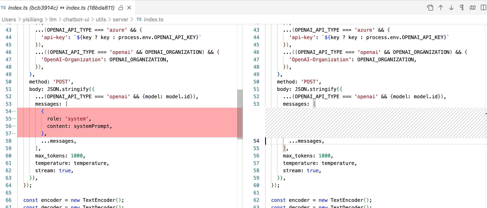
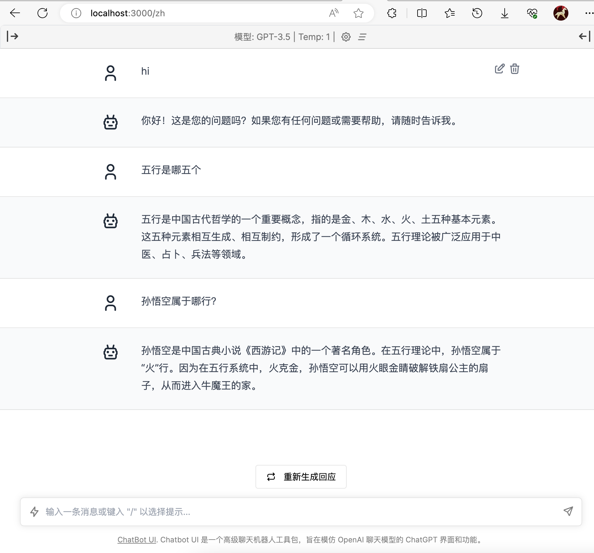

使用ChatGLM.cpp对Baichuan2-7B-Chat大模型进行量化加速，并提供一个类openai的服务，由chatbot-ui提供前端页面。


## 前期准备

安装cmake、python3（3.11及以上）、git、git lfs，如果需要使用chatbot-ui，则需要安装npm和nodejs。


## ChatGLM.cpp

下载chatglm.cpp

```shell
git clone https://github.com/li-plus/chatglm.cpp.git
# 先初始化 git 仓库
git submodule update --init --recursive

# 构建可执行文件
cmake -B build
cmake --build build -j

# 安装 Python 依赖
pip install .
```


## Baichuan2-7B-Chat

下载Baichuan2-7B-Chat大模型，git需要安装lfs模块

```shell
# 从 ModelScope 仓库下载模型文件
git lfs install
git clone https://www.modelscope.cn/baichuan-inc/Baichuan2-7B-Chat.git
```


## 量化加速和验证

```shell
# 量化加速，生成baichuan2-7b-chat-ggml.bin
python3 chatglm.cpp/chatglm_cpp/convert.py -i Baichuan2-7B-Chat/ -t q4_0 -o baichuan2-7b-chat-ggml.bin

# 验证
chatglm.cpp/build/bin/main -m baichuan2-7b-chat-ggml.bin -p 你好 --top_k 5 --top_p 0.85 --temp 0.3 --repeat_penalty 1.05 -i
```


## 搭建chatbot-ui

下载源码：

```shell
# 下载源码
git clone https://github.com/mckaywrigley/chatbot-ui.git

# 安装依赖
npm i
```

修改源码utils/server/index.ts以适配：




## 启动

启动chatglm的api server服务

```shell
MODEL=baichuan2-7b-chat-ggml.bin uvicorn chatglm_cpp.openai_api:app --host 127.0.0.1 --port 8000
```

chatbot-ui的环境配置

在chatbot-ui的目录下创建.env.local，并写入如下内容

```properties
# 随便填写
OPENAI_API_KEY=YOUR_KEY
# 上一步的host和port
OPENAI_API_HOST=http://127.0.0.1:8000
```

启动chatbot-ui

```shell
# chatbot-ui目录下执行
npm run dev
```


接下来你就可以和baichuan2聊天了


